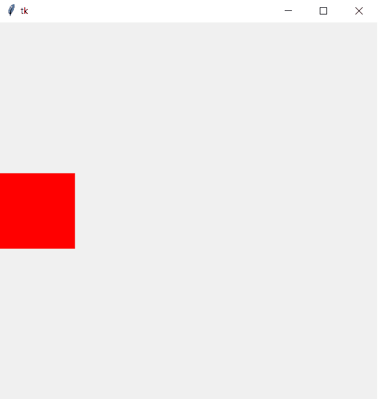
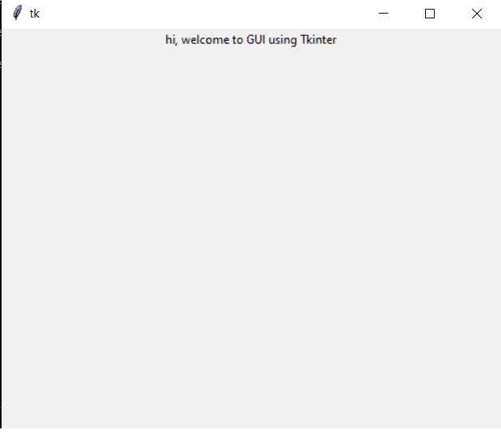
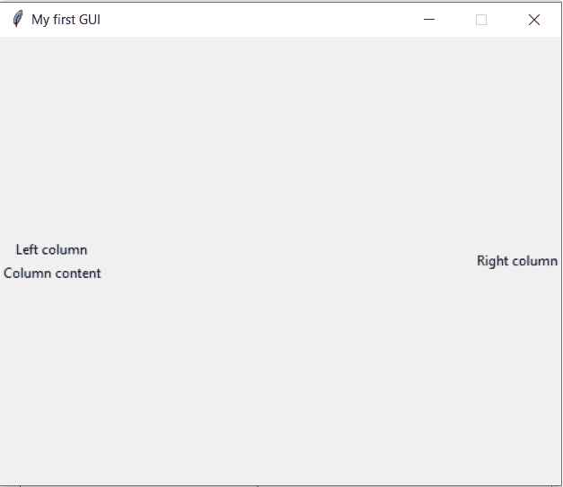

# Tkinter 框架和标签:简易参考

> 原文：<https://www.askpython.com/python-modules/tkinter/tkinter-frame-and-label>

在本文中，我们将讨论 Tkinter 框架和标签小部件。

## 让我们来谈谈 Tkinter 框架和标签小部件

我们将逐一查看这两个[小部件](https://www.askpython.com/python-modules/tkinter/tkinter-buttons),以了解基本原理

### 什么是 Tkinter 帧？

tkinter 中的框架是一个小部件，在屏幕上显示为一个矩形区域。这个小部件作为放置其他小部件的基础，例如标签、复选按钮、单选按钮等。Tkinter frame 窗口小部件基本上用于对屏幕上的其他窗口小部件进行分组。

框架不仅用于窗口小部件，还可以用于放置视频覆盖和其他外部过程。框架小部件有各种属性，如背景颜色、高度和宽度。

### 对 Tkinter 帧进行编码

下面是一个框架的例子。

```py
from tkinter import *

root=Tk()

frame = Frame(width=100, height=100, bg="red", colormap="new")
frame.pack(side=LEFT)

# set size of window
root.geometry('500x500')

# set an infinite loop so window stays in view
root.mainloop()

```



Output For Frame Example

输出左侧的小红框是我们创建的 tkinter 帧。让我们继续创建一个标签小部件。

### 什么是 Tkinter 标签？

Tkinter 提供了标签小部件，可以将任何文本或图像插入到框架中。Tkinter 允许在框架上显示几行文本，但是用户只能选择一种字体。

标签类似于典型的文本框，可以是任意大小。如果用户定义了大小，那么内容会在该大小内调整，如果没有，它会根据内容的长度自行调整。

标签有`foreground`和`background`字段来指定您选择的颜色。相同的语法如下所示。

```py
w = Label(root, text="Hey there", fg="red")

```

对于背景颜色，确保使用`bg`作为属性。

标签可用于显示照片图像和位图图像。下面也显示了它的语法。

```py
photo = PhotoImage(file="welcome.jpg")
w = Label(root, image=photo)
w.photo = photo

```

### 给标签编码

```py
from tkinter import *

root=Tk()

label1 = Label(root, text="hi, welcome to GUI using Tkinter")
label1.pack()

root.geometry('500x400')
root.mainloop()

```

上述代码的输出如下所示。



Output For Label Example

## 实现 Tkinter 框架和标签小部件

```py
from tkinter import *

root=Tk()

root.title("My first GUI")

# set resizing to false
root.resizable(width=FALSE, height=FALSE)

# set size of window
root.geometry('500x400')

leftFrame = Frame(root)
leftFrame.pack(side=LEFT)

rightFrame = Frame(root)
rightFrame.pack(side=RIGHT)

label1 = Label(leftFrame, text="Left column")
label1.pack()

label3 = Label(leftFrame, text="Column content")
label3.pack()

label2 = Label(rightFrame, text="Right column")
label2.pack()

# set an infinite loop so window stays in view
root.mainloop()

```

上述代码的输出如下所示。



Output For Hybrid Example

## 结论

关于使用 Tkinter 创建框架和标签的教程到此结束。试试这段代码，并在下面的评论区告诉我们你的反馈。