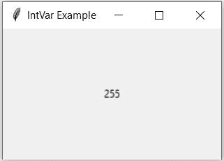

# Tkinter int var–带示例的 Tkinter 教程

> 原文:# t0]https://www . aspython . com/python-modules/tkinter-intvar/

大家好！在本教程中，我们将学习 Tkinter IntVar 函数，以及如何使用它在 Python 中存储、检索和管理整数变量。所以我们先从 IntVar()函数开始。

## Tkinter IntVar()函数

Tkinter 包含内置的编程类型，其工作方式类似于普通的 python 类型，具有用于更有效地操纵像`Label`和`Entry`这样的小部件的值的附加特性，这使得它们不同于 python 数据类型。这些变量还包含 getter 和 setter 方法来访问和更改它们的值。`IntVar`就是其中的一个例子。

使用`IntVar()`函数定义的变量保存整数数据，我们可以设置整数数据，也可以使用 getter 和 setter 方法检索它。这些变量可以传递给各种小部件参数，例如，单选按钮和复选框按钮的变量参数，标签小部件的 textvariable 参数等，我们将在示例中看到。一旦这些变量连接到小部件，连接就双向进行:如果 IntVar()变量发生变化，小部件的值也会自动更新为新值。

## 定义 Tkinter IntVar()变量

我们需要 Tkinter `IntVar()`函数，它采用以下参数来定义变量:

*   **主**:与`IntVar()`变量关联的窗口。如果没有指定，默认为根窗口。
*   **value** :赋予 integervariable 的初始值。默认值为 0。
*   **名称**:已定义变量的名称。默认值为 PY_VARnum(如 PY_VAR1、PY_VAR2 等)。

```py
import tkinter as tk

master_window = tk.Tk()
master_window.geometry("250x150")
master_window.title("IntVar Example")

integer_variable = tk.IntVar(master_window, 255)

label = tk.Label(master_window, textvariable=integer_variable, height=250)
label.pack()

master_window.mainloop()

```



Defining IntVar

## 更改 IntVar()变量的值

由于`IntVar()`是 Tkinter 构建的编程类型，它包含 setter 方法来改变它们的变量值。我们可以使用`set()`方法来改变整数数据的值。

```py
import tkinter as tk

master_window = tk.Tk()
master_window.geometry("250x150")
master_window.title("IntVar Example")

integer_variable = tk.IntVar(master=master_window, value=1)

label = tk.Label(master_window, textvariable=integer_variable, height=250)
label.pack()

integer_variable.set(100)

master_window.mainloop()

```

## 检索 IntVar()变量的值

我们可以对`IntVar()`变量使用`get()`方法来检索变量中的文本值。

```py
import tkinter as tk

master_window = tk.Tk()

int_var = tk.IntVar(master = master_window, value = 255)

num = int_var.get()

print(type(num))
print(num)

```

输出:

```py
<class 'int'>
255

```

## Tkinter IntVar()示例

让我们考虑一些 IntVar()不同用法的例子。

### 当 IntVar()变量数据改变时通知

每当`IntVar()`变量的值改变时，我们可以得到通知并执行一些任务。这是 Tkinter 定义的对象的一个有趣的特性，每当它的值为 read、updated 或 deleted 时都会得到通知。如果您想在对`IntVar()`变量进行某些操作时自动更新其他小部件，这个特性也很有帮助。

要在`IntVar()`对象上定义回调，我们可以在`IntVar()`对象上使用`trace()`方法，该方法有两个参数:

*   模式:对`IntVar()`对象的操作类型。
    *   `'write'`:值改变时调用回调
    *   `'read'`:读取值时调用回调
    *   `'unset'`:删除值时调用回调
*   回调:当对象上有操作时调用的方法。

让我们考虑一个简单的 2 个数和的例子，其中我们有 2 个输入部件来输入数字和一个显示 2 个数和的标签。每当 **[入口小部件](https://www.askpython.com/python-modules/tkinter/tkinter-entry-widget)** 和`IntVar()`变量改变时，总和将自动更新。

```py
import tkinter as tk

class SumOfTwoNumbers(tk.Tk):
  def __init__(self):
    super().__init__()
    self.title("Sum of 2 Numbers")
    self.geometry("300x300")

    # define IntVar() variables A and B
    self.A = tk.IntVar()
    self.B = tk.IntVar()

    # assign methods to notify on IntVar() variables
    self.A.trace_add("write", self.calculate_sum)
    self.B.trace_add("write", self.calculate_sum)

    self.create_widgets()

  def create_widgets(self):
    self.A_label = tk.Label(self, text="A: ")
    self.B_label = tk.Label(self, text="B: ")

    self.A_entry = tk.Entry(self, textvariable=self.A)
    self.B_entry = tk.Entry(self, textvariable=self.B)

    self.sum_label = tk.Label(self, text="Sum: ")
    self.result_label = tk.Label(self, text=self.A.get() + self.B.get())

    self.A_label.grid(row=0, column=0, padx=5, pady=5)
    self.A_entry.grid(row=0, column=1, padx=5, pady=5)
    self.B_label.grid(row=1, column=0, padx=5, pady=5)
    self.B_entry.grid(row=1, column=1, padx=5, pady=5)
    self.sum_label.grid(row=2, column=0, padx=5, pady=5)
    self.result_label.grid(row=2, column=1, padx=5, pady=5)

  def calculate_sum(self, *args):
    try:
      num_a = self.A.get()
    except:
      num_a = 0

    try:
      num_b = self.B.get()
    except:
      num_b = 0

    self.result_label['text'] = num_a + num_b

if __name__ == "__main__":
  app = SumOfTwoNumbers()
  app.mainloop()

```

其输出:

### 监视单选按钮和复选框小部件中的选定值

`IntVar()`变量的另一个常见应用是跟踪 RadioButton 和 CheckBox 小部件中选择的值，如下例所示:

```py
import tkinter as tk

class RadioButtonExample(tk.Tk):
  def __init__(self):
    super().__init__()
    self.title("Radio Button Example")
    self.geometry("300x300")

    # define IntVar() for selected value
    self.selected_value = tk.IntVar()

    self.create_widgets()

  def create_widgets(self):
    self.intro_label = tk.Label(
      self, 
      text="Choose your favourite language").pack()

    self.rb1 = tk.Radiobutton(
      self,
      text="Python",
      padx=5,
      pady=5,
      variable=self.selected_value,
      value=1).pack()

    self.rb2 = tk.Radiobutton(
      self,
      text="Java",
      padx=5,
      pady=5,
      variable=self.selected_value,
      value=2).pack()

    self.rb3 = tk.Radiobutton(
      self,
      text="C++",
      padx=5,
      pady=5,
      variable=self.selected_value,
      value=3).pack()

    self.rb4 = tk.Radiobutton(
      self,
      text="Dart",
      padx=5,
      pady=5,
      variable=self.selected_value,
      value=4).pack()

    self.text_label = tk.Label(
      self,
      text="Option selected is:",
      pady=15
    ).pack()

    self.value_label = tk.Label(
      self,
      textvariable=self.selected_value,
      padx=5,
      pady=5).pack()

if __name__ == "__main__":
  app = RadioButtonExample()
  app.mainloop()

```

其输出:

## 结论:

在本教程中，我们学习了 Tkinter `IntVar()`以及我们可以使用它的各种场景，它可以使我们的生活更轻松，但定义回调可以帮助我们自动更新其他小部件。

感谢阅读！！