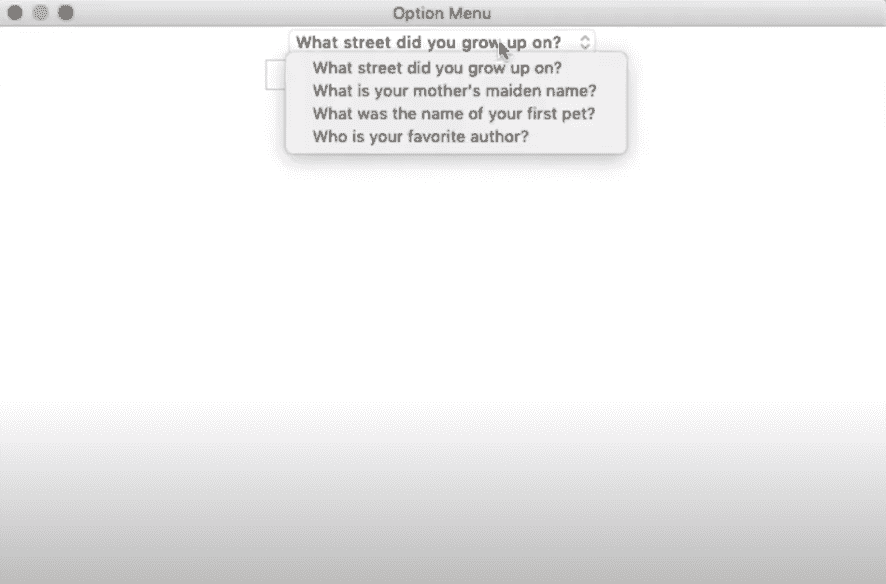

# Tkinter 列表框和选项菜单–如何使用列表框和选项菜单部件？

> 原文:# t0]https://www . aspython . com/python-modules/tkinter/tkinter-listbox-option-menu

嘿，伙计们，欢迎阅读这篇关于 Tkinter 列表框和使用 Tkinter 的选项菜单的文章。我将带你看一些同样的例子。

## 什么是列表框？

Tkinter 中的 **Listbox** 小部件广泛用于向用户显示一组项目。用户可以从这些项目中进行选择。

我们有基本的启动代码，我们总是得到，一个 400 x 400，我们有一个图标标题在那里。

```py
from tkinter import *

root=Tk()
root.title("Listbox demo")
root.geometry("400x480")

root.mainloop()

```

所以要创建一个列表框，你只需要像往常一样定义它，列表框就是一种带有 tkinter 的小部件。

## 创建您的第一个 Tkinter listbox 小部件

让我们创建一个列表框，我们称它为`my_listbox`，设置它等于一个`Listbox()`，并把它放入`root`。

我们将在屏幕上打包它，让我们给它一个`pack()`并给它一个“pady”15。

```py
#Listbox
my_listbox=Listbox(root)
my_listbox.pack(pady=15)

```

### 向列表框中单独添加项目

现在，为了把东西放进去，你可以用几种不同的方法。你可以手动完成，或者你可以创建一个列表，循环遍历列表，一次一个地把这些东西放进去。

我们将使用`my_listbox.insert`方法。这个方法有两个参数。有一个索引和一个字符串。

所以索引是索引号，我们列表框中的项目，我们想把它放进去的位置，第一个是' 0 '。

```py
# Add item to listbox

my_listbox.insert(END, "First")  
my_listbox.insert(END, "Second")

```

### 使用循环向 tkinter 列表框添加多个项目

让我们添加一个项目列表。所以我将只是`create my_list`，它将只是一个 [python 列表](https://www.askpython.com/python/list/python-list)，我们可以在这里放入任何我们想要的东西。所以我只要插入“一”、“二”和“三”就可以了。现在我们只需[循环](https://www.askpython.com/python/python-loops-in-python)列表，将每一项放入其中。

```py
my_list = ["One", "Two", "Three"]

for item in my_list:
	my_listbox.insert(END, item)

```

### **添加 Tkinter 按钮删除列表框项目**

现在我们知道了如何添加列表框条目，让我们创建一个[t inter 按钮](https://www.askpython.com/python-modules/tkinter/tkinter-buttons)来删除条目。

如果我们单击其中的一个项目，它们就会突出显示，所以让我们创建一个按钮。我们将它命名为 my_button，它将位于 root 中，并用 pady 10 打包`my_button`。

```py
my_button = Button(root, text="Delete", command=delete)     
my_button.pack(pady=10)

```

现在，我们需要创建一个`delete`函数。当你点击列表框中的某样东西时，它会变成锚点。所以，我们要删除锚点。

```py
def delete():
    my_listbox.delete(ANCHOR)
    my_label.config(text=" ")

```

### Tkinter Listbox 小部件实现的完整代码

```py
from tkinter import *

root=Tk()
root.title("Listbox demo")
root.geometry("400x480")

#Listbox
my_listbox=Listbox(root)
my_listbox.pack(pady=15)

# Add item to listbox

my_listbox.insert(END, "First")  
my_listbox.insert(END, "Second")

my_list = ["One", "Two", "Three"]

for item in my_list:
    my_listbox.insert(END, item)

def delete():
    my_listbox.delete(ANCHOR)
    my_label.config(text=" ")

my_button = Button(root, text="Delete", command=delete)     
my_button.pack(pady=10)

global my_label

my_label=Label(root, text=" ")
my_label.pack(pady=5)

root.mainloop()

```

上述代码的输出如下所示:


List Item

## 什么是选项菜单？

OptionMenu 类是一个助手类，它创建一个弹出菜单和一个按钮来显示它。这个小部件生成一个包含许多选项值的下拉列表。

让我们创建一个简单的选项菜单结构。

## 创建您的第一个 Tkinter 选项菜单

基于下拉菜单创建选项菜单。第一步是列出基本的安全问题。将它们传递到选项菜单中，并为答案创建一个条目。

首先，我们将创建问题列表。

```py
Question = [“What is your mother’s maiden name?”,
                    “ Who is your favorite author?”,
                    “ What was your first pets name? “,
                     “What street did you grow up on? “
] 

```

现在我们必须通过一个变量 tkvarq 来传递这些。为了理解 tk 变量的创建，第一个通过 barrier 的替代变量是 root，并使用 set()为该变量设置问题。

这是一个字符串变量 StringVar，我们将问题传递给它，如下所示:

```py
tkvarq = StringVar(root) 
tkvarq.set(questions[0])

```

### 创建 Tkinter OptionMenu 对象

通过创建一个对象`OptionMenu`来显示问题，并在创建的`answer_entry`文本框中输入答案。这个文本框是使用`Entry`类创建的。

```py
question_menu = OptionMenu(root,  tkvarq, *questions)
question_menu.pack()

#Answer entry
answer_entry = Entry(root, width=30)
answer_entry.pack()

```

### Tkinter OptionMenu 小部件实现的完整代码

```py
from tkinter import *
root = Tk()
root.title(“Option Menu”)
root.geometry(‘700x500’)

# Create the list of questions
# Pass them into an option menu
# Create an entry for the answer
# Create submit button

def print_answers():
       print (“Q: {}    A:  {} “,format(tkvarq.get(),  answer_entry.get()))
       return None 

Question = [“What is your mother’s maiden name?”,
                    “ Who is your favorite author?”,
                    “ What was your first pets name? “,
                     “What street did you grow up on? “
] 

tkvarq = StringVar(root) 
tkvarq.set(questions[0])
question_menu = OptionMenu(root,  tkvarq, *questions)
question_menu.pack()

#Answer entry
answer_entry = Entry(root, width=30)
answer_entry.pack()

#Submit button
submit_button = Button(root, test=’Submit’,  command=print_answers)
submit_button.pack()

root.mainloop()

```

这段代码生成一个包含问题的选项菜单。您可以选择一个您希望回答的问题，并在提供的文本框中填写您的答案。

请注意，此代码不包含验证，这意味着它不会告诉您输入的答案是否正确。

上述代码的输出如下所示:



Option Menu

## 结论

关于 Tkinter 列表框和选项菜单的教程到此结束。一定要尝试这些例子，并在下面的评论部分给出你的反馈。