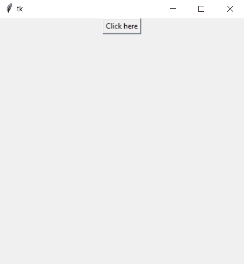
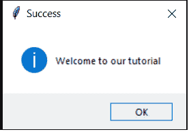
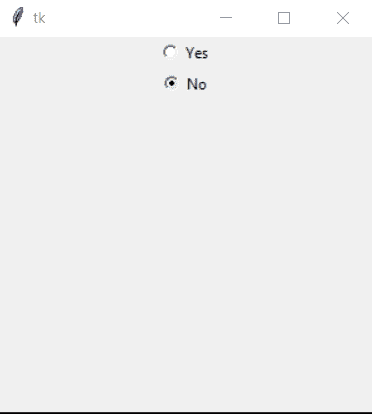

# Tkinter Messagebox 和 RadioButton:简单介绍

> 原文：<https://www.askpython.com/python-modules/tkinter/tkinter-messagebox-and-radiobutton>

在本文中，我们将研究 Tkinter Messagebox 和 Tkinter 的 Radiobutton 小部件。

*tkinter* 包(“Tk 接口”)是 Tk GUI 工具包的标准 Python 接口。它改进了 Python 应用程序的用户界面，并提供了大量可以从内置包中使用的小部件。

## 什么是 Tkinter messagebox？

messagebox 是应用程序的基本组件，用于向用户传达他/她的代码状态。基本上，它让编码者知道编码过程中的错误或成功。

它在许多内置函数的帮助下提供了这种功能。这些函数包括 showinfo、showwarning、showerror、askquestion、askokcancel、askyesno 和 askretryignore。

### Tkinter Messagebox 的基础知识

首先，我们将导入 [tkinter 模块](https://www.askpython.com/python-modules/tkinter/tkinter-canvas)以及 messagebox 函数。

然后，我们将指定窗口(框架)，并使用 Tk()将其命名为`root`。

```py
from tkinter import *
from tkinter import messagebox

root =Tk()

```

然后，我们将通过在`root`对象上实例化`geometry()`来指定框架的尺寸。

```py
root.geometry("400x400+120+120")
root.mainloop()

```

然后我们将使用 [Tkinter Button()窗口小部件](https://www.askpython.com/python-modules/tkinter/tkinter-buttons)定义一个名为`b`的按钮，该窗口小部件显示消息“点击此处”,点击该按钮将触发`call_me()`功能。然后，我们将使用`pack()`将小部件放置在框架的几何图形上。

```py
def call_me():
    messagebox.showinfo("Success","Welcome to our tutorial")

b = Button(root,text="Click here",command=call_me)
b.pack()

```

完整的代码如下所示:

```py
from tkinter import *
from tkinter import messagebox

def call_me():
    messagebox.showinfo("Success","Welcome to our tutorial")

root =Tk()

b = Button(root,text="Click here",command=call_me)
b.pack()

root.geometry("400x400+120+120")
root.mainloop()

```

输出如图所示。因此，一旦你点击“点击这里”按钮，名为“成功”的警告框显示消息“欢迎来到我们的教程”。点击“确定”按钮，该框消失。



Output 1



Success Message

## Tkinter 单选按钮

单选按钮是一个 tkinter 小部件，用于在几个给定的多项选择中进行选择。还记得在多项选择题 GUI 中看到过这个吗？

### 为什么应该使用单选按钮？

1.  它们对用户来说更快，因为他们可以通过一次点击而不是两次点击来做出更快的选择。典型的点击需要 1.2 到 2.4 秒。
2.  它们提供了更好的控件自文档，无需点击任何东西。
3.  对于触摸界面，点击单选按钮比浏览下拉列表更容易。
4.  您可以一起提供所有的选择(就可访问性而言)

### 创建简单单选按钮

为了创建一个单选按钮，我们将使用 python 的 tkinter 模块。让我们看一下相同的编码。

```py
from tkinter import *

root =Tk()

r1=Radiobutton(root, text="Yes", value=1)
r2=Radiobutton(root, text="No", value=2)
r1.pack()
r2.pack()

root.geometry("300x300+120+120")
root.mainloop()

```

在上面的代码片段中，我们首先导入`tkinter`模块，并使用`Tk()`初始化一个 tkinter 帧。在这个框架`root`中，我们使用`Radiobutton()`函数创建了两个单选按钮，该函数接受框架名称、文本和值等参数。然后我们使用`pack()`函数将这个小部件设置成行和列。

上述代码片段的输出如下所示:



Radiobutton Output

## 结论

这就是我们关于 Tkinter Messagebox 和 Radiobuttons 的教程的结尾。Tkinter 模块非常庞大，我们想让你很容易理解。因此，请关注 Tkinter 教程页面，了解更多信息！

## 参考

[https://docs.python.org/3.9/library/tkinter.messagebox.html](https://docs.python.org/3.9/library/tkinter.messagebox.html)