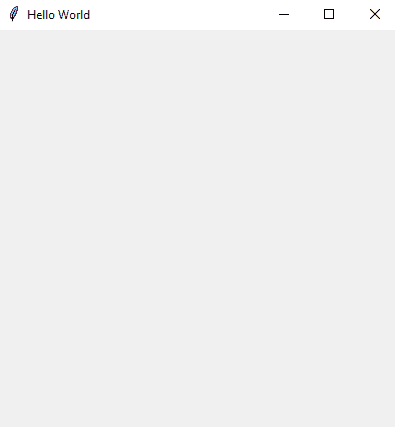
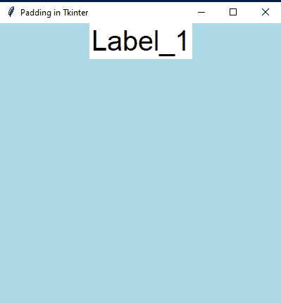
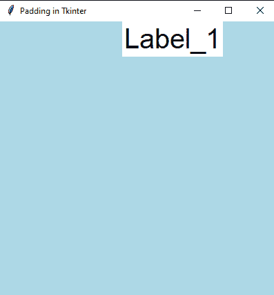
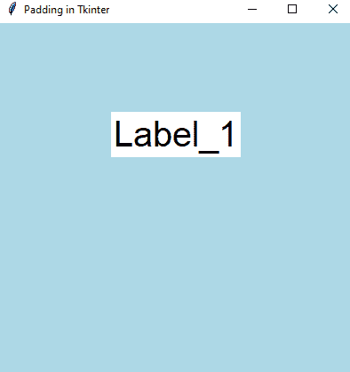

# Tkinter 教程-为你的窗户添加衬垫

> 原文：<https://www.askpython.com/python-modules/tkinter/tkinter-padding-tutorial>

嘿皮托尼斯！在本文中，我们将学习一些 GUI 基础知识。Python 有许多支持 GUI 开发并同时保持代码简单性的库。其中一个就是 **Tkinter** 。最棒的是 Python 也是由这个包驱动的。学习和实现都非常简单。我们可以制作很酷的 GUI 项目和应用程序。

### **Tkinter 中 GUI 应用的基本参数**

*   Tkinter 中的 GUI 应用运行在三个方面:
*   作为根的包的实例-***“root = Tk()”***。
*   应用程序的几何图形–屏幕宽度和屏幕高度-***“root . geometry(宽度 x 高度)”***
*   **主循环()–**保持应用程序在屏幕上运行，直到它被关闭。

### 创建一个简单的 Tkinter 窗口

在本节中，我们将使用 Tkinter 创建一个标题为**“Hello World”**的简单窗口。这样也就把上面的理论都搞清楚了。

**代码:**

```py
from tkinter import * # importing the package
root = Tk() # creating a root that acts as an instance
root.title("Hello World") # setting up the title of window
root.geometry("400x400") # giving the window its height and width
root.mainloop() # the mainloop

```

**输出:**



A basic Tkinter window

这只是一个标题为**“Hello World”**的空白窗口。所以，为了让它更漂亮，让我们添加一些小部件。

## 在 Tkinter 窗口中添加填充

**填充是将小部件放置在二维 GUI 根窗口中。**这有助于我们根据需要调整它们。

现在，我们必须考虑窗口是如何容纳所有小部件的。在计算机图形学中，在屏幕上表示一个点的最小单位是像素。如果我们能在空白屏幕上看到一个白点，那么它的度量就是一个像素。**在手机、电脑、笔记本电脑上呈现在我们面前的图像是各种彩色像素的组合调整。**

*   **padx** :将 widget 放置在 x 轴的窗口中。
*   **pady** :将 widget 放置在 y 轴的窗口中。

### **添加 padx 参数**

Tkinter 中的**标签**是具有 **padx** 和 **pady** 参数的部件之一。让我们看一个例子:

**代码:** ***无任何填充***

```py
from tkinter import *

# basic setup
window = Tk()
window.title("Padding in Tkinter")
window.geometry("400x400")
window.config(background = "Light Blue") 

# creating a label widget
label_1 = Label(window, 
                text = "Label_1",
                bg = "white",
                fg = "black",
                font = ("Arial", 30))
label_1.pack()

# tkinter's mainloop 
window.mainloop()

```

**输出:**



Placing the label widget without padding

**说明:**

*   在前六行代码中，这是 Tkinter 的基本设置。
*   下一步是我们创建一个标签小部件的实例。
    *   给显示器**文本** as = "Label_1
    *   使用 **bg** 参数将背景颜色调整为白色。
    *   使用 **fg** 将前景或文本颜色作为块。
    *   设置字体样式为 **Arial** ，文字大小为 **30** 。
*   若要显示标签，请调用 pack()方法。

因此，默认情况下，Tkinter 将标签放在窗口的中央。

**代码:*带 padx***

```py
from tkinter import *

window = Tk()
window.title("Padding in Tkinter")
window.geometry("400x400")
window.config(background = "Light Blue")

label_1 = Label(window, 
                text = "Label_1",
                bg = "white",
                fg = "black",
                font = ("Arial", 30))
label_1.pack(padx = (100, 0))

window.mainloop()

```

**输出:**



Placing the label widget with padding

现在我们可以看到，当我们设置 padx = (100，0)时，它有点偏离中心。

### **添加 pady 参数**

此选项会将我们的标签放置或移动到离窗口上边距稍远的地方。我们只需更改参数，其余代码保持不变。

**代码:**

```py
from tkinter import *

window = Tk()
window.title("Padding in Tkinter")
window.geometry("400x400")
window.config(background = "Light Blue")

label_1 = Label(window, 
                text = "Label_1",
                bg = "white",
                fg = "black",
                font = ("Arial", 30))
label_1.pack(pady = 100)

window.mainloop()

```

**输出:**



Padding with **“pady”** parameter

这里我们可以看到 y 坐标发生了填充。标签在窗口上有了新的位置。

### **更多理解的示例代码**

您可以使用 Tkinter 中的**按钮**尝试一些代码，并检查填充是否适用于它们。

**代码 1:**

```py
from tkinter import *

window = Tk()
window.title("Padding in Tkinter")
window.geometry("400x400")
window.config(background = "Light Blue")

button = Button(window, 
                text = "Click me",
                bg = "white",
                fg = "red",
                border = 10,
                font = ("Arial", 30))

button.pack(padx = 100)

window.mainloop()

```

代码 2:

```py
from tkinter import *

window = Tk()
window.title("Padding in Tkinter")
window.geometry("400x400")
window.config(background = "Light Blue")

button = Button(window, 
                text = "Click me",
                bg = "white",
                fg = "red",
                border = 10,
                font = ("Arial", 30))

button.pack(pady = 40)

window.mainloop()

```

## 结论

就这样，我们结束了。Tkinter 是 Python 中一个非常简单但功能强大的模块，随着 Python 新版本的推出，它有了很多改进。Padding 就是其中之一。我希望这有助于您编写 GUI 程序。