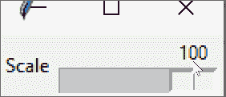
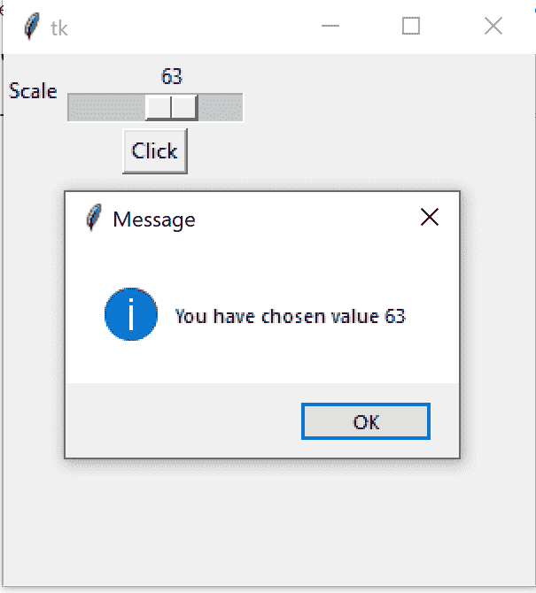

# 使用 Tkinter 缩放微件

> 原文：<https://www.askpython.com/python-modules/tkinter/tkinter-scale-widget>

大家好！在我们的 [Tkinter 教程](https://www.askpython.com/python-modules/tkinter)的这一部分，我们将介绍另一个小部件——Tkinter**比例小部件**。

如果您想在应用程序上显示任何类型的比例，这是一个非常有用的小部件。

我们将通过一个简单的例子来演示如何使用这个小部件。我们开始吧！

* * *

## 基本 Tkinter 缩放微件选项

当我们希望用户输入一个限定在一定范围内的数值时，我们可以使用这个小部件。

用户可以在标尺上移动，并为输入选择合适的值。

要使用它，基本选项的格式如下:

```py
scale_widget = tk.Scale(master, from_, to, orient)

```

这里，`master`是 Tkinter 主对象，它是任何 Tkinter GUI 应用程序运行所必需的。

`from_`和`to`关键字参数指定滑块值的范围。

最后，方位`orient`可以是“水平”也可以是“垂直”。

还有一个名为`resolution`的可选参数，它指定值的数值分辨率。

例如，默认分辨率为 1，这将确保所有值都四舍五入为最接近的整数。您可以根据需要调整这个参数。

要使用 Tkinter scale 小部件的当前值，只需调用`scale_widget.get()`。而要设置 Tkinter scale 小部件，可以调用`scale_widget.set(value)`。

现在让我们看一个例子来说明这意味着什么。

* * *

## 使用 Tkinter Scale 小部件–为我们的应用程序构建一个比例

让我们为我们的虚拟应用程序构建一个水平标度，它由从 0 到 100 的整数值组成。

这意味着数值分辨率为 1。

```py
import tkinter as tk
from tkinter import messagebox

# Create the master object
master = tk.Tk()

# Create a Scale Widget
scale_widget = tk.Scale(master, orient="horizontal", resolution=1,
                        from_=0, to=100)

# And a label for it
label_1 = tk.Label(master, text="Scale")

# Use the grid geometry manager to put the widgets in the respective position
label_1.grid(row=0, column=0)
scale_widget.grid(row=0, column=1)

# The application mainloop
tk.mainloop()

```

**输出**



Scale Example 1

好吧！这按预期工作，我们的 Tkinter scale 小部件显示从 0 到 100 的值。

现在让我们向应用程序添加一个按钮小部件。

当我们在设置比例值后单击按钮时，我们将调用一个函数来输出一个消息框警告，它将显示我们选择的值。

让我们将按钮小部件添加到程序中。

```py
button = tk.Button(master, text="Click", command=buttonCallback)
button.grid(row=1, column=1)

```

这里，`command`参数指定了当这个按钮被点击时将被调用的函数。

我们将调用一个名为`buttonCallback`的函数，它为我们处理这个事件。

```py
def buttonCallback():
    global scale_widget
    messagebox.showinfo("Message", "You have chosen value {}".format(scale_widget.get()))

```

我在全局范围内使用了`scale_widget`，这样我们就可以使用`scale_widget.get()`获得值。该值将打印在消息框上。

作为补充，我还将使用`master.geometry()`将默认的框架大小从标准的“200×200”增加到更大的“300×300”窗口。

```py
master.geometry("300x300")

```

我现在将发布完整的代码。

```py
import tkinter as tk
from tkinter import messagebox

# Create the master object
master = tk.Tk()

master.geometry("300x300")

# Create a Scale Widget
scale_widget = tk.Scale(master, orient="horizontal", resolution=1,
                        from_=0, to=100)

# And a label for it
label_1 = tk.Label(master, text="Scale")

# Use the grid geometry manager to put the widgets in the respective position
label_1.grid(row=0, column=0)
scale_widget.grid(row=0, column=1)

def buttonCallback():
    global scale_widget
    messagebox.showinfo("Message", "You have chosen value {}".format(scale_widget.get()))

button = tk.Button(master, text="Click", command=buttonCallback)
button.grid(row=1, column=1)

# The application mainloop
tk.mainloop()

```

现在，让我们看看输出。



Tkinter Scale Example

的确，当你点击按钮，设置好刻度值后，显示的是正确的数字！

* * *

## 结论

在本教程中，我们学习了如何使用 Tkinter Scale 小部件。

在接下来的文章中，我们将介绍更多的小部件，请继续关注！

* * *