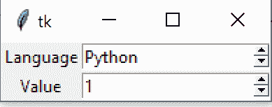
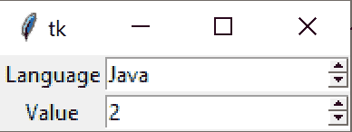
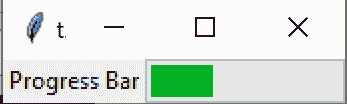
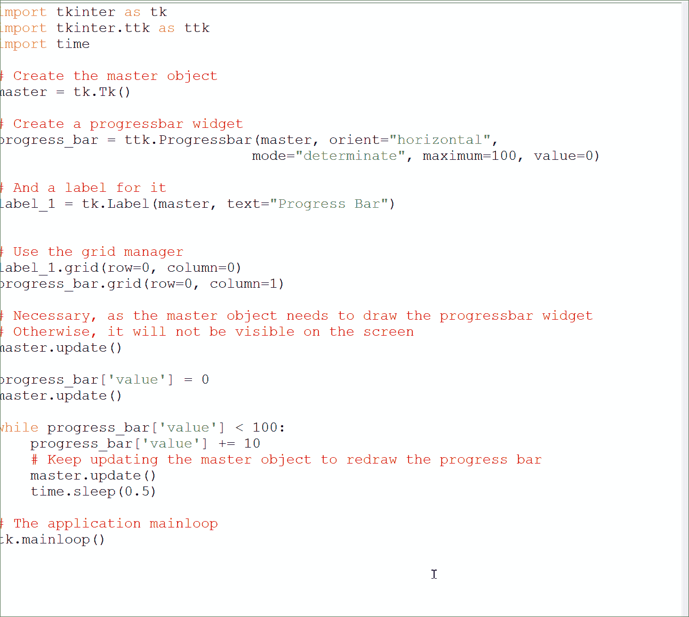

# Tkinter Spinbox 和 Progressbar 小工具

> 原文：<https://www.askpython.com/python-modules/tkinter/tkinter-spinbox-and-progressbar-widgets>

大家好！在这个关于 Tkinter 的系列教程中，我们将学习 Tkinter Spinbox 和 Progressbar 小部件。我们将继续探索更多可以添加到应用程序中的小部件。

让我们使用说明性的示例，逐一查看它们！

* * *

## 使用 Tkinter Spinbox 小部件

Tkinter **Spinbox** 小部件是一个允许我们从一组固定值中进行选择的小部件。

还记得 [Tkinter Entry widget](https://www.askpython.com/python-modules/tkinter/tkinter-entry-widget) 吗？假设您希望限制最终用户只能从有限的选项集中进行选择，这在这里没有多大用处！

您更希望有一组固定的选项可供选择，而这正是 Spinbox 小部件给我们提供的！

现在让我们来看看如何使用它。

这与我们的入口小部件几乎相同，但是您在名为`values`的可选参数下指定值列表，该参数是一个 **[元组](https://www.askpython.com/python/tuple/python-tuple)** 。

```py
spin_box = tk.Spinbox(master, values)

```

如果您的值在整数/等之间，您也可以使用`from_`和`to`参数指定一个值范围。

**注意**:由于`from`是一个保留的 Python 关键字，因此`from_`关键字参数的末尾有一个下划线。

```py
spin_box = tk.Spinbox(master, from_, to)

```

现在让我们制作一个简单的应用程序，它有一个 spinbox 小部件，带有一些预定义的选项。

我们将使用[网格几何形状](https://www.askpython.com/python-modules/tkinter/python-tkinter-grid-example)管理器将我们的小部件放置在合适的位置。

我们还会给每个小部件一个标签，以便其他人可以使用一些文本来识别它。

```py
import tkinter as tk

# Create the master object
master = tk.Tk()

# Create a spinbox widget
spinbox_1 = tk.Spinbox(master, values=("Python", "Java", "C++"))

# And a label for it
label_1 = tk.Label(master, text="Language")

# Create another spinbox widget
spinbox_2 = tk.Spinbox(master, from_=1, to=3)

# And a label for it
label_2 = tk.Label(master, text="Value")

# Use the grid geometry manager to put the widgets in the respective position
label_1.grid(row=0, column=0)
spinbox_1.grid(row=0, column=1)

label_2.grid(row=1, column=0)
spinbox_2.grid(row=1, column=1)

# The application mainloop
tk.mainloop()

```

**输出**



Spinbox Entry 1



Spinbox Entry 2

如果您自己运行这个程序，您会发现您可以从我们上面提供的特定列表中调整 spinbox 小部件的值！

关于这个小部件的更多参数和调整，您可以查看官方文档。

现在让我们看看 ProgressBar 小部件！

* * *

## 使用 Progressbar 小部件

Progressbar 小部件显示任何长时间运行的操作的状态。

假设您想要可视化任何事情的进度需要多长时间，您可以使用 Progressbar！

这在`tkinter.ttk`模块中可用，因此您必须单独导入。

```py
import tkinter as tk
# Necessary for the Progressbar widget
import tkinter.ttk as ttk

```

我们将通过简单的选项来看看如何使用它。你可以在这里看完整列表[。](https://docs.python.org/3/library/tkinter.ttk.html#progressbar)

```py
progress_bar = ttk.Progressbar(orient, mode, maximum, value)

```

这里，`orient`指定了进度条的方向。它可以是“水平的”或“垂直的”

该小工具可以在两个`mode`秒内运行:

*   “确定”->显示相对于工作总量的完成量
*   “不确定”->简单地显示一个动画显示来表明工作正在进行。

进度条将一直持续到当前的`value`到达`maximum`为止。

要开始递增 progressbar 的值，我们必须使用`progress_bar.start(interval)`，它会每隔`interval`毫秒自动为您递增。

我们将把它保持为`None`，它将被设置为默认值 50 毫秒

```py
progress_bar.start(interval=None)

```

我们现在将使用`step()`方法确保该值以`amount = 10`递增。

```py
progress_bat.step(amount=10)

```

我会把完整的代码张贴到现在。

```py
import tkinter as tk
import tkinter.ttk as ttk

# Create the master object
master = tk.Tk()

# Create a progressbar widget
progress_bar = ttk.Progressbar(master, orient="horizontal",
                              mode="determinate", maximum=100, value=0)

# And a label for it
label_1 = tk.Label(master, text="Progress Bar")

# Use the grid manager
label_1.grid(row=0, column=0)
progress_bar.grid(row=0, column=1)

# Start auto-incrementing periodically
progress_bar.start()
progress_bar.step(10)

# The application mainloop
tk.mainloop()

```

输出



Progress Bar 1

你得到一个移动的进度条！

这使得`value`每 50 毫秒从 0 到 100 递增 10 个单位。

## 但是我们使用的方法正确吗？

但是这里的问题是进度条在到达`maximum`后再次重置为 0。

为了避免这种情况，我们必须`stop()`进度条。

但是我意识到这也产生了比我想象的更多的问题，因为那时，我不能得到一个更新的进度条。

最大的问题是我们的主应用程序运行在`tk.mainloop()`函数中。因此，所有这些都必须预先计算，以便实时运行。

所以，在谷歌搜索了几次后，我发现使用`start()`和`stop()`是**而不是**的正确方法，因为它从来没有说进度条是如何重绘的。

因此，唯一剩下的解决方案(可悲的)是我们自己手动更新 Progressbar 的`value`。

这似乎确实是其他 Tkinter 程序员看到 StackOverflow 帖子上的内容后得出的结论。现在让我们继续！

## 我们自己修改小部件值

为此，所有 Tkinter 小部件都有字典属性，我们可以修改这些属性！是的，就这么简单。

只需更新 progressbar 值，使用:

```py
progress_bar['value'] = 0
master.update()

```

然而，我们还必须使用`master.update()`告诉`master`对象这个小部件已经用新值更新了。

现在，我们将重写旧的和不正确的代码来考虑这些变化。

```py
import tkinter as tk
import tkinter.ttk as ttk
import time

# Create the master object
master = tk.Tk()

# Create a progressbar widget
progress_bar = ttk.Progressbar(master, orient="horizontal",
                              mode="determinate", maximum=100, value=0)

# And a label for it
label_1 = tk.Label(master, text="Progress Bar")

# Use the grid manager
label_1.grid(row=0, column=0)
progress_bar.grid(row=0, column=1)

# Necessary, as the master object needs to draw the progressbar widget
# Otherwise, it will not be visible on the screen
master.update()

progress_bar['value'] = 0
master.update()

while progress_bar['value'] < 100:
    progress_bar['value'] += 10
    # Keep updating the master object to redraw the progress bar
    master.update()
    time.sleep(0.5)

# The application mainloop
tk.mainloop()

```

现在，当我们通过自己更新小部件的值来做所有艰苦的工作时，我们有了更多的控制权。

这段代码现在应该能够显示进度条的连续序列，当`value`达到 100 时停止。

下面是一个简单的 GIF 图，说明了这个程序的工作原理。



Progress Bar GIF

* * *

## 结论

最后，我们已经到了使用 Tkinter Spinbox 和 Progressbar 小部件的教程的末尾。希望您已经理解了为您的 GUI 应用程序添加更多功能的步骤！

更多 Tkinter 内容即将推出，敬请关注！

* * *