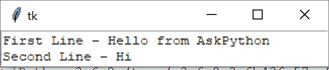
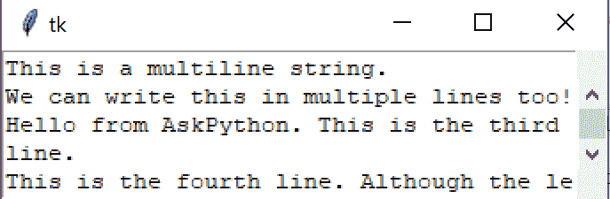
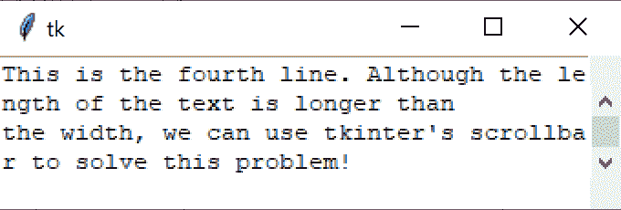

# 带有 Tkinter 滚动条的 Tkinter 文本小部件

> 原文：<https://www.askpython.com/python-modules/tkinter/tkinter-text-widget-tkinter-scrollbar>

大家好。在我们的 [Tkinter 教程](https://www.askpython.com/python-modules/tkinter)部分的这一部分，我们将看看 Tkinter 文本小部件。

虽然我在之前的教程中使用了面向对象的方法，但是现在我们将会看到单个的小部件示例，如果我直接使用这个模块的话会更简单。

因此，我将在这里直接使用 Tkinter，而没有显式的`Application`类。

现在，让我们开始吧！

* * *

## Tkinter 文本小工具

这是一个允许我们在应用程序中轻松查看文本对象的小部件。例如，如果您想在 GUI 上显示一些行，我们可以很容易地使用文本小部件来实现我们的目标。

让我们看看怎么做。

要创建文本小部件，只需使用`tk.Text(master, width, height)`方法，其中`master`是 GUI 应用程序的主对象(使用`tk.TK()`)。

然后我们可以使用`text_widget.insert()`方法添加文本。

```py
import tkinter as tk

# Create our master object to the Application
master = tk.Tk()

# Create the text widget for two lines of text
text_widget = tk.Text(master, height=2, width=40)

# Pack it into our tkinter application
text_widget.pack()

# Insert text into the text widget
# tk.END specifies insertion after the last character in our buffer
text_widget.insert(tk.END, "First Line - Hello from AskPython\nSecond Line - Hi")

# Start the mainloop
tk.mainloop()

```

**输出**



Tkinter Text Widget 1

事实上，我们的文本小部件中似乎有两行文本！

## 向我们的文本小部件添加滚动条

虽然上面的输出适用于较小的文本，但是如果我们的文本大小本身大于宽度呢？

我们可以使用 Tkinter 的滚动条，并将其添加到我们的文本小部件中。现在，添加滚动条后，我们应该能够正确显示更大的文本。

要创建滚动条对象，使用`tk.Scrollbar()`并将其添加到我们的应用程序中！现在，在您将它打包到应用程序之后，我们可以使用滚动文本小部件来显示更长的文本！

```py
import tkinter as tk

# Create our master object to the Application
master = tk.Tk()

# Create the text widget
text_widget = tk.Text(master, height=5, width=40)

# Create a scrollbar
scroll_bar = tk.Scrollbar(master)

# Pack the scroll bar
# Place it to the right side, using tk.RIGHT
scroll_bar.pack(side=tk.RIGHT)

# Pack it into our tkinter application
# Place the text widget to the left side
text_widget.pack(side=tk.LEFT)

long_text = """This is a multiline string.
We can write this in multiple lines too!
Hello from AskPython. This is the third line.
This is the fourth line. Although the length of the text is longer than
the width, we can use tkinter's scrollbar to solve this problem!
"""

# Insert text into the text widget
text_widget.insert(tk.END, long_text)

# Start the mainloop
tk.mainloop()

```

**输出**



Tkinter Scroll 1



Tkinter Scroll 2

您可以看到右边的滚动条，由左边的文本小部件支持。

希望您可以在此基础上向您的 GUI 应用程序添加更多的小部件，并使其更加有趣！

* * *

## 结论

在本教程中，我们学习了如何在 Tkinter 应用程序中添加简单的文本小部件，并添加滚动条来支持更大的文本。

在我们即将发布的 Tkinter 教程中，请继续关注更多的部件！

* * *