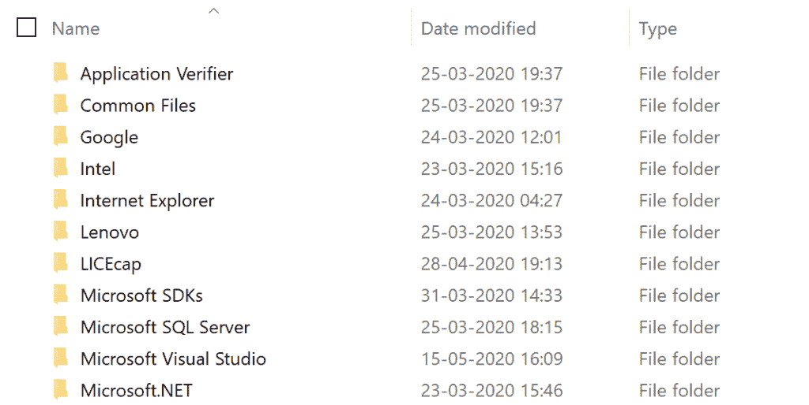
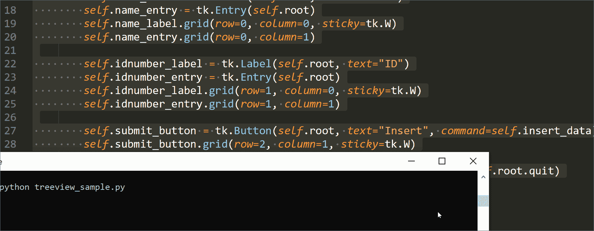
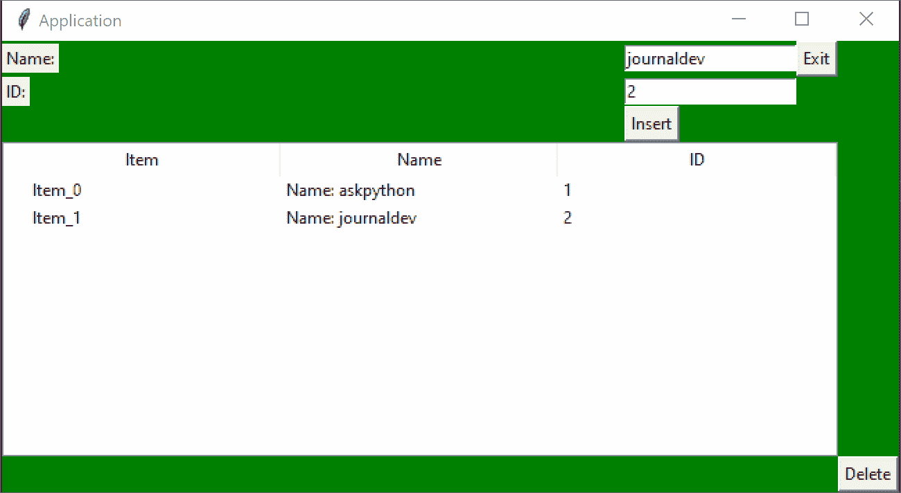

# Tkinter TreeView 部件

> 原文：<https://www.askpython.com/python-modules/tkinter/tkinter-treeview-widget>

又见面了！作为我们的 [Tkinter 教程系列](https://www.askpython.com/python-modules/tkinter)的一部分，今天的帖子将涵盖 TreeView 小部件。

如果您想要显示项目的层次结构，并且所有属性都并排列出，那么 TreeView 小部件非常有用。

例如，如果您想构建一个看起来像 Windows 文件资源管理器的应用程序，我们可以使用 Tkinter 的 TreeView 小部件来实现。



Windows File Explorer 1

因此，TreeView 允许我们做的是构建一个类似树的结构，并相应地插入项目及其属性。

您可以在需要时动态地添加或删除树中的节点，因此这对于许多 GUI 应用程序非常有用。

我们可以根据自己的喜好来构造树。

如果您想要复制文件资源管理器，您应该创建一个包含文件及其属性的树形视图，并添加嵌套文件和文件夹作为父文件夹的子文件夹！

虽然我们不会做这个练习，但我建议你自己尝试一下，这样你就能很好地理解`TreeView`是如何工作的。

现在让我们看看如何构造一个树形视图小部件，并对其执行操作——比如插入和删除。

* * *

## 构建一个 TreeView 小部件

TreeView 小部件属于`tkinter.ttk`模块，所以我们必须导入它。

```py
import tkinter.tk as ttk

```

现在，我们可以将小部件称为`ttk.TreeView()`。

要创建新的 TreeView 小部件，语法很简单。

```py
tree = ttk.Treeview(master, columns)

```

这里，`tree`对应新形成的树的根节点。这里，`master` 指的是主 Tkinter 应用主节点。

`columns`是一个元组，指的是列的名称。

例如，我们可以像这样构造一个 TreeView 小部件，具有“Name”和“ID”列:

```py
tree = ttk.Treeview(master, columns=("Name", "ID"))

```

该树将使用`master`作为基础小部件来构建。通常，您会希望它成为应用程序的主要主对象:

```py
master = tk.Tk()

```

现在，虽然我们有了一个 TreeView 小部件，但是显示它是没有意义的，因为它是空的。

让我们首先插入一些对象，这样我们就可以在实际应用程序中查看 TreeView。

请记住，TreeView 节点的行仅由字符串组成，如下所示:

```py
"Label" , "Hello", "Second Col", "Third Col"

```

现在，让我们向新构建的树形视图中插入一些节点。

## 插入到树视图

插入语法非常简单。我们获取 TreeView 对象，并插入一些用`text`标记的`values`。我们还可以使用`iid`参数为节点指定一个惟一的 ID。

```py
tree.insert(parent, index, iid, text, values)

```

这里，我们将节点插入到`parent`。如果您想让`parent`小部件作为主(根)节点，我们可以将其设置为空字符串(")。否则，我们必须提到一个现有父节点的`iid`。

使用`index`引用该节点的子编号。

例如，如果您想在第一个孩子处插入，您可以指定`index=0`。如果想插在最后，可以提一下特殊值`'end'`。

```py
tree.insert(parent='', index='end', iid=0, text="Label", values=("Hello", "Second Col", "Third Col"))

```

上面是一个插入到根节点末尾的示例，其值如下行所示:

```py
"Label" , "Hello", "Second Col", "Third Col"

```

不幸的是，没有一种简单的方法来构建 TreeView，因为您需要其他小部件来正确地可视化输出。

在继续下一步之前，请确保您已经阅读了我们关于 [Tkinter 按钮](https://www.askpython.com/python-modules/tkinter/tkinter-buttons)、[网格管理器](https://www.askpython.com/python-modules/tkinter/python-tkinter-grid-example)和 [Tkinter 入口](https://www.askpython.com/python-modules/tkinter/tkinter-entry-widget)小部件的教程部分。

我将提供一个示例应用程序来可视化输出，使用这些小部件:

```py
import tkinter as tk
import tkinter.ttk as ttk

class Application(tk.Frame):
    def __init__(self, root):
        self.root = root
        self.initialize_user_interface()

    def initialize_user_interface(self):
        # Configure the root object for the Application
        self.root.title("Application")
        self.root.grid_rowconfigure(0, weight=1)
        self.root.grid_columnconfigure(0, weight=1)
        self.root.config(background="green")

        # Define the different GUI widgets
        self.name_label = tk.Label(self.root, text="Name:")
        self.name_entry = tk.Entry(self.root)
        self.name_label.grid(row=0, column=0, sticky=tk.W)
        self.name_entry.grid(row=0, column=1)

        self.idnumber_label = tk.Label(self.root, text="ID")
        self.idnumber_entry = tk.Entry(self.root)
        self.idnumber_label.grid(row=1, column=0, sticky=tk.W)
        self.idnumber_entry.grid(row=1, column=1)

        self.submit_button = tk.Button(self.root, text="Insert", command=self.insert_data)
        self.submit_button.grid(row=2, column=1, sticky=tk.W)

        self.exit_button = tk.Button(self.root, text="Exit", command=self.root.quit)
        self.exit_button.grid(row=0, column=3)

        # Set the treeview
        self.tree = ttk.Treeview(self.root, columns=('Name', 'ID'))

        # Set the heading (Attribute Names)
        self.tree.heading('#0', text='Item')
        self.tree.heading('#1', text='Name')
        self.tree.heading('#2', text='ID')

        # Specify attributes of the columns (We want to stretch it!)
        self.tree.column('#0', stretch=tk.YES)
        self.tree.column('#1', stretch=tk.YES)
        self.tree.column('#2', stretch=tk.YES)

        self.tree.grid(row=4, columnspan=4, sticky='nsew')
        self.treeview = self.tree

        self.id = 0
        self.iid = 0

    def insert_data(self):
        self.treeview.insert('', 'end', iid=self.iid, text="Item_" + str(self.id),
                             values=("Name: " + self.name_entry.get(),
                                     self.idnumber_entry.get()))
        self.iid = self.iid + 1
        self.id = self.id + 1

app = Application(tk.Tk())
app.root.mainloop()

```

在这里，我为输入创建了一些标签和条目。我还创建了一个树形视图，由两部分组成:

*   树形视图标题(显示列名)
*   TreeView 列和`insert_data()`方法

每当我们按下“插入”按钮时，就会在 TreeView 小部件上调用`insert_data()`方法。

现在，说够了。现在让我们测试我们的程序插入！



Treeview Example

好的，这看起来很有效！现在让我们添加一个删除按钮，这样我们就可以删除选中的行。

* * *

## 从树视图中删除行

有一种方法我们可以利用。这将从 TreeView 小部件中删除相应的节点(在我们的例子中是行)。

```py
tree.delete(iid)

```

这只是获取节点的`iid`标识号，并将其从 TreeView 中删除！

我们将用一个叫做`delete_data()`的方法来总结这一点。

现在，最大的问题是我们如何从 TreeView 小部件中获得我们的行的 id 号。

嗯，这取决于*你将如何*执行删除操作。

每当我们用鼠标选中某一行时，我们就会删除该行。在该行突出显示后，我们可以按 delete 按钮，这将把它从`TreeView`小部件中删除。

为此，我们将使用`TreeView.focus()`方法来获取行的`iid`(作为一个字符串)。我们可以用这个直接删除那一行！

```py
    def delete_data(self):
        row_id = int(self.tree.focus())
        self.treeview.delete(row_id)

```

让我们添加一个删除按钮，并使用这个方法作为回调函数！

添加后，应用程序将如下所示:

```py
import tkinter as tk
import tkinter.ttk as ttk

class Application(tk.Frame):
    def __init__(self, root):
        self.root = root
        self.initialize_user_interface()

    def initialize_user_interface(self):
        # Configure the root object for the Application
        self.root.title("Application")
        self.root.grid_rowconfigure(0, weight=1)
        self.root.grid_columnconfigure(0, weight=1)
        self.root.config(background="green")

        # Define the different GUI widgets
        self.name_label = tk.Label(self.root, text="Name:")
        self.name_entry = tk.Entry(self.root)
        self.name_label.grid(row=0, column=0, sticky=tk.W)
        self.name_entry.grid(row=0, column=1)

        self.idnumber_label = tk.Label(self.root, text="ID:")
        self.idnumber_entry = tk.Entry(self.root)
        self.idnumber_label.grid(row=1, column=0, sticky=tk.W)
        self.idnumber_entry.grid(row=1, column=1)

        self.submit_button = tk.Button(self.root, text="Insert", command=self.insert_data)
        self.submit_button.grid(row=2, column=1, sticky=tk.W)

        self.delete_button = tk.Button(self.root, text="Delete", command=self.delete_data)
        self.delete_button.grid(row=100, column=100)

        self.exit_button = tk.Button(self.root, text="Exit", command=self.root.quit)
        self.exit_button.grid(row=0, column=3)

        # Set the treeview
        self.tree = ttk.Treeview(self.root, columns=('Name', 'ID'))

        # Set the heading (Attribute Names)
        self.tree.heading('#0', text='Item')
        self.tree.heading('#1', text='Name')
        self.tree.heading('#2', text='ID')

        # Specify attributes of the columns (We want to stretch it!)
        self.tree.column('#0', stretch=tk.YES)
        self.tree.column('#1', stretch=tk.YES)
        self.tree.column('#2', stretch=tk.YES)

        self.tree.grid(row=4, columnspan=4, sticky='nsew')
        self.treeview = self.tree

        self.id = 0
        self.iid = 0

    def insert_data(self):
        self.treeview.insert('', 'end', iid=self.iid, text="Item_" + str(self.id),
                             values=("Name: " + self.name_entry.get(),
                                     self.idnumber_entry.get()))
        self.iid = self.iid + 1
        self.id = self.id + 1

    def delete_data(self):
        row_id = int(self.tree.focus())
        self.treeview.delete(row_id)

app = Application(tk.Tk())
app.root.mainloop()

```

**输出**



Treeview Delete

现在，我们已经完成了 TreeView 的基本结构，并且实现了基本的插入和删除操作。

我建议您通过处理其他操作，比如更新一些行，为这个应用程序添加更多的功能。您可能还会注意到，删除后项目编号没有正确排序。

这里有一个简单的`update()`模板函数，可以作为参考:

```py
def update(self):
    for idx, node in enumerate(self.treeview.get_children()):
        self.tree.item(node, text="Updated_Item_" + str(idx))

```

这将更新您的`TreeView`的所有行，并更改您的`text`标签。您可以类似地修改其他属性。

这些是您可以对应用程序进行的各种改进。

* * *

## 结论

希望您已经使用`TreeView`让这个简单的应用程序工作了。我们简要地看了如何使用这个小部件来显示应用程序的行和列，结构像一棵树。

* * *