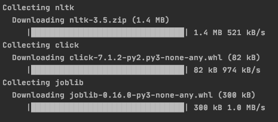

# 使用 NLTK 在 Python 中进行标记化

> 原文：<https://www.askpython.com/python-modules/tokenization-in-python-using-nltk>

让我们学习使用 NLTK 库在 Python 中实现标记化。作为人类，我们很大程度上依赖语言来相互交流。人工智能也需要计算机理解我们的语言。

让计算机理解和处理语言属于自然语言处理的范畴。NLP 被广泛定义为通过软件对自然语言如语音和文本的自动操作。

**标记化**是 NLP 下执行的常见任务。记号化是将一段文本分解成称为记号的更小单元的过程。这些令牌构成了 NLP 的构造块。

## 为什么我们需要标记化？

LSTM 和 RNN 等 NLP 中的深度学习架构以令牌的形式处理文本。

通过在文本语料库上运行标记化，我们可以形成词汇表。然后，以适合于相应语言模型的方式来表示这些标记。

这种表示被称为**单词嵌入**。最常见的单词嵌入模型有 **Skipgram** 和 **One-Hot-Encoding** 。

在本教程中，我们将学习如何标记我们的文本。

让我们编写一些 python 代码来标记一段文本。

## 用 NLTK 在 Python 中实现标记化

我们将使用 **NLTK 模块**来标记文本。NLTK 是**自然语言工具包**的简称。这是一个用 Python 编写的用于符号和统计自然语言处理的库。

NLTK 使得处理文本数据变得非常容易。让我们从安装 NLTK 开始。

### 1.正在安装 NLTK 库

在你的控制台上运行 [pip 命令](https://www.askpython.com/python-modules/python-pip)来安装 NLTK。

```py
pip install nltk

```



要安装 NLTK 的组件，请使用:

```py
import nltk
nltk.download() 

```

在本教程中，我们将讨论两种类型的标记化:

*   句子标记化
*   单词标记化

### 2.在 Python 中设置标记化

让我们从导入必要的模块开始。

```py
from nltk.tokenize import sent_tokenize, word_tokenize

```

**sent_tokenize** 负责基于句子的分词， **word_tokenize** 负责基于单词的分词。

我们要标记的文本是:

```py
"Hello there! Welcome to this tutorial on tokenizing. After going through this tutorial you will be able to tokenize your text. Tokenizing is an important concept under NLP. Happy learning!"

```

将文本存储在变量中。

```py
text = "Hello there! Welcome to this tutorial on tokenizing. After going through this tutorial you will be able to tokenize your text. Tokenizing is an important concept under NLP. Happy learning!"

```

### 3.使用 sent_tokenize()在 Python 中实现句子标记化

要根据句子进行标记，请使用:

```py
print(sent_tokenize(text))

```

我们得到的输出是:

```py
['Hello there!', 'Welcome to this tutorial on tokenizing.', 'After going through this tutorial you will be able to tokenize your text.', 'Tokenizing is an important concept under NLP.', 'Happy learning!']

```

它返回一个列表，列表中的每个元素都是文本中的一个句子。

### 4.使用 word_tokenize()在 Python 中进行单词标记化

根据我们使用的单词来标记:

```py
print(word_tokenize(text))

```

我们得到的输出是:

```py
['Hello', 'there', '!', 'Welcome', 'to', 'this', 'tutorial', 'on', 'tokenizing', '.', 'After', 'going', 'through', 'this', 'tutorial', 'you', 'will', 'be', 'able', 'to', 'tokenize', 'your', 'text', '.', 'Tokenizing', 'is', 'an', 'important', 'conceot', 'under', 'NLP', '.', 'Happy', 'learning', '!']

```

它返回一个列表，列表中的每个元素都是文本中的一个单词。这些现在可以作为标记进入语言模型进行训练。

## 使用 NLTK 完成标记化的 Python 代码

完整的代码如下:

```py
from nltk.tokenize import sent_tokenize, word_tokenize

text = "Hello there! Welcome to this tutorial on tokenizing. After going through this tutorial you will be able to tokenize your text. Tokenizing is an important concept under NLP. Happy learning!"

print(sent_tokenize(text))
print(word_tokenize(text))

```

## 结论

本教程是关于在 python 中标记文本的。我们还讨论了使用 NLTK 在 Python 中标记化及其实现的需要。

在对文本进行标记化之后，您还可以在 Python 中识别文本的情感。看看这个用 Python 进行[情感分析的教程。](https://www.askpython.com/python/sentiment-analysis-using-python)