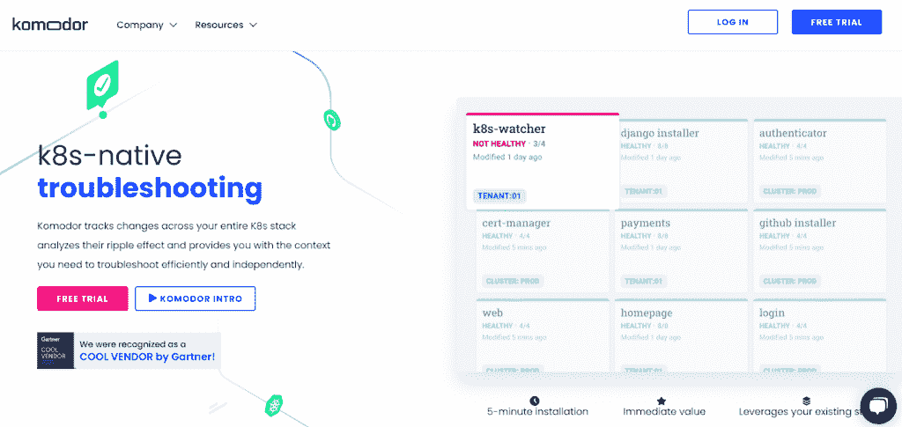
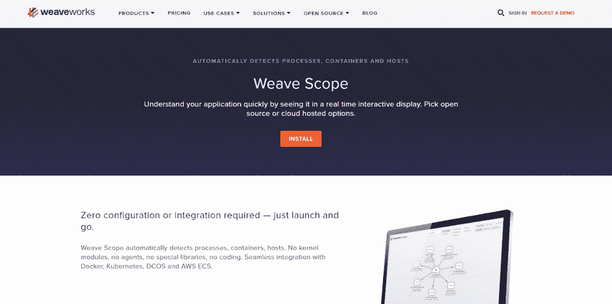
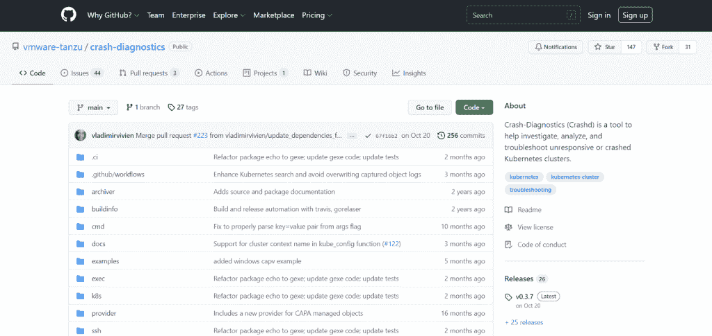
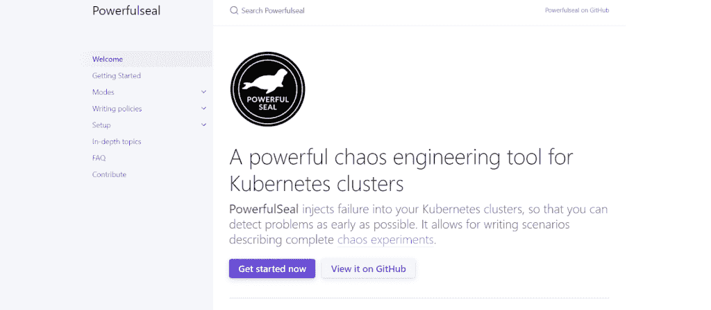

# 改善 K8s 故障排除体验的 4 种工具

> 原文：<https://www.askpython.com/python/tools-to-improve-k8s-troubleshooting-experiences>

Kubernetes 是一个开源的容器编排工具。它是目前的市场领导者——任何使用容器的企业都已经在使用 Kubernetes 或者考虑在不久的将来使用它。然而，帮助自动化容器的部署、伸缩和管理使 Kubernetes 成为一个复杂的系统。开发人员需要专业知识来管理节点和 pod，并对其进行故障排除。

## 为什么我们需要故障排除工具？

即使在小型环境中，也很难在控制器或控制面板中对单个 pod 中的问题进行故障排除。在大型环境中，Kubernetes 部署在多节点集群中，有许多移动部件来支持在 pod 中运行的应用程序的弹性和高可用性。因此，IT/DevOps 团队需要多种工具来管理或排查 Kubernetes 环境中的问题。

在 Kubernetes 环境中很难排除故障。工具可以节省您识别和解决问题的时间。它们还可以帮助您监控性能，跟踪 pod 和堆栈中发生的变化，并生成 pod 的崩溃报告。

### 1\. Komodor

[Komodor](https://komodor.com/) 是一款 Kubernetes 本地故障排除工具，通过提供丰富的功能集，消除了 Kubernetes 故障排除的复杂性。Komodor 跟踪整个 K8s 堆栈的变化，分析它们的连锁反应，并为管理员提供排除堆栈故障所需的上下文。作为一个混合应用，web UI(服务视图)和 Komodor 代理安装在 K8s 集群中。这使得管理员很容易理解跨服务的变化。

Komodor 帮助管理员获得对 Kubernetes 堆栈的控制和完全可见性。Komodor 是一个集中式的工具，可以端到端地跟踪系统:版本控制系统中的代码、配置、K8stack 以及监控和警报工具。Komodor 时间线允许管理员看到环境中发生的变化，包括什么代码被推送，是谁推送的。

它的注释允许管理员在本地 K8 YAML 文件中配置与 Komodor 相关的所有内容。Komodor 配置更改 API 允许管理员将其配置中的更改发送到中央服务器，并作为 Komodor 服务视图的一部分进行查看。Komodor 代理支持与 Kubernetes 集群的交互，并允许管理员加快故障排除过程。

### 2.编织范围

[Weave Scope](https://www.weave.works/oss/scope/) 是对 Kubernetes 集群进行故障排除的工具。它生成基础设施拓扑的报告，帮助部署和管理团队识别在 Kubernetes 基础设施中运行的应用程序的性能瓶颈。

Weavescope 有两个组件:应用程序和探针。两者都可以使用 scope 脚本部署在单个容器中。探测器负责收集运行它的主机的信息，并将指标发送到应用程序并形成报告。

编织范围需要零配置或集成。管理员只需启动并运行。它与 Docker、K8s 和 AWS ECS 无缝集成。它有一个 Kubernetes 中运行的容器的实时视图，管理员可以使用它轻松地识别和纠正与容器化应用程序的性能相关的问题。

### 3.Crashd

崩溃诊断( [Crashd](https://github.com/vmware-tanzu/crash-diagnostics) )是一款工具，可帮助开发人员管理员对 Kubernetes 基础架构进行故障排除和自动化诊断，使他们能够轻松地与基础架构进行交互并从基础架构中收集信息。

Crashd 使用[星际语言](https://github.com/google/starlark-go/blob/master/doc/spec.md)。Starlark 是 Python 的一种方言，旨在用作一种配置语言。Crashd 脚本具有普通的编程结构，如变量声明、函数定义、数据类型、复合类型等。Crashd 执行与特定应用程序和集群资源交互的 Starlark 脚本文件。

Crashd 脚本由存储在一个文件中的 Starlark 函数集合组成。它包含交互和收集诊断数据以及集群中节点和应用程序的其他信息的功能。

Crashd 可以轻松地自动与运行 K8s 的基础设施进行交互。它通过一个安全外壳与计算集群节点进行交互，并从其中捕获信息。它从 Kubernetes API 服务器捕获集群日志，并轻松地从集群 API 管理的集群中提取数据。

### 4.强力密封

对于像网飞这样实施了[混沌工程](https://principlesofchaos.org/)的团队来说，PowerfulSeal 就是工具。PowerfulSeal 是一个用于 Kubernetes 集群的混沌测试工具。它通过将故障注入集群而给基础架构带来混乱，因此 DevOps 管理员可以尽早检测到问题。管理员可以写豆荚的自毁。销毁 pod 后，他们检查服务是否继续响应 HTTP 探测。这是管理员验证其系统恢复能力的方法之一。

[强力封印](https://powerfulseal.github.io/powerfulseal/)灵感来自网飞研发的混沌猴。它随机终止运行在亚马逊网络服务上的虚拟机。混沌猴会移除开发人员认为没有它软件也能运行的节点。PowerfulSeal 提供了一种简单的方法来编写 YAML 场景，并为管理员提供了一种交互模式，同时提供了强大的制表支持。

PowerfulSeal 也有一个运行在 OpenStack 上的 K8s 的 Kubernetes 驱动程序，并有支持不同云提供商的驱动程序:Azure、AWS 和 GCP。

## 结论

当你有一件很复杂很难预测的事情时，真正的问题不会如期发生，问题也不会以已知的模式发生。测试、排查和调试问题的最佳方式是使用适合该环境的工具。在本帖中，我们看到了四个 Kubernetes 故障排除工具，以及它们如何帮助管理员轻松有效地排除 Kubernetes 环境中的故障。