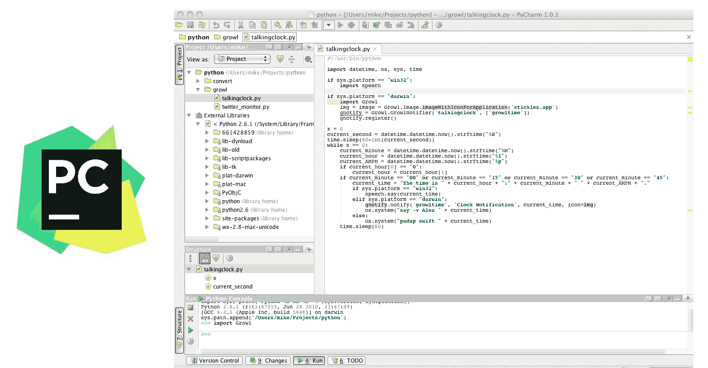
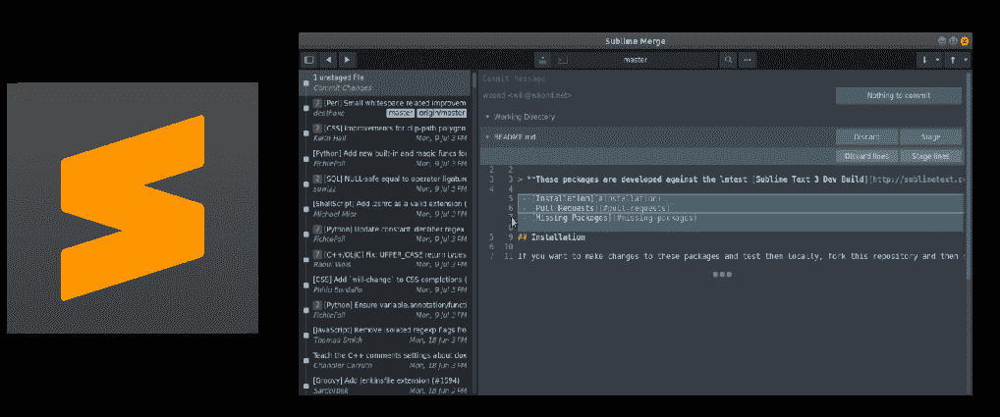
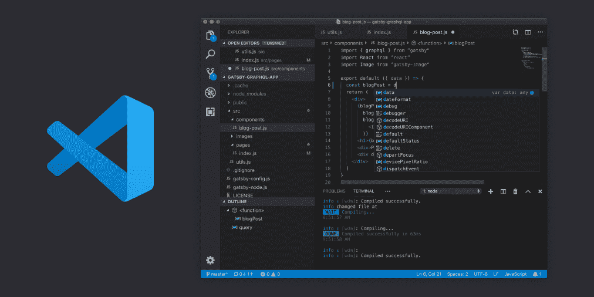
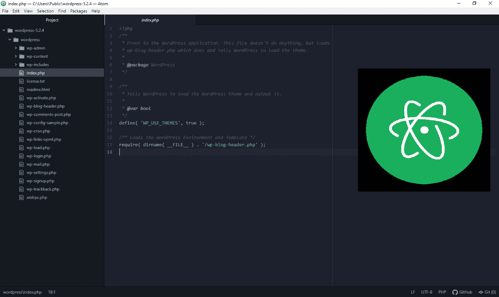
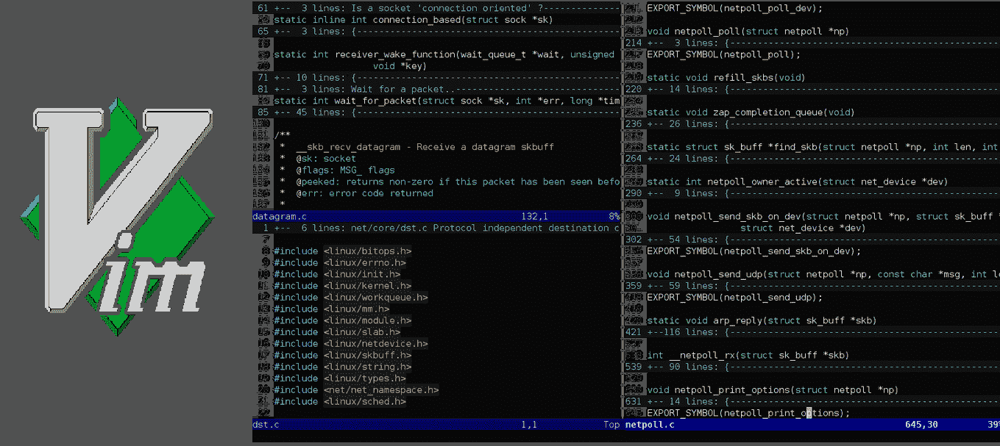

# Python 的 5 大最佳 ide

> 原文：<https://www.askpython.com/python/top-best-ides-for-python>

我们 AskPython 热爱这门语言！Python 是我们的最爱，今天我们将讨论 Python 的最佳 ide。作为一名程序员，我们花了太多时间在文本编辑器或 IDE 上，我们需要它成为最适合我们需求的。

因此，在开始列出 ide 之前，让我们先回答两个简单的问题。

### 什么是 Python IDE，我们为什么需要它？

IDE 代表集成开发环境，是一个功能丰富的软件工具，配有调试器。它们具有自动完成的特性，允许轻松编码，因此使它们成为沉重的包。ide 比文本编辑器需要更多的系统资源，占用更多的内存。

### 文本编辑器与 IDE 有什么不同？

文本编辑器是 IDE 的简化版本，占用较少的内存空间，用户可以安装必要的插件来简化编码和提高性能。因此，代码编辑器更适合不太先进的机器。

## Python 的 5 大最佳 ide

这里有一个最好的 Python IDEs 的快速列表:

1.  py charm IDE-最流行的 Python IDE！

2.  崇高的文本(Sublime Text)–一个可扩展的文本编辑器，可以在文本编辑器中轻松运行 Python 脚本

3.  **VS 代码**–微软开发的代码编辑器是 Python 的完美 IDE。它非常光滑，非常稳定，而且非常轻便。

4.  Atom 编辑器–另一个非常可扩展的文本编辑器，完全有能力成为 Python 的最佳 IDE。非常光滑和现代的界面与美丽的主题。

5.  VIM 编辑器——这是给 Python 爱好者的。这是一个基于命令行的文本编辑器，具有高度的可定制性，超过了列表中的其他编辑器。它有一个入门的学习曲线。

### 1.PyCharm IDE——最流行的 Python IDE

PyCharm IDE

**PyCharm 是专门为 Python 开发设计的 IDE**。尽管它与其他语言兼容，但它对于处理 Python 代码以及 [Python 模块](https://www.askpython.com/python-modules)和像 Django 这样的框架非常强大。它使用 PEP8 风格的动态编码验证建议，并与 Anaconda 和其他版本控制系统无缝集成。

与 VS 代码编辑器非常相似，它也是一个强大的调试器。它有能力安装各种插件和软件包。

PyCharm 提供的数据库和服务器连接特性非常通用和高效。

PyCharm 的一个缺点是使用了大量的系统资源，从而使其成为一个沉重的 IDE。它在索引文件时停止加载。

PyCharm 有两个版本，即社区版和专业版。然而，对于新开发人员，我们建议使用社区版，因为它是免费的，在各种网站上都有大量的支持。

**PyCharm 可在[https://www.jetbrains.com/pycharm/download/](https://www.jetbrains.com/pycharm/download/)下载**

### 2.sublime Text——Python 的最佳文本编辑器集成开发环境

Sublime Text

Sublime Text 是一个轻量级编辑器，用于小型项目和一些轻量级脚本。用户界面简单，简约，直观，容易适应程序员。它非常快，很少遇到任何问题。

软件包控制功能允许安装必要的插件。这确保了仅由用户挑选并应用于工作空间的附加组件，并因此确保了用户不会被任何其他附加组件及其建议分散注意力。

**编辑器可在[https://www.sublimetext.com/](https://www.sublimetext.com/)下载**

### 3.VS 代码——微软为 Python 和其他语言开发了 IDE

Visual Studio Code By Microsoft

VS Code 是微软公司维护的一个 IDE，并不断获得许多附加特性。与其他 IDE 相比，它是一个轻量级的 IDE。它包括一个调试器和一个内置的编译器和解释器。

由于兼容每一种编程语言，许多程序员更喜欢 VS 代码用于 web 开发和更大的项目。

用户界面非常好，尽管许多用户觉得它过于拥挤。然而 Python 不是 VS 代码中的默认语言，需要安装在编辑器上才能得到支持。

此外，VS 代码包含 Zen 模式，它将完整模式的 IDE 变成了一个极简编辑器。

**IDE 可在[https://code.visualstudio.com/download](https://code.visualstudio.com/download)下载**

### 4.atom——一个现代化的文本编辑器，有许多插件来增加功能

Atom Editor

Atom 是一个时尚、轻量级的编辑器，受到很多开发人员的喜爱。这是免费的，易于安装。它最初由 GitHub 开发，包含许多插件，可以用来实现类似 IDE 的功能。

用户界面非常好，默认设置下不会占用很多系统资源。Atom 是高度可定制的，并带有许多插件。对于新手来说是一个很棒的选择。对于 Atom，您可能会错过的一个特性是调试器

**atom 编辑器可在[https://atom.io/](https://atom.io/)下载**

### 5.Vim 编辑器 Python 的最佳 CLI 文本编辑器，具有高度的可定制性

Vim Editor

Vim 是一个非常轻量级但非常强大的命令行文本编辑器。它可以在任何操作系统上运行。它也可以从命令行打开和使用。Vim 有强大的键盘快捷键，但定制有限。

它有大量可用的插件。VIm 的一个警告是其陡峭的学习曲线！对于许多只想开始使用 Python 脚本的程序员来说，这可能是一个障碍。

但是对于爱好者、黑客和极客来说，这个文本编辑器可以满足你对文本编辑器的所有需求，甚至更多！

**Vim 编辑器可在[https://www.vim.org/download.php](https://www.vim.org/download.php)下载**

## 我们的裁决

我们喜欢所有这 5 个！但是作为一群完全的 Python 爱好者，我们大多数人坚持将 VIM 作为 Python 代码的首选编辑器/解释器。

如果您喜欢 GUI，我强烈建议尝试一下 Atom。它非常漂亮，你实际上想继续使用它，只是因为它看起来如此光滑。

最后，如果您想让 Python 编程开箱即用，PyCharm 是您的最佳选择。

## 最后…

仅此而已。是的，这是一个很短的列表，但是我们只想列出那些我们个人在团队中使用过的编辑器或 ide。我们非常喜欢所有这些 IDEs 编辑器，尤其是 Atom 和 VIm。

但是现在聚光灯对准了你。你最喜欢的 Python IDE 是什么？请在下面的评论中告诉我们！