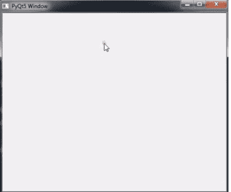
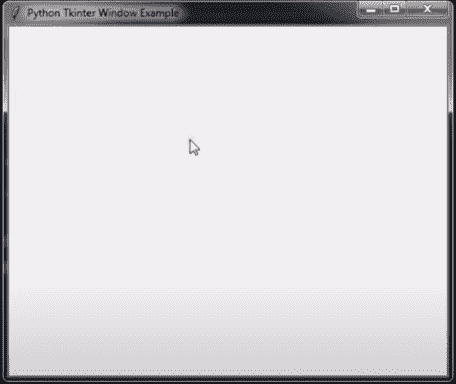
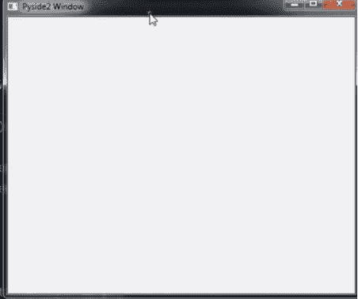
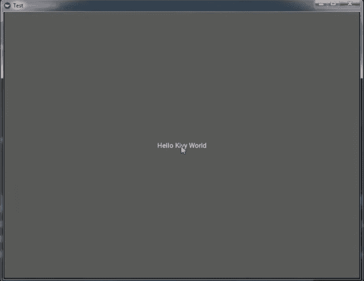
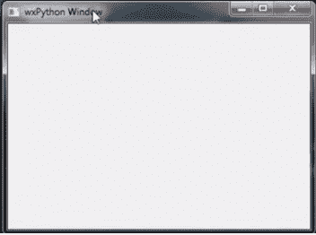

# 前 5 名最佳 Python GUI 库

> 原文：<https://www.askpython.com/python-modules/top-best-python-gui-libraries>

在本文中，我们将介绍可以在项目中使用的前 5 个 Python GUI 库。请继续阅读，了解它们。

## 什么是图形用户界面？

GUI 或图形用户界面是一种交互式环境，用于在各种情况下(如表单、文档、测试等)接收用户的响应。它为用户提供了一个比传统命令行界面(CLI)更好的交互式屏幕。

## 最佳 Python GUI 库列表

让我们进入正题，看看 Python 的顶级 GUI 库。

### 1.PyQT5

PyQT5 是 Python 的图形用户界面(GUI)框架。它在开发人员中很受欢迎，GUI 可以通过编码或 QT 设计器来创建。QT 开发框架是一个可视化框架，允许拖放小部件来构建用户界面。

它是一个免费的开源绑定软件，是为跨平台应用开发框架而实现的。在 Windows、Mac、Android、Linux、树莓 PI 上使用。

对于 PyQT5 的安装，您可以使用以下命令:

```py
pip install pyqt5

```

这里演示了一个简单的代码:

```py
from PyQt5.QtWidgets import QApplication, QMainWindow
import sys

class Window(QMainWindow):
   def __init__(self):
       super().__init__()

       self.setGeometry(300, 300, 600, 400)
       self.setWindowTitle("PyQt5 window")
       self.show()

app = QApplication(sys.argv)
window = Window()
sys.exit(app.exec_())

```

上述代码的输出如下:



PyQt5

*ScienceSoft 的团队* [*Python 开发者*](https://www.scnsoft.com/services/hire-python-developers) *强调了使用 PyQt 的好处:*

PyQt 是一套成熟的 Python 绑定到 Qt，用于桌面应用的跨平台开发。它提供了丰富的内置小部件和工具，用于定制小部件的创建，以形成复杂的 GUI，以及强大的 SQL 数据库支持，以连接到数据库并与之交互。

### 2.Python Tkinter

另一个 GUI 框架叫做 [Tkinter](https://www.askpython.com/tkinter) 。Tkinter 是用于开发桌面应用程序的最流行的 Python GUI 库之一。它是 TK 和 python 标准 GUI 框架的组合。

Tkinter 提供了各种各样的小部件，比如在图形用户界面应用程序中使用的[标签](https://www.askpython.com/python-modules/tkinter/tkinter-frame-and-label)、[按钮](https://www.askpython.com/python-modules/tkinter/tkinter-buttons)、文本框、[复选框](https://www.askpython.com/python-modules/tkinter/tkinter-checkbox-and-checkbutton)。

按钮控件小部件用于显示和开发应用程序，而[画布小部件](https://www.askpython.com/python-modules/tkinter/tkinter-canvas)用于绘制线条、多边形、矩形等形状。在应用程序中。再者，Tkinter 是 Python 内置的[库](https://www.askpython.com/built-in-methods)，不需要像其他 GUI 框架一样安装。下面给出了一个使用 Tkinter 编码的例子。

```py
from tkinter import *

class Root(Tk):
    def __init__(self):
        super(Root,self).__init__()

        self.title("Python Tkinter")
        self.minsize(500,400)

root = Root()
root.mainloop()

```

上述代码的输出如下所示:



Tkinter

### 3.PySide 2

我们将要讨论的第三个 Python GUI 库是 PySide2，或者你可以称之为 Python 的 QT。Qt for Python 提供了 Qt 的官方 Python 绑定(PySide2)，支持在 Python 应用程序中使用其 API，以及一个绑定生成器工具(Shiboken2)，可用于将 C++项目公开到 Python 中。

Python 的 Qt 可以在 LGPLv3/GPLv3 和 Qt 商业许可下获得。

现在让我向您展示安装过程和一个例子。因此，对于安装，您可以简单地使用:

```py
pip install PySide2

```

下面是一个使用 PySide2 建立 GUI 框架的例子。

```py
from PySide2.QtWidgets import QtWidgets, QApplication
import sys

class Window(QtWidgets):
    def __init__(self):
        super().__init__()

        self.setWindowTitle("Pyside2 Window")
        self.setGeometry(300,300,500,400)

app = QApplication(sys.argv)
window=Window()
window.show()
app.exec_()

```

上述代码的输出如下所示:



Pyside2

### 4\. Kivy

我们将要讨论的另一个 GUI 框架叫做 Kivy。Kivy 是一个开源 Python 库，用于快速开发利用创新用户界面的应用程序，如多点触摸应用程序。

Kivy 可以在 Linux、Windows、OS X、Android、iOS 和 Raspberry Pi 上运行。您可以在所有支持的平台上运行相同的代码。它可以本机使用大多数输入，协议和设备，包括 WM_Touch，WM_Pen，Mac OS X 触控板和 Magic Mouse，Mtdev，Linux 内核 HID。

在麻省理工学院的许可下，Kivy 可以 100%免费使用。

该工具包是专业开发、支持和使用的。你可以在商业产品中使用它。该框架是稳定的，有一个记录良好的 API，外加一个编程指南来帮助您入门。

Kivy 的图形引擎是在 OpenGL ES 2 上构建的，使用了一个现代化的快速图形管道。

该工具包附带了 20 多个小部件，都是高度可扩展的。许多部分都是使用 Cython 用 C 语言编写的，并用回归测试进行了测试。

来到 Kivy 的安装，需要安装依赖项“glew”。您可以使用如下的 [pip 命令](https://www.askpython.com/python-modules/python-pip):

```py
pip install docutils pygments pypiwin32 kivy.deps.sdl2 kivy.deps.glew

```

输入这个命令并按回车键，它将被安装。之后，您需要键入以下命令来安装 Kivy:

```py
pip install Kivy

```

所以在安装之后，让我给你看一个简单的 Kivy 的例子来说明它有多简单。

```py
from kivy.app import App
from kivy.uix.button import Button

class TestApp(App):
    def build(self):
        return Button(text= " Hello Kivy World ")

TestApp().run()

```

上述代码的输出如下所示:



Kivy

### 5.wxPython

所以我们要讨论的最后一个 GUI 框架是 wxPython。wxPython 是 Python 编程语言的跨平台 GUI 工具包。

它允许 Python 程序员简单方便地创建具有健壮、高功能图形用户界面的程序。它是作为一组 Python 扩展模块实现的，这些模块包装了流行的 wxWidgets 跨平台库的 GUI 组件，该库是用 C++编写的。

与 Python 和 wxWidgets 一样，wxPython 也是开源的。

wxPython 是一个跨平台的工具包。这意味着同一个程序无需修改就可以在多个平台上运行。目前，支持的平台是微软视窗系统，苹果 OS X 和苹果操作系统，以及 Linux。

现在，我将向您展示安装过程，并创建一个简单的示例。因此，对于安装，只需键入以下命令:

```py
pip install wxPython

```

这里有一个例子:

```py
import wx

class MyFrame(wx.Frame):
    def __init__(self,parent,title):
        super(MyFrame,self).__init__(parent,title=title,size=(400,300))

    self.panel=MyPanel(self)

class MyPanel(wx.Panel):
    def __init__(self,parent):
        super(MyPanel,self).__init__(parent)

class MyApp(wx.App):
    def OnInit(self):
        self.frame=MyFrame(parent=None, title= "wxPython Window")
        self.frame.show()
        return True

app = MyApp()
app.MainLoop()

```

上述代码的输出如下所示:



WxPython

## 结论

现在我们已经看到了 5 个 Python GUI 库，在我看来，PySide2 和 pyQt5 是更强大的 GUI 框架。但是它们有商业许可证，这解释了为什么它们功能丰富。Tkinter、Kivy 和 wxPython 是 Python 的免费 GUI 库。

Python 中你最喜欢的 GUI 库是什么？