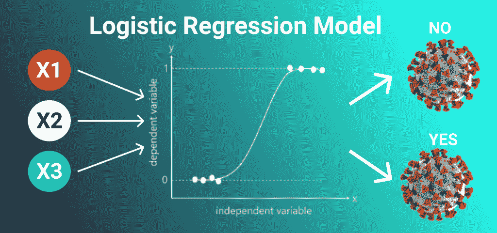

# 你必须知道的 Python 中的 5 大机器学习算法

> 原文：<https://www.askpython.com/python/examples/top-machine-learning-algorithms>

下面是五个最适合初学者的机器学习算法。机器学习已经发展到用复杂的方法解决当前挑战的最流行的方法。

* * *

## 算法 1:神经网络

我们最优秀的成就之一是一个 **[人工神经网络](https://www.askpython.com/python/examples/neural-networks)** 。如图所示，我们开发了一个节点网络，这些节点相互连接，类似于我们大脑中的神经元。

通俗地说，每个神经元从另一个神经元接收信息，进行处理，然后作为输出发送给另一个神经元。

Neural Network Demonstration

**每个圆形节点代表一个人工神经元**，每个箭头象征一个神经元的输出和另一个神经元的输入之间的联系。

神经网络不是预测购买或出售决策，而是在用于发现不同资产类别之间的相互依赖性时更有效。

如果你想了解更多关于神经网络的知识，请查看下面提到的教程:

*   [Python 中的神经网络——初学者完全参考](https://www.askpython.com/python/examples/neural-networks)
*   [构建单一感知器神经网络](https://www.askpython.com/python/examples/single-perceptron-neural-network)

* * *

## 算法 2:朴素贝叶斯

[**朴素贝叶斯分类器**](https://www.askpython.com/python/examples/naive-bayes-classifier) 是一个众所周知的概率分类器，可以区分众多项目。

由于其速度和精度，它以其实时分类而闻名。贝叶斯定理主要确定事件发生的可能性。

Naive Bayes Demonstration

预测测试数据集的种类既简单又快捷。它还擅长多类预测。

由于其优越的数学方法，朴素贝叶斯模型易于实现，并且对于非常大的数据集特别有用。

由于其实时分类的能力，该方法优于另一种算法。

如果你想了解更多关于朴素贝叶斯的知识，请参考下面的教程:

[***朴素贝叶斯分类器与 Python***](https://www.askpython.com/python/examples/naive-bayes-classifier)

* * *

## 算法 3: K 均值聚类

这些机器学习算法的目的是基于数据点的相似性来标记数据点。因此，我们在运行该方法之前没有定义集群；相反，算法在运行时会发现这些聚类。

KMeans Demonstration

k-均值聚类可能对那些相信不同资产之间可能存在表面上看不到的共性的交易者有利。

如果您想了解更多关于 KMeans 的知识，请查看下面提到的教程:

*   [N](https://www.askpython.com/python/examples/naive-bayes-classifier)[K——Python 中从零开始聚类的意思【算法讲解】](https://www.askpython.com/python/examples/k-means-clustering-from-scratch)
*   [如何用 Python 绘制 K-Means 聚类？](https://www.askpython.com/python/examples/plot-k-means-clusters-python)

* * *

## 算法 4:逻辑回归

对于二元分类，逻辑回归是最适合的。逻辑回归是 f(x)= 1/(1+ex)的函数。这个函数是一个衰减的指数函数，最大值为 1。

Logistic Regression Demonstration

回归的基本目标是识别最佳系数。我们可以用这些系数来减少结果中的误差。

* * *

## 算法 5:主成分分析

通过减少变量，主成分分析(PCA)用于使数据更容易分析和显示。

在一个新的坐标系中捕捉数据的最大方差，该坐标系的轴称为“主分量”每个正交分量都是原始变量的线性组合。

成员之间正交性的存在意味着这些组件之间没有相关性。

第一个主成分捕获了数据中最大的变化量。第二个主成分代表数据中的剩余变量，但包含与第一个无关的变量。

类似地，所有随后的主成分捕获剩余的变化，同时保持与先前的成分无关。

* * *

## 结论

恭喜你！您刚刚了解了 Python 编程语言中最值得学习的 5 种机器学习算法。希望你喜欢它！😇

感谢您抽出时间！希望你学到了新的东西！！😄

* * *

如果你想了解更多关于逻辑回归的知识，请查看下面提到的教程:

*   [Python 中从零开始的逻辑回归【算法讲解】](https://www.askpython.com/python/examples/logistic-regression-from-scratch)
*   [逻辑回归——简单实用的实现](https://www.askpython.com/python/examples/logistic-regression)