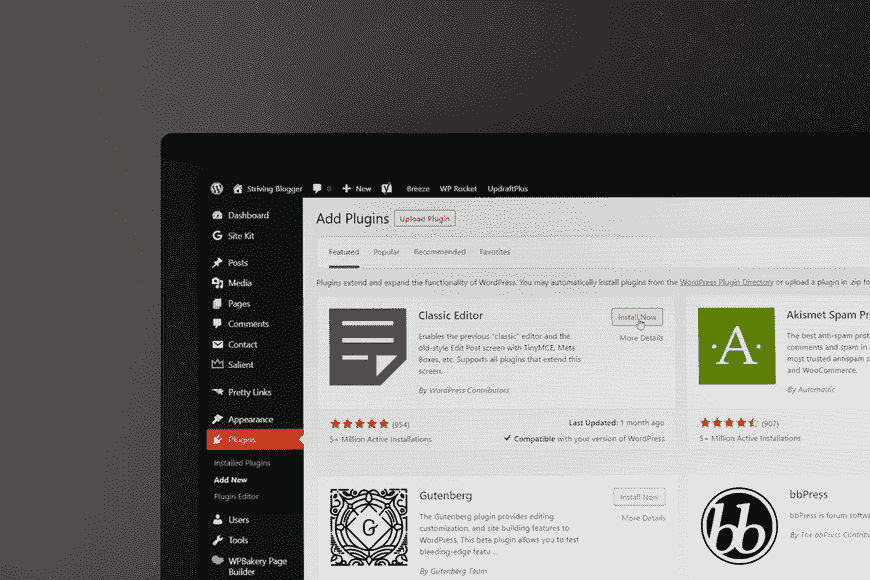

# 将 WordPress 网站转换成移动应用的顶级插件

> 原文：<https://www.askpython.com/python/top-plugins-to-convert-a-wordpress-site-into-a-mobile-app>

你想把你的 WP 网站转换成应用程序吗？你可以选择一个 WP 应用插件来帮助你做到这一点，而不必支付昂贵的开发费用。

在这篇文章中，我们将详细讨论八个最好的 WordPress 应用构建器插件，它们为你的 WordPress 站点提供了两种不同类型的应用:

*   原生 app 是大多数人听到 app 这个词想到的。你的访问者通过他们设备上的应用商店下载它。
*   渐进式网络应用程序允许在网站上与访问者互动，而无需安装自己的应用程序。访问者仍然可以在他们的主屏幕上添加这样的应用程序，并且你可以启用离线功能和推送通知。

在我们进入插件列表之前，重要的是要提到，即使是特殊插件的使用也只能委托给专业人员。如果你的网站是由 WordPress 开发者团队开发的，那么最好也把插件的工作委托给 pros。

## 1.app presser——Android 和 iOS 的原生应用

AppPresser 是最著名的 WordPress 应用程序创建工具之一。它是这样工作的:使用单独的 AppPresser 应用程序接口创建应用程序。然后你使用 WordPress 上的一个免费插件，通过 REST API 将你的 WordPress 站点连接到 AppPresser。这个连接允许你同步你的应用程序数据和你的 WP 站点。

AppPresser 拥有比你能找到的许多其他插件更深入的功能。它特别支持以下插件:

*   Woocommerce，
*   巴迪出版社，
*   LearnDash。

该插件还允许您:

*   从你的手机相机里拍照，然后上传到 WordPress。
*   以几种有趣的方式使用地理定位。
*   发送推送通知。
*   通过应用程序登录 WordPress/注册。

总的来说，如果你想为你的用户提供更个性化的体验，AppPresser 是一个很好的选择。

## 2.WordPress Mobile Pack——用于渐进式网络应用程序

这是一个免费的插件，可以很容易地把你的 WP 网站变成一个进步的网络应用程序。WordPress Mobile Pack 附带了几个主题，可以快速建立一个设计美观的网站。您可以选择应用程序中应包含哪些内容，以及是否从 Google Ad Manager 添加广告。

总的来说，如果您想快速、轻松地创建一个优秀的渐进式 web 应用程序，这是一个不错的选择。虽然 WordPress.org 上有一个基本的免费版本，但您可能需要付费版本，因为它将提供:

*   更多可用主题，
*   弹出通知，
*   离线模式，
*   HTTPS 支持。

## 3.Android app——Android 和 iOS 的本地应用

它非常擅长组织本地应用。而且，尽管名字如此，它在 Android 和 iOS 上都可以做到。您可以从几个应用程序主题中进行选择，您的应用程序可能包括:

*   弹出通知，
*   通过 Admob 或 Appnext 货币化，
*   社会交换，
*   评论支持，
*   无尽滚动。

在定制应用程序时，你有相当多的选择，包括包含你自己代码的空间。然而，这个插件不提供像 AppPresser 这样的内置集成。

## 4.超级渐进式网络应用

正如你从名字中可以猜到的，超级渐进式网络应用程序是一个很好的工具，可以将你的 WP 网站转换成渐进式网络应用程序。

这很容易设置:

*   选择多种颜色，
*   选择起始页，
*   选择一个方向。

如果你需要更多的功能，两个免费的插件可以让你添加 UTM 跟踪和安装苹果触摸图标。

## 5.WP-app kit——灵活的本地或渐进式 Web 应用

WP-AppKit 提供功能集成，让你最大限度地控制你的应用程序的工作方式。如果您正在寻找即插即用的解决方案，这不是一个好的选择。但是，如果你想定制你的应用程序的功能，并控制它显示的信息，WP-AppKit 给了你正确的控制水平。

例如，当您要构建应用程序时，您将能够添加单个组件，然后将这些组件添加到菜单中。组件可以是页面、文章类型等。如果您是开发人员，您可以使用钩子创建自己的组件。

除了您在上面看到的免费功能之外，还有两个付费附加组件:

*   谷歌分析整合，
*   Pushwoosh 用于推送通知。

这个插件肯定更侧重于开发者和有经验的用户。但是如果那是你想要的，试着掌握这个提供更多控制的好插件。

## 6.WAP press/iwapp press—Android 和 iOS 的原生应用

Wapppress 和 iWappPress 是来自同一个开发者的两个插件。如果你一起使用它们，这允许你为 Android 和 iOS 创建本地应用。

两者的独特卖点是创建一键式应用程序。换句话说，他们可以把你的 WordPress 站点变成一个本地应用，而不需要任何技术知识或者详细的配置。它们都是 CodeCanyon 的优质解决方案。他们有详细的演示，您可以在做出选择之前使用。

您只需运行一些基本的配置选项，单击一个按钮，然后等待应用程序被创建。其他功能包括:

*   弹出通知，
*   在 Google AdMob 中整合广告，
*   多个应用程序主题可供选择。

## 7.MobiLoud——WordPress 应用构建器服务

根据创建者的说法，MobiLoud 是“一个专门为 WordPress 设计的应用创建服务。”这并不便宜，但服务包括:

*   App 创作，
*   在应用程序商店中发布应用程序，
*   应用支持。

所以，如果你不想深究将 WP 网站转换成应用的细节，这可能是你的一个好选择。你只是为了方便而付钱！

## 8.frontity——为高流量网站定制的 WordPress 渐进式网络应用程序

Frontity 肯定不适合所有人，因为他们只接受最低流量的网站。但是，如果你是一个大型网站的所有者，并且想开发一个 WordPress 渐进式网络应用程序，这可能是一个不错的选择。

我们希望上述推荐的应用程序中至少有一个能够满足您的需求和期望。