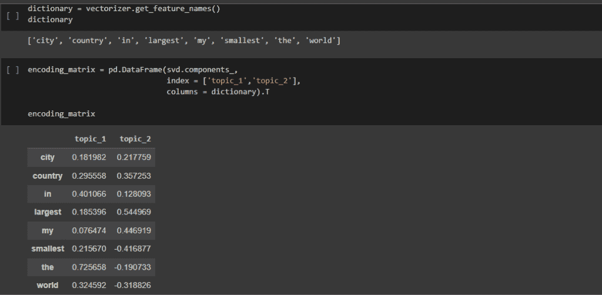

# 使用 LSA 的主题建模:完全指南

> 原文：<https://www.askpython.com/python/examples/topic-modeling-using-lsa>

对于今天和明天越来越智能的应用程序来说，开发一个无缝的人机交互界面始终是一个关键问题。

自然语言处理(NLP)是一项先进的技术，它衍生了我们现在看到的许多形式的人工智能。

谈到 NLP，主题建模是其最重要的主题之一。在本文中，让我们试着理解什么是主题建模，以及如何用 python 语言实现它。

## 什么是主题建模？

NLP 的主题建模技术用于从一组文档的文本中推断它们是关于什么的。它的工作原理是扫描一组文档，识别其中的单词和短语模式，然后自动聚类最能描述一组文档的单词组和相关短语。它发现隐藏的模式或数据分组。

在本文中，让我们尝试使用潜在语义分析(LSA)算法来实现主题建模。但是在我们开始实施之前，让我们先了解一下 LSA 的概念。

还可以使用潜在的狄利克雷分配(LDA)来实现主题建模。要了解更多信息，请阅读 Python 中的 ***[潜在狄利克雷分配(LDA)算法](https://www.askpython.com/python/examples/latent-dirichlet-allocation-lda)***

## 什么是 LSA？

一种在自然语言处理中使用的技术，称为潜在语义分析(LSA)，特别是分布式语义，通过使用统计创建与文档和术语相关的概念集合来评估文档集合和它们所包括的术语之间的联系。它通常用于文本分析领域中的数据聚类和数据收集。

概念搜索和自动文档分类也是 LSA 的两个主要用途。这是一种无监督的学习方法，这意味着有一个特定的目标要实现，或者没有标签或标记被分配。潜在语义分析的目标是根据这些主题或潜在特征产生文本数据的表示。

潜伏这个词本身就意味着隐藏。我们关注的是潜在的(隐藏的)或数据本身固有的任何东西。作为其副产品，我们将能够减少原始的基于文本的数据收集的维度。

## LSA 是如何工作的？

潜在语义分析的工作主要包括四个步骤。第二个和第三个更重要，也更难理解。步骤如下所示

1.  收集原始文本数据
2.  生成文档术语矩阵
3.  执行奇异值分解(SVD)
4.  检查主题编码数据

### 收集原始文本数据

主题建模产生的数据总是文本格式的。所提供的输入通常是文档的集合。为了理解这个概念，下面给出一个例子。但是当在实际项目中工作时，数据通常来自各种公开来源，如社交媒体、报告等。

*   **文献 1** :世界上最小的国家
*   **文件二** :世界上最大的国家。
*   **文献 3** :我国最大的城市。
*   **文献 4** :世界上最小的城市。

Implementation

### 文档术语矩阵

文档术语矩阵是一个数学矩阵，它表示术语在一组文档中出现的频率。在文档-术语矩阵中，列代表集合中的术语，行代表集合中的文档。该矩阵是文档-特征矩阵的示例，其中“特征”可以不仅仅与文档中的术语相关。

另一种常见的格式是转置，或术语-文档矩阵，其中术语是行，文档是列。文档术语矩阵背后的基本概念是，文本文档可以表示为欧几里得空间中的点，也称为向量。

让我们通过一个例子来理解这个概念，

Implementation

在这里，使用 Scikit-Learn，我们已经将一直在分析的四个文档定义为一个列表中的四个字符串。计数矢量器模型可用于生成文档术语矩阵。如您所见，我们从 Scikit-Learn 特征提取点文本模块中导入了计数矢量器。

在创建了计数矢量器之后，我们拟合并转换我们的身体为一个单词集合。当我们在自然语言处理中使用短语“单词包”时，我们指的是文档术语矩阵的最基本应用。

### 奇异值分解

奇异值分解(SVD)是一种数学方法，用于将一大段文本压缩成一个矩阵，每个文档有字数(行代表唯一的单词，列代表每个文档)。这种技术减少了行数，同时保持了列之间的相似结构。

由列形成的任何两个向量所产生的角度的余弦然后被用于比较文档，这是由两个向量的归一化所形成的点积。接近 1 的值表示文档非常相似，而接近 0 的值表示文档非常不同。

与主成分分析类似，奇异值分解如果你熟悉这种统计方法，使用潜在语义分析用这些潜在特征编码原始数据集将最小化其维数。这些潜在特征对应于原始文本数据的主题。

下一步是执行我们的奇异值分解；这可以使用 Scikit-Learn 的模型的截断 SVD 来完成。我们从 SK learn 分解中导入截断的 SVD，并使用它来拟合，然后将单词包转换为我们的 LSA。“截断”这个词指的是这样一个事实，我们不会得到和开始时一样多的向量。

Implementation

## 主题编码数据

这旨在将我们的原始数据转换成主题编码的数据。数据现在应该由两列组成，每列代表我们从截断的 SVD 请求的两个主题中的一个，回想一下这个值 2 作为参数传递给截断的 SVD。

为了查看我们 LSA 的结果，我们将使用 [**熊猫库**](https://www.askpython.com/python-modules/pandas/python-pandas-module-tutorial) 。在这里，我们可以看到开始时的四个原始文档，以及两个主题中每个主题的数值。第一和第四个文档大约是最大的位置，而第二和第三个文档大约是最小的位置。

请注意，所有四个文档在主题一中都很强，但在主题二中，第二个和第三个文档以及第一个和第四个文档之间有明显的区别。

Implementation

## LSA 的副产品

潜在语义分析的一大好处是，它会产生一些副产品，可以帮助我们理解每个主题编码的是什么，我们要看的两个副产品是:

***字典—***字典是至少在一个文档体中出现的所有单词的集合。

***编码矩阵—***编码矩阵用于将文档编码成主题编码的表示形式，通过检查可以更好地理解每个主题所代表的内容。

Implementation

让我们看一下作为拟合计数矢量器模型的属性的字典，可以使用获取特征名称方法来访问它。我们可以检查这个矩阵来获得对身体潜在主题的理解。让我们看看这个编码矩阵，其中每行代表我们字典中的一个单词，每列代表我们两个主题中的一个，数值可以被认为是给定主题中该单词的表达式。

接下来，我们将解释我们可能感兴趣的编码矩阵，每个主题的热门词是什么，或者词空间的哪些维度解释了大部分差异。在数据中，请注意，我们将需要查看主题中每个单词表达的绝对值，当我们解释主题时，具有强烈负面表征的单词与具有强烈正面图像的单词一样重要。

让我们看看主题一，你可以看到最重要的单词是单词，但在后面的视频中，我们会删除像这样没有太多意义的单词。让我们看看题目二，你可以看到最重要的两个词是最大和最小，但让我们看看最初的计算。

我们可以看到，最大是非常积极的，而最小是非常消极的，这告诉我们，主题 2 将是一个很好的主题，可以帮助我们表示该文档是最大的还是最小的。

Implementation

Implementation

## 摘要

主题建模用于文本挖掘，在本文中，我们已经了解了它的实现使用潜在语义分配。