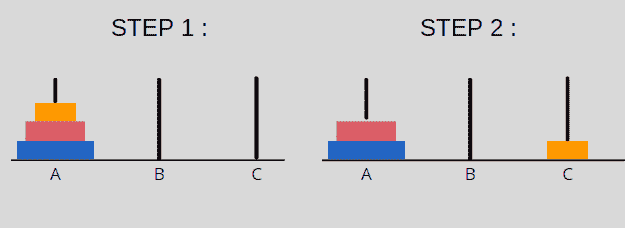
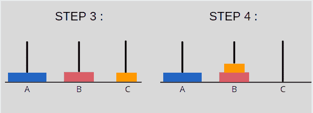
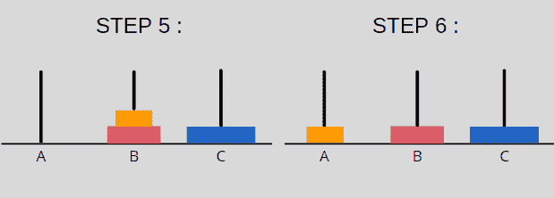
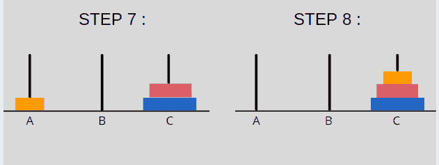

# Python 中的汉诺塔:完整的分步

> 原文：<https://www.askpython.com/python/examples/tower-of-hanoi-in-python>

汉诺塔是一个数学问题(难题),由 3 根柱子和 n 个圆盘组成，每个圆盘有不同的直径。

## 汉诺塔问题的目标

这个问题的目的或目标是将所有的“n”个盘从源极转移到目的极，以这样的方式，我们得到与以前相同的盘排列。但是这个目标必须通过坚持规则来实现。

* * *

### **规则和约束**

解决问题时必须满足的约束条件是

1.  一次只能移动一张光盘。
2.  只能取出最上面的光盘
3.  较大的光盘不能放在较小的光盘上面。

* * *

### **汉诺塔问题的可视化表示**

下图显示了河内塔的分步解决方案，该塔有 3 个极点(源点、中间点和目的点)和 3 个圆盘。目标是将所有 3 个圆盘从 A 极移动到 c 极。



从上面的解决方案中我们可以看到，3 个圆盘所需的移动次数= 8。因此，我们需要的总移动次数的通用公式是:

总移动次数= n²–1

其中“n”是光盘的总数。

* * *

## 用 Python 解决汉诺塔问题

```py
def TowerOfHanoi(n , s_pole, d_pole, i_pole):           
    if n == 1:
        print("Move disc 1 from pole",s_pole,"to pole",d_pole)
        return
    TowerOfHanoi(n-1, s_pole, i_pole, d_pole)
    print("Move disc",n,"from pole",s_pole,"to pole",d_pole)
    TowerOfHanoi(n-1, i_pole, d_pole, s_pole)

n = 3
TowerOfHanoi(n, 'A', 'C', 'B')
# A, C, B are the name of poles

```

在上面的代码中，我们递归地调用函数 TowerOfHanoi 来处理 3 个磁盘。

这里:

*   s 极:源极
*   i_pole:中间极点
*   d_pole:目的极

**上面代码的输出是:**


* * *

## 结论

这就是我们解决汉诺塔问题的方法。

这个代码可以推广到任何数量的光盘。因此，如果您想要 4 个光盘的解决方案，只需在 n = 4 时将 n 的值从 3 更改为 4，输出将显示为 4 个光盘，依此类推。