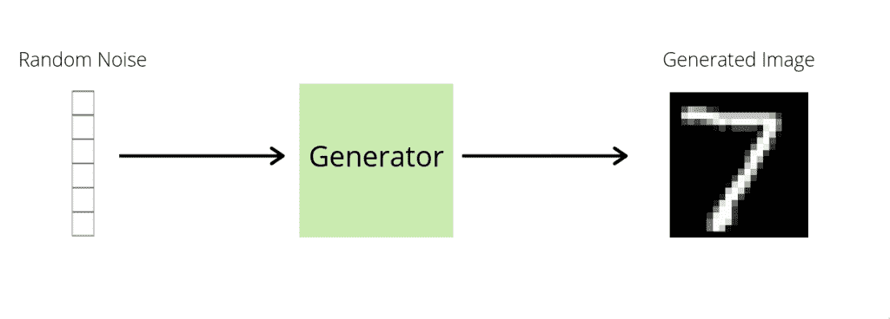
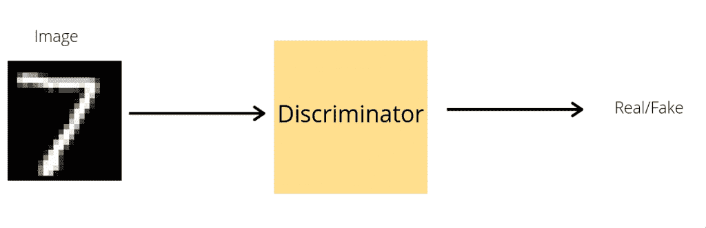
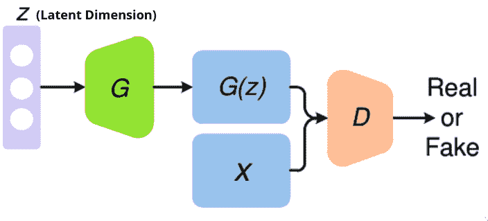
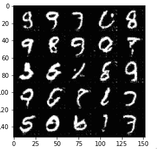
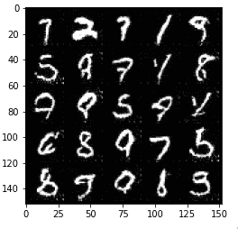

# 在 PyTorch 训练你的第一个 GAN

> 原文：<https://www.askpython.com/python-modules/training-gan-in-pytorch>

自 2014 年 Goodfellow 成立以来，甘一直是人们谈论的话题。在本教程中，您将学习在 PyTorch 中训练您的第一个 GAN。我们还试图解释 GAN 的内部工作原理，并通过 PyTorch 实现一个简单的 GAN。

## 要导入的库

我们首先导入将在实现中使用的库和函数。

```py
import torch
from torch import nn

from torchvision import transforms
from torchvision.utils import make_grid

from torchvision.datasets import MNIST 
from torch.utils.data import DataLoader

import matplotlib.pyplot as plt
from IPython.display import clear_output

```

## 什么是甘？

生成网络可以简单地描述为能够从训练数据中学习并生成类似训练数据的数据的网络。设计生成模型有多种方法，其中一种是对抗性的。

在一个**生成对抗网络**中，有两个子模型——生成器和鉴别器。我们将更详细地研究这些子模型:

### 1.发电机

顾名思义，生成器的任务是生成图像。

生成器接受小的低维输入(通常是 1-D 向量),并给出 128×128×3 的图像数据作为输出。

这种将低维缩放到高维的操作是使用系列反卷积和卷积层来实现的。

我们的生成器可以被认为是接收低维数据并将其映射到高维图像数据的函数。

在训练期间，生成器学习如何越来越有效地将低维数据映射到高维数据。

生成器的目标是生成一个可以欺骗鉴别器的真实图像。



Fig 1: Working of the Generator

**发电机类别:**

```py
class Generator(nn.Module):
  def __init__(self, z_dim, im_chan, hidden_dim=64):
        super().__init__()
        self.z_dim = z_dim
        self.gen = nn.Sequential(

            # We define the generator as stacks of deconvolution layers
            # with batch normalization and non-linear activation function
            # You can try to play with the values of the layers

            nn.ConvTranspose2d(z_dim, 4*hidden_dim, 3, 2),
            nn.BatchNorm2d(4*hidden_dim),
            nn.ReLU(inplace=True),

            nn.ConvTranspose2d(hidden_dim * 4, hidden_dim * 2, 4, 1),
            nn.BatchNorm2d(hidden_dim*2),
            nn.ReLU(inplace=True),

            nn.ConvTranspose2d(hidden_dim * 2, hidden_dim ,3 ,2),
            nn.BatchNorm2d(hidden_dim),
            nn.ReLU(inplace=True),

            nn.ConvTranspose2d(hidden_dim, im_chan, 4, 2),
            nn.Tanh()
        )
  def forward(self, noise):

      # Define how the generator computes the output

      noise = noise.view(len(noise), self.z_dim, 1, 1)
      return self.gen(noise)

```

```py
# We define a generator with latent dimension 100 and img_dim 1
gen = Generator(100, 1)
print("Composition of the Generator:", end="\n\n")
print(gen)

```

```py
Compostion of the Generator:

Generator(
  (gen): Sequential(
    (0): ConvTranspose2d(100, 256, kernel_size=(3, 3), stride=(2, 2))
    (1): BatchNorm2d(256, eps=1e-05, momentum=0.1, affine=True, track_running_stats=True)
    (2): ReLU(inplace=True)
    (3): ConvTranspose2d(256, 128, kernel_size=(4, 4), stride=(1, 1))
    (4): BatchNorm2d(128, eps=1e-05, momentum=0.1, affine=True, track_running_stats=True)
    (5): ReLU(inplace=True)
    (6): ConvTranspose2d(128, 64, kernel_size=(3, 3), stride=(2, 2))
    (7): BatchNorm2d(64, eps=1e-05, momentum=0.1, affine=True, track_running_stats=True)
    (8): ReLU(inplace=True)
    (9): ConvTranspose2d(64, 1, kernel_size=(4, 4), stride=(2, 2))
    (10): Tanh()
  )
)

```

*补充说明:*图像是一个非常高维的数据。即使是 3x128x128 尺寸的 RGB 图像，大小也是 49152。

我们想要的图像存在于这样一个巨大空间的子空间或流形中。

理想情况下，生成器应该学习子空间的位置，并从学习的子空间中随机采样以产生输出。

搜索这个理想子空间是一个计算量非常大的任务，处理这个最常见的方法是使用向前推进将一个潜在向量空间映射到数据空间。

### 2.鉴别器

我们的鉴别器 D 手头有一个更简单但同样重要的任务。鉴别器是一个[二元分类器](https://www.askpython.com/python/examples/naive-bayes-classifier)，它指示输入数据是来自原始源还是来自我们的生成器。一个理想的鉴别器应该把来自原始分布的数据归类为真，把来自 G 的数据归类为假。



Fig 2: Working of the disrciminator

```py
class Discriminator(nn.Module):
    def __init__(self, im_chan, hidden_dim=16):

        super().__init__()
        self.disc = nn.Sequential(

            # Discriminator is defined as a stack of
            # convolution layers with batch normalization
            # and non-linear activations.

            nn.Conv2d(im_chan, hidden_dim, 4, 2),
            nn.BatchNorm2d(hidden_dim),
            nn.LeakyReLU(0.2,inplace=True),

            nn.Conv2d(hidden_dim, hidden_dim * 2, 4, 2),
            nn.BatchNorm2d(hidden_dim*2),
            nn.LeakyReLU(0.2,inplace=True),

            nn.Conv2d(hidden_dim*2, 1, 4, 2)
        )

    def forward(self, image):

        disc_pred = self.disc(image)
        return disc_pred.view(len(disc_pred), -1)

```

```py
# We define a discriminator for one class classification
disc = Discriminator(1)
print("Composition of the Discriminator:", end="\n\n")
print(disc)

```

```py
Composition of the Discriminator:

Discriminator(
  (disc): Sequential(
    (0): Conv2d(1, 16, kernel_size=(4, 4), stride=(2, 2))
    (1): BatchNorm2d(16, eps=1e-05, momentum=0.1, affine=True, track_running_stats=True)
    (2): LeakyReLU(negative_slope=0.2, inplace=True)
    (3): Conv2d(16, 32, kernel_size=(4, 4), stride=(2, 2))
    (4): BatchNorm2d(32, eps=1e-05, momentum=0.1, affine=True, track_running_stats=True)
    (5): LeakyReLU(negative_slope=0.2, inplace=True)
    (6): Conv2d(32, 1, kernel_size=(4, 4), stride=(2, 2))
  )

```



Fig 3: Working of the model

## GAN 中的损失函数

现在我们定义发生器和鉴频器的损耗。

### 1.发电机损耗

生成器试图生成图像来欺骗鉴别者，让他们认为这些图像是真实的。

因此，生成器试图最大化将假图像分配给真标签的概率。

所以发生器损失是鉴别器将生成的图像分类为假的期望概率。

```py
def gen_loss(gen, disc, num_images, latent_dim, device):

    # Generate the the fake images
    noise = random_noise(num_images, latent_dim).to(device)
    gen_img = gen(noise)

    # Pass through discriminator and find the binary cross entropy loss
    disc_gen = disc(gen_img)
    gen_loss = Loss(disc_gen, torch.ones_like(disc_gen))

    return gen_loss

```

### 2.鉴频器损耗

我们希望鉴别器最大化将真标签分配给真实图像的概率，并且最大化将假标签分配给假图像的概率。

类似于发生器损耗，鉴别器损耗是真实图像被分类为假图像和假图像被分类为真实图像的概率。

请注意我们两个模型的损失函数是如何相互作用的。

```py
def disc_loss(gen, disc, real_images, num_images, latent_dim, device):

    # Generate the fake images
    noise = random_noise(num_images, latent_dim).to(device);
    img_gen = gen(noise).detach()

    # Pass the real and fake images through discriminator
    disc_gen = disc(img_gen)
    disc_real = disc(real_images)

    # Find loss for the generator and discriminator
    gen_loss  = Loss(disc_gen, torch.zeros_like(disc_gen))
    real_loss = Loss(disc_real, torch.ones_like(disc_real))

    # Average over the losses for the discriminator loss
    disc_loss = ((gen_loss + real_loss) /2).mean()

    return disc_loss

```

## 正在加载 MNIST 训练数据集

我们加载了 [MNIST 的训练数据](https://www.askpython.com/python/examples/load-and-plot-mnist-dataset-in-python)。我们将使用[火炬视觉](https://www.askpython.com/python-modules/pytorch)包下载所需的数据集。

```py
# Set the batch size
BATCH_SIZE = 512

# Download the data in the Data folder in the directory above the current folder
data_iter = DataLoader(
                MNIST('../Data', download=True, transform=transforms.ToTensor()),
                      batch_size=BATCH_SIZE,
                      shuffle=True)

```

## 初始化模型

设置模型的超参数。

```py
# Set Loss as Binary CrossEntropy with logits 
Loss = nn.BCEWithLogitsLoss()
# Set the latent dimension
latent_dim = 100
display_step = 500
# Set the learning rate
lr = 0.0002

# Set the beta_1 and beta_2 for the optimizer
beta_1 = 0.5 
beta_2 = 0.999

```

根据您是否启用了硬件加速，将设备设置为 cpu 或 cuda。

```py
device = "cpu"
if torch.cuda.is_available():
  device = "cuda"
device

```

现在我们初始化生成器、鉴别器和优化器。我们还初始化了层的起始/初始权重。

```py
# Initialize the Generator and the Discriminator along with
# their optimizer gen_opt and disc_opt
# We choose ADAM as the optimizer for both models
gen = Generator(latent_dim, 1).to(device)
gen_opt = torch.optim.Adam(gen.parameters(), lr=lr, betas=(beta_1, beta_2))
disc = Discriminator(1 ).to(device) 
disc_opt = torch.optim.Adam(disc.parameters(), lr=lr, betas=(beta_1, beta_2))

# Initialize the weights of the various layers
def weights_init(m):
    if isinstance(m, nn.Conv2d) or isinstance(m, nn.ConvTranspose2d):
        torch.nn.init.normal_(m.weight, 0.0, 0.02)
    if isinstance(m, nn.BatchNorm2d):
        torch.nn.init.normal_(m.weight, 0.0, 0.02)
        torch.nn.init.constant_(m.bias, 0)

# Apply the initial weights on the generator and discriminator 
gen = gen.apply(weights_init)
disc = disc.apply(weights_init)

```

## 设置实用功能

我们总是需要一些效用函数，这些函数并不特别适合我们的应用程序，但是可以使我们的一些任务变得更容易。我们使用 torchvision make_grid 函数定义了一个可以在网格中显示图像的函数。

```py
def display_images(image_tensor, num_images=25, size=(1, 28, 28)):

    image_unflat = image_tensor.detach().cpu().view(-1, *size)
    image_grid = make_grid(image_unflat[:num_images], nrow=5)
    plt.imshow(image_grid.permute(1, 2, 0).squeeze())
    plt.show()

```

我们定义一个噪声函数来产生随机噪声，该随机噪声将被用作生成器的输入。

```py
def random_noise(n_samples, z_dim):
  return torch.randn(n_samples, z_dim)

```

## PyTorch 中 GAN 的训练循环

```py
# Set the number of epochs
num_epochs = 100
# Set the interval at which generated images will be displayed
display_step = 100
# Inter parameter
itr = 0

for epoch in range(num_epochs):
  for images, _ in data_iter:

   num_images = len(images)
   # Transfer the images to cuda if harware accleration is present
   real_images = images.to(device) 

   # Discriminator step
   disc_opt.zero_grad()
   D_loss = disc_loss(gen, disc, real_images, num_images, latent_dim, device)
   D_loss.backward(retain_graph=True)
   disc_opt.step()

   # Generator Step
   gen_opt.zero_grad()
   G_loss = gen_loss(gen, disc, num_images, latent_dim, device)
   G_loss.backward(retain_graph=True)
   gen_opt.step()

   if itr% display_step ==0 :
    with torch.no_grad():
      # Clear the previous output
      clear_output(wait=True)
      noise =  noise = random_noise(25,latent_dim).to(device)
      img = gen(noise)
      # Display the generated images
      display_images(img)
  itr+=1

```

### 结果

这些是我们 GAN 的一些结果。

*   
*   

## 结论

我们已经看到了如何从一组图像中生成新的图像。gan 并不局限于数字的图像。现代的 GANs 足够强大，可以生成真实的人脸。gan 现在被用来创作音乐、艺术等。如果你想了解更多关于 GAN 的工作原理，你可以参考 Goodfellow 的这篇原始的 GAN 论文。