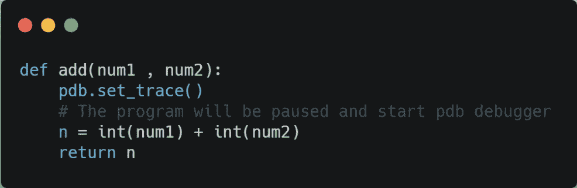
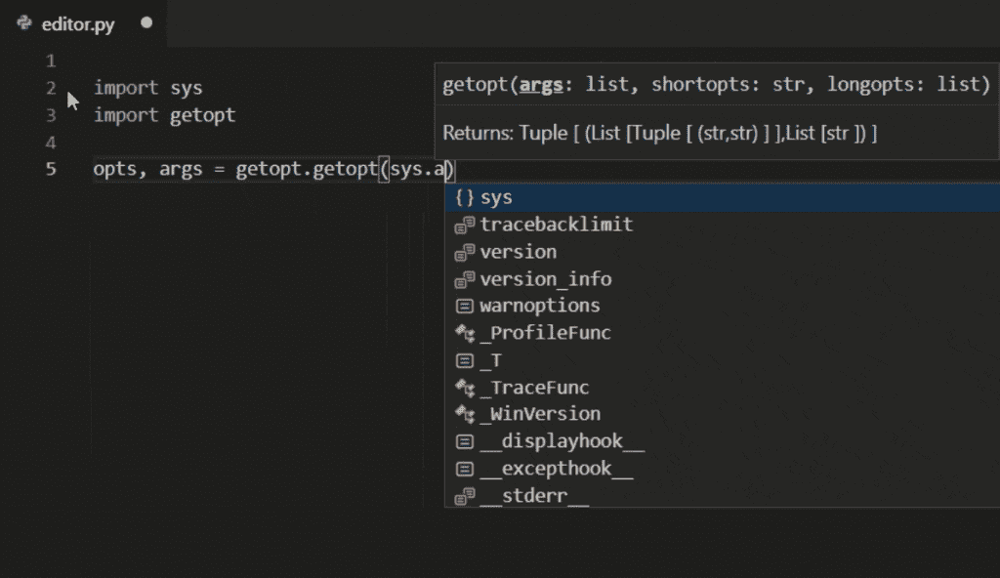
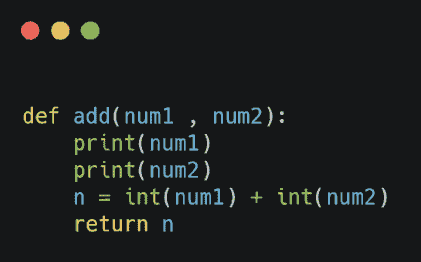
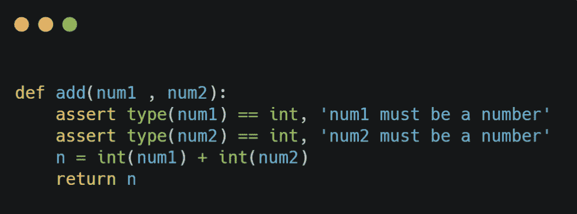
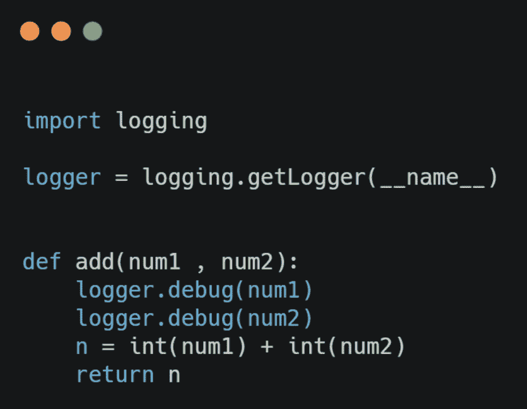
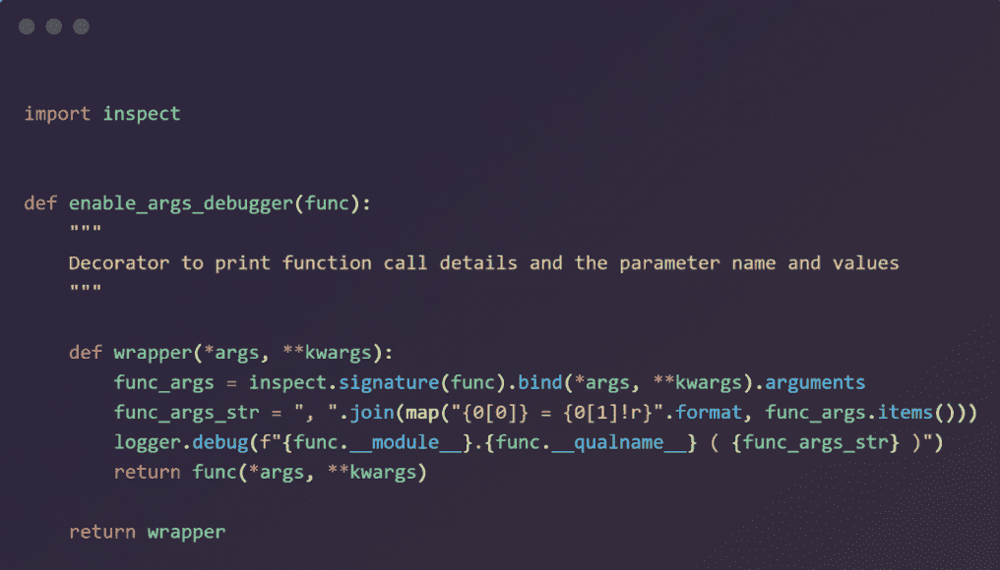
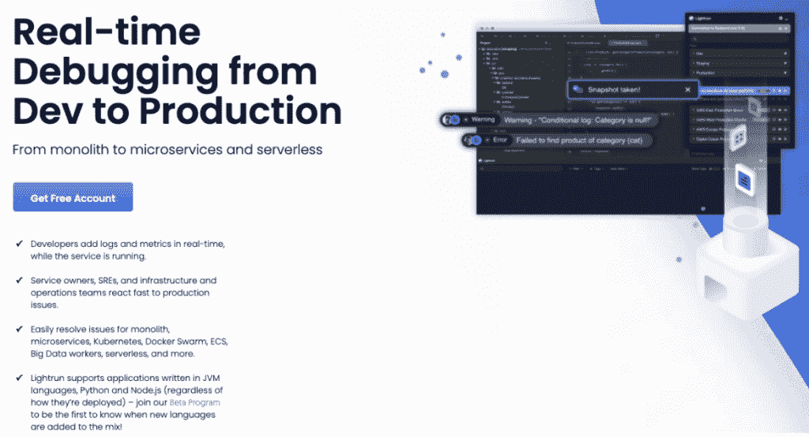

# 在 Python 中简化调试的技巧

> 原文：<https://www.askpython.com/python/tricks-for-easier-debugging-in-python>

即使您编写了干净、高效、可读的代码，并且用单元测试用例很好地覆盖了您的代码，也不可能只编写一次就一直完美地运行它。大多数情况下，bug 是不可避免的，调试是开发人员日常生活的一部分。因此，学习调试技巧将提高您和您的代码的性能和效率。这篇文章向你介绍了一些在 Python 中更容易调试的技巧和工具。

## 战略

有效调试的第一步也是最重要的一步是识别实际的错误。一旦我们获得了错误的详细信息，我们需要找到错误的位置，分析错误的情况和问题的潜在原因，并解决它。你需要有正确的策略和正确的工具。

调试有几种策略。一个是正向分析，一个是反向分析。

**正向分析**方法包括在调试器模式下重新运行代码，在可疑行中设置断点，并进行调试。要做正向分析，可以使用 pdb 和 IDE 高效调试。

**逆向分析**方法包括使用错误发生时从生产环境中收集的日志来跟踪问题。用于进行反向分析的工具，如打印功能、记录器、快照等。，工作。

使用 Lightrun Cloud 这样的工具，可以实现向前和向后分析的结合，以进行实时调试，我们将在本文的后面讨论这一点。

使用这样的工具，开发人员可以在任何类型的应用程序中执行实时调试——整体和遗留应用程序、微服务和分布式系统。通过与 APM 和其他 DevOps 工具集成，开发人员可以访问快照、日志和性能指标，从而识别 bug 并有效解决问题。

## 使用 Python 调试器(pdb)进行正向分析

如果您允许程序在单步模式下运行，您可以随时检查运行代码的状态。pdb 是 [Python 内置的调试器工具](https://docs.python.org/3/library/pdb.html)。还有一些其他工具，比如 web-pdb，但是在大多数情况下，pdb 已经足够有用了。

要在 pdb 中运行程序，请运行以下命令:

*python-m pdb add . py*

程序将开始运行第一步。如果您想跳过并运行全部代码，请按 1。要执行下一行，请按 n。这将帮助您理解变量值和执行流程。

如果代码很大，并且希望设置断点，请使用 set_trace 方法:

## 使用 IDE 调试器进行正向分析

大多数 IDE 都有很多功能，比如设置断点、单步执行、单步进入、继续等。这些命令有助于开发人员高效地进行调试。目前一些适用于 Python 的好的 IDE 有:

JetBrains 的 PyCharm IDE 有一个集成的调试器和测试运行器，以及大量现成的工具。

[Visual Studio 代码](https://code.visualstudio.com/) : Visual Studio 代码有 Python 对微软 Python 扩展的支持。

如果您正在使用 Windows 10 或 11，并为 Linux 系统构建应用程序， [WSL](https://docs.microsoft.com/en-us/windows/wsl/install) 是进行开发和测试的好方法。Visual Studio 与远程 WSL 扩展和 Python 扩展相结合，使开发人员能够在 WSL 中运行时进行编辑和远程调试。

在少数情况下，不可能重现类似的情景。在这种情况下，向后分析有助于开发人员识别和解决问题。

## 具有打印/断言功能的反向分析

最简单但功能强大的调试方法是将变量和事件消息打印到控制台，并检查打印的值是预期值还是代码执行中出错了。

为了克服 print 语句中的问题，开发人员可以使用 assert 语句。如果不满足其语句条件，Python 的内置 assert 方法可以引发 AssertionError。

Python 为您提供了在使用 assert 时启用或禁用的灵活性。您可以在运行代码时使用-0 参数来关闭程序中的所有 assert 语句。之后，所有的 assert 方法都将不起作用。

尽管如此，拥有大量的 assert 语句使得代码不可读并且有点混乱。

## 使用记录器进行反向分析

用 logger 替换所有的 print 语句是调试 log 语句最专业、最强大的方法。对于开发人员来说，它是一个重型武器，因为它给了他们更多的灵活性来启用和禁用。此外，您可以设置日志级别来启用某些日志。

使用 log 语句进行调试的最简单的方法之一是在所有方法中添加 debug 语句。因此，当任何方法被执行时，该方法将记录一个带有参数值的调试语句。开发人员可以使用 decorator 函数在内部记录参数值，而不是在所有方法中编写 log 语句。使用下面的代码片段创建一个装饰函数，并在所有要打印参数的方法前添加***@ enable _ args _ debugger***。

## 闪电云

无论应用程序是在云上运行还是在本地运行，是在应用服务器上运行还是在无服务器上运行，或者是容器化的， [Lightrun Cloud](https://lightrun.com/cloud/) 都是一款免费工具，可以帮助开发人员轻松识别问题并快速解决问题。它减少了交付时间，增加了实时添加日志或快照的灵活性，而无需更改代码。

### **使用 Lightrun 日志进行实时调试**

在代码发布后添加日志或断言语句是一个繁琐的过程。您可以使用 Lightrun 日志来添加日志，而不是调用 CI/CD 管道来进行几行更改。它允许您在运行时在生产系统上添加任意多的日志。它可以与领先的 ide 集成。有了这个工具，开发人员可以自由地专注于花里胡哨下的核心业务逻辑。

### **使用 Lightrun 快照进行实时调试**

在许多情况下，开发人员很难理解执行流程。如果开发人员有堆栈跟踪和变量，他们很容易理解是否缺少逻辑或者条件执行是否没有按预期工作。Lightrun 快照是虚拟断点，可以在不破坏系统的情况下提取所有数据。

使用 Lightrun，您可以拥有条件快照，与您正在使用的 IDE 集成，并在不破坏系统的情况下添加任意数量的快照。

### **使用 Lightrun 性能指标进行实时调试**

bug 不仅仅是逻辑缺失/错误。它们也可能是瓶颈和长时间的查询。这些与性能相关的错误可以使用 Lightrun 解决。您可以添加性能指标监控和日志示例，计算特定代码的执行次数，测量两次函数执行之间的时间，并收集系统统计信息，如延迟和吞吐量计数器。开发人员和 DevOps 工程师为每种调试策略使用多种工具，如远程调试、日志传送、应用程序性能监控和内存快照。然而，Lightrun Cloud 是一个满足所有开发人员调试需求的地方，包括日志记录、指标和 APM、快照和[远程调试](https://lightrun.com/debugging/remote-debugging/)。它还与各种 DevOps 工具相集成，从而能够顺利实现其优势。