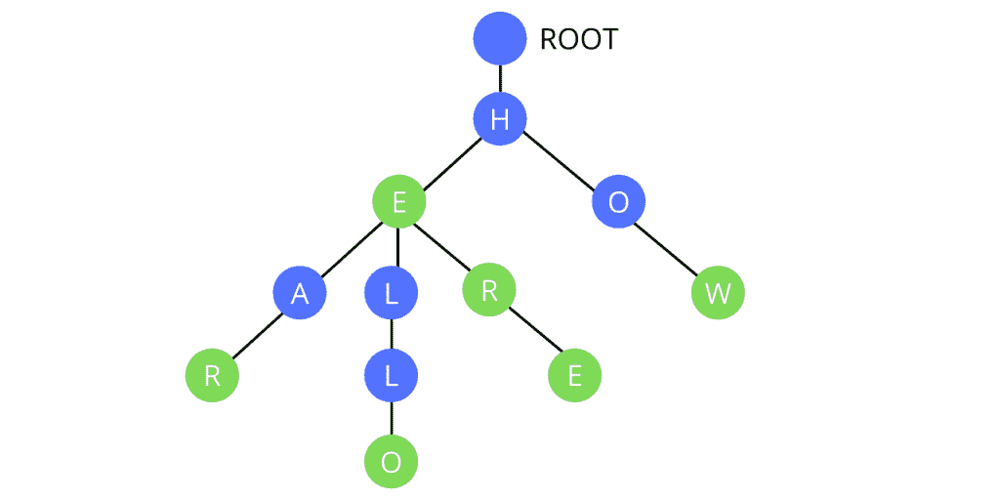

# 用 Python 实现 Trie 数据结构

> 原文：<https://www.askpython.com/python/examples/trie-data-structure>

数据结构在信息检索方面非常有效。它主要用于实现[字典](https://www.askpython.com/python/dictionary/python-dictionary-comprehension)和电话簿。

它对于实现在键盘上键入时看到的自动文本建议也很有用。

在本教程中，我们将了解如何用 Python 实现我们自己的 trie 数据结构。

在本教程中，您将学习以下内容:

*   如何实现你自己的 Trie 数据结构。
*   如何在 Trie 数据结构中插入数据？
*   如何在 Trie 数据结构中查询单词？

## 实现 TrieNode 类

让我们从编写 **TrieNode 类**的代码开始。每个 trie 节点需要具有以下字段:

1.  一个角色
2.  儿童名单
3.  一个布尔值，它表明一个单词是否在该节点结束。

让我们为 TrieNode 类编写代码:

```py
class TrieNode:

    def __init__(self, char):

        self.char = char

        self.is_end = False

        self.children = {}

```

初始化 TrieNode 时，我们需要提供一个字符。

**。is_end** 标记一个字是否在当前节点结束。默认情况下，它被设置为 false。

## 编写 Trie 数据结构类

让我们继续为我们的 Trie 类编写代码。

要初始化一个 trie，我们需要初始化一个 trie 节点，并提供在 trie 中插入和搜索的方法。

```py
class Trie(object):

    def __init__(self):

        self.root = TrieNode("")

```

这部分负责初始化一个空的 TrieNode。

### 如何在我们的 Trie 中执行插入操作？

让我们看看插入是如何在 Trie 数据结构中发生的。

为了进行插入，我们需要逐个字符地遍历要插入的单词。

同时，我们需要从根开始向下移动 Trie，看看孩子的列表是否有那个字符。如果该字符不存在，那么我们需要用该字符创建一个新的 TrieNode，并将其添加到孩子列表中。

当我们到达单词的末尾时，我们需要为对应于单词最后一个字符的节点设置 **is_end** 为真。

下面是上面讨论的方法的实现。

```py
def insert(self, word):

        node = self.root

#traverse the word character by character 
        for char in word:
#check if the character is there in the list of children 

            if char in node.children:
                node = node.children[char]
            else:
# else make a new TrieNode corresponding to that character 

                new_node = TrieNode(char)

# add the new node to the list of children 

                node.children[char] = new_node
                node = new_node

#after traversig the word set .is_end to true for the last #char
        node.is_end = True

```

这将照顾我们所有的插入。

考虑一个包含以下单词的 Trie:

*   这里
*   听
*   她
*   男性
*   你好
*   怎么

对应于这些单词的 trie 将如下所示:



Trie

这里的**绿色节点**对应于该节点的**为真**。

### 如何在我们的 Trie 中搜索？

现在让我们看看如何在我们的特里搜索单词。我们不想为搜索执行精确匹配。相反，我们想要的是获得以我们要搜索的字符串开始的单词列表。

在搜索时，我们将只提供前缀，搜索功能应该能够返回以该前缀开始的所有单词。

例如，如果我们搜索**“他”**，我们应该得到以下单词。

*   男性
*   这里
*   听
*   她
*   你好

这些都是以“他”开头的词。trie 的这一方面使得它对于在键盘中实现自动完成非常有用。

在搜索单词时，我们以 DFS 的方式进行搜索。因此，我们需要编写一个函数，用于在我们的 trie 中执行 [DFS 搜索](https://www.askpython.com/python/examples/depth-first-search-algorithm)。

```py
 def dfs(self, node, pre):

        if node.is_end:
            self.output.append((pre + node.char))

        for child in node.children.values():
            self.dfs(child, pre + node.char)

```

在调用函数时，我们需要传递一个节点和到目前为止搜索到的前缀。每当搜索到达一个节点，并且 ***为真***时，它会将该单词附加到输出列表中。

否则，它继续以 DFS 方式在子节点中搜索。

搜索功能如下:

```py
def search(self, x):

        node = self.root
# traverse the search query and move down the trie        
        for char in x:
            if char in node.children:
                node = node.children[char]
            else:
              #if query doesn't match the nodes in trie
                return []

        self.output = []
#call DFS 
        self.dfs(node, x[:-1])

        return self.output

```

在搜索时，我们遍历搜索查询并同时向下移动 trie。

然后，我们在与查询的最后一个字符对应的节点上调用 DFS。

然后，DFS 函数从最后一个字符开始向下移动，将所有完整的单词添加到输出列表中。

## 完全码

本教程的完整代码如下所示:

```py
class TrieNode:

    def __init__(self, char):

        self.char = char

        self.is_end = False

        self.children = {}

class Trie(object):

    def __init__(self):

        self.root = TrieNode("")

    def insert(self, word):

        node = self.root

        for char in word:
            if char in node.children:
                node = node.children[char]
            else:

                new_node = TrieNode(char)
                node.children[char] = new_node
                node = new_node

        node.is_end = True

    def dfs(self, node, pre):

        if node.is_end:
            self.output.append((pre + node.char))

        for child in node.children.values():
            self.dfs(child, pre + node.char)

    def search(self, x):

        node = self.root

        for char in x:
            if char in node.children:
                node = node.children[char]
            else:

                return []

        self.output = []
        self.dfs(node, x[:-1])

        return self.output

```

## 行动中的尝试

让我们试着向一个 trie 中添加一些单词，并进行搜索查询。

```py
tr = Trie()
tr.insert("here")
tr.insert("hear")
tr.insert("he")
tr.insert("hello")
tr.insert("how ")
tr.insert("her")

```

这将创建一个 trie，并将这五个单词添加到其中。

现在我们可以使用下面一行进行查询:

```py
tr.search("he")

```

输出:

```py
['he', 'her', 'here', 'hear', 'hello']

```

让我们做另一个查询:

```py
tr.search("her")

```

输出:

```py
['her', 'here']

```

## 结论

本教程讲述了 Python 中 Trie 数据结构的实现。我们学习了如何创建一个 trie 类，如何执行插入，以及如何在 Trie 中查询单词。