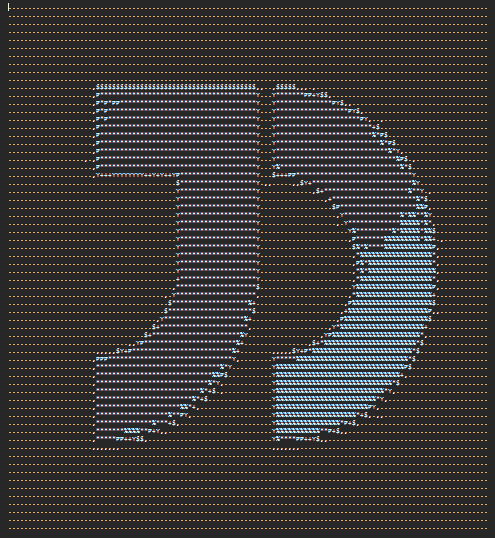
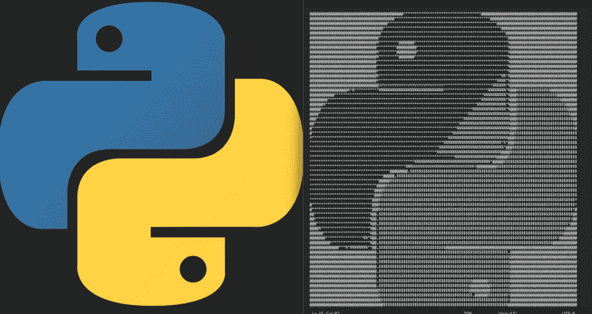
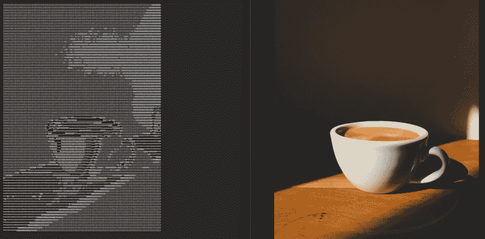

# 使用 Python 将图像转换为 ASCII 艺术

> 原文：<https://www.askpython.com/python/examples/turn-images-to-ascii-art-using-python>

在本教程中，我们将学习如何使用 Python 编程语言将任何图像转换为 ASCII 艺术。我相信你听说过 ASCII 艺术，这是一种图形设计技术，使用可打印的 ASCII 字符来显示图像。请看下图中的例子。



Image 3

现在我们清楚了在本教程结束时我们的目标是什么。让我们不要再浪费时间，开始代码实现。

## 使用 Python 从图像创建 ASCII 艺术作品

在本节中，您将学习如何使用 Python 从图像生成 ASCII 艺术。

### 加载图像

第一步也是最重要的一步是使用 PIL 库将图像加载到我们的程序中。我们将利用异常处理来确保我们预先处理了错误。我们将使用一个标志变量来知道图像是否在系统中。

***推荐阅读: [Python 异常处理——Python 尝试——除](https://www.journaldev.com/14444/python-exception-handling-try-except)***

```py
import PIL.Image

img_flag = True
path = input("Enter the path to the image field : \n")

try:
  img = PIL.Image.open(path)
  img_flag = True
except:
  print(path, "Unable to find image ")

```

### 调整图像大小

我们需要将图像的宽度和高度调整到一个更小的值，这样它就不会有太大的文本而造成混乱。

```py
width, height = img.size
aspect_ratio = height/width
new_width = 120
new_height = aspect_ratio * new_width * 0.55
img = img.resize((new_width, int(new_height)))

```

### 将图像转换为灰度

我们可以使用`convert`函数，并将选项作为`L`传递给灰度图像输出。

```py
img = img.convert('L')

```

### 创建一个 ASCII 字符列表

请记住，ASCII 字符是从最暗到最亮排列的，这意味着对于下面显示的列表，最暗的像素将被替换为`@`，最亮的像素将被替换为`.`。您可以根据自己的喜好更改列表。

```py
chars = ["@", "J", "D", "%", "*", "P", "+", "Y", "$", ",", "."]

```

### 转换成 ASCI 艺术图

为了将图像转换为 ASCII 字符，我们获取图像中每个像素的像素值，并将相应的 ASCII 字符映射在一起，形成一个新的字符串。现在，我们使用`to_greyscale`函数将我们的图像转换成`GreyScale image`和`pixel_to_ascii`函数将我们的图像转换成 ASCII 艺术！我们还将把结果文本保存到一个文件中。

```py
pixels = img.getdata()
new_pixels = [chars[pixel//25] for pixel in pixels]
new_pixels = ''.join(new_pixels)

# split string of chars into multiple strings of length equal to new width and create a list
new_pixels_count = len(new_pixels)
ascii_image = [new_pixels[index:index + new_width] for index in range(0, new_pixels_count, new_width)]
ascii_image = "\n".join(ascii_image)
print(ascii_image)

# write to a text file.
with open("sample_ascii_image.txt", "w") as f:
 f.write(ascii_image)

```

## 完整代码

让我们看一下我们在上一节中编写的完整代码。

```py
import PIL.Image

img_flag = True
path = input("Enter the path to the image field : \n")

try:
  img = PIL.Image.open(path)
  img_flag = True
except:
  print(path, "Unable to find image ");

width, height = img.size
aspect_ratio = height/width
new_width = 120
new_height = aspect_ratio * new_width * 0.55
img = img.resize((new_width, int(new_height)))

img = img.convert('L')

chars = ["@", "J", "D", "%", "*", "P", "+", "Y", "$", ",", "."]

pixels = img.getdata()
new_pixels = [chars[pixel//25] for pixel in pixels]
new_pixels = ''.join(new_pixels)
new_pixels_count = len(new_pixels)
ascii_image = [new_pixels[index:index + new_width] for index in range(0, new_pixels_count, new_width)]
ascii_image = "\n".join(ascii_image)

with open("ascii_image.txt", "w") as f:
 f.write(ascii_image)

```

## 一些示例输出



Image 4



Image 5

## 结论

继续，用许多不同的角色尝试这个练习，自己看看结果。你可能也会发现一些非常有趣的结果！让我们在下面的评论中知道哪一个最适合你。