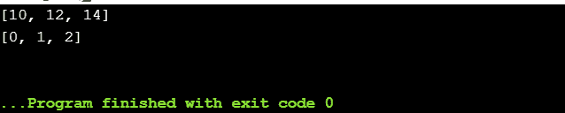
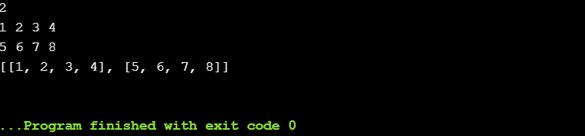
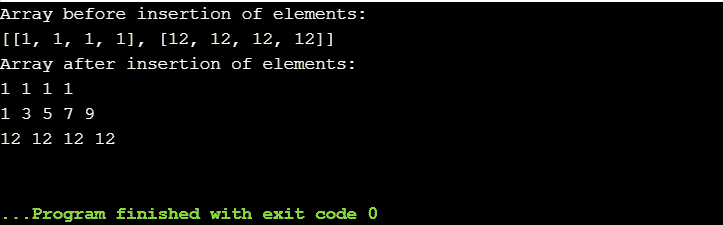
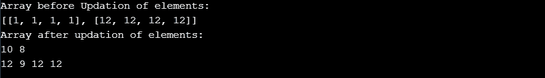
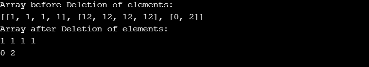
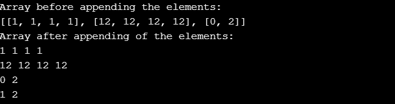
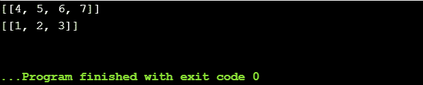

# Python 中的二维数组

> 原文：<https://www.askpython.com/python/two-dimensional-array-in-python>

`**Array**`基本上是一种以线性方式存储数据的数据结构。Python 中没有排他的数组对象，因为用户可以使用一个列表来执行数组的所有操作。

因此，Python 使用 list 对象执行所有与数组相关的操作。数组是按顺序排列的元素的有序集合。

**声明数组的语法**:

`array-name = []`

二维数组基本上是数组中的数组。这里，通过使用两个索引来访问数据项的位置。它被表示为数据项目的`*rows and columns*`的表格。

* * *

## 二维数组的声明

**语法**:

`array-name = [ [d1, d2, .... dn], [e1, e2, .... en] ]`

**举例**:

```py
array_input = [ [10,12,14] ,[0,1,2] ]
print(array_input[0]) # printing elements of row 0
print(array_input[1]) # printing elements of row 1

```

**输出:**



*Output-2D Array*

* * *

## 二维数组的输入

二维数组的输入以行和列的形式提供。

**举例:**

```py
size = int(input()) 
array_input = []
for x in range(size):
    array_input.append([int(y) for y in input().split()])
print(array_input)

```

**输出:**



*Output-Input 2D Array*

* * *

## 如何在二维数组中`Insert`元素？

可以使用`insert()`函数指定要插入元素的索引/位置来插入 2D 数组中的元素。

```py
from array import *
input = [[1,1,1,1], [12,12,12,12]]
print("Array before insertion of elements: ")
print(input)

input.insert(1, [1,3,5,7,9])
print("Array after insertion of elements: ")
for x in input:
    for y in x:
        print(y,end = " ")
    print()

```

**输出:**



*Output-Insertion 2D Array*

* * *

## 如何在二维数组中`Update`元素？

通过使用数组的索引重新分配值，可以更新元素和更改值。

```py
from array import *
input = [[1,1,1,1], [12,12,12,12]]
print("Array before Updation of elements: ")
print(input)

input[0] = [10,8]
input[1][1] = 9
print("Array after updation of elements: ")
for x in input:
    for y in x:
        print(y,end = " ")
    print()

```

**输出:**



*Output-Updation 2D Array*

* * *

## 如何删除二维数组中的值？

使用`del()`方法可以删除二维数组中的元素。

```py
from array import *
input = [[1,1,1,1], [12,12,12,12], [0,2]]
print("Array before Deletion of elements: ")
print(input)

del(input[1])
print("Array after Deletion of elements: ")
for x in input:
    for y in x:
        print(y,end = " ")
    print()

```

**输出**:



*Output-Deletion 2D Array*

* * *

## 二维数组的大小

使用`len()`方法可以确定数组的长度。

```py
array_input = [[3,9],[0,3,7,10]]
print(len(array_input))

```

**输出**:

**2**

* * *

## Python 二维数组追加

可以使用`append()`方法将元素追加到数组中。元素被添加到数组的末尾。

```py
from array import *
input = [[1,1,1,1], [12,12,12,12], [0,2]]
print("Array before appending the elements: ")
print(input)

input.append([1,2])
print("Array after appending of the elements: ")
for x in input:
    for y in x:
        print(y,end = " ")
    print()

```

**输出:**



*Output-Append 2D Array*

* * *

## Python 中二维数组的切片

数组切片用于访问数组中的多个值。

**语法:**

`<slice_array> = <array>[start:stop]`

```py
array1 = [[1,2,3],[4,5,6,7]]

#python array slice

array2 = array1[1:3] #index 1 to 2
print(array2)

array2 = array1[:1] #index 0 to 1
print(array2)

```

**输出:**



*Output-Slicing 2D Array*

* * *

## 结论

因此，在本文中，我们已经对 Python 中的二维数组及其相关的基本功能进行了概述。

## 参考

*   Python 数组
*   Python 2D 数组
*   [Python 数组文档](https://docs.python.org/3.0/library/array.html)