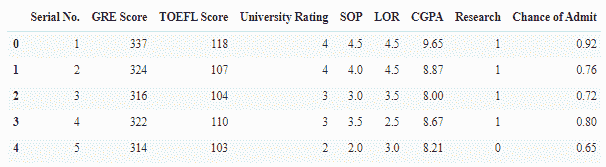

# Python 中的大学录取预测

> 原文：<https://www.askpython.com/python/examples/university-admission-prediction-in-python>

大学教育正在成为 21 世纪社会和经济生活的重要支柱。这不仅在教育过程中是至关重要的，而且在保证两件重要的事情上也是至关重要的:一份好工作和财务稳定。另一方面，预测大学入学可能极具挑战性，因为学生不知道入学标准。

因此，在本教程中，我们将使用 Python 编程语言构建自己的大学录取预测模型。

* * *

## 数据集简介

在国外申请硕士时，有几个变量需要考虑。你必须有一个体面的 GRE 成绩，一个 sop(目的声明)，或者一封推荐信，等等。如果你不是来自英语国家，你也需要提交托福成绩。

在 可以访问数据集 *[。数据集包括以下属性:](https://www.kaggle.com/mohansacharya/graduate-admissions)*

1.  GRE 成绩(满分 340 分)
2.  托福成绩(满分 120 分)
3.  大学评级(满分 5 分)
4.  目的陈述和推荐信强度(满分 5 分)
5.  本科 GPA(满分 10 分)
6.  研究经验(0 或 1)
7.  录取机会(范围从 0 到 1)

* * *

## 用 Python 实现大学录取保护

我们将把整个代码实现分成如下所述的若干步骤:

### 步骤 1:导入必要的模块/库

```py
import numpy as np 
import pandas as pd
from sklearn.model_selection import train_test_split
from keras.models import Sequential
from keras.layers import Dense ,Dropout,BatchNormalization
from keras.layers import Dense
from keras.wrappers.scikit_learn import KerasRegressor

```

### 步骤 2:将数据集加载到程序中

```py
df = pd.read_csv('Admission_Predict.csv')
df.head()

```



First5rows Of University Adm Pred Dataset

### 第三步:数据预处理和数据分割

在构建我们的主模型之前，我们需要一些预处理，包括删除模型不需要的任何列。

在这里,“序列号”列对于入院预测是不必要的，所以我们将其从数据中删除。

```py
df=df.drop("Serial No.",axis=1)

```

在此之后，我们将把数据集分成 X 和 Y 子数据集，其中 X 将包含所有信息，Y 将包含最终概率。

```py
Y=np.array(df[df.columns[-1]])
X=np.array(df.drop(df.columns[-1],axis=1))

```

现在，下一步是使用 80:20 训练测试拆分规则将数据集拆分为训练和测试数据集，其中 80%的数据用于训练，其余 20%用于测试。

```py
X_train, X_test, y_train, y_test = train_test_split(X,Y, test_size=0.2, random_state=0)

```

预处理还将涉及规范化训练数据集，这可以通过下面提到的代码来实现。

```py
from sklearn.preprocessing import MinMaxScaler
scaler =  MinMaxScaler()
X_train=scaler.fit_transform(X_train)
X_test=scaler.fit_transform(X_test)

```

### 步骤 3:构建模型

下面提到的代码是描述整个模型的主要功能，包括模型的声明和向模型添加层。

该功能还涉及模型的编译和损失的计算。

```py
def baseline_model():
    model = Sequential()
    model.add(Dense(16, input_dim=7, activation='relu'))
    model.add(Dense(16, input_dim=7, activation='relu'))
    model.add(Dense(16, input_dim=7, activation='relu'))
    model.add(Dense(16, input_dim=7, activation='relu'))
    model.add(Dense(1))    
    model.compile(loss='mean_squared_error', optimizer='adam')
    return model

```

### 第四步:模型的训练

下一步是创建模型对象，并在训练数据集上对其进行训练，如下面的代码所示。你可以根据自己的喜好保留历元的数量。

```py
estimator = KerasRegressor(build_fn=baseline_model, epochs=50, batch_size=3, verbose=1)
estimator.fit(X_train,y_train)

```

培训的成果如下:

```py
Epoch 1/50
107/107 [==============================] - 1s 3ms/step - loss: 0.1087
Epoch 2/50
107/107 [==============================] - 0s 4ms/step - loss: 0.0065
Epoch 3/50
107/107 [==============================] - 0s 3ms/step - loss: 0.0057
Epoch 4/50
107/107 [==============================] - 0s 3ms/step - loss: 0.0052
Epoch 5/50
107/107 [==============================] - 0s 4ms/step - loss: 0.0049
Epoch 6/50
107/107 [==============================] - 0s 3ms/step - loss: 0.0050
Epoch 7/50
107/107 [==============================] - 0s 3ms/step - loss: 0.0047
Epoch 8/50
107/107 [==============================] - 0s 3ms/step - loss: 0.0049
Epoch 9/50
107/107 [==============================] - 0s 3ms/step - loss: 0.0044
Epoch 10/50
107/107 [==============================] - 0s 3ms/step - loss: 0.0043
Epoch 11/50
107/107 [==============================] - 0s 3ms/step - loss: 0.0044
Epoch 12/50
107/107 [==============================] - 0s 3ms/step - loss: 0.0044
Epoch 13/50
107/107 [==============================] - 0s 4ms/step - loss: 0.0043
Epoch 14/50
107/107 [==============================] - 0s 3ms/step - loss: 0.0041
Epoch 15/50
107/107 [==============================] - 0s 3ms/step - loss: 0.0043
Epoch 16/50
107/107 [==============================] - 0s 3ms/step - loss: 0.0042
Epoch 17/50
107/107 [==============================] - 0s 3ms/step - loss: 0.0040
Epoch 18/50
107/107 [==============================] - 0s 3ms/step - loss: 0.0043
Epoch 19/50
107/107 [==============================] - 0s 3ms/step - loss: 0.0039
Epoch 20/50
107/107 [==============================] - 0s 4ms/step - loss: 0.0040
Epoch 21/50
107/107 [==============================] - 0s 3ms/step - loss: 0.0039
Epoch 22/50
107/107 [==============================] - 0s 3ms/step - loss: 0.0042
Epoch 23/50
107/107 [==============================] - 0s 3ms/step - loss: 0.0040
Epoch 24/50
107/107 [==============================] - 0s 3ms/step - loss: 0.0038
Epoch 25/50
107/107 [==============================] - 0s 3ms/step - loss: 0.0042
Epoch 26/50
107/107 [==============================] - 0s 3ms/step - loss: 0.0038
Epoch 27/50
107/107 [==============================] - 0s 3ms/step - loss: 0.0040
Epoch 28/50
107/107 [==============================] - 0s 3ms/step - loss: 0.0042
Epoch 29/50
107/107 [==============================] - 0s 3ms/step - loss: 0.0039
Epoch 30/50
107/107 [==============================] - 0s 3ms/step - loss: 0.0037
Epoch 31/50
107/107 [==============================] - 0s 3ms/step - loss: 0.0038
Epoch 32/50
107/107 [==============================] - 0s 3ms/step - loss: 0.0043
Epoch 33/50
107/107 [==============================] - 0s 3ms/step - loss: 0.0040
Epoch 34/50
107/107 [==============================] - 0s 3ms/step - loss: 0.0037
Epoch 35/50
107/107 [==============================] - 0s 3ms/step - loss: 0.0039
Epoch 36/50
107/107 [==============================] - 0s 3ms/step - loss: 0.0037
Epoch 37/50
107/107 [==============================] - 0s 3ms/step - loss: 0.0038
Epoch 38/50
107/107 [==============================] - 0s 3ms/step - loss: 0.0036
Epoch 39/50
107/107 [==============================] - 0s 3ms/step - loss: 0.0036
Epoch 40/50
107/107 [==============================] - 0s 3ms/step - loss: 0.0036
Epoch 41/50
107/107 [==============================] - 0s 3ms/step - loss: 0.0037
Epoch 42/50
107/107 [==============================] - 0s 3ms/step - loss: 0.0037
Epoch 43/50
107/107 [==============================] - 0s 4ms/step - loss: 0.0036
Epoch 44/50
107/107 [==============================] - 0s 3ms/step - loss: 0.0037
Epoch 45/50
107/107 [==============================] - 0s 3ms/step - loss: 0.0037
Epoch 46/50
107/107 [==============================] - 0s 4ms/step - loss: 0.0038
Epoch 47/50
107/107 [==============================] - 0s 3ms/step - loss: 0.0036
Epoch 48/50
107/107 [==============================] - 0s 3ms/step - loss: 0.0037
Epoch 49/50
107/107 [==============================] - 0s 4ms/step - loss: 0.0037
Epoch 50/50
107/107 [==============================] - 0s 3ms/step - loss: 0.0034
<keras.callbacks.History at 0x7f10c0173e10>
[19]
0s

```

### 步骤 5:测试模型

现在，让我们尝试预测测试数据集的值，并将它们与原始值进行匹配。

```py
prediction = estimator.predict(X_test)
print("ORIGINAL DATA")
print(y_test)
print()
print("PREDICTED DATA")
print(prediction)

```

输出看起来有点像这样:

```py
ORIGINAL DATA
[0.71 0.7  0.79 0.73 0.72 0.48 0.77 0.71 0.9  0.94 0.58 0.89 0.72 0.57
 0.78 0.42 0.64 0.84 0.63 0.72 0.9  0.83 0.57 0.47 0.85 0.67 0.44 0.54
 0.92 0.62 0.68 0.73 0.73 0.61 0.55 0.74 0.64 0.89 0.73 0.95 0.71 0.72
 0.75 0.76 0.86 0.7  0.39 0.79 0.61 0.64 0.71 0.8  0.61 0.89 0.68 0.79
 0.78 0.52 0.76 0.88 0.74 0.49 0.65 0.59 0.87 0.89 0.81 0.9  0.8  0.76
 0.68 0.87 0.68 0.64 0.91 0.61 0.69 0.62 0.93 0.43]

PREDICTED DATA
[0.64663166 0.6811929  0.77187485 0.59903866 0.70518774 0.5707331
 0.6844891  0.6232987  0.8559068  0.9225058  0.50917023 0.9055291
 0.6913604  0.40199894 0.8595592  0.6155516  0.5891675  0.793468
 0.5415057  0.7054745  0.8786436  0.8063141  0.55548865 0.3587063
 0.77944946 0.5391258  0.43374807 0.62050253 0.90883577 0.6109837
 0.64160395 0.7341113  0.73316455 0.5032365  0.7664028  0.76009744
 0.59858805 0.86267006 0.60282356 0.94984144 0.7196544  0.63529354
 0.7032968  0.8164513  0.8044792  0.6359613  0.54865533 0.6914524
 0.589018   0.55952907 0.6446153  0.77345765 0.6449453  0.8998446
 0.68746895 0.74362046 0.71107167 0.73258513 0.7594558  0.8374823
 0.7504637  0.4027493  0.61975926 0.46762955 0.8579673  0.814696
 0.7111042  0.8707262  0.7539967  0.7515583  0.5506843  0.8436626
 0.8139006  0.5593421  0.933276   0.61958474 0.6084135  0.63294107
 0.9234169  0.44476634]

```

您可以看到这些值在某种程度上确实匹配。但是让我们确定一下，我们也计算了平均误差。

### 第六步:计算平均误差

```py
from sklearn.metrics import accuracy_score

train_error =  np.abs(y_test - prediction)
mean_error = np.mean(train_error)

print("Mean Error: ",mean_error)

```

平均误差为***0.0577927375137806***，这足以说明我们的结果相当准确。

* * *

##  **结论**

恭喜你！你刚刚学习了如何制作自己的大学录取预测器。希望你喜欢它！😇

喜欢这个教程吗？无论如何，我建议你看一下下面提到的教程:

1.  [用 Python 进行加密价格预测](https://www.askpython.com/python/examples/crypto-price-prediction)
2.  [Python 中的票房收入预测——简单易行](https://www.askpython.com/python/examples/box-office-revenue-prediction)
3.  [利用 Python 进行股票价格预测](https://www.askpython.com/python/examples/stock-price-prediction-python)
4.  [使用 Python 进行葡萄酒分类——简单易懂](https://www.askpython.com/python/wine-classification)

感谢您抽出时间！希望你学到了新的东西！！😄

* * *