# 文件上传到 Django——如何上传文件到 Django 服务器？

> 原文：<https://www.askpython.com/django/upload-files-to-django>

本文涵盖了将文件上传到 Django 服务器的具体步骤。大多数网络应用程序和网站都允许用户将他们的个人资料图片或文件从本地计算机上传到服务器。

我们将在我们的教程中复制相同的教程。让我们看看如何使用 Django 和 ModelForms 将**文件和图像上传并处理到 web 服务器上。**

## 上传文件到 Django

让我们来看看在 Django 中我们需要什么来允许文件上传。

### 1.必备知识

在上一篇关于 [Django 表单](https://www.askpython.com/django/django-forms)的文章中，我们看到了获取表单数据；我们用**请求。在表单对象中发布**。

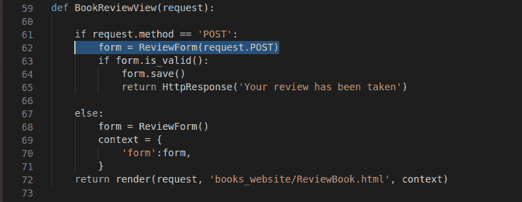

Request POST

但是为了**上传文件到 Django** ，我们需要包含另一个属性**请求。文件**也是如此，因为上传的文件存储在属性**请求中。文件**而不是 **request.POST.**

下面是代码的样子:

```py
form = ReviewForm(request.POST,request.FILES)

```

Django 有单独的模型字段来处理不同的文件类型—**image field 和 FileField** 。

当我们只想上传图像文件时，我们使用 ImageField。jpg/。jpeg/。png 等。)

为了允许文件上传，我们需要在 **<表单的>** 属性中添加以下属性。

```py
enctype ="multipart/form-data"

```

最后，表单 HTML 标记应该如下所示:

```py
<form type = 'post' enctype = "multipart/form-data">

```

### 2.修改 settings.py 以存储上传的文件

现在在 **settings.py** 文件的末尾添加以下几行。

```py
MEDIA_URL = ‘/media/’
MEDIA_ROOT = os.path.join(BASE_DIR, ‘media’)

```

这里:

*   **MEDIA_URL:** 这里提到了 **URL 端点**。这是用户可以从浏览器访问并上传文件的 URL
*   **MEDIA_ROOT:** 这一点我们已经在前面的 [Django Templates](https://www.askpython.com/django/django-templates) 文章中的模板目录设置下看到过。

如果你现在不明白，以后在**篇**里你会明白的！

第二行告诉 Django 将所有上传的文件存储在一个名为**‘media’**的文件夹中，该文件夹是在 BASE_DIR(即项目目录)中创建的。

我们需要手动创建文件夹，这样所有上传的文件都将存储在下面带下划线的媒体文件夹中:

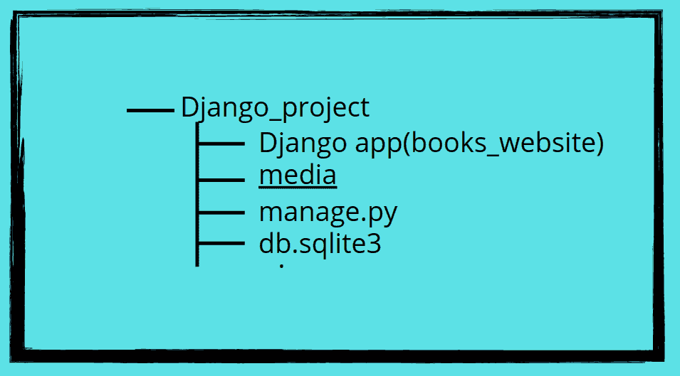

Django Project Directory

### 3.在 Django 项目中创建媒体文件夹。

现在在项目文件夹中，创建一个名为**‘media’的新文件夹**

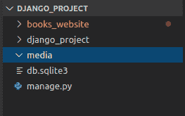

Media

一旦文件夹被创建，我们将移动到创建电子书上传网页。

## **创建电子书上传网页**

现在让我们制作一个网页，客户可以上传他们拥有的书籍的 pdf 文件。

### 1.**在 models.py 中创建电子书模型**

在 models.py 中，创建一个新的 [Django 模型](https://www.askpython.com/django/django-models) " **EBooksModel"** ，然后添加以下代码

```py
class EBooksModel(models.Model):

    title = models.CharField(max_length = 80)
    pdf = models.FileField(upload_to='pdfs/')

    class Meta:
        ordering = ['title']

    def __str__(self):
        return f"{self.title}"

```

这里:

*   我们使用了众所周知的模型 **CharField** ，它将存储客户提交的 pdf 的名称。
*   **FileField** 用于客户端将要上传的文件。
*   **Upload_to** 选项指定文件存储在介质中的路径。例如，我使用了“pdf/”，这意味着文件将存储在介质内名为 pdf 的文件夹中。
*   **类元和定义 __str__:** 我们在 Django 模型文章中学到了这一点

**注意:**上传文件不会保存在数据库中。只有文件的实例会保存在那里。因此，即使您删除该特定实例，上传的文件仍将在媒体文件夹中。

在本文的后面，你会知道我所说的文件的**实例是什么意思，所以坚持住！！**

### **2。在 forms.py 中创建 UploadBookForm**

我们现在将 EBooksModel 导入 forms.py，然后创建一个新的 ModelForm " **UploadBookForm。"**

使用我们在 Django 表单中学到的知识创建表单

```py
class UploadBookForm(forms.ModelForm):
    class Meta:
        model = EBooksModel
        fields = ('title', 'pdf',)

```

### 3.**在 views.py 中创建 book upload view**

这里的代码类似于我们在 Django 表单中编写的代码。但是在这里，我们需要容纳上传的文件(放置在**请求中)。文件而不是 request.POST.)**

为此，只需添加**请求。文件，**随同**请求。如下图所示张贴**

```py
form = UploadBookForm(request.POST,request.FILES)

```

因此，完整的代码将是

```py
def BookUploadView(request):
    if request.method == 'POST':
        form = UploadBookForm(request.POST,request.FILES)
        if form.is_valid():
            form.save()
            return HttpResponse('The file is saved')
    else:
        form = UploadBookForm()
        context = {
            'form':form,
        }
    return render(request, 'books_website/UploadBook.html', context)

```

### **4。创建 UploadBook.html 模板**

现在我们需要在模板文件中创建 **<表单>** 属性。

因此，创建一个模板文件" **UploadBook.html."** ，并添加以下内容。

```py
<form method ='post' enctype ="multipart/form-data">
    
    {{form}}
    <input type="submit" value = "Submit">
</form>

```

不要忘记添加**enctype = " multipart/form-data "**否则表单将无法工作。

最后，让我们用 URL( **book/upload)** 映射视图

### 5.为 UploadBookView 创建 URL 路径

现在，在 urls.py 中，添加将 UploadBookView 链接到**‘book/upload’的路径**使用我们在[看到的 Django URL 映射方法。](https://www.askpython.com/django/django-url-mapping)

```py
path('book/upload', BookUploadView, name ='BookUploadView')

```

* * *

现在我们已经创建了一个新模型，我们必须再次执行迁移。所以在 python shell 中逐个输入下面的命令。

```py
python manage.py makemigrations
python manage.py migrate

```

就这样，现在让我们运行服务器并检查浏览器。

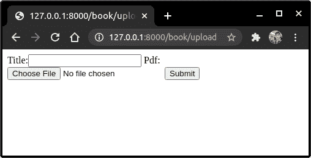

Browser

瞧，上传表格出来了！！现在选择一个 pdf 并点击提交按钮。


Browser

当你点击提交按钮，那么**“文件已经保存”**页面就会出现

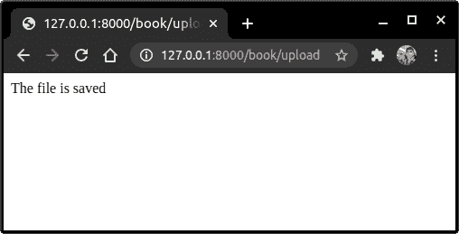

Browser

如果您转到媒体文件夹，您将看到一个**pdf**文件夹，其中包含您提交的 pdf。

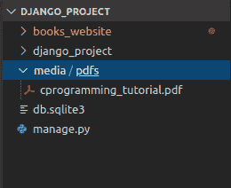

Media/pdfs

在管理站点中注册新创建的模型，使用:

```py
admin.site.register(EBooksModel)

```

然后在浏览器中加载管理站点，转到 **EBooksModel** 并选择我们刚刚提交的元素。

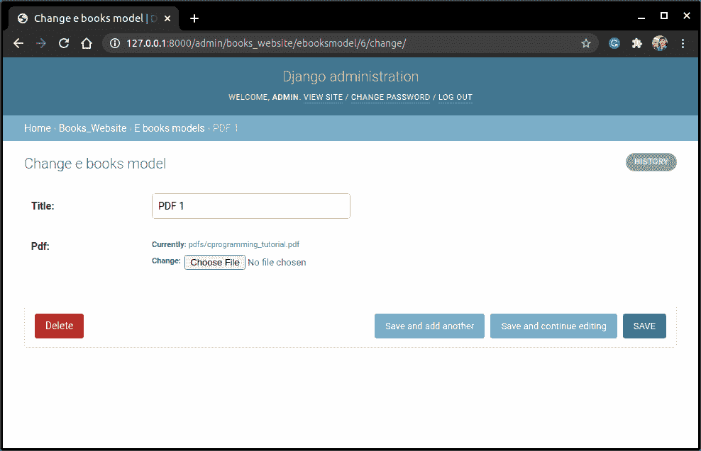

Admin Site

现在在这里，如果你观察的话，在 **pdf 字段**中。你会看到一个**当前:**选项。

写在它前面的路径**:pdf/c programming _ tutorial . pdf**叫做实例。因此**pdf/<pdf _ name>**是< pdf_name >文件的一个实例。

Django 只保存文件的实例，而不是文件本身。因此，即使您从管理站点删除了模型，pdf 文件仍将存在于媒体文件夹中。

## **从浏览器前端查看上传的文件**

在上面的网页中，**实例显示为一个链接。**但是如果你点击它，你会得到一个错误信息。

发生这种情况是因为端点未被映射。

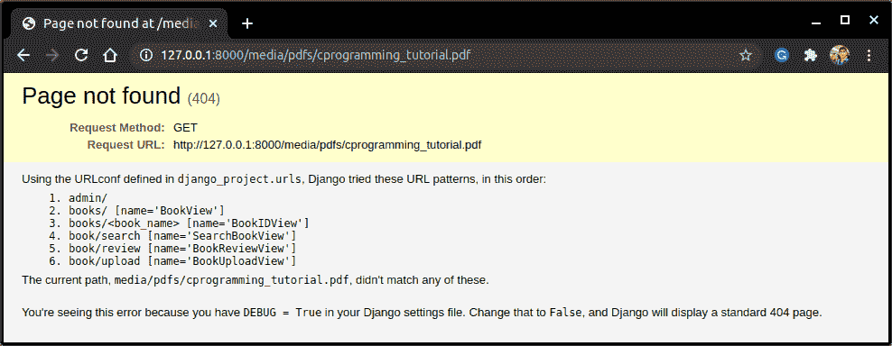

Error Message

现在要纠正这个错误，我们需要将这个端点映射到特定的文件。为此，请访问 urls.py 并添加

```py
from django.conf import settings
from django.conf.urls.static import static

if settings.DEBUG:
    urlpatterns += static(settings.MEDIA_URL, document_root=settings.MEDIA_ROOT)

```

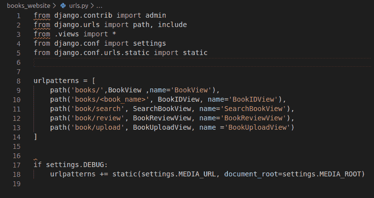

Urls

如果你读一读这一行，你就会大致了解我们在做什么

这里:

*   在 **settings.py** 中，我们已经设置了 **debug = True** ，所以设置。调试将总是**真**。
*   在**端如果函数**，下面的代码将添加**静态(设置。MEDIA_URL，document _ root =设置。MEDIA_ROOT)** 到上面呈现的 urlpatterns。

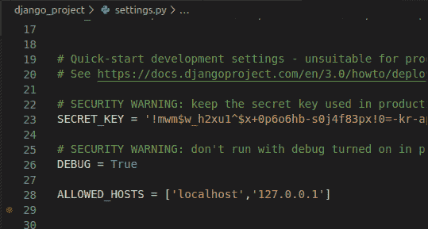

Debug 1

线路**静态(设置。MEDIA_URL，document _ root =设置。【MEDIA _ ROOT)可以这样想。**

主机网站( *http://127.0.0.1:8000/* )是我们添加端点的地方

*   **MEDIA_URL** (在本文开头我们保留为 **'/media/'** )

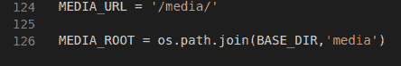

Media Settings

*   然后是 **document_root** (这是 pdf 文件在媒体文件夹中的**位置。**

因此，如果我想查看我之前上传的**c programming _ tutorial . pdf**文件，我将访问*http://127 . 0 . 0 . 1:8000/MEDIA/pdf/c programming _ tutorial . pdf*(观察如何使用 MEDIA_URL( **'/media/'** )

这就是上面的代码在 **urls.py** 中所做的事情。

就这样，现在如果你重新加载服务器并点击我们之前在 [Django 管理页面](https://www.askpython.com/django/django-admin-site)上看到的实例，你现在不会得到错误。


Admin Site

现在点击实例链接并检查！！


Pdf Browser

**因此我们现在可以通过浏览器**查看 pdf 了！

## **结论。**

就是这样！！我们希望你已经学会了上传文件到 Django 所需的一切。此外，你可以从他们的官方文档中了解更多的信息。

**练习题**:利用从以前文章中获得的知识，尝试制作一个网页，展示网页上所有可用的电子书，并附有查看它们的链接。

请继续关注 Django 主题的更多高级教程！