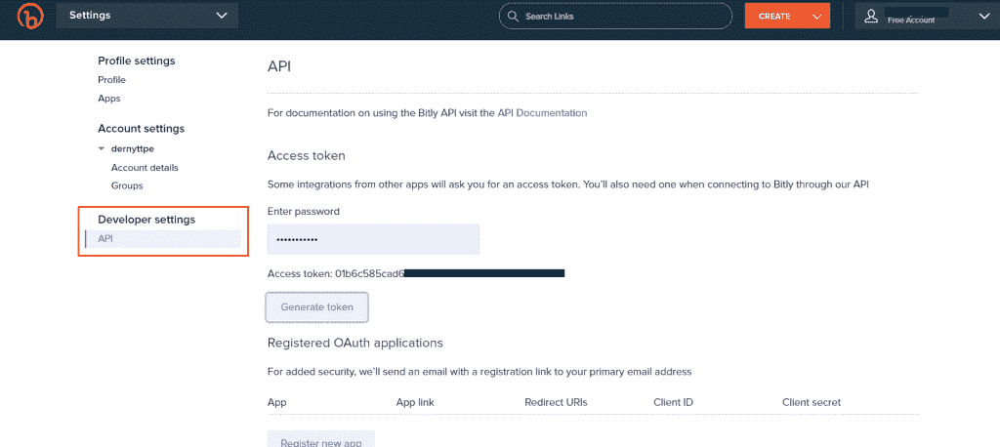

# Python 中的 URL 缩写——初学者指南

> 原文：<https://www.askpython.com/python/examples/url-shortener>

想用 Python 创建一个网址缩写器？不要再看了。导航和分享长网址是一件痛苦的事。这么长的 URL 背后的原因是链接中的跟踪者数量，大量站点的加载内容(多个目录)等。我们都使用网址缩写器来把长的网址缩短为几个字符，这使得它们更容易分享和浏览，并且看起来干净优雅。

但是你有没有想过自己编码一个网址缩写？在本教程中，我们将用非常简单的步骤来解释用 Python 编写 URL shortener 的过程。

有很多不同的方法可以用来缩短 URL，其中大多数都需要 API，你只需要坚持使用一种缩短的 URL。比特里，丁尤尔等。

## URL 缩写的代码

在本教程中，您将了解一个 python 包，与传统方法相比，它可以非常容易地缩短 URL。

### 1.安装模块

首先，我们需要安装所需的模块，这将大大简化我们编写 URL 缩写的工作。我们从使用 pip 包管理器安装 python 库开始。

Pyshorteners 是 Python 库，用来包装和消费最常用的 URL shorteners APIs。

```py
pip install pyshorteners

```

### 2.导入、输入和初始化

在 python 文件中，我们从导入所需的模块开始。

```py
import pyshorteners

```

我们在这一点上接受用户的输入，我们可以稍后在我们的代码中完成输入部分，但是那会让我们改变代码的基本/永久结构，我们将为每个 URL shortener 的 API 改变它。

```py
long_url = input("Enter the URL to shorten: ")

```

现在我们初始化 pyshortener 库的类对象，开始缩短我们的 URL。

```py
type_tiny = pyshorteners.Shortener()

```

### 3.缩短 URL–Tinyurl

现在，我们已经初始化了我们的库，我们可以从缩短 URL 开始。

如果 PDF 与 python 脚本不在同一个目录中，您需要传递名称和位置。

```py
short_url = type_tiny.tinyurl.short(long_url)

print("The Shortened URL is: " + short_url)

```

在输出中，我们以类似“https://tinyurl.com/mbq3m”的形式获得了缩短的 URL。而 **TinyURL** 是因为 URL shortener 包——Pyshortener 默认**使用 TinyURL API**。

使用 TinyURL 服务的最终短代码–

```py
import pyshorteners
long_url = input("Enter the URL to shorten: ")

#TinyURL shortener service
type_tiny = pyshorteners.Shortener()
short_url = type_tiny.tinyurl.short(long_url)

print("The Shortened URL is: " + short_url)

```

但是我们可以改变它，这是我们将在本教程中进一步学习的内容。

### 4.稍微缩短网址

Bitly 是目前最受欢迎和最广泛使用的网址缩写服务。在这里，使用我们的代码，我们现在将使用它的 API 生成缩短的 URL，该 API 由 Pyshortener 库包装。

使用上面同样的方法，现在我们需要在 Shortener 方法中传递 API 键，如下所示:

```py
type_bitly = pyshorteners.Shortener(api_key='01b6c587cskek4kdfijsjce4cf27ce2')
short_url = type_bitly.bitly.short('https://www.google.com')

```

你可能想知道，你现在从哪里获得 API 密钥，所以去 Bitly 网站>创建帐户>然后去设置> API(开发者)选项。该页面将如下所示:

只需通过输入您的密码生成您的帐户的访问令牌，并复制该令牌以在代码中使用。



Bitly API access token

#### **使用 Bitly API 通过 Python 缩短 URL 的最终代码:**

```py
import pyshorteners
long_url = input("Enter the URL to shorten: ")

#Bitly shortener service
type_bitly = pyshorteners.Shortener(api_key='01b6c587cskek4kdfijsjce4cf27ce2')
short_url = type_bitly.bitly.short('https://www.google.com')

print("The Shortened URL is: " + short_url)

```

Bitly 服务还提供了更多的功能，如网址扩展，获得点击你的缩短网址的总次数等。

```py
expand_url = type_bitly.bitly.expand('https://bit.ly/TEST')
print (expand_url) # gives the url in expand or original form

count = type_bitly.bitly.total_clicks('https://bit.ly/TEST') #gives total no. of clicks.

```

使用 API 密钥有助于我们以更好的方式管理我们的链接，因为我们现在可以在特定的 shortening service(网站)仪表板的帐户部分检查我们链接的所有详细信息和性能。

### 5.使用其他服务缩短 URL

Pyshortener 库包含了各种缩短服务，你可以在他们的官方文档中看到。

各种服务的示例代码如下所示:

```py
import pyshorteners
s = pyshorteners.Shortener()

#Chilp.it
s.chilpit.short('http://www.google.com')    # gives output -> 'http://chilp.it/TEST'
s.chilpit.expand('http://chilp.it/TEST')

# Adf.ly
s = pyshorteners.Shortener(api_key='YOUR_KEY', user_id='USER_ID', domain='test.us', group_id=12, type='int')
s.adfly.short('http://www.google.com')    # gives output -> 'http://test.us/TEST'

#Git.io
s = pyshorteners.Shortener(code='12345')
s.gitio.short('https://github.com/TEST')     # gives output -> 'https://git.io/12345'
s.gitio.expand('https://git.io/12345')

#and many more services are supported

```

## 结论

教程到此为止。希望您已经了解了 URL 的缩短，以及如何使用 Python 和多个缩短服务提供商创建 URL 缩短器。