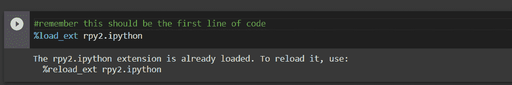
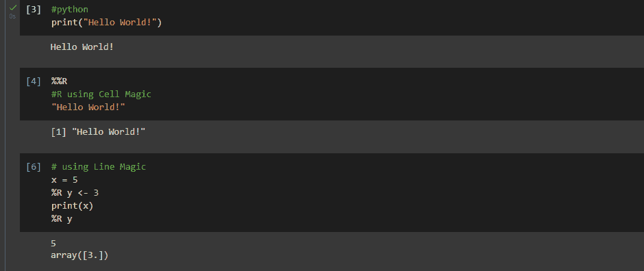
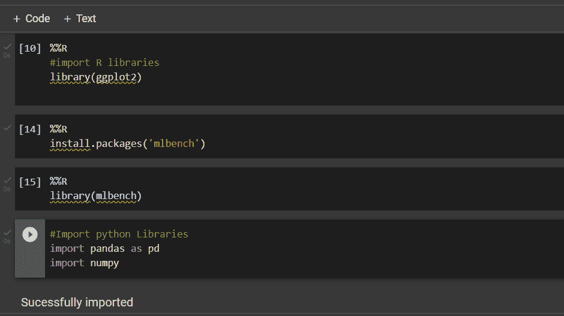
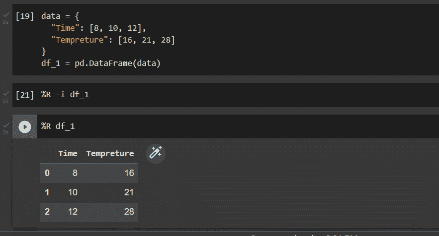
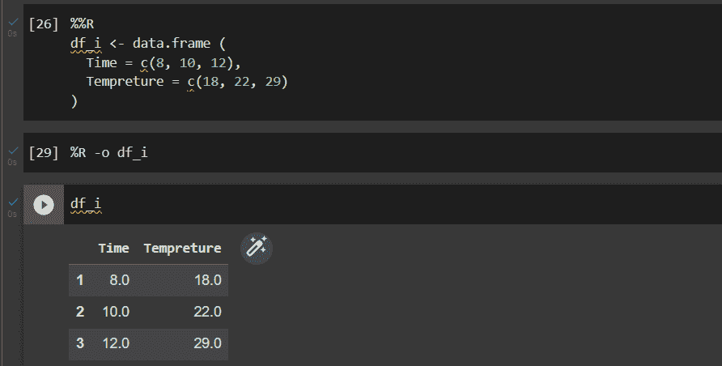

# 如何在同一个笔记本中使用 R 和 Python？

> 原文：<https://www.askpython.com/python/examples/use-r-and-python-in-the-same-notebook>

如果您熟悉数据科学领域，那么您应该知道 R 和 python 是两种非常重要的语言。数据科学几乎在每个行业都有应用，从财务部门到医疗保健到营销等等。

## 为什么我们需要这些语言？

在数据科学领域，R 是使用最广泛的开源语言。它通常用于结构化和非结构化数据的统计分析和数据可视化。与其他数据科学语言相比，R 支持许多特性。

Python 是一种面向对象的高级编程语言。它是一种多功能、完全解释的编程语言，有许多优点，经常被用来简化大量复杂的数据收集。

***也读:[Python 的 Jupyter 笔记本——综合指南](https://www.askpython.com/python/jupyter-notebook-for-python)***

## 在 Google Colab 中使用 R 和 Python

现在，Google Colab (Collaboratory)允许任何人通过浏览器编写和执行任意 python 代码，特别适合机器学习、数据分析和教育。

默认情况下，Colab 创建一个 python 笔记本，但是也可以在 Colab 中创建一个 R 笔记本。为此，请单击下面的链接。

[https://colab.research.google.com/#create=true&语言=r](https://colab.research.google.com/#create=true&language=r)

要在同一个笔记本中同时使用 R 和 python，我们需要首先激活 rpy2 包。

```py
%load_ext rpy2.ipython

```



rpy2

rpy2 是一个高级接口，使 R 函数像 Python 函数一样成为一个对象，并提供到 NumPy 和 pandas 数据结构的无缝转换。在激活之后，单元以 python 语言正常执行，通过添加一个额外的方法，代码以 R 语言执行。

***方法有–单元格魔术和行魔术。***

### 1.细胞魔法

这是用来在 R 语言中运行整个单元。单元格的第一行必须是下面给出的行，从第二行开始，我们可以开始用 R 语言编写代码，代码将会成功执行。

```py
%%R
......
.....

```

### 2.线条魔术

这用于运行 R 语言中的一行代码。单元格可以包含 python 语言的其他代码行。包含以下代码的行将在 r 中执行。

```py
%R ...........

```

## 基本实现



Basic Implementation

## 安装软件包和库

在同一个笔记本中使用 R 和 python 的最大好处是，通过将库导入到 colab 笔记本中，可以使用 Python 中 R 提供的所有包。这使得数据科学家或任何从事项目工作的人的工作更加高效。



packages

## 将数据从一种语言导入到另一种语言

考虑从事一个同时使用 python 和 R 语言的项目。使用 rpy2 和 magic 命令，可以将数据帧从一种语言转换为另一种语言

#### Python 到 R

```py
%R -i df_1

```



Python to R

#### r 到 Python

```py
%R -o df_i 

```



R to Python

## 摘要

r 和 Python 都是数据科学领域广泛使用的语言。有时可能会出现需要同时使用两种语言的情况。在本文中，我们讨论了这种情况的解决方案。我们已经学会了如何在 google colab 平台上的一个笔记本中使用两种语言。