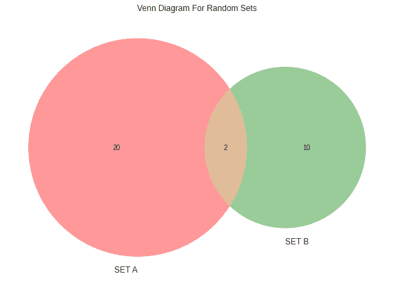

# Python 中的维恩图

> 原文：<https://www.askpython.com/python/examples/venn-diagrams-in-python>

维恩图是最明显的数据可视化之一，用于说明两个或三个数据类别或“集合”之间的重叠约翰·维恩在 19 世纪晚期设计了这些图表；他们在一个圆圈中描绘了每组数据，重叠部分表示各组之间的相似程度。

你可能很容易就把它们画在纸上。但是你知道你可以用 python 编程语言将它们可视化吗？你猜怎么着！只用几行代码就可以实现。

让我们开始娱乐吧！

## 维恩图的代码实现

使用 Matplotlib 库可以创建文氏图。最简单的方法是使用 matplotlib_venn 包，这使得用更少的代码创建 venn 图变得非常简单。

我们需要安装`pandas and matplotlib`库，同时，我们需要在命令提示符下使用`pip install matplotlib_venn`安装`matplotlib_venn`库。

```py
import pandas as pd
from matplotlib import pyplot as plt
from matplotlib_venn import venn2
from matplotlib_venn import venn3

```

熊猫将用于生成一些合成数据，并使用文氏图进行绘制。通常，在构建文氏图时，必须指定每组中的对象数量和重叠部分。

出于本教程的目的，我们将使用包含两个类别的分类数据集，包括两种不同动物的特征:猎豹和豹子。

我们将概述这两种动物的独特和共有的特征。下面的代码片段将为我们生成数据集。

```py
data = {'Cheetahs': ['Cat family','Speed','Yellow Fur','Day Animal',
                     'Black spots','Black line','Same Prey','Can not climb','Mammals','No Roar'],
        'Leopards': ['Cat family','Strength','Yellow Fur','Night Animal',
                     'Black spots','No Black line','Same Prey','Can climb','Mammals','Roar']
       }
df = pd.DataFrame(data, columns = ['Cheetahs', 'Leopards'])
print(df)

```


VennDiagram Dataset

要创建一个包含猎豹和豹子集合的简单维恩图，我们可以调用`venn2()`函数并传入两个值:这两种动物的特征列表和 set_labels 的元组，即这两种动物的名称。

```py
plt.style.use('seaborn')

plt.figure(figsize=(10,10))
plt.title("Venn Diagram For Cheetahs v/s Leopards")

venn2([set(df['Cheetahs'].to_list()), 
       set(df['Leopards'].to_list())],
       set_labels=('Cheetahs', 'Leopards')
     )

plt.show()

```


VennDiagram Output 1

如果您希望空白地定义集合，并使用下面的代码传递集合的差和并的值，而不是定义数据集。

```py
plt.style.use('seaborn')

plt.figure(figsize=(10,10))
plt.title("Venn Diagram For Random Sets")

# (Set1,Set2,Union)
venn2(subsets = (20, 10, 2), 
      set_labels = ('SET A', 'SET B'))

plt.show()

```



VennDiagram Output 2

最后，让我们试着为三个集合创建一个文氏图，而不是局限于两个集合。不同之处在于，我们将使用 venn3()函数，而不是之前使用的 venn2()函数。看看下面的代码，我们随机取了 3 个集合，分布也是随机进行的。

```py
plt.style.use('seaborn')

plt.figure(figsize=(10,10))
plt.title("Venn Diagram For Three Random Sets")

# (Set1,Set2,1n2,Set3,1n3,2n3,1n2n3)
venn3(subsets=(10, 5, 2, 8, 6, 2, 7), 
      set_labels=('Group A', 'Group B', 'Group C'))

plt.show()

```


VennDiagram Output 3