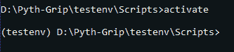

# Python 中的虚拟环境——易于安装和设置

> 原文：<https://www.askpython.com/python/examples/virtual-environments-in-python>

我们来谈谈一个对于提高代码兼容性非常重要的话题 Python 中的虚拟环境。你可能听说过开发人员谈论一些代码如何在他们的系统上工作，但是，在不同的系统上似乎不工作？

众所周知的**“它在我的系统上工作”**。

## 为什么我们会面临代码兼容性问题？

为什么一段代码能在开发者的系统上工作？答案很简单*，因为他们拥有的模块与代码*兼容。

现在，问题是为什么它在你的系统上不起作用？答案也很简单，*因为一些模块与代码不兼容。*

我这么说是什么意思？你看，很多时候，一旦一个模块被更新，一些以前适用的现有特性**就不能用了**。

在这些情况下，当模块被安装在另一个系统中时，更新的版本不能处理给定的代码，即使它是相同的模块。

一个很好的例子是，在 [Python OpenCV](https://www.askpython.com/python-modules/read-images-in-python-opencv) 中发现了一些现有特性的专利，而在下一版本的模块中对这些特性的支持被禁用了。

[专利现在已经](https://github.com/opencv/opencv/wiki/GSoC_2020#idea-better-sift-in-the-main-repository)到期，是 GSoC 期间做的。

因此，为了解决这个问题，我们使用 Python 中的**虚拟环境。**

## Python 中的虚拟环境是什么？

**虚拟环境**是我们构建的环境，目的是为我们的特定目的创造一个**优化**的环境。我们安装并使用我们项目所必需的模块，并且只用于我们的项目。

这使得我们的环境变得更轻，重量更轻。

## 设置虚拟环境

让我们用 Python 制作我们自己的虚拟环境，在本文中是为数据科学设计的，

### 1.安装虚拟环境模块

随着 Python 3.3 的发布，虚拟环境模块`venv`已经默认添加到 Python 标准库中。因此，我们不需要安装任何模块就可以在虚拟环境中工作。

如果您使用的是 Python 3.3 之前的版本，您应该考虑安装 [virtualenv](https://packaging.python.org/en/latest/guides/installing-using-pip-and-virtual-environments/#installing-virtualenv) 模块。

虽然 Anaconda 默认为我们提供了这样一个环境，以及创建虚拟环境的包，但是我们将使用 Python 为本文提供的默认虚拟环境模块。

### 2.创建虚拟环境

我们使用一个简单的命令在 Python 中创建虚拟环境。

您可以指定要安装环境的目录，或者只提供要安装在当前目录中的目录名。

```py
# Windows
## python -m venv path\to\nameofenvironment
python -m venv D:\Pyth-Grip\testenv

# macOS and Linux
python3 -m venv testenv

```

安装后，我们现在可以开始激活虚拟环境。

### 3.激活虚拟环境

上面这些简单的命令，允许我们创建一个虚拟环境。在访问这个环境时，您会发现文件结构与此类似，

```py
testenv
 |-Include
 |-Lib
 |-pyvenv.cfg
 |-Scripts

```

在这个目录中，`pyvenv.cfg`是基于系统中现有 Python 版本的特定环境的配置。

`Scripts`目录是我们下一步应该进入的地方，因为它包含允许我们激活虚拟环境的`activate`命令。

在这个目录之外，我们需要遵循这些说明来激活虚拟环境，

```py
cd testenv # the name of your environment
cd Scripts
activate

```

在这个命令序列之后，您会注意到当环境的名称在圆括号`()`中时，环境是活动的。

在我的例子中，命令提示符以这样的方式显示激活的环境，



Activating the virtual environment.

### 4.设置虚拟环境

现在，我们有了自己的环境，可以专门用于数据科学。

但是，等等！该模块尚未安装，因为这只是一个没有我们需要的任何模块的新环境。

让我们[安装一些 Python 模块](https://www.askpython.com/python-modules/python-pip)来使用，

```py
# Installing the required version of pandas
pip install pandas==1.1.3
# Installing the latest version of scikit-learn 
pip install scikit-learn

```

正如您所看到的，我们可以在这个虚拟环境中准确地安装我们想要的模块版本，从而保持我们的基础环境干净、轻便。

### 5.停用环境

一旦我们完成了特定环境的工作，并希望使用另一个或使用基本环境，知道如何退出当前的虚拟环境是很重要的。

这可以通过一个简单的命令来完成。

```py
deactivate

```

而且，就是这样！

## 结论

您现在可以开始在特定的环境中工作了，这不会与您的项目冲突！

您可以随意查看我们的其他模块，这些模块可以安装在您的虚拟环境中以获得出色的开发体验， [Pandas](https://www.askpython.com/python-modules/pandas/python-pandas-module-tutorial) 、 [Numpy](https://www.askpython.com/python-modules/numpy/python-numpy-module) 、 [Psutil](https://www.askpython.com/python-modules/psutil-module) 和 [Scipy](https://www.askpython.com/python-modules/python-scipy) 。

## 参考

*   [官方 Python 文档](https://docs.python.org/3/library/venv.html)
*   [官方安装指南](https://packaging.python.org/en/latest/guides/installing-using-pip-and-virtual-environments/)