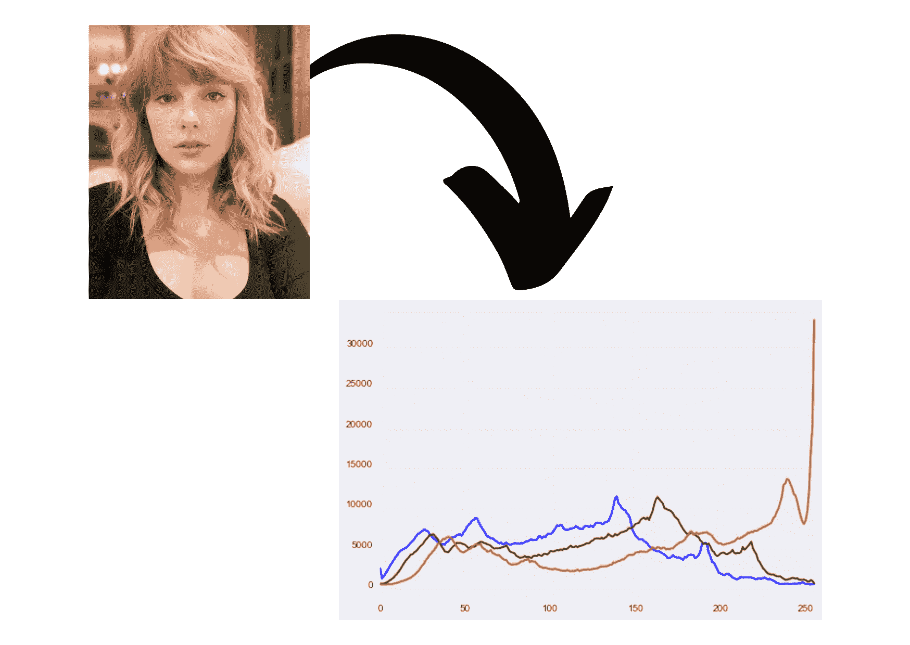
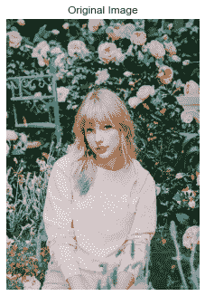
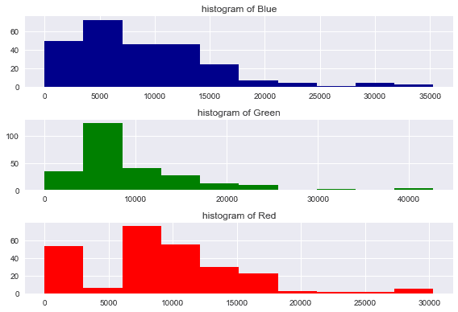
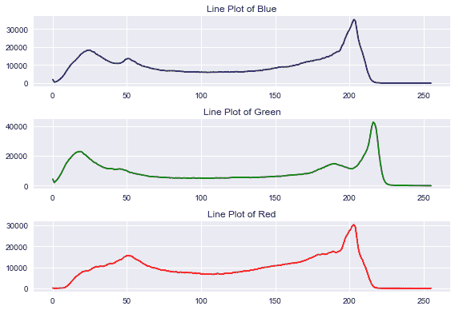
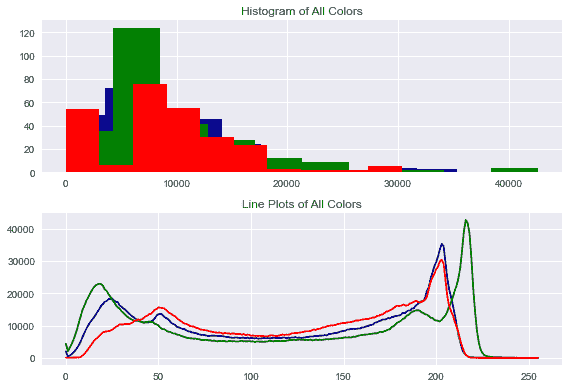
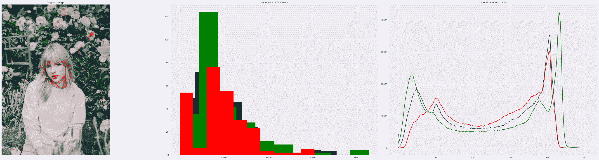
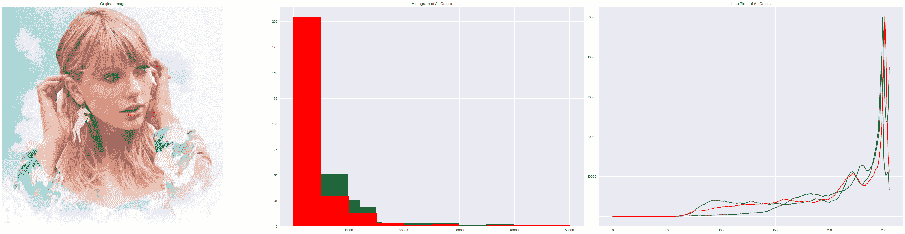
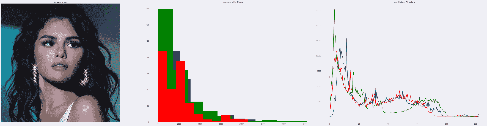
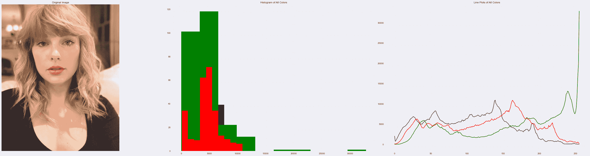

# 使用直方图可视化图像中的颜色–Python OpenCV

> 原文：<https://www.askpython.com/python/visualizing-colors-in-images>

你好。你有没有想过，即使是图像也可以绘制成直方图？今天在本教程中，我们将了解直方图形式的图像中的颜色的可视化。

* * *

## 介绍

**直方图**是一种图形表示，显示图像中各种颜色值出现的频率。当一个人需要检测图像之间的颜色变化时，直方图也很方便。



Image To Histogram Sample

直方图只关注颜色的比例，而不是图像中颜色的位置。它们显示了图像中存在的颜色和基本色调的统计分布。

* * *

## 彩色可视化的逐步实现

现在我们将学习绘制各种图像的 RGB 直方图。

* * *

### 步骤 1:导入模块

就像任何其他项目一样，第一步是**将必要的模块/库**导入我们的程序。这个程序需要的模块是 OpenCV、numpy 和 matplotlib。

我们也将设置绘图风格为`[seaborn](https://www.askpython.com/python-modules/python-seaborn-tutorial)`以使我们的绘图看起来更清晰。下面显示了相同的代码。

```py
import cv2
import numpy as np
import matplotlib.pyplot as plt
plt.style.use('seaborn')

```

* * *

### 步骤 2:加载并显示原始图像

为了加载图像，我们将使用 OpenCV 库的`imread`函数。可以通过相同的功能以不同的方式加载图像。

***在 imread 这里阅读更多:[使用 OpenCV.imread()方法加载图像的不同方式](https://www.askpython.com/python-modules/python-imread-opencv)***

现在为了显示图像，我们需要使用 matplotlib 库下的`imshow`函数。为了使图像看起来更干净，我们将关闭轴。

```py
image = cv2.imread('image1.jpg')
plt.axis("off")
plt.title("Original Image")
plt.imshow(cv2.cvtColor(image, cv2.COLOR_BGR2RGB))
plt.show()

```



Original Image Historgram

* * *

### 步骤 3–获取图像的 RGB 直方图

为了得到`RGB`直方图，我们将使用 **`cakHist`** 函数，该函数需要许多参数，包括图像对象、面元计数、所需值的范围和通道(蓝色、红色或绿色)。

下面提到了相同的代码。图像对象在方括号(`[]`)中，蓝色、红色和绿色的通道分别设置为 0、1 和 2。

现在我们在支线图的帮助下绘制直方图。

```py
blue_histogram = cv2.calcHist([image], [0], None, [256], [0, 256])
red_histogram = cv2.calcHist([image], [1], None, [256], [0, 256])
green_histogram = cv2.calcHist([image], [2], None, [256], [0, 256]) 

plt.subplot(3,1,1)
plt.title("histogram of Blue")
plt.hist(blue_histogram,color="darkblue")

plt.subplot(3,1,2)
plt.title("histogram of Green")
plt.hist(green_histogram,color="green")

plt.subplot(3,1,3)
plt.title("histogram of Red")
plt.hist(red_histogram,color="red")

plt.tight_layout()
plt.show()

```



RGB Histogram Separately

我们可以使用`plot`函数以线条形式绘制相同的直方图，并传递找到的相同 calcHist 数据。同样的代码和输出如下所示。

```py
blue_histogram = cv2.calcHist([image], [0], None, [256], [0, 256])
red_histogram = cv2.calcHist([image], [1], None, [256], [0, 256])
green_histogram = cv2.calcHist([image], [2], None, [256], [0, 256]) 

plt.subplot(3,1,1)
plt.title("Line Plot of Blue")
plt.plot(blue_histogram,color="darkblue")

plt.subplot(3,1,2)
plt.title("Line Plot of Green")
plt.plot(green_histogram,color="green")

plt.subplot(3,1,3)
plt.title("Line Plot of Red")
plt.plot(red_histogram,color="red")

plt.tight_layout()
plt.show()

```



RGB Line Plot Separately

我们还可以将所有三种颜色的历史图和线图一起绘制在一张纸上！我们也来看看吧！

```py
blue_histogram = cv2.calcHist([image], [0], None, [256], [0, 256])
red_histogram = cv2.calcHist([image], [1], None, [256], [0, 256])
green_histogram = cv2.calcHist([image], [2], None, [256], [0, 256]) 

plt.subplot(2,1,1)
plt.title("Histogram of All Colors")
plt.hist(blue_histogram,color="darkblue")
plt.hist(green_histogram,color="green")
plt.hist(red_histogram,color="red")

plt.subplot(2,1,2)
plt.title("Line Plots of All Colors")
plt.plot(blue_histogram,color="darkblue")
plt.plot(green_histogram,color="green")
plt.plot(red_histogram,color="red")

plt.tight_layout()
plt.show()

```



RGB Plots Image Together

* * *

## 一起可视化最终结果！

现在让我们在一个单独的画面中可视化输入图像的所有结果！结果也非常令人兴奋。

下面显示了相同的完整代码。

```py
import cv2
import numpy as np
import matplotlib.pyplot as plt
plt.style.use('seaborn')plt.figure(figsize=(40,10))

plt.subplot(1,3,1)
image = cv2.imread('image1.jpg')
plt.axis("off")
plt.title("Original Image")
plt.imshow(cv2.cvtColor(image, cv2.COLOR_BGR2RGB))

blue_histogram = cv2.calcHist([image], [0], None, [256], [0, 256])
red_histogram = cv2.calcHist([image], [1], None, [256], [0, 256])
green_histogram = cv2.calcHist([image], [2], None, [256], [0, 256]) 

plt.subplot(1,3,2)
plt.title("Histogram of All Colors")
plt.hist(blue_histogram,color="darkblue")
plt.hist(green_histogram,color="green")
plt.hist(red_histogram,color="red")

plt.subplot(1,3,3)
plt.title("Line Plots of All Colors")
plt.plot(blue_histogram,color="darkblue")
plt.plot(green_histogram,color="green")
plt.plot(red_histogram,color="red")

plt.tight_layout()
plt.show()

```



Final Results Images To Histogram

* * *

## 更多输出

让我们看看更多的示例输出。看看结果有多令人兴奋！



Sample Output 2 Image To Histogram



Sample Output 1 Image To Histogram



Sample Output 3 Image To Histogram

* * *

## 结论

我希望你理解这个概念，并喜欢输出。用更多的图片尝试同样的方法，结果会让你大吃一惊。

编码快乐！😇

想了解更多？查看下面提到的教程:

1.  [Python Matplotlib 教程](https://www.askpython.com/python-modules/matplotlib/python-matplotlib)
2.  [方框图:你需要知道的一切](https://www.askpython.com/python/examples/boxplots)
3.  [使用 Python 散景进行数据可视化](https://www.askpython.com/python-modules/data-visualization-using-python-bokeh)

* * *