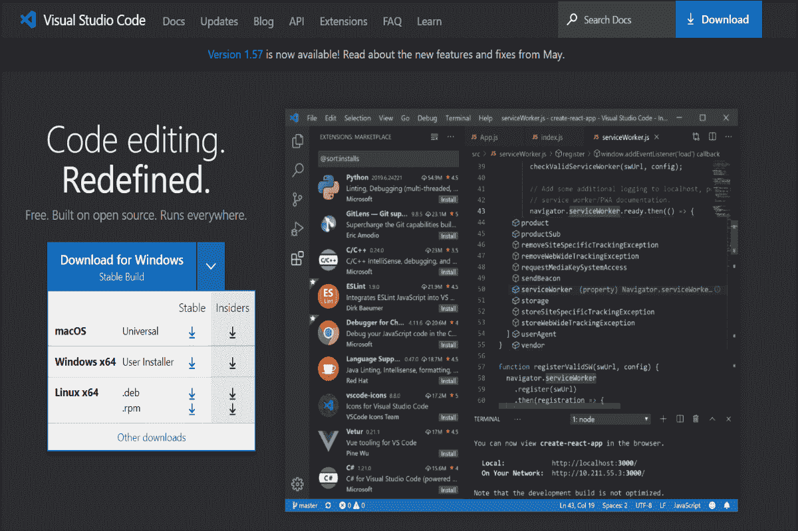
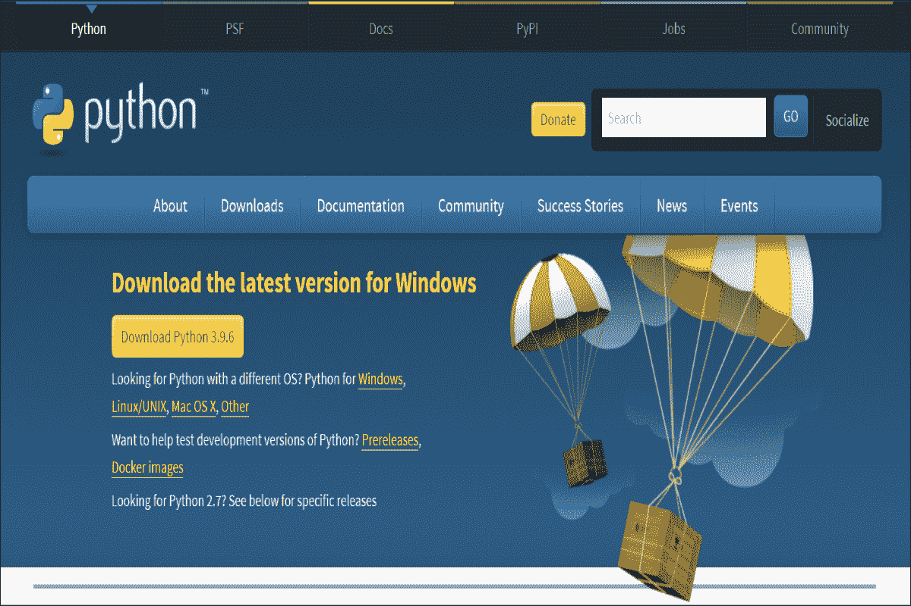
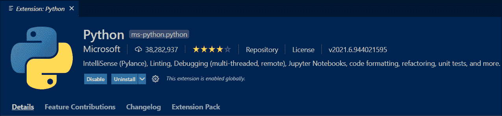
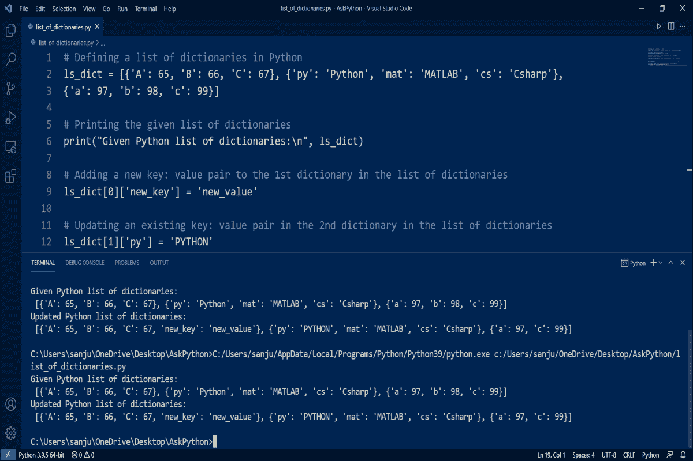
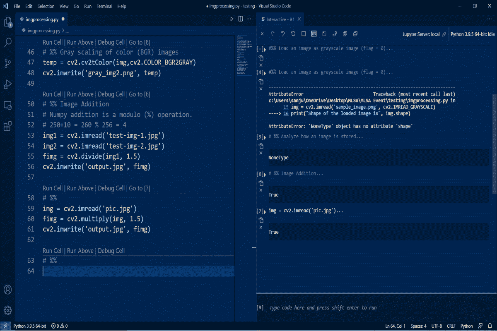
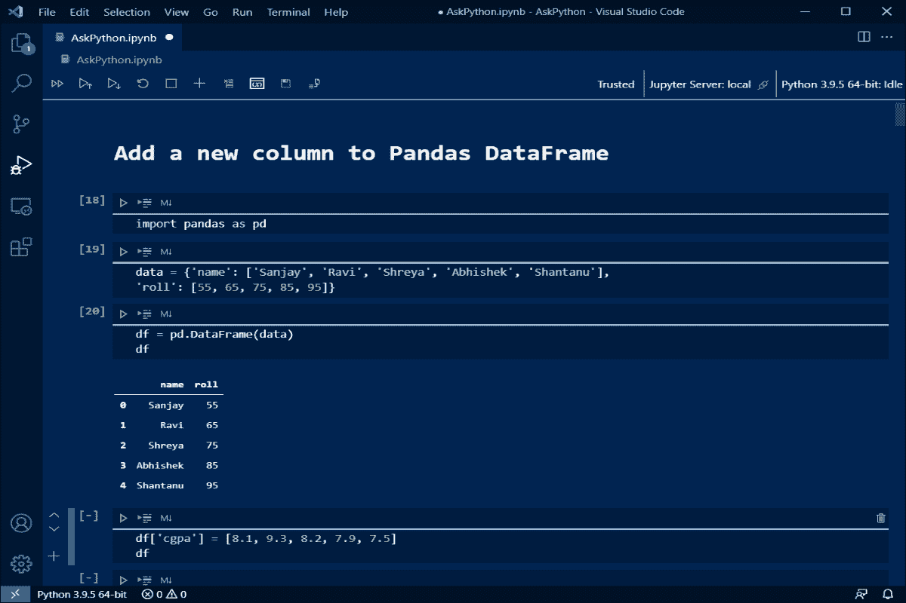

# Python 的 VS 代码——安装和设置 VS 代码的完整指南

> 原文：<https://www.askpython.com/python/vs-code-for-python>

在本教程中，我们将讨论如何为 Python 编程设置 VS 代码。

* * *

## 什么是 VS 代码？

**VS 代码**代表 **Visual Studio 代码**。这是一个轻量级的，但功能强大的源代码编辑软件，由微软开发。Visual Studio 代码是作为桌面应用程序开发的。它适用于著名的操作系统，如 macOS、Microsoft Windows 和 Linux。它内置了对 Node.js、TypeScript 和 JavaScript 等框架的支持。

它还有一个非常大的扩展生态系统，用于支持其他几种框架和编程语言，如 C、C++、 **Python** 等。这些扩展是 VS 代码最重要的特性，它重新定义了代码编辑的体验，将它带到了一个新的层次。

让我们讨论一下如何为 Python 编程配置 Visual Studio 代码。

## 1.下载 VS 代码

作为第一步，我们必须从 code.visualstudio.com[的官方网站](https://code.visualstudio.com/)下载最新版本的 **Visual Studio 代码**。



Download VS Code

### 为 Python 安装 VS 代码的步骤

VS 代码安装程序文件下载完成后，按照下面给出的步骤在本地(Windows)机器上安装软件。

1.  双击安装程序文件。
2.  选择要安装 VS 代码的目标文件夹。
3.  您可以选择创建一个开始菜单文件夹，安装程序将在其中创建程序的快捷方式。
4.  之后，您可以选择希望 VS 代码设置执行的一些附加任务，如下所示:
    *   创建桌面图标
    *   将“用代码打开”操作添加到 Windows 资源管理器(文件上下文菜单)
    *   将“用代码打开”操作添加到 Windows 资源管理器(目录或文件夹上下文菜单)
    *   将 VS 代码注册为支持的文件类型的编辑器
    *   添加到需要外壳重启的路径
5.  点击**安装**开始安装过程。完成后，单击完成。

## 2.为 VS 代码安装 Python 解释器

现在，我们必须从 www.python.org[的官方网站](https://www.python.org/)下载最新版本的 **Python 解释器**。



Download Python Interpreter

### 安装 Python 解释器的步骤

下载 Python 安装程序文件后，按照下面给出的步骤在本地(Windows)机器上安装解释器。

*   双击安装程序文件。
*   选中“将 Python 添加到路径”选项。
*   单击屏幕上显示的两个选项之一
    *   **立即安装**选项将使用默认设置安装 Python 解释器(**推荐新手使用**
    *   **定制安装**选项将允许我们启用或禁用这些功能
*   最后，点击**关闭安装过程完成后出现的**。

我们还可以通过在终端上运行以下命令来验证 Python 解释器是否已经成功安装:

*   对于 **Windows** ，在命令提示符或 PowerShell 上运行以下命令。

```py
C:\Users\Guest> py -3 --version

```

*   对于 **Linux** 或 **macOS** 机器在终端上运行以下命令。

```py
ubuntu:~$ python3 --version

```

仅当 Python 成功安装在系统上时，这两个命令的输出才会显示系统上安装的 Python 版本。

## 3.为 VS 代码安装 Python 扩展

在安装了 VS 代码软件和 Python 解释器之后，我们必须安装 VS 代码的 Python 扩展。Python 扩展是由微软开发的 Visual Studio 代码扩展，它具有许多支持功能，如智能感知、代码导航、代码格式化、林挺、调试等。对于所有支持的 Python 语言版本(> =3.6)。



Python extension

### 安装 Python 扩展的步骤

要安装 VS 代码的 Python 扩展，请遵循下面给出的步骤:

*   使用快捷方式( **Ctrl+Shift+X** )打开 VS 代码扩展市场。
*   通过在扩展市场搜索栏中输入“Python”来搜索 Python 扩展。
*   从标有星号的搜索结果中选择第一个名为 Python 的选项。
*   然后点击安装按钮。

**注意:**当我们为 VS 代码安装 **Python** 扩展时， **Pylance** 和 **Jupyter** 扩展会自动安装，以便在使用 Python ( `.py`)文件和 Jupyter ( `.ipynb`)笔记本时为我们提供最佳体验。Pylance 和 Jupyter 扩展是可选的依赖项，即使我们卸载了这些扩展，主 Python 扩展仍将保持完整的功能。

### Python 扩展的有用特性

*   智能感知(Pylance)
*   重构
*   代码格式
*   林挺
*   排除故障
*   测试
*   环境
*   Jupyter Notebook (Jupyter)

## 4.VS 代码中使用 Python 的不同模式

在 Visual Studio 代码中，我们有三种不同的模式来使用 Python 语言。让我们逐一讨论。

### Python 脚本文件

在这种模式下，我们既可以创建一个新的 Python 文件，也可以用 VS 代码打开一个扩展名为`.py`的现有 Python 文件。但是我们只能在 VS 代码集成终端上整体运行 Python 脚本文件。



Python Script File

### Python 交互模式

在这种模式下，我们创建一个普通的 Python 脚本文件，然后我们必须通过键入[ `# %%` ]在其中激活 Python 交互模式。这将为我们创建一个代码单元，我们可以通过点击**运行单元**或使用快捷方式( **Shift+Enter** )来清楚地执行 Python 指令。一旦我们运行一个代码单元，就会在 Python 脚本文件一侧打开一个交互式窗口。我们还可以通过按下**调试单元**来调试单个代码单元中的 Python 指令。



Python Interactive Mode

### 交互式 Python 笔记本或 Jupyter 笔记本

在这种模式下，我们既可以创建一个新的 Python Jupyter 笔记本，也可以用 VS 代码打开一个带有`.ipynb`扩展的现有 Python Jupyter 笔记本。在这里，我们只能在已经呈现的代码单元中运行 Python 指令。我们不能在 VS 代码集成终端上整体运行 Jupyter 笔记本中的所有 Python 指令。要运行单个代码单元，可以按下每个代码单元上方的**运行单元**按钮，或者使用快捷键( ****Shift** +Enter** )。



Python Interactive Notebook

## 结论

在本教程中，我们学习了什么是 Python 的 VS 代码，如何下载并安装在本地 windows 机器上。我们还学习了各种 VS 代码扩展，比如 Python、Pylance 和 Jupyter，它们对 Python 语言有丰富的支持。我们也学习在 VS 代码中使用不同的 Python 模式，比如 Python 脚本文件、Python 交互模式和 Python Jupyter Notebook。希望你已经建立了你的 Visual Studio 代码软件，并准备好在上面用 Python 语言编码。