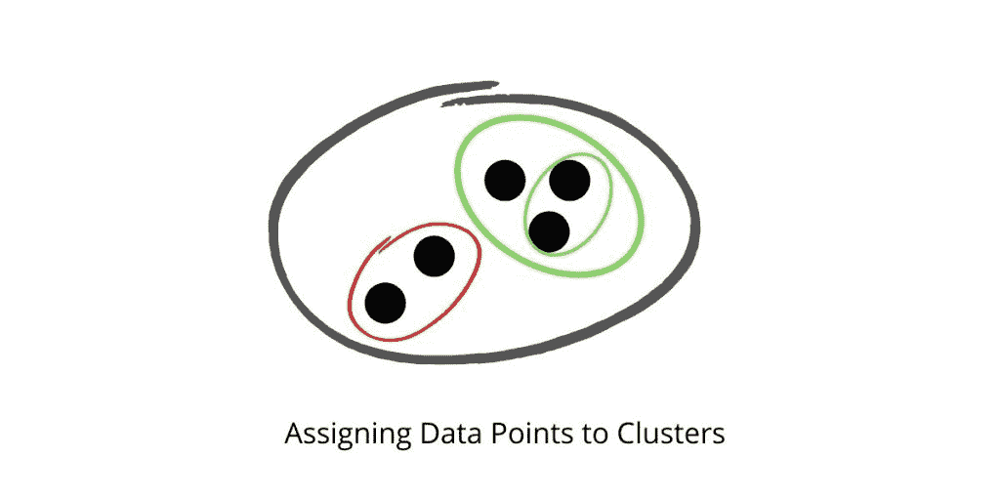
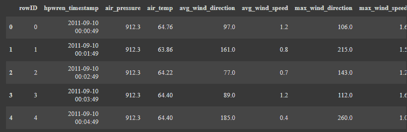
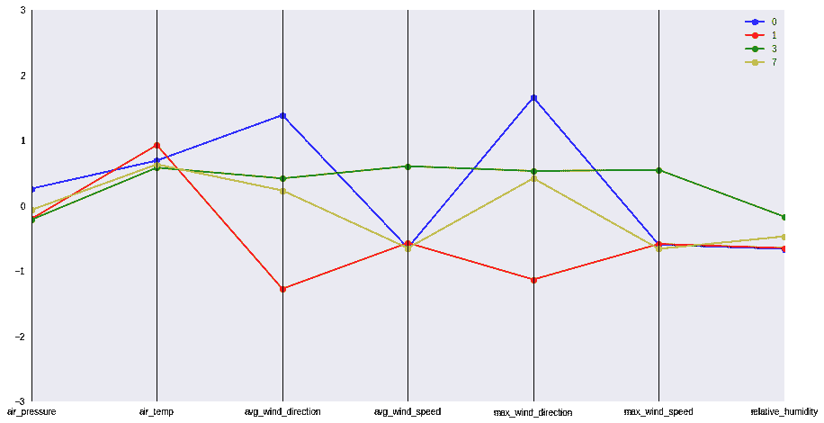
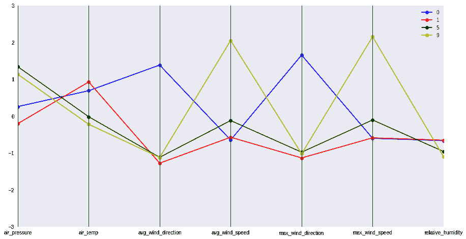

# Python 中的天气数据聚类——完整指南

> 原文：<https://www.askpython.com/python/examples/weather-data-clustering>

在本教程中，我们将使用 scikit-learn 在 Python 中规划和实现 [k-means 聚类](https://www.askpython.com/python/examples/k-means-clustering-from-scratch)。使用分钟粒度的数据，我们将应用聚类分析来构建一个当地气象站的大图像模型。

* * *

## 集群简介

聚类是将总体或一组数据点分成组的过程，以便同一组中的数据点与同一组中的其他数据点更相似，而与其他组中的数据点不同。它本质上是基于相似性和不相似性的项目集合。



What Clustering Looks Like

* * *

## K-Means 算法简介

K-Means 聚类是一种无监督的学习技术，它将未标记的数据集划分为多个聚类。在这种情况下，K 表示在该过程中必须产生的预定义集群的数量；比如 K=2，就会有两个集群；对于 K=3，将有三个集群，依此类推。


KMeans Demonstration

* * *

## 数据集

分钟天气数据集与基于决策树的分类器笔记本中使用的每日天气数据集来源相同。分钟天气数据集包括以一分钟间隔获取的原始传感器值，但小时天气数据集不包括。相反，每日天气数据集的特点是经过处理和精心策划的数据。数据存储在逗号分隔的文件 minute weather.csv 中。

数据是在 2011 年 9 月至 2014 年 9 月的三年期间收集的，以确保获得所有季节和天气条件的充足数据。

minute weather.csv 中的每一行都提供一分钟间隔的天气数据。

* * *

## 用 Python 实现天气数据聚类

让我们把手弄脏，然后开始编码。我们将一步一步地进行，同时让您的开始变得非常简单。

### 导入必要的库

```py
from sklearn.preprocessing import StandardScaler
from sklearn.cluster import KMeans
import pandas as pd
import numpy as np
from itertools import cycle, islice
import matplotlib.pyplot as plt
from pandas.plotting import parallel_coordinates
plt.style.use('seaborn')

%matplotlib inline

```

### 加载数据集

```py
D = pd.read_csv('minute_weather.csv')
D.head()

```



Weather Data KMeans Clustering

### 数据采样

数据采样是一种统计分析方法，它选择、操作和分析数据点的代表性选择，以便在考虑的更广泛的数据集中找到模式和趋势。

```py
#Taking every 10th row

sampled_df = D[(D['rowID'] % 10) == 0]
sampled_df.shape

```

### 删除所有值为空的行

```py
del sampled_df['rain_accumulation']
del sampled_df['rain_duration']

B = sampled_df.shape[0]
sampled_df = sampled_df.dropna()
A = sampled_df.shape[0]

print("No of rows deleted: ", B-A)

```

我们注意到，在删除 empty 和 NaN 值后，总共有 46 行被删除。

### 选择感兴趣的要素进行聚类

```py
features = ['air_pressure', 'air_temp', 'avg_wind_direction', 'avg_wind_speed', 'max_wind_direction', 'max_wind_speed','relative_humidity']
select_df = sampled_df[features]

```

您可以根据自己的兴趣选择其他一些功能。这完全取决于你的喜好。

### 使用标准缩放器缩放要素

主要思想是在应用任何机器学习模型之前，分别归一化/标准化数据集中存在的要素，即 **μ = 0 和σ = 1** 。

```py
X = StandardScaler().fit_transform(select_df)

```

### 应用 K-均值聚类

```py
KM = KMeans(n_clusters=10)
model = KM.fit(X)
centers = model.cluster_centers_

```

函数 cluster_centers_ function 将收集形成的所有 **10** 个簇的所有中心点。

### 数据可视化

```py
# 1\. Function that generates a DataFrame with a Cluster Number column.

def pd_centers(featuresUsed, centers):
	colNames = list(featuresUsed)
	colNames.append('prediction')
	Z = [np.append(A, index) for index, A in enumerate(centers)]
	P = pd.DataFrame(Z, columns=colNames)
	P['prediction'] = P['prediction'].astype(int)
	return P

# 2\. Function that creates Parallel Plots

def parallel_plot(data):
	my_colors = list(islice(cycle(['b', 'r', 'g', 'y', 'k']), None, len(data)))
	plt.figure(figsize=(15,8)).gca().axes.set_ylim([-3,+3])
	parallel_coordinates(data, 'prediction', color = my_colors, marker='o')

P = pd_centers(features, centers)

```

#### 想象温暖的日子

```py
parallel_plot(P[P['air_temp'] > 0.5])

```



Visualizing WarmDays WeatherClustering

#### 想象干旱的日子

```py
parallel_plot(P[P['relative_humidity'] < -0.5])

```



Visualizing DryDays WeatherClustering

* * *

## 结论

恭喜你！您刚刚学习了如何使用 KMeans 算法对天气数据进行聚类。希望你喜欢它！😇

喜欢这个教程吗？无论如何，我建议你看一下下面提到的教程:

1.  [K-Python 中从头开始聚类的意思【算法讲解】](https://www.askpython.com/python/examples/k-means-clustering-from-scratch)
2.  [如何用 Python 绘制 K-Means 聚类？](https://www.askpython.com/python/examples/plot-k-means-clusters-python)
3.  [用 Python 实现层次聚类](https://www.askpython.com/python/examples/hierarchical-clustering)

感谢您抽出时间！希望你学到了新的东西！！😄

* * *