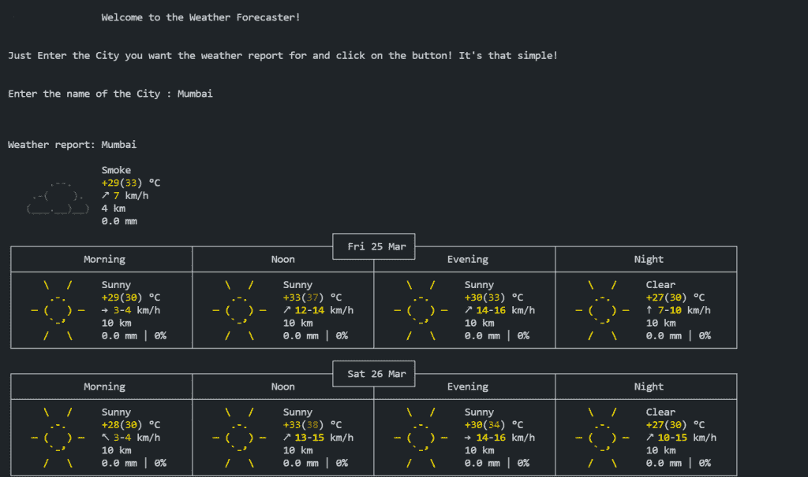

# 使用 Python 的天气预报–简单的实现

> 原文：<https://www.askpython.com/python/examples/weather-forecast-using-python>

`weather`对我们如何进行日常活动有很大的影响。在本教程中，我们将使用 Python 来帮助我们以非常吸引人的方式显示特定城市的天气预报报告。

我们先来了解一下天气预报是什么意思。这是一个人类/机器试图预测给定位置的天气状况的过程。现在你可能想知道，天气预报将如何造福社会？为什么我需要建造它？

嗯，天气预报可以以各种方式积极影响人们的生活，我将在下面列出其中的一些

1.  旅游业受某个地方的天气影响很大
2.  它对各种形式的交通运输的安全和运行产生了强烈的影响。
3.  我们甚至根据天气状况来决定我们的服装
4.  毫无疑问，它在农业中起着重要的作用。

现在我们已经清楚了我们要开发的应用程序的重要性，让我们开始代码实现。

## 代码实现

我们将需要 python 的`requests`库，我们需要使用你计算机 CMD 中的 [pip 命令](https://www.journaldev.com/33905/install-pip-linux)将它安装到系统中。

```py
pip install requests

```

现在，我们需要确保将应用程序正确地介绍给用户。请看下面的代码片段。您可以根据自己的喜好更改文本。

```py
print("\t\tWelcome to the Weather Forecaster!\n\n")
print("Just Enter the City you want the weather report for and click on the button! It's that simple!\n\n")

```

接下来，让我们使用下面的代码片段从用户那里获取城市名称的输入。

```py
city_name = input("Enter the name of the City : ")

```

现在，我们已经准备好了基本的东西，我们都准备好进入项目的主要部分。我们将从导入之前刚刚安装在系统中的`requests`模块开始。

```py
import requests

```

我们将创建一个函数，该函数将接受用户输入的城市名称，并为我们打印报告。看看下面这个函数的代码。

```py
def Gen_report(C):
    url = 'https://wttr.in/{}'.format(C)
    try:
        data = requests.get(url)
        T = data.text
    except:
        T = "Error Occurred"
    print(T)
Gen_report(city_name)

```

为了生成天气报告，我们将使用`wttr`。现在，你可能想知道 wttr 是什么？wttr 是一个面向控制台的天气预报服务，它提供了许多信息表示方法，以确保您以最佳形式获得天气数据。

最后，我们只需要从 wttr 链接请求数据，该链接是在请求模块的帮助下生成的。我们使用 Python 的 try-except 块来确保我们预先处理可能的错误。

## 用 Python 实现天气预报的完整代码

让我们看一下我们在上一节中编写的完整代码。

```py
import requests

print("\t\tWelcome to the Weather Forecaster!\n\n")
print("Just Enter the City you want the weather report for and click on the button! It's that simple!\n\n")

city_name = input("Enter the name of the City : ")
print("\n\n")

# Function to Generate Report
def Gen_report(C):
    url = 'https://wttr.in/{}'.format(C)
    try:
        data = requests.get(url)
        T = data.text
    except:
        T = "Error Occurred"
    print(T)

Gen_report(city_name)

```

## 输出截图



Image 13

## 结论

就是这么简单！现在，您已经拥有了使用 Python 的基于个人终端的气象站。对输出结果进行实验，看看您能做些什么。甚至可以为自己创建一个天气预报网站！让我们知道你用这里收到的输出做了什么。