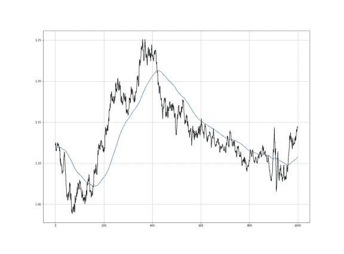

# 加权移动平均–用 Python 实现

> 原文：<https://www.askpython.com/python/weighted-moving-average>

在本文中，我们将使用 Python 计算加权移动平均。加权移动平均线或 WMA 在交易系统中广泛使用

* * *

## 理解移动平均线

移动平均用于通过计算完整数据集的不同子集的平均值来分析时间序列数据。移动平均线也称为滚动或移动平均线。

它也被称为滚动平均值或移动平均值，因为它包括对数据集取平均值。移动平均线主要用于时间序列数据，以捕捉短期波动，同时关注长期趋势。它平滑了数据。

[ARIMA(自回归综合移动平均模型)算法](https://www.askpython.com/python/examples/arima-model-demonstration)使用移动平均进行时间序列数据预测。

**举例:**股票价格、天气预报、空气质量、国内生产总值、就业等。

* * *

## 移动平均线的类型

*   简单移动平均线
*   累积移动平均线
*   指数移动平均线
*   加权移动平均(WMA)

* * *

## 简单移动平均线

简单移动平均线(SMA)利用滑动窗口在一定数量的时间段内取平均值。简单移动平均线只是几种移动平均线中的一种，可以应用于价格序列来建立交易系统或投资决策框架。其中，金融市场中常用的另外两种移动平均线是:

*   加权移动平均
*   指数移动平均线

* * *

## 加权移动平均(WMA)

加权移动平均(WMA)是一种技术指标，它对最近的数据点赋予较大的权重，而对遥远过去的数据点赋予较小的权重。

我们通过将数据集中的每个数字乘以一个预先确定的权重并对结果值求和来获得 WMA。WMA 被交易者用来产生交易信号，指示何时买入或卖出股票。

这里有一个简单的例子:

假设你需要计算日线图上 3 个收盘价的 WMA。价格分别是₹10，₹12，₹15，其中₹15 是最新价格。

基于价格的新近性，权重被分配给每个价格。因此，在这种情况下，₹15 的权重为 3，₹12 的权重为 2，₹10 的权重为 1。请记住，这是一个过于简单的计算，在现实世界中，计算也可以有小数点的权重。

接下来，我们将计算时间段的权重之和，因此 1 + 2 + 3 = 6。

最后，我们将使用以下权重计算 WMA:

[(₹15 * 3)+(₹12 * 2)+(₹10 * 1)]/6 =**13.16666666667**

在我们的计算中，上述价格的 3 期 WMA 为 13.166666667。

* * *

## 在 Python 中实现加权移动平均公式

让我们不要用 Python 来实现我们之前讨论过的 WMA 公式。以下函数可用于传递给该函数的任何时序数据。

```py
def weightedmovingaverage(Data, period):
    weighted = []
    for i in range(len(Data)):
            try:
                total = np.arange(1, period + 1, 1) # weight matrix
                matrix = Data[i - period + 1: i + 1, 3:4]
                matrix = np.ndarray.flatten(matrix)
                matrix = total * matrix # multiplication
                wma = (matrix.sum()) / (total.sum()) # WMA
                weighted = np.append(weighted, wma) # add to array
            except ValueError:
                pass
    return weighted

```

随机定价数据的输出:



* * *

## 结论

加权移动平均线为更近期的数据点分配更大的权重，因为它们比遥远过去的数据点更相关。权重之和应为 1(或 100%)。在简单移动平均的情况下，权重是平均分配的。

敬请关注更多关于 Python 的文章！