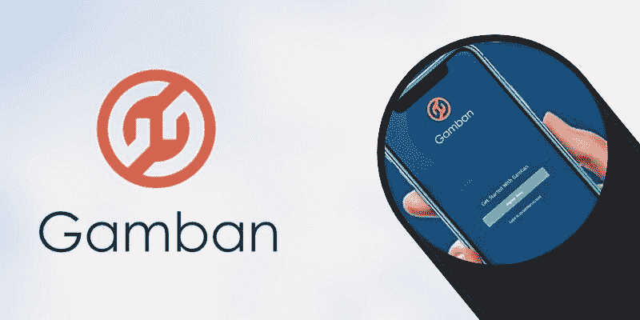
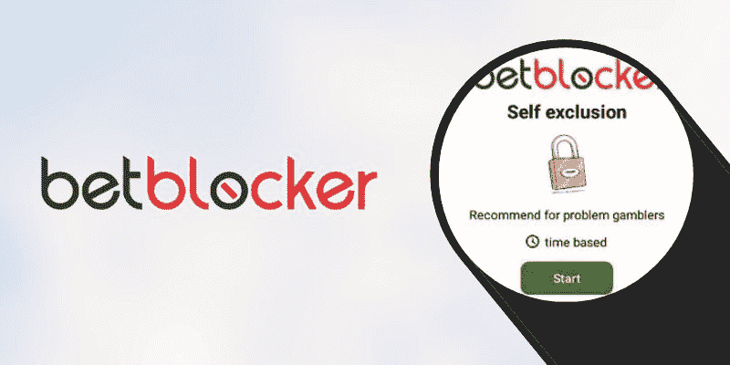

# GamStop App 停止工作怎么办？

> 原文：<https://www.askpython.com/python/what-to-do-if-gamstop-app-stopped-working>

自赌博业发展以来，英国始终采取主动，倡导更安全、更负责任的赌博体验。英国赌博委员会对此实施了更严格的法律，除此之外，还启动了多项计划来禁止来自英国特许赌场平台的玩家。Gamstop 是最受欢迎的自我排除计划之一，旨在限制赌博成瘾者访问英国的在线赌博网站。

有时自我排除可能不起作用，因为英国赌客不使用 GamStop 上的在线赌场或任何其他原因。Gamstop 于 2018 年发布，由非营利组织全国在线自我排除计划有限公司运营。Gamstop 提供的自我排除期从 6 个月、1 年或 5 年不等，具体取决于客户的选择。然而，如果 Gamstop 停止工作，也有突出的解决方案。

## 尝试甘班

Gamban 是另一个[顶级应用](https://www.askpython.com/python/top-applications-of-python)，可以防止脆弱的赌徒访问赌博平台。GambleAware 于 2015 年推出的 Gamban 因其是阻止在线赌场的有效解决方案之一而享有盛誉。其服务旨在支持和帮助因沉迷赌博而需要帮助的赌客。GambleAware 是一家独立的慈善机构，致力于减少英国与赌博相关的问题。

该组织负责与英国赌博相关的治疗、教育、资助和研究服务。希望摆脱赌博困扰的赌客需要安装该应用程序，因为它可以在 iOS、Android、Windows 和 Mac OS 等所有平台上运行。安装应用程序后，客户将无法访问他们选择避开的网站。

## 尝试操作者的内部限制

运营商内部限制是与 Gamstop 合作的服务之一。Gamstop 的主要目的是让赌客通过禁止自己加入在线赌场运营商来防止赌博倾向。由于这一计划有助于赌博者将自己排除在他们选择的运营商之外，因此与运营商内部限制等其他组织开展了合作。

因此，如果 Gamstop 停止工作，这也是一个解决方案。他们提供的服务类似于 Gamstop，都提供了有效的解决方案来禁止赌博者使用多个赌博平台。选择运营商的内部限制使客户能够随着时间的推移放弃他们的赌博问题。由于该解决方案与游戏者的支持配对，下载该应用程序的客户被阻止进行问题游戏。

## 试用 BetBlocker

BetBlocker 由 ThePOGG.com 于 2019 年开发并创立，是一款帮助赌客阻止自己进入赌博平台的应用程序。POGG.com 是一项服务，旨在评估在线赌场，并为赌客推荐最好的赌场。该解决方案旨在减少英国的赌博相关问题，鼓励负责任的赌博。

BetBlocker 类似于 Gamstop，是想要禁止自己沉迷赌博的赌客的理想选择。BetBlocker 应用程序可以使用 Android、Linux、iOS、Mac 和 Windows 设备下载。下载应用程序后，玩家必须选择他们希望被排除在外的时间段，应用程序禁止他们访问他们选择的运营商。BetBlocker 与多家赌博运营商合作，为客户提供了广泛的赌博平台选择。

## 寻找 gamestop 支持

如果 Gamstop 停止工作，另一个解决方案是向服务支持寻求帮助。Gamstop 全天候可用，可以通过电话、电子邮件和实时聊天联系。由于 Gamstop 优先考虑客户的满意度，因此一支训练有素的技术团队随时为客户提供支持。他们提供的解决方案是合理的，也值得考虑。客户服务可通过热线电话联系，电话号码为(800) 883-8895 和(866) 323-2321，全年无休。FAQ 部分还提供了许多常见问题的答案，提供了关于 Gamstop 的足够信息。它澄清了客户的大部分疑虑。

## 结论

Gamstop 是一个应用程序，限制赌客进入英国持牌赌场，以减少赌博的危害。如果 [GamStop 工作流](https://www.journaldev.com/57386/how-gamstop-works-in-details)被破坏，还有 GamCare 等其他解决方案存在。Gamcare 已经存在了 20 多年，这个独立的慈善机构通过各种手段来保护负责任的赌博，以防止赌博成瘾。

国家赌博帮助热线运营 GamCare，主要负责提供公共教育和预防，支持需要帮助的赌徒，以及与赌博运营商合作。该组织的咨询服务是有效的，因为它已经存在多年，有助于澄清问题和回答问题。GamCare 在玩家保护方面类似于 GamStop，因此，如果无法联系到 GamStop，客户可以联系其支持服务。