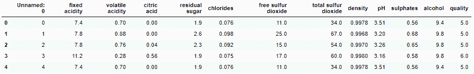
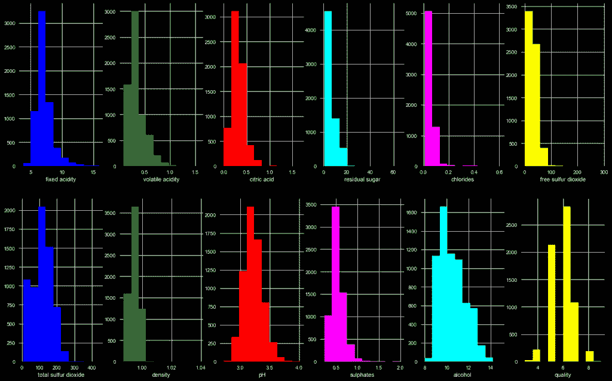
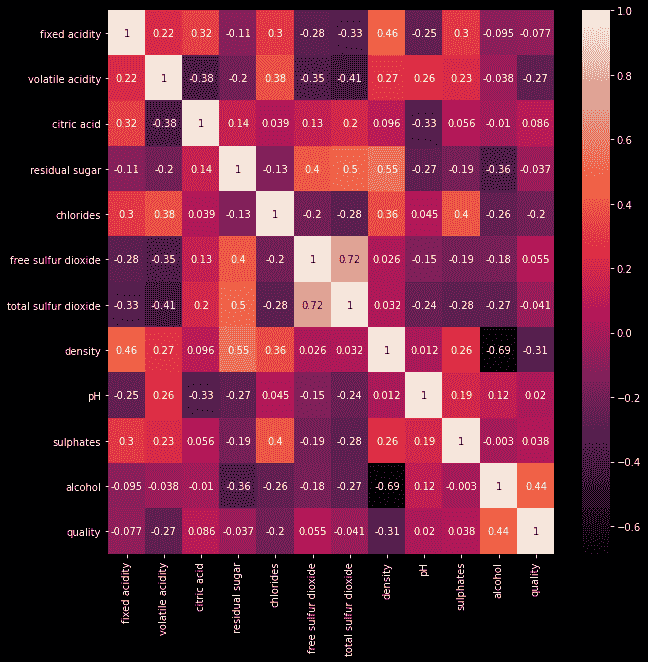

# 使用 Python 进行葡萄酒分类——简单易懂

> 原文：<https://www.askpython.com/python/wine-classification>

大家好！在本教程中，我们将学习如何根据 Python 编程语言中的各种特性对葡萄酒进行分类。

***也可阅读:[用 Python 分类服装图像——完全指南](https://www.askpython.com/python/examples/classifying-clothing-images)***

* * *

## 葡萄酒分类介绍

这个星球上有许多葡萄酒，包括甜酒、起泡酒、开胃酒、流行酒、餐酒和陈年葡萄酒。

你可能想知道一个人如何知道哪种酒好，哪种不好。这个问题的答案是机器学习！

有许多葡萄酒分类方法可用。这里列出了其中的一些:

1.  手推车
2.  逻辑回归
3.  随机森林
4.  朴素贝叶斯
5.  感觉
6.  SVM
7.  KNN

* * *

## 用 Python 实现葡萄酒分类

现在让我们进入 Python 中葡萄酒分类器的一个非常基本的实现。这将为您提供一个学习分类器如何工作以及如何在 Python 中为各种真实场景实现它们的起点。

### 1.导入模块

第一步是将所有必要的模块/库导入程序。分类所需的模块是一些基本模块，例如:

1.  [Numpy](https://www.askpython.com/python-modules/numpy/numpy-bitwise-operations)
2.  熊猫
3.  [Matplotlib](https://www.askpython.com/python-modules/matplotlib/python-matplotlib)

下一步是将所有模型导入到 sklearn 库下的程序中。我们还将包括 sklearn 库中的一些其他函数。

加载的型号如下所示:

1.  SVM
2.  逻辑回归

```py
import numpy as np
import pandas as pd
import matplotlib.pyplot as plt
from sklearn import svm
from sklearn import metrics
from sklearn.linear_model import LogisticRegression
from sklearn.metrics import classification_report
from sklearn.metrics import confusion_matrix,accuracy_score
from sklearn.preprocessing import normalize

```

* * *

### 2.数据集准备

接下来，我们需要准备数据集。让我从介绍数据集开始，然后在我们的应用程序中导入相同的内容。

#### 2.1 数据集简介

在数据集中，我们有 6497 个观察值和总共 12 个特征。任何变量都没有 NAN 值。你可以在这里轻松下载数据[。](https://github.com/IshaBansal0408/MachineLearningIntern---CodeSpeedy/blob/master/wine_dataset.csv)

12 个功能的名称和描述如下:

*   固定酸度:葡萄酒中的酸度
*   挥发性酸度:葡萄酒中醋酸的含量
*   柠檬酸:葡萄酒中柠檬酸的含量
*   残余糖:发酵后的糖量
*   氯化物:葡萄酒中存在的盐的数量
*   游离二氧化硫:游离二氧化硫的量
*   总二氧化硫:游离和结合形式的二氧化硫量
*   密度:葡萄酒的密度(质量/体积)
*   pH 值:葡萄酒的 pH 值范围从 0-14
*   硫酸盐:葡萄酒中二氧化硫气体的含量
*   酒精:葡萄酒中的酒精含量
*   质量:提到的葡萄酒的最终质量

#### 2.2 加载数据集

借助`read_csv`函数将数据集加载到程序中，并使用`head`函数显示数据集的前五行。

```py
data=pd.read_csv("./wine_dataset.csv")
data.head()

```



Wine Classify Data First5

#### 2.3 数据清理

数据集的清理包括借助下面提到的代码删除不必要的列和 NaN 值:

```py
data=data.drop('Unnamed: 0',axis=1)
data.dropna()

```

#### 2.4 数据可视化

一个重要的步骤是在进一步处理数据之前，首先将数据可视化。可视化以两种形式完成，

1.  组织图表
2.  Seaborn 图

##### **绘制直方图**

```py
plt.style.use('dark_background')
colors=['blue','green','red','cyan','magenta','yellow','blue','green','red','magenta','cyan','yellow']
plt.figure(figsize=(20,50))
for i in range(1,13):
    plt.subplot(6,6,i)
    plt.hist(data[data.columns[i-1]],color=colors[i-1])
    plt.xlabel(data.columns[i-1])
plt.show()

```

我们将分别为每个特征绘制直方图。输出显示如下。



Wine Classify Histogram Plot

##### **绘制海风**

```py
import seaborn as sns
plt.figure(figsize=(10,10))
correlations = data[data.columns].corr(method='pearson')
sns.heatmap(correlations, annot = True)
plt.show()

```

Seaborn 图用于显示数据集中不同要素之间的关系。



Wine Classify Seaborn Plot

#### 2.5 训练测试分割和数据标准化

将数据拆分成[训练和测试数据](https://www.askpython.com/python/examples/split-data-training-and-testing-set)，不存在最优拆分百分比。

但公平的分割规则之一是 80/20 规则，其中 80%的数据用于训练数据，其余 20%用于测试数据。

这一步还包括规范化数据集。

```py
split=int(0.8*data.shape[0])
print("Split of data is at: ",split)
print("\n-------AFTER SPLITTING-------")
train_data=data[:split]
test_data=data[split:]
print('Shape of train data:',train_data.shape)
print('Shape of train data:',test_data.shape)
print("\n----CREATING X AND Y TRAINING TESTING DATA----")
y_train=train_data['quality']
y_test=test_data['quality']
x_train=train_data.drop('quality',axis=1)
x_test=test_data.drop('quality',axis=1)
print('Shape of x train data:',x_train.shape)
print('Shape of y train data:',y_train.shape)
print('Shape of x test data:',x_test.shape)
print('Shape of y test data:',y_test.shape)

nor_train=normalize(x_train)
nor_test=normalize(x_test)

```

* * *

### 3.葡萄酒分类模型

在这个程序中，我们使用了两种算法，即 SVM 和逻辑回归。

#### 3.1 支持向量机(SVM)算法

```py
clf = svm.SVC(kernel='linear')
clf.fit(nor_train, y_train)
y_pred_svm = clf.predict(nor_test)
print("Accuracy (SVM) :",metrics.accuracy_score(y_test, y_pred_svm)*100)

```

模型的精度原来是在`50%`左右。

#### 3.2 逻辑回归算法

```py
logmodel = LogisticRegression()
logmodel.fit(nor_train, y_train)
y_pred_LR= logmodel.predict(nor_test)
print('Mean Absolute Error(Logistic Regression):', metrics.mean_absolute_error(y_test, y_pred_LR)*100)

```

在这种情况下，精度也在`50%`左右。这主要是因为我们使用/创建的模型。tensorflow 可用的高级模型有

* * *

## 结论

为了获得更高的精度，您也可以查看 tensorflow 模型！

快乐学习！😇

敬请关注更多此类教程！感谢您的阅读！

* * *