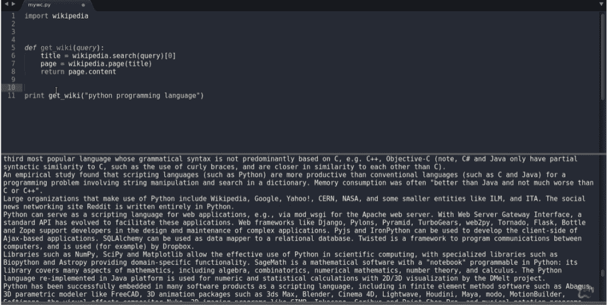

# 使用 Python 的词云

> 原文：<https://www.askpython.com/python/examples/word-cloud-using-python>

欢迎来到这个使用 Python 的 **word cloud 教程。单词云技术已经成为数据可视化的一种趋势技术，尤其是在存在文本数据的情况下。**

因此，我们可以说 ***单词云*** 已经成为使用自然语言处理(NLP)的数据可视化的突出技术之一。

## 什么是词云？

我们提取文章中最常用的词，然后根据一个词的使用次数。

使用量越大，单词在词云中的大小就越大。

## 如何用 Python 创建词云？

所以，让我们从使用 Python 创建我们自己的单词云开始。

### 1.安装 wordcloud 和维基百科库

要创建一个单词云，我们需要在我们的机器上安装 python 3.x，还要安装 **wordcloud** 。要安装 wordcloud，你可以使用[的 pip 命令](https://www.askpython.com/python-modules/python-pip):

```py
sudo pip install wordcloud

```

对于这个例子，我将使用一个来自维基百科的网页，即-[Python(编程语言)](https://en.wikipedia.org/wiki/Python_(programming_language))。要使用维基百科的内容，我们需要安装**维基百科依赖项**。

```py
sudo pip install wikipedia

```

### 2.基于查询搜索维基百科

首先，我们将使用下面的代码片段导入`wikipedia`库:

```py
import wikipedia

```

我们将使用`search`函数，只取出第一个元素，这就是我们使用[0]的原因。这将是我们页面的标题。

```py
def get_wiki(query):
	title = wikipedia.search(query)[0]

	# get wikipedia page for selected title
	page = wikipedia.page(title)
	return page.content

```

在提取了`title`之后，我们使用`page()`并检索页面的内容。在这之后，我们使用`page.content`只返回页面的`content`。

如果你在控制台上运行上面的代码，你将在控制台上获得站点的所有原始数据。但是我们的任务并没有到此结束，我们需要做一个词云。



Getting the raw data from wikipedia

### 3.创建云遮罩并设置停止词

首先，我们将导入`wordcloud`库，并导入特定的包，如`WordCloud`和`STOPWORDS`。

我们导入`STOPWORDS`是因为我们想要删除基本冠词，如 *a、an、the 以及英语中使用的其他常用词*。

```py
from wordcloud import WordCloud, STOPWORDS

```

我们将使用`mask`。这是一个粗略的图表，在当前的工作目录中命名为“cloud.png ”,用`currdir`表示。我们将打开这个图像，并将它存储在一个 numpy 数组中。


cloud.png

我们的下一个任务是定义一组停用词，因此我们使用`set(STOPWORDS)`。

我们使用 Python 对象通过`WordCloud`()创建单词 cloud。我们将传递参数如`background_color`、`max_words`(这里我们选择我们的字数限制为 200)、`mask`、`stopwords`。

然后我们将使用`wc.generate()`并将原始文本作为参数传递。

我们也可以将生成的单词 cloud 保存到一个文件中，我们将它命名为`output.png`。

```py
def create_wordcloud(text):
	mask = np.array(Image.open(path.join(currdir, "cloud.png")))

	stopwords = set(STOPWORDS)

	# create wordcloud object
	wc = WordCloud(background_color="white",
					max_words=200, 
					mask=mask,
	               	stopwords=stopwords)

	wc.generate(text)

	# save wordcloud
	wc.to_file(path.join(currdir, "output.png"))

```

第一次运行这两个功能可能需要 30-40 秒，以后可能会减少。 ***完整的代码和输出图像如下一节所示。***

## 使用 Python 完成单词云的实现

```py
import sys
from os import path
import numpy as np
from PIL import Image
import wikipedia
from wordcloud import WordCloud, STOPWORDS

currdir = path.dirname(__file__)

def get_wiki(query):
	title = wikipedia.search(query)[0]
	page = wikipedia.page(title)
	return page.content

def create_wordcloud(text):
	mask = np.array(Image.open(path.join(currdir, "cloud.png")))

	stopwords = set(STOPWORDS)

	wc = WordCloud(background_color="white",
					max_words=200, 
					mask=mask,
	               	stopwords=stopwords)

	wc.generate(text)
	wc.to_file(path.join(currdir, "output.png"))

if __name__ == "__main__":
	query = sys.argv[1]
	text = get_wiki(query)

	create_wordcloud(text)

```

**输出:**


output.png

## 结论

使用 Python 创建单词云是可视化任何文本内容中使用的最大数量单词的最简单方法之一。只要运行这段代码，就可以很容易地理解文中讨论的主题和话题。

我希望你喜欢这篇文章。请在下面的评论区告诉我们您的反馈。