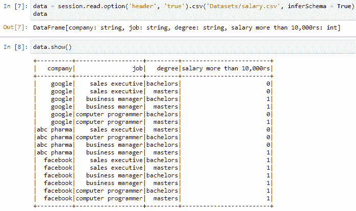

# 在 Python 中使用 Pyspark 处理列

> 原文：<https://www.askpython.com/python-modules/working-with-columns-using-pyspark>

在本文中，我们将了解更多关于 PySpark 的内容。数据是推动信息技术和数字领域各个方面的核心来源之一。因此，要正确使用它，我们需要知道几个要点。如今有大量的数据可用。有一些软件工具包可用于管理这些大数据。Pyspark 就是其中之一。

PySpark 是一个 Python 库，是 Apache Spark 的扩展。

## 使用 PySpark 处理数据列

本文面向对 Apache Spark 和 Python 编程有所了解的人。*Python 知识和数据分析用* *Pyspark* *是理解这个题目的必备。*

如果你们都准备好了，让我们开始吧。

### 1.安装 Pyspark

本节讨论 Pyspark 的安装。只需进入命令提示符，并确保您已经将 Python 添加到了 **环境变量** 中的 **路径** 中。接下来，键入下面的 **[pip 命令](https://www.askpython.com/python-modules/python-pip) :**

```py
pip install pyspark

```


Installing Pyspark Through Command Prompt

现在我们已经成功地在系统中安装了框架，让我们进入主题。

### 2.设置环境

有一些先决条件，以确保我们有一个平稳的工作流程。以下是他们:

#### 使用的工具和资源

1.  **环境:** *蟒蛇*
2.  **Python 版本:** *3.6 及以上*
3.  **IDE** : *Jupyter 笔记本*
4.  **数据集:** *salary.csv*

1.  **创建会话**
2.  **读取数据集**
3.  **显示数据集**

### 3.在 Pyspark 中创建会话

当我们执行**大数据**分析时，Pyspark 中的会话是最重要的方面之一。一个会话为我们创建了一个应用程序，以便它保存我们活动的每个记录和每个检查点。使用以下代码创建会话:

**代码:**

```py
import pyspark
import warnings
warnings.filterwarnings('ignore')

from pyspark.sql import SparkSession

```


SQL 模块的 **SparkSession** 类帮助我们创建一个会话。我们创建一个会话变量作为类的实例。然后构建器方法的属性 **appname()** 为应用程序命名。然后 **getOrCreate()** 方法创建一个交互式应用程序。现在我们有了一个坚实的基础，让我们进一步读取数据集。

### 4.读取数据集

当我们读取数据集时，机器以 SQL 表的形式读取它。默认情况下，该表中的每一列和每一个单元格都作为字符串读取。我们将从数据集文件夹中读取 **salary.csv** 。这是数据集所在的路径。如果文件存在于任何文件夹中，那么给出文件夹路径是最好的选择。

下面是代码:

```py
data = session.read.csv('salary.csv')
data

```


首先，我们创建一个保存数据集的变量“data”。会话的读取功能用于读取数据集。该函数具有读取各种扩展名的文件的子函数。我们可以通过 Pyspark 读取以下类型的文件:

1.  **csv**
2.  **格式**
3.  **jdbc**
4.  **json**
5.  **兽人**
6.  **检察院**
7.  **模式**
8.  **表**
9.  **正文**

### 5.显示数据集

当我们读取数据集时，只有在系统中才能查看它，只有一种方法–**show()**使我们能够查看它。*如果数据集太大，那么该方法只显示前二十行*，但是如果数据集很小，比如十行或十五行，那么将显示整个表。

```py
data.show()

```


A View Of The Dataset

## 使用 PySpark 进行列转换

在上图中，表格以字符串的形式读取表格中的每个元素。然后，它还根据计数来命名列。因此，如果我们有四列，那么它将显示从 0 到 3 的列号。我们需要显示带有适当列标题的表格。这将是我们在本文中讨论的核心话题。因此，让我们跟上它的步伐。

对于基本操作，我们可以对数据集执行以下转换:

*   创建新列
*   选择一个特定列
*   选择多列
*   添加列
*   删除列
*   重命名列

我们并不明确需要使用一个外部库来做这件事，因为 ***Pyspark*** 也有同样的功能。为此， **read** 方法的 **option()** 属性让我们查看标题。下面是代码。

```py
data = session.read.option('header', 'true').csv('Datasets/salary.csv', inferSchema = True)
data

```

option()属性使我们能够以正确的格式查看数据集。**推断模式**参数被设置为**真**以使标题可见。此外，它还读取具有相应数据类型的列。



Dataset Display With Appropriate Column Setup

让我们把研究转向柱子上的主要技术。

### 1.选择列

在 Pyspark 中选择数据集中的特定列非常容易。 **select()** 函数将一个参数作为一列。它在输出中返回单个列。

同样，为了记录所有可用的列，我们采用了**列**属性。这会以列表的形式返回它们。在本例中，我们将从数据集中选择**‘工作’**列。

**代码:**

```py
data.columns
data.select('Name').show()

```

**输出:**


Selecting A Particular Column

### 2.选择多列

我们使用相同的 **select()** 函数来选择多个列。这个函数可以以列的形式接受多个参数。我们从数据集中选择**【公司】**和**【工作】**列。

**代码:**

```py
data.select('company', 'job').show()

```

**输出:**


Selecting Multiple Columns

### 3.添加列

添加列仅仅使用了一行代码。 **Pyspark** 为**提供 Column()** 和 **lit()** 功能。

*   **withColumn()** 函数:该函数有两个参数
    1.  **要给出的列名。**
    2.  **数据框中需要引用的现有列。**
*   **lit()** 函数与 **withColumn()** 函数集成，以添加新列。它需要两个参数。
    1.  列名
    2.  为每一行指定一个常数值。

我们将使用 **withColumn()** 函数在数据框中添加一个新列**‘减税’**。比方说，减税对所有员工都是普遍的，所以它是一个不变的值。

**代码:**

```py
from pyspark.sql.functions import lit
# adding columns in dataframe
data = data.withColumn('Tax Cutting', lit(0.1))

```

**输出:**


Adding a new column In the dataset

### 4.删除列

删除列就是永久删除该列的所有内容。Pyspark 为此提供了灵活的功能。和熊猫一样，我们有 **drop()** 功能。它把要放入其中的列作为参数。我们将尝试从数据集中删除**度**列。确保你适当地提到名字，否则它会给出一个错误。

**代码:**

```py
data = data.drop("degree")
data.show()

```

**输出:**


Dropping the degree column

### 5.重命名列

重命名一个列会改变该列的**主标题**或**标题**。为此，我们使用了 **withColumnRenamed()** 函数。这个函数有两个参数。

1.  ***已有列名***
2.  ***要赋予列的新名称。***

为了实际理解，我们将把**作业**列名重命名为**名称**。

```py
data = data.withColumnRenamed('job', 'Designation')

```

在上面的代码中， ***作业*** 是数据框中现有的列名，而 ***名称*** 是我们将赋予该特定列的新名称。


Renaming the column

## 结论

文章到此结束。我们看到了所有关于 ***Pyspark 的列变换*** 的基础知识。各种修改，比如创建一个新列、删除它、重命名它以及对它进行一些更改。这是开始使用这个库的基本步骤。祝你将来学习顺利。