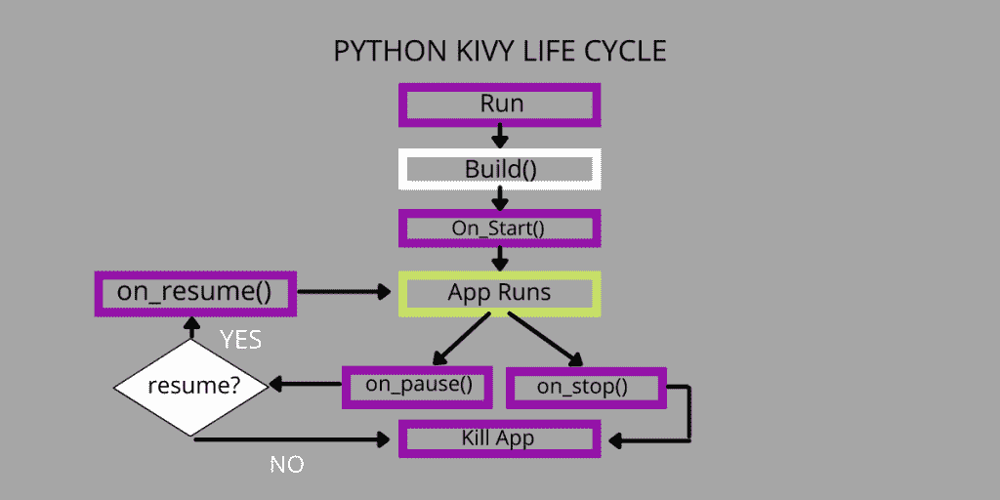
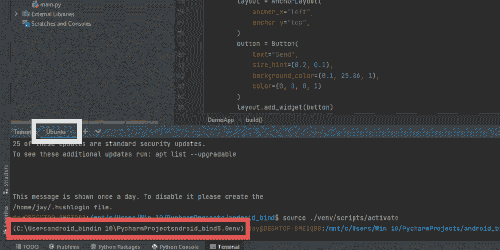

# 如何用 Python 写 Android 应用？

> 原文：<https://www.askpython.com/python/examples/write-android-apps-in-python>

想用 Python 构建 Android 应用？世界上有超过 30 亿台设备运行 android。这使得它成为世界上最重要或者可能是最重要的智能手机操作系统之一。假设 android 的重要性，有很多 android 构建工具如 Android Studio，Kotlin 等。

但是有没有想过 android 应用程序是否也可以用 Python 来制作？

是的，这是可能的，本文旨在向读者解释和演示如何用 Python 编写 android 应用程序。

该任务的框架将被采用，因为基维和 APK 打包将由 [**Buildozer**](https://buildozer.readthedocs.io/en/latest/) 执行。

## 使用 Kivy 用 Python 构建 Android 应用程序

[**Kivy**](https://kivy.org/#home) 用于创建移动应用，通常采用 Python 作为框架。这个软件是免费使用的，并得到了麻省理工学院的许可。我们将从了解 Kivy 的安装程序开始。



Python Kivy Life Cycle

### 设置和配置 Kivy

我们将开始在 PyCharm 安装 Kivy，因为它易于使用。

**注意:**以下所有步骤都需要 Linux 发行版，在将应用程序打包到 android 中时，我们将使用严重依赖 Linux 的 Buildozer。如果你在 Windows 上，那么你不需要担心，你可以安装一个虚拟机来产生一个 Linux 环境，而如果你在 windows 10 上，那么你可以直接从微软商店下载 ubuntu 发行版。

参考配置 WSL(Windows 子系统到 Linux)–[此处](https://docs.microsoft.com/en-us/windows/wsl/install)

### 安装步骤:

*   第一步需要为 Windows 用户设置 Linux 发行版，Linux 用户可以跳过这一步。
*   一开始，我们将在 PyCharm 中创建一个新项目，然后进入 PyCharm 终端(对于 windows 用户，在终端下拉菜单中选择 Ubuntu 而不是“本地”)。
*   我们将不得不建立一个虚拟环境。虚拟环境是 Python 目录的集合，将所有需要的库和脚本存储在一个地方。如果一个虚拟环境已经处于活动状态，我们将停用它并创建一个可以安装 Kivy 的新环境。要停用，请在终端中键入“停用”。然后键入:

```py
pip3 install virtualenv

```

virtualenv 的安装将由上述命令启动，然后:

```py
virtualenv -p python3.8 venv 

```

上面的命令将为你的项目创建一个虚拟环境，“venv”是我们给这个虚拟环境起的名字，但是你可以使用任何合适的名字。

*   现在我们需要为我们的项目激活这个 virtualenv。一旦激活，无论我们安装什么库，它都会为这个项目激活。

对于 windows 类型:

```py
source ./venv/scripts/activate

```

在 windows 中，脚本目录位于 virtualenv 目录中。

对于 Linux:

```py
source venv/bin/activate

```

如果一切都以上述方式执行，虚拟环境将被激活，您的 virtualenv 的路径位置将出现在闭括号中。在下图中，红色高亮显示的是 venv 被激活后的路径位置。



Virtual environment

无法设置您的虚拟环境？查看参考文献部分，了解更多指导。

一旦一切都设置好了，输入命令

```py
pip install kivy

```

要检查安装是否成功，请输入命令 python 并按 enter 键

在 python 中，键入“import kivy”。如果终端没有抛出错误，这意味着 kivy 安装成功

安装完成后，我们将了解 Kivy 的基础知识以及用 Python 实现它的不同方式。下面是一个基本的 python 程序，它生成存储在变量“text”中的字符串，并将其显示在一个新的对话框中。

代码:

```py
from kivy.app import App
from kivy.uix.label import Label

class TrialApp(App):
    def build(self):
        return Label(
            text="Making an android app"
        )

demo=TrialApp()
demo.run()

```

**导入包** : kivy.app 导入 app，kivy.uix.label 导入标签
trial App=是类的名字。
**text**= variable
**demo**= object created
**def build(self):**它是一个方法，在这个方法中，小部件将被调用
**label** :显示小部件的文本

## 了解小部件

小部件是简单的选择，当一个特定的事件被触发时(比如当用户给出一个点击/击键输入时)，它启动一个响应。它允许用户完成特定的任务，而不需要每次都键入大量代码或特定于事件的命令。Kivy 中有许多小部件可以使用，比如标签、文本框、按钮等。

#### 主要有两种类型的小部件:

**属性事件窗口小部件:**当窗口小部件的特征发生变化时，如比例、轮廓、颜色的修改，触发响应。
**小部件定义的事件:**在小部件发生修改时触发响应，比如在文本框中写东西并获得输出。

## 了解 Kivy 的布局

#### 网格布局

网格布局允许您形成一个矩阵，并将小部件放在一个类似表格的结构中，向其中添加行和列。通过这种布局，可以在行和列中专门放置小部件。

下面的程序演示了如何实现网格布局来添加小部件。

```py
class Format_layout_Grid(GridLayout):
    def __init__(self, **kwargs):
        super().__init__(**kwargs)
        self.rows=3
        self.cols=3

        self.label=Label(
            text="Click ---->"
        )
        self.add_widget(self.label)
        self.but0n=Button(
                text="Tap Here",
                size_hint = (0.3, 0.3),
                background_color = (0.6, 25.7, 1.9),
                color = (1, 0, 1, 1)
                )
        self.add_widget(self.but0n)

```

#### 锚点布局:

锚点布局允许您将小部件放置或“锚定”在输出屏幕的四个角或中央。可以使用 anchor_x 和 anchor_y 代码设置。

```py
class DemoApp(App):
    def build(self):
        layout=AnchorLayout(
            anchor_x="left",anchor_y="top"
        )
        but0n=Button(
            text="This box anchors",
            size_hint=(0.3,0.3),
            background_color=(0.4,25.8,3),
            color=(0,0,0,1)
        )
        layout.add_widget(but0n)
        return layout

```

#### 浮动布局

这种布局让我们可以将小部件放在任何我们想放的地方。不像网格布局需要行和列，或者锚点布局只允许我们在角落或中心放置小部件，浮动布局可以在任何我们想要的位置放置小部件。虽然默认情况下所有的部件都放在布局的左下角，但是必须给出正确的 x，y 值来正确地调整所有的部件。

```py
class Format_float(FloatLayout):
    def __init__(self,**kwargs):
        super().__init__(**kwargs)

        self.label = Label(
            text="Tap on Blue",
            size_hint=(0.1, -0.1),
            pos_hint = {"x": 0.3, "y": 0.7},
        )
        self.add_widget(self.label)

        self.button = Button(
            text="Press here",
            size_hint=(0.4, 0.1),
            pos_hint={"x":0.4,"y":0.5},
            background_color=(0.6, 25.3, 2),
            color=(1, 0, 1, 2)
        )
        self.add_widget(self.button)

```

#### 页面布局

这个布局与我们到目前为止讨论过的其他布局有点不同。这种布局允许我们创建不同的页面，并在不同的页面上放置多个小部件，还允许用户在页面间滑动。在这种布局中，不能改变页面的大小或其他属性。

```py
class page_format_layout(PageLayout):
    def __init__(self, **kwargs):
        super().__init__(**kwargs)

        self.but0ni = Button(
            text="Slide I"
        )
        self.add_widget(self.but0ni)

        self.but0ni2 = Button(
            text="Slide II"
        )
        self.add_widget(self.but0ni2)

        self.but0ni3 = Button(
            text="Slide III"
        )
        self.add_widget(self.but0ni3)

```

## 创建应用程序

因为我们已经介绍了 Kivy 的基础知识，并讨论了广泛使用的布局和窗口小部件。现在，我们将看看如何创建一个可以在 android 手机上运行的独立应用程序。在下面的例子中，我们将创建一个接受用户输入并使用 google API 输出结果的搜索引擎。

```py
from kivy.app import App
from kivy.uix.anchorlayout import AnchorLayout
from kivy.uix.button import Button
from kivy.uix.floatlayout import FloatLayout
from kivy.uix.label import Label
from kivy.uix.textinput import TextInput
import webbrowser

search_api="www.google.com/search=?source=jv&fdf_njg64gfjf=hello"
class Format_float(FloatLayout):
    def __init__(self,**kwargs):
        super().__init__(**kwargs)

        self.l = Label(
            text="Place your search query below",
            size_hint=(1.0, 0.6),
            pos_hint = {"x": 0.0, "y": 0.2},
        )
        self.add_widget(self.l)

        self.t = TextInput(
            size_hint=(0.8, 0.06),
            pos_hint={"x": 0, "y": 0}
        )
        self.add_widget(self.t)
        self.bt0n = Button(
            text='send',
            size_hint=(0.2,0.05),
            pos_hint={"x":0.8,"y":0}
        )
        self.bt0n.fbind("on press", lambda x: self.search_api())
        self.add_widget(self.bt0n)

    def search_api(self):
        msg=self.t.text
        print(msg)
        webbrowser.open(search_api.format(msg))

class DemoApp(App):
    def build(self):
        layout = AnchorLayout(
            anchor_x="left",
            anchor_y="top",
        )
        button = Button(
            text="Send",
            size_hint=(0.2, 0.1),
            background_color=(0.1, 25.86, 1),
            color=(0, 0, 0, 1)
        )
        layout.add_widget(button)
        return Format_float()

demo=DemoApp()
demo.run()

```

注意:这里使用的 API 是一个特定于用户的 API，不再起作用。要获得一个功能 API，[点击这里](https://developers.google.com/webmaster-tools/search-console-api-original/v3/quickstart/quickstart-python)

## 打包应用程序

一旦你的代码完成，最后一步是捆绑应用程序并打包成一个 Android APK。为此，我们将使用 Buildozer。

Buildozer 是一个基于 Linux 的应用打包软件，它将你的应用打包到一个 Android 包(APK)或基于 IOS 的应用中。我们不能在 windows 中运行 Buildozer，它只能在 Linux 机器和 Mac OS 机器上运行。

要安装 Buildozer，你需要遵循 Buildozer 官方[文档](https://buildozer.readthedocs.io/en/latest/installation.html)中提到的步骤。

安装完成后，可以通过两种方式进行打包:

*   如果您在 mac/Linux 机器上，您可以按照官方文档中提到的步骤来定位软件包并构建应用程序。
*   如果您在 windows 机器上，那么在虚拟机或 linux 发行版中运行构建过程将会抛出多个错误。为了克服这种情况，你可以使用 [google Collab](https://colab.research.google.com/gist/kaustubhgupta/0d06ea84760f65888a2488bac9922c25/kivyapp-to-apk.ipynb#scrollTo=S9Z7KfTOnXuZ) 。它是一个共享的 linux 服务器，为您完成这项工作。

需要注意的几件事:

1.  编写源代码的文件名应重命名为“main.py”，任何其他同名文件都应删除。
2.  命令“buildozer init”创建一个 gradle 文件，其中包含所有必要的应用程序构建数据。您需要填写:标题，包。名称，包。域行与您自己的详细信息。
3.  命令“buildozer -v android debug”启动构建应用程序的过程。这是一个漫长的过程，需要 17-20 分钟，在此期间，你需要通过键入“y”并按 enter 键来授予权限。
4.  构建过程完成后，将在“lib”文件夹中创建应用程序。

## 结论

在这篇文章中，我们已经了解了如何用 Python 编写 android 应用程序。我们学习了 Kivy 的基本原理——不同的布局和小部件，在 windows 上设置 WSL，以及用 Buildozer 打包我们的应用程序。希望这篇文章对你有所帮助。

## 参考

将 python 文件转换为 apk:[https://towardsdatascience . com/3-ways-to-convert-python-app-into-apk-77 f 4c 9 CD 55 af](https://towardsdatascience.com/3-ways-to-convert-python-app-into-apk-77f4c9cd55af)

App 建设参考:[https://youtube.com/playlist?list = pltfhvora 00y-6 umadzbohyxfhyyj3c 25 o](https://www.youtube.com/watch?v=8hraPwKmiWc&list=TLPQMDkxMTIwMjHQUubOgcTyqQ&index=1)

。py 转 apk 教程:[链接此处](https://www.youtube.com/watch?v=mUdnjNGePZw&list=LL&index=4)

虚拟环境设置教程:[链接](https://youtu.be/8hraPwKmiWc)