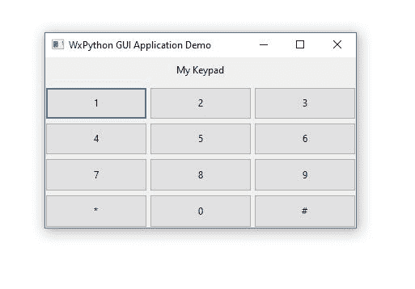

# wxPython:用 Python 创建 GUI

> 原文：<https://www.askpython.com/python-modules/wxpython>

**wxPython** 是 Python 编程语言的跨平台 GUI 工具包。它是由罗宾·邓恩与哈里·帕萨宁和爱德华·齐默曼于 1995 年共同开发的。wxPython 有助于创建健壮的图形用户界面，可以根据用例进行定制。它简单、用户友好、易于理解。

它被实现为一组 Python 扩展模块，这些模块包装了流行的 [wxWidgets](https://wxwidgets.org/) 跨平台库的 GUI 组件，该库是用 C++编写的。它是内置于 Python 标准库中的 Tkinter 框架的替代方案之一。

它是免费的并且**开源**。wxPython 是跨平台的，这意味着程序可以在几个平台上运行，而无需更改原始程序的源代码。目前，支持的平台包括 Microsoft Windows、Mac OS X 和 Mac OS，以及 Linux 或其他具有 GTK2 或 GTK3 库的类 UNIX 系统。

***也读: [Tkinter 教程——用 Tkinter 画布画一条线](https://www.askpython.com/python-modules/tkinter/drawing-a-line-tkinter-canvas)***

## 用 wxPython 创建键盘 GUI 应用程序

为了更好地理解它，让我们尝试使用 wxPython 创建一个小应用程序。这个应用程序的代码非常容易阅读。该应用程序使用 wxObject 类作为 WxPython API 中所有类的基类。

## 内容结构

1.  应用程序代码分解
2.  完整的应用程序
3.  输出
4.  结论

## 使用 wxPython 创建 GUI 循序渐进

*   安装 wxPython

```py
pip install wxPython

```

*   导入 wxPython

```py
import wx

```

*   创建一个 wxPython 应用程序并将其分配给变量“app”

```py
app = wx.App()

```

*   创建一个类**“Window”**，它将继承 **wx 的所有属性和方法。来自 wxPython API 的 Frame** 对象

代码:

```py
class Window(wx.Frame):

```

解释:

框架是一个窗口，用户可以改变它的大小和位置。它将被用作输入表单。它通常由一个标题栏和粗边框组成。根据应用需求，它可以选择性地包含菜单栏、工具栏和状态栏。默认情况下，它是可调整大小的。应用程序的任何控件都不应被创建为其子控件，因为控件将通过使用 **wx 来处理。面板**在下面的代码中。

*   **__init__ ()** 构造函数

代码:

```py
# Defining the default Constructor function
    def __init__(self, title):
        super().__init__(parent=None, title=title)

        # Create a panel
        self.panel = wx.Panel(self)

```

**说明:**

首先，我们定义我们的构造函数。为 init 函数定义的唯一默认参数是我们的应用程序窗口的标题,它将在代码的后面接受一个参数。 **wx。面板**包含我们应用程序窗口的所有控件。它应该被创建为框架的唯一子级，并作为实际控件的父级。框架将调整面板的大小，使其始终填充客户区。

*   **wx.GridBagSizer()**

代码:

```py
# Define the grid sizer for our layout
        sizer = wx.GridBagSizer(4, 3)

```

解释:

接下来，我们使用 **wx 为我们的窗口布局定义一个 sizer。GridBagSizer(4，3)** 。它可以在虚拟网格中布置项目，并接受可选参数，以像素为单位指定行和列之间的间距。虚拟网格的总大小由项目所在的最大行和列决定，并根据跨度进行调整。

*   **sizer。Add()**

代码:

```py
# Defining layout components
        sizer.Add(
            wx.StaticText(self.panel, label="My Keypad"),
            pos=(0, 1),
            flag=wx.ALIGN_CENTER,
        )

        sizer.Add(wx.Button(self.panel, label="1"), pos=(1, 0), flag=wx.EXPAND)
        sizer.Add(wx.Button(self.panel, label="2"), pos=(1, 1), flag=wx.EXPAND)
        sizer.Add(wx.Button(self.panel, label="3"), pos=(1, 2), flag=wx.EXPAND)
        sizer.Add(wx.Button(self.panel, label="4"), pos=(2, 0), flag=wx.EXPAND)
        sizer.Add(wx.Button(self.panel, label="5"), pos=(2, 1), flag=wx.EXPAND)
        sizer.Add(wx.Button(self.panel, label="6"), pos=(2, 2), flag=wx.EXPAND)
        sizer.Add(wx.Button(self.panel, label="7"), pos=(3, 0), flag=wx.EXPAND)
        sizer.Add(wx.Button(self.panel, label="8"), pos=(3, 1), flag=wx.EXPAND)
        sizer.Add(wx.Button(self.panel, label="9"), pos=(3, 2), flag=wx.EXPAND)

        sizer.Add(wx.Button(self.panel, label="*"), pos=(4, 0), flag=wx.EXPAND)
        sizer.Add(wx.Button(self.panel, label="0"), pos=(4, 1), flag=wx.EXPAND)
        sizer.Add(wx.Button(self.panel, label="#"), pos=(4, 2), flag=wx.EXPAND)

```

解释:

在代码的后面，我们开始使用我们之前定义的 **sizer** 变量向我们的应用程序添加内容。 **sizer。Add()** StaticText 构造函数。 **wx。ALIGN_CENTER** 是将标签文本作为标志居中的对齐枚举。

接下来，我们使用 **wx 将所有文本作为计算器添加到应用程序的布局中。按钮**构造器。每个按钮的行和列位置也必须像上面一样指定。最后是 **wx。扩展**确保扩展单个元素，占据布局的整个可用空间。

*   **sizer。AddGrowableRow()，sizer。AddGrowableCol()，SetSizer(sizer)**

代码:

```py
        sizer.AddGrowableRow(0)
        sizer.AddGrowableRow(1)
        sizer.AddGrowableRow(2)
        sizer.AddGrowableRow(3)
        sizer.AddGrowableRow(4)

        sizer.AddGrowableCol(0)
        sizer.AddGrowableCol(1)
        sizer.AddGrowableCol(2)

         self.panel.SetSizer(sizer)

```

解释:

**sizer。AddGrowableRow()** 指定如果 sizer 和 **sizer 有额外的可用空间，行索引(从零开始)应该增长。AddGrowableCol()** 指定如果 sizer 有额外的可用空间，列索引(从零开始)应该增长。

然后， **SetSizer(sizer)** 被设置到面板窗口，带有所有的布局细节和规范。

*   **中心()、显示()、窗口()**和 **app。主循环()**

代码:

```py
self.Center()  
self.Show()  

window = Window("WxPython GUI Application Demo")

app.MainLoop()

```

解释:

**Center()** 在屏幕中央显示窗口， **Show()** 显示构建好的框架， **Window()** 为应用程序和**应用程序设置标题。MainLoop()** 触发应用程序初始化程序的 GUI 事件循环。

## 使用 wxPython 模块创建 GUI 的完整代码

代码:

```py
# Create wxPython Application
app = wx.App()

class Window(wx.Frame):
    # Defining the Default Constructor function
    def __init__(self, title):
        super().__init__(parent=None, title=title)

        # Create a panel
        self.panel = wx.Panel(self)

        # Define Grid
        sizer = wx.GridBagSizer(4, 3)

        sizer.Add(
            wx.StaticText(self.panel, label="My Keypad"),
            pos=(0, 1),
            flag=wx.ALIGN_CENTER,
        )

        sizer.Add(wx.Button(self.panel, label="1"), pos=(1, 0), flag=wx.EXPAND)
        sizer.Add(wx.Button(self.panel, label="2"), pos=(1, 1), flag=wx.EXPAND)
        sizer.Add(wx.Button(self.panel, label="3"), pos=(1, 2), flag=wx.EXPAND)
        sizer.Add(wx.Button(self.panel, label="4"), pos=(2, 0), flag=wx.EXPAND)
        sizer.Add(wx.Button(self.panel, label="5"), pos=(2, 1), flag=wx.EXPAND)
        sizer.Add(wx.Button(self.panel, label="6"), pos=(2, 2), flag=wx.EXPAND)
        sizer.Add(wx.Button(self.panel, label="7"), pos=(3, 0), flag=wx.EXPAND)
        sizer.Add(wx.Button(self.panel, label="8"), pos=(3, 1), flag=wx.EXPAND)
        sizer.Add(wx.Button(self.panel, label="9"), pos=(3, 2), flag=wx.EXPAND)

        sizer.Add(wx.Button(self.panel, label="*"), pos=(4, 0), flag=wx.EXPAND)
        sizer.Add(wx.Button(self.panel, label="0"), pos=(4, 1), flag=wx.EXPAND)
        sizer.Add(wx.Button(self.panel, label="#"), pos=(4, 2), flag=wx.EXPAND)

        sizer.AddGrowableRow(0)
        sizer.AddGrowableRow(1)
        sizer.AddGrowableRow(2)
        sizer.AddGrowableRow(3)
        sizer.AddGrowableRow(4)

        sizer.AddGrowableCol(0)
        sizer.AddGrowableCol(1)
        sizer.AddGrowableCol(2)

        self.panel.SetSizer(sizer)

        self.Center()  # Displays the window to the screen’s center
        self.Show()  # Shows the Frame

# Create Window
window = Window("WxPython GUI Application Demo")

# Execute the main GUI event loop
app.MainLoop()

```

## 输出



## 摘要

在本文中，我们使用 wxPython 创建了一个简单的 GUI 应用程序。wxPython toolkit 可用于创建各种具有众多功能的 GUI。代码本身非常简单冗长。我希望这篇文章有助于理解 wxPython 中使用的关键术语，并对其结构层次进行概述。

## 参考

[wxPython:Python 的 GUI 工具包](https://www.wxpython.org/pages/overview/)

## 额外阅读

PySimpleGUI:用 Python 创建 GUI 的简单方法