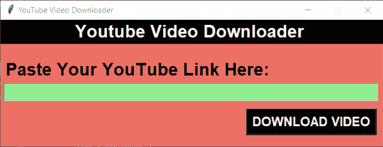

# 使用 Python Tkinter 的 YouTube 视频下载程序

> 原文：<https://www.askpython.com/python-modules/tkinter/youtube-video-downloader>

你好。今天，我们将建立自己的 YouTube 视频下载器。有趣吧？！所以让我们开始吧！

## 项目介绍

YouTube 视频下载器旨在以一种快速、简单和容易的方式从 YouTube 下载任何类型的视频。

用户必须复制需要粘贴到应用程序中的 youtube 视频 URL 链接。稍后，用户需要点击下载按钮来下载视频。

如果你使用这个程序进行批量下载，YouTube 很可能会屏蔽你的 IP 地址。因此，明智的做法是使用一个 [VPN](https://surfshark.com/download) 来满足批量下载的需求，并保护你的 IP 地址不被拦截。

## 1.导入库/模块

对于当前项目，我们将导入两个模块，即`Tkinter`和`pytube`模块，其中 **pytube** 模块用于处理与 YouTube 相关的操作。

```py
import tkinter as tk
from pytube import YouTube

```

## 2.创建 Tkinter 窗口

下面的代码创建了一个空白的自定义 Tkinter 应用程序窗口。到目前为止，您可能已经熟悉了这些基本代码。

```py
window = tk.Tk()
window.geometry("600x200")
window.config(bg="#EC7063")
window.resizable(width=False,height=False)
window.title('YouTube Video Downloader')

window.mainloop()

```

## 3.将小组件添加到 Tkinter 屏幕

我们将添加三个简单的部件，即标签，按钮和输入框。下面显示了相同的代码，并为您添加了一些行。

```py
window = tk.Tk()
window.geometry("600x200")
window.config(bg="#EC7063")
window.resizable(width=False,height=False)
window.title('YouTube Video Downloader')

link = tk.StringVar()

tk.Label(window,text = '                   Youtube Video Downloader                    ', font ='arial 20 bold',fg="White",bg="Black").pack()
tk.Label(window, text = 'Paste Your YouTube Link Here:', font = 'arial 20 bold',fg="Black",bg="#EC7063").place(x= 5 , y = 60)

link_enter = tk.Entry(window, width = 53,textvariable = link,font = 'arial 15 bold',bg="lightgreen").place(x = 5, y = 100)

tk.Button(window,text = 'DOWNLOAD VIDEO', font = 'arial 15 bold' ,fg="white",bg = 'black', padx = 2,command=Download_Video).place(x=385 ,y = 140)

window.mainloop()

```

应用程序的最终设计如下所示。



Final Design Youtube Video Download

## 4.为`Download Video`按钮创建功能

现在为了让下载按钮工作，我们需要定义一个`Download_Video`函数，并使用按钮声明中的`command`属性将该函数与按钮链接起来。该函数的代码如下所示:

```py
def Download_Video():     
    url =YouTube(str(link.get()))
    video = url.streams.first()
    video.download()
    tk.Label(window, text = 'Your Video is downloaded!', font = 'arial 15',fg="White",bg="#EC7063").place(x= 10 , y = 140)  

```

首先，在`get`函数的帮助下，我们将从输入框中提取链接。然后在 youtube 功能的帮助下，在 YouTube 上检查 url。

最后，使用`streams.first`功能从 YouTube 提取视频，稍后使用`download`功能下载。

下载完成并成功后，屏幕上会添加一个新标签，上面写着**您的视频已下载！**。

## Tkinter 中 YouTube 视频下载器的完整代码

完整的代码如下所示。

```py
import tkinter as tk
from pytube import YouTube

def Download_Video():     
    url =YouTube(str(link.get()))
    video = url.streams.first()
    video.download()
    tk.Label(window, text = 'Your Video is downloaded!', font = 'arial 15',fg="White",bg="#EC7063").place(x= 10 , y = 140)  

window = tk.Tk()
window.geometry("600x200")
window.config(bg="#EC7063")
window.resizable(width=False,height=False)
window.title('YouTube Video Downloader')

link = tk.StringVar()
tk.Label(window,text = '                   Youtube Video Downloader                    ', font ='arial 20 bold',fg="White",bg="Black").pack()
tk.Label(window, text = 'Paste Your YouTube Link Here:', font = 'arial 20 bold',fg="Black",bg="#EC7063").place(x= 5 , y = 60)
link_enter = tk.Entry(window, width = 53,textvariable = link,font = 'arial 15 bold',bg="lightgreen").place(x = 5, y = 100)
tk.Button(window,text = 'DOWNLOAD VIDEO', font = 'arial 15 bold' ,fg="white",bg = 'black', padx = 2,command=Download_Video).place(x=385 ,y = 140)

window.mainloop()

```

## 输出

下面显示的视频展示了该应用程序的工作情况。看看吧！

## 结论

恭喜你！今天在本教程中，我们已经使用 python 成功构建了我们自己的 YouTube 视频下载器项目。自己试试吧！

感谢您的阅读！编码快乐！