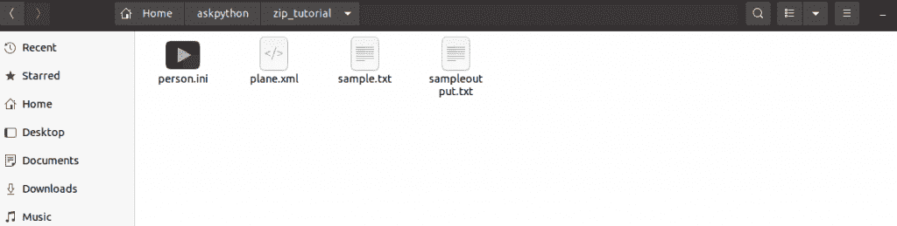
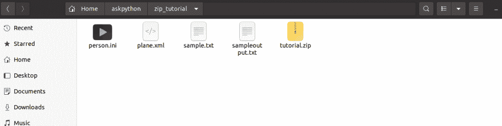
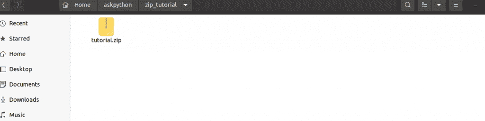
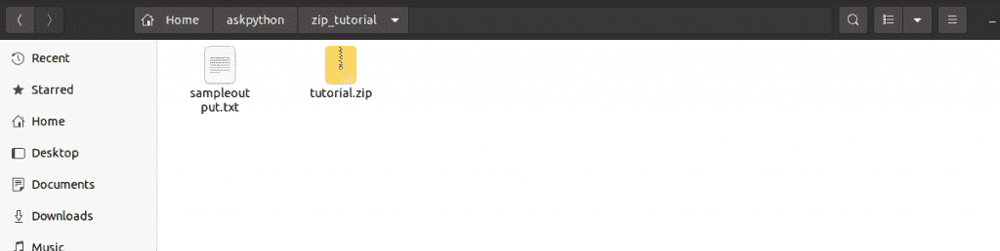
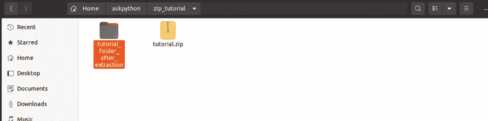

# zipfile 模块——在 Python 中处理 ZIP 文件。

> 原文：<https://www.askpython.com/python-modules/zipfile-module>

在本教程中，我们将了解什么是 zip 文件，我们将使用 python 实现代码，通过`zipfile`模块自动处理 zip 文件。我们将看到如何创建压缩和未压缩的 zip 文件，以及如何从 zip 文件中提取文件。我们还将看到如何将新文件追加到已经创建的 zip 文件中。

## 什么是 zip 文件？

ZIP 是一种支持无损数据压缩的归档文件格式。它可能包含一个或多个文件或文件夹，这些文件或文件夹可能被压缩，也可能不被压缩。ZIP 文件被许多程序用作基本文件格式。zip 文件扩展名。

## 如何用 zip file 模块创建一个没有压缩的 zip 文件？

在 Python 中，我们可以使用 zipfile 模块的`ZipFile()`方法创建 zip 文件。然后，我们可以向 zip 文件添加其他文件。下面的屏幕截图显示了创建压缩文件之前文件夹中的文件。



Folder Before Zipping

接下来我们来看看代码。这里的`ZipFile()`方法把要创建的 zip 文件的文件名作为第一个参数，把“w”作为以写模式打开文件的参数。

不要忘记在程序结束时关闭文件。

```py
#import module
import zipfile

#declare filename
filename="zip_tutorial/tutorial.zip"

# create a ZipFile object by opening file
zip_obj= zipfile.ZipFile(filename,"w")

#add files to zip file
zip_obj.write("zip_tutorial/plane.xml")
zip_obj.write("zip_tutorial/sample.txt")
zip_obj.write("zip_tutorial/person.ini")

#close the file object
zip_obj.close()

```

下图显示了创建 ZIP 文件后文件夹的内容。



Folder After Zipping

## 如何用 zip file 模块创建压缩 zip 文件？

要创建一个压缩的 zip 文件，我们只需要提供我们想要用来压缩文件的算法，作为`ZipFile()` 方法的一个参数。

通常，我们在创建 zip 文件时使用`DEFLATED`算法来压缩文件。下图显示了创建压缩 zip 文件之前文件夹的内容。


Folder Before compressed Zipping

要创建一个压缩的 zip 文件，我们只需要添加一个指定压缩算法的压缩参数。这里我们使用了 zip_deflated 算法，因此在创建 ZipFile 对象时使用了 `compression=zipfile.ZIP_DEFLATED`。

```py
#import module
import zipfile

#declare filename
filename="zip_tutorial/tutorial.zip"

# create a ZipFile object by opening file
zip_obj= zipfile.ZipFile(filename,"w",compression=zipfile.ZIP_DEFLATED)

#add files to zip file
zip_obj.write("zip_tutorial/plane.xml")
zip_obj.write("zip_tutorial/sample.txt")
zip_obj.write("zip_tutorial/person.ini")

#close the file object
zip_obj.close()

```

下图显示了创建压缩 zip 文件后文件夹的内容。


Folder After Zipping 1

## 如何在不解压的情况下检查压缩文件夹的内容？

要检查 zip 文件的内容，我们可以使用`zipfile`模块的`namelist()`方法。

这里的`namelist()`方法在调用 zip file 对象时返回 zip 文件中的文件名列表。

**在这里，我们已经以“读取”模式打开了文件，因此“r”作为第二个参数被提供给`ZipFile()`。**我们将在这里使用 [for 循环](https://www.askpython.com/python/python-for-loop)来循环 zip 文件的内容。

```py
#import module
import zipfile

#declare filename
filename="zip_tutorial/tutorial.zip"

# create a ZipFile object by opening file
zip_obj= zipfile.ZipFile(filename,"r")

#print the content of zip file
print("Content of the ZIP file are: ")
content_list=zip_obj.namelist()
for fname in content_list:
    print(fname)

#close the file object
zip_obj.close()

```

上述代码片段的输出是:

```py
Content of the ZIP file are: 
zip_tutorial/plane.xml
zip_tutorial/sample.txt
zip_tutorial/person.ini

```

## 如何检查压缩文件的元数据？

文件的元数据是包含任何文件描述的数据。它包含创建日期、修改日期、文件大小和其他信息。

要获取 zip 文件的元数据，我们可以使用`zipfile`模块的`infolist()`方法。

```py
#import module
import zipfile

#declare filename
filename="zip_tutorial/tutorial.zip"

# create a ZipFile object by opening file
zip_obj= zipfile.ZipFile(filename,"r")

#print the metadata of zip file
print("Metadata of the ZIP file are: ")
content_list=zip_obj.infolist()
for info in content_list:
    print(info)

#close the file object
zip_obj.close()

```

上述代码的输出是:

```py
Metadata of the ZIP file are: 
<ZipInfo filename='zip_tutorial/plane.xml' compress_type=deflate filemode='-rw-rw-r--' file_size=264 compress_size=174>
<ZipInfo filename='zip_tutorial/sample.txt' compress_type=deflate filemode='-rw-rw-r--' file_size=409 compress_size=215>
<ZipInfo filename='zip_tutorial/person.ini' compress_type=deflate filemode='-rw-rw-r--' file_size=183 compress_size=141>

```

我们可以看到, `infolist()`已经返回了关于 zip 文件中每个文件的文件名、实际大小、压缩大小、压缩算法和文件访问模式的信息。

## 如何将文件直接追加到 zip 文件中？

我们可以使用来自 **zipfile 模块**的`write()`方法直接将额外的文件添加到 zip 文件中，就像我们在创建 zip 文件时所做的那样。

**唯一的区别是我们必须在追加模式下打开文件，因此“a”作为第二个参数传递给`ZipFile()`方法。**

```py
#import module
import zipfile

#declare filename
filename="zip_tutorial/tutorial.zip"

# create a ZipFile object by opening file
zip_obj= zipfile.ZipFile(filename,"a")

#print the initial content of zip file
print("Initial Content of the ZIP file are: ")
content_list=zip_obj.namelist()
for fname in content_list:
    print(fname)

#Append a file to zip file
zip_obj.write("zip_tutorial/sampleoutput.txt")

#close the file objecz
zip_obj.close()

#read final content of the file after appending
nzip_obj= zipfile.ZipFile(filename,"a")

#print the initial content of zip file
print("Final Content of the ZIP file are: ")
ncontent_list=nzip_obj.namelist()
for fname in ncontent_list:
    print(fname)

#close the file
nzip_obj.close()

```

输出:

```py
Initial Content of the ZIP file are: 
zip_tutorial/plane.xml
zip_tutorial/sample.txt
zip_tutorial/person.ini
Final Content of the ZIP file are: 
zip_tutorial/plane.xml
zip_tutorial/sample.txt
zip_tutorial/person.ini
zip_tutorial/sampleoutput.txt

```

## 如何从压缩文件夹中提取单个文件？

要从压缩文件夹中只提取一个文件，我们可以使用`zipfile`模块的`extract()`方法。这是解压缩任何文件之前的文件夹快照。



Folder Before Unzipping

`extract()`方法将一个文件名作为参数，并提取我们工作目录中的文件。

```py
#import module
import zipfile

#declare filename
filename="zip_tutorial/tutorial.zip"

# create a ZipFile object by opening file
zip_obj= zipfile.ZipFile(filename,"r")

#extract file
zip_obj.extract("zip_tutorial/sampleoutput.txt")

#close the zip file
zip_obj.close()

```

下图显示了从 zip 文件中提取文件后文件夹的快照。



Extracted File From ZIP

## 如何用 zipfile 模块从一个压缩文件夹中提取所有文件？

要提取整个 zip 文件夹而不是单个文件，我们可以使用`zipfile`模块的`extractall()`方法。下图显示了解压 zip 文件内容之前的文件夹快照。


Folder Before Unzipping whole file

`extractall()`方法将输出文件的名称作为它的参数，并将 zip 文件的全部内容提取到我们工作目录的文件夹中。

```py
#import module
import zipfile

#declare filename
filename="zip_tutorial/tutorial.zip"

# create a ZipFile object by opening file
zip_obj= zipfile.ZipFile(filename,"r")

#extract all files 
zip_obj.extractall("zip_tutorial/tutorial_folder_after_extraction")

#close the zip file
zip_obj.close()

```

下图显示的是 zip 文件的全部内容被提取到另一个文件夹后的快照。



Extracted Folder From ZIP

## 结论

在本教程中，我们已经了解了什么是 zip 文件，以及如何使用 Python zipfile 模块创建和操作 zip 文件。我们还看到了如何提取单个文件以及 zip 文件的全部内容。快乐学习！