# 基础与高级Python编程

AGYA RAM VERMA
YATENDRA KUMAR
SAG RAM VERMA

# 基础与高级Python编程语言

NIPA GENX ELECTRONIC RESOURCES & SOLUTIONS P. LTD.
新德里-110 034

# 关于作者

**阿格亚·拉姆·维尔马博士**出生于印度北方邦阿约提亚。他于2010年获得印度北方邦巴雷利IET MJPRU的电子与仪器工程学士学位。他在印度贾巴尔普尔的印度信息技术学院（IIIT）设计与制造分校完成了电子与通信工程硕士学位。他于2019年获得北阿坎德邦德拉敦北阿坎德邦技术大学的博士学位。他于2013年加入印度北阿坎德邦保里加瓦尔的G. B. 帕特工程学院电子与通信工程系，担任助理教授。他的研究兴趣包括机器学习、信号处理。他在国际知名期刊和会议上发表了超过35篇研究论文。他于2021年发表了一项专利。他于2021年通过Sara book publication出版了一本关于机器学习基础的书籍。他还获得了一个研发项目和一个咨询项目。他也是许多知名国际期刊的审稿人，例如《计算机方法在生物力学与生物医学工程中的应用：成像与可视化》（Taylor & Francis）、《IET发电、输电与配电》、《国际信号与成像系统工程杂志》（IJSISE）、《智能与模糊系统杂志》、GUCON 2019 IEEE会议（印度）、《信号处理杂志》、《电子学快报》、《IET》。

**亚滕德拉·库马尔博士**是印度北方邦巴雷利马哈特马·约蒂巴·普勒罗希尔坎德大学工程与技术学院电子与仪器工程系的前系主任和副教授。他于1999年完成电子与仪器工程学士学位，并于2001年在哈里亚纳邦库鲁克谢特拉国家技术学院（前身为区域工程学院）获得仪器工程硕士学位。他在印度丹巴德印度矿业学院（ISM）完成了博士学位。他拥有超过20年的教学经验。此外，他还撰写和合著了多篇发表在国内和国际期刊上的研究论文。他也是许多知名国际期刊的审稿人，如《IEEE Access》、《国际电子学杂志》、《微波与光学技术快报》、《国际电子与通信杂志》（AEU）、《国际射频与计算机辅助设计杂志》（RFCAD）和《国际微波与技术杂志》。

**萨格·拉姆·维尔马博士**于2003年获得印度阿约提亚R. M. L. 阿瓦德大学理学学士学位，并于2005年获得印度瓦拉纳西贝拿勒斯印度教大学数学理学硕士学位。他于2009年获得印度瓦拉纳西印度理工学院（BHU）应用数学博士学位。他自2011年起在印度北阿坎德邦哈里德瓦尔的Gurukula Kangri（被认定为大学）担任数学助理教授。他的研究兴趣包括数学规划、小波分析及其应用。他在国际知名期刊和会议上发表了超过25篇研究论文。他指导了4名博士生。

# 基础与高级Python编程语言

**阿格亚·拉姆·维尔马**
助理教授
电子与通信工程系
G. B. 帕特工程技术学院
印度北阿坎德邦保里加瓦尔

**亚滕德拉·库马尔**
前系主任和副教授
电子与仪器工程系
工程与技术学院
马哈特马·约蒂巴·普勒罗希尔坎德大学
印度北方邦巴雷利

**萨格·拉姆·维尔马**
助理教授
Gurukula Kangri（被认定为大学）
印度北阿坎德邦哈里德瓦尔

**NIPA GENX ELECTRONIC RESOURCES & SOLUTIONS P. LTD.**
新德里-110 034

# NIPA GENX ELECTRONIC RESOURCES & SOLUTIONS P. LTD.

101,103, Vikas Surya Plaza, CU Block
L.S.C.Market, Pitam Pura, New Delhi-110 034
电话：+91 11 27341616, 27341717, 27341718
电子邮件：newindiapublishingagency@gmail.com
网站：www.nipabooks.com

**如需客户协助，请联系**
电话：+ 91-11-27 34 17 17 传真：+ 91-11- 27 34 16 16
电子邮件：feedbacks@nipabooks.com

© 2023, 出版商

ISBN: 978-93-91383-63-3
eISBN: 978-93-94490-49-9

版权所有。未经出版商或版权所有者事先书面许可，不得以任何形式或任何方式（包括电子、机械、影印、录音或其他方式）复制、存储在检索系统中或传播本出版物的任何部分。

本书包含从真实且高度可靠的来源获取的信息。我们已尽合理努力发布可靠的数据和信息，但作者、编辑和出版商无法对本文发布的所有材料或信息的有效性、准确性或完整性，或其使用后果承担责任。本书的出版基于出版商和作者不试图提供任何专业服务的理解。作者、编辑和出版商已尽力追溯并确认本出版物中所有复制材料的版权所有者，如果未获得以本形式出版的许可和/或致歉，我们向版权所有者致歉。如果任何受版权保护的材料未被确认，请写信告知我们，以便我们可以在后续印刷中纠正错误。

**商标声明：** NIPA、NIPA标志及其在本书中的呈现方式（书写/呈现方式）是出版商的商标，因此未经书面许可不得使用，如果未经授权复制或使用，侵权者将依法起诉。

NIPA还以多种电子格式出版书籍。印刷版中出现的部分内容可能在电子书中不可用，反之亦然。

由NIPA排版和设计。

# 致谢

我们在撰写本书时得到了许多人的帮助，现在我们一一列出。请耐心阅读。我们在书末的“参考文献”部分感谢了许多人。我们已尽力而为，但几乎可以肯定的是，由于没有做好适当的笔记，我们未能确认其他一些人。对于任何我们可能遗漏的创作者，我们深表歉意。我们从投资者/交易者社区和Python社区的专家在stackoverflow.com、quora.com等在线论坛上的著作中学到了很多，并对他们深表感谢。

最后，我们要感谢过去几年我们教过的所有学生。特别感谢那些在我们学会如何最好地教授这门课程之前，忍受了我们最初几次讲座迭代的同学们。亲爱的学生们，我们因你们而存在。你们激励了我们，挑战了我们，并推动我们永不停止学习，只是为了跟上你们的步伐。我们希望你们喜欢阅读这本书，就像我们喜欢为你们写作一样。

A.R. Verma
Y. Kumar
S.R. Verma

# 前言

本书将向您介绍Python编程语言。它面向初学者，但即使您之前编写过程序，只是想将Python添加到您的编程语言列表中，也同样适用。

前八章解释了Python的基础知识，您应该按顺序阅读。后面的章节展示了Python在特定应用领域的使用，例如网络、数据库、网络等，您可以按任意顺序阅读。第1章 本章解释了与Python编程相关的不同基础主题。第2章 本章定义了Python运算符。第3章 本章定义了循环语句。第4章 本章定义了Python函数。第5章 本章解释了字符串语句。第6章 本章定义了Python编程中的列表。第7章 本章解释了Python编程中的元组。第8章 本章解释了Python编程中的字典。第9章 本章解释了Python编程中的NumPy。第10章 本章解释了Python编程中的lambda函数。第11章 本章解释了Python编程中的pandas。第12章 本章解释了Python pandas功能。第12章 本章解释了DataFrame基本功能。第13章 本章解释了Python pandas统计函数。第14章 本章解释了Python pandas可视化。第15章 本章解释了Python编程中的数据可视化。第16章 本章解释了面向对象编程。第17章 本章解释了Python编程中的模块。第18章 本章解释了Python库。第19章 本章解释了Python编程中的海龟图形。第20章 本章简要介绍了标准库。

A.R. Verma
Y. Kumar
S.R. Verma

# 目录

致谢

前言

## 1. Python编程基础概念
1.1 简介
1.2 开始Python编程
    1.2.1 寻找解释器
1.3 编译器与解释器：探索编译器和解释器之间的区别是什么？
    1.3.1 什么是编译器？
    1.3.2 什么是解释器？
    1.3.3 编译器和解释器之间的区别
1.4 为什么要学习Python？
1.5 什么是Python IDLE？
1.6 用Python编写程序
1.7 Python中的变量
    1.7.1 变量规则
1.8 Python语言：优势与应用
    1.8.1 优势
    1.8.2 应用
    1.8.3 使用Python的组织

## 2. Python运算符
2.1 运算符
    2.1.1 算术运算符
    2.1.2 关系/比较运算符
    2.1.3 赋值运算符
    2.1.4 逻辑运算符
    2.1.5 身份运算符
    2.1.6 成员运算符
    2.1.7 位运算符
2.2 Python基础程序

## 3. 循环语句
3.1 Python中的控制语句
    3.1.1 选择语句
    3.1.2 循环语句
    3.1.3 If语句
    3.1.4 循环语句
    3.1.5 While循环
3.2 嵌套循环
    3.2.1 Python中的For循环

## 4. Python编程中的函数
4.1 Python函数简介
    4.1.1 无参数函数程序
    4.1.2 Python中的函数参数/实参
4.2 函数用法
    4.2.1 无参数无返回值
    4.2.2 有参数无返回值
    4.2.3 无参数有返回值
    4.2.4 有参数有返回值
4.3 默认参数
    4.3.1 水果函数（函数返回值）
    4.3.2 变量的作用域（全局变量和局部变量）
4.4 Python中的Break和Continue
    4.4.1 Break语句
    4.4.2 Continue语句

## 5. Python编程中的字符串
5.1 字符串语句
5.2 字符串运算符
5.3 字符串函数

## 6. Python编程中的列表
6.1 列表简介
6.2 Python列表切片
    6.2.1 更新Python中的列表

## 6.2.2 在Python中删除列表
44

#### 6.2.3 访问列表元素以执行各种操作
44

### 6.3 基础程序列表
50

## 7. Python编程中的元组
55

### 7.1 元组简介
55

### 7.2 程序实现
56

#### 7.2.1 插入、更新与删除元组元素
56

### 7.3 不同类型的元组
57

### 7.4 Python中元组的索引与切片
57

#### 7.4.1 遍历元组
57

#### 7.4.2 连接元组
57

#### 7.4.3 重复或复制元组
57

#### 7.4.4 元组切片
58

### 7.5 元组函数
58

#### 7.5.1 在Python中创建、更新、删除和访问元组元素
59

## 8. Python编程中的字典
61

### 8.1 Python字典简介
61

#### 8.1.1 创建并打印字典
61

#### 8.1.2 遍历字典
61

#### 8.1.3 更改字典中的值
62

#### 8.1.4 在Python中添加、更新、删除元素
62

#### 8.1.5 在字典中添加新元素
62

#### 8.1.6 字典及其函数详解
62

#### 8.1.7 Del关键字
63

#### 8.1.8 Clear关键字（删除字典的所有元素）
63

### 8.2 字典中的字典函数
64

## 9. Python编程中的Numpy
67

### 9.1 Numpy简介
67

### 9.2 安装Numpy
67

#### 9.2.1 创建Numpy数组（一维）
68

#### 9.2.2 使用Numpy创建二维数组
68

### 9.3 Numpy函数
69

xii 基础与高级Python编程语言

#### 9.3.1 二维（2D）
71

#### 9.3.2 一维数组中的索引
71

#### 9.3.3 Python中Numpy数组的重塑
72

#### 9.3.4 Python编程中的种子函数
72

#### 9.3.5 在Python编程中创建二维数组
72

#### 9.3.6 二维数组的索引
73

### 9.4 视图与副本
73

### 9.5 Python编程中的条件选择
74

#### 9.5.1 条件选择
74

### 9.6 Python编程中Numpy数组的操作
74

#### 9.6.1 Numpy更多函数
75

### 9.7 创建具有固定数据类型的二维数组
75

#### 9.7.1 堆叠具有固定数据类型的二维数组
76

### 9.8 问题列表
77

### 9.9 Numpy与列表的区别
80

### 9.10 Python IDE中的Pycharm安装
80

### 9.11 Python数据类型
80

#### 9.11.1 类型转换
81

#### 9.11.2 Numpy搜索数组
81

## 10. Python编程中的Lambda函数
83

### 10.1 Lambda函数
83

#### 10.1.1 带Lambda函数的Filter函数
83

#### 10.1.2 Python编程中的Map、Filter、Lambda函数
84

#### 10.1.3 Map函数
85

### 10.2 Reduce()函数
85

## 11. Python编程中的Pandas
87

### 11.1 简介：
87

#### 11.1.1 Pandas的主要特性
87

### 11.2 NumPy与Pandas
88

### 11.3 数据结构简介
88

#### 11.3.1 Series
89

#### 11.3.2 DataFrame
89

#### 11.3.3 列的数据类型
89

#### 11.3.4 Panel
90

### 11.4 Python Pandas Series
90

#### 11.4.1 创建空Series
90

#### 11.4.2 从Ndarray创建Series
91

### 11.5 从字典创建Series
92

### 11.6 从标量创建Series
93

### 11.7 通过位置访问Series中的数据
93

### 11.8 使用标签（索引）检索数据
94

### 11.9 Python Pandas - DataFrame
95

#### 11.9.1 创建DataFrame
96

#### 11.9.2 从列表创建DataFrame
97

#### 11.9.3 从ndarrays/列表的字典创建DataFrame
98

#### 11.9.4 从字典列表创建DataFrame
99

#### 11.9.5 从Series字典创建DataFrame
100

#### 11.9.6 列选择
101

#### 11.9.7 列添加
101

#### 11.9.8 列删除
102

#### 11.9.9 行选择、添加和删除
103

#### 11.9.10 按标签选择
103

#### 11.9.11 按整数位置选择
104

#### 11.9.12 切片行
104

#### 11.9.13 添加行
105

#### 11.9.14 删除行
105

### 11.10 Python Pandas - Panel
106

#### 11.10.1 创建Panel
106

#### 11.11.2 创建空Panel
107

#### 11.11.3 从Panel中选择数据
108

## 12. Python Pandas：基本功能
111

### 12.1 基本功能简介
111

### 12.2 Series基本功能
111

#### 12.2.1 轴
112

#### 12.2.2 空值
112

#### 12.2.3 维度
113

#### 12.2.4 大小
113

## 12. Python Pandas：DataFrame 基础功能

- 12.2.5 值
- 12.2.6 Head 与 Tail
- 12.3 DataFrame 基础功能
  - 12.3.1 示例
  - 12.3.2 T（转置）
  - 12.3.3 轴
  - 12.3.4 数据类型
  - 12.3.5 空值
  - 12.3.6 维度数
  - 12.3.7 形状
  - 12.3.8 大小
  - 12.3.9 值
  - 12.3.10 Head 与 Tail

## 13. Python Pandas：统计函数

- 13.1 统计函数
  - 13.1.1 协方差
  - 13.1.2 相关性
  - 13.1.3 数据排名

## 14. Python Pandas：数据可视化

- 14.1 基础绘图：plot
  - 14.1.1 柱状图
  - 14.1.2 直方图
  - 14.1.3 箱线图
  - 14.1.4 面积图
  - 14.1.5 散点图
  - 14.1.6 饼图

## 15. 数据可视化

- 15.1 数据可视化
- 15.2 如何安装 Matplotlib
- 15.3 Pyplot
- 15.4 折线图
  - 15.4.1 图表自定义
- 15.5 在同一坐标轴上绘制多个图表
- 15.6 填充两个图表之间的区域
- 15.7 柱状图
- 15.8 饼图
- 15.9 直方图
- 15.10 散点图
- 15.11 绘制给定方程的曲线
- 15.12 子图
- 15.13 3D 绘图
- 15.14 使用面向对象 API 进行 Matplotlib 图形绘制

## 16. Python 中的面向对象编程

- 16.1 Python 中的 OOP
  - 16.1.1 什么是封装
  - 16.1.2 抽象
  - 16.1.3 为什么需要抽象？
  - 16.1.4 Python 中的继承
  - 16.1.5 Python 中的多态
- 16.2 OOP 中的类
  - 16.2.1 如何创建类
  - 16.2.2 使用对象访问类成员
  - 16.2.3 Python 中的构造函数
  - 16.2.4 访问实例变量
  - 16.2.5 类变量/静态变量
  - 16.2.6 访问类/静态变量
- 16.3 Python 编程中的命名空间
- 16.4 方法类型
  - 16.4.1 实例方法
  - 16.4.2 访问器方法
  - 16.4.3 修改器方法
  - 16.4.4 类方法
  - 16.4.5 静态方法
  - 16.4.6 将一个类的成员传递给另一个类
  - 16.4.7 内部类
- 16.5 多级继承
- 16.6 继承中的构造函数
  - 16.6.1 构造函数重写
  - 16.6.2 使用 `super()` 方法的构造函数
  - 16.6.3 方法解析顺序
- 16.7 层次继承
- 16.8 多态
  - 16.8.1 鸭子类型
  - 16.8.2 强类型
  - 16.8.3 OOP 中的方法重写
  - 16.8.4 Python 编程中的重载

## 17. Python 编程中的模块

- 17.1 模块
  - 17.1.1 何时以及为何使用模块
  - 17.1.2 Python 模块的结构
  - 17.1.3 创建模块
  - 17.1.4 如何访问方法、函数、变量和类
- 17.2 Python 编程中的包
  - 17.2.1 创建包
- 17.3 抽象类
  - 17.3.1 抽象方法
  - 17.3.2 具体方法
- 17.4 接口
- 17.5 Python 中的数据隐藏
- 17.6 Python 中的错误
- 17.7 Python 中的异常
  - 17.7.1 异常类型
  - 17.7.2 异常处理的必要性
  - 17.7.3 异常处理
  - 17.7.4 用户自定义异常
  - 17.7.5 创建异常
  - 17.7.6 抛出异常

## 18. Python 库

- 18.1 库简介
  - 18.1.1 标准库简览
  - 18.1.2 Python Tkinter 模块

## 18.2 Tkinter 控件

## 18.3 Python Tkinter 几何布局

### 18.3.1 Python Tkinter Pack() 方法

### 18.3.2 Python Tkinter Grid() 方法

### 18.3.3 Python Tkinter Place() 方法

## 19. 海龟绘图

### 19.1 Python 海龟绘图

### 19.2 海龟方法

## 20. 标准库简览

### 20.1 Python 编程中的单元测试

#### 20.1.1 单元测试涉及的步骤

#### 20.1.2 编写测试用例与运行测试

### 20.2 Python 编程中的线程

#### 20.2.1 多线程

### 20.3 错误与异常

### 20.4 Python 中的操作系统接口

#### 20.4.1 字符串模式匹配

### 20.5 Datetime 模块

#### 20.5.1 创建 Datetime 类的对象

#### 20.5.2 Date 类

#### 20.5.3 Time 类

#### 20.5.4 Python 中的 Timedelta 类

### 20.6 Python 中的 Math 模块

### 20.7 数字与数值表示

### 20.8 幂与对数函数

### 20.9 三角函数与角度转换函数

# 1. Python 编程基础概念

### 1.1 简介

Python 是一种解释型、高级、通用的编程语言，由吉多·范罗苏姆开发，其第一个版本于 1991 年发布。Python 有两个主要版本：**Python 2 和 Python 3**。两者差异很大。

### 1.2 Python 编程入门

#### 1.2.1 寻找解释器

在开始 Python 编程之前，我们需要一个解释器来解释和运行我们的程序。

**Windows：** 有许多免费的解释器可用于运行 Python 脚本，例如 IDLE（集成开发环境），它随从 http://python.org/ 下载的 Python 软件捆绑提供。

**Linux：** Python 预装在流行的 Linux 发行版中，如 Ubuntu 和 Fedora。要检查你正在运行的 Python 版本，请在终端模拟器中输入 “python”。解释器应该会启动并打印版本号。

**macOS：** 通常，Python 2.7 随 macOS 捆绑提供。你需要从 http://python.org/ 手动安装 Python 3。

### 1.3 编译器与解释器：探索编译器和解释器之间的区别是什么？

解释器和编译器都是将源代码（高级语言）转换为机器码（以便计算机能够理解它们）的程序。在本章中，我们将讨论编译器和解释器之间的区别。

一个典型的计算机程序通常以人类可以理解的高级语言存在。因此，它们包含来自英语（或任何其他常用语言）的各种短语和单词。另一方面，计算机无法像我们一样理解这些语言——但可以理解二进制代码的程序。因此，我们首先用高级语言（源代码）编写程序，将它们转换为机器语言，并使它们对计算机可读。这正是我们需要解释器和编译器的时候。

#### 1.3.1 什么是编译器？

编译器是一种翻译器，它通过接受高级语言的输入来产生低级语言（如汇编语言或机器语言）的输出。它基本上是一个计算机程序，用于将用编程语言编写的代码转换为机器码（将人类可读的代码转换为计算机处理器可以理解的二进制 0 和 1 位语言）。然后计算机处理机器码以执行相应的任务。

- 编译器检查所有类型的错误、限制和范围。因此，它更智能。
- 其程序的运行时间更长，并且占用更多内存。

#### 1.3.2 什么是解释器？

它是一个将编程语言翻译成可理解语言的程序。它是一个用于将高级程序语句转换为机器码的计算机程序。它包括预编译代码、源代码和脚本。

- 解释器一次只翻译程序中的一条语句。
- 它们在程序运行之前创建编程语言的 exe 文件。

#### 1.3.3 编译器与解释器的区别

| 序号 | 编译器 | 解释器 |
|---|---|---|
| 1 | 它首先扫描整个程序并将其翻译成机器码 | 它逐行扫描程序并将其翻译成机器码 |
| 2 | 编译器同时显示所有错误和警告。 | 解释器一次显示一个错误 |
| 3 | 错误在扫描整个程序后发生 | 错误在扫描每一行后发生 |
| 4 | 调试较慢 | 调试更快 |
| 5 | 执行时间较短 | 执行时间较长 |
| 6 | 编译器被 C、C++ 等语言使用。 | 解释器被 Python、Java 等语言使用。 |

### 1.4 为什么要学习 Python？

它的增长相当高。它被广泛用于许多领域，例如：

- 数据分析
- 机器学习
- 深度学习
- 人工智能
- 桌面应用程序开发
- Web 开发等。

### 1.5 什么是 Python IDLE？

安装 Python 后，只需转到开始菜单，找到 “IDLE (python 3.7)”。IDLE 代表集成开发学习环境。这是 Python 的默认开发环境。还有更多开发环境，如 PyCharm、Eclipse、Eric 等。

### 1.6 用 Python 编写程序

Python 为我们提供了在一个文件中编写 Python 程序的便利，该程序将按顺序逐行执行。编写 Python 程序的步骤：

1. 打开 Python IDLE。
2. 单击 “File Menu”，然后选择 “New File”。
3. 将出现一个新的屏幕/窗口。
4. 在此输入 Python 程序，并以 “.py” 扩展名保存程序。
5. 要运行程序，请单击 “Run” 菜单，然后单击 “Run Module”。
6. Python 代码将开始运行。

### 示例

```
Print()
此函数用于打印消息/值。
语法：
Print(“Hello”)
输出：Hello
a=5
b=6
c=a+b
```

print(c)
输出：11

**注意：** 如果任何值按原样打印，则使用引号；否则不使用引号。

在之前的示例中，我们只是打印了存储在变量中的值或直接打印了消息。那么，如果我们想同时打印消息和值呢？请看下面的代码：

## 示例

```
a=5
b=10
c=a+b
print("addition=",c)
```

如果扩展之前的程序以了解更多关于 print 方法的信息，我们可以将其扩展为：

## 示例

```
a=5
b=10
c=a+b
print("addition of",a,"and",b,"=",c)
```

## Input()

Python 提供了使用 Input() 函数从用户那里获取输入的功能。此函数会提示用户输入一个值。

## 示例：

```
Name=input("Enter your Name")
Print(Name)
示例：2
Name=input("Enter your Name")
Print("Welcome Mr.",Name)
输出：Welcome Mr.Anup Kumar
```

注意：请注意，Input() 仅接受字符串格式的输入。因此，如果需要进行任何数学计算，则需要转换为整数格式。为了将输入转换为整数格式，Python 提供了一个名为 int() 的函数。

## 示例

```
a=int(input("Enter 1st value:"))
b=int(input("Enter 2nd value:"))
c=a+b
print("addition=",c)
```

### 1.7 Python 中的变量

变量用于存储值。但 Python 最好的一点是，与其他编程语言不同，Python 没有声明变量的命令。一旦我们给变量赋值，变量就会被创建。

例如：
X=5 # 这里 x 是 int 类型
Y="Ram Kumar" # 这里 x 是 string 类型
Print(x)
Print(y)

#### 1.7.1 变量规则

变量名不能随心所欲。在声明变量时，必须遵守一些规则。

- 变量名必须以字母或下划线字符开头。
- 变量名不能以数字开头。
- 变量名只能包含字母数字字符和下划线（A_z, 0_9, 和 _）
- 变量名区分大小写（age 和 Age 是不同的变量）
- 变量名中不能有空格。

## 示例：合法的变量名

```
Myvar="hima"
My_var="him"
myVar="him"
MYVAR="him"
Myvar2="him"
```

## 示例：非法的变量名

```
2myvar="him"
My-var="him"
My var ="him"
```

### 1.8 Python 语言：优势与应用

Python 是一种高级、解释型、通用的动态编程语言，专注于代码的可读性。与 Java 和 C 相比，它的步骤更少。它由开发者 Guido Van Rossum 于 1991 年创立。Python 是世界上最受欢迎和增长最快的编程语言之一。Python 是一种强大、灵活且易于使用的语言。此外，其社区非常活跃。它被许多组织使用，因为它支持多种编程范式。它还执行自动内存管理。

#### 1.8.1 优势

1. 存在第三方模块
2. 广泛的支持库（NumPy 用于数值计算，Pandas 用于数据分析等）
3. 开源和社区开发
4. 多功能、易于阅读、学习和编写
5. 用户友好的数据结构
6. 高级语言
7. 动态类型语言（无需根据分配的值指定数据类型，它会自动获取数据类型）
8. 面向对象语言
9. 可移植且交互式
10. 适合原型设计——以更少的编码提供更多功能
11. 高效（Python 清晰的面向对象设计提供了增强的流程控制，并且该语言配备了出色的文本处理和集成功能，以及其自身的单元测试框架，使其更加高效。）
12. （物联网）物联网机遇
13. 解释型语言
14. 跨操作系统可移植

#### 1.8.2 应用

1. 基于 GUI 的桌面应用程序
2. 图形设计、图像处理应用程序、游戏和科学/计算应用程序
3. Web 框架和应用程序
4. 企业和商业应用程序
5. 操作系统
6. 教育
7. 数据库访问
8. 语言开发
9. 原型设计
10. 软件开发

#### 1.8.3 使用 Python 的组织

1. Google（Google 爬虫和搜索引擎的组件）
2. Yahoo（地图）
3. YouTube
4. Mozilla
5. Dropbox
6. Microsoft
7. Cisco
8. Spotify
9. Quora

# 2

# Python 运算符

### 2.1 运算符

运算符是执行某些特定操作的符号。Python 有各种各样的运算符。各种 Python 运算符分为：

1. 算术运算符
2. 比较/关系运算符
3. 赋值运算符
4. 逻辑运算符
5. 身份运算符
6. 成员运算符
7. 位运算符

#### 2.1.1 算术运算符

算术运算是执行数学计算的运算符。算术运算符有：

如果 a=4, b=2，那么

| 运算符 | 描述 | 示例 |
| :--- | :--- | :--- |
| + (加法) | 将两个或多个数字相加 | a+b=6 |
| -(减法) | 将两个或多个数字相减 | a-b |
| *(乘法) | 将两个或多个数字相乘 | a*b=8 |
| /(除法) | 将两个数字相除 | a/b=2 |
| %(取模) | 返回第一个数除以第二个数后的余数 | a%b=0 |
| **(幂) | 返回指数（幂） | a**b=16 |
| //(整除) | 将两个数字相除，但只返回商，并去掉小数部分。但在负数情况下，它会将数字向下取整到远离零的方向。 | a//b=2 |

#### 2.1.2 关系/比较运算符

关系/比较运算是对操作数执行比较的运算符。它根据条件返回真或假。关系运算符有：
a=4, b=2

| 运算符 | 描述 | 示例 |
| :--- | :--- | :--- |
| >(大于) | 检查第一个数是否大于第二个数 | a>b 返回 true |
| >=(大于等于) | 检查第一个数是否大于或等于第二个数 | a>=b 返回 true |
| <(小于) | 检查第一个数是否小于第二个数 | a<b 返回 false |
| <=(小于等于) | 检查第一个数是否小于或等于第二个数 | a<=b 返回 false |
| ==(等于) | 检查第一个数是否等于第二个数 | a==b 返回 false |
| != (不等于) | 检查第一个数是否不等于第二个数 | a!=b 返回 true |

#### 2.1.3 赋值运算符

赋值运算符用于将值赋给变量。
a=4, b=2, c=6

| 运算符 | 描述 | 示例 |
| :--- | :--- | :--- |
| = | 将右边的值赋给左边 | c=a+b 将 a+b 的值赋给 c。 |
| += 加并赋值 | 将右操作数加到左操作数，并将值赋给左操作数 | c+=a 等同于 c=c+a |
| -= 减并赋值 | 从左操作数中减去右操作数，并将值赋给左操作数 | c-=a 等同于 c=c-a |
| *= 乘并赋值 | 将左操作数乘以右操作数，并将值赋给左操作数 | c*=a 等同于 c=c*a |
| /= 除并赋值 | 将左操作数除以右操作数，并将值赋给左操作数 | c/=a 等同于 c=c/a |
| %=取模并赋值 | 将左操作数除以右操作数，并将余数值赋给左操作数 | c%=a 等同于 c=c%a |

#### 2.1.4 逻辑运算符

逻辑运算符用于组合条件语句：
运算符：and, or, not

## 示例

```
a=5
b=6
c=7
((a>b)and(a>c))
```

#### 2.1.5 身份运算符

Python 中的身份运算符用于确定一个值是否属于某个特定的类或类型。例如，我们可以将身份运算符与内置的 type() 函数一起使用，以确保我们正在处理特定的变量类型。

| 运算符 | 描述 | 示例 |
| :--- | :--- | :--- |
| is | 如果两个变量是同一个对象，则返回 true | x is y |
| is not | 如果两个变量不是同一个对象，则返回 true | x is not y |

## 示例

```
x=5
If(type(x) is int):
    print("correct")
    else:
        print("incorrect")
```

## 示例

```
x=5.2
If(type(x) is not int):
    print("correct")
    else:
        print("incorrect")
```

#### 2.1.6 成员运算符

Python 提供了两个成员运算符：

| 运算符 | 描述 |
| --- | --- |
| in | 如果元素在指定序列中找到，则返回 true，否则返回 false |
| not in | 如果元素在指定序列中未找到，则返回 true，否则返回 false |

### 示例

```
a = 10
list = [1, 2, 3, 4, 5]
if (a in list):
    print("Yes a is present in the list.")
else:
    print("no a is not present in the list")
```

### 示例

```
a = 1
list = [1, 2, 3, 4, 5]
if (a in list):
    print("Yes a is present in the list.")
else:
    print("no a is not present in the list")
```

#### 2.1.7 位运算符

位运算符用于比较（二进制）数字：

| 运算符 | 名称 | 描述 |
| --- | --- | --- |
| & | 按位与 | 如果两个位都为 1，则将该位设置为 1 |
| \| | 按位或 | 如果两个位中有一个为 1，则将该位设置为 1 |
| ^ | 按位异或 | 如果两个位中只有一个为 1，则将该位设置为 1 |
| ~ | 按位取反 | 翻转所有位 |
| << | 零填充左移 | 通过从右侧推入零来左移，并让最左边的位移出 |
| >> | 有符号右移 | 通过从左侧推入最左边位的副本来右移，并让最右边的位移出 |

### 示例

```
Let x = 0000 0110
    y = 0000 1000
now x & y (bitwise &) = 0000 0000
x | y (bitwise |) = 0000 1110
x ^ y (bitwise XOR) = 0000 1110
~x (x complement) = 1111 1001
x << 1 (1 step left shift) = 0000 1100
x >> 1 (1 step right shift) = 0000 0011
```

### 2.2 Python 基础程序

1.  编写一个程序来将两个数字相加。
2.  编写一个程序来将两个数字相减。
3.  编写一个程序来将两个数字相乘。
4.  编写一个程序来将两个数字相除。
5.  编写一个程序，在同一个程序中执行加法/减法/乘法/除法。
6.  编写一个程序来计算：
    (a) 矩形的面积
    (b) 矩形的周长
    (c) 正方形的面积
    (d) 正方形的周长
    (e) 圆的面积
    (f) 圆的周长
7.  编写一个程序，接受用电量并按每单位 5 卢比的费率计算总价。对所有超过的账单给予 10% 的折扣。
8.  编写一个程序，接受 5 个科目的分数，并计算总分和百分比，假设每个科目的满分为 100。
9.  编写一个程序来交换两个数字的值。
10. 编写一个程序，接受总销售额并按 5% 计算利润额。

### 示例 1：编写一个程序，在同一个程序中执行加法/减法/乘法/除法。

```
a = int(input("enter 1st num:"))
b = int(input("enter 2nd num:"))
add = a + b
sub = a - b
mul = a * b
div = a / b
print("addition=", add)
print("subtraction=", sub)
print("multiplication=", mul)
print("division=", div)
```

### 示例 2：编写一个程序来计算

(a) 矩形的面积
(b) 矩形的周长
(c) 正方形的面积
(d) 正方形的周长
(e) 圆的面积
(f) 圆的周长

```
# Python Program to find Area of a Rectangle
width = float(input('Please Enter the Width of a Rectangle: '))
height = float(input('Please Enter the Height of a Rectangle: '))
# calculate the area
Area = width * height
# calculate the Perimeter
Perimeter = 2 * (width + height)
print(Area)
print(Perimeter)
# Python Program to find Area Of Circle using Radius
PI = 3.14
radius = float(input(' Please Enter the radius of a circle: '))
area = PI * radius * radius
circumference = 2 * PI * radius
print(area)
print(circumference)
```

### 示例 3：编写一个程序来交换两个数字的值。

```
a = int(input("enter 1st num:"))
b = int(input("enter 2nd num:"))
c = a
a = b
b = c
print("value of a=", a)
print("value of b=", b)
```

## 3 循环语句

### 3.1 Python 中的控制语句

Python 语句按照它们在程序中出现的顺序逐一执行。但有时我们可能需要根据条件来执行语句。甚至可能存在这样的情况：我们希望在条件为真时，将单个语句或多个语句（语句块）执行“n”次。因此，为了控制程序的执行流程，Python 为我们提供了控制语句。

控制语句有两种类型：

(a) 选择语句
    (i) if
(b) 循环条件
    (i) While (ii) for

#### 3.1.1 选择语句

选择语句用于根据条件选择要执行的语句。换句话说，如果存在某个条件，根据该条件决定是否执行某个语句，那么这就称为选择语句。Python 为我们提供了“if”选择语句。

#### 3.1.2 循环语句

循环语句用于在条件为真时，将单个语句或语句块（多个语句）执行“N”次。循环语句会持续执行语句，直到给定条件为真。一旦条件变为假，它就会停止工作。

#### 3.1.3 If 语句

If 是一个双向条件控制语句，它检查条件并根据该条件执行操作。一个条件可能只有两种结果：条件为真或条件为假。

a. If 条件 :
    语句 1
    语句 2
    ------------
    语句 n

b. If 条件 :
    语句 1
    ------------
    else:
    语句 1
    ------------

c. If 条件 :
    语句 1
    ------------
    elif 条件 :
    语句 1
    ------------
    else:
    语句 1
    ------------

可能存在需要测试多个条件的情况。
语法：

d. If 条件 :
    语句 1
    ------------
    elif 条件 :
    语句 1
    ------------------
    elif 条件 :
    语句 1
    ------------------
    else:
    语句 1
    ------------------

### 一级程序

#### 示例 1：编写一个程序来检查一个数字是奇数还是偶数。

解决方案

```
a = int(input("enter the number to check:"))
if (a % 2 == 0):
    print("the number is even.")
else:
    print("the number is odd.")
```

#### 示例 2：编写一个程序来检查一个年龄是否达到投票年龄

解决方案

```
a = int(input("enter your age:"))
if (a > 18):
    print("Eligible vote.")
else:
    print("Eligible not vote.")
```

#### 示例 3：编写一个程序来找出两个数字中的最大值

解决方案

```
a = int(input("enter 1st num:"))
b = int(input("enter 2nd num:"))
if (a > b):
    print("max no.", a)
else:
    print("max no.", b)
```

#### 示例 4：编写一个程序来找出三个数字中的最大值

解决方案

```
a = int(input("enter 1st num:"))
b = int(input("enter 2nd num:"))
c = int(input("enter 3rd num:"))
if (a > b and a > c):
    print("max no.", a)
elif (b > a and b > c):
    print("max no.", b)
else:
    print("max no.", c)
```

#### 示例 5：编写一个程序来检查给定的数字是正数、负数还是零。

解决方案

```
a = int(input("enter 1st num:"))
if (a > 0):
    print("positive no.")
elif (a < 0):
    print("negative no")
else:
    print("zero.")
```

#### 示例 6：编写一个程序来计算 5 个科目的总分（满分=100）以及根据以下条件计算等级百分比：

- 百分比>=80-等级 A
- 百分比>=60-等级 B
- 百分比>=40-等级 C
- 百分比<40-等级 D

解决方案

```
a = int(input("enter 1st num:"))
b = int(input("enter 2nd num:"))
c = int(input("enter 3rd num:"))
d = int(input("enter 4th num:"))
e = int(input("enter 5th num:"))
total = a + b + c + d + e
percent = (total / 500) * 100
print("Total Marks=", total, "Percentage", percent)
if (percent >= 80):
    print("you have got grade A.")
elif (percent >= 60):
    print("you have got grade B.")
elif (percent >= 40):
    print("you have got grade C.")
else:
    print("you have got grade D.")
```

#### 3.1.4 循环语句

循环语句是一种控制语句，它会在条件为真时，将单个语句或语句块执行“N”次。一旦条件变为假，执行就会终止。

基本上，Python 提供以下循环语句：

1. While 语句
2. For 循环

这两种循环语句执行相同的任务。唯一的区别在于它们的语法。

#### 3.1.5 While 循环

While 循环是一种控制语句，它会在条件为真时，将单个语句或语句块执行“N”次。一旦条件变为假，执行就会终止。

每个循环语句都有三个部分：

a. 初始化
b. 条件
c. 增量/减量

如果上述三个语句中缺少任何一个，循环将不会执行。

#### 初始化

这是使用循环执行的计数器变量的初始化。换句话说，我们可以说必须有一个起始值，这个值就称为初始化。

## 条件

这是循环将持续执行的条件。只要此条件为真，循环体就会持续执行，直到给定条件变为假。

## 递增/递减

为了终止循环，计数器变量会增加或减少一个指定的值。这被称为递增/递减。

| 程序 | 初始化 | 条件 | 递增/递减 |
| :--- | :--- | :--- | :--- |
| 打印 1 到 10 | i=1 | i<=10 | i=i+1 |
| 打印 2 到 10 | i=2 | i<=10 | i=i+2 |
| 打印 10 到 1 | i=10 | i>=10 | i=i-1 |

## 示例：编写一个程序，打印从 1 到 10。

```
i=1
while(i<=10):
    print(i)
    i=i+1
```

## 示例：编写一个程序，打印从 1 到 n。

```
n=int(input("enter number upto which you want to print"))
i=1
while(i<=n):
    print(i)
    i=i+1
```

## 示例：编写一个程序，打印从 10 到 1。

```
i=10
while(i>=1):
    print(i)
    i=i-1
```

## 示例：编写一个程序，打印从 n 到 1。

```
n=int(input("enter number"))
while(n>=1):
    print(n)
    n=n-1
```

## 示例：编写一个程序，计算从 1 到 n 的和。

```
n=int(input("enter number upto which you want to print"))
i=1
sum=0
while(i<=n):
    sum=sum+i
    i=i+1
print("sum=sum",sum)
```

## 示例：编写一个程序，计算从 1 到 n 的平方和。

```
n=int(input("enter number upto which you want to print"))
i=1
sum=0
while(i<=n):
    sum=sum+(i*i)
    i=i+1
print("sum=sum",sum)
```

## 示例：编写一个程序，计算从 1 到 n 的立方和。

```
n=int(input("enter number upto which you want to print"))
i=1
sum=0
while(i<=n):
    sum=sum+(i*i*i)
    i=i+1
print("sum=sum",sum)
```

## 示例：编写一个程序，仅打印 1 到 n 之间的偶数。

```
n=int(input("enter number up to which you want to print"))
i=2
while(i<=n):
    print(i)
    i=i+2
```

## 示例：编写一个程序，仅打印 1 到 n 之间的偶数。

```
n=int(input("enter number up to which you want to print"))
i=1
while(i<=n):
    if i%2==0:
        print(i)
    i=i+1
```

## 示例：编写一个程序，计算从 1 到 n 的偶数和。

```
n=int(input("enter number up to which you want to print"))
i=2
sum=0
while(i<=n):
    sum=sum+i
    i=i+2
print("sum of even numbers=sum",sum)
```

## 示例：编写一个程序，计算前 n 个偶数的和。

```
n=int(input("enter number to find sum"))
i=1
sum=0
count=0
while(count<n):
    if(i%2==0):
        sum=sum+i
        count=count+1
    i=i+2
print("sum of even numbers=sum",sum)
```

## 二级程序

## 示例：编写一个程序，计算给定数字的各位数字之和。

```
i=int(input("enter number to find sum of digits"))
sum=0
while(i>0):
    sum=sum+i%10
    i=i//10
print("sum of digits=sum",sum)
```

## 示例：编写一个程序，计算给定数字的各位数字平方和。

```
i=int(input("enter number to find sum of square of digits"))
sum=0
while(i>0):
    sum=sum+(i%10)*(i%10)
    i=i//10
print("sum of square of each digits=sum",sum)
```

## 示例：编写一个程序，计算给定数字的各位数字立方和。

```
i=int(input("enter number to find sum of cube of digits"))
sum=0
while(i>0):
    sum=sum+(i%10)*(i%10)*(i%10)
    i=i//10
print("sum of cube of each digits=sum",sum)
```

## 示例：编写一个程序，检查给定数字是否为阿姆斯特朗数。

```
i=int(input("enter number to check for armstrong"))
orig=i
sum=0
while(i>0):
    sum=sum+(i%10)*(i%10)*(i%10)
    i=i//10
if orig==sum:
    print("Number is armstrong")
else:
    print("Number is not armstrong")
```

## 示例：编写一个程序，检查给定数字是否为阿姆斯特朗数。

```
n=int(input("enter number to check for Armstrong:"))
i=n
count=0
while(i>0):  #count no of digits
    i=i//10
    count=count+1
sum=0
i=n
while(i>0):
    digit=i%10
    x=1
    product=1
    while(x<=count):
        product=product*digit
        x=x+1
    sum=sum+product
    i=i//10
if(sum==n):
    print("Armstrong")
else:
    print("not Armstrong")
```

## 示例：编写一个程序，计算给定数字的各位数字之积。

```
i=int(input("enter number:"))
prod=1
while(i>0):
    prod=prod*(i%10)
    i=i//10
print("product of digits=",prod)
```

## 示例：编写一个程序，反转给定数字。

```
i=int(input("enter number:"))
rev=0
while(i>0):
    rev=(rev*10)+i%10
    i=i//10
print("reverse=",rev)
```

## 示例：编写一个程序，检查一个数字是否为回文数。

```
i=int(input("enter number:"))
rev=0
x=i
while(i>0):
    rev=(rev*10)+i%10
    i=i//10
if(x==rev):
    print("palindrome number")
else:
    print("Not palindrome number")
```

## 示例：编写一个程序，检查一个数字是否为质数。

```
n=int(input("enter number:"))
count=0
i=1
while(i<=n):
    if(n%i==0):
        count=count+1
    i=i+1
if(count==2):
    print("prime number")
else:
    print("composite number")
```

## 示例：编写一个程序，打印给定数字的阶乘。

```
i=int(input("enter number:"))
fac=1
while(i>0):
    fac=fac*i
    i=i-1
print("Factorial=",fac)
```

## 示例1：编写一个程序，打印不超过给定数字的斐波那契数列。

```
n=int(input("enter number:"))
x=0
y=1
z=0
while(z<=n):
    print(z)
    x=y
    y=z
    z=x+y
```

### 3.2 嵌套循环

## 示例 1：三角形图案编程

```
i=1
while(i<=5):
    j=1
    while(j<=i):
        print("*",end="")
        j=j+1
    print()
    i=i+1
```

## 示例2(1)

```
i=1
while(i<=5):
    j=1
    while(j<=i):
        print("i",end="")
        j=j+1
    print()
    i=i+1
```

## 示例3(1)

```
i=1
while(i<=5):
    j=1
    while(j<=i):
        print("j",end="")
        j=j+1
    print()
    i=i+1
```

## 示例：打印倒角三角形形状的星号 *

```
i=1
while(i<=5):
    b=1
    while(b<=5-i):
        print("_",end="")
        b=b+1
    j=1
    while(j<=i):
        print("*",end="")
        j=j+1
    print()
    i=i+1
```

## 示例 1：打印金字塔程序

```
k=1
i=1
while(i<=5):
    b=1
    while(b<=5-i):
        print("_",end="")
        b=b+1
    j=1
    while(j<=k):
        print("*",end="")
        j=j+1
    k=k+2
    print()
    i=i+1
```

## 示例 2(1)

```
k=1
i=1
while(i<=5):
    b=1
    while(b<=5-i):
        print("_",end="")
        b=b+1
    j=1
    while(j<=k):
        print(k,end="")
        j=j+1
    k=k+2
    print()
    i=i+1
```

## 示例3(1)

```
k=1
i=1
while(i<=5):
    b=1
    while(b<=5-i):
        print("_",end="")
        b=b+1
    j=1
    while(j<=k):
        print(i,end="")
        j=j+1
    k=k+2
    print()
    i=i+1
```

## 示例：打印倒金字塔形状

```
n=int(input("enter no of row"))
i=1
while(n>0):
    b=1
    while(b<i):
        print("_",end="")
        b=b+1
    j=1
    while(j<=(n*2)-i):
        print("*",end="")
        j=j+1
    print()
    n=n-1
    i=i+1
```

#### 3.2.1. Python 中的 For 循环

-   for 循环用于遍历一个序列（该序列可以是列表、元组、字典、集合或字符串）。
-   这与其他编程语言中的 for 关键字不太一样，它的工作方式更像其他面向对象编程语言中找到的迭代器方法。
-   使用 for 循环，我们可以对列表、元组、集合等中的每个项目执行一组语句。

**示例：编写一个程序，打印给定数字的乘法表**

```
x=int(input("enter no to find table"))
for y in range(1,11):
    print(x*y)
```

## 4

## Python 编程中的函数

### 4.1 Python 函数简介

**Python 函数** 是一组相关的语句，旨在执行计算、逻辑或评估任务。其思想是将一些常用或重复执行的任务组合在一起，创建一个函数，这样我们就不必为不同的输入一遍又一遍地编写相同的代码，而是可以反复调用函数来重用其中包含的代码。函数可以是内置的，也可以是用户定义的。

函数意味着子程序

1.  函数定义
2.  函数调用

**示例：**

```
def message():    #function definition
    print("hello python")
message()       #function call
```

**示例：**

使用函数求两个数的和。

```
def add(a,b):  #-argument of function it means input value
```

**示例：**

```
def addition(a,b):  #function define
    c=a+b
    print("addition=",c)
addition(5,6)   #function call
```

**示例：**

```
def addition(a,b):  #function define
    c=a+b
    print("addition=",c)
```

#### 4.1.1 无参数函数程序

```python
def add():
    a = int(input("enter 1st no"))
    b = int(input("enter 2nd no"))
    c = a + b
    print("Addition=", c)
add()
```

#### 4.1.2 Python中的函数参数/实参

这是在函数运算符上提供的值

| 对比 | |
| :--- | :--- |
| **无参数** | **有参数** |
| **示例：**<br>def addition():<br>    a = int(input("enter 1st no"))<br>    b = int(input("enter 2nd no"))<br>    c = a + b<br>    print("addition=", c)<br>addition() | **示例：**<br>def addition(a, b):<br>    c = a + b<br>    print("addition=", c)<br>addition(5, 6) |
| **示例：**<br>def oddeven():<br>    a = int(input("enter 1st no"))<br>    if(a % 2 == 0):<br>        print("even")<br>    else:<br>        print("odd")<br>oddeven() | **示例：**<br>def oddeven(a):<br>    if(a % 2 == 0):<br>        print("even")<br>    else:<br>        print("odd")<br>oddeven(6)<br>###########################<br>def oddeven(a):<br>    if(a % 2 == 0):<br>        print("even")<br>    else:<br>        print("odd")<br>m = int(input("enter no"))<br>oddeven(m) |

### 4.2 函数使用类型

- 1. 无参数无返回值
- 2. 有参数无返回值
- 3. 无参数有返回值
- 4. 有参数有返回值

#### 4.2.1 无参数无返回值

```python
def add():
    a = int(input("enter 1st no"))
    b = int(input("enter 2nd no"))
    c = a + b
    print("Addition=", c)
add()
```

#### 4.2.2 有参数无返回值

```python
def add(a, b):
    c = a + b
    print("Addition=", c)
a = int(input("enter 1st no"))
b = int(input("enter 2nd no"))
add(a, b)
```

#### 4.2.3 无参数有返回值

```python
def add():
    a = int(input("enter 1st no"))
    b = int(input("enter 2nd no"))
    c = a + b
    return c
x = add()
print("Addition=", x)
```

#### 4.2.4 有参数有返回值

```python
def add(a, b):
    c = a + b
    return c
a = int(input("enter 1st no"))
b = int(input("enter 2nd no"))
z = add(a, b)
print("Addition=", z)
```

### 4.3 默认参数

Python有一种不同的方式来表示函数参数的语法和默认值。默认值表示，如果在函数调用期间没有传递参数值，函数参数将采用该值。默认值通过使用赋值(=)运算符，以`关键字名=值`的形式进行赋值。

### 语法

```python
def add(a, b, c=5):
    ------
    ----------
add(5, 6)
```

### 示例

```python
def add(a, b, c=5):
    d = a + b + c
    print("addition=", d)
add(5, 6, 7)
output: 18
```

### 示例

```python
def add(a, b, c=5):
    d = a + b + c
    print("addition=", d)
add(5, 6)
output: 16
```

注意：如果给定的默认参数值开始，则继续放置，否则会产生错误。

#### 4.3.1 函数返回值

调用函数会生成一个返回值，我们通常将其赋给一个变量或用作表达式的一部分。

### 示例

```python
def add():
    a = int(input("enter 1st no"))
    b = int(input("enter 2nd no"))
    c = a + b
    return c
x = add()
print("Addition=", x)
```

#### 4.3.2 变量的作用域（全局变量和局部变量）

**全局变量：** 全局变量不是任何函数的一部分。作为全局变量，它可以在任何函数中使用。

**局部变量：** 局部变量是函数的一部分，因此只能在函数内部使用。

### 示例

```python
def add(a, b): # a, b, c 是局部变量
    c = a + b
    print("Addition=", c)
m = int(input("enter 1st no")) # m, n 是全局变量
n = int(input("enter 2nd no"))
add(m, n)
```

### 示例

```python
def demo():
    a = 5
    print("a=" + a)
a = 10
print("a=" + a)
demo()
output:
a = 5 # 局部变量
a = 10 # 全局变量
```

注意：如果局部变量和全局变量同名。

### 4.4 Python中的Break和Continue

**Break：** 终止循环，**continue：** 循环在特定条件下终止，否则循环继续运行。

#### 4.4.1 Break语句

break语句负责终止它所在的循环。如果在嵌套循环中使用break语句，当前循环将被终止，流程将继续执行循环之后的代码。

break语句的流程图如下：

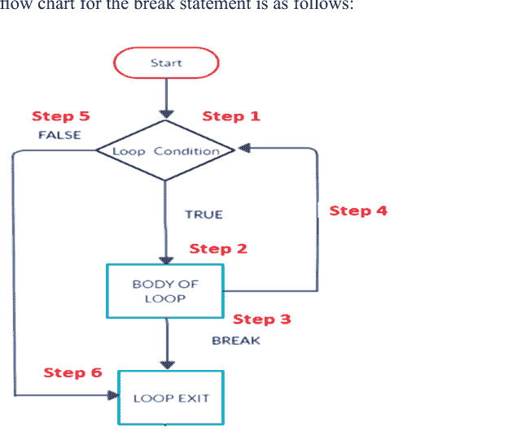

**图 4.1：** break语句流程图

以下是流程图中涉及的步骤。

**步骤 1：** 循环执行开始。

**步骤 2：** 如果循环条件为真，将执行步骤2，即执行循环体。

**步骤 3：** 如果循环体中有break语句，循环将退出并转到步骤6。

**步骤 4：** 循环条件执行完毕后，将进入步骤4的下一次迭代。

**步骤 5：** 如果循环条件为假，将退出循环并转到步骤6。

**步骤 6：** 循环结束。

### 示例

```python
i = 1
while(i <= 5):
    if(i == 3):
        break
    print(i)
    i = i + 1
Output: 1, 2
```

#### 4.4.2 Continue语句

continue语句跳过其后的代码，控制权返回到循环开始处进行下一次迭代。

以下是流程图中涉及的步骤。

**步骤 1：** 循环执行开始。

**步骤 2：** 将执行循环内的代码。如果循环内有continue语句，控制权将返回到步骤4，即循环开始处进行下一次迭代。

**步骤 3：** 将执行循环内的代码。

**步骤 4：** 如果有continue语句或循环体内的执行完成，将调用下一次迭代。

**步骤 5：** 循环执行完成后，循环将退出并转到步骤7。

**步骤 6：** 如果步骤1中的循环条件失败，将退出循环并转到步骤7。

**步骤 7：** 循环结束。

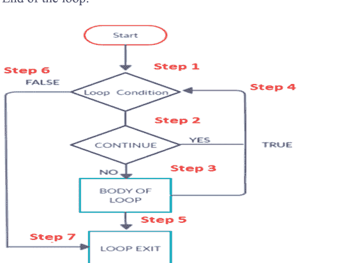

**图 4.2：** continue语句流程图

### 示例：

```python
i = 0
while(i <= 5):
    i = i + 1
    if(i == 3):
        continue
    print(i)
Output: 1, 2, 4, 5, 6
```

# 5

## Python编程中的字符串

### 5.1 字符串语句

Python中的字符串以单个字符的形式存储，即按索引存储。索引默认从0开始。

| 正向索引 | 0 | 1 | 2 | 3 | 4 | 5 |
|---|---|---|---|---|---|---|
| 字符串 | p | y | t | h | o | n |
| 反向索引 | -6 | -5 | -4 | -3 | -2 | -1 |

因此，这里的P可以用str[0]或str[-6]表示，y可以用str[1]或str[-5]表示。

**注意：** 字符串是不可变的，因此不能使用赋值运算符更改字符串的单个字母。

**示例：**

```python
name = "shyam"
Name[0] = "A"
Result error
```

**示例：**

```python
name = "shyam"
print(name)
```

**示例：**

```python
name = "shyam"
for i in name:
    print(i)
```

输出

s
h
y
a
m

示例：

```python
name = "shyam"
for i in name:
    print(i, end="")
output: shyam
```

### 5.2 字符串运算符

- 1. **连接运算符 (+)**：+运算符连接两个不同的字符串

    **示例：**
    
    x = "Every" + "day"
    print(x)
    output: Everyday

- 2. **复制运算符 (*)**：*运算符需要两种类型的操作数——一个字符串和一个数字。它将给定的字符串复制给定的次数。

    **示例：**
    
    x = 3 * "hello"
    print(x)
    Output: hellohellohello

- 3. **成员运算符(in/not in)**

    **示例**
    
    "a" in "ram"    output: true
    "a" not in "ram" output: false

- 4. **比较运算符：**

    所有关系运算符(>, <, >=, <=, ==, !=)也适用于字符串

### 示例

### 比较

```python
"a" == "a"
"ram" == "ram"
"a" != "ram"
```

比较总是根据ASCII码进行。

### 字符串切片：

字符串切片返回索引n和m之间的字符：
字符串在n, n+1, n+2, .... 直到m-1处的字符。语法是：
字符串[起始:结束:步长值]

### 示例

```python
1. a = "hello word"
print(a[4:-2])
output: o wor

2. a = "hello word"
print(a[6:], a[:6])
output: word hello
```

**注意：** 6: 默认打印到最后，:6 默认从0开始
Str[6:10] 打印到第9个字符，

### 5.3 字符串函数

Python提供了一些内置函数。一些重要的函数有：

- 1. **len()** # 此函数返回字符串的长度

### 示例

```python
a = "ram kumar"
print(len(a))
```

**输出：** 9

- 2. **capitalize()** # 此函数返回字符串的副本，其首字母大写。

## 6. Python编程中的列表

### 6.1 列表简介

1. 列表是不同值或不同类型项目的集合。
2. 与C/C++/Java中的数组不同，列表能够在同一个容器中存储不同类型的值。
3. 列表中的项目用逗号(,)分隔，并用方括号[]括起来。
4. 列表为我们提供了在单个单元中存储多种类型数据的功能。

**示例：**

```
a=["ram",1,"shyam",12.5]
b=[1,2,3,4]
```

| 0 | 1 | 2 | 3 | 正向索引 |
|---|---|---|---|---|
| ram | 10 | shyam | 12.5 | |
| -4 | -3 | -2 | -1 | 反向索引 |

```
a[0]=ram
a=["ram",1,"shyam",12.5]
print(a)
print(a[0])
ram
```

### 6.2 Python列表切片

与字符串类似，Python中也有列表切片的概念。

**示例：**

```
a=["ram",10,"shyam",12.5]
a[0:]= [ram,10,shyam,12.5]
a[:]=[ram,10,shyam,12.5]
a[1:3]= [10,shyam]
a[:3]= [ram,10,shyam]
```

#### 6.2.1 更新Python列表

| 0 | 1 | 2 | 3 | 正向索引 |
|---|---|---|---|---|
| ram | 10 | shyam | 12.5 | |
| -4 | -3 | -2 | -1 | 反向索引 |

**示例：**

```
a=["ram",10,"shyam",12.5]
print(a[1])
a[1]="Ramesh"
output : a=[ram,10,shyam,12.5]
print(a[1])
output : a=[ram,Ramesh,shyam,12.5]
```

#### 6.2.2 删除Python列表

**示例：**

```
a=["ram",10,"shyam",12.5]
print(a[1])
del(a[1])
output : a=[ram,10,shyam,12.5]
print(a[1])
output : a=[ram, shyam,12.5]
```

#### 6.2.3 访问列表元素以执行各种操作

| 0 | 1 | 2 | 3 | 正向索引 |
|---|---|---|---|---|
| ram | 10 | shyam | 12.5 | |
| -4 | -3 | -2 | -1 | 反向索引 |

**示例：**

```
a=["ram",10,"shyam",12.5]
for i in a:
    print(i)
```

1. **len(list)** # 此方法用于查找列表的总长度

**示例**

```
a=["ram",10,"shyam",12.5]
b=len(a)
print(b)
```

2. **max(list)** # 此方法用于查找最大值

**示例**

```
a=["ram",10,"shyam",12.5]
b=max(a)
print(b)
```

3. min(list) # 此方法用于查找最小值

**示例**

```
a=["ram",10,"shyam",12.5]
b=max(a)
print(b)
```

情况1：如果我们有一个包含字符串和整数值的列表，并且我们想使用max函数。在这种情况下，将产生一条错误消息，指出无法比较字符串和整数值。

情况2：如果存在字符串值比较。在这种情况下，将按a到z的升序进行比较。

注意：max或min比较列表中相同类型的元素

4. cmp(list1,list2) # 此方法用于比较两个列表

语法：

```
cmp(list1,list2)
```

返回：如果list1大于list2则返回1，如果两个列表相等则返回0，如果list2大于list1则返回-1

对于两个列表的比较，存在一些特定情况

情况1：

a. 如果两个列表都包含整数，则从左到右进行比较。如果在任何特定索引处得到较大的数字，则该列表变得更大，并且停止进一步的比较。
b. 如果两个列表中的所有元素都相似，并且一个列表的尺寸更大，则尺寸更大的列表更大。
c. 如果两者都包含一些值，则列表相等。

```
List1=[2,4,6,8]
List2=[2,4,6,9]
List3=[2,4,6,9,11]
List4=[2,4,6,8]
Print("comparing list1 and list2:")
Print(cmp(list1,list2)) #output -1
Print("comparing list2 and list3:")
Print(cmp(list2,list3)) #output -1
Print("comparing list1 and list4:")
Print(cmp(list1,list4)) #output 0
```

情况2

a. 当列表包含多种数据类型时，在这种情况下，字符串被认为大于整数
b. 在多种数据类型的情况下，比较是通过排序的比较情况完成的。

```
List1=[2,4,6,8]
List2=[2,4,6,'a']
List3=['a','b','c']
List4=['a','c','b']
Print("comparing list2 and list1:")
Print(cmp(list2,list1)) #output 1
Print("comparing list2 and list3:")
Print(cmp(list2,list3)) #output -1
Print("comparing list3 and list4:")
Print(cmp(list3,list4)) #output -1
```

5. **list.append(obj)**：此方法用于将传递的对象追加（添加）到列表的末尾。请注意，对象被添加到列表的最后。

语法：
list.append(obj)

**示例**

```
a=["ram","shyam","sita","gita"]
a.append("mita")
print(a)
output: ram,shyam,sita,gita,mita
```

**示例**

```
a=[]
for i in range(10):
    x=input("enter item to add in the list:")
    a.append(x)
print(a)
```

6. **list.count(obj)**：此方法用于计算给定对象的频率。

语法：
list.count(obj)

**示例**

```
a=["ram","shyam","sita","gita"]
x=a.count("ram")
print("frequency=",x)
```

**示例**

```
a=[]
for i in range(10):
    x=input("enter item to add in the list:")
    a.append(x)
x=input("enter value whose frequency you want:")
f=a.count(x)
print("frequency of ",x,"is=",f)
```

注意：你必须指定要搜索的数据类型以计算频率。输入的类型决定了你想要获取频率的值的类型。

7. **list.index(obj)**：此方法用于查找对象/元素的索引。如果找到该对象/索引，此函数返回其第一个索引，否则返回一个异常，表明未找到该元素。

**语法**：list.index(obj)

**示例**

```
a=["ram","shyam","sita","gita"]
x=a.count("ram")
print("index of ram=",x)
```

**示例**

```
a=[]
for i in range(5):
    x=input("enter item:")
    a.append(x)
x=input("enter value of index:")
f=a.index(x)
print("index = ",z)
```

8. **list.insert(index,obj)**：此方法用于在给定索引处插入一个对象/值。

语法：list.insert(index,object)

**示例**

```
a=[5,"ram",10]
a.insert(2,"shyam")
print(a)
output:5,ram,shyam,10
```

**示例**

```
a=[]
for i in range(5):
    x=input("enter item:")
    a.append(x)
print("orginal list is:",a)
index=input("enter index where you want to insert:")
value=input("enter value insert:")
a.insert(index,value)
print("list after insertion: ",a)
```

9. **list.remove(obj)**：此方法用于从给定列表中删除一个对象/值。请注意，它会删除/删除列表中第一次出现的该对象。

语法：list.remove(object)

示例：

```
a="shyam kumar"
print(a.capitalize())
output:Shyam kumar
```

示例：

```
a=input("enter you name:")
for i in range(0,len(a)):
    print(a[i])
```

示例：查找字符串的反转

```
a=input("enter string:")
for i in range((len(a)-1),-1,-1):
    Print(a[i],end="")
```

示例：查找字符串的反转

```
a=input("enter string:")
Print(a[-1::-1])
```

示例：查找给定字符串中的元音和辅音总数

```
a=input("enter your name:")
vowel=0
cons=0
for i in range(0,len(a)):
    if(a[i]!=""):
        if(a[i]=="a" or a[i]=="e"or a[i] =="i" or a[i]=="o" or a[i]=="u"
            if(a[i]=="A" or a[i]=="E"or a[i] =="I" or a[i]=="O" or
a[i]=="U"]:
                vowel=vowel+1
        else:
            cons=cons+1
print("total vowels=",vowel)
print("total consonant=""cons)
```

3. **find()** # 此函数返回子字符串在字符串中找到的最低索引，如果找到则返回其索引，如果未找到则返回-1

示例：

```
a="RAM IS GOING TO MARKET"
b="TO"
a.find(b,o,(len(a)-1))
output:13
```

示例：检查字符串是否为回文

```
a=input("enter string;")
b=a[-1::-1]
if(a==b):
    print("Palindrome string")
else:
    print("Not Palindrome string")
```

4. isalnum() # 如果字符串中的字符是字母数字（字母或数字）并且至少有一个字符，则返回true，否则返回false

示例：

```
a="ram123"
a.isalnum()
b="hello"
b.isalnum()
c="1234"
c.isalnum()
c=""
c.isalnum()
```

5. isdigit() # 如果字符串中的所有字符都是数字并且至少有一个数字，则返回true，否则返回false

示例：

```
a="ram123"
a.isdigit()
b="hell"
b.isdigit()
```

6. isspace() # 当字符串中只有空格并且至少有一个字符时，此方法返回true。否则返回false。

示例：

```
a=" "
a.isspace() #output True
```

## 示例

```
a=[5,"ram",10,"ravi",10]
a.remove(10)
print(a)
output: 5,ram,ravi,10
```

## 示例

```
a=[]
for i in range(5):
    x=input("enter item:")
    a.append(x)
print("original list is:",a)
val=input("enter value to remove:")
a.remove(val)
print("list after deletion: ",a)
```

10. list.reverse()：此方法用于就地反转列表中的元素。这里的“就地”一词意味着列表自身被反转。

语法：list.reverse()

## 示例

```
a=[5,"ram",10,"ravi",10]
a.reverse()
print(a)
output:10,ravi,10,ram,5
```

## 示例

```
a=[]
for i in range(5):
    x=input("enter item:")
    a.append(x)
print("original list is:",a)
a.reverse()
print("list after reverse: ",a)
```

11. list.sort()：此方法用于对列表中的元素进行升序或降序排序。列表自身会被排序。请注意，排序是针对相同数据类型进行的，这意味着你的列表应该包含相同类型的数据，否则会显示错误。默认情况下，排序是按升序进行的。

## 语法

1. List.sort(reverse="False") # 升序，
2. List.sort(reverse="True") # 降序

## 示例

```
a=[]
for i in range(5):
    x=input("enter item:")
    a.append(x)
print("original list is:",a)
a.sort()
print("list after sort: ",a)
注意：如果你在这里这样写：
c=a.sort()
print(c) #这是错误的，因为sort函数的值不能被复制到任何地方。
```

12. list.pop()：此方法用于删除列表的最后一个元素。请注意，此函数会逐个删除列表的最后一个元素。

语法：list.pop()

## 示例

```
a=[5,2,8,3,7]
a.pop()
print(a)
output:5,2,8,3
```

### 6.3 基础程序列表

1.  求列表元素之和的程序
2.  统计列表中奇数和偶数总数的程序。
3.  求列表中偶数之和与奇数之积的程序
4.  在列表中搜索一个数字的程序。
5.  统计给定数字出现频率的程序。
6.  求列表中最大数的程序
7.  求列表中最小数的程序
8.  反转列表本身的程序。
9.  在列表中给定索引处插入一个数字的程序。
10. 从列表中移除给定数字的程序。

## 示例：求列表元素之和的程序

```
a=[]
size=int(input("how many elements you want to enter:"))
for i in range(size):
    val=int(input("enter number:"))
    a.append(val)
sum=0
for i in range(size):
    sum=sum+a[i]
print("sum of list elements=",sum)
```

## 示例：统计列表中奇数和偶数总数的程序。

```
a=[]
size=int(input("how many elements you want to enter:"))
for i in range(size):
    val=int(input("enter number:"))
    a.append(val)
even=0
odd=0
for i in range(size):
    if(a[i]%2==0):
        even=even+1
    else:
        odd=odd+1
    sum=sum+a[i]
print("total even=",even, "total odd=",odd)
```

## 示例：在列表中搜索一个数字的程序

```
a=[]
size=int(input("how many elements you want to enter:"))
for i in range(size):
    val=int(input("enter number:"))
    a.append(val)
key=int(input("enter number of search:"))
flag=0
for i in range(size):
    if(a[i]==key):
        flag=1
        pos=i+1
        break
if(flag==1):
    print("enter found at:","pos","position.")
else:
    print("element not found=")
```

## 示例：统计给定数字出现频率的程序

```
a=[]
size=int(input("enter size of list:"))
for i in range(size):
    val=int(input("enter number:"))
    a.append(val)
key=int(input("enter number of frequency:"))
count=0
for i in range(size):
    if(a[i]==key):
        count=count+1
print("Frequency count=",count)
```

## 示例：求列表中最大数的程序

```
a=[]
size=int(input("enter size of list:"))
for i in range(size):
    val=int(input("enter number:"))
    a.append(val)
max=a[0]
for i in range(size):
    if(a[i]>max):
        max=a[i]
print("max number=",max)
```

## 示例：求列表中最小数的程序

```
a=[]
size=int(input("enter size of list:"))
for i in range(size):
    val=int(input("enter number:"))
    a.append(val)
min=a[0]
for i in range(size):
    if(a[i]<min):
        min=a[i]
        print("min number=",min)
```

## 示例：反转列表本身的程序。

```
a=[]
size=int(input("enter size of list:"))
for i in range(size):
    val=int(input("enter number:"))
    a.append(val)
i=0
j=size-1
while(i<j):
    t=a[i]
    a[i]=a[j]
    a[j]=t
    i=i+1
    j=j-1
print("List after reverse=")
for i in range(size):
    print(a[i])
```

## 示例：求第二大、第二小值的程序

```
a=[]
size=int(input("enter size of list:"))
for i in range(size):
    val=int(input("enter number:"))
    a.append(val)
minval=min(a)
print("min value in the list is:", minval)
a.remove(minval)
smin=min(a)
print("second min value in the list=",smin)
```

## 最大数

```
a=[]
size=int(input("enter size of list:"))
for i in range(size):
    val=int(input("enter number:"))
    a.append(val)
a.sort()
print("max num:", a[size-1])
print("second max num:", a[size-2])
```

## 7 Python编程中的元组

### 7.1 元组简介

元组是一个有序且不可更改的集合。在Python中，元组用圆括号编写。Python中的元组与列表非常相似，都包含不同类型的元素，但有以下主要区别。

它声明为
tuple1=(1,2,3,"ram","shyam")

| 列表 | 元组 |
|---|---|
| 列表用 [] 编写 | 元组用 () 编写 |
| 列表是可变的 | 元组是不可变的 |
| 与元组相比，列表占用更多内存空间 | 与列表相比，元组占用更少内存空间 |
| 程序实现<br>import sys<br>list=[1,2,"ram","shyam","true","ravi"]<br>tuple=(1,2,"ram","shyam","true","ravi")<br>print("size of list=",sys.getsizeof(list))<br>print("size of tuple=",sys.getsizeof(tuple)) | 与元组相比，列表执行时间更长<br>与列表相比，元组执行时间更短 |

程序实现

```
import timeit
listtime=timeit.timeit(stmt="[1,2,3,4,5,6,7,8,9]",number=1000000)
tupletime=timeit.timeit(stmt="(1,2,3,4,5,6,7,8,9)",number=1000000)
print("List takes time:", listtime)
print("Tuple takes time:", tupletime)
```

### 7.2 程序实现

示例：

```
import sys
list=[1,2,"ram","shyam","true","ravi"]
tuple=(1,2,"ram","shyam","true","ravi")
print("size of list=",sys.getsizeof(list))
print("size of tuple=",sys.getsizeof(tuple))
```

#### 7.2.1 插入、更新和删除元组元素

1. 使用元组显示构造
   Tuple=() #空元组
   Tuple=(val1,val2,......)
2. 创建空元组
   Tuple1=tuple()
3. 创建单元素元组：
   Tuple=(2) #这将不是元组，而是整数类
   Tuple=(2,) #这将是一个元组类。

这里在元素之后你需要给出逗号(,)。

从现有序列创建元组：我们也可以使用内置的元组类型对象(tuple())根据语法从序列创建元组：
Tuple1=tuple(<sequence>)
序列可以是任何类型，如字符串、列表和元组。

从字符串创建元组

```
t1=tuple('word')
Output:('w','o','r','l','d')
```

从列表创建元组

```
list=[1,2,3,4,5]
tuple1=tuple(list)
```

输出
tuple1=(1,2,3,4,5)

### 7.3 不同类型的元组

| 创建元组的方式 | 元组的类型 |
|---|---|
| () | 这是一个空元组 |
| (7,) | 包含一个元素的元组 |
| (1,2,3) | 整数元组 |
| (1,2,3,4,5) | 数字元组 |
| ('a','n','d') | 字符元组 |
| ('a',1,2,3.5,'ram') | 混合数据类型元组 |
| ('ram','shyam','sita') | 字符串元组 |

### 7.4 Python中元组的索引和切片

#### 7.4.1 遍历元组

如果逐个访问每个元素，则称为遍历元组。

**示例：**

```
tuple1=(1,2,3,4)
for t in tuple1:
    print(t)
```

**示例：**

```
tuple1=(1,2,3,4)
for i in range(len(tuple1)):
    print(tuple[i])
```

#### 7.4.2 连接元组

**示例**

```
tuple1=(1,2,3,4,5)
tuple2=(6,7,8)
tuple3=tuple1+tuple2
print(tuple3)
```

#### 7.4.3 重复或复制元组

**示例：**

```
tuple1=(1,2,3)
tuple2=tuple1*3
print(tuple2)
output(1,2,3,1,2,3,1,2,3)
```

#### 7.4.4 元组切片

语法为

```
T=[start:stop:step]
```

示例：

```
tuple1=(10,11,12,13,14,15)
tuple2=tuple1[3:5]
print(tuple2)
```

注意：默认步长为1。

示例：

```
tuple1=(10,11,12,13,14,15)
tuple2=tuple1[0:5:2]
print(tuple2)
output: (10,12,14)
```

### 7.5 元组函数

1.  **len()** # 此方法返回元组的长度，即元组中元素的总数。

语法：len(tuple)

**示例：**
employee=('ram', 'shyam', 101, 1.56)
len(employee)

2.  **max()**
此方法返回元组中的最大值。
语法：max(tuple)

3.  **min()**
此方法返回元组中的最小值。
语法：min(tuple)

4.  **index()** # 它返回元组中某个现有元素的索引。
语法：元组名.index(项目)
示例：a=(10,20,30,45,20,15)
a.index(30)
output: 2
注意：它将返回第一个匹配值的索引。

5.  **count()**
count() 方法返回给定元素的出现频率。
语法：元组.count(项目)
示例：
a=(10,20,30,45,20,15)
a.count(30)

6.  **tuple()**
此方法用作构造函数，用于从不同类型的值创建元组。
语法：tuple(序列)

**示例：**

1.  创建空元组
    tuple()
2.  从列表创建元组
    t=tuple([1,2,3])
    output: (1,2,3)
3.  从字符串创建元组
    tuple1=tuple("xyz")
    Output: ('x','y','z')
4.  从字典的键创建元组
    tuple1=tuple({1:'m',2:'n'})
    tuple1
    output: (1,2)

#### 7.5.1 在Python中创建、更新、删除和访问元组元素

-   更改元组值：一旦创建了元组，就不能更改其值，因为元组是不可变的。
-   但还有另一种方法可以实现。你可以将元组转换为列表，更改列表，然后将列表转换回元组。

**示例**

你需要将元组转换为列表才能更改它：

```
x=('apple','banana','cherry')
y=list(x)
y[1]='kiwi'
x=tuple(y)
print(x)
```

检查项目是否存在：要确定元组中是否存在指定项目，请使用 `in` 关键字。

**示例**

```
tuple1=('ram','shyam','sita','gita')
if 'ram' in tuple1:
    print("yes the element is present in the tuple")
else:
    print("no element is not present in the tuple")
```

**添加项目**

-   一旦创建了元组，就不能向其添加项目。元组是不可变的。
-   你不能向元组添加项目。

**示例**

```
tuple1=('apple','banana','cherry')
tuple1[3]='orange' #this will raise an error
print(tuple1)
```

删除元组元素：

无法删除元组的单个元素。要删除整个元组，只需使用 **del** 语句。

**示例**

```
tuple1=('ram','shyam','sita','gita')
print(tuple1)
del(tuple1)
print("after deleting tuple")
print(tuple1) # error show
```

## 8 Python编程中的字典

### 8.1 Python字典简介

字典是一种无序、可变且有索引的集合。在Python中，字典写在花括号内，它们有键和值。这意味着字典包含两样东西，第一是键，第二是值。

#### 8.1.1 创建和打印字典

示例

```
dict1={'brand':'Suzuki','model':'dzire','year':2020}
print(dict1)
```

访问项目：你可以通过在方括号内引用其键名来访问字典的项目。

示例

访问项目：还有一个名为 `get()` 的方法可用于完成相同任务。

```
dict1={'brand':'Suzuki','model':'dzire','year':2020}
print(dict1)
y=dict1.get("model")
print(y)
```

#### 8.1.2 遍历字典

示例

```
dict1={'brand':'Suzuki','model':'dzire','year':2020}
for x in dict1:
    print(x)
```

注意：这将打印键值。

示例

```
dict1={'brand':'Suzuki','model':'dzire','year':2020}
for x in dict1:
    print(dict1[x])
```

**注意：** 这将打印值。
我们可以使用 `values()` 函数来返回字典的值。

**示例：**

```
dict1={'brand':'Suzuki','model':'dzire','year':2020}
for x in dict1.values():
    print(x)
```

#### 8.1.3 更改字典中的值

你可以通过引用其键名来更改特定项目的值：

**示例：**

```
dict1={'brand':'Suzuki','model':'dzire','year':2020}
dict1['year']=2018
output: {'brand':'Suzuki','model':'dzire','year':2018}
```

#### 8.1.4 在Python中添加、更新、删除元素

检查字典中是否存在某个键：

**示例：**

```
dict1={'brand':'Suzuki','model':'dzire','year':2020}
if 'model' in dict1:
    print("yes, 'model' is one of the keys in the dictionary")
else:
    print("NO, 'model' is not one of the keys in the dictionary")
```

### 8.1.5 在字典中添加新元素：

**示例：**

```
dict1={'brand':'Suzuki','model':'dzire','year':2020}
print(dict1)
dict1['color']='white'
print(dict1)
output:
{'brand':'Suzuki','model':'dzire','year':2020}
{'brand':'Suzuki','model':'dzire','year':2020,'color':'white'}
```

### 8.1.6 字典及其函数详解：

1.  **len()** # 此函数用于查找字典的长度。

**示例**

```
dict1={'brand':'Suzuki','model':'dzire','year':2020}
x=len(dict1)
```

2.  **移除项目** # `pop()`：此方法移除具有指定键名的元素。

**示例**

```
dict1={'brand':'Suzuki','model':'dzire','year':2020}
print(dict1)
dict1.pop('model')
print(dict1)
output:
{'brand':'Suzuki','model':'dzire','year':2020}
{'brand':'Suzuki','year':2020}
```

3.  **popitem()**：# 此方法移除字典的最后一个元素。但在3.7之前的版本中，它用于移除一个随机元素。

**示例**

```
dict1={'brand':'Suzuki','model':'dzire','year':2020}
print(dict1)
dict1.popitem()
print(dict1)
output:
{'brand':'Suzuki','model':'dzire','year':2020}
{'brand':'Suzuki','model':'dzire'}
```

#### 8.1.7 Del 关键字

此关键字也用于删除字典本身。

**示例**

```
dict1={'brand':'Suzuki','model':'dzire','year':2020}
print(dict1)
del dict1
print(dict1)
output: error
```

#### 8.1.8 Clear 关键字（删除字典的所有元素）

此关键字也用于删除字典的所有元素。请注意，它只删除字典的内容，所以字典还在，但没有元素了。

**示例**

```
dict1={'brand':'Suzuki','model':'dzire','year':2020}
print(dict1)
dict1.clear()
print(dict1)
output:
{}
```

### 8.2 字典中的字典函数

-   len()
-   get()
-   clear()
-   pop()
-   popitem()
-   values()
-   items()
-   copy()
-   fromkeys()
-   keys()
-   setdefault()
-   update()

**copy()**

**示例**

```
dict1={'brand':'Suzuki','model':'dzire','year':2020}
x=dict1.copy()
print(x)
```

**fromkeys()** # `fromkeys()` 方法返回一个具有指定键和指定值的字典。

**示例**

```
x={'firstkey','secondkey','thirdkey'}
y=0
x=dict1.fromkeys(x,y)
print(dict1)
```

**output**

**setdefault()** #

-   `setdefault` 方法返回具有指定键的项目的值。
-   如果键不存在，它会插入该键，并赋予指定的值。

**示例**

```
dict1={'brand':'Suzuki','model':'dzire','year':2020}
x=dict1.setdefault('brand','toyota')
print(x)
output:
since 'brand' key is already present so it will return the value of this key.
suzuki
```

**示例**

```
dict1={'brand':'Suzuki','model':'dzire','year':2020}
x=dict1.setdefault('place','new delhi')
print(x)
output:
since 'place' key is not present in the dict1, it will insert this key with value and then the respective value "new delhi" will be assigned to x and so "new delhi" will get printed.
```

**update()**

`update()` 方法将指定的项目插入到字典中。

```
dict1={'brand':'Suzuki','model':'dzire','year':2020}
x=dict1.update({'color':'white'})
print(x)
```

## 9 Python编程中的Numpy

### 9.1 Numpy简介

Numpy：是一个Python包，代表“Numerical python”（数值Python）。
它由Travis Oliphant于2005年创建。
使用numpy，我们可以执行以下功能：

1.  对数组进行数学和逻辑计算。
2.  傅里叶变换和形状操作例程。
3.  它具有用于线性代数和随机数生成的内置函数。
4.  用于科学计算。
5.  它比Python列表更快。
6.  它很快，因为它与C编程相关联。

NumPy通常被称为MatLab（一个专为工程师和科学家设计的编程平台，用于数据分析、开发算法、创建模型和应用程序等）的替代品。
NumPy与SciPy（科学Python）和Mat-Plotlib（绘图库）等包一起使用，这使其能够替代MATLAB。

1.  一维数组称为向量。
2.  二维数组称为矩阵。
3.  三维数组称为张量。

### 9.2 安装Numpy

1.  Anaconda (https://www.anaconda.com/) 是一个用于SciPy栈的免费Python发行版。它也适用于Linux和Mac。
2.  Canopy, python(x,y) 也可以用于此目的，但在这个视频教程系列中我将使用Anaconda。
3.  下载并安装Anaconda并完成。

## 4. 安装完成后，前往开始菜单并点击“Anaconda Navigator”。
5.  它提供了多种选项，如 Jupyter Notebook、Spyder、VS code 等。
6.  这里我们将使用 Jupyter notebook。

## 使用 Jupyter Notebook

Jupyter notebook 有两种模式：

- 1. 命令模式 - 蓝色
- 2. 编辑模式 - 绿色

一些需要记住的快捷键：

- 1. 要运行你编写的程序，请按 Ctrl+Enter。
- 2. 要运行命令并在下方插入一个单元格，请按 Shift+Enter。
- 3. 要在下方插入一个单元格，只需按“b”键。
- 4. 要删除一个单元格，请按 Esc 键（进入命令模式，因为在编辑模式下无法删除单元格），然后按两次“d”键。

#### 9.2.1 创建 Numpy 数组（一维）

### 示例

```
import numpy as np
a=[1,2,3,4,5]
myarr=np.array(a)
myarr
```

我们可以直接这样做：

```
import numpy as np
myarr=np.array([1,2,3,4,5])
myarr
```

#### 9.2.2 使用 Numpy 创建二维数组

### 示例

```
import numpy as np
a=[[1,2,3,4,5],[4,5,6],[7,8,9]]
myarr=np.array(a)
myarr
print("Total dimension=",myarr.ndim)
print("shape of array=",myarr.shape)
```

我们可以直接这样做：

```
import numpy as np
myarr=np.array([[1,2,3,4,5],[4,5,6],[7,8,9]])
myarr
```

### 9.3 Numpy 函数

1.  Zeros：此函数创建一个数组（一维或多维），并将所有值填充为零（0）

### 示例

```
import numpy as np
arr=np.zeros(5)
output:([0.,0.,0.,0.,0.])
```

示例：

```
import numpy as np
arr=np.zeros((2,3))
output: 0 0 0
        0 0 0
```

2.  Ones：此函数创建一个数组（一维或多维），并将所有值填充为一（1）

### 示例

```
import numpy as np
arr=np.ones(5)
output:([1.,1.,1.,1.,1.])
```

示例：

```
import numpy as np
arr=np.ones((2,3))
output: 1 1 1
        1 1 1
```

## 3. Eye 函数

此函数创建一个数组，其所有对角线元素为 1，其余为 0（在方阵中）。对于非方阵，对角线（直到可以绘制对角线的位置）的值仍为 1，其余为零。

### 示例

```
import numpy as np
arr=np.eye(3)
```

输出：
```
1 0 0
0 1 0
0 0 1
```

### 示例

```
import numpy as np
arr=np.eye(3,4)
```

输出：
```
1 0 0 0
0 1 0 0
0 0 1 0
```

## 4. Diag 函数

此函数创建一个二维数组，其所有对角线元素为给定值，其余为 0（在方阵中）。

### 示例

```
import numpy as np
arr=np.diag([1,5,3,7])
```

输出：
```
1 0 0 0
0 5 0 0
0 0 3 0
0 0 0 7
```

## 5. Randint()

此函数用于生成给定范围内的随机数。

### 语法：

```
randint(min,max,total_values)
```

### 示例：

```
import numpy as np
arr=np.random.randint(1,10,3)
output: 可能是 1 到 9 之间的任意 3 个数字。
```

## 6. rand()

此函数用于生成 0 到 1 之间的随机值。

### 语法：

```
rand(number_of_values)
```

### 示例：

```
import numpy as np
arr=np.random.rand(5)
```

输出：可能是 0 到 1 之间的任意 5 个数字。

#### 9.3.1 二维 (2D)

### 示例：

```
import numpy as np
arr=np.random.rand(2,3)
```

输出：可能是 0 到 1 之间的任意 6 个数字。

7.  randn() 此函数用于生成接近 0（零）的随机值。它也可能返回正数或负数。

```
randn(number_of_values)
```

### 示例

```
import numpy as np
arr=np.random.randn(3)
```

输出：可能是以 0 为中心的任意 3 个数字。

#### 9.3.2 一维数组中的索引

### 示例

```
import numpy as np
a=[]
size=int(input("how may numbers?"))
for i in range(size):
    val=int(input("enter number"))
    a.append(val)
arr=np.array(a)
for i in range(arr.size):
    print(arr[i])
arr1=arr[2:4] #这将创建一个新数组，包含数组 arr 中从索引 2 到 3 的元素。
```

```
print(arr1)
```

#### 9.3.3 Python 中 Numpy 数组的重塑

### 示例

```
a=[1,2,3,4,5,6,7,8,9,10,11,12]
arr=np.array(a)
# 改变形状
arr.reshape(2,6)
arr.reshape(3,4)
arr.reshape(2,-1)
```

示例：

```
import numpy as np
arr=np.random.randint(1,50,12)
arr.shape
arr=arr.reshape(2,6) # 将其转换为二维数组。
```

#### 9.3.4 Python 编程中的 Seed 函数

我们知道 randint() 函数生成随机数。每次我们运行程序，都会生成一组新的随机数。但如果我们想固定种子呢？这会生成一组固定的随机数。

### 示例

```
import numpy as np
np.random.seed(12)
arr=np.random.randint(1,100,10) # 现在，只要不更改传递给 seed 的整数，它在任何计算机上都将返回相同的随机数。
```

#### 9.3.5 Python 编程中创建二维数组

- 1. 使用双括号表示法进行索引/切片

| [0][0] | [0][1] | [0][2] |
|--------|--------|--------|
| [1][0] | [1][1] | [1][2] |
| [2][0] | [2][1] | [2][2] |

- 2. 使用单括号表示法进行索引/切片

| [0,0] | [0,1] | [0,2] |
|-------|-------|-------|
| [1,0] | [1,1] | [1,2] |
| [2,0] | [2,1] | [2,2] |

### 示例

```
import numpy as np
matrix=[]
row=int(input("enter number of row:"))
col=int(input("enter number of col:"))
for i in range(row):
    a=[]
    for j in range(col):
        val=int(input("enter number:"))
        a.append(val)
    matrix.append(a)
for i in range(row):
    for j in range(col):
        print(matrix[i][j],end=" ")
    print()
print(type(matrix))
```

#### 9.3.6 二维数组的索引

首先，我们将创建一个二维数组

```
a=np.array([[10,20,30],[40,50,60],[70,80,90]])
```

两种方法：

- 1. 使用双括号表示法进行索引/切片
- 2. 使用单括号表示法进行索引/切片

### 语法：

```
a[row range, col range]
```

示例：`a[:2]`

### 9.4 视图与副本

- 当我们从一个数组中切片出一个子数组时，可以通过两种方式完成。
- 第一种是创建视图，第二种是使用它的副本。
- 但两者之间存在一些区别。如果你创建一个数组的视图，对子数组所做的任何更改都将复制到原始数组，而如果你创建一个副本，对复制的子数组所做的任何更改都不会反映在原始数组上。

### 示例

```
a=np.array([10,20,30,40,50,60,70,80])
slicing=a[3:6]
slicing[:]=0
print(a)
output: 10,20,30,0,0,0,70,80
```

### 示例

```
a=np.array([10,20,30,40,50,60,70,80])
slicing=a[3:6].copy()
slicing[:]=0
print(a)
output: 10,20,30,40,50,60,70,80
```

注意：这意味着原始数组未被更新。

### 9.5 Python 编程中的条件选择

#### 9.5.1 条件选择

### 示例

```
import numpy as np
arr=np.arange(1,16)
print(arr)
b=arr>10
print(b)
```

### 输出

```
[ 1  2  3  4  5  6  7  8  9 10 11 12 13 14 15]
[False False False False False False False False False False  True  True
  True  True  True]
```

### 9.6 Python 编程中 Numpy 数组的操作

### 示例

```
import numpy as np
arr=np.arange(1,5)
b=arr*2
b1=arr**2 # 对每个元素求平方
print(b)
output:[2,4,6,8]
```

注意：在 numpy 数组中，除以零会得到无穷大，而不是任何错误。

#### 9.6.1 Numpy 更多函数

```
import numpy as np
arr=np.array([10,20,30,40,50])
np.min(arr) # 返回最小值
np.max(arr) # 返回最大值
np.argmin(arr) # 最小值的位置
np.argmax(arr) # 最大值的位置
np.sqrt(arr) # 每个数的平方根
np.sin(arr) # 每个数的正弦值
np.cos(arr) # 每个数的余弦值
```

linspace 函数返回给定范围内的值，且相邻元素之间的间隔相同。

```
import numpy as np
np.linspace(1,2,5)
output: 1.,1.25,1.5,1.75,2.
```

### 9.7 创建具有固定数据类型的二维数组

### 示例

```
import numpy as np
np.random.seed(122)
matrix=np.random.randint(1,21,9).reshape(3,3)
print(matrix)
np.sum(matrix) # 求数组的和
或
matrix.sum()
np.min(matrix) # 求数组的最小值
np.max(matrix) # 求数组的最大值
```

### 示例

```
import numpy as np
np.random.seed(122)
matrix=np.random.randint(1,21,9).reshape(3,3)
print(matrix)
np.sum(matrix, axis=1) # 按行求和
np.min(matrix, axis=1)  # 按行求最小值
np.max(matrix, axis=0)  # 按列求最大值
np.cumsum(matrix) # 累积和
np.cumsum(matrix, axis=0) # 累积和
```

### 示例

```
import numpy as np
np.random.seed(122)
matrix=np.random.randint(1,21,10)
print(matrix)
np.random.shuffle(matrix) # 打乱数组元素
np.unique(matrix) # 显示数组中的唯一值
np.unique(matrix).size # 计算唯一元素的数量
```

### 示例

```
import numpy as np
np.random.seed(122)
matrix=np.random.randint(1,21,10)
print(matrix)
np.unique(matrix, return_index=True, return_counts=True)
# 返回三个数组
```

- 1. 包含唯一值的数组
- 2. 包含相应索引值的数组
- 3. 包含频率计数的数组

#### 9.7.1 堆叠具有固定数据类型的二维数组

### 示例

```
import numpy as np
arr1=np.array([1,2,3,4])
arr2=np.array([5,6,7,8])
print(arr1)
print(arr2)
np.hstack((arr1,arr2)) # 水平排列矩阵
np.vstack((arr1,arr2)) # 垂直排列矩阵
```

## 示例

```python
import numpy as np
np.random.seed(122)
arr1 = np.random.randint(1, 21, 9).reshape(3, 3)
arr2 = np.random.randint(31, 51, 9).reshape(3, 3)
print(arr1)
print(arr2)
np.hstack((arr1, arr2))  # 水平排列矩阵
np.vstack((arr1, arr2))  # 垂直排列矩阵
```

### 9.8 问题列表

1.  编写导入 numpy 的语句。
2.  使用 numpy 创建一个数组。
3.  创建一个包含 10 个随机整数的数组。
4.  创建一个包含 10 到 20 之间元素的数组。
5.  创建一个包含值 5 重复出现的数组。
6.  创建一个一维数组并将其转换为 3*3 矩阵。
7.  创建一个数组，然后将所有偶数替换为 0。
8.  创建一个大小为 3*3 的二维数组，但所有元素应在 0 和 1 之间。
9.  执行以下切片操作：
    输入：
    ```
    1  2  3  4
    5  6  7  8
    9  10 11 12
    13 14 15 16
    ```
    输出：
    ```
    6  7
    10 11
    14 15
    ```
10. 水平和垂直连接二维数组。

## 解答

### Q 1. 编写导入 numpy 的语句

答案

```python
import numpy as np
```

### Q 2. 使用 numpy 创建一个数组

答案

```python
import numpy as np
arr = np.array([1, 2, 3, 4, 5])
print(arr)
```

### Q 3. 创建一个包含 10 个随机整数的数组

答案

```python
import numpy as np
arr = np.random.randint(1, 100, 10)
print(arr)
```

### Q 4. 创建一个包含 10 到 20 之间元素的数组

答案

```python
import numpy as np
arr = np.arange(10, 21)
print(arr)
```

### Q 5. 创建一个包含值 5 重复出现的数组

答案

```python
import numpy as np
arr = np.ones() * 5
print(arr)
```

### Q 6. 创建一个一维数组并将其转换为 3*3 矩阵

答案

```python
import numpy as np
arr = np.arange(1, 10).reshape(3, 3)
print(arr)
```

### Q 7. 创建一个数组，然后将所有偶数替换为 0

答案

```python
import numpy as np
arr = np.arange(1, 11)
arr[arr % 2 == 0] = 0
print(arr)
```

### Q 8. 创建一个大小为 3*3 的二维数组，但所有元素应在 0 和 1 之间。

答案

```python
import numpy as np
arr = np.random.rand(9).reshape(3, 3)
print(arr)
```

### Q 9. 执行以下切片操作：

输入：

```
1   2   3   4
5   6   7   8
9   10  11  12
13  14  15  16
```

输出

```
6   7
10  11
14  15
```

### Q 10. 水平和垂直连接二维数组

答案

```python
import numpy as np
arr1 = np.arange(1, 10).reshape(3, 3)
arr2 = np.arange(10, 19).reshape(3, 3)
np.hstack((arr1, arr2))
```

答案

```python
import numpy as np
arr1 = np.arange(1, 10).reshape(3, 3)
arr2 = np.arange(10, 19).reshape(3, 3)
np.vstack((arr1, arr2))
```

### 9.9 Numpy 与列表的区别

-   大小：Numpy 数据结构占用空间更少。
-   性能：它们追求速度，比列表更快。
-   功能：SciPy 和 NumPy 内置了优化函数，例如线性代数运算。

### 9.10 在 Python IDE 中安装 Pycharm

安装 PyCharm 的步骤

**步骤 1：** 要下载 PyCharm，请访问 JetBrains 官方网站：下载 PyCharm。

**步骤 2：** 点击“下载”按钮。

**步骤 3：** 之后，您将看到下面的窗口，其中有两个选项，**Professional** 和 **Community**。

**步骤 4：** 下载 **Community** 版本。

**注意：** 如果您有兴趣使用 Professional 版本，那么您可以下载 **Professional** 版本并享受免费试用。

### 9.11 Python 数据类型

数据类型定义了变量将存储的数据类型。在 Python 中，声明变量没有严格的规则。数据类型在 Python 中是自动定义的。在 Python 中，当您为变量赋值时，数据类型就确定了。

| 示例 | 数据类型 |
| --- | --- |
| a="python programming" | str |
| a=20 | int |
| a=20.5 | float |
| a=1+5j | complex |
| a=["apple","boy","cat"] | list |
| a=("apple","boy","cat") | tuple |
| a=range(5) | range |
| a={"name":"amit","age":32} | dict |
| a={"apple","boy","cat"} | set |
| a=True/False | boolean |

如果我们想知道变量的类型，我们使用“type”函数。

### 示例

```python
x = 5
print(type(x))
```

#### 9.11.1 类型转换

将一种数据类型转换为另一种类型称为类型转换。Python 中的转换使用构造函数完成。

### 示例

```python
int()  # 将参数转换为整数类型
x = int(1)  # x 将为 1
y = int(2.8)  # y 将为 2
z = int("3")  # z 将为 3
```

#### 9.11.2 Numpy 搜索数组

我们也可以使用 where() 函数执行基于条件的搜索。考虑一个例子，如果我们想获取所有偶数的索引。程序将是。

### 示例

```python
import numpy as np
a = np.array([1, 2, 3, 4, 5, 6, 7, 8, 9, 10])
result = np.where(a % 2 == 0)
print(result)
```

### Searchsorted()

此方法在数组中执行二分搜索，并返回应插入指定值以保持搜索顺序的索引。

### 示例

```python
import numpy as np
a = np.array([2, 5, 8, 9, 13])
result = np.searchsorted(a, 7, side='right')
print(result)
```

## 10

## Python 编程中的 Lambda 函数

### 10.1 Lambda 函数

Python 编程中的 Lambda 函数或匿名函数。
Lambda 函数可以接受任意数量的参数，但只能有一个表达式。
语法：
`lambda arguments: expression` 仅单行。
表达式被执行并返回结果。

**示例**
```python
x = lambda a: a + 10
print(x(5))
```

**示例**
Lambda 函数可以接受任意数量的参数。
```python
x = lambda a, b: a * b
print(x(5, 6))
```

**示例**
```python
x = lambda a, b, c: a + b + c
print(x(5, 6, 2))
```

#### 10.1.1 带 Lambda 函数的 Filter 函数

filter() 函数返回一个迭代器，其中的项目通过一个函数进行过滤，以测试该项目是否被接受。

**示例**
```python
ages = [5, 12, 17, 18, 24, 32]
def myfunc(x):
    if x < 18:
        return False
    else:
        return True
adults = list(filter(myfunc, ages))
for x in adults:
    print(x)
```

或使用 lambda 函数

```python
ages = [5, 12, 17, 18, 24, 32]
adults = filter(lambda a: a > 18, ages)
for x in adults:
    print(x)
```

注意：filter 函数使用一个函数和一个值列表。

### 示例

```python
val = [5, 12, 17, 18, 24, 32]
def myfunc(x):
    if x % 2 == 0:
        return True
    else:
        return False
adults = list(filter(myfunc, val))
for x in adults:
    print(x)
```

或使用 lambda 函数

```python
val = [5, 12, 17, 18, 24, 32]
even = filter(lambda a: a % 2 == 0, val)
for x in even:
    print(x)
```

#### 10.1.2 Python 编程中的 Map Filter Lambda 函数

map() 函数对可迭代对象中的每个项目执行指定的函数。该项目作为参数发送给函数。

```python
ages = [5, 12, 17, 18, 24, 32]
def myfunc(x):
    if x < 18:
        return False
    else:
        return True
def myfunc1(x):
    return x * x
adults = filter(myfunc, ages)
for x in adults:
    print(x)
squares = map(myfunc1, adults)
for x in squares:
    print(x)
```

#### 10.1.3 Map 函数

使用 lambda 函数执行相同操作。

### 示例

```python
ages = [5, 12, 17, 18, 24, 32]
adults = filter(lambda a: a > 18, ages)
square = list(map(lambda a: a * a, adults))
print(square)
```

### 10.2 Reduce() 函数

reduce (fun, seq) 函数用于将传递给其参数的特定函数应用于序列中提到的所有列表元素。此函数在“functools”模块中定义。在第一步中，选取序列的前两个元素并获得结果。

工作原理

-   在第一步中，选取序列的前两个元素并获得结果。
-   下一步是将相同的函数应用于先前获得的结果和紧随第二个元素之后的数字，并再次存储结果。
-   此过程持续进行，直到容器中没有更多元素。最终返回的结果被返回并打印在控制台上。

### 示例

```python
# 演示 reduce() 工作原理的 Python 代码
# 导入 functools 以使用 reduce()
import functools
def myfunc(a, b):
    return a + b
val = [1, 2, 3, 4, 5]
add = functools.reduce(myfunc, val)
print("addition=", add)
```

或使用 lambda 函数

```python
import functools
val = [1, 3, 5, 6, 2]
add = functools.reduce(lambda a, b: a + b, val)
# 使用 reduce 计算列表的总和
print("addition=: ", add)
```

### 示例

```python
import functools
def myfunc(a, b):
    if a > b:
        return a
    else:
        return b
val = [1, 2, 3, 4, 5]
max_val = functools.reduce(myfunc, val)
print("max=", max_val)
```

或使用 lambda 函数

```python
import functools
val = [1, 2, 3, 4, 5]
max_val = functools.reduce(lambda a, b: a if a > b else b, val)
print("max=", max_val)
```

## 11 Python编程中的Pandas

### 11.1 简介

Pandas是一个开源的Python库，它利用其强大的数据结构提供高性能的数据操作和分析工具。Pandas这个名字来源于“Panel Data”——一个计量经济学中表示多维数据的术语。

2008年，开发者韦斯·麦金尼在需要一个高性能、灵活的数据分析工具时，开始开发pandas。

在Pandas出现之前，Python主要用于数据清洗和准备工作，对数据分析的贡献甚少。Pandas解决了这个问题。使用Pandas，无论数据来源如何，我们都可以完成数据处理和分析的五个典型步骤——加载、准备、操作、建模和分析。

Python与Pandas被广泛应用于包括金融、经济、统计、分析等在内的学术和商业领域。

#### 11.1.1 Pandas的关键特性

-   快速高效的DataFrame对象，支持默认和自定义索引。
-   用于从不同文件格式加载数据到内存数据对象的工具。
-   数据对齐和缺失数据的集成处理。
-   数据集的重塑和透视。
-   基于标签的大型数据集切片、索引和子集化。
-   可以从数据结构中删除或插入列。
-   用于聚合和转换的分组数据。
-   高性能的数据合并与连接。
-   时间序列功能。

### 11.2 NumPy与Pandas

NumPy数组用于实现pandas数据对象。

**Python Pandas - 环境设置**

标准Python发行版不包含Pandas模块。一个轻量级的替代方案是使用流行的Python包安装器**pip**来安装Pandas。

```
pip install pandas
```

### 11.3 数据结构简介

Pandas处理以下三种数据结构：

-   Series
-   DataFrame
-   Panel

这些数据结构建立在NumPy数组之上，这意味着它们速度很快。

**维度与描述**

理解这些数据结构的最佳方式是，更高维度的数据结构是其低维度数据结构的容器。例如，DataFrame是Series的容器，Panel是DataFrame的容器。

| 数据结构 | 维度 | 描述 |
|---|---|---|
| Series | 1 | 一维带标签的同质数组，大小不可变。 |
| Data Frames | 2 | 通用的二维带标签、大小可变的表格结构，列可能具有异构类型。 |
| Panel | 3 | 通用的三维带标签、大小可变的数组。 |

构建和处理二维或更多维数组是一项繁琐的任务，在编写函数时，用户需要考虑数据集的方向。但使用Pandas数据结构，可以减少用户的思维负担。

例如，对于表格数据（DataFrame），从语义上讲，思考**索引**（行）和**列**比思考轴0和轴1更有帮助。

**可变性**

所有Pandas数据结构都是值可变的（可以更改），除了Series，所有数据结构的大小也是可变的。Series的大小是不可变的。

注意——DataFrame被广泛使用，是最重要的数据结构之一。Panel的使用要少得多。

#### 11.3.1 Series

Series是一种一维的、类似数组的结构，包含同质数据。例如，以下Series是整数10、23、56、17、52、61、73、90、26、72的集合。

**关键点**

-   同质数据
-   大小不可变
-   数据值可变

#### 11.3.2 DataFrame

DataFrame是一个二维的、包含异构数据的数组。例如，

| 姓名 | 年龄 | 性别 | 评分 |
|---|---|---|---|
| steve | 32 | 男 | 3.45 |
| lia | 28 | 女 | 4.6 |
| vin | 45 | 男 | 3.9 |

该表表示一个组织销售团队的数据及其整体绩效评分。数据以行和列表示。每列代表一个属性，每行代表一个人。

#### 11.3.3 列的数据类型

四列的数据类型如下：

| 列 | 类型 |
|---|---|
| 姓名 | 字符串 |
| 年龄 | 整数 |
| 性别 | 字符串 |
| 评分 | 浮点数 |

**关键点**

-   异构数据
-   大小可变
-   数据可变

#### 11.3.4 Panel

Panel是一个三维的、包含异构数据的数据结构。用图形表示Panel很困难。但Panel可以被描述为DataFrame的容器。

**关键点**

-   异构数据
-   大小可变
-   数据可变

### 11.4 Python Pandas Series

Series是一个一维的带标签数组，能够容纳任何类型的数据（整数、字符串、浮点数、Python对象等）。

可以使用以下构造函数创建pandas Series：

```
pandas.Series(data, index, dtype, copy)
```

构造函数的参数如下：

| 序号 | 参数与描述 |
|---|---|
| 1 | data<br>data接受多种形式，如ndarray、列表、常量 |
| 2 | index<br>索引值必须是唯一的且可哈希，长度与data相同。如果未传递索引，则默认为**np.arange(n)**。 |
| 3 | dtype<br>dtype用于数据类型。如果为None，则将推断数据类型 |
| 4 | copy<br>复制数据。默认为False |

可以使用多种输入创建Series，例如：

-   数组
-   字典
-   标量值或常量

#### 11.4.1 创建空Series

可以创建的基本Series是空Series。

**示例**

```
#import the pandas library and aliasing as pd
import pandas as pd
s = pd.Series()
print(s)
```

其**输出**如下：

```
Series([], dtype: float64)
```

#### 11.4.2 从Ndarray创建Series

如果data是ndarray，则传递的索引必须具有相同的长度。如果未传递索引，则默认索引为range(n)，其中n是数组长度，即[0,1,2,3.... range(len(array))-1]。

**示例**

```
#import the pandas library and aliasing as pd
import pandas as pd
import numpy as np
data = np.array(['a','b','c','d'])
s = pd.Series(data)
print(s)
```

其**输出**如下：

```
0  a
1  b
2  c
3  d
dtype: object
```

我们没有传递任何索引，因此默认情况下，它分配了从0到**len(data)-1**的索引，即0到3。

**示例**

```
#import the pandas library and aliasing as pd
import pandas as pd
import numpy as np
data = np.array(['a','b','c','d'])
s = pd.Series(data,index=[100,101,102,103])
print(s)
```

其**输出**如下：

```
100  a
101  b
102  c
103  d
dtype: object
```

我们在这里传递了索引值。现在我们可以在输出中看到自定义的索引值。

### 11.5 从字典创建Series

可以将**字典**作为输入传递，如果未指定索引，则字典键将按排序顺序用于构建索引。如果传递了**index**，则将提取数据中与索引标签对应的值。

**示例**

```
#import the pandas library and aliasing as pd
import pandas as pd
import numpy as np
data = {'a' : 0., 'b' : 1., 'c' : 2.}
s = pd.Series(data)
print(s)
```

其**输出**如下：

```
a  0.0
b  1.0
c  2.0
dtype: float64
```

**观察** – 字典键用于构建索引。

**示例**

```
#import the pandas library and aliasing as pd
import pandas as pd
import numpy as np
data = {'a' : 0., 'b' : 1., 'c' : 2.}
s = pd.Series(data,index=['b','c','d','a'])
print(s)
```

其**输出**如下：

```
b 1.0
c 2.0
d NaN
a 0.0
dtype: float64
```

**观察** – 索引顺序被保留，缺失的元素用NaN（非数字）填充。

### 11.6 从标量创建Series

如果data是标量值，则必须提供索引。该值将被重复以匹配**index**的长度。

```
#import the pandas library and aliasing as pd
import pandas as pd
import numpy as np
s = pd.Series(5, index=[0, 1, 2, 3])
print(s)
```

其**输出**如下：

```
0 5
1 5
2 5
3 5
dtype: int64
```

### 11.7 通过位置访问Series中的数据

Series中的数据访问方式类似于**ndarray**。

**示例**

检索第一个元素。正如我们已经知道的，数组的计数从零开始，这意味着第一个元素存储在零<sup>th</sup>位置，依此类推。

```
import pandas as pd
s = pd.Series([1,2,3,4,5],index = ['a','b','c','d','e'])
#retrieve the first element
print(s[0])
```

其**输出**如下：

## 示例

检索 Series 中的前三个元素。如果在前面插入`:`，则会提取从该索引开始的所有项。如果使用两个参数（中间用`:`分隔），则提取两个索引之间的项（不包括停止索引）。

```python
import pandas as pd
s = pd.Series([1,2,3,4,5], index=['a','b','c','d','e'])
# retrieve the first three elements
print(s[:3])
```

其**输出**如下：

```
a    1
b    2
c    3
dtype: int64
```

## 示例

检索最后三个元素。

```python
import pandas as pd
s = pd.Series([1,2,3,4,5], index=['a','b','c','d','e'])
# retrieve the last three elements
print(s[-3:])
```

其**输出**如下：

```
c    3
d    4
e    5
dtype: int64
```

### 11.8 使用标签（索引）检索数据

Series 类似于固定大小的字典，你可以通过索引标签获取和设置值。

## 示例

使用索引标签值检索单个元素。

```python
import pandas as pd
s = pd.Series([1,2,3,4,5], index=['a','b','c','d','e'])
# retrieve a single element
print(s['a'])
```

其**输出**如下：

## 示例

使用索引标签值列表检索多个元素。

```python
import pandas as pd
s = pd.Series([1,2,3,4,5], index=['a','b','c','d','e'])
# retrieve multiple elements
print(s[['a','c','d']])
```

其**输出**如下：

```
a    1
c    3
d    4
dtype: int64
```

## 示例

如果标签不存在，则会引发异常。

```python
import pandas as pd
s = pd.Series([1,2,3,4,5], index=['a','b','c','d','e'])
# retrieve multiple elements
print(s['f'])
```

其**输出**如下：

```
...
KeyError: 'f'
```

### 11.9 Python Pandas - DataFrame

DataFrame 是一种二维数据结构，即数据以表格形式按行和列对齐。

DataFrame 的特点：

-   列可能具有不同的类型
-   大小 – 可变
-   带标签的轴（行和列）
-   可以对行和列执行算术运算

## 结构

让我们假设我们正在创建一个包含学生数据的数据框。

| 注册号 | 姓名 | 分数% |
|---|---|---|
| 1000 | Shyam | 78.2 |
| 1001 | Raj | 68.5 |
| 1002 | Papu | 56.8 |
| 1003 | Sita | 86.4 |
| 1004 | Geeta | 49.3 |

## pandas.DataFrame

可以使用以下构造函数创建 pandas DataFrame –
`pandas.DataFrame(data, index, columns, dtype, copy)`

构造函数的参数如下：

| 序号 | 参数与描述 |
|---|---|
| 1 | data：data 接受多种形式，如 ndarray、列表、常量 |
| 2 | index：索引值必须是唯一的且可哈希的，长度与数据相同。如果未传递索引，则默认为 `np.arange(n)`。 |
| 3 | columns：对于列标签，可选的默认语法是 - `np.arange(n)`。这仅在未传递索引时成立。 |
| 4 | dtype：dtype 用于数据类型。如果为 None，则将推断数据类型 |
| 5 | copy：复制数据。默认为 False |

#### 11.9.1 创建 DataFrame

可以使用多种输入创建 pandas DataFrame，例如：

-   列表
-   字典
-   Series
-   Numpy ndarrays
-   另一个 DataFrame

在本章的后续部分，我们将了解如何使用这些输入创建 DataFrame。

## 创建空 DataFrame

可以创建的基本 DataFrame 是一个空 DataFrame。

## 示例

```python
# import the pandas library and aliasing as pd
import pandas as pd
df = pd.DataFrame()
print(df)
```

其**输出**如下：

```
Empty DataFrame
Columns: []
Index: []
```

#### 11.9.2 从列表创建 DataFrame

可以使用单个列表或列表的列表创建 DataFrame。

## 示例

```python
import pandas as pd
data = [1,2,3,4,5]
df = pd.DataFrame(data)
print(df)
```

其**输出**如下：

```
   0  1
0  1  2
1  2  3
2  3  4
3  4  5
```

## 示例

```python
import pandas as pd
data = [['Alex',10],['Bob',12],['Clarke',13]]
df = pd.DataFrame(data, columns=['Name','Age'])
print(df)
```

其**输出**如下：

```
      Name  Age
0     Alex   10
1      Bob   12
2   Clarke   13
```

## 示例

```python
import pandas as pd
data = [['Alex',10],['Bob',12],['Clarke',13]]
df = pd.DataFrame(data, columns=['Name','Age'], dtype=float)
print(df)
```

其**输出**如下：

| 姓名 | 年龄 |
|---|---|
| Alex | 10.0 |
| Bob | 12.0 |
| Clarke | 13.0 |

**注意** – 观察，**dtype** 参数将 Age 列的类型更改为浮点数。

#### 11.9.3 从 ndarrays/列表的字典创建 DataFrame

所有 **ndarrays** 必须具有相同的长度。如果传递了索引，则索引的长度应等于数组的长度。

如果未传递索引，则默认情况下，索引将为 `range(n)`，其中 **n** 是数组长度。

## 示例

```python
import pandas as pd
data = {'Name':['Tom', 'Jack', 'Steve', 'Ricky'], 'Age':[28,34,29,42]}
df = pd.DataFrame(data)
print(df)
```

其**输出**如下：

| 年龄 | 姓名 |
|---|---|
| 28 | Tom |
| 34 | Jack |
| 29 | Steve |
| 42 | Ricky |

**注意** – 观察值 0,1,2,3。它们是使用函数 `range(n)` 分配给每个值的默认索引。

## 示例

现在让我们使用数组创建一个带索引的 DataFrame。

```python
import pandas as pd
data = {'Name':['Tom', 'Jack', 'Steve', 'Ricky'], 'Age':[28,34,29,42]}
df = pd.DataFrame(data, index=['rank1','rank2','rank3','rank4'])
print(df)
```

其**输出**如下：

| 年龄 | 姓名 |
|---|---|
| rank1 | 28 | Tom |
| rank2 | 34 | Jack |
| rank3 | 29 | Steve |
| rank4 | 42 | Ricky |

**注意** – 观察，**index** 参数为每一行分配了一个索引。

#### 11.9.4 从字典列表创建 DataFrame

可以将字典列表作为输入数据传递以创建 DataFrame。字典键默认用作列名。

## 示例

以下示例展示了如何通过传递字典列表来创建 DataFrame。

```python
import pandas as pd
data = [{'a': 1, 'b': 2}, {'a': 5, 'b': 10, 'c': 20}]
df = pd.DataFrame(data)
print(df)
```

其**输出**如下：

| a | b | c |
|---|---|---|
| 0 | 1 | 2 | NaN |
| 1 | 5 | 10 | 20.0 |

**注意** – 观察，NaN（非数字）被追加到缺失区域。

## 示例

以下示例展示了如何通过传递字典列表和行索引来创建 DataFrame。

```python
import pandas as pd
data = [{'a': 1, 'b': 2}, {'a': 5, 'b': 10, 'c': 20}]
df = pd.DataFrame(data, index=['first', 'second'])
print(df)
```

其**输出**如下：

```
        a  b     c
first    1  2   NaN
second   5  10  20.0
```

## 示例

以下示例展示了如何使用字典列表、行索引和列索引创建 DataFrame。

```python
import pandas as pd
data = [{'a': 1, 'b': 2}, {'a': 5, 'b': 10, 'c': 20}]
# With two column indices, values same as dictionary keys
df1 = pd.DataFrame(data, index=['first', 'second'], columns=['a', 'b'])
# With two column indices with one index with other name
df2 = pd.DataFrame(data, index=['first', 'second'], columns=['a', 'b1'])
print(df1)
print(df2)
```

其**输出**如下：

```
# df1 output
        a  b
first    1  2
second   5  10
# df2 output
        a  b1
first    1  NaN
second   5  NaN
```

**注意** – 观察，df2 DataFrame 是使用与字典键不同的列索引创建的；因此，在相应位置追加了 NaN。而 df1 是使用与字典键相同的列索引创建的，因此没有追加 NaN。

#### 11.9.5 从 Series 的字典创建 DataFrame

可以将 Series 的字典传递以形成 DataFrame。结果索引是所有传递的 Series 索引的并集。

## 示例

```python
import pandas as pd
d = {'one' : pd.Series([1, 2, 3], index=['a', 'b', 'c']),
     'two' : pd.Series([1, 2, 3, 4], index=['a', 'b', 'c', 'd'])}
df = pd.DataFrame(d)
print(df)
```

其**输出**如下：

```
    one  two
a  1.0    1
b  2.0    2
c  3.0    3
d  NaN    4
```

**注意** – 观察，对于 series one，没有传递标签 'd'，但在结果中，对于 **d** 标签，追加了 NaN。

现在让我们通过示例来理解**列选择**、**添加**和**删除**。

#### 11.9.6 列选择

我们将通过从 DataFrame 中选择一列来理解这一点。

**示例**

```python
import pandas as pd
d = {'one' : pd.Series([1, 2, 3], index=['a', 'b', 'c']),
      'two' : pd.Series([1, 2, 3, 4], index=['a', 'b', 'c', 'd'])}
df = pd.DataFrame(d)
print(df['one'])
```

其**输出**如下：

```
a    1.0
b    2.0
c    3.0
d    NaN
Name: one, dtype: float64
```

#### 11.9.7 列添加

我们将通过向现有数据框添加新列来理解这一点。

**示例**

```python
import pandas as pd
d = {'one' : pd.Series([1, 2, 3], index=['a', 'b', 'c']),
      'two' : pd.Series([1, 2, 3, 4], index=['a', 'b', 'c', 'd'])}
df = pd.DataFrame(d)
# Adding a new column to an existing DataFrame object with column label
# by passing new series
print("Adding a new column by passing as Series:")
```

df['three']=pd.Series([10,20,30],index=['a','b','c'])
print df
print ("Adding a new column using the existing columns in DataFrame:")
df['four']=df['one']+df['three']
print(df)

其**输出**如下：

通过传递Series添加新列：

| | one | two | three |
|---|---|---|---|
| a | 1.0 | 1 | 10.0 |
| b | 2.0 | 2 | 20.0 |
| c | 3.0 | 3 | 30.0 |
| d | NaN | 4 | NaN |

使用DataFrame中的现有列添加新列：

| | one | two | three | four |
|---|---|---|---|---|
| a | 1.0 | 1 | 10.0 | 11.0 |
| b | 2.0 | 2 | 20.0 | 22.0 |
| c | 3.0 | 3 | 30.0 | 33.0 |
| d | NaN | 4 | NaN | NaN |

#### 11.9.8 列的删除

列可以被删除或弹出；让我们通过一个例子来理解如何操作。

### 示例

```
# 使用之前的DataFrame，我们将使用del函数删除一列
import pandas as pd
d = {'one' : pd.Series([1, 2, 3], index=['a', 'b', 'c']),
      'two' : pd.Series([1, 2, 3, 4], index=['a', 'b', 'c', 'd']),
      'three' : pd.Series([10,20,30], index=['a','b','c'])}
df = pd.DataFrame(d)
print ("Our dataframe is:")
print(df)
# 使用del函数
print ("Deleting the first column using DEL function:")
del df['one']
print(df)
# 使用pop函数
print ("Deleting another column using POP function:")
df.pop('two')
print(df)
```

其**输出**如下：

我们的数据框是：

| | one | three | two |
|---|---|---|---|
| a | 1.0 | 10.0 | 1 |
| b | 2.0 | 20.0 | 2 |
| c | 3.0 | 30.0 | 3 |
| d | NaN | NaN | 4 |

使用DEL函数删除第一列：

| | three | two |
|---|---|---|
| a | 10.0 | 1 |
| b | 20.0 | 2 |
| c | 30.0 | 3 |
| d | NaN | 4 |

使用POP函数删除另一列：

| | three |
|---|---|
| a | 10.0 |
| b | 20.0 |
| c | 30.0 |
| d | NaN |

#### 11.9.9 行的选择、添加和删除

我们现在将通过示例来理解行的选择、添加和删除。让我们从选择的概念开始。

#### 11.9.10 按标签选择

可以通过将行标签传递给**loc**函数来选择行。

### 示例

```
import pandas as pd
d = {'one' : pd.Series([1, 2, 3], index=['a', 'b', 'c']),
      'two' : pd.Series([1, 2, 3, 4], index=['a', 'b', 'c', 'd'])}
df = pd.DataFrame(d)
print(df.loc['b'])
```

其**输出**如下：
one 2.0
two 2.0
Name: b, dtype: float64

结果是一个Series，其标签是DataFrame的列名。并且，Series的名称是用于检索它的标签。

#### 11.9.11 按整数位置选择

可以通过将整数位置传递给**iloc**函数来选择行。

### 示例

```
import pandas as pd
d = {'one' : pd.Series([1, 2, 3], index=['a', 'b', 'c']),
      'two' : pd.Series([1, 2, 3, 4], index=['a', 'b', 'c', 'd'])}
df = pd.DataFrame(d)
print(df.iloc[2])
```

其**输出**如下：
one  3.0
two  3.0
Name: c, dtype: float64

#### 11.9.12 切片行

可以使用 ' : ' 运算符选择多行。

### 示例

```
import pandas as pd
d = {'one' : pd.Series([1, 2, 3], index=['a', 'b', 'c']),
      'two' : pd.Series([1, 2, 3, 4], index=['a', 'b', 'c', 'd'])}
df = pd.DataFrame(d)
print(df[2:4])
```

其**输出**如下：
    one  two
c  3.0    3
d  NaN    4

#### 11.9.13 行的添加

使用**append**函数向DataFrame添加新行。此函数将把行追加到末尾。

### 示例

```
import pandas as pd
df = pd.DataFrame([[1, 2], [3, 4]], columns = ['a','b'])
df2 = pd.DataFrame([[5, 6], [7, 8]], columns = ['a','b'])
df = df.append(df2)
print(df)
```

其**输出**如下：

```
   a  b
0  1  2
1  3  4
0  5  6
1  7  8
```

#### 11.9.14 行的删除

使用索引标签从DataFrame中删除或丢弃行。如果标签重复，则会删除多行。

如果你观察上面的例子，标签是重复的。让我们删除一个标签，看看会有多少行被删除。

### 示例

```
import pandas as pd
df = pd.DataFrame([[1, 2], [3, 4]], columns = ['a','b'])
df2 = pd.DataFrame([[5, 6], [7, 8]], columns = ['a','b'])
df = df.append(df2)
# 删除标签为0的行
df = df.drop(0)
print(df)
```

其**输出**如下：

```
   a  b
1  3  4
1  7  8
```

### 11.10 Python Pandas - Panel

**Panel**是一个三维的数据容器。术语**面板数据**源自计量经济学，并且部分负责pandas这个名字——**pan(el)-da(ta)-s**。

这三个轴的名称旨在为描述涉及面板数据的操作提供一些语义含义。它们是：

- **items** – 轴0，每个项目对应于内部包含的一个DataFrame。
- **major_axis** – 轴1，它是每个DataFrame的索引（行）。
- **minor_axis** – 轴2，它是每个DataFrame的列。

### pandas.Panel()

可以使用以下构造函数创建Panel

```
pandas.Panel(data, items, major_axis, minor_axis, dtype, copy)
```

构造函数的参数如下：

| 参数 | 描述 |
| --- | --- |
| data | 数据采用多种形式，如ndarray、series、map、列表、字典、常量以及另一个DataFrame |
| items | axis=0 |
| major_axis | axis=1 |
| minor_axis | axis=2 |
| dtype | 每列的数据类型 |
| copy | 复制数据。默认值，**false** |

#### 11.10.1 创建Panel

可以使用多种方式创建Panel，例如：

- 从ndarrays
- 从DataFrame的字典

#### 从3D ndarray

##### 示例

```
# 创建一个空的panel
import pandas as pd
import numpy as np
data = np.random.rand(2,4,5)
p = pd.Panel(data)
print(p)
```

其**输出**如下：

```
<class 'pandas.core.panel.Panel'>
Dimensions: 2 (items) x 4 (major_axis) x 5 (minor_axis)
Items axis: 0 to 1
Major_axis axis: 0 to 3
Minor_axis axis: 0 to 4
```

**注意** – 观察空panel和上述panel的维度，所有对象都是不同的。

#### 从DataFrame对象的字典

```
# 创建一个空的panel
示例：
import pandas as pd
import numpy as np
data = {'Item1' : pd.DataFrame(np.random.randn(4, 3)),
        'Item2' : pd.DataFrame(np.random.randn(4, 2))}
p = pd.Panel(data)
print(p)
```

其**输出**如下：

```
Dimensions: 2 (items) x 4 (major_axis) x 3 (minor_axis)
Items axis: Item1 to Item2
Major_axis axis: 0 to 3
Minor_axis axis: 0 to 2
```

#### 11.11.2 创建空Panel

可以使用Panel构造函数创建一个空的panel，如下所示：

```
# 创建一个空的panel

示例：

import pandas as pd
p = pd.Panel()
print(p)
```

其**输出**如下：

```
<class 'pandas.core.panel.Panel'>
Dimensions: 0 (items) x 0 (major_axis) x 0 (minor_axis)
Items axis: None
Major_axis axis: None
Minor_axis axis: None
```

#### 11.11.3 从Panel中选择数据

使用以下方式从panel中选择数据

- Items
- Major_axis
- Minor_axis

#### 使用Items

```
# 创建一个空的panel
import pandas as pd
import numpy as np
data = {'Item1' : pd.DataFrame(np.random.randn(4, 3)),
        'Item2' : pd.DataFrame(np.random.randn(4, 2))}
p = pd.Panel(data)
print(p['Item1'])
```

其**输出**如下：

| | 0 | 1 | 2 |
|---|---|---|---|
| 0 | 0.488224 | -0.128637 | 0.930817 |
| 1 | 0.417497 | 0.896681 | 0.576657 |
| 2 | -2.775266 | 0.571668 | 0.290082 |
| 3 | -0.400538 | -0.144234 | 1.110535 |

我们有两个项目，我们检索了item1。结果是一个具有4行3列的DataFrame，它们是**Major_axis**和**Minor_axis**维度。

#### 使用major_axis

可以使用方法**panel.major_axis(index)**访问数据。

```
# 创建一个空的panel
示例
import pandas as pd
import numpy as np
data = {'Item1' : pd.DataFrame(np.random.randn(4, 3)),
        'Item2' : pd.DataFrame(np.random.randn(4, 2))}
p = pd.Panel(data)
print(p.major_xs(1))
```

其**输出**如下：

| | Item1 | Item2 |
|---|---|---|
| 0 | 0.417497 | 0.748412 |
| 1 | 0.896681 | -0.557322 |
| 2 | 0.576657 | NaN |

#### 使用minor_axis

可以使用方法**panel.minor_axis(index)**访问数据。

```
# 创建一个空的panel
示例
import pandas as pd
import numpy as np
data = {'Item1' : pd.DataFrame(np.random.randn(4, 3)),
    'Item2' : pd.DataFrame(np.random.randn(4, 2))}
p = pd.Panel(data)
print(p.minor_xs(1))
```

其**输出**如下：

| | Item1 | Item2 |
|---|---|---|
| 0 | -0.128637 | -1.047032 |
| 1 | 0.896681 | -0.557322 |
| 2 | 0.571668 | 0.431953 |
| 3 | -0.144234 | 1.302466 |

## 12 Python Pandas 基本功能

### 12.1 基本功能简介

至此，我们已经学习了三种 Pandas 数据结构以及如何创建它们。我们将主要关注 DataFrame 对象，因为它在实时数据处理中非常重要，同时也会讨论其他几种数据结构。

### 12.2 Series 基本功能

| 序号 | 属性或方法及描述 |
|---|---|
| 1 | axes<br>返回行轴标签的列表 |
| 2 | dtype<br>返回对象的数据类型。 |
| 3 | empty<br>如果 Series 为空，则返回 True。 |
| 4 | ndim<br>返回底层数据的维度数，根据定义为 1。 |
| 5 | size<br>返回底层数据中的元素数量。 |
| 6 | values<br>将 Series 作为 ndarray 返回。 |
| 7 | head()<br>返回前 n 行 |
| 8 | tail()<br>返回最后 n 行。 |

现在让我们创建一个 Series 并查看上述表格中所有属性的操作。

#### 示例

```
import pandas as pd
import numpy as np
#创建一个包含100个随机数的Series
s = pd.Series(np.random.randn(4))
print(s)
```

其**输出**如下：
0  0.967853
1 -0.148368
2 -1.395906
3 -1.758394
dtype: float64

#### 12.2.1 Axes

返回 Series 的标签列表。

#### 示例

```
import pandas as pd
import numpy as np
#创建一个包含100个随机数的Series
s = pd.Series(np.random.randn(4))
print ("The axes are:")
print s.axes
```

其**输出**如下：
The axes are:
[RangeIndex(start=0, stop=4, step=1)]
上述结果是 0 到 5 的值列表的紧凑格式，即，
[0,1,2,3,4]。

#### 12.2.2 Empty

返回一个布尔值，表示对象是否为空。True 表示对象为空。

#### 示例

```
import pandas as pd
import numpy as np
#创建一个包含100个随机数的Series
s = pd.Series(np.random.randn(4))
print ("Is the Object empty?")
print s.empty
```

其**输出**如下：
Is the Object empty?
False

#### 12.2.3 Ndim

返回对象的维度数。根据定义，Series 是一维数据结构，因此返回

#### 示例

```
import pandas as pd
import numpy as np
#创建一个包含4个随机数的Series
s = pd.Series(np.random.randn(4))
print(s)
print ("The dimensions of the object:")
print s.ndim
```

其**输出**如下：

```
0  0.175898
1  0.166197
2 -0.609712
3 -1.377000
dtype: float64
The dimensions of the object: 1
```

#### 12.2.4 Size

返回 Series 的大小（长度）。

#### 示例

```
import pandas as pd
import numpy as np
#创建一个包含4个随机数的Series
s = pd.Series(np.random.randn(2))
print s
print ("The size of the object:")
print s.size
```

其**输出**如下：

```
0  3.078058
1 -1.207803
dtype: float64
The size of the object:
2
```

#### 12.2.5 Values

以数组形式返回 Series 中的实际数据。

#### 示例

```
import pandas as pd
import numpy as np
#创建一个包含4个随机数的Series
s = pd.Series(np.random.randn(4))
print(s)
print ("The actual data series is:")
print s.values
```

其**输出**如下：

```
0  1.787373
1 -0.605159
2  0.180477
3 -0.140922
dtype: float64

The actual data series is:
[ 1.78737302 -0.60515881  0.18047664 -0.1409218 ]
```

#### 12.2.6 Head & Tail

要查看 Series 或 DataFrame 对象的小样本，请使用 `head()` 和 `tail()` 方法。

**head()** 返回前 **n** 行（观察索引值）。默认显示的元素数量是五个，但您可以传递一个自定义数字。

#### 示例

```
import pandas as pd
import numpy as np
#创建一个包含4个随机数的Series
s = pd.Series(np.random.randn(4))
print ("The original series is:")
print(s)
print ("The first two rows of the data series:")
print s.head(2)
```

其**输出**如下：

The original series is:
0  0.720876
1 -0.765898
2  0.479221
3 -0.139547
dtype: float64

The first two rows of the data series:
0  0.720876
1 -0.765898
dtype: float64

**tail()** 返回最后 **n** 行（观察索引值）。默认显示的元素数量是五个，但您可以传递一个自定义数字。

#### 示例

```
import pandas as pd
import numpy as np
#创建一个包含4个随机数的Series
s = pd.Series(np.random.randn(4))
print ("The original series is:")
print(s)
print ("The last two rows of the data series:")
print s.tail(2)
```

其**输出**如下：

The original series is:
0 -0.655091
1 -0.881407
2 -0.608592
3 -2.341413
dtype: float64

The last two rows of the data series:
2 -0.608592
3 -2.341413
dtype: float64

### 12.3 DataFrame 基本功能

现在让我们了解什么是 DataFrame 基本功能。下表列出了有助于 DataFrame 基本功能的重要属性或方法。

| 序号 | 属性或方法及描述 |
|---|---|
| 1 | T<br>转置行和列。 |
| 2 | axes<br>返回一个列表，其中包含行轴标签和列轴标签作为唯一成员 |
| 3 | dtypes<br>返回此对象中的数据类型。 |
| 4 | empty<br>如果 NDFrame 完全为空 [无项目]，则为 True；如果任何轴的长度为 0。 |
| 5 | ndim<br>轴/数组维度的数量。 |
| 6 | shape<br>返回表示 DataFrame 维度的元组。 |
| 7 | size<br>NDFrame 中的元素数量。 |
| 8 | values<br>NDFrame 的 Numpy 表示。 |
| 9 | head()<br>返回前 n 行。 |
| 10 | tail()<br>返回最后 n 行。 |

现在让我们创建一个 DataFrame 并查看上述所有属性的操作方式。

#### 12.3.1 示例

```
import pandas as pd
import numpy as np
#创建一个Series字典
d = {'Name':pd.Series(['Tom','James','Ricky','Vin','Steve','Smith','Jack']),
     'Age':pd.Series([25,26,25,23,30,29,23]),
     'Rating':pd.Series([4.23,3.24,3.98,2.56,3.20,4.6,3.8])}
#创建一个DataFrame
df = pd.DataFrame(d)
print ("Our data series is:")
print df
```

其**输出**如下：

Our data series is:

| Age | Name | Rating |
|---|---|---|
| 0 | 25 | Tom | 4.23 |
| 1 | 26 | James | 3.24 |
| 2 | 25 | Ricky | 3.98 |
| 3 | 23 | Vin | 2.56 |
| 4 | 30 | Steve | 3.20 |
| 5 | 29 | Smith | 4.60 |
| 6 | 23 | Jack | 3.80 |

#### 12.3.2 T (转置)

返回 DataFrame 的转置。行和列将互换。

#### 示例

```
import pandas as pd
import numpy as np
# 创建一个Series字典
d= {'Name':pd.Series(['Tom','James','Ricky','Vin','Steve','Smith','Jack']),
    'Age':pd.Series([25,26,25,23,30,29,23]),
    'Rating':pd.Series([4.23,3.24,3.98,2.56,3.20,4.6,3.8])}
# 创建一个DataFrame
df = pd.DataFrame(d)
print ("The transpose of the data series is:")
print df.T
```

其**输出**如下：

The transpose of the data series is:

| | 0 | 1 | 2 | 3 | 4 | 5 | 6 |
|---|---|---|---|---|---|---|---|
| Age | 25 | 26 | 25 | 23 | 30 | 29 | 23 |
| Name | Tom | James | Ricky | Vin | Steve | Smith | Jack |
| Rating | 4.23 | 3.24 | 3.98 | 2.56 | 3.2 | 4.6 | 3.8 |

#### 12.3.3 Axes

返回行轴标签和列轴标签的列表。

#### 示例

```
import pandas as pd
import numpy as np
#创建一个Series字典
d = {'Name':pd.Series(['Tom','James','Ricky','Vin','Steve','Smith','Jack']),
     'Age':pd.Series([25,26,25,23,30,29,23]),
     'Rating':pd.Series([4.23,3.24,3.98,2.56,3.20,4.6,3.8])}
#创建一个DataFrame
df = pd.DataFrame(d)
print ("Row axis labels and column axis labels are:")
print df.axes
```

其**输出**如下：
Row axis labels and column axis labels are:
[RangeIndex(start=0, stop=7, step=1), Index([u'Age', u'Name', u'Rating'],
dtype='object')]

#### 12.3.4 Dtypes

返回每列的数据类型。

#### 示例

```
import pandas as pd
import numpy as np
#创建一个Series字典
d = {'Name':pd.Series(['Tom','James','Ricky','Vin','Steve','Smith','Jack']),
     'Age':pd.Series([25,26,25,23,30,29,23]),
     'Rating':pd.Series([4.23,3.24,3.98,2.56,3.20,4.6,3.8])}
#创建一个DataFrame
df = pd.DataFrame(d)
print ("The data types of each column are:")
print df.dtypes
```

其**输出**如下：
The data types of each column are:
Age      int64
Name     object
Rating   float64
dtype:    object

#### 12.3.5 Empty

返回一个布尔值，表示对象是否为空；True 表示对象为空。

## 示例

```python
import pandas as pd
import numpy as np
#创建一个Series字典
d = {'Name':pd.Series(['Tom','James','Ricky','Vin','Steve','Smith','Jack']),
  'Age':pd.Series([25,26,25,23,30,29,23]),
  'Rating':pd.Series([4.23,3.24,3.98,2.56,3.20,4.6,3.8])}
#创建一个DataFrame
df = pd.DataFrame(d)
print ("对象是否为空？")
print df.empty
```

其**输出**如下：

对象是否为空？

False

#### 12.3.6 Ndim

返回对象的维度数。根据定义，DataFrame是一个二维对象。

## 示例

```python
import pandas as pd
import numpy as np
#创建一个Series字典
d = {'Name':pd.Series(['Tom','James','Ricky','Vin','Steve','Smith','Jack']),
  'Age':pd.Series([25,26,25,23,30,29,23]),
  'Rating':pd.Series([4.23,3.24,3.98,2.56,3.20,4.6,3.8])}
#创建一个DataFrame
df = pd.DataFrame(d)
print ("我们的对象是：")
print df
print ("对象的维度是：")
print df.ndim
```

其**输出**如下：

我们的对象是：

| | Age | Name | Rating |
|---|---|---|---|
| 0 | 25 | Tom | 4.23 |
| 1 | 26 | James | 3.24 |
| 2 | 25 | Ricky | 3.98 |
| 3 | 23 | Vin | 2.56 |
| 4 | 30 | Steve | 3.20 |
| 5 | 29 | Smith | 4.60 |
| 6 | 23 | Jack | 3.80 |

对象的维度是：
2

#### 12.3.7 Shape

返回一个表示DataFrame维度的元组。元组 (a,b)，其中 a 表示行数，b 表示列数。

## 示例

```python
import pandas as pd
import numpy as np
#创建一个Series字典
d = {'Name':pd.Series(['Tom','James','Ricky','Vin','Steve','Smith','Jack']),
     'Age':pd.Series([25,26,25,23,30,29,23]),
     'Rating':pd.Series([4.23,3.24,3.98,2.56,3.20,4.6,3.8])}
#创建一个DataFrame
df = pd.DataFrame(d)
print ("我们的对象是：")
print df
print ("对象的形状是：")
print df.shape
```

其**输出**如下：

我们的对象是：

| | Age | Name | Rating |
|---|---|---|---|
| 0 | 25 | Tom | 4.23 |
| 1 | 26 | James | 3.24 |
| 2 | 25 | Ricky | 3.98 |
| 3 | 23 | Vin | 2.56 |
| 4 | 30 | Steve | 3.20 |
| 5 | 29 | Smith | 4.60 |
| 6 | 23 | Jack | 3.80 |

对象的形状是：
(7, 3)

#### 12.3.8 Size

返回DataFrame中的元素数量。

## 示例

```python
import pandas as pd
import numpy as np
#创建一个Series字典
d = {'Name':pd.Series(['Tom','James','Ricky','Vin','Steve','Smith','Jack']),
  'Age':pd.Series([25,26,25,23,30,29,23]),
  'Rating':pd.Series([4.23,3.24,3.98,2.56,3.20,4.6,3.8])}
#创建一个DataFrame
df = pd.DataFrame(d)
print ("我们的对象是：")
print df
print ("我们对象中的元素总数是：")
print df.size
```

其**输出**如下：

我们的对象是：

| | Age | Name | Rating |
|---|---|---|---|
| 0 | 25 | Tom | 4.23 |
| 1 | 26 | James | 3.24 |
| 2 | 25 | Ricky | 3.98 |
| 3 | 23 | Vin | 2.56 |
| 4 | 30 | Steve | 3.20 |
| 5 | 29 | Smith | 4.60 |
| 6 | 23 | Jack | 3.80 |

我们对象中的元素总数是：
21

#### 12.3.9 Values

以**NDarray**的形式返回DataFrame中的实际数据。

## 示例

```python
import pandas as pd
import numpy as np
#创建一个Series字典
d = {'Name':pd.Series(['Tom','James','Ricky','Vin','Steve','Smith','Jack']),
  'Age':pd.Series([25,26,25,23,30,29,23]),
  'Rating':pd.Series([4.23,3.24,3.98,2.56,3.20,4.6,3.8])}
#创建一个DataFrame
df = pd.DataFrame(d)
print ("我们的对象是：")
print df
print ("我们数据框中的实际数据是：")
print df.values
```

其**输出**如下：

我们的对象是：

| | Age | Name | Rating |
|---|---|---|---|
| 0 | 25 | Tom | 4.23 |
| 1 | 26 | James | 3.24 |
| 2 | 25 | Ricky | 3.98 |
| 3 | 23 | Vin | 2.56 |
| 4 | 30 | Steve | 3.20 |
| 5 | 29 | Smith | 4.60 |
| 6 | 23 | Jack | 3.80 |

我们数据框中的实际数据是：

```
[[25 'Tom' 4.23]
[26 'James' 3.24]
[25 'Ricky' 3.98]
[23 'Vin' 2.56]
[30 'Steve' 3.2]
[29 'Smith' 4.6]
[23 'Jack' 3.8]]
```

#### 12.3.10 Head & Tail

要查看DataFrame对象的小样本，请使用**head()**和tail()方法。**head()**返回前**n**行（观察索引值）。默认显示的元素数量是五个，但你可以传递一个自定义数字。

## 示例

```python
import pandas as pd
import numpy as np
#创建一个Series字典
d = {'Name':pd.Series(['Tom','James','Ricky','Vin','Steve','Smith','Jack']),
     'Age':pd.Series([25,26,25,23,30,29,23]),
     'Rating':pd.Series([4.23,3.24,3.98,2.56,3.20,4.6,3.8])}
#创建一个DataFrame
df = pd.DataFrame(d)
print ("我们的数据框是：")
print df
print ("数据框的前两行是：")
print df.head(2)
```

其**输出**如下：

我们的数据框是：

| | Age | Name | Rating |
|---|---|---|---|
| 0 | 25 | Tom | 4.23 |
| 1 | 26 | James | 3.24 |
| 2 | 25 | Ricky | 3.98 |
| 3 | 23 | Vin | 2.56 |
| 4 | 30 | Steve | 3.20 |
| 5 | 29 | Smith | 4.60 |
| 6 | 23 | Jack | 3.80 |

数据框的前两行是：

| | Age | Name | Rating |
|---|---|---|---|
| 0 | 25 | Tom | 4.23 |
| 1 | 26 | James | 3.24 |

**tail()**返回最后**n**行（观察索引值）。默认显示的元素数量是五个，但你可以传递一个自定义数字。

## 示例

```python
import pandas as pd
import numpy as np
#创建一个Series字典
d = {'Name':pd.Series(['Tom','James','Ricky','Vin','Steve','Smith','Jack']),
  'Age':pd.Series([25,26,25,23,30,29,23]),
  'Rating':pd.Series([4.23,3.24,3.98,2.56,3.20,4.6,3.8])}
#创建一个DataFrame
df = pd.DataFrame(d)
print ("我们的数据框是：")
print df
print ("数据框的最后两行是：")
print df.tail(2)
```

其**输出**如下：

我们的数据框是：

| | Age | Name | Rating |
|---|---|---|---|
| 0 | 25 | Tom | 4.23 |
| 1 | 26 | James | 3.24 |
| 2 | 25 | Ricky | 3.98 |
| 3 | 23 | Vin | 2.56 |
| 4 | 30 | Steve | 3.20 |
| 5 | 29 | Smith | 4.60 |
| 6 | 23 | Jack | 3.80 |

数据框的最后两行是：

| | Age | Name | Rating |
|---|---|---|---|
| 5 | 29 | Smith | 4.60 |
| 6 | 23 | Jack | 3.80 |

# 13

## Python Pandas 统计函数

### 13.1 统计函数

统计方法有助于理解和分析数据的行为。我们现在将学习一些可以应用于Pandas对象的统计函数。

#### Percent_change

Series、DatFrames和Panel都具有**pct_change()**函数。此函数将每个元素与其前一个元素进行比较，并计算变化百分比。

#### 示例

```python
import pandas as pd
import numpy as np
s = pd.Series([1,2,3,4,5,4])
print s.pct_change()
df = pd.DataFrame(np.random.randn(5, 2))
print(df.pct_change())
```

其**输出**如下：

```
0       NaN
1    1.000000
2    0.500000
3    0.333333
4    0.250000
5   -0.200000
dtype: float64

          0         1
0       NaN       NaN
1 -15.151902  0.174730
2  -0.746374 -1.449088
3  -3.582229 -3.165836
4  15.601150 -1.860434
```

默认情况下，**pct_change()**按列操作；如果你想按行应用相同的操作，请使用**axis=1()**参数。

#### 13.1.1 协方差

协方差应用于序列数据。Series对象有一个cov方法，用于计算序列对象之间的协方差。NA值将被自动排除。

#### 协方差序列

#### 示例

```python
import pandas as pd
import numpy as np
s1 = pd.Series(np.random.randn(10))
s2 = pd.Series(np.random.randn(10))
print(s1.cov(s2))
```

其**输出**如下：
-0.12978405324

当协方差方法应用于DataFrame时，会计算所有列之间的**协方差**。

#### 示例

```python
import pandas as pd
import numpy as np
frame = pd.DataFrame(np.random.randn(10, 5), columns=['a', 'b', 'c', 'd', 'e'])
print frame['a'].cov(frame['b'])
print(frame.cov())
```

其**输出**如下：
-0.58312921152741437

| | a | b | c | d | e |
|---|---|---|---|---|---|
| a | 1.780628 | -0.583129 | -0.185575 | 0.003679 | -0.136558 |
| b | -0.583129 | 1.297011 | 0.136530 | -0.523719 | 0.251064 |
| c | -0.185575 | 0.136530 | 0.915227 | -0.053881 | -0.058926 |
| d | 0.003679 | -0.523719 | -0.053881 | 1.521426 | -0.487694 |
| e | -0.136558 | 0.251064 | -0.058926 | -0.487694 | 0.960761 |

**注意** – 观察第一条语句中**a**列和**b**列之间的**协方差**，该值与DataFrame上cov方法返回的值相同。

#### 13.1.2 相关性

相关性显示任意两个值数组（序列）之间的线性关系。计算相关性的方法有多种，例如皮尔逊（默认）、斯皮尔曼和肯德尔。

### 示例

```python
import pandas as pd
import numpy as np
frame = pd.DataFrame(np.random.randn(10, 5), columns=['a', 'b', 'c', 'd', 'e'])
print(frame['a'].corr(frame['b']))
print(frame.corr())
```

其**输出**如下：

```
-0.383712785514
          a         b         c         d         e
a  1.000000 -0.383713 -0.145368  0.002235 -0.104405
b -0.383713  1.000000  0.125311 -0.372821  0.224908
c -0.145368  0.125311  1.000000 -0.045661 -0.062840
d  0.002235 -0.372821 -0.045661  1.000000 -0.403380
e -0.104405  0.224908 -0.062840 -0.403380  1.000000
```

如果DataFrame中存在任何非数值列，它将被自动排除。

#### 13.1.3 数据排名

数据排名为元素数组中的每个元素生成排名。在出现并列的情况下，分配平均排名。

### 示例

```python
import pandas as pd
import numpy as np
s = pd.Series(np.random.randn(5), index=list('abcde'))
s['d'] = s['b'] # so there's a tie
print(s.rank())
```

其**输出**如下：

```
a    1.0
b    3.5
c    2.0
d    3.5
e    5.0
dtype: float64
```

`rank`方法可选择接受一个参数`ascending`，默认为`True`；当为`False`时，数据将被反向排名，较大的值被赋予较小的排名。

`rank`支持不同的并列处理方法，通过`method`参数指定：

- **average** – 并列组的平均排名
- **min** – 组中的最低排名
- **max** – 组中的最高排名
- **first** – 按数组中出现的顺序分配排名

# 14 Python Pandas 可视化

### 14.1 基础绘图：plot

Series和DataFrame上的此功能只是**matplotlib库plot()**方法的简单封装。

### 示例

```python
import pandas as pd
import numpy as np
df = pd.DataFrame(np.random.randn(10,4), index=pd.date_range('1/1/2000', periods=10), columns=list('ABCD'))
df.plot()
```

其**输出**如下：

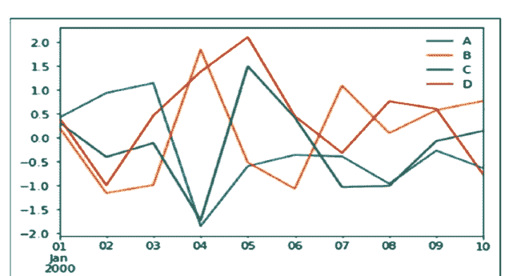

**图 14.1：** 基础绘图

如果索引由日期组成，它会调用**get().autofmt_xdate()**来格式化x轴，如上图所示。

我们可以使用**x**和**y**关键字来绘制一列对另一列的图。
绘图方法允许使用除默认折线图之外的少数几种绘图样式。
这些方法可以作为`kind`关键字参数提供给**plot()**。这些包括：

- bar或barh用于条形图
- hist用于直方图
- box用于箱线图
- 'area'用于面积图
- 'scatter'用于散点图

#### 14.1.1 条形图

现在让我们通过创建一个条形图来看看它是什么。条形图可以通过以下方式创建。

#### 示例

```python
import pandas as pd
import numpy as np
df = pd.DataFrame(np.random.rand(10,4), columns=['a','b','c','d'])
df.plot.bar()
```

其**输出**如下：

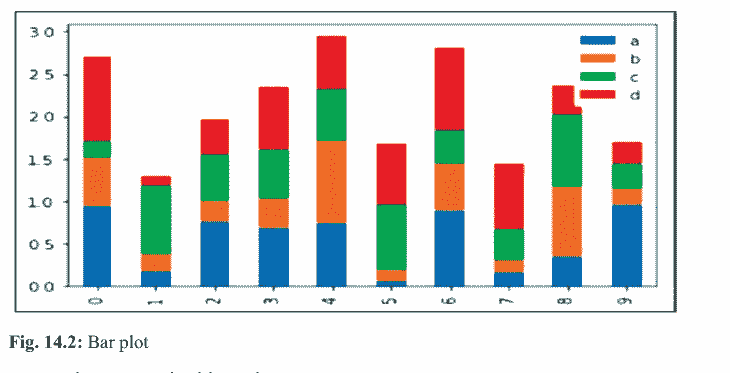

**图 14.2：** 条形图

要生成堆叠条形图，**请传递`stacked=True`**。

#### 示例

```python
import pandas as pd
df = pd.DataFrame(np.random.rand(10,4), columns=['a','b','c','d'])
df.plot.bar(stacked=True)
```

其**输出**如下：

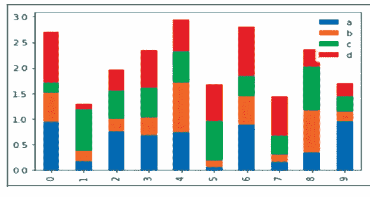

**图 14.3：** 条形图

要获得水平条形图，请使用**barh**方法。

#### 示例

```python
import pandas as pd
import numpy as np
df = pd.DataFrame(np.random.rand(10,4), columns=['a','b','c','d'])
df.plot.barh(stacked=True)
```

其**输出**如下：

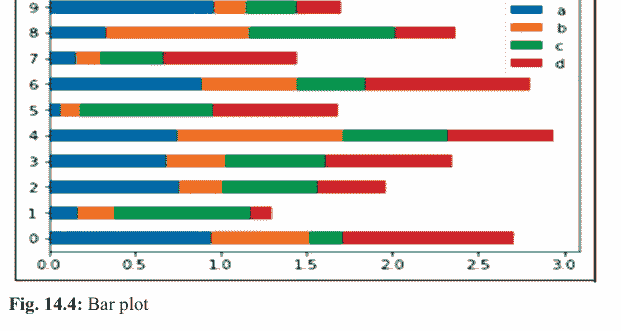

**图 14.4：** 条形图

#### 14.1.2 直方图

可以使用**plot.hist()**方法绘制直方图。我们可以指定分箱的数量。

#### 示例

```python
import pandas as pd
import numpy as np
df = pd.DataFrame({'a':np.random.randn(1000)+1, 'b':np.random.randn(1000), 'c':np.random.randn(1000)-1}, columns=['a', 'b', 'c'])
df.plot.hist(bins=20)
```

其**输出**如下：

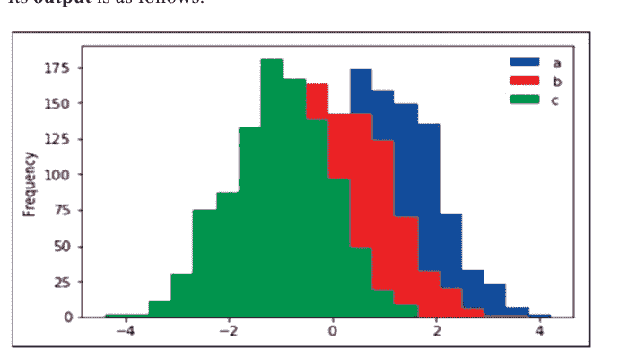

**图 14.5：** 直方图

要为每一列绘制不同的直方图，请使用以下代码。

#### 示例

```python
import pandas as pd
import numpy as np
df = pd.DataFrame({'a':np.random.randn(1000)+1, 'b':np.random.randn(1000), 'c':np.random.randn(1000)-1}, columns=['a', 'b', 'c'])
df.diff.hist(bins=20)
```

其**输出**如下：

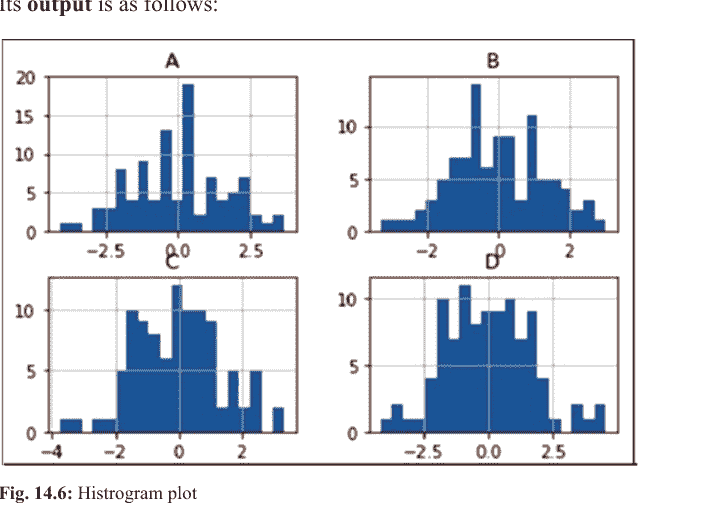

#### 14.1.3 箱线图

可以通过调用**Series.box.plot()**和**DataFrame.box.plot()**，或**DataFrame.boxplot()**来绘制箱线图，以可视化每列中值的分布。

例如，这是一个箱线图，表示在[0,1)上的均匀随机变量的10次观测的五次试验。

#### 示例

```python
import pandas as pd
import numpy as np
df = pd.DataFrame(np.random.rand(10, 5), columns=['A', 'B', 'C', 'D', 'E'])
df.plot.box()
```

其**输出**如下：

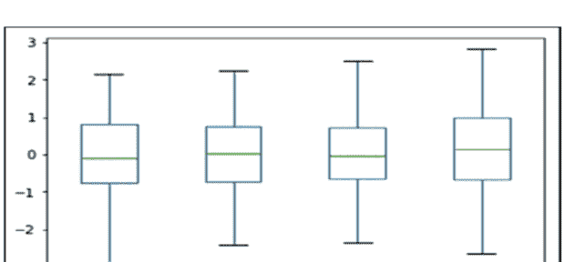

**图 14.7：** 箱线图

#### 14.1.4 面积图

可以使用**Series.plot.area()**或**DataFrame.plot.area()**方法创建面积图。

#### 示例

```python
import pandas as pd
import numpy as np
df = pd.DataFrame(np.random.rand(10, 4), columns=['a', 'b', 'c', 'd'])
df.plot.area()
```

其**输出**如下：

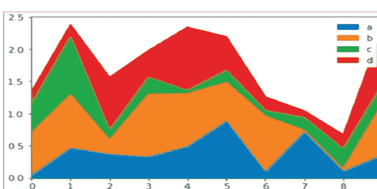

**图 14.8：** 面积图

#### 14.1.5 散点图

可以使用**DataFrame.plot.scatter()**方法创建散点图。

#### 示例

```python
import pandas as pd
import numpy as np
df = pd.DataFrame(np.random.rand(50, 4), columns=['a', 'b', 'c', 'd'])
df.plot.scatter(x='a', y='b')
```

其**输出**如下：

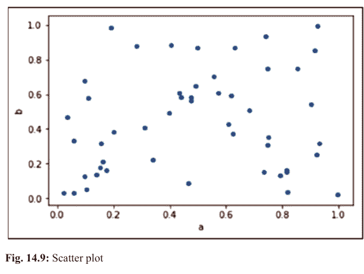

**图 14.9：** 散点图

#### 14.1.6 饼图

可以使用**DataFrame.plot.pie()**方法创建饼图。

#### 示例

```python
import pandas as pd
import numpy as np
df = pd.DataFrame(3 * np.random.rand(4), index=['a', 'b', 'c', 'd'], columns=['x'])
df.plot.pie(subplots=True)
```

其**输出**如下：

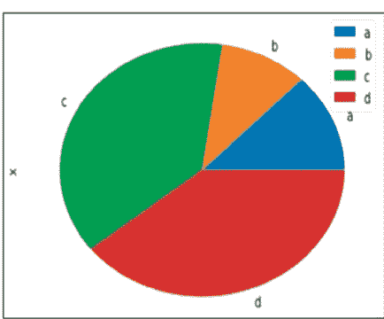

**图 14.10：** 饼图

# 15 数据可视化

### 15.1 数据可视化

数据可视化是信息和数据的图形化表示。通过使用不同的视觉元素，如图表、图形和地图。数据可视化工具提供了一种简单的方式来理解和查看数据以及相关的趋势/模式。

1. 有多种工具可用于数据可视化，我们可以使用它们来执行数据可视化。
2. 在Python中，我们可以使用一个名为“matplot”的库进行数据可视化。
3. 基于Python的绘图库“matplotlib”使我们能够生成2D以及3D图形，即图表/图形。
4. matplotlib的Pyplot接口用于表示2D图形。

### 15.2 如何安装Matplotlib

1. 以管理员权限打开“命令提示符”。
2. 在此处输入“python –m pip install matplotlib”并按回车键。
3. 如果此命令显示错误，则意味着您尚未将python设置为“path”变量。您需要设置路径（对此有不同的说明）。
4. 请注意，安装matplotlib库需要互联网连接。

### 15.3 Pyplot

1. Pyplot是用于数据可视化的一组命令式函数。它位于matplotlib库内部。
2. Pyplot接口提供了许多用于数据2D绘图的方法，我们可以使用这些方法绘制不同类型的2D图形/图表。我们可以使用pyplot方法（即plot()、bar()等）绘制不同类型的图形/图表。
3. 可以使用pyplot绘制多种类型的图表，如折线图、条形图、饼图、散点图、直方图等。
4. 要使用pyplot，我们需要导入matplotlib，这可以通过两种方式完成：
    - (i) Import matplotlib
    - (ii) Import matplotlib.pyplot as plt

### 15.4 折线图

折线图或折线图是一种图表类型，它将信息显示为一系列称为“标记”的数据点，这些数据点由直线段连接。

### 示例

```python
import matplotlib.pyplot
x = [2, 4, 6, 8, 10]
y = [5, 2, 6, 4, 8]
matplotlib.pyplot.plot(x, y)
matplotlib.pyplot.show()
```

#### 15.4.1 绘图自定义

在这里，我们讨论一些适用于几乎所有绘图的基本自定义。

#### 参数

- **color**：用于设置线条的颜色，此颜色可以是任何有效的颜色。
- **Markeredgecolor**：用于设置标记的颜色。此颜色可以是任何有效的颜色。

| 字符 | 颜色 |
|---|---|
| b | 蓝色 |
| g | 绿色 |
| r | 红色 |
| m | 品红色 |
| y | 黄色 |
| k | 黑色 |
| c | 青色 |
| w | 白色 |

```
# 线条样式属性
# 'solid', 'dashed', 'dashdot', 'dotted'
```

## 示例

```python
import matplotlib.pyplot as plt
x = [5, 10, 15, 20, 25]
y = [10, 14, 7, 15, 16]
plt.plot(x, y, color='r', marker='*',
         markeredgecolor='b', markersize=8, linewidth=10, linestyle='dotted')
plt.show()
```

输出：

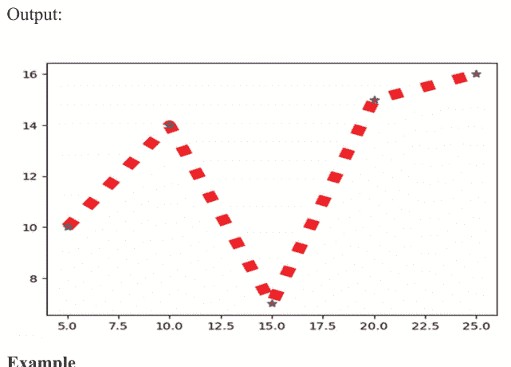

## 示例

```python
import matplotlib.pyplot as plt
# x 轴值
x = [1, 2, 3, 4, 5, 6]
# 对应的 y 轴值
y = [2, 4, 1, 5, 2, 6]
# 绘制点
plt.plot(x, y, color='green', linestyle='dashed', linewidth=3,
         marker='o', markerfacecolor='blue', markersize=12)
# 设置 x 和 y 轴范围
plt.ylim(1, 8)
plt.xlim(1, 8)
# 命名 x 轴
plt.xlabel('x - axis')
# 命名 y 轴
plt.ylabel('y - axis')
# 为图表添加标题
plt.title('Some cool customizations!')
# 显示图表的函数
plt.show()
```

输出

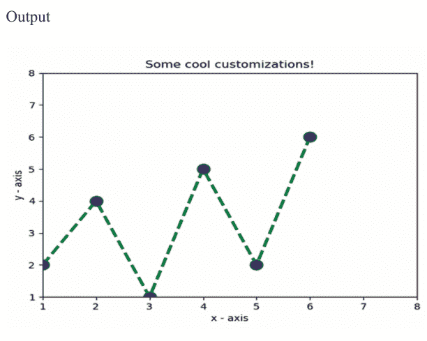

**注意：**

如你所见，我们进行了几项自定义设置，例如：

-   设置线宽、线型、线色。
-   设置标记、标记的填充颜色、标记的大小。
-   覆盖 x 和 y 轴的范围。如果不进行覆盖，pyplot 模块会使用自动缩放功能来设置轴的范围和比例。

### 15.5 在同一坐标轴上绘制多个图表

这里我们将看到如何在同一坐标轴内添加两个图表。

**示例**

```python
import matplotlib.pyplot as plt
import numpy as np
x = np.array([1, 2, 3, 4])
y = x * 2
# 使用 X 和 Y 数据绘制第一个图表
plt.plot(x, y)
x1 = [2, 4, 6, 8]
y1 = [3, 5, 7, 9]
# 使用 x1 和 y1 数据绘制第二个图表
plt.plot(x1, y1, '-.')
plt.xlabel("X-axis data")
plt.ylabel("Y-axis data")
plt.title('multiple plots')
plt.show()
```

输出

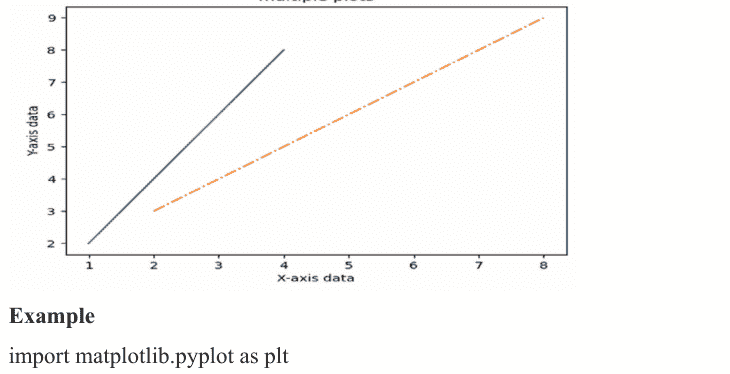

## 示例

```python
import matplotlib.pyplot as plt
# 第一条线的点
x1 = [1, 2, 3]
y1 = [2, 4, 1]
# 绘制第一条线的点
plt.plot(x1, y1, label="line 1")
# 第二条线的点
x2 = [1, 2, 3]
y2 = [4, 1, 3]
# 绘制第二条线的点
plt.plot(x2, y2, label="line 2")
# 命名 x 轴
plt.xlabel('x - axis')
# 命名 y 轴
plt.ylabel('y - axis')
# 为图表添加标题
plt.title('Two lines on same graph!')
# 在图表上显示图例
plt.legend()
# 显示图表的函数
plt.show()
```

输出

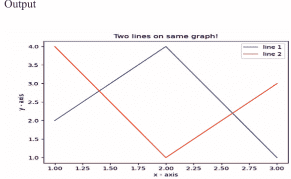

-   注意：这里，我们在同一图表上绘制了两条线。我们通过给它们一个名称（**标签**）来区分它们，该名称作为 `.plot()` 函数的参数传递。
-   提供有关线条类型及其颜色信息的小矩形框称为图例。我们可以使用 **.legend()** 函数为图表添加图例。

### 15.6 填充两个图表之间的区域

使用 **pyplot.fill_between()** 函数，我们可以填充同一图表中两个线图之间的区域。这将帮助我们理解基于特定条件的两个线图之间的数据差异。

## 示例

```python
import matplotlib.pyplot as plt
import numpy as np
x = np.array([1, 2, 3, 4])
y = x * 2
plt.plot(x, y)
x1 = [2, 4, 6, 8]
y1 = [3, 5, 7, 9]
plt.plot(x, y1, '-.')
plt.xlabel("X-axis data")
plt.ylabel("Y-axis data")
plt.title('multiple plots')
plt.fill_between(x, y, y1, color='green', alpha=0.5)
plt.show()
```

输出

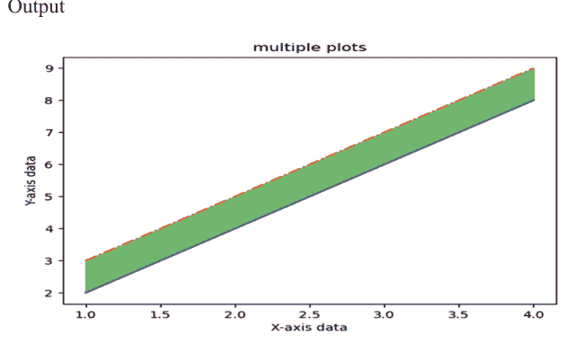

### 15.7 柱状图

柱状图或条形图是一种图表类型，它将信息显示为一系列具有高度和长度的矩形条。

## 示例

```python
import matplotlib.pyplot as plt
# 柱子左侧的 x 坐标
left = [1, 2, 3, 4, 5]
# 柱子的高度
height = [10, 24, 36, 40, 5]
# 柱子的标签
tick_label = ['one', 'two', 'three', 'four', 'five']
# 绘制柱状图
plt.bar(left, height, tick_label=tick_label,
        width=0.8, color=['red', 'green'])
# 命名 x 轴
plt.xlabel('x - axis')
# 命名 y 轴
plt.ylabel('y - axis')
# 图表标题
plt.title('My bar chart!')
# 显示图表的函数
plt.show()
```

输出

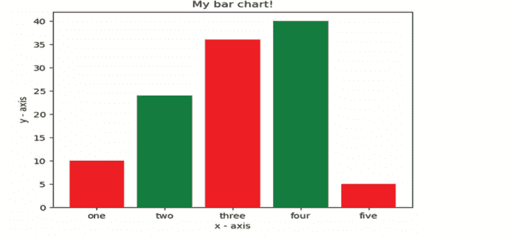

**注意**

-   这里，我们使用 **plt.bar()** 函数来绘制柱状图。
-   柱子左侧的 x 坐标与柱子的高度一起传递。
-   你也可以通过定义 **tick_labels** 来为 x 轴坐标指定一些名称。

### 15.8 饼图

饼图或饼形图是一种图表类型，其中圆被分成若干扇形，每个扇形代表整体的一部分。

**示例**

```python
import matplotlib.pyplot as plt
# 定义标签
activities = ['eat', 'sleep', 'work', 'play']
# 每个标签所占的部分
slices = [3, 7, 8, 6]
# 每个标签的颜色
colors = ['r', 'y', 'g', 'b']
# 绘制饼图
plt.pie(slices, labels=activities, colors=colors,
        startangle=90, shadow=True, explode=(0, 0, 0.1, 0),
        radius=1.2, autopct='%1.1f%%')
# 绘制图例
plt.legend()
# 显示图表
plt.show()
```

输出

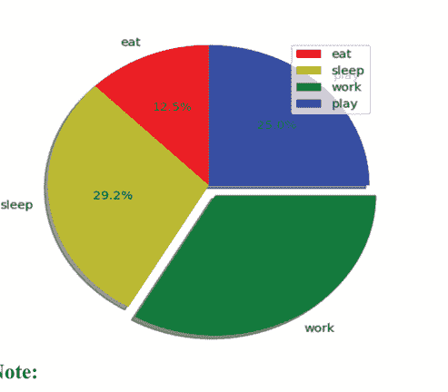

**注意：**

-   这里，我们使用 **plt.pie()** 方法绘制饼图。
-   首先，我们使用一个名为 **activities** 的列表定义 **标签**。
-   然后，每个标签的部分可以使用另一个名为 **slices** 的列表来定义。
-   每个标签的颜色使用一个名为 **colors** 的列表来定义。
-   **shadow = True** 将在饼图中每个标签下方显示阴影。
-   **startangle** 将饼图的起始位置从 x 轴逆时针旋转给定的度数。
-   **explode** 用于设置每个扇形偏移的半径比例。
-   **autopct** 用于格式化每个标签的值。这里，我们将其设置为仅显示小数点后一位的百分比值。

### 15.9 直方图

直方图是使用不同高度的条形来显示数据的图形。在直方图中，每个条形将数字分组到不同的范围中。更高的条形表示有更多数据落在该范围内。

## 示例

```python
import matplotlib.pyplot as plt
# 频率
ages = [2, 5, 70, 40, 30, 45, 50, 45, 43, 40, 44,
        60, 7, 13, 57, 18, 90, 77, 32, 21, 20, 40]
# 设置范围和区间数
range = (0, 100)
bins = 10
# 绘制直方图
plt.hist(ages, bins, range, color='green',
         histtype='bar', rwidth=0.8)
# x 轴标签
plt.xlabel('age')
# 频率标签
plt.ylabel('No. of people')
# 图表标题
plt.title('My histogram')
# 显示图表的函数
plt.show()
```

输出

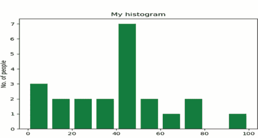

## 注意

-   这里，我们使用 **plt.hist()** 函数来绘制直方图。
-   频率作为 **ages** 列表传递。
-   范围可以通过定义一个包含最小值和最大值的元组来设置。
-   下一步是“分箱”值的范围——即将整个值范围划分为一系列区间——然后计算有多少值落入每个区间。这里我们定义了 **bins** = 10。因此，总共有 100/10 = 10 个区间。

### 15.10 散点图

-   这里，我们使用 **plt.scatter()** 函数来绘制散点图。
-   与折线图一样，我们在这里也定义 x 和对应的 y 轴值。
-   **marker** 参数用于设置用作标记的字符。其大小可以使用 **s** 参数来定义。

## 示例

```python
import matplotlib.pyplot as plt
# x 轴值
x = [1, 2, 3, 4, 5, 6, 7, 8, 9, 10]
# y 轴值
y = [2, 4, 5, 7, 6, 8, 9, 11, 12, 12]
# 将点绘制为散点图
plt.scatter(x, y, label="stars", color="green",
            marker="*", s=30)
# x 轴标签
plt.xlabel('x - axis')
# 频率标签
plt.ylabel('y - axis')
# 图表标题
plt.title('My scatter plot!')
# 显示图例
plt.legend()
# 显示图表的函数
plt.show()
```

输出

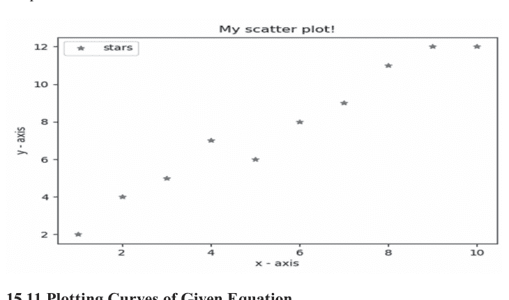

### 15.11 绘制给定方程的曲线

这里，我们使用 **NumPy**，它是 Python 中的一个通用数组处理包。

-   要设置 x 轴值，我们使用 **np.arange()** 方法，其中前两个参数用于范围，第三个参数用于步长增量。结果是一个 NumPy 数组。
-   要获得对应的 y 轴值，我们只需在 NumPy 数组上使用预定义的 **np.sin()** 方法。
-   最后，我们通过将 x 和 y 数组传递给 **plt.plot()** 函数来绘制点。

## 示例

```python
# 导入所需模块
import matplotlib.pyplot as plt
import numpy as np
# 设置 x 坐标
x = np.arange(0, 2 * (np.pi), 0.1)
# 设置对应的 y 坐标
y = np.sin(x)
# 绘制点
plt.plot(x, y)
# 显示图表的函数
plt.show()
```

### 15.12 子图

当我们想在同一图形中显示两个或更多图表时，就需要使用子图。我们可以通过两种略有不同的方法来实现。

## 方法 1

```python
# importing required modules
import matplotlib.pyplot as plt
import numpy as np
# function to generate coordinates
def create_plot(ptype):
    # setting the x-axis values
    x = np.arange(-10, 10, 0.01)
    # setting the y-axis values
    if ptype == 'linear':
        y = x
    elif ptype == 'quadratic':
        y = x**2
    elif ptype == 'cubic':
        y = x**3
    elif ptype == 'quartic':
        y = x**4
    return(x, y)
# setting a style to use
plt.style.use('fivethirtyeight')
# create a figure
fig = plt.figure()
# define subplots and their positions in figure
plt1 = fig.add_subplot(221)
plt2 = fig.add_subplot(222)
plt3 = fig.add_subplot(223)
plt4 = fig.add_subplot(224)
# plotting points on each subplot
x, y = create_plot('linear')
plt1.plot(x, y, color ='r')
plt1.set_title('$y_1 = x$')
x, y = create_plot('quadratic')
plt2.plot(x, y, color ='b')
plt2.set_title('$y_2 = x^2$')
x, y = create_plot('cubic')
plt3.plot(x, y, color ='g')
plt3.set_title('$y_3 = x^3$')
x, y = create_plot('quartic')
plt4.plot(x, y, color='k')
plt4.set_title('$y_4 = x^4$')
# adjusting space between subplots
fig.subplots_adjust(hspace=.5,wspace=0.5)
# function to show the plot
plt.show()
```

输出

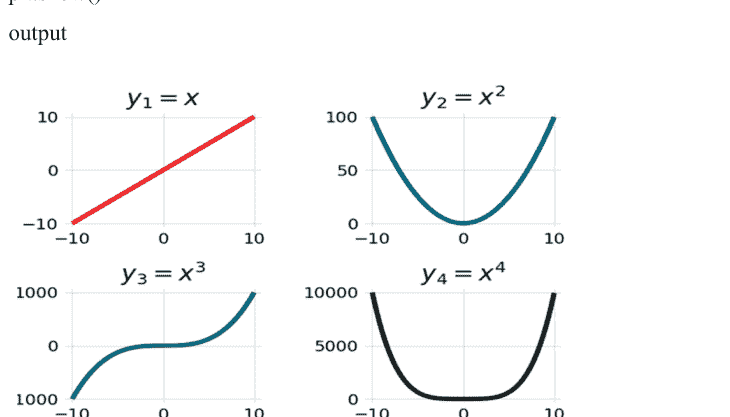

## 方法 2

```python
# importing required modules
import matplotlib.pyplot as plt
import numpy as np
# function to generate coordinates
def create_plot(ptype):
    # setting the x-axis values
    x = np.arange(0, 5, 0.01)
    # setting y-axis values
    if ptype == 'sin':
        # a sine wave
        y = np.sin(2*np.pi*x)
    elif ptype == 'exp':
        # negative exponential function
        y = np.exp(-x)
    elif ptype == 'hybrid':
        # a damped sine wave
        y = (np.sin(2*np.pi*x))*(np.exp(-x))
    return(x, y)
# setting a style to use
plt.style.use('ggplot')
# defining subplots and their positions
plt1 = plt.subplot2grid((11,1), (0,0), rowspan = 3, colspan = 1)
plt2 = plt.subplot2grid((11,1), (4,0), rowspan = 3, colspan = 1)
plt3 = plt.subplot2grid((11,1), (8,0), rowspan = 3, colspan = 1)
# plotting points on each subplot
x, y = create_plot('sin')
plt1.plot(x, y, label = 'sine wave', color ='b')
x, y = create_plot('exp')
plt2.plot(x, y, label = 'negative exponential', color = 'r')
x, y = create_plot('hybrid')
plt3.plot(x, y, label = 'damped sine wave', color = 'g')
# show legends of each subplot
plt1.legend()
plt2.legend()
plt3.legend()
# function to show plot
plt.show()
```

输出

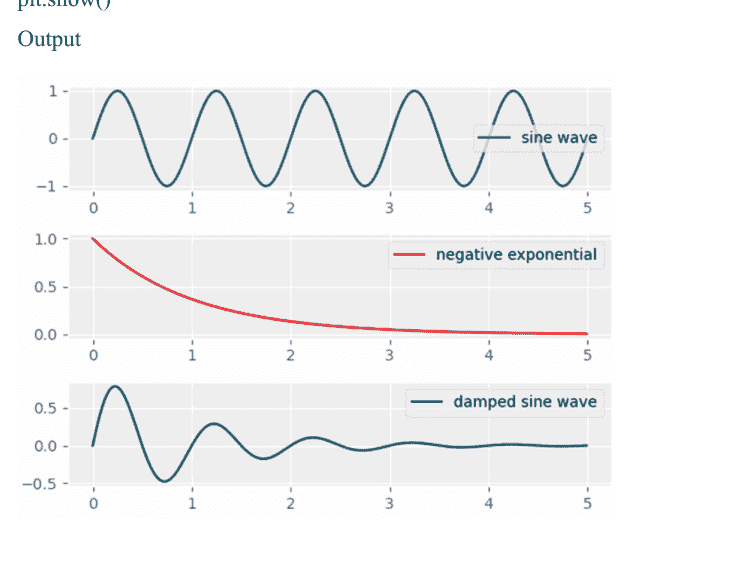

### 15.13 三维绘图

我们可以轻松地在 matplotlib 中绘制三维图形。现在，我们来讨论一些重要且常用的三维图。

- 绘制点

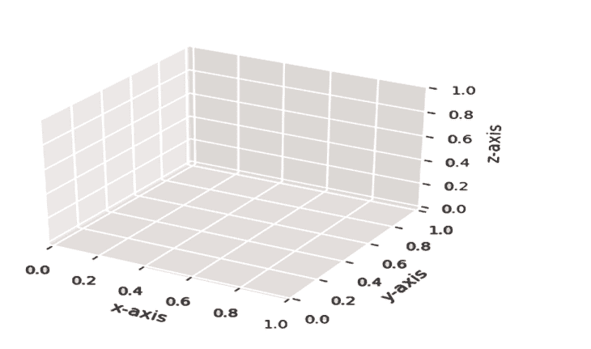

### 注意

- 让我们试着理解这段代码的一些重要方面。
    `from mpl_toolkits.mplot3d import axes3d`
    - 这是在三维空间中绘图所需的模块。
    `ax1 = fig.add_subplot(111, projection='3d')`
    - 这里，我们在图形上创建一个子图，并将 projection 参数设置为 3d。
    `ax1.scatter(x, y, z, c = 'm', marker = 'o')`
    - 现在我们使用 **.scatter()** 函数在 XYZ 平面上绘制点。
- 绘制线

### 示例

```python
# importing required modules
from mpl_toolkits.mplot3d import axes3d
import matplotlib.pyplot as plt
from matplotlib import style
import numpy as np
# setting a custom style to use
style.use('ggplot')
# create a new figure for plotting
fig = plt.figure()
# create a new subplot on our figure
ax1 = fig.add_subplot(111, projection='3d')
# defining x, y, z co-ordinates
x = np.random.randint(0, 10, size = 5)
y = np.random.randint(0, 10, size = 5)
z = np.random.randint(0, 10, size = 5)
# plotting the points on subplot
ax1.plot_wireframe(x,y,z)
# setting the labels
ax1.set_xlabel('x-axis')
ax1.set_ylabel('y-axis')
ax1.set_zlabel('z-axis')
plt.show()
```

输出

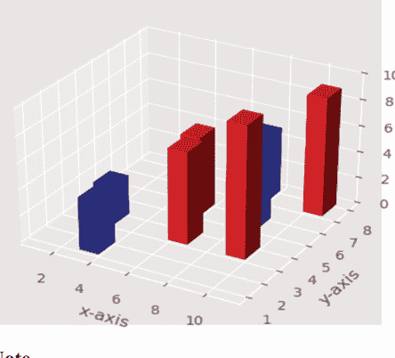

**注意**

- 让我们来梳理一下这个程序的重要部分：

    x = [1,2,3,4,5,6,7,8,9,10]

    y = [4,3,1,6,5,3,7,5,3,7]

    z = np.zeros(10)

- 这里，我们定义了条形图的基底位置。设置 z = 0 意味着所有条形都从 XY 平面开始。

```python
dx = np.ones(10) # length along x-axis
dy = np.ones(10) # length along y-axis
dz = [1,3,4,2,6,7,5,5,10,9] # height of bar
```

- dx, dy, dz 表示条形的尺寸。将条形视为一个长方体，那么 dx, dy, dz 分别是它在 x、y、z 轴上的延伸长度。

```python
for h in dz:
    if h > 5:
        color.append('r')
    else:
        color.append('b')
```

- 这里，我们将每个条形的颜色设置为一个列表。颜色方案是：高度大于 5 的条形为红色，否则为蓝色。

```python
ax1.bar3d(x, y, z, dx, dy, dz, color = color)
```

- 最后，为了绘制条形图，我们使用 .bar3d() 函数。
- 绘制曲线

### 示例

```python
# importing required modules
from mpl_toolkits.mplot3d import axes3d
import matplotlib.pyplot as plt
from matplotlib import style
import numpy as np
# setting a custom style to use
style.use('ggplot')
# create a new figure for plotting
fig = plt.figure()
# create a new subplot on our figure
ax1 = fig.add_subplot(111, projection='3d')
# get points for a mesh grid
u, v = np.mgrid[0:2*np.pi:200j, 0:np.pi:100j]
# setting x, y, z co-ordinates
x=np.cos(u)*np.sin(v)
y=np.sin(u)*np.sin(v)
z=np.cos(v)
# plotting the curve
ax1.plot_wireframe(x, y, z, rstride = 5, cstride = 5, linewidth = 1)
plt.show()
```

输出

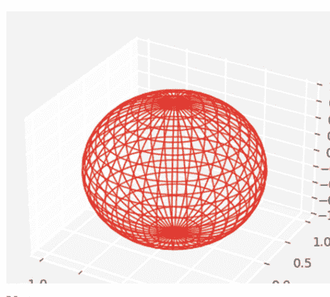

### 注意

- 这里，我们将一个球体绘制为网格。让我们来看一些重要的部分：

    u, v = np.mgrid[0:2*np.pi:200j, 0:np.pi:100j]

    - 我们使用 np.mgrid 来获取点，以便创建网格。你可以在这里阅读更多关于此的内容。

    x=np.cos(u)*np.sin(v)
    y=np.sin(u)*np.sin(v)
    z=np.cos(v)

    - 这不过是球体的参数方程。

    ax1.plot_wireframe(x, y, z, rstride = 5, cstride = 5, linewidth = 1)

    - 同样，我们使用 **.plot_wireframe()** 方法。这里，**rstride** 和 **cstride** 参数可用于设置网格的密集程度。

### 15.14 使用面向对象 API 的 Matplotlib 图形绘制

### 示例

```python
# importing matplotlib library
import matplotlib.pyplot as plt
# x axis values
x =[0, 5, 3, 6, 8, 4, 5, 7]
# y axis values
y =[5, 3, 6, 3, 7, 5, 6, 8]
# creating the canvas
fig = plt.figure()
# setting the size of canvas
axes = fig.add_axes([0, 0, 1, 1])
# plotting the graph
axes.plot(x, y, 'mo--')

# displaying the graph
plt.show()
```

输出：

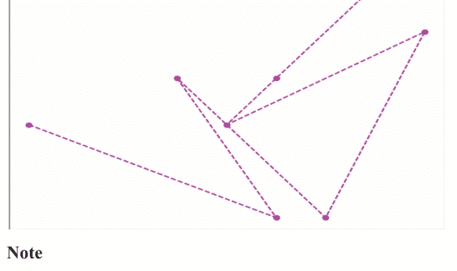

### 注意

第一个示例中一切都相当清楚，但有一点需要关注，“设置画布的大小”，这基本上意味着设置你想要绘制图形的图形的大小，语法如下。

```python
add_axes([left, bottom, width, height])
```

left、bottom、height 和 width 的值介于 0 到 1 之间。另一个例子会让你更清楚地理解这个概念。

### 示例

```python
# importing matplotlib library
import matplotlib.pyplot as plt
# x-axis values
x =[0, 1, 2, 3, 4, 5, 6]
# y-axis values
y =[0, 1, 3, 6, 9, 12, 17]
# creating the canvas
fig = plt.figure()
# setting size of first canvas
axes1 = fig.add_axes([0, 0, 0.7, 1])
# plotting graph of first canvas
axes1.plot(x, y, 'mo--')
# setting size of second canvas
axes2 = fig.add_axes([0.1, 0.5, 0.3, 0.3])
# plotting graph of second canvas
axes2.plot(x, y, 'go--')
# displaying both graphs
plt.show()
```

输出

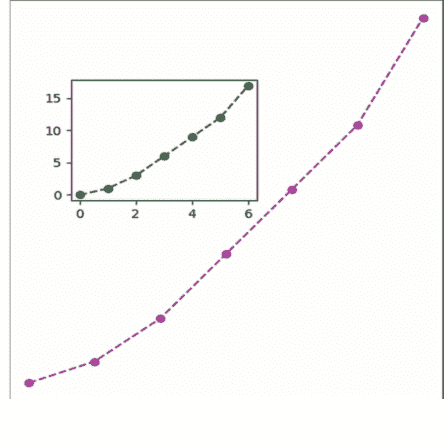

# 16 Python 中的面向对象编程

### 16.1 Python 中的面向对象编程

面向对象编程（OOP）是一种组织对象和数据的编程语言模型。

#### 16.1.1 什么是封装

如果同一个变量在两个不同的地方被重新定义，那么封装解决的问题就是，这意味着一个变量被设为私有，否则程序会产生错误。

#### 16.1.2 抽象

Python 中的抽象是隐藏应用程序真实实现、仅强调其使用的过程。例如，假设你买了一个新的电子设备。除了设备本身，你还会得到一份用户指南，指导如何使用该应用程序，但这份用户指南没有关于设备内部工作原理的信息。

另一个例子是，当你使用电视遥控器时，你不知道按下遥控器上的按键是如何在电视内部切换频道的。你只知道按下音量+键会增加音量。

#### 16.1.3 为什么我们需要抽象？

通过 Python 中的抽象过程，程序员可以隐藏应用程序所有不相关的数据/过程，以降低复杂性并提高效率。

#### 16.1.4 Python 中的继承

继承是一个类从另一个类派生或继承属性的能力。继承的好处是：

#### 16.1.5 Python中的多态

- 它意味着我们可以对不同类型使用相同的方法/函数名。
- 如果一个变量、对象或方法根据情况表现出不同的行为，就称为多态。

### 16.2 面向对象编程中的类

**类：** Python类是一组属性和方法的集合。
**什么是属性：** 属性由包含数据的变量表示。
**什么是方法：** 方法执行一个动作或任务。它类似于函数。
方法有三种类型：
(i) 实例方法 (ii) 类方法 (iii) 静态方法

#### 16.2.1 如何创建一个类

```python
语法1：

Class classname(object):
    def __init__(self):  #构造函数
        self.variable_name=value  #属性
        self.variable_name='value'
    def method_name(self):
        方法体

或者

Class classname(object):
    def __init__(self):  #构造函数
        self.variable_name=value  #属性
        self.variable_name='value'
    def method_name(self):
        方法体

语法2：

Class classname(object):
    def __init__(self):  #构造函数
        self.variable_name=value  #属性
        self.variable_name='value'
    def method_name(self):
        方法体
    def method_name(self, f1, f2):  #f1, f2是形参
        方法体

或者

Class classname:
    def __init__(self, f1, f2):  #构造函数 #f1, f2是形参
        self.variable_name=value  #属性
        self.variable_name='value'
    def method_name(self):
        方法体
    def method_name(self, f1, f2):  #f1, f2是形参
        方法体
```

**类：** `class`关键字用于创建一个类。

**对象：** `object`代表所有Python类的基类名。这个类本身也派生自`object`类。这是可选的。

**__init__()：** 这个方法用于初始化变量。这是一个特殊方法。我们不会显式调用这个方法。

**Self：** `self`是一个变量，它指向当前的类实例/对象。

### 示例

```python
class computer:
    def feature(self):  #self作为指针，它会自动获取对象
        print("i5,8gb,1tb")
com1=computer()  #对象，意味着获取制造计算机的原材料
com2=computer()
computer.feature(com1) #第一种参数传递方法，这为计算机赋予最终形态
com2.feature()  #第二种参数传递方法
```

**对象：** 对象是类类型的变量或类实例。要使用一个类，我们应该为该类创建一个对象。

语法：
对象名=类名()
对象名=类名(参数)
无参数示例

```python
Class Mobile:
    def __init__(self):
        self.model='RealMe X'
    def show_model(self):
        print('model:', self.model)
realme=Mobile()  #对象调用
```

注意：
realme=Mobile()
realme.model # 方法调用

- 在堆上分配一块内存。分配内存的大小由类（Mobile）中可用的属性和方法决定。
- 分配内存后，特殊方法`__init__()`在内部被调用。这个方法将初始数据存储到变量中。
- 实例的已分配内存地址被返回到对象（realMe）中。
- 内存地址被传递给`self`。

#### 16.2.2 使用对象访问类成员

我们可以使用对象或类的实例来访问类的变量和方法。
语法：
对象名.方法名 #方法调用
对象名.方法名(参数列表)

**Self：** `self`是一个默认变量，它包含当前对象的内存地址。这个变量用于引用所有实例变量和方法。

### 带参数的示例

```python
Class Mobile:
    def __init__(self, m):
        self.model=m
    def show_model(self):
        print('model:', self.model)
realme=Mobile('RealMe X')  #对象调用
```

#### 16.2.3 Python中的构造函数

- Python支持一种特殊类型的方法，称为构造函数，用于初始化类的实例变量。
- 构造函数在创建实例时只被调用一次。
- 如果为一个类创建了两个实例，构造函数将为每个实例调用一次。

### 无参数的构造函数示例

```python
Class Mobile:
    def __init__(self):
        self.model='RealMe X'
realme=Mobile()  #对象调用
```

### 带参数的构造函数示例

```python
Class Mobile:
    def __init__(self, m):
        self.model=m

realme=Mobile('RealMe X')  #对象调用
```

### 变量的类型

(i) 实例变量 (ii) 类变量或静态变量

### 实例变量示例

```python
class computer:
    def __init__(self,ram,hd): #用于定义实例变量或在函数内定义值
        self.ram=ram
        self.hd=hd
    def feature(self): #self作为指针，它会自动获取对象，这个方法是实例方法
        print("your computer config is:",self.ram,self.hd)
com1=computer("8gb","1tb")  #对象，意味着获取制造计算机的原材料
com2=computer("16gb", "2tb")
computer.feature(com1) #第一种参数传递方法，这为计算机赋予最终形态
com2.feature() #第二种参数传递方法
```

#### 16.2.4 访问实例变量

要使用实例方法访问实例变量，我们需要以`self`作为第一个参数的实例方法，然后我们可以使用`self.变量名`来访问实例变量。

### 示例

```python
Class Mobile:
    def __init__(self):
        self.model='RealMe X'   #实例变量
    def show_model(self):   #实例方法
        self.model   #访问实例变量
realme=Mobile()   #对象调用
```

### 在类外部

我们可以使用`对象名.变量名`来访问实例变量。

```python
Class Mobile:
    def __init__(self):
        self.model='RealMe X'   #实例变量
    def show_model(self):   #实例方法
        print(self.model)   #在类内部访问实例变量
realme=Mobile()   #对象调用
realme.model   #在类外部访问实例变量
```

### 示例

```python
class computer:
    def __init__(self,ram,hd,pro):
        self.ram=ram
        self.hd=hd
        self.pro="i5"
    def feature(self):   #self作为指针，它会自动获取对象，这个方法是实例方法
        print("your computer config is:",self.ram,self.hd,self.pro)
com1=computer("8gb","1tb",pro="i6")   #对象，意味着获取制造计算机的原材料
com2=computer("16gb","2tb",pro="i5")
com1.pro="i6"
computer.feature(com1) #第一种参数传递方法，这为计算机赋予最终形态
com2.feature() #第二种参数传递方法
```

**注意：** `init`函数会自动调用。

注意，只使用实例变量的方法称为实例方法。这种类型的方法不使用类变量或静态变量。

#### 16.2.5 类变量/静态变量

类变量是其单一副本可供类的所有实例使用的变量。如果我们修改实例中类变量的副本，它将影响其他实例中的所有副本。

### 示例

```python
Class mobile:
    fp='yes'    #类变量
    def __init__(self):
        self.model='realme x'
    def show_model(self):
        print(self.model)
realme=mobile()
```

#### 16.2.6 访问类/静态变量

使用类方法

要访问类变量，我们需要以`cls`作为第一个参数的类方法，然后我们可以使用`cls.变量名`来访问类变量。

### 示例

```python
Class mobile:
    fp='yes'    #类变量
    def __init__(self):
        self.model='realme x'
    def show_model(self):
        print(self.model)
    @classmethod    #类方法
    def is_fp(cls):
        cls.fp    #在类方法内部访问类变量
realme=mobile()
```

## 使用类方法

我们可以通过类名.变量名的方式访问类变量。

## 示例

```python
class mobile:
    fp='yes'    #类变量
    def __init__(self):
        self.model='realme x'
    def show_model(self):
        print(self.model)
    @classmethod    #类方法
    def is_fp(cls):
        cls.fp    #在类方法内部访问类变量
realme=mobile()
mobile.fp    #在类外部访问类变量
```

**注意：** 类变量是其单一副本可供类的所有实例使用的变量。如果我们修改实例中类变量的副本，它将影响其他实例中的所有副本。

## 示例

```python
class mobile:
    fp='yes'
    def __init__(self):
        self.model='realme x'
    def show_model(self):
        print(self.model)
    @classmethod
    def show_model(cls):
        print("Fingerprint:",cls.fp) #在类方法内部访问类变量
realme=mobile()
realme.show_model()
mobile.is_fp
print()
mobile.fp='No' #在方法外部更改类值
mobile.is_fp
```

## 多对象示例

```python
class mobile:
    fp='yes'
    @classmethod
    def show_model(cls):
        print("Fingerprint:",cls.fp) #在类方法内部访问类变量
realme=mobile()
redmi=mobile()
geek=mobile()
print("RealMe:", mobile.fp)
print("Remi:", mobile.fp)
print("geek:", mobile.fp)
print()
mobile.fp='No' #在方法外部更改类值
print("RealMe:", mobile.fp)
print("Remi:", mobile.fp)
print("geek:", mobile.fp)
```

## 类方法

类方法是作用于类变量或类的静态变量的方法。

装饰器 `@classmethod` 需要写在类方法上方。

默认情况下，类方法的第一个参数是 `cls`，它指向类本身。

语法：

```python
@classmethod
def method_name(cls): # 无参数的类方法
    方法体
```

示例

```python
class mobile:
    fp='yes'
    @classmethod
    def show_model(cls):
        print("Fingerprint:",cls.fp)
realme=mobile()
mobile.show_model() #无参数调用类方法
```

调用类方法
语法：类名.方法名()

带参数的类方法

```python
@classmethod
def method_name(cls,f1,f2): # 带参数的类方法
    方法体
```

示例

```python
class mobile:
    fp='yes'
    @classmethod
    def show_model(cls,r):
        cls.ram=r
        print("Fingerprint:",cls.fp)
        print("RAM:",cls.ram)
realme=mobile()   #对象
mobile.show_model('4GB')  #无参数调用类方法
```

## 调用类方法

语法：类名.方法名(实际参数)

访问类/静态变量

**使用类方法：** 要访问类变量，我们需要以 `cls` 作为第一个参数的类方法，然后我们可以使用 `cls.变量名` 来访问类变量。

### 16.3 Python编程中的命名空间

在Python中，命名空间表示一个内存块，其中名称被映射到对象。

**类命名空间** - 一个类维护自己的命名空间，称为类命名空间。在类命名空间中，名称被映射到类变量。

**实例命名空间** - 每个实例都有自己的命名空间，称为实例命名空间。在实例命名空间中，名称被映射到实例变量。

```python
class mobile:
    fp='yes'  #类变量
realme=mobile()
redmi=mobile()
geek=mobile()
mobile.fp    #yes
realme.fp   #yes
redmi.fp    #yes
geek.fp     #yes
```

**注意：** 如果使用类名和类变量更改任何值，则会影响实例对象和类命名空间两者，例如

```python
mobile.fp='no'
mobile.fp   #no
realme.fp   #no
redmi.fp    #no
geek.fp     #no
```

但如果使用类变量和实例名称进行更改，则仅影响单个对象，例如。

```python
realme.fp='not working'
mobile.fp   #no
realme.fp   # not working
redmi.fp    #no
geek.fp     #no
```

### 16.4 方法类型

#### 16.4.1 实例方法

实例方法是作用于类的实例变量的方法。实例方法需要知道实例的内存地址，该地址通过默认作为实例方法第一个参数的 *self* 变量提供。

语法：无参数
```python
def method_name(self):
    函数体
```

语法：带参数
```python
def method_name(self, f1, f2):
    函数体
```

### 无参数调用实例方法

实例方法绑定到类的对象，因此我们使用对象名称调用实例方法。

语法：对象名.方法名()

```python
class Mobile:
    def __init__(self):
        self.model='RealMe X'  #实例变量
    def show_model(self):  #实例方法
        self.model  #在实例方法内部访问实例变量
realme=Mobile()  #对象调用
realme.show_model()  # 无参数调用实例方法
```

语法：带参数调用实例方法
语法：对象名.方法名(实际参数)

## 示例

```python
class Mobile:
    def __init__(self):
        self.model='RealMe X'  #实例变量
    def show_model(self,p):  #实例方法
        self.price=p # 实例变量
        print(self.model, self.price)
realme=Mobile()  #对象调用
realme.show_model(1000)  # 无参数调用实例方法
```

(i) 访问器方法 (ii) 修改器方法

#### 16.4.2 访问器方法

此方法用于访问或读取变量的数据。此方法不修改变量中的数据。这被称为getter方法。

语法：
```python
def get_value(self):
def get_result(self):
```

## 示例

```python
class Mobile:
    def __init__(self):
        self.model='RealMe X'  #实例变量
    def get_model(self):  #实例方法
        return self.model
realme=Mobile()  #对象调用
m=realme.get_model()
```

#### 16.4.3 修改器方法

此方法用于访问或读取并修改变量的数据。此方法修改变量中的数据。这也被称为setter方法。

语法：

```python
def set_value(self):
def set_result(self):
```

## 示例

```python
class Mobile:
    def __init__(self):
        self.model='RealMe X'  #实例变量
    def set_model(self):  #实例方法
        self.model='RealMe 2'
realme=Mobile()  #对象调用
m=realme.set_model()
```

#### 16.4.4 类方法

- 类方法是作用于类变量或类的静态变量的方法。
- 装饰器 `@classmethod` 需要写在类方法上方。
- 默认情况下，类方法的第一个参数是 `cls`，它指向类本身。

语法：

```python
@classmethod
def method_name(cls):  # 无参数的类方法
    方法体
```

## 示例

```python
class mobile:
    fp='yes'
    @classmethod
    def show_model(cls):
        print("Fingerprint:",cls.fp)
realme=mobile()
mobile.show_model()  #无参数调用类方法
```

## 带参数调用类方法

## 示例

```python
class mobile:
    fp='yes'
    @classmethod
    def show_model(cls, r):
        cls.ram=r
        print(cls.fp, cls.ram)
realme=mobile()
mobile.show_model(101)  #带参数调用类方法
```

## 示例 类变量或静态变量和类方法

```python
class computer:
    name="dell" #类变量或静态变量
    def __init__(self,ram,hd,pro):
        self.ram=ram
        self.hd=hd
        self.pro="i5"
    def feature(self):  #self作为指针，它自动获取对象
        print("your computer config is:",self.ram,self.hd,self.pro)
    @classmethod    #类方法
    def company(cls):
        print("company name is:",cls.name)
com1=computer("8gb","1tb",pro="i6")  #对象，意味着获取制造计算机的原材料
com2=computer("16gb", "2tb",pro="i5")
com1.pro="i6"
computer.feature(com1) #第一种参数传递方法，这是为计算机提供最终形状
com2.feature()  #第二种参数传递方法
com2.company()  #调用类方法
```

#### 16.4.5 静态方法

当某些处理与类相关，但不需要类或其实例来执行任何工作时，使用静态方法。

当我们想从外部传递一些值并在方法中执行某些操作时，使用静态方法。

装饰器 `@staticmethod` 需要写在静态方法上方

#### 16.4.6 将一个类的成员传递给另一个类

```python
class student:
    #constructor
    def __init__(self, n, r):
        self.name = n
        self.roll = r
    #instance method
    def disp(self):
        print("student Name:", self.name)
        print("student Roll:", self.roll)

#user define class
class user:
    @staticmethod
    def show(s):
        print("user Name:", s.name)
        print("user Roll:", s.roll)
        s.disp()

#creating object of student class
stu = student('Rahul', 101)
user.show(stu)
```

#### 16.4.7 内部类

它指的是在类内部生成的类。

### 示例

```python
class a:
    def laptop(self):
        print("i5,1tb")
    class comname:
        def name(self):
            print("dell")

lap1 = a()  #constructor it means class name and ()
lap1.laptop()  #call function
lap2 = a.comname()  #call inner class
lap2.name()
```

### 单继承

### 示例

```python
class a:
    def feature1(self):
        print("feature of 1")
    def feature2(self):
        print("feature2 of a")

class b(a):
    def feature3(self):
        print("feature1 of b")
    def feature4(self):
        print("feature2 of b")

ob1 = b()
ob1.feature1()
```

注意：继承意味着从另一个类访问另一个类的值，这被称为继承。

### 多重继承

如果一个类派生自多个父类，则称为多重继承。

```python
class Father:
    def feature1(self):
        print("feature of 1")
    def feature2(self):
        print("feature2 of a")

class Mother:
    def feature3(self):
        print("feature1 of b")
    def feature4(self):
        print("feature2 of b")

class Son(Father, Mother):
    def feature5(self):
        print("feature1 of c")
    def feature6(self):
        print("feature2 of c")

ob1 = Son()
ob1.feature4()
```

### 16.5 多级继承

在多级继承中，类继承另一个派生类（子类）的特性。

### 示例

```python
class a:
    def feature1(self):
        print("feature of 1")
    def feature2(self):
        print("feature2 of a")

class b(a):
    def feature3(self):
        print("feature1 of b")
    def feature4(self):
        print("feature2 of b")

class c(b):
    def feature5(self):
        print("feature1 of c")
    def feature6(self):
        print("feature2 of c")

ob1 = c()
ob1.feature1()
```

### 16.6 继承中的构造函数

默认情况下，父类中的构造函数对子类是可用的。

### 使用 init 方法的示例

```python
class a:
    def __init__(self):  #constructor method
        print("hii")
    def feature1(self):
        print("feature of 1")
    def feature2(self):
        print("feature2 of a")

class b(a):
    def feature3(self):
        print("feature1 of b")
    def feature4(self):
        print("feature2 of b")

ob1 = b()
ob1.feature1()
```

#### 16.6.1 构造函数重写

如果我们在两个类中都编写了构造函数，父类和子类，那么父类的构造函数对子类将不可用。

在这种情况下，只有子类的构造函数是可访问的，这意味着子类的构造函数替换了父类的构造函数。这个概念被称为构造函数重写。

### 示例

```python
class Father:
    def __init__(self):
        self.money = 2000
        print("Father class constructor")

class Son(Father):
    def __init__(self):
        self.money = 5000
        print("son class constructor")
    def disp(self):
        print(self.money)

s = Son()
s.disp()
```

#### 16.6.2 使用 Super() 方法的构造函数

- 如果我们在两个类中都编写了构造函数，父类和子类，那么父类的构造函数对子类将不可用。
- 在这种情况下，只有子类的构造函数是可访问的，这意味着子类的构造函数替换了父类的构造函数。这个概念被称为构造函数重写。
- **super()** 方法用于从子类调用父类的构造函数或方法。

### super 使用命令示例

```python
class a:
    def __init__(self):  #constructor method
        print("hii")
    def feature1(self):
        print("feature1 of a")
    def feature2(self):
        print("feature2 of a")

class b(a):
    def __init__(self):  #constructor method
        print("bye")
        super().__init__()  #this command use for calling init function inheritance
    def feature3(self):
        print("feature1 of b")
        super().feature1()
    def feature4(self):
        print("feature2 of b")

ob1 = b()
ob1.feature3()
```

#### 16.6.3 方法解析顺序

在多重继承场景中，类的成员首先在当前类中搜索。如果未找到，搜索将继续深入父类，以深度优先、从左到右的方式进行，且不会重复搜索同一个类。

- 在进入父类之前，先搜索子类。
- 当一个类从多个类继承时，它会按照从左到右的顺序在父类中搜索。
- 它不会多次访问任何类，这意味着继承层次结构中的每个类只会被遍历一次。

### 示例

```python
class a:
    def __init__(self):  #constructor method
        print("hii")
    def feature1(self):
        print("feature1 of a")
    def feature2(self):
        print("feature2 of a")

class c:
    def __init__(self):  #constructor method
        print("cc")
    def feature1(self):
        print("feature1 of c")
    def feature2(self):
        print("feature2 of c")

class b(a, c):
    def __init__(self):  #constructor method
        print("bye")
        super().__init__()
    def feature3(self):
        print("feature1 of b")
    def feature4(self):
        print("feature2 of b")

ob1 = b()
```

输出：
```
hii
bye
```

### 16.7 层次继承

当从单个基类创建多个派生类时，这种类型的继承称为层次继承。在这个程序中，我们有一个父（基）类和两个子（派生）类。

### 语法

```python
class ParentClassName(object):
    Members of parent class

class ChildClassName1(ParentClassName):
    Members of child class1

class ChildClassName2(ParentClassName):
    Members of child class2
```

### 示例

```python
class Father:
    def showF(self):
        print("Father class method")

class Son(Father):
    def showS(self):
        print("Son class method")

class Daughter(Father):
    def showD(self):
        print("Daughter class method")

s = Son()
s.showS()
s.showF()  #error
```

### 16.8 多态

如果一个变量、对象或方法根据情况表现出不同的行为，则称为多态。

- 鸭子类型
- 运算符重载

#### 16.8.1 鸭子类型

在 Python 中，我们遵循一个原则——“如果它走起来像鸭子，叫起来也像鸭子，那它就是一只鸭子”。这意味着 Python 不关心对象属于哪个类，只要它是一个对象，并且该对象具备所需的行为，它就能工作。对象的类型仅在运行时区分。这被称为鸭子类型。

Python 不关心对象属于哪个类，以便在对象上调用现有方法。如果该方法在对象上被定义，那么它就会被调用。

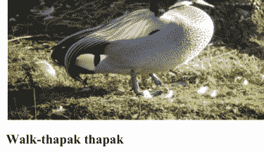

走-嗒嗒 嗒嗒


走-哒哒 哒哒

## 示例

```python
class duck:
    def walk(self):
        print("thapak thapak")
class horse:
    def walk(self):
        print("tabdak tabdak")
def myfunction(obj):
    obj.walk()
d=duck()
myfunction(d)
```

#### 16.8.2 强类型

我们可以检查传递给方法的对象是否具有被调用的方法。

`hasattr()` 函数用于检查对象是否具有某个方法。
语法：`hasattr(object, attribute)`
其中 `attribute` 可以是方法或变量。如果在对象中找到该属性，则此方法返回 `True`，否则返回 `False`。

## 示例

```python
class duck:
    def walk(self):
        print("thapak thapak")
class horse:
    def walk(self):
        print("tabdak tabdak")
class Cat:
    def talk(self):
        print("Meow Meow")
def myfunction(obj):
    if hasattr(obj, 'walk'):
        obj.walk()
d=duck()
myfunction(d)
c=Cat()
myfunction(c)
```

#### 16.8.3 面向对象编程中的方法重写

如果我们在父类和子类中都编写了方法，那么父类的方法对子类将不可用。

在这种情况下，只有子类的方法是可访问的，这意味着子类的方法替换了父类的方法。

当程序员想要修改方法的现有行为时，会使用方法重写。

重写方法允许用户覆盖父类方法。

方法的名称在父类和子类中必须相同。

## 示例

```python
class first():
    def m(self): #方法名相同
        print("m method first class")
class second(first):
    def m(self): #方法名相同，这个概念称为重写
        print("m method second class")
ob1=second()
ob1.m()
ob1=first()
ob1.m()
```

注意：对象同时调用不同的类被称为多态

#### 16.8.4 Python 编程中的重载

当在同一个类中定义了多个同名方法时，这被称为方法重载。

在 Python 中，如果一个方法被编写成可以执行多个任务，它就被称为方法重载。

## 示例

```python
class myclass:
    def sum(self,a):
        print("1st sum method",a)
    def sum(self):
        print("2nd sum method")
obj=myclass()
obj.sum()
obj.sum(10)
```

输出：
2nd sum method

**注意：** 在 Python 中不执行重载。如果运行上面的程序，第二个输出会出现，而第一个输出会显示错误，因为最后一个函数的优先级更高。

# 17 Python 编程中的模块

### 17.1 模块

- 模块是包含 Python 定义和语句的文件。
- Python 模块（`.py` 文件）包含与特定任务相关的变量、类定义、语句和函数。拥有模块的主要特点是其内容可以在其他程序中重用，而无需重写或重新创建。
- 它们仅在 `import` 语句中首次遇到模块名时执行。

模块类型：

- 用户定义模块
- 内置模块

例如：`array`、`math`、`numpy`、`sys` 等。

#### 17.1.1 何时以及为何使用模块

- 假设你正在构建一个非常大的项目，将所有逻辑管理在一个文件中会非常困难，因此如果你想将相似的逻辑分离到单独的文件中，可以使用模块。
- 它不仅会分离你的逻辑，还会帮助你轻松调试代码，因为你知道哪个逻辑定义在哪个模块中。
- 当一个模块被开发出来后，它可以在任何需要该模块的程序中重用。

#### 17.1.2 Python 模块的结构

- a. 文档字符串：用于文档目的的三引号字符串
- b. 变量和常量
- c. 类：创建对象的模板/蓝图
- d. 对象：类的实例
- e. 语句：指令
- f. 函数：执行任务

**注意：** 函数在程序内使用，但模块使用 `import` 语句在任何程序中使用。

#### 17.1.3 创建模块

## 示例

```python
#addition.py
def add(a,b):
    c=a+b
    print(c)
```

## 如何使用

```python
import addition
addition.add(12,13)
```

## 导入模块

`import` 语句可以以两种形式使用

- a. `import <module_name>`
- b. `from <module_name> import <function_name>`
- c. `import module_name as alias_name`
- d. `from module_name import *`

如果我们想显示模块中的所有函数列表，那么我们使用 `dir()` 函数。这会显示所有函数及其变量。

**注意：** 模块可以导入其他模块。

#### 17.1.4 如何访问方法、函数、变量和类

使用模块名，你可以访问函数。

语法：`module_name.function_name()`

## 示例

```python
addition.add(12,13)
```

### 17.2 Python 编程中的包

一个包可以有一个或多个模块，这意味着一个包是模块和包的集合。

一个包可以包含包。

包不过是一个目录/文件夹。


#### 17.2.1 创建包

包不过是一个目录/文件夹，它必须包含一个名为 `__init__.py` 的特殊文件。

`__init__.py` 文件可以为空，它表示它包含的目录是一个 Python 包，因此可以像导入模块一样导入它。

如何导入包

`import packageName.moduleName`

## 示例

从单个包导入模块
Pack1 文件夹
```python
def display():
    print("this is display function in module1 ")
```
pack1 文件夹
```python
def show():
    print("this is show function in module2 ")
```

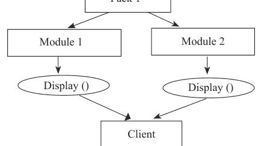

Pack2 文件夹

```python
import sys
sys.path.append("C:/Users/AGYA VERMA/PycharmProjects/myProject/pack1)
#方法1
import module1
import module2
module1.display()
module2.show()
#方法2
from module1 import*
from module2 import*
display()
show()
```

## 示例

从两个不同的包导入模块

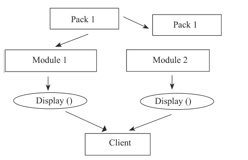

```python
import sys
sys.path.append("C:/Users/AGYA VERMA/PycharmProjects/myProject/demo1")
from module1 import*
sys.path.append("C:/Users/AGYA VERMA/PycharmProjects/myProject/demo1/demo2")
from module2 import*
module1.display()
module2.show()
```

## 如何访问变量、函数、方法、类等

`packageName.moduleName.functionName()`
`packageName.subpackageName.moduleName.functionName()`
或
`from packageName.moduleName import functionName()`
`from packageName.subpackageName.moduleName import functionName()`

### 17.3 抽象类

- 从属于 `abc` 模块的 `ABC` 类派生的类，在 Python 中被称为抽象类。
- `ABC` 类被称为元类，这意味着一个定义其他类行为的类。所以我们可以说，元类 `ABC` 定义了从它派生的类成为抽象类。
- 抽象类可以有抽象方法和具体方法。
- 抽象类需要被扩展，并且其方法需要被实现。
- PVM 不能创建抽象类的对象。

## 示例

```python
from abc import ABC, abstractmethod
class Father(ABC):
```

#### 17.3.1 抽象方法

抽象方法是一种其操作在子类中根据对象的需求重新定义的方法。

我们可以使用 `@abstractmethod` 装饰器将方法声明为抽象方法。

## 示例

```python
from abc import ABC, abstractmethod
class Father(ABC): #抽象类
    @abstractmethod
    def disp(self): #抽象方法
        pass
```

#### 17.3.2 具体方法

具体方法是指其行为在抽象类本身中定义的方法。

## 示例

```python
from abc import ABC, abstractmethod
class Father(ABC):  # abstract class
    @abstractmethod
    def disp(self):  # abstract method
        pass
    def show(self):  # concrete method
        print("concrete Method")
class child(Father):
    def disp(self):
        print("child class")
        print("defing abstract method")
c = child()
c.disp()
c.show()
```

## 规则

- PVM 无法创建抽象类的对象。
- 在抽象类中，不必将所有方法都声明为抽象方法。
- 抽象类可以同时拥有抽象方法和具体方法。
- 如果一个类中存在任何抽象方法，那么该类必须是抽象类。
- 抽象类的抽象方法必须在其子类/派生类中定义。
- 如果你继承了一个包含抽象方法的抽象类，你必须提供该方法的实现，或者将这个类也声明为抽象类。

## 何时使用抽象类

当所有对象都共享一些共同特征时，我们使用抽象类。

### 17.4 接口

在 Python 中，接口的概念不像其他语言（例如 Java）那样明确可用。

在 Python 中，接口是一个只包含抽象方法而不包含任何具体方法的抽象类。

## 示例

```python
from abc import ABC, abstractmethod
class Father(ABC):  # abstract class
    @abstractmethod
    def disp(self):  # abstract method
        pass
class child(Father):
    def disp(self):
        print("child class")
        print("defing abstract method")
c = child()
c.disp()
```

## 规则

- 接口的所有方法都是抽象的。
- 我们无法创建接口的对象。
- 如果一个类实现了某个接口，它必须定义该接口中给出的所有方法。
- 如果一个类没有实现接口中声明的所有方法，那么该类必须被声明为抽象类。

## 何时使用接口

当所有特征需要为不同对象进行不同实现时，我们使用接口。

### 17.5 Python 中的数据隐藏

我们在属性名前使用双下划线（__），这些属性就会对程序中的其他类隐藏。

a = 10  # public in the program
_a = 10  # protected
__a = 10  # private

## 示例

```python
class arv:
    __secretverma = 0  # data member is hiding by prefixing two__ it means private variable
    def verma(self):
        self.__secretverma += 1
        print(self.__secretverma)
obj = arv()
obj.verma()
obj.verma()
print(obj._arv__secretverma)  # you can access hide data member by object with using class
#print(obj.__secretverma)  # without using class name, object can not access hide data member and show
```

### 17.6 Python 中的错误

错误是程序中导致程序停止执行的问题。另一方面，当发生某些内部事件改变了程序的正常流程时，就会引发异常。

Python 中会发生两种类型的错误。

- 语法错误
- 逻辑错误（异常）

### 17.7 Python 中的异常

异常是一种运行时错误，可以由程序员处理。
在 Python 中，所有异常都表示为类。

#### 17.7.1 异常类型

(i) 内置异常：Python 语言中已经可用的异常。所有内置异常的基类是基础异常类。

(ii) 用户定义异常：程序员可以创建自己的异常，称为用户定义异常。

#### 17.7.2 异常处理的必要性

- 当异常发生时，程序会突然终止。
- 程序的突然终止可能会损坏程序。
- 异常可能导致数据库或文件中的数据丢失。

#### 17.7.3 异常处理

Try – try 块包含可能导致异常的代码。

语法：

```python
try:
    statement
```

Except- except 块用于捕获在 try 块中引发的异常。一个 try 块可以有多个 except 块。

语法：

```python
except Exception Name:
```

Else-当没有引发异常时，将执行此块。Else 块在 try 块之后执行。

语法：

```python
else:
    statement
```

Finally-无论是否有异常，此块都会执行。

语法：

```python
finally:
    statement
```

关于异常处理的一些要点

- 我们可以为一个 try 块编写多个 except 块。
- 我们可以编写多个 except 块来处理多个异常。
- 我们可以编写不带任何 except 块的 try 块。
- 我们不能编写没有 try 块的 except 块。
- Finally 块总是会执行，无论是否有异常。
- Else 块是可选的。
- Finally 块是可选的。

## 示例

```python
a = 10
b = 5
d = a / 0
print(d)
print('rest of the code')
```

输出：

exception error
zerodivisionerror: division by zero

注意：程序终止

处理异常

## 示例

```python
a = 10
b = 0
try:
    d = a / b
    print(d)
except:
    print("division by zero not allowed")
print('rest of code')
```

输出：

division by zero not allowed
rest of code

注意：这意味着程序没有终止

## 示例

```python
a = 10
b = 0
try:
    d = a / b
    print(d)
except:
    print("division by zero not allowed")
else:
    print('inside else')  # if exception occur then this line not run
finally:
    print('inside finally')  # this line always run
print('rest of code')
```

## 输出：

division by zero not allowed
inside finally
rest of code

#### 17.7.4 用户定义异常

程序员可以创建自己的异常，称为用户定义异常。

- 使用异常类作为基类创建异常类
- 引发异常
- 处理异常

#### 17.7.5 创建异常

我们可以通过创建内置异常类的子类来创建自己的异常：

语法：

```python
class MyException(exception):
    pass
```

```python
class MyException(Exception):
    def __init__(self, arg):
```

#### 17.7.6 引发异常

Raise 语句用于引发用户定义的异常。

语法：

```python
raise MyException(exception)
```

处理异常：使用 try 和 except 块，程序员可以处理异常。

语法：

```python
try:
    statement
except MyException as mye:
    statement
```

## 示例 用户定义异常的创建、引发和处理

```python
class BalanceException(Exception):
    pass
def checkbalance():
    money = 10000
    withdraw = 9000
    try:
        balance = money - withdraw
        if(balance <= 2000):
            raise BalanceException('Insuficent balance')  # raise exception
        print(balance)
    except BalanceException as be:
        print(be)
checkbalance()
```

输出：

Insuficent balance

## 18

## Python 库

### 18.1 库简介

此库包含用于各种类型功能的模块。Python 标准库中一些常用的模块有：

- (i) math 模块：提供数学函数以支持不同类型的计算。
- (ii) cmath 模块：提供用于复数的数学函数。
- (iii) random 模块：提供生成随机数的函数。
- (iv) statistics 模块：提供数学统计函数。
- (v) urllib 模块：提供 URL 处理函数，以便你可以从程序内部访问网站。

1. NumPy 库，提供一些高级数学功能以及创建和操作数值数组的工具。
2. Scipy 库，为科学计算提供算法和数学工具。
3. Tkinter 库，提供 Python 用户界面工具包，帮助你为不同类型的应用程序创建用户友好的 GUI。
4. Matplotlib 库，提供函数和工具，以多种格式（如绘图、图表、图形等）生成高质量输出。

#### 18.1.1 标准库简览

Python 中的 GUI 编程

你可能已经使用过很多应用程序。你在所有应用程序中观察到的一个共同点是，它们都有多个组件，如标签、用于输入的字段、按钮等。这些是构成 GUI（图形用户界面）的元素。

在本章中，我们将学习使用Python制作图形用户界面（GUI）。我们将了解Python为GUI编程提供的不同工具包。然后，我们将详细讨论最常用的模块之一——Tkinter。

让我们从了解Python提供的不同模块开始。

## 用于GUI编程的Python库

在Python中，我们可以使用以下任何工具包进行GUI编程。

- 1. Tkinter：Tkinter是Python中用于GUI编程的标准包。它建立在Tk接口之上。
- 2. PyQt：PyQt是Qt工具包的Python绑定工具包。Qt是一个C++框架，Python将其作为插件来实现跨平台的PyQt工具包。
- 3. wxPython：wxPython也是一个跨平台的GUI工具包。它是API wxWidgets的封装。

#### 18.1.2 Python Tkinter模块

Tkinter教程提供了Python Tkinter的基础和高级概念。本章专为初学者和专业人士设计。

Python提供了标准库Tkinter，用于为基于桌面的应用程序创建图形用户界面。

使用Python Tkinter开发基于桌面的应用程序并非复杂任务。可以通过以下步骤创建一个空的Tkinter顶级窗口。

- 1. 导入Tkinter模块。
- 2. 创建主应用程序窗口。
- 3. 向窗口添加小部件，如标签、按钮、框架等。
- 4. 调用主事件循环，以便在用户的计算机屏幕上执行操作。

## 示例

```python
from tkinter import *
root=Tk()
root.title("My First Window")
label=Label(root, font=("Ariel",45),text="enter your name",bg="yellow",fg="blue")
label.pack()
root.geometry("400x500+300+150")
root.resizable(0,0)
root.mainloop()
```

### 18.2 Tkinter小部件

有各种小部件，如按钮、画布、复选按钮、输入框等，用于构建Python GUI应用程序。

| 序号 | 小部件 | 描述 |
|---|---|---|
| 1 | Button（按钮） | Button用于向Python应用程序添加各种类型的按钮。 |
| 2 | Canvas（画布） | Canvas小部件用于在窗口上绘制画布。 |
| 3 | Checkbutton（复选按钮） | Checkbutton用于在窗口上显示复选按钮。 |
| 4 | Entry（输入框） | Entry小部件用于向用户显示单行文本字段。它通常用于接受用户输入的值。 |
| 5 | Frame（框架） | 它可以被定义为一个容器，其他小部件可以被添加到其中并进行组织。 |
| 6 | Label（标签） | 标签是用于显示关于其他小部件的一些消息或信息的文本。 |
| 7 | ListBox（列表框） | ListBox小部件用于向用户显示选项列表。 |
| 8 | Menubutton（菜单按钮） | Menubutton用于向用户显示菜单项。 |
| 9 | Menu（菜单） | 它用于向用户添加菜单项。 |
| 10 | Message（消息框） | Message小部件用于向用户显示消息框。 |
| 11 | Radiobutton（单选按钮） | Radiobutton与Checkbutton不同。这里，用户被提供多个选项，并且只能从中选择一个选项。 |
| 12 | Scale（滑块） | 它用于向用户提供滑块。 |
| 13 | Scrollbar（滚动条） | 它向用户提供滚动条，以便用户可以上下滚动窗口。 |
| 14 | Text（文本框） | 它与Entry不同，因为它向用户提供多行文本字段，以便用户可以在其中编写和编辑文本。 |
| 15 | Toplevel（顶级窗口） | 它用于创建一个单独的窗口容器。 |
| 16 | Spinbox（微调框） | 它是一个输入框小部件，用于从值选项中进行选择。 |
| 17 | PanedWindow（窗格窗口） | 它类似于一个容器小部件，包含水平或垂直窗格。 |
| 18 | LabelFrame（标签框架） | LabelFrame是一个容器小部件，充当容器 |
| 19 | MessageBox（消息框） | 此模块用于在基于桌面的应用程序中显示消息框。 |

### 18.3 Python Tkinter几何管理

Tkinter几何管理指定了小部件在屏幕上显示的方法。Python Tkinter提供以下几何管理方法。

- 1. pack()方法
- 2. grid()方法
- 3. place()方法

让我们详细讨论每一个。

#### 18.3.1 Python Tkinter Pack()方法

pack()小部件用于将小部件组织成块状。使用pack()方法添加到Python应用程序的小部件的位置可以通过方法调用中指定的各种选项来控制。

然而，控制较少，小部件通常以不太有序的方式添加。

使用pack()的语法如下。

语法：widget.pack(options)

可以在pack()中传递的可能选项列表如下。

- **expand**：如果expand设置为true，小部件将扩展以填充任何空间。
- **Fill**：默认情况下，fill设置为NONE。但是，我们可以将其设置为X或Y，以确定小部件是否包含任何额外空间。
- **side**：它表示小部件要放置在窗口上的父容器的哪一侧。

## 示例

```python
from tkinter import *

parent = Tk()

redbutton = Button(parent, text = "Red", fg = "red")
redbutton.pack( side = LEFT)

greenbutton = Button(parent, text = "Black", fg = "black")
greenbutton.pack( side = RIGHT )

bluebutton = Button(parent, text = "Blue", fg = "blue")
bluebutton.pack( side = TOP )
blackbutton = Button(parent, text = "Green", fg = "red")
blackbutton.pack( side = BOTTOM)
parent.mainloop()
```

## 输出

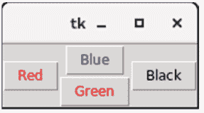

#### 18.3.2 Python Tkinter Grid()方法

grid()几何管理器以表格形式组织小部件。我们可以在方法调用中指定行和列作为选项。我们还可以指定小部件的列跨度（宽度）或行跨度（高度）。

这是将小部件放置到Python应用程序中更有序的方式。使用grid()的语法如下。

**语法：** widget.grid(options)

可以在grid()方法中传递的可能选项列表如下。

- **Column：** 小部件要放置的列号。最左边的列由0表示。
- **Columnspan：** 小部件的宽度。它表示列扩展到的列数。
- **ipadx, ipady：** 它表示在小部件边框内填充小部件的像素数。
- **padx, pady：** 它表示在小部件边框外填充小部件的像素数。
- **Row：** 小部件要放置的行号。最上面的行由0表示。
- **Rowspan：** 小部件的高度，即小部件扩展到的行数。
- **Sticky：** 如果单元格大于小部件，则使用sticky来指定小部件在单元格内的位置。它可能是表示小部件位置的sticky字母的串联。它可能是N、E、W、S、NE、NW、NS、EW、ES。

## 示例

```python
# !/usr/bin/python3
from tkinter import *
parent = Tk()
name = Label(parent,text = "Name").grid(row = 0, column = 0)
e1 = Entry(parent).grid(row = 0, column = 1)
password = Label(parent,text = "Password").grid(row = 1, column = 0)
e2 = Entry(parent).grid(row = 1, column = 1)
submit = Button(parent, text = "Submit").grid(row = 4, column = 0)
parent.mainloop()
```

## 输出

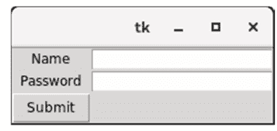

#### 18.3.3 Python Tkinter Place()方法

place()几何管理器将小部件组织到特定的x和y坐标。

语法：widget.place(options)

可能的选项列表如下。

- **Anchor：** 它表示小部件在容器内的确切位置。默认值（方向）是NW（左上角）。
- **bordermode：** 边框类型的默认值是INSIDE，表示忽略父容器的内部边框。另一个选项是OUTSIDE。
- **height, width：** 它指以像素为单位的高度和宽度。
- **relheight, relwidth**：它表示为0.0到1.0之间的浮点数，表示父容器高度和宽度的比例。
- **relx, rely**：它表示为0.0到1.0之间的浮点数，是水平和垂直方向的偏移量。
- **x, y**：它指以像素为单位的水平和垂直偏移量。

## 示例

```python
# !/usr/bin/python3
from tkinter import *
top = Tk()
top.geometry("400x250")
name = Label(top, text = "Name").place(x = 30,y = 50)
email = Label(top, text = "Email").place(x = 30, y = 90)
password = Label(top, text = "Password").place(x = 30, y = 130)
e1 = Entry(top).place(x = 80, y = 50)
e2 = Entry(top).place(x = 80, y = 90)
e3 = Entry(top).place(x = 95, y = 130)
top.mainloop()
```

## 输出

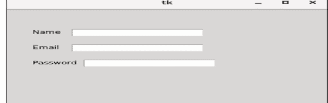

## 19 海龟图形

### 19.1 Python 海龟图形

海龟是 Python 的一个特色功能。使用海龟，我们可以轻松地在画板上绘图。

首先我们导入 turtle 模块。然后创建一个窗口，接着我们创建海龟对象，并使用海龟方法在画板上绘图。

### 19.2 一些海龟方法

| 方法 | 参数 | 描述 |
|---|---|---|
| Turtle() | 无 | 创建并返回一个新的海龟对象 |
| forward() | 距离 | 将海龟向前移动指定的距离 |
| backward() | 距离 | 将海龟向后移动指定的距离 |
| right() | 角度 | 将海龟顺时针转动 |
| left() | 角度 | 将海龟逆时针转动 |
| penup() | 无 | 抬起海龟的画笔 |
| pendown() | 无 | 放下海龟的画笔 |
| up() | 无 | 抬起海龟的画笔 |
| down() | 无 | 放下海龟的画笔 |
| color() | 颜色名称 | 更改海龟画笔的颜色 |
| fillcolor() | 颜色名称 | 更改海龟用于填充多边形的颜色 |
| heading() | 无 | 返回当前朝向 |
| position() | 无 | 返回当前位置 |
| goto() | x, y | 将海龟移动到位置 x,y |
| begin_fill() | 无 | 记住填充多边形的起始点 |
| end_fill() | 无 | 关闭多边形并用当前填充颜色填充 |
| dot() | 无 | 在当前位置留下一个点 |
| stamp() | 无 | 在当前位置留下一个海龟形状的印记 |
| shape() | 形状名称 | 应为 'arrow'、'classic'、'turtle' 或 'circle' |

#### 示例

```python
from turtle import *
t = Turtle()  #object in python
wn=Screen()
wn.title("my first graphic")
wn.bgcolor("yellow")  #color filling in window
t.shape("turtle")    #turtle shape given
t.color("red", "green")
t.speed(1)        #turtle speed given
t.begin_fill()
for i in range(4):
    t.forward(100)
    t.left(90)
t.penup()    #pen up
t.forward(200)
t.pendown()
for i in range(4):
    t.forward(100)
    t.left(90)
t.end_fill()
done()
```

## 20 标准库概览

### 20.1 Python 编程中的单元测试

测试特定单元是否正常工作的过程称为单元测试。单元测试检查应用程序中的小组件。

#### 示例

```python
def testsum1():
    assert sum([1,2,3])==6
def testsum2():
    assert sum([1,1,1])==6  #assertion error
testsum1()
testsum2()
```

#### 20.1.1 单元测试涉及的步骤

- (1) 从库中导入 unittest。
- (2) 创建一个测试类并继承 (unittest.TestCase)。
- (3) 在类中编写测试函数。
- (4) 调用 unittest.main()

#### 20.1.2 编写测试用例与运行测试

##### 示例

```python
import unittest
class Testsum(unittest.TestCase):
    def testsum1(self):
        self.assertEqual(sum([1,2,3]),6)
    def testsum2(self):
        self.assertEqual(sum([1,2,2]),6)
unittest.main()
```

##### 输出

```
AssertionError: 5 != 6
```

##### 示例 2

```python
import unittest
class Testsum(unittest.TestCase):
    def testsum1(self):
        self.assertEqual(sum([1,2,3]),6)
    def testsum2(self):
        self.assertEqual(sum([1,2,2]),5)
unittest.main()
```

##### 输出

```
No error
```

### 20.2 Python 编程中的线程

线程是独立的执行流。每个线程都有一个任务。

#### 20.2.1 多线程

在程序或进程中使用多个线程。

多线程的主要应用领域包括：

- 多媒体图形
- 动画
- 视频游戏
- Web 服务器
- 应用服务器

### 20.3 错误与异常

- 异常是程序员可以处理的错误。
- 程序员未处理的异常会变成错误。
- 所有异常仅在运行时发生。
- 错误可能在编译时或运行时发生。

#### 数据压缩

借助 `zlib.compress(s)` 和 `bz2.compress(s)`，我们可以压缩字符串的字节。

语法：`zlib.compress(string)`，`bz2.compress(string)`

##### 示例

```python
import zlib
s="welcome to python"
print(s)
print(len(s)) #output 18
t=zlib.compress(s)
print(t)
print(len(t)) #output 26
import bz2
t=bz2.compress(s)
print(t)
print(len(t)) #output 53
```

### 20.4 Python 中的操作系统接口

OS 模块提供了许多用于与操作系统交互的变量和函数。

- `os.name` 是 'posix' 或 'nt'
- `os.curdir` 是表示当前目录的字符串（始终为 '.'）
- `os.pardir` 是表示父目录的字符串（始终为 '..'）
- `os.sep` 是路径名分隔符（或最常见的分隔符）（'/' 或 '\'）
- `os.extsep` 是扩展名分隔符（始终为 '.'）
- `os.pathsep` 是 $PATH 等中使用的组件分隔符
- `os.defpath` 是可执行文件的默认搜索路径
- `os.cpu_count()` 返回系统中的 CPU 数量；如果无法确定则返回 None。
- `os.listdir()` 返回一个包含目录中文件名的列表。
- `os.getcwd()` 返回表示当前工作目录的 unicode 字符串。
- `os.getcwdb()` 返回表示当前工作目录的字节字符串。
- `os.chdir()` 将当前工作目录更改为指定路径。
- `os.system(‘mkdir today’)`
- `os.system(command)` 在子 shell 中执行命令。
- `os.renames(old, new)`：更改文件名

##### 示例

```python
import platform
>>> platform.system()
‘Windows’
>>> platform.release()
‘8’
```

##### 示例

```python
#create folder in c drive with name itutees
import os,platform
print(os.name)
print(platform.system())
print(platform.release())
print(os.curdir)#‘.’
print(os.pardir)#‘..’
print(os.sep)#‘\’
print(os.extsep)#‘.’
print(os.pathsep)#‘;’
print(os.defpath)#‘.;C:\bin’
print(os.cpu_count())
print(os.listdir())
print(os.getcwd())
print(os.getcwd())
print(os.chdir('C:\itutees'))
print(os.getcwd())
os.system('mkdir xyz')
os.renames('xyz','abc')
```

#### 20.4.1 字符串模式匹配

`re` 模块提供了用于高级字符串处理的正则表达式工具。

函数 – `import re`

`findall()`：#返回一个包含所有匹配项的列表

##### 示例

```python
s="itutees channel"
f=re.findall("[a-f]",s) #A set of characters
print(f)
```

`search()`：#返回一个列表，其中字符串已在每个匹配处分割

##### 示例

```python
s="welcome to 123"
f=re.search("\d",s)
print(f.start())
```

`split()`：#返回一个列表，其中字符串与字符串匹配

```python
s="welcome to itutees"
f=re.split("\s",s)
print(f)
```

`sub()`：#用字符串替换一个或多个匹配项

```python
s="welcome to itutees"
f=re.sub("\s","*",s)
print(f)
```

##### 元字符

具有特殊含义的字符。

`[]` 一组字符

```python
s="itutees channel"
f=re.findall("[a-f]",s) #A set of characters
print(f)
```

`\` 表示特殊序列

```python
s="itutees 123"
f=re.findall("\d",s)
print(f)
```

`.` 任意字符（换行符除外）

```python
s="welcome to itutees"
f=re.findall("it....s",s)
print(f)
```

`^` 以...开头

```python
s="welcome to itutees"
f=re.findall("^welcome",s)
print(f)
```

`$` 以...结尾

```python
s="welcome to itutees"
f=re.findall("itutees$",s)
print(f)
```

`*` 零次或多次出现

```python
s="The ran in spain"
f=re.findall("ai*",s)
print(f)
```

`+` 一次或多次出现

```python
s="welcome to itutees"
f=re.findall("ai+",s)
print(f)
```

`{}` 恰好指定次数的出现

```python
s="welcome to itutees"
f=re.findall("te{2}",s)
print(f)
```

`|` 或

```python
s='good boy'
f=re.findall("good|nice",s)
print(f)
```

### 20.5 Datetime 模块

- `datetime` - 处理日期和时间。它具有 year、month、day、hour、minute、second、microsecond 和 tzinfo 属性。
- `date` - 处理公历日期，不考虑时区。它具有 year、month 和 day 属性。
- `time` - 处理时间，假设每天恰好有 24x60x60 秒。它具有 hour、minute、second、microsecond 和 tzinfo 属性。
- `timedelta` - 处理持续时间。持续时间可以是两个日期时间或日期时间实例之间的差值。
- `datetime 对象` - datetime 对象是一个单一对象，包含来自 date 对象和 time 对象的所有信息。

#### 20.5.1 创建 Datetime 类的对象

`Object_name=datetime(year, month, day, hour=0, minute=0, second=0, microsecond=0, tzinfo=None, *, fold=0)`

year、month 和 day 参数是必需的。Tzinfo 可以是 none，也可以是 tzinfo 子类的实例。其余参数可以是整数，范围如下：
`fold` 在 [0, 1] 中
fold 参数指定时间中是否有任何折叠。时间中的折叠意味着时钟时间的倒回。在实行夏令时的国家，在夏末时钟会倒回 1 小时。这种倒回就是时间中的折叠。
`*` 表示展开运算符。使用展开运算符，可以解包一个元组，并从元组的值构造一个时间对象。

##### 示例

```python
from datetime import datetime
dt=datetime(year=2019, month=6, day=30)
dt1=datetime(2016, 6, 25, 14, 30)
print(dt)
print(dt1)
```

`now()` – 此方法用于获取当前日期和时间。我们可以向此方法提供时区信息。如果未提供时区，则采用本地时区。它返回一个包含任何时区日期信息的对象。我们可以使用 day、month、year、hour、minute 和 second。

##### 示例

语法：`datetime.now()`

`today()` - 此方法用于获取当前日期和时间。它返回日期和时间信息。
示例：`datetime.today()`

## 示例

```python
from datetime import datetime
ct = datetime.now()
print(ct)
print(ct.year)
```

输出：
2021-12-05 14:18:49.826925
2021

#### 20.5.2 日期类

日期对象 - 一个日期对象是包含年、月、日信息的对象。

创建日期类对象

语法：

```python
Object_name = date(year, month, day)
```

所有参数都是必需的。参数可以是整数，并遵循以下范围：

## 示例

```python
D = date(year=2019, month=6, day=30)
```

日期类的方法

## 示例

```python
from datetime import date
ct = date(year=2021, month=12, day=5)
cd = date.day()
print(ct)
print(cd)
```

#### 20.5.3 时间类

时间对象 – 一个时间对象是包含一天中本地时间信息的对象，独立于任何特定日期，并可通过 `tzinfo` 对象进行调整。

语法：

创建时间类对象

```python
Object_name = time(hour=0, minute=0, second=0, microsecond=0, tzinfo=None, *, fold=0)
```

所有参数都是可选的。`tzinfo` 可以是 `None` 或 `tzinfo` 子类的实例。其余参数可以是整数。

**示例**

```python
from datetime import time
c = time(hour=20, minute=12, second=5)
print(ct)
print(ct.hour)
```

#### 20.5.4 Python 中的时间增量类

- 时间增量对象 - 一个时间增量对象表示一个持续时间，即两个日期或时间之间的差值。
- 使用时间增量可以了解未来日期或过去的日期。

语法：

创建时间类对象

```python
Object_name = timedelta(days=0, seconds=0, microseconds=0, milliseconds=0, minutes=0, hours=0, weeks=0)
```

所有参数都是可选的，默认为 0。参数可以是整数或浮点数，可以是正数或负数。

内部只存储天、秒和微秒。参数会转换为这些单位：

毫秒转换为 1000 微秒

分钟转换为 60 秒

小时转换为 3600 秒

周转换为 7 天

**示例**

```python
from datetime import timedelta, date
ct = timedelta(days=10)
d = date.today()
print(ct)
print(d)
print(d + ct)
```

### 20.6 Python 中的数学模块

- 这是一个包含多个用于执行数学运算的函数的模块。
- 如果我们想使用这个模块，必须先从 math 导入 *。

### 20.7 数字与数值表示

| 序号 | 函数与描述 |
|---|---|
| 1 | `ceil(x)`<br>返回上取整值。它是大于或等于数字 `x` 的最小整数。 |
| 2 | `copysign(x, y)`<br>返回数字 `x`，并将 `y` 的符号复制给 `x`。 |
| 3 | `fabs(x)`<br>返回 `x` 的绝对值。 |
| 4 | `factorial(x)`<br>返回 `x` 的阶乘，其中 `x ≥ 0`。 |
| 5 | `floor(x)`<br>返回下取整值。它是小于或等于数字 `x` 的最大整数。 |
| 6 | `fsum(iterable)`<br>计算可迭代对象中元素的总和。 |
| 7 | `gcd(x, y)`<br>返回 `x` 和 `y` 的最大公约数。 |
| 8 | `isfinite(x)`<br>检查 `x` 是否既不是无穷大也不是 `nan`。 |
| 9 | `isinf(x)`<br>检查 `x` 是否为无穷大。 |
| 10 | `isnan(x)`<br>检查 `x` 是否不是数字。 |
| 11 | `remainder(x, y)`<br>计算 `x` 除以 `y` 后的余数。 |

这些函数用于以不同形式表示数字。方法如下所示。

## 示例

```python
import math
print('The Floor and Ceiling value of 23.56 are: ' + str(math.ceil(23.56)) + ', ' + str(math.floor(23.56)))
x = 10
y = -15
print('The value of x after copying the sign from y is: ' + str(math.copysign(x, y)))
print('Absolute value of -96 and 56 are: ' + str(math.fabs(-96)) + ', ' + str(math.fabs(56)))
my_list = [12, 4.25, 89, 3.02, -65.23, -7.2, 6.3]
print('Sum of the elements of the list: ' + str(math.fsum(my_list)))
print('The GCD of 24 and 56 : ' + str(math.gcd(24, 56)))
x = float('nan')
if math.isnan(x):
    print('It is not a number')
x = float('inf')
y = 45
if math.isinf(x):
    print('It is Infinity')
print(math.isfinite(x)) #x is not a finite number
print(math.isfinite(y)) #y is a finite number
```

输出：
23.56 的下取整和上取整值为：24, 23
从 y 复制符号后 x 的值为：-10.0
-96 和 56 的绝对值为：96.0, 56.0
列表元素的总和：42.13999999999999
24 和 56 的最大公约数：8
它不是数字
它是无穷大
False
True

### 20.8 幂与对数函数

这些函数用于计算与幂和对数相关的不同任务。

| 序号 | 函数与描述 |
|---|---|
| 1 | `pow(x, y)`<br>返回 `x` 的 `y` 次幂值。 |
| 2 | `sqrt(x)`<br>计算 `x` 的平方根。 |
| 3 | `exp(x)`<br>计算 `x^e`，其中 `e = 2.718281`。 |
| 4 | `log(x[, base])`<br>返回以给定底数计算的 `x` 的对数。默认底数为 `e`。 |
| 5 | `log2(x)`<br>返回以 2 为底数的 `x` 的对数。 |
| 6 | `log10(x)`<br>返回以 10 为底数的 `x` 的对数。 |

## 示例

```python
import math
print('The value of 5^8: ' + str(math.pow(5, 8)))
print('Square root of 400: ' + str(math.sqrt(400)))
print('The value of 5^e: ' + str(math.exp(5)))
print('The value of Log(625), base 5: ' + str(math.log(625, 5)))
print('The value of Log(1024), base 2: ' + str(math.log2(1024)))
print('The value of Log(1024), base 10: ' + str(math.log10(1024)))
```

输出：

5^8 的值：390625.0
400 的平方根：20.0
5^e 的值：148.4131591025766
以 5 为底数的 Log(625) 值：4.0
以 2 为底数的 Log(1024) 值：10.0
以 10 为底数的 Log(1024) 值：3.010299956639812

### 20.9 三角函数与角度转换函数

这些函数用于计算不同的三角运算。

| 序号 | 函数与描述 |
| --- | --- |
| 1 | `sin(x)`<br>返回以弧度表示的 `x` 的正弦值。 |
| 2 | `cos(x)`<br>返回以弧度表示的 `x` 的余弦值。 |
| 3 | `tan(x)`<br>返回以弧度表示的 `x` 的正切值。 |
| 4 | `asin(x)`<br>这是正弦的反函数，还有 `acos`、`atan`。 |
| 5 | `degrees(x)`<br>将角度 `x` 从弧度转换为度。 |
| 6 | `radians(x)`<br>将角度 `x` 从度转换为弧度。 |

## 示例

```python
import math
print('The value of Sin(60 degree): ' + str(math.sin(math.radians(60))))
print('The value of cos(pi): ' + str(math.cos(math.pi)))
print('The value of tan(90 degree): ' + str(math.tan(math.pi/2)))
print('The angle of sin(0.8660254037844386): ' + str(math.degrees(math.asin(0.8660254037844386))))
```

输出：

Sin(60 度) 的值：0.8660254037844386
cos(pi) 的值：-1.0
tan(90 度) 的值：1.633123935319537e+16
sin(0.8660254037844386) 的角度：59.99999999999999

## 基础与高级 Python 编程

本书将向您介绍 Python 编程语言。它面向初学者程序员，但即使您以前编写过程序，只是想将 Python 添加到您的语言列表中。

前八章解释了 Python 的基础知识，您应该按顺序阅读它们。后面的章节展示了 Python 如何在特定应用领域（如 Web、数据库、网络等）中使用，您可以按任何顺序阅读它们。第 1 章本章解释与 Python 编程相关的不同基础主题。第 2 章本章定义 Python 运算符。第 3 章本章定义循环语句。第 4 章本章定义 Python 函数。第 5 章本章解释字符串语句。第 6 章本章定义 Python 编程中的列表。第 7 章本章解释 Python 编程中的元组。第 8 章本章解释 Python 编程中的字典。第 9 章本章解释 Python 编程中的 numpy。本章解释 Python 编程中的 lambda 函数。第 11 章本章解释 Python 编程中的 pandas。第 12 章本章解释 Python pandas 功能。第 12 章本章解释数据框基本功能。第 13 章本章解释 Python pandas 统计函数。第 14 章本章解释 Python pandas 可视化。第 15 章本章解释 Python 编程中的数据可视化。第 16 章本章解释面向对象编程。第 17 章本章解释 Python 编程中的模块。第 18 章本章解释 Python 库。第 19 章本章解释 Python 编程中的海龟图形。第 20 章本章解释标准库简要介绍。

*Agya Ram Verma*，印度北阿坎德邦保里-加瓦尔 G. B. Pant 工程与技术学院电子与通信工程系助理教授

*Yatendra Kumar*，印度北方邦巴雷利 Mahatma Jyotiba Phule Rohilkhand 大学工程与技术学院电子与仪器工程系前系主任兼副教授

*Sag Ram Verma*，印度北阿坎德邦哈里德瓦尔 Gurukula Kangri Vishwavidyalaya（被认定为大学）数学系助理教授

NIPA GENX ELECTRONIC RESOURCES & SOLUTIONS P. LTD.
101,103, Vikas Surya Plaza, CU Block
L.S.C.Market, Pitam Pura, New Delhi-110 034
电话：+91 11 27341616, 27341717, 27341718
电子邮件：newindiapublishingagency@gmail.com
网站：www.nipabooks.com

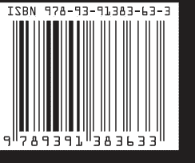