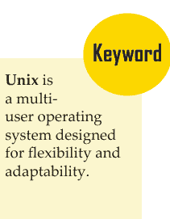
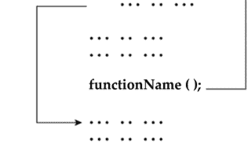
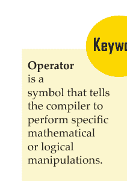
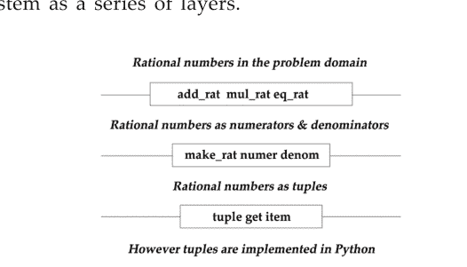
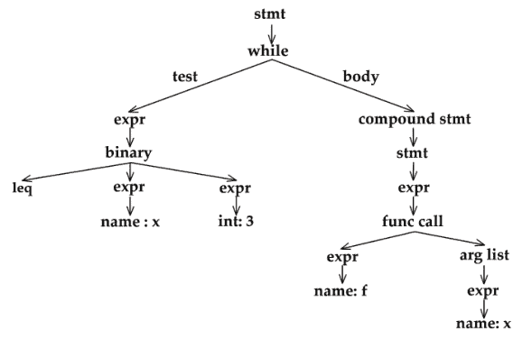
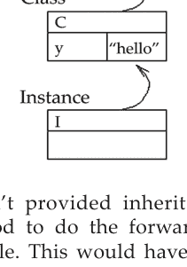
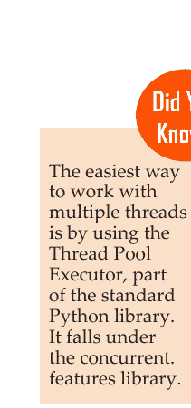
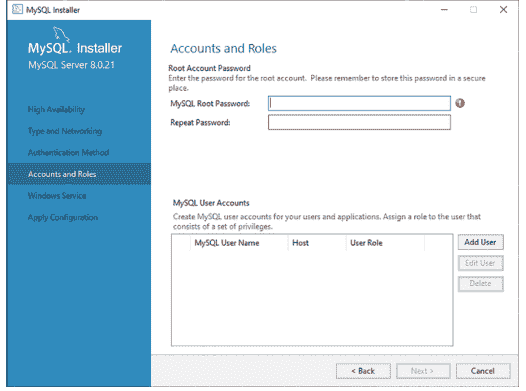
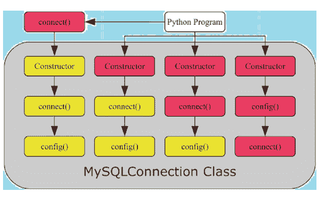
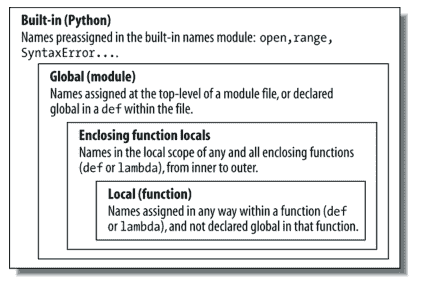

# 第三版

# 基础计算机编程：Python

拉维尼亚·扬库

# 基础计算机编程：Python

（第三版）

拉维尼亚·扬库

www.bibliotex.com

# 基础计算机编程：Python（第三版）

拉维尼亚·扬库

www.bibliotex.com
电子邮件：info@bibliotex.com

电子书版 2024
ISBN：978-1-98469-151-4（电子书）

本书包含从备受推崇的资源中获取的信息。转载材料来源已标明。各篇文章的版权仍归原作者所有，并根据知识共享许可协议发布。书中列出了大量参考文献。我们已尽合理努力确保所发布数据的可靠性，各章节中阐述的观点均为撰稿人个人观点，不一定代表编辑或出版商的观点。编辑或出版商不对已发布章节中信息的准确性或其使用后果负责。出版商对因使用本书中的任何材料、说明、方法或思想而对人员或财产造成的任何损害或索赔不承担责任。编辑和出版商已尽力追溯本出版物中所有复制材料的版权所有者，如果未能获得许可，我们深表歉意。如有任何版权所有者未被致谢，请致信告知，以便我们更正。

**注意：** 产品或公司名称的注册商标仅用于解释和识别，无意侵权。

© 2024 3G E-learning LLC

与 3G E-Learning LLC 合作出版。最初由 3G E-Learning LLC 以印刷书籍形式出版，ISBN 978-1-98468-934-4

# 编辑委员会

**亚历山大·姆拉蒂诺维奇** 于1988年5月5日出生于塞尔维亚阿兰杰洛瓦茨。他毕业于经济高中（2007年），贝尔格莱德旅游学院（2013年），并拥有心理学硕士学位（诺维萨德大学哲学学院）。他涉足心理学多个领域（发展心理学、临床心理学、教育心理学和工业心理学），并发表了多篇科学著作。

**丹·皮斯顿（博士）** 目前是以色列的一名初创企业家，致力于农业与生物医学科学的交叉领域，此前曾担任乌拉圭国家农业研究所（INIA）所长兼首席执行官。丹是一位著作等身的科学家，在其职业生涯中获得了许多荣誉，包括两次获得耶路撒冷希伯来大学颁发的阿米特·戈尔达·梅尔奖。他的专业领域包括干细胞分子生物学、动植物遗传学和生物信息学。丹对应用科学和技术解决方案的热情并未阻止他与农民、家庭和自然建立深厚联系。他的一些兴趣和实践包括享受养蜂和出海垂钓。

**哈兹姆·肖基·福达** 拥有农业科学博士学位，于2008年从亚历山大大学农学院获得博士学位，目前在棉花仲裁与检测总局（CATGO）工作。

**费利西亚·基林斯** 是 LiyahAmore 出版公司的创始人兼首席执行官，该公司致力于为基督教作家提供技术和教育服务与产品。她担任高级编辑兼作家、高级写作教练、内容营销专家、公司季刊主编、国际虚拟网络的执行官兼主持人，以及公司作家在线学校的执行主任。她曾是一名高中英语教师和专业发展教授。她拥有教育学硕士学位以及英语和非裔美国人研究学士学位。

**桑德拉·埃尔·哈吉博士** 拥有美国佛罗里达州诺瓦东南大学健康科学博士学位，是一名专注于预防和全球健康领域的健康专业人士。她在贝鲁特一所著名大学以及佛罗里达州两所顶尖大学接受了12年的教育，桑德拉博士确保在她的工作中融入跨学科和多元文化的方法。她多年的学习帮助她创建了自己的微型知识世界，将医疗保健领域与医学研究、统计学、食品技术、环境与职业健康、预防健康以及她最珍贵的最后一个学位——全球健康联系在一起。直到今天，她仍是中东地区第一位也是唯一一位专攻全球健康的博士。

**福齐亚·帕尔文** 拥有牛津大学可持续水利工程博士学位。此前，她获得了巴基斯坦伊斯兰堡国立科技大学（NUST）环境科学硕士学位，以及拉瓦尔品第法蒂玛·真纳女子大学（FJWU）环境科学学士学位。

**伊戈尔·克鲁尼奇** 2003年至2007年在经济学院学习。2007年毕业后，他继续在贝尔格莱德大学旅游学院学习，并于2010年获得学士学位。他在三年级时曾担任学生议会代表。随后，他进入诺维萨德大学科学学院学习，并于2013年成功通过硕士论文答辩。他学业的巅峰之作是题为“查查克文化发展机遇”的论文。后来，他加入了一家跨国公司，并晋升为物流副主任。如今，他是旅游领域的顾问和学术主题作家。

**约万·佩切夫斯基博士** 于2007年从澳大利亚墨尔本皇家墨尔本理工大学获得计算机科学博士学位。他的研究兴趣包括大数据、商业智能和预测分析、数据与信息科学、信息检索、XML、Web服务和面向服务的架构，以及关系型和NoSQL数据库系统。他已发表30余篇期刊和会议论文，并担任期刊和会议审稿人。他目前在马其顿斯科普里的欧洲大学担任院长和副教授。

**坦吉娜·努尔博士** 于2014年从悉尼科技大学（UTS）完成土木与环境工程博士学位。现在她在水与废水技术中心（CTWW）担任博士后研究员，已发表约八篇国际期刊论文，被引用80次。她的研究兴趣是利用吸附过程进行废水处理技术。

**斯蒂芬** 于2013年从北卡罗来纳大学夏洛特分校获得博士学位，其研究生研究重点是癌症免疫学和肿瘤微环境。他在维克森林再生医学研究所接受了再生和转化医学的博士后培训，具体方向是胃肠道组织工程。目前，斯蒂芬在福赛斯技术社区学院担任解剖学和生理学以及生物学讲师。

**米歇尔** 拥有凤凰城大学工商管理硕士学位，主修人力资源管理。她是一名专业作家，在《亨利县时报》上发表了多篇文章，并为美国各地的多个基督教青年会组织编写和修订了多本员工手册。

## 目录

前言

## 第一章 Python简介

- 引言
- 1.1 Python概述
  - 1.1.1 Python的历史
  - 1.1.2 Python的特性
- 1.2 Python环境搭建
  - 1.2.1 获取Python
  - 1.2.2 安装Python
  - 1.2.3 设置PATH环境变量
  - 1.2.4 Python环境变量
  - 1.2.5 运行Python
- 1.3 Python基本语法
  - 1.3.1 第一个Python程序
  - 1.3.2 Python标识符
  - 1.3.3 保留字
  - 1.3.4 行与缩进
  - 1.3.5 多行语句
  - 1.3.6 Python中的引号
  - 1.3.7 Python中的注释
  - 1.3.8 使用空行
  - 1.3.9 等待用户输入
  - 1.3.10 单行多条语句
  - 1.3.11 多条语句组作为套件
  - 1.3.12 命令行参数
- 1.4 Python变量
  - 1.4.1 变量赋值
  - 1.4.2 多重赋值
  - 1.4.3 标准数据类型
  - 1.4.4 数据类型转换
- 1.5 Python基本运算符
  - 1.5.1 运算符类型
  - 1.5.2 Python运算符优先级
- 总结
- 知识检查
- 复习题
- 参考文献

## 第二章 Python函数、模块和包

- 引言
- 2.1 Python中的函数
  - 2.1.1 函数语法
  - 2.1.2 文档字符串
  - 2.1.3 return语句
  - 2.1.4 Python中函数如何工作？
  - 2.1.5 Python函数参数
  - 2.1.6 匿名函数
  - 2.1.7 return语句
- 2.2 Python模块
  - 2.2.1 关于模块的更多信息
  - 2.2.2 标准模块
- 2.3 Python包
  - 2.3.1 从包中导入*
  - 2.3.2 包内引用
  - 2.3.3 多目录中的包
- 总结
- 知识检查
- 复习题
- 参考文献

## 第三章 字典、集合和文件

- 引言
- 3.1 Python字典
  - 3.1.1 访问字典元素
  - 3.1.2 修改字典
  - 3.1.3 dict()构造函数
  - 3.1.4 字典方法
  - 3.1.5 别名与复制
- 3.2 Python集合
  - 3.2.1 定义集合
  - 3.2.2 集合大小与成员关系
  - 3.2.3 集合方法
  - 3.2.4 创建集合
  - 3.2.5 访问集合中的值
  - 3.2.6 向集合添加元素
  - 3.2.7 从集合中移除元素
  - 3.2.8 集合的并集
  - 3.2.9 集合的交集
  - 3.2.10 集合的差集
  - 3.2.11 比较集合
- 3.3 文件
  - 3.3.1 open函数
  - 3.3.2 打开不存在的文件
  - 3.3.3 从文件中读取数据
- 总结
- 知识检查
- 复习题
- 参考文献

## 第四章 异常、单元测试和推导式

- 引言
- 4.1 异常
  - 4.1.1 处理异常
  - 4.1.2 抛出异常
  - 4.1.3 用户自定义异常
  - 4.1.4 定义清理操作
  - 4.1.5 预定义的清理操作
- 4.2 单元测试

## 第4章 测试

4.2.1 基本示例
4.2.2 命令行接口
4.2.3 测试发现
4.2.4 组织测试代码
4.2.5 重用旧测试代码
4.2.6 跳过测试和预期失败
4.3 推导式
    4.3.1 列表推导式
    4.3.2 字典推导式
    4.3.3 集合推导式
    4.3.4 生成器推导式
总结
知识检查
复习题
参考文献

## 第5章 面向对象编程

引言
5.1 Python中的面向对象编程简介
    5.1.1 Python中的类
    5.1.2 Python对象（实例）
    5.1.3 实例化对象
    5.1.4 实例方法
    5.1.5 Python对象继承
5.2 面向对象编程的方法
    5.2.1 继承
    5.2.2 封装
    5.2.3 多态
    5.2.4 抽象
总结
知识检查
复习题
参考文献

## 第6章 Python正则表达式

引言
6.1 正则表达式搜索与匹配
    6.1.1 Match函数
    6.1.2 Search函数
    6.1.3 匹配与搜索
    6.1.4 搜索与替换
6.2 正则表达式修饰符：选项标志
    6.2.1 正则表达式模式
    6.2.2 正则表达式示例
总结
知识检查
复习题
参考文献

## 第7章 Python多线程

引言
7.1 Python线程 – Python多线程
    7.1.1 Python多线程入门
    7.1.2 用于线程实现的Python多线程模块
    7.1.3 多进程与多线程的区别
7.2 Python多线程中的函数
    7.2.1 线程局部数据
    7.2.2 线程对象
    7.2.3 锁对象
    7.2.4 可重入锁对象
    7.2.5 条件对象
    7.2.6 信号量对象
    7.2.7 事件对象
    7.2.8 定时器对象
    7.2.9 屏障对象
    7.2.10 在with语句中使用锁、条件和信号量
总结
知识检查
复习题
参考文献

## 第8章 Python中的运算

引言
8.1 Python - 决策制定
    8.1.1 Python if语句

### 8.1.2 Python if-else 语句
8.1.3 Python if-elif 阶梯
8.1.4 Python 嵌套 if 语句
8.2 Python - 循环
8.2.1 range() 函数
8.2.2 带 else 的 for 循环
8.2.3 循环控制语句
8.3 Python - 数字
8.3.1 数字类型转换
8.3.2 数学函数
8.3.3 随机数函数
8.3.4 三角函数
8.3.5 数学常量
8.4 Python - 字符串
8.4.1 访问字符串中的值
8.4.2 更新字符串
8.4.3 转义字符
8.4.4 字符串特殊运算符
8.4.5 字符串格式化运算符
8.4.6 三引号
8.4.7 Unicode 字符串
8.4.8 内置字符串方法
8.5 Python - 列表
8.5.1 访问列表中的值
8.5.2 更新列表
8.5.3 删除列表元素
8.5.4 基本列表操作
8.5.5 索引、切片和矩阵
8.5.6 内置列表函数与方法
8.6 Python - 元组
8.6.1 访问元组中的值
8.6.2 更新元组
8.6.3 删除元组元素
8.6.4 基本元组操作
8.6.5 索引、切片和矩阵
8.6.6 无封闭分隔符
8.6.7 内置元组函数
8.7 Python - 日期与时间
8.7.1 获取当前时间
8.7.2 获取格式化时间
8.7.3 获取某月的日历
8.7.4 time 模块
8.7.5 calendar 模块
总结
知识检查
复习题
参考文献

## 第9章 Python 数据库编程

简介
9.1 Python 的 DB-API (SQL-API)
9.1.1 连接对象
9.1.2 游标对象
9.1.3 DB-API 中的错误与异常处理
9.1.4 Python 与 MySQL
9.1.5 更多 SQL 操作
9.1.6 Python MySQL – 创建数据库
9.2 使用 Python 操作 MySQL
9.2.1 MySQL 与其他 SQL 数据库的比较
9.2.2 安装 MySQL Server 和 MySQL Connector/Python
9.2.3 与 MySQL Server 建立连接
9.3 创建、修改和删除表
9.3.1 定义数据库模式
9.3.2 使用 CREATE TABLE 语句创建表
9.3.3 使用 DESCRIBE 语句显示表模式
9.3.4 使用 ALTER 语句修改表模式
9.3.5 使用 DROP 语句删除表
9.4 向表中插入记录
9.4.1 使用 .execute()
9.4.2 使用 .executemany()
9.4.3 从数据库读取记录
9.4.4 使用 JOIN 语句处理多表
9.5 更新和删除数据库中的记录
9.5.1 UPDATE 命令
9.5.2 DELETE 命令
9.5.3 连接 Python 和 MySQL 的其他方式
总结
知识检查
复习题
参考文献

## 第10章 作用域

简介
10.1 Python 作用域基础
10.1.1 名称解析：LEGB 规则
10.1.2 作用域示例
10.1.3 内置作用域
10.2 global 语句
10.2.1 最小化全局变量
10.2.2 最小化跨文件更改
10.2.3 访问全局变量的其他方式
10.3 作用域与嵌套函数
10.3.1 嵌套作用域详解
10.3.2 嵌套作用域示例
10.4 nonlocal 语句
10.4.1 nonlocal 基础
10.4.2 nonlocal 实战
10.4.3 为什么需要 nonlocal？
总结
知识检查
复习题
参考文献

# 索引

# 前言

Python 是由吉多·范罗苏姆创建的一种强大的面向对象编程语言。它因其用户友好的语法而广受认可，是编程初学者的绝佳选择。Python 的简洁性和易用性使其成为学习编码基础知识的理想起点。该语言的优势在于其高级内置数据结构、动态类型和动态绑定，使其非常适合快速应用开发（RAD）和脚本编写等任务。

Python 作为一种有效的“胶水”语言，能够无缝连接不同的组件和技术。其可读性是一个关键特性，这得益于简洁的语法，降低了程序维护成本。总的来说，Python 以其多功能性而闻名，广泛应用于从 Web 开发到数据科学等各个领域。

## 本书结构

本版分为十章，为希望开启 Python 编程之旅的人士提供全面指南。它不仅教授 Python 的基本原理，还深入探讨学习该语言的原因，并提供掌握这项技能的有效策略。内容从基础编程概念开始，逐步涵盖函数、递归、数据结构和面向对象设计等主题。

**第 1 章** 介绍了 Python。你将学习 Python 环境设置、Python 语法和 Python 变量。同时也会讨论 Python 的基本运算符。

**第 2 章** 旨在重点介绍 Python 函数、模块和包。在 Python 中，函数是执行特定任务的一组相关语句。函数有助于将我们的程序分解为更小的模块化部分。本章还描述了 Python 模块和 Python 包。

**第 3 章** 从 Python 字典开始。它还解释了 Python 集合和 Python 中使用的文件。它们可用于读写文本备忘录、音频片段、Excel 文档、保存的电子邮件消息以及你碰巧存储在机器上的任何其他内容。

**第 4 章** 概述了如何使用异常。此外，它解释了用于验证软件每个单元是否按设计执行的单元测试。最后，本章重点介绍理解推导式，它允许从其他序列构建序列。

**第 5 章** 旨在讨论面向对象编程（OOP）在 Python 中的使用，包括 OOP 的各种方法类型。编程挑战被视为如何编写逻辑，而不是如何定义数据。面向对象编程的观点是，我们真正关心的是我们想要操作的对象，而不是操作它们所需的逻辑。

**第 6 章** 重点介绍 Python 正则表达式，它帮助你使用存储在模式中的专用语法来匹配或查找其他字符串或字符串集。

**第 7 章** 讨论了 Python 多线程，用于在 Python 程序中实现多线程，也用于同时运行多个线程（任务、函数调用）。

**第 8 章** 涵盖了 Python 作用域的基础知识，对其基础进行了深入探讨。读者将清楚地了解作用域在 Python 编程语言中是如何运作的。

**第 9 章** 涵盖了 Python 数据库编程，探讨如何使用 Python 与数据库进行交互。

**第 10 章** 检查了 Python 作用域的基础知识，深入探讨了程序不同部分中变量的可见性和生命周期。

# 第 1 章

# Python 简介

## 引言

Python 是一种高级、通用的编程语言，以其简洁性和可读性而闻名。它由吉多·范罗苏姆创建，于 1991 年首次发布。Python 广泛应用于各种应用，包括 Web 开发、数据分析、人工智能、机器学习、科学计算等。

Python 是动态类型和垃圾回收的。它支持多种编程范式，包括结构化（特别是过程式）、面向对象和函数式编程。由于其全面的标准库，它通常被描述为一种“自带电池”的语言。吉多·范罗苏姆在 20 世纪 80 年代末开始开发 Python，作为 ABC 编程语言的后继者，并于 1991 年首次发布为 Python 0.9.0。Python 2.0 于 2000 年发布。Python 3.0 于 2008 年发布，是一次重大修订，与早期版本不完全向后兼容。Python 2.7.18 于 2020 年发布，是 Python 2 的最后一个版本。Python 一直是最受欢迎的编程语言之一。

Python 使用动态类型以及引用计数和循环检测垃圾回收器的组合进行内存管理。它使用动态名称解析（延迟绑定），在程序执行期间绑定方法和变量名称。

其设计为 Lisp 传统中的函数式编程提供了一些支持。它有 filter、map 和 reduce 函数；列表推导式、字典、集合和生成器表达式。标准库有两个模块（itertools 和 functools），实现了从 Haskell 和 Standard ML 借用的函数式工具。

Python 的语法设计旨在易于阅读和理解。它使用缩进（空格）来定义代码块，使得理解代码结构变得容易。这与使用大括号或关键字来界定块的语言不同。

```python
# Python 代码示例
if True:
    print("This condition is True")
```

Python 的多功能性、可读性和广泛的社区支持使其成为初学者和专业人士的绝佳选择。其易于学习和在各个领域的应用，促进了它在软件开发行业的广泛采用。

学习本章后，你将能够：

- 解释 Python 的基础知识
- 了解 Python 环境设置
- 描述 Python 的基本语法
- 理解 Python 变量
- 讨论 Python 的基本运算符

# 1.1 Python 概述

Python 是一种高级、解释型、交互式和面向对象的脚本语言。Python 的设计具有高度可读性。它频繁使用英语关键字，而其他语言使用标点符号，并且它的语法结构比其他语言更少。

- **Python 是解释型的** – Python 在运行时由解释器处理。你不需要在执行前编译程序。这与 PERL 和 PHP 类似。
- **Python 是交互式的** – 你实际上可以坐在 Python 提示符前，直接与解释器交互来编写程序。
- **Python 是面向对象的** – Python 支持面向对象的编程风格或技术，将代码封装在对象中。
- **Python 是初学者的语言** – Python 是初学者程序员的绝佳语言，支持从简单文本处理到 WWW 浏览器再到游戏的各种应用程序的开发。

# 1.1.1 Python 的历史

Python 由吉多·范罗苏姆在 20 世纪 80 年代末和 90 年代初在荷兰国家数学和计算机科学研究所开发。

Python 源自许多其他语言，包括 ABC、Modula-3、C、C++、Algol-68、SmallTalk 以及 Unix shell 和其他脚本语言。

Python 受版权保护。与 Perl 一样，Python 源代码现在在 GNU 通用公共许可证（GPL）下提供。

Python 现在由该研究所的一个核心开发团队维护，尽管吉多·范罗苏姆在指导其发展方面仍扮演着至关重要的角色。

# 1.1.2 Python 特性

Python 的特性包括 –

- **易于学习** – Python 关键字少，结构简单，语法定义清晰。这使得学生能够快速掌握该语言。
- **易于阅读** – Python 代码定义更清晰，视觉上更易识别。
- **易于维护** – Python 的源代码相当易于维护。
- **广泛的标准库** – Python 的大部分库非常可移植，并且在 UNIX、Windows 和 Macintosh 上跨平台兼容。
- **交互模式** – Python 支持交互模式，允许对代码片段进行交互式测试和调试。
- **可移植性** – Python 可以在各种硬件平台上运行，并且在所有平台上具有相同的接口。
- **可扩展性** – 你可以向 Python 解释器添加低级模块。这些模块使程序员能够添加或自定义他们的工具以提高效率。
- **数据库** – Python 提供了与所有主要商业数据库的接口。
- **GUI 编程** – Python 支持 GUI 应用程序，这些程序可以创建并移植到许多系统调用、库和窗口系统。

# 基础计算机编程：Python

例如 Windows MFC、Macintosh 和 Unix 的 X Window 系统。

- 可扩展性 – 与 shell 脚本相比，Python 为大型程序提供了更好的结构和支持。

除了上述特性外，Python 还拥有众多优良特性，以下列举部分：

- 它支持函数式、结构化编程方法以及面向对象编程（OOP）。
- 它既可作为脚本语言使用，也可编译为字节码以构建大型应用程序。
- 它提供非常高级的动态数据类型，并支持动态类型检查。
- 它支持自动垃圾回收。
- 它可以轻松地与 C、C++、COM、ActiveX、CORBA 和 Java 集成。

## 1.2 PYTHON 环境设置

Python 可在包括 Linux 和 Mac OS X 在内的多种平台上使用。让我们了解如何设置 Python 环境。

打开终端窗口并输入 “python” 以检查是否已安装以及安装的版本。

- Unix（Solaris、Linux、FreeBSD、AIX、HP/UX、SunOS、IRIX 等）
- Win 9x/NT/2000
- Macintosh（Intel、PPC、68K）
- OS/2
- DOS（多个版本）
- PalmOS
- 诺基亚手机
- Windows CE
- Acorn/RISC OS
- BeOS
- Amiga
- VMS/OpenVMS
- QNX
- VxWorks
- Psion

- Python 也已被移植到 Java 和 .NET 虚拟机

### 1.2.1 获取 Python

最新的源代码、二进制文件、文档、新闻等均可在 Python 官方网站 https://www.python.org/ 获取。

您可以从 https://www.python.org/doc/ 下载 Python 文档。文档提供 HTML、PDF 和 PostScript 格式。

### 1.2.2 安装 Python

Python 发行版适用于多种平台。您只需下载适用于您平台的二进制代码并安装 Python。

如果您的平台没有可用的二进制代码，则需要 C 编译器来手动编译源代码。编译源代码在选择安装所需功能方面提供了更大的灵活性。

以下是各平台安装 Python 的快速概览 –

### Unix 和 Linux 安装

以下是在 Unix/Linux 机器上安装 Python 的简单步骤。

- 打开 Web 浏览器并访问 https://www.python.org/downloads/。
- 按照链接下载适用于 Unix/Linux 的压缩源代码。
- 下载并解压文件。
- 如果您想自定义某些选项，请编辑 *Modules/Setup* 文件。
- 运行 ./configure 脚本
- make
- make install

这会将 Python 安装在标准位置 */usr/local/bin*，其库安装在 */usr/local/lib/pythonXX*，其中 XX 是 Python 的版本号。



### Windows 安装

以下是在 Windows 机器上安装 Python 的步骤。

- 打开 Web 浏览器并访问 https://www.python.org/downloads/。
- 按照链接下载 Windows 安装程序 python-XYZ.msi 文件，其中 XYZ 是您需要安装的版本。
- 要使用此安装程序 python-XYZ.msi，Windows 系统必须支持 Microsoft Installer 2.0。将安装程序文件保存到本地计算机，然后运行它以检查您的机器是否支持 MSI。
- 运行下载的文件。这将启动 Python 安装向导，该向导非常易于使用。只需接受默认设置，等待安装完成即可。

### Macintosh 安装

较新的 Mac 通常预装了 Python，但版本可能已过时数年。请参阅 http://www.python.org/download/mac/ 以获取有关获取当前版本以及支持 Mac 开发的额外工具的说明。对于 Mac OS X 10.3（2003 年发布）之前的旧版 Mac OS，可使用 MacPython。

Jack Jansen 维护着它，您可以在他的网站 http://www.cwi.nl/~jack/macpython.html 上访问完整的文档。您可以找到 Mac OS 安装的完整安装细节。

### 1.2.3 设置 PATH

程序和其他可执行文件可能位于多个目录中，因此操作系统提供了一个搜索路径，列出了操作系统搜索可执行文件的目录。

该路径存储在一个环境变量中，这是一个由操作系统维护的命名字符串。此变量包含命令 shell 和其他程序可用的信息。

**path** 变量在 **Unix** 中命名为 PATH，在 Windows 中命名为 Path（Unix 区分大小写；Windows 不区分）。在 Mac OS 中，安装程序会处理路径细节。要从任何特定目录调用 Python 解释器，必须将 Python 目录添加到您的路径中。

### 在 Unix/Linux 中设置路径

要在 Unix 中为特定会话将 Python 目录添加到路径 –

- **在 csh shell 中** – 输入 setenv PATH “$PATH:/usr/local/bin/python” 并按 Enter。
- **在 bash shell（Linux）中** – 输入 export PATH=”$PATH:/usr/local/bin/python” 并按 Enter。
- **在 sh 或 ksh shell 中** – 输入 PATH=”$PATH:/usr/local/bin/python” 并按 Enter。
- **注意** – /usr/local/bin/python 是 Python 目录的路径

### 在 Windows 中设置路径

– 要在 Windows 中为特定会话将 Python 目录添加到路径。在命令提示符下 – 输入 path %path%;C:\Python 并按 Enter

### 1.2.4 Python 环境变量

以下是 Python 可识别的重要环境变量 –

| 序号 | 变量与描述 |
|---|---|
| 1 | **PYTHONPATH**<br>其作用类似于 PATH。此变量告诉 Python 解释器在哪里查找导入程序的模块文件。它应包含 Python 源库目录和包含 Python 源代码的目录。PYTHONPATH 有时由 Python 安装程序预设。 |
| 2 | **PYTHONSTARTUP**<br>它包含一个包含 Python 源代码的初始化文件的路径。每次启动解释器时都会执行它。在 Unix 中命名为 .pythonrc.py，它包含加载实用程序或修改 PYTHONPATH 的命令。 |
| 3 | **PYTHONCASEOK**<br>在 Windows 中用于指示 Python 在 import 语句中查找第一个不区分大小写的匹配项。将此变量设置为任何值以激活它。 |
| 4 | **PYTHONHOME**<br>它是一个替代的模块搜索路径。通常嵌入在 PYTHONSTARTUP 或 PYTHONPATH 目录中，以便于切换模块库。 |

### 1.2.5 运行 Python

有三种不同的方式启动 Python –

### 交互式解释器

您可以从 Unix、DOS 或任何其他提供命令行解释器或 shell 窗口的系统启动 Python。

在命令行输入 **python**。
立即在交互式解释器中开始编码。
$python # Unix/Linux
或
python% # Unix/Linux
或
C:> python # Windows/DOS

以下是所有可用命令行选项的列表 –

| 序号 | 选项与描述 |
|---|---|
| 1 | -d<br>提供调试输出。 |
| 2 | -O<br>生成优化的字节码（生成 .pyo 文件）。 |
| 3 | -S<br>启动时不运行 import site 来查找 Python 路径。 |
| 4 | -v<br>详细输出（对 import 语句进行详细跟踪）。 |
| 5 | -X<br>禁用基于类的内置异常（仅使用字符串）；从 1.6 版本开始已过时。 |
| 6 | -c cmd<br>运行作为 cmd 字符串传入的 Python 脚本 |
| 7 | file<br>从给定文件运行 Python 脚本 |

### 从命令行运行脚本

可以通过在您的应用程序上调用解释器来在命令行执行 Python 脚本，如下所示 –

```
$python script.py # Unix/Linux
或
python% script.py # Unix/Linux
或
C: >python script.py # Windows/DOS
```

**注意** – 确保文件权限模式允许执行。

### 集成开发环境

如果您的系统上有支持 Python 的 GUI 应用程序，您也可以从图形用户界面（GUI）环境运行 Python。

- **Unix** – IDLE 是第一个用于 Python 的 Unix IDE。
- **Windows** – PythonWin 是第一个用于 Python 的 Windows 接口，是一个带有 GUI 的 IDE。
- **Macintosh** – Python 的 Macintosh 版本以及 IDLE IDE 可从主网站获取，可下载为 MacBinary 或 BinHex'd 文件。
- 如果您无法正确设置环境，可以寻求系统管理员的帮助。确保 Python 环境已正确设置并能完美运行。

**注意** – 后续章节中给出的所有示例均使用 Linux CentOS 版本上的 Python 2.4.3 版本执行。

我们已经在线设置了 Python 编程环境，以便您在学习理论的同时可以在线执行所有可用示例。您可以随意修改任何示例并在线执行。

## 1.3 PYTHON 基本语法

Python 语言与 **Perl**、C 和 Java 有许多相似之处。然而，这些语言之间存在一些明确的差异。

### 1.3.1 第一个 Python 程序

让我们在不同的编程模式下执行程序。

### 交互模式编程

不传递脚本文件作为参数调用解释器将显示以下提示 –

```
$ python
Python 2.4.3 (#1, Nov 11 2010, 13:34:43)
[GCC 4.1.2 20080704 (Red Hat 4.1.2-48)] on linux2
```

# 基础计算机编程：Python

输入 “help”、 “copyright”、 “credits” 或 “license” 以获取更多信息。
>>>

在 Python 提示符下输入以下文本并按回车键 –
>>> print “Hello, Python!”

如果你运行的是新版本的 Python，那么你需要使用带括号的 print 语句，如 **print (“Hello, Python!”);**。然而，在 Python 2.4.3 版本中，这会产生以下结果 –
Hello, Python!

## 脚本模式编程

使用脚本参数调用解释器会开始执行脚本，并持续到脚本结束。当脚本结束时，解释器不再处于活动状态。

让我们在一个脚本中编写一个简单的 Python 程序。Python 文件的扩展名为 **.py**。在 test.py 文件中输入以下源代码 –
print “Hello, Python!”

我们假设你已将 Python 解释器设置在 PATH 变量中。现在，尝试按如下方式运行此程序 –
$ python test.py
这会产生以下结果 –
Hello, Python!

让我们尝试另一种执行 Python 脚本的方法。这是修改后的 test.py 文件 –
#!/usr/bin/python
print “Hello, Python!”

我们假设你可以在 /usr/bin 目录中找到 Python 解释器。现在，尝试按如下方式运行此程序 –
$ chmod +x test.py    # 这是为了使文件可执行
./test.py
这会产生以下结果 –
Hello, Python!

## 1.3.2 Python 标识符

Python 标识符是用于标识变量、函数、类、模块或其他对象的名称。标识符以字母 A 到 Z 或 a 到 z 或下划线 (_) 开头，后跟零个或多个字母、下划线和数字 (0 到 9)。

Python 不允许在标识符中使用标点字符，如 @、$ 和 %。Python 是一种区分大小写的编程语言。因此，**Manpower** 和 **manpower** 在 Python 中是两个不同的标识符。

以下是 Python 标识符的命名约定 –

- 类名以大写字母开头。所有其他标识符以小写字母开头。
- 以单个前导下划线开头的标识符表示该标识符是私有的。
- 以两个前导下划线开头的标识符表示一个强私有标识符。
- 如果标识符还以两个尾随下划线结尾，则该标识符是语言定义的特殊名称。

## 1.3.3 保留字

以下列表显示了 Python 关键字。这些是保留字，你不能将它们用作常量、变量或任何其他标识符名称。所有 Python 关键字仅包含小写字母。

| and | exec | not |
| --- | --- | --- |
| assert | finally | or |
| break | for | pass |
| class | from | print |
| continue | global | raise |
| def | if | return |
| del | import | try |
| elif | in | while |
| else | is | with |
| except | lambda | yield |

## 1.3.4 行与缩进

Python 不提供大括号来表示类和函数定义或流程控制的代码块。代码块由行缩进表示，这是严格强制的。
缩进中的空格数量是可变的，但块内的所有语句必须缩进相同的量。例如 –

```
if True:
    print "True"
else:
    print "False"
```

然而，以下代码块会产生错误 –

```
if True:
    print "Answer"
    print "True"
else:
    print "Answer"
    print "False"
```

因此，在 Python 中，所有以相同空格数缩进的连续行将形成一个块。以下示例包含各种语句块 –

```
#!/usr/bin/python
import sys

try:
    # open file stream
    file = open(file_name, "w")
except IOError:
    print "There was an error writing to", file_name
    sys.exit()
print "Enter ", file_finish,
print " When finished"
while file_text != file_finish:
    file_text = raw_input("Enter text: ")
    if file_text == file_finish:
        # close the file
        file.close
        break
    file.write(file_text)
    file.write("\n")
file.close()
file_name = raw_input("Enter filename: ")
if len(file_name) == 0:
    print "Next time please enter something"
    sys.exit()
try:
    file = open(file_name, "r")
except IOError:
    print "There was an error reading file"
    sys.exit()
file_text = file.read()
file.close()
print file_text
```

## 1.3.5 多行语句

Python 中的语句通常以新行结束。然而，Python 允许使用行续接字符 (\) 来表示该行应继续。例如 –

```
total = item_one + \
        item_two + \
        item_three
```

包含在 [], {}, 或 () 括号中的语句不需要使用行续接字符。例如 –

```
days = ['Monday', 'Tuesday', 'Wednesday',
        'Thursday', 'Friday']
```

## 1.3.6 Python 中的引号

Python 接受单引号 (')、双引号 (") 和三引号 (''' 或 """) 来表示字符串字面量，只要相同类型的引号开始和结束字符串即可。三引号用于将字符串跨多行。例如，以下所有都是合法的 –

```
word = 'word'
sentence = "This is a sentence."
paragraph = """This is a paragraph. It is
made up of multiple lines and sentences."""
```

## 1.3.7 Python 中的注释

不在字符串字面量内的井号 (#) 开始一个注释。# 之后直到物理行末尾的所有字符都是注释的一部分，Python 解释器会忽略它们。

```
#!/usr/bin/python
# First comment
print "Hello, Python!" # second comment
```

这会产生以下结果 –
Hello, Python!

你可以在语句或表达式之后的同一行输入注释 –

```
name = “Madisetti” # This is again comment
```

你可以按如下方式注释多行 –

```
# This is a comment.
# This is a comment, too.
# This is a comment, too.
# I said that already.
```

代码块是源代码的词法结构，被分组在一起。

## 1.3.8 使用空行

仅包含空白字符（可能带有注释）的行称为空行，Python 会完全忽略它。

在交互式解释器会话中，你必须输入一个空的物理行来终止多行语句。

## 1.3.9 等待用户

程序的以下行显示提示，即语句 “Press the enter key to exit”，并等待用户采取行动 –

```
#!/usr/bin/python
raw_input(“\n\nPress the enter key to exit.”)
```

这里，“\n\n” 用于在显示实际行之前创建两个新行。一旦用户按下该键，程序就会结束。这是一个很好的技巧，可以在用户完成应用程序之前保持控制台窗口打开。

## 1.3.10 单行上的多条语句

分号 ( ; ) 允许在单行上放置多条语句，前提是这些语句都不开始新的 **代码块**。以下是使用分号的示例片段 –

```
import sys; x = ‘foo’; sys.stdout.write(x + ‘\n’)
```

## 1.3.11 作为套件的多条语句组

在 Python 中，构成单个代码块的一组单独语句称为 **套件**。复合或复杂语句，如 if、while、def 和 class，需要一个标题行和一个套件。标题行开始语句（带有关键字）并以冒号 ( : ) 结尾，后跟一行或多行组成套件。例如 –

```
if expression :
    suite

elif expression :
    suite

else :
    suite
```

## 1.3.12 命令行参数

许多程序可以运行以提供有关如何运行它们的一些基本信息。Python 允许你使用 -h 来执行此操作 –

```
$ python -h
usage: python [option] ... [-c cmd | -m mod | file | -] [arg] ...
Options and arguments (and corresponding environment variables):
-c cmd : program passed in as string (terminates option list)
-d     : debug output from parser (also PYTHONDEBUG=x)
-E     : ignore environment variables (such as PYTHONPATH)
-h     : print this help message and exit

[ etc. ]
```

你还可以对脚本进行编程，使其接受各种选项。命令行参数是一个高级主题，应在你学习完其他 Python 概念后再进行研究。

## 1.4 PYTHON 变量

变量不过是用于存储值的保留内存位置。这意味着当你创建一个变量时，你在内存中保留了一些空间。
根据变量的数据类型，解释器分配内存并决定可以在保留内存中存储什么。因此，通过为变量分配不同的数据类型，你可以在这些变量中存储整数、小数或字符。

## 1.4.1 为变量赋值

Python 变量不需要显式声明来保留内存空间。当你为变量赋值时，声明会自动发生。等号 (=) 用于为变量赋值。

基础计算机编程：Python

`=` 运算符左侧的操作数是变量的名称，右侧的操作数是存储在变量中的值。*例如* –

```
#!/usr/bin/python

counter = 100       # An integer assignment
miles   = 1000.0    # A floating point
name    = "John"    # A string

print counter
print miles
print name
```

这里，100、1000.0 和 “John” 分别是赋给 *counter*、*miles* 和 *name* 变量的值。这将产生以下结果 –

```
100
1000.0
John
```

## 1.4.2 多重赋值

Python 允许你同时将单个值赋给多个变量。例如 –

```
a = b = c = 1
```

这里，创建了一个值为 1 的整数对象，所有三个变量都被赋给了相同的内存位置。你也可以将多个对象赋给多个变量。例如 –

```
a,b,c = 1,2,"john"
```

这里，两个值分别为 1 和 2 的整数对象被分别赋给变量 a 和 b，一个值为 “john” 的字符串对象被赋给变量 c。

## 1.4.3 标准数据类型

存储在内存中的数据可以是多种类型的。*例如*，一个人的年龄存储为数值，而他或她的地址存储为字母数字字符。Python 有多种标准数据类型，用于定义可以对它们执行的操作以及每种类型的存储方法。

Python 有五种标准数据类型 –

- 数字
- 字符串
- 列表
- 元组
- 字典

## Python 数字

数字数据类型存储数值。当你给数字对象赋值时，它们就被创建了。例如 –
var1 = 1
var2 = 10
你也可以使用 del 语句删除对数字对象的引用。del 语句的语法是 –
del var1[,var2[,var3[....,varN]]]]
你可以使用 del 语句删除单个对象或多个对象。例如 –
del var
del var_a, var_b
Python 支持四种不同的数字类型 –

- int（有符号整数）
- long（长整数，也可以用八进制和十六进制表示）
- float（浮点实数）
- complex（复数）

### 示例

以下是一些数字示例 –

| int | long | float | complex |
|---|---|---|---|
| 10 | 51924361L | 0.0 | 3.14j |
| 100 | -0x19323L | 15.20 | 45.j |
| -786 | 0122L | -21.9 | 9.322e-36j |
| 080 | 0xDEFABCECBDAECBFBAE1 | 32.3+e18 | .876j |
| -0490 | 535633629843L | -90. | -.6545+0J |
| -0x260 | -052318172735L | -32.54e100 | 3e+26J |
| 0x69 | -4721885298529L | 70.2-E12 | 4.53e-7j |

Python 允许你对 long 使用小写字母 l，但建议只使用大写字母 L，以避免与数字 1 混淆。Python 用大写字母 L 显示长整数。

- 复数由一对有序的实浮点数表示，形式为 x + yj，其中 x 和 y 是实数，j 是虚数单位。

## Python 字符串

Python 中的字符串被识别为用引号括起来的连续字符集。Python 允许使用成对的单引号或双引号。可以使用切片操作符（[ ] 和 [:]）获取字符串的子集，索引从字符串开头的 0 开始，到末尾的 -1 结束。

加号（+）是字符串连接操作符，星号（*）是重复操作符。例如 –

```
#!/usr/bin/python

str = 'Hello World!'

print str          # Prints complete string
print str[0]       # Prints first character of the string
print str[2:5]     # Prints characters starting from 3rd to 5th
print str[2:]      # Prints string starting from 3rd character
print str * 2      # Prints string two times
print str + "TEST" # Prints concatenated string
```

这将产生以下结果 –

```
Hello World!
H
llo
llo World!
Hello World!Hello World!
Hello World!TEST
```

## Python 列表

列表是 Python 复合数据类型中最通用的一种。列表包含用逗号分隔并用方括号（[]）括起来的项目。在某种程度上，列表类似于 C 中的数组。它们之间的一个区别是，属于列表的所有项目可以是不同的**数据类型**。

存储在列表中的值可以使用切片操作符（[ ] 和 [:]）访问，索引从列表开头的 0 开始，到末尾的 -1 结束。加号（+）是列表连接操作符，星号（*）是重复操作符。例如 –

```
#!/usr/bin/python

list = [ ‘abcd’, 786 , 2.23, ‘john’, 70.2 ]
tinylist = [123, ‘john’]

print list           # Prints complete list
print list[0]        # Prints first element of the list
print list[1:3]      # Prints elements starting from 2nd till 3rd
print list[2:]       # Prints elements starting from 3rd element
print tinylist * 2   # Prints list two times
print list + tinylist # Prints concatenated lists
```

这将产生以下结果 –

```
[‘abcd’, 786, 2.23, ‘john’, 70.2]
abcd
[786, 2.23]
[2.23, ‘john’, 70.2]
[123, ‘john’, 123, ‘john’]
[‘abcd’, 786, 2.23, ‘john’, 70.2, 123, ‘john’]
```

## Python 元组

元组是另一种类似于列表的序列数据类型。元组由用逗号分隔的多个值组成。然而，与列表不同，元组用圆括号括起来。

列表和元组之间的主要区别是：列表用方括号（ [ ] ）括起来，其元素和大小可以更改，而元组用圆括号（ ( ) ）括起来，不能更新。元组可以被认为是**只读**列表。例如 –

```
#!/usr/bin/python

tuple = ( ‘abcd’, 786 , 2.23, ‘john’, 70.2 )
tinytuple = (123, ‘john’)

print tuple           # Prints complete list
print tuple[0]        # Prints first element of the list
print tuple[1:3]      # Prints elements starting from 2nd till 3rd
print tuple[2:]       # Prints elements starting from 3rd element
print tinytuple * 2   # Prints list two times
print tuple + tinytuple # Prints concatenated lists
```

这将产生以下结果 –

```
(‘abcd’, 786, 2.23, ‘john’, 70.2)
abcd
(786, 2.23)
(2.23, ‘john’, 70.2)
(123, ‘john’, 123, ‘john’)
(‘abcd’, 786, 2.23, ‘john’, 70.2, 123, ‘john’)
```

以下代码对元组无效，因为我们试图更新一个元组，这是不允许的。类似的情况也可能发生在列表上 –

```
#!/usr/bin/python

tuple = ( ‘abcd’, 786 , 2.23, ‘john’, 70.2  )
list = [ ‘abcd’, 786 , 2.23, ‘john’, 70.2  ]
tuple[2] = 1000    # Invalid syntax with tuple
list[2] = 1000     # Valid syntax with list
```

## Python 字典

Python 的字典类似于哈希表类型。它们的工作方式类似于 Perl 中的关联数组或哈希，由键值对组成。字典的键可以是几乎任何 Python 类型，但通常是数字或字符串。另一方面，值可以是任何任意的 Python 对象。
字典用花括号（{ }）括起来，值可以使用方括号（[]）赋值和访问。例如 –

```
#!/usr/bin/python

dict = {}
dict[‘one’] = “This is one”
dict[2]     = “This is two”

tinydict = {‘name’: ‘john’,’code’:6734, ‘dept’: ‘sales’}

print dict[‘one’]       # Prints value for ‘one’ key
print dict[2]           # Prints value for 2 key
print tinydict          # Prints complete dictionary
print tinydict.keys()   # Prints all the keys
print tinydict.values() # Prints all the values
```

这将产生以下结果 –

```
This is one
This is two
{'dept': 'sales', 'code': 6734, 'name': 'john'}
['dept', 'code', 'name']
['sales', 6734, 'john']
```

字典中的元素没有顺序概念。说元素“顺序错乱”是不正确的；它们只是无序的。

## 1.4.4 数据类型转换

有时，你可能需要在内置类型之间执行转换。要在类型之间转换，你只需将类型名称用作函数即可。
有几个内置函数可以执行从一种数据类型到另一种数据类型的转换。这些函数返回一个表示转换后值的新对象。

| 序号 | 函数与描述 |
|---|---|
| 1 | **int(x [,base])** 将 x 转换为整数。如果 x 是字符串，则 base 指定基数。 |
| 2 | **long(x [,base] )** 将 x 转换为长整数。如果 x 是字符串，则 base 指定基数。 |
| 3 | **float(x)** 将 x 转换为浮点数。 |
| 4 | **complex(real [,imag])** 创建一个复数。 |
| 5 | **str(x)** 将对象 x 转换为字符串表示。 |
| 6 | **repr(x)** 将对象 x 转换为表达式字符串。 |
| 7 | **eval(str)** 计算一个字符串并返回一个对象。 |
| 8 | **tuple(s)** 将 s 转换为元组。 |

# 基础计算机编程：Python

| 9 | **list(s)**<br>将 s 转换为列表。 |
| 10 | **set(s)**<br>将 s 转换为集合。 |
| 11 | **dict(d)**<br>创建一个字典。d 必须是 (键, 值) 元组的序列。 |
| 12 | **frozenset(s)**<br>将 s 转换为冻结集合。 |
| 13 | **chr(x)**<br>将整数转换为字符。 |
| 14 | **unichr(x)**<br>将整数转换为 Unicode 字符。 |
| 15 | **ord(x)**<br>将单个字符转换为其整数值。 |
| 16 | **hex(x)**<br>将整数转换为十六进制字符串。 |
| 17 | **oct(x)**<br>将整数转换为八进制字符串。 |

## 1.5 Python 基本运算符

运算符是用于操作操作数值的结构。考虑表达式 4 + 5 = 9。这里，4 和 5 称为操作数，+ 称为运算符。

### 1.5.1 运算符类型

Python 语言支持以下类型的运算符。

- 算术运算符
- 比较（关系）运算符
- 赋值运算符
- 逻辑运算符
- 位运算符
- 成员运算符
- 身份运算符

*Python 算术运算符*

假设变量 a 保存 10，变量 b 保存 20，则 –

| 运算符 | 描述 | 示例 |
| :--- | :--- | :--- |
| + 加法 | 将运算符两侧的值相加。 | a + b = 30 |
| - 减法 | 从左操作数中减去右操作数。 | a – b = -10 |
| * 乘法 | 将运算符两侧的值相乘。 | a * b = 200 |
| / 除法 | 用左操作数除以右操作数。 | b / a = 2 |
| % 取模 | 用左操作数除以右操作数并返回余数。 | b % a = 0 |
| ** 指数 | 对运算符执行指数（幂）计算。 | a**b = 10 的 20 次方 |
| // | 整除 - 操作数相除，结果为移除小数点后数字的商。但如果其中一个操作数为负数，则结果向下取整，即向远离零的方向（向负无穷大）取整 – | 9//2 = 4 且 9.0//2.0 = 4.0, -11//3 = -4, -11.0//3 = -4.0 |

## Python 比较运算符

这些运算符比较其两侧的值并确定它们之间的关系。它们也称为关系运算符。

假设变量 a 保存 10，变量 b 保存 20，则 –

| 运算符 | 描述 | 示例 |
| :--- | :--- | :--- |
| == | 如果两个操作数的值相等，则条件为真。 | (a == b) 为假。 |
| != | 如果两个操作数的值不相等，则条件为真。 | (a != b) 为真。 |
| <> | 如果两个操作数的值不相等，则条件为真。 | (a <> b) 为真。这与 != 运算符类似。 |
| > | 如果左操作数的值大于右操作数的值，则条件为真。 | (a > b) 为假。 |
| < | 如果左操作数的值小于右操作数的值，则条件为真。 | (a < b) 为真。 |
| >= | 如果左操作数的值大于或等于右操作数的值，则条件为真。 | (a >= b) 为假。 |
| <= | 如果左操作数的值小于或等于右操作数的值，则条件为真。 | (a <= b) 为真。 |

## Python 赋值运算符

假设变量 a 保存 10，变量 b 保存 20，则 –

| 运算符 | 描述 | 示例 |
| :--- | :--- | :--- |
| = | 将右侧操作数的值赋给左侧操作数。 | c = a + b 将 a + b 的值赋给 c |
| += 加并赋值 | 将右操作数加到左操作数，并将结果赋给左操作数。 | c += a 等同于 c = c + a |
| -= 减并赋值 | 从左操作数中减去右操作数，并将结果赋给左操作数。 | c -= a 等同于 c = c - a |
| *= 乘并赋值 | 将右操作数与左操作数相乘，并将结果赋给左操作数。 | c *= a 等同于 c = c * a |
| /= 除并赋值 | 用左操作数除以右操作数，并将结果赋给左操作数。 | c /= a 等同于 c = c / a |
| %= 取模并赋值 | 使用两个操作数进行取模运算，并将结果赋给左操作数。 | c %= a 等同于 c = c % a |
| **= 指数并赋值 | 对运算符执行指数（幂）计算，并将值赋给左操作数。 | c **= a 等同于 c = c ** a |
| //= 整除并赋值 | 对运算符执行整除运算，并将值赋给左操作数。 | c //= a 等同于 c = c // a |

> 关系运算符用于比较值。它根据条件返回 True 或 False。这些运算符也称为比较运算符。

## Python 位运算符

位运算符作用于位并执行逐位操作。假设 a = 60；b = 13；现在在二进制格式中它们将是 –

a = 0011 1100
b = 0000 1101

a&b = 0000 1100
a|b = 0011 1101
a^b = 0011 0001
~a  = 1100 0011

Python 语言支持以下位运算符

| 运算符 | 描述 | 示例 |
| --- | --- | --- |
| & 按位与 | 如果位存在于两个操作数中，则将位复制到结果中。 | (a & b) (意味着 0000 1100) |
| \| 按位或 | 如果位存在于任一操作数中，则将其复制。 | (a \| b) = 61 (意味着 0011 1101) |
| ^ 按位异或 | 如果位在一个操作数中设置但不在两个操作数中都设置，则将其复制。 | (a ^ b) = 49 (意味着 0011 0001) |
| ~ 按位取反 | 它是一元运算符，具有“翻转”位的效果。 | (~a) = -61 (由于是有符号二进制数，在二进制补码形式中意味着 1100 0011。 |
| << 左移 | 左操作数的值按右操作数指定的位数向左移动。 | a << 2 = 240 (意味着 1111 0000) |
| >> 右移 | 左操作数的值按右操作数指定的位数向右移动。 | a >> 2 = 15 (意味着 0000 1111) |

## Python 逻辑运算符

Python 语言支持以下逻辑运算符。假设变量 a 保存 10，变量 b 保存 20，则

| 运算符 | 描述 | 示例 |
| --- | --- | --- |
| and 逻辑与 | 如果两个操作数都为真，则条件为真。 | (a and b) 为真。 |
| or 逻辑或 | 如果两个操作数中任何一个非零，则条件为真。 | (a or b) 为真。 |
| not 逻辑非 | 用于反转其操作数的逻辑状态。 | Not(a and b) 为假。 |

## Python 成员运算符

Python 的成员运算符测试在序列（如字符串、列表或元组）中的成员资格。有两个成员运算符，如下所述 –

| 运算符 | 描述 | 示例 |
| --- | --- | --- |
| in | 如果在指定序列中找到变量，则计算结果为真，否则为假。 | x in y，这里如果 x 是序列 y 的成员，则 in 结果为 1。 |
| not in | 如果在指定序列中未找到变量，则计算结果为真，否则为假。 | x not in y，这里如果 x 不是序列 y 的成员，则 not in 结果为 1。 |

## Python 身份运算符

身份运算符比较两个对象的内存位置。有两个身份运算符，如下所述 –

| 运算符 | 描述 | 示例 |
| --- | --- | --- |
| is | 如果运算符两侧的变量指向同一个对象，则计算结果为真，否则为假。 | x is y，这里如果 id(x) 等于 id(y)，则 **is** 结果为 1。 |
| is not | 如果运算符两侧的变量指向同一个对象，则计算结果为假，否则为真。 | x is not y，这里如果 id(x) 不等于 id(y)，则 **is not** 结果为 1。 |

### 1.5.2 Python 运算符优先级

下表列出了从最高优先级到最低优先级的所有运算符。

| 运算符 | 描述 |
| --- | --- |
| ** | 指数（求幂） |
| ~ + - | 按位取反、一元加和减（后两者的函数名分别为 +@ 和 -@） |
| * / % // | 乘、除、取模和整除 |
| + - | 加法和减法 |
| >> << | 右移和左移位 |
| & | 按位“与” |
| ^ | 按位异或和常规“或” |
| <= < > >= | 比较运算符 |
| <> == != | 相等运算符 |
| = %= /= //= -= += *= **= | 赋值运算符 |
| is is not | 身份运算符 |
| in not in | 成员运算符 |
| not or and | 逻辑运算符 |

运算符优先级影响表达式的计算方式。

x = 7 + 3 * 2; 这里，x 被赋值为 13，而不是 20，因为运算符 * 的优先级高于 +，所以它首先计算 3*2，然后加上 7。

在此表中，优先级最高的运算符位于顶部，优先级最低的位于底部。

### 示例

```python
#!/usr/bin/python

a = 20
b = 10
c = 15
d = 5
e = 0

e = (a + b) * c / d    #( 30 * 15 ) / 5
print "Value of (a + b) * c / d is ", e

e = ((a + b) * c) / d    # (30 * 15 ) / 5
print "Value of ((a + b) * c) / d is ", e

e = (a + b) * (c / d);    # (30) * (15/5)
print "Value of (a + b) * (c / d) is ", e

e = a + (b * c) / d;    #  20 + (150/5)
print "Value of a + (b * c) / d is ", e
```

当你执行上述程序时，它会产生以下结果：

Value of (a + b) * c / d is 90
Value of ((a + b) * c) / d is 90
Value of (a + b) * (c / d) is 90
Value of a + (b * c) / d is 50

## 榜样


## 吉多·范·罗苏姆

吉多·范·罗苏姆（Guido van Rossum；生于1956年1月31日）是一位荷兰程序员，最为人所知的是作为Python编程语言的作者，他曾是该语言的“终身仁慈独裁者”（BDFL），直到2018年7月卸任。

## 教育与生活

范·罗苏姆在荷兰出生并长大，于1982年在阿姆斯特丹大学获得数学和计算机科学硕士学位。他有一个兄弟，贾斯特·范·罗苏姆（Just van Rossum），他是一位字体设计师和程序员，设计了“Python Powered”标志中使用的字体。

吉多与他的妻子金·克纳普（Kim Knapp）和他们的儿子住在加利福尼亚州的贝尔蒙特。根据他的主页和荷兰命名惯例，当单独使用他的姓氏时，“van”需要大写，但当使用他的名和姓一起时则不需要。

## 工作经历

在数学与计算机科学研究所（CWI）工作期间，范·罗苏姆于1986年编写并为BSD Unix贡献了一个glob()例程，并协助开发了ABC编程语言。他曾表示：“我试图提及ABC的影响，因为我感激在那个项目中学到的一切以及与我共事的人。”他还创建了Grail，一个用Python编写的早期网络浏览器，并参与了关于HTML标准的讨论。

他曾为多个研究机构工作，包括荷兰的数学与计算机科学研究所（CWI）、美国国家标准与技术研究院（NIST）和国家研究计划公司（CNRI）。从2000年到2003年，他在Zope公司工作。2003年，范·罗苏姆离开Zope加入Elemental Security。在那里，他为该组织开发了一种定制的编程语言。从2005年到2012年12月，他在谷歌工作，期间他花了一半的时间开发Python语言。2013年1月，他开始在Dropbox工作。

## Python

1989年12月，范·罗苏姆一直在寻找一个“‘业余’编程项目，以便在圣诞节前后的一周里让[他]有事可做”，因为他的办公室关闭了，于是他决定为一个“他最近一直在思考的‘新脚本语言’编写一个解释器：一个ABC的后继者，旨在吸引Unix/C黑客”。他将选择“Python”这个名字归因于“当时心情有点不羁（并且是*蒙提·派森的飞行马戏团*的忠实粉丝）”。他解释说，Python的前身ABC受到了SETL的启发，并指出ABC的共同开发者兰伯特·梅尔滕斯（Lambert Meertens）在“提出最终的ABC设计之前，在纽约大学与SETL小组共事了一年”。2018年7月，范·罗苏姆宣布他将卸任Python编程语言的BDFL职位。

## 人人皆可编程

1999年，范·罗苏姆向DARPA提交了一份名为“人人皆可编程”的资助提案，其中他进一步定义了他对Python的目标：

- 一种简单直观的语言，同时与主要竞争对手一样强大
- 开源，因此任何人都可以为其发展做出贡献
- 代码像纯英语一样易于理解
- 适用于日常任务，允许较短的开发时间

Python已发展成为一种流行的编程语言。截至2017年10月，它是社交编码网站GitHub上第二受欢迎的语言，仅次于Javascript，领先于Java。根据一项编程语言流行度调查，它在招聘信息中被提及的频率始终位列前10名。此外，根据TIOBE编程社区指数，Python也始终位列最受欢迎的10种语言之列。

## 蒙德里安

在谷歌，范·罗苏姆开发了蒙德里安（Mondrian），一个基于网络的代码审查系统，用Python编写并在公司内部使用。他以荷兰画家皮特·蒙德里安（Piet Mondriaan）的名字为该软件命名。他还以荷兰设计师赫里特·里特费尔德（Gerrit Rietveld）的名字命名了另一个相关的软件项目。

## Dropbox

2013年，范·罗苏姆开始在云文件存储公司Dropbox工作。

基础计算机编码：Python

## 总结

- Python是一种高级、通用的编程语言，以其简洁性和可读性而闻名。它由吉多·范·罗苏姆创建，于1991年首次发布。
- Python被广泛用于各种应用，包括Web开发、数据分析、人工智能、机器学习、科学计算等。
- Python是动态类型和垃圾回收的。它支持多种编程范式，包括结构化（特别是过程式）、面向对象和函数式编程。
- Python标识符是用于标识变量、函数、类、模块或其他对象的名称。标识符以字母A到Z或a到z或下划线（_）开头，后跟零个或多个字母、下划线和数字（0到9）。
- 在Python中，构成单个代码块的一组单独语句称为套件。复合或复杂语句，如if、while、def和class，需要一个标题行和一个套件。
- 变量不过是用于存储值的保留内存位置。这意味着当你创建一个变量时，你在内存中预留了一些空间。
- Python变量不需要显式声明来保留内存空间。当你给一个变量赋值时，声明会自动发生。等号（=）用于给变量赋值。
- Python的字典是一种哈希表类型。它们的工作方式类似于Perl中的关联数组或哈希，由键值对组成。字典键可以是几乎任何Python类型，但通常是数字或字符串。另一方面，值可以是任何任意的Python对象。
- 运算符是可以操作操作数值的构造。考虑表达式4 + 5 = 9。这里，4和5称为操作数，+称为运算符。

## 知识检查

1. 以下关于Python的说法哪项是正确的？
   a. Python是一种高级、解释型、交互式和面向对象的脚本语言。
   b. Python被设计为高度可读。
   c. 它频繁使用英语关键字，而其他语言使用标点符号，并且它的语法结构比其他语言少。
   d. 以上全部。

2. 以下关于Python的说法哪项是正确的？
   a. 它支持函数式和结构化编程方法以及面向对象编程。
   b. 它可以用作脚本语言，也可以编译为字节码以构建大型应用程序。
   c. 它提供非常高级的动态数据类型并支持动态类型检查。
   d. 以上全部。

3. 以下哪个Python环境变量告诉Python解释器在哪里查找导入程序的模块文件？
   a. Pythonpath
   b. Pythonstartup
   c. Pythoncaseok
   d. Pythonhome

4. 以下哪种数据类型在Python中不受支持？
   a. 列表
   b. 切片
   c. 字符串
   d. 数字

5. 以下关于Python中元组的说法哪项是正确的？
   a. 元组是另一种类似于列表的序列数据类型。
   b. 元组由多个用逗号分隔的值组成。
   c. 然而，与列表不同，元组包含在圆括号内。
   d. 以上全部。

6. 标识符的最大可能长度是多少？
   a. 16
   b. 32
   c. 64
   d. 以上都不是

# 基础计算机编程：Python

+   7. 谁开发了Python语言？
    a. Zim Den
    b. Guido van Rossum
    c. Niene Stom
    d. Wick van Rossum

+   8. Python语言是在哪一年开发的？
    a. 1995
    b. 1972
    c. 1981
    d. 1989

+   9. 以下哪项是Python中正确的注释方式？
    a. // 这是一个注释
    b. # 这是一个注释
    c. /* 这是一个注释 */
    d. <!-- 这是一个注释 -->

+   10. 以下哪项是Python中声明变量的正确方式？
    a. var x = 5
    b. int x = 5
    c. x = 5
    d. set x = 5

+   11. Python中if语句的目的是什么？
    a. 循环
    b. 异常处理
    c. 决策
    d. 函数定义

+   12. 以下哪种数据类型在Python中是可变的？
    a. int
    b. float
    c. str
    d. list

+   13. Python中len()函数的作用是什么？
    a. 返回字符串的长度
    b. 返回列表的长度
    c. 返回元组的长度
    d. 以上所有

## 复习题

+   1. 什么是Python？列举Python的一些特性。
+   2. pythonpath、pythonstartup、Pythoncaseok和pythonhome环境变量的目的是什么？
+   3. Python支持哪些数据类型？
+   4. 什么是Python的字典？
+   5. Python中元组和列表的区别是什么？

## 检查你的结果

+   1. (d) 2. (d) 3. (a) 4. (b) 5. (d)
+   6. (d) 7. (b) 8. (d) 9. (b) 10. (c)
+   11. (c) 12. (d) 13. (d)

# 基础计算机编程：Python

## 参考文献

+   1. Downey, Allen B. (2012年5月). *Think Python: How to Think Like a Computer Scientist* (第1.6.6版).
+   2. Guttag, John V. (2016-08-12). *Introduction to Computation and Programming Using Python: With Application to Understanding Data*. MIT Press.
+   3. Hamilton, Naomi (2008年8月5日). “The A-Z of Programming Languages: Python”. Computerworld. 原始内容存档于2008年12月29日. 检索于2010年3月31日.
+   4. Harwani, B. (2012). *Introduction to Python programming and developing GUI applications with PyQT*. Nelson Education.
+   5. Jenkins, Tony. 2004. The first language-a case for python?: 1–9.
+   6. Ngo, A. (2017). *Introduction to Python programming: Beginner to advanced, practical guide, tips and tricks, easy and comprehensive*.
+   7. Peterson, Benjamin (2018年5月1日). "Python 2.7.15 released". Python Insider. The Python Core Developers. 检索于2018年5月1日.
+   8. Pilgrim, Mark (2004). *Dive Into Python*. Apress. ISBN 978-1-59059-356-1.
+   9. Pilgrim, Mark (2009). *Dive Into Python 3*. Apress. ISBN 978-1-4302-2415-0. 原始内容存档于2011-10-17.
+   10. Pine, D. J. (2019). *Introduction to Python for science and engineering*. CRC Press.
+   11. Summerfield, Mark (2009). *Programming in Python 3* (第2版). Addison-Wesley Professional. ISBN 978-0-321-68056-3.
+   12. Van Rossum, Guido. 2007. Python programming language. In USENIX annual technical conference, vol. 41, p. 36.
+   13. Zadka, Moshe; van Rossum, Guido (2001年3月11日). "PEP 238 – Changing the Division Operator". Python Enhancement Proposals. Python Software Foundation. 检索于2013年10月23日.
+   14. Zhang, Yue. 2015. *An Introduction to Python and computer programming*. Springer, Singapore: 1–11.

# 第2章

## PYTHON函数、模块和包

## 引言

在Python中，函数是一段执行特定任务或一组任务的代码块。函数有助于模块化代码，使其更具可读性、可重用性和可维护性。

你使用`def`关键字定义函数，后跟函数名和一对括号。如果函数接受参数，你将它们列在括号内。函数体是缩进的。

```
def greet(name):
    """This function greets the person passed in as a parameter."""
```

学习本章后，你将能够：

+   1. 讨论Python中的函数
+   2. 描述Python模块和Python包

```
print("Hello, " + name + "!")
```

Python模块是包含Python代码的文件，这些代码定义了函数、变量和类等。它们允许你将代码组织到单独的文件中，使其更易于管理和维护。模块是Python编程中的一个基本概念，它们提供了一种构建和重用代码的方式。

我们通常根据某些标准将文件组织到不同的文件夹和子文件夹中，以便轻松高效地管理它们。例如，我们将所有游戏放在一个Games文件夹中，甚至可以根据游戏类型或类似的东西进行子分类。Python中的包遵循相同的类比。

Python包是提供特定功能的模块集合。它们允许你以模块化的方式组织代码，使其更易于管理和重用。

### 2.1 PYTHON中的函数

在Python中，函数是执行特定任务的相关语句组。函数有助于将我们的程序分解成更小、更模块化的块。随着我们的程序越来越大，函数使其更有组织性和可管理性。

此外，它避免了重复并使代码可重用。

#### 2.1.1 函数语法

```
def function_name(parameters):
    """docstring"""
    statement(s)
```

上面显示的是一个函数定义，它由以下组件组成。

-   关键字`def`标记函数头的开始。
-   一个函数名，用于唯一标识它。函数命名遵循Python中编写标识符的相同规则。
-   参数（arguments），通过它们我们将值传递给函数。它们是可选的。
-   一个冒号（:）标记函数头的结束。
-   可选的文档字符串（docstring），用于描述函数的功能。
-   一个或多个有效的Python**语句**，构成函数体。语句必须具有相同的缩进级别（通常是4个空格）。
-   一个可选的return语句，用于从函数返回一个值。

*函数示例*

```
def greet(name):
    """This function greets the person passed in as a parameter."""
    print("Hello, " + name + ". Good morning!")
```

### 如何在Python中调用函数

一旦我们定义了一个函数，我们就可以从另一个函数、程序甚至Python提示符调用它。要调用一个函数，我们只需输入函数名和适当的参数。

```
>>> greet('Paul')
    Hello, Paul. Good morning!
```

#### 2.1.2 文档字符串

函数头之后的第一个字符串称为文档字符串，是documentation string的缩写。它用于简要解释函数的功能。虽然可选，但文档是一种良好的编程习惯。除非你能记住上周晚餐吃了什么，否则请始终为你的代码编写文档。

在上面的例子中，我们在函数头正下方有一个文档字符串。我们通常使用三引号，以便文档字符串可以扩展到多行。这个字符串作为函数的`__doc__`属性对我们可用。

例如：
尝试在Python shell中运行以下内容以查看输出。

```
>>> print(greet.__doc__)
This function greets the person passed in as a parameter.
```

#### 2.1.3 Return语句

return语句用于退出函数并返回到调用它的地方。

Return的语法

```
return [expression_list]
```

此语句可以包含一个表达式，该表达式被求值并返回其值。如果语句中没有表达式，或者函数内部没有return语句，那么函数将返回`None`对象。

语句是Python解释器可以执行的一条指令。到目前为止，我们只见过赋值语句。

**例如：**

```
>>> print(greet("May"))
Hello, May. Good morning!
None
```

这里，`None`是返回的值。

**Return示例**

```
def absolute_value(num):
    """This function returns the absolute
    value of the entered number"""

    if num >= 0:
        return num
    else:
        return -num

# Output: 2
print(absolute_value(2))

# Output: 4
print(absolute_value(-4))
```

#### 2.1.4 函数在Python中如何工作？



## 2.1.5 Python 函数参数

你可以通过以下几种类型的形式参数来调用一个函数：

- 必需参数
- 关键字参数
- 默认参数
- 可变长度参数

## 必需参数

必需参数是以正确的顺序传递给函数的参数。在这里，函数调用中的参数数量必须与函数定义中的参数数量完全匹配。

要调用函数 `printme()`，你必须传递一个参数，否则会产生如下语法错误：

```python
#!/usr/bin/python

# Function definition is here
def printme( str ):
   "This prints a passed string into this function"
   print str
   return;

# Now you can call printme function
printme()
```

当执行上述代码时，会产生以下结果：

```
Traceback (most recent call last):
  File "test.py", line 11, in <module>
    printme();
TypeError: printme() takes exactly 1 argument (0 given)
```

## 关键字参数

关键字参数与函数调用相关联。当你在函数调用中使用关键字参数时，调用者通过参数名来标识参数。

这允许你跳过参数或以任意顺序放置参数，因为 Python 解释器能够使用提供的关键字将值与参数匹配。你也可以通过以下方式对 `printme()` 函数进行关键字调用：

```python
#!/usr/bin/python

# Function definition is here
def printme( str ):
   "This prints a passed string into this function"
   print str
   return;

# Now you can call printme function
printme( str = "My string")
```

当执行上述代码时，会产生以下结果：

```
My string
```

下面的例子给出了更清晰的说明。请注意，**参数**的顺序无关紧要。

```python
#!/usr/bin/python
# Function definition is here
def printinfo( name, age ):
   "This prints a passed info into this function"
   print "Name: ", name
   print "Age ", age
   return;
# Now you can call printinfo function
printinfo( age=50, name="miki" )
```

当执行上述代码时，会产生以下结果：

```
Name: miki
Age 50
```

## 默认参数

默认参数是一种在函数调用中未提供该参数值时，会假定一个默认值的参数。以下示例展示了默认参数的概念，如果未传递年龄，则打印默认年龄：

```python
#!/usr/bin/python
# Function definition is here
def printinfo( name, age = 35 ):
    "This prints a passed info into this function"
    print "Name: ", name
    print "Age ", age
    return;
# Now you can call printinfo function
printinfo( age=50, name="miki" )
printinfo( name="miki" )
```

当执行上述代码时，会产生以下结果：

```
Name:  miki
Age  50
Name:  miki
Age  35
```

## 可变长度参数

你可能需要处理比函数定义时指定的参数更多的参数。这些参数被称为*可变长度*参数，与必需参数和默认参数不同，它们在函数定义中没有命名。带有非关键字可变参数的函数语法如下：

```
def functionname([formal_args,] *var_args_tuple ):
    "function_docstring"
    function_suite
    return [expression]
```

一个星号 (`*`) 放在变量名之前，该变量名保存所有非关键字可变参数的值。如果在函数调用期间未指定额外参数，则此元组保持为空。以下是一个简单的例子：

```python
#!/usr/bin/python
# Function definition is here
def printinfo( arg1, *vartuple ):
    "This prints a variable passed arguments"
    print "Output is: "
    print arg1
    for var in vartuple:
        print var
    return;
# Now you can call printinfo function
printinfo( 10 )
printinfo( 70, 60, 50 )
```

当执行上述代码时，会产生以下结果：

```
Output is:
10
Output is:
70
60
50
```

> 请记住
> 匿名函数通常作为参数传递给高阶函数，或用于构造需要返回函数的高阶函数的结果。

## 2.1.6 匿名函数

这些函数被称为匿名函数，因为它们不是使用 `def` 关键字以标准方式声明的。你可以使用 `lambda` 关键字来创建小型匿名函数。
Lambda 形式可以接受任意数量的参数，但只能以表达式的形式返回一个值。它们不能包含命令或多个表达式。
匿名函数不能直接调用 `print`，因为 `lambda` 需要一个表达式。
Lambda 函数有自己的局部命名空间，不能访问其参数列表和全局命名空间之外的变量。
尽管 lambda 看起来像是函数的单行版本，但它们并不等同于 C 或 C++ 中的内联语句，后者的目的是在调用时绕过函数栈分配以提高性能。

### 语法

Lambda 函数的语法只包含一条语句，如下所示：
`lambda [arg1 [,arg2,.....argn]]:expression`
以下是展示 lambda 函数如何工作的示例：

```python
#!/usr/bin/python

# Function definition is here
sum = lambda arg1, arg2: arg1 + arg2;

# Now you can call sum as a function
print "Value of total : ", sum( 10, 20 )
print "Value of total : ", sum( 20, 20 )
```

当执行上述代码时，会产生以下结果：

```
Value of total : 30
Value of total : 40
```

## 2.1.7 return 语句

语句 `return [expression]` 退出一个函数，并可选择将一个表达式返回给调用者。没有参数的 `return` 语句等同于 `return None`。
以上所有示例都没有返回任何值。你可以按如下方式从函数返回一个值：

```python
#!/usr/bin/python

# Function definition is here
def sum( arg1, arg2 ):
  # Add both the parameters and return them."
  total = arg1 + arg2
  print "Inside the function : ", total
  return total;

# Now you can call sum function
total = sum( 10, 20 );
print "Outside the function : ", total
```

当执行上述代码时，会产生以下结果：
```
Inside the function : 30
Outside the function : 30
```

## 2.2 PYTHON 模块

Python 提供了一种将定义放入文件并在脚本或交互式解释器实例中使用它们的方法。这样的文件被称为*模块*；模块中的定义可以被*导入*到其他模块或*主*模块中（主模块是在顶层执行的脚本和计算器模式下你可以访问的变量集合）。

模块是一个包含 Python 定义和语句的文件。**文件名**是模块名加上后缀 `.py`。在模块内部，模块的名称（作为字符串）作为全局变量 `__name__` 的值可用。例如，使用你喜欢的文本编辑器在当前目录创建一个名为 `fibo.py` 的文件，内容如下：

```python
# Fibonacci numbers module

def fib(n):    # write Fibonacci series up to n
    a, b = 0, 1
    while b < n:
        print b,
        a, b = b, a+b

def fib2(n):   # return Fibonacci series up to n
    result = []
    a, b = 0, 1
    while b < n:
        result.append(b)
        a, b = b, a+b
    return result
```

现在进入 Python 解释器并使用以下命令导入此模块：

```
>>> import fibo
```

这不会将 `fibo` 中定义的函数名直接放入当前符号表；它只将模块名 `fibo` 放入其中。使用模块名，你可以访问这些函数：

```
>>> fibo.fib(1000)
1 1 2 3 5 8 13 21 34 55 89 144 233 377 610 987
>>> fibo.fib2(100)
```

[1, 1, 2, 3, 5, 8, 13, 21, 34, 55, 89]
>>> fibo.__name__
'fibo'
如果你打算经常使用一个函数，可以将其赋值给一个局部名称：
>>> fib = fibo.fib
>>> fib(500)
377 233 144 89 55 34 21 13 8 5 3 2 1 1

## 2.2.1 关于模块的更多信息

模块可以包含可执行语句以及函数定义。这些语句用于初始化模块。它们仅在模块名首次在 `import` 语句中遇到时执行。（如果文件作为脚本运行，它们也会被执行。）

每个模块都有自己的私有符号表，该表被模块中定义的所有函数用作全局符号表。因此，模块的作者可以在模块内使用全局变量，而无需担心与用户的全局变量发生意外冲突。另一方面，如果你知道自己在做什么，可以使用与引用其函数相同的符号 `modname.itemname` 来访问模块的全局变量。

模块可以导入其他模块。将所有 `import` 语句放在模块（或脚本）的开头是惯例，但不是必须的。导入的模块名被放入导入模块的全局符号表中。

有一种 `import` 语句的变体，可以将名称从模块直接导入到导入模块的符号表中。例如：
>>> from fibo import fib, fib2
>>> fib(500)
1 1 2 3 5 8 13 21 34 55 89 144 233 377
这不会将导入来源的模块名引入本地符号表（因此在示例中，`fibo` 未被定义）。

甚至有一种变体可以导入模块定义的所有名称：
>>> from fibo import *
>>> fib(500)
1 1 2 3 5 8 13 21 34 55 89 144 233 377
这会导入除以下划线 (`_`) 开头的名称之外的所有名称。

请注意，通常从模块或包导入 `*` 的做法是不被推荐的，因为它常常导致代码可读性差。然而，在交互式会话中使用它来节省输入是可以的。

如果模块名后跟 `as`，则 `as` 后的名称将直接绑定到导入的模块。

```
>>> import fibo as fib
>>> fib.fib(500)
0 1 1 2 3 5 8 13 21 34 55 89 144 233 377
```

这实际上与 `import fibo` 导入模块的方式相同，唯一的区别是它现在可以作为 `fib` 使用。

在使用 `from` 时也可以使用，效果类似：

```
>>> from fibo import fib as fibonacci
>>> fibonacci(500)
0 1 1 2 3 5 8 13 21 34 55 89 144 233 377
```

## 将模块作为脚本执行

当你使用 `python fibo.py <arguments>` 运行一个 Python 模块时，模块中的代码将被执行，就像你导入了它一样，但 `__name__` 被设置为 `"__main__"`。这意味着通过在模块末尾添加以下代码：

```
if __name__ == "__main__":
    import sys
    fib(int(sys.argv[1]))
```

你可以使该文件既可用作脚本，也可作为可导入的模块，因为解析命令行的代码仅在模块作为“主”文件执行时才运行：

```
$ python fibo.py 50
1 1 2 3 5 8 13 21 34
```

如果模块被导入，代码不会运行：

```
>>> import fibo
>>>
```

这通常用于为模块提供方便的用户界面，或用于测试目的（将模块作为脚本运行会执行测试套件）。

## 模块搜索路径

当导入一个名为 `spam` 的模块时，解释器首先搜索具有该名称的内置模块。如果未找到，则在变量 `sys.path` 给出的目录列表中搜索名为 `spam.py` 的文件。`sys.path` 从以下位置初始化：

- 包含输入脚本的目录（或当前目录）。
- `PYTHONPATH`（一个目录名列表，语法与 shell 变量 `PATH` 相同）。
- 与安装相关的默认值。

初始化后，Python 程序可以修改 `sys.path`。包含正在运行的脚本的目录被放置在搜索路径的开头，位于标准库路径之前。这意味着该目录中的脚本将被加载，而不是库目录中同名的模块。除非是有意替换，否则这是一个错误。

作为使用大量标准模块的短程序启动时间的重要加速，如果在找到 `spam.py` 的目录中存在名为 `spam.pyc` 的文件，则假定它包含模块 `spam` 的已“字节编译”版本。用于创建 `spam.pyc` 的 `spam.py` 版本的修改时间记录在 `spam.pyc` 中，如果这些时间不匹配，则忽略 `.pyc` 文件。

通常，你不需要做任何事情来创建 `spam.pyc` 文件。每当 `spam.py` 成功编译时，都会尝试将编译后的版本写入 `spam.pyc`。如果此尝试失败，这不是错误；如果由于任何原因文件未完全写入，生成的 `spam.pyc` 文件将被视为无效，因此稍后会被忽略。`spam.pyc` 文件的内容与平台无关，因此 Python 模块目录可以在不同架构的机器之间共享。

给专家的一些提示：

- 当使用 `-O` 标志调用 Python 解释器时，会生成优化代码并存储在 `.pyo` 文件中。优化器目前帮助不大；它只删除 `assert` 语句。当使用 `-O` 时，*所有*字节码都会被优化；`.pyc` 文件被忽略，`.py` 文件被编译为优化的字节码。
- 向 Python 解释器传递两个 `-O` 标志 (`-OO`) 将导致字节码编译器执行优化，在某些罕见情况下可能导致程序故障。目前，只有 `__doc__` 字符串从字节码中删除，从而产生更紧凑的 `.pyo` 文件。由于某些程序可能依赖于这些字符串的存在，因此只有在知道自己在做什么时才应使用此选项。
- 程序从 `.pyc` 或 `.pyo` 文件读取时，运行速度并不比从 `.py` 文件读取时快；`.pyc` 或 `.pyo` 文件唯一更快的是它们的加载速度。
- 当通过在命令行上给出脚本名称来运行脚本时，脚本的字节码永远不会写入 `.pyc` 或 `.pyo` 文件。因此，可以通过将大部分代码移动到模块中并使用一个导入该模块的小型引导脚本来减少脚本的启动时间。也可以在命令行上直接命名 `.pyc` 或 `.pyo` 文件。
- 可以有一个名为 `spam.pyc`（或使用 `-O` 时的 `spam.pyo`）的文件，而没有同一模块的 `spam.py` 文件。这可用于以一种适度难以逆向工程的形式分发 Python 代码库。
- `compileall` 模块可以为目录中的所有模块创建 `.pyc` 文件（或使用 `-O` 时的 `.pyo` 文件）。

**关键字**

字节码是计算机对象代码，解释器将其转换为二进制机器码，以便计算机的硬件处理器可以读取。

## 2.2.2 标准模块

Python 自带一个标准模块库，在单独的文档中描述，即 Python 库参考（以下简称“库参考”）。一些模块是内置在解释器中的；这些模块提供对非语言核心部分但仍然是内置的操作的访问，要么是为了效率，要么是为了提供对操作系统原语（如系统调用）的访问。此类模块的集合是一个配置选项，也取决于底层平台。例如，`winreg` 模块仅在 Windows 系统上提供。有一个特定的模块值得注意：`sys`，它内置在每个 Python 解释器中。变量 `sys.ps1` 和 `sys.ps2` 定义了用作主提示符和次提示符的字符串：

```
>>> import sys
>>> sys.ps1
'>>> '
```

## `dir()` 函数

内置函数 `dir()` 用于查找模块定义的名称。它返回一个排序后的字符串列表：

```
>>> import fibo, sys
>>> dir(fibo)
['__name__', 'fib', 'fib2']
>>> dir(sys)
['__displayhook__', '__doc__', '__excepthook__', '__name__', '__package__',
'__stderr__', '__stdin__', '__stdout__', '_clear_type_cache',
'_current_frames', '_getframe', '_mercurial', 'api_version', 'argv',
'builtin_module_names', 'byteorder', 'call_tracing', 'callstats',
'copyright', 'displayhook', 'dont_write_bytecode', 'exc_clear', 'exc_info',
'exc_traceback', 'exc_type', 'exc_value', 'excepthook', 'exec_prefix',
'executable', 'exit', 'flags', 'float_info', 'float_repr_style',
'getcheckinterval', 'getdefaultencoding', 'getdlopenflags',
'getfilesystemencoding', 'getobjects', 'getprofile', 'getrecursionlimit',
'getrefcount', 'getsizeof', 'gettotalrefcount', 'gettrace', 'hexversion',
'long_info', 'maxint', 'maxsize', 'maxunicode', 'meta_path', 'modules',
'path', 'path_hooks', 'path_importer_cache', 'platform', 'prefix', 'ps1',
'py3kwarning', 'setcheckinterval', 'setdlopenflags', 'setprofile',
'setrecursionlimit', 'settrace', 'stderr', 'stdin', 'stdout', 'subversion',
'version', 'version_info', 'warnoptions']
```

不带参数时，`dir()` 列出当前已定义的名称：

```
>>> a = [1, 2, 3, 4, 5]
>>> import fibo
>>> fib = fibo.fib
>>> dir()
['__builtins__', '__name__', '__package__', 'a', 'fib', 'fibo', 'sys']
```

请注意，它会列出所有类型的名称：变量、模块、函数等。

`dir()` 不会列出内置函数和变量的名称。如果你想获取这些名称的列表，它们定义在标准模块 `__builtin__` 中：

```
>>> import __builtin__
>>> dir(__builtin__)
['ArithmeticError', 'AssertionError', 'AttributeError', 'BaseException',
 'BufferError', 'BytesWarning', 'DeprecationWarning', 'EOFError',
 'Ellipsis', 'EnvironmentError', 'Exception', 'False', 'FloatingPointError',
 'FutureWarning', 'GeneratorExit', 'IOError', 'ImportError', 'ImportWarning',
 'IndentationError', 'IndexError', 'KeyError', 'KeyboardInterrupt',
 'LookupError', 'MemoryError', 'NameError', 'None', 'NotImplemented',
 'NotImplementedError', 'OSError', 'OverflowError',
 'PendingDeprecationWarning', 'ReferenceError', 'RuntimeError',
 'RuntimeWarning', 'StandardError', 'StopIteration', 'SyntaxError',
 'SyntaxWarning', 'SystemError', 'SystemExit', 'TabError', 'True',
 'TypeError', 'UnboundLocalError', 'UnicodeDecodeError',
 'UnicodeEncodeError', 'UnicodeError', 'UnicodeTranslateError',
 'UnicodeWarning', 'UserWarning', 'ValueError', 'Warning',
 'ZeroDivisionError', '_', '__debug__', '__doc__', '__import__',
 '__name__', '__package__', 'abs', 'all', 'any', 'apply', 'basestring',
 'bin', 'bool', 'buffer', 'bytearray', 'bytes', 'callable', 'chr',
 'classmethod', 'cmp', 'coerce', 'compile', 'complex', 'copyright',
 'credits', 'delattr', 'dict', 'dir', 'divmod', 'enumerate', 'eval',
 'execfile', 'exit', 'file', 'filter', 'float', 'format', 'frozenset',
 'getattr', 'globals', 'hasattr', 'hash', 'help', 'hex', 'id', 'input',
 'int', 'intern', 'isinstance', 'issubclass', 'iter', 'len', 'license',
 'list', 'locals', 'long', 'map', 'max', 'memoryview', 'min', 'next',
 'object', 'oct', 'open', 'ord', 'pow', 'print', 'property', 'quit',
 'range', 'raw_input', 'reduce', 'reload', 'repr', 'reversed', 'round',
 'set', 'setattr', 'slice', 'sorted', 'staticmethod', 'str', 'sum', 'super', 'tuple', 'type', 'unichr', 'unicode', 'vars', 'xrange', 'zip']
```

## 2.3 Python 包

包是一种通过使用“点号模块名”来组织 Python 模块命名空间的方式。例如，模块名 `A.B` 表示一个名为 `A` 的包中一个名为 `B` 的子模块。就像使用模块可以避免不同模块的作者需要担心彼此的全局变量名一样，使用点号模块名可以避免像 NumPy 或 Pillow 这样的多模块包的作者需要担心彼此的模块名。

假设你想设计一组模块（一个“包”）来统一处理声音文件和声音数据。有许多不同的声音文件格式（通常通过其扩展名识别，例如：`.wav`、`.aiff`、`.au`），因此你可能需要创建并维护一个不断增长的模块集合，用于各种文件格式之间的转换。你可能还想对声音数据执行许多不同的操作（例如混音、添加回声、应用均衡器功能、创建人工立体声效果），因此你还需要编写源源不断的模块来执行这些操作。以下是你的包的一种可能结构（以**分层文件系统**的形式表示）：

> **关键词**
>
> **分层文件系统**是一种使用目录将文件组织成树状结构的文件系统。

```
sound/              顶层包
    __init__.py       初始化 sound 包
    formats/          用于文件格式转换的子包
        __init__.py
        wavread.py
        wavwrite.py
        aiffread.py
        aiffwrite.py
        auread.py
        auwrite.py
        ...
    effects/           用于声音效果的子包
        __init__.py
        echo.py
        surround.py
        reverse.py
        ...
    filters/          用于滤波器的子包
        __init__.py
        equalizer.py
        vocoder.py
        karaoke.py
        ...
```

> Python 包是模块的集合。相互关联的模块主要放在同一个包中。当程序中需要来自外部包的模块时，可以导入该包并使用其模块。

导入包时，Python 会搜索 `sys.path` 上的目录以查找包子目录。

`__init__.py` 文件是必需的，它使 Python 将这些目录视为包含包；这样做是为了防止具有通用名称（如 `string`）的目录无意中隐藏了模块搜索路径上后续出现的有效模块。在最简单的情况下，`__init__.py` 可以只是一个空文件，但它也可以执行包的初始化代码或设置 `__all__` 变量（稍后描述）。

包的用户可以从包中导入单个模块，例如：

```
import sound.effects.echo
```

这会加载子模块 `sound.effects.echo`。必须使用其全名来引用它。

```
sound.effects.echo.echofilter(input, output, delay=0.7, atten=4)
```

导入子模块的另一种方式是：

```
from sound.effects import echo
```

这也会加载子模块 `echo`，并使其无需包前缀即可使用，因此可以这样使用：

```
echo.echofilter(input, output, delay=0.7, atten=4)
```

还有一种变体是直接导入所需的函数或变量：

```
from sound.effects.echo import echofilter
```

同样，这会加载子模块 `echo`，但这使得其函数 `echofilter()` 可以直接使用：

```
echofilter(input, output, delay=0.7, atten=4)
```

请注意，当使用 `from package import item` 时，`item` 可以是包的子模块（或子包），也可以是包中定义的其他名称，如函数、类或变量。`import` 语句首先测试 `item` 是否在包中定义；如果没有，它假定它是一个模块并尝试加载它。如果找不到它，将引发 `ImportError` 异常。

相反，当使用 `import item.subitem.subsubitem` 这样的语法时，除最后一个之外的每个 `item` 必须是一个包；最后一个 `item` 可以是一个模块或一个包，但不能是前一个 `item` 中定义的类、函数或变量。

### 2.3.1 从包中导入*

现在，当用户编写 `from sound.effects import *` 时会发生什么？理想情况下，人们希望这能以某种方式访问文件系统，找到包中存在的所有子模块，并将它们全部导入。这可能需要很长时间，并且导入子模块可能会产生不必要的副作用，这些副作用应该只在显式导入子模块时发生。

唯一的解决方案是包作者提供一个显式的包索引。`import` 语句使用以下约定：如果一个包的 `__init__.py` 代码定义了一个名为 `__all__` 的列表，则它被视为当遇到 `from package import *` 时应导入的模块名称列表。包作者有责任在发布新版本包时保持此列表的最新状态。如果包作者认为从他们的包中导入 `*` 没有用处，他们也可以决定不支持它。例如，文件 `sound/effects/__init__.py` 可能包含以下代码：

```
__all__ = ["echo", "surround", "reverse"]
```

这意味着 `from sound.effects import *` 将导入 `sound` 包的三个命名子模块。

如果未定义 `__all__`，则语句 `from sound.effects import *` *不会*将 `sound.effects` 包中的所有子模块导入到当前命名空间；它只确保 `sound.effects` 包已被导入（可能运行 `__init__.py` 中的任何初始化代码），然后导入包中定义的任何名称。这包括 `__init__.py` 定义的任何名称（以及显式加载的子模块）。它还包括包中先前通过 `import` 语句显式加载的任何子模块。考虑以下代码：

2023年5月，Python软件基金会报告称，美国司法部已传唤了三位PyPI贡献者的用户数据。该组织的一位代表进一步解释说，他们期望保护贡献者的隐私，但他们也遵守法律和法院命令，因此将政府要求的数据移交了出去。

# 基础计算机编程：Python

```python
import sound.effects.echo
import sound.effects.surround
from sound.effects import *
```

在此示例中，当执行 `from... import` 语句时，`echo` 和 `surround` 模块被导入到当前命名空间中，因为它们是在 `sound.effects` 包中定义的。（当定义了 `__all__` 时，此方法同样有效。）

尽管某些模块在设计上仅导出遵循特定模式的名称，但当你使用 `import *` 时，在生产代码中这仍然被认为是不良实践。

请记住，使用 `from Package import specific_submodule` 没有任何问题！事实上，除非导入模块需要使用来自不同包的同名子模块，否则这是推荐的写法。

## 2.3.2 包内引用

子模块通常需要相互引用。例如，`surround` 模块可能会使用 `echo` 模块。事实上，此类引用非常普遍，以至于 `import` 语句会首先在包含包中查找，然后才在标准模块搜索路径中查找。因此，`surround` 模块可以简单地使用 `import echo` 或 `from echo import echofilter`。如果在当前包（当前模块是其子模块的包）中未找到导入的模块，则 `import` 语句会查找具有给定名称的顶级模块。

当包被组织成子包时（如示例中的 `sound` 包），你可以使用绝对导入来引用兄弟包的子模块。例如，如果模块 `sound.filters.vocoder` 需要使用 `sound.effects` 包中的 `echo` 模块，它可以使用 `from sound.effects import echo`。

从 Python 2.5 开始，除了上述隐式相对导入外，你还可以使用 `from module import name` 形式的 `import` 语句编写显式相对导入。这些显式相对导入使用前导点来表示相对导入所涉及的当前包和父包。例如，从 `surround` 模块中，你可能会使用：

```python
from . import echo
from .. import formats
from ..filters import equalizer
```

请注意，显式和隐式相对导入都基于当前模块的名称。由于主模块的名称始终是 `"__main__"`，因此旨在用作 Python 应用程序主模块的模块应始终使用绝对导入。

## 2.3.3 多目录中的包

包支持另一个特殊属性 `__path__`。它被初始化为一个列表，其中包含在执行该文件中的代码之前保存包的 `__init__.py` 的目录名称。可以修改此变量；这样做会影响将来对包中包含的模块和子包的搜索。

虽然此功能并不经常需要，但它可用于扩展在包中找到的模块集。

## 总结

- 在 Python 中，函数是执行特定任务或一组任务的代码块。函数有助于模块化代码，使其更具可读性、可重用性和可维护性。
- Python 模块是包含 Python 代码的文件，这些代码定义了函数、变量和类等。
- Python 包是提供特定功能的模块集合。它们允许你以模块化的方式组织代码，使其更易于管理和重用。
- 语句 `return [expression]` 退出函数，并可选择将表达式返回给调用者。没有参数的 `return` 语句与 `return None` 相同。
- 必需参数是按正确位置顺序传递给函数的参数。此处，函数调用中的参数数量应与函数定义完全匹配。
- 默认参数是在函数调用中未提供该参数的值时假定为默认值的参数。
- Python 有一种方法可以将定义放在文件中，并在脚本或交互式解释器实例中使用它们。这样的文件称为模块；来自模块的定义可以导入到其他模块或主模块中（在顶层执行的脚本和计算器模式下你可以访问的变量集合）。
- 包是通过使用“点号模块名称”来构建 Python 模块命名空间的一种方式。

## 知识检查

1. 以下哪个定义正确描述了模块？
   a. 用三引号表示，用于提供某些程序元素的规范
   b. 设计和实现要合并到程序中的特定功能
   c. 定义其使用方式的规范
   d. 任何重用代码的程序

2. 以下哪项是 Python 中函数的用途？
   a. 函数是可重用的程序片段
   b. 函数不能为你的应用程序提供更好的模块化
   c. 你也不能创建自己的函数
   d. 以上所有

3. 哪个关键字用于函数？
   a. Fun
   b. Define
   c. Def
   d. Function

4. 以下哪项不是使用模块的优点？
   a. 提供重用程序代码的手段
   b. 提供划分任务的手段
   c. 提供减小程序大小的手段
   d. 提供测试程序各个部分的手段

5. 使用给定模块的程序代码称为该模块的 .........。
   a. 客户端
   b. 文档字符串
   c. 接口
   d. 模块化

6. Python 是用哪种语言编写的？
   a. 英语
   b. C
   c. PHP
   d. 以上所有

7. 以下哪项是 Python 文件的正确扩展名？
   a. .py
   b. .python
   c. .p
   d. 以上都不是

8. 标识符的最大可能长度是多少？
   a. 31 个字符
   b. 63 个字符
   c. 79 个字符
   d. 标识符可以是任意长度。

9. 以下关于 Python 函数参数的说法哪项是正确的？
   a. 函数不能接受参数
   b. 函数只能接受固定数量的参数
   c. 函数可以接受可变数量的参数
   d. 函数只能接受字符串参数

10. 如何在 Python 中导入名为 example 的模块？
    a. include example
    b. import example
    c. require example
    d. use example

11. Python 模块中 `__init__.py` 文件的目的是什么？
    a. 初始化模块
    b. 指示该目录应被视为包
    c. 定义模块的主函数
    d. 导入外部库

12. 如何从名为 package 的包中导入名为 module 的模块？
    a. import package.module
    b. import module from package
    c. use package/module
    d. from package import module

13. Python 中的包是什么？
    a. 单个 Python 文件
    b. Python 中的一个函数
    c. 内置数据类型
    d. 模块的集合

## 复习题

1. Python 中的函数是如何工作的？
2. 讨论 Python 函数参数。
3. 如何创建 Python 模块。
4. 创建一个可以作为独立脚本执行的模块。
5. Python 模块和 Python 包之间有什么区别？

## 检查你的结果

1. (a) 2. (a) 3. (c) 4. (c) 5. (a)
6. (b) 7. (a) 8. (d) 9. (c) 10. (b)
11. (b) 12. (a) 13. (d)

## 参考文献

1. Kuchling, A. M. “Functional Programming HOWTO”. Python v2.7.2 documentation. Python Software Foundation. Retrieved 9 February 2012.
2. Kuchling, A. M. “Functional Programming HOWTO”. Python v2.7.2 documentation. Python Software Foundation. Archived from the original on 24 October 2012. Retrieved 9 February 2012. List comprehensions and generator expressions [...] are a concise notation for such operations, borrowed from the functional programming language Haskell.
3. Langa, Łukasz (24 March 2022). “Python Insider: Python 3.10.4 and 3.9.12 are now available out of schedule”. Python Insider. Archived from the original on 21 April 2022. Retrieved 19 April 2022.
4. Fairchild, Carlie (12 July 2018). “Guido van Rossum Stepping Down from Role as Python’s Benevolent Dictator For Life”. Linux Journal. Archived from the original on 13 July 2018. Retrieved 13 July 2018.
5. Krill, Paul (4 May 2023). “Mojo language marries Python and MLIR for AI development”. InfoWorld. Archived from the original on 5 May 2023. Retrieved 5 May 2023.
6. Simionato, Michele. “The Python 2.3 Method Resolution Order”. Python Software Foundation. Archived from the original on 20 August 2020. Retrieved 29 July 2014. The C3 method itself has nothing to do with Python, since it was invented by people working on Dylan and it is described in a paper intended for lispers.

## 第三章

## 字典、集合与文件

## 引言

在 Python 中，字典是一种内置数据类型，允许你以键值对格式存储和检索数据。在其他编程语言中，字典也被称为关联数组或哈希映射。它们是可变的、无序的，并且可以存储多种数据类型，包括数字、字符串、列表，甚至其他字典。

字典保存键值对。字典中提供键值对是为了使其更加优化。代码定义了一个名为 `Dict` 的 Python 字典，其中包含三个键值对。每个键是一个整数，每个值是一个字符串。然后代码打印字典的内容。

学习本章后，你将能够：

- 理解 Python 字典
- 解释 Python 集合
- 讨论文件

在 Python 编程中，集合是一种无序的集合数据类型，它是可迭代的、可变的，并且没有重复元素。

集合用 `{ }`（花括号括起来的值）表示。

使用集合（而不是列表）的主要优势在于，它有一个高度优化的方法来检查特定元素是否包含在集合中。这是基于一种称为哈希表的数据结构。由于集合是无序的，我们不能像在列表中那样使用索引来访问项目。

文件对象是 Python 代码与计算机上外部文件的主要接口。它们可用于读写文本备忘录、音频片段、Excel 文档、保存的电子邮件消息以及你碰巧存储在机器上的任何其他内容。文件是一种核心类型，但它们有点特殊——没有特定的字面语法来创建它们。相反，要创建一个文件对象，你需要调用内置的 `open` 函数，传入一个外部文件名和一个可选的处理模式（作为字符串）。

## 3.1 Python 字典

字典是一种无序、可更改且有索引的集合。在 Python 中，字典用花括号编写，它们有键和值。

示例：
创建并打印一个字典：

```python
thisdict = {
  "brand": "Ford",
  "model": "Mustang",
  "year": 1964
}
print(thisdict)
```

### 3.1.1 访问字典元素

我们可以通过引用相关的键来调用字典的值。

#### 使用键访问数据项

因为字典提供键值对来存储数据，所以它们可以成为 Python 程序中的重要元素。
如果我们想隔离 Sammy 的用户名，我们可以通过调用 `sammy['username']` 来实现。让我们打印出来：

```python
print(sammy['username'])
```

输出

```
sammy-shark
```

字典的行为类似于数据库，因为不是像列表那样调用一个整数来获取特定的索引值，而是将一个值分配给一个键，并且可以调用该键来获取其相关的值。
通过调用键 `'username'`，我们接收到该键的值，即 `'sammy-shark'`。
sammy 字典中的其余值可以使用相同的格式类似地调用：

```python
sammy['followers']
# 返回 987
sammy['online']
# 返回 True
```

通过利用字典的键值对，我们可以引用键来检索值。

#### 使用方法访问元素

除了使用键来访问值之外，我们还可以使用一些内置方法：

- `dict.keys()` 隔离键
- `dict.values()` 隔离值
- `dict.items()` 以 `(key, value)` 元组对的列表格式返回项目

要返回键，我们将使用 `dict.keys()` 方法。在我们的示例中，这将使用变量名，即 `sammy.keys()`。让我们将其传递给 `print()` 方法并查看输出：

```python
print(sammy.keys())
```

输出

```
dict_keys(['followers', 'username', 'online'])
```

我们收到的输出将键放在 `dict_keys` 类的可迭代视图对象中。然后键以列表格式打印出来。
此方法可用于查询字典。例如，我们可以查看两个字典数据结构之间共享的公共键：

```python
sammy = {'username': 'sammy-shark', 'online': True, 'followers': 987}
jesse = {'username': 'JOctopus', 'online': False, 'points': 723}
for common_key in sammy.keys() & jesse.keys():
    print(sammy[common_key], jesse[common_key])
```

字典 `sammy` 和字典 `jesse` 各自是一个用户配置文件字典。
然而，它们的配置文件具有不同的键，因为 Sammy 有一个社交配置文件，关联了关注者，而 Jesse 有一个游戏配置文件，关联了积分。它们共有的 2 个键是用户名和在线状态，当我们运行这个小程序时可以找到：

输出

```
sammy-shark JOctopus
True False
```

我们当然可以改进程序，使输出更易于用户阅读，但这说明了 `dict.keys()` 可用于检查各个字典，看看它们有什么共同点或不同点。这对于大型字典特别有用。
类似地，我们可以使用 `dict.values()` 方法查询 `sammy` 字典中的值，其构造方式为 `sammy.values()`。让我们打印出来：

```python
sammy = {'username': 'sammy-shark', 'online': True, 'followers': 987}

print(sammy.values())
```

输出

```
dict_values([True, 'sammy-shark', 987])
```

`keys()` 和 `values()` 方法都返回 `sammy` 字典中存在的键和值的未排序列表，分别带有 `dict_keys` 和 `dict_values` 视图对象。
如果我们对字典中的所有项目感兴趣，我们可以使用 `items()` 方法访问它们：

```python
print(sammy.items())
```

输出

```
dict_items([('online', True), ('username', 'sammy-shark'), ('followers', 987)])
```

返回的格式是一个由 `(key, value)` 元组对组成的列表，带有 `dict_items` 视图对象。
我们可以使用 `for` 循环遍历返回的列表格式。例如，我们可以打印出给定字典的每个键和值，然后通过添加字符串使其更易于人类理解：

```python
for key, value in sammy.items():
    print(key, 'is the key for the value', value)
```

输出

```
online is the key for the value True
followers is the key for the value 987
username is the key for the value sammy-shark
```

上面的 `for` 循环遍历了 `sammy` 字典中的项目，并逐行打印出键和值，并附带信息使其更易于人类理解。
我们可以使用内置方法从字典数据结构中访问项目、值和键。

### 3.1.2 修改字典

字典是一种可变的数据结构，因此你可以修改它们。在本节中，我们将介绍添加和删除字典元素。

#### 添加和更改字典元素

不使用方法或函数，你可以使用以下语法向字典添加键值对：

```python
dict[key] = value
```

我们将通过向名为 `usernames` 的字典添加一个键值对来了解其实际工作方式：

```python
usernames = {'Sammy': 'sammy-shark', 'Jamie': 'mantisshrimp54'}
usernames['Drew'] = 'squidly'
print(usernames)
```

输出

```
{'Drew': 'squidly', 'Sammy': 'sammy-shark', 'Jamie': 'mantisshrimp54'}
```

我们现在看到字典已更新，包含了 `'Drew': 'squidly'` 键值对。因为字典可能是无序的，所以这对可能出现在字典输出中的任何位置。如果我们稍后在程序文件中使用 `usernames` 字典，它将包含这个额外的键值对。
此外，此语法可用于修改分配给键的值。在这种情况下，我们将引用一个现有的键并传递一个不同的值给它。

让我们考虑一个字典 `drew`，它是给定网络上的用户之一。我们假设这个用户今天关注者增加了，所以我们需要更新传递给 `'followers'` 键的整数值。我们将使用 `print()` 函数来检查字典是否已被修改。

```python
drew = {'username': 'squidly', 'online': True, 'followers': 305}
drew['followers'] = 342
print(drew)
```

输出

```
{'username': 'squidly', 'followers': 342, 'online': True}
```

在输出中，我们看到关注者数量从整数值 305 跳到了 342。

我们可以使用此方法通过用户输入向字典添加键值对。让我们编写一个快速程序 `usernames.py`，它在命令行上运行，并允许用户输入以添加更多名称和关联的用户名：

```python
# usernames.py
# 定义原始字典
usernames = {'Sammy': 'sammy-shark', 'Jamie': 'mantisshrimp54'}
# 设置 while 循环进行迭代
while True:
    # 请求用户输入名称
    print('Enter a name:')
    # 分配给 name 变量
    name = input()
    # 检查名称是否在字典中并打印反馈
    if name in usernames:
        print(usernames[name] + ' is the username of ' + name)
    # 如果名称不在字典中...
    else:
        # 提供反馈
        print('I don\'t have ' + name + '\'s username, what is it?')
        # 接收关联名称的新用户名
        username = input()
```

## 字典、集合与文件

```python
# 将用户名值赋给name键
usernames[name] = username

# 打印数据已更新的反馈信息
print('Data updated.')
```

让我们在命令行运行程序：
`python usernames.py`
运行程序后，我们将得到类似以下的输出：

```
Output
Enter a name:
Sammy
sammy-shark is the username of Sammy
Enter a name:
Jesse
I don't have Jesse's username, what is it?
JOctopus
Data updated.
Enter a name:
```

测试完程序后，我们可以按 CTRL + C 退出程序。你可以使用**条件语句**设置一个退出程序的触发器（例如输入字母 q），以改进代码。

这展示了如何交互式地修改字典。对于这个特定程序，一旦你用 CTRL + C 退出程序，除非你实现了处理文件读写的方法，否则你将丢失所有数据。

我们也可以使用 `dict.update()` 方法来添加和修改字典。这与列表中可用的 `append()` 方法不同。

在下面的 `jesse` 字典中，让我们使用 `jesse.update()` 添加键 `'followers'` 并为其赋予一个整数值。之后，让我们 `print()` 更新后的字典。

```python
jesse = {'username': 'JOctopus', 'online': False, 'points': 723}

jesse.update({'followers': 481})
print(jesse)
```

**输出**
```
{'followers': 481, 'username': 'JOctopus', 'points': 723, 'online': False}
```

从输出中，我们可以看到我们成功地将 `'followers': 481` 键值对添加到了字典 `jesse` 中。

我们也可以使用 `dict.update()` 方法通过为特定键替换给定值来修改现有的键值对。

让我们在 `sammy` 字典中将 Sammy 的在线状态从 `True` 更改为 `False`：

```python
sammy = {'username': 'sammy-shark', 'online': True, 'followers': 987}
sammy.update({'online': False})
print(sammy)
```

**输出**
```
{'username': 'sammy-shark', 'followers': 987, 'online': False}
```

`sammy.update({'online': False})` 这一行引用了现有的键 `'online'`，并将其布尔值从 `True` 修改为 `False`。当我们调用 `print()` 打印字典时，我们看到更新在输出中生效了。

要向字典添加项或修改值，我们可以使用 `dict[key] = value` 语法或 `dict.update()` 方法。

## 删除字典元素

正如你可以添加键值对和更改字典数据类型中的值一样，你也可以删除字典中的项。

要从字典中移除一个键值对，我们将使用以下**语法**：
`del dict[key]`

让我们以代表其中一个用户的 `jesse` 字典为例。假设 Jesse 不再使用在线游戏平台，因此我们将移除与 `'points'` 键关联的项。然后，我们将打印字典以确认该项已被删除：

```python
jesse = {'username': 'JOctopus', 'online': False, 'points': 723, 'followers': 481}

del jesse['points']
print(jesse)
```

**输出**
```
{'online': False, 'username': 'JOctopus', 'followers': 481}
```

`del jesse['points']` 这一行从 `jesse` 字典中移除了键值对 `'points': 723`。

如果我们想清空字典的所有值，可以使用 `dict.clear()` 方法。这将保留给定的字典，以防我们稍后在程序中需要使用它，但它将不再包含任何项。

让我们移除 `jesse` 字典中的所有项：

```python
jesse = {'username': 'JOctopus', 'online': False, 'points': 723, 'followers': 481}
jesse.clear()

print(jesse)
```

**输出**
```
{}
```

输出显示我们现在有一个空字典，没有任何键值对。

如果我们不再需要一个特定的字典，可以使用 `del` 将其完全删除：

```python
del jesse
print(jesse)
```

在删除 `jesse` 字典后调用 `print()`，我们将收到以下错误：

```
Output
...
NameError: name 'jesse' is not defined
```

因为字典是可变数据类型，所以它们可以被添加、修改，以及移除和清空项。

`del` 关键字移除具有指定键名的项：

```python
thisdict = {
  "brand": "Ford",
  "model": "Mustang",
  "year": 1964
}
del thisdict["model"]
print(thisdict)
```

## 3.1.3 dict() 构造函数

也可以使用 `dict()` 构造函数来创建字典：

```python
### 示例
thisdict = dict(brand="Ford", model="Mustang", year=1964)
# 注意关键字不是字符串字面量
# 注意赋值使用的是等号而不是冒号
print(thisdict)
```

内置方法是作为编程语言一部分预定义的方法。

## 3.1.4 字典方法

Python 有一组可以在字典上使用的内置方法。

| 方法 | 描述 |
|---|---|
| clear() | 移除字典中的所有元素 |
| copy() | 返回字典的一个副本 |
| fromkeys() | 返回一个具有指定键和值的字典 |
| get() | 返回指定键的值 |
| items() | 返回一个包含每个键值对的元组的列表 |
| keys() | 返回一个包含字典键的列表 |
| pop() | 移除具有指定键的元素 |
| popitem() | 移除最后插入的键值对 |
| setdefault() | 返回指定键的值。如果键不存在：插入该键，并赋予指定的值 |
| update() | 用指定的键值对更新字典 |
| values() | 返回字典中所有值的列表 |

## 3.1.5 别名与复制

因为字典是可变的，所以你需要注意别名。每当两个变量引用同一个对象时，对其中一个的更改会影响另一个。

> **记住**
> 尽管我们在这个扩展示例中只是使用字典将名称链接到电话号码，但我们可以使用字典将任何一种类型的对象链接到另一种类型的对象。

如果你想修改字典并保留原始副本，请使用 `copy` 方法。例如，`opposites` 是一个包含反义词对的字典：

```python
>>> opposites = {'up': 'down', 'right': 'wrong', 'true': 'false'}
>>> an_alias = opposites
>>> a_copy = opposites.copy()
```

`an_alias` 和 `opposites` 引用同一个对象；`a_copy` 引用同一个字典的新副本。如果我们修改 `an_alias`，`opposites` 也会改变：

```python
>>> an_alias['right'] = 'left'
>>> opposites['right']
'left'
```

如果我们修改 `a_copy`，`opposites` 保持不变：

```python
>>> a_copy['right'] = 'privilege'
>>> opposites['right']
'left'
```

## 3.2 PYTHON 集合

集合是不同（唯一）对象的集合。这对于创建仅在数据集中保存唯一值的列表非常有用。它是一个无序集合，但是可变的，这在处理大型数据集时非常有帮助。

```python
x_set = set('CAKE&COKE')
y_set = set('COOKIE')
print(x_set)
{'A', '&', 'O', 'E', 'C', 'K'}
print(y_set) # 单个唯一的'o'
{'I', 'O', 'E', 'C', 'K'}
print(x_set - y_set) # x_set中但不在y_set中的所有元素
```

> 集合可以存储任何东西，不仅仅是字符串。使用字符串集合来说明集合方法是最简单的。

```python
print(x_set | y_set) # x_set或y_set或两者中的唯一元素
{'C', '&', 'E', 'A', 'O', 'K', 'I'}
print(x_set & y_set) # x_set和y_set中都有的元素
{'O', 'E', 'K', 'C'}
```

## 3.2.1 定义集合

你可以通过简单地在括号中列出所有元素来定义一个集合。唯一的例外是*空集*，可以使用函数 `set()` 创建。如果 `set()` 有一个列表、字符串或元组作为参数，它将返回一个由其元素组成的集合。

让我们看看这一切意味着什么，以及如何在 Python 中使用集合。

集合可以通过两种方式创建。首先，可以使用内置的 `set()` 函数来定义一个集合：

```
x = set(<iter>)
```

在这种情况下，参数 `<iter>` 是一个可迭代对象——目前，可以将其理解为列表或元组——它生成要包含在集合中的对象列表。这类似于传递给 `.extend()` 列表方法的 `<iter>` 参数：

```
>>> x = set(['foo', 'bar', 'baz', 'foo', 'qux'])
>>> x
{'qux', 'foo', 'bar', 'baz'}
```

```
>>> x = set(('foo', 'bar', 'baz', 'foo', 'qux'))
>>> x
{'qux', 'foo', 'bar', 'baz'}
```

字符串也是可迭代的，因此也可以将字符串传递给 `set()`。你已经看到 `list(s)` 会生成字符串 `s` 中字符的列表。类似地，`set(s)` 会生成 `s` 中字符的集合：

```
>>> s = 'quux'
>>> list(s)
['q', 'u', 'u', 'x']
>>> set(s)
{'x', 'u', 'q'}
```

你可以看到生成的集合是无序的：定义中指定的原始顺序不一定被保留。此外，重复的值在集合中只出现一次，就像前两个示例中的字符串 'foo' 和第三个示例中的字母 'u' 一样。

或者，也可以使用花括号 (`{}`) 来定义一个集合：

```
x = {<obj>, <obj>, ..., <obj>}
```

当以这种方式定义集合时，每个 `<obj>` 都成为集合的一个独立元素，即使它是一个可迭代对象。这种行为类似于 `.append()` 列表方法。

因此，上面显示的集合也可以这样定义：

```
>>> x = {'foo', 'bar', 'baz', 'foo', 'qux'}
>>> x
{'qux', 'foo', 'bar', 'baz'}
```

> **关键词**
> 字符串传统上是一个字符序列，可以是字面量常量或某种变量。

# 基础计算机编程：Python

```
>>> x = {'q', 'u', 'u', 'x'}
>>> x
{'x', 'q', 'u'}
```

总结一下：

- `set()` 的参数是一个可迭代对象。它生成要放入集合的元素列表。
- 花括号中的对象会原样放入集合，即使它们是可迭代对象。

观察以下两种集合定义的区别：

```
>>> {'foo'}
{'foo'}
```

```
>>> set('foo')
{'o', 'f'}
```

集合可以为空。但是，请记住 Python 将空花括号 (`{}`) 解释为空字典，因此定义空集合的唯一方法是使用 `set()` 函数：

```
>>> x = set()
>>> type(x)
<class 'set'>
>>> x
set()
```

```
>>> x = {}
>>> type(x)
<class 'dict'>
```

在布尔上下文中，空集合是假值：

```
>>> x = set()
>>> bool(x)
False
>>> x or 1
1
>>> x and 1
set()
```

你可能认为最直观的集合应该包含相似的对象——例如，偶数或姓氏：

```
>>> s1 = {2, 4, 6, 8, 10}
>>> s2 = {'Smith', 'McArthur', 'Wilson', 'Johansson'}
```

然而，Python 并不要求这样。集合中的元素可以是不同类型的对象：

```
>>> x = {42, 'foo', 3.14159, None}
>>> x
{None, 'foo', 42, 3.14159}
```

不要忘记集合元素必须是不可变的。例如，元组可以包含在集合中：

```
>>> x = {42, 'foo', (1, 2, 3), 3.14159}
>>> x
{42, 'foo', 3.14159, (1, 2, 3)}
```

但列表和字典是可变的，所以它们不能作为集合元素：

```
>>> a = [1, 2, 3]
>>> {a}
Traceback (most recent call last):
  File "<pyshell#70>", line 1, in <module>
    {a}
TypeError: unhashable type: 'list'
```

```
>>> d = {'a': 1, 'b': 2}
>>> {d}
Traceback (most recent call last):
  File "<pyshell#72>", line 1, in <module>
    {d}
TypeError: unhashable type: 'dict'
```

## 3.2.2 集合大小与成员关系

`len()` 函数返回集合中的元素数量，`in` 和 `not in` 运算符可用于测试成员关系：

```
>>> x = {'foo', 'bar', 'baz'}
>>> len(x)
3
>>> 'bar' in x
True
>>> 'qux' in x
False
```

## 3.2.3 集合的方法

### add(x) 方法
如果项 `x` 尚未存在于集合中，则将其添加到集合中。

```
people = {"Jay", "Idrish", "Archil"}
people.add("Daxit")
-> 这将把 Daxit 添加到 people 集合中。
```

### union(s) 方法
返回两个集合的并集。在两个集合之间使用 `|` 运算符与编写 `set1.union(set2)` 相同。

```
people = {"Jay", "Idrish", "Archil"}
vampires = {"Karan", "Arjun"}
population = people.union(vampires)
或者
population = people | vampires
-> 集合 population 将包含 people 和 vampire 的所有元素
```

### intersect(s) 方法
返回两个集合的交集。在这种情况下也可以使用 `&` 运算符。

```
victims = people.intersection(vampires)
-> 集合 victims 将包含 people 和 vampire 的共同元素
```

### difference(s) 方法
返回一个集合，包含调用集合中所有不在第二个集合中的元素。这里可以使用 `-` 运算符。

```
safe = people.difference(vampires)
或者
safe = people - vampires
-> 集合 safe 将包含所有在 people 中但不在 vampire 中的元素
```

### clear() 方法
清空整个集合。

```
victims.clear()
-> 清空 victims 集合
```

然而，Python 集合有两个主要的陷阱：

- 集合不以任何特定顺序维护元素。
- 只有不可变类型的实例才能添加到 Python 集合中。

## 3.2.4 创建集合

通过使用 `set()` 函数或将所有元素放在一对花括号内来创建集合。

```
Days = set(["Mon", "Tue", "Wed", "Thu", "Fri", "Sat", "Sun"])
Months = {"Jan", "Feb", "Mar"}
Dates = {21, 22, 17}
print(Days)
print(Months)
print(Dates)
```

执行上述代码时，会产生以下结果。请注意结果中元素的顺序如何变化。

```
set(['Wed', 'Sun', 'Fri', 'Tue', 'Mon', 'Thu', 'Sat'])
set(['Jan', 'Mar', 'Feb'])
set([17, 21, 22])
```

## 3.2.5 访问集合中的值

我们无法访问集合中的单个值。我们只能像上面那样一起访问所有元素。但我们也可以通过循环遍历集合来获取单个元素的列表。

```
Days = set(["Mon", "Tue", "Wed", "Thu", "Fri", "Sat", "Sun"])

for d in Days:
    print(d)
```

执行上述代码时，会产生以下结果。

```
Wed
Sun
Fri
Tue
Mon
Thu
Sat
```

## 3.2.6 向集合添加项

我们可以使用 `add()` 方法向集合添加元素。同样，如前所述，新添加的元素没有特定的索引。

```
Days = set(["Mon", "Tue", "Wed", "Thu", "Fri", "Sat"])
Days.add("Sun")
print(Days)
```

执行上述代码时，会产生以下结果。

```
set(['Wed', 'Sun', 'Fri', 'Tue', 'Mon', 'Thu', 'Sat'])
```

## 3.2.7 从集合中移除项

我们可以使用 `discard()` 方法从集合中移除元素。同样，如前所述，新添加的元素没有特定的索引。

```
Days = set(["Mon", "Tue", "Wed", "Thu", "Fri", "Sat"])
Days.discard("Sun")
print(Days)
```

执行上述代码时，会产生以下结果。

```
set(['Wed', 'Fri', 'Tue', 'Mon', 'Thu', 'Sat'])
```

## 3.2.8 集合的并集

两个集合的并集操作会产生一个新集合，包含两个集合中所有不同的元素。在下面的示例中，元素 "Wed" 同时存在于两个集合中。

```
DaysA = set(["Mon", "Tue", "Wed"])
DaysB = set(["Wed", "Thu", "Fri", "Sat", "Sun"])
AllDays = DaysA | DaysB
print(AllDays)
```

执行上述代码时，会产生以下结果。请注意结果中只有一个 "Wed"。

```
set(['Wed', 'Fri', 'Tue', 'Mon', 'Thu', 'Sat'])
```

## 3.2.9 集合的交集

两个集合的交集操作会产生一个新集合，仅包含两个集合中的共同元素。在下面的示例中，元素 "Wed" 同时存在于两个集合中。

```
DaysA = set(["Mon", "Tue", "Wed"])
DaysB = set(["Wed", "Thu", "Fri", "Sat", "Sun"])
AllDays = DaysA & DaysB
print(AllDays)
```

执行上述代码时，会产生以下结果。请注意结果中只有一个 "Wed"。

```
set(['Wed'])
```

## 3.2.10 集合的差集

两个集合的差集操作会产生一个新集合，仅包含第一个集合中的元素，不包含第二个集合中的任何元素。在下面的示例中，元素 "Wed" 同时存在于两个集合中，因此它不会出现在结果集中。

```
DaysA = set(["Mon", "Tue", "Wed"])
DaysB = set(["Wed", "Thu", "Fri", "Sat", "Sun"])
AllDays = DaysA - DaysB
print(AllDays)
```

执行上述代码时，会产生以下结果。请注意结果中只有一个 "Wed"。

```
set(['Mon', 'Tue'])
```

## 3.2.11 比较集合

我们可以检查一个给定的集合是否是另一个集合的子集或超集。结果是 True 或 False，取决于集合中存在的元素。

```
DaysA = set(["Mon", "Tue", "Wed"])
DaysB = set(["Mon", "Tue", "Wed", "Thu", "Fri", "Sat", "Sun"])
SubsetRes = DaysA <= DaysB
SupersetRes = DaysB >= DaysA
print(SubsetRes)
print(SupersetRes)
```

执行上述代码时，会产生以下结果。

```
True
True
```

## 3.3 文件

文件传统上是数据结构的一部分。尽管大数据在数据科学行业已司空见惯，但一种没有能力

## 3.3.1 open 函数

Python 中读写文件的语法与其他**编程语言**类似，但处理起来要简单得多。以下是一些基本函数，可帮助你使用 Python 处理文件：

- `open()` 用于打开系统中的文件，文件名是要打开的文件的名称；
- `read()` 用于读取整个文件；
- `readline()` 用于逐行读取；
- `write()` 用于将字符串写入文件，并返回写入的字符数；以及
- `close()` 用于关闭文件。

> **关键词**
> 编程语言是一种形式语言，包含一组用于产生各种输出的指令。

```python
# 文件模式（第二个参数）：'r'（读取）、'w'（写入）、'a'（追加）、'r+'（同时读写）
f = open('file_name', 'w')

# 读取整个文件
f.read()
# 逐行读取
f.readline()
# 将字符串写入文件，返回写入的字符数
f.write('Add this line.')
f.close()
```

`open()` 函数的第二个参数是文件模式。它允许你指定是要读取（`r`）、写入（`w`）、追加（`a`）还是同时读写（`r+`）。

open 函数接受两个参数。第一个是文件名，第二个是**模式**。模式 `'w'` 表示我们以写入模式打开文件。模式 `'r'` 表示读取，模式 `'a'` 表示追加。

让我们从一个展示这三种模式实际操作的示例开始：

## 字典、集合和文件

```python
>>> myfile = open('test.txt', 'w')
>>> myfile.write('My first file written from Python\n')
34
>>> myfile.write('-----------------------------------\n')
34
>>> myfile.write('Hello, world!')
13
>>> myfile.close()
>>> myfile = open('test.txt', 'r')
>>> contents = myfile.read()
>>> myfile.close()
>>> print(contents)
My first file written from Python
-----------------------------------
Hello, world!
```

打开文件会创建我们称之为文件描述符的东西。在这个例子中，变量 `myfile` 指向新的描述符对象。我们的程序在描述符上调用方法，这会对位于非易失性存储中的实际文件进行更改。

第一行以写入模式打开 `test.txt`。如果磁盘上没有名为 `test.txt` 的文件，它将被创建。如果已经存在一个同名文件，它将被我们正在写入的文件替换，其中的任何先前数据都将丢失。

为了将数据放入文件，我们在文件描述符上调用 `write` 方法。在上面的例子中我们这样做了三次，但在更大的程序中，三次单独的 `write` 调用通常会被一个循环取代，该循环将更多行写入文件。`write` 方法返回写入文件的字节数（字符数）。

关闭文件句柄告诉系统我们已完成写入，并使磁盘文件可供其他程序（或我们自己的程序）读取。

我们通过以读取模式打开 `test.txt` 来完成这个示例。然后我们调用 `read` 方法，将文件内容（一个字符串）赋值给名为 `contents` 的变量，最后打印 `contents` 以确认它确实是我们之前写入文件的内容。

如果我们想向已存在的文件添加内容，请使用*追加*模式。

```python
>>> myfile = open('test.txt', 'a')
>>> myfile.write('\nOoops, I forgot to add this line ;-)')
37
>>> myfile.close()
>>> myfile = open('test.txt', 'r')
>>> print(myfile.read())
My first file written from Python
-----------------------------------
Hello, world!
Ooops, I forgot to add this line ;-)
>>>
```

> 你可能使用的许多常见文件，如 Word 文档或 Excel 电子表格，**不是**文本文件。它们有自己复杂的文件格式。文本文件是你可以在简单文本编辑器中创建的文件，只需通过普通按键输入，无需任何特殊功能，如加粗文本、不同字体等。

## 3.3.2 打开不存在的文件

如果我们尝试打开一个不存在的文件，会得到一个错误：

```python
>>> f = open('wharrah.txt', 'r')
Traceback (most recent call last):
  File "<stdin>", line 1, in <module>
IOError: [Errno 2] No such file or directory: 'wharrah.txt'
>>>
```

导致错误的这一行语法本身没有问题。错误发生是因为文件不存在。像这样的**错误**被称为**异常**。大多数现代编程语言都提供了处理这种情况的支持。这个过程称为异常处理。

在 Python 中，异常通过 `try ... except` 语句处理。

```python
try:
    f = open('thefile.txt', 'r')
    mydata = f.read()
    f.close()
except IOError:
    mydata = ''
```

在这个例子中，我们*尝试*以读取模式打开数据文件。如果成功，我们使用 `read()` 方法将文件内容作为字符串读入变量 `mydata`，并关闭文件。如果发生 `IOError` 异常，我们仍然将 `mydata` 创建为空字符串，并继续执行程序。

## 3.3.3 从文件读取数据

Python 文件描述符有三种从文件读取数据的方法。我们已经见过 `read()` 方法，它将整个文件内容作为单个字符串返回。对于非常大的文件，这可能不是你想要的。

`readline()` 方法一次返回文件的一行。每次调用它，`readline()` 都会返回下一行。在到达文件末尾后调用 `readline()` 会返回一个空字符串（`''`）。

```python
f = open('test.txt', 'r')
while True:                    # 持续读取
    theline = f.readline()     # 尝试读取下一行
    if len(theline) == 0:      # 如果没有更多行
        break                  # 退出循环

    # 现在处理我们刚刚读取的行
    print(theline, end='')

f.close()
```

这是我们工具箱中的一个便捷模式。在更大的程序中，我们会在第 8 行的循环体中加入更广泛的逻辑——例如，如果文件的每一行都包含我们一位朋友的姓名和电子邮件地址，也许我们会将该行拆分成几部分，并调用一个函数向该朋友发送聚会邀请。

在第 8 行，我们抑制了 `print` 通常会附加到字符串末尾的换行符。为什么？这是因为字符串本身已经包含换行符：第 3 行的 `readline` 方法返回的内容直到*并包括*换行符。这也解释了文件末尾检测逻辑：当文件中没有更多行可读时，`readline` 返回一个空字符串——一个末尾甚至没有换行符的字符串，因此其长度为 0。

## 将文件转换为行列表

从磁盘文件获取数据并将其转换为行列表通常很有用。假设我们有一个包含朋友及其电子邮件地址的文件，文件中每行一个。但我们希望这些行按字母顺序排序。一个好的计划是将所有内容读入一个行列表，然后对列表进行排序，最后将排序后的列表写回另一个文件：

```python
f1 = open('friends.txt', 'r')
friends_list = f.readlines()
f1.close()

friends_list.sort()

f2 = open('sortedfriends.txt', 'w')
for friend in friends_list:
    f2.write(friend)
f2.close()
```

第 2 行的 `readlines` 方法读取所有行并返回一个字符串列表。

我们本可以使用模板逐行读取，并自己构建列表，但使用 Python 实现者为我们提供的方法要容易得多！

## 一个示例

许多有用的行处理程序会逐行读取文本文件，并在将行写入输出文件时进行一些小处理。它们可能会在输出文件中为行编号，或者在每 60 行后插入额外的空行以便于在纸张上打印，或者仅从每行中提取某些特定列。

> **你知道吗？**
> 当我们想要合并字典或使用可迭代对象（可迭代对象例如列表或元组）添加新的键值对时，`update()` 方法非常有用。

> **关键词**
> 行处理程序是指逐行处理数据的计算机程序，通常一次读取一行输入数据并相应地产生输出。

源文件中的行，或仅打印包含特定子串的行。我们称这类程序为**过滤器**。

这是一个将文件复制到另一个文件的过滤器，它会省略任何以 # 开头的行：

```
infile = open(oldfile, 'r')
outfile = open(newfile, 'w')
while True:
    text = infile.readline()
    if len(text) == 0:
        break
    if text[0] == '#':
        continue

    # 在此处放置更多处理逻辑
    outfile.write(text)

infile.close()
outfile.close()
```

第 9 行的 `continue` 语句会跳过当前循环迭代中剩余的行，但循环仍会继续迭代。这种写法在这里看起来有点刻意，但它通常很有用，可以*"尽早将我们不关心的行排除在外，这样我们就能在循环的核心部分（可能在第 11 行左右编写）拥有更清晰、更集中的逻辑。"*

因此，如果 `text` 是空字符串，循环就会退出。如果 `text` 的第一个字符是井号，执行流程就会跳到循环顶部，准备开始处理下一行。只有当两个条件都不满足时，我们才会执行第 11 行的处理逻辑，在本例中，就是将该行写入新文件。

让我们再考虑一种情况：假设你的原始文件包含空行。在上面的第 6 行，这个程序会找到文件中的第一个空行并立即终止吗？不会！请记住，`readline` 总是将其返回的字符串中包含换行符。只有当我们尝试读取*超出*文件末尾时，才会得到长度为 0 的空字符串。

在选择集合类型时，了解该类型的属性很有用。为特定数据集选择正确的类型可能意味着保留其含义，并且可能意味着提高效率或安全性。

## 案例研究

## 一个集合划分问题

集合划分问题确定了一个集合 (S) 中的元素如何被划分为更小的子集。S 中的所有元素必须包含在一个且仅一个划分中。相关问题有：

- 集合装填 - 所有元素必须包含在零个或一个划分中；
- 集合覆盖 - 所有元素必须包含在至少一个划分中。

在这个案例研究中，一位婚礼策划师必须确定婚礼的宾客座位分配。为了建模这个问题，桌子被建模为划分，而受邀参加婚礼的宾客被建模为 S 的元素。婚礼策划师希望最大化所有桌子的总幸福感。


集合划分问题可以通过显式枚举每个可能的子集来建模。尽管这种方法在元素数量很多时（不使用列生成）会变得难以处理，但它确实有一个优点，即划分的目标函数系数可以是非线性表达式（如幸福感），并且仍然允许使用线性规划来解决此问题。

首先，我们使用 **allcombinations()** 来生成所有可能的座位安排列表。

```
#create list of all possible tables
possible_tables = [tuple(c) for c in pulp.allcombinations(guests,
                                        max_table_size)]
```

然后我们创建一个二进制变量，如果该桌子在解中，则为 1，否则为 0。

```
#create a binary variable to state that a table setting is used
x = pulp.LpVariable.dicts('table', possible_tables,
    lowBound = 0,
    upBound = 1,
    cat = pulp.LpInteger)
```

我们创建 **LpProblem**，然后构建目标函数。请注意，此脚本中使用的幸福感函数很难用其他任何方式建模。

```
seating_model = pulp.LpProblem("Wedding Seating Model", pulp.LpMinimize)
seating_model += sum([happiness(table) * x[table] for table in possible_tables])
```

我们指定解中允许的桌子总数。

```
#specify the maximum number of tables
seating_model += sum([x[table] for table in possible_tables]) <= max_tables, \
    "Maximum_number_of_tables"
```

这组约束通过保证每位宾客被分配到恰好一张桌子来定义集合划分问题。

```
#A guest must seated at one and only one table
for guest in guests:
    seating_model += sum([x[table] for table in possible_tables
                          if guest in table]) == 1, "Must_seat_%s"%guest
```

完整文件可在此处找到 wedding.py

```
"""
A set partitioning model of a wedding seating problem

Authors: Stuart Mitchell 2009
"""
```

```
import pulp

max_tables = 5
max_table_size = 4
guests = 'A B C D E F G I J K L M N O P Q R'.split()
```

```
def happiness(table):
    """
    Find the happiness of the table
    - by calculating the maximum distance between the letters
    """
    return abs(ord(table[0]) - ord(table[-1]))
```

```
#create list of all possible tables
possible_tables = [tuple(c) for c in pulp.allcombinations(guests,
    max_table_size)]
```

```
#create a binary variable to state that a table setting is used
x = pulp.LpVariable.dicts('table', possible_tables,
    lowBound = 0,
    upBound = 1,
    cat = pulp.LpInteger)
```

```
seating_model = pulp.LpProblem("Wedding Seating Model", pulp.LpMinimize)
```

```
seating_model += sum([happiness(table) * x[table] for table in possible_tables])
```

```
#specify the maximum number of tables
seating_model += sum([x[table] for table in possible_tables]) <= max_tables, \
    "Maximum_number_of_tables"
```

```
#A guest must seated at one and only one table
for guest in guests:
    seating_model += sum([x[table] for table in possible_tables
        if guest in table]) == 1, "Must_seat_%s"%guest
```

```
seating_model.solve()
```

```
print("The choosen tables are out of a total of %s:"%len(possible_tables))
for table in possible_tables:
    if x[table].value() == 1.0:
        print(table)
```

基础计算机编程：Python

## 总结

- 在 Python 中，字典是一种内置数据类型，允许你以键值对格式存储和检索数据。
- 字典保存键：值对。在字典中提供键值对是为了使其更加优化。
- 代码定义了一个名为 Dict 的 Python 字典，其中包含三个键值对。每个键是一个整数，每个值是一个字符串。然后代码打印字典的内容。
- Python 编程中的集合是一种无序的集合数据类型，可迭代、可变且没有重复元素。
- 使用集合（而不是列表）的主要优势在于，它具有高度优化的方法来检查特定元素是否包含在集合中。
- 字典的行为类似于数据库，因为不是像列表那样通过调用整数来获取特定的索引值，而是将值分配给一个键，并可以调用该键来获取其相关的值。
- 集合是通过使用 `set()` 函数或将所有元素放在一对花括号内来创建的。

## 知识检查

1. 数据字典是一个特殊文件，包含
   a. 所有文件中所有字段的名称
   b. 所有文件中所有字段的数据类型
   c. 以上两者
   d. 以上都不是
2. 数据库中记录的物理位置是借助以下方式确定的
   a. B 树文件
   b. 索引文件
   c. 哈希文件
   d. 顺序文件
3. 以下哪条语句创建了一个字典？
   a. d = {}
   b. d = {"john":40, "peter":45}
   c. d = {40:"john", 45:"peter"}
   d. 以上所有
4. 仔细阅读下面显示的代码并找出键？
   d = {"john":40, "peter":45}
   a. "john", 40, 45, 和 "peter"
   b. "john" 和 "peter"
   c. 40 和 45
   d. d = (40:"john", 45:"peter")
5. **关于字典键，以下哪项是不正确的？**
   a. 不允许有多个键
   b. 键必须是不可变的
   c. 键必须是整数
   d. 当遇到重复的键时，最后一次赋值生效
6. **给定一个不返回任何值的函数，在 shell 中执行时默认抛出什么值。**
   a. Int
   b. bool
   c. void
   d. none
7. **在 Python 中我们不指定类型，它由编译器直接解释，因此考虑执行以下操作。**
   a. x = 13 // 2
   b. x = int(13 / 2)
   c. x = 13 % 2
   d. 以上所有
8. **以下表达式的值是什么？**
   a. (1.0, 4.0)
   b. (1.0, 1.0)
   c. (4.0, 1.0)
   d. (4.0, 4.0)
9. **在 Python 字典中，键可以是不同的数据类型吗？**
   a. 是
   b. 否
   c. 仅当所有键都是整数时
   d. 仅当所有键都是字符串时
10. **如果你尝试访问字典中不存在的键会发生什么？**
    a. 它返回 None
    b. 它引发一个 KeyError
    c. 它返回一个空字典
    d. 它引发一个 ValueError
11. **如何检查键是否存在于字典中？**
    a. 使用 if key in dictionary

# 基础计算机编程：Python

11. b. 使用 `if dictionary.has_key(key)`
    c. a 和 b 都正确
    d. 使用 `if key.exists(dictionary)`

12. 在 Python 中，使用什么方法从字典中移除一个键值对？
    a. `delete()`
    b. `remove()`
    c. `pop()`
    d. `discard()`

13. 在 Python 中，字典可以有重复的值吗？
    a. 可以
    b. 不可以
    c. 仅当值是整数时可以
    d. 仅当值是字符串时可以

## 复习题

1. 以下代码的输出是什么？
    a={1:"A",2:"B",3:"C"}
    a.setdefault(4,"D")
    print(a)

2. 编写一个程序，读取 `words.txt` 文件中的单词，并将它们作为键存储在字典中。值是什么并不重要。然后你可以使用 `in` 运算符作为快速检查字符串是否在字典中的方法。

3. 编写一个程序，要求用户输入 10 个单词，并按字母顺序打印出第一个出现的单词。

4. 生成一个集合，包含所有小于 1000 且能被 15 整除的正整数，再生成第二个集合，包含所有小于 1000 且能被 21 整除的正整数。创建一个整数集合，包含能被这两个数中任意一个整除、同时被这两个数整除以及仅被其中一个整除的数。打印出这些结果集合的内容。

5. 输出会是什么？
    a. d = {"john":40, "peter":45}
    b. "john" in d

## 核对答案

1. (b) 2. (c) 3. (d) 4. (b) 5. (c)
6. (d) 7. (d) 8. (a) 9. (a) 10. (b)
11. (a) 12. (c) 13. (a)

90

## 参考文献

1. Cabo C. 流程图作为学习 Python 的脚手架工具的有效性。载于 2018 年 IEEE 教育前沿会议 (FIE)。2018年10月3日；1–7。
2. Foyer C, Conejero J, Ejarque J, Badia RM, Tate A, McIntosh-Smith S. 为 PyCOMPSs 应用程序实现系统级共享内存以提升性能。2020 IEEE/ACM 第 9 届高性能与科学计算 Python 研讨会 (PyHPC)，美国佐治亚州。2020；22–31。doi: 10.1109/PyHPC51966.2020.00008。
3. Guillermo M, 等。用于地理洞察 Web 应用程序的图数据库建模公共交通数据。2022 IEEE/ACIS 第 23 届软件工程、人工智能、网络与并行/分布式计算国际会议 (SNPD)，中国台湾台中。2022；2–7。doi: 10.1109/SNPD54884.2022.10051802。
4. Holth, Moore (2014年3月30日)。"PEP 0441 -- 改进 Python ZIP 应用程序支持"。原始内容存档于 2018年12月26日。检索于 2015年11月12日。
5. Hoving R, Slot G, Jansen S. Python：一个自由开源软件生态系统的特征识别。2013 第 7 届 IEEE 数字生态系统与技术国际会议 (DEST)，美国加利福尼亚州门洛帕克。2013；13–18。doi: 10.1109/DEST.2013.6611322。
6. Li Y, Schwiebert L. 提升 Python 在英特尔处理器上的性能：音乐识别优化案例研究。载于 2016 IEEE 第 6 届高性能与科学计算 Python 研讨会 (PyHPC)。2016年11月14日；52–58。
7. Loulergue F, Philippe J. Python 骨架库的新列表骨架。2019 第 20 届并行与分布式计算、应用与技术国际会议 (PDCAT)，澳大利亚昆士兰州黄金海岸。2019；392–397。doi: 10.1109/PDCAT46702.2019.00077。
8. Ponnapalli VS, sai Manish AV, Ramu P, Sudhiksha S, Greeshma M. 使用 Python 开发分形阵列天线的阵列因子代码：关于天线自由与开源软件的迷你研究。载于 2021 IEEE 电子、信息、通信与技术最新趋势国际会议 (RTEICT)。2021年8月27日；448–451。
9. Rossum, Guido Van (2009年1月20日)。"Python 历史：Python 简要时间线"。Python 历史。原始内容存档于 2020年6月5日。检索于 2021年3月5日。
10. Schemenauer, Neil; Peters, Tim; Hetland, Magnus Lie (2001年5月18日)。"PEP 255 – 简单生成器"。Python 增强提案。Python 软件基金会。
11. Vadlamani A, Kalicheti R, Chimalakonda S. API 扫描器 - 走向 Python 库中已弃用 API 的自动检测。2021 IEEE/ACM 第 43 届软件工程国际会议：附录 (ICSE-Companion)，西班牙马德里。2021；5–8。doi: 10.1109/ICSE-Companion52605.2021.00022

## 第 4 章

## 异常、单元测试与推导式

## 引言

异常是在程序执行过程中发生的事件，它会干扰程序指令的正常流程。当出现异常情况时，会引发一个异常。如果该异常未被程序处理（捕获），程序将终止并显示错误消息。

换句话说，异常是一种错误类型，当语法正确的 Python 代码引发错误时就会发生。箭头指示异常发生的行，而错误消息的最后一行指定了异常的确切类型并提供其描述，以便于调试。在我们的例子中，这是一个 `NameError`，因为我们试图打印一个之前未定义的变量 `x` 的值。同样在这个例子中，我们代码片段的第二行 `print(1)` 没有被执行，因为 Python 程序的正常流程被中断了。

单元测试是一种软件测试技术，其中软件应用程序的各个单元或组件被单独测试，以确保它们按预期工作。在 Python 中，`unittest` 模块提供了一个用于创建和运行单元测试的框架。

Python 中的推导式为我们提供了一种简短而简洁的方式来使用先前定义的序列构建新的序列（如列表、集合、字典等）。

学完本章后，你将能够：

1. 讨论如何使用异常
2. 解释单元测试
3. 理解推导式

## 4.1 异常

即使一个语句或表达式在语法上是正确的，在尝试执行它时也可能导致错误。在执行期间检测到的错误称为 *异常*，它们并非无条件致命：你很快就会学习如何在 Python 程序中处理它们。然而，大多数异常未被程序处理，并导致如下所示的错误消息：

```
>>>
>>> 10 * (1/0)
Traceback (most recent call last):
  File "<stdin>", line 1, in <module>
ZeroDivisionError: division by zero
>>> 4 + spam*3
Traceback (most recent call last):
  File "<stdin>", line 1, in <module>
NameError: name 'spam' is not defined
>>> '2' + 2
Traceback (most recent call last):
  File "<stdin>", line 1, in <module>
TypeError: Can't convert 'int' object to str implicitly
```

错误消息的最后一行指示发生了什么。异常有不同的类型，类型作为消息的一部分打印出来：示例中的类型是 `ZeroDivisionError`、`NameError` 和 `TypeError`。作为异常类型打印的字符串是发生的内置异常的名称。这对所有内置异常都成立，但对用户定义的异常不一定成立（尽管这是一个有用的约定）。标准异常名称是内置标识符（不是保留关键字）。

行的其余部分根据异常类型及其原因提供详细信息。

错误消息的前一部分显示了异常发生的上下文，形式为回溯堆栈。通常它包含列出源代码行的回溯堆栈；但是，它不会显示从标准输入读取的行。

## 4.1.1 处理异常

可以编写处理特定异常的程序。看下面的例子，它要求用户输入，直到输入一个有效的整数，但允许用户中断程序（使用 Control-C 或操作系统支持的任何方式）；请注意，用户生成的中断通过引发 `KeyboardInterrupt` 异常来发出信号。

```
>>> while True:
...     try:
...         x = int(input("Please enter a number: "))
...         break
...     except ValueError:
...         print("Oops!  That was no valid number.  Try again...")
...
```

`try` 语句的工作原理如下。

- 首先，执行 *try 子句*（`try` 和 `except` 关键字之间的语句）。
- 如果没有异常发生，*except 子句* 被跳过，`try` 语句的执行完成。
- 如果在执行 `try` 子句期间发生异常，则跳过该子句的其余部分。然后，如果其类型与 `except` 关键字后命名的异常匹配，则执行 `except` 子句，然后在 `try` 语句之后继续执行。
- 如果发生的异常与 `except` 子句中命名的异常不匹配，则将其传递给外层的 `try` 语句；如果没有找到处理程序，则它是一个 *未处理的异常*，执行停止并显示如上所示的消息。

一个 `try` 语句可以有多个 `except` 子句，以指定不同异常的处理程序。最多执行一个处理程序。处理程序仅处理在 `try` 子句中发生的异常，而不会处理其他 `try` 语句中的异常（即使该处理程序位于嵌套的 `try` 语句中）。

## 4.1.1 处理异常

`try`语句的工作原理如下。首先，执行`try`子句（即`try`和`except`关键字之间的语句）。如果没有异常发生，则跳过`except`子句，`try`语句执行完毕。如果在执行`try`子句期间发生异常，则跳过该子句的剩余部分。然后，如果其类型与`except`关键字后命名的异常匹配，则执行`except`子句，然后继续执行`try`语句之后的代码。如果发生的异常与`except`子句中命名的异常不匹配，则将其传递给外层的`try`语句；如果未找到处理程序，则它是一个未处理的异常，执行将停止并显示回溯信息。

`except`子句可以将多个异常命名为一个带括号的元组，例如：

```python
except (RuntimeError, TypeError, NameError):
    pass
```

`except`子句中的类与异常兼容，如果它是同一个类或其基类（但反过来不行——列出派生类的`except`子句与基类不兼容）。例如，以下代码将按顺序打印`B`、`C`、`D`：

```python
class B(Exception):
    pass

class C(B):
    pass

class D(C):
    pass

for cls in [B, C, D]:
    try:
        raise cls()
    except D:
        print("D")
    except C:
        print("C")
    except B:
        print("B")
```

请注意，如果`except`子句的顺序颠倒（`except B`在前），它将打印`B`、`B`、`B`——第一个匹配的`except`子句会被触发。

最后一个`except`子句可以省略异常名称，用作通配符。请极其谨慎地使用此功能，因为这样很容易掩盖真正的编程错误！它也可以用于打印错误消息，然后重新引发异常（允许调用者也处理该异常）：

```python
import sys

try:
    f = open('myfile.txt')
    s = f.readline()
    i = int(s.strip())
except OSError as err:
    print("OS error: {0}".format(err))
except ValueError:
    print("Could not convert data to an integer.")
except:
    print("Unexpected error:", sys.exc_info()[0])
    raise
```

`try` ... `except`语句有一个可选的*`else`子句*，当存在时，必须跟在所有`except`子句之后。它对于必须在`try`子句未引发异常时执行的代码很有用。例如：

```python
for arg in sys.argv[1:]:
    try:
        f = open(arg, 'r')
    except OSError:
        print('cannot open', arg)
    else:
        print(arg, 'has', len(f.readlines()), 'lines')
        f.close()
```

使用`else`子句比在`try`子句中添加额外代码更好，因为它避免了意外捕获未被`try` ... `except`语句保护的代码引发的异常。

当异常发生时，它可能有一个关联的值，也称为异常的*参数*。参数的存在和类型取决于异常类型。

`except`子句可以在异常名称后指定一个变量。该变量绑定到一个异常实例，其参数存储在`instance.args`中。为方便起见，异常实例定义了`__str__()`，因此可以直接打印参数，而无需引用`.args`。也可以在引发异常之前先实例化异常，并根据需要向其添加任何属性。

```python
>>> try:
...     raise Exception('spam', 'eggs')
... except Exception as inst:
...     print(type(inst))     # the exception instance
...     print(inst.args)      # arguments stored in .args
...     print(inst)           # __str__ allows args to be printed directly,
...                           # but may be overridden in exception subclasses
...     x, y = inst.args     # unpack args
...     print('x =', x)
...     print('y =', y)
...
<class 'Exception'>
('spam', 'eggs')
('spam', 'eggs')
x = spam
y = eggs
```

如果异常有参数，它们将作为未处理异常消息的最后一部分（“详细信息”）打印出来。

异常处理程序不仅处理直接在`try`子句中发生的异常，也处理在`try`子句中调用（即使是间接调用）的函数内部发生的异常。例如：

```python
>>> def this_fails():
...     x = 1/0
...
>>> try:
...     this_fails()
... except ZeroDivisionError as err:
...     print('Handling run-time error:', err)
...
Handling run-time error: division by zero
```

## 4.1.2 引发异常

`raise`语句允许程序员强制引发指定的异常。例如：

```python
>>> raise NameError('HiThere')
Traceback (most recent call last):
  File "<stdin>", line 1, in <module>
NameError: HiThere
```

`raise`的唯一参数指示要引发的异常。这必须是一个异常实例或一个异常类（一个从`Exception`派生的类）。如果传递一个异常类，它将通过不带参数调用其构造函数而被隐式实例化：

```python
raise ValueError  # shorthand for 'raise ValueError()'
```

如果你需要确定是否引发了异常但不打算处理它，`raise`语句的一种更简单的形式允许你重新引发该异常：

```python
>>> try:
...     raise NameError('HiThere')
... except NameError:
...     print('An exception flew by!')
...     raise
...
An exception flew by!
Traceback (most recent call last):
  File "<stdin>", line 2, in <module>
NameError: HiThere
```

## 4.1.3 用户自定义异常

程序可以通过创建新的异常类来命名自己的异常。异常通常应直接或间接从`Exception`类派生。

可以定义能够执行任何其他类能做的任何事情的异常类，但通常保持简单，通常只提供许多属性，允许处理程序提取有关错误的信息。当创建一个可能引发多个不同错误的模块时，一个常见的做法是为该模块定义的异常创建一个基类，并对其进行子类化以创建针对不同错误条件的特定异常类：

```python
class Error(Exception):
    """Base class for exceptions in this module."""
    pass

class InputError(Error):
    """Exception raised for errors in the input.

    Attributes:
        expression -- input expression in which the error occurred
        message -- explanation of the error
    """

    def __init__(self, expression, message):
        self.expression = expression
        self.message = message

class TransitionError(Error):
    """Raised when an operation attempts a state transition
    that's not allowed.

    Attributes:
        previous -- state at beginning of transition
        next -- attempted new state
        message -- explanation of why the specific transition is
                   not allowed
    """

    def __init__(self, previous, next, message):
        self.previous = previous
        self.next = next
        self.message = message
```

大多数异常的名称以“Error”结尾，类似于标准异常的命名。

## 4.1.4 定义清理操作

`try`语句有另一个可选子句，旨在定义必须在所有情况下执行的清理操作。例如：

```python
>>> try:
...     raise KeyboardInterrupt
... finally:
...     print('Goodbye, world!')
...
Goodbye, world!
KeyboardInterrupt
Traceback (most recent call last):
  File "<stdin>", line 2, in <module>
```

*`finally`子句*总是在离开`try`语句之前执行，无论是否发生异常。当在`try`子句中发生异常且未被`except`子句处理（或它发生在`except`或`else`子句中）时，它将在`finally`子句执行后重新引发。当通过`break`、`continue`或`return`语句离开`try`语句的任何其他子句时，`finally`子句也会在“退出时”执行。一个更复杂的例子：

```python
>>> def divide(x, y):
...     try:
...         result = x / y
...     except ZeroDivisionError:
...         print("division by zero!")
...     else:
...         print("result is", result)
...     finally:
...         print("executing finally clause")
...
>>> divide(2, 1)
result is 2.0
executing finally clause
>>> divide(2, 0)
division by zero!
executing finally clause
Traceback (most recent call last):
  File "<stdin>", line 1, in <module>
  File "<stdin>", line 3, in divide
ZeroDivisionError: division by zero
```

如你所见，`finally`子句在任何情况下都会执行。`ZeroDivisionError`异常未被`except`子句处理，因此在`finally`子句执行后重新引发。在最后一个例子中，`divide`函数在`finally`子句执行后返回给调用者，并引发并显示`ZeroDivisionError`异常。

> **Return语句**
> 导致执行离开当前子例程，并在代码中紧接子例程被调用的位置恢复，该位置称为其返回地址。

## 4.1.5 预定义的清理操作

某些对象定义了标准的清理操作，当对象不再需要时，无论使用该对象的操作是成功还是失败，这些操作都会被执行。请看以下示例，该示例尝试打开一个文件并将其内容打印到屏幕上。

```python
for line in open("myfile.txt"):
    print(line, end="")
```

这段代码的问题在于，在代码执行完毕后，文件会保持打开状态，时间不确定。这在简单脚本中不是问题，但对于大型应用程序来说可能是个问题。`with`语句允许以确保文件等对象始终被及时、正确清理的方式使用它们。

```python
with open("myfile.txt") as f:
    for line in f:
        print(line, end="")
```

语句执行后，文件*f*总是会被关闭，即使在处理行时遇到问题也是如此。像文件这样提供预定义清理操作的对象，会在其文档中说明这一点。

如你所见，`finally`子句无论如何都会执行。除以两个**字符串**引发的`TypeError`未被`except`子句处理，因此在`finally`子句执行后被重新引发。

在实际应用中，`finally`子句对于释放外部资源（如文件或网络连接）非常有用，无论资源的使用是否成功。

## 4.2 单元测试

Python单元测试框架有时被称为“PyUnit”，是Kent Beck和Erich Gamma的JUnit的Python语言版本。而JUnit又是Kent的Smalltalk测试框架的Java版本。每个框架都是其各自语言的事实上的标准单元测试框架。

`unittest`支持**测试自动化**、测试的设置和清理代码共享、测试聚合为集合，以及测试与报告框架的独立性。`unittest`模块提供了类，使得为一组测试支持这些特性变得容易。

为了实现这一点，`unittest`支持一些重要的概念：

**测试夹具**
测试夹具代表执行一个或多个测试所需的准备工作，以及任何相关的清理操作。这可能涉及，例如，创建临时或代理数据库、目录，或启动服务器进程。

**测试用例**
测试用例是最小的测试单元。它检查特定输入集的特定响应。`unittest`提供了一个基类`TestCase`，可用于创建新的测试用例。

**测试套件**
测试套件是测试用例、测试套件或两者的集合。它用于聚合应该一起执行的测试。

**测试运行器**
测试运行器是一个组件，它协调测试的执行并将结果提供给用户。运行器可以使用图形界面、文本界面，或返回一个特殊值来指示测试执行的结果。

**关键词**
**测试自动化**是使用特殊软件（独立于被测软件）来控制测试执行，并将实际结果与预期结果进行比较。

测试用例和**测试夹具**的概念通过`TestCase`和`FunctionTestCase`类得到支持；前者应在创建新测试时使用，后者可用于将现有测试代码与`unittest`驱动的框架集成。使用`TestCase`构建测试夹具时，可以重写`setUp()`和`tearDown()`方法来为夹具提供初始化和清理。使用`FunctionTestCase`时，可以将现有函数传递给构造函数以实现这些目的。当测试运行时，夹具初始化首先运行；如果成功，无论测试结果如何，清理方法都会在测试执行后运行。`TestCase`的每个实例将只用于运行单个测试方法，因此每个测试都会创建一个新的夹具。

测试套件由`TestSuite`类实现。该类允许将单个测试和测试套件聚合；当套件执行时，直接添加到套件中的所有测试以及“子”测试套件中的所有测试都会运行。

测试运行器是一个对象，它提供一个方法`run()`，该方法接受一个`TestCase`或`TestSuite`对象作为参数，并返回一个结果对象。提供了`TestResult`类用作结果对象。`unittest`提供了`TextTestRunner`作为示例测试运行器，默认在标准错误流上报告测试结果。可以为其他环境（如图形环境）实现替代运行器，而无需从特定类派生。

### 4.2.1 基本示例

`unittest`模块提供了一套丰富的工具来构建和运行测试。这表明一小部分工具就足以满足大多数用户的需求。

这是一个测试三个字符串方法的简短脚本：

```python
import unittest

class TestStringMethods(unittest.TestCase):
    def test_upper(self):
        self.assertEqual('foo'.upper(), 'FOO')

    def test_isupper(self):
        self.assertTrue('FOO'.isupper())
        self.assertFalse('Foo'.isupper())

    def test_split(self):
        s = 'hello world'
        self.assertEqual(s.split(), ['hello', 'world'])
        # check that s.split fails when the separator is not a string
        with self.assertRaises(TypeError):
            s.split(2)

if __name__ == '__main__':
    unittest.main()
```

通过继承`unittest.TestCase`来创建测试用例。三个单独的测试通过名称以字母`test`开头的方法定义。这种命名约定告知测试运行器哪些方法代表测试。

每个测试的核心是调用`assertEqual()`来检查预期结果；`assertTrue()`或`assertFalse()`来验证条件；或`assertRaises()`来验证是否引发了特定异常。这些方法被用来代替`assert`语句，以便测试运行器可以累积所有测试结果并生成报告。

`setUp()`和`tearDown()`方法允许你定义在每个测试方法之前和之后执行的指令。

最后的代码块展示了一种运行测试的简单方法。`unittest.main()`为测试脚本提供了一个命令行界面。从命令行运行时，脚本会产生如下输出：

```
...
------------------------------------------------------
Ran 3 tests in 0.000s

OK
```

除了`unittest.main()`，还有其他方法可以更精细地控制测试运行，输出不那么简洁，并且不需要从命令行运行。例如，最后两行可以替换为：

```python
suite = unittest.TestLoader().loadTestsFromTestCase(TestStringMethods)
unittest.TextTestRunner(verbosity=2).run(suite)
```

从解释器或另一个脚本运行修改后的脚本会产生以下输出：

```
test_isupper (__main__.TestStringMethods) ... ok
test_split (__main__.TestStringMethods) ... ok
test_upper (__main__.TestStringMethods) ... ok
```

---------------------------------------------------------------------
Ran 3 tests in 0.001s
OK

这些示例展示了最常用的`unittest`功能，足以满足许多日常测试需求。文档的其余部分将从基本原理出发探讨完整的功能集。

### 4.2.2 命令行界面

`unittest`模块可以从命令行使用，以运行模块、类甚至单个测试方法中的测试：

```
python -m unittest test_module1 test_module2
python -m unittest test_module.TestClass
python -m unittest test_module.TestClass.test_method
```

你可以传入一个包含模块名称、完全限定的类名或方法名的任意组合的列表。

你可以通过传入`-v`标志来运行更详细（更高详细度）的测试：

```
python -m unittest -v test_module
```

要获取所有命令行选项的列表：

```
python -m unittest -h
```

在2.7版本中更改：在早期版本中，只能运行单个测试方法，而不能运行模块或类。

### 命令行选项

`unittest`支持以下命令行选项：

- `-b`, `--buffer`
  在测试运行期间，标准输出和标准错误流被缓冲。通过测试的输出会被丢弃。测试失败或出错时，输出会正常回显并添加到失败消息中。
- `-c`, `--catch`
  在测试运行期间按Control-C会等待当前测试结束，然后报告到目前为止的所有结果。第二次按Control-C会引发正常的键盘中断。

异常。
有关提供此功能的函数，请参阅信号处理。
-f, --failfast
在第一个错误或失败时停止测试运行。
版本2.7新增：命令行选项-b、-c和-f已添加。
命令行也可用于测试发现，以运行项目中的所有测试或仅运行一部分。

## 4.2.3 测试发现

Unittest支持简单的测试发现。为了与测试发现兼容，所有测试文件必须是从项目顶层目录可导入的模块或包（这意味着它们的文件名必须是有效的标识符）。
测试发现通过TestLoader.discover()实现，但也可以从命令行使用。基本命令行用法是：
cd project_directory
python -m unittest discover
discover子命令具有以下选项：
-v, --verbose
详细输出
-s, --start-directory directory
开始发现的目录（默认为`.`）
-p, --pattern pattern
匹配测试文件的模式（默认为`test*.py`）
-t, --top-level-directory directory
项目的顶层目录（默认为开始目录）
-s、-p和-t选项可以按该顺序作为位置参数传递。以下两条命令行是等效的：
python -m unittest discover -s project_directory -p "*_test.py"
python -m unittest discover project_directory "*_test.py"
除了路径之外，还可以传递包名（例如myproject.subpackage.test）作为开始目录。然后，您提供的包名将被导入，其在文件系统上的位置将用作开始目录。

> 请记住
测试发现是用于在代码库中查找测试的步骤。这意味着您不必指定测试的位置，但如果包含测试的文件遵循特定的位置（文件名、目录等），则测试框架可以自动找到它们。

**注意：** 测试发现通过导入来加载测试。一旦测试发现从您指定的开始目录找到所有测试文件，它就会将路径转换为包名以进行导入。例如，foo/bar/baz.py将被导入为foo.bar.baz。

如果您全局安装了一个包，并尝试在该包的不同副本上进行测试发现，则导入可能来自错误的位置。如果发生这种情况，测试发现将向您发出警告并退出。

如果您将开始目录作为包名而不是目录路径提供，那么discover将假定它从任何位置导入都是您预期的位置，因此您不会收到警告。

测试模块和包可以通过load_tests协议自定义测试加载和发现。

## 4.2.4 组织测试代码

单元测试的基本构建块是测试用例——必须设置并检查其正确性的单个场景。在unittest中，测试用例由unittest的TestCase类的实例表示。要创建自己的测试用例，您必须编写TestCase的子类，或使用FunctionTestCase。

TestCase派生类的实例是一个对象，可以完全运行单个测试方法，以及可选的设置和清理代码。

TestCase实例的测试代码应该是完全自包含的，以便它可以单独运行，或与任意数量的其他测试用例任意组合运行。

最简单的TestCase子类将简单地覆盖runTest()方法以执行特定的测试代码：

```python
import unittest

class DefaultWidgetSizeTestCase(unittest.TestCase):
    def runTest(self):
        widget = Widget('The widget')
        self.assertEqual(widget.size(), (50, 50), 'incorrect default size')
```

子类“派生类”、继承类或子类是一个模块化的、派生的类，它从一个或多个其他类（称为超类、基类或父类）继承一个或多个语言实体。

请注意，为了测试某些内容，我们使用TestCase基类提供的assert*()方法之一。如果测试失败，将引发异常，unittest将把测试用例标识为失败。任何其他异常将被视为错误。这有助于您确定问题所在：失败是由不正确的结果引起的——您期望6却得到5。错误是由不正确的代码引起的——例如，由不正确的函数调用引起的TypeError。

运行测试用例的方法将在后面描述。现在，请注意，要构造这样一个测试用例的实例，我们调用其不带参数的构造函数：
testCase = DefaultWidgetSizeTestCase()

现在，这样的测试用例可能很多，而且它们的设置可能是重复的。在这种情况下，在100个Widget测试用例**子类**中的每一个中构造一个Widget将意味着不雅观的重复。

幸运的是，我们可以通过实现一个名为setUp()的方法来提取这样的设置代码，测试框架在运行测试时会自动为我们调用该方法：

```python
import unittest
class SimpleWidgetTestCase(unittest.TestCase):
    def setUp(self):
        self.widget = Widget('The widget')
class DefaultWidgetSizeTestCase(SimpleWidgetTestCase):
    def runTest(self):
        self.assertEqual(self.widget.size(), (50,50),
                         'incorrect default size')
class WidgetResizeTestCase(SimpleWidgetTestCase):
    def runTest(self):
        self.widget.resize(100,150)
        self.assertEqual(self.widget.size(), (100,150),
                         'wrong size after resize')
```

如果setUp()方法在测试运行时引发异常，框架将认为测试发生了错误，并且runTest()方法将不会执行。

类似地，我们可以提供一个tearDown()方法，在runTest()方法运行后进行清理：

```python
import unittest
class SimpleWidgetTestCase(unittest.TestCase):
    def setUp(self):
        self.widget = Widget('The widget')
    def tearDown(self):
        self.widget.dispose()
        self.widget = None
```

如果setUp()成功，无论runTest()是否成功，tearDown()方法都将运行。

测试代码的这种工作环境称为测试夹具。

通常，许多小测试用例将使用相同的夹具。在这种情况下，我们将最终将SimpleWidgetTestCase子类化为许多小的单方法类，例如DefaultWidgetSizeTestCase。这既耗时又令人沮丧，因此与JUnit类似，unittest提供了一种更简单的机制：

```python
import unittest
class WidgetTestCase(unittest.TestCase):
    def setUp(self):
        self.widget = Widget('The widget')
    def tearDown(self):
        self.widget.dispose()
        self.widget = None
    def test_default_size(self):
        self.assertEqual(self.widget.size(), (50,50),
                         'incorrect default size')
    def test_resize(self):
        self.widget.resize(100,150)
        self.assertEqual(self.widget.size(), (100,150),
                         'wrong size after resize')
```

这里我们没有提供runTest()方法，而是提供了两个不同的测试方法。类实例现在将各自运行一个test_*()方法，每个实例的self.widget将分别创建和销毁。创建实例时，我们必须指定它要运行的测试方法。我们通过在构造函数中传递方法名来实现：

```python
defaultSizeTestCase = WidgetTestCase('test_default_size')
resizeTestCase = WidgetTestCase('test_resize')
```

测试用例实例根据它们测试的功能分组在一起。unittest为此提供了一种机制：测试套件，由unittest的TestSuite类表示：

```python
widgetTestSuite = unittest.TestSuite()
widgetTestSuite.addTest(WidgetTestCase('test_default_size'))
widgetTestSuite.addTest(WidgetTestCase('test_resize'))
```

为了便于运行测试，正如我们稍后将看到的，在每个测试模块中提供一个返回预构建测试套件的可调用对象是一个好主意：

```python
def suite():
    suite = unittest.TestSuite()
```

suite.addTest(WidgetTestCase('test_default_size'))
suite.addTest(WidgetTestCase('test_resize'))
return suite

或者甚至：
def suite():
    tests = ['test_default_size', 'test_resize']
    return unittest.TestSuite(map(WidgetTestCase, tests))

由于创建一个包含许多同名测试函数的 `TestCase` 子类是一种常见模式，`unittest` 提供了一个 `TestLoader` 类，可用于自动化创建测试套件并填充各个测试的过程。例如，

suite = unittest.TestLoader().loadTestsFromTestCase(WidgetTestCase)
将创建一个测试套件，该套件将运行 `WidgetTestCase.test_default_size()` 和 `WidgetTestCase.test_resize`。`TestLoader` 使用 'test' 方法名前缀自动识别测试方法。

通常，将测试用例套件分组在一起是可取的，以便一次运行整个系统的测试。这很容易，因为 `TestSuite` 实例可以添加到 `TestSuite` 中，就像 `TestCase` 实例可以添加到 `TestSuite` 中一样：

suite1 = module1.TheTestSuite()
suite2 = module2.TheTestSuite()
alltests = unittest.TestSuite([suite1, suite2])

你可以将测试用例和测试套件的定义放在与它们要测试的代码相同的模块中（例如 `widget.py`），但将测试代码放在单独的模块中（例如 `test_widget.py`）有几个优点：

- 测试模块可以从命令行独立运行。
- 测试代码可以更容易地与发布的代码分离。
- 没有充分理由时，更少诱惑去修改测试代码以适应被测试的代码。
- 测试代码的修改频率应远低于被测试的代码。
- 被测试的代码可以更容易地重构。
- 用 C 编写的模块的测试必须放在单独的模块中，所以为什么不保持一致呢？
- 如果测试策略发生变化，无需更改源代码。

## 4.2.5 重用旧测试代码

一些用户会发现他们有现有的测试代码，希望从 `unittest` 运行，而无需将每个旧测试函数转换为 `TestCase` 子类。
为此，`unittest` 提供了 `FunctionTestCase` 类。这个 `TestCase` 的子类可用于包装现有的测试函数。也可以提供设置和拆卸函数。

给定以下测试函数：

```
def testSomething():
    something = makeSomething()
    assert something.name is not None
    # ...
```

可以如下创建一个等效的测试用例实例：

```
testcase = unittest.FunctionTestCase(testSomething)
```

如果有额外的设置和拆卸方法应作为测试用例操作的一部分被调用，也可以如下提供：

```
testcase = unittest.FunctionTestCase(testSomething,
    setUp=makeSomethingDB,
    tearDown=deleteSomethingDB)
```

为了使迁移现有测试套件更容易，`unittest` 支持测试引发 `AssertionError` 来表示测试失败。但是，建议你使用显式的 `TestCase.fail*()` 和 `TestCase.assert*()` 方法，因为 `unittest` 的未来版本可能会以不同方式处理 `AssertionError`。

> 注意：尽管 `FunctionTestCase` 可用于快速将现有测试基础转换为基于 `unittest` 的系统，但不推荐这种方法。花时间设置适当的 `TestCase` 子类将使未来的测试重构变得无限容易。

在某些情况下，现有测试可能是使用 `doctest` 模块编写的。如果是这样，`doctest` 提供了一个 `DocTestSuite` 类，可以从现有的基于 `doctest` 的测试自动构建 `unittest.TestSuite` 实例。

## 4.2.6 跳过测试和预期失败

`unittest` 支持跳过单个测试方法甚至整个测试类。此外，它支持将测试标记为“预期失败”，即一个已损坏并将失败的测试，但不应在 `TestResult` 中计为失败。

跳过测试只需使用 `skip()` 装饰器或其条件变体之一。

基本跳过如下所示：

```
class MyTestCase(unittest.TestCase):
    @unittest.skip("demonstrating skipping")
    def test_nothing(self):
        self.fail("shouldn't happen")
    @unittest.skipIf(mylib.__version__ < (1, 3),
                    "not supported in this library version")
    def test_format(self):
        # Tests that work for only a certain version of the library.
        pass
    @unittest.skipUnless(sys.platform.startswith("win"), "requires Windows")
    def test_windows_support(self):
        # windows specific testing code
        pass
```

这是在详细模式下运行示例的输出：

```
test_format (__main__.MyTestCase) ... skipped 'not supported in this library version'
test_nothing (__main__.MyTestCase) ... skipped 'demonstrating skipping'
test_windows_support (__main__.MyTestCase) ... skipped 'requires Windows'
----------------------------------------------------------------------
Ran 3 tests in 0.005s

OK (skipped=3)
```

类可以像方法一样被跳过：

```
@unittest.skip("showing class skipping")
class MySkippedTestCase(unittest.TestCase):
    def test_not_run(self):
        pass
```

`TestCase.setUp()` 也可以跳过测试。当需要设置的资源不可用时，这很有用。

预期失败使用 `expectedFailure()` 装饰器。

```
class ExpectedFailureTestCase(unittest.TestCase):
    @unittest.expectedFailure
    def test_fail(self):
        self.assertEqual(1, 0, "broken")
```

通过创建一个装饰器，在希望跳过测试时调用 `skip()`，可以轻松制作自己的跳过装饰器。此装饰器跳过测试，除非传递的对象具有特定属性：

```
def skipUnlessHasattr(obj, attr):
    if hasattr(obj, attr):
        return lambda func: func
    return unittest.skip("{!r} doesn't have {!r}".format(obj, attr))
```

以下装饰器实现了测试跳过和预期失败：

unittest.skip(reason)
无条件跳过被装饰的测试。reason 应描述为什么测试被跳过。

unittest.skipIf(condition, reason)
如果 condition 为真，则跳过被装饰的测试。

unittest.skipUnless(condition, reason)
除非 condition 为真，否则跳过被装饰的测试。

unittest.expectedFailure()
将测试标记为预期失败。如果测试在运行时失败，则该测试不计为失败。

exception unittest.SkipTest(reason)
引发此异常以跳过测试。
通常你可以使用 `TestCase.skipTest()` 或跳过装饰器之一，而不是直接引发此异常。

跳过的测试不会在其周围运行 `setUp()` 或 `tearDown()`。跳过的类不会运行 `setUpClass()` 或 `tearDownClass()`。

## 4.3 推导式

推导式是允许从其他序列构建序列的构造。Python 2 和 Python 3 都支持以下类型的推导式：

- 列表推导式
- 字典推导式
- 集合推导式
- 生成器推导式

我们将逐一讨论它们。一旦你掌握了使用列表推导式，你就可以轻松使用其中任何一种。

### 4.3.1 列表推导式

列表推导式提供了一种简短而简洁的方式来创建列表。它由方括号组成，方括号内包含一个表达式，后跟一个 `for` 子句，然后是零个或多个 `for` 或 `if` 子句。表达式可以是任何东西，意味着你可以在列表中放入各种对象。结果将是一个新列表，该列表是在 `if` 和 `for` 子句的上下文中对表达式求值后生成的。

# 蓝图

```
variable = [out_exp for out_exp in input_list if out_exp == 2]
```

这是一个简短的例子：

```
multiples = [i for i in range(30) if i % 3 == 0]
print(multiples)
# Output: [0, 3, 6, 9, 12, 15, 18, 21, 24, 27]
```

这对于快速创建列表非常有用。有些人甚至更喜欢它而不是 `filter` 函数。当你想向一个方法或函数提供一个列表，通过在 `for` 循环的每次迭代中向其追加来创建一个新列表时，列表推导式真正大放异彩。

例如，你通常会这样做：

```
squared = []
for x in range(10):
    squared.append(x**2)
```

你可以使用列表推导式简化它。例如：

```
squared = [x**2 for x in range(10)]
```

### 4.3.2 字典推导式

它们的使用方式类似。这是我最近发现的一个例子：

```
mcase = {'a': 10, 'b': 34, 'A': 7, 'Z': 3}
mcase_frequency = {
    k.lower(): mcase.get(k.lower(), 0) + mcase.get(k.upper(), 0)
    for k in mcase.keys()
}
# mcase_frequency == {'a': 17, 'z': 3, 'b': 34}
```

在这个例子中，我们合并了相同但大小写不同的键的值。你也可以快速交换字典的键和值：

```
{v: k for k, v in some_dict.items()}
```

## 4.3.3 集合推导式

它们也与列表推导式类似。唯一的区别是它们使用花括号 `{}`。这里有一个例子：

```
squared = {x**2 for x in [1, 1, 2]}
print(squared)
# Output: {1, 4}
```

## 4.3.4 生成器推导式

它们也与列表推导式类似。唯一的区别是它们不会为整个列表分配内存，而是每次生成一个元素，因此内存效率更高。

```
multiples_gen = (i for i in range(30) if i % 3 == 0)
print(multiples_gen)
# Output: <generator object <genexpr> at 0x7fdaa8e407d8>
for x in multiples_gen:
    print(x)
    # Outputs numbers
```

## 案例研究

## 真实世界的 Python 用例与应用

Web 开发社区中的每个人都知道，Python 应用现在正成为主流。这门编程语言如今已成为最受欢迎的语言之一，并持续在不同行业中彰显其存在感。

Python 编程的广泛用途证明了它为何能在开发者中占据主导地位。从 Web 开发到机器学习，Python 的应用每天都在增加。

## 是什么让 Python 应用如此出色？

Python 是一门非常迷人的编程语言。开发者可能认为他们已经完成了所有想做的事情，但它总能提供更多。企业现在意识到，如果用 Python 构建应用，他们将获得多大的收益。以下是 Python 如此出色的原因：

### 语法清晰

Python 拥有清晰简洁的语法，易于阅读。它甚至允许初学者参与复杂的软件开发项目，因为团队可以在编码方面轻松协作。

简单的编码语法促进了所有 Python 应用的测试驱动开发。

### 可扩展

企业喜欢 Python 的可扩展性。一些实施 Python 语言用途的公司包括 Google、Spotify、Netflix、Instagram 等，它们都希望应用具有可扩展性。

它能够轻松处理海量流量。

### 用途广泛

与大多数编程语言不同，Python 的实际用途不仅限于 Web 或移动开发。

它是构建 Web 应用、游戏应用、企业级应用、电子商务应用、机器学习和人工智能应用等的热门选择。

## 为什么企业应该用 Python 构建应用

如果你想扩展应用并扩大其客户群，Python 编程是一个绝佳的选择。它拥有庞大的库集合，允许企业在不增加加载时间的情况下添加大量功能。

Python 编程的用途已渗透到每个行业。这门编程语言拥有庞大的社区，使开发者能够获得所需的所有帮助。

大多数企业都在招聘 Python 开发者，因为他们能够设计动态应用。Python 现在是开发者最首选的学习编程语言。

## Python 在现实世界中的十大用途

Python 是企业进行 Web 开发的绝佳工具。但 Python 的价值远不止于此。它是未来应用的强大编程语言。

以下是 Python 在现实世界中的十大用途：

### Web 应用开发

毫无疑问，Python 最重要的实际用途之一是 Web 应用开发。Python 现在无疑是 Web 应用的首选编程语言。

Web 开发在现实世界中有多种 Python 用途。它为应用提供安全性、便利性和可扩展性。

Python 拥有许多 Web 开发框架，如 Django 和 Flask，它们能够实现快速应用开发。Django 的动态开发能力使 Python 成为 Web 应用的有用工具。该框架内置标准库，减少了开发时间，为 Web 应用提供了更快的上市时间。

### 数据科学

作为一项高需求技能，数据科学正达到顶峰。它正成为 Python 编程应用最重要的领域之一。Python 库如 Pandas、NumPy、SciPy 等，帮助你处理数据并提取有价值的信息和见解。

数据科学家必须了解 Python 在数据提取和处理方面的用途。它允许他们通过图表可视化数据。Matplotlib 和 Seaborn 都用于数据可视化。

随着普及度的提高，Python 是数据科学家必须首先学习的内容。它是与研究和数据公司合作的基础。

### 人工智能

Python 最有趣的实际用途可能是在人工智能和机器学习领域。Python 是一种稳定且安全的语言，可以处理开发机器学习模型所需的计算。

机器学习算法是 Python 在现实世界中的重要用途之一。开发者可以使用这门编程语言轻松编写算法。

Python 拥有用于机器学习应用的广泛库集合。这些包括 SciPy、Pandas、Keras、TensorFlow、NumPy 等。

Python 语言在 AI 解决方案中的用途包括高级计算、数据分析、图像识别、文本和数据处理等，企业可以从中获益。如果你想了解更多关于 AI 和 Python 的信息，请点击此处。

### 游戏开发

游戏应用开发现在是一个重要的行业，它有许多 Python 编程的应用。有一些库被广泛用于交互式游戏开发。

游戏行业中一些真实的 Python 项目包括《战地 2》、《吉他英雄》、《坦克世界》等。这些游戏使用 Python 库如 PySoy 和 PyGame 进行开发。

Python 允许游戏开发者构建基于树的算法，这在设计游戏的不同关卡时非常有用。游戏需要同时处理多个请求，而 Python 在这方面表现得非常出色。

Python 游戏应用开发是 Python 在现实世界中的十大用途之一。它为开发者提供了安装 3D 游戏引擎的机会，有助于构建强大的游戏和界面。

### 物联网

Python 在现实世界中的另一个用途是物联网。Python 编程语言使开发者能够借助 Raspberry Pi 将任何物体变成电子设备。

Python 用于创建嵌入式软件，允许在可以与该编程语言配合使用的小型物体上进行高性能的 Python 应用。

借助 Raspberry Pi，开发者可以使用 Python 应用进行高级计算。通过嵌入它，开发者可以将普通物体变成智能电子产品。

在大规模行业中，物联网被广泛用于跟踪库存、移动机器以及跟踪订单处理和货物状态。

### 网页抓取

对海量数据进行网页抓取正变得对企业提取有价值的客户信息和做出明智决策非常有用。

Python 的这一实际应用包括抓取大量网站和网页以提取特定目的的数据。它可以是职位列表、价格比较、详细信息等。

Selenium、PythonRequest、MechanicalSoup 是用于构建 Python 编程网页抓取应用的一些工具。

Python 代码简单，因此编写能够提供大量数据的软件不涉及任何复杂性。

### 桌面 GUI

Python 编程语言可以与多种操作系统配合使用，并具有构建应用的强大架构。

它拥有丰富的文本处理工具和清晰的语法，允许开发者轻松编写桌面 GUI 应用程序。

PyQT、Kivy、PyGUI 是一些工具包和框架，可帮助你开始使用 Python 进行 GUI 开发的实际应用。

开发者可以使用 Python 创建功能强大的 GUI，并缩短开发周期。

### 企业应用

企业应用与常规 Web 应用有很大不同。它们旨在满足组织的需求，而不是个人用户。

Python 编程在构建企业级应用方面的用途因企业而异。它主要用于可扩展性、可读性和强大的功能。

企业应用可能很复杂，因为它们需要大量的安全性和数据库处理能力。Python 是一种健壮的语言，可以同时处理多个数据库请求。

Odoo 和 Tryton 是一些能够使用 Python 构建应用程序的企业应用开发工具。企业应用是 Python 语言最重要的用途之一。

以实惠的价格，使用 Python 构建企业应用来提升您的效率。**在此获取免费评估。**

## 图像识别与文本处理

使用 Python 构建的应用程序还能使公司能够从图像数据库中识别图像，并有助于文本处理。

凭借其独特的图像处理和图形设计能力，Python 允许开发者通过不同的工具设计 2D 和 3D 图像。

Inkscape、GIMP、Paint Shop 等是展示 Python 在图形和图像设计方面实际应用的一些例子。

一些顶级的 3D 动画软件包在其编程栈中使用了 Python，其中包括 Blender、Houdini、3ds Max、Lightwave 等等。

## 教育程序

Python 编程的一个流行用途是开发教育程序和在线课程。Python 是一种对初学者非常友好的编程语言，学习曲线平缓，资源丰富。

Python 的语法类似于英语，这使其成为初学者首选的编程语言。因此，基础和高级水平的教育程序开发都使用 Python 完成。

世界各地的专业人士使用 Python 来构建基于不同水平的教育程序和培训课程。这就是为什么它是 Python 开发的最佳用例之一。

## Python 的实际用途

Python 几乎可以处理所有类型的请求，这使其对各种开发活动都非常有用。从企业应用到游戏，Python 的应用现在涵盖了广泛的应用领域。

Python 正在成为构建各种应用程序的流行工具。在 BoTree Technologies，我们拥有一个由 Python 开发者组成的专家团队，他们可以帮助您构建 Python 应用程序。

基础计算机编码：Python

## 总结

- 异常是在程序执行期间发生的事件，会干扰程序指令的正常流程。
- 当出现异常情况时，会引发一个异常。如果该异常未被程序处理（捕获），程序将终止并显示错误消息。
- 单元测试是一种软件测试技术，其中软件应用程序的各个单元或组件被单独测试，以确保它们按预期工作。
- Python 中的推导式为我们提供了一种简洁的方式来使用先前定义的序列构建新的序列（如列表、集合、字典等）。
- `raise` 语句允许程序员强制引发指定的异常。
- 可以定义异常类，它们可以做任何其他类能做的事情，但通常保持简单，通常只提供一些属性，允许异常处理程序提取有关错误的信息。
- 大多数异常的名称以“Error”结尾，类似于标准异常的命名方式。
- 一些对象定义了标准的清理操作，当对象不再需要时，无论使用该对象的操作成功还是失败，这些操作都会执行。
- Unittest 支持简单的测试发现。为了与测试发现兼容，所有测试文件必须是从项目顶层目录可导入的模块或包（这意味着它们的文件名必须是有效的标识符）。

## 知识检查

1. 一个 try-except 块可以有多少个 except 语句？
   a. 零个
   b. 一个
   c. 多个
   d. 多于零个

2. try-except-else 中的 else 部分何时执行？
   a. 总是执行
   b. 当发生异常时
   c. 当没有发生异常时
   d. 当 except 块中发生异常时

3. 一个 except 语句块可以处理多个异常吗？
   a. 可以，例如 `except TypeError, SyntaxError [,…]`。
   b. 可以，例如 `except [TypeError, SyntaxError]`。
   c. 不可以
   d. 以上都不是

4. 所示代码的输出是什么？
   l=[1,2,3,4,5]
   [x&1 for x in l]
   a. [1, 1, 1, 1, 1]
   b. [1, 0, 1, 0, 1]
   c. [1, 0, 0, 0, 0]
   d. [0, 1, 0, 1, 0]

5. 下面所示代码的输出是什么？
   l1=[1,2,3]
   l2=[4,5,6]
   [x*y for x in l1 for y in l2]
   a. [4, 8, 12, 5, 10, 15, 6, 12, 18]
   b. [4, 10, 18]
   c. [4, 5, 6, 8, 10, 12, 12, 15, 18]
   d. [18, 12, 6, 15, 10, 5, 12, 8, 4]

6. 以下 Python 代码的输出是什么？
   max(“what are you”)
   a. 错误
   b. u
   c. t
   d. y

7. 以下 Python 列表推导式的输出是什么？
   [j for i in range(2,8) for j in range(i*2, 50, i)]
   a. 一个包含 50 以内质数的列表
   b. 一个包含 50 以内能被 2 整除的数的列表
   c. 一个包含 50 以内非质数的列表
   d. 错误

8. 以下 Python 代码的输出是什么？
   l=[2, 3, [4, 5]]
   l2=l.copy()
   l2[0]=88
   l
   l2
   a. [88, 2, 3, [4, 5]] [88, 2, 3, [4, 5]]
   b. [2, 3, [4, 5]] [88, 2, 3, [4, 5]]
   c. [88, 2, 3, [4, 5]] [2, 3, [4, 5]]
   d. [2, 3, [4, 5]] [2, 3, [4, 5]]

9. try-except 语句中的 except 块包含什么？
   a. 总是执行的代码
   b. 可能引发异常的代码
   c. 如果没有发生异常则执行的代码
   d. 无论是否发生异常都会执行的代码

10. 以下哪项不是 Python 的内置异常？
    a. NullPointerException
    b. ValueError
    c. TypeError
    d. ZeroDivisionError

11. try-except 语句中 finally 块的目的是什么？
    a. 处理异常
    b. 定义自定义异常
    c. 指定无论是否发生异常都必须执行的代码
    d. 终止程序

12. 如何在单个 except 块中捕获多个异常？
    a. 使用逗号分隔的异常类型列表
    b. 为每种异常类型使用单独的 except 块
    c. 使用 catch 关键字
    d. 不可能在单个 except 块中捕获多个异常

13. 在异常处理的上下文中，else 块的作用是什么？
    a. 用于定义自定义异常
    b. 包含总是执行的代码
    c. 如果 try 块中没有发生异常则执行
    d. 用于处理错误

## 复习题

1. 确定 Python 中的用户定义异常。
2. 什么是 Python 中的异常处理？
3. 什么是单元测试？
4. 使用 PyUnit 为 Python 测试设计一个测试用例。
5. `list_1 = [expr(i) for i in list_0 if func(i)]` 的正确展开形式是什么？

## 检查你的结果

1. (d) 2. (c) 3. (a) 4. (b) 5. (c)
6. (d) 7. (c) 8. (b) 9. (b) 10. (a)
11. (c) 12. (a) 13. (c)

基础计算机编码：Python

## 参考文献

1. Batista, Facundo (2003年10月17日). "PEP 327 – 十进制数据类型". Python Enhancement Proposals. Python Software Foundation. 原始内容存档于2020年6月4日. 2008年11月24日检索.
2. Borderies, Olivier (2019年1月24日). "Pythran: Python 达到 C++ 的速度！". Medium. 原始内容存档于2020年3月25日. 2020年3月25日检索.
3. C. Szyperski. Component Software: Beyond Object-Oriented Programming. ACM Press and Addison-Wesley, New York, NY, 第二版, 2002年11月.
4. Francisco, Thomas Claburn in San. "Google's Grumpy code makes Python Go". www.theregister.com. 原始内容存档于2021年3月7日. 2021年1月20日检索.
5. G. Vecellio and W. M. Thomas. Issues in the assurance of component-based software. In Proc. 2000 International Workshop on Component-Based Software, Carnegie Mellon Software Engineering Institute, 2000.
6. Murri, Riccardo (2013). Performance of Python runtimes on a non-numeric scientific code. European Conference on Python in Science (EuroSciPy). arXiv:1404.6388.
7. Nance D, Tomov S, Wong K. A Python Library for Matrix Algebra on GPU and Multicore Architectures. 2022 IEEE 19th International Conference on Mobile Ad Hoc and Smart Systems (MASS), Denver, CO, USA. 2022; 770–775. doi: 10.1109/MASS56207.2022.00121.
8. Yegulalp, Serdar (2020年10月29日). "Pyston returns from the dead to speed Python". InfoWorld. 原始内容存档于2021年1月27日. 2021年1月26日检索.

## 第五章 面向对象编程

## 引言

面向对象编程（OOP）是一种基于对象概念的编程范式，对象可以包含数据和代码：数据以字段（通常称为属性或特性）的形式存在，代码以过程（通常称为方法）的形式存在。

对象的一个共同特点是方法附着于其上，并且可以访问和修改对象的数据字段。在这种OOP流派中，通常使用一个特殊名称（如`this`或`self`）来指代当前对象。在OOP中，计算机程序是通过让对象相互交互来设计的。OOP语言多种多样，但最流行的是基于类的，这意味着对象是类的实例，类也决定了它们的类型。

许多最广泛使用的编程语言（如C++、Java、Python等）是多范式的，它们在不同程度上支持面向对象编程，通常与命令式、过程式编程相结合。

在Python中，面向对象编程（OOPs）是一种在编程中使用对象和类的编程范式。它旨在将现实世界的实体（如继承、多态、封装等）实现在编程中。OOPs的主要概念是将数据和作用于该数据的函数绑定为一个单一单元，这样代码的其他部分就无法访问这些数据。

Python是一种出色的编程语言，允许你同时使用函数式和面向对象编程范式。Python程序员，无论是软件开发人员、机器学习工程师还是其他角色，都应该能够使用基本的面向对象编程概念。

Python像其他所有面向对象语言一样，允许你定义类来创建对象。Python内置的类是Python中最常见的数据类型，例如字符串、列表、字典等。

类是实例变量和相关方法的集合，定义了一个特定的对象类型。你可以将类视为对象的蓝图或模板。属性是构成类的变量的名称。一个具有定义好的属性集的类实例被称为对象。因此，同一个类可以根据需要构造任意数量的对象。

学习本章后，你将能够：

- 1. 解释Python中OOPS的概念
- 2. 定义OOPS的各种方法类型

## 5.1 Python中的OOPS简介

面向对象编程，简称OOP，是一种编程范式，它提供了一种构建程序的方式，将属性和行为捆绑到单个对象中。

例如，一个对象可以代表一个人，具有姓名、年龄、地址等属性，以及行走、说话、呼吸和跑步等行为。或者代表一封电子邮件，具有收件人列表、主题、正文等属性，以及添加附件和发送等行为。

换句话说，面向对象编程是一种对具体的、现实世界事物（如汽车）以及事物之间的关系（如公司与员工、学生与老师等）进行建模的方法。OOP将现实世界的实体建模为软件对象，这些对象具有一些关联的数据，并可以执行某些功能。

另一种常见的**编程范式**是过程式编程，它将程序结构化为一个食谱，提供一系列步骤（以函数和代码块的形式），这些步骤按顺序流动以完成任务。

关键要点是，对象是面向对象编程范式的核心，不仅像过程式编程那样代表数据，而且也体现在程序的整体结构中。

### 5.1.1 Python中的类

首先关注数据，每个事物或对象都是某个类的实例。Python中可用的原始数据结构，如数字、字符串和列表，旨在分别表示简单的事物，如某物的价格、一首诗的名称和你最喜欢的颜色。如果你想表示更复杂的东西呢？

例如，假设你想跟踪许多不同的动物。如果你使用一个列表，第一个元素可以是动物的名字，第二个元素可以代表它的年龄。你怎么知道哪个元素应该是哪个？如果你有100种不同的动物呢？你确定每种动物都有名字和年龄等等吗？如果你想给这些动物添加其他属性呢？这缺乏组织性，而这正是类存在的必要性。类用于创建新的用户定义数据结构，其中包含关于某物的任意信息。对于动物的情况，我们可以创建一个`Animal()`类来跟踪动物的属性，如名字和年龄。需要注意的是，类只提供结构——它是某物应如何定义的蓝图，但它本身并不提供任何实际内容。`Animal()`类可能规定名字和年龄是定义动物所必需的，但它不会实际说明特定动物的名字或年龄是什么。将类视为某物应如何定义的一个想法可能会有所帮助。

**关键词**

**编程范式**是根据特性对编程语言进行分类的一种方式。

### 5.1.2 Python对象（实例）

类是蓝图，而*实例*是具有*实际*值的类的副本，字面上是一个属于特定类的对象。它不再是一个想法；它是一个实际的动物，比如一只名叫罗杰、八岁的狗。

换句话说，类就像一张表格或问卷。它定义了所需的信息。填写完表格后，你的特定副本就是该类的一个实例；它包含与你相关的实际信息。

你可以填写多份表格来创建许多不同的实例，但如果没有表格作为指导，你会迷失方向，不知道需要什么信息。因此，在创建对象的单个实例之前，我们必须首先通过定义类来指定需要什么。

### 如何在Python中定义类

在Python中定义类很简单：

```python
class Dog:
    pass
```

你从`class`关键字开始，表示你正在创建一个类，然后添加类的名称（使用驼峰命名法，以大写字母开头）。

此外，我们在这里使用了Python关键字`pass`。这通常用作最终将放置代码的占位符。它允许我们运行此代码而不会抛出错误。

上述代码在Python 3上是正确的。在Python 2.x（“旧版Python”）上，你需要使用略有不同的类定义：

```python
# Python 2.x 类定义：
class Dog(object):
    pass
```

括号中的`(object)`部分指定了你继承的父类。在Python 3中，这不再必要，因为它是隐式默认的。

### 实例属性

所有类都创建对象，所有对象都包含称为属性的特征（在开头段落中称为特性）。使用`__init__()`方法通过赋予默认值（或状态）来初始化（例如，指定）对象的初始属性。此方法必须至少有一个参数以及`self`变量，该变量指代对象本身（例如，`Dog`）。

```python
class Dog:
    # 初始化器 / 实例属性 #
    def __init__(self, name, age):
        self.name = name
        self.age = age
```

在我们的`Dog()`类的情况下，每只狗都有特定的名字和年龄，这在你开始实际创建不同的狗时显然很重要。记住：类只是用于定义狗，而不是实际创建具有特定名字和年龄的单个狗的实例；我们很快就会讲到。

同样，`self`变量也是类的一个实例。由于类的实例具有不同的值，我们可以写`Dog.name = name`而不是`self.name = name`。但由于并非所有狗都共享相同的名字，我们需要能够分配不同的值会分配给不同的实例。因此需要特殊的 `self` 变量，它有助于跟踪每个类的各个实例。你永远不需要调用 `__init__()` 方法；当你创建一个新的 `Dog` 实例时，它会被自动调用。

## 类属性

虽然实例属性是每个对象特有的，但类属性对所有实例都是相同的——在这个例子中，就是*所有*狗。

```python
class Dog:
    # Class Attribute
    species = 'mammal'

    # Initializer / Instance Attributes
    def __init__(self, name, age):
        self.name = name
        self.age = age
```

因此，虽然每只狗都有独特的名字和年龄，但每只狗都是哺乳动物。让我们创建一些狗……

## 5.1.3 实例化对象

实例化是创建一个类的新的、唯一实例的时髦术语。例如：

```python
>>> class Dog:
...     pass
...
>>> Dog()
<__main__.Dog object at 0x1004ccc50>
>>> Dog()
<__main__.Dog object at 0x1004ccc90>
>>> a = Dog()
>>> b = Dog()
>>> a == b
False
```

我们首先定义了一个新的 `Dog()` 类，然后创建了两只新狗，每只都分配给不同的对象。因此，要创建一个类的实例，你需要使用类名，后跟括号。然后，为了证明每个实例实际上是不同的，我们又实例化了两只狗，将每只分配给一个变量，然后测试这些变量是否相等。

你认为类实例的类型是什么？

```python
>>> class Dog:
...     pass
...
>>> a = Dog()
>>> type(a)
<class '__main__.Dog'>
```

让我们看一个稍微复杂一点的例子……

```python
class Dog:
    # Class Attribute
    species = 'mammal'

    # Initializer / Instance Attributes
    def __init__(self, name, age):
        self.name = name
        self.age = age

# Instantiate the Dog object
philo = Dog("Philo", 5)
mikey = Dog("Mikey", 6)

# Access the instance attributes
print("{} is {} and {} is {}.".format(
    philo.name, philo.age, mikey.name, mikey.age))

# Is Philo a mammal?
if philo.species == "mammal":
    print("{0} is a {1}!".format(philo.name, philo.species))
```

将其保存为 *dog_class.py*，然后运行程序。你应该看到：
```
Philo is 5 and Mikey is 6.
Philo is a mammal!
```

## 发生了什么？

我们创建了一个新的 `Dog()` 类实例，并将其分配给变量 `philo`。然后我们传递了两个参数，“Philo” 和 5，分别代表那只狗的名字和年龄。

这些属性被传递给 `__init__` 方法，该方法在每次创建新实例时都会被调用，将名字和年龄附加到对象上。你可能想知道为什么我们不需要传递 `self` 参数。

这是 Python 的魔法；当你创建一个类的新实例时，Python 会自动确定 `self` 是什么（在这个例子中是一个 `Dog`），并将其传递给 `__init__` 方法。

## 5.1.4 实例方法

实例方法在类内部定义，用于获取**实例**的内容。它们也可以用于对对象的属性执行操作。与 `__init__` 方法一样，第一个参数总是 `self`：

```python
class Dog:
    # Class Attribute
    species = 'mammal'

    # Initializer / Instance Attributes
    def __init__(self, name, age):
        self.name = name
        self.age = age

    # instance method
    def description(self):
        return "{} is {} years old".format(self.name, self.age)

    # instance method
    def speak(self, sound):
        return "{} says {}".format(self.name, sound)

# Instantiate the Dog object
mikey = Dog("Mikey", 6)
```

> **关键词**
>
> 实例是任何对象的具体存在，通常存在于计算机程序的运行期间。形式上，它与“对象”同义，因为它们都是一个特定的值（实现），这些可以称为实例对象；“实例”强调了对象的独特身份。

```python
# call our instance methods
print(mikey.description())
print(mikey.speak("Gruff Gruff"))
```

将其保存为 *dog_instance_methods.py*，然后运行它：

```
Mikey is 6 years old
Mikey says Gruff Gruff
```

在后一个方法 `speak()` 中，我们定义了行为。你还能给狗分配什么其他行为？回顾开头段落，看看其他对象的一些示例行为。

## 修改属性

你可以根据某些行为更改属性的值：

```python
>>> class Email:
...     def __init__(self):
...         self.is_sent = False
...     def send_email(self):
...         self.is_sent = True
...
>>> my_email = Email()
>>> my_email.is_sent
False
>>> my_email.send_email()
>>> my_email.is_sent
True
```

在这里，我们添加了一个发送电子邮件的方法，该方法将 `is_sent` 变量更新为 `True`。

## 5.1.5 Python 对象继承

**继承**是一个类获取另一个类的属性和方法的过程。新形成的类称为*子类*，子类派生自的类称为*父类*。

需要注意的是，子类会覆盖*或*扩展父类的功能（例如，属性和行为）。换句话说，子类继承父类的所有属性和行为，但也可以指定要遵循的不同行为。最基本的类类型是对象，通常所有其他类都继承自它作为父类。

当你定义一个新类时，Python 3 隐式地使用 `object` 作为父类。因此，以下两个定义是等效的：

```python
class Dog(object):
    pass
```

```python
# In Python 3, this is the same as:
class Dog:
    pass
```

在 Python 2.x 中，*新式*类和*旧式*类之间存在区别。我不会在这里详细说明，但如果你正在编写 Python 2 的面向对象代码，通常你会希望指定 `object` 作为父类，以确保你定义的是一个新式类。

## 狗公园示例

让我们假装我们在一个狗公园。有多个 `Dog` 对象在进行 `Dog` 行为，每个都有不同的属性。用普通话说，这意味着有些狗在跑，有些在伸展，有些只是在看其他狗。此外，每只狗都被它的主人命名，而且由于每只狗都在活着和呼吸，每只狗都会变老。

还有什么其他方法可以区分一只狗和另一只狗？狗的品种怎么样：

```python
>>> class Dog:
...     def __init__(self, breed):
...         self.breed = breed
...
>>> spencer = Dog("German Shepard")
>>> spencer.breed
'German Shepard'
>>> sara = Dog("Boston Terrier")
>>> sara.breed
'Boston Terrier'
```

每个品种的狗都有稍微不同的行为。为了考虑到这些，让我们为每个品种创建单独的类。这些是父 `Dog` 类的子类。

> **继承**是基于另一个对象或类来构建一个对象或类的机制，保留相似的实现。

## 扩展父类的功能

创建一个名为 `dog_inheritance.py` 的新文件：

```python
# Parent class
class Dog:
    # Class attribute
    species = 'mammal'

    # Initializer / Instance attributes
    def __init__(self, name, age):
        self.name = name
        self.age = age

    # instance method
    def description(self):
        return "{} is {} years old".format(self.name, self.age)

    # instance method
    def speak(self, sound):
        return "{} says {}".format(self.name, sound)

# Child class (inherits from Dog class)
class RussellTerrier(Dog):
    def run(self, speed):
        return "{} runs {}".format(self.name, speed)

# Child class (inherits from Dog class)
class Bulldog(Dog):
    def run(self, speed):
        return "{} runs {}".format(self.name, speed)

# Child classes inherit attributes and
# behaviors from the parent class
jim = Bulldog("Jim", 12)
print(jim.description())
# Child classes have specific attributes
# and behaviors as well
print(jim.run("slowly"))
```

在研究这个程序时，大声朗读注释以帮助你理解发生了什么，然后在运行程序之前，看看你是否能预测预期的输出。

你应该看到：
```
Jim is 12 years old
Jim runs slowly
```

我们还没有添加任何特殊的属性或方法来区分 `RussellTerrier` 和 `Bulldog`，但由于它们现在是两个不同的类，我们例如可以给它们不同的类属性来定义它们各自的速度。

## 父类与子类

`isinstance()` 函数用于确定一个实例是否也是某个父类的实例。

将其保存为 *dog_isinstance.py*：

```python
# Parent class
class Dog:
    # Class attribute
    species = 'mammal'

    # Initializer / Instance attributes
    def __init__(self, name, age):
        self.name = name
        self.age = age

    # instance method
    def description(self):
        return "{} is {} years old".format(self.name, self.age)

    # instance method
    def speak(self, sound):
        return "{} says {}".format(self.name, sound)
```

# 基础计算机编程：Python

```python
# 子类（继承自 Dog() 类）
class RussellTerrier(Dog):
    def run(self, speed):
        return "{} runs {}".format(self.name, speed)
```

```python
# 子类（继承自 Dog() 类）
class Bulldog(Dog):
    def run(self, speed):
        return "{} runs {}".format(self.name, speed)
```

> **类型错误**是一种非预期的状况，可能在程序开发的多个阶段出现。因此，类型系统需要具备检测此类错误的功能。

```python
# 子类继承父类的属性和行为
jim = Bulldog("Jim", 12)
print(jim.description())
```

```python
# 子类也具有特定的属性和行为
print(jim.run("slowly"))
```

```python
# jim 是 Dog() 类的实例吗？
print(isinstance(jim, Dog))
```

```python
# julie 是 Dog() 类的实例吗？
julie = Dog("Julie", 100)
print(isinstance(julie, Dog))
```

```python
# johnny walker 是 Bulldog() 类的实例吗？
johnnywalker = RussellTerrier("Johnny Walker", 4)
print(isinstance(johnnywalker, Bulldog))
```

```python
# julie 是 jim 的实例吗？
print(isinstance(julie, jim))
```

输出：
```
('Jim', 12)
Jim runs slowly
True
True
False
Traceback (most recent call last):
  File "dog_isinstance.py", line 50, in <module>
    print(isinstance(julie, jim))
TypeError: isinstance() arg 2 must be a class, type, or tuple of classes and types
```

明白了吗？jim 和 julie 都是 Dog() 类的实例，而 johnnywalker 不是 Bulldog() 类的实例。然后，作为一个健全性检查，我们测试了 julie 是否是 jim 的实例，这是不可能的，因为 jim 是一个类的实例，而不是类本身——这就是 **类型错误** 的原因。

## 重写父类的功能

记住，子类也可以重写父类的属性和行为。例如：

```python
>>> class Dog:
...     species = 'mammal'
...
>>> class SomeBreed(Dog):
...     pass
...
>>> class SomeOtherBreed(Dog):
...     species = 'reptile'
...
>>> frank = SomeBreed()
>>> frank.species
'mammal'
>>> beans = SomeOtherBreed()
>>> beans.species
'reptile'
```

SomeBreed() 类从父类继承了物种属性，而 SomeOtherBreed() 类重写了物种属性，将其设置为爬行动物。

## 5.2 面向对象编程的方法

Python 从一开始就是一门面向对象的语言。因此，创建和使用类与对象非常简单。如果你没有任何面向对象编程的经验。

# 基础计算机编程：Python

方法是在类体内部定义的函数。它们用于定义对象的行为。

## 在 Python 中创建方法

```python
class Parrot:

    # 实例属性
    def __init__(self, name, age):
        self.name = name
        self.age = age

    # 实例方法
    def sing(self, song):
        return "{} sings {}".format(self.name, song)
    def dance(self):
        return "{} is now dancing".format(self.name)

# 实例化对象
blu = Parrot("Blu", 10)
# 调用我们的实例方法
print(blu.sing("'Happy'"))
print(blu.dance())
```

当我们运行程序时，输出将是：
```
Blu sings 'Happy'
Blu is now dancing
```

在上面的程序中，我们定义了两个方法，即 sing() 和 dance()。它们被称为实例方法，因为它们是在实例对象（即 blu）上调用的。

### 5.2.1 继承

继承是一种在不修改现有类的情况下，利用其详细信息创建新类的方式。新形成的类是派生类（或子类）。同样，现有类是**基类**（或父类）。

```
Python 继承语法
class BaseClass:
    基类的主体
class DerivedClass(BaseClass):
    派生类的主体
```

派生类从基类继承特性，并为其添加新特性。这导致了代码的可重用性。

## 在 Python 中使用继承

```python
# 父类
class Bird:

    def __init__(self):
        print("Bird is ready")

    def whoisThis(self):
        print("Bird")

    def swim(self):
        print("Swim faster")

# 子类
class Penguin(Bird):

    def __init__(self):
        # 调用 super() 函数
        super().__init__()
        print("Penguin is ready")

    def whoisThis(self):
        print("Penguin")

    def run(self):
        print("Run faster")

peggy = Penguin()
peggy.whoisThis()
peggy.swim()
peggy.run()
```

当我们运行这个程序时，输出将是：
```
Bird is ready
Penguin is ready
Penguin
Swim faster
Run faster
```

在上面的程序中，我们创建了两个类，即 Bird（父类）和 Penguin（子类）。子类继承了父类的函数。我们可以从 swim() 方法看到这一点。同样，子类修改了父类的行为。我们可以从 whoisThis() 方法看到这一点。此外，我们通过创建一个新的 run() 方法扩展了父类的功能。

此外，我们在 __init__() 方法之前使用了 super() 函数。这是因为我们想将父类 __init__() 方法的内容引入到子类中。

为了演示继承的使用，让我们举一个例子。多边形是一个具有 3 条或更多边的封闭图形。假设我们有一个名为 Polygon 的类，定义如下。

```python
class Polygon:
    def __init__(self, no_of_sides):
        self.n = no_of_sides
        self.sides = [0 for i in range(no_of_sides)]

    def inputSides(self):
        self.sides = [float(input("Enter side "+str(i+1)+" : ")) for i in range(self.n)]

    def dispSides(self):
        for i in range(self.n):
            print("Side",i+1,"is",self.sides[i])
```

这个类有数据属性来存储边的数量 *n* 和每条边的长度（作为一个列表 *sides*）。方法 inputSides() 接收每条边的长度，同样，dispSides() 将正确地显示这些信息。

三角形是一个具有 3 条边的多边形。因此，我们可以创建一个名为 Triangle 的类，它继承自 Polygon。这使得 Polygon 类中所有可用的属性在 Triangle 中都可直接使用。我们不需要再次定义它们（代码可重用性）。Triangle 定义如下。

```python
class Triangle(Polygon):
    def __init__(self):
        Polygon.__init__(self,3)
    def findArea(self):
        a, b, c = self.sides
        # 计算半周长
        s = (a + b + c) / 2
        area = (s*(s-a)*(s-b)*(s-c)) ** 0.5
        print('The area of the triangle is %0.2f' %area)
```

然而，Triangle 类有一个新的方法 findArea() 来计算并打印三角形的面积。这是一个示例运行。

```python
>>> t = Triangle()
>>> t.inputSides()
Enter side 1 : 3
Enter side 2 : 5
Enter side 3 : 4
>>> t.dispSides()
Side 1 is 3.0
Side 2 is 5.0
Side 3 is 4.0
>>> t.findArea()
The area of the triangle is 6.00
```

我们可以看到，即使我们没有为 Triangle 类定义像 inputSides() 或 dispSides() 这样的方法，我们仍然能够使用它们。

如果在类中找不到某个属性，搜索会继续到基类。如果基类本身是从其他类派生的，这个过程会递归重复。

### 5.2.2 封装

封装是将*数据*和*操作这些数据的函数*打包到一个单一组件中，并限制对对象某些组件的访问。封装意味着对象的内部表示通常对外部隐藏。

类是**封装**的一个例子，因为它封装了所有数据，包括成员函数、变量等。

> **关键词**
>
> **封装**是一种限制直接访问对象某些组件的方式，因此用户无法访问特定对象所有变量的状态值。

抽象与封装的区别：
抽象是一种表示基本特征而不包含实现细节的机制。
封装：——信息隐藏。
抽象：——实现隐藏。
Python 遵循“我们都是成年人”的哲学来处理属性和方法的隐藏；即你应该信任将使用你的类的其他程序员。尽可能使用普通属性。
你可能倾向于使用 getter 和 setter 方法而不是属性，但使用 getter 和 setter 的唯一原因是，如果需要，你可以在以后更改实现。然而，Python 2.2 及更高版本允许你使用属性来实现这一点：

## 受保护成员

受保护成员只能从类内部及其子类访问。在 Python 中如何实现这一点？答案是——通过约定。通过在成员名称前加上单个下划线，你是在告诉其他人“不要碰这个，除非你是子类”。

## 私有成员

但是 Python 中有一种定义私有成员的方法：在变量和函数名前添加“__”（双下划线），可以在从类外部访问时隐藏它们。Python 没有真正的私有方法，所以方法或属性开头的单个下划线意味着你不应该访问这个方法。但这只是约定。仍然可以访问带单个下划线的变量。同样，当使用双下划线（__）时，我们仍然可以访问私有变量。

访问私有成员数据的示例。（使用名称修饰）

```python
class Person:
    def __init__(self):
        self.name = 'Manjula'
        self.__lastname = 'Dube'
    def PrintName(self):
```

## 面向对象编程

```python
return self.name + ' ' + self.__lastname
```

```python
#在类外部
P = Person()
print(P.name)
print(P.PrintName())
print(P.__lastname)
#AttributeError: 'Person' object has no attribute '__lastname'
```

> `__init__` 方法是一个构造函数，在类的对象被实例化时立即运行。其目的是初始化对象。

在类外部访问公共变量，成功。
在类外部访问私有变量，失败。
访问公共函数，但该函数成功访问了**私有变量 __B**，因为它们在同一个类中。
访问私有成员数据的示例。（使用名称修饰技术）

```python
class SeeMee:
    def youcanseeme(self):
        return 'you can see me'

    def __youcannotseeme(self):
        return 'you cannot see me'
```

```python
#在类外部
Check = SeeMee()
print(Check.youcanseeme())
# you can see me
print(Check.__youcannotseeme())
#AttributeError: 'SeeMee' object has no attribute '__youcannotseeme'
```

> **私有变量**是仅对其所属类可见的变量。

如果你需要访问私有成员函数：

```python
class SeeMee:
    def youcanseeme(self):
        return 'you can see me'
    def __youcannotseeme(self):
        return 'you cannot see me'
#在类外部
Check = SeeMee()
print(Check.youcanseeme())
print(Check._SeeMee__youcannotseeme())
#更改名称后即可访问该函数
```

你仍然可以使用其修饰后的名称来调用该方法，因此这个特性并不能提供太多保护。

关于访问私有成员和私有函数，你应该了解以下几点：

- 当你写入一个对象不存在的属性时，Python 系统通常不会报错，而是会创建一个新的属性。
- 私有属性不受 Python 系统保护。这是设计决策。
- 私有属性会被屏蔽。原因是，在继承链中不应有冲突。屏蔽是通过一些隐式重命名完成的。私有属性的*真实*名称将是 `"__<className>_<attributeName>"`。

使用这个名称，可以从外部访问它。当从类内部访问时，名称会自动正确更改。

## Python 中的数据封装

在 Python 中使用面向对象编程，我们可以限制对方法和变量的访问。这防止了数据被直接修改，称为封装。在 Python 中，我们使用下划线作为前缀来表示私有属性，即单下划线 " _ " 或双下划线 " __ "。

```python
class Computer:

    def __init__(self):
        self.__maxprice = 900

    def sell(self):
        print("Selling Price: {}".format(self.__maxprice))

    def setMaxPrice(self, price):
        self.__maxprice = price

c = Computer()
c.sell()

# 更改价格
c.__maxprice = 1000
c.sell()

# 使用 setter 函数
c.setMaxPrice(1000)
c.sell()
```

当我们运行这个程序时，输出将是：
Selling Price: 900
Selling Price: 900
Selling Price: 1000

在上面的程序中，我们定义了一个 Computer 类。我们使用 `__init__()` 方法来存储计算机的最高售价。我们尝试修改价格。然而，我们无法更改它，因为 Python 将 `__maxprice` 视为私有属性。要更改该值，我们使用了一个 setter 函数，即 `setMaxPrice()`，它接受价格作为参数。

### 5.2.3 多态

多态意味着不同类型对同一函数做出响应。多态非常有用，因为它使编程更直观，从而更容易。多态是一个花哨的词，只是意味着同一个函数定义在不同类型的对象上。Python 提供了协议，这在底层就是多态。这些协议为不同类型的内置对象实现了一致的行为。

### 协议

当我们内省一个对象时，我们有很多采用这种格式的属性：`__names__`。本节将阐明其中的许多。

一切都是对象，所有操作最终都意味着调用在对象上定义的函数。

协议是嵌入到 Python 中的多态函数。最重要的是，解释器知道它们。

协议使得：

- 一致性 - 程序员可以依赖直觉
- 特殊语法 - 解释器将漂亮的语法转换为对象上的函数。

我们将研究两个协议：`__contains__` 和 `__iter__`

### __add__

`x + y` 解析为 `x.__add__(y)`

```python
>>> 1 + 2
3
>>> one = 1
>>> one.__add__(2)
3
>>> '1' + '2'
'12'
>>> '1'.__add__('2')
'12'
```

任何实现了 `__add__` 函数的对象都可以与 `<object> + x` 语法一起使用。

### __contains__

`__contains__` 是用于成员关系的内置协议。

`x in y` 解析为 `y.__contains__(x)`

当解释器遇到 `'b' in ['a', 'b']` 时，它知道要在 `in` 右侧的对象上查找 `__contains__` 函数，并将 `in` 左侧的对象作为**参数**传递给它。

列表对象定义了该函数，然后解释器执行相应的代码块。

所有数据结构都定义了成员关系的概念：

```python
>>> 'b' in ['a', 'b']
True
>>> 'b' in ('a', 'b')
True
>>> 'b' in {'a': 1, 'b': 2}
True
>>> 'b' in {'a', 'b'}
True
演示 `__contains__`：
>>> ['a', 'b'].__contains__('b')
True
>>> ('a', 'b').__contains__('b')
True
>>> {'a': 1, 'b': 2}.__contains__('b')
True
>>> {'a', 'b'}.__contains__('b')
True
```

任何实现了 `__contains__` 函数的对象都可以与 `x in <object>` 语法一起使用。

### __iter__

`__iter__` 是 Python 中实现迭代的方式。这个协议比其他协议稍微复杂一些。

看这段代码：

```python
>>> number = [1, 2]
>>> for i in [1, 2]:
...     print(i)
...
1
2
```

大致的事件序列如下：
- 解释器在列表对象上调用 `__iter__`，
- 返回一个迭代器类型的对象。
- 然后解释器在迭代器上重复调用 `__next__`
- 解释器执行 for 循环中的代码
- 如果发生 `StopIteration` 异常，解释器中断循环。

为了说明：

```python
>>> itr_obj = [1, 2].__iter__()
>>> type(itr_obj)
<class 'list_iterator'>
>>> itr_obj.__next__()
1
>>> itr_obj.__next__()
2
>>> itr_obj.__next__()
Traceback (most recent call last):
  File "<stdin>", line 1, in <module>
StopIteration
```

任何实现了 `__iter__` 函数的对象都可以与 `for x in <object>: ...` 语法一起使用。

## 练习

### 布尔运算符

使用内省函数，以下语法解析为哪些协议函数：

- 3 > 2
- 3 < 2
- 3 <= 2
- 3 >= 2

### 字符串表示

当我们在解释器中得到结果时，调用的是哪个函数？这与我们输入 `print(x)` 时调用的函数相同吗？

### len() 实现

len() 适用于多种对象类型：

```python
>>> len('hi')
2
>>> len([1, 2])
2
```

函数 `len` 在传递给它的对象上调用了哪个协议函数？多态是（在 OOP 中）为多种形式（数据类型）使用通用接口的能力。假设我们需要给一个形状上色，有多种形状选项（矩形、正方形、圆形）。然而，我们可以使用相同的方法给任何形状上色。这个概念称为多态。

### 在 Python 中使用多态

```python
class Parrot:
    def fly(self):
        print("Parrot can fly")
    def swim(self):
        print("Parrot can't swim")

class Penguin:
    def fly(self):
        print("Penguin can't fly")

    def swim(self):
        print("Penguin can swim")

# 通用接口
def flying_test(bird):
    bird.fly()

#实例化对象
blu = Parrot()
peggy = Penguin()

# 传递对象
flying_test(blu)
flying_test(peggy)
```

当我们运行上面的程序时，输出将是：
Parrot can fly
Penguin can't fly

在上面的程序中，我们定义了两个类 Parrot 和 Penguin。它们都有共同的 fly() 方法。然而，它们的功能是不同的。为了允许多态，我们创建了一个通用接口，即 flying_test() 函数，它可以接受任何对象。然后，我们将对象 blu 和 peggy 传递给 flying_test() 函数，它有效地运行了。

### 5.2.4 抽象

数据抽象和封装经常被用作同义词。它们几乎是同义词，因为数据抽象是通过封装实现的。

抽象用于隐藏内部细节，只显示功能。抽象某物意味着给事物命名，以便该名称捕捉函数或整个程序的核心功能。当我们考虑世界上我们希望在程序中表示的广泛事物时，我们发现其中大多数具有复合结构。一个日期有年、月、日。

**关键词**
**模块化**是系统组件可以被分离和重新组合的程度，通常具有灵活性和使用多样性的优势。

天；一个地理位置具有纬度和经度。为了表示位置，我们希望我们的编程语言能够将纬度和经度“粘合”在一起，形成一个对——一个*复合数据*值——我们的程序可以以一种与我们将位置视为一个单一概念单元（它有两个部分）这一事实相一致的方式来操作它。

使用复合数据也使我们能够增加程序的**模块化**。如果我们可以直接将地理位置作为独立的对象来操作，那么我们就可以将程序中处理值本身的部分与这些值如何表示的细节分离开来。将程序中处理数据表示的部分与处理数据操作的部分隔离开来的通用技术是一种强大的设计方法，称为*数据抽象*。数据抽象使程序更容易设计、维护和修改。

数据抽象在特性上与函数抽象相似。当我们创建函数抽象时，函数实现的细节可以被忽略，特定的函数本身可以被任何具有相同整体行为的其他函数替换。换句话说，我们可以创建一个抽象，将函数的使用方式与函数实现的细节分离开来。类似地，数据抽象是一种方法论，使我们能够将复合数据对象的使用方式与其构造细节隔离开来。

数据抽象的基本思想是构建程序，使其操作抽象数据。也就是说，我们的程序应该以尽可能少地对数据做出假设的方式来使用数据。同时，定义一个具体的数据表示，独立于使用数据的程序。我们系统这两部分之间的接口将是一组函数，称为选择器和构造器，它们根据具体表示来实现抽象数据。为了说明这种技术，我们将考虑如何设计一组操作有理数的函数。在阅读接下来的几节时，请记住，今天编写的大多数Python代码都使用内置在语言中的非常高级的抽象数据类型，比如类、字典和列表。由于我们正在构建对这些抽象工作原理的理解，我们还不能自己使用它们。因此，我们将编写一些非Python风格的代码——它不一定是用语言实现我们想法的典型方式。然而，我们写的内容是有启发性的，因为它展示了这些抽象是如何构建的！记住，计算机科学不仅仅是学习使用编程语言，还要学习它们的工作原理。

## 示例：有理数的算术运算

回想一下，有理数是整数的比值，有理数构成实数的一个重要子类。像1/3或17/29这样的有理数通常写成：

```
<numerator>/<denominator>
```

其中`<numerator>`和`<denominator>`都是整数值的占位符。这两个部分都需要精确地表征有理数的值。

有理数在计算机科学中很重要，因为它们像整数一样可以被精确表示。无理数（如pi或e或sqrt(2)）则使用有限的二进制展开来近似表示。因此，原则上，使用有理数应该允许我们避免算术运算中的近似误差。

然而，一旦我们实际将分子除以分母，我们可能会得到一个截断的十进制近似值（一个浮点数）。

```
>>> 1/3
0.3333333333333333
```

当我们开始进行测试时，这种近似的问题就出现了：

```
>>> 1/3 == 0.333333333333333300000  # Beware of approximations
True
```

计算机如何用有限长度的十进制展开来近似实数是另一门课的主题。这里的重要思想是，通过将有理数表示为整数的比值，我们完全避免了近似问题。因此，为了精确起见，我们希望将分子和分母分开，但将它们视为一个单一的单元。

从使用函数抽象中我们知道，在我们拥有程序某些部分的实现之前，我们就可以开始高效地编程。让我们首先假设我们已经有一种从分子和分母构造有理数的方法。我们还假设，给定一个有理数，我们有一种提取（或选择）其分子和分母的方法。让我们进一步假设构造器和选择器作为以下三个函数可用：

- `make_rat(n, d)` 返回分子为n、分母为d的有理数。
- `numer(x)` 返回有理数x的分子。
- `denom(x)` 返回有理数x的分母。

我们在这里使用了一种强大的综合策略：*一厢情愿的想法*。我们还没有说明有理数是如何表示的，或者函数`numer`、`denom`和`make_rat`应该如何实现。即便如此，如果我们确实有这三个函数，我们就可以通过调用它们来对有理数进行加法、乘法和相等性测试：

```
>>> def add_rat(x, y):
        nx, dx = numer(x), denom(x)
        ny, dy = numer(y), denom(y)
        return make_rat(nx * dy + ny * dx, dx * dy)
>>> def mul_rat(x, y):
        return make_rat(numer(x) * numer(y), denom(x) * denom(y))
>>> def eq_rat(x, y):
        return numer(x) * denom(y) == numer(y) * denom(x)
```

现在我们已经用选择器函数`numer`和`denom`以及构造器函数`make_rat`定义了有理数上的操作，但我们还没有定义这些函数。我们需要的是某种将分子和分母粘合成一个单元的方法。

## 元组

为了使我们能够实现数据抽象的具体层面，Python提供了一种称为元组的复合结构，可以通过用逗号分隔值来构造。虽然不是严格要求的，但括号几乎总是包围着元组。

```
>>> (1, 2)
(1, 2)
```

元组的元素可以通过两种方式解包。第一种方式是通过我们熟悉的多重赋值方法。

```
>>> pair = (1, 2)
>>> pair
(1, 2)
>>> x, y = pair
>>> x
1
>>> y
2
```

事实上，多重赋值一直在创建和解包元组。

访问元组中元素的第二种方法是通过索引运算符，写成方括号。

```
>>> pair[0]
1
>>> pair[1]
2
```

Python中的元组（以及大多数其他编程语言中的序列）是0索引的，这意味着索引0选择第一个元素，索引1选择第二个，依此类推。这种索引约定背后的一个直觉是，索引表示元素距离元组开头的偏移量。



元素选择运算符的等效函数称为`getitem`，它也使用0索引位置从元组中选择元素。

```
>>> from operator import getitem
>>> getitem(pair, 0)
1
```

元组是原生类型，这意味着有内置的Python**运算符**来操作它们。我们很快会回到元组的完整属性。目前，我们只对元组如何作为实现抽象数据类型的粘合剂感兴趣。

**表示有理数。** 元组提供了一种自然的方式来将有理数实现为两个整数的对：一个分子和一个分母。我们可以通过操作2元素元组来实现有理数的构造器和选择器函数。

```
>>> def make_rat(n, d):
        return (n, d)
>>> def numer(x):
        return getitem(x, 0)
>>> def denom(x):
        return getitem(x, 1)
```

一个打印有理数的函数完成了我们对这种抽象数据类型的实现。

```
>>> def str_rat(x):
        """Return a string 'n/d' for numerator n and denominator d."""
        return '{0}/{1}'.format(numer(x), denom(x))
```

结合我们之前定义的算术运算，我们可以用我们定义的函数来操作有理数。

```
>>> half = make_rat(1, 2)
>>> str_rat(half)
'1/2'
>>> third = make_rat(1, 3)
>>> str_rat(mul_rat(half, third))
'1/6'
>>> str_rat(add_rat(third, third))
'6/9'
```

正如最后一个例子所示，我们的有理数实现并没有将有理数化简为最简形式。我们可以通过改变`make_rat`来补救这一点。如果我们有一个计算两个整数最大公约数的函数，我们就可以在构造对之前用它来将分子和分母化简为最简形式。与许多有用的工具一样，这样的函数已经存在于Python库中。

基础计算机编程：Python

```python
>>> from fractions import gcd
>>> def make_rat(n, d):
        g = gcd(n, d)
        return (n//g, d//g)
```

双斜杠运算符 `//` 表示整数除法，它会将除法结果的小数部分向下取整。由于我们知道 `g` 能同时整除 `n` 和 `d`，因此在这种情况下整数除法是精确的。现在我们得到

> 上面的 `str_rat` 实现使用了格式化字符串，其中包含值的占位符。关于如何使用格式化字符串和 `format` 方法的详细信息，请参阅《深入Python 3》中的格式化字符串部分。

```python
>>> str_rat(add_rat(third, third))
'2/3'
```

正如预期。这个修改是通过更改构造函数完成的，而没有更改任何实现实际算术运算的函数。

## 抽象屏障

在继续更多复合数据和数据抽象的例子之前，让我们考虑一下有理数例子所引发的一些问题。我们根据构造函数 `make_rat` 和选择器 `numer` 与 `denom` 来定义操作。一般来说，数据抽象的基本思想是为每种类型的值确定一组基本操作，所有对该类型值的操作都将通过这些操作来表达，然后在操作数据时仅使用这些操作。

我们可以将有理数系统的结构想象为一系列层次。



水平线代表抽象屏障，它们将系统的不同层次隔离开来。在每个层次上，屏障将使用数据抽象的函数（上方）与实现数据抽象的函数（下方）分隔开。使用有理数的程序仅通过其算术函数来操作它们：`add_rat`、`mul_rat` 和 `eq_rat`。而这些函数又仅通过构造函数和选择器 `make_rat`、`numer` 和 `denom` 来实现，这些函数本身又是通过元组实现的。只要元组能够实现选择器和构造函数，元组的具体实现细节对其他层次来说就无关紧要。

在每一层，方框内的函数强制执行抽象边界，因为它们是唯一既依赖于其上方表示（通过使用）又依赖于其下方实现（通过定义）的函数。这样，抽象屏障就表现为一组函数。抽象屏障提供了许多优势。其中一个优势是它们使程序更易于维护和修改。依赖于特定表示的函数越少，当需要更改该表示时所需的更改就越少。

## 数据的属性

我们开始实现有理数时，是通过三个未指定的函数来实现算术操作的：`make_rat`、`numer` 和 `denom`。在那时，我们可以认为这些操作是根据数据对象定义的——分子、分母和有理数——它们的行为由后三个函数指定。

但“数据”到底意味着什么？仅仅说“由给定的选择器和构造函数实现的东西”是不够的。我们需要保证这些函数共同指定了正确的行为。也就是说，如果我们从整数 `n` 和 `d` 构造一个有理数 `x`，那么应该有 `numer(x)/denom(x)` 等于 `n/d`。

一般来说，我们可以认为抽象数据类型是由一些选择器和构造函数的集合以及一些行为条件来定义的。只要满足了行为条件（例如上面的除法属性），这些函数就构成了该数据类型的合法表示。

这种观点也可以应用于其他数据类型，例如我们用来实现有理数的二元组。我们从未真正详细说明元组是什么，只是说语言提供了创建和操作元组的运算符。我们现在可以描述二元组（也称为对）的行为条件，这些条件与表示有理数的问题相关。

> “面向对象编程”（OOP）这个术语，也被称为Python中的oops概念，是由艾伦·凯在1966年左右在研究生院时提出的。一种叫做Simula的语言是第一个具有面向对象编程特性的编程语言。

为了实现有理数，我们需要一种将两个整数粘合在一起的形式，它具有以下行为：

- 如果一个对 `p` 是由值 `x` 和 `y` 构造的，那么 `getitem_pair(p, 0)` 返回 `x`，而 `getitem_pair(p, 1)` 返回 `y`。

我们可以实现函数 `make_pair` 和 `getitem_pair` 来满足这个描述，就像元组一样好。

```python
>>> def make_pair(x, y):
    """返回一个行为像对的函数。"""
    def dispatch(m):
        if m == 0:
            return x
        elif m == 1:
            return y
    return dispatch
>>> def getitem_pair(p, i):
    """返回对p中索引i处的元素。"""
    return p(i)
```

通过这种实现，我们可以创建和操作对。

```python
>>> p = make_pair(1, 2)
>>> getitem_pair(p, 0)
1
>>> getitem_pair(p, 1)
2
```

这种函数的使用方式与我们对数据应是什么的直观概念完全不同。然而，这些函数足以在我们的程序中表示复合数据。

需要注意的微妙之处在于，`make_pair` 返回的值是一个名为 `dispatch` 的函数，它接受一个参数 `m` 并返回 `x` 或 `y`。然后，`getitem_pair` 调用这个函数来检索相应的值。

展示对的函数式表示的意义不在于Python实际上就是这样工作的（出于效率原因，元组的实现更直接），而在于它可以这样工作。函数式表示虽然晦涩，但却是表示对的完全充分的方式，因为它满足了对需要满足的唯一条件。这个例子也表明，将函数作为值来操作的能力自动赋予了我们表示复合数据的能力。

## 总结

- 面向对象编程（OOP）是一种基于对象概念的编程范式，对象可以包含数据和代码：数据以字段（通常称为属性或特性）的形式存在，代码以过程（通常称为方法）的形式存在。
- 对象的一个共同特点是方法附加在它们上面，并且可以访问和修改对象的数据字段。在这种OOP中，通常有一个特殊的名字，如 `this` 或 `self`，用来引用当前对象。
- 在Python中，面向对象编程（OOPs）是一种在编程中使用对象和类的编程范式。
- Python像其他所有面向对象语言一样，允许你定义类来创建对象。Python内置的类是Python中最常见的数据类型，例如字符串、列表、字典等。
- 类是实例变量和相关方法的集合，定义了特定的对象类型。
- 继承是一个类获取另一个类的属性和方法的过程。新形成的类称为子类，子类派生而来的类称为父类。
- Python从一开始就是一门面向对象语言。因此，创建和使用类和对象非常容易。
- 继承是一种在不修改现有类的情况下，使用其详细信息创建新类的方式。新形成的类是派生类（或子类）。同样，现有类是基类（或父类）。
- 封装是将数据和操作该数据的函数打包到一个单一组件中，并限制对对象某些组件的访问。封装意味着对象的内部表示通常对外部隐藏。
- 多态意味着不同类型对同一函数做出响应。多态非常有用，因为它使编程更直观，因此更容易。多态是一个花哨的词，意思只是同一个函数在不同类型的对象上定义。
- 抽象用于隐藏内部细节，只显示功能。抽象某物意味着给事物命名，以便名称能捕捉到函数或整个程序的核心功能。

# 基础计算机编程：Python

## 知识检查

- 1. 私有成员函数的访问范围是什么？
  a. 只能在类内部使用的成员函数
  b. 可以在类外部使用的成员函数
  c. 在派生类中可访问的成员函数
  d. 无法在类内部访问的成员函数

- 2. 以下哪项是正确的？
  a. 私有成员不能被类的公共成员访问
  b. 私有成员可以被类的公共成员访问
  c. 私有成员只能被类的私有成员访问
  d. 私有成员不能被类的受保护成员访问

- 3. 哪种成员永远无法被继承类访问？
  a. 私有成员函数
  b. 公共成员函数
  c. 受保护成员函数
  d. 所有成员都可以被访问

- 4. 以下哪种语法表示类中的成员是私有的？
  a. private: functionName(parameters)
  b. private(functionName(parameters))
  c. private functionName(parameters)
  d. private::functionName(parameters)

- 5. 一个类中允许有多少个私有成员函数？
  a. 仅1个
  b. 仅7个
  c. 仅255个
  d. 根据需要任意多个

- 6. 以下哪种语言是作为第一个纯粹的面向对象编程语言开发的？
  a. SmallTalk
  b. C++
  c. Kotlin
  d. Java

## 面向对象编程

- 7. 谁开发了面向对象编程？
  a. 阿黛尔·戈德堡
  b. 丹尼斯·里奇
  c. 艾伦·凯
  d. 安德烈亚·费罗

- 8. 以下哪项不是OOPS概念？
  a. 封装
  b. 多态
  c. 异常
  d. 抽象

- 9. 以下哪项不是面向对象编程的原则？
  a. 继承
  b. 封装
  c. 迭代
  d. 多态

- 10. 在Python OOP中，“多态”一词是什么意思？
  a. 一个类从多个类继承的能力
  b. 一个方法具有多种形式或实现的能力
  c. 从现有类创建新类的过程
  d. 隐藏实现细节的过程

- 11. Python类方法中`self`参数的目的是什么？
  a. 它指向类的当前实例
  b. 它用于定义静态方法
  c. 它代表类本身
  d. 它用于创建类的新实例

- 12. Python中实例变量和类变量有什么区别？
  a. 实例变量在类的所有实例之间共享，而类变量对每个实例都是唯一的。
  b. 实例变量对类的每个实例都是唯一的，而类变量在所有实例之间共享。
  c. 实例变量和类变量是相同的。
  d. 实例变量和类变量之间没有区别。

- 13. 以下哪项是Python中方法重写的例子？
  a. 在子类中定义一个与超类中方法同名的新方法
  b. 在超类中定义一个与子类中方法同名的新方法
  c. 删除子类中的一个方法
  d. 重命名子类中的一个方法

## 复习题

- 1. Python中的类和对象（实例）是什么？
- 2. 如何实例化对象？请用合适的例子解释。
- 3. 讨论继承的概念。
- 4. OOPS中封装的机制是什么？
- 5. 编写一个在Python中使用多态的程序。

## 检查你的结果

- 1. (a) 2. (b) 3. (a) 4. (c) 5. (d)
- 6. (a) 7. (c) 8. (c) 9. (c) 10. (b)
- 11. (a) 12. (b) 13. (a)

## 参考文献

- 1. Berglund, A., & Lister, R. (2010). Introductory programming and the didactic triangle. In Proceedings of the twelfth australasian conference on computing education - volume 103 (pp. 35–44). Darlinghurst, Australia, Australia: Australian Computer Society, Inc.
- 2. Caspersen, M. E., & Kölling, M. (2006). A novice’s process of object-oriented programming. In Companion to the 21st acm sigplan symposium on object-oriented programming systems, languages, and applications (pp. 892–900). New York, NY, USA: ACM.
- 3. Edwards, S. H., Tilden, D. S., & Allevato, A. (2014). Pythy: Improving the introductory python programming experience. In Proceedings of the 45th acm technical symposium on computer science education (pp. 641–646).
- 4. Enbody, R. J., & Punch, W. F. (2010). Performance of python cs1 students in midlevel non-python cs courses. In Proceedings of the 41st acm technical symposium on computer science education (pp. 520–523). New York, NY, USA: ACM.
- 5. Goldwasser, M. H., & Letscher, D. (2008). Teaching an object-oriented cs1-: with python. In Acm sigcse bulletin (Vol. 40, pp. 42–46).
- 6. Lambert, S. (2012). Quick Tip: The OOP Principle of Encapsulation. [online] Game Development Envato Tuts+. Available at: http://gamedevelopment.tutsplus.com/tutorials/quick-tip-the-oop-principle-of-encapsulation--gamedev-2187 [Accessed 10 May 2016].
- 7. Liberman, N., Beeri, C., & Ben-David Kolikant, Y. (2011). Difficulties in learning inheritance and polymorphism. ACM Transactions on Computing Education (TOCE), 11 (1), 4.
- 8. Lister, R., Berglund, A., Clear, T., Bergin, J., Garvin-Doxas, K., Hanks, B., . . . Whalley, J. L. (2006). Research perspectives on the objects-early debate. In Working group reports on iticse on innovation and technology in computer science education (pp. 146–165). New York, NY, USA: ACM.
- 9. Obbayi, R. (2016). Compare Structured and Object-Oriented Programming: What Are the Real Differences?. [online] Bright Hub. Available at: http://www.brighthub.com/internet/web-development/articles/82024.aspx [Accessed 6 May 2016].
- 10. Perkovic, L. (2011). Introduction to computing using python: An application development focus. Wiley Publishing, Hoboken, NJ.
- 11. Watson, C., & Li, F. W. (2014). Failure rates in introductory programming revisited. In Proceedings of the 2014 conference on innovation & technology in computer science education (pp. 39–44). New York, NY, USA: ACM.

# 第6章
## PYTHON正则表达式

## 简介

正则表达式是用于指定文本中匹配模式的字符序列。通常，此类模式被字符串搜索算法用于字符串的“查找”或“查找和替换”操作，或用于输入验证。正则表达式技术是在理论计算机科学和形式语言理论中发展起来的。

正则表达式的概念始于20世纪50年代，当时美国数学家斯蒂芬·科尔·克莱尼将正则语言的概念形式化。它们随着Unix文本处理工具的普及而广泛使用。自20世纪80年代以来，编写正则表达式存在不同的语法，一种是POSIX标准，另一种是广泛使用的Perl语法。

正则表达式（regex或regexp）是Python中处理文本数据的强大工具。它们提供了一种使用特定模式搜索、匹配和操作文本的方法。以下是Python中使用正则表达式的基本概述：

- 1. 导入re模块
- 2. 基本模式
- 3. 元字符
- 4. 锚点
- 5. 分组
- 6. 标志
- 7. 方法

这些是Python中使用正则表达式的基础。正则表达式可能变得相当复杂，并且还有更多高级功能可用。

数据科学项目中的大规模文本处理需要操作文本数据。许多编程语言（包括Python）都支持正则表达式处理。Python的标准库为此目的提供了're'模块。

学习本章后，你将能够：

- 1. 理解正则表达式搜索和匹配
- 2. 了解在选项标志情况下的正则表达式修饰符

## 6.1 正则表达式搜索和匹配

Python是一种高级开源脚本语言。Python内置的"re"模块为正则表达式提供了出色的支持，具有现代且完整的正则表达式风格。Python正则表达式语法唯一缺失的重要特性是原子分组、占有量词和Unicode属性。

首先要做的是使用`import re`将正则表达式模块导入到你的脚本中。

调用`re.search(regex, subject)`将正则表达式模式应用于主题字符串。如果匹配尝试失败，该函数返回`None`，否则返回一个Match对象。由于`None`的布尔值为False，你可以轻松地在if语句中使用`re.search()`。Match对象存储了正则表达式模式匹配的字符串部分的详细信息。你可以通过指定一个特殊的**常量**作为`re.search()`的第三个参数来设置正则表达式匹配模式。`re.I`或`re.IGNORECASE`

> **常量**是程序在正常执行期间无法更改的值，即该值是恒定的。

以不区分大小写的方式应用模式。`re.S` 或 `re.DOTALL` 使点号匹配换行符。`re.M` 或 `re.MULTILINE` 使脱字符和美元符号匹配主题字符串中的行尾和行首。单字母选项和描述性选项之间没有区别，只是需要输入的字符数量不同。要指定多个选项，可以使用 `|` 运算符将它们“或”在一起：`re.search(“^a”, “abc”, re.I | re.M)`。

默认情况下，Python 的正则表达式引擎仅将字母 A 到 Z、数字 0 到 9 和下划线视为“单词字符”。指定标志 `re.L` 或 `re.LOCALE` 可使 `\w` 匹配当前区域设置下被视为字母的所有字符。或者，你可以指定 `re.U` 或 `re.UNICODE`，将所有脚本中的所有字母视为单词字符。此设置也会影响单词边界。

> `re.match()` 不要求正则表达式匹配整个字符串。`re.match(“a”, “ab”)` 将成功。

不要混淆 `re.search()` 和 `re.match()`。这两个函数的功能完全相同，但重要区别在于 `re.search()` 会尝试在整个字符串中匹配模式，直到找到匹配项。而 `re.match()` 仅在字符串的最开始处尝试匹配模式。基本上，`re.match(“regex”, subject)` 等同于 `re.search(“\Aregex”, subject)`。

Python 3.4 添加了一个新的 `re.fullmatch()` 函数。此函数仅在正则表达式完全匹配字符串时返回一个 Match 对象。否则返回 None。`re.fullmatch(“regex”, subject)` 等同于 `re.search(“\Aregex\Z”, subject)”。这对于验证用户输入很有用。如果 subject 是空字符串，那么对于任何能找到零长度匹配的正则表达式，`fullmatch()` 的求值结果都为 True。

要从字符串中获取所有匹配项，请调用 `re.findall(regex, subject)`。这将返回字符串中所有非重叠正则表达式匹配项的数组。“非重叠”意味着字符串从左到右被搜索，下一次匹配尝试从上一次匹配之后开始。如果正则表达式包含一个或多个捕获组，`re.findall()` 将返回一个元组数组，每个元组包含所有捕获组匹配的文本。整体正则表达式匹配*不*包含在元组中，除非你将整个正则表达式放在一个捕获组内。

比 `re.findall()` 更高效的是 `re.finditer(regex, subject)`。它返回一个迭代器，使你能够循环遍历主题字符串中的正则表达式匹配项：`for m in re.finditer(regex, subject)`。for 循环变量 `m` 是一个 Match 对象，包含当前匹配的详细信息。

基础计算机编码：Python

与 `re.search()` 和 `re.match()` 不同，`re.findall()` 和 `re.finditer()` 不支持带有正则表达式匹配标志的可选第三个参数。相反，你可以在正则表达式开头使用全局模式修饰符。例如，`"(?i)regex"` 以不区分大小写的方式匹配 regex。

## 6.1.1 匹配函数

此函数尝试将 RE *pattern* 与 *string* 进行匹配，可选 *flags*。
此函数的语法如下 –
`re.match(pattern, string, flags=0)`
参数描述如下 –

| 序号 | 参数与描述 |
| :--- | :--- |
| 1 | **pattern**<br>这是要匹配的正则表达式。 |
| 2 | **string**<br>这是要搜索的字符串，以匹配字符串开头的模式。 |
| 3 | **flags**<br>你可以使用按位或（|）指定不同的标志。这些是修饰符，列于下表。 |

*re.match* 函数成功时返回一个 **match** 对象，失败时返回 **None**。我们使用 **match** 对象的 *group(num)* 或 *groups()* 函数来获取匹配的表达式。

| 序号 | 匹配对象方法与描述 |
| :--- | :--- |
| 1 | **group(num=0)**<br>此方法返回整个匹配（或特定子组 num） |
| 2 | **groups()**<br>此方法以元组形式返回所有匹配的子组（如果没有则为空） |

```python
#!/usr/bin/python

import re

line = "Cats are smarter than dogs"

matchObj = re.match( r'(.*) are (.*?) .*', line, re.M|re.I)

if matchObj:
    print "matchObj.group() : ", matchObj.group()
    print "matchObj.group(1) : ", matchObj.group(1)
    print "matchObj.group(2) : ", matchObj.group(2)
else:
    print "No match!!"
```

执行上述代码时，产生以下结果 –

```
matchObj.group() : Cats are smarter than dogs
matchObj.group(1) : Cats
matchObj.group(2) : smarter
```

## 6.1.2 搜索函数

此函数在 *string* 中搜索 RE *pattern* 的首次出现，可选 *flags*。

此函数的语法如下 –
`re.search(pattern, string, flags=0)`
参数描述如下 –

| 序号 | 参数与描述 |
|---|---|
| 1 | **pattern**<br>这是要匹配的正则表达式。 |
| 2 | **string**<br>这是要搜索的字符串，以匹配字符串中任意位置的模式。 |
| 3 | **flags**<br>你可以使用按位或（|）指定不同的标志。这些是修饰符，列于下表。 |

> 如果字符串开头的零个或多个字符匹配正则表达式模式，则返回相应的匹配对象。如果字符串不匹配模式，则返回 None；请注意，这与零长度匹配不同。

*re.search* 函数成功时返回一个 **match** 对象，失败时返回 **None**。我们使用 **match** 对象的 *group(num)* 或 *groups()* 函数来获取匹配的表达式。

| 序号 | 匹配对象方法与描述 |
|---|---|
| 1 | **group(num=0)**<br>此方法返回整个匹配（或特定子组 num） |
| 2 | **groups()**<br>此方法以元组形式返回所有匹配的子组（如果没有则为空） |

### 示例

```python
#!/usr/bin/python
import re

line = "Cats are smarter than dogs";

searchObj = re.search( r'(.*) are (.*?) .*', line, re.M|re.I)

if searchObj:
    print "searchObj.group() : ", searchObj.group()
    print "searchObj.group(1) : ", searchObj.group(1)
    print "searchObj.group(2) : ", searchObj.group(2)
else:
    print "Nothing found!!"
```

执行上述代码时，产生以下结果 –
searchObj.group() : Cats are smarter than dogs
searchObj.group(1) : Cats
searchObj.group(2) : smarter

## 6.1.3 匹配与搜索

Python 提供了两种基于正则表达式的不同基本操作：**match** 仅在字符串开头检查匹配，而 **search** 在**字符串**的任意位置检查匹配（这是 Perl 默认执行的操作）。

### 示例

```python
#!/usr/bin/python
import re

line = "Cats are smarter than dogs";

matchObj = re.match( r'dogs', line, re.M|re.I)
if matchObj:
    print "match --> matchObj.group() : ", matchObj.group()
else:
    print "No match!!"

searchObj = re.search( r'dogs', line, re.M|re.I)
if searchObj:
    print "search --> searchObj.group() : ", searchObj.group()
else:
    print "Nothing found!!"
```

执行上述代码时，产生以下结果 –
    No match!!
    search --> searchObj.group() :  dogs

> 正则表达式起源于 1951 年，当时数学家 Stephen Cole Kleene 使用他称为正则集的数学符号描述了正则语言。这些出现在理论计算机科学中，特别是在自动机理论（计算模型）和形式语言的描述与分类子领域中。

## 6.1.4 搜索与替换

使用正则表达式最重要的 **re** 方法之一是 **sub**。

*语法*

`re.sub(pattern, repl, string, max=0)`
此方法将 *string* 中所有出现的 RE *pattern* 替换为 *repl*，除非提供 *max*，否则替换所有出现。此方法返回修改后的字符串。

*示例*

```python
#!/usr/bin/python
import re

phone = "2004-959-559 # This is Phone Number"

# Delete Python-style comments #
num = re.sub(r'#.*$', "", phone)
print "Phone Num : ", num

# Remove anything other than digits #
```

> 正则表达式是定义搜索模式的字符序列。

基础计算机编程：Python

```python
num = re.sub(r'\D', "", phone)
print("Phone Num : ", num)
```

– 当执行上述代码时，会产生以下结果

Phone Num : 2004-959-559
Phone Num : 2004959559

## 6.2 正则表达式修饰符：选项标志

**正则表达式**字面量可以包含一个可选的修饰符，用于控制匹配的各个方面。修饰符被指定为一个可选的标志。你可以使用异或（|）提供多个修饰符，如前所述，并且可以由以下之一表示 –

| 序号 | 修饰符与描述 |
| :--- | :--- |
| 1 | **re.I**<br>执行不区分大小写的匹配。 |
| 2 | **re.L**<br>根据当前区域设置解释单词。此解释影响字母组（\w 和 \W）以及单词边界行为（\b 和 \B）。 |
| 3 | **re.M**<br>使 $ 匹配行的末尾（而不仅仅是字符串的末尾），并使 ^ 匹配任何行的开头（而不仅仅是字符串的开头）。 |
| 4 | **re.S**<br>使句点（点）匹配任何字符，包括换行符。 |
| 5 | **re.U**<br>根据 Unicode 字符集解释字母。此标志影响 \w、\W、\b、\B 的行为。 |
| 6 | **re.X**<br>允许使用“更简洁”的正则表达式语法。它忽略空格（集合 [] 内部或由反斜杠转义的除外），并将未转义的 # 视为注释标记。 |

### 6.2.1 正则表达式模式

除了控制字符（+ ? . * ^ $ ( ) [ ] { } | \）外，所有字符都匹配自身。你可以通过在控制字符前加上反斜杠来转义它。

下表列出了 Python 中可用的正则表达式语法 –

| 序号 | 模式与描述 |
| :--- | :--- |
| 1 | ^<br>匹配行的开头。 |
| 2 | $<br>匹配行的末尾。 |
| 3 | .<br>匹配除换行符外的任何单个字符。<br>使用 m 选项允许其也匹配换行符。 |
| 4 | [...]<br>匹配方括号内的任何单个字符。 |
| 5 | [^...]<br>匹配不在方括号内的任何单个字符。 |
| 6 | re*<br>匹配前面表达式的 0 次或多次出现。 |
| 7 | re+<br>匹配前面表达式的 1 次或多次出现。 |
| 8 | re?<br>匹配前面表达式的 0 次或 1 次出现。 |
| 9 | re{ n}<br>精确匹配前面表达式的 n 次出现。 |
| 10 | re{ n,}<br>匹配前面表达式的 n 次或多次出现。 |
| 11 | re{ n, m}<br>匹配前面表达式至少 n 次且至多 m 次出现。 |
| 12 | a\| b<br>匹配 a 或 b。 |
| 13 | (re)<br>对正则表达式进行分组并记住匹配的文本。 |
| 14 | **(?imx)**<br>在正则表达式内临时启用 i、m 或 x 选项。如果在括号内，则仅影响该区域。 |
| 15 | **(?-imx)**<br>在正则表达式内临时禁用 i、m 或 x 选项。如果在括号内，则仅影响该区域。 |
| 16 | **(?: re)**<br>对正则表达式进行分组，但不记住匹配的文本。 |
| 17 | **(?imx: re)**<br>在括号内临时启用 i、m 或 x 选项。 |
| 18 | **(?-imx: re)**<br>在括号内临时禁用 i、m 或 x 选项。 |
| 19 | **(?#...)**<br>注释。 |
| 20 | **(?= re)**<br>使用模式指定位置。没有范围。 |
| 21 | **(?! re)**<br>使用模式否定指定位置。没有范围。 |
| 22 | **(?> re)**<br>匹配独立模式，不进行回溯。 |
| 23 | **\w**<br>匹配单词字符。 |
| 24 | **\W**<br>匹配非单词字符。 |
| 25 | **\s**<br>匹配空白字符。等同于 [\t\n\r\f]。 |
| 26 | **\S**<br>匹配非空白字符。 |
| 27 | **\d**<br>匹配数字。等同于 [0-9]。 |
| 28 | \D<br>匹配非数字。 |
| 29 | \A<br>匹配字符串的开头。 |
| 30 | \Z<br>匹配字符串的末尾。如果存在换行符，则匹配换行符之前的位置。 |
| 31 | \z<br>匹配字符串的末尾。 |
| 32 | \G<br>匹配上次匹配完成的位置。 |
| 33 | \b<br>在方括号外匹配单词边界。在方括号内匹配退格符（0x08）。 |
| 34 | \B<br>匹配非单词边界。 |
| 35 | \n, \t, 等。<br>匹配换行符、回车符、制表符等。 |
| 36 | \1...\9<br>匹配第 n 个分组的子表达式。 |
| 37 | \10<br>如果第 n 个分组的子表达式已匹配，则匹配它。否则，引用**字符代码**的八进制表示。 |

> Python 模块 re 提供了对 Python 中类似 Perl 的正则表达式的完全支持。如果在编译或使用正则表达式时发生错误，re 模块会引发 re.error 异常。

### 6.2.2 正则表达式示例

字面字符

| 序号 | 示例与描述 |
| --- | --- |
| 1 | python<br>匹配 "python"。 |

## 字符类

| 序号 | 示例与描述 |
|---|---|
| 1 | **[Pp]ython**<br>匹配 "Python" 或 "python" |
| 2 | **rub[ye]**<br>匹配 "ruby" 或 "rube" |
| 3 | **[aeiou]**<br>匹配任何一个小写元音字母 |
| 4 | **[0-9]**<br>匹配任何数字；等同于 [0123456789] |
| 5 | **[a-z]**<br>匹配任何一个小写 ASCII 字母 |
| 6 | **[A-Z]**<br>匹配任何一个大写 ASCII 字母 |
| 7 | **[a-zA-Z0-9]**<br>匹配上述任何字符 |
| 8 | **[^aeiou]**<br>匹配除小写元音字母外的任何字符 |
| 9 | **[^0-9]**<br>匹配除**数字**外的任何字符 |

数字是数字系统中的一个字符。例如，0、1、2、3、4、5、6、7、8、9 都是数字。

## 特殊字符类

| 序号 | 示例与描述 |
|---|---|
| 1 | **.**<br>匹配除换行符外的任何字符 |
| 2 | **\d**<br>匹配一个数字：[0-9] |
| 3 | **\D**<br>匹配一个非数字：[^0-9] |
| 4 | **\s**<br>匹配一个空白字符：[ \t\r\n\f] |
| 5 | **\S**<br>匹配非空白字符：[^ \t\r\n\f] |
| 6 | **\w**<br>匹配一个单词字符：[A-Za-z0-9_] |
| 7 | **\W**<br>匹配一个非单词字符：[^A-Za-z0-9_] |

## 重复情况

| 序号 | 示例与描述 |
|---|---|
| 1 | **ruby?**<br>匹配 "rub" 或 "ruby"：y 是可选的 |
| 2 | **ruby\***<br>匹配 "rub" 加上 0 个或多个 y |
| 3 | **ruby+**<br>匹配 "rub" 加上 1 个或多个 y |
| 4 | \d{3}<br>精确匹配 3 个数字 |
| 5 | \d{3,}<br>匹配 3 个或更多数字 |
| 6 | \d{3,5}<br>匹配 3、4 或 5 个数字 |

## 非贪婪重复

这匹配最小数量的重复 –

| 序号 | 示例与描述 |
|---|---|
| 1 | <.*><br>贪婪重复：匹配 "<python>perl>" |
| 2 | <.*?><br>非贪婪：在 "<python>perl>" 中匹配 "<python>" |

## 使用圆括号分组

| 序号 | 示例与描述 |
|---|---|
| 1 | \D\d+<br>无分组：+ 重复 \d |
| 2 | (\D\d)+<br>分组：+ 重复 \D\d 对 |
| 3 | ([Pp]ython(, )?)+<br>匹配 "Python"、"Python, python, python" 等。 |

## 反向引用

这再次匹配先前匹配的组 –

| 序号 | 示例与描述 |
|---|---|
| 1 | ([Pp])ython&\1ails<br>匹配 python&pails 或 Python&Pails |
| 2 | (["'])[^\1]*\1<br>单引号或双引号字符串。\1 匹配第 1 组匹配的任何内容。\2 匹配第 2 组匹配的任何内容，依此类推。 |

## 替代项

| 序号 | 示例与描述 |
|---|---|
| 1 | python\|perl<br>匹配 "python" 或 "perl" |
| 2 | rub(y\|le)<br>匹配 "ruby" 或 "ruble" |
| 3 | Python(!+\|\?)<br>"Python" 后跟一个或多个 ! 或一个 ? |

## 锚点

这需要指定匹配位置。

| 序号 | 示例与描述 |
|---|---|
| 1 | **^Python**<br>在字符串或内部行的开头匹配 "Python" |
| 2 | **Python$**<br>在字符串或行的末尾匹配 "Python" |
| 3 | **\APython**<br>在字符串的开头匹配 "Python" |
| 4 | **Python\Z**<br>在字符串的末尾匹配 "Python" |
| 5 | **\bPython\b**<br>在单词边界处匹配 "Python" |
| 6 | **\brub\B**<br>\B 是非单词边界：在 "rube" 和 "ruby" 中匹配 "rub"，但不单独匹配 |
| 7 | **Python(?=!)**<br>如果后面跟着感叹号，则匹配 "Python"。 |
| 8 | **Python(?!!)**<br>如果后面不跟着感叹号，则匹配 "Python"。 |

## 使用圆括号的特殊语法

| 序号 | 示例与描述 |
|---|---|
| 1 | **R(?#comment)**<br>匹配 "R"。其余所有内容都是注释 |
| 2 | **R(?i)uby**<br>在匹配 "uby" 时不区分大小写 |
| 3 | **R(?i:uby)**<br>与上面相同 |
| 4 | **rub(?:y\|le)**<br>仅分组，不创建 \1 反向引用 |

## 案例研究

## PYTHON

Python 是一种解释型、动态类型、面向对象的脚本语言，拥有丰富的内置数据类型。它用 C 语言实现，但采用了非常面向对象的方式。其设计是语言实现的良好范例。

Python 解释器的工作流程是加载源文件或读取键盘输入的一行代码，将其解析为抽象语法树，将树编译成字节码，然后执行字节码。我们将主要关注字节码的执行方式，例如继承和环境是如何实现的。

## 解析

解析过程相当标准。基本思路是首先将输入字符转换为更抽象的表示，例如：名称：x，整数：7，字符串：“hello”，小于等于，等等。这些抽象后的字符被称为*词法单元*。（有一些工具，如 lex，可以自动生成词法分析器，但 Python 并未使用。）词法分析过程在语言参考手册中有完整描述。

*例如*，语句

```python
while(x <= 3):
    f(x)
```

可能被词法分析为

```
keyword: while
left-paren
name: x
leq
int: 3
right-paren
colon
indent
name: f
left-paren
name: x
right-paren
```

然后，这些词法单元被组装成表达式、语句、函数定义、类定义等。由于函数定义包含语句，语句包含表达式，表达式又可能包含嵌套表达式，如此层层嵌套，最终生成的词法单元数据结构是一棵树，称为*解析树*或*抽象语法树*。上述词法单元可能被解析成这棵树：



有一些标准工具，如 yacc，可以帮助生成解析器，但 Python 并未使用。相反，它使用了嵌套的确定性有限自动机，这是一种递归的词法分析器，自上而下地填充树结构。类似的技术在《编程语言原理》一书中也有使用。你可以在 MIT 的 6.035 课程或《C 语言编译器构建》、《编译原理：技术与工具》等书籍中了解更多关于词法分析、解析和编译的知识。

一旦你有了解析树，就可以进行类型检查、类型重构、常量折叠、活跃性分析以及许多其他类型的优化和分析。Python 仅将其用于编译。

## 编译

然后，通过递归遍历将解析树编译成字节码。例如，一个 while 语法节点包含一个用于测试的表达式节点和一个用于循环体的复合语句节点。一个 while 节点被编译成：

```
loop:
    (测试部分的代码)
    jump_if_false done
    (循环体的代码)
    jump loop
done:
```

其中测试和循环体节点是递归编译的。几乎所有的编译规则都可以描述为这样的重写。编译的结构与解析相反：它将树展平，将其转换回字节。

字节码是打包到字节数组中的虚拟机指令。这些指令基于栈操作。有些指令没有参数，占用一个字节，例如 BINARY_ADD（从栈中弹出两个值并压入它们的和），而其他指令有一个额外的两字节整数参数，例如 LOAD_NAME i（压入第 *i* 个变量名的值）。完整的字节码列表在这里。字节码与符号表和常量池配对，以便在指令中可以通过数字引用名称和字面量。

上述解析树对应的字节码大致如下：

```
loop:

load-name 1      (x)
load-const 1     (3)
compare-op le

jump_if_false done

load-name 2      (f)
load-name 1      (x)
call-function 1

jump loop
done:
```

Python 对字节码没有进行太多优化，除了加速局部变量访问。这与解释器的工作方式有关，将在后面讨论。

这种输入被抽象、处理、然后特化的转换模式，在许多类型的程序中都很常见，在《程序开发中的抽象与规范》一书中也有介绍。

## 执行

表面上看，执行算法很简单：获取下一条指令，执行所需的栈操作，或者在跳转的情况下，重新定位指令指针。然而，大部分实际功能都隐藏在值对象中。*例如*，只有一条 BINARY_ADD 指令，但 Python 在处理整数、浮点数、字符串或用户定义对象的加法时，必须执行非常不同的操作。

## 值对象

诀窍在于将语言中的值类型与解释器核心解耦。这使得 Python 可以拥有许多内置数据类型而不会导致复杂性爆炸。每个值都支持相同的接口，其中一部分如下所列：

- add(v)：将自身与 *v* 相加，并将结果作为新对象返回。它对应于 x + v。
- cmp(v)：将自身与 *v* 进行比较，并返回 -1、0 或 1（类似 strcmp）。它对应于 x == v。
- repr()：返回自身的字符串表示。
- getattr(name), getitem(v)：通过 *name* 或任意值 *v* 对自身进行下标操作。getattr 对应于 x.name，getitem 对应于 x[v]。
- call(args, keywords)：使用位置参数 *args* 和关键字参数 *keywords* 调用自身。它对应于 x(1, 2, 3, foo = 4, bar = 5)。

此接口中的每个方法都有一个对应的字节码来调用它，例如 BINARY_ADD。栈仅仅是一个值对象数组，每个值对象都知道如何将自身相加。Numerical Python 利用这种开放式设计，为语言添加了多维数组，例如矩阵。

甚至可以从 Python 内部定义新的值类型。一个名为 __cmp__ 的方法将用于比较，而不是使用默认的对象比较方法。值接口中的所有方法都可以通过这种方式被覆盖（包括用于首先查找对象方法的 getattr 方法）。

内置的值对象有：

- 基本类型
  - 整数/长整数
  - 浮点数
  - 字符串
  - 文件
  - 函数
- 复合类型
  - 元组
  - 列表
  - 字典
  - 类
  - 类实例
  - 模块

请注意，函数只是实现了 call 方法的值。因此，类及其实例可以将名称与任意值关联起来，即表现得像字典一样。

## 基础计算机编码：Python

## 继承

然而，类和实例与字典略有不同，因为实例从类继承，而类可以从其他类继承。这种继承使得对类的更改会立即在其后代和实例中可见，如下例所示：

```python
class p:
    x = 3

class c(p):
    y = "hello"

i = c()
i.y    (打印 "hello")
i.x    (打印 3)
p.x = 4
c.x    (打印 4)
i.x    (打印 4)
```

因此，类和实例与字典的不同之处在于，如果读取操作无法解析，请求会被传递给父类。由于类可以在运行时更改，这使得继承过程高度动态。这是一种称为责任链的常见模式。上述示例的对象图如下：



请注意，如果 Python 没有提供继承，我们可以通过提供一个 __getattr__ 方法来进行转发来重新创建它。父类将显式存储在一个变量中。这将产生一个有趣的副作用：继承链接可以通过修改此变量在运行时更改。责任链模式完全支持此类更改。

写入时会发生什么？如果请求像读取一样沿着责任链向上转发，那么将无法覆盖父类中的槽位。在上面的例子中，c.x = 5 将等同于 p.x = 5。（如果变量未绑定，那么被写入的对象将获得一个新槽位。）如果请求不转发，那么被写入的对象将始终获得一个新槽位，遮蔽祖先槽位。Python 选择了后者，以便子类可以覆盖父类方法。因此我们得到：

```python
c.x = 5
p.x     (打印 4)
i.x     (打印 5)

i.x = i.x
c.x = 6
i.x     (打印 5)
```

请注意，在这种设计选择下，i.x = i.x 执行了有用的工作。

Python 需要区分实例和类吗？两者本质上都是字典，并具有相同的读/写和继承机制。也许是为了效率原因：通常类的数量远少于实例，因此可以对类应用某些优化，但不能对实例应用。

## 变量作用域

Python 的变量环境，也称为“栈帧”，具有许多对象的特性。它们是具有相同继承语义的名称字典。也就是说，函数中使用的变量默认引用全局名称，但如果在函数中对变量进行了赋值，它就变成了局部变量。类定义也是如此。

也可以想象使用责任链来设计变量作用域。事实上，一些语言就是这样做的，甚至是一些没有相应继承概念的语言。《计算机程序的构造和解释》用它来描述 Scheme 的变量作用域方法。Self 语言实际上将环境视为对象，并使用继承来实现词法作用域！

然而，Python 并未采用这种方法，可能是出于效率原因。如关于嵌套作用域的 PLE 练习中所述，Python 不允许同时存在两个以上的环境（全局和局部）。这允许某些优化，例如 LOAD_FAST 字节码，但可能会让习惯于词法作用域的程序员感到困惑。以下 C++ 代码片段在 Python 中没有等价物：

```cpp
int x = 1;
if(x > y) {
    int x = 2;
```

# 基础计算机编程：Python

```cpp
cout << x;    // prints 2
}

cout << x;    // prints 1
```

Scheme 程序员可能会想：那么 Python 是如何实现 lambda 的呢？其变通方法是放弃 lambda 的词法作用域。lambda 的主体只拥有全局和局部环境。

## 总结

- 正则表达式是用于指定文本匹配模式的字符序列。
- 正则表达式技术发展于理论计算机科学和形式语言理论。
- 正则表达式的概念始于 20 世纪 50 年代，当时美国数学家斯蒂芬·科尔·克莱尼形式化了正则语言的概念。
- 正则表达式（regex 或 regexp）是 Python 中处理文本数据的强大工具。它们提供了一种使用特定模式搜索、匹配和操作文本的方法。
- Python 是一种高级开源脚本语言。Python 内置的 “re” 模块为正则表达式提供了出色的支持，具有现代且完整的正则表达式风格。Python 正则表达式语法唯一缺失的重要特性是原子分组、占有量词和 Unicode 属性。
- Match 函数尝试使用可选标志将 RE 模式与字符串匹配。
- Search 函数使用可选标志在字符串中搜索 RE 模式的首次出现。
- `re.search` 函数在成功时返回一个匹配对象，失败时返回 None。我们使用匹配对象的 `group(num)` 或 `groups()` 函数来获取匹配的表达式。
- Python 提供了两种基于正则表达式的不同原始操作：`match` 仅检查字符串开头的匹配，而 `search` 检查字符串中任何位置的匹配（这是 Perl 默认执行的操作）。
- 正则表达式字面量可以包含一个可选的修饰符来控制匹配的各个方面。修饰符被指定为一个可选的标志。
- 除了控制字符（`+ ? . * ^ $ ( ) [ ] { } | \`）外，所有字符都匹配自身。你可以通过在控制字符前加上反斜杠来转义它。

## 知识检查

1. 默认模式下的点号（即 '.'）匹配除 .................... 之外的任何字符。
    a. 脱字符
    b. 和号
    c. 百分号
    d. 换行符

2. 表达式 `a{5}` 将匹配 .................... 个前一个正则表达式的字符。
    a. 5 个或更少
    b. 恰好 5 个
    c. 5 个或更多
    d. 恰好 4 个

3. 选择输出可以是 `<_sre.SRE_Match object; span=(4, 8), match='aaaa'>` 的函数。
    a. >>> re.search('aaaa', "alohaaaa", 0)
    b. >>> re.match('aaaa', "alohaaaa", 0)
    c. >>> re.match('aaa', "alohaaa", 0)
    d. >>> re.search('aaa', "alohaaa", 0)

4. 以下哪个函数会清除正则表达式缓存？
    a. re.sub()
    b. re.pos()
    c. re.purge()
    d. re.subn()

5. 以下哪个函数会导致不区分大小写的匹配？
    a. re.A
    b. re.U
    c. re.I
    d. re.X

6. 以下哪个会创建一个模式对象？
    a. re.create(str)
    b. re.regex(str)
    c. re.compile(str)
    d. re.assemble(str)

7. 函数 `re.match` 的作用是什么？
    a. 在字符串开头匹配一个模式
    b. 在字符串的任何位置匹配一个模式
    c. 不存在这样的函数
    d. 以上都不是

8. 函数 `re.search` 的作用是什么？
    a. 在字符串开头匹配一个模式
    b. 在字符串的任何位置匹配一个模式
    c. 不存在这样的函数
    d. 以上都不是

9. Python 中用于处理正则表达式的模块是哪个？
    a. re
    b. regex
    c. regexp
    d. regexpy

10. Python 中用于编译正则表达式模式的函数是哪个？
    a. re.match()
    b. re.compile()
    c. re.search()
    d. re.pattern()

11. 以下哪个方法在匹配时返回匹配对象，否则返回 None？
    a. re.match()
    b. re.search()
    c. re.find()
    d. re.match_all()

12. 用于将字符串中模式的出现替换为指定值的函数是哪个？
    a. re.replace()
    b. re.replace_all()
    c. re.sub()
    d. re.modify()

13. `re.compile()` 函数中的哪个标志用于使点号（.）匹配任何字符，包括换行符？
    a. re.DOTALL
    b. re.MULTILINE
    c. re.IGNORECASE
    d. re.UNICODE

## 复习题

1. 什么是 match 函数？
2. 什么是 search 函数？
3. 讨论搜索和替换。
4. 讨论正则表达式修饰符：选项标志。
5. 描述正则表达式模式。

## 检查你的结果

1. (d) 2. (b) 3. (a) 4. (c) 5. (d)
6. (c) 7. (a) 8. (b) 9. (a) 10. (b)
11. (b) 12. (c) 13. (a)

## 参考文献

1. A.M. Kuchling (2001-12-21). “PEP 255: Simple Generators”. What’s New in Python 2.2. Python Foundation. Retrieved 2008-09-05.
2. A.M. Kuchling (2010-07-03). “What’s New in Python 2.7”. Retrieved 2012-10-07.
3. A.M. Kuchling (December 21, 2001). “PEPs 252 and 253: Type and Class Changes”. What’s New in Python 2.2. Python Foundation. Archived from the original on September 17, 2008. Retrieved September 5, 2008.
4. Barry Warsaw (2011-11-09). “PEP 404 -- Python 2.8 Un-release Schedule”. Retrieved 2012-10-07.
5. Guido van Rossum (January 20, 2009). “The History of Python”. Retrieved March 3, 2018.
6. Guido van Rossum. “The fate of reduce() in Python 3000”. Artima Developer. Retrieved 2007-03-22.
7. J. E. F. Friedl. Mastering Regular Expressions. O’Reilly, Sebastopol, CA, 2002.
8. Neal Norwitz; Barry Warsaw (2006-06-29). “PEP 361 -- Python 2.6 and 3.0 Release Schedule”. Retrieved 2012-10-07.
9. Rossum, Guido van van. “Python 3000 FAQ”. artima.com. Retrieved December 27, 2016.

# 第 7 章

## PYTHON 多线程

## 简介

多线程是一种编程概念，其中多个线程在进程内独立运行，共享相同的资源但同时执行不同的任务。在 Python 中，多线程是实现并行性和提高某些类型应用程序性能的一种方式。然而，需要注意的是，由于 CPython（Python 的默认实现）中的全局解释器锁（GIL），线程的真正并行执行受到限制。这意味着即使你使用了线程，在单个进程中一次也只能有一个线程执行 Python 字节码。Python 虚拟机不是线程安全的解释器，这意味着解释器在任何给定时刻只能执行一个线程。这种限制是由 Python 全局解释器锁（GIL）强制执行的，它本质上限制了同一时间只能运行一个 Python 线程。换句话说，GIL 确保在同一处理器上的同一进程中同一时间只有一个线程运行。

基本上，线程化可能不会加速所有任务。那些大部分时间都在等待外部事件的 I/O 密集型任务比 CPU 密集型任务更有机会利用线程化。

Python 自带两个用于实现多线程程序的内置模块，包括 `thread` 和 `threading` 模块。`thread` 和 `threading` 模块为创建和管理线程提供了有用的功能。然而，在本教程中，我们将重点介绍 `threading` 模块，这是一个经过大幅改进的高级模块，用于实现严肃的多线程程序。此外，Python 提供了 `Queue` 模块，允许我们创建一个队列数据结构，以便在多个线程之间安全地交换信息。

多线程允许程序员将应用程序任务划分为子任务，并在程序中同时运行它们。它允许线程相互通信并共享资源，如文件、数据和内存到同一处理器。此外，它提高了用户的响应能力，即使应用程序的一部分耗时较长或被阻塞，程序也能继续运行。

**关键词**

**并行编程**是将一个问题分解成更小的任务，这些任务可以同时执行——并行执行——使用多个计算资源的过程。

学习本章后，你将能够：

1. 讨论 Python 线程和 Python 多线程
2. 确定 Python 多线程中的有用函数

### 7.1 PYTHON 线程 – PYTHON 多线程

Python 的 `threading` 模块用于在 Python 程序中实现多线程。Python 中的线程化用于同时运行多个线程（任务、函数调用）。请注意，这并不意味着它们在不同的 CPU 上执行。如果程序已经使用了 100% 的 CPU 时间，Python 线程不会使你的程序更快。在这种情况下，你可能需要研究并行编程。如果你对使用 Python 进行并行编程感兴趣。Python 的 `multiprocessing` 模块是我们之前研究过的类似模块之一。

## 7.1.1 Python 多线程入门

`threading` 模块建立在 `thread` 模块的底层功能之上，使得使用线程变得更加简单和 Python 化。使用线程允许程序在同一个进程空间中并发运行多个操作。在计算机科学中，线程被定义为操作系统调度执行的最小工作单元。关于线程，有以下几点需要考虑：

-   线程存在于进程内部。
-   单个进程中可以存在多个线程。
-   同一进程中的线程共享父进程的状态和内存。

以上只是对线程的简要概述。本文将主要关注 Python 中的 `threading` 模块。

运行多个线程类似于并发运行多个不同的程序，但具有以下优势：

-   进程内的多个线程与主线程共享相同的数据空间，因此可以比独立进程更容易地共享信息或相互通信。
-   线程有时被称为轻量级进程，它们不需要太多的内存开销；它们比进程更“廉价”。

一个线程有开始、执行序列和结束。它有一个指令指针，用于跟踪在其上下文中当前运行的位置。

-   它可以被抢占（中断）
-   它可以在其他线程运行时被暂时挂起（也称为休眠）——这被称为让出。

> 你知道吗？
> Python 2.0 于 2000 年 10 月 16 日发布，带来了许多重要的新特性，包括循环检测垃圾回收器和对 Unicode 的支持。随着这次发布，开发过程变得更加透明和社区驱动。

让我们从创建一个名为 `download.py` 的 Python 模块开始。这个文件将包含获取图片列表和下载图片所需的所有函数。我们将这些功能拆分为三个独立的函数：

-   `get_links`
-   `download_link`
-   `setup_download_dir`

第三个函数 `setup_download_dir` 将用于在下载目标目录不存在时创建它。

Imgur 的 API 要求 **HTTP**（超文本传输协议）请求在 Authorization 头中携带客户端 ID。你可以在 Imgur 上注册的应用程序的仪表板中找到这个客户端 ID，响应将是 JSON 编码的。我们可以使用 Python 的标准 JSON 库来解码它。下载图片是一个更简单的任务，你只需通过其 URL 获取图片并将其写入文件即可。

## 7.1.2 用于线程实现的 Python 多线程模块

Python 提供了两个模块来在程序中实现线程。

-   `<thread>` 模块和
-   `<threading>` 模块。

供你参考，`<thread>` 模块在 Python 3 中已弃用，并重命名为 `<_thread>` 模块以保持向后兼容性。但我们将解释这两种方法，因为许多用户仍在使用旧版 Python 版本。

这两个模块的关键区别在于，`<thread>` 模块将线程实现为一个函数。另一方面，`<threading>` 模块提供了一种面向对象的方法来启用线程创建。

> IronPython，一个使用 .NET 框架的 Python 实现，没有 GIL，基于 Java 的实现 Jython 也没有。你可以找到一份可用的 Python 实现列表。

## 7.1.3 多进程与多线程的区别

多进程和多线程都能为系统增加性能。多进程是向系统添加更多的 CPU/处理器，从而提高系统的计算速度。多线程是允许一个进程创建更多的线程，从而提高系统的响应能力。

### 对比图表

| 比较基础 | 多进程 | 多线程 |
| :--- | :--- | :--- |
| 基本原理 | 多进程添加 CPU 以增加计算能力。 | 多线程为单个进程创建多个线程以增加计算能力。 |
| 执行方式 | 多个进程并发执行。 | 单个进程的多个线程并发执行。 |
| 创建开销 | 创建进程耗时且资源密集。 | 创建线程在时间和资源上都很经济。 |
| 分类 | 多进程可以是对称的或非对称的。 | 多线程没有进一步分类。 |

### 多进程与多线程的关键区别

-   多进程和多线程的关键区别在于，多进程允许系统添加两个以上的 CPU，而多线程让一个进程生成多个线程以提高系统的计算速度。
-   多进程系统同时执行**多个进程**，而多线程系统同时执行一个进程的多个线程。
-   创建进程可能消耗时间甚至耗尽系统资源。然而，创建线程是经济的，因为属于同一进程的线程共享该进程的资源。
-   多进程可以分为对称多处理和非对称多处理，而多线程没有进一步分类。

在多进程环境中，多线程的好处可以逐步增加，因为在多处理系统上进行多线程处理可以增加并行性。

## 7.2 PYTHON 多线程中的函数

Python 的 `threading` 模块帮助我们实现基于线程的并行性。它在底层的 `_thread` 模块之上构建了更高级的线程接口。如果缺少 `_thread`，我们就无法使用 `threading`。对于这种情况，我们有 `dummy_threading`。

Python 多线程模块中有以下函数：

a. `active_count()`
    这返回当前存活的 `Thread` 对象的数量。这等于 `enumerate()` 返回的列表的长度。

```python
>>> threading.active_count()
2
```

b. `current_thread()`
    根据调用者的线程控制，这返回当前的 `Thread` 对象。如果这个线程控制不是通过 `threading` 进行的，它将返回一个功能有限的虚拟线程对象。

```python
>>> threading.current_thread()
<_MainThread(MainThread, started 14352)>
```

c. `get_ident()`
    `get_ident()` 返回当前线程的标识符，这是一个非零整数。我们可以用它来索引一个线程特定数据的字典。除此之外，它没有特殊含义。当一个线程退出而另一个线程创建时，Python 会回收这样的标识符。

```python
>>> threading.get_ident()
14352
```

d. `enumerate()`
    这返回一个所有当前存活的 `Thread` 对象的列表。这包括主线程、守护线程和由 `current_thread()` 创建的虚拟线程对象。这显然不包括已终止的线程以及尚未开始的线程。

```python
>>> threading.enumerate()
[<_MainThread(MainThread, started 14352)>, <Thread(SockThread, started daemon 9864)>
```

e. `main_thread()`
    此方法返回主 `Thread` 对象。通常，它是启动解释器的那个线程。

```python
>>> threading.main_thread()
<_MainThread(MainThread, started 14352)>
```

f. `settrace(func)`
    `settrace()` 为我们使用 `threading` 启动的所有线程跟踪一个函数。参数 `func` 在每个线程调用其 `run()` 方法之前传递给 `sys.settrace()`。

```python
>>> def sayhi():
    print("Hi")
>>> threading.settrace(sayhi)
>>>
```

g. `setprofile(func)`
    此方法为我们从 `threading` 启动的所有线程设置一个性能分析函数。它在每个线程调用其 `run()` 方法之前将 `func` 传递给 `sys.setprofile()`。

```python
>>> threading.setprofile(sayhi)
>>>
```

h. `stack_size([size])`
    `stack_size()` 返回创建新线程时线程的堆栈大小。`size` 是我们希望为后续创建的线程使用的堆栈大小。它必须等于 0 或至少为 32,768 (32KiB) 的正整数。未指定时，使用 0。如果它不支持更改线程堆栈大小，它将引发 `RuntimeError`。

## 7.2.1 线程局部数据

其值为线程特定的数据，称为线程局部数据。要管理此类数据，我们可以创建一个 `local` 类（或其子类）的实例，然后在该实例上存储属性。

```
>>> mydata=threading.local()
>>> mydata.x=7
>>>
```

这些实例值对于每个线程都是不同的。我们有以下表示线程局部数据的类：

class threading.local

一个表示线程局部数据的类。

## 7.2.2 线程对象

`Thread` 类表示在单独控制线程中运行的活动。我们可以通过向构造函数传递可调用对象，或者在子类中重写 `run()` 方法来表示此活动。请确保不要在子类中重写其他方法，除了构造函数。简而言之，只重写类的 `__init__()` 和 `.run()` 方法。

一旦解释器创建了一个线程对象，我们必须通过调用其 `start()` 方法来启动其活动。这将在单独的控制线程中调用其 `run()` 方法。一旦发生这种情况，我们就认为该线程是“活动的”。当 `run()` 正常终止或引发我们未处理的异常时，它就不再活动。要测试线程是否活动，我们可以使用 `is_alive()` 方法。

一个线程可以调用另一个线程的 `join()` 方法。这将阻塞调用线程，直到另一个线程终止。

线程有名称，我们可以将这些名称传递给构造函数，甚至可以读取或修改它们。

我们可以将线程标记为“守护线程”。这意味着当只剩下守护线程时，整个程序就会退出。此初始值来自创建线程。我们可以通过 `daemon` 属性或通过 **构造函数** 参数 `daemon` 来设置此标志。守护线程在关闭时会突然停止，并且可能无法正确释放所有持有的资源。这些资源可能包括打开的文件、数据库事务等。为了优雅地停止我们的线程，我们必须使它们成为非守护线程。最好使用合适的信号进程，例如 `Event`。

“主线程”对象属于我们程序中的初始控制线程；它不是守护线程。

最后，解释器可能会创建“虚拟线程对象”。这些是“外来线程”（在“threading”之外启动的控制线程，例如，直接从 C 代码启动）。此类对象功能有限，并且始终是活动的和守护的。我们不能 `join()` 它们。我们也永远无法删除它们，因为无法检测它们何时终止。

这是该类：

```
class threading.Thread(group=None, target=None,
    name=None, args=(), kwargs={}, *, daemon=None)
```

请注意：

> **关键词**
>
> **构造函数** 是一段类似于方法的代码块。当类的实例被创建时，它会被调用。

# 基础计算机编程：Python

- 始终使用关键字参数调用构造函数。它具有以下参数：
- *group* 必须为 `None`。Python 保留此参数以备将来扩展，当我们实现 `ThreadGroup` 类时。
- *target* 是 `run()` 将调用的可调用对象。其默认值为 `None`，这意味着它不调用任何内容。
- *name* 是线程的名称。其默认值为 `"Thread-N"`。这里，N 是一个小的十进制数。
- *args* 是一个参数元组。它有助于调用目标。其默认值为 `()`。
- *kwargs* 是一个保存关键字参数的字典。它同样有助于调用目标。其默认值为 `{}`。
- *daemon* 决定线程是否为守护线程。当为 `None` 时，它从当前线程继承守护属性。其默认值为 `None`。
- 如果子类重写了构造函数，请确保首先调用基类构造函数 (`Thread.__init__()`)。

`Thread` 具有以下方法：

### a. start()

这会启动线程活动。对于一个线程对象，我们最多只能调用它一次；如果我们再次调用它，它会引发 `RuntimeError`。这使得该对象的 `run()` 在单独的控制线程中被调用。

```
>>> threading.Thread.start(threading.current_thread())
Traceback (most recent call last):
  File "<pyshell#135>", line 1, in <module>
    threading.Thread.start(threading.current_thread())
RuntimeError: threads can only be started once
```

### b. run()

此方法描述了线程的活动。如果存在，它会调用我们作为 `target` 参数传递给对象构造函数的可调用对象。这是使用来自 *kwargs* 和 *args* 的关键字和顺序参数。
我们可以在子类中重写 `run()`。

### c. join(timeout=None)

要使 `join()` 工作，我们必须等待线程终止。因为当这种情况发生时，它会阻塞调用线程，直到我们调用 `join()` 的线程正常终止或通过我们未处理的异常终止，或者直到 *timeout* 发生。
当你确实提供了一个 *timeout*（不是 `None`）时，请确保它是一个浮点数。这样你就可以传递以秒或分数为单位的超时时间。
那么，返回值是什么？嗯，`join()` 总是返回 `None`。因此，你需要在调用 `join()` 后调用 `is_alive()` 来确定是否发生了超时。如果我们发现它确实仍然活动，那么我们推断 `join()` 调用超时了。

然而，如果 *timeout* 是 `None`，或者我们没有传递它，这会阻塞操作直到线程终止。我们可以多次 `join()` 一个线程。

最后，如果我们尝试 `join()` 当前线程，`join()` 将引发 `RuntimeError`，因为这会导致死锁。在启动线程之前 `join()` 它也会导致错误。

```
>>> threading.Thread.join(threading.current_thread())
Traceback (most recent call last):
  File "<pyshell#138>", line 1, in <module>
    threading.Thread.join(threading.current_thread())
RuntimeError: cannot join current thread
```

### d. name

这是一个用于标识的字符串；它没有意义。我们也可以给多个线程赋予相同的意义。构造函数设置初始名称。

```
>>> threading.Thread.name='First'
>>>
```

### e. getName() 和 setName()

这些是用于 *name* 的旧式 getter 和 setter API。我们直接将它们用作属性。

### f. ident

如果我们启动了线程，这会返回其标识符。否则，它返回 `None`。请注意，它是一个非零整数，类似于 `get_ident()` 函数。当一个线程退出而另一个线程创建时，Python 可能会回收标识符。即使在线程退出后，此类标识符也存在。

### g. is_alive()

这返回线程是否活动。`is_alive()` 从 `run()` 开始之前直到它终止之后都返回 `true`。

```
>>> threading.Thread.is_alive(threading.current_thread())
True
```

### h. daemon

`daemon` 是一个布尔值，告诉我们线程是否是守护线程。如果是，它返回 `True`。我们必须在调用 `start()` 之前设置它。否则，它会引发 `RuntimeError`。其初始值来自创建线程。主线程不是守护线程。

> 每当一个函数想要修改一个变量时，它会锁定该变量。当另一个函数想要使用一个变量时，它必须等待该变量被解锁。

基础计算机编程：Python

线程不是守护线程；因此，主线程中的所有线程的 *daemon* 属性默认为 False。

当仅剩守护线程时，整个程序退出。

- i. isDaemon() 和 setDaemon()

这些是 *daemon* 的旧式 getter 和 setter API。你可以直接将它们作为属性使用。

## 7.2.3 锁对象

一种同步原语，原始锁在锁定时不属于特定线程。这是我们目前在 Python 中拥有的最低级别的同步原语，我们使用扩展模块 _thread 来实现它。

这样的锁可以处于两种状态之一：‘已锁定’和‘未锁定’。当我们创建一个锁时，它处于‘未锁定’状态。它也有两个方法 - acquire() 和 release()。当我们想要锁定它时，acquire() 将其状态更改为‘已锁定’，并立即返回。如果它已经是‘已锁定’状态，那么 acquire() 会阻塞，直到另一个线程调用 release()。这会将状态更改为‘未锁定’。最后，acquire() 将其重置为‘已锁定’，然后立即返回。

如果你尝试释放一个已经未锁定的锁，它会引发 RuntimeError。

这些锁也支持 CMP（上下文管理协议）。

当 acquire() 阻塞多个线程时，只有当 release() 将状态重置为‘未锁定’时，一个线程才能继续。你可能会问，是哪一个？嗯，我们无法确定。

此外，所有方法都是原子执行的。

这是该类：

```
class threading.Lock
```

此调用实现原始锁对象。一旦一个线程获取了锁，解释器就会阻止进一步的获取尝试。只有在它释放之后，任何其他线程才有机会获取它。任何线程都可以释放锁。

- a. acquire(blocking=True, timeout=-1)

此方法获取阻塞或非阻塞锁。当 *blocking*=True 时，它会阻塞直到锁解锁。然后，它将其状态更改为‘已锁定’，并返回 True。当它为 False 时，它不会阻塞。一个使用 *blocking*=True 的调用如果阻塞，则立即返回 False。否则，它将锁设置为‘已锁定’并返回 True。

*timeout* 是一个浮点数参数。当它具有正值时，它最多阻塞 *timeout* 秒；只要锁无法获取。当它为 -1 时，表示无限期等待。

当 *blocking* 为 False 时，我们不能指定 *timeout*。

此外，如果锁成功获取，它返回 True；否则返回 False，例如当 *timeout* 过期时。

- b. release()

此方法释放锁。你可以从任何线程调用它。这意味着任何线程都可以释放锁，无论哪个线程获取了它。

当处于‘已锁定’状态时，release() 将其重置为‘未锁定’，然后返回。如果其他线程等待它解锁，一旦解锁，只有一个线程可以继续。

当我们对一个‘未锁定’的锁调用 release() 时，它会引发 RuntimeError。

release() 不返回任何值。

## 7.2.4 RLock 对象

RLock 是学习 Python 多线程时非常重要的主题。RLock 是一个可重入锁。它是一种同步原语，某个线程可以反复获取它。它使用诸如‘拥有线程’和‘递归级别’以及已锁定/未锁定状态等概念来实现这一点。当锁定时，RLock 属于某个线程；但当未锁定时，没有线程拥有它。

那么，这是如何工作的呢？要锁定，一个线程调用 acquire()。既然这个线程拥有锁，它就返回。要解锁它，一个线程调用 release()。也可以嵌套 acquire()/release() 对。最外层的 release() 将锁重置为‘未锁定’状态。它还允许另一个被阻塞的线程继续。

可重入锁也支持 CMP（上下文管理协议）。

这是该类：

```
class threading.RLock
```

RLock 实现可重入锁对象。这样的锁只能由持有它的线程释放。一个线程可以再次获取它而不会阻塞。然而，它每次获取时必须释放一次。

它有两个方法：

- a. acquire(blocking=True, timeout=-1)

acquire() 让我们获取阻塞或非阻塞锁。不带参数时，如果线程已经拥有锁，此方法将递归级别加一，然后返回。如果它尚未拥有锁，而另一个线程拥有它，它会阻塞直到锁‘解锁’。一旦解锁，并且如果不属于任何其他线程，acquire() 声明所有权并将递归级别设置为 1，然后返回。如果多个线程被阻塞等待，一次只有一个会获得所有权。

此方法不返回任何值。最后，当我们设置 *blocking* 为 True 时，它执行我们讨论过的相同操作，然后返回 True。

然而，当 *blocking* 为 False 时，它不会阻塞。当一个不带参数的调用阻塞时，它返回 False。否则，它执行不带参数调用的操作，然后返回 True。当我们使用 *timeout*（一个浮点数，正值）调用 acquire() 时，这会最多阻塞 *timeout* 秒，只要我们无法获取锁。如果一个线程已经获取了它，它返回 True；如果 *timeout* 已过期，它返回 False。

- b. release()

此方法释放锁并递减递归级别。一旦递减为 0，它将锁重置为‘未锁定’状态。这意味着没有线程拥有它。如果其他线程被阻塞，只有其中一个可以继续。如果递减不为零，锁保持在‘已锁定’状态，并属于调用线程。

你应该只在调用线程实际拥有锁时调用 release()。如果它已经是‘未锁定’状态，这会引发 RuntimeError。

release() 不返回任何值。

现在让我们来了解 Python 多线程中的条件对象。

## 7.2.5 条件对象

条件变量总是与一个锁相关联，我们可以传入它，或者它默认创建。当多个这样的条件变量必须共享一个锁时，我们可以传入它。但我们不需要专门跟踪一个锁；它是条件对象的一部分。条件变量遵循 CMP（上下文管理协议），因为它使用 with 语句来获取关联的锁，只要包含的块是活动的。acquire() 和 release() 调用锁的方法。

对于其他方法，我们必须使用线程持有的关联锁来调用它们。一旦 wait() 释放锁，它会阻塞，直到另一个线程用 notify() 或 notify_all() 调用唤醒它。之后，wait() 再次获取锁，然后返回。我们也可以指定一个 *timeout*。

虽然 notify() 唤醒一个等待线程（如果有的话），但 notify_all() 唤醒所有等待条件变量的线程。请注意，这两个方法不会释放锁。因此，被唤醒的线程不会立即从 wait() 返回。它们只有在调用 notify() 或 notify_all() 的线程放弃锁的所有权时才会返回。

这是该类：

```
class threading.Condition(lock=None)
```

Condition 实现条件变量对象。条件变量让任意数量的线程等待，直到另一个线程通知它们。

如果 *lock* 不是 None，并且我们确实传入了它，请确保它是一个 Lock 或 RLock 对象。这也应该作为底层锁，否则它会创建一个新的 RLock 对象。

它有以下方法：

- a. acquire(*args)

这获取底层锁。它调用其上的相应方法，并返回该方法返回的内容。

- b. release()

这释放底层锁。它调用其上的相应方法，不返回任何内容。

- c. wait(timeout=None)

此方法等待直到超时发生或直到有人通知它。如果在调用 wait() 时，调用线程不拥有锁，这会引发 RuntimeError。

wait() 释放底层锁，然后阻塞，直到另一个线程中针对同一条件变量的 notify()/notify_all() 调用唤醒它，或者直到 *timeout* 发生。一旦发生这种情况，它会再次获取锁，然后返回。

当我们确实传递了 *timeout*，并且它不是 None 时，请确保它是一个浮点数，表示操作的超时时间（以秒或分数为单位）。

如果底层锁是 RLock，其 release() 方法不会释放它，因为如果它被递归获取多次，这不一定会解锁它。那么，我们该怎么做呢？我们使用 RLock 类的一个内部接口。即使它被递归获取多次，这也会解锁它。然后，我们使用另一个内部接口在线程再次获取锁时恢复 **递归** 级别。

如果 *timeout* 过期，wait() 返回 False。否则，它返回 True。

- d. wait_for(predicate, timeout=None)

此方法等待直到条件变为 True。*predicate* 是一个具有布尔结果的可调用对象。我们可以提供一个 *timeout* 来指定最大等待时间。

wait_for() 是一个实用方法，它可以重复调用 wait()，直到谓词满足或直到超时发生。它返回谓词的最后一个返回值，如果方法超时则返回 False。

使用此方法时，与 wait() 相同的规则适用。当我们调用它时，必须持有锁，并在返回时再次获取锁。这会在持有锁的情况下评估谓词。

- e. notify(n=1)

notify() 唤醒一个在此条件上等待的线程（如果有的话）。当我们调用它时，如果调用线程不

**关键词**

**递归**
当一个事物根据其自身或其类型来定义时，就会发生递归。递归被用于从语言学到逻辑学的各种学科中。

## 7.2.6 信号量对象

早期的荷兰计算机科学家艾兹格·迪科斯彻发明了最古老的同步原语之一。他没有使用 `acquire()` 和 `release()`，而是使用了 `P()` 和 `V()`。

什么是信号量？它是一种允许我们管理内部计数器的原语。每次调用 `acquire()` 会递减计数器，每次调用 `release()` 会递增计数器。但请允许我们说明，计数器永远不会低于零。当计数器为 0 时，`acquire()` 会阻塞，并等待直到某个线程调用 `release()`。

Python 多线程中的信号量支持 CMP（上下文管理协议）。

这是我们拥有的类：
```python
class threading.Semaphore(value=1)
```
它实现了信号量对象。信号量持有一个原子计数器，该计数器表示 `release()` 调用次数减去 `acquire()` 调用次数，再加上一个初始值。`acquire()` 在需要时会阻塞，直到它能够使计数器保持非负并返回。计数器的默认值为 1。

此类实现了信号量对象。信号量管理一个原子计数器，该计数器表示 `release()` 调用次数减去 `acquire()` 调用次数，再加上一个初始值。`acquire()` 方法在必要时会阻塞，直到它能够返回而不使计数器变为负数。如果未提供，`value` 默认为 1。

`value` 可以作为内部计数器的初始值。其默认值为 1。如果我们传递一个小于 0 的值，这将引发 `ValueError`。

它具有以下方法：

(a. `acquire(blocking=True, timeout=None)`)

此方法获取一个信号量。当我们传递一个非 `None` 的 `timeout` 值时，它最多阻塞 `timeout` 秒。如果在该时间间隔内，`acquire()` 未成功完成，它返回 `False`。否则，它返回 `True`。

- 当我们无参数调用它时，可能出现以下情况：
    - 如果进入时内部计数器大于零，它将其递减一，然后返回。
    - 如果进入时内部计数器为零，它会阻塞，直到某个调用 `release()` 将其唤醒。此时计数器大于 0，它将其递减 1，然后返回 `True`。每次调用 `release()` 恰好唤醒一个线程。我们无法确定这发生的顺序。
- 当我们以 `blocking` 参数值为 `False` 调用它时，它不会阻塞。如果无参数调用会阻塞，那么它返回 `False`。否则，它执行与无参数调用相同的操作，然后返回 `True`。

(b. `release()`)

此方法释放一个信号量，并将内部计数器递增 1。当进入时计数器为 0，并且另一个线程正在等待它再次增长时，它会唤醒该线程。

我们还有有界信号量：

```python
class threading.BoundedSemaphore(value=1)
```

此类实现了有界信号量对象。此类对象确保其当前值不超过其初始值。如果发生这种情况，这将引发 `ValueError`。通常，信号量用于保护容量有限的资源，例如数据库服务器。当资源大小固定时，使用有界信号量。但如果它释放信号量的次数过多，那么你的代码中可能存在错误。其默认值为 1。

让我们举个例子。主线程在生成任何工作线程之前初始化信号量：

```python
>>> maxconnections = 5
>>> pool_sema = threading.BoundedSemaphore(value=maxconnections)
```

现在，当工作线程需要连接到服务器时，它们调用 `acquire()` 和 `release()`：

```python
>>> with pool_sema:
        conn = connectdb()
        try:
            # 使用连接
        finally:
            conn.close()
```

使用有界信号量可以减少编程错误的可能性。

## 7.2.7 事件对象

Python 多线程中一个极其简单的通信工具，它允许一个线程触发一个事件，而另一个线程必须等待它。事件对象处理一个内部标志。`set()` 和 `clear()` 方法允许我们分别将其设置为 `True` 和 `False`。在 *flag* 为 `True` 之前，`wait()` 会阻塞。

这是该类：

```python
class threading.Event
```

此类实现了事件对象。事件处理一个标志，我们可以使用 `set()` 和 `clear()` 方法分别将其设置为 `True` 和 `False`。最初，标志为 `False`。`wait()` 会阻塞，直到它变为 `True`。

它具有以下方法：

(a. `is_set()`)

如果内部标志为 `True`，则返回 `True`。

(b. `set()`)

此方法将内部标志设置为 `True`，并唤醒所有等待其变为 `True` 的线程。一旦它为 `True`，等待的线程将不再阻塞。

(c. `clear()`)

这会将内部标志重置为 `False`。最终，等待的线程会阻塞，直到有人调用 `set()` 将内部标志再次设置为 `True`。

(d. `wait(timeout=None)`)

在内部标志为 `True` 之前，此方法会阻塞。进入时，如果它为 `True`，则立即返回。否则，它会阻塞，直到另一个线程调用 `set()` 将标志设置为 `True`，或者直到 `timeout` 发生。
当 `timeout` 存在且不为 `None` 时，请确保它是一个浮点数，表示操作的超时时间（以秒或秒的分数为单位）。
仅当内部标志为 `True` 时——无论是在调用 `wait()` 之前还是之后——它才返回 `True`。这样，`wait()` 总是返回 `True`。但是，如果 `timeout` 存在且操作超时，它返回 `False`。

**关键词**
同步指的是两个不同但相关的概念之一：进程同步和数据同步。

## 7.2.8 定时器对象

定时器表示一个应在给定时间后才运行的操作；它是 Python 多线程中的一个定时器。这是 `Thread` 的一个子类，我们也可以用它来学习如何创建自己的线程。
当我们在线程上调用 `start()` 时，一个定时器也随之启动。如果我们调用 `cancel()`，可以在它开始之前停止它。在执行之前，定时器会等待一段时间间隔；这可能与我们指定的时间间隔不同。
举个例子：

```python
>>> def hello():
        print("Hello")
>>> t = threading.Timer(30.0, hello)
>>> t.start()
```

这是该类：
```python
class threading.Timer(interval, function, args=None, kwargs=None)
```
它创建一个定时器，在 `interval` 秒后运行一个函数（带有参数 `args` 和 `kwargs`）。当 `args` 为 `None` 时，它使用一个空列表。这是默认值。当 `kwargs` 为 `None` 时，它使用一个空字典。这也是默认值。

它有一个方法：

(a. `cancel()`)

此方法停止定时器，然后取消其操作。这仅在定时器处于等待状态时有效。

现在，Python 多线程中的最后一个是屏障对象。

## 7.2.9 屏障对象

屏障是一种简单的同步原语，用于固定数量的线程，这些线程必须相互等待。每个线程通过调用 `wait` 来尝试通过屏障；它会阻塞，直到所有线程都这样做。然后，线程同时释放。
你可以为相同数量的线程多次重用屏障。让我们举个例子：一种同步客户端和服务器线程的方法是

```python
>>> b = threading.Barrier(2, timeout=5)
>>> def server():
        start_server()
        b.wait()
        while True:
            connection = accept_connection()
            process_server_connection(connection)
>>> def client():
        b.wait()
        while True:
            connection = make_connection()
            process_client_connection(connection)
```

这是该类：
```python
class threading.Barrier(parties, action=None, timeout=None)
```

屏障对象用于等待固定数量的线程完成执行，然后任何特定线程才能继续执行程序。

屏障为 *parties* 数量的线程创建一个屏障对象。当我们传递 *action* 时，它是一个可调用对象，线程在释放时会调用它。最后，*timeout* 是如果我们未为 `wait()` 指定超时值时的默认超时值。

它具有以下方法：

(a. `wait(timeout=None)`)

`wait()` 通过屏障。一旦所有参与者线程都调用了 `wait()`，它们将一起释放。如果我们为 *timeout* 传递了一个值，无论我们是否为类构造函数提供了该值，它都会使用这个值。

它返回从 0 到 `parties-1` 的任意整数值。每个线程的值都不同。你可以使用这个值来选择一个线程执行特殊的清理工作。举个例子：

```python
>>> i = barrier.wait()
>>> if i == 0:
        # 只有一个线程必须打印这个
        print("passed the barrier")
```

如果我们为构造函数提供了一个操作，一个线程会在释放之前调用它。如果这引发错误，屏障将进入“损坏”状态。如果调用超时，也会发生同样的情况。

最后，如果屏障在某个线程等待时损坏或重置，`wait()` 可能会引发 `BrokenBarrierError`。

(b. `reset()`)

此函数将屏障重置为其默认的空状态。任何等待的线程都会收到一个 `BrokenBarrierError`。

如果存在状态未知的其他线程，`reset()` 可能需要外部同步。如果它破坏了屏障，只需创建一个新的即可。

(c. `abort()`)

`abort()` 将屏障置于“损坏”状态。因此，活动/未来的 `wait()` 调用将因 `BrokenBarrierError` 而失败。为了避免应用程序死锁，我们可能需要中止它。这是一个用例。

尝试为 *timeout* 创建一个合理的值，以便它能自动防止某个线程失控。

(d. `parties`)

这返回通过屏障所需的线程数。



## 7.2.10 在 with 语句中使用锁、条件变量和信号量

e. n_waiting
此属性返回当前在屏障处等待的线程数量。
f. broken
这是一个布尔值，如果屏障处于“破损”状态，则为 True。
请查看屏障可能引发的此异常：
exception threading.BrokenBarrierError
这是 RuntimeError 的一个子类，当屏障对象重置或破损时引发。

如果此模块中的某个对象具有 `acquire()` 和 `release()` 方法，我们就可以将其用作 `with` 语句的上下文管理器。当进入代码块时，它会调用 `acquire()`，当退出时，它会调用 `release()`。
其语法如下：
```python
with some_lock:
    #do something
```
这等同于：
```python
>>> some_lock.acquire()
>>> try:
        #do something
    finally:
        some_lock.release()
```
目前，我们可以使用 Lock、RLock、Condition、Semaphore 和 BoundedSemaphore 对象作为 `with` 语句的上下文管理器。

> 请记住
由于 CPython 中的 GIL（全局解释器锁），对于 CPU 密集型任务，其他并行化技术（如多进程）可能更有效。然而，对于 I/O 密集型任务，多线程仍然可以提供性能提升。

## 榜样


## 埃德斯赫·迪杰斯特拉：荷兰计算机科学家

埃德斯赫·迪杰斯特拉，全名埃德斯赫·维贝·迪杰斯特拉（1930年5月11日生于荷兰鹿特丹 - 2002年8月6日卒于荷兰纽南），荷兰计算机科学家。他在阿姆斯特丹数学中心工作期间（1952-1962年）获得了阿姆斯特丹大学的博士学位。1963年至1973年，他在埃因霍温理工大学任教，1984年起在德克萨斯大学任教。他因1959年提出的最短路径问题解决方案而广为人知；他的算法至今仍被用于确定两点之间的最快路径，例如在通信网络路由和飞行规划中。他对通信中互斥概念的研究促使他在1968年提出了计算机信号量的概念，该概念几乎在所有现代操作系统中都有应用。他在1968年写的一封信对结构化编程的发展产生了巨大影响。他于1972年获得图灵奖。

## 总结

- 多线程是一种编程概念，其中多个线程在进程内独立运行，共享相同资源但并发执行不同的任务。
- 在 Python 中，多线程是实现并行性和提高某些类型应用程序性能的一种方式。
- Python 自带两个用于实现多线程程序的内置模块，包括 `thread` 和 `threading` 模块。
- 多线程允许程序员将应用程序任务划分为子任务，并在程序中同时运行它们。
- 多进程和多线程都能提升系统性能。多进程是向系统添加更多的 CPU/处理器，从而提高系统的计算速度。
- 在 Java 中，锁和条件变量是每个对象的基本行为。而在 Python 中，它们是独立的对象。
- Thread 类表示在单独控制线程中运行的活动。

## 知识检查

1. 可以通过使用 ..................... 类来创建线程。
   a. MultiThread
   b. Thread
   c. Threading
   d. SuperThread
2. 哪个 Java 特性能够同时处理多个任务？
   a. 类和对象
   b. 平台无关性
   c. 动态对象初始化
   d. 多线程
3. 哪个方法用于调度线程执行？
   a. start()
   b. init()
   c. run()
   d. resume()
4. 在类内部定义的函数称为什么？
   a. 模块
   b. 类
   c. 另一个函数
   d. 方法
5. 以下哪项是 Python 中 `id()` 函数的用途？
   a. id 返回对象的标识
   b. 每个对象没有唯一的 id
   c. 以上所有
   d. 以上都不是
6. ______ 使得两个或多个活动能够在单个处理器上并行执行。
   a. 多线程
   b. 线程
   c. 单线程
   d. 多线程和单线程
7. 在 ______ 中，命名空间 System.Threading 中的 Thread 类型对象表示并控制一个线程。
   a. .PY
   b. .SAP
   c. .NET
   d. .EXE
8. 一旦调用线程的 ______ 方法，该方法就会被执行。
   a. EventBegin
   b. EventStart
   c. Begin
   d. Start
9. Thread 类中 join 方法的目的是什么？
   a. 启动一个新线程
   b. 等待线程完成
   c. 终止一个线程
   d. 暂时暂停一个线程
10. 关于 Python 中的 GIL，以下哪项陈述是正确的？
    a. 它提高了多线程程序的性能
    b. 它在 CPython 解释器中不存在
    c. 它可能导致争用并限制多线程程序的并行性
    d. 它仅与使用多进程相关，与多线程无关
11. threading 模块中 Lock 类的目的是什么？
    a. 创建一个新线程
    b. 释放全局解释器锁
    c. 终止一个线程
    d. 在多线程环境中同步对共享资源的访问
12. 在 Python 中，哪个方法用于启动线程的执行？
    a. run
    b. start
    c. execute
    d. begin
13. 在 Python 中使用多线程的主要优势是什么？
    a. 提高安全性
    b. 更好的内存管理
    c. 增加并行性并更好地利用多个 CPU 核心
    d. 更容易的调试过程

## 复习题

1. 你对多线程的理解是什么？
2. 如何使用 thread 模块创建线程。
3. 如何使用 Python 多线程模块实现线程？
4. 区分多进程和多线程。
5. 解释 Python 多线程中的函数。
6. 写出 Lock 对象和 RLock 对象之间的区别。

## 检查你的结果

1. (b) 2. (d) 3. (d) 4. (d) 5. (a)
6. (a) 7. (c) 8. (d) 9. (b) 10. (c)
11. (d) 12. (b) 13. (c)

## 参考文献

1. Cai, X., Langtangen, H.P., Moe, H.: On the Performance of the Python Programming Language for Serial and Parallel Scientific Computations. Scientific Programming 13(1), 31–56 (2005).
2. Costanzo, M., Rucci, E., Naiouf, M., Giusti, A.D.: Performance vs Programming Effort between Rust and C on Multicore Architectures: Case Study in N-Body. In: 2021 XLVII Latin American Computer Conference (CLEI) (2021).
3. David Beazley, “Understanding the Python GIL”, PyCON Python Conference, Atlanta, Georgia, 2010.
4. Gmys, J., Carneiro, T., Melab, N., Talbi, E.G., Tuyttens, D.: A comparative study of high-productivity high-performance programming languages for parallel metaheuristics. Swarm and Evolutionary Computation 57, 100720 (Sep 2020).
5. Marowka, A.: Python accelerators for high-performance computing. The Journal of Supercomputing 74(4), 1449–1460 (Apr 2018).
6. Michael McCool, Arch Robison, James Reinders, “Amdahl’s Law vs. Gustafson-Barsis’ Law”, Dr. Dobb’s Parallel, October 22, 2013.
7. Roghult, A.: Benchmarking Python Interpreters: Measuring Performance of CPython, Cython, Jython and PyPy. Master’s thesis, School of Computer Science and Communication, Royal Institute of Technology, Sweden (2016).
8. Rucci, E., Moreno, E., Pousa, A., Chichizola, F.: Optimization of the n-body simulation on intel’s architectures based on avx-512 instruction set. In: Computer Science – CACIC 2019. pp. 37–52. Springer International Publishing (2020).
9. Walter Tichy, “The Multicore Transformation”, Ubiquity, Volume 2014 Issue May, May 2014.
10. Wilbers, I., Langtangen, H.P., Odegard, A.: Using cython to speed up numerical python programs. In: Proceedings of MekIT. pp. 495–512 (2009).
11. Wilkens, F.: Evaluation of performance and productivity metrics of potential programming languages in the HPC environment. Bachelor’s thesis, Faculty of Mathematics, Informatics und Natural Sciences, University of Hamburg, Germany (2015).

## 第八章

## Python 中的操作

## 引言

Python 是一种功能强大的通用编程语言。它被用于 Web 开发、数据科学、创建软件原型等领域。对初学者来说幸运的是，Python 拥有简单易用的语法。这使得 Python 成为初学者学习编程的绝佳语言。

Python 是一种解释型、面向对象的编程语言，类似于 PERL，因其清晰的语法和可读性而广受欢迎。Python 据说相对容易学习且具有可移植性，这意味着其语句可以在多种操作系统上解释执行，包括基于 UNIX 的系统、Mac OS、MS-DOS、OS/2 以及各种版本的 Microsoft Windows 98。Python 由荷兰前居民 Guido van Rossum 创建，他当时最喜欢的喜剧团体是 Monty Python's Flying Circus。其源代码可自由获取，并开放供修改和重用。Python 拥有数量庞大的用户。

在 Python 编程中，运算符通常用于对值和变量执行操作。这些是用于逻辑和算术运算的标准符号。Python 是一种高级、多功能的编程语言，广泛应用于各种应用，包括 Web 开发、数据分析、人工智能、机器学习、科学计算等。

学习本章后，你将能够：

- 讨论 Python - 决策
- 概述 Python 中的循环、数字、字符串和列表
- 了解 Python 元组
- 定义 Python - 日期与时间

## 8.1 Python - 决策

程序中的决策用于当程序需要有条件地选择执行某个代码块时。让我们以交通灯为例，根据道路状况或任何特定规则，在不同情况下点亮不同颜色的灯。

> **关键词**

**决策语句**允许你决定程序中特定语句的执行顺序。你可以设置一个条件，并告诉编译器如果满足该条件就采取特定操作。

它是在执行程序时对发生的条件进行预测以指定操作。多个表达式会被求值，结果为 TRUE 或 FALSE。这些是逻辑决策，Python 也提供了决策语句，以便根据用户需求在应用程序的程序中做出决策。

在你人生的某个时刻，你需要决定应该采取哪些步骤，并据此决定你的下一步行动。

在编程中，我们经常遇到类似的情况，需要根据条件决定应该执行哪段代码。

让我们举一个简单的例子。

假设你正在为一个游戏编写程序。那么在每一步，我们都需要做出决策，例如：

- 如果用户按下‘w’键，那么角色将向前移动。
- 如果用户按下‘空格键’，那么角色将跳跃。
- 如果角色撞到障碍物，那么游戏结束，否则我们继续玩。

编程中到处都需要这样的决策，它们决定了程序执行的流向。

Python 有以下决策语句：

- if 语句
- if-else 语句
- if-elif 阶梯
- 嵌套语句

让我们详细讨论 Python 中的这些决策语句。

### 8.1.1 Python if 语句

if 语句是**决策语句**最简单的形式。它接受一个表达式，并检查该表达式是否求值为 True，如果是，则 if 语句中的代码块将被执行。

如果表达式求值为 False，则跳过该代码块。

语法：
if ( 表达式 ):
    语句 1
    语句 2
    .
    语句 n

**示例 1：**
a = 20 ; b = 20

```
if ( a == b ):
    print( “a and b are equal”)
    print(“If block ended”)
```

输出：

a and b are equal
If block ended

**示例 2：**

```
num = 5

if ( num >= 10):
    print(“num is greater than 10”)

print(“if block ended”)
```

输出：

If block ended

在示例 1 中，我们看到条件 a==b 求值为 True。因此，if 语句内的代码块被执行。
在示例 2 中，条件求值为 False，因此，print 语句未被执行，唯一执行的语句是因为它在 if 块之外。

注意：不要忘记在 if 语句后添加冒号(:)，并正确缩进当条件为 True 时执行的语句。

### 8.1.2 Python if-else 语句

从名称本身，我们就能得到线索：if-else 语句检查表达式，并在表达式为 True 时执行 if 块，否则将执行 else 代码块。else 块应紧跟在 if 块之后，并在表达式为 False 时执行。

语法：

```
if( 表达式 ):
    语句

else:
    语句
```

示例：

```
number1 = 20 ; number2 = 30
if(number1 >= number2 ):
    print(“number 1 is greater than number 2”)
else:
    print(“number 2 is greater than number 1”)
```

输出：

number 2 is greater than number 1

注意：一个 if 语句后只能跟一个 else 语句。如果你在 if 语句后使用两个 else 语句，那么你会得到以下错误。

示例：

```
if (5>10):
    print(5)
else:
    print(10)
else:
    print(“End”)
```

输出：

SyntaxError: invalid syntax

### 8.1.3 Python if-elif 阶梯

你可能在其他语言如 C/C++ 或 Java 中听说过 else-if 语句。在 Python 中，我们有一个 elif 关键字来将多个条件一个接一个地链接起来。使用 elif 阶梯，我们可以做出复杂的决策语句。elif 语句帮助你检查多个表达式，并且一旦其中一个条件求值为 True，它就会执行代码。

语法：

```
if( 表达式1 ):
    语句

elif (表达式2 ) :
    语句

elif(表达式3 ):
    语句

.
.
else:
    语句
```

**示例：**

```
print("Select your ride:")
print("1. Bike")
print("2. Car")
print("3. SUV")
choice = int( input() )
if( choice == 1 ):
    print( "You have selected Bike" )
elif( choice == 2 ):
    print( "You have selected Car" )
elif( choice == 3 ):
    print( "You have selected SUV" )
else:
    print("Wrong choice!")
```

输出：
Select your ride:
1. Bike
2. Car
3. SUV
3
You have selected SUV

> 关键词
编程语言是计算机语言的一种，用于计算机编程以实现算法。大多数编程语言由计算机指令组成。

注意：核心 Python 不支持其他**编程语言**中可用的 switch-case 语句，但我们可以使用 elif 阶梯来代替 switch case。

### 8.1.4 Python 嵌套 if 语句

用非常简单的话来说，嵌套 if 语句就是另一个 if 语句内部的 if 语句。Python 允许我们在另一个 if 语句的代码块内堆叠任意数量的 if 语句。当我们需要做出一系列决策时，它们非常有用。

语法：

```
if (表达式):
    if(表达式):
        嵌套 if 的语句
    else:
        嵌套 if else 的语句
外部 if 的语句
if 块外的语句
```

示例：

```
num1 = int( input())
num2 = int( input())

if( num1>= num2):
    if(num1 == num2):
        print(f'{num1} and {num2} are equal')
    else:
        print(f'{num1} is greater than {num2}')
else:
    print(f'{num1} is smaller than {num2}')
```

**输出 1：**

10

20

10 is smaller than 20

**输出 2：**

5

5

5 and 5 are equal

## 8.2 Python - 循环

通常，语句是顺序执行的：函数中的第一条语句首先执行，然后是第二条，依此类推。可能会出现需要多次执行一段代码的情况。

编程语言提供各种控制结构，允许更复杂的执行路径。

循环语句允许我们多次执行一条语句或一组语句。下图说明了一个循环语句 –

# 基础计算机编程：Python

Python 编程语言提供以下类型的循环来处理循环需求。

| 序号 | 循环类型与描述 |
|---|---|
| 1 | while 循环<br><br>当给定条件为 TRUE 时，重复执行一条语句或一组语句。它在执行循环体之前测试条件。 |
| 2 | for 循环<br><br>多次执行一系列语句，并简化管理循环变量的代码。 |
| 3 | 嵌套循环<br><br>你可以在任何其他 while、for 或 do..while 循环内部使用一个或多个循环。 |

Python 中的 for 循环用于遍历一个序列（列表、元组、字符串）或其他可迭代对象。遍历序列称为遍历。

for 循环的语法
for val in sequence:
    loop body

这里，val 是一个变量，它在每次迭代中获取序列中元素的值。

循环持续进行，直到我们到达序列中的最后一个元素。for 循环体通过缩进与代码的其余部分分隔开。

## for 循环的流程图

**图示。** Python 中 for 循环的流程图。

## 示例：Python for 循环

```
# 程序用于计算存储在列表中的所有数字之和

# 数字列表
numbers = [6, 5, 3, 8, 4, 2, 5, 4, 11]

# 用于存储总和的变量
sum = 0

# 遍历列表
for val in numbers:
    sum = sum+val

print("The sum is", sum)
```

当你运行程序时，输出将是：

The sum is 48

> **记住**

如果 else 语句与 for 循环一起使用，当循环耗尽列表中的所有项时，else 语句将被执行。

## 8.2.1 range() 函数

我们可以使用 range() 函数生成一个数字序列。range(10) 将生成从 0 到 9 的数字（共 10 个数字）。
我们也可以定义起始值、停止值和步长，格式为 range(start, stop, step_size)。如果未提供 step_size，则默认为 1。
range 对象在某种意义上是“惰性的”，因为它在创建时不会生成它“包含”的每个数字。然而，它不是一个迭代器，因为它支持 in、len 和 __getitem__ 操作。

此函数不会将所有值存储在内存中；那样效率会很低。所以它记住起始值、停止值、步长，并动态生成下一个数字。
要强制此函数输出所有项，我们可以使用 list() 函数。
以下示例将阐明这一点。

```
print(range(10))

print(list(range(10)))

print(list(range(2, 8)))

print(list(range(2, 20, 3)))
```

## 输出

```
range(0, 10)

[0, 1, 2, 3, 4, 5, 6, 7, 8, 9]

[2, 3, 4, 5, 6, 7]

[2, 5, 8, 11, 14, 17]
```

我们可以在 for 循环中使用 range() 函数来遍历一系列数字。它可以与 len() 函数结合使用，通过索引来遍历序列。这里有一个例子。

```
# 使用索引遍历列表的程序

genre = ['pop', 'rock', 'jazz']

# 使用索引遍历列表

for i in range(len(genre)):
    print("I like", genre[i])
```

## 输出

```
I like pop
I like rock
I like jazz
```

## 8.2.2 带 else 的 for 循环

for 循环也可以有一个可选的 else 块。如果 for 循环中使用的序列中的项被耗尽，则执行 else 部分。

break 关键字可用于停止 for 循环。在这种情况下，else 部分将被忽略。

因此，如果 for 循环中没有发生 break，则 else 部分会运行。

这里有一个例子来说明这一点。

```
digits = [0, 1, 5]

for i in digits:
    print(i)
else:
    print("No items left.")
```

当你运行程序时，输出将是：

```
0
1
5
No items left.
```

这里，for 循环打印列表中的项，直到循环耗尽。当 for 循环耗尽时，它执行 else 中的代码块并打印 No items left。

这个 for...else 语句可以与 break 关键字一起使用，仅当 break 关键字未被执行时才运行 else 块。让我们看一个例子：

```
# 显示学生成绩记录的程序
student_name = 'Soyuj'

marks = {'James': 90, 'Jules': 55, 'Arthur': 77}

for student in marks:
    if student == student_name:
        print(marks[student])
        break
else:
    print('No entry with that name found.')
```

## 输出

No entry with that name found.

## 8.2.3 循环控制语句

循环控制语句会改变其正常执行顺序。当执行离开一个作用域时，在该作用域中创建的所有自动对象都将被销毁。
让我们简要地了解一下循环控制语句。

复数是一种可以表示为 a + bi 形式的数，其中 a 和 b 是实数，i 是一个称为虚数单位的符号，并且满足方程 i² = -1。

| 序号 | 控制语句与描述 |
|---|---|
| 1 | break 语句<br><br>终止循环语句并将执行转移到紧随循环之后的语句。 |
| 2 | continue 语句<br><br>导致循环跳过其主体的剩余部分，并在重新迭代之前立即重新测试其条件。 |
| 3 | pass 语句<br><br>Python 中的 pass 语句用于语法上需要一条语句，但你不想执行任何命令或代码时。 |

## 8.3 PYTHON - 数字

数字数据类型存储数值。它们是不可变的数据类型，这意味着更改数字数据类型的值会导致新分配一个对象。
当你为数字对象赋值时，它们就被创建了。例如 –

```
var1 = 1
var2 = 10
```

你也可以使用 **del** 语句删除对数字对象的引用。del 语句的语法是 –

```
del var1[,var2[,var3[....,varN]]]]
```

你可以使用 **del** 语句删除单个对象或多个对象。例如 –

```
del var
del var_a, var_b
```

Python 支持四种不同的数字类型 –

- **int（有符号整数）** – 通常称为整数或 ints，是正或负的整数，没有小数点。
- **long（长整数）** – 也称为 longs，它们是大小无限制的整数，写法像整数，后面跟一个大写或小写的 L。
- **float（浮点实数值）** – 也称为 floats，它们表示实数，用小数点分隔整数部分和小数部分。浮点数也可以用科学计数法表示，其中 E 或 e 表示 10 的幂（2.5e2 = 2.5 x 10² = 250）。
- **complex（复数）** – 形式为 a + bJ，其中 a 和 b 是浮点数，J（或 j）表示 -1 的平方根（这是一个虚数）。数字的实部是 a，虚部是 b。**复数**在 Python 编程中不常用。

示例
以下是一些数字的示例

| int | long | float | complex |
|---|---|---|---|
| 10 | 51924361L | 0.0 | 3.14j |
| 100 | -0x19323L | 15.20 | 45.j |
| -786 | 0122L | -21.9 | 9.322e-36j |
| 080 | 0xDEFABCECBDAECBFBAEL | 32.3+e18 | .876j |
| -0490 | 535633629843L | -90. | -.6545+0J |
| -0x260 | -052318172735L | -32.54e100 | 3e+26J |
| 0x69 | -4721885298529L | 70.2-E12 | 4.53e-7j |

Python 允许你对 long 使用小写 L，但建议你只使用大写 L，以避免与数字 1 混淆。Python 用大写 L 显示长整数。

- 一个复数由一个有序的实浮点数对表示，记为 a + bj，其中 a 是复数的实部，b 是复数的虚部。

## 8.3.1 数字类型转换

Python 在包含混合类型的表达式内部将数字转换为公共类型进行求值。但有时，你需要显式地将数字从一种类型强制转换为另一种类型，以满足运算符或函数参数的要求。

- 类型 **int(x)** 将 x 转换为普通整数。
- 类型 **long(x)** 将 x 转换为长整数。
- 类型 **float(x)** 将 x 转换为浮点数。
- 类型 **complex(x)** 将 x 转换为实部为 x、虚部为零的复数。
- 类型 **complex(x, y)** 将 x 和 y 转换为实部为 x、虚部为 y 的复数。x 和 y 是**数值表达式**。

## 8.3.2 数学函数

Python 包含以下执行数学计算的函数。

| 序号 | 函数与返回值（描述） |
| :--- | :--- |
| 1 | abs(x)<br>x 的绝对值：x 与零之间的（正）距离。 |
| 2 | ceil(x)<br>x 的上取整：不小于 x 的最小整数 |
| 3 | cmp(x, y)<br>如果 x < y 则返回 -1，如果 x == y 则返回 0，如果 x > y 则返回 1 |
| 4 | exp(x)<br>x 的指数：e^x |
| 5 | fabs(x)<br>x 的绝对值。 |
| 6 | floor(x)<br>x 的下取整：不大于 x 的最大整数 |
| 7 | log(x)<br>x 的自然对数，其中 x > 0 |

## 8.3.3 随机数函数

随机数用于游戏、模拟、测试、安全和隐私应用。Python 包含以下常用函数。

| 序号 | 函数与描述 |
|---|---|
| 1 | choice(seq)<br>从列表、元组或字符串中随机选取一个元素。 |
| 2 | randrange ([start,] stop [,step])<br>从 range(start, stop, step) 中随机选取一个元素。 |
| 3 | random()<br>返回一个随机浮点数 r，满足 0 <= r < 1。 |
| 4 | seed([x])<br>设置用于生成随机数的整数起始值。在调用任何其他随机模块函数之前调用此函数。返回 None。 |
| 5 | shuffle(lst)<br>就地随机打乱列表中的元素。返回 None。 |
| 6 | uniform(x, y)<br>返回一个随机浮点数 r，满足 x <= r < y。 |

## 8.3.4 三角函数

Python 包含以下执行三角计算的函数。

| 序号 | 函数与描述 |
|---|---|
| 1 | acos(x)<br>返回 x 的反余弦值，以弧度表示。 |
| 2 | asin(x)<br>返回 x 的反正弦值，以弧度表示。 |
| 3 | atan(x)<br>返回 x 的反正切值，以弧度表示。 |
| 4 | atan2(y, x)<br>返回 atan(y / x)，以弧度表示。 |
| 5 | cos(x)<br>返回 x 弧度的余弦值。 |
| 6 | hypot(x, y)<br>返回欧几里得范数，即 sqrt(x*x + y*y)。 |
| 7 | sin(x)<br>返回 x 弧度的正弦值。 |
| 8 | tan(x)<br>返回 x 弧度的正切值。 |
| 9 | degrees(x)<br>将角度 x 从弧度转换为度。 |
| 10 | radians(x)<br>将角度 x 从度转换为弧度。 |

## 8.3.5 数学常量

该模块还定义了两个数学常量 –

| 序号 | 常量与描述 |
|---|---|
| 1 | **pi**<br>数学常量 pi。 |
| 2 | **e**<br>数学常量 e。 |

## 8.4 PYTHON - 字符串

字符串是 Python 中最常见的类型之一。我们只需将字符用引号括起来即可创建它们。Python 将单引号和双引号视为相同。创建字符串就像给变量赋值一样简单。例如 –

var1 = ‘Hello World!’
var2 = “Python Programming”

> 你知道吗？
> 字符串数据类型是基于形式字符串概念建模的数据类型。字符串是一种非常重要且有用的数据类型，几乎在每种编程语言中都有实现。

## 8.4.1 访问字符串中的值

Python 不支持字符类型；这些被视为长度为一的字符串，因此也被视为子字符串。
要访问子字符串，请使用方括号进行切片，并使用索引或索引范围来获取子字符串。例如 –

```
#!/usr/bin/python

var1 = ‘Hello World!’
var2 = “Python Programming”

print "var1[0]: ", var1[0]
print "var2[1:5]: ", var2[1:5]
```

当执行上述代码时，会产生以下结果 –
var1[0]: H
var2[1:5]: ytho

## 8.4.2 更新字符串

你可以通过（重新）将变量赋值给另一个字符串来“更新”现有字符串。新值可以与其先前值相关，也可以是完全不同的字符串。例如 –

```
#!/usr/bin/python

var1 = 'Hello World!'
print "Updated String :- ", var1[:6] + 'Python'
```

当执行上述代码时，会产生以下结果 –
Updated String :-  Hello Python

## 8.4.3 转义字符

下表列出了可以用反斜杠表示法表示的转义或非打印字符。
转义字符会被解释；在单引号和双引号字符串中均有效。

| 反斜杠表示法 | 十六进制字符 | 描述 |
|---|---|---|
| \a | 0x07 | 响铃或警报 |
| \b | 0x08 | 退格 |
| \cx | | Control-x |
| \C-x | | Control-x |
| \e | 0x1b | 转义 |
| \f | 0x0c | 换页 |
| \M-\C-x | | Meta-Control-x |
| \n | 0x0a | 换行 |
| \nnn | | 八进制表示法，其中 n 的范围是 0-7 |
| \r | 0x0d | 回车 |
| \s | 0x20 | 空格 |
| \t | 0x09 | 制表符 |
| \v | 0x0b | 垂直制表符 |
| \x | | 字符 x |
| \xnn | | 十六进制表示法，其中 n 的范围是 0-9、a-f 或 A-F |

## 8.4.4 字符串特殊运算符

假设字符串变量 **a** 保存 ‘Hello’，变量 **b** 保存 ‘Python’，则 –

| 运算符 | 描述 | 示例 |
|---|---|---|
| + | 连接 - 将运算符两侧的值相加 | a + b 将得到 HelloPython |
| * | 重复 - 通过连接同一字符串的多个副本来创建新字符串 | a*2 将得到 -HelloHello |
| [] | 切片 - 给出给定索引处的字符 | a[1] 将得到 e |
| [ : ] | 范围切片 - 给出给定范围内的字符 | a[1:4] 将得到 ell |
| in | 成员关系 - 如果字符存在于给定字符串中则返回 true | H in a 将得到 1 |
| not in | 成员关系 - 如果字符不存在于给定字符串中则返回 true | M not in a 将得到 1 |
| r/R | 原始字符串 - 抑制转义字符的实际含义。原始字符串的语法与普通字符串完全相同，除了原始字符串运算符，即字母“r”，它位于引号之前。“r”可以是小写 (r) 或大写 (R)，并且必须紧接在第一个引号之前。 | print r'\n' 打印 \n，而 print R'\n' 打印 \n |
| % | 格式化 - 执行字符串格式化 | 见下一节 |

## 8.4.5 字符串格式化运算符

Python 最酷的特性之一是字符串格式化运算符 %。此运算符是字符串独有的，弥补了缺少 C 语言 printf() 系列函数的不足。以下是一个简单示例 –

```
#!/usr/bin/python

print "My name is %s and weight is %d kg!" % ('Zara', 21)
```

当执行上述代码时，会产生以下结果 –

My name is Zara and weight is 21 kg!

以下是可与 % 一起使用的完整符号列表 –

| 格式符号 | 转换 |
|---|---|
| %c | 字符 |
| %s | 通过 str() 进行字符串转换后再格式化 |
| %i | 有符号十进制整数 |
| %d | 有符号十进制整数 |
| %u | 无符号十进制整数 |
| %o | 八进制整数 |
| %x | 十六进制整数（小写字母） |
| %X | 十六进制整数（大写字母） |
| %e | 指数表示法（使用小写 'e'） |
| %E | 指数表示法（使用大写 'E'） |
| %f | 浮点实数 |
| %g | %f 和 %e 中较短的一个 |
| %G | %f 和 %E 中较短的一个 |

其他支持的符号和功能列在下表中 –

| 符号 | 功能 |
|---|---|
| * | 参数指定宽度或精度 |
| - | 左对齐 |
| + | 显示符号 |
| <sp> | 在正数前留一个空格 |
| # | 添加八进制前导零（'0'）或十六进制前导 '0x' 或 '0X'，具体取决于使用的是 'x' 还是 'X'。 |
| 0 | 用零填充（而不是空格） |
| % | '%%' 产生一个字面量 '%' |
| (var) | 映射变量（字典参数） |
| m.n. | m 是最小总宽度，n 是小数点后要显示的位数（如果适用）。 |

## 8.4.6 三引号

Python 的三引号通过允许字符串跨越多行（包括逐字的换行符、制表符和任何其他特殊字符）来提供帮助。
三引号的语法由三个连续的单引号或双引号组成。

```
#!/usr/bin/python

para_str = """this is a long string that is made up of
several lines and non-printable characters such as
TAB ( \t ) and they will show up that way when displayed."""
```

## 8.4.7 Unicode 字符串

Python 中的普通字符串在内部以 8 位 ASCII 形式存储，而 Unicode 字符串则以 16 位 Unicode 形式存储。这使得字符集更加丰富，可以包含世界上大多数语言的特殊字符。我将把对 Unicode 字符串的讨论限制在以下范围内——

```python
#!/usr/bin/python

print u'Hello, world!'
```

当执行上述代码时，会产生以下结果——
Hello, world!

如你所见，Unicode 字符串使用前缀 `u`，就像原始字符串使用前缀 `r` 一样。

## 8.4.8 内置字符串方法

Python 包含以下内置方法来操作字符串——

| 序号 | 方法及其描述 |
|---|---|
| 1 | capitalize()<br>将字符串的第一个字母大写 |
| 2 | center(width, fillchar)<br>返回一个原字符串居中，并使用空格填充至长度 width 的新字符串。 |
| 3 | count(str, beg= 0,end=len(string))<br>统计 str 在 string 中出现的次数，如果给出了起始索引 beg 和结束索引 end，则统计在子字符串中的出现次数。 |
| 4 | decode(encoding='UTF-8',errors='strict')<br>使用为 encoding 注册的编解码器解码字符串。encoding 默认为默认字符串编码。 |
| 5 | encode(encoding='UTF-8',errors='strict')<br>返回字符串的编码版本；出错时，默认会引发 ValueError，除非 errors 被指定为 'ignore' 或 'replace'。 |
| 6 | endswith(suffix, beg=0, end=len(string))<br>判断字符串或其子字符串（如果给出了起始索引 beg 和结束索引 end）是否以 suffix 结尾；如果是则返回 true，否则返回 false。 |
| 7 | expandtabs(tabsize=8)<br>将字符串中的制表符扩展为多个空格；如果未提供 tabsize，则默认为每个制表符 8 个空格。 |
| 8 | find(str, beg=0 end=len(string))<br>判断 str 是否出现在字符串或其子字符串中（如果给出了起始索引 beg 和结束索引 end），如果找到则返回索引，否则返回 -1。 |
| 9 | index(str, beg=0, end=len(string))<br>与 find() 相同，但如果未找到 str 则引发异常。 |
| 10 | isalnum()<br>如果字符串至少有 1 个字符且所有字符都是字母数字，则返回 true，否则返回 false。 |
| 11 | isalpha()<br>如果字符串至少有 1 个字符且所有字符都是字母，则返回 true，否则返回 false。 |
| 12 | isdigit()<br>如果字符串只包含数字，则返回 true，否则返回 false。 |
| 13 | islower()<br>如果字符串至少包含一个有大小写的字符且所有有大小写的字符都是小写，则返回 true，否则返回 false。 |
| 14 | isnumeric()<br>如果 Unicode 字符串只包含数字字符，则返回 true，否则返回 false。 |
| 15 | isspace()<br>如果字符串只包含空白字符，则返回 true，否则返回 false。 |
| 16 | istitle()<br>如果字符串是“标题化”的（每个单词首字母大写），则返回 true，否则返回 false。 |
| 17 | isupper()<br>如果字符串至少包含一个有大小写的字符且所有有大小写的字符都是大写，则返回 true，否则返回 false。 |
| 18 | join(seq)<br>将序列 seq 中元素的字符串表示合并（连接）成一个字符串，使用分隔符字符串。 |
| 19 | len(string)<br>返回字符串的长度 |
| 20 | ljust(width[, fillchar])<br>返回一个原字符串左对齐，并使用空格填充至长度 width 的新字符串。 |
| 21 | lower()<br>将字符串中所有大写字母转换为小写。 |
| 22 | lstrip()<br>删除字符串开头的所有空白字符。 |
| 23 | maketrans()<br>返回一个转换表，供 translate 函数使用。 |
| 24 | max(str)<br>返回字符串 str 中最大的字母字符。 |
| 25 | min(str)<br>返回字符串 str 中最小的字母字符。 |
| 26 | replace(old, new [, max])<br>将字符串中所有出现的 old 替换为 new，如果给出了 max，则最多替换 max 次。 |
| 27 | rfind(str, beg=0,end=len(string))<br>与 find() 相同，但在字符串中反向搜索。 |
| 28 | rindex( str, beg=0, end=len(string))<br>与 index() 相同，但在字符串中反向搜索。 |
| 29 | rjust(width[, fillchar])<br>返回一个原字符串右对齐，并使用空格填充至长度 width 的新字符串。 |
| 30 | rstrip()<br>删除字符串末尾的所有空白字符。 |
| 31 | split(str="", num=string.count(str))<br>根据分隔符 str（如果未提供则为空格）分割字符串，并返回子字符串列表；如果给出了 num，则最多分割成 num 个子字符串。 |
| 32 | splitlines( num=string.count('\n'))<br>在所有（或 num 个）换行符处分割字符串，并返回一个移除了换行符的每行列表。 |
| 33 | startswith(str, beg=0,end=len(string))<br>判断字符串或其子字符串（如果给出了起始索引 beg 和结束索引 end）是否以子字符串 str 开头；如果是则返回 true，否则返回 false。 |
| 34 | strip([chars])<br>对字符串同时执行 lstrip() 和 rstrip()。 |
| 35 | swapcase()<br>反转字符串中所有字母的大小写。 |
| 36 | title()<br>返回字符串的“标题化”版本，即所有单词首字母大写，其余字母小写。 |
| 37 | translate(table, deletechars="")<br>根据转换表 str（256 个字符）翻译字符串，并删除 del 字符串中的字符。 |
| 38 | upper()<br>将字符串中的小写字母转换为大写。 |
| 39 | zfill (width)<br>返回原字符串左填充零至总长度为 width 的新字符串；用于数字时，zfill() 会保留任何给定的符号（少一个零）。 |
| 40 | isdecimal()<br>如果 Unicode 字符串只包含十进制字符，则返回 true，否则返回 false。 |

## 8.5 PYTHON - 列表

列表用于在单个变量中存储多个项目。列表是 Python 中用于存储数据集合的 4 种内置数据类型之一，另外 3 种是元组、集合和字典，它们都有不同的特性和用途。

Python 中最基本的数据结构是序列。序列的每个元素都被分配一个数字——它的位置或索引。第一个索引是零，第二个索引是一，依此类推。

对于所有序列类型，你都可以执行某些操作。这些操作包括索引、切片、加法、乘法和成员资格检查。此外，Python 还有内置函数用于查找序列的长度以及查找其最大和最小元素。

列表是 Python 中最通用的数据类型，可以写成方括号中以逗号分隔的值（项目）的列表。关于列表的一个重要特点是，列表中的项目不必是相同的类型。

基础计算机编程：Python

创建列表非常简单，只需将不同的逗号分隔值放在方括号内即可。例如 –

```
list1 = ['physics', 'chemistry', 1997, 2000];

list2 = [1, 2, 3, 4, 5 ];

list3 = ["a", "b", "c", "d"]
```

与字符串索引类似，列表索引从0开始，列表可以进行切片、拼接等操作。

数据类型是与数据相关联的属性，它告诉计算机系统如何解释其值。理解数据类型可确保数据以首选格式收集，并且每个属性的值都符合预期。

## 8.5.1 访问列表中的值

要访问列表中的值，请使用方括号进行切片，并指定索引或索引范围以获取该索引处的值。例如 –

```
#!/usr/bin/python

list1 = ['physics', 'chemistry', 1997, 2000];
list2 = [1, 2, 3, 4, 5, 6, 7 ];

print "list1[0]: ", list1[0]
print "list2[1:5]: ", list2[1:5]
```

执行上述代码后，将产生以下结果 –

```
list1[0]: physics

list2[1:5]: [2, 3, 4, 5]
```

## 8.5.2 更新列表

你可以通过在赋值运算符左侧指定切片来更新列表的单个或多个元素，也可以使用 `append()` 方法向列表中添加元素。例如 –

```
#!/usr/bin/python

list = ['physics', 'chemistry', 1997, 2000];

print "Value available at index 2 : "
print list[2]
list[2] = 2001;
print "New value available at index 2 : "
print list[2]
```

**注意** – `append()` 方法将在后续章节中讨论。

执行上述代码后，将产生以下结果 –

```
Value available at index 2 :
1997
New value available at index 2 :
2001
```

## 8.5.3 删除列表元素

要删除列表元素，如果你确切知道要删除哪个元素，可以使用 `del` 语句；如果不知道，可以使用 `remove()` 方法。例如 –

```
#!/usr/bin/python

list1 = ['physics', 'chemistry', 1997, 2000];
print list1
del list1[2];
print "After deleting value at index 2 : "
print list1
```

执行上述代码后，将产生以下结果 –

```
['physics', 'chemistry', 1997, 2000]
After deleting value at index 2 :
['physics', 'chemistry', 2000]
```

Python 中的操作

关键字

**赋值运算符**用于将值赋给变量。赋值运算符由等号（=）表示，用于将值赋给变量。

注意 – `remove()` 方法将在后续章节中讨论。

## 8.5.4 基本列表操作

列表对 `+` 和 `*` 运算符的响应与字符串类似；它们在这里也表示拼接和重复，只是结果是一个新列表，而不是字符串。

事实上，列表响应我们在前一章中用于字符串的所有通用序列操作。

| Python 表达式 | 结果 | 描述 |
|---|---|---|
| len([1, 2, 3]) | 3 | 长度 |
| [1, 2, 3] + [4, 5, 6] | [1, 2, 3, 4, 5, 6] | 拼接 |
| ['Hi!'] * 4 | ['Hi!', 'Hi!', 'Hi!', 'Hi!'] | 重复 |
| 3 in [1, 2, 3] | True | 成员关系 |
| for x in [1, 2, 3]: print x, | 1 2 3 | 迭代 |

## 8.5.5 索引、切片和矩阵

因为列表是序列，所以索引和切片对列表的工作方式与对字符串相同。

假设以下输入 –
L = ['spam', 'Spam', 'SPAM!']

| Python 表达式 | 结果 | 描述 |
|---|---|---|
| L[2] | SPAM! | 偏移量从零开始 |
| L[-2] | Spam | 负数：从右边开始计数 |
| L[1:] | ['Spam', 'SPAM!'] | 切片获取部分 |

## 8.5.6 内置列表函数和方法

Python 包含以下列表函数 –

| 序号 | 函数及描述 |
|---|---|
| 1 | cmp(list1, list2)<br>比较两个列表的元素。 |
| 2 | len(list)<br>给出列表的总长度。 |
| 3 | max(list)<br>返回列表中具有最大值的项。 |
| 4 | min(list)<br>返回列表中具有最小值的项。 |
| 5 | list(seq)<br>将元组转换为列表。 |

Python 包含以下列表方法

| 序号 | 方法及描述 |
|---|---|
| 1 | list.append(obj)<br>将对象 obj 追加到列表 |
| 2 | list.count(obj)<br>返回 obj 在列表中出现的次数 |
| 3 | list.extend(seq)<br>将 seq 的内容追加到列表 |
| 4 | list.index(obj)<br>返回 obj 在列表中出现的最低索引 |
| 5 | list.insert(index, obj)<br>将对象 obj 插入到列表的偏移量 index 处 |
| 6 | list.pop(obj=list[-1])<br>移除并返回列表中的最后一个对象或 obj |
| 7 | list.remove(obj)<br>从列表中移除对象 obj |
| 8 | list.reverse()<br>就地反转列表中的对象 |
| 9 | list.sort([func])<br>对列表中的对象排序，如果给定则使用比较函数 |

## 8.6 PYTHON - 元组

元组是对象的有序且不可变的集合。元组是序列，就像列表一样。元组和列表之间的区别在于，元组不能像列表那样被更改，并且元组使用圆括号，而列表使用方括号。

创建元组非常简单，只需将不同的逗号分隔值放在一起。你也可以选择将这些逗号分隔值放在圆括号内。例如 –

```
tup1 = ('physics', 'chemistry', 1997, 2000);
tup2 = (1, 2, 3, 4, 5 );
tup3 = "a", "b", "c", "d";
```

空元组写为两个不包含任何内容的圆括号 –

```
tup1 = ();
```

要编写包含单个值的元组，即使只有一个值，也必须包含一个逗号 –

```
tup1 = (50,);
```

与字符串索引类似，元组索引从0开始，它们可以进行切片、拼接等操作。

## 8.6.1 访问元组中的值

要访问元组中的值，请使用方括号进行切片，并指定索引或索引范围以获取该索引处的值。例如 –

```
#!/usr/bin/python
tup1 = ('physics', 'chemistry', 1997, 2000);
tup2 = (1, 2, 3, 4, 5, 6, 7 );
print "tup1[0]: ", tup1[0];
print "tup2[1:5]: ", tup2[1:5];
```

执行上述代码后，将产生以下结果 –

```
tup1[0]: physics
tup2[1:5]: [2, 3, 4, 5]
```

## 8.6.2 更新元组

元组是不可变的，这意味着你不能更新或更改元组元素的值。你可以获取现有元组的部分来创建新元组，如下例所示 –

```
#!/usr/bin/python
tup1 = (12, 34.56);
tup2 = ('abc', 'xyz');
# 以下操作对元组无效
# tup1[0] = 100;
# 所以让我们创建一个新元组，如下所示
tup3 = tup1 + tup2;
print tup3;
```

执行上述代码后，将产生以下结果 –

(12, 34.56, 'abc', 'xyz')

## 8.6.3 删除元组元素

无法删除单个元组元素。当然，将不需要的元素丢弃，然后组合成另一个元组是没问题的。要显式删除整个元组，只需使用 `del` 语句。例如 –

```
#!/usr/bin/python
tup = ('physics', 'chemistry', 1997, 2000);
print tup;
del tup;
print "After deleting tup : ";
print tup;
```

这将产生以下结果。注意引发了一个异常，这是因为执行 `del tup` 后元组不再存在 –

('physics', 'chemistry', 1997, 2000)

After deleting tup :

Traceback (most recent call last):
  File "test.py", line 9, in <module>
    print tup;
NameError: name ‘tup’ is not defined

## 8.6.4 基本元组操作

元组对 `+` 和 `*` 运算符的响应与字符串类似；它们在这里也表示拼接和重复，只是结果是一个新元组，而不是字符串。
事实上，元组响应我们在前一章中用于字符串的所有通用序列操作 –

| Python 表达式 | 结果 | 描述 |
|---|---|---|
| len((1, 2, 3)) | 3 | 长度 |
| (1, 2, 3) + (4, 5, 6) | (1, 2, 3, 4, 5, 6) | 拼接 |
| (‘Hi!’,) * 4 | (‘Hi!’, ‘Hi!’, ‘Hi!’, ‘Hi!’) | 重复 |
| 3 in (1, 2, 3) | True | 成员关系 |
| for x in (1, 2, 3): print x, | 1 2 3 | 迭代 |

## 8.6.5 索引、切片和矩阵

因为元组是序列，所以索引和切片对元组的工作方式与对字符串相同。假设以下输入 –
L = (‘spam’, ‘Spam’, ‘SPAM!’)

| Python 表达式 | 结果 | 描述 |
|---|---|---|
| L[2] | ‘SPAM!’ | 偏移量从零开始 |
| L[-2] | ‘Spam’ | 负数：从右边开始计数 |
| L[1:] | [‘Spam’, ‘SPAM!’] | 切片获取部分 |

## 8.6.6 无封闭分隔符

任何由多个对象组成的集合，用逗号分隔，写时没有标识符号，即列表的方括号、用于元组的括号等，默认表示元组，如以下简短示例所示 –

```
#!/usr/bin/python

print 'abc', -4.24e93, 18+6.6j, 'xyz';

x, y = 1, 2;

print "Value of x , y : ", x,y;
```

执行上述代码后，将产生以下结果 –

```
abc -4.24e+93 (18+6.6j) xyz

Value of x , y : 1 2
```

## 8.6.7 内置元组函数

Python 包含以下元组函数 –

| 序号 | 函数及描述 |
| :--- | :--- |
| 1 | cmp(tuple1, tuple2)<br>比较两个元组的元素。 |
| 2 | len(tuple)<br>返回元组的总长度。 |
| 3 | max(tuple)<br>返回元组中值最大的元素。 |
| 4 | min(tuple)<br>返回元组中值最小的元素。 |
| 5 | tuple(seq)<br>将列表转换为元组。 |

## 8.7 PYTHON - 日期和时间

Python 程序可以通过多种方式处理日期和时间。在不同日期格式之间转换是计算机的常见任务。Python 的 time 和 calendar 模块有助于跟踪日期和时间。

### 什么是 Tick？

时间间隔是以秒为单位的浮点数。特定的时间点用自 1970 年 1 月 1 日 00:00:00（纪元）以来的秒数表示。

Python 中有一个流行的 **time** 模块，它提供了处理时间以及在不同表示形式之间转换的函数。函数 `time.time()` 返回自 1970 年 1 月 1 日 00:00:00（纪元）以来的当前系统时间（以 tick 为单位）。

### 示例

```
#!/usr/bin/python

import time; # 这是包含 time 模块所必需的。

ticks = time.time()

print "Number of ticks since 12:00am, January 1, 1970:", ticks
```

这将产生如下结果 –
Number of ticks since 12:00am, January 1, 1970: 7186862.73399
使用 tick 进行日期运算很容易。但是，纪元之前的日期无法用这种形式表示。遥远未来的日期也无法用这种方式表示 - 对于 UNIX 和 Windows，截止点在 2038 年的某个时间。

### 什么是 TimeTuple？

Python 的许多时间函数将时间处理为包含 9 个数字的元组，如下所示 –

| 索引 | 字段 | 值 |
|---|---|---|
| 0 | 4 位数年份 | 2008 |
| 1 | 月份 | 1 到 12 |
| 2 | 日期 | 1 到 31 |
| 3 | 小时 | 0 到 23 |
| 4 | 分钟 | 0 到 59 |
| 5 | 秒 | 0 到 61（60 或 61 是闰秒） |
| 6 | 星期几 | 0 到 6（0 是星期一） |
| 7 | 一年中的第几天 | 1 到 366（儒略日） |
| 8 | 夏令时标志 | -1, 0, 1, -1 表示由库确定夏令时 |

上述元组等效于 **struct_time** 结构。此结构具有以下属性 –

| 索引 | 属性 | 值 |
|---|---|---|
| 0 | tm_year | 2008 |
| 1 | tm_mon | 1 到 12 |
| 2 | tm_mday | 1 到 31 |
| 3 | tm_hour | 0 到 23 |
| 4 | tm_min | 0 到 59 |
| 5 | tm_sec | 0 到 61（60 或 61 是闰秒） |
| 6 | tm_wday | 0 到 6（0 是星期一） |
| 7 | tm_yday | 1 到 366（儒略日） |
| 8 | tm_isdst | -1, 0, 1, -1 表示由库确定夏令时 |

## 8.7.1 获取当前时间

要将时间点从 *自纪元以来的秒数* 浮点值转换为时间元组，请将浮点值传递给一个函数（例如，localtime），该函数返回一个包含所有九个有效项目的时间元组。

```
#!/usr/bin/python

import time;

localtime = time.localtime(time.time())

print "Local current time :", localtime
```

这将产生以下结果，该结果可以格式化为任何其他可呈现的形式 –

```
Local current time : time.struct_time(tm_year=2013, tm_mon=7,
tm_mday=17, tm_hour=21, tm_min=26, tm_sec=3, tm_wday=2, tm_yday=198,
tm_isdst=0)
```

## 8.7.2 获取格式化时间

你可以根据需要格式化任何时间，但获取可读格式时间的简单方法是 asctime() –

```
#!/usr/bin/python

import time;

localtime = time.asctime( time.localtime(time.time()) )
print "Local current time :", localtime
```

这将产生以下结果 –

Local current time : Tue Jan 13 10:17:09 2009

## 8.7.3 获取某月的日历

calendar 模块提供了多种方法来处理年度和月度日历。这里，我们打印给定月份（2008 年 1 月）的日历 –

```
#!/usr/bin/python
import calendar

cal = calendar.month(2008, 1)
print "Here is the calendar:"
print cal
```

这将产生以下结果 –

Here is the calendar:

```
January 2008
Mo Tu We Th Fr Sa Su
       1  2  3  4  5  6
 7  8  9 10 11 12 13
14 15 16 17 18 19 20
21 22 23 24 25 26 27
28 29 30 31
```

## 8.7.4 time 模块

Python 中有一个流行的 time 模块，它提供了处理时间以及在不同表示形式之间转换的函数。以下是所有可用方法的列表 –

| 序号 | 函数及描述 |
| :--- | :--- |
| 1 | time.altzone<br><br>本地 DST 时区的偏移量（以秒为单位，位于 UTC 以西），如果已定义。如果本地 DST 时区位于 UTC 以东（如西欧，包括英国），则此值为负。仅在 daylight 非零时使用此属性。 |
| 2 | time.asctime([tupletime])<br><br>接受一个时间元组并返回一个可读的 24 字符字符串，例如 ‘Tue Dec 11 18:07:14 2008’。 |
| 3 | time.clock( )<br><br>以浮点秒数的形式返回当前 CPU 时间。要衡量不同方法的计算成本，time.clock 的值比 time.time() 的值更有用。 |
| 4 | time.ctime([secs])<br><br>类似于 asctime(localtime(secs))，无参数时类似于 asctime()。 |
| 5 | time.gmtime([secs])<br><br>接受一个以自纪元以来的秒数表示的时间点，并返回一个包含 UTC 时间的时间元组 t。注意：t.tm_isdst 始终为 0。 |
| 6 | time.localtime([secs])<br><br>接受一个以自纪元以来的秒数表示的时间点，并返回一个包含本地时间的时间元组 t（t.tm_isdst 为 0 或 1，取决于本地规则是否对时间点 secs 应用夏令时）。 |
| 7 | time.mktime(tupletime)<br><br>接受一个以本地时间表示的时间元组，并返回一个浮点值，该值表示以自纪元以来的秒数表示的时间点。 |
| 8 | time.sleep(secs)<br><br>将调用线程挂起 secs 秒。 |
| 9 | time.strftime(fmt[,tupletime])<br><br>接受一个以本地时间表示的时间元组，并返回一个字符串，该字符串表示由字符串 fmt 指定的时间点。 |
| 10 | time.strptime(str,fmt=‘%a %b %d %H:%M:%S %Y’)<br><br>根据格式字符串 fmt 解析 str，并返回时间元组格式的时间点。 |
| 11 | time.time( )<br><br>返回当前时间点，一个以自纪元以来的秒数表示的浮点数。 |
| 12 | time.tzset()<br><br>重置库例程使用的时间转换规则。环境变量 TZ 指定了如何执行此操作。 |

让我们简要了解一下这些函数 –
time 模块有以下两个重要属性 –

| 序号 | 属性及描述 |
|---|---|
| 1 | **time.timezone**<br><br>属性 time.timezone 是本地时区（不包括 DST）与 UTC 的偏移量（以秒为单位）（在美洲 >0；在欧洲、亚洲、非洲大部分地区 <=0）。 |
| 2 | **time.tzname**<br><br>属性 time.tzname 是一对依赖于区域设置的字符串，分别是本地时区在不应用和应用夏令时的名称。 |

## 8.7.5 calendar 模块

calendar 模块提供了与日历相关的函数，包括打印给定月份或年份的文本日历的函数。
默认情况下，calendar 将星期一作为一周的第一天，星期日作为最后一天。要更改此设置，请调用 calendar.setfirstweekday() 函数。
以下是 *calendar* 模块中可用的函数列表 –

| 序号 | 函数及描述 |
|---|---|
| 1 | **calendar.calendar(year,w=2,l=1,c=6)**<br><br>返回一个包含年份日历的多行字符串，格式化为三列，列之间用 c 个空格分隔。w 是每个日期的字符宽度；每行长度为 21*w+18+2*c。l 是每周的行数。 |
| 2 | **calendar.firstweekday( )**<br><br>返回每周开始的星期几的当前设置。默认情况下，首次导入 calendar 时，此值为 0，表示星期一。 |
| 3 | **calendar.isleap(year)**<br><br>如果 year 是闰年则返回 True；否则返回 False。 |
| 4 | **calendar.leapdays(y1,y2)**<br><br>返回 range(y1,y2) 范围内的年份中的闰日总数。 |

## 总结

- 在Python编程中，运算符通常用于对值和变量执行操作。这些是用于逻辑和算术运算的标准符号。
- Python是一种高级、通用的编程语言，广泛应用于各种领域，包括Web开发、数据分析、人工智能、机器学习、科学计算等。
- 程序中的决策用于当程序需要有条件选择来执行某个代码块时。
- if语句是最简单的决策语句形式。它接受一个表达式，并检查该表达式是否求值为True，如果是，则执行if语句中的代码块。
- 简单来说，嵌套if语句就是在一个if语句内部再放置一个if语句。Python允许我们在一个if语句块内嵌套任意数量的if语句。当我们需要做出一系列决策时，它们非常有用。
- 通常，语句是按顺序执行的：函数中的第一条语句首先执行，然后是第二条，依此类推。有时你可能需要多次执行一段代码。
- 循环控制语句会改变正常的执行顺序。当执行离开一个作用域时，在该作用域内创建的所有自动对象都会被销毁。

## 知识检查

1.  如何在Python中输出字符串“May the odds favor you”？
    a. print(“May the odds favor you”)
    b. echo(“May the odds favor you”)
    c. System.out(“May the odds favor you”)
    d. printf(“May the odds favor you”)
2.  Python 3.0版本是在哪一年开发的？
    a. 2005
    b. 2000
    c. 2010
    d. 2008
3.  Python中使用哪个字符来添加单行注释？
    a. /
    b. //
    c. #
    d. ?
4.  Python通常被描述为：
    a. 无电池语言
    b. 含齿轮语言
    c. 含电池语言
    d. 无齿轮语言
5.  在Python语言中，我们用什么来定义一个代码块？
    a. 缩进
    b. 键
    c. 括号
    d. 以上都不是
6.  在Python中可以对字符串执行数学运算吗？判断对错：
    a. 错误
    b. 正确
7.  以下哪项不是Python的预定义数据类型？
    a. 列表
    b. 字典
    c. 元组
    d. 类
8.  以下哪个运算符的优先级更高？
    a. +
    b. ()
    c. /
    d. -
9.  Python中的 += 运算符是做什么的？
    a. 加法
    b. 减法
    c. 乘法
    d. 原地加法
10. Python中用于字符串连接的运算符是哪个？
    a. +
    b. *
    c. -
    d. /
11. Python中 == 运算符的目的是什么？
    a. 赋值
    b. 相等比较
    c. 不等比较
    d. 逻辑与
12. Python中的 != 运算符表示什么？
    a. 不等于
    b. 大于或等于
    c. 小于或等于
    d. 按位非
13. 以下哪种是在Python中注释掉单行的有效方法？
    a. // 这是一条注释
    b. # 这是一条注释
    c. /* 这是一条注释 */
    d. -- 这是一条注释

## 复习题

1.  Python中的if语句是什么？
2.  定义循环控制语句。
3.  你对随机数函数有什么理解？
4.  如何访问字符串中的值？
5.  什么是Unicode字符串？

## 检查你的结果

1. (a) 2. (d) 3. (c) 4. (c)
5. (a) 6. (a) 7. (d) 8. (b)
9. (d) 10. (a) 11. (b) 12. (a)
13. (b)

## 参考文献

1.  Christopher Ramsay Holdgraf, Wendy de Heer, Brian N. Pasley, Jochem W. Rieger, Nathan Crone, Jack J. Lin, Robert T. Knight, and Frédéric É. Theunissen. Rapid tuning shifts in human auditory cortex enhance speech intelligibility. Nature Communications, 7(May):13654, 2016.
2.  Crowston, K., and Howison, J., Hierarchy and Centralization in Free and Open Source Software Team Communications. Knowledge, Technology & Policy, 18, 4 (2006), 65–85.
3.  Crowston, K., Wei, K., Howison, J., and Wiggins, A., Free/Libre Open-Source Software Development: What We Know and What We Do Not Know. ACM Computing Surveys, 44, 2 (2012).
4.  Crowston, K., Wei, K., Li, Q., Howison, J., Core and Periphery in Free/Libre and Open Source Software Team Communications. In 39th HICSS (Hawaii, USA, 2006), IEEE, 118.1.
5.  Fernando Perez, Brian E Granger, and John D Hunter. Python: an ecosystem for scientific computing. Computing in Science & Engineering, 13(2):13–21, 2011.
6.  Fitzgerald, B., Open Source Software Adoption: Anatomy of Success and Failure. International Journal of Open Source Software & Processes, 1, 1 (2011), 1-23.
7.  Hammond, Mark, and Andy Robinson. Python: Programming on Win32. Sebastopol, CA: O'Reilly, 2000.
8.  J Gregory Caporaso, Justin Kuczynski, Jesse Stombaugh, Kyle Bittinger, Frederic D Bushman, Elizabeth K Costello, Noah Fierer, Antonio Gonzalez Pena, Julia K Goodrich, Jeffrey I Gordon, and others. Qiime allows analysis of high-throughput community sequencing data. Nature methods, 7(5):335–336, 2010.
9.  Jensen, C., and Scacchi, W., Governance in Open Source Software Development Projects: A Comparative MultiLevel Analysis. Open Source Software: New Horizons. Springer Berlin Heidelberg (2010), 130-142.
10. John Stachurski and Takashi Kamihigashi. Stochastic stability in monotone economies. Theoretical Economics, 2014.
11. Licorish, S. A., Philpott, A. and MacDonell, S. G. Supporting agile team composition: A prototype tool for identifying personality (In)compatibilities. In ICSE CHASE 2009, (Vancouver, Canada, 2009). IEEE Computer Society, 66-73.
12. Shiokawa, H., Fujiwara, Y., and Onizuka, M., Fast Algorithm for Modularity-Based Graph Clustering. In 27th AAAI (Bellevue, Washington, 2013), AAAI Digital Library, 1170-1176.
13. X. Zhang and J. Chomicki. Preference queries over sets. 2013 IEEE 29th International Conference on Data Engineering (ICDE), 0:1019–1030, 2011.

# 第9章

# PYTHON数据库编程

## 简介

Python是一种通用且强大的编程语言，支持多种数据库系统用于存储和检索数据。Python中的数据库编程涉及与数据库交互以执行诸如创建表、插入和更新数据以及查询信息等任务。Python中最常用的数据库接口是SQLite、MySQL、PostgreSQL和Oracle。

从建筑公司到证券交易所，每个组织都依赖于大量的

学习本章后，你将能够：

1.  了解Python的DB-API（SQL-API）
2.  讨论MySQL与Python
3.  创建、修改和删除表
4.  在表中插入记录
5.  从数据库中更新和删除记录

数据库。这些本质上是表的集合，并通过列相互连接。这些数据库系统支持SQL，即结构化查询语言，用于创建、访问和操作数据。SQL用于访问数据，也用于创建和利用存储数据之间的关系。此外，这些数据库支持数据库规范化规则以避免数据冗余。Python编程语言具有强大的数据库编程功能。Python支持多种数据库，如MySQL、Oracle、Sybase、PostgreSQL等。Python还支持数据定义语言（DDL）、数据操作语言（DML）和数据查询语句。对于数据库编程，Python DB API是一个广泛使用的模块，它提供了数据库应用程序编程接口。

你很少有机会使用像Python这样强大且用途广泛的语言。Python是编写Web应用程序、跨平台桌面应用程序、人工智能软件、Shell脚本、执行科学计算、游戏，甚至连接和使用众多关系型和文档型数据库解决方案的绝佳语言。本课程将帮助你快速上手使用Python对关系型和文档型数据库（如SQLite、MySQL、SQL Server和MongoDB）进行编程。它将教你关系型数据、数据库、表、SQL的基本概念，并引导你完成连接这些数据库并使用Python在其中执行CRUD（创建、检索、更新和删除）操作所需的代码。完成本课程后，你将拥有坚实的基础，可以开始使用Python构建自己的数据库应用程序。

关系型数据库使用SQL（结构化查询语言）对数据库表执行INSERT/DELETE/UPDATE操作。然而，SQL的实现因数据库类型而异。这导致了兼容性问题。一个数据库的SQL指令与其他数据库不匹配。

为了克服这种不兼容性，PEP（Python增强提案）249中提出了一个通用接口。该提案称为DB-API，要求用于与Python交互的数据库驱动程序必须符合DB-API标准。Python的标准库包含sqlite3模块，它是SQLite3数据库的DB-API兼容驱动程序，也是DB-API的参考实现。

由于所需的DB-API接口是内置的，我们可以轻松地在Python应用程序中使用SQLite数据库。对于其他类型的数据库，你将需要安装相关的Python包。

| 数据库 | Python包 |
| --- | --- |
| Oracle | cx_oracle, pyodbc |
| SQL Server | pymssql, pyodbc |
| PostgreSQL | psycopg2 |
| MySQL | MySQL Connector/Python, pymysql |

DB-API模块（如sqlite3）包含连接和游标类。连接对象通过提供所需的连接凭证（如服务器名称和端口号，以及用户名和密码（如果适用））使用connect()方法获取。连接对象处理数据库的打开和关闭，以及提交或回滚事务的事务控制机制。

## 9.1 Python的DB-API（SQL-API）

Python DB-API独立于任何数据库引擎，这使你能够编写Python脚本来访问任何数据库引擎。MySQL的Python DB-API实现是MySQLdb。对于PostgreSQL，它支持psycopg、PyGresQL和pyPgSQL模块。Oracle的DB-API实现是dc_oracle2和cx_oracle。Pydb2是DB2的DB-API实现。Python的DB-API由连接对象、游标对象、标准异常和其他一些模块内容组成，我们将逐一讨论。

### 9.1.1 连接对象

连接对象创建与数据库的连接，这些连接进一步用于不同的事务。这些连接对象也用作数据库会话的代表。

> **关键词**
> 数据库服务器是一个使用数据库应用程序的服务器，该应用程序根据客户端-服务器模型为其他计算机程序或计算机提供数据库服务。

连接创建如下：

```
>>>conn = MySQLdb.connect('library', user='suhas', password='python')
```

你可以使用连接对象调用commit()、rollback()和close()等方法，如下所示：

```
>>>cur = conn.cursor()  //创建新的游标对象以执行SQL语句
>>>conn.commit()  //提交事务
>>>conn.rollback()  //回滚事务
>>>conn.close()  //关闭连接
>>>conn.callproc(proc,param)  //调用存储过程执行
>>>conn.getsource(proc)  //获取存储过程代码
```

### 9.1.2 游标对象

游标是SQL的强大功能之一。这些对象负责向**数据库服务器**提交各种SQL语句。MySQLdb.cursors中有几个游标类：

- BaseCursor是游标对象的基类。
- Cursor是默认的游标类。CursorWarningMixIn、CursorStoreResultMixIn、CursorTupleRowsMixIn和BaseCursor是游标类的一些组成部分。
- CursorStoreResultMixIn使用mysql_store_result()函数从执行的查询中检索结果集。这些结果集存储在客户端。
- CursorUseResultMixIn使用mysql_use_result()函数从执行的查询中检索结果集。这些结果集存储在服务器端。

以下示例说明了使用游标对象执行SQL命令。你可以使用execute执行SELECT等SQL命令。要提交所有SQL操作，你需要关闭游标，即cursor.close()。

```
>>>cursor.execute('SELECT * FROM books')
>>>cursor.execute("""SELECT * FROM books WHERE book_name = 'python' AND book_author = 'Mark Lutz' )
>>>cursor.close()
```

### 9.1.3 DB-API中的错误和异常处理

在Python DB-API模块中，异常处理非常简单。我们可以在程序中放置警告和错误处理消息。Python DB-API有多种处理此问题的选项，如Warning、InterfaceError、DatabaseError、IntegrityError、InternalError、NotSupportedError、OperationalError和ProgrammingError。让我们逐一查看：

- IntegrityError：让我们详细看看完整性错误。在下面的示例中，我们将尝试在数据库中输入重复的记录。它将显示一个完整性错误，_mysql_exceptions.IntegrityError，如下所示：

```
>>> cursor.execute('insert books values (%s,%s,%s,%s)',('Py9098','Programming With Perl',120,100))
Traceback (most recent call last):
  File "<stdin>", line 1, in ?
  File "/usr/lib/python2.3/site-packages/MySQLdb/cursors.py", line 95, in execute
    return self._execute(query, args)
  File "/usr/lib/python2.3/site-packages/MySQLdb/cursors.py", line 114, in _execute
    self.errorhandler(self, exc, value)
  raise errorclass, errorvalue
_mysql_exceptions.IntegrityError: (1062, "Duplicate entry 'Py9098' for key 1")
```

- OperationalError：如果有任何操作错误，如未选择数据库，Python DB-API将此错误处理为OperationalError，如下所示：

```
>>> cursor.execute('Create database Library')
>>> q='select name from books where cost>=%s order by name'
>>>cursor.execute(q,[50])
Traceback (most recent call last):
File "<stdin>", line 1, in ?
File "/usr/lib/python2.3/site-packages/MySQLdb/cursors.py", line 95, in execute
return self._execute(query, args)
File "/usr/lib/python2.3/site-packages/MySQLdb/cursors.py", line 114, in _execute
self.errorhandler(self, exc, value)
File "/usr/lib/python2.3/site-packages/MySQLdb/connections.py", line 33, in defaulterrorhandler
raise errorclass, errorvalue
_mysql_exceptions.OperationalError: (1046, 'No Database Selected')
```

- ProgrammingError：如果有任何编程错误，如重复创建数据库，Python DB-API将此错误处理为ProgrammingError，如下所示：

```
>>> cursor.execute('Create database Library')
Traceback (most recent call last):
File "<stdin>", line 1, in ?
File "/usr/lib/python2.3/site-packages/MySQLdb/cursors.py", line 95, in execute
```

## 9.1.4 Python 与 MySQL

Python 和 MySQL 是开发数据库应用程序的良好组合。在 Linux 上启动 MySQL 服务后，你需要获取 MySQLdb，这是一个用于 MySQL 的 Python DB-API，以执行数据库操作。你可以使用以下命令检查系统中是否安装了 MySQLdb 模块：

```python
>>> import MySQLdb
```

如果此命令运行成功，你现在就可以开始为你的数据库编写脚本了。

要用 Python 编写数据库应用程序，需要遵循以下五个步骤：

- 使用以下命令导入 SQL 接口：

```python
>>> import MySQLdb
```

- 使用以下命令与数据库建立连接：

```python
>>> conn=MySQLdb.connect(host='localhost',user='root',passwd='')
```

...其中 host 是你的主机名，后面是用户名和密码。对于 root 用户，无需提供密码。

- 使用以下命令为连接创建一个游标：

```python
>>> cursor = conn.cursor()
```

- 使用此游标执行任何 SQL 查询，如下所示——这里的输出（1L 或 2L）表示此查询影响的行数：

```python
>>> cursor.execute('Create database Library')
1L    // 1L 表示受影响的行数
>>> cursor.execute('use Library')
>>> table='create table books(book_accno char(30) primary key, book_name char(50),no_of_copies int(5),price int(5))'
>>> cursor.execute(table)
0L
```

- 最后，获取结果集并遍历此结果集。在此步骤中，用户可以如下所示获取结果集：

```python
>>> cursor.execute('select * from books')
2L
>>> cursor.fetchall()
(('Py9098', 'Programming With Python', 100L, 50L), ('Py9099', 'Programming With Python', 100L, 50L))
```

> **关键词**
>
> **登录号** 是在记录或项目添加到图书馆馆藏或数据库时为其分配的顺序编号，它表示其获取的时间顺序。

在此示例中，使用了 fetchall() 函数来获取结果集。

## 9.1.5 更多 SQL 操作

我们可以使用 Python DB-API 执行所有 SQL 操作。插入、删除、聚合和更新查询可以如下所示进行说明。

- 插入 SQL 查询

```python
>>> cursor.execute('insert books values (%s,%s,%s,%s)',('Py9098','Programming With Python',100,50))
1L    // 受影响的行数。
>>> cursor.execute('insert books values (%s,%s,%s,%s)',('Py9099','Programming With Python',100,50))
1L    // 受影响的行数。
```

如果用户想要为一本书的 **登录号** 插入重复条目，Python DB-API 将会显示错误，因为它是主键。以下示例说明了这一点：

```python
>>> cursor.execute('insert books values (%s,%s,%s,%s)',('Py9099','Programming With Python',100,50))
>>> cursor.execute('insert books values (%s,%s,%s,%s)',('Py9098','Programming With Perl',120,100))
Traceback (most recent call last):
  File "<stdin>", line 1, in ?
  File "/usr/lib/python2.3/site-packages/MySQLdb/cursors.py", line 95, in execute
    return self._execute(query, args)
  File "/usr/lib/python2.3/site-packages/MySQLdb/cursors.py", line 114, in _execute
    self.errorhandler(self, exc, value)
  File "/usr/lib/python2.3/site-packages/MySQLdb/connections.py", line 33, in defaulterrorhandler
    raise errorclass, errorvalue
_mysql_exceptions.IntegrityError: (1062, "Duplicate entry 'Py9098' for key 1")
```

- 更新 SQL 查询可用于更新数据库中的现有记录，如下所示：

```python
>>> cursor.execute('update books set price=%s where no_of_copies<=%s',[60,101])
2L
>>> cursor.execute('select * from books')
2L
>>> cursor.fetchall()
(('Py9098', 'Programming With Python', 100L, 60L), ('Py9099', 'Programming With Python', 100L, 60L))
```

- 删除 SQL 查询可用于删除数据库中的现有记录，如下所示：

```python
>>> cursor.execute('delete from books where no_of_copies<=%s',[101])
2L
>>> cursor.execute('select * from books')
0L
>>> cursor.fetchall()
()
>>> cursor.execute('select * from books')
3L
>>> cursor.fetchall()
(('Py9099', 'Python-Cookbook', 200L, 90L), ('Py9098', 'Programming With Python', 100L, 50L), ('Py9097', 'Python-Nut shell', 300L, 80L))
```

- 聚合函数可以与 Python DB-API 一起在数据库中使用，如下所示：

```python
>>> cursor.execute('select * from books')
4L
>>> cursor.fetchall()
(('Py9099', 'Python-Cookbook', 200L, 90L), ('Py9098', 'Programming With Python', 100L, 50L), ('Py9097', 'Python-Nut shell', 300L, 80L), ('Py9096', 'Python-Nut shell', 400L, 90L))
>>> cursor.execute("select sum(price),avg(price) from books where book_name='Python-Nut shell'")
1L
>>> cursor.fetchall()
((170.0, 85.0),)
```

## 9.1.6 Python MySQL – 创建数据库

Python 数据库 API（应用程序编程接口）是标准 Python 的数据库接口。大多数 Python 数据库接口都遵循此标准。Python 数据库支持多种数据库服务器，例如 MySQL、GadFly、mSQL、PostgreSQL、Microsoft SQL Server 2000、Informix、Interbase、Oracle、Sybase 等。要从 Python 连接到 MySQL 数据库服务器，我们需要导入 mysql.connector 接口。

**语法：**

```sql
CREATE DATABASE DATABASE_NAME
```

**示例：**

```python
# 导入所需的库
import mysql.connector

dataBase = mysql.connector.connect(
    host ="localhost",
    user ="user",
    passwd ="gfg"
)

# 准备一个游标对象
cursorObject = dataBase.cursor()

# 创建数据库
cursorObject.execute("CREATE DATABASE geeks4geeks")
```

**输出：**

```
mysql> show databases;
+--------------------+
| Database           |
+--------------------+
| information_schema |
| College            |
| geeks4geeks        |
| mysql              |
| performance_schema |
| sys                |
+--------------------+
6 rows in set (0.01 sec)
```

上述程序演示了创建 MySQL 数据库 geeks4geeks，其中主机名为 localhost，用户名为 user，密码为 gfg。

假设我们想在数据库中创建一个表，那么我们需要连接到一个数据库。

> **关键词**
>
> **数据库管理系统（DBMS）** 是一种旨在以结构化方式管理和组织数据的软件系统。

## 9.2 使用 Python 的 MySQL

MySQL 是当今市场上最受欢迎的数据库管理系统（DBMS）之一。在今年的 DB-Engines 排名中，它仅次于 Oracle DBMS，排名第二。由于大多数软件应用程序都需要以某种形式与数据交互，因此像 Python 这样的编程语言提供了存储和访问这些数据源的工具。

你将能够高效地将 MySQL 数据库与 Python 应用程序集成。你将为一个电影评分系统开发一个小型 MySQL 数据库，并学习如何直接从 Python 代码中查询它。

> MySQL 是根据 GNU 通用公共许可证条款提供的免费开源软件，也可根据各种专有许可提供。MySQL 由瑞典公司 MySQL AB 拥有和赞助，该公司已被 Sun Microsystems（现为 Oracle Corporation）收购。

结构化查询语言是一种标准的数据库语言，用于创建、维护和检索关系数据库。以下是关于 SQL 的一些有趣事实。

- SQL 不区分大小写。但建议的做法是将关键字（如 SELECT、UPDATE、CREATE 等）大写，将用户定义的内容（如表名、列名等）小写。
- 我们可以使用行首的“--”（双连字符）在 SQL 中编写注释。
- SQL 是用于关系数据库（如下所述）的编程语言，如 MySQL、Oracle、Sybase、SQL Server、Postgre 等。其他非关系数据库（也称为 NoSQL）数据库，如 MongoDB、DynamoDB 等，不使用 SQL。
- 尽管 SQL 有一个 ISO 标准，但大多数实现在语法上略有不同。因此，我们可能会遇到在 SQL Server 中有效但在 MySQL 中无效的查询。

## 9.2.1 将 MySQL 与其他 SQL 数据库进行比较

SQL 代表结构化查询语言，是一种广泛用于管理关系型数据库的编程语言。你可能听说过不同风格的基于 SQL 的数据库管理系统。其中最流行的包括 MySQL、PostgreSQL、SQLite 和 SQL Server。所有这些数据库都符合 SQL 标准，但符合程度各不相同。

自 1995 年诞生以来，MySQL 一直是开源的，并迅速成为 SQL 解决方案中的市场领导者。MySQL 也是 Oracle 生态系统的一部分。虽然其核心功能完全免费，但也有一些付费的附加组件。目前，MySQL 被所有主要科技公司使用，包括 Google、LinkedIn、Uber、Netflix、Twitter 等。

除了庞大的开源社区支持外，MySQL 成功的原因还有很多：

- **易于安装：** MySQL 的设计初衷就是用户友好。设置 MySQL 数据库相当简单直接，而且一些广泛可用的第三方工具，如 phpMyAdmin，进一步简化了设置过程。MySQL 适用于所有主要操作系统，包括 Windows、macOS、Linux 和 Solaris。
- **速度：** MySQL 以其极快的数据库解决方案而闻名。它的占用空间相对较小，并且从长远来看具有极强的可扩展性。
- **用户权限和安全性：** MySQL 附带一个脚本，允许你设置密码安全级别、分配管理员密码以及添加和移除用户账户权限。这个脚本简化了网络托管用户管理门户的管理过程。其他数据库管理系统，如 PostgreSQL，使用的配置文件则更为复杂。

虽然 MySQL 以其速度和易用性而闻名，但你可以通过 PostgreSQL 获得更高级的功能。此外，MySQL 并非完全符合 SQL 标准，并且存在某些功能限制，例如不支持 `FULL JOIN` 子句。

你可能还会在 MySQL 中遇到一些并发读写的问题。如果你的软件有许多用户同时向其写入数据，那么 PostgreSQL 可能是更合适的选择。

> **注意：** 要在实际场景中更深入地比较 MySQL 和 PostgreSQL，请查看《为什么 Uber 工程团队从 Postgres 切换到 MySQL》。

SQL Server 也是一个非常流行的数据库管理系统，以其可靠性、效率和安全性而著称。它受到那些经常处理高流量工作负载的公司，尤其是银行领域的青睐。它是一个商业解决方案，并且是与 Windows 服务兼容性最高的系统之一。

2010 年，当 Oracle 收购 Sun Microsystems 和 MySQL 时，许多人担心 MySQL 的未来。当时，Oracle 是 MySQL 最大的竞争对手。开发者们担心这是 Oracle 的一次恶意收购，旨在摧毁 MySQL。

由 MySQL 原始作者 Michael Widenius 领导的几位开发者创建了 MySQL 代码库的一个分支，并奠定了 MariaDB 的基础。其目的是确保对 MySQL 的访问权，并使其永远保持免费。

迄今为止，MariaDB 仍然完全采用 GPL 许可证，使其完全处于公共领域。而 MySQL 的某些功能则仅通过付费许可证提供。此外，MariaDB 提供了 MySQL 服务器不支持的几个非常有用的功能，例如分布式 SQL 和列式存储。你可以在 MariaDB 的网站上找到更多关于 MySQL 和 MariaDB 之间差异的列表。

MySQL 使用与标准 SQL 非常相似的语法。然而，官方文档中提到了一些显著的差异。

关键词

操作系统是管理计算机硬件和软件资源，并为计算机程序提供通用服务的系统软件。

## 9.2.2 安装 MySQL 服务器和 MySQL Connector/Python

现在，你需要设置两样东西：一个 MySQL 服务器和一个 MySQL 连接器。MySQL 服务器将提供处理数据库所需的所有服务。一旦服务器启动并运行，你就可以使用 MySQL Connector/Python 将你的 Python 应用程序与之连接。

### 安装 MySQL 服务器

官方文档详细说明了下载和安装 MySQL 服务器的推荐方式。你会找到适用于所有流行操作系统的说明，包括 Windows、macOS、Solaris、Linux 等等。

对于 Windows，最好的方法是下载 MySQL Installer 并让它处理整个过程。安装管理器还可以帮助你配置 MySQL 服务器的安全设置。在“账户和角色”页面，你需要为 **root**（管理员）账户输入密码，也可以选择添加具有不同权限的其他用户：

虽然你必须在设置期间指定 root 账户的凭据，但你可以稍后修改这些设置。请记住主机名、用户名和密码，因为稍后建立与 MySQL 服务器的连接时将需要这些信息。

尽管本教程只需要 MySQL 服务器，但你也可以使用这些安装程序设置其他有用的工具，如 MySQL Workbench。如果你不想直接在操作系统中安装 MySQL，那么使用 Docker 在 Linux 上部署 MySQL 是一个方便的替代方案。



### 安装 MySQL Connector/Python

数据库驱动程序是一段允许应用程序连接并与数据库系统交互的软件。像 Python 这样的编程语言在与特定供应商的数据库通信之前，需要一个特殊的驱动程序。

这些驱动程序通常作为第三方模块获取。Python 数据库 API（DB-API）定义了所有 Python 数据库驱动程序必须遵守的标准接口。这些细节在 PEP 249 中有详细说明。所有 Python 数据库驱动程序，例如用于 SQLite 的 sqlite3、用于 PostgreSQL 的 psycopg 以及用于 MySQL 的 MySQL Connector/Python，都遵循这些实现规则。注意：MySQL 的官方文档使用术语“连接器”而不是“驱动程序”。从技术上讲，连接器仅与连接到数据库相关，而不涉及交互。然而，该术语通常用于指代包含连接器*和*驱动程序的整个数据库访问模块。

为了与文档保持一致，每当提到 MySQL 时，你都会看到术语“连接器”。

许多流行的编程语言都有自己的数据库 API。例如，Java 有 Java 数据库连接（JDBC）API。如果你需要将 Java 应用程序连接到 MySQL 数据库，那么你需要使用遵循 JDBC API 的 MySQL JDBC 连接器。

同样，在 Python 中，你需要安装一个 Python MySQL 连接器来与 MySQL 数据库交互。许多包遵循 DB-API 标准，但其中最流行的是 MySQL Connector/Python。你可以通过 pip 获取它：

- $ pip install mysql-connector-python

pip 将连接器作为第三方模块安装在当前活动的虚拟环境中。建议你为项目设置一个独立的虚拟环境以及所有依赖项。

要测试安装是否成功，请在你的 Python 终端中输入以下命令：

```
>>>
>>> import mysql.connector
```



如果上述代码执行时没有错误，那么 mysql.connector 已安装并准备就绪。如果你遇到任何错误，请确保你在正确的虚拟环境中，并且使用的是正确的 Python 解释器。

确保你安装的是正确的 mysql-connector-python 包，这是一个纯 Python 实现。请注意类似名称但现已弃用的连接器，如 mysql-connector。

## 9.2.3 与 MySQL 服务器建立连接

MySQL 是一个基于服务器的数据库管理系统。一个服务器可能包含多个数据库。要与数据库交互，你必须首先与服务器建立连接。与基于 MySQL 的数据库交互的 Python 程序的一般工作流程如下：

- 连接到 MySQL 服务器。
- 创建一个新数据库。
- 连接到新创建的或现有的数据库。
- 执行 SQL 查询并获取结果。
- 如果对表进行了任何更改，则通知数据库。

## 建立连接

与 MySQL 服务器交互的第一步是建立连接。为此，你需要使用 `mysql.connector` 模块中的 `connect()` 函数。该函数接受 `host`、`user` 和 `password` 等参数，并返回一个 `MySQLConnection` 对象。你可以从用户那里接收这些凭据，并将它们传递给 `connect()`：

```python
from getpass import getpass
from mysql.connector import connect, Error

try:
    with connect(
        host="localhost",
        user=input("Enter username: "),
        password=getpass("Enter password: "),
    ) as connection:
        print(connection)
except Error as e:
    print(e)
```

上面的代码使用输入的登录凭据与你的 MySQL 服务器建立连接。作为回报，你会得到一个 `MySQLConnection` 对象，它存储在 `connection` 变量中。从现在开始，你将使用这个变量来访问你的 MySQL 服务器。

在上面的代码中，有几件重要的事情需要注意：

- 你应该始终处理在建立与 MySQL 服务器连接时可能引发的异常。这就是为什么你使用 `try ... except` 块来捕获并打印可能遇到的任何异常。
- 你应该在访问完数据库后始终关闭连接。留下未使用的打开连接可能导致多种意外错误和性能问题。上面的代码利用了使用 `with` 的上下文管理器，它抽象了连接清理过程。
- 你*永远不应该将登录凭据*（即你的用户名和密码）直接硬编码在 Python 脚本中。这是一种不好的部署实践，并构成严重的安全威胁。上面的代码提示用户输入登录凭据。它使用内置的 `getpass` 模块来隐藏密码。虽然这比硬编码要好，但还有其他更安全的方法来存储敏感信息，例如使用环境变量。

你现在已经建立了你的程序和 MySQL 服务器之间的连接，但你仍然需要创建一个新数据库或连接到服务器内的现有数据库。

## 创建新数据库

在这里，你已经与 MySQL 服务器建立了连接。要创建一个新数据库，你需要执行一条 SQL 语句：

```sql
CREATE DATABASE books_db;
```

上面的语句将创建一个名为 `books_db` 的新数据库。在 MySQL 中，必须在语句末尾放置一个分号（`;`），它表示查询的终止。但是，MySQL Connector/Python 会自动在你的查询末尾添加分号，因此无需在你的 Python 代码中使用它。

要在 Python 中执行 SQL 查询，你需要使用一个游标，它抽象了对数据库记录的访问。MySQL Connector/Python 为你提供了 `MySQLCursor` 类，该类实例化的对象可以在 Python 中执行 MySQL 查询。`MySQLCursor` 类的实例也称为游标。游标对象利用 `MySQLConnection` 对象与你的 MySQL 服务器交互。要创建游标，请使用你的连接变量的 `.cursor()` 方法：

```python
cursor = connection.cursor()
```

上面的代码给你一个 `MySQLCursor` 类的实例。

需要执行的查询以字符串格式发送到 `cursor.execute()`。在这个特定的场合，你将把 `CREATE DATABASE` 查询发送到 `cursor.execute()`：

```python
from getpass import getpass
from mysql.connector import connect, Error

try:
    with connect(
        host="localhost",
        user=input("Enter username: "),
        password=getpass("Enter password: "),
    ) as connection:
        create_db_query = "CREATE DATABASE online_movie_rating"
        with connection.cursor() as cursor:
            cursor.execute(create_db_query)
except Error as e:
    print(e)
```

执行上面的代码后，你的 MySQL 服务器中将有一个名为 `online_movie_rating` 的新数据库。

`CREATE DATABASE` 查询作为字符串存储在 `create_db_query` 变量中，然后传递给 `cursor.execute()` 执行。该代码使用一个带有**游标对象**的上下文管理器来处理清理过程。

如果服务器中已存在同名数据库，你可能会在此处收到错误。要确认这一点，你可以显示服务器中所有数据库的名称。使用与之前相同的 `MySQLConnection` 对象，执行 `SHOW DATABASES` 语句：

```python
>>> show_db_query = "SHOW DATABASES"
>>> with connection.cursor() as cursor:
...     cursor.execute(show_db_query)
...     for db in cursor:
...         print(db)
...
('information_schema',)
('mysql',)
('online_movie_rating',)
('performance_schema',)
('sys',)
```

上面的代码打印了当前 MySQL 服务器中所有数据库的名称。`SHOW DATABASES` 命令还会输出一些你未在服务器中创建的数据库，例如 `information_schema`、`performance_schema` 等。这些数据库由 MySQL 服务器自动生成，并提供对各种数据库元数据和 MySQL 服务器设置的访问。

在本节中，你通过执行 `CREATE DATABASE` 语句创建了一个新数据库。在下一节中，你将看到如何连接到已存在的数据库。

## 连接到现有数据库

在上一节中，你创建了一个名为 `online_movie_rating` 的新数据库。但是，你尚未连接到它。在许多情况下，你可能已经有一个想要与 Python 应用程序连接的 MySQL 数据库。

你可以使用与之前相同的 `connect()` 函数来完成此操作，只需发送一个名为 `database` 的附加参数：

```python
from getpass import getpass
from mysql.connector import connect, Error

try:
    with connect(
        host="localhost",
        user=input("Enter username: "),
        password=getpass("Enter password: "),
        database="online_movie_rating",
    ) as connection:
        print(connection)
except Error as e:
    print(e)
```

上面的代码与你之前使用的连接脚本非常相似。这里唯一的更改是一个额外的 `database` 参数，其中数据库名称被传递给 `connect()`。一旦你执行此脚本，你将连接到 `online_movie_rating` 数据库。

## 9.3 创建、修改和删除表

在本节中，你将学习如何使用 Python 执行一些基本的 DDL 查询，如 `CREATE`、`DROP` 和 `ALTER`。你将快速了解 MySQL 数据库。你还将创建数据库所需的所有表，并学习如何在以后对这些表进行修改。

### 9.3.1 定义数据库模式

你可以从为在线电影评分系统创建数据库模式开始。该数据库将包含三个表：

- **movies** 包含有关电影的一般信息，并具有以下属性：
  - `id`
  - `title`
  - `release_year`
  - `genre`
  - `collection_in_mil`
- **reviewers** 包含有关发布评论或评分的人员信息，并具有以下属性：
  - `id`
  - `first_name`
  - `last_name`
- **ratings** 包含有关已发布评分的信息，并具有以下属性：
  - `movie_id`（外键）
  - `reviewer_id`（外键）
  - `rating`

一个真实的电影评分系统，如 IMDb，将需要存储大量其他属性，例如电子邮件、电影演员表等。如果你愿意，你可以向此数据库添加更多表和属性。

下图描绘了数据库模式：

**图 1.** 在线电影评分系统的模式图。

此数据库中的表彼此相关，`movies` 和 `reviewers` 将具有多对多关系，因为一部电影可以被多个评论者评论，一个评论者可以评论多部电影。`ratings` 表将 `movies` 表与 `reviewers` 表连接起来。

### 9.3.2 使用 CREATE TABLE 语句创建表

现在，要在 MySQL 中创建一个新表，你需要使用 `CREATE TABLE` 语句。以下 MySQL 查询将为你的 `online_movie_rating` 数据库创建 `movies` 表：

```sql
CREATE TABLE movies(
    id INT AUTO_INCREMENT PRIMARY KEY,
    title VARCHAR(100),
```

## 9.3.3 使用 DESCRIBE 语句查看表结构

现在，你已经创建了所有三个表，可以使用以下 SQL 语句查看它们的结构：
`DESCRIBE <table_name>;`

要从游标对象获取结果，你需要使用 `cursor.fetchall()`。此方法获取上一条执行语句的所有行。假设你已经在 `connection` 变量中拥有 `MySQLConnection` 对象，你可以打印出 `cursor.fetchall()` 获取的所有结果：

```python
>>> show_table_query = "DESCRIBE movies"
>>> with connection.cursor() as cursor:
...     cursor.execute(show_table_query)
...     # 从上次执行的查询中获取行
...     result = cursor.fetchall()
...     for row in result:
...         print(row)
...
('id', 'int(11)', 'NO', 'PRI', None, 'auto_increment')
('title', 'varchar(100)', 'YES', '', None, '')
('release_year', 'year(4)', 'YES', '', None, '')
('genre', 'varchar(100)', 'YES', '', None, '')
('collection_in_mil', 'int(11)', 'YES', '', None, '')
```

执行上述代码后，你应该会收到一个包含 movies 表所有列信息的表格。对于每一列，你将获得诸如列的数据类型、该列是否为主键等详细信息。

## 9.3.4 使用 ALTER 语句修改表结构

在 movies 表中，有一个名为 `collection_in_mil` 的列，它包含电影的票房收入（以百万美元计）。你可以编写以下 MySQL 语句，将 `collection_in_mil` 属性的数据类型从 INT 修改为 DECIMAL：

```sql
ALTER TABLE movies MODIFY COLUMN collection_in_mil DECIMAL(4,1);
```

`DECIMAL(4,1)` 表示一个最多可有 4 位数字的十进制数，其中 1 位是小数，例如 120.1、3.4、38.0 等。执行 ALTER TABLE 语句后，你可以使用 DESCRIBE 显示更新后的表结构：

```python
>>> alter_table_query = """
... ALTER TABLE movies
... MODIFY COLUMN collection_in_mil DECIMAL(4,1)
... """
>>> show_table_query = "DESCRIBE movies"
>>> with connection.cursor() as cursor:
...     cursor.execute(alter_table_query)
...     cursor.execute(show_table_query)
...     # 从上次执行的查询中获取行
...     result = cursor.fetchall()
...     print("修改后的电影表结构：")
...     for row in result:
...         print(row)
...
```

修改后的电影表结构
('id', 'int(11)', 'NO', 'PRI', None, 'auto_increment')
('title', 'varchar(100)', 'YES', '', None, '')
('release_year', 'year(4)', 'YES', '', None, '')
('genre', 'varchar(100)', 'YES', '', None, '')
('collection_in_mil', 'decimal(4,1)', 'YES', '', None, '')

如输出所示，`collection_in_mil` 属性现在是 `DECIMAL(4,1)` 类型。另请注意，在上面的代码中，你调用了两次 `cursor.execute()`。但 `cursor.fetchall()` 只从最后执行的查询（即 `show_table_query`）中获取行。

## 9.3.5 使用 DROP 语句删除表

要删除一个表，你需要在 MySQL 中执行 DROP TABLE 语句。删除表是一个*不可逆*的过程。如果你执行下面的代码，那么你需要再次调用 CREATE TABLE 查询才能在后续章节中使用 ratings 表。

要删除 ratings 表，请将 `drop_table_query` 发送给 `cursor.execute()`：

```python
drop_table_query = "DROP TABLE ratings"

with connection.cursor() as cursor:
    cursor.execute(drop_table_query)
```

如果你执行上述代码，你将成功删除 ratings 表。

## 9.4 向表中插入记录

之前你在数据库中创建了三个表：movies、reviewers 和 ratings。现在你需要用数据填充这些表。这里我们将介绍在 Python 的 MySQL Connector 中插入记录的两种不同方法。

第一种方法 `.execute()` 在记录数量较少且记录可以硬编码时效果良好。第二种方法 `.executemany()` 更为流行，更适合实际场景。

### 9.4.1 使用 .execute()

第一种方法使用你至今一直在用的同一个 `cursor.execute()` 方法。你将 INSERT INTO 查询写在一个字符串中，并将其传递给 `cursor.execute()`。你可以使用此方法将数据插入 movies 表。

作为参考，movies 表有五个属性：

- id
- title
- release_year
- genre
- collection_in_mil

## 9.4.2 使用 `.executemany()`

你无需为 `id` 添加数据，因为 `AUTO_INCREMENT` 会自动为你计算 `id`。以下脚本将记录插入到 `movies` 表中：

```python
insert_movies_query = """
INSERT INTO movies (title, release_year, genre, collection_in_mil)
VALUES
("Forrest Gump", 1994, "Drama", 330.2),
("3 Idiots", 2009, "Drama", 2.4),
("Eternal Sunshine of the Spotless Mind", 2004, "Drama", 34.5),
("Good Will Hunting", 1997, "Drama", 138.1),
("Skyfall", 2012, "Action", 304.6),
("Gladiator", 2000, "Action", 188.7),
("Black", 2005, "Drama", 3.0),
("Titanic", 1997, "Romance", 659.2),
("The Shawshank Redemption", 1994, "Drama", 28.4),
("Udaan", 2010, "Drama", 1.5),
("Home Alone", 1990, "Comedy", 286.9),
("Casablanca", 1942, "Romance", 1.0),
("Avengers: Endgame", 2019, "Action", 858.8),
("Night of the Living Dead", 1968, "Horror", 2.5),
("The Godfather", 1972, "Crime", 135.6),
("Haider", 2014, "Action", 4.2),
("Inception", 2010, "Adventure", 293.7),
("Evil", 2003, "Horror", 1.3),
("Toy Story 4", 2019, "Animation", 434.9),
("Air Force One", 1997, "Drama", 138.1),
("The Dark Knight", 2008, "Action", 535.4),
("Bhaag Milkha Bhaag", 2013, "Sport", 4.1),
("The Lion King", 1994, "Animation", 423.6),
("Pulp Fiction", 1994, "Crime", 108.8),
("Kai Po Che", 2013, "Sport", 6.0),
("Beasts of No Nation", 2015, "War", 1.4),
("Andhadhun", 2018, "Thriller", 2.9),
("The Silence of the Lambs", 1991, "Crime", 68.2),
("Deadpool", 2016, "Action", 363.6),
("Drishyam", 2015, "Mystery", 3.0)
"""

with connection.cursor() as cursor:
    cursor.execute(insert_movies_query)
    connection.commit()
```

`movies` 表现在已加载了三十条记录。代码在最后调用了 `connection.commit()`。在对表进行任何修改后调用 `.commit()` 至关重要。

前面的方法更适用于记录数量相当少且你可以将这些记录直接写入代码的情况。但这很少见。你通常会将这些数据存储在其他文件中，或者数据将由不同的脚本生成，并且需要添加到 MySQL 数据库中。

这就是 `.executemany()` 派上用场的地方。它接受两个参数：

- 一个包含需要插入记录的占位符的 **查询**
- 一个包含你希望插入的所有记录的 **列表**

以下示例向 `reviewers` 表插入记录：

```python
insert_reviewers_query = """
INSERT INTO reviewers
(first_name, last_name)
VALUES ( %s, %s )
"""

reviewers_records = [
    ("Chaitanya", "Baweja"),
    ("Mary", "Cooper"),
    ("John", "Wayne"),
    ("Thomas", "Stoneman"),
    ("Penny", "Hofstadter"),
    ("Mitchell", "Marsh"),
    ("Wyatt", "Skaggs"),
    ("Andre", "Veiga"),
    ("Sheldon", "Cooper"),
    ("Kimbra", "Masters"),
    ("Kat", "Dennings"),
    ("Bruce", "Wayne"),
    ("Domingo", "Cortes"),
    ("Rajesh", "Koothrappali"),
    ("Ben", "Glocker"),
    ("Mahinder", "Dhoni"),
    ("Akbar", "Khan"),
    ("Howard", "Wolowitz"),
    ("Pinkie", "Petit"),
    ("Gurkaran", "Singh"),
    ("Amy", "Farah Fowler"),
    ("Marlon", "Crafford"),
]
with connection.cursor() as cursor:
    cursor.executemany(insert_reviewers_query, reviewers_records)
    connection.commit()
```

在上面的脚本中，你将查询和记录列表作为参数传递给 `.executemany()`。这些记录可能是从文件或用户那里获取并存储在 `reviewers_records` 列表中的。

代码使用 `%s` 作为 `insert_reviewers_query` 中需要插入的两个字符串的占位符。占位符充当格式说明符，有助于在字符串中为变量预留位置。然后在执行期间将指定的变量添加到此位置。

你可以类似地使用 `.executemany()` 向 `ratings` 表插入记录：

```python
insert_ratings_query = """
INSERT INTO ratings
(rating, movie_id, reviewer_id)
VALUES ( %s, %s, %s )
"""

ratings_records = [
    (6.4, 17, 5), (5.6, 19, 1), (6.3, 22, 14), (5.1, 21, 17),
    (5.0, 5, 5), (6.5, 21, 5), (8.5, 30, 13), (9.7, 6, 4),
    (8.5, 24, 12), (9.9, 14, 9), (8.7, 26, 14), (9.9, 6, 10),
    (5.1, 30, 6), (5.4, 18, 16), (6.2, 6, 20), (7.3, 21, 19),
    (8.1, 17, 18), (5.0, 7, 2), (9.8, 23, 3), (8.0, 22, 9),
    (8.5, 11, 13), (5.0, 5, 11), (5.7, 8, 2), (7.6, 25, 19),
    (5.2, 18, 15), (9.7, 13, 3), (5.8, 18, 8), (5.8, 30, 15),
    (8.4, 21, 18), (6.2, 23, 16), (7.0, 10, 18), (9.5, 30, 20),
    (8.9, 3, 19), (6.4, 12, 2), (7.8, 12, 22), (9.9, 15, 13),
    (7.5, 20, 17), (9.0, 25, 6), (8.5, 23, 2), (5.3, 30, 17),
    (6.4, 5, 10), (8.1, 5, 21), (5.7, 22, 1), (6.3, 28, 4),
    (9.8, 13, 1)
]

with connection.cursor() as cursor:
    cursor.executemany(insert_ratings_query, ratings_records)
    connection.commit()
```

所有三个表现在都已填充数据。你现在拥有一个功能齐全的在线电影评分数据库。下一步是了解如何与此数据库进行交互。

## 9.4.3 从数据库中读取记录

到目前为止，你一直在构建你的数据库。现在是时候对它执行一些查询，并从这个数据集中发现一些有趣的属性了。在本节中，你将学习如何使用 `SELECT` 语句从数据库表中读取记录。

### 使用 SELECT 语句读取记录

要检索记录，你需要向 `cursor.execute()` 发送一个 `SELECT` 查询。然后你使用 `cursor.fetchall()` 以行或记录列表的形式提取检索到的表。

尝试编写一个 MySQL 查询来从 `movies` 表中选择所有记录，并将其发送给 `.execute()`：

```python
>>> select_movies_query = "SELECT * FROM movies LIMIT 5"
>>> with connection.cursor() as cursor:
...     cursor.execute(select_movies_query)
...     result = cursor.fetchall()
...     for row in result:
...         print(row)
...
(1, 'Forrest Gump', 1994, 'Drama', Decimal('330.2'))
(2, '3 Idiots', 2009, 'Drama', Decimal('2.4'))
(3, 'Eternal Sunshine of the Spotless Mind', 2004, 'Drama', Decimal('34.5'))
(4, 'Good Will Hunting', 1997, 'Drama', Decimal('138.1'))
(5, 'Skyfall', 2012, 'Action', Decimal('304.6'))
```

`result` 变量保存了使用 `.fetchall()` 返回的记录。它是一个元组列表，代表表中的各个记录。

在上面的查询中，你使用 `LIMIT` 子句来约束从 `SELECT` 语句接收的行数。开发人员在处理大量数据时经常使用 `LIMIT` 来执行 **分页**。

在 MySQL 中，`LIMIT` 子句接受一个或两个非负数字参数。当使用一个参数时，你指定要返回的最大行数。由于你的查询包含 `LIMIT 5`，因此只获取前 5 条记录。当使用两个参数时，你还可以指定要返回的第一行的偏移量：

```sql
SELECT * FROM movies LIMIT 2,5;
```

第一个参数指定偏移量为 2，第二个参数将返回的行数限制为 5。上面的查询将返回第 3 到第 7 行。

你也可以查询选定的列：

```python
>>> select_movies_query = "SELECT title, release_year FROM movies LIMIT 5"
>>> with connection.cursor() as cursor:
...     cursor.execute(select_movies_query)
...     for row in cursor.fetchall():
...         print(row)
...
('Forrest Gump', 1994)
('3 Idiots', 2009)
('Eternal Sunshine of the Spotless Mind', 2004)
('Good Will Hunting', 1997)
('Skyfall', 2012)
```

现在，代码仅输出两个指定列的值：`title` 和 `release_year`。

### 使用 WHERE 子句过滤结果

你可以使用 `WHERE` 子句按特定条件过滤表记录。例如，要检索所有票房收入超过 3 亿美元的电影，你可以运行以下查询：

```sql
SELECT title, collection_in_mil
FROM movies
WHERE collection_in_mil > 300;
```

你也可以在上面的查询中使用 `ORDER BY` 子句，将结果从最高到最低收入排序：

```python
>>> select_movies_query = """
... SELECT title, collection_in_mil
... FROM movies
... WHERE collection_in_mil > 300
... ORDER BY collection_in_mil DESC
... """
>>> with connection.cursor() as cursor:
...     cursor.execute(select_movies_query)
...     for movie in cursor.fetchall():
...         print(movie)
...
('Avengers: Endgame', Decimal('858.8'))
('Titanic', Decimal('659.2'))
('The Dark Knight', Decimal('535.4'))
('Toy Story 4', Decimal('434.9'))
('The Lion King', Decimal('423.6'))
('Deadpool', Decimal('363.6'))
('Forrest Gump', Decimal('330.2'))
('Skyfall', Decimal('304.6'))
```

MySQL 提供了大量字符串格式化操作，例如用于连接字符串的 `CONCAT`。通常，网站会显示电影标题及其发行年份以避免混淆。要检索票房最高的五部电影的标题电影与其上映年份拼接后，你可以编写如下查询：

```python
>>> select_movies_query = """
... SELECT CONCAT(title, " (", release_year, ")"),
...     collection_in_mil
... FROM movies
... ORDER BY collection_in_mil DESC
... LIMIT 5
... """
>>> with connection.cursor() as cursor:
...     cursor.execute(select_movies_query)
...     for movie in cursor.fetchall():
...         print(movie)
...
```

('Avengers: Endgame (2019)', Decimal('858.8'))
('Titanic (1997)', Decimal('659.2'))
('The Dark Knight (2008)', Decimal('535.4'))
('Toy Story 4 (2019)', Decimal('434.9'))
('The Lion King (1994)', Decimal('423.6'))

如果你不想使用 `LIMIT` 子句，并且不需要获取所有记录，那么游标对象也提供了 `.fetchone()` 和 `.fetchmany()` 方法：

- `.fetchone()` 以元组形式检索结果的下一行，如果没有更多行可用，则返回 `None`。
- `.fetchmany()` 以元组列表的形式检索结果的下一组行。它有一个 `size` 参数，默认值为 `1`，你可以用它来指定需要获取的行数。如果没有更多行可用，则该方法返回一个空列表。

尝试再次检索票房最高的五部电影的标题及其上映年份，但这次使用 `.fetchmany()`：

```python
>>> select_movies_query = """
... SELECT CONCAT(title, " (", release_year, ")"),
...     collection_in_mil
... FROM movies
... ORDER BY collection_in_mil DESC
... """
>>> with connection.cursor() as cursor:
...     cursor.execute(select_movies_query)
...     for movie in cursor.fetchmany(size=5):
...         print(movie)
...     cursor.fetchall()
...
```

('Avengers: Endgame (2019)', Decimal('858.8'))
('Titanic (1997)', Decimal('659.2'))
('The Dark Knight (2008)', Decimal('535.4'))
('Toy Story 4 (2019)', Decimal('434.9'))
('The Lion King (1994)', Decimal('423.6'))

使用 `.fetchmany()` 的输出与使用 `LIMIT` 子句时类似。你可能注意到了末尾额外的 `cursor.fetchall()` 调用。这样做是为了清理 `.fetchmany()` 未读取的所有剩余结果。

在同一个连接上执行任何其他语句之前，有必要清理所有未读取的结果。否则，将引发 `InternalError: Unread result found` 异常。

## 9.4.4 使用 JOIN 语句处理多个表

你可以使用上一节中的相同方法，使你的 `SELECT` 查询变得尽可能复杂。

让我们看一些稍微复杂一点的 `JOIN` 查询。如果你想找出数据库中评分最高的五部电影的名称，那么你可以运行以下查询：

```python
>>> select_movies_query = """
... SELECT title, AVG(rating) as average_rating
... FROM ratings
... INNER JOIN movies
...     ON movies.id = ratings.movie_id
... GROUP BY movie_id
... ORDER BY average_rating DESC
... LIMIT 5
... """
>>> with connection.cursor() as cursor:
...     cursor.execute(select_movies_query)
...     for movie in cursor.fetchall():
...         print(movie)
...
```

('Night of the Living Dead', Decimal('9.90000'))
('The Godfather', Decimal('9.90000'))
('Avengers: Endgame', Decimal('9.75000'))
('Eternal Sunshine of the Spotless Mind', Decimal('8.90000'))
('Beasts of No Nation', Decimal('8.70000'))

如上所示，《活死人之夜》和《教父》在你的 `online_movie_rating` 数据库中并列为评分最高的电影。

要找出给出最多评分的评论者姓名，请编写以下查询：

```python
>>> select_movies_query = """
... SELECT CONCAT(first_name, " ", last_name), COUNT(*) as num
... FROM reviewers
... INNER JOIN ratings
... ON reviewers.id = ratings.reviewer_id
... GROUP BY reviewer_id
... ORDER BY num DESC
... LIMIT 1
... """
>>> with connection.cursor() as cursor:
...     cursor.execute(select_movies_query)
...     for movie in cursor.fetchall():
...         print(movie)
...
```

('Mary Cooper', 4)

Mary Cooper 是此数据库中最频繁的评论者。如上所示，无论查询多么复杂，因为它最终由 MySQL 服务器处理，所以无关紧要。你执行查询的过程将始终保持不变：将查询传递给 `cursor.execute()`，并使用 `.fetchall()` 获取结果。

## 9.5 从数据库中更新和删除记录

在本节中，你将从数据库中更新和删除记录。这两种操作都可以对表中的单条记录或多条记录执行。你将使用 `WHERE` 子句来选择需要修改的行。

### 9.5.1 UPDATE 命令

你数据库中的一位评论者 Amy Farah Fowler 现在与 Sheldon Cooper 结婚了。她的姓氏已更改为 Cooper，因此你需要相应地更新你的数据库。对于更新记录，MySQL 使用 `UPDATE` 语句：

```python
update_query = """
UPDATE
    reviewers
SET
    last_name = "Cooper"
WHERE
    first_name = "Amy"
"""

with connection.cursor() as cursor:
    cursor.execute(update_query)
    connection.commit()
```

该代码将更新查询传递给 `cursor.execute()`，而 `.commit()` 将所需的更改应用到 `reviewers` 表。

**注意：** 在 `UPDATE` 查询中，`WHERE` 子句有助于指定需要更新的记录。如果你不使用 `WHERE`，那么所有记录都将被更新！

假设你需要提供一个选项，允许评论者修改评分。评论者将提供三个值：`movie_id`、`reviewer_id` 和新的评分。代码将在执行指定修改后显示该记录。

假设 `movie_id = 18`，`reviewer_id = 15`，新的评分 = `5.0`，你可以使用以下 MySQL 查询来执行所需的修改：

```sql
UPDATE
    ratings
SET
    rating = 5.0
WHERE
    movie_id = 18 AND reviewer_id = 15;
```

```sql
SELECT *
FROM ratings
WHERE
    movie_id = 18 AND reviewer_id = 15;
```

上述查询首先更新评分，然后显示它。你可以创建一个完整的 **Python 脚本**，该脚本与数据库建立连接并允许评论者修改评分：

```python
from getpass import getpass
from mysql.connector import connect, Error

movie_id = input("Enter movie id: ")
reviewer_id = input("Enter reviewer id: ")
new_rating = input("Enter new rating: ")
update_query = """
UPDATE
    ratings
SET
    rating = "%s"
WHERE
    movie_id = "%s" AND reviewer_id = "%s";

SELECT *
FROM ratings
WHERE
    movie_id = "%s" AND reviewer_id = "%s"
""" % (
    new_rating,
    movie_id,
    reviewer_id,
    movie_id,
    reviewer_id,
)

try:
    with connect(
        host="localhost",
        user=input("Enter username: "),
        password=getpass("Enter password: "),
        database="online_movie_rating",
    ) as connection:
        with connection.cursor() as cursor:
            for result in cursor.execute(update_query, multi=True):
                if result.with_rows:
                    print(result.fetchall())
            connection.commit()
except Error as e:
    print(e)
```

将此代码保存到名为 `modify_ratings.py` 的文件中。上述代码使用 `%s` 占位符将接收到的输入插入到 `update_query` 字符串中。你在一个字符串中包含多个查询。要将多个查询传递给单个 `cursor.execute()`，你需要将该方法的 `multi` 参数设置为 `True`。

如果 `multi` 为 `True`，则 `cursor.execute()` 返回一个迭代器。迭代器中的每个项目对应于一个游标对象，该对象执行传递在查询中的语句。上述代码在此迭代器上运行一个 `for` 循环，然后在每个游标对象上调用 `.fetchall()`。

**注意：** 在所有游标对象上运行 `.fetchall()` 很重要。要在同一个连接上执行新的语句，你必须确保没有来自先前执行的未读结果。如果有未读结果，那么你将收到一个异常。

如果在某个操作上没有获取结果集，那么 `.fetchall()` 会引发异常。为了避免此错误，在上面的代码中你使用了 `cursor.with_rows` 属性，该属性指示最近执行的操作是否产生了行。

虽然这段代码应该能达到你的目的，但 `WHERE` 子句在其当前状态下是网络黑客的主要攻击目标。它容易受到所谓的 SQL 注入攻击

# 基础计算机编程：Python

攻击，这可能允许恶意行为者破坏或滥用您的数据库。

**警告：** 不要在您的数据库上尝试以下输入！它们会破坏您的表，您需要重新创建它。

例如，如果用户发送 movie_id=18、reviewer_id=15 和 new rating=5.0 作为输入，那么输出如下所示：

```
$ python modify_ratings.py

Enter movie id: 18

Enter reviewer id: 15

Enter new rating: 5.0

Enter username: <user_name>

Enter password:

[(18, 15, Decimal('5.0'))]
```

movie_id=18 和 reviewer_id=15 的评分已被更改为 5.0。但如果您是黑客，那么您可能会在输入中发送一个隐藏命令：

```
$ python modify_ratings.py

Enter movie id: 18

Enter reviewer id: 15"; UPDATE reviewers SET last_name = "A

Enter new rating: 5.0

Enter username: <user_name>

Enter password:

[(18, 15, Decimal('5.0'))]
```

同样，输出显示指定的评分已更改为 5.0。有什么变化？

黑客在输入 reviewer_id 时偷偷插入了一个更新查询。更新查询 `UPDATE reviewers SET last_name = "A"` 将 reviewers 表中所有记录的 last_name 更改为 "A"。如果您打印出 reviewers 表，可以看到这个变化：

```python
>>> select_query = """
... SELECT first_name, last_name
... FROM reviewers
... """
>>> with connection.cursor() as cursor:
...     cursor.execute(select_query)
...     for reviewer in cursor.fetchall():
...         print(reviewer)
...
('Chaitanya', 'A')
('Mary', 'A')
('John', 'A')
('Thomas', 'A')
('Penny', 'A')
('Mitchell', 'A')
('Wyatt', 'A')
('Andre', 'A')
('Sheldon', 'A')
('Kimbra', 'A')
('Kat', 'A')
('Bruce', 'A')
('Domingo', 'A')
('Rajesh', 'A')
('Ben', 'A')
('Mahinder', 'A')
('Akbar', 'A')
('Howard', 'A')
('Pinkie', 'A')
('Gurkaran', 'A')
('Amy', 'A')
('Marlon', 'A')
```

上面的代码显示了 reviewers 表中所有记录的 first_name 和 last_name。SQL 注入攻击通过将所有记录的 last_name 更改为 "A" 来破坏此表。

有一个快速修复方法可以防止此类攻击。不要将用户提供的查询值直接添加到查询字符串中。相反，更新 modify_ratings.py 脚本，将这些查询值作为参数发送给 .execute()：

```python
from getpass import getpass
from mysql.connector import connect, Error

movie_id = input("Enter movie id: ")
reviewer_id = input("Enter reviewer id: ")
new_rating = input("Enter new rating: ")
update_query = """
UPDATE
    ratings
SET
    rating = %s
WHERE
    movie_id = %s AND reviewer_id = %s;

SELECT *
FROM ratings
WHERE
    movie_id = %s AND reviewer_id = %s
"""
val_tuple = (
    new_rating,
    movie_id,
    reviewer_id,
    movie_id,
    reviewer_id,
)

try:
    with connect(
        host="localhost",
        user=input("Enter username: "),
        password=getpass("Enter password: "),
        database="online_movie_rating",
    ) as connection:
        with connection.cursor() as cursor:
            for result in cursor.execute(update_query, val_tuple, multi=True):
                if result.with_rows:
                    print(result.fetchall())
            connection.commit()
except Error as e:
    print(e)
```

请注意，`%s` 占位符不再包含在字符串引号中。传递给占位符的字符串可能包含一些特殊字符。如有必要，底层库可以正确地转义这些字符。

`cursor.execute()` 确保作为参数接收的元组中的值具有所需的数据类型。如果用户试图偷偷插入一些有问题的字符，那么代码将引发异常：

```
$ python modify_ratings.py

Enter movie id: 18

Enter reviewer id: 15"; UPDATE reviewers SET last_name = "A

Enter new rating: 5.0

Enter username: <user_name>

Enter password:

1292 (22007): Truncated incorrect DOUBLE value: '15';

UPDATE reviewers SET last_name = 'A'
```

如果 `cursor.execute()` 在用户输入中发现任何不需要的字符，它将引发异常。每当您在查询中包含用户输入时，都应该使用这种方法。还有其他方法可以防止 SQL 注入攻击。

### 9.5.2 DELETE 命令

删除记录的工作方式与更新记录非常相似。您使用 DELETE 语句来删除选定的记录。

> **注意：** 删除是一个*不可逆*的过程。如果您不使用 WHERE 子句，那么指定表中的所有记录都将被删除。您需要再次运行 INSERT INTO 查询才能恢复已删除的记录。

建议您首先运行带有相同过滤器的 SELECT 查询，以确保您删除的是正确的记录。例如，要删除 reviewer_id = 2 给出的所有评分，您应该首先运行相应的 SELECT 查询：

```python
>>> select_movies_query = """
... SELECT reviewer_id, movie_id FROM ratings
... WHERE reviewer_id = 2
... """
>>> with connection.cursor() as cursor:
...     cursor.execute(select_movies_query)
...     for movie in cursor.fetchall():
...         print(movie)
...
(2, 7)
(2, 8)
(2, 12)
(2, 23)
```

上面的代码片段输出了 ratings 表中 reviewer_id = 2 的记录的 reviewer_id 和 movie_id。一旦您确认这些是您需要删除的记录，您就可以运行带有相同过滤器的 DELETE 查询：

```python
delete_query = "DELETE FROM ratings WHERE reviewer_id = 2"
with connection.cursor() as cursor:
    cursor.execute(delete_query)
    connection.commit()
```

通过此查询，您可以从 ratings 表中删除 reviewer_id = 2 的审阅者给出的所有评分。

### 9.5.3 连接 Python 和 MySQL 的其他方式

您看到了 MySQL Connector/Python，这是官方推荐的从 Python 应用程序与 MySQL 数据库交互的方式。还有另外两种流行的连接器：

- **mysqlclient** 是一个与官方连接器密切竞争的库，并且正在积极更新新功能。因为其核心是用 C 编写的，所以它比纯 Python 官方连接器具有更好的性能。一个很大的缺点是它相当难以设置和安装，尤其是在 Windows 上。
- **MySQLdb** 是一个仍在商业应用程序中使用的遗留软件。它是用 C 编写的，比 MySQL Connector/Python 更快，但仅适用于 Python 2。

这些连接器充当您的程序和 MySQL 数据库之间的接口，您通过它们发送 SQL 查询。但许多开发人员更喜欢使用面向对象的范式而不是 SQL 查询来操作数据。

**对象关系映射（ORM）** 是一种允许您直接使用面向对象语言查询和操作数据库中数据的技术。ORM 库封装了操作数据所需的代码，从而消除了使用任何 SQL 的需要。

以下是基于 SQL 数据库的最流行的 Python ORM：

- **SQLAlchemy** 是一个 ORM，它促进了 Python 和其他 SQL 数据库之间的通信。您可以为不同的数据库（如 MySQL、PostgreSQL、SQLite 等）创建不同的引擎。SQLAlchemy 通常与 pandas 库一起使用，以提供完整的数据处理功能。
- **peewee** 是一个轻量级且快速的 ORM，设置起来很快。当您与数据库的交互仅限于提取少量记录时，这非常有用。例如，如果您需要将选定的记录从 MySQL 数据库复制到 CSV 文件，那么 peewee 可能是您的最佳选择。
- **Django ORM** 是 Django 最强大的功能之一，随 Django Web 框架一起提供。它可以与各种数据库（如 SQLite、PostgreSQL 和 MySQL）进行交互。许多基于 Django 的应用程序使用 Django ORM 进行数据建模和基本查询，但通常会切换到 SQLAlchemy 以满足更复杂的需求。

## 榜样


## DAVID AXMARK：MYSQL AB 的创始人之一，也是免费数据库服务器 MYSQL 的开发者。

### 传记

David Axmark 是 MySQL AB 的创始人之一，也是免费数据库服务器 MySQL 的开发者。他从 MySQL 开发之初就与联合创始人 Michael Widenius 一起参与其中。他在 1980 年至 1984 年间就读于乌普萨拉大学。

向下滚动，找到您需要了解的关于 David Axmark 的一切，最新的关系更新、家庭以及他的资格。David Axmark 的估计净资产、年龄、传记、职业、社交媒体账户（即 Instagram、Facebook、Twitter）、家庭、Wiki。此外，还了解有关 David Axmark 当前净资产以及 David Axmark 的收入、价值、工资、财产和收入的详细信息。

David Axmark，更广为人知的名字是 David Axmark，是一位受欢迎的工程师。他于 1962 年 5 月 28 日出生于瑞典。

David 的估计净资产、月薪和年薪、主要收入来源、汽车、生活方式以及更多信息已在下方更新。

David 带来了 300 万至 500 万的净资产，David 从他的 Yeezy 运动鞋中获得了大部分收入，尽管多年来他夸大了自己业务的规模，但他从职业中获得的收入足以跻身有史以来最大的名人现金支出之列。他的基本收入来源主要是成为一名成功的工程师。

## 总结

-   Python中的数据库编程涉及与数据库交互以执行创建表、插入和更新数据以及查询信息等任务。
-   Python编程语言具有强大的数据库编程功能。Python支持多种数据库，如MySQL、Oracle、Sybase、PostgreSQL等。
-   Python的标准库包含`sqlite3`模块，这是一个与DB-API兼容的SQLite3数据库驱动程序，也是DB-API的参考实现。
-   对于数据库编程，Python DB API是一个广泛使用的模块，它提供了数据库应用程序编程接口。
-   连接对象创建与数据库的连接，这些连接进一步用于不同的事务。这些连接对象也用作数据库会话的代表。
-   游标是SQL的强大功能之一。这些对象负责向数据库服务器提交各种SQL语句。
-   在Python DB-API模块中，异常处理非常容易。我们可以在程序中放置警告和错误处理消息。
-   Python和MySQL是开发数据库应用程序的良好组合。在Linux上启动MySQL服务后，你需要获取MySQLdb，这是一个用于MySQL的Python DB-API，以执行数据库操作。
-   Python数据库API（应用程序编程接口）是标准Python的数据库接口。大多数Python数据库接口都遵循此标准。
-   MySQL是当今市场上最受欢迎的数据库管理系统（DBMS）之一。在今年的DB-Engines排名中，它仅次于Oracle DBMS。由于大多数软件应用程序需要以某种形式与数据交互，因此像Python这样的编程语言提供了存储和访问这些数据源的工具。
-   SQL Server也是一个非常受欢迎的DBMS，以其可靠性、效率和安全性而闻名。它受到公司的青睐，尤其是在银行领域，这些公司经常处理大量流量工作负载。

## 知识检查

1.  这段代码的输出是什么？
    a,b=1,0
    a. a=a^b
    b. b=a^b
    c. a=a^b
    d. print(a)

2.  这个表达式的值是多少？
    2**2**3**1
    a. 12
    b. 64
    c. 128
    d. 256
    e. 此代码将引发异常

3.  以下哪项通常用于执行诸如创建关系结构、删除关系等任务？
    a. DML（数据操作语言）
    b. 查询
    c. 关系模式
    d. DDL（数据定义语言）

4.  以下哪项提供了从数据库查询信息、向数据库插入元组、从数据库删除元组以及修改数据库中元组的能力？
    a. DML（数据操作语言）
    b. DDL（数据定义语言）
    c. 查询
    d. 关系模式

5.  以下给定的语句中，哪一个可能包含错误？
    a. select * from emp where empid = 10003;
    b. select empid from emp where empid = 10006;
    c. select empid from emp;
    d. select empid where empid = 1009 and Lastname = 'GELLER';

6.  一对多关系是什么意思？
    a. 一个班级可能有许多老师
    b. 一个老师可以有多个班级
    c. 多个班级可能有多个老师
    d. 多个老师可能有多个班级

7.  数据库管理系统是______软件的一种类型。
    a. 它是一种系统软件
    b. 它是一种应用软件
    c. 它是一种通用软件
    d. A和C都是

8.  术语“FAT”代表____
    a. 文件分配树
    b. 文件分配表
    c. 文件分配图
    d. 以上所有

9.  在Python的SQLite模块中，`execute()`方法的作用是什么？
    a. 打开文件进行读取
    b. 执行SQL查询
    c. 导入模块
    d. 定义函数

10. 在Python数据库编程中，`fetchall()`方法的目的是什么？
    a. 从数据库表中获取所有行
    b. 从结果集中获取第一行
    c. 从结果集中获取最后一行
    d. 从表中获取所有列

11. 以下哪项是防止Python数据库编程中SQL注入的有效方法？
    a. 使用字符串连接
    b. 以明文形式存储密码
    c. 使用参数化查询
    d. 允许不受限制的用户输入

12. 在Python数据库编程的上下文中，ORM代表什么？
    a. 对象关系映射
    b. 操作资源管理
    c. 对象渲染模型
    d. 有序关系机制

13. 在Python数据库编程中，`commit()`方法的目的是什么？
    a. 将更改提交到版本控制系统
    b. 将更改提交到文件系统
    c. 将更改提交到网络
    d. 将更改提交到数据库

## 复习题

1.  什么是游标对象？
2.  如何在Python MySQL中创建数据库？
3.  如何安装MySQL服务器和MySQL连接器/Python？
4.  访问并建立与MySQL服务器的连接。
5.  如何使用`alter`语句修改表结构？

## 检查你的结果

1.  (a) 2. (d) 3. (d) 4. (a)
5.  (d) 6. (b) 7. (a) 8. (b)
9.  (b) 10. (a) 11. (c) 12. (a) 13. (d)

## 参考文献

1.  Abraham Silberschatz, Henry F. Korth and S. Sudarshan, Database System Concepts, McGraw-Hill Education (Asia), Fifth Edition, 2006.
2.  Akhter, M. (2022, January 11). How to install Visual Studio Code on Windows 10/11 [2022 Update]
3.  Beazley, D. M. (2009). Python essential reference. Addison-Wesley Professional.
4.  C. J. Date, A. Kannan and S. Swamynathan, An Introduction to Database Systems, Pearson Education, Eighth Edition, 2009.
5.  Connoly, T. M., & Begg, C. E. (2002). Database System, 3th Edition. London: University of Paisley.
6.  Krogh, J. W., Krogh, & Gennick. (2018). MySQL Connector/Python Revealed. Apress.
7.  Patrick O’Neil and Elizabeth O’Neil, Database Principles, Programming and Performance, Harcourt Asia Pte. Ltd., First Edition, 2001.
8.  Peter Norton, Alex Samuel, David Aitel, Eric Foster-Johnson, Leonard Richardson, Jason Diamond, Aleatha Parker, Michael Roberts, Begining Python, 2005.
9.  Peter Rob and Carlos Coronel, Database Systems Design, Implementation and Management, Thomson Learning-Course Technology, Seventh Edition, 2007.
10. Shio Kumar Singh, Database Systems Concepts, Designs and Application, Pearson Education, Second Edition, 2011.

# 第10章
## 作用域

## 简介

Python的基本函数模型易于使用，但即使是简单的函数示例也很快让我们对代码中变量的含义产生疑问。本章将继续介绍Python作用域背后的细节——变量被定义和查找的位置。正如我们将看到的，名称在代码中被赋值的位置对于确定该名称的含义至关重要。我们还将发现，作用域的使用可能对程序维护工作产生重大影响；例如，过度使用全局变量通常是一件坏事。

学习本章后，你将能够：
1.  理解Python作用域基础
2.  描述`global`语句
3.  定义作用域和嵌套函数
4.  解释`nonlocal`语句

变量或名称的作用域定义了它在代码中的可见性。在Python中，作用域实现为局部、闭包、全局或内置作用域。当你使用变量或名称时，Python会按顺序搜索这些作用域以解析它。如果找不到该名称，则会得到一个错误。这是Python用于名称解析的一般机制，称为LEGB规则。

### 10.1 Python作用域基础

既然你准备好开始编写自己的函数，我们需要更正式地了解Python中名称的含义。当你在程序中使用一个名称时，Python会在所谓的命名空间中创建、更改或查找该名称——名称存在的地方。当我们谈论在代码中搜索名称的值时，术语作用域指的是命名空间：也就是说，名称在代码中的赋值位置决定了该名称对代码的可见性范围。

> 源代码是计算机程序的基本组成部分，由程序员创建，通常以函数、描述、定义、调用、方法和其他操作语句的形式编写。

几乎所有与名称相关的事情，包括作用域分类，都发生在Python的赋值时。正如我们所看到的，Python中的名称在首次赋值时产生，并且在使用前必须赋值。由于名称不是预先声明的，Python使用名称的赋值位置将其与特定的命名空间关联（即绑定到该命名空间）。换句话说，你在**源代码**中赋值名称的位置决定了它将存在的命名空间，从而决定了其可见性范围。

除了封装代码外，函数还为程序添加了额外的命名空间层——默认情况下，在函数内部赋值的所有名称都与该函数的命名空间关联，而与其他命名空间无关。这意味着：

-   在`def`内部定义的名称只能被该`def`内部的代码看到。你甚至不能从函数外部引用这些名称。
-   在`def`内部定义的名称不会与`def`外部的变量冲突，即使在其他地方使用了相同的名称。在给定`def`外部赋值的名称X（即在不同的`def`中或在模块文件的顶层）与在该`def`内部赋值的名称X是完全不同的变量。

在所有情况下，变量的作用域（其可用位置）始终由其在代码中的赋值位置决定。

源代码，而与哪个函数调用哪个函数无关。实际上，变量可能在三个不同的位置被赋值，对应三种不同的作用域：

- 如果变量在 `def` 内部被赋值，它对该函数是局部的。
- 如果变量在外部的 `def` 中被赋值，它对嵌套函数来说是非局部的。
- 如果变量在所有 `def` 外部被赋值，它对整个文件是全局的。

我们称之为词法作用域，因为变量的作用域完全由变量在程序源代码中的位置决定，而不是由函数调用决定。

在下面的模块文件中，`X = 99` 赋值创建了一个名为 `X` 的全局变量（在此文件中任何地方都可见），但 `X = 88` 赋值创建了一个局部变量 `X`（仅在 `def` 语句内可见）：


```
X = 99

def func():
    X = 88
```

尽管两个变量都名为 `X`，但它们的作用域使它们不同。最终效果是，函数作用域有助于避免程序中的名称冲突，并使函数成为更独立的程序单元。

## 10.1.1 作用域规则

在我们开始编写函数之前，我们编写的所有代码都位于模块的顶层（即，没有嵌套在 `def` 中），因此我们使用的名称要么存在于模块本身，要么是 Python 预定义的内置名称（例如 `open`）。函数提供了嵌套的命名空间（作用域），将它们使用的名称局部化，使得函数内部的名称不会与外部（在模块或另一个函数中）的名称冲突。同样，函数定义了一个局部作用域，模块定义了一个全局作用域。这两个作用域的关系如下：

- *外层模块是一个全局作用域*：每个模块都是一个全局作用域——即一个命名空间，其中在模块文件顶层创建（赋值）的变量存在。全局变量在外部世界成为模块对象的属性，但可以在模块文件内作为简单变量使用。
- **全局作用域仅跨越单个文件：** 不要被这里的“全局”一词迷惑——文件顶层的名称仅对该文件内的代码是全局的。在 Python 中，实际上并不存在单一的、包罗万象的基于文件的全局作用域概念。相反，名称被划分到模块中，如果你想使用其文件定义的名称，必须始终显式导入模块。当你在 Python 中听到“全局”时，请想到“模块”。
- **每次调用函数都会创建一个新的局部作用域：** 每次调用函数时，你都会创建一个新的局部作用域——即一个命名空间，其中在该函数内部创建的名称通常存在。你可以将每个 `def` 语句（和 `lambda` 表达式）视为定义一个新的局部作用域，但由于 Python 允许函数调用自身进行循环（一种称为递归的高级技术），局部作用域实际上技术上对应于一次函数调用——换句话说，每次调用都会创建一个新的局部命名空间。当处理形状无法提前预测的结构时，递归很有用。
- **赋值的名称是局部的，除非声明为 global 或 nonlocal：** 默认情况下，在函数定义内赋值的所有名称都放在局部作用域（与函数调用关联的命名空间）中。如果你需要赋值一个存在于外层函数模块顶层的名称，可以通过在函数内部的 `global` 语句中声明它来实现。如果你需要赋值一个存在于外层 `def` 中的名称，从 Python 3.0 开始，可以通过在 `nonlocal` 语句中声明它来实现。
- **所有其他名称是外层函数的局部变量、全局变量或内置变量：** 在函数定义中未赋值的名称被假定为外层作用域的局部变量（在外层 `def` 中）、全局变量（在外层模块的命名空间中）或内置变量（在 Python 提供的预定义 `__builtin__` 模块中）。

这里有一些微妙之处需要注意。首先，请记住，在交互式命令提示符下输入的代码遵循相同的规则。你可能还不知道，但交互式运行的代码实际上是输入到一个名为 `__main__` 的内置模块中；这个模块的工作方式与模块文件相同，但结果会即时回显。因此，交互式创建的名称也存在于一个模块中，因此遵循正常的作用域规则：它们对交互式会话是全局的。

还要注意，在函数内的任何类型的赋值都会将一个名称归类为局部变量。这包括 `=` 语句、`import` 中的模块名称、`def` 中的函数名称、函数参数名称等等。如果你在 `def` 内以任何方式赋值一个名称，它将成为该函数的局部变量。

相反，对对象的就地更改不会将名称归类为局部变量；只有实际的名称赋值才会。例如，如果名称 `L` 在模块顶层被赋值给一个列表，函数内的语句 `L = X` 会将 `L` 归类为局部变量，但 `L.append(X)` 不会。在后一种情况下，我们更改的是 `L` 引用的列表对象，而不是 `L` 本身——`L` 像往常一样在全局作用域中被找到，Python 会愉快地修改它，而不需要 `global`（或 `nonlocal`）声明。像往常一样，保持名称和对象之间的区别清晰会有所帮助：更改对象不是对名称的赋值。

## 10.1.2 名称解析：LEGB 规则

使用 `def` 语句时：

- 名称引用最多搜索四个作用域：局部，然后是外层函数（如果有），然后是全局，最后是内置。
- 名称赋值默认创建或更改局部名称。
- `global` 和 `nonlocal` 声明将赋值的名称映射到外层模块和函数作用域。

换句话说，在函数 `def` 语句（或我们稍后会遇到的 `lambda` 表达式）内赋值的所有名称默认都是局部变量。函数可以自由使用在语法上外层的函数和全局作用域中赋值的名称，但必须声明这些非局部和全局变量才能更改它们。

> 请注意，你不应该修改 `locals()` 的内容，因为更改可能对局部和自由变量的值没有影响。

Python 的名称解析方案有时被称为 LEGB 规则，以作用域名称命名：

- 当你在函数内使用一个非限定名称时，Python 最多搜索四个作用域——局部（L）作用域，然后是任何外层（E）`def` 和 `lambda` 的局部作用域，然后是全局（G）作用域，最后是内置（B）作用域——并在找到名称的第一个位置停止。如果在此搜索期间未找到名称，Python 会报告错误。
- 当你在函数中赋值一个名称（而不仅仅是在表达式中引用它）时，Python 总是在局部作用域中创建或更改该名称，除非它在该函数中被声明为 `global` 或 `nonlocal`。
- 当你在任何函数外部赋值一个名称（即，在模块文件的顶层，或在交互式提示符下）时，局部作用域与全局作用域相同——即模块的命名空间。

图 1 说明了 Python 的四个作用域。请注意，第二个作用域查找层，E——外层 `def` 或 `lambda` 的作用域——技术上可以对应多个查找层。这种情况仅在你将函数嵌套在函数内部时才会出现，并且通过 `nonlocal` 语句来解决。还要记住，这些规则仅适用于简单的变量名称（例如 `spam`）。我们将看到，限定的属性名称（例如 `object.spam`）存在于特定对象中，并遵循与这里介绍的完全不同的**查找规则**。



**图 1.** LEGB 作用域查找规则。

## 10.1.3 作用域示例

让我们看一个更大的例子来演示作用域概念。假设我们在一个模块文件中编写了以下代码：

```python
# Global scope
X = 99              # X and func assigned in module: global

def func(Y):        # Y and Z assigned in function: locals
    # Local scope
    Z = X + Y       # X is a global
    return Z

func(1)             # func in module: result=100
```

这个模块及其包含的函数使用了许多名称来完成它们的工作。使用 Python 的作用域规则，我们可以将这些名称分类如下：

*全局名称：X, func*

`X` 是全局的，因为它在模块文件的顶层被赋值；它可以在函数内部被引用而无需声明为 `global`。`func` 是全局的，原因相同；`def` 语句在模块的顶层将一个函数对象赋值给名称 `func`。

## 10.1.4 内置作用域

局部名称：Y、Z

Y 和 Z 对函数而言是局部的（仅在函数运行期间存在），因为它们都在函数定义中被赋值：Z 通过 `=` 语句赋值，而 Y 则是因为参数总是通过赋值传递的。

这种名称隔离方案的核心在于，局部变量充当了函数运行期间所需的临时名称。例如，在前面的例子中，参数 Y 和加法结果 Z 仅存在于函数内部；这些名称不会干扰外围模块的命名空间（或任何其他函数）。

局部/全局的区分也使得函数更易于理解，因为函数使用的大多数名称都出现在函数本身内部，而不是模块中的某个任意位置。此外，由于你可以确信局部名称不会被程序中某个遥远的函数更改，它们往往使程序更易于调试和修改。

我们一直在抽象地讨论内置作用域，但它可能比你想象的要简单一些。实际上，内置作用域只是一个名为 `builtins` 的内置模块，但你必须导入 `builtins` 才能查询内置名称，因为 `builtins` 这个名称本身并不是内置的……

内置作用域被实现为一个名为 `builtins` 的标准库模块，但该名称本身并未放置在内置作用域中，因此你必须导入它才能进行检查。一旦导入，你就可以运行 `dir` 调用来查看哪些名称是预定义的。在 Python 3.0 中：

```
>>> import builtins
>>> dir(builtins)
['ArithmeticError', 'AssertionError', 'AttributeError', 'BaseException',
'BufferError', 'BytesWarning', 'DeprecationWarning', 'EOFError', 'Ellipsis',
...many more names omitted...
'print', 'property', 'quit', 'range', 'repr', 'reversed', 'round', 'set',
'setattr', 'slice', 'sorted', 'staticmethod', 'str', 'sum', 'super', 'tuple',
'type', 'vars', 'zip']
```

此列表中的名称构成了 Python 中的内置作用域；大致上，前半部分是内置异常，后半部分是内置函数。此列表中还包括特殊名称 `None`、`True` 和 `False`，尽管它们被视为保留字。由于 Python 在其 LEGB 查找中最后自动搜索此模块，你可以“免费”获得此列表中的所有名称；也就是说，你可以无需导入任何模块即可使用它们。因此，引用内置函数实际上有两种方式——利用 LEGB 规则，或手动导入 `builtins` 模块：

```
>>> zip
<class 'zip'>
```

# 常规方式

基础计算机编程：Python

```
>>> import builtins
>>> builtins.zip
<class 'zip'>
```

# 复杂方式

第二种方法在高级工作中有时很有用。细心的读者可能还会注意到，由于 LEGB 查找过程会采用它找到的第一个名称，局部作用域中的名称可能会覆盖全局和内置作用域中的同名变量，而全局名称可能会覆盖内置名称。例如，一个函数可以通过赋值创建一个名为 `open` 的局部变量：

```
def hider():
    open = 'spam'
    ...
    open('data.txt')
```

# 局部变量，隐藏内置函数

# 在此作用域中，这将不再打开文件！

关键词

高级编程是计算机科学中高级编程技术和概念的简称。

然而，这将隐藏位于内置（外部）作用域中的名为 `open` 的内置函数。这通常也是一个错误，而且是一个棘手的错误，因为 Python 不会对此发出警告消息（在高级编程中，有时你确实可能想通过重新定义来替换内置名称）。

函数同样可以用局部变量隐藏同名的全局变量：

```
X = 88
def func():
    X = 99
func()
print(X)
```

# 全局 X

# 局部 X：隐藏全局变量

# 打印 88：未更改

这里，函数内的赋值创建了一个局部 `X`，它与函数外部模块中的全局 `X` 是完全不同的变量。因此，如果不向 `def` 添加 `global`（或 `nonlocal`）声明，就无法更改函数外部的名称。

## 10.2 GLOBAL 语句

`global` 语句及其 `nonlocal` 近亲是 Python 中唯一类似于声明语句的东西。不过，它们不是类型或大小声明；它们是命名空间声明。`global` 语句告诉 Python，一个函数计划更改一个或多个全局名称——即存在于外围模块作用域（命名空间）中的名称。

我们已经顺带讨论过 `global`。以下是总结：

-   全局名称是在外围模块文件顶层赋值的变量。
-   全局名称仅在函数内赋值时才需要声明。
-   全局名称可以在函数内引用而无需声明。

换句话说，`global` 允许我们更改位于模块文件顶层 `def` 外部的名称。正如我们稍后将看到的，`nonlocal` 语句几乎相同，但适用于外围 `def` 局部作用域中的名称，而不是外围模块中的名称。

`global` 语句由关键字 `global` 后跟一个或多个用逗号分隔的名称组成。所有列出的名称在函数体内赋值或引用时，都将映射到外围模块的作用域。例如：

```
X = 88                     # 全局 X

def func():
    global X
    X = 99                 # 全局 X：在 def 外部

func()
print(X)                   # 打印 99
```

我们在此示例中添加了 `global` 声明，使得 `def` 内部的 `X` 现在引用 `def` 外部的 `X`；这次它们是同一个变量。以下是 `global` 工作的一个稍微复杂的例子：

```
y, z = 1, 2                # 模块中的全局变量
def all_global():
    global x               # 声明被赋值的全局变量
    x = y + z              # 无需声明 y, z：LEGB 规则
```

这里，`x`、`y` 和 `z` 在函数 `all_global` 内部都是全局变量。`y` 和 `z` 是全局的，因为它们没有在函数内被赋值；`x` 是全局的，因为它被列在 `global` 语句中以显式映射到模块的作用域。如果没有这里的 `global`，`x` 将因赋值而被视为局部变量。

请注意，`y` 和 `z` 没有被声明为全局；Python 的 LEGB 查找规则会自动在模块中找到它们。另外，请注意 `x` 在函数运行之前可能不存在于外围模块中；在这种情况下，函数中的赋值会在模块中创建 `x`。

### 10.2.1 最小化全局变量

默认情况下，函数中赋值的名称是局部的，因此如果你想更改函数外部的名称，就必须编写额外的代码（例如，`global` 语句）。这是设计使然——正如 Python 中常见的，你必须多说一些才能做潜在“错误”的事情。尽管有时全局变量很有用，但 `def` 中赋值的变量默认是局部的，因为这通常是最好的策略。更改全局变量可能导致众所周知的软件工程问题：因为变量的值依赖于对任意遥远函数的调用顺序，程序可能变得难以调试。

考虑这个模块文件，例如：

```
X = 99
def func1():
    global X
    X = 88

def func2():
    global X
    X = 77
```

现在，想象一下你的任务是修改或重用这个模块文件。这里的 `X` 值是多少？实际上，除非指定了时间参考点，否则这个问题没有意义——`X` 的值是时间相关的，因为它取决于最后调用了哪个函数（仅从这个文件中我们无法判断）。

最终效果是，要理解这段代码，你必须跟踪整个程序的控制流。而且，如果你需要重用或修改代码，你必须将整个程序同时记在脑中。在这种情况下，你无法真正使用其中一个函数而不带上另一个。它们依赖于（即耦合于）全局变量。这就是全局变量的问题——它们通常使代码比由依赖局部变量的自包含函数组成的代码更难理解和使用。

另一方面，除了使用面向对象编程和类之外，全局变量可能是 Python 中保留共享状态信息（函数需要记住以供下次调用时使用的信息）最直接的方式——局部变量在函数返回时消失，但全局变量不会。其他技术，如默认可变参数和闭包函数作用域，也可以实现这一点，但它们比将值推送到全局作用域以供保留更复杂。

一些程序指定单个模块来收集全局变量；只要这是预期的，危害就不大。此外，使用多线程在 Python 中进行并行处理的程序通常依赖于全局变量——它们成为并行线程中运行的函数之间的共享内存，因此充当通信设备。

不过，目前，特别是如果你是编程新手，尽量避免使用全局变量的诱惑——尝试通过传入参数和返回值进行通信。

### 10.2.2 最小化跨文件更改

这是另一个与作用域相关的问题：虽然我们可以直接更改另一个文件中的变量，但通常不应该这样做。为了说明它们与作用域的关系，请考虑这两个模块文件：

## 作用域

```python
# first.py
X = 99

# second.py
import first
print(first.X)
first.X = 88
```

这段代码并不知道 second.py 的存在。好吧：它引用了另一个文件中的名称。但修改它可能过于微妙和隐式。

第一个文件定义了一个变量 X，第二个文件打印它，然后通过赋值修改它。注意，我们必须将第一个模块导入第二个文件才能访问其变量——正如我们所学的，每个模块都是一个独立的命名空间（变量包），我们必须导入一个模块才能从另一个模块内部查看它。这就是模块的主要意义：通过按文件隔离变量，它们避免了跨文件的名称冲突。

模块文件的全局作用域在导入后会变成模块对象的属性命名空间——导入者自动拥有对该文件所有全局变量的访问权限，因为文件的全局作用域在导入时会转变为对象的属性命名空间。

导入第一个模块后，第二个模块打印其变量，然后为其赋一个新值。引用模块的变量来打印它是没问题的——这通常是模块如何链接成一个更大系统的方式。然而，赋值的问题在于它过于隐式：负责维护或重用第一个模块的人可能完全不知道，在导入链上某个任意遥远的模块可以在运行时改变 X。事实上，第二个模块可能位于完全不同的目录中，因此很难被注意到。

尽管这种跨文件的变量修改在 Python 中总是可能的，但它们通常比你想要的要微妙得多。同样，这在两个文件之间建立了过强的耦合——因为它们都依赖于变量 X 的值，所以很难在不涉及另一个文件的情况下理解或重用一个文件。这种隐式的跨文件依赖关系，往好了说会导致代码不灵活，往坏了说则会导致彻底的错误。

在这里，最好的处方通常是不要这样做——跨文件边界通信的最佳方式是调用函数，传入参数并获取返回值。在这个特定案例中，我们可能最好编写一个访问器函数来管理更改：

```python
# first.py
X = 99

def setX(new):
    global X
    X = new

# second.py
import first
first.setX(88)
```

这需要更多代码，可能看起来是一个微不足道的更改，但它在可读性和可维护性方面带来了巨大的差异——当一个人单独阅读第一个模块时看到一个函数，那个人会知道这是一个接口点，并会预期到对 X 的更改。换句话说，它消除了在软件项目中很少是好事的意外元素。虽然我们无法阻止跨文件更改的发生，但常识告诉我们，除非在整个程序中被广泛接受，否则应该将其最小化。

### 10.2.3 访问全局变量的其他方式

有趣的是，因为全局作用域变量会转变为已加载模块对象的属性，我们可以通过导入包含模块并为其属性赋值来模拟 global 语句，如下面的示例模块文件所示。此文件中的代码导入包含模块，首先通过名称，然后通过索引 sys.modules 已加载模块表：

```python
# thismod.py

var = 99                     # 全局变量 == 模块属性

def local():
    var = 0                  # 更改局部变量

def glob1():
    global var               # 声明全局变量（常规方式）
    var += 1                 # 更改全局变量

def glob2():
    var = 0                  # 更改局部变量
    import thismod           # 导入自身
    thismod.var += 1         # 更改全局变量

def glob3():
    var = 0                  # 更改局部变量
    import sys               # 导入系统表
    glob = sys.modules['thismod']  # 获取模块对象（或使用 __name__）
    glob.var += 1            # 更改全局变量

def test():
    print(var)
    local(); glob1(); glob2(); glob3()
    print(var)
```

运行时，这会将全局变量增加 3（只有第一个函数不影响它）：

```python
>>> import thismod
>>> thismod.test()
99
102
>>> thismod.var
102
```

这行得通，并且它说明了全局变量与模块属性的等价性，但这比使用 global 语句来明确你的意图要麻烦得多。

正如我们所见，global 允许我们在函数外部更改模块中的名称。它有一个名为 nonlocal 的近亲，也可以用来更改包含函数中的名称，但要理解这如何有用，我们首先需要探讨包含函数的一般概念。

## 10.3 作用域与嵌套函数

到目前为止，我们有意省略了 Python 作用域规则的一部分，因为在实践中遇到它相对罕见。然而，是时候深入研究 LEGB 查找规则中的字母 E 了。E 层相当新（在 Python 2.2 中添加）；它采取任何和所有包含函数定义的局部作用域的形式。包含作用域有时也称为静态嵌套作用域。实际上，这种嵌套是词法上的——嵌套作用域对应于程序源代码中物理和语法上嵌套的代码结构。

### 10.3.1 嵌套作用域细节

随着嵌套函数作用域的添加，变量查找规则变得稍微复杂一些。在函数内部：

- 一个引用（X）首先在当前局部作用域（函数）中查找名称 X；然后在源代码中任何词法包含的函数的局部作用域中，从内到外查找；然后在当前全局作用域（模块文件）中查找；最后在内置作用域（模块 builtins）中查找。全局声明使搜索从全局（模块文件）作用域开始。
- 一个赋值（X = value）默认在当前局部作用域中创建或更改名称 X。如果 X 在函数内被声明为 global，则赋值会在包含模块的作用域中创建或更改名称 X。另一方面，如果 X 在函数内被声明为 nonlocal，则赋值会更改最近包含函数的局部作用域中的名称 X。

请注意，global 声明仍然将变量映射到包含模块。当存在嵌套函数时，可以引用包含函数中的变量，但需要 nonlocal 声明才能更改它们。

### 10.3.2 嵌套作用域示例

以下是包含函数作用域的样子：

```python
X = 99                # 全局作用域名称：未使用

def f1():
    X = 88            # 包含 def 的局部变量
    def f2():
        print(X)      # 在嵌套 def 中进行的引用
    f2()

f1()                  # 打印 88：包含 def 的局部变量
```

首先，这是合法的 Python 代码：def 只是一个可执行语句，可以出现在任何其他语句可以出现的地方——包括嵌套在另一个 def 中。这里，嵌套的 def 在调用函数 f1 时运行；它生成一个函数并将其赋值给名称 f2，这是 f1 局部作用域内的一个局部变量。从某种意义上说，f2 是一个临时函数，仅在包含 f1 的执行期间存在（并且仅对 f1 中的代码可见）。

但请注意 f2 内部发生的情况：当它打印变量 X 时，它引用的是存在于包含 f1 函数的局部作用域中的 X。因为函数可以访问所有物理上包含的 def 语句中的名称，所以 f2 中的 X 根据 LEGB 查找规则自动映射到 f1 中的 X。

即使包含函数已经返回，这种包含作用域查找也有效。例如，以下代码定义了一个函数，该函数创建并返回另一个函数：

```python
def f1():
    X = 88
    def f2():
        print(X)      # 记住包含 def 作用域中的 X
    return f2     # 返回 f2 但不调用它

action = f1()         # 创建、返回函数
action()              # 现在调用它：打印 88
```

在此代码中，对 action 的调用实际上运行的是我们在 f1 运行时命名为 f2 的函数。f2 记住了 f1 中包含作用域的 X，即使 f1 不再活跃。

### 工厂函数

根据你询问的对象，这种行为有时也称为闭包或工厂函数。这些术语指的是一个函数对象，它记住包含作用域中的值，无论这些作用域是否仍在内存中。虽然类通常最擅长记住状态，因为它们通过属性赋值使其显式化，但此类函数提供了一种替代方案。

例如，工厂函数有时被需要根据运行时条件（例如，无法预料的用户输入）动态生成事件处理程序的程序使用。例如，看看以下函数：

## 作用域

```python
>>> def maker(N):
...     def action(X):
...         return X ** N
...     return action
...
>>> f = maker(2)
>>> f
<function action at 0x014720B0>
>>> f(3)
9
>>> f(4)
16
```

这定义了一个外部函数，它只是生成并返回一个**嵌套函数**，而不调用它。如果我们调用外部函数：

我们得到的是对生成的嵌套函数的引用——即通过运行嵌套的 `def` 创建的那个函数。如果我们现在调用从外部函数返回的内容：

它会调用嵌套函数——即 `maker` 中名为 `action` 的那个函数。最不寻常的部分是，嵌套函数记住了整数 2，即 `maker` 中变量 `N` 的值，即使在我们调用 `action` 时 `maker` 已经返回并退出了。实际上，来自封闭作用域的 `N` 被保留为附加到 `action` 的状态信息，我们得到的是其参数的平方。

如果我们现在再次调用外部函数，我们会得到一个新的嵌套函数，其附加了不同的状态信息。也就是说，我们得到的是参数的立方而不是平方，但原始函数仍然像以前一样计算平方：

这之所以有效，是因为每次调用这样的工厂函数都会获得自己的一组状态信息。在我们的例子中，我们赋值给名称 `g` 的函数记住了 3，而 `f` 记住了 2，因为每个函数都有自己由 `maker` 中变量 `N` 保留的状态信息。

这是一种高级技术，在大多数代码中你不太可能经常看到，除非是在具有函数式编程语言背景的程序员中。另一方面，封闭作用域经常被 lambda 函数创建表达式使用——因为它们是表达式，所以几乎总是嵌套在 `def` 内部。

```python
>>> g = maker(3)
>>> g(3)
27
>>> f(3)
9
```

> **关键词**

**嵌套函数**是在另一个函数（即封闭函数）内部定义的函数。

此外，函数嵌套通常用于装饰器——在某些情况下，这是最合理的编码模式。

作为一般规则，类更擅长这种“记忆”，因为它们通过属性使状态保留变得明确。然而，除了使用类之外，全局变量、像这样的封闭作用域引用以及默认参数是 Python 函数保留状态信息的主要方式。

## 使用默认参数保留封闭作用域的状态

在早期版本的 Python 中，上一节中的代码会失败，因为嵌套的 `def` 对作用域没有任何处理——对 `f2` 内部变量的引用只会搜索局部（`f2`）、全局（`f1` 外部的代码）和内置作用域。因为它跳过了封闭函数的作用域，所以会导致错误。为了绕过这个问题，程序员通常使用默认参数值来传入并记住封闭作用域中的对象：

```python
def f1():
    x = 88
    def f2(x=x):        # 使用默认值记住封闭作用域的 x
        print(x)
    f2()

f1()                    # 打印 88
```

这段代码在所有 Python 版本中都有效，你仍然会在一些现有的 Python 代码中看到这种模式。简而言之，`def` 头部中的语法 `arg = val` 意味着，如果在调用中没有向 `arg` 传递真实值，则参数 `arg` 将默认为值 `val`。

在修改后的 `f2` 中，`x=x` 意味着参数 `x` 将默认为封闭作用域中 `x` 的值——因为第二个 `x` 在 Python 进入嵌套的 `def` 之前就被求值了，所以它仍然引用 `f1` 中的 `x`。实际上，默认值记住了 `f1` 中 `x` 的值（即对象 88）。

这相当复杂，它完全取决于默认值求值的时间。事实上，嵌套作用域查找规则被添加到 Python 中，就是为了使默认值在这种角色中变得不必要——如今，Python 会自动记住封闭作用域中嵌套 `def` 所需的任何值。

```python
>>> def f1():
...     x = 88            # 传递 x 而不是嵌套
...     f2(x)            # 前向引用没问题
...
>>> def f2(x):
...     print(x)
...
>>> f1()
88
```

当然，对于大多数代码来说，最好的处方就是避免在 `def` 内部嵌套 `def`，因为这会使你的程序简单得多。以下是前面示例的等效版本，它摒弃了嵌套的概念。注意这段代码中的前向引用——只要第二个 `def` 在第一个函数实际调用之前运行，就可以调用在调用它的函数之后定义的函数。

`def` 内部的代码在函数实际被调用之前永远不会被求值：如果你以这种方式避免嵌套，你几乎可以忘记 Python 中的嵌套作用域概念，除非你需要编写前面讨论的工厂函数风格的代码——至少对于 `def` 语句是这样。Lambda 几乎自然地出现在 `def` 内部，通常依赖于嵌套作用域。

## 嵌套作用域和 lambda

虽然它们在实践中很少用于 `def` 本身，但当你开始编写 lambda 表达式时，你更可能关心嵌套函数作用域。然而，因为它是一个表达式，所以它可以用于 `def` 不能使用的地方，例如在列表和字典字面量内部。

像 `def` 一样，**lambda 表达式**为其创建的函数引入了一个新的局部作用域。得益于封闭作用域查找层，lambda 可以看到它们被编码的函数中存在的所有变量。因此，以下代码有效，但仅因为应用了嵌套作用域规则：

```python
def func():
    x = 4
    action = (lambda n: x ** n)    # x 从封闭的 def 中记住
    return action

x = func()
print(x(2))                       # 打印 16，4 ** 2
```

> Lambda 表达式是一小段代码，它接收参数并返回一个值。

在引入嵌套函数作用域之前，程序员使用默认值将值从封闭作用域传递到 lambda 中，就像对于 `def` 一样。例如，以下代码在所有 Python 版本中都有效：

```python
def func():
    x = 4
    action = (lambda n, x=x: x ** n)    # 手动传入 x
    return action
```

因为 lambda 是表达式，所以它们自然地（甚至通常）嵌套在封闭的 `def` 内部。因此，它们可能是查找规则中添加封闭函数作用域的最大受益者；在大多数情况下，不再需要使用默认值将值传递到 lambda 中。

## 作用域与循环变量的默认值

我刚才给出的规则有一个显著的例外：如果在函数内部定义的 lambda 或 `def` 嵌套在循环中，并且嵌套函数引用了一个被该循环更改的封闭作用域变量，那么循环中生成的所有函数都将具有相同的值——即引用的变量在最后一次循环迭代时的值。

例如，以下代码试图构建一个函数列表，每个函数都记住来自封闭作用域的当前变量 `i`：

```python
>>> def makeActions():
...     acts = []
...     for i in range(5):          # 试图记住每个 i
...         acts.append(lambda x: i ** x)  # 所有函数都记住相同的最后一个 i！
...     return acts
...
>>> acts = makeActions()
>>> acts[0]
<function <lambda> at 0x012B16B0>
```

然而，这并不完全有效——因为封闭作用域变量是在嵌套函数稍后被调用时查找的，所以它们实际上都记住了相同的值（循环变量在最后一次循环迭代时的值）。也就是说，我们从列表中的每个函数得到的都是 4 的 2 次方，因为 `i` 在所有函数中都是相同的：

```python
>>> acts[0](2)          # 所有函数都是 4 ** 2，最后一个 i 的值
16
>>> acts[2](2)          # 这应该是 2 ** 2
16
>>> acts[4](2)          # 这应该是 4 ** 2
16
```

这是我们仍然必须使用默认参数显式保留封闭作用域值，而不是封闭作用域引用的唯一情况。也就是说，要使这类代码工作，我们必须使用默认值传入封闭作用域变量的当前值。因为默认值是在嵌套函数创建时求值的（而不是在稍后调用时），所以每个函数都记住了自己的 `i` 值：

```python
>>> def makeActions():
...     acts = []
...     for i in range(5):          # 改用默认值
...         acts.append(lambda x, i=i: i ** x)  # 记住当前的 i
...     return acts
...
>>> acts = makeActions()
>>> acts[0](2)          # 0 ** 2
0
>>> acts[2](2)          # 2 ** 2
4
>>> acts[4](2)          # 4 ** 2
16
```

这是一个相当晦涩的情况，但在实践中可能会出现，特别是在为 GUI 中的多个小部件（例如按钮按下处理程序）生成回调处理函数的代码中。

## 任意作用域嵌套

我们应该注意，作用域可以任意嵌套，但只搜索封闭的函数 `def` 语句（而不是类）：def f1():
    x = 99
    def f2():
        def f3():
            print(x)    # 在 f1 的局部作用域中找到！
        f3()
    f2()

>>> f1()
99

Python 会从内到外搜索所有外层函数的局部作用域，这个过程发生在引用函数的局部作用域之后、模块的全局作用域或内置作用域之前。然而，这类代码在实践中出现的可能性更低。在 Python 中，我们推崇扁平优于嵌套——除非在非常有限的场景下，通常来说，减少嵌套函数定义会让你（以及你的同事）的生活更轻松。

## 10.4 NONLOCAL 语句

我们已经探讨了嵌套函数如何引用外层函数作用域中的变量，即使该函数已经返回。事实证明，从 Python 3.0 开始，我们也可以更改这些外层作用域的变量，只要我们在 `nonlocal` 语句中声明它们。通过这个语句，嵌套的 `def` 可以对嵌套函数中的名称进行读写访问。

`nonlocal` 语句是 `global` 的近亲。与 `global` 类似，`nonlocal` 声明一个名称将在外层作用域中被更改。然而，与 `global` 不同的是，`nonlocal` 适用于外层函数作用域中的名称，而不是所有 `def` 之外的全局模块作用域。同样与 `global` 不同的是，`nonlocal` 名称在声明时必须已经存在于外层函数作用域中——它们只能存在于外层函数中，不能通过嵌套 `def` 中的首次赋值来创建。

换句话说，`nonlocal` 既允许对外层函数作用域中的名称进行赋值，又将这些名称的作用域查找限制在外层 `def` 中。最终效果是，对于那些不需要或不希望使用带属性的类的程序，提供了一种更直接、更可靠的可变作用域信息实现方式。

### 10.4.1 nonlocal 基础

Python 3.0 引入了一个新的 `nonlocal` 语句，它只在函数内部有意义：

```
def func():
    nonlocal name1, name2, ...
```

这个语句允许嵌套函数更改在语法上外层函数作用域中定义的一个或多个名称。在 Python 2.X（包括 2.6）中，当一个函数 `def` 嵌套在另一个函数中时，嵌套函数可以引用外层 `def` 作用域中通过赋值定义的任何名称，但不能更改它们。在 3.0 中，在 `nonlocal` 语句中声明外层作用域的名称，使得嵌套函数能够赋值并因此更改这些名称。

这为外层函数提供了一种提供可写状态信息的方式，当嵌套函数稍后被调用时，这些信息会被记住。允许状态更改使其对嵌套函数更有用（例如，想象一个在外层作用域中的计数器）。在 2.X 中，程序员通常通过使用类或其他方案来实现类似的目标。不过，由于嵌套函数已成为一种更常见的状态保留编码模式，`nonlocal` 使其应用更加广泛。

除了允许更改外层 `def` 中的名称外，`nonlocal` 语句还强制执行引用规则——就像 `global` 语句一样，`nonlocal` 导致对语句中列出的名称的搜索从外层 `def` 的作用域开始，而不是从声明函数的局部作用域开始。也就是说，`nonlocal` 也意味着“完全跳过我的局部作用域”。

实际上，`nonlocal` 中列出的名称在执行到 `nonlocal` 时必须已经在某个外层 `def` 中定义过，否则会引发错误。最终效果与 `global` 非常相似：`global` 意味着名称存在于外层模块中，而 `nonlocal` 意味着它们存在于外层 `def` 中。不过，`nonlocal` 更加严格——作用域查找被限制在仅外层 `def` 中。也就是说，`nonlocal` 名称只能出现在外层 `def` 中，不能出现在模块的全局作用域或 `def` 之外的内置作用域中。

`nonlocal` 的添加并没有改变名称引用作用域的一般规则；它们仍然像之前描述的“LEGB”规则那样工作。`nonlocal` 语句主要用于允许更改外层作用域中的名称，而不仅仅是引用它们。然而，当在函数中编码时，`global` 和 `nonlocal` 语句确实都在一定程度上限制了查找规则：

-   `global` 使作用域查找从外层模块的作用域开始，并允许在那里赋值。如果名称在模块中不存在，作用域查找会继续到内置作用域，但对全局名称的赋值总是在模块的作用域中创建或更改它们。
-   `nonlocal` 将作用域查找限制在仅外层 `def` 中，要求名称必须已经存在，并允许对它们进行赋值。作用域查找不会继续到全局或内置作用域。

在 Python 2.6 中，允许引用外层 `def` 作用域的名称，但不允许赋值。不过，你仍然可以使用带显式属性的类来实现与 `nonlocal` 相同的可变状态信息效果（在某些情况下，你可能更愿意这样做）；`global` 和函数属性有时也能实现类似的目标。稍后会详细介绍；首先，让我们看一些实际代码，使这一点更具体。

### 10.4.2 nonlocal 实战

接下来看一些例子，全部在 3.0 中运行。对外层 `def` 作用域的引用工作方式与 2.6 中相同。在下面的例子中，`tester` 构建并返回函数 `nested`，以供稍后调用，而 `nested` 中的状态引用使用正常的作用域查找规则映射 `tester` 的局部作用域：

```
C:\misc>c:\python30\python

>>> def tester(start):
...     state = start                # 引用 nonlocal 正常工作
...     def nested(label):
...         print(label, state)      # 记住外层作用域中的 state
...     return nested
...
>>> F = tester(0)
>>> F('spam')
spam 0
>>> F('ham')
ham 0
```

然而，默认情况下不允许更改外层 `def` 作用域中的名称；这在 2.6 中也是常见情况：

```
>>> def tester(start):
...     state = start
...     def nested(label):
...         print(label, state)
...         state += 1               # 默认情况下（或在 2.6 中）不能更改
...     return nested
...
>>> F = tester(0)
>>> F('spam')
UnboundLocalError: local variable 'state' referenced before assignment
```

#### 使用 nonlocal 进行更改

现在，在 3.0 中，如果我们在 `nested` 中将 `tester` 作用域中的 `state` 声明为 `nonlocal`，我们就可以在嵌套函数内部更改它。即使 `tester` 已经返回并退出，我们通过名称 `F` 调用返回的 `nested` 函数时，这仍然有效：

```
>>> def tester(start):
...     state = start                # 每次调用都有自己的 state
...     def nested(label):
...         nonlocal state           # 记住外层作用域中的 state
...         print(label, state)
...         state += 1               # 如果声明了 nonlocal，则允许更改
...     return nested
...
>>> F = tester(0)
>>> F('spam')                        # 每次调用都递增 state
spam 0
>>> F('ham')
ham 1
>>> F('eggs')
eggs 2
```

与外层作用域引用的通常情况一样，我们可以多次调用 `tester` 工厂函数，在内存中获得其状态的多个副本。外层作用域中的状态对象本质上附加到返回的嵌套函数对象上；每次调用都会创建一个新的、不同的状态对象，因此更新一个函数的状态不会影响另一个函数。以下继续前面列表的交互：

```
>>> G = tester(42)          # 创建一个新的 tester，从 42 开始
>>> G('spam')
spam 42

>>> G('eggs')               # 我的状态信息更新为 43
eggs 43

>>> F('bacon')              # 但 F 的状态是上次离开时的位置：3
bacon 3                    # 每次调用都有不同的状态信息
```

#### 边界情况

有几点需要注意。首先，与 `global` 语句不同，`nonlocal` 名称在执行 `nonlocal` 时必须已经在某个外层 `def` 的作用域中赋值过，否则你会得到错误——你不能通过在外层作用域中重新赋值来动态创建它们：

```
>>> def tester(start):
...     def nested(label):
...         nonlocal state    # nonlocal 必须已经存在于外层 def 中！
...         state = 0
...         print(label, state)
...     return nested
...
SyntaxError: no binding for nonlocal 'state' found

>>> def tester(start):
...     def nested(label):
...         global state      # global 在声明时不必已经存在
...         state = 0         # 这会在模块中创建该名称
...         print(label, state)
...     return nested
...
>>> F = tester(0)
>>> F('abc')
abc 0
>>> state
0
```

其次，`nonlocal` 将作用域查找限制在仅外层 `def` 中；即使 `nonlocal` 名称已经存在于外层模块的全局作用域或所有 `def` 之外的内置作用域中，也不会去那里查找：

```
>>> spam = 99
>>> def tester():
...     def nested():
...         nonlocal spam    # 必须在 def 中，而不是模块中！
...         print('Current=', spam)
...         spam += 1
...     return nested
...
SyntaxError: no binding for nonlocal 'spam' found
```

一旦你意识到，否则 Python 通常无法知道应该在哪个外层作用域中创建一个全新的名称，这些限制就变得合理了。在前面的列表中，`spam` 应该在 `tester` 中赋值，还是在外部的模块中赋值？因为这是

## 10.4.3 为何需要 nonlocal？

考虑到嵌套函数带来的额外复杂性，你可能会疑惑这有什么必要。虽然在我们的小例子中不易察觉，但在许多程序中，状态信息变得至关重要。在 Python 中，有多种方式可以在函数和方法调用之间“记住”信息。虽然所有方式都有其权衡，但 `nonlocal` 确实改善了对外部作用域引用的处理——`nonlocal` 语句允许可变状态的多个副本保留在内存中，并解决了那些可能不需要使用类的简单状态保留需求。

以下代码允许在外部作用域中保留和修改状态。每次调用 `tester` 都会创建一个独立的可变信息包，其名称不会与程序的任何其他部分冲突：

```python
def tester(start):
    state = start                # Each call gets its own state
    def nested(label):
        nonlocal state           # Remembers state in enclosing scope
        print(label, state)
        state += 1               # Allowed to change it if nonlocal
    return nested

F = tester(0)
F('spam')
```

不幸的是，这段代码仅在 Python 3.0 中有效。如果你使用的是 Python 2.6，则有其他选项可供选择，具体取决于你的目标。

### 使用 globals 实现共享状态

在 2.6 及更早版本中实现 `nonlocal` 效果的一个常见方法是简单地将状态移至全局作用域（即外部模块）：

```python
>>> def tester(start):
...     global state              # Move it out to the module to change it
...     state = start             # global allows changes in module scope
...     def nested(label):
...         global state
...         print(label, state)
...         state += 1
...     return nested
...
>>> F = tester(0)
>>> F('spam')                    # Each call increments shared global state

spam 0
>>> F('eggs')
eggs 1
```

这在当前情况下有效，但它需要在两个函数中都进行 `global` 声明，并且容易在全局作用域中发生名称冲突（如果“state”已经被使用了怎么办？）。一个更糟糕、更微妙的问题是，它只允许在模块作用域中保留状态信息的单个共享副本——如果我们再次调用 `tester`，最终会重置模块的状态变量，导致之前的调用看到的状态被覆盖：

```python
>>> G = tester(42)            # Resets state's single copy in global scope
>>> G('toast')
toast 42

>>> G('bacon')
bacon 43

>>> F('ham')                  # Oops -- my counter has been overwritten!
ham 44
```

使用 `nonlocal` 而不是 `global` 时，每次调用 `tester` 都会记住其自己独特的状态对象副本。

### 使用类实现状态（预览）

在 2.6 及更早版本中处理可变状态信息的另一个方法是使用带有属性的类，使状态信息的访问比作用域查找规则的隐式魔法更加明确。作为额外的好处，类的每个实例都会获得状态信息的新副本，这是 Python 对象模型的自然副产品。

我们还没有详细探讨类，但作为简要预览，以下是将之前使用的 `tester/nested` 函数重构为类的形式——状态在创建对象时被显式记录。要理解这段代码，你需要知道类中的 `def` 与类外的 `def` 工作方式完全相同，只是函数的 `self` 参数会自动接收调用的隐式主体（即调用类本身创建的实例对象）：

```python
>>> class tester:              # Class-based alternative
...     def __init__(self, start):  # On object construction,
...         self.state = start      # save state explicitly in new object
...     def nested(self, label):
...         print(label, self.state) # Reference state explicitly
...         self.state += 1          # Changes are always allowed
...
>>> F = tester(0)              # Create instance, invoke __init__
>>> F.nested('spam')           # F is passed to self
spam 0
>>> F.nested('ham')
ham 1

>>> G = tester(42)             # Each instance gets new copy of state
>>> G.nested('toast')          # Changing one does not impact others
toast 42
>>> G.nested('bacon')
bacon 43

>>> F.nested('eggs')
eggs 2
>>> F.state
3
```

只需稍加一点魔法（我们将在本书后面深入探讨），我们还可以通过运算符重载使我们的类看起来像一个可调用的函数。`__call__` 会拦截对实例的直接调用，因此我们不需要调用命名方法：

```python
>>> class tester:
...     def __init__(self, start):
...         self.state = start
...     def __call__(self, label):
...         print(label, self.state)
...         self.state += 1
...
>>> H = tester(99)
>>> H('juice')
juice 99
>>> H('pancakes')
pancakes 100
```

虽然使用类来处理状态信息通常是一个好的经验法则，但在像这样的情况下（状态只是一个简单的计数器）可能有些大材小用。这种简单的状态情况比你想象的更常见；在这种情况下，嵌套的 `def` 有时比编写类更轻量级，特别是如果你还不熟悉面向对象编程（OOP）的话。此外，在某些场景中，嵌套的 `def` 实际上可能比类工作得更好。

### 使用函数属性实现状态

作为最后一种状态保留选项，我们有时也可以通过函数属性（直接附加到函数上的用户定义名称）来实现与 `nonlocal` 相同的效果。以下是基于此技术的示例最终版本——它用附加到嵌套函数上的属性替换了 `nonlocal`。虽然这个方案对某些人来说可能不那么直观，但它也允许在嵌套函数外部访问状态变量（使用 `nonlocal` 时，我们只能在嵌套的 `def` 内部看到状态变量）：

```python
>>> def tester(start):
...     def nested(label):
...         print(label, nested.state)
...         nested.state += 1
...     nested.state = start          # Initial state after func defined
...     return nested
...
>>> F = tester(0)
>>> F('spam')                         # F is a 'nested' with state attached
spam 0
>>> F('ham')
ham 1
>>> F.state                           # Can access state outside functions too
2
>>>
>>> G = tester(42)                     # G has own state, doesn't overwrite F's
>>> G('eggs')
eggs 42
>>> F('ham')
ham 2
```

这段代码依赖于函数名 `nested` 是 `tester` 作用域（`nested` 的外部作用域）中的一个**局部变量**这一事实；因此，它可以在 `nested` 内部自由引用。这段代码还依赖于就地修改对象不是对名称的赋值这一事实；当它递增 `nested.state` 时，它修改的是 `nested` 引用的对象的一部分，而不是名称 `nested` 本身。因为我们实际上没有在外部作用域中赋值给一个名称，所以不需要 `nonlocal`。

如你所见，`globals`、`nonlocals`、类和函数属性都提供了状态保留选项。`globals` 只支持共享数据，类需要基本的 OOP 知识，而类和函数属性都允许在嵌套函数外部访问状态。通常，最适合你程序的工具取决于你程序的目标。

> **关键词**

**局部变量** 是被赋予局部作用域的变量。在声明它的函数或块中的局部变量引用会覆盖更大作用域中的同名变量。

## 榜样

## 布拉姆·科恩：美国计算机程序员

布拉姆·科恩是一位美国计算机程序员，最著名的是他在 2001 年创建了点对点（P2P）BitTorrent 协议，以及第一个使用该协议的文件共享程序，也称为 BitTorrent。他还是 CodeCon 的联合创始人和旧金山湾区 P2P-hackers 会议的组织者，是 Codeville 的合著者，并创建了实现空间-时间证明共识算法的 Chia 加密货币。

### 早年生活与职业生涯

科恩在纽约市曼哈顿上西区长大，父亲是教师，母亲是计算机科学家。他声称自己 5 岁时就在家里的 Timex Sinclair 计算机上学会了 BASIC 编程语言。科恩在纽约市的史岱文森高中就读期间，通过了美国数学邀请赛，获得了参加美国数学奥林匹克竞赛的资格。他于 1993 年从史岱文森高中毕业，并就读于纽约州立大学布法罗分校。后来他从大学辍学，在 1990 年代中后期为几家互联网公司工作，最后一家是 MojoNation，这是一个雄心勃勃但命运多舛的项目，他与吉姆·麦考伊合作开发。

MojoNation 允许人们将机密文件分割成加密块，并将这些片段分发到同样运行该软件的计算机上。如果有人想下载这个加密文件的副本，他们必须同时从许多计算机上下载。科恩认为，这个概念非常适合文件共享程序，因为像 KaZaA 这样的程序下载大文件需要很长时间，因为文件（通常）来自一个来源（或“对等点”）。科恩设计的 BitTorrent 能够从多个来源下载文件，从而加快下载时间，特别是对于下载速度比上传速度快的用户。因此，一个文件越受欢迎，用户下载它的速度就越快，因为许多人会同时下载它，而这些人也会将数据上传给其他用户。

**基础计算机编程：Python**

科恩表示，他根据自我诊断认为自己患有阿斯伯格综合征。

## BitTorrent

2001年4月，科恩离开了MojoNation，开始着手开发BitTorrent。科恩在首届CodeCon会议上展示了他的想法，这次会议是他和室友Len Sassaman在对技术会议的现状感到失望后，共同创建的一个用于展示新颖技术项目的平台。

科恩用Python编写了第一个BitTorrent客户端实现，此后许多其他程序也实现了该协议。

2002年夏天，科恩收集了免费色情内容来吸引测试人员使用该程序。BitTorrent因其能够快速在线共享大型音乐和电影文件而声名鹊起。科恩声称他从未使用自己的软件侵犯过版权法。尽管如此，他直言不讳地认为，尽管美国唱片业协会（RIAA）和美国电影协会（MPAA）采取了法律或技术手段（如数字版权管理），但当前的媒体业务注定会过时。2005年5月，科恩发布了BitTorrent的一个无跟踪器测试版。

2003年底，科恩在Valve短暂工作，参与开发了他们的数字分发系统Steam，该系统是为《半衰期2》推出的。

到2004年，他离开了Valve，与他的兄弟Ross Cohen和商业伙伴Ashwin Navin共同创立了BitTorrent公司。2012年，他宣布了BitTorrent Live的测试版，用于通过互联网进行电视广播。2017年秋天，科恩不再负责BitTorrent公司的日常运营，转而共同创立了Chia Network。

## BitTorrent与MPAA

到2005年中，BitTorrent公司获得了来自Doll Capital Management的风险投资家David Chao的资助。2005年底，科恩和Navin与MPAA达成协议，从BitTorrent官方网站上移除指向非法内容的链接。该协议是与美国七大电影制片厂达成的。协议意味着该网站将遵守《数字千年版权法》中概述的程序。

## 个人生活

截至2008年，科恩与妻子Jenna和他们的三个孩子居住在美国旧金山湾区。

科恩的爱好包括原创折纸和最多抛接五个球，但他的主要兴趣在于娱乐数学。科恩维护着一个博客，他经常在上面与Raph Levien讨论信任度量，以及货币系统、技巧游戏和其他与数学相关的话题。他还是一个拼图爱好者。他设计了几个拼图，其中一些是与Oskar van Deventer合作设计的，包括几个基于齿轮的拼图，如Gear Shift，以及一个名为Bram's Fortress的多层魔方变体。Bram的一些拼图设计可以通过Shapeways进行3D打印。

## 总结

- Python的基本函数模型易于使用，但即使是简单的函数示例也很快让我们对代码中变量的含义产生了疑问。
- 变量或名称的作用域定义了它在代码中的可见性。在Python中，作用域实现为局部、闭包、全局或内置作用域。
- 在所有情况下，变量的作用域（它可以被使用的地方）总是由它在源代码中的赋值位置决定，与哪个函数调用哪个函数无关。
- `global`语句及其`nonlocal`对应语句是Python中唯一类似于声明语句的东西。
- 函数提供了嵌套的命名空间（作用域），将它们使用的名称局部化，使得函数内部的名称不会与外部（在模块或另一个函数中）的名称冲突。
- 模块文件的全局作用域在导入后成为模块对象的属性命名空间——导入者自动可以访问文件的所有全局变量，因为文件的全局作用域在导入时会转变为对象的属性命名空间。
- 除了允许更改闭包`def`中的名称外，`nonlocal`语句还强制处理引用——就像`global`语句一样，`nonlocal`导致对语句中列出的名称的搜索从闭包`def`的作用域开始，而不是从声明函数的局部作用域开始。
- `nonlocal`语句主要用于允许更改闭包作用域中的名称，而不仅仅是引用它们。

## 知识检查

1. **Python中变量的作用域是什么？**
   a. 变量可以被访问的代码区域
   b. 变量的生命周期
   c. (a)和(b)都是
   d. 以上都不是

2. **Python中的全局作用域是什么？**
   a. 整个Python程序
   b. 程序中的一个函数
   c. 程序中的一个类
   d. Python的内置函数

3. **Python中`global`关键字的目的是什么？**
   a. 将变量声明为全局变量
   b. 将变量声明为局部变量
   c. 创建一个新变量
   d. 删除一个变量

4. 在Python中，嵌套作用域中变量名的解析顺序是什么？
   a. 局部作用域，然后是全局作用域
   b. 全局作用域，然后是局部作用域
   c. 最内层作用域，然后是外层作用域
   d. 最外层作用域，然后是内层作用域

5. Python中的LEGB规则是什么？
   a. 局部、外部、全局、内置
   b. 局部、闭包、全局、内置
   c. 局部、外部、通用、内置
   d. 局部、闭包、通用、内置

6. 当在函数内引用变量时，其作用域如何确定？
   a. 由函数的命名空间决定
   b. 由模块的命名空间决定
   c. 由全局命名空间决定
   d. 以上所有

7. 如果在Python程序中同时全局和局部声明了同名变量，会发生什么？
   a. 局部变量优先
   b. 全局变量优先
   c. 程序抛出错误
   d. 两个变量独立共存

8. Python中`nonlocal`关键字的目的是什么？
   a. 将变量声明为非局部变量
   b. 将变量声明为局部变量
   c. 引用外部（非全局）作用域中的变量
   d. 引用全局作用域中的变量

9. 关于Python中变量的生命周期，以下哪项是正确的？
   a. 它由变量定义所在的作用域决定
   b. 它总是全局的
   c. 它在整个程序中是常量
   d. 它独立于作用域

10. 在Python中，在函数内部声明但未标记为`global`或`nonlocal`的变量的作用域是什么？
    a. 全局
    b. 函数局部
    c. 非局部
    d. 内置

## 复习题

1. Python的作用域规则是什么？
2. 以下代码的输出是什么，为什么？
   ```python
   >>> X = 'Spam'
   >>> def func():
   ...     print(X)
   ...
   >>> func()
   ```
3. 这个例子呢：它在Python 3.0中的输出是什么，为什么？
   ```python
   >>> def func():
   ...     X = 'NI'
   ...     def nested():
   ...         nonlocal X
   ...         X = 'Spam'
   ...     nested()
   ...     print(X)
   ...
   >>> func()
   ```
4. 列出三种或更多在Python函数中保留状态信息的方法。
5. 如何最小化全局变量。
6. 描述`nonlocal`语句。

## 检查你的结果

1. (c)          2. (a)          3. (a)          4. (c)          5. (b)
6. (d)          7. (a)          8. (c)          9. (a)          10. (b)

## 参考文献

1. Alan MacCormack, John Rusnak, and Carliss Y Baldwin. 2006. Exploring the structure of complex software designs: An empirical study of open source and proprietary code. Management Science 52, 7 (2006), 1015–1030.
2. Armin Rigo and Samuele Pedroni. 2006. PyPy’s approach to virtual machine construction. In Companion to the 21st ACM SIGPLAN symposium on Object-oriented programming systems, languages, and applications. 944–953.
3. Beatrice Åkerblom and Tobias Wrigstad. 2015. Measuring polymorphism in Python programs. In ACM SIGPLAN Notices, Vol. 51. ACM, 114–128.
4. Beatrice Åkerblom, Jonathan Stendahl, Mattias Tumlin, and Tobias Wrigstad. 2014. Tracing dynamic features in python programs. In Proceedings of the 11th Working Conference on Mining Software Repositories. ACM, 292–295.
5. Carliss Young Baldwin and Kim B Clark. 2000. Design rules: The power of modularity. Vol. 1. MIT press.
6. Di Cui, Ting Liu, Yuangfang Cai, Qinghua Zheng, Qiong Feng, Wuxia Jin, Jiaqi Guo, and Yu Qu. 2019. Investigating the Impact of Multiple Dependency Structures on Software Defects. In Software Engineering, 2019. ICSE 2019. Proceedings. 41th International Conference on. IEEE.
7. Erik Arisholm, Lionel C Briand, and Audun Foyen. 2004. Dynamic coupling measurement for object-oriented software. IEEE Transactions on software engineering 30, 8 (2004), 491–506.
8. Gabriele Bavota, Bogdan Dit, Rocco Oliveto, Massimiliano Di Penta, Denys Poshyvanyk, and Andrea De Lucia. 2013. An empirical study on the developers’ perception of software coupling. In Proceedings of the 2013 International Conference on Software Engineering. IEEE Press, 692–701.
9. Hoa Khanh Dam, Trang Pham, Shien Wee Ng, Truyen Tran, John Grundy, Aditya Ghose, Taeksu Kim, and Chul-Joo Kim. 2019. Lessons learned from using a deep tree-based model for software defect prediction in practice. In Proceedings of the 16th International Conference on Mining Software Repositories. IEEE Press, 46–57.
10. Huzefa Kagdi. 2007. Improving change prediction with fine-grained source code mining. In Proceedings of the twenty-second IEEE/ACM international conference on Automated software engineering. ACM, 559–562.
11. Joshua Garcia, Igor Ivkovic, and Nenad Medvidovic. 2013. A comparative analysis of software architecture recovery techniques. In Proceedings of 28th IEEE/ACM International Conference on Automated Software Engineering. IEEE, 486–496.
12. Periklis Andritsos, Panayiotis Tsaparas, Renée J Miller, and Kenneth C Sevcik. 2004. LIMBO: Scalable clustering of categorical data. In International Conference on Extending Database Technology. Springer, 123–146.

# 索引

**A**

- 登录号 273
- 访问器函数 331
- 别名 71
- 匿名函数 42
- 应用程序编程接口 280
- 原子分组 166

**B**

- 反向引用 178
- 蓝图 129
- 内置模块 327

**C**

- C 语言 3, 4, 5, 6, 7, 8, 9, 18, 29
- 字符类 176
- 字符 167, 170, 171, 172, 174, 180, 188
- 时间顺序 272
- CMP（上下文管理协议） 204, 205, 206, 208
- 编码类 345
- 计算机科学 195
- 条件对象 206
- 连接对象 268

**D**

- 数据库引擎 267
- 数据库管理系统 280, 289
- 数据库服务器 268, 274, 314
- 数据结构 64, 65, 79
- 数据类型 15, 18, 19, 21, 31
- 决策语句 220, 221, 224
- 声明函数 340, 349
- 默认参数 39

**E**

- 封装 143, 144, 146
- 异常处理 269
- 执行 195, 200, 215

**F**

- 文件 79, 82
- 函数调用 323

**G**

- 通用公共许可证 (GPL) 3
- 全局声明 333
- 全局作用域变量 332
- 全局语句 329
- 图形用户界面 (GUI) 9

**H**

- HTTP（超文本传输协议） 196

**I**

- 索引 230, 245, 248, 252
- 继承 134, 140, 141
- 实例属性 131, 132, 140
- 实例方法 133
- 交集操作 78

**J**

- Java 语言 4, 5, 9, 29

**K**

- 键 62, 63, 64, 65, 70, 81, 88, 89, 90
- 关键字参数 39

**L**

- LEGB 规则 322, 325, 326, 327, 350
- 库参考 48
- 字面字符 175
- 循环耗尽 231
- 循环迭代 338
- 循环语句 227, 232

**M**

- Mac OS 操作系统 4, 6
- 匹配函数 168
- 多进程 197, 198
- 可变数据结构 65
- MySQL 数据库 265, 267, 271, 274, 275, 276, 277, 278, 279, 280, 281, 282, 283, 284, 285, 286, 287, 288, 289, 290, 291, 292, 294, 297, 298, 299, 303, 304, 312, 313, 314, 318

**N**

- 嵌套代码结构 333
- 嵌套函数 323
- 嵌套作用域 333
- 非贪婪重复 177
- 非局部语句 326
- 空操作 (NOP) 208

**O**

- 面向对象风格 2
- open 函数 80
- 操作系统 214
- 可选标志 168, 169

**P**

- 并行处理 330
- 并行编程 194
- 父类 130, 135, 136, 137, 138, 139, 140, 141, 142
- 圆括号 130, 132, 154
- 模式 166, 167, 168, 169, 171, 174, 182, 184
- PERL 语言 2
- 占有型量词 166
- 编程语言 225, 226
- 编程范式 128
- Python 语言 2, 3, 4, 5, 6, 7, 8, 9, 10, 11, 12, 13, 14, 15, 16, 17, 18, 19, 20, 22, 23, 24, 25, 26, 28, 29, 31, 33, 62, 63, 70, 72, 74, 75, 77, 80, 82, 83, 165, 166, 167, 170, 171, 173, 176, 178, 179, 180, 181, 182, 183, 184, 185, 186
- Python 代码 48, 276, 282
- Python 数据库接口 274
- Python 字典 62
- Python 目录 6, 7
- Python 实现 196
- Python 解释器 37, 39, 40, 44, 47, 48
- Python 魔法 133
- Python 模块 196
- Python 编程语言 228
- Python 的模块 51
- Python 的正则表达式语法 166
- Python 线程 194

**R**

- 评级系统 276, 285, 286
- 递归 205, 207, 324
- 正则表达式 165, 166, 167, 168
- 正则表达式 171
- re.match() 函数 167, 168
- re.search() 函数 166, 167, 168
- return 语句 36, 37, 38, 43
- re.UNICODE 标志 167

**S**

- 搜索函数 169
- Self 变量 130, 131
- 集合 61, 71, 72, 76, 78, 79
- 源代码 323
- 字符串 65, 70, 72, 73, 80, 81, 82, 83, 84, 90, 166, 167, 168, 169, 170, 171, 172, 175, 178, 179, 180, 183
- 结构化查询语言 276, 277
- 同步 204, 205, 208, 211, 212
- 语法 65, 68, 69, 80, 82

**T**

- 线程 196, 198, 199, 200, 201, 202, 203, 210, 215
- TypeError 错误 138, 139

**U**

- Unicode 属性 166

**V**

- 变量 7, 15

# 基础计算机编程：Python

第三版

Python 是由吉多·范罗苏姆创建的一种强大的面向对象编程语言。它因其用户友好的语法而广受认可，使其成为编程初学者的绝佳选择。Python 的简洁性和易用性使其成为学习编码基础知识的理想起点。该语言的优势在于其高级内置数据结构、动态类型和动态绑定，使其非常适合快速应用程序开发 (RAD) 和脚本编写等任务。

Python 作为一种有效的“胶水”语言，能够无缝连接不同的组件和技术。其可读性是一个关键特性，这得益于其简洁的语法，降低了程序维护成本。总的来说，Python 以其多功能性而闻名，广泛应用于从 Web 开发到数据科学等各个领域。

## 本书结构

本版分为十章，为希望开始 Python 编程之旅的人们提供全面的指南。它不仅教授 Python 的基本原理，还深入探讨了学习这门语言的原因，并提供了掌握这项技能的有效策略。它从基本的编程概念开始，逐步涵盖函数、递归、数据结构和面向对象设计等主题。

拥有计算机科学博士学位的 **Lavinia Iancu** 在并行计算、数值算法、GPU 计算和结构化矩阵方面拥有专业知识。他对这些学科的热情体现在他合著的四本书以及在同行评审期刊、书籍和会议论文集中发表的五十多篇文章中。出于探索高级计算技术的好奇心，Lavinia 通过他的学术著作继续为研究界做出宝贵贡献。


www.3ge-learning.com
电子邮件：info@3ge-learning.com