# 基础计算机编程：Python

第二版

# 基础计算机编程：Python

第二版

www.bibliotex.com

# 基础计算机编程：Python

# 第二版

www.bibliotex.com
电子邮件：info@bibliotex.com

电子书版本 2022
ISBN：978-1-98467-604-7（电子书）

本书包含从备受推崇的资源中获取的信息。转载材料来源已标明。各篇文章的版权仍归原作者所有，并根据知识共享许可协议发布。书中列出了大量参考文献。我们已尽合理努力确保发布可靠数据，各章节中阐述的观点均为撰稿人个人观点，不一定代表编辑或出版商的观点。编辑或出版商不对已发布章节中信息的准确性或其使用后果负责。出版商对因使用本书中的任何材料、说明、方法或思想而对人员或财产造成的任何损害或冤屈不承担任何责任。编辑和出版商已尽力追溯本出版物中所有转载材料的版权所有者，如果未获得许可，我们深表歉意。如果任何版权所有者未被确认，请致信给我们，以便我们更正。

**注意：** 产品或公司名称的注册商标仅用于解释和识别，无意侵权。

© 2022 3G E-learning LLC

与 3G E-Learning LLC 合作。最初由 3G E-Learning LLC 以印刷书籍形式出版，ISBN 978-1-98465-897-5

# 编辑委员会

**Aleksandar Mratinković** 于 1988 年 5 月 5 日出生于塞尔维亚阿兰杰洛瓦茨。他毕业于经济高中（2007年），贝尔格莱德旅游学院（2013年），并拥有心理学硕士学位（诺维萨德大学哲学学院）。他涉足心理学多个领域（发展心理学、临床心理学、教育心理学和工业心理学），并发表了多篇科学著作。

**Dan Piestun（博士）** 目前是以色列的一名初创企业家，致力于农业与生物医学科学的交叉领域，曾任乌拉圭国家农业研究所（INIA）所长兼首席执行官。Dan 是一位多产的科学家，在其职业生涯中获得了许多荣誉，包括两次获得耶路撒冷希伯来大学颁发的 Amit Golda Meir 奖。他的专业领域包括干细胞分子生物学、动植物遗传学和生物信息学。Dan 对应用科学和技术解决方案的热情并未阻止他与农民、家庭和自然建立深厚联系。他的一些兴趣和实践包括享受养蜂和乘船钓鱼。

**Hazem Shawky Fouda** 拥有农业科学博士学位，于 2008 年从亚历山大大学农学院获得博士学位，目前在棉花仲裁与测试总组织（CATGO）工作。

**Felecia Killings** 是 LiyahAmore Publishing 的创始人兼首席执行官，这是一家致力于为基督教作家提供技术和教育服务与产品的出版公司。她担任高级编辑兼作家、高级写作教练、内容营销专家、公司季刊杂志主编、国际虚拟网络的执行官兼主持人，以及公司作家在线学校的执行主任。她曾是高中英语教师和专业发展教授。她拥有教育学硕士学位以及英语和非裔美国人研究学士学位。

**Sandra El Hajj 博士**，拥有美国佛罗里达州诺瓦东南大学健康科学博士学位，是一名专注于预防和全球健康领域的健康专业人士。她在贝鲁特一所著名大学以及佛罗里达州两所顶尖大学接受了 12 年的教育，Sandra 博士确保在她的工作中融入跨学科和多文化方法。她多年的学习帮助她创建了自己的微型知识世界，将医疗保健领域与医学研究、统计学、食品技术、环境与职业健康、预防健康以及她最珍贵的最后一个学位——全球健康联系在一起。直到今天，她仍是中东地区第一位也是唯一一位专攻全球健康的博士。

**Fozia Parveen** 拥有牛津大学可持续水利工程博士学位。此前，她获得了巴基斯坦伊斯兰堡国立科技大学（NUST）环境科学硕士学位，以及拉瓦尔品第法蒂玛·真纳女子大学（FJWU）环境科学学士学位。

**Igor Krunic** 2003-2007 年在经济学院学习。2007 年毕业后，他继续在贝尔格莱德大学旅游学院学习，并于 2010 年获得学士学位。他在三年级时曾担任学生议会代表。随后，他进入诺维萨德大学科学学院，并于 2013 年成功通过硕士论文答辩。他学业的巅峰之作是题为“查查克文化旅游发展机遇”的论文。后来，他加入了一家跨国公司，并晋升为物流副主任。如今，他是旅游领域的顾问和学术主题作家。

**Jovan Pechevski 博士** 于 2007 年在澳大利亚墨尔本皇家墨尔本理工大学获得计算机科学博士学位。他的研究兴趣包括大数据、商业智能和预测分析、数据与信息科学、信息检索、XML、Web 服务和服务导向架构，以及关系型和 NoSQL 数据库系统。他已发表 30 多篇期刊和会议论文，并担任期刊和会议审稿人。他目前在马其顿斯科普里的欧洲大学担任院长兼副教授。

**Tanjina Nur 博士** 于 2014 年在悉尼科技大学（UTS）完成土木与环境工程博士学位。现在她在水与废水技术中心（CTWW）担任博士后研究员，已发表约八篇国际期刊论文，被引用 80 次。她的研究兴趣是利用吸附过程进行废水处理技术。

**Stephen** 于 2013 年在北卡罗来纳大学夏洛特分校获得博士学位，其研究生研究重点是癌症免疫学和肿瘤微环境。他在维克森林再生医学研究所接受了再生和转化医学的博士后培训，具体方向是胃肠道组织工程。目前，Stephen 在福赛斯技术社区学院担任解剖学和生理学以及生物学讲师。

**Michelle** 拥有凤凰城大学工商管理硕士学位，主修人力资源管理。她是一名专业作家，在《亨利县时报》上发表了多篇文章，并为美国各地的多个 YMCA 组织编写和修订了多本员工手册。

## 如何使用本书

本书分为多个章节。章节阐述了本书的动机和模板的使用方法。文本以最简洁的语言呈现。每个段落都安排在合适的标题下，以便于理解概念。关键词是学术界用来揭示作者推理内部结构的词语。每章末尾的复习题要求学生回顾或解释概念。参考文献为读者提供了获取主题更多信息的额外来源。

## 学习目标

查看每章开头你将涵盖的内容以及你应该已经了解的内容

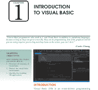

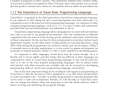

## 关于本章

引言是章节的开头，阐述了本章讨论主题的目的和目标。它也简要介绍了主题。

## 记住

这部分重申了主题中必须阅读的信息。


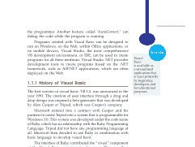

## 关键词

本节包含本章讨论的一些重要定义。关键词是标识特定记录或文档的索引条目。它还为读者提供额外信息，并提供一种易于记忆词语定义的方法。

## 你知道吗？

本节为读者提供主题的有趣事实和数据。

### 示例

本书通过示例来阐述每章中的具体观点。

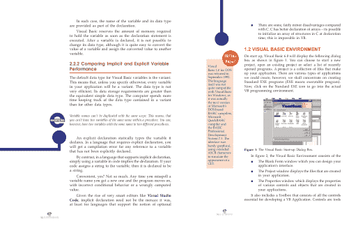

## 榜样

在各自领域取得卓越成功的人物传记，作为榜样很重要，因为它们让我们能够想象未来的自己。


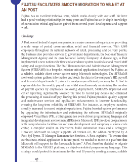

## 案例研究

这部分揭示了学生需要创造什么，并为发展沟通、团队合作和解决问题等关键技能提供了机会。

# 知识检查

这是在每章末尾提供给学生进行进度检查的。

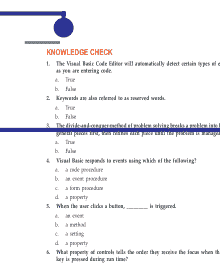

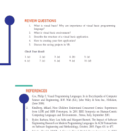

# 复习题

本节旨在分析读者的知识和能力。

## 参考文献

参考文献指的是那些以几乎相同方式讨论章节中给出主题的书籍。

## 目录

前言 xv

## 第1章 Python简介 1

- 引言 1
- 1.1 Python概述 2
  - 1.1.1 Python的历史 3
  - 1.1.2 Python特性 3
- 1.2 Python环境设置 4
  - 1.2.1 获取Python 5
  - 1.2.2 安装Python 5
  - 1.2.3 设置PATH 6
  - 1.2.4 Python环境变量 7
  - 1.2.5 运行Python 8
- 1.3 Python基本语法 10
  - 1.3.1 第一个Python程序 10
  - 1.3.2 Python标识符 11
  - 1.3.3 保留字 11
  - 1.3.4 行与缩进 12
  - 1.3.5 多行语句 13
  - 1.3.6 Python中的引号 14
  - 1.3.7 Python中的注释 14
  - 1.3.8 使用空行 15
  - 1.3.9 等待用户输入 15
  - 1.3.10 单行多条语句 15
  - 1.3.11 多条语句组作为代码块 15
  - 1.3.12 命令行参数 16
- 1.4 Python变量 16
  - 1.4.1 为变量赋值 16
  - 1.4.2 多重赋值 17
  - 1.4.3 标准数据类型 17
  - 1.4.4 数据类型转换 22
- 1.5 Python基本运算符 24
  - 1.5.1 运算符类型 24
  - 1.5.2 Python运算符优先级 28

总结 33
知识检查 34
复习题 35
参考文献 36

## 第2章 Python函数、模块和包 37

引言 37

### 2.1 Python中的函数 38

- 2.1.1 函数语法 38
- 2.1.2 文档字符串 39
- 2.1.3 return语句 40
- 2.1.4 Python中函数如何工作？ 41
- 2.1.5 Python函数参数 41
- 2.1.6 匿名函数 45
- 2.1.7 return语句 46

### 2.2 Python模块 46

- 2.2.1 关于模块的更多信息 48
- 2.2.2 标准模块 51

### 2.3 Python包 54

- 2.3.1 从包中导入* 56
- 2.3.2 包内引用 57
- 2.3.3 多目录中的包 58

总结 59
知识检查 60
复习题 61
参考文献 62

## 第3章 字典、集合和文件 63

引言 63

### 3.1 Python字典 64

- 3.1.1 访问字典元素 65
- 3.1.2 修改字典 68
- 3.1.3 dict()构造函数 73
- 3.1.4 字典方法 73
- 3.1.5 别名与复制 74

### 3.2 Python集合 75

- 3.2.1 定义集合 75
- 3.2.2 集合大小与成员关系 79
- 3.2.3 集合方法 79
- 3.2.4 创建集合 80
- 3.2.5 访问集合中的值 81
- 3.2.6 向集合添加元素 81
- 3.2.7 从集合中移除元素 81
- 3.2.8 集合的并集 82
- 3.2.9 集合的交集 82
- 3.2.10 集合的差集 83
- 3.2.11 比较集合 83

### 3.3 文件 83

- 3.3.1 open函数 84
- 3.3.2 打开不存在的文件 86
- 3.3.3 从文件读取数据 86

总结 92
知识检查 93
复习题 94
参考文献 95

## 第4章 异常、单元测试和推导式 97

引言 97

### 4.1 异常 98

- 4.1.1 处理异常 99
- 4.1.2 抛出异常 103
- 4.1.3 用户定义的异常 104
- 4.1.4 定义清理操作 106
- 4.1.5 预定义的清理操作 107

### 4.2 单元测试 108

- 4.2.1 基本示例 109
- 4.2.2 命令行接口 111
- 4.2.3 测试发现 112
- 4.2.4 组织测试代码 113
- 4.2.5 重用旧测试代码 117
- 4.2.6 跳过测试和预期失败 118

### 4.3 推导式 120

- 4.3.1 列表推导式 120
- 4.3.2 字典推导式 121
- 4.3.3 集合推导式 121
- 4.3.4 生成器推导式 121

总结 129
知识检查 130
复习题 131
参考文献 132

## 第5章 面向对象编程 133

引言 133

### 5.1 Python中的面向对象编程简介 135

- 5.1.1 Python中的类 135
- 5.1.2 Python对象（实例） 136
- 5.1.3 实例化对象 138
- 5.1.4 实例方法 140
- 5.1.5 Python对象继承 141

### 5.2 面向对象编程的方法 147

- 5.2.1 继承 148
- 5.2.2 封装 151
- 5.2.3 多态 155
- 5.2.4 抽象 159

总结 168
知识检查 169
复习题 170
参考文献 171

## 第6章 Python正则表达式 173

引言 173

### 6.1 正则表达式搜索与匹配 174

- 6.1.1 match函数 176
- 6.1.2 search函数 177
- 6.1.3 匹配与搜索 179
- 6.1.4 搜索与替换 180

### 6.2 正则表达式修饰符：选项标志 180

- 6.2.1 正则表达式模式 181
- 6.2.2 正则表达式示例 184

总结 197
知识检查 198
复习题 199
参考文献 200

## 第7章 Python多线程 201

引言 201

### 7.1 Python线程 – Python多线程 202

- 7.1.1 Python多线程入门 203
- 7.1.2 用于线程实现的Python多线程模块 204
- 7.1.3 多进程与多线程的区别 204

### 7.2 Python多线程中的函数 206

- 7.2.1 线程局部数据 208
- 7.2.2 线程对象 209
- 7.2.3 锁对象 212
- 7.2.4 RLock对象 213
- 7.2.5 条件对象 214
- 7.2.6 信号量对象 216
- 7.2.7 事件对象 218
- 7.2.8 定时器对象 219
- 7.2.9 屏障对象 220
- 7.2.10 在with语句中使用锁、条件和信号量 221

总结 224
知识检查 225
复习题 226
参考文献 227

## 第8章 Python中的操作 229

引言 229

### 8.1 Python - 决策 230

- 8.1.1 Python if语句 231
- 8.1.2 Python if-else语句 233
- 8.1.3 Python if-elif阶梯 235
- 8.1.4 Python嵌套if语句 237

### 8.2 Python - 循环 239

- 8.2.1 range()函数 241
- 8.2.2 带else的for循环 243
- 8.2.3 循环控制语句 244

### 8.3 Python - 数字 244

- 8.3.1 数字类型转换 246
- 8.3.2 数学函数 246
- 8.3.3 随机数函数 248
- 8.3.4 三角函数 248
- 8.3.5 数学常量 249

### 8.4 Python - 字符串 249

- 8.4.1 访问字符串中的值 250
- 8.4.2 更新字符串 250
- 8.4.3 转义字符 250
- 8.4.4 字符串特殊运算符 251
- 8.4.5 字符串格式化运算符 252
- 8.4.6 三引号 253
- 8.4.7 Unicode字符串 255
- 8.4.8 内置字符串方法 255

### 8.5 Python - 列表 259

- 8.5.1 访问列表中的值 259
- 8.5.2 更新列表 260
- 8.5.3 删除列表元素 261
- 8.5.4 基本列表操作 261
- 8.5.5 索引、切片和矩阵 262
- 8.5.6 内置列表函数与方法 262

### 8.6 Python - 元组 263

- 8.6.1 访问元组中的值 264
- 8.6.2 更新元组 264
- 8.6.3 删除元组元素 265
- 8.6.4 基本元组操作 266
- 8.6.5 索引、切片和矩阵 266
- 8.6.6 无封闭分隔符 266
- 8.6.7 内置元组函数 267

### 8.7 Python - 日期与时间 267

- 8.7.1 获取当前时间 269
- 8.7.2 获取格式化时间 270
- 8.7.3 获取某月的日历 270
- 8.7.4 time模块 271
- 8.7.5 calendar模块 272

总结 275

## 第9章 Python数据库编程

简介

### 9.1 Python的DB-API (SQL-API)

- 9.1.1 连接对象
- 9.1.2 游标对象
- 9.1.3 DB-API中的错误与异常处理
- 9.1.4 Python与MySQL
- 9.1.5 更多SQL操作
- 9.1.6 Python MySQL – 创建数据库

### 9.2 使用Python操作MySQL

- 9.2.1 MySQL与其他SQL数据库的比较
- 9.2.2 安装MySQL服务器和MySQL Connector/Python
- 9.2.3 与MySQL服务器建立连接

## 9.3 创建、修改和删除表

- 9.3.1 定义数据库模式
- 9.3.2 使用CREATE TABLE语句创建表
- 9.3.3 使用DESCRIBE语句查看表结构
- 9.3.4 使用ALTER语句修改表结构
- 9.3.5 使用DROP语句删除表

### 9.4 向表中插入记录

- 9.4.1 使用.execute()
- 9.4.2 使用.executemany()
- 9.4.3 从数据库读取记录
- 9.4.4 使用JOIN语句处理多表

### 9.5 更新和删除数据库中的记录

- 9.5.1 更新命令
- 9.5.2 删除命令
- 9.5.3 连接Python与MySQL的其他方式

总结
知识检查
复习题
参考文献

## 索引

# 前言

Python是一种解释型、面向对象、具有动态语义的高级编程语言。其高级内置数据结构，结合动态类型和动态绑定，使其非常适用于快速应用开发，也可用作脚本或胶水语言将现有组件连接在一起。其高级内置数据结构，结合动态类型和动态绑定；使其非常适用于快速应用开发，也可用作脚本或胶水语言将现有组件连接在一起。近年来，Python已成为世界上最流行的编程语言之一。它被用于从机器学习到构建网站和软件测试等各个领域。开发者和非开发者都可以使用它。

**本书结构**
本版分为九章。这是一本关于如何开始使用Python、为什么应该学习它以及如何学习它的综合指南。这本实践指南将带你逐步了解这门语言，从基本的编程概念开始，包括函数、递归、数据结构和面向对象设计。

**第1章** 介绍了Python。你将学习Python环境设置、Python语法和Python变量。还讨论了Python的基本运算符。

**第2章** 旨在重点介绍Python函数、模块和包。在Python中，函数是执行特定任务的一组相关语句。函数有助于将我们的程序分解成更小的模块化部分。它还描述了Python模块和Python包。

**第3章** 从Python字典开始。它还解释了Python集合和Python中使用的文件。它们可用于读写文本备忘录、音频片段、Excel文档、保存的电子邮件消息以及你碰巧存储在机器上的任何其他内容。

**第4章** 概述了如何使用异常？此外，它解释了用于验证软件每个单元是否按设计执行的单元测试。最后，本章重点介绍理解推导式，它允许从其他序列构建序列。

**第5章** 旨在讨论Python中面向对象编程的使用，包括面向对象编程的各种方法类型。编程挑战被视为如何编写逻辑，而不是如何定义数据。面向对象编程的观点是，我们真正关心的是我们想要操作的对象，而不是操作它们所需的逻辑。

**第6章** 重点介绍Python正则表达式，它帮助你使用模式中持有的专门语法来匹配或查找其他字符串或字符串集。

**第7章** 讨论了Python多线程，用于在Python程序中实现多线程，也用于同时运行多个线程（任务、函数调用）。

**第8章** 重点介绍Python中的操作。Python是一种强大的通用编程语言。它用于Web开发、数据科学、创建软件原型等。对初学者来说幸运的是，Python具有简单易用的语法。这使得Python成为初学者学习编程的绝佳语言。

**第9章** 阐述了Python数据库编程。数据库程序是业务信息系统的核心，提供文件创建、数据输入、更新、查询和报告功能。

# 第1章
## Python简介

> “现在，我相信Python比同时教学生编程和教他们C或C++或Java要容易得多，因为所有语言的细节都难得多。其他脚本语言在那里也真的不太好用。”
>
> –吉多·范罗苏姆

## 学习目标

学习本章后，你将能够：
1. 概述Python
2. 了解Python环境设置
3. 描述Python的基本语法
4. 理解Python变量
5. 讨论Python的基本运算符

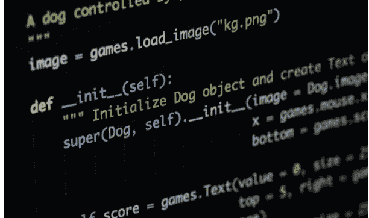

## 简介

Python是一种通用、多功能且强大的编程语言。它是一门很好的入门语言，因为它简洁易读。无论你想做什么，Python都能做到。从Web开发到机器学习再到数据科学，Python都是适合你的语言。

Python是一种高级、解释型、交互式和面向对象的脚本语言。Python被设计成高度可读的。它频繁使用英语关键字，而其他语言使用标点符号，并且它的语法结构比其他语言少。

对于学生和在职专业人士来说，Python是成为优秀软件工程师的必备技能，特别是在Web开发领域工作时。它将列出学习Python的一些关键优势：

- Python是解释型的 – Python在运行时由解释器处理。你不需要在执行程序之前编译它。这与PERL和PHP类似。
- Python是交互式的 – 你实际上可以坐在Python提示符下，直接与解释器交互来编写程序。
- Python是面向对象的 – Python支持面向对象的编程风格或技术，将代码封装在对象中。
- Python是一门初学者语言 – Python是初学者程序员的绝佳语言，支持从简单文本处理到WWW浏览器再到游戏的各种应用程序的开发。

### 1.1 Python概述

Python是一种高级、解释型、交互式和面向对象的脚本语言。Python被设计成高度可读的。它频繁使用英语关键字，而其他语言使用标点符号，并且它的语法结构比其他语言少。

- **Python是解释型的** – Python在运行时由解释器处理。你不需要在执行程序之前编译它。这与PERL和PHP类似。
- **Python是交互式的** – 你实际上可以坐在Python提示符下，直接与解释器交互来编写程序。
- **Python是面向对象的** – Python支持面向对象的编程风格或技术，将代码封装在对象中。
- **Python是一门初学者语言** – Python是初学者程序员的绝佳语言，支持从简单文本处理到WWW浏览器再到游戏的各种应用程序的开发。

#### 1.1.1 Python的历史

Python由吉多·范罗苏姆在八十年代末和九十年代初在荷兰国家数学和计算机科学研究所开发。

Python源自许多其他语言，包括ABC、Modula-3、C、C++、Algol-68、SmallTalk和Unix shell以及其他脚本语言。

Python受版权保护。像Perl一样，Python源代码现在在GNU通用公共许可证（GPL）下提供。

Python现在由研究所的一个核心开发团队维护，尽管吉多·范罗苏姆在指导其进展方面仍扮演着至关重要的角色。

#### 1.1.2 Python特性

Python的特性包括 –

- **易于学习** – Python关键字少，结构简单，语法定义清晰。这使学生能够快速掌握这门语言。
- **易于阅读** – Python代码定义更清晰，视觉上更易读。
- **易于维护** – Python的源代码相当易于维护。
- **广泛的标准库** – Python的大部分库非常可移植，并且在UNIX、Windows和Macintosh上跨平台兼容。
- **交互模式** – Python支持交互模式，允许对代码片段进行交互式测试和调试。
- **可移植** – Python可以在各种硬件平台上运行，并且在所有平台上具有相同的接口。
- **可扩展** – 你可以向Python解释器添加低级模块。这些模块使程序员能够添加或自定义他们的工具以提高效率。
- **数据库** – Python提供对所有主要商业数据库的接口。

由吉多·范罗苏姆创建并于1991年首次发布，Python的设计哲学强调代码可读性，特别是使用显著的空白。它提供了能够在小规模和大规模上进行清晰编程的构造。2018年7月，范罗苏姆在担任语言社区领导者30年后卸任。

# 基础计算机编程：Python

Java 是一种为多种平台生成软件的编程语言。

- **GUI 编程** – Python 支持 GUI 应用程序，这些程序可以创建并移植到许多系统调用、库和窗口系统，例如 Windows MFC、Macintosh 和 Unix 的 X Window 系统。
- **可扩展性** – 与 shell 脚本相比，Python 为大型程序提供了更好的结构和支持。

除了上述特性，Python 还拥有众多优良特性，以下列举部分：

- 它支持函数式、结构化编程方法以及面向对象编程。
- 它既可作为脚本语言使用，也可编译为字节码以构建大型应用程序。
- 它提供非常高级的动态数据类型并支持动态类型检查。
- 它支持自动垃圾回收。
- 它可以轻松地与 C、C++、COM、ActiveX、CORBA 和 **Java** 集成。

## 1.2 PYTHON 环境设置

Python 可在包括 Linux 和 Mac OS X 在内的多种平台上使用。让我们了解如何设置 Python 环境。

打开终端窗口并输入 “python” 以检查是否已安装以及安装的版本。

- Unix（Solaris、Linux、FreeBSD、AIX、HP/UX、SunOS、IRIX 等）
- Win 9x/NT/2000
- Macintosh（Intel、PPC、68K）
- OS/2
- DOS（多个版本）
- PalmOS
- 诺基亚手机
- Windows CE
- Acorn/RISC OS
- BeOS
- Amiga
- VMS/OpenVMS
- QNX
- VxWorks
- Psion
- Python 也已被移植到 Java 和 .NET 虚拟机

### 1.2.1 获取 Python

最新的源代码、二进制文件、文档、新闻等可在 Python 官方网站 https://www.python.org/ 获取。
你可以从 https://www.python.org/doc/ 下载 Python 文档。文档提供 HTML、PDF 和 PostScript 格式。

### 1.2.2 安装 Python

Python 发行版适用于多种平台。你只需下载适用于你平台的二进制代码并安装 Python。
如果你的平台没有可用的二进制代码，则需要 C 编译器来手动编译源代码。编译源代码在选择安装所需功能方面提供了更大的灵活性。
以下是在各种平台上安装 Python 的快速概览 –

## Unix 和 Linux 安装

以下是在 Unix/Linux 机器上安装 Python 的简单步骤。

- 打开 Web 浏览器并访问 https://www.python.org/downloads/。
- 按照链接下载适用于 Unix/Linux 的压缩源代码。
- 下载并解压文件。
- 如果你想自定义某些选项，请编辑 Modules/Setup 文件。
- 运行 ./configure 脚本
- make
- make install

这会将 Python 安装在标准位置 /usr/local/bin，其库安装在 /usr/local/lib/pythonXX，其中 XX 是 Python 的版本。

## Windows 安装

以下是在 Windows 机器上安装 Python 的步骤。

- 打开 Web 浏览器并访问 https://www.python.org/downloads/。
- 按照链接下载 Windows 安装程序 *python-XYZ.msi* 文件，其中 XYZ 是你需要安装的版本。
- 要使用此安装程序 *python-XYZ.msi*，Windows 系统必须支持 Microsoft Installer 2.0。将安装程序文件保存到本地机器，然后运行它以检查你的机器是否支持 MSI。
- 运行下载的文件。这将启动 Python 安装向导，它非常易于使用。只需接受默认设置，等待安装完成即可。

> Unix 是一个为灵活性和适应性而设计的多用户操作系统。

## Macintosh 安装

较新的 Mac 通常预装了 Python，但版本可能已过时数年。请参阅 http://www.python.org/download/mac/ 以获取有关获取当前版本以及支持 Mac 开发的额外工具的说明。对于 Mac OS X 10.3（2003 年发布）之前的旧版 Mac OS，可使用 MacPython。

Jack Jansen 维护着它，你可以在他的网站 http://www.cwi.nl/~jack/macpython.html 上访问完整的文档。你可以找到 Mac OS 安装的完整安装细节。

### 1.2.3 设置 PATH

程序和其他可执行文件可能位于多个目录中，因此操作系统提供了一个搜索路径，列出了操作系统搜索可执行文件的目录。

路径存储在一个环境变量中，这是一个由操作系统维护的命名字符串。此变量包含命令 shell 和其他程序可用的信息。

**path** 变量在 **Unix** 中命名为 PATH，在 Windows 中命名为 Path（Unix 区分大小写；Windows 不区分）。

在 Mac OS 中，安装程序会处理路径细节。要从任何特定目录调用 Python 解释器，必须将 Python 目录添加到你的路径中。

## 在 Unix/Linux 中设置路径

要在 Unix 中为特定会话将 Python 目录添加到路径 –

- **在 csh shell 中** – 输入 setenv PATH “$PATH:/usr/local/bin/python” 并按 Enter。
- **在 bash shell（Linux）中** – 输入 export PATH=”$PATH:/usr/local/bin/python” 并按 Enter。
- **在 sh 或 ksh shell 中** – 输入 PATH=”$PATH:/usr/local/bin/python” 并按 Enter。
- **注意** – /usr/local/bin/python 是 Python 目录的路径

## 在 Windows 中设置路径

要在 Windows 中为特定会话将 Python 目录添加到路径 –

**在命令提示符下** – 输入 path %path%;C:\Python 并按 Enter

### 1.2.4 Python 环境变量

以下是 Python 可识别的重要环境变量 –

| 序号 | 变量与描述 |
|---|---|
| 1 | **PYTHONPATH**<br>其作用类似于 PATH。此变量告诉 Python 解释器在哪里查找导入程序的模块文件。它应包含 Python 源库目录和包含 Python 源代码的目录。PYTHONPATH 有时由 Python 安装程序预设。 |
| 2 | **PYTHONSTARTUP**<br>它包含一个初始化文件的路径，该文件包含 Python 源代码。每次启动解释器时都会执行它。在 Unix 中命名为 .pythonrc.py，它包含加载实用程序或修改 PYTHONPATH 的命令。 |
| 3 | **PYTHONCASEOK**<br>在 Windows 中用于指示 Python 在 import 语句中查找第一个不区分大小写的匹配项。将此变量设置为任何值以激活它。 |
| 4 | **PYTHONHOME**<br>它是一个替代的模块搜索路径。通常嵌入在 PYTHONSTARTUP 或 PYTHONPATH 目录中，以便于切换模块库。 |

### 1.2.5 运行 Python

有三种不同的方式启动 Python –

## 交互式解释器

你可以从 Unix、DOS 或任何其他提供命令行解释器或 shell 窗口的系统启动 Python。

在命令行输入 **python**。
立即在交互式解释器中开始编码。
$python # Unix/Linux
或
python% # Unix/Linux
或
C:> python # Windows/DOS

以下是所有可用命令行选项的列表 –

| 序号 | 选项与描述 |
|---|---|
| 1 | -d<br>提供调试输出。 |
| 2 | -O<br>生成优化的字节码（生成 .pyo 文件）。 |
| 3 | -S<br>启动时不运行 import site 来查找 Python 路径。 |
| 4 | -v<br>详细输出（对 import 语句进行详细跟踪）。 |
| 5 | -X<br>禁用基于类的内置异常（仅使用字符串）；从 1.6 版本开始已过时。 |
| 6 | -c cmd<br>运行作为 cmd 字符串发送的 Python 脚本 |
| 7 | file<br>从给定文件运行 Python 脚本 |

## 从命令行运行脚本

可以通过在你的应用程序上调用解释器在命令行执行 Python 脚本，如下所示 –

```
$python script.py # Unix/Linux
或
python% script.py # Unix/Linux
或
C: >python script.py # Windows/DOS
```

**注意** – 确保文件权限模式允许执行。

## 集成开发环境

如果你的系统上有支持 Python 的 GUI 应用程序，你也可以从图形用户界面（GUI）环境运行 Python。

- **Unix** – IDLE 是第一个用于 Python 的 Unix IDE。
- **Windows** – PythonWin 是第一个用于 Python 的 Windows 接口，是一个带有 GUI 的 IDE。
- **Macintosh** – Python 的 Macintosh 版本连同 IDLE IDE 可从主网站获取，可下载为 MacBinary 或 BinHex’d 文件。
- 如果你无法正确设置环境，可以寻求系统管理员的帮助。确保 Python 环境正确设置并完美运行。

**注意** – 后续章节中给出的所有示例均使用 Linux CentOS 版本上的 Python 2.4.3 版本执行。

我们已经在线搭建了Python编程环境，这样你就可以在学习理论的同时，在线执行所有可用的示例。你可以随意修改任何示例并在线运行。

## 1.3 Python 基本语法

Python 语言与 **Perl**、C 和 Java 有许多相似之处。然而，这些语言之间也存在一些明确的差异。

### 1.3.1 第一个 Python 程序

让我们以不同的编程模式来执行程序。

#### 交互式编程

不传递脚本文件作为参数来调用解释器，会显示以下提示符 –

```
$ python
Python 2.4.3 (#1, Nov 11 2010, 13:34:43)
[GCC 4.1.2 20080704 (Red Hat 4.1.2-48)] on linux2
Type "help", "copyright", "credits" or "license" for more information.
>>>
```

在 Python 提示符下输入以下文本并按回车键 –

```
>>> print "Hello, Python!"
```

如果你运行的是新版本的 Python，那么你需要使用带括号的 print 语句，如 **print ("Hello, Python!")**;。然而，在 Python 2.4.3 版本中，这会产生以下结果 –

```
Hello, Python!
```

#### 脚本式编程

使用脚本参数调用解释器会开始执行脚本，直到脚本执行完毕。当脚本执行完毕后，解释器将不再处于活动状态。

让我们在一个脚本中编写一个简单的 Python 程序。Python 文件的扩展名为 **.py**。在 test.py 文件中输入以下源代码 –

```
print "Hello, Python!"
```

我们假设你已经将 Python 解释器设置在 PATH 变量中。现在，尝试按如下方式运行此程序 –

```
$ python test.py
```

这会产生以下结果 –

```
Hello, Python!
```

让我们尝试另一种执行 Python 脚本的方法。这是修改后的 test.py 文件 –

```
#!/usr/bin/python
print "Hello, Python!"
```

我们假设你可以在 /usr/bin 目录中找到 Python 解释器。现在，尝试按如下方式运行此程序 –

```
$ chmod +x test.py    # 这是为了使文件可执行
$ ./test.py
```

这会产生以下结果 –

```
Hello, Python!
```

### 1.3.2 Python 标识符

Python 标识符是用于标识变量、函数、类、模块或其他对象的名称。标识符以字母 A 到 Z 或 a 到 z 或下划线 (_) 开头，后跟零个或多个字母、下划线和数字 (0 到 9)。

Python 不允许在标识符中使用标点字符，如 @、$ 和 %。Python 是一种区分大小写的编程语言。因此，**Manpower** 和 **manpower** 在 Python 中是两个不同的标识符。

以下是 Python 标识符的命名约定 –

-   类名以大写字母开头。所有其他标识符以小写字母开头。
-   以单个前导下划线开头的标识符表示该标识符是私有的。
-   以两个前导下划线开头的标识符表示一个强私有标识符。
-   如果标识符还以两个尾随下划线结尾，则该标识符是语言定义的特殊名称。

### 1.3.3 保留字

以下列表显示了 Python 关键字。这些是保留字，你不能将它们用作常量、变量或任何其他标识符名称。所有 Python 关键字仅包含小写字母。

| and | exec | not |
| --- | --- | --- |
| assert | finally | or |
| break | for | pass |
| class | from | print |
| continue | global | raise |
| def | if | return |
| del | import | try |
| elif | in | while |
| else | is | with |
| except | lambda | yield |

### 1.3.4 行与缩进

> 此时不要试图理解逻辑。只需确保你理解了各个代码块，即使它们没有花括号。

Python 不使用花括号来表示类和函数定义或流程控制的代码块。代码块由行缩进表示，这是严格强制执行的。

缩进中的空格数量是可变的，但块内的所有语句必须缩进相同的量。例如 –

```
if True:
    print "True"
else:
    print "False"
```

然而，以下代码块会产生错误 –

```
if True:
print "Answer"
print "True"
else:
print "Answer"
print "False"
```

因此，在 Python 中，所有缩进相同空格数的连续行将构成一个代码块。以下示例包含各种语句块 –

```
#!/usr/bin/python
import sys

try:
    # 打开文件流
    file = open(file_name, "w")
except IOError:
    print "写入文件时出错：", file_name
    sys.exit()
print "输入 ", file_finish,
print "' 以完成"
while file_text != file_finish:
    file_text = raw_input("输入文本：")
    if file_text == file_finish:
        # 关闭文件
        file.close
        break
    file.write(file_text)
    file.write("\n")
file.close()
file_name = raw_input("输入文件名：")
if len(file_name) == 0:
    print "下次请输入内容"
    sys.exit()
try:
    file = open(file_name, "r")
except IOError:
    print "读取文件时出错"
    sys.exit()
file_text = file.read()
file.close()
print file_text
```

### 1.3.5 多行语句

Python 中的语句通常以新行结束。然而，Python 允许使用行继续字符 (\) 来表示该行应该继续。例如 –

```
total = item_one + \
        item_two + \
        item_three
```

包含在 [], {}, 或 () 括号中的语句不需要使用行继续字符。例如 –

```
days = ['Monday', 'Tuesday', 'Wednesday',
        'Thursday', 'Friday']
```

### 1.3.6 Python 中的引号

Python 接受单引号 (')、双引号 (") 和三引号 (''' 或 """) 来表示字符串字面量，只要字符串以相同类型的引号开始和结束即可。

三引号用于将字符串跨多行。例如，以下所有都是合法的 –

```
word = 'word'
sentence = "This is a sentence."
paragraph = """This is a paragraph. It is
made up of multiple lines and sentences."""
```

### 1.3.7 Python 中的注释

不在字符串字面量内的井号 (#) 开始一个注释。从 # 之后到物理行末尾的所有字符都是注释的一部分，Python 解释器会忽略它们。

```
#!/usr/bin/python
# 第一个注释
print "Hello, Python!" # 第二个注释
```

这会产生以下结果 –

```
Hello, Python!
```

你可以在语句或表达式之后的同一行输入注释 –

```
name = "Madisetti" # 这也是一个注释
```

你可以按如下方式注释多行 –

```
# 这是一个注释。
# 这也是一个注释。
# 这还是一个注释。
# 我已经说过了。
```

### 1.3.8 使用空行

仅包含空白字符（可能带有注释）的行称为空行，Python 会完全忽略它。

在交互式解释器会话中，你必须输入一个空的物理行来终止多行语句。

### 1.3.9 等待用户

程序的以下行显示提示符，即“按回车键退出”的语句，并等待用户采取行动 –

```
#!/usr/bin/python
raw_input("\n\nPress the enter key to exit.")
```

这里，“\n\n”用于在显示实际行之前创建两个新行。一旦用户按下该键，程序就会结束。这是一个很好的技巧，可以在用户完成应用程序之前保持控制台窗口打开。

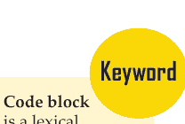

代码块是源代码的词法结构，它们被组合在一起。

### 1.3.10 单行上的多条语句

分号 ( ; ) 允许在单行上放置多条语句，前提是这些语句都不开始一个新的 **代码块**。以下是使用分号的示例片段 –

```
import sys; x = 'foo'; sys.stdout.write(x + '\n')
```

### 1.3.11 多条语句组作为套件

在 Python 中，构成单个代码块的一组单独语句称为 **套件**。复合或复杂语句，如 if、while、def 和 class，需要一个标题行和一个套件。

标题行开始语句（带有关键字）并以冒号 ( : ) 结束，后跟一行或多行构成套件的语句。例如 –

```
if expression :
```

## 1.3.12 命令行参数

许多程序在运行时可以提供一些关于其运行方式的基本信息。Python 允许你通过 `-h` 选项来实现这一点：

```
$ python -h
usage: python [option] ... [-c cmd | -m mod | file | -] [arg] ...
Options and arguments (and corresponding environment variables):
-c cmd : program passed in as string (terminates option list)
-d     : debug output from parser (also PYTHONDEBUG=x)
-E     : ignore environment variables (such as PYTHONPATH)
-h     : print this help message and exit

[ etc. ]
```

你也可以编写脚本，使其能够接受各种选项。命令行参数是一个高级主题，建议在你学习完其他 Python 概念之后再进行研究。

## 1.4 Python 变量

变量不过是用于存储值的保留内存位置。这意味着当你创建一个变量时，你就在内存中预留了一块空间。
根据变量的数据类型，解释器会分配内存并决定在保留的内存中可以存储什么。因此，通过为变量分配不同的数据类型，你可以在这些变量中存储整数、小数或字符。

### 1.4.1 为变量赋值

Python 变量不需要显式声明来预留内存空间。当你为变量赋值时，声明会自动发生。等号（`=`）用于为变量赋值。

`=` 运算符左侧的操作数是变量的名称，右侧的操作数是存储在变量中的值。*例如* –
#!/usr/bin/python

```
counter = 100           # An integer assignment
miles   = 1000.0        # A floating point
name    = "John"        # A string

print counter
print miles
print name
```

这里，100、1000.0 和 "John" 分别是赋给 *counter*、*miles* 和 *name* 变量的值。这将产生以下结果 –

```
100
1000.0
John
```

### 1.4.2 多重赋值

Python 允许你同时将单个值赋给多个变量。例如 –

```
a = b = c = 1
```

这里，创建了一个值为 1 的整数对象，所有三个变量都被赋给了同一个内存位置。你也可以将多个对象赋给多个变量。例如 –

```
a,b,c = 1,2,"john"
```

这里，两个值分别为 1 和 2 的整数对象被分别赋给变量 a 和 b，一个值为 "john" 的字符串对象被赋给变量 c。

### 1.4.3 标准数据类型

存储在内存中的数据可以是多种类型。*例如*，一个人的年龄存储为数值，而他或她的地址存储为字母数字字符。Python 有多种标准数据类型，用于定义可以对它们执行的操作以及每种类型的存储方法。

# 基础计算机编程：Python

Python 有五种标准数据类型 –

- 数字
- 字符串
- 列表
- 元组
- 字典

## Python 数字

数字数据类型存储数值。当你为数字对象赋值时，它们就被创建了。例如 –

```
var1 = 1
var2 = 10
```

你也可以使用 `del` 语句删除对数字对象的引用。`del` 语句的语法是 –

```
del var1[,var2[,var3[....,varN]]]
```

你可以使用 `del` 语句删除单个对象或多个对象。例如 –

```
del var
del var_a, var_b
```

Python 支持四种不同的数字类型 –

- int（有符号整数）
- long（长整数，也可以用八进制和十六进制表示）
- float（浮点实数）
- complex（复数）

### 示例

以下是一些数字示例 –

| int | long | float | complex |
|---|---|---|---|
| 10 | 51924361L | 0.0 | 3.14j |
| 100 | -0x19323L | 15.20 | 45.j |
| -786 | 0122L | -21.9 | 9.322e-36j |
| 080 | 0xDEFABCECBDAECBFBAE1 | 32.3+e18 | .876j |
| -0490 | 535633629843L | -90. | -.6545+0J |
| -0x260 | -052318172735L | -32.54e100 | 3e+26J |
| 0x69 | -4721885298529L | 70.2-E12 | 4.53e-7j |

Python 允许你对 long 类型使用小写字母 `l`，但建议只使用大写字母 `L`，以避免与数字 1 混淆。Python 显示长整数时使用大写字母 `L`。

- 复数由一对有序的实浮点数表示，形式为 `x + yj`，其中 `x` 和 `y` 是实数，`j` 是虚数单位。

## Python 字符串

Python 中的字符串被标识为用引号括起来的连续字符集。Python 允许使用单引号或双引号对。可以使用切片操作符（`[ ]` 和 `[:]`）获取字符串的子集，索引从字符串开头的 0 开始，到末尾的 -1 结束。

加号（`+`）是字符串连接运算符，星号（`*`）是重复运算符。例如 –

```
#!/usr/bin/python

str = 'Hello World!'

print str           # Prints complete string
print str[0]        # Prints first character of the string
print str[2:5]      # Prints characters starting from 3rd to 5th
print str[2:]       # Prints string starting from 3rd character
print str * 2       # Prints string two times
print str + "TEST"  # Prints concatenated string
```

这将产生以下结果 –

```
Hello World!
H
llo
llo World!
Hello World!Hello World!
Hello World!TEST
```

## Python 列表

列表是 Python 复合数据类型中最通用的一种。列表包含用逗号分隔并用方括号（`[]`）括起来的项目。在某种程度上，列表类似于 C 语言中的数组。它们之间的一个区别是，属于列表的所有项目可以是不同的**数据类型**。

存储在列表中的值可以使用切片操作符（`[ ]` 和 `[:]`）访问，索引从列表开头的 0 开始，到末尾的 -1 结束。加号（`+`）是列表连接运算符，星号（`*`）是重复运算符。例如 –

```
#!/usr/bin/python

list = [ ‘abcd’, 786 , 2.23, ‘john’, 70.2 ]
tinylist = [123, ‘john’]

print list        # Prints complete list
print list[0]     # Prints first element of the list
print list[1:3]   # Prints elements starting from 2nd till 3rd
print list[2:]    # Prints elements starting from 3rd element
print tinylist * 2  # Prints list two times
print list + tinylist # Prints concatenated lists
```

这将产生以下结果 –

```
[‘abcd’, 786, 2.23, ‘john’, 70.2]
abcd
[786, 2.23]
[2.23, ‘john’, 70.2]
[123, ‘john’, 123, ‘john’]
[‘abcd’, 786, 2.23, ‘john’, 70.2, 123, ‘john’]
```

## Python 元组

元组是另一种类似于列表的序列数据类型。元组由用逗号分隔的多个值组成。然而，与列表不同，元组是用圆括号括起来的。

列表和元组之间的主要区别是：列表用方括号（`[ ]`）括起来，其元素和大小可以更改，而元组用圆括号（`( )`）括起来，不能更新。元组可以被认为是**只读**列表。例如 –

```
#!/usr/bin/python

tuple = ( ‘abcd’, 786 , 2.23, ‘john’, 70.2 )
tinytuple = (123, ‘john’)

print tuple           # Prints complete list
print tuple[0]        # Prints first element of the list
print tuple[1:3]      # Prints elements starting from 2nd till 3rd
print tuple[2:]       # Prints elements starting from 3rd element
print tinytuple * 2   # Prints list two times
print tuple + tinytuple # Prints concatenated lists
```

这将产生以下结果 –

```
(‘abcd’, 786, 2.23, ‘john’, 70.2)
abcd
(786, 2.23)
(2.23, ‘john’, 70.2)
(123, ‘john’, 123, ‘john’)
(‘abcd’, 786, 2.23, ‘john’, 70.2, 123, ‘john’)
```

以下代码对元组是无效的，因为我们试图更新一个元组，这是不允许的。类似的情况在列表中是可能的 –

```
#!/usr/bin/python

tuple = ( ‘abcd’, 786 , 2.23, ‘john’, 70.2 )
list = [ ‘abcd’, 786 , 2.23, ‘john’, 70.2 ]
tuple[2] = 1000    # Invalid syntax with tuple
list[2] = 1000     # Valid syntax with list
```

## Python 字典

Python 的字典是一种哈希表类型。它们的工作方式类似于 Perl 中的关联数组或哈希，由键值对组成。字典的键几乎可以是任何不可变类型，而值可以是任意类型。

## 1.4.4 数据类型转换

有时，你可能需要在内置类型之间进行转换。要在类型之间转换，你只需将类型名称用作函数即可。
有几个内置函数可以执行从一种数据类型到另一种数据类型的转换。这些函数返回一个表示转换后值的新对象。

| 序号 | 函数与描述 |
| :--- | :--- |
| 1 | **int(x [,base])** 将 x 转换为整数。如果 x 是字符串，则 base 指定基数。 |
| 2 | **long(x [,base])** 将 x 转换为长整数。如果 x 是字符串，则 base 指定基数。 |
| 3 | **float(x)** 将 x 转换为浮点数。 |
| 4 | **complex(real [,imag])** 创建一个复数。 |
| 5 | **str(x)** 将对象 x 转换为字符串表示形式。 |
| 6 | **repr(x)** 将对象 x 转换为表达式字符串。 |
| 7 | **eval(str)** 计算一个字符串并返回一个对象。 |
| 8 | **tuple(s)** 将 s 转换为元组。 |
| 9 | **list(s)** 将 s 转换为列表。 |
| 10 | **set(s)** 将 s 转换为集合。 |
| 11 | **dict(d)** 创建一个字典。d 必须是 (键, 值) 元组的序列。 |
| 12 | **frozenset(s)** 将 s 转换为冻结集合。 |
| 13 | **chr(x)** 将整数转换为字符。 |
| 14 | **unichr(x)** 将整数转换为 Unicode 字符。 |
| 15 | **ord(x)** 将单个字符转换为其整数值。 |
| 16 | **hex(x)** 将整数转换为十六进制字符串。 |
| 17 | **oct(x)** 将整数转换为八进制字符串。 |

## 1.5 PYTHON 基本运算符

运算符是可以操作操作数值的构造。考虑表达式 4 + 5 = 9。这里，4 和 5 称为操作数，+ 称为运算符。

### 1.5.1 运算符类型

Python 语言支持以下类型的运算符。

- 算术运算符
- 比较（关系）运算符
- 赋值运算符
- 逻辑运算符
- 位运算符
- 成员运算符
- 身份运算符

### Python 算术运算符

假设变量 a 保存 10，变量 b 保存 20，则 –

| 运算符 | 描述 | 示例 |
| --- | --- | --- |
| + 加法 | 将运算符两侧的值相加。 | a + b = 30 |
| - 减法 | 从左操作数中减去右操作数。 | a – b = -10 |
| * 乘法 | 将运算符两侧的值相乘。 | a * b = 200 |
| / 除法 | 用左操作数除以右操作数。 | b / a = 2 |
| % 取模 | 用左操作数除以右操作数并返回余数。 | b % a = 0 |
| ** 指数 | 对运算符执行指数（幂）计算。 | a**b = 10 的 20 次方 |
| // | 整除 - 操作数的除法，结果是移除小数点后数字的商。但如果其中一个操作数为负数，则结果向下取整，即向远离零的方向（向负无穷大）取整 – | 9//2 = 4 且 9.0//2.0 = 4.0, -11//3 = -4, -11.0//3 = -4.0 |

### Python 比较运算符

这些运算符比较它们两侧的值并确定它们之间的关系。它们也称为关系运算符。
假设变量 a 保存 10，变量 b 保存 20，则 –

| 运算符 | 描述 | 示例 |
| --- | --- | --- |
| == | 如果两个操作数的值相等，则条件变为真。 | (a == b) 为假。 |
| != | 如果两个操作数的值不相等，则条件变为真。 | (a != b) 为真。 |
| <> | 如果两个操作数的值不相等，则条件变为真。 | (a <> b) 为真。这与 != 运算符类似。 |
| > | 如果左操作数的值大于右操作数的值，则条件变为真。 | (a > b) 为假。 |
| < | 如果左操作数的值小于右操作数的值，则条件变为真。 | (a < b) 为真。 |
| >= | 如果左操作数的值大于或等于右操作数的值，则条件变为真。 | (a >= b) 为假。 |
| <= | 如果左操作数的值小于或等于右操作数的值，则条件变为真。 | (a <= b) 为真。 |

### Python 赋值运算符

假设变量 a 保存 10，变量 b 保存 20，则 –

| 运算符 | 描述 | 示例 |
| :--- | :--- | :--- |
| = | 将右侧操作数的值赋给左侧操作数。 | c = a + b 将 a + b 的值赋给 c |
| += 加后赋值 | 它将右操作数加到左操作数，并将结果赋给左操作数。 | c += a 等价于 c = c + a |
| -= 减后赋值 | 它从左操作数中减去右操作数，并将结果赋给左操作数。 | c -= a 等价于 c = c - a |
| *= 乘后赋值 | 它将右操作数与左操作数相乘，并将结果赋给左操作数。 | c *= a 等价于 c = c * a |
| /= 除后赋值 | 它用左操作数除以右操作数，并将结果赋给左操作数。 | c /= a 等价于 c = c / a |
| %= 取模后赋值 | 它使用两个操作数进行取模运算，并将结果赋给左操作数。 | c %= a 等价于 c = c % a |
| **= 指数后赋值 | 对运算符执行指数（幂）计算，并将值赋给左操作数。 | c **= a 等价于 c = c ** a |
| //= 整除后赋值 | 它对运算符执行整除运算，并将值赋给左操作数。 | c //= a 等价于 c = c // a |

### Python 位运算符

位运算符作用于位并逐位执行操作。假设 a = 60；b = 13；现在在二进制格式中它们将如下所示 –

```
a = 0011 1100
b = 0000 1101
-----------------
a&b = 0000 1100
a|b = 0011 1101
a^b = 0011 0001
~a  = 1100 0011
```

Python 语言支持以下位运算符

| 运算符 | 描述 | 示例 |
| --- | --- | --- |
| & 按位与 | 如果两个操作数中都存在该位，则将该位复制到结果中。 | (a & b) (意味着 0000 1100) |
| \| 按位或 | 如果任一操作数中存在该位，则将其复制。 | (a \| b) = 61 (意味着 0011 1101) |
| ^ 按位异或 | 如果该位在一个操作数中设置但不在两个操作数中都设置，则将其复制。 | (a ^ b) = 49 (意味着 0011 0001) |
| ~ 按位取反 | 它是一元运算符，具有“翻转”位的效果。 | (~a) = -61 (由于是有符号二进制数，在二进制补码形式中意味着 1100 0011)。 |
| << 左移 | 左操作数的值按右操作数指定的位数向左移动。 | a << 2 = 240 (意味着 1111 0000) |
| >> 右移 | 左操作数的值按右操作数指定的位数向右移动。 | a >> 2 = 15 (意味着 0000 1111) |

### Python 逻辑运算符

Python 语言支持以下逻辑运算符。假设变量 a 保存 10，变量 b 保存 20，则

用于反转其操作数的逻辑状态。

| 运算符 | 描述 | 示例 |
| --- | --- | --- |
| and 逻辑与 | 如果两个操作数都为真，则条件变为真。 | (a and b) 为真。 |
| or 逻辑或 | 如果两个操作数中任何一个非零，则条件变为真。 | (a or b) 为真。 |
| not 逻辑非 | 用于反转其操作数的逻辑状态。 | Not(a and b) 为假。 |

> 记住
关系运算符用于比较值。它根据条件返回 True 或 False。这些运算符也称为比较运算符。

## Python 成员运算符

Python 的成员运算符用于测试是否在序列（如字符串、列表或元组）中存在某个成员。共有两个成员运算符，如下所述：

| 运算符 | 描述 | 示例 |
| :--- | :--- | :--- |
| in | 如果在指定的序列中找到变量，则计算结果为 true，否则为 false。 | x in y，如果 x 是序列 y 的成员，则此处的 in 结果为 1。 |
| not in | 如果在指定的序列中未找到变量，则计算结果为 true，否则为 false。 | x not in y，如果 x 不是序列 y 的成员，则此处的 not in 结果为 1。 |

## Python 身份运算符

身份运算符用于比较两个对象的内存位置。共有两个身份运算符，如下所述：

| 运算符 | 描述 | 示例 |
| :--- | :--- | :--- |
| is | 如果运算符两侧的变量指向同一个对象，则计算结果为 true，否则为 false。 | x is y，如果 id(x) 等于 id(y)，则此处的 **is** 结果为 1。 |
| is not | 如果运算符两侧的变量指向同一个对象，则计算结果为 false，否则为 true。 | x is not y，如果 id(x) 不等于 id(y)，则此处的 **is not** 结果为 1。 |

## 1.5.2 Python 运算符优先级

下表列出了所有运算符，从最高优先级到最低优先级。

| 运算符 | 描述 |
| :--- | :--- |
| ** | 幂运算（求幂） |
| ~ + - | 按位取反、一元正号和一元负号（后两者的名称分别为 +@ 和 -@） |
| * / % // | 乘法、除法、取模和整除 |
| + - | 加法和减法 |
| >> << | 右移和左移位运算 |
| & | 按位与 |
| ^ | 按位异或和按位或 |
| <= <> >= | 比较运算符 |
| <> == != | 相等运算符 |
| = %= /= //= -= += *= **= | 赋值运算符 |
| is is not | 身份运算符 |
| in not in | 成员运算符 |
| not or and | 逻辑运算符 |

运算符优先级影响表达式的计算方式。

x = 7 + 3 * 2; 此处，x 被赋值为 13，而不是 20，因为运算符 * 的优先级高于 +，所以它先计算 3*2，然后再加上 7。


此处，优先级最高的运算符出现在表格顶部，优先级最低的出现在底部。

### 示例

```
#!/usr/bin/python

a = 20
b = 10
c = 15
d = 5
e = 0

e = (a + b) * c / d      #( 30 * 15 ) / 5
print "Value of (a + b) * c / d is ", e

e = ((a + b) * c) / d    # (30 * 15 ) / 5
print "Value of ((a + b) * c) / d is ", e

e = (a + b) * (c / d);   # (30) * (15/5)
print "Value of (a + b) * (c / d) is ", e

e = a + (b * c) / d;       #  20 + (150/5)
print "Value of a + (b * c) / d is ",  e
```

当你执行上述程序时，它会产生以下结果：

Value of (a + b) * c / d is 90
Value of ((a + b) * c) / d is 90
Value of (a + b) * (c / d) is 90
Value of a + (b * c) / d is 50

## 榜样


## 吉多·范罗苏姆

吉多·范罗苏姆（Guido van Rossum；1956年1月31日出生）是一位荷兰程序员，最为人所知的是作为 Python 编程语言的作者，他曾是该语言的“终身仁慈独裁者”（BDFL），直到2018年7月卸任。

## 教育与生活

范罗苏姆在荷兰出生并长大，于1982年在阿姆斯特丹大学获得数学和计算机科学硕士学位。他有一个兄弟，贾斯特·范罗苏姆（Just van Rossum），他是一位字体设计师和程序员，设计了“Python Powered”标志中使用的字体。

吉多与他的妻子金·纳普（Kim Knapp）和他们的儿子住在加利福尼亚州的贝尔蒙特。根据他的主页和荷兰命名惯例，当单独使用他的姓氏时，“van”需要大写，但当使用他的名和姓一起时则不需要大写。

## 工作经历

在数学与计算机科学研究所（CWI）工作期间，范罗苏姆于1986年编写并为 BSD Unix 贡献了一个 glob() 例程，并协助开发了 ABC 编程语言。他曾表示：“我试图提及 ABC 的影响，因为我感激在那个项目中学到的一切以及与我共事的人。”他还创建了 Grail，一个用 Python 编写的早期网络浏览器，并参与了关于 HTML 标准的讨论。

他曾为多个研究机构工作，包括荷兰的数学与计算机科学研究所（CWI）、美国国家标准与技术研究院（NIST）以及国家研究计划公司（CNRI）。从2000年到2003年，他在 Zope 公司工作。2003年，范罗苏姆离开 Zope 加入 Elemental Security。在那里，他为该组织开发了一种定制的编程语言。从2005年到2012年12月，他在 Google 工作，期间他花了一半的时间开发 Python 语言。2013年1月，他开始在 Dropbox 工作。

## Python

1989年12月，范罗苏姆一直在寻找一个“能让[他]在圣诞节前后的一周里有事可做的‘业余’编程项目”，因为他的办公室关闭了，于是他决定为一个“他最近一直在思考的新的脚本语言：一个能吸引 Unix/C 黑客的 ABC 后代”编写一个解释器。他将选择“Python”这个名字归因于“当时心情有点不羁（并且是*蒙提·派森的飞行马戏团*的忠实粉丝）”。他解释说，Python 的前身 ABC 受到了 SETL 的启发，并指出 ABC 的共同开发者兰伯特·梅尔滕斯（Lambert Meertens）在提出最终的 ABC 设计之前，“在纽约大学的 SETL 小组待了一年”。2018年7月，范罗苏姆宣布他将卸任 Python 编程语言的 BDFL 职位。

## 人人皆可编程

1999年，范罗苏姆向 DARPA 提交了一份名为“人人皆可编程”的资助提案，其中他进一步定义了 Python 的目标：

- 一种简单直观的语言，同时与主要竞争对手一样强大
- 开源，因此任何人都可以为其发展做出贡献
- 代码像纯英语一样易于理解
- 适用于日常任务，允许较短的开发时间

Python 已发展成为一种流行的编程语言。截至2017年10月，它是 GitHub（一个社交编码网站）上第二受欢迎的语言，仅次于 Javascript，领先于 Java。根据一项编程语言流行度调查，它在招聘信息中被提及的频率始终位列前10名。此外，根据 TIOBE 编程社区指数，Python 也始终位列最受欢迎的10种语言之列。

## 蒙德里安

在 Google，范罗苏姆开发了蒙德里安（Mondrian），一个基于网络的代码审查系统，用 Python 编写并在公司内部使用。他以荷兰画家皮特·蒙德里安（Piet Mondriaan）的名字为该软件命名。他还以荷兰设计师赫里特·里特费尔德（Gerrit Rietveld）的名字命名了另一个相关的软件项目。

## Dropbox

2013年，范罗苏姆开始在云文件存储公司 Dropbox 工作。

# 总结

- Python 是一种通用、多功能且强大的编程语言。它是一门很好的入门语言，因为它简洁易读。无论你想做什么，Python 都能胜任。
- Python 是一种高级、解释型、交互式和面向对象的脚本语言。Python 的设计目标是高度可读性。
- 对于学生和在职专业人士来说，Python 是成为优秀软件工程师的必备技能，尤其是在从事 Web 开发领域工作时。
- Python 发行版适用于多种平台。你只需下载适用于你平台的二进制代码并安装 Python 即可。
- Python 标识符是用于标识变量、函数、类、模块或其他对象的名称。
- Python 不提供花括号来表示类和函数定义或流程控制的代码块。
- Python 中的语句通常以新行结束。但是，Python 允许使用行继续字符（\）来表示该行应继续。
- 仅包含空白字符（可能带有注释）的行称为空行，Python 会完全忽略它。

# 知识检查

1.  关于Python，以下哪项是正确的？
    a. Python是一种高级、解释型、交互式、面向对象的脚本语言。
    b. Python被设计为具有高度可读性。
    c. 它频繁使用英语关键字，而其他语言使用标点符号，并且它的语法结构比其他语言更少。
    d. 以上全部。

2.  关于Python，以下哪项是正确的？
    a. 它支持函数式和结构化编程方法，以及面向对象编程。
    b. 它可以用作脚本语言，也可以编译为字节码以构建大型应用程序。
    c. 它提供非常高级的动态数据类型，并支持动态类型检查。
    d. 以上全部。

3.  以下哪个Python环境变量告诉Python解释器在哪里查找导入程序的模块文件？
    a. Pythonpath
    b. Pythonstartup
    c. Pythoncaseok
    d. Pythonhome

4.  以下哪种数据类型在Python中不受支持？
    a. 列表
    b. 切片
    c. 字符串
    d. 数字

5.  关于Python中的元组，以下哪项是正确的？
    a. 元组是另一种类似于列表的序列数据类型。
    b. 元组由多个用逗号分隔的值组成。
    c. 然而，与列表不同，元组包含在圆括号内。
    d. 以上全部。

6.  标识符的最大可能长度是多少？
    a. 16
    b. 32
    c. 64
    d. 以上都不是

7.  谁开发了Python语言？
    a. Zim Den
    b. Guido van Rossum
    c. Niene Stom
    d. Wick van Rossum

8.  Python语言是在哪一年开发的？
    a. 1995
    b. 1972
    c. 1981
    d. 1989

# 复习题

1.  什么是Python？列举Python的一些特性。
2.  pythonpath、pythonstartup、Pythoncaseok和pythonhome环境变量的目的是什么？
3.  Python支持哪些数据类型？
4.  什么是Python的字典？
5.  Python中元组和列表的区别是什么？

# 检查你的结果

1. (d) 2. (d) 3. (a) 4. (b) 5. (d)
6. (d) 7. (b) 8. (d)

## 参考文献

1.  Deily, Ned (2018年3月28日). “Python 3.7.0现已可用”. Python Insider. The Python Core Developers. 于2018年3月29日检索.
2.  Downey, Allen B. (2012年5月). Think Python: How to Think Like a Computer Scientist (第1.6.6版).
3.  Guttag, John V. (2016-08-12). Introduction to Computation and Programming Using Python: With Application to Understanding Data. MIT Press.
4.  Hamilton, Naomi (2008年8月5日). “编程语言A-Z：Python”. Computerworld. 于2008年12月29日从原始存档. 于2010年3月31日检索.
5.  Peterson, Benjamin (2018年5月1日). “Python 2.7.15发布”. Python Insider. The Python Core Developers. 于2018年5月1日检索.
6.  Summerfield, Mark (2009). Programming in Python 3 (第2版). Addison-Wesley Professional.

## 第2章
PYTHON函数、模块和包

> “每个人都知道，任何不显示Python是最佳语言的脚本语言对决，其设计本身就是有缺陷的。”
> –Max M

## 学习目标

学习本章后，你将能够：
1.  讨论Python中的函数
2.  描述Python模块和Python包

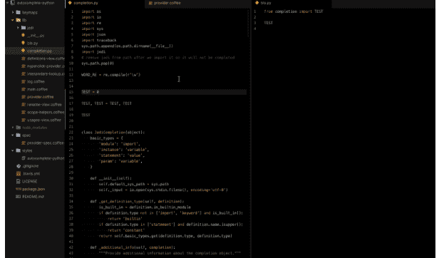

## 引言

Python函数是一组相关的语句，旨在执行计算、逻辑或评估任务。其思想是将一些常见或重复执行的任务组合在一起，形成一个函数，这样我们就不必为不同的输入一遍又一遍地编写相同的代码，而是可以反复调用函数来重用其中包含的代码。

函数是应用程序最重要的方面。函数可以定义为可重用代码的组织块，可以在需要时随时调用。

Python允许我们将大型程序划分为称为函数的基本构建块。函数包含由{}括起来的一组编程语句。一个函数可以被多次调用，从而为Python程序提供可重用性和模块化。

函数帮助程序员将程序分解成更小的部分。它非常有效地组织代码，并避免代码重复。随着程序的增长，函数使程序更加有组织。

Python为我们提供了各种内置函数，如range()或print()。此外，用户可以创建自己的函数，这些函数被称为用户定义函数。

## 2.1 PYTHON中的函数

在Python中，函数是执行特定任务的一组相关语句。函数帮助我们将程序分解成更小、更模块化的块。随着我们的程序变得越来越大，函数使其更有组织、更易于管理。

此外，它避免了重复，并使代码可重用。

### 2.1.1 函数语法

```
def function_name(parameters):
    """docstring"""
    statement(s)
```

上面显示的是一个函数定义，它包含以下组件。

- 关键字`def`标记函数头的开始。
- 一个函数名，用于唯一标识它。函数命名遵循Python中编写标识符的相同规则。
- 参数（实参），通过它们我们将值传递给函数。它们是可选的。
- 一个冒号（:）标记函数头的结束。
- 可选的文档字符串（docstring），用于描述函数的功能。
- 一个或多个有效的Python**语句**，构成函数体。语句必须具有相同的缩进级别（通常是4个空格）。
- 一个可选的return语句，用于从函数返回一个值。

### 函数示例

```
def greet(name):
    """This function greets to
    the person passed in as
    a parameter"""
    print("Hello, " + name + ". Good morning!")
```

### 如何在Python中调用函数

一旦我们定义了一个函数，我们就可以从另一个函数、程序甚至Python提示符调用它。要调用一个函数，我们只需输入函数名和适当的参数。

```
>>> greet('Paul')
Hello, Paul. Good morning!
```

### 2.1.2 文档字符串

函数头之后的第一个字符串称为文档字符串，是documentation string的缩写。它用于简要解释函数的功能。虽然可选，但文档是一种良好的编程习惯。除非你能记住上周晚餐吃了什么，否则请始终为你的代码编写文档。

在上面的例子中，我们在函数头正下方有一个文档字符串。我们通常使用三引号，以便文档字符串可以扩展到多行。这个字符串可以作为函数的`__doc__`属性使用。

例如：
尝试在Python shell中运行以下内容以查看输出。

```
>>> print(greet.__doc__)
This function greets to
the person passed into the
name parameter
```

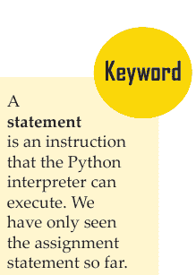

### 2.1.3 Return语句

return语句用于退出函数并返回到调用它的地方。

Return语法
```
return [expression_list]
```

此语句可以包含一个表达式，该表达式被求值并返回其值。如果语句中没有表达式，或者函数内部没有return语句，那么函数将返回`None`对象。

例如：

```
>>> print(greet("May"))
Hello, May. Good morning!
None
```

这里，`None`是返回的值。

Return示例

```
def absolute_value(num):
    """This function returns the absolute
    value of the entered number"""

    if num >= 0:
        return num
    else:
        return -num
```

```
# Output: 2
print(absolute_value(2))

# Output: 4
print(absolute_value(-4))
```

> 没有return语句的函数默认返回一个叫做`None`的东西。

### 2.1.4 函数在Python中如何工作？

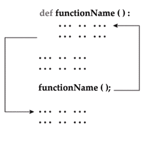

> **你知道吗？**
> 谷歌在2009年启动了一个名为Unladen Swallow的项目，旨在通过使用LLVM将Python解释器的速度提高五倍，并改进其多线程能力以扩展到数千个核心。

### 2.1.5 Python函数参数

你可以使用以下类型的形参来调用函数 –

- 必需参数
- 关键字参数
- 默认参数
- 可变长度参数

#### 必需参数

必需参数是以正确的位置顺序传递给函数的参数。这里，函数调用中的参数数量必须与函数定义完全匹配。

要调用函数`printme()`，你肯定需要传递一个参数，否则它会给出如下语法错误 –

```
#!/usr/bin/python

# Function definition is here
def printme( str ):
   "This prints a passed string into this function"
   print str
   return;
```

## 现在你可以调用 printme 函数
printme()
当执行上述代码时，会产生以下结果 –
Traceback (most recent call last):
  File "test.py", line 11, in <module>
    printme();
TypeError: printme() takes exactly 1 argument (0 given)

## 关键字参数

关键字参数与函数调用有关。当你在函数调用中使用关键字参数时，调用者通过参数名来识别参数。
这允许你跳过参数或以非顺序的方式放置它们，因为 Python 解释器能够使用提供的关键字将值与参数匹配。你也可以通过以下方式对 `printme()` 函数进行关键字调用 –

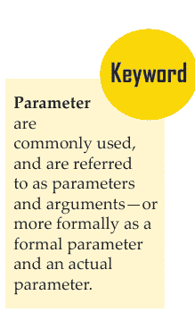

```
#!/usr/bin/python

# Function definition is here
def printme( str ):
   "This prints a passed string into this function"
   print str
   return;

# Now you can call printme function
printme( str = "My string" )
```

当执行上述代码时，会产生以下结果 –

My string

以下示例给出了更清晰的说明。请注意，**参数**的顺序无关紧要。

```
#!/usr/bin/python
# Function definition is here
def printinfo( name, age ):
    "This prints a passed info into this function"
    print "Name: ", name
    print "Age ", age
    return;
# Now you can call printinfo function
printinfo( age=50, name="miki" )
```

当执行上述代码时，会产生以下结果 –
Name: miki
Age 50

## 默认参数

默认参数是指在函数调用中，如果未为该参数提供值，则假定其为默认值的参数。以下示例展示了默认参数的概念，如果未传递年龄，则打印默认年龄 –

```
#!/usr/bin/python
# Function definition is here
def printinfo( name, age = 35 ):
    "This prints a passed info into this function"
    print "Name: ", name
    print "Age ", age
    return;
# Now you can call printinfo function
printinfo( age=50, name="miki" )
printinfo( name="miki" )
```

当执行上述代码时，会产生以下结果 –
Name: miki
Age 50
Name: miki
Age 35

## 可变长度参数

你可能需要处理比定义函数时指定的参数更多的参数。这些参数被称为 *可变长度* 参数，与必需参数和默认参数不同，它们在函数定义中没有命名。
带有非关键字可变参数的函数语法如下 –

```
def functionname([formal_args,] *var_args_tuple ):
   "function_docstring"
   function_suite
   return [expression]
```

一个星号 (*) 放置在保存所有非关键字可变参数值的变量名之前。如果在函数调用期间未指定额外参数，则此元组保持为空。以下是一个简单的示例 –

```
#!/usr/bin/python
# Function definition is here
def printinfo( arg1, *vartuple ):
   "This prints a variable passed arguments"
   print "Output is: "
   print arg1
   for var in vartuple:
      print var
   return;
# Now you can call printinfo function
printinfo( 10 )
printinfo( 70, 60, 50 )
```

当执行上述代码时，会产生以下结果 –

```
Output is:
10
Output is:
70
60
50
```

## 2.1.6 匿名函数

这些函数被称为匿名函数，因为它们不是使用 `def` 关键字以标准方式声明的。你可以使用 `lambda` 关键字来创建小型匿名函数。

Lambda 形式可以接受任意数量的参数，但只能以表达式的形式返回一个值。它们不能包含命令或多个表达式。

匿名函数不能直接调用 `print`，因为 `lambda` 需要一个表达式。

Lambda 函数有自己的局部命名空间，不能访问其参数列表和全局命名空间中的变量以外的变量。

尽管 lambda 看起来像是函数的单行版本，但它们并不等同于 C 或 C++ 中的内联语句，后者的目的是在调用时绕过函数栈分配以提高性能。

### 语法

Lambda 函数的语法仅包含单个语句，如下所示 –
lambda [arg1 [,arg2,......argn]]:expression

以下是展示 lambda 函数如何工作的示例 –

```
#!/usr/bin/python

# Function definition is here
sum = lambda arg1, arg2: arg1 + arg2;

# Now you can call sum as a function
print "Value of total : ", sum( 10, 20 )
print "Value of total : ", sum( 20, 20 )
```

> 匿名函数通常作为参数传递给高阶函数，或用于构造需要返回函数的高阶函数的结果。

当执行上述代码时，会产生以下结果 –

Value of total : 30
Value of total : 40

## 2.1.7 return 语句

语句 `return [expression]` 退出一个函数，可选择将表达式返回给调用者。没有参数的 `return` 语句与 `return None` 相同。
以上所有示例都没有返回任何值。你可以按如下方式从函数返回一个值 –
#!/usr/bin/python

```
# Function definition is here
def sum( arg1, arg2 ):
    # Add both the parameters and return them."
    total = arg1 + arg2
    print "Inside the function : ", total
    return total;

# Now you can call sum function
total = sum( 10, 20 );
print "Outside the function : ", total
```

当执行上述代码时，会产生以下结果 –
Inside the function : 30
Outside the function : 30

## 2.2 PYTHON 模块

Python 有一种方法可以将定义放在文件中，并在脚本或交互式解释器实例中使用它们。这样的文件被称为 *模块*；模块中的定义可以被 *导入* 到其他模块或 *主* 模块中（主模块是在顶层执行的脚本和计算器模式中你可以访问的变量集合）。
模块是包含 Python 定义和语句的文件。**文件名**是模块名加上后缀 `.py`。在模块内部，模块的名称（作为字符串）作为全局变量 `__name__` 的值可用。例如，使用你喜欢的文本编辑器在当前目录中创建一个名为 `fibo.py` 的文件，内容如下：

```
# Fibonacci numbers module

def fib(n):    # write Fibonacci series up to n
    a, b = 0, 1
    while b < n:
        print b,
        a, b = b, a+b

def fib2(n):   # return Fibonacci series up to n
    result = []
    a, b = 0, 1
    while b < n:
        result.append(b)
        a, b = b, a+b
    return result
```

> 文件名是用于唯一标识存储在文件系统中的计算机文件的名称。

现在进入 Python 解释器并使用以下命令导入此模块：

```
>>> import fibo
```

这不会将 `fibo` 中定义的函数名称直接放入当前符号表；它只将模块名 `fibo` 放入其中。使用模块名，你可以访问这些函数：

```
>>> fibo.fib(1000)
1 1 2 3 5 8 13 21 34 55 89 144 233 377 610 987
>>> fibo.fib2(100)
[1, 1, 2, 3, 5, 8, 13, 21, 34, 55, 89]
>>> fibo.__name__
'fibo'
```

如果你打算经常使用某个函数，可以将其分配给一个局部名称：

```
>>> fib = fibo.fib
>>> fib(500)
377 233 144 89 55 34 21 13 8 5 3 2 1 1
```

## 2.2.1 关于模块的更多信息

模块可以包含可执行语句以及函数定义。这些语句旨在初始化模块。它们仅在 `import` 语句中首次遇到模块名时执行。（如果文件作为脚本执行，它们也会运行。）

每个模块都有自己的私有符号表，该表被模块中定义的所有函数用作全局符号表。因此，模块的作者可以在模块中使用全局变量，而无需担心与用户的全局变量发生意外冲突。另一方面，如果你知道自己在做什么，可以使用与引用其函数相同的符号 `modname.itemname` 来访问模块的全局变量。

模块可以导入其他模块。通常（但不是必须）将所有 `import` 语句放在模块（或脚本）的开头。导入的模块名被放入导入模块的全局符号表中。

有一种 `import` 语句的变体，它将名称从模块直接导入到导入模块的符号表中。例如：

```
>>> from fibo import fib, fib2
>>> fib(500)
1 1 2 3 5 8 13 21 34 55 89 144 233 377
```

这不会在本地符号表中引入导入来源的模块名（因此在示例中，`fibo` 未定义）。

甚至有一种变体可以导入模块定义的所有名称：

```
>>> from fibo import *
>>> fib(500)
1 1 2 3 5 8 13 21 34 55 89 144 233 377
```

这会导入除以下划线 (_) 开头的名称之外的所有名称。

请注意，通常不赞成从模块或包中导入 * 的做法，因为它通常会导致代码可读性差。但是，在交互式会话中使用它来节省输入是可以的。

如果模块名后跟 `as`，则 `as` 后的名称直接绑定到导入的模块。

```
>>> import fibo as fib
```

>>> fib.fib(500)
0 1 1 2 3 5 8 13 21 34 55 89 144 233 377

这实际上与使用 `import fibo` 导入模块的方式相同，唯一的区别是它被导入为 `fib`。

当使用 `from` 语句时，也可以达到类似的效果：

```
>>> from fibo import fib as fibonacci
>>> fibonacci(500)
0 1 1 2 3 5 8 13 21 34 55 89 144 233 377
```

## 将模块作为脚本执行

当你使用 `python fibo.py <arguments>` 运行一个 Python 模块时，模块中的代码会被执行，就像你导入了它一样，但 `__name__` 会被设置为 `"__main__"`。这意味着，通过在模块末尾添加以下代码：

```
if __name__ == "__main__":
    import sys
    fib(int(sys.argv[1]))
```

你可以使该文件既可用作脚本，也可作为可导入的模块，因为解析命令行的代码只有在模块作为“主”文件执行时才会运行：

```
$ python fibo.py 50
1 1 2 3 5 8 13 21 34
```

如果模块是被导入的，则代码不会运行：

```
>>> import fibo
>>>
```

这通常用于为模块提供便捷的用户界面，或用于测试目的（将模块作为脚本运行会执行测试套件）。

## 模块搜索路径

当导入一个名为 `spam` 的模块时，解释器首先搜索具有该名称的内置模块。如果未找到，则在由变量 `sys.path` 给出的目录列表中搜索名为 `spam.py` 的文件。`sys.path` 从以下位置初始化：

- 包含输入脚本的目录（或当前目录）。
- `PYTHONPATH`（一个目录名列表，语法与 shell 变量 `PATH` 相同）。
- 与安装相关的默认值。

初始化后，Python 程序可以修改 `sys.path`。正在运行的脚本所在的目录会被放置在搜索路径的开头，位于标准库路径之前。这意味着该目录中的脚本将被加载，而不是库目录中同名的模块。除非是有意替换，否则这是一个错误。

作为使用大量标准模块的短程序启动时间的重要加速措施，如果在找到 `spam.py` 的目录中存在名为 `spam.pyc` 的文件，则假定它包含模块 `spam` 的已“字节编译”版本。用于创建 `spam.pyc` 的 `spam.py` 版本的修改时间记录在 `spam.pyc` 中，如果这些时间不匹配，则 `.pyc` 文件将被忽略。

通常，你不需要做任何事情来创建 `spam.pyc` 文件。每当 `spam.py` 成功编译时，都会尝试将编译后的版本写入 `spam.pyc`。如果此尝试失败，并不是错误；如果由于任何原因文件未完全写入，生成的 `spam.pyc` 文件将被视为无效，因此稍后会被忽略。`spam.pyc` 文件的内容与平台无关，因此 Python 模块目录可以在不同架构的机器之间共享。

给专家的一些提示：

- 当使用 **-O** 标志调用 Python 解释器时，会生成优化代码并存储在 `.pyo` 文件中。优化器目前帮助不大；它只移除 **assert** 语句。当使用 **-O** 时，*所有*字节码都会被优化；`.pyc` 文件被忽略，`.py` 文件被编译为优化字节码。
- 向 Python 解释器传递两个 **-O** 标志（`-OO`）将导致字节码编译器执行优化，这在某些罕见情况下可能导致程序运行异常。目前，只有 `__doc__` 字符串会从字节码中移除，从而产生更紧凑的 `.pyo` 文件。由于某些程序可能依赖于这些字符串的存在，因此只有在你清楚自己在做什么时才应使用此选项。
- 程序从 `.pyc` 或 `.pyo` 文件读取时，并不会比从 `.py` 文件读取运行得更快；`.pyc` 或 `.pyo` 文件唯一更快的地方是它们的加载速度。
- 当通过在命令行上给出脚本名称来运行脚本时，脚本的字节码永远不会写入 `.pyc` 或 `.pyo` 文件。因此，可以通过将大部分代码移动到一个模块中，并编写一个导入该模块的小型引导脚本来减少脚本的启动时间。也可以在命令行上直接指定 `.pyc` 或 `.pyo` 文件。
- 可以存在一个名为 `spam.pyc`（或使用 `-O` 时为 `spam.pyo`）的文件，而没有同一模块的 `spam.py` 文件。这可用于以一种适度难以逆向工程的形式分发 Python 代码库。
- `compileall` 模块可以为目录中的所有模块创建 `.pyc` 文件（或使用 `-O` 时为 `.pyo` 文件）。

> **你知道吗？**
> Python 惯例鼓励使用在同一作用域中定义的命名函数，这类似于在其他语言中通常使用匿名函数的场景。

> **compileall** 模块查找 Python 源文件并将其编译为字节码表示，将结果保存在 `.pyc` 或 `.pyo` 文件中。

## 2.2.2 标准模块

Python 自带一个标准模块库，在单独的文档（即 Python 库参考手册，以下简称“库参考手册”）中描述。一些模块是内置在解释器中的；这些模块提供了对非语言核心部分但仍然是内置操作的访问，要么是为了效率，要么是为了提供对操作系统原语（如系统调用）的访问。这组模块是一个配置选项，也取决于底层平台。例如，`winreg` 模块仅在 Windows 系统上提供。有一个特定的模块值得注意：`sys`，它内置在每个 Python 解释器中。变量 `sys.ps1` 和 `sys.ps2` 定义了用作主提示符和次提示符的字符串：

```
>>> import sys
>>> sys.ps1
'>>> '
>>> sys.ps2
'... '
>>> sys.ps1 = 'C> '
C> print 'Yuck!'
Yuck!
C>
```

这两个变量仅在解释器处于交互模式时才定义。

变量 `sys.path` 是一个字符串列表，决定了解释器搜索模块的路径。它被初始化为从环境变量 `PYTHONPATH` 获取的默认路径，或者如果未设置 `PYTHONPATH`，则使用内置默认值。你可以使用标准列表操作来修改它：

```
>>> import sys
>>> sys.path.append('/ufs/guido/lib/python')
```

### `dir()` 函数

内置函数 `dir()` 用于找出模块定义了哪些名称。它返回一个排序后的字符串列表：

```
>>> import fibo, sys
>>> dir(fibo)
['__name__', 'fib', 'fib2']
>>> dir(sys)
['__displayhook__', '__doc__', '__excepthook__', '__name__', '__package__',
'__stderr__', '__stdin__', '__stdout__', '_clear_type_cache',
'_current_frames', '_getframe', '_mercurial', 'api_version', 'argv',
'builtin_module_names', 'byteorder', 'call_tracing', 'callstats',
'copyright', 'displayhook', 'dont_write_bytecode', 'exc_clear', 'exc_info',
'exc_traceback', 'exc_type', 'exc_value', 'excepthook', 'exec_prefix',
'executable', 'exit', 'flags', 'float_info', 'float_repr_style',
'getcheckinterval', 'getdefaultencoding', 'getdlopenflags',
'getfilesystemencoding', 'getobjects', 'getprofile', 'getrecursionlimit',
'getrefcount', 'getsizeof', 'gettotalrefcount', 'gettrace', 'hexversion',
'long_info', 'maxint', 'maxsize', 'maxunicode', 'meta_path', 'modules',
'path', 'path_hooks', 'path_importer_cache', 'platform', 'prefix', 'ps1',
'py3kwarning', 'setcheckinterval', 'setdlopenflags', 'setprofile', 'setrecursionlimit', 'settrace', 'stderr', 'stdin', 'stdout', 'subversion', 'version', 'version_info', 'warnoptions']
```

不带参数时，`dir()` 列出你当前已定义的名称：

```
>>> a = [1, 2, 3, 4, 5]
>>> import fibo
>>> fib = fibo.fib
>>> dir()
['__builtins__', '__name__', '__package__', 'a', 'fib', 'fibo', 'sys']
```

请注意，它列出了所有类型的名称：变量、模块、函数等。

`dir()` 不列出内置函数和变量的名称。如果你想获取这些名称的列表，它们定义在标准模块 `__builtin__` 中：

```
>>> import __builtin__
>>> dir(__builtin__)
['ArithmeticError', 'AssertionError', 'AttributeError', 'BaseException', 'BufferError', 'BytesWarning', 'DeprecationWarning', 'EOFError', 'Ellipsis', 'EnvironmentError', 'Exception', 'False', 'FloatingPointError', 'FutureWarning', 'GeneratorExit', 'IOError', 'ImportError', 'ImportWarning', 'IndentationError', 'IndexError', 'KeyError', 'KeyboardInterrupt', 'LookupError', 'MemoryError', 'NameError', 'None', 'NotImplemented', 'NotImplementedError', 'OSError', 'OverflowError', 'PendingDeprecationWarning', 'ReferenceError', 'RuntimeError', 'RuntimeWarning', 'StandardError', 'StopIteration', 'SyntaxError', 'SyntaxWarning', 'SystemError', 'SystemExit', 'TabError', 'True', 'TypeError', 'UnboundLocalError', 'UnicodeDecodeError', 'UnicodeEncodeError', 'UnicodeError', 'UnicodeTranslateError', 'UnicodeWarning', 'UserWarning', 'ValueError', 'Warning', 'ZeroDivisionError', '_', '__debug__', '__doc__', '__import__', '__name__', '__package__', 'abs', 'all', 'any', 'apply', 'basestring',
```

'bin'、'bool'、'buffer'、'bytearray'、'bytes'、'callable'、'chr'、
'classmethod'、'cmp'、'coerce'、'compile'、'complex'、'copyright'、
'credits'、'delattr'、'dict'、'dir'、'divmod'、'enumerate'、'eval'、
'execfile'、'exit'、'file'、'filter'、'float'、'format'、'frozenset'、
'getattr'、'globals'、'hasattr'、'hash'、'help'、'hex'、'id'、'input'、
'int'、'intern'、'isinstance'、'issubclass'、'iter'、'len'、'license'、
'list'、'locals'、'long'、'map'、'max'、'memoryview'、'min'、'next'、
'object'、'oct'、'open'、'ord'、'pow'、'print'、'property'、'quit'、
'range'、'raw_input'、'reduce'、'reload'、'repr'、'reversed'、'round'、
'set'、'setattr'、'slice'、'sorted'、'staticmethod'、'str'、'sum'、'super'、
'tuple'、'type'、'unichr'、'unicode'、'vars'、'xrange'、'zip']

## 2.3 PYTHON 包

包是通过使用“点号模块名”来构建 Python 模块命名空间的一种方式。例如，模块名 A.B 表示一个名为 A 的包中一个名为 B 的子模块。就像使用模块可以让不同模块的作者不必担心彼此的全局变量名一样，使用点号模块名可以让像 NumPy 或 Pillow 这样的多模块包的作者不必担心彼此的模块名。

假设你想设计一组模块（一个“包”）来统一处理声音文件和声音数据。有许多不同的声音文件格式（通常通过其扩展名识别，例如：.wav、.aiff、.au），因此你可能需要创建并维护一个不断增长的模块集合，用于各种文件格式之间的转换。你可能还想对声音数据执行许多不同的操作（例如混音、添加回声、应用均衡器功能、创建人工立体声效果），因此你还需要编写源源不断的模块来执行这些操作。以下是你的包的一种可能结构（以分层文件系统表示）：

```
sound/                  顶层包
    __init__.py       初始化 sound 包
    formats/          用于文件格式转换的子包
        __init__.py
        wavread.py
        wavwrite.py
        aiffread.py
        aiffwrite.py
        auread.py
        auwrite.py
        ...
    effects/           用于声音效果的子包
        __init__.py
        echo.py
        surround.py
        reverse.py
        ...
    filters/           用于滤波器的子包
        __init__.py
        equalizer.py
        vocoder.py
        karaoke.py
        ...
```

导入包时，Python 会搜索 `sys.path` 上的目录以查找包子目录。

`__init__.py` 文件是必需的，它使 Python 将这些目录视为包含包；这样做是为了防止具有通用名称（如 `string`）的目录无意中隐藏了模块搜索路径上后续出现的有效模块。在最简单的情况下，`__init__.py` 可以只是一个空文件，但它也可以执行包的初始化代码或设置 `__all__` 变量（稍后描述）。

包的用户可以从包中导入单个模块，例如：
`import sound.effects.echo`
这会加载子模块 `sound.effects.echo`。必须使用其全名来引用它。

```
sound.effects.echo.echofilter(input, output, delay=0.7, atten=4)
```

导入子模块的另一种方式是：
`from sound.effects import echo`
这也会加载子模块 `echo`，并使其无需包前缀即可使用，因此可以如下使用：

```
echo.echofilter(input, output, delay=0.7, atten=4)
```

还有一种变体是直接导入所需的函数或变量：
`from sound.effects.echo import echofilter`

同样，这会加载子模块 `echo`，但这使得其函数 `echofilter()` 可以直接使用：

```
echofilter(input, output, delay=0.7, atten=4)
```

请注意，当使用 `from package import item` 时，`item` 可以是包的子模块（或子包），也可以是包中定义的其他名称，如函数、类或变量。导入语句首先测试 `item` 是否在包中定义；如果没有，它假定它是一个模块并尝试加载它。如果找不到它，将引发 `ImportError` 异常。

相反，当使用 `import item.subitem.subsubitem` 这样的语法时，除最后一个之外的每个 `item` 必须是一个包；最后一个 `item` 可以是一个模块或一个包，但不能是前一个 `item` 中定义的类、函数或变量。

### 2.3.1 从包中导入*

那么当用户编写 `from sound.effects import *` 时会发生什么？理想情况下，人们希望这能以某种方式访问文件系统，找到包中存在的所有子模块，并将它们全部导入。这可能需要很长时间，并且导入子模块可能会产生不必要的副作用，这些副作用应该只在显式导入子模块时发生。

唯一的解决方案是包作者提供一个显式的包索引。导入语句使用以下约定：如果一个包的 `__init__.py` 代码定义了一个名为 `__all__` 的列表，则它被视为当遇到 `from package import *` 时应导入的模块名列表。包作者有责任在发布包的新版本时保持此列表是最新的。如果包作者认为从他们的包中导入 * 没有用处，他们也可以决定不支持它。例如，文件 `sound/effects/__init__.py` 可能包含以下代码：

```
__all__ = ["echo", "surround", "reverse"]
```

这意味着 `from sound.effects import *` 将导入 sound 包的三个命名子模块。

如果未定义 `__all__`，则语句 `from sound.effects import *` *不会*将 `sound.effects` 包中的所有子模块导入当前命名空间；它只确保 `sound.effects` 包已被导入（可能运行 `__init__.py` 中的任何初始化代码），然后导入包中定义的任何名称。这包括 `__init__.py` 定义的任何名称（以及显式加载的子模块）。它还包括先前导入语句显式加载的包的任何子模块。考虑以下代码：

```
import sound.effects.echo
import sound.effects.surround
from sound.effects import *
```

在此示例中，`echo` 和 `surround` 模块被导入到当前命名空间中，因为当执行 `from... import` 语句时，它们在 `sound.effects` 包中被定义。（当定义了 `__all__` 时，这也适用。）

尽管某些模块被设计为仅在使用 `import *` 时导出遵循特定模式的名称，但在生产代码中这仍然被认为是不良实践。

请记住，使用 `from Package import specific_submodule` 没有任何问题！事实上，这是推荐的表示法，除非导入模块需要使用来自不同包的同名子模块。

### 2.3.2 包内引用

子模块经常需要相互引用。例如，`surround` 模块可能使用 `echo` 模块。事实上，这种引用非常常见，以至于导入语句首先在包含包中查找，然后才在标准模块搜索路径中查找。因此，`surround` 模块可以简单地使用 `import echo` 或 `from echo import echofilter`。如果在当前包（当前模块是其子模块的包）中找不到导入的模块，导入语句将查找具有给定名称的顶级模块。

当包被组织成子包（如示例中的 sound 包）时，你可以使用绝对引用来引用兄弟包的子模块。例如，如果模块 `sound.filters.vocoder` 需要使用 `sound.effects` 包中的 `echo` 模块，它可以使用 `from sound.effects import echo`。

从 Python 2.5 开始，除了上述隐式相对导入之外，你还可以使用 `from module import name` 形式的导入语句编写显式相对导入。这些显式相对导入使用前导点来指示相对导入中涉及的当前包和父包。例如，从 `surround` 模块，你可能会使用：

```
from . import echo
from .. import formats
from ..filters import equalizer
```

请注意，显式和隐式相对导入都基于当前模块的名称。由于主模块的名称始终是“__main__”，因此旨在用作Python应用程序主模块的模块应始终使用绝对导入。

## 2.3.3 多目录中的包

包支持另一个特殊属性`__path__`。在执行包中`__init__.py`文件中的代码之前，此属性被初始化为一个包含该包所在目录名称的列表。可以修改此变量；这样做会影响将来对包中包含的模块和子包的搜索。

虽然这个功能并不常用，但它可以用来扩展包中找到的模块集合。

# 总结

- Python函数是一组相关的语句，旨在执行计算、逻辑或评估任务。
- 函数是应用程序最重要的方面。函数可以定义为可重用代码的组织块，可以根据需要随时调用。
- 函数帮助程序员将程序分解成更小的部分。它非常有效地组织代码，避免代码重复。随着程序的增长，函数使程序更有条理。
- `return`语句用于退出函数并返回到调用它的地方。
- 必需参数是按正确位置顺序传递给函数的参数。
- 关键字参数与函数调用相关。当在函数调用中使用关键字参数时，调用者通过参数名来标识参数。
- 默认参数是在函数调用中未提供该参数的值时假定为默认值的参数。
- Python有一种方法可以将定义放在文件中，并在脚本或交互式解释器实例中使用它们。

# 知识检查

1. 以下哪个定义正确描述了模块？
   a. 用三引号表示，用于提供某些程序元素的规范
   b. 设计和实现特定功能以纳入程序
   c. 定义其使用方式的规范
   d. 任何重用代码的程序

2. 以下哪项是Python中函数的用途？
   a. 函数是可重用的程序片段
   b. 函数不能为你的应用程序提供更好的模块化
   c. 你也不能创建自己的函数
   d. 以上所有

3. 哪个关键字用于函数？
   a. Fun
   b. Define
   c. Def
   d. Function

4. 以下哪项不是使用模块的优点？
   a. 提供重用程序代码的方法
   b. 提供划分任务的方法
   c. 提供减小程序大小的方法
   d. 提供测试程序各个部分的方法

5. 使用给定模块的程序代码称为该模块的.........。
   a. 客户端
   b. 文档字符串
   c. 接口
   d. 模块化

6. Python是用哪种语言编写的？
   a. 英语
   b. C
   c. PHP
   d. 以上所有

7. 以下哪项是Python文件的正确扩展名？
   a. .py
   b. .python
   c. .p
   d. 以上都不是

8. 标识符的最大可能长度是多少？
   a. 31个字符
   b. 63个字符
   c. 79个字符
   d. 标识符可以是任意长度。

# 复习题

1. Python中的函数是如何工作的？
2. 讨论Python函数参数。
3. 如何创建Python模块。
4. 如何创建一个可以作为独立脚本执行的模块。
5. Python模块和Python包有什么区别？

# 检查你的结果

1. (a) 2. (a) 3. (c) 4. (c) 5. (a)
6. (b) 7. (a) 8. (d)

# 参考资料

1. http://codefruxtechnology.com/pdf/PythonSyllabus.pdf
2. https://docs.python.org/3/tutorial/modules.html
3. https://github.com/PyGithub/PyGithub
4. https://realpython.com/python-modules-packages/
5. https://www.codesdope.com/python-boolean/
6. https://www.geeksforgeeks.org/bool-in-python/
7. https://www.programiz.com/python-programming/function-argument
8. https://www.programiz.com/python-programming/methods/built-in/bool
9. https://www.programiz.com/python-programming/modules
10. https://www.tutorialspoint.com/python/python_functions.htm
11. https://www.w3schools.com/python/python_functions.asp
12. Kuchling, A. M. “Functional Programming HOWTO”. Python v2.7.2 documentation. Python Software Foundation. Retrieved 9 February 2012.
13. The Python Tutorial. Python Software Foundation. Retrieved 20 February 2012. It is a mixture of the class mechanisms found in C++ and Modula-3
14. Kuchling, A. M. “Functional Programming HOWTO”. Python v2.7.2 documentation. Python Software Foundation. Retrieved 9 February 2012.
15. Steven Lott. Copyright © 2005. Steven F. Lott. https://homepage.mac.com/s_lott/books/oodesign/oodesign.pdf. Building Skills in Object-Oriented Design. Step-by-Step Construction of A Complete Application.
16. The Python Tutorial. Python Software Foundation. Retrieved 20 February 2012. It is a mixture of the class mechanisms found in C++ and Modula-3

# 第3章 字典、集合和文件

> “Python是一个关于程序员需要多少自由的实验。自由太多，没人能读懂别人的代码；自由太少，表达能力就会受到威胁。”

–Guido van Rossum

## 学习目标

学完本章后，你将能够：

1. 理解Python字典
2. 解释Python集合
3. 讨论文件

```python
route = {'id': 271, 'title': 'Fast apps'}
query = {'id': 1, 'render_fast': True}
post = {'email': 'j@j.com', 'name': 'Jeff'}

print("Individual dictionaries: ")
print("route: {}".format(route))
print("query: {}".format(query))
print("post: {}".format(post))

# Non-pythonic procedural way
m1 = {}
for k in query:
    m1[k] = query[k]
for k in post:
    m1[k] = post[k]
for k in route:
    m1[k] = route[k]

# Classic pythonic way:
m2 = query.copy()
m2.update(post)
m2.update(route)
```

## 引言

Python字典是完全不同的东西——它们根本不是序列，而是被称为*mappings*。映射也是其他对象的集合，但它们通过*键*而不是相对位置来存储对象。事实上，映射不维护任何可靠的从左到右的顺序；它们只是将键映射到关联的值。字典是Python核心对象集中唯一的映射类型，也是*可变的*：像列表一样，它们可以就地更改，并且可以根据需要增长和收缩。也像列表一样，它们是表示集合的灵活工具，但它们更具*助记性*的键更适合集合的项目被命名或标记的情况——例如，数据库记录的字段。

集合是从序列（或其他可迭代对象）构造的。由于集合不能有重复项，因此通常用于构建唯一项目的序列（例如，标识符集）。

文件对象是Python代码与计算机上外部文件的主要接口。它们可用于读写文本备忘录、音频剪辑、Excel文档、保存的电子邮件消息以及你碰巧存储在机器上的任何其他内容。文件是一种核心类型，但它们有点古怪——没有特定的字面语法来创建它们。相反，要创建一个文件对象，你需要调用内置的`open`函数，传入一个外部文件名和一个可选的处理模式作为字符串。

# 3.1 PYTHON字典

字典是一种无序、可变且有索引的集合。在Python中，字典用花括号编写，它们有键和值。

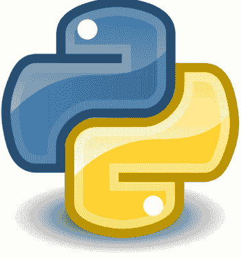

示例：
创建并打印一个字典：
thisdict = {
    "brand": "Ford",
    "model": "Mustang",
    "year": 1964
}
print(thisdict)

## 3.1.1 访问字典元素

我们可以通过引用相关的键来调用字典的值。

### 使用键访问数据项

因为字典提供键值对来存储数据，所以它们可以成为Python程序中的重要元素。
如果我们想隔离Sammy的用户名，我们可以通过调用`sammy['username']`来实现。让我们打印出来：

```python
print(sammy['username'])
# Output
# sammy-shark
```

字典的行为类似于数据库，因为不是像列表那样调用整数来获取特定的索引值，而是将值分配给一个键，并可以调用该键来获取其相关值。
通过调用键'username'，我们接收到该键的值，即'sammy-shark'。
sammy字典中的其余值可以使用相同的格式类似地调用：

```python
sammy['followers']
# Returns 987

sammy['online']
# Returns True
```

通过利用字典的键值对，我们可以引用键来检索值。

## 使用方法访问元素

除了使用键来访问值，我们还可以使用一些内置方法：

-   `dict.keys()` 提取键
-   `dict.values()` 提取值
-   `dict.items()` 以 (键, 值) 元组对的列表格式返回项

要返回键，我们会使用 `dict.keys()` 方法。在我们的示例中，这将使用变量名，即 `sammy.keys()`。让我们将其传递给 `print()` 方法并查看输出。

```
print(sammy.keys())
Output
dict_keys(['followers', 'username', 'online'])
```

我们收到的输出将键放置在 `dict_keys` 类的可迭代视图对象中。然后，这些键以列表格式打印出来。

此方法可用于跨字典查询。例如，我们可以查看两个字典**数据结构**之间共享的常见键：

```
sammy = {'username': 'sammy-shark', 'online': True, 'followers': 987}
jesse = {'username': 'JOctopus', 'online': False, 'points': 723}
for common_key in sammy.keys() & jesse.keys():
    print(sammy[common_key], jesse[common_key])
```

字典 `sammy` 和字典 `jesse` 各自是一个用户配置文件字典。然而，它们的配置文件具有不同的键，因为 Sammy 有一个关联了粉丝数的社交配置文件，而 Jesse 有一个关联了积分的游戏配置文件。它们共有的 2 个键是 `username` 和在线状态，当我们运行这个小程序时可以找到它们：

```
Output
sammy-shark JOctopus
True False
```

数据结构是一种数据组织、管理和存储格式，能够实现高效的访问和修改。

我们当然可以改进程序，使输出更易于用户阅读，但这说明了 `dict.keys()` 可用于检查各个字典，查看它们有哪些共同点或不同点。这对于大型字典尤其有用。类似地，我们可以使用 `dict.values()` 方法查询 `sammy` 字典中的值，其构造方式为 `sammy.values()`。让我们打印出来看看：

```
sammy = {'username': 'sammy-shark', 'online': True, 'followers': 987}
print(sammy.values())
```

Output
dict_values([True, 'sammy-shark', 987])

`keys()` 和 `values()` 方法都返回 `sammy` 字典中存在的键和值的无序列表，分别带有 `dict_keys` 和 `dict_values` 视图对象。

如果我们对字典中的所有项都感兴趣，可以使用 `items()` 方法访问它们：

```
print(sammy.items())
```

Output
dict_items([('online', True), ('username', 'sammy-shark'), ('followers', 987)])

返回的格式是一个由 (键, 值) 元组对组成的列表，带有 `dict_items` 视图对象。

我们可以使用 `for` 循环遍历返回的列表格式。例如，我们可以打印出给定字典的每个键和值，然后通过添加字符串使其更易于人类理解：

```
for key, value in sammy.items():
    print(key, 'is the key for the value', value)
```

Output
online is the key for the value True
followers is the key for the value 987
username is the key for the value sammy-shark

上面的 `for` 循环遍历了 `sammy` 字典中的项，并逐行打印出键和值，并附带信息使其更易于人类理解。

我们可以使用内置方法从字典数据结构中访问项、值和键。

## 3.1.2 修改字典

字典是一种可变的数据结构，因此你可以修改它们。在本节中，我们将介绍添加和删除字典元素。

### 添加和更改字典元素

无需使用方法或函数，你可以使用以下语法向字典添加键值对：

```
dict[key] = value
```

我们将通过向一个名为 `usernames` 的字典添加一个键值对来了解其实际工作方式：

```
usernames = {'Sammy': 'sammy-shark', 'Jamie': 'mantisshrimp54'}
usernames['Drew'] = 'squidly'
print(usernames)
Output
{'Drew': 'squidly', 'Sammy': 'sammy-shark', 'Jamie': 'mantisshrimp54'}
```

我们现在看到字典已更新，包含了 `'Drew': 'squidly'` 键值对。由于字典可能是无序的，此对可能出现在字典输出中的任何位置。如果我们在程序文件后面使用 `usernames` 字典，它将包含这个额外的键值对。

此外，此语法可用于修改分配给键的值。在这种情况下，我们将引用一个现有的键并为其传递一个不同的值。

让我们考虑一个字典 `drew`，它是给定网络上的用户之一。我们假设这个用户今天的粉丝数增加了，因此我们需要更新传递给 `'followers'` 键的**整数**值。我们将使用 `print()` 函数来检查字典是否已被修改。

```
drew = {'username': 'squidly', 'online': True, 'followers': 305}
drew['followers'] = 342
print(drew)
Output
{'username': 'squidly', 'followers': 342, 'online': True}
```

在输出中，我们看到粉丝数从整数值 305 跳到了 342。

我们可以使用此方法通过用户输入向字典添加键值对。让我们编写一个快速程序 `usernames.py`，它在命令行上运行，并允许用户输入以添加更多名称和关联的用户名：

usernames.py

```
# Define original dictionary
usernames = {'Sammy': 'sammy-shark', 'Jamie': 'mantisshrimp54'}
# Set up while loop to iterate
while True:

    # Request user to enter a name
    print('Enter a name:')

    # Assign to name variable
    name = input()

    # Check whether name is in the dictionary and print feedback
    if name in usernames:
        print(usernames[name] + ' is the username of ' + name)

    # If the name is not in the dictionary...
    else:

        # Provide feedback
        print('I don\'t have ' + name + '\'s username, what is it?')

        # Take in a new username for the associated name
        username = input()

        # Assign username value to name key
        usernames[name] = username

        # Print feedback that the data was updated
        print('Data updated.')
```

让我们在命令行上运行该程序：
python usernames.py

当我们运行程序时，会得到类似以下的输出：

Output
Enter a name:
Sammy
sammy-shark is the username of Sammy
Enter a name:
Jesse
I don't have Jesse's username, what is it?
JOctopus
Data updated.
Enter a name:

当我们完成程序测试时，可以按 CTRL + C 退出程序。你可以使用**条件语句**设置一个触发器来退出程序（例如输入字母 q），以改进代码。

这展示了如何交互式地修改字典。对于这个特定程序，一旦你用 CTRL + C 退出程序，除非你实现了处理文件读写的方法，否则你将丢失所有数据。

我们也可以使用 `dict.update()` 方法来添加和修改字典。这与列表中可用的 `append()` 方法不同。

在下面的 `jesse` 字典中，让我们使用 `jesse.update()` 添加键 `'followers'` 并为其赋予一个整数值。之后，让我们 `print()` 更新后的字典。

```
jesse = {'username': 'JOctopus', 'online': False, 'points': 723}
jesse.update({'followers': 481})
print(jesse)
```

Output
{'followers': 481, 'username': 'JOctopus', 'points': 723, 'online': False}

从输出中，我们可以看到我们成功地将 `'followers': 481` 键值对添加到了字典 `jesse` 中。

我们也可以使用 `dict.update()` 方法通过替换特定键的给定值来修改现有的键值对。

**关键词**
**条件语句**是那些假设后跟结论的语句。它也被称为“如果-那么”语句。如果假设为真而结论为假，则条件语句为假。

让我们在 `sammy` 字典中将 Sammy 的在线状态从 `True` 更改为 `False`：

```
sammy = {'username': 'sammy-shark', 'online': True, 'followers': 987}
sammy.update({'online': False})
print(sammy)
Output
{'username': 'sammy-shark', 'followers': 987, 'online': False}
```

`sammy.update({'online': False})` 这一行引用了现有的键 `'online'`，并将其布尔值从 `True` 修改为 `False`。当我们调用 `print()` 打印字典时，我们在输出中看到了更新。

要向字典添加项或修改值，我们可以使用 `dict[key] = value` 语法或 `dict.update()` 方法。

### 删除字典元素

正如你可以向字典数据类型添加键值对和更改值一样，你也可以删除字典中的项。

要从字典中移除一个键值对，我们将使用以下**语法**：

```
del dict[key]
```

让我们以代表其中一个用户的 `jesse` 字典为例。我们假设 Jesse 不再使用在线平台玩游戏，因此我们将移除与 `'points'` 键关联的项。然后，我们将打印字典以确认。

> **语法**
是句子的语法结构。单词和短语被排列以创建句子的格式称为语法。

表示该项已被删除：

```
jesse = {'username': 'JOctopus', 'online': False, 'points': 723, 'followers': 481}

del jesse['points']
print(jesse)
Output
{'online': False, 'username': 'JOctopus', 'followers': 481}
```

`del jesse['points']` 这一行从 `jesse` 字典中移除了键值对 `'points': 723`。

如果我们想清空字典中的所有值，可以使用 `dict.clear()` 方法。这将保留给定的字典，以防我们稍后在程序中需要使用它，但它将不再包含任何项目。

让我们移除 `jesse` 字典中的所有项目：

```
jesse = {'username': 'JOctopus', 'online': False, 'points': 723, 'followers': 481}
jesse.clear()

print(jesse)
Output
{}
```

输出显示我们现在有一个空字典，不含任何键值对。如果我们不再需要某个特定的字典，可以使用 `del` 将其完全删除：

```
del jesse
print(jesse)
```

在删除 `jesse` 字典后运行 `print()` 调用，我们将收到以下错误：

```
Output
...
NameError: name 'jesse' is not defined
```

因为字典是可变数据类型，所以可以添加、修改、移除和清空项目。

`del` 关键字移除具有指定键名的项目：

```
thisdict = {
  "brand": "Ford",
  "model": "Mustang",
  "year": 1964
}

del thisdict["model"]

print(thisdict)
```


## 3.1.3 dict() 构造函数

也可以使用 `dict()` 构造函数来创建字典：

```
Example
thisdict = dict(brand="Ford", model="Mustang", year=1964)
# 注意关键字不是字符串字面量
# 注意赋值使用等号而不是冒号
print(thisdict)
```

## 3.1.4 字典方法

Python 有一组内置方法，可用于字典。

| 方法 | 描述 |
|---|---|
| clear() | 移除字典中的所有元素 |
| copy() | 返回字典的副本 |
| fromkeys() | 返回一个具有指定键和值的字典 |
| get() | 返回指定键的值 |
| items() | 返回一个包含每个键值对元组的列表 |
| keys() | 返回一个包含字典键的列表 |
| pop() | 移除具有指定键的元素 |
| popitem() | 移除最后插入的键值对 |
| setdefault() | 返回指定键的值。如果键不存在：插入该键，并赋予指定值 |
| update() | 使用指定的键值对更新字典 |
| values() | 返回字典中所有值的列表 |

> 记住

尽管我们在这个扩展示例中刚刚使用字典将名称链接到电话号码，但我们可以使用字典将任何一种类型的对象链接到另一种类型的对象。

## 3.1.5 别名和复制

因为字典是可变的，所以你需要注意别名。每当两个变量引用同一个对象时，对其中一个的更改会影响另一个。


如果你想修改字典并保留原始副本，请使用 `copy` 方法。例如，`opposites` 是一个包含反义词对的字典：

```
>>> opposites = {'up': 'down', 'right': 'wrong', 'true': 'false'}
>>> an_alias = opposites
>>> a_copy = opposites.copy()
```

`an_alias` 和 `opposites` 引用同一个对象；`a_copy` 引用同一个字典的新副本。如果我们修改 `alias`，`opposites` 也会改变：

```
>>> an_alias['right'] = 'left'
>>> opposites['right']
'left'
```

如果我们修改 `a_copy`，`opposites` 不会改变：

```
>>> a_copy['right'] = 'privilege'
>>> opposites['right']
'left'
```

## 3.2 PYTHON 集合

集合是不同（唯一）对象的集合。这对于创建仅在数据集中保存唯一值的列表非常有用。它是一个无序集合，但是可变的，这在处理大型数据集时非常有帮助。

```
x_set = set('CAKE&COKE')
y_set = set('COOKIE')
print(x_set)
{'A', '&', 'O', 'E', 'C', 'K'}
print(y_set) # 单个唯一的 'o'
{'I', 'O', 'E', 'C', 'K'}
print(x - y) # x_set 中有但 y_set 中没有的所有元素
---------------------------------------------------------------------------
NameError                                 Traceback (most recent call last)
<ipython-input-3-31abf5d98454> in <module>()
----> 1 print(x - y) # x_set 中有但 y_set 中没有的所有元素

NameError: name 'x' is not defined
print(x_set|y_set) # x_set 或 y_set 或两者中的唯一元素
{'C', '&', 'E', 'A', 'O', 'K', 'I'}
print(x_set & y_set) # x_set 和 y_set 中都有的元素
{'O', 'E', 'K', 'C'}
```

> 集合可以存储任何东西，不仅仅是字符串。使用字符串集合来演示集合方法是最简单的。

### 3.2.1 定义集合

你可以通过简单地在括号中命名所有元素来定义集合。唯一的例外是 *空集*，可以使用函数 `set()` 创建。如果 `set(..)` 有一个列表、字符串或元组作为参数，它将返回一个由其元素组成的集合。

# 基础计算机编程：Python

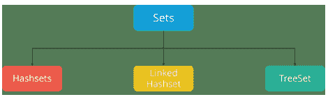

让我们看看这一切意味着什么，以及如何在 Python 中使用集合。
集合可以通过两种方式创建。首先，你可以使用内置的 `set()` 函数定义一个集合：
`x = set(<iter>)`
在这种情况下，参数 `<iter>` 是一个可迭代对象——再次强调，目前，可以认为是列表或元组——它生成要包含在集合中的对象列表。这类似于传递给 `.extend()` 列表方法的 `<iter>` 参数：

```
>>> x = set(['foo', 'bar', 'baz', 'foo', 'qux'])
>>> x
{'qux', 'foo', 'bar', 'baz'}

>>> x = set(('foo', 'bar', 'baz', 'foo', 'qux'))
>>> x
{'qux', 'foo', 'bar', 'baz'}
```

字符串也是可迭代的，因此也可以将字符串传递给 `set()`。你已经看到 `list(s)` 生成 **字符串** `s` 中字符的列表。类似地，`set(s)` 生成 `s` 中字符的集合：

```
>>> s = 'quux'

>>> list(s)
['q', 'u', 'u', 'x']
>>> set(s)
{'x', 'u', 'q'}
```

你可以看到生成的集合是无序的：定义中指定的原始顺序不一定被保留。此外，重复值在集合中只表示一次，就像前两个示例中的字符串 `'foo'` 和第三个示例中的字母 `'u'` 一样。

> **关键字**
**字符串**
传统上是一个字符序列，可以是字面常量或某种变量。

或者，可以用花括号 (`{}`) 定义一个集合：

```
x = {<obj>, <obj>, ..., <obj>}
```

当以这种方式定义集合时，每个 `<obj>` 都成为集合的一个不同元素，即使它是一个可迭代对象。这种行为类似于 `.append()` 列表方法。

因此，上面显示的集合也可以这样定义：

```
>>> x = {'foo', 'bar', 'baz', 'foo', 'qux'}
>>> x
{'qux', 'foo', 'bar', 'baz'}
```

```
>>> x = {'q', 'u', 'u', 'x'}
>>> x
{'x', 'q', 'u'}
```

总结一下：

- `set()` 的参数是一个可迭代对象。它生成要放入集合的元素列表。
- 花括号中的对象原样放入集合，即使它们是可迭代的。

观察这两种集合定义之间的区别：

```
>>> {'foo'}
{'foo'}
```

```
>>> set('foo')
{'o', 'f'}
```

集合可以为空。但是，请记住，Python 将空花括号 (`{}`) 解释为空字典，因此定义空集的唯一方法是使用 `set()` 函数：

```
>>> x = set()
>>> type(x)
<class 'set'>
>>> x
set()
```

```
>>> x = {}
>>> type(x)
```

# 基础计算机编程：Python

```
<class 'dict'>
空集在布尔上下文中为假：
>>> x = set()
>>> bool(x)
False
>>> x or 1
1
>>> x and 1
set()
你可能认为最直观的集合会包含
相似的对象——例如，偶数或姓氏：
>>> s1 = {2, 4, 6, 8, 10}
>>> s2 = {'Smith', 'McArthur', 'Wilson', 'Johansson'}
然而，Python 并不要求这一点。集合中的
元素可以是不同类型的对象：
>>> x = {42, 'foo', 3.14159, None}
>>> x
{None, 'foo', 42, 3.14159}
不要忘记集合元素必须是不可变的。例如，
元组可以包含在集合中：
>>> x = {42, 'foo', (1, 2, 3), 3.14159}
>>> x
{42, 'foo', 3.14159, (1, 2, 3)}
但列表和字典是可变的，所以它们不能是
集合元素：
>>> a = [1, 2, 3]
>>> {a}
Traceback (most recent call last):
  File "<pyshell#70>", line 1, in <module>
    {a}
TypeError: unhashable type: 'list'

>>> d = {'a': 1, 'b': 2}
>>> {d}
```

> 你知道吗？
早期版本的 Python 使用一种晦涩的方式来格式化字符串。它被认为是已弃用的，并最终将从语言中消失。

## 3.2.2 集合的大小与成员关系

`len()` 函数返回集合中元素的数量，而 `in` 和 `not in` 运算符可用于测试成员关系：

```python
>>> x = {'foo', 'bar', 'baz'}

>>> len(x)
3

>>> 'bar' in x
True
>>> 'qux' in x
False
```

## 3.2.3 集合的方法

### add(x) 方法
如果元素 `x` 不在集合中，则将其添加到集合中。
```python
people = {"Jay", "Idrish", "Archil"}
people.add("Daxit")
# 这会将 Daxit 添加到 people 集合中。
```

### union(s) 方法
返回两个集合的并集。在两个集合之间使用 `|` 运算符与编写 `set1.union(set2)` 效果相同。
```python
people = {"Jay", "Idrish", "Archil"}
vampires = {"Karan", "Arjun"}
population = people.union(vampires)
# 或者
population = people | vampires
# 集合 population 将包含 people 和 vampire 的所有元素
```

### intersect(s) 方法
返回两个集合的交集。这种情况下也可以使用 `&` 运算符。
```python
victims = people.intersection(vampires)
# 集合 victims 将包含 people 和 vampire 的共同元素
```

### difference(s) 方法
返回一个集合，包含调用集合中所有但不在第二个集合中的元素。这里可以使用 `-` 运算符。
```python
safe = people.difference(vampires)
# 或者
safe = people - vampires
# 集合 safe 将包含所有在 people 中但不在 vampire 中的元素
```

### clear() 方法
清空整个集合。
```python
victims.clear()
# 清空 victims 集合
```

然而，Python 集合有两个主要的注意事项：
- 集合不以任何特定顺序维护元素。
- 只有不可变类型的实例才能添加到 Python 集合中。

## 3.2.4 创建集合

可以通过使用 `set()` 函数或将所有元素放在一对花括号内来创建集合。

```python
Days=set(["Mon","Tue","Wed","Thu","Fri","Sat","Sun"])
Months={"Jan", "Feb", "Mar"}
Dates={21,22,17}
print(Days)
print(Months)
print(Dates)
```

执行上述代码时，会产生以下结果。请注意结果中元素的顺序发生了变化。

```
set(['Wed', 'Sun', 'Fri', 'Tue', 'Mon', 'Thu', 'Sat'])
set(['Jan', 'Mar', 'Feb'])
set([17, 21, 22])
```

## 3.2.5 访问集合中的值

我们无法访问集合中的单个值。我们只能像上面那样一起访问所有元素。但我们也可以通过遍历集合来获取单个元素的列表。

```python
Days=set(["Mon","Tue","Wed","Thu","Fri","Sat","Sun"])

for d in Days:
    print(d)
```

执行上述代码时，会产生以下结果。

```
Wed
Sun
Fri
Tue
Mon
Thu
Sat
```

## 3.2.6 向集合中添加元素

我们可以使用 `add()` 方法向集合中添加元素。同样如前所述，新添加的元素没有特定的索引。

```python
Days=set(["Mon","Tue","Wed","Thu","Fri","Sat"])

Days.add("Sun")
print(Days)
```

执行上述代码时，会产生以下结果。

```
set(['Wed', 'Sun', 'Fri', 'Tue', 'Mon', 'Thu', 'Sat'])
```

## 3.2.7 从集合中移除元素

我们可以使用 `discard()` 方法从集合中移除元素。同样如前所述，新添加的元素没有特定的索引。

```python
Days=set(["Mon","Tue","Wed","Thu","Fri","Sat"])
Days.discard("Sun")
print(Days)
```

执行上述代码时，会产生以下结果。

```
set(['Wed', 'Fri', 'Tue', 'Mon', 'Thu', 'Sat'])
```

## 3.2.8 集合的并集

两个集合的并集操作会产生一个新集合，包含两个集合中所有不重复的元素。在下面的例子中，元素 "Wed" 同时存在于两个集合中。

```python
DaysA = set(["Mon","Tue","Wed"])
DaysB = set(["Wed","Thu","Fri","Sat","Sun"])
AllDays = DaysA|DaysB
print(AllDays)
```

执行上述代码时，会产生以下结果。请注意结果中只有一个 "Wed"。

```
set(['Wed', 'Fri', 'Tue', 'Mon', 'Thu', 'Sat'])
```

## 3.2.9 集合的交集

两个集合的交集操作会产生一个新集合，仅包含两个集合中的共同元素。在下面的例子中，元素 "Wed" 同时存在于两个集合中。

```python
DaysA = set(["Mon","Tue","Wed"])
DaysB = set(["Wed","Thu","Fri","Sat","Sun"])
AllDays = DaysA & DaysB
print(AllDays)
```

执行上述代码时，会产生以下结果。请注意结果中只有一个 "Wed"。

```
set(['Wed'])
```

## 3.2.10 集合的差集

两个集合的差集操作会产生一个新集合，仅包含第一个集合中的元素，而不包含第二个集合中的任何元素。在下面的例子中，元素 "Wed" 同时存在于两个集合中，因此它不会出现在结果集中。

```python
DaysA = set(["Mon","Tue","Wed"])
DaysB = set(["Wed","Thu","Fri","Sat","Sun"])
AllDays = DaysA - DaysB
print(AllDays)
```

执行上述代码时，会产生以下结果。请注意结果中只有一个 "Wed"。

```
set(['Mon', 'Tue'])
```

## 3.2.11 比较集合

我们可以检查一个给定的集合是否是另一个集合的子集或超集。结果是 True 或 False，取决于集合中存在的元素。

```python
DaysA = set(["Mon","Tue","Wed"])
DaysB = set(["Mon","Tue","Wed","Thu","Fri","Sat","Sun"])
SubsetRes = DaysA <= DaysB
SupersetRes = DaysB >= DaysA
print(SubsetRes)
print(SupersetRes)
```

执行上述代码时，会产生以下结果。

```
True
True
```

## 3.3 文件

文件传统上是数据结构的一部分。尽管大数据在数据科学行业已司空见惯，但一种没有存储和检索先前存储信息能力的编程语言几乎毫无用处。你仍然需要利用所有存储在数据库文件中的数据，你将学习如何做到这一点。

在 Python 中读写文件的语法与其他**编程语言**相似，但处理起来容易得多。以下是一些基本函数，可帮助你使用 Python 处理文件：

- `open()` 用于打开系统中的文件，文件名是要打开的文件的名称；
- `read()` 用于读取整个文件；
- `readline()` 用于一次读取一行；
- `write()` 用于将字符串写入文件，并返回写入的字符数；以及
- `close()` 用于关闭文件。

```python
# 文件模式（第二个参数）：'r'（读取），'w'（写入），'a'（追加），'r+'（读写）
f = open('file_name', 'w')

# 读取整个文件
f.read()
# 一次读取一行
f.readline()
# 将字符串写入文件，返回写入的字符数
f.write('Add this line.')
f.close()
```

`open()` 函数中的第二个参数是文件模式。它允许你指定是要读取（`r`）、写入（`w`）、追加（`a`）还是同时读写（`r+`）。

### 3.3.1 open 函数

`open` 函数接受两个参数。第一个是文件名，第二个是**模式**。模式 `'w'` 表示我们以写入模式打开文件。模式 `'r'` 表示读取，模式 `'a'` 表示追加。

让我们从一个展示这三种模式操作的示例开始：

```python
>>> myfile = open('test.txt', 'w')
>>> myfile.write('My first file written from Python\n')
34
>>> myfile.write('-----------------------------------\n')
34
>>> myfile.write('Hello, world!')
13
>>> myfile.close()
>>> myfile = open('test.txt', 'r')
>>> contents = myfile.read()
>>> myfile.close()
>>> print(contents)
My first file written from Python
-----------------------------------
Hello, world!
```

打开文件会创建我们所谓的文件描述符。在这个例子中，变量 `myfile` 指向新的描述符对象。我们的程序在描述符上调用方法，这会对位于非易失性存储中的实际文件进行更改。

第一行以写入模式打开 `test.txt`。如果磁盘上没有名为 `test.txt` 的文件，它将被创建。如果已经存在一个，它将被我们正在写入的文件替换，其中的任何先前数据都将丢失。

为了将数据放入文件，我们在文件描述符上调用 `write` 方法。我们在上面的例子中这样做了三次，但在更大的程序中，对 `write` 的三次单独调用通常会被一个循环取代，该循环将更多行写入文件。`write` 方法返回写入文件的字节数（字符数）。

关闭文件句柄告诉系统我们已完成写入，并使磁盘文件可供其他程序（或我们自己的程序）读取。

我们通过以读取模式打开 `test.txt` 来完成这个示例。然后我们调用 `read` 方法，将文件内容（一个字符串）赋值给名为 `contents` 的变量，最后打印 `contents` 以查看它确实是我们之前写入文件的内容。

如果我们想向已存在的文件添加内容，请使用 *追加* 模式。

> 你可能使用的许多常见文件，如 Word 文档或 Excel 电子表格，不是文本文件。它们有自己的复杂文件格式。文本文件是你可以在简单文本编辑器中创建的文件，只需通过普通按键输入，无需任何特殊功能，如加粗文本、不同字体等。

## 3.3.2 打开不存在的文件

如果我们尝试打开一个不存在的文件，会得到一个错误：

```
>>> f = open('wharrah.txt', 'r')
Traceback (most recent call last):
  File "<stdin>", line 1, in <module>
IOError: [Errno 2] No such file or directory: 'wharrah.txt'
>>>
```

导致错误的这一行语法本身没有问题。错误发生是因为文件不存在。这类**错误**被称为**异常**。大多数现代编程语言都提供了处理此类情况的支持。这个过程被称为异常处理。

在 Python 中，异常通过 try ... except 语句来处理。

```
try:
    f = open('thefile.txt', 'r')
    mydata = f.read()
    f.close()
except IOError:
    mydata = ''
```

在这个例子中，我们*尝试*打开数据文件进行读取。如果成功，我们使用 read() 方法将文件内容作为字符串读入变量 mydata，并关闭文件。如果发生 IOError 异常，我们仍然将 mydata 创建为空字符串，然后继续执行程序。

## 3.3.3 从文件中读取数据

Python 文件描述符有三种从文件读取数据的方法。我们已经见过 read() 方法，它将整个文件内容作为单个字符串返回。对于非常大的文件，这可能不是你想要的。

readline() 方法一次返回文件中的一行。每次调用它，readline() 都会返回下一行。当到达文件末尾后调用 readline() 会返回一个空字符串（''）。

```
f = open('test.txt', 'r')
while True:
    theline = f.readline()
    if len(theline) == 0:
        break

    # 现在处理我们刚刚读取的行
    print(theline, end='')

f.close()
```

这是我们工具箱中一个方便的模式。在更大的程序中，我们会在第 8 行的循环体中加入更广泛的逻辑——例如，如果文件的每一行都包含我们一位朋友的姓名和电子邮件地址，也许我们会将该行拆分成几部分，并调用一个函数来给这位朋友发送聚会邀请。

在第 8 行，我们抑制了 print 通常会附加到字符串末尾的换行符。为什么？这是因为字符串本身已经包含换行符：第 3 行的 readline 方法返回的内容直到*并包括*换行符。这也解释了文件末尾检测逻辑：当文件中没有更多行可读时，readline 返回一个空字符串——这个字符串末尾甚至没有换行符，因此其长度为 0。

## 将文件转换为行列表

从磁盘文件获取数据并将其转换为行列表通常很有用。假设我们有一个包含朋友及其电子邮件地址的文件，文件中每行一个。但我们希望这些行按字母顺序排序。一个好的计划是将所有内容读入一个行列表，然后对该列表进行排序，最后将排序后的列表写回另一个文件：

```
f1 = open('friends.txt', 'r')
friends_list = f.readlines()
f1.close()

friends_list.sort()

f2 = open('sortedfriends.txt', 'w')
for friend in friends_list:
    f2.write(friend)
f2.close()
```

第 2 行的 readlines 方法读取所有行并返回一个字符串列表。
我们本可以使用上一节的模板逐行读取，并自己构建列表，但使用 Python 实现者为我们提供的方法要容易得多！

## 一个例子

许多有用的行处理程序会逐行读取文本文件，并在将行写入输出文件时进行一些小的处理。它们可能会在输出文件中为行编号，或者在每 60 行后插入额外的空行以便于在纸张上打印，或者仅从源文件的每行中提取某些特定列，或者仅打印包含特定子字符串的行。我们称这类程序为**过滤器**。

这是一个将文件复制到另一个文件的过滤器，它省略了任何以 # 开头的行：

```
infile = open(oldfile, 'r')
outfile = open(newfile, 'w')
while True:
    text = infile.readline()
    if len(text) == 0:
        break
    if text[0] == '#':
        continue

    # 在这里放置任何更多的处理逻辑
    outfile.write(text)

infile.close()
outfile.close()
```

第 9 行的 continue 语句跳过当前循环迭代中剩余的行，但循环仍将继续迭代。这种风格在这里看起来有点刻意，但通常很有用，可以“*尽早将我们不关心的行排除在外，这样我们就能在循环的核心部分（可能在第 11 行左右编写）拥有更清晰、更集中的逻辑*”。

因此，如果 text 是空字符串，循环退出。如果 text 的第一个字符是井号，执行流程将跳转到循环顶部，准备开始处理下一行。只有当两个条件都不满足时，我们才会执行第 11 行的处理，在本例中，就是将该行写入新文件。

让我们再考虑一种情况：假设你的原始文件包含空行。在上面的第 6 行，这个程序会找到文件中的第一个空行并立即终止吗？不会！回想一下，readline 总是将其返回的字符串中包含换行符。只有当我们尝试读取*超出*文件末尾时，才会得到长度为 0 的空字符串。

## 案例研究

## 一个集合划分问题

集合划分问题确定一个集合（S）中的项目如何被划分为更小的子集。S 中的所有项目必须包含在一个且仅一个划分中。相关问题有：

- 集合打包 - 所有项目必须包含在零个或一个划分中；
- 集合覆盖 - 所有项目必须包含在至少一个划分中。

在这个案例研究中，婚礼策划师必须确定婚礼的宾客座位分配。为了建模这个问题，桌子被建模为划分，而被邀请参加婚礼的宾客被建模为 S 的元素。婚礼策划师希望最大化所有桌子的总幸福感。


集合划分问题可以通过显式枚举每个可能的子集来建模。尽管这种方法在项目数量很多时（不使用列生成）确实会变得难以处理，但它确实有一个优点，即划分的目标函数系数可以是非线性表达式（如幸福感），并且仍然允许使用线性规划来解决此问题。

首先，我们使用 **allcombinations()** 生成所有可能的桌子座位安排列表。

```
#create list of all possible tables
possible_tables = [tuple(c) for c in pulp.allcombinations(guests,
                                        max_table_size)]
```

然后我们创建一个二进制变量，如果桌子在解决方案中，则该变量为 1，否则为 0。

# 基础计算机编程：Python

```
#create a binary variable to state that a table setting is used
x = pulp.LpVariable.dicts('table', possible_tables,
                        lowBound = 0,
                        upBound = 1,
                        cat = pulp.LpInteger)
```

我们创建 **LpProblem**，然后构建目标函数。请注意，此脚本中使用的幸福感函数很难用其他任何方式建模。

```
seating_model = pulp.LpProblem("Wedding Seating Model", pulp.LpMinimize)
seating_model += sum([happiness(table) * x[table] for table in possible_tables])
```

我们指定解决方案中允许的桌子总数。

```
#specify the maximum number of tables
seating_model += sum([x[table] for table in possible_tables]) <= max_tables, "Max_tables"
```

这组约束通过保证每位宾客被分配到恰好一张桌子来定义集合划分问题。

```
#A guest must seated at one and only one table
for guest in guests:
    seating_model += sum([x[table] for table in possible_tables
                          if guest in table]) == 1, "Must_seat_%s"%guest
```

完整文件可在此处找到 wedding.py

```
"""
A set partitioning model of a wedding seating problem

Authors: Stuart Mitchell 2009
"""

import pulp

max_tables = 5
max_table_size = 4
guests = 'A B C D E F G I J K L M N O P Q R'.split()

def happiness(table):
    """
    Find the happiness of the table
```

## 第四章
异常、单元测试与推导式

> “抽象是Python摒弃却又表达得淋漓尽致的概念之一”
—戈登·麦克米伦

## 学习目标

学完本章后，你将能够：
1.  如何使用异常？
2.  解释单元测试
3.  理解推导式

```java
// ItemServiceTest.java
@Test
public void findItemBasic() throws NotFoundException {
    // PREPARATION
    Mockito.when(itemRepository.findById(1)).thenReturn(
        Optional.of(new Item(1, "Ball 1", 10, 10000))
    );

    // ACTION
    Item item = itemService.findOneItem(1);

    // ASSERTION
    assertEquals(10000, item.getValue());
}

@Test(expected = NotFoundException.class)
public void findItemNotFound() throws NotFoundException {
    // PREPARATION
    Mockito.when(itemRepository.findById(1)).thenReturn(
        Optional.empty()
    );

    // ACTION
    Item item = itemService.findOneItem(1);

    // ASSERTION never happen because exception thrown
}
```

## 引言

异常是一个事件，它在程序执行期间发生，会干扰程序指令的正常流程。通常，当Python脚本遇到无法处理的情况时，它会引发一个异常。异常是一个表示错误的Python对象。

Python程序一旦遇到错误就会终止。在Python中，错误可以是语法错误或异常。在这里，你将了解什么是异常以及它与语法错误的区别。之后，你将学习引发异常和进行断言。最后，你将通过`try`和`except`块的演示来结束本节。

单元测试是一种软件测试方法，通过这种方法，源代码的各个单元会经过各种测试，以确定它们是否适合使用（来源）。它确定并验证了代码的质量。

通常，当开发过程完成后，开发人员会将已知可能实用和有用的标准或结果编码到测试脚本中，以验证特定单元的正确性。在测试用例执行期间，各种框架会记录未通过任何标准的测试，并在摘要中报告它们。

开发人员需要编写自动化测试脚本，以确保每个部分或单元都符合其设计并按预期运行。

尽管为代码编写手动测试绝对是一项繁琐且耗时的任务，但Python内置的单元测试框架使生活变得轻松了许多。

## 4.1 异常

即使一条语句或表达式在语法上是正确的，当尝试执行它时也可能导致错误。在执行期间检测到的错误被称为*异常*，它们并非无条件致命：你很快就会学习如何在Python程序中处理它们。然而，大多数异常并未被程序处理，并导致如下所示的错误消息：

```python
>>> 10 * (1/0)
Traceback (most recent call last):
  File "<stdin>", line 1, in <module>
ZeroDivisionError: division by zero
>>> 4 + spam*3
Traceback (most recent call last):
  File "<stdin>", line 1, in <module>
NameError: name 'spam' is not defined
>>> '2' + 2
Traceback (most recent call last):
```

# 总结

-   Python中的字典是数据值的无序集合，用于存储类似映射的数据值，与其他仅将单个值作为元素的数据类型不同，字典存储键值对。字典中提供键值对是为了使其更加优化。
-   集合用于在单个变量中存储多个项目。集合是Python中用于存储数据集合的4种内置数据类型之一，另外3种是列表、元组和字典，它们都有不同的特性和用途。
-   字典是一个无序、可变且有索引的集合。在Python中，字典用花括号编写，它们有键和值。
-   如果你想修改字典并保留原始副本，请使用`copy`方法。
-   集合是不同（唯一）对象的集合。这些对于创建仅在数据集中保存唯一值的列表很有用。
-   集合是通过使用`set()`函数或将所有元素放在一对花括号内来创建的。
-   对两个集合执行并集操作会产生一个新集合，其中包含两个集合中的所有不同元素。
-   对两个集合执行交集操作会产生一个新集合，其中仅包含两个集合中的共同元素。

# 知识检查

1.  数据字典是一个特殊文件，包含
    a.  所有文件中所有字段的名称
    b.  所有文件中所有字段的数据类型
    c.  以上两者
    d.  以上都不是

2.  数据库中记录的物理位置是借助以下方式确定的
    a.  B树文件
    b.  索引文件
    c.  哈希文件
    d.  顺序文件

3.  以下哪条语句创建了一个字典？
    a.  d = {}
    b.  d = {"john":40, "peter":45}
    c.  d = {40:"john", 45:"peter"}
    d.  以上所有

4.  仔细阅读下面显示的代码并找出键？
    d = {"john":40, "peter":45}
    a.  "john", 40, 45, 和 "peter"
    b.  "john" 和 "peter"
    c.  40 和 45
    d.  d = (40:"john", 45:"peter")

5.  关于字典键，以下哪项是不正确的？
    a.  不允许有多个键
    b.  键必须是不可变的
    c.  键必须是整数
    d.  当遇到重复的键时，最后一次赋值生效

6.  给定一个不返回任何值的函数，在shell中执行时默认返回什么值？
    a.  Int
    b.  bool
    c.  void
    d.  none

7.  在Python中我们不指定类型，它由编译器直接解释，因此考虑执行以下操作。
    a.  x = 13 // 2
    b.  x = int(13 / 2)
    c.  x = 13 % 2
    d.  以上所有

8.  以下表达式的值是什么？
    a.  (1.0, 4.0)
    b.  (1.0, 1.0)
    c.  (4.0, 1.0)
    d.  (4.0, 4.0)

# 复习题

1.  以下代码的输出是什么？

```python
a={1:"A",2:"B",3:"C"}
a.setdefault(4,"D")
print(a)
```

2.  编写一个程序，读取`words.txt`中的单词并将它们作为键存储在字典中。值是什么并不重要。然后你可以使用`in`运算符作为快速检查字符串是否在字典中的方法。

3.  编写一个程序，要求用户输入10个单词，并按字母顺序打印出第一个出现的单词。

4.  生成一个集合，包含每个小于1000且能被15整除的正整数，以及第二个集合，包含每个小于1000且能被21整除的正整数。创建一个整数集合，其中的元素能被任一值整除、能被两个值整除以及只能被一个值整除。打印出每个结果集合的内容。

5.  输出会是什么？
    a.  d = {"john":40, "peter":45}
    b.  "john" in d

# 检查你的答案

1.  (b) 2. (c) 3. (d) 4. (b) 5. (c)
6.  (d) 7. (d) 8. (a)

# 参考资料

1.  http://www.openbookproject.net/books/bpp4awd/ch06.html
2.  http://www.u.arizona.edu/~erdmann/mse350/topics/list_comprehensions.html
3.  https://docs.python.org/2/tutorial/controlflow.html#break-and-continue-statements-and-else-clauses-on-loops
4.  https://www.digitalocean.com/community/tutorials/understanding-dictionaries-in-python-3
5.  https://www.tutorialspoint.com/python/python_sets.htm
6.  https://www.w3schools.com/python/python_dictionaries.asp
7.  Holth, Moore (2014年3月30日). “PEP 0441 -- 改进Python ZIP应用支持”. 存档于2018年12月26日. 检索于2015年11月12日.
8.  Rossum, Guido Van (2009年1月20日). “Python的历史：Python简要时间线”. Python的历史. 存档于2020年6月5日. 检索于2021年3月5日.
9.  Schemenauer, Neil; Peters, Tim; Hetland, Magnus Lie (2001年5月18日). “PEP 255 – 简单生成器”. Python增强提案. Python软件基金会. 存档于2020年6月5日. 检索于2012年2月9日.

# 婚礼座位模型代码

```python
# 通过计算字母之间的最大距离
def happiness(table):
    return abs(ord(table[0]) - ord(table[-1]))

# 创建所有可能桌子的列表
possible_tables = [tuple(c) for c in pulp.allcombinations(guests,
                                        max_table_size)]

# 创建一个二进制变量来表示一个桌子设置是否被使用
x = pulp.LpVariable.dicts('table', possible_tables,
                        lowBound = 0,
                        upBound = 1,
                        cat = pulp.LpInteger)

seating_model = pulp.LpProblem("Wedding Seating Model", pulp.LpMinimize)

seating_model += sum([happiness(table) * x[table] for table in possible_tables])

# 指定桌子的最大数量
seating_model += sum([x[table] for table in possible_tables]) <= max_tables, \
                    "Maximum_number_of_tables"

# 一位客人必须且只能坐在一张桌子旁
for guest in guests:
    seating_model += sum([x[table] for table in possible_tables
                        if guest in table]) == 1, "Must_seat_%s"%guest

seating_model.solve()

print("The choosen tables are out of a total of %s:"%len(possible_tables))
for table in possible_tables:
    if x[table].value() == 1.0:
        print(table)
```

## 4.1.1 处理异常

可以编写程序来处理特定的异常。请看以下示例，该程序会持续请求用户输入，直到输入有效的整数为止，但允许用户中断程序（使用 Control-C 或操作系统支持的其他方式）；请注意，用户发起的中断会通过引发 `KeyboardInterrupt` 异常来发出信号。

```python
>>> while True:
...     try:
...         x = int(input("Please enter a number: "))
...         break
...     except ValueError:
...         print("Oops! That was no valid number. Try again...")
```

`try` 语句的工作原理如下。

- 首先，执行 *try 子句*（即 `try` 和 `except` 关键字之间的语句）。
- 如果没有异常发生，则跳过 *except 子句*，`try` 语句执行完毕。
- 如果在执行 `try` 子句时发生了异常，则跳过该子句的剩余部分。然后，如果其类型与 `except` 关键字后指定的异常匹配，则执行 `except` 子句，之后继续执行 `try` 语句之后的代码。
- 如果发生的异常与 `except` 子句中指定的异常不匹配，则它会被传递给外层的 `try` 语句；如果没有找到处理程序，则它是一个 *未处理的异常*，程序将停止执行并显示如下所示的消息。

一个 `try` 语句可以有多个 `except` 子句，以指定不同异常的处理程序。最多只会执行一个处理程序。处理程序只处理在相应 `try` 子句中发生的异常，而不是同一 `try` 语句的其他处理程序中发生的异常。`except` 子句可以将多个异常命名为一个带括号的元组，例如：

```python
except (RuntimeError, TypeError, NameError):
    pass
```

`except` 子句中的类与异常兼容，当且仅当该类是异常的相同类或其基类（反之则不然——列出派生类的 `except` 子句与基类不兼容）。例如，以下代码将按顺序打印 B、C、D：

```python
class B(Exception):
    pass

class C(B):
    pass

class D(C):
    pass
```

> 错误是程序中导致程序停止执行的问题。另一方面，当发生某些内部事件改变程序的正常流程时，就会引发异常。

```python
for cls in [B, C, D]:
    try:
        raise cls()
    except D:
        print("D")
    except C:
        print("C")
    except B:
        print("B")
```

请注意，如果 `except` 子句的顺序颠倒（`except B` 在前），则会打印 B、B、B——第一个匹配的 `except` 子句会被触发。

最后一个 `except` 子句可以省略异常名称，用作通配符。请极其谨慎地使用此功能，因为这样很容易掩盖真正的编程错误！它也可以用于打印错误消息，然后重新引发异常（允许调用者也处理该异常）：

```python
import sys

try:
    f = open('myfile.txt')
    s = f.readline()
    i = int(s.strip())
except OSError as err:
    print("OS error: {0}".format(err))
except ValueError:
    print("Could not convert data to an integer.")
except:
    print("Unexpected error:", sys.exc_info()[0])
    raise
```

`try ... except` 语句有一个可选的 *else* 子句，如果存在，它必须跟在所有 `except` 子句之后。这对于必须在 `try` 子句未引发异常时执行的代码很有用。例如：

```python
for arg in sys.argv[1:]:
    try:
        f = open(arg, 'r')
    except OSError:
        print('cannot open', arg)
    else:
        print(arg, 'has', len(f.readlines()), 'lines')
        f.close()
```

使用 `else` 子句比在 `try` 子句中添加额外代码更好，因为它避免了意外捕获并非由 `try ... except` 语句保护的代码引发的异常。

当异常发生时，它可能有一个关联的值，也称为异常的 *参数*。参数的存在和类型取决于异常类型。

`except` 子句可以在异常名称后指定一个变量。该变量绑定到一个异常实例，其参数存储在 `inst.args` 中。为了方便，异常实例定义了 `__str__()`，因此可以直接打印参数而无需引用 `.args`。也可以在引发异常之前先实例化异常，并根据需要向其添加任何属性。

```python
>>> try:
...     raise Exception('spam', 'eggs')
... except Exception as inst:
...     print(type(inst))    # the exception instance
...     print(inst.args)     # arguments stored in .args
...     print(inst)          # __str__ allows args to be printed directly,
...                         # but may be overridden in exception subclasses
...     x, y = inst.args     # unpack args
...     print('x =', x)
...     print('y =', y)
...
<class 'Exception'>
('spam', 'eggs')
('spam', 'eggs')
x = spam
y = eggs
```

如果异常有参数，它们将作为未处理异常消息的最后一部分（“详细信息”）打印出来。

异常处理程序不仅处理直接在 `try` 子句中发生的异常，也处理在 `try` 子句中调用（即使是间接调用）的函数内部发生的异常。例如：

```python
>>> def this_fails():
...     x = 1/0
...
>>> try:
...     this_fails()
... except ZeroDivisionError as err:
...     print('Handling run-time error:', err)
...
Handling run-time error: division by zero
```

## 4.1.2 引发异常

`raise` 语句允许程序员强制引发指定的异常。例如：

```python
>>> raise NameError('HiThere')
Traceback (most recent call last):
  File "<stdin>", line 1, in <module>
NameError: HiThere
```

`raise` 的唯一参数指示要引发的异常。这必须是一个异常实例或一个异常类（派生自 `Exception` 的类）。如果传递的是异常类，它将通过调用其不带参数的构造函数被隐式实例化：

```python
raise ValueError  # shorthand for 'raise ValueError()'
```

如果你需要确定是否引发了异常但不打算处理它，`raise` 语句的一种更简单的形式允许你重新引发该异常：

```python
>>> try:
...     raise NameError('HiThere')
... except NameError:
...     print('An exception flew by!')
... raise
...
An exception flew by!
Traceback (most recent call last):
  File "<stdin>", line 2, in <module>
NameError: HiThere
```

## 4.1.3 用户自定义异常

程序可以通过创建新的异常类来命名自己的异常（有关 Python 类的更多信息，请参阅 类）。异常通常应该直接或间接地派生自 `Exception` 类。

可以定义能够执行任何其他类能执行的操作的异常类，但通常保持简单，通常只提供一些属性，允许异常的处理程序提取有关错误的信息。当创建一个可能引发多种不同错误的模块时，一个常见的做法是为该模块定义的异常创建一个基类，并对其进行子类化以创建针对不同错误条件的特定异常类：

```python
class Error(Exception):
    """Base class for exceptions in this module."""
    pass

class InputError(Error):
    """Exception raised for errors in the input."""
```

try:
    fh = open("testfile", "w")
    try:
        fh.write("This is my test file for exception handling!!")
    finally:
        print("Going to close the file")
        fh.close()
except IOError:
    print("Error: can't find file or read data")

属性：
    expression -- 发生错误的输入表达式
    message -- 错误的解释说明
"""

```
def __init__(self, expression, message):
    self.expression = expression
    self.message = message
```

```
class TransitionError(Error):
    """当操作尝试进行不允许的状态转换时引发。

    属性：
        previous -- 转换开始时的状态
        next -- 尝试转换到的新状态
        message -- 解释为何不允许进行特定转换
    """
```

```
def __init__(self, previous, next, message):
    self.previous = previous
    self.next = next
    self.message = message
```

大多数异常的名称都以“Error”结尾，这与标准异常的命名方式类似。

## 4.1.4 定义清理操作

try 语句还有一个可选子句，旨在定义在所有情况下都必须执行的清理操作。例如：

```
>>>
>>> try:
...     raise KeyboardInterrupt
... finally:
...     print('Goodbye, world!')
...
Goodbye, world!
KeyboardInterrupt
Traceback (most recent call last):
  File "<stdin>", line 2, in <module>
```

*finally* 子句在离开 try 语句之前总是会被执行，无论是否发生异常。当 try 子句中发生异常且未被 except 子句处理时（或者异常发生在 except 或 else 子句中），在 finally 子句执行完毕后，该异常会被重新引发。当通过 break、continue 或 **return 语句**离开 try 语句的任何其他子句时，finally 子句也会在“退出时”执行。一个更复杂的例子：

```
>>>
>>> def divide(x, y):
...     try:
...         result = x / y
...     except ZeroDivisionError:
...         print("division by zero!")
...     else:
...         print("result is", result)
... finally:
...     print("executing finally clause")
...
>>> divide(2, 1)
result is 2.0
executing finally clause
>>> divide(2, 0)
division by zero!
executing finally clause
>>> divide("2", "1")
executing finally clause
Traceback (most recent call last):
  File "<stdin>", line 1, in <module>
  File "<stdin>", line 3, in divide
TypeError: unsupported operand type(s) for /: 'str' and 'str'
```

如你所见，finally 子句在任何情况下都会执行。除以两个**字符串**引发的 TypeError 未被 except 子句处理，因此在 finally 子句执行完毕后被重新引发。

在实际应用中，finally 子句对于释放外部资源（如文件或网络连接）非常有用，无论资源的使用是否成功。

## 4.1.5 预定义的清理操作

某些对象定义了标准的清理操作，当对象不再需要时，无论使用该对象的操作成功与否，这些操作都会被执行。看下面的例子，它尝试打开一个文件并将其内容打印到屏幕上。

```
for line in open("myfile.txt"):
    print(line, end="")
```

这段代码的问题在于，在代码的这部分执行完毕后，文件会保持打开状态，时间不确定。在简单脚本中这不是问题，但对于较大的应用程序可能会成为问题。with 语句允许以确保文件等对象始终被及时、正确清理的方式使用它们。

```
with open("myfile.txt") as f:
    for line in f:
        print(line, end="")
```

语句执行后，文件 *f* 总是会被关闭，即使在处理行时遇到问题。像文件这样提供预定义清理操作的对象，会在其文档中说明这一点。

## 4.2 单元测试

Python 单元测试框架有时被称为“PyUnit”，是 Kent Beck 和 Erich Gamma 的 JUnit 的 Python 语言版本。而 JUnit 本身是 Kent 的 Smalltalk 测试框架的 Java 版本。每个框架都是其各自语言的事实上的标准单元测试框架。

unittest 支持**测试自动化**、共享测试的设置和清理代码、将测试聚合到集合中，以及测试与报告框架的独立性。unittest 模块提供了类，使得为一组测试支持这些特性变得容易。

为了实现这一点，unittest 支持一些重要的概念：

测试夹具

测试夹具代表执行一个或多个测试所需的准备工作，以及任何相关的清理操作。这可能涉及，例如，创建临时或代理数据库、目录，或启动服务器进程。

测试用例

测试用例是最小的测试单元。它检查对特定输入集的特定响应。unittest 提供了一个基类 TestCase，可用于创建新的测试用例。

测试套件

测试套件是测试用例、测试套件或两者的集合。它用于聚合应该一起执行的测试。

测试运行器

测试运行器是一个组件，它协调测试的执行并将结果提供给用户。运行器可以使用图形界面、文本界面，或返回一个特殊值来指示测试执行的结果。

测试用例和**测试夹具**的概念通过 TestCase 和 FunctionTestCase 类得到支持；前者应在创建新测试时使用，后者可用于将现有测试代码与 unittest 驱动的框架集成。使用 TestCase 构建测试夹具时，可以重写 setUp() 和 tearDown() 方法，为夹具提供初始化和清理。使用 FunctionTestCase 时，可以将现有函数传递给构造函数以实现这些目的。当测试运行时，夹具初始化首先运行；如果成功，无论测试结果如何，清理方法都会在测试执行后运行。TestCase 的每个实例仅用于运行单个测试方法，因此每个测试都会创建一个新的夹具。

> **测试夹具**
是用于一致地测试某些项目、设备或软件的环境。

测试套件通过 TestSuite 类实现。此类允许将单个测试和测试套件聚合；当套件执行时，直接添加到套件中以及在“子”测试套件中的所有测试都会运行。

测试运行器是一个对象，它提供一个方法 run()，该方法接受 TestCase 或 TestSuite 对象作为参数，并返回一个结果对象。TestResult 类被提供用作结果对象。unittest 提供了 TextTestRunner 作为示例测试运行器，默认在标准错误流上报告测试结果。可以为其他环境（如图形环境）实现替代运行器，而无需从特定类派生。

### 4.2.1 基本示例

unittest 模块提供了一套丰富的工具来构建和运行测试。这表明一小部分工具就足以满足大多数用户的需求。

这是一个测试三个字符串方法的简短脚本：

```
import unittest
class TestStringMethods(unittest.TestCase):
    def test_upper(self):
        self.assertEqual('foo'.upper(), 'FOO')
    def test_isupper(self):
        self.assertTrue('FOO'.isupper())
        self.assertFalse('Foo'.isupper())
    def test_split(self):
        s = 'hello world'
        self.assertEqual(s.split(), ['hello', 'world'])
        # check that s.split fails when the separator is not a string
        with self.assertRaises(TypeError):
            s.split(2)

if __name__ == '__main__':
    unittest.main()
```

通过继承 unittest.TestCase 创建测试用例。三个单独的测试通过名称以 test 开头的方法定义。这种命名约定告知测试运行器哪些方法代表测试。

每个测试的核心是调用 assertEqual() 来检查预期结果；assertTrue() 或 assertFalse() 来验证条件；或 assertRaises() 来验证是否引发了特定异常。这些方法被用来代替 assert 语句，以便测试运行器可以累积所有测试结果并生成报告。

setUp() 和 tearDown() 方法允许你定义在每个测试方法之前和之后执行的指令。

最后的代码块展示了一种运行测试的简单方法。unittest.main() 为测试脚本提供了一个命令行界面。从命令行运行时，脚本会产生如下输出：

```
...
------------------------------------------------------
Ran 3 tests in 0.000s

OK
```

除了 unittest.main()，还有其他方法可以运行测试，提供更精细的控制、更详细的输出，并且不要求从命令行运行。例如，最后两行可以替换为：

## 4.2.2 命令行接口

unittest 模块可以从命令行运行，用于执行模块、类甚至单个测试方法中的测试：

```
python -m unittest test_module1 test_module2
python -m unittest test_module.TestClass
python -m unittest test_module.TestClass.test_method
```

你可以传入一个包含模块名、完全限定类名或方法名任意组合的列表。

你可以通过传入 `-v` 标志来运行更详细（更高详细度）的测试：

```
python -m unittest -v test_module
```

要查看所有命令行选项的列表：

```
python -m unittest -h
```

在 2.7 版本中更改：在早期版本中，只能运行单个测试方法，而不能运行模块或类。

### 命令行选项

unittest 支持以下命令行选项：

- -b, --buffer
在测试运行期间，标准输出和标准错误流会被缓冲。通过测试的输出会被丢弃。测试失败或出错时，输出会正常显示并添加到失败消息中。

- -c, --catch
在测试运行期间按下 Control-C 会等待当前测试结束，然后报告到目前为止的所有结果。再次按下 Control-C 会引发正常的键盘中断异常。有关提供此功能的函数，请参阅信号处理。

- -f, --failfast
在第一个错误或失败时停止测试运行。

在 2.7 版本中新增：添加了命令行选项 -b、-c 和 -f。

命令行也可用于测试发现，以运行项目中的所有测试或仅运行一部分。

## 4.2.3 测试发现

Unittest 支持简单的测试发现。为了与测试发现兼容，所有测试文件必须是可从项目顶层目录导入的模块或包（这意味着它们的文件名必须是有效的标识符）。

测试发现在 `TestLoader.discover()` 中实现，但也可以从命令行使用。基本的命令行用法是：

```
cd project_directory
python -m unittest discover
```

discover 子命令具有以下选项：

- -v, --verbose
详细输出

- -s, --start-directory directory
开始发现的目录（默认为当前目录）

- -p, --pattern pattern
匹配测试文件的模式（默认为 `test*.py`）

- -t, --top-level-directory directory
项目的顶层目录（默认为起始目录）

> **记住**
> 测试发现是在代码库中查找测试的步骤。这意味着你不必指定测试的位置，但如果包含测试的文件遵循特定的位置（文件名、目录等），那么测试框架可以自动找到它们。

-s、-p 和 -t 选项可以按此顺序作为位置参数传入。以下两条命令行是等效的：

```
python -m unittest discover -s project_directory -p "*_test.py"
python -m unittest discover project_directory "*_test.py"
```

除了路径之外，还可以传递包名（例如 `myproject.subpackage.test`）作为起始目录。你提供的包名将被导入，其在文件系统上的位置将用作起始目录。

**注意：** 测试发现通过导入来加载测试。一旦测试发现从你指定的起始目录找到所有测试文件，它就会将路径转换为包名进行导入。例如，`foo/bar/baz.py` 将被导入为 `foo.bar.baz`。如果你全局安装了一个包，并尝试在该包的不同副本上进行测试发现，那么导入可能会从错误的位置发生。如果发生这种情况，测试发现会警告你并退出。

如果你将起始目录作为包名而不是目录路径提供，那么 discover 会假设它从哪个位置导入就是你想要的位置，因此你不会收到警告。

测试模块和包可以通过 `load_tests` 协议自定义测试加载和发现。

## 4.2.4 组织测试代码

单元测试的基本构建块是测试用例——必须设置并检查其正确性的单个场景。在 unittest 中，测试用例由 unittest 的 TestCase 类的实例表示。要创建自己的测试用例，你必须编写 TestCase 的子类，或使用 FunctionTestCase。

TestCase 派生类的实例是一个可以完全运行单个测试方法的对象，以及可选的设置和清理代码。TestCase 实例的测试代码应该是完全自包含的，以便它可以单独运行，或与任意数量的其他测试用例任意组合运行。

最简单的 TestCase 子类将简单地覆盖 `runTest()` 方法以执行特定的测试代码：

```
import unittest
class DefaultWidgetSizeTestCase(unittest.TestCase):
    def runTest(self):
        widget = Widget('The widget')
        self.assertEqual(widget.size(), (50, 50), 'incorrect default size')
```

请注意，为了测试某些内容，我们使用 TestCase 基类提供的 `assert*()` 方法之一。如果测试失败，将引发异常，unittest 会将该测试用例标识为失败。任何其他异常将被视为错误。这有助于你识别问题所在：失败是由不正确的结果引起的——你期望 6 但得到了 5。错误是由不正确的代码引起的——例如，由不正确的函数调用引起的 TypeError。

运行测试用例的方法将在后面描述。现在，请注意，要构造这样一个测试用例的实例，我们调用其不带参数的构造函数：

```
testCase = DefaultWidgetSizeTestCase()
```

现在，这样的测试用例可能很多，而且它们的设置可能是重复的。在这种情况下，在 100 个 Widget 测试用例**子类**中的每一个都构造一个 Widget 意味着不雅观的重复。

幸运的是，我们可以通过实现一个名为 `setUp()` 的方法来提取这样的设置代码，测试框架在运行测试时会自动为我们调用它：

```
import unittest
class SimpleWidgetTestCase(unittest.TestCase):
    def setUp(self):
        self.widget = Widget('The widget')
class DefaultWidgetSizeTestCase(SimpleWidgetTestCase):
    def runTest(self):
        self.assertEqual(self.widget.size(), (50,50),
                         'incorrect default size')
class WidgetResizeTestCase(SimpleWidgetTestCase):
    def runTest(self):
        self.widget.resize(100,150)
        self.assertEqual(self.widget.size(), (100,150),
                         'wrong size after resize')
```

如果 `setUp()` 方法在测试运行期间引发异常，框架将认为测试发生了错误，并且 `runTest()` 方法将不会被执行。

类似地，我们可以提供一个 `tearDown()` 方法，在 `runTest()` 方法运行后进行清理：

> **关键词**
> **子类**
> “派生类”、继承类或子类是一个模块化的、派生的类，它从一个或多个其他类（称为超类、基类或父类）继承一个或多个语言实体。

```
import unittest
class SimpleWidgetTestCase(unittest.TestCase):
    def setUp(self):
        self.widget = Widget('The widget')
    def tearDown(self):
        self.widget.dispose()
        self.widget = None
```

如果 `setUp()` 成功，无论 `runTest()` 是否成功，`tearDown()` 方法都会运行。

这种用于测试代码的工作环境称为测试夹具。

通常，许多小测试用例将使用相同的夹具。在这种情况下，我们最终会将 SimpleWidgetTestCase 子类化为许多小的单方法类，例如 DefaultWidgetSizeTestCase。这既耗时又令人沮丧，因此与 JUnit 类似，unittest 提供了一种更简单的机制：

```
import unittest
class WidgetTestCase(unittest.TestCase):
    def setUp(self):
        self.widget = Widget('The widget')
    def tearDown(self):
        self.widget.dispose()
        self.widget = None
    def test_default_size(self):
        self.assertEqual(self.widget.size(), (50,50),
                         'incorrect default size')
    def test_resize(self):
        self.widget.resize(100,150)
        self.assertEqual(self.widget.size(), (100,150),
                         'wrong size after resize')
```

这里我们没有提供 `runTest()` 方法，而是提供了两个不同的测试方法。类实例现在将各自运行一个 `test_*()` 方法，每个实例的 `self.widget` 将分别创建和销毁。创建实例时，我们必须指定它要运行的测试方法。我们通过在构造函数中传递方法名来做到这一点：

```
defaultSizeTestCase = WidgetTestCase('test_default_size')
resizeTestCase = WidgetTestCase('test_resize')
```

测试用例实例根据它们测试的功能被分组在一起。`unittest`为此提供了一种机制：测试套件，由`unittest`的`TestSuite`类表示：

```
widgetTestSuite = unittest.TestSuite()
widgetTestSuite.addTest(WidgetTestCase('test_default_size'))
widgetTestSuite.addTest(WidgetTestCase('test_resize'))
```

为了便于运行测试，正如我们稍后将看到的，在每个测试模块中提供一个返回预构建测试套件的可调用对象是一个好主意：

```
def suite ():
    suite = unittest.TestSuite()
    suite.addTest(WidgetTestCase('test_default_size'))
    suite.addTest(WidgetTestCase('test_resize'))
    return suite
```

或者甚至：

```
def suite ():
    tests = ['test_default_size', 'test_resize']
    return unittest.TestSuite(map(WidgetTestCase, tests))
```

由于创建一个包含许多类似命名测试函数的`TestCase`子类是一种常见模式，`unittest`提供了一个`TestLoader`类，可用于自动化创建测试套件并填充各个测试的过程。例如，

```
suite = unittest.TestLoader().loadTestsFromTestCase(WidgetTestCase)
```

将创建一个测试套件，该套件将运行`WidgetTestCase.test_default_size()`和`WidgetTestCase.test_resize`。`TestLoader`使用“test”方法名前缀自动识别测试方法。

通常，将测试用例套件分组在一起是可取的，以便一次运行整个系统的测试。这很容易，因为`TestSuite`实例可以添加到`TestSuite`中，就像`TestCase`实例可以添加到`TestSuite`中一样：

```
suite1 = module1.TheTestSuite()
suite2 = module2.TheTestSuite()
alltests = unittest.TestSuite([suite1, suite2])
```

你可以将测试用例和测试套件的定义放在与它们要测试的代码相同的模块中（例如`widget.py`），但将测试代码放在单独的模块中（如`test_widget.py`）有几个优点：

- 测试模块可以从命令行独立运行。
- 测试代码可以更容易地与发布的代码分离。
- 没有充分理由时，更少诱惑去修改测试代码以适应它测试的代码。
- 测试代码的修改频率应远低于它测试的代码。
- 被测试的代码可以更容易地重构。
- 用C编写的模块的测试必须放在单独的模块中，所以为什么不保持一致呢？
- 如果测试策略发生变化，则无需更改源代码。

## 4.2.5 重用旧测试代码

一些用户会发现他们有现有的测试代码，他们希望从`unittest`运行，而无需将每个旧测试函数转换为`TestCase`子类。
为此，`unittest`提供了一个`FunctionTestCase`类。这个`TestCase`的子类可用于包装现有的测试函数。也可以提供设置和拆卸函数。
给定以下测试函数：

```
def testSomething():
    something = makeSomething()
    assert something.name is not None
    # ...
```

可以如下创建一个等效的测试用例实例：

```
testcase = unittest.FunctionTestCase(testSomething)
```

如果有额外的设置和拆卸方法应作为测试用例操作的一部分被调用，也可以如下提供：

```
testcase = unittest.FunctionTestCase(testSomething,
                                    setUp=makeSomethingDB,
                                    tearDown=deleteSomethingDB)
```

为了使迁移现有测试套件更容易，`unittest`支持测试引发`AssertionError`来表示测试失败。但是，建议你使用显式的`TestCase.fail*()`和`TestCase.assert*()`方法，因为`unittest`的未来版本可能会以不同方式处理`AssertionError`。

> **注意：** 尽管`FunctionTestCase`可用于快速将现有测试基础转换为基于`unittest`的系统，但不推荐这种方法。花时间设置适当的`TestCase`子类将使未来的测试重构变得无限容易。

在某些情况下，现有测试可能是使用`doctest`模块编写的。如果是这样，`doctest`提供了一个`DocTestSuite`类，可以从现有的基于`doctest`的测试自动构建`unittest.TestSuite`实例。

## 4.2.6 跳过测试和预期失败

`unittest`支持跳过单个测试方法甚至整个测试类。此外，它支持将测试标记为“预期失败”，即一个已损坏并将失败的测试，但不应在`TestResult`中计为失败。
跳过测试只需使用`skip()`装饰器或其条件变体之一。
基本跳过如下所示：

```
class MyTestCase(unittest.TestCase):
    @unittest.skip("demonstrating skipping")
    def test_nothing(self):
        self.fail("shouldn't happen")
    @unittest.skipIf(mylib.__version__ < (1, 3),
                     "not supported in this library version")
    def test_format(self):
        # Tests that work for only a certain version of the library.
        pass
    @unittest.skipUnless(sys.platform.startswith("win"),
                         "requires Windows")
    def test_windows_support(self):
        # windows specific testing code
        pass
```

这是在详细模式下运行示例的输出：

```
test_format (__main__.MyTestCase) ... skipped 'not supported in this library version'
test_nothing (__main__.MyTestCase) ... skipped 'demonstrating skipping'
test_windows_support (__main__.MyTestCase) ... skipped 'requires Windows'
----------------------------------------------------------------------
Ran 3 tests in 0.005s

OK (skipped=3)
```

类可以像方法一样被跳过：

```
@unittest.skip("showing class skipping")
class MySkippedTestCase(unittest.TestCase):
    def test_not_run(self):
        pass
```

`TestCase.setUp()`也可以跳过测试。当需要设置的资源不可用时，这很有用。

预期失败使用`expectedFailure()`装饰器。

```
class ExpectedFailureTestCase(unittest.TestCase):
    @unittest.expectedFailure
    def test_fail(self):
        self.assertEqual(1, 0, "broken")
```

通过创建一个装饰器，在希望跳过测试时调用`skip()`，可以轻松地制作自己的跳过装饰器。此装饰器跳过测试，除非传递的对象具有某个属性：

```
def skipUnlessHasattr(obj, attr):
    if hasattr(obj, attr):
        return lambda func: func
    return unittest.skip("{!r} doesn't have {!r}".format(obj, attr))
```

以下装饰器实现了测试跳过和预期失败：

```
unittest.skip(reason)
```

无条件跳过装饰的测试。`reason`应描述为什么跳过测试。

```
unittest.skipIf(condition, reason)
```

如果`condition`为真，则跳过装饰的测试。

```
unittest.skipUnless(condition, reason)
```

除非`condition`为真，否则跳过装饰的测试。

```
unittest.expectedFailure()
```

将测试标记为预期失败。如果测试在运行时失败，则该测试不计为失败。

```
exception unittest.SkipTest(reason)
```

引发此异常以跳过测试。

通常，你可以使用`TestCase.skipTest()`或跳过装饰器之一，而不是直接引发此异常。

跳过的测试不会在其周围运行`setUp()`或`tearDown()`。跳过的类不会运行`setUpClass()`或`tearDownClass()`。

## 4.3 推导式

推导式是允许从其他序列构建序列的构造。Python 2和Python 3都支持以下类型的推导式：

- 列表推导式
- 字典推导式
- 集合推导式
- 生成器推导式

我们将逐一讨论它们。一旦你掌握了使用列表推导式的技巧，你就可以轻松地使用其中任何一种。

### 4.3.1 列表推导式

列表推导式提供了一种简短而简洁的方式来创建列表。它由方括号组成，方括号内包含一个表达式，后跟一个`for`子句，然后是零个或多个`for`或`if`子句。表达式可以是任何东西，这意味着你可以在列表中放入各种对象。结果将是一个新列表，该列表是在`if`和`for`子句的上下文中对表达式求值后生成的。

**蓝图**

```
variable = [out_exp for out_exp in input_list if out_exp == 2]
```

这是一个简短的例子：

```
multiples = [i for i in range(30) if i % 3 == 0]
print(multiples)
# Output: [0, 3, 6, 9, 12, 15, 18, 21, 24, 27]
```

这对于快速创建列表非常有用。有些人甚至更喜欢它而不是`filter`函数。当你想向方法或函数提供一个列表，并通过在`for`循环的每次迭代中向其追加来创建一个新列表时，列表推导式真正大放异彩。

例如，你通常会这样做：

```
squared = []
for x in range(10):
    squared.append(x**2)
```

你可以使用列表推导式来简化它。例如：

```
squared = [x**2 for x in range(10)]
```

## 4.3.2 字典推导式

它们的使用方式类似。以下是我最近发现的一个例子：

```
mcase = {'a': 10, 'b': 34, 'A': 7, 'Z': 3}
mcase_frequency = {
    k.lower(): mcase.get(k.lower(), 0) + mcase.get(k.upper(), 0)
    for k in mcase.keys()
}
# mcase_frequency == {'a': 17, 'z': 3, 'b': 34}
```

在这个例子中，我们合并了键相同但大小写不同的值。你也可以快速交换字典的键和值：

```
{v: k for k, v in some_dict.items()}
```

## 4.3.3 集合推导式

它们也与列表推导式类似。唯一的区别是它们使用花括号 `{}`。以下是一个例子：

```
squared = {x**2 for x in [1, 1, 2]}
print(squared)
# 输出: {1, 4}
```

## 4.3.4 生成器推导式

它们也与列表推导式类似。唯一的区别是它们不会为整个列表分配内存，而是一次生成一个元素，因此内存效率更高。

# 基础计算机编程：Python

```
multiples_gen = (i for i in range(30) if i % 3 == 0)
print(multiples_gen)
# 输出: <generator object <genexpr> at 0x7fdaa8e407d8>
for x in multiples_gen:
    print(x)
    # 输出数字
```

## 案例研究

## 真实世界的Python用例与应用

Web开发社区中的每个人都知道，Python应用程序现在正成为主流。这门编程语言如今已成为最受欢迎的语言之一，并持续在不同行业中彰显其存在。

Python编程的广泛用途证明了它为何能在开发者中占据主导地位。从Web开发到机器学习，Python的应用每天都在增加。

## 是什么让Python应用程序如此出色？

Python是一门非常迷人的编程语言。开发者可能认为他们已经完成了所有想做的事情，但它总能提供更多。企业现在意识到，如果用Python构建应用程序，他们将获得多大的收益。以下是Python如此出色的原因：

### 语法清晰

Python拥有清晰简洁的语法，易于阅读。它甚至允许初学者参与复杂的软件开发项目，因为团队可以在编码方面轻松协作。

简单的编码语法促进了所有Python应用程序的测试驱动开发。

### 可扩展

公司喜欢Python的可扩展性。一些实施Python语言的公司包括Google、Spotify、Netflix、Instagram以及许多其他希望获得可扩展应用程序的公司。

它能够轻松处理海量流量。

### 多功能

与大多数编程语言不同，Python的实际用途不仅限于Web或移动开发。

它是构建Web应用、游戏应用、企业级应用、电子商务应用、机器学习和人工智能应用等的热门选择。

## 为什么企业应该用Python构建应用程序

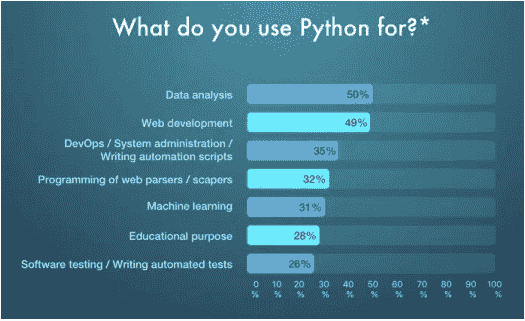

如果你想扩展应用程序并扩大其客户群，Python编程是一个绝佳的选择。它拥有庞大的库集合，允许公司在不增加加载时间的情况下添加大量功能。

Python编程的用途已渗透到每个业务领域。这门编程语言拥有庞大的社区，使开发者能够获得所需的所有帮助。

大多数企业都在招聘Python开发者，因为他们能够设计动态的应用程序。Python现在是开发者最首选的学习编程语言。

## Python在现实世界中的十大用途

Python是企业进行Web开发的绝佳工具。但Python的用途远不止于此。它是未来应用程序的强大编程语言。

以下是Python在现实世界中的十大用途：

### Web应用开发

毫无疑问，Python最顶级的实际用途之一是Web应用开发。Python现在无疑是Web应用的首选编程语言。

Web开发在现实世界中有多种Python的用途。它为应用程序提供安全性、便利性和可扩展性。

Python拥有许多Web开发框架，如Django和Flask，它们能够实现快速应用开发。Django的动态开发能力使Python成为Web应用的有用工具。该框架内置标准库，减少了开发时间，为Web应用提供了更快的上市时间。

### 数据科学

作为一项高需求技能，数据科学正达到顶峰。它正成为Python编程应用最重要的领域之一。Python库如Pandas、NumPy、SciPy等，帮助你处理数据并提取有价值的信息和见解。

数据科学家必须了解Python在数据提取和处理方面的用途。它允许他们通过图表可视化数据。Matplotlib和Seaborn都用于数据可视化。

随着普及度的提高，Python是数据科学家必须首先学习的内容。它是与研究和数据公司合作的基础。

### 人工智能

Python最有趣的实际用途可能是在人工智能和机器学习领域。Python是一种稳定且安全的语言，可以处理开发机器学习模型所需的计算。

机器学习算法是Python重要的现实用途之一。开发者可以使用这门编程语言轻松编写算法。

Python拥有用于机器学习应用的广泛库集合。这些包括SciPy、Pandas、Keras、TensorFlow、NumPy等等。

Python语言在AI解决方案中的用途包括高级计算、数据分析、图像识别、文本和数据处理等等，企业可以从中获益。如果你想了解更多关于AI和Python的信息，请点击此处。

### 游戏开发

游戏应用开发现在是一个重要的行业，它有许多Python编程的用途。有一些库被广泛用于交互式游戏开发。

游戏行业中一些真实的Python项目包括《战地2》、《Frets on Fire》、《坦克世界》等。这些游戏使用Python库如PySoy和PyGame进行开发。

Python允许游戏开发者构建基于树的算法，这在设计游戏的不同关卡时很有用。游戏需要同时处理多个请求，而Python在这方面表现得非常出色。

Python游戏应用开发是Python在现实世界中的十大用途之一。它为开发者提供了安装3D游戏引擎的机会，有助于构建强大的游戏和界面。

### 物联网

Python的另一个现实用途是在物联网领域。Python编程语言使开发者能够借助Raspberry Pi将任何物体变成电子设备。

Python用于创建嵌入式软件，允许在可以与该编程语言配合工作的小型物体上进行高性能的Python应用。

借助Raspberry Pi，开发者可以使用Python应用程序进行高级计算。通过嵌入它，开发者可以将普通物体变成智能电子产品。

在大规模工业中，物联网被广泛用于跟踪库存、移动机器以及跟踪订单处理和货物状态。

### 网页抓取

对海量数据进行网页抓取正变得对公司提取有价值的客户信息和做出明智决策非常有用。

Python的这一现实应用包括抓取大量网站和网页以提取特定目的的数据。它可以是职位列表、价格比较、详细信息等等。

Selenium、PythonRequest、MechanicalSoup是用于构建Python编程网页抓取应用的一些工具。

Python代码简单，因此编写能够提供大量数据的软件不涉及任何复杂性。

### 桌面GUI

Python编程语言可以与多个操作系统配合使用，并拥有强大的架构来构建应用程序。

## 企业应用

企业应用与常规的Web应用有很大不同。它们旨在满足组织的需求，而非个人用户。

Python编程在构建企业级应用方面的应用因企业而异。它主要用于可扩展性、可读性和强大的功能。

企业应用可能很复杂，因为它们需要大量的安全性和数据库处理能力。Python是一种健壮的语言，可以同时处理多个数据库请求。

Odoo和Tryton是一些企业应用开发工具，它们支持使用Python构建应用。企业应用是Python语言最重要的应用之一。

以实惠的价格，使用Python构建的企业应用来提升您的效率。**在此获取免费评估。**

## 图像识别与文本处理

使用Python构建的应用还可以使公司能够从图像数据库中识别图像，并有助于文本处理。

凭借其独特的图像处理和图形设计能力，Python允许开发者通过不同的工具设计2D和3D图像。

Inkscape、GIMP、Paint Shop是几个展示Python在图形和图像设计方面实际应用的例子。

一些顶级的3D动画软件包在其编程栈中使用了Python，其中包括Blender、Houdini、3ds Max、Lightwave等等。

## 教育程序

Python编程的一个流行用途是开发教育程序和在线课程。Python是一种对初学者非常友好的编程语言，学习曲线平缓，资源丰富。

Python的语法类似于英语，这使其成为初学者首选的编程语言。因此，基础和高级水平的教育程序开发都使用Python完成。

世界各地的专业人士使用Python来构建基于不同水平的教育程序和培训课程。这就是为什么它是Python开发的最佳用例之一。

## Python的实际应用

Python几乎可以处理所有类型的请求，这使其对各种开发活动都非常有用。从企业应用到游戏，Python的应用现在涵盖了广泛的应用领域。

Python正在成为构建各种应用的流行工具。在BoTree Technologies，我们拥有一个由Python开发者组成的专家团队，他们可以帮助您构建Python应用。

# 总结

- 异常是一个事件，它在程序执行期间发生，会干扰程序指令的正常流程。
- Python程序一旦遇到错误就会终止。在Python中，错误可以是语法错误或异常。
- 单元测试是一种软件测试方法，通过这种方法，将源代码的各个单元置于各种测试之下，以确定它们是否适合使用（来源）。它确定并验证了代码的质量。
- 开发人员需要编写自动化测试脚本，以确保每个部分或单元都符合其设计并按预期运行。
- 即使语句或表达式在语法上是正确的，在尝试执行时也可能导致错误。在执行期间检测到的错误称为异常，并非无条件致命：您将很快学习如何在Python程序中处理它们。
- 异常处理程序不仅处理在try子句中立即发生的异常，也处理在try子句中调用的函数（即使是间接调用）内部发生的异常。

# 知识检查

1. 一个try-except块可以有多少个except语句？
    a. 零个
    b. 一个
    c. 多于一个
    d. 多于零个

2. try-except-else的else部分何时执行？
    a. 总是
    b. 当发生异常时
    c. 当没有发生异常时
    d. 当在except块中发生异常时

3. 一个except语句块可以处理多个异常吗？
    a. 可以，例如 except TypeError, SyntaxError [...]。
    b. 可以，例如 except [TypeError, SyntaxError]。
    c. 不可以
    d. 以上都不是

4. 所示代码的输出是什么？
    l=[1,2,3,4,5]
    [x&1 for x in l]
    a. [1, 1, 1, 1, 1]
    b. [1, 0, 1, 0, 1]
    c. [1, 0, 0, 0, 0]
    d. [0, 1, 0, 1, 0]

5. 下面所示代码的输出是什么？
    l1=[1,2,3]
    l2=[4,5,6]
    [x*y for x in l1 for y in l2]
    a. [4, 8, 12, 5, 10, 15, 6, 12, 18]
    b. [4, 10, 18]
    c. [4, 5, 6, 8, 10, 12, 12, 15, 18]
    d. [18, 12, 6, 15, 10, 5, 12, 8, 4]

6. 以下Python代码的输出是什么？
    max(“what are you”)
    a. 错误
    b. u
    c. t
    d. y

7. 以下Python列表推导式的输出是什么？
    [j for i in range(2,8) for j in range(i*2, 50, i)]
    a. 一个包含50以内所有质数的列表
    b. 一个包含50以内所有能被2整除的数的列表
    c. 一个包含50以内所有非质数的列表
    d. 错误

8. 以下Python代码的输出是什么？
    l=[2, 3, [4, 5]]
    l2=l.copy()
    l2[0]=88
    l
    l2
    a. [88, 2, 3, [4, 5]] [88, 2, 3, [4, 5]]
    b. [2, 3, [4, 5]] [88, 2, 3, [4, 5]]
    c. [88, 2, 3, [4, 5]] [2, 3, [4, 5]]
    d. [2, 3, [4, 5]] [2, 3, [4, 5]]

# 复习题

1. 确定Python中的用户定义异常。
2. Python中的异常处理是什么？
3. 什么是单元测试？
4. 使用PyUnit为Python测试设计一个测试用例。
5. list_1 = [expr(i) for i in list_0 if func(i)]的正确展开形式是什么？

# 检查你的结果

1. (d) 2. (c) 3. (a) 4. (b) 5. (c)
6. (d) 7. (c) 8. (b)

## 参考文献

1. Batista, Facundo (2003年10月17日). "PEP 327 – 十进制数据类型". Python增强提案. Python软件基金会. 原始内容存档于2020年6月4日. 检索于2008年11月24日.
2. Borderies, Olivier (2019年1月24日). "Pythran: 以C++的速度运行Python！". Medium. 原始内容存档于2020年3月25日. 检索于2020年3月25日.
3. Francisco, Thomas Claburn in San. "Google的Grumpy代码让Python运行Go". www.theregister.com. 原始内容存档于2021年3月7日. 检索于2021年1月20日.
4. Murri, Riccardo (2013). Python运行时在非数值科学代码上的性能. 欧洲Python科学会议 (EuroSciPy). arXiv:1404.6388.
5. Yegulalp, Serdar (2020年10月29日). "Pyston复活以加速Python". InfoWorld. 原始内容存档于2021年1月27日. 检索于2021年1月26日.

# 第5章 面向对象编程

> “面向对象编程提供了一种可持续的方式来编写意大利面条式代码。它让你能够将程序作为一系列补丁来累积。”
> —保罗·格雷厄姆

## 学习目标

学习本章后，你将能够：

1. 了解Python中面向对象编程的引入。
2. 定义面向对象编程的各种方法类型。

## 简介

面向对象编程（OOP）是一种通过将相关的属性和行为捆绑到单个对象中来构建程序的方法。从概念上讲，对象就像系统的组件。可以将程序想象成某种工厂装配线。在装配线的每一步，一个系统组件处理一些材料，最终将原材料转化为成品。

Python自诞生以来就是一门面向对象语言。因此，创建和使用类和对象非常容易。本章将帮助你成为使用Python面向对象编程支持的专家。

如果你之前没有任何面向对象（OO）编程的经验，你可能需要查阅相关的入门课程或至少某种教程，以便掌握基本概念。

不过，这里简要介绍一下面向对象编程（OOP），以便让你跟上进度——

- **类** – 一个对象的用户定义原型，它定义了一组描述该类任何对象的属性。属性包括数据成员（类变量和实例变量）和方法，通过点表示法访问。
- **类变量** – 由类的所有实例共享的变量。类变量在类内部但在任何类方法之外定义。类变量的使用频率不如实例变量。
- **数据成员** – 保存与类及其对象相关联数据的类变量或实例变量。
- **函数重载** – 将多个行为分配给特定函数。执行的操作因涉及的对象或参数类型而异。
- **实例变量** – 在方法内部定义且仅属于类当前实例的变量。
- **继承** – 将类的特征传递给从其派生的其他类。
- **实例** – 某个类的单个对象。例如，属于Circle类的对象obj就是Circle类的一个实例。
- **实例化** – 创建类的实例。
- **方法** – 在类定义中定义的一种特殊函数。
- **对象** – 由其类定义的数据结构的唯一实例。对象包括数据成员（类变量和实例变量）和方法。
- **运算符重载** – 将多个函数分配给特定运算符。

在Python中，面向对象编程（OOPs）是一种在编程中使用对象和类的编程范式。它旨在实现现实世界的实体，例如

## 5.1 Python中的面向对象编程简介

面向对象编程，简称OOP，是一种编程范式，它提供了一种构建程序的方式，将属性和行为捆绑到单个对象中。

例如，一个对象可以代表一个人，具有姓名、年龄、地址等属性，以及行走、说话、呼吸和跑步等行为。或者代表一封电子邮件，具有收件人列表、主题、正文等属性，以及添加附件和发送等行为。

换句话说，面向对象编程是一种对具体、现实世界事物（如汽车）以及事物之间关系（如公司与员工、学生与老师等）进行建模的方法。OOP将现实世界的实体建模为软件对象，这些对象拥有一些相关数据，并能执行特定功能。

另一种常见的编程范式是过程式编程，它将程序结构化为类似食谱的形式，提供一系列步骤（以函数和代码块的形式），按顺序执行以完成任务。

关键要点是，对象是面向对象编程范式的核心，它不仅像过程式编程那样代表数据，还构成了程序的整体结构。

### 5.1.1 Python中的类

首先关注数据，每个事物或对象都是某个类的实例。Python中可用的基本数据结构，如数字、字符串和列表，分别设计用于表示简单的事物，如某物的价格、一首诗的名称和你最喜欢的颜色。如果你想表示更复杂的东西呢？

例如，假设你想跟踪许多不同的动物。如果你使用一个列表，第一个元素可以是动物的名字，第二个元素可以代表它的年龄。你怎么知道哪个元素应该对应哪个属性？如果你有100种不同的动物呢？你能确定每种动物都有名字和年龄等等吗？如果你想给这些动物添加其他属性呢？这缺乏组织性，而这正是类存在的确切需求。类用于创建新的用户定义数据结构，其中包含关于某个事物的任意信息。以动物为例，我们可以创建一个`Animal()`类来跟踪动物的属性，如名字和年龄。重要的是要注意，类只提供结构——它是定义事物应该如何构建的蓝图，但它本身并不提供任何实际内容。`Animal()`类可能规定定义动物需要名字和年龄，但它不会实际说明某个特定动物的名字或年龄是什么。可以将类理解为关于事物应如何定义的一个想法。

### 5.1.2 Python对象（实例）

类是蓝图，而*实例*是具有*实际*值的类的副本，字面意义上是一个属于特定类的对象。它不再是一个想法；它是一个实际的动物，比如一只名叫罗杰、八岁的狗。

换句话说，类就像一张表格或问卷。它定义了所需的信息。当你填写完表格后，你的特定副本就是该类的一个实例；它包含了与你相关的实际信息。

你可以填写多份表格来创建许多不同的实例，但如果没有表格作为指导，你会迷失方向，不知道需要什么信息。因此，在创建对象的单个实例之前，我们必须首先通过定义一个类来指定需要什么。

### 如何在Python中定义一个类

在Python中定义一个类很简单：

```python
class Dog:
    pass
```

你以`class`关键字开始，表示你正在创建一个类，然后添加类的名称（使用驼峰命名法，以大写字母开头）。

另外，我们在这里使用了Python关键字`pass`。这通常用作占位符，表示代码最终会放在这里。它允许我们运行这段代码而不抛出错误。

上述代码在Python 3中是正确的。在Python 2.x（“遗留Python”）中，你需要使用略有不同的类定义：

```python
# Python 2.x 类定义：
class Dog(object):
    pass
```

括号中的`(object)`部分指定了你继承的父类。在Python 3中，这不再必要，因为它是隐式默认的。

### 实例属性

所有类都创建对象，所有对象都包含称为属性的特征（在开头段落中称为属性）。使用`__init__()`方法通过赋予默认值（或状态）来初始化（例如，指定）对象的初始属性。此方法必须至少有一个参数以及`self`变量，该变量引用对象本身（例如，Dog）。

```python
class Dog:
    # 初始化器 / 实例属性
    def __init__(self, name, age):
        self.name = name
        self.age = age
```

在我们的`Dog()`类的情况下，每只狗都有特定的名字和年龄，这在你开始实际创建不同的狗时显然很重要。记住：类只是用于定义Dog，而不是实际创建具有特定名字和年龄的单个狗的实例；我们很快就会讲到。

同样，`self`变量也是类的一个实例。由于类的实例具有不同的值，我们可以写`Dog.name = name`而不是`self.name = name`。但由于并非所有的狗都共享相同的名字，我们需要能够为不同的实例分配不同的值。因此需要特殊的`self`变量，它将帮助跟踪每个类的各个实例。

你永远不需要调用`__init__()`方法；当你创建一个新的'Dog'实例时，它会自动被调用。

### 类属性

虽然实例属性对每个对象都是特定的，但类属性对所有实例都是相同的——在这种情况下，就是所有的狗。

```python
class Dog:
    # 类属性
    species = 'mammal'

    # 初始化器 / 实例属性
    def __init__(self, name, age):
        self.name = name
        self.age = age
```

所以，虽然每只狗都有独特的名字和年龄，但每只狗都是哺乳动物。

让我们创建一些狗……

### 5.1.3 实例化对象

实例化是创建一个新的、唯一的类实例的术语。

例如：

```python
>>> class Dog:
...     pass
...
>>> Dog()
<__main__.Dog object at 0x1004ccc50>
>>> Dog()
<__main__.Dog object at 0x1004ccc90>
>>> a = Dog()
>>> b = Dog()
>>> a == b
False
```

我们首先定义了一个新的`Dog()`类，然后创建了两只新的狗，每只都分配给不同的对象。所以，要创建一个类的实例，你使用类名，后跟括号。然后，为了证明每个实例实际上是不同的，我们又实例化了两只狗，将每只分配给一个变量，然后测试这些变量是否相等。

你认为类实例的类型是什么？

```python
>>> class Dog:
...     pass
...
>>> a = Dog()
>>> type(a)
<class '__main__.Dog'>
```

让我们看一个稍微复杂一点的例子……

```python
class Dog:
    # 类属性
    species = 'mammal'

    # 初始化器 / 实例属性
    def __init__(self, name, age):
        self.name = name
        self.age = age

# 实例化Dog对象
philo = Dog("Philo", 5)
mikey = Dog("Mikey", 6)

# 访问实例属性
print("{} is {} and {} is {}.".format(
    philo.name, philo.age, mikey.name, mikey.age))

# Philo是哺乳动物吗？
if philo.species == "mammal":
    print("{0} is a {1}!".format(philo.name, philo.species))
```

将其保存为`dog_class.py`，然后运行程序。你应该看到：
Philo is 5 and Mikey is 6.
Philo is a mammal!

### 发生了什么？

我们创建了一个新的`Dog()`类实例，并将其分配给变量`philo`。然后我们传递了两个参数，“Philo”和5，分别代表那只狗的名字和年龄。

这些属性被传递给`__init__`方法，该方法在每次创建新实例时都会被调用，将名字和年龄附加到对象上。你可能想知道为什么我们不需要传递`self`参数。

这是Python的魔法；当你创建类的新实例时，Python会自动确定`self`是什么（在这种情况下是Dog），并将其传递给`__init__`方法。

## 5.1.4 实例方法

实例方法在类内部定义，用于获取**实例**的内容。它们也可以用于对对象的属性执行操作。与`__init__`方法一样，第一个参数始终是self：

```python
class Dog:
    # Class Attribute
    species = 'mammal'

    # Initializer / Instance Attributes
    def __init__(self, name, age):
        self.name = name
        self.age = age

    # instance method
    def description(self):
        return "{} is {} years old".format(self.name, self.age)

    # instance method
    def speak(self, sound):
        return "{} says {}".format(self.name, sound)

# Instantiate the Dog object
mikey = Dog("Mikey", 6)

# call our instance methods
print(mikey.description())
print(mikey.speak("Gruff Gruff"))
```

将其保存为`dog_instance_methods.py`，然后运行：

```
Mikey is 6 years old
Mikey says Gruff Gruff
```

> **关键词**
> 实例是任何对象的具体存在，通常存在于计算机程序的运行期间。形式上，它与“对象”同义，因为它们都是一个特定的值（实现），这些可以被称为实例对象；“实例”强调了对象的独特身份。

在后一个方法`speak()`中，我们定义了行为。你还能为狗分配哪些其他行为？回顾开头段落，看看其他对象的一些示例行为。

## 修改属性

你可以根据某些行为更改属性的值：

```python
>>> class Email:
...     def __init__(self):
...         self.is_sent = False
...     def send_email(self):
...         self.is_sent = True
...
>>> my_email = Email()
>>> my_email.is_sent
False
>>> my_email.send_email()
>>> my_email.is_sent
True
```

这里，我们添加了一个发送电子邮件的方法，该方法将`is_sent`变量更新为`True`。

## 5.1.5 Python 对象继承

继承是一个类获取另一个类的属性和方法的过程。新形成的类称为*子类*，子类派生自的类称为*父类*。

需要注意的是，子类会覆盖*或*扩展父类的功能（例如，属性和行为）。换句话说，子类继承父类的所有属性和行为，但也可以指定要遵循的不同行为。最基本的类类型是对象，通常所有其他类都继承自它作为父类。

当你定义一个新类时，Python 3 隐式地使用`object`作为父类。因此，以下两个定义是等效的：

```python
class Dog(object):
    pass
```

```python
# In Python 3, this is the same as:

class Dog:
    pass
```

在 Python 2.x 中，*新式*类和*旧式*类之间存在区别。我不会在这里详细说明，但如果你正在编写 Python 2 面向对象代码，通常你会希望指定`object`作为父类，以确保你定义的是新式类。

## 狗公园示例

假设我们在一个狗公园。有多个`Dog`对象正在进行`Dog`行为，每个对象都有不同的属性。用普通话说，这意味着有些狗在跑，有些在伸展，有些只是在看其他狗。此外，每只狗都被它的主人命名，而且由于每只狗都在活着和呼吸，每只狗都会变老。

还有什么其他方法可以区分一只狗和另一只狗？狗的品种怎么样：

```python
>>> class Dog:
...     def __init__(self, breed):
...         self.breed = breed
...
>>> spencer = Dog("German Shepard")
>>> spencer.breed
'German Shepard'
>>> sara = Dog("Boston Terrier")
>>> sara.breed
'Boston Terrier'
```

每个品种的狗都有略微不同的行为。为了考虑这些，让我们为每个品种创建单独的类。这些是父`Dog`类的子类。

## 扩展父类的功能

创建一个名为*dog_inheritance.py*的新文件：

```python
# Parent class
class Dog:
    # Class attribute
    species = 'mammal'

    # Initializer / Instance attributes
    def __init__(self, name, age):
        self.name = name
        self.age = age

    # instance method
    def description(self):
        return "{} is {} years old".format(self.name, self.age)

    # instance method
    def speak(self, sound):
        return "{} says {}".format(self.name, sound)
```

```python
# Child class (inherits from Dog class)
class RussellTerrier(Dog):
    def run(self, speed):
        return "{} runs {}".format(self.name, speed)
```

```python
# Child class (inherits from Dog class)
class Bulldog(Dog):
    def run(self, speed):
        return "{} runs {}".format(self.name, speed)
```

```python
# Child classes inherit attributes and
# behaviors from the parent class
jim = Bulldog("Jim", 12)
print(jim.description())
print(jim.run("slowly"))
```

在研究这个程序时，大声朗读注释以帮助你理解发生了什么，然后在运行程序之前，看看你是否能预测预期的输出。

你应该看到：

```
Jim is 12 years old
Jim runs slowly
```

我们还没有添加任何特殊属性或方法来区分`RussellTerrier`和`Bulldog`，但由于它们现在是两个不同的类，我们可以例如给它们不同的类属性来定义它们各自的速度。

## 父类与子类

`isinstance()`函数用于确定一个实例是否也是某个父类的实例。

将其保存为`dog_isinstance.py`：

```python
# Parent class
class Dog:
    # Class attribute
    species = 'mammal'

    # Initializer / Instance attributes
    def __init__(self, name, age):
        self.name = name
        self.age = age

    # instance method
    def description(self):
        return "{} is {} years old".format(self.name, self.age)

    # instance method
    def speak(self, sound):
        return "{} says {}".format(self.name, sound)
```

```python
# Child class (inherits from Dog() class)
class RussellTerrier(Dog):
    def run(self, speed):
        return "{} runs {}".format(self.name, speed)
```

```python
# Child class (inherits from Dog() class)
class Bulldog(Dog):
    def run(self, speed):
        return "{} runs {}".format(self.name, speed)
```

```python
# Child classes inherit attributes and
# behaviors from the parent class
jim = Bulldog("Jim", 12)
print(jim.description())
print(jim.run("slowly"))
```

```python
# Is jim an instance of Dog()?
print(isinstance(jim, Dog))
```

```python
# Is julie an instance of Dog()?
julie = Dog("Julie", 100)
print(isinstance(julie, Dog))
```

```python
# Is johnny walker an instance of Bulldog()?
johnnywalker = RussellTerrier("Johnny Walker", 4)
print(isinstance(johnnywalker, Bulldog))
```

```python
# Is julie an instance of jim?
print(isinstance(julie, jim))
```

输出：

```
('Jim', 12)
Jim runs slowly
True
True
False
```

> **TypeError** 是一种意外情况，可能在程序开发的多个阶段出现。因此，类型系统中需要一种检测错误的机制。

```
Traceback (most recent call last):
  File "dog_isinstance.py", line 50, in <module>
    print(isinstance(julie, jim))
TypeError: isinstance() arg 2 must be a class, type, or
tuple of classes and types
```

明白了吗？`jim`和`julie`都是`Dog()`类的实例，而`johnnywalker`不是`Bulldog()`类的实例。然后，作为一个健全性检查，我们测试了`julie`是否是`jim`的实例，这是不可能的，因为`jim`是一个类的实例而不是类本身——这就是**TypeError**的原因。

## 覆盖父类的功能

记住，子类也可以覆盖父类的属性和行为。例如：

```python
>>> class Dog:
...     species = 'mammal'
...
>>> class SomeBreed(Dog):
...     pass
...
>>> class SomeOtherBreed(Dog):
...     species = 'reptile'
...
>>> frank = SomeBreed()
```

## 5.2 面向对象编程的方法

Python 从一开始就是一门面向对象的语言。正因如此，创建和使用类与对象变得非常简单。如果你没有任何面向对象编程的经验。

方法是在类体内部定义的函数。它们用于定义对象的行为。

## 在 Python 中创建方法

```python
class Parrot:

    # 实例属性
    def __init__(self, name, age):
        self.name = name
        self.age = age

    # 实例方法
    def sing(self, song):
        return "{} sings {}".format(self.name, song)
    def dance(self):
        return "{} is now dancing".format(self.name)
# 实例化对象
blu = Parrot("Blu", 10)
# 调用我们的实例方法
print(blu.sing("Happy"))
print(blu.dance())
```

当我们运行程序时，输出将是：

Blu sings 'Happy'
Blu is now dancing

在上面的程序中，我们定义了两个方法，即 `sing()` 和 `dance()`。它们被称为实例方法，因为它们是在实例对象（即 `blu`）上调用的。

### 5.2.1 继承

继承是一种在不修改现有类的情况下，利用其详细信息创建新类的方式。新形成的类是派生类（或子类）。同样，现有的类是**基类**（或父类）。

**Python 继承语法**

```python
class BaseClass:
    基类的主体
class DerivedClass(BaseClass):
    派生类的主体
```

派生类从基类继承特性，并为其添加新特性。这导致了代码的可重用性。

## 在 Python 中使用继承

```python
# 父类
class Bird:

    def __init__(self):
        print("Bird is ready")

    def whoisThis(self):
        print("Bird")

    def swim(self):
        print("Swim faster")

# 子类
class Penguin(Bird):
    def __init__(self):
        # 调用 super() 函数
        super().__init__()
        print("Penguin is ready")

    def whoisThis(self):
        print("Penguin")

    def run(self):
        print("Run faster")

peggy = Penguin()
peggy.whoisThis()
peggy.swim()
peggy.run()
```

当我们运行这个程序时，输出将是：

- Bird is ready
- Penguin is ready
- Penguin
- Swim faster
- Run faster

在上面的程序中，我们创建了两个类，即 `Bird`（父类）和 `Penguin`（子类）。子类继承了父类的函数。我们可以从 `swim()` 方法中看到这一点。同样，子类修改了父类的行为。我们可以从 `whoisThis()` 方法中看到这一点。此外，我们通过创建一个新的 `run()` 方法扩展了父类的功能。

另外，我们在 `__init__()` 方法之前使用了 `super()` 函数。这是因为我们想将父类 `__init__()` 方法的内容引入到子类中。

为了演示继承的使用，让我们举一个例子。

多边形是一个具有 3 条或更多边的封闭图形。假设我们有一个名为 `Polygon` 的类，定义如下。

```python
class Polygon:
    def __init__(self, no_of_sides):
        self.n = no_of_sides
        self.sides = [0 for i in range(no_of_sides)]

    def inputSides(self):
        self.sides = [float(input("Enter side "+str(i+1)+" : ")) for i in range(self.n)]

    def dispSides(self):
        for i in range(self.n):
            print("Side",i+1,"is",self.sides[i])
```

这个类有数据属性来存储边的数量 *n* 和每条边的长度（作为一个列表 *sides*）。

方法 `inputSides()` 接收每条边的长度，同样，`dispSides()` 将正确地显示这些信息。

三角形是一个有 3 条边的多边形。因此，我们可以创建一个名为 `Triangle` 的类，它继承自 `Polygon`。这使得 `Polygon` 类中的所有属性在 `Triangle` 中都可直接使用。我们不需要再次定义它们（代码可重用性）。`Triangle` 定义如下。

```python
class Triangle(Polygon):
    def __init__(self):
        Polygon.__init__(self,3)

    def findArea(self):
        a, b, c = self.sides
        # 计算半周长
        s = (a + b + c) / 2
        area = (s*(s-a)*(s-b)*(s-c)) ** 0.5
        print('The area of the triangle is %0.2f' %area)
```

然而，`Triangle` 类有一个新的方法 `findArea()` 来计算并打印三角形的面积。这是一个示例运行。

```python
>>> t = Triangle()
>>> t.inputSides()
Enter side 1 : 3
Enter side 2 : 5
Enter side 3 : 4
>>> t.dispSides()
Side 1 is 3.0
Side 2 is 5.0
Side 3 is 4.0
>>> t.findArea()
The area of the triangle is 6.00
```

我们可以看到，即使我们没有为 `Triangle` 类定义像 `inputSides()` 或 `dispSides()` 这样的方法，我们仍然能够使用它们。

如果在类中找不到某个属性，搜索会继续到基类。如果基类本身是从其他类派生的，这个过程会递归重复。

### 5.2.2 封装

封装是将*数据*和*操作该数据的函数*打包到一个单一组件中，并限制对对象某些组件的访问。封装意味着对象的内部表示通常对外部隐藏，无法从对象定义外部看到。

类是封装的一个例子，因为它封装了所有数据，包括成员函数、变量等。

抽象与封装的区别：抽象是一种机制，它表示本质特征而不包含实现细节。

封装：——信息隐藏。

抽象：——实现隐藏。

Python 在隐藏属性和方法方面遵循“我们都是成年人”的哲学；即你应该信任其他将使用你的类的程序员。尽可能使用普通属性。

你可能会倾向于使用 getter 和 setter 方法而不是属性，但使用 getter 和 setter 的唯一原因是，如果需要，你可以在以后更改实现。然而，Python 2.2 及更高版本允许你使用属性来实现这一点：

## 受保护成员

受保护成员只能从类内部及其子类访问。在 Python 中如何实现这一点？答案是——通过约定。通过在成员名称前加上单个下划线，你是在告诉其他人“不要碰这个，除非你是子类”。

## 私有成员

但 Python 中有一种定义私有成员的方法：在变量和函数名前添加“__”（双下划线），可以在从类外部访问时隐藏它们。Python 没有真正的私有方法，所以方法或属性开头的单个下划线意味着你不应该访问这个方法。但这只是约定。仍然可以访问带单个下划线的变量。另外，当使用双下划线（__）时，我们仍然可以访问私有变量。

一个访问私有成员数据的例子。（使用名称修饰）

```python
class Person:
    def __init__(self):
        self.name = 'Manjula'
        self.__lastname = 'Dube'
    def PrintName(self):
        return self.name + ' ' + self.__lastname

# 类外部
P = Person()
print(P.name)
print(P.PrintName())
print(P.__lastname)
#AttributeError: 'Person' object has no attribute '__lastname'
```

在类外部访问公共变量，成功。
在类外部访问私有变量，失败。
访问公共函数，但此函数成功访问了**私有变量 __B**，因为它们在同一个类中。

一个访问私有成员数据的例子。（使用名称修饰技术）

```python
class SeeMee:
    def youcanseeme(self):
        return 'you can see me'

    def __youcannotseeme(self):
        return 'you cannot see me'

# 类外部
Check = SeeMee()
print(Check.youcanseeme())
# you can see me
print(Check.__youcannotseeme())
#AttributeError: 'SeeMee' object has no attribute '__youcannotseeme'
```

如果你需要访问私有成员函数：

```python
class SeeMee:
    def youcanseeme(self):
        return 'you can see me'
    def __youcannotseeme(self):
        return 'you cannot see me'
# 类外部
Check = SeeMee()
print(Check.youcanseeme())
print(Check._SeeMee__youcannotseeme())
#更改名称使其能够访问该函数
```

你仍然可以使用其修饰后的名称调用该方法，因此此功能并不能提供太多保护。

> `__init__` 方法是一个构造函数，一旦类的对象被实例化就会运行。它的目的是初始化对象。

> 私有变量是仅对其所属类可见的变量。

# 基础计算机编程：Python

要访问私有成员和私有函数，你应该了解以下内容：

- 当你写入一个对象不存在的属性时，Python系统通常不会报错，而是直接创建一个新属性。
- 私有属性不受Python系统保护。这是设计上的决定。
- 私有属性会被“遮蔽”。原因是，为了避免在继承链中发生命名冲突。这种遮蔽是通过某种隐式重命名实现的。私有属性的*真实*名称将是 `"__<className>_<attributeName>"`。

通过这个名称，可以从外部访问它。当从类内部访问时，名称会自动正确地更改。

## Python中的数据封装

在Python中使用面向对象编程（OOP），我们可以限制对方法和变量的访问。这可以防止数据被直接修改，称为封装。在Python中，我们使用下划线作为前缀来表示私有属性，即单下划线“ _ ”或双下划线“ __ ”。

```python
class Computer:

    def __init__(self):
        self.__maxprice = 900

    def sell(self):
        print("Selling Price: {}".format(self.__maxprice))

    def setMaxPrice(self, price):
        self.__maxprice = price

c = Computer()
c.sell()

# change the price
c.__maxprice = 1000
c.sell()

# using setter function
c.setMaxPrice(1000)
c.sell()
```

当我们运行这个程序时，输出将是：
Selling Price: 900
Selling Price: 900
Selling Price: 1000

在上面的程序中，我们定义了一个Computer类。我们使用`__init__()`方法来存储计算机的最高售价。我们尝试修改价格。然而，我们无法更改它，因为Python将`__maxprice`视为私有属性。要更改该值，我们使用了一个setter函数，即`setMaxPrice()`，它接受价格作为参数。

### 5.2.3 多态

多态意味着不同类型对同一函数做出响应。多态非常有用，因为它使编程更直观，因此更容易。多态是一个花哨的词，意思只是同一个函数被定义在不同类型的对象上。Python提供了协议，这本质上就是多态。这些协议为不同类型的内置对象实现了统一的行为。

## 协议

当我们内省一个对象时，我们有很多采用这种格式的属性：`__names__`。本节将阐明其中的许多内容。
万物皆对象，所有操作最终都意味着调用定义在对象上的函数。
协议是嵌入到Python中的多态函数。最重要的是，解释器知道它们。
协议实现了：

- 一致性 - 程序员可以依赖直觉
- 特殊语法 - 解释器将简洁的语法转换为对象上的函数。
- 我们将看两个协议：`__contains__` 和 `__iter__`

```python
__add__
x + y resolves to x.__add__(y)
>>> 1 + 2
3
>>> one = 1
>>> one.__add__(2)
3
>>> '1' + '2'
'12'
>>> '1'.__add__('2')
'12'
```

任何实现了`__add__`函数的对象都可以与`<object> + x`语法一起使用。

**参数**是任何有助于定义或分类特定系统的特征。也就是说，参数是系统的一个元素，在识别系统或评估其性能、状态、条件等时是有用的或关键的。

## `__contains__`

`__contains__`是用于成员关系的内置协议。
`x in y` 被解析为 `y.__contains__(x)`

当解释器遇到 `'b' in ['a', 'b']` 时，它知道要在`in`右侧的对象上查找`__contains__`函数，并将`in`左侧的对象作为**参数**传递给它。

列表对象定义了该函数，然后解释器执行相应的代码块。

所有数据结构都定义了成员关系的概念：

```python
>>> 'b' in ['a', 'b']
True
>>> 'b' in ('a', 'b')
True
>>> 'b' in {'a': 1, 'b': 2}
True
>>> 'b' in {'a', 'b'}
True
```

演示`__contains__`：

```python
>>> ['a', 'b'].__contains__('b')
True
>>> ('a', 'b').__contains__('b')
True
>>> {'a': 1, 'b': 2}.__contains__('b')
True
>>> {'a', 'b'}.__contains__('b')
True
```

任何实现了`__contains__`函数的对象都可以与`x in <object>`语法一起使用。

## `__iter__`

`__iter__`是Python中实现迭代的方式。这个协议比其他协议稍微复杂一些。

看这段代码：

```python
>>> number = [1, 2]
>>> for i in [1, 2]:
...     print(i)
...
1
2
```

大致的事件序列如下：* 解释器在列表对象上调用`__iter__`，* 返回一个迭代器类型的对象。* 然后解释器在迭代器上重复调用`__next__` * 解释器执行for循环中的代码 * 如果发生`StopIteration`异常，解释器中断循环。

为了说明：

```python
>>> itr_obj = [1, 2].__iter__()
>>> type(itr_obj)
<class 'list_iterator'>
>>> itr_obj.__next__()
1
>>> itr_obj.__next__()
2
>>> itr_obj.__next__()
Traceback (most recent call last):
  File "<stdin>", line 1, in <module>
StopIteration
```

任何实现了`__iter__`函数的对象都可以与`for x in <object>: ...`语法一起使用。

## 练习

### 布尔运算符

使用内省函数，以下语法解析为哪些协议函数：

- 3 > 2
- 3 < 2
- 3 <= 2
- 3 >= 2

### 字符串表示

当我们在解释器中得到结果时，调用的是哪个函数？它与我们输入`print(x)`时调用的函数相同吗？

### len() 实现

len() 适用于多种对象类型：

```python
>>> len('hi')
2
>>> len([1, 2])
2
```

函数`len`在传递给它的对象上调用了哪个协议函数？
多态是（在OOP中）为多种形式（数据类型）使用通用接口的能力。假设，我们需要给一个形状上色，有多种形状选项（矩形、正方形、圆形）。然而，我们可以使用相同的方法给任何形状上色。这个概念称为多态。

## 在Python中使用多态

```python
class Parrot:

    def fly(self):
        print("Parrot can fly")

    def swim(self):
        print("Parrot can't swim")

class Penguin:

    def fly(self):
        print("Penguin can't fly")

    def swim(self):
        print("Penguin can swim")

# common interface
def flying_test(bird):
    bird.fly()

#instantiate objects
blu = Parrot()
peggy = Penguin()

# passing the object
flying_test(blu)
flying_test(peggy)
```

当我们运行上面的程序时，输出将是：
Parrot can fly
Penguin can't fly

在上面的程序中，我们定义了两个类Parrot和Penguin。它们都有共同的fly()方法。然而，它们的功能是不同的。为了允许多态，我们创建了一个通用接口，即flying_test()函数，它可以接受任何对象。然后，我们将对象blu和peggy传递给flying_test()函数，它有效地运行了。

### 5.2.4 抽象

数据抽象和封装经常被用作同义词。它们几乎是同义词，因为数据抽象是通过封装实现的。

抽象用于隐藏内部细节，只显示功能。抽象某物意味着给事物命名，以便名称能捕捉到函数或整个程序的核心功能。当我们考虑世界上我们希望在程序中表示的广泛事物时，我们发现其中大多数具有复合结构。日期有年、月、日；地理位置有纬度和经度。为了表示位置，我们希望我们的编程语言能够“粘合”纬度和经度以形成一对——一个*复合数据*值——我们的程序可以以一种与我们将位置视为一个具有两个部分的单一概念单元这一事实相一致的方式进行操作。

复合数据的使用也使我们能够增加程序的**模块化**。如果我们可以直接将地理位置作为对象本身来操作，那么我们就可以将程序中处理值本身的部分与这些值可能如何表示的细节分开。将程序中处理数据表示方式的部分与处理这些数据操作方式的部分隔离开来的通用技术是一种强大的设计方法，称为*数据抽象*。数据抽象使程序更容易设计、维护和修改。

数据抽象在性质上类似于函数抽象。当我们创建函数抽象时，函数如何实现的细节可以被抑制，并且特定的函数本身可以被任何具有相同整体行为的其他函数替换。换句话说，我们可以创建一个抽象，将函数的使用方式与函数实现的细节分开。类似地，数据抽象是一种方法论，使我们能够将复合数据对象的使用方式与其构造细节隔离开来。

数据抽象的基本思想是构建程序，使其操作抽象数据。也就是说，我们的程序应该以尽可能少地对数据做出假设的方式使用数据。同时，定义一个具体的数据表示，独立于使用数据的程序。我们系统这两部分之间的接口将是一组函数，称为选择器和构造函数，它们根据具体表示来实现抽象数据。为了说明这种技术，我们将考虑如何设计一组用于操作有理数。在阅读接下来的几节时，请记住，当今编写的大多数Python代码都使用语言内置的高级抽象数据类型，如类、字典和列表。由于我们正在逐步理解这些抽象的工作原理，我们自己还不能使用它们。因此，我们将编写一些非Pythonic的代码——它不一定是实现我们想法的典型方式。然而，我们所写的内容具有指导意义，因为它展示了这些抽象是如何构建的！请记住，计算机科学不仅仅是学习使用编程语言，还要学习它们的工作原理。

## 示例：有理数的算术运算

回想一下，有理数是整数的比值，有理数构成了实数的一个重要子类。像1/3或17/29这样的有理数通常写成：

    <分子>/<分母>

其中`<分子>`和`<分母>`都是整数值的占位符。要精确描述有理数的值，两部分都是必需的。

有理数在计算机科学中很重要，因为它们像整数一样可以被精确表示。无理数（如π、e或√2）则使用有限的二进制展开来近似表示。因此，从原则上讲，使用有理数应该可以避免算术运算中的近似误差。

然而，一旦我们实际将分子除以分母，我们可能会得到一个截断的十进制近似值（一个浮点数）。

    >>> 1/3
    0.3333333333333333

当我们开始进行测试时，这种近似的问题就出现了：

    >>> 1/3 == 0.333333333333333300000  # 警惕近似值
    True

计算机如何用有限长度的十进制展开来近似实数，这是另一门课的话题。这里的重要思想是，通过将有理数表示为整数的比值，我们完全避免了近似问题。因此，为了精确起见，我们希望将分子和分母分开保存，但将它们视为一个整体。

从使用函数抽象中我们知道，在程序的某些部分实现之前，我们就可以开始高效地编程。让我们首先假设我们已经有一种从分子和分母构造有理数的方法。我们还假设，给定一个有理数，我们有一种提取（或选择）其分子和分母的方法。让我们进一步假设构造函数和选择器作为以下三个函数可用：

- `make_rat(n, d)` 返回分子为n、分母为d的有理数。
- `numer(x)` 返回有理数x的分子。
- `denom(x)` 返回有理数x的分母。

我们在这里使用了一种强大的综合策略：*一厢情愿*。我们还没有说明有理数是如何表示的，或者函数`numer`、`denom`和`make_rat`应该如何实现。即便如此，如果我们确实有这三个函数，我们就可以通过调用它们来对有理数进行加法、乘法和相等性测试：

```python
>>> def add_rat(x, y):
        nx, dx = numer(x), denom(x)
        ny, dy = numer(y), denom(y)
        return make_rat(nx * dy + ny * dx, dx * dy)
>>> def mul_rat(x, y):
        return make_rat(numer(x) * numer(y), denom(x) * denom(y))
>>> def eq_rat(x, y):
        return numer(x) * denom(y) == numer(y) * denom(x)
```

现在我们已经用选择器函数`numer`和`denom`以及构造函数`make_rat`定义了有理数上的运算，但我们还没有定义这些函数。我们需要的是某种将分子和分母粘合成一个单元的方法。

## 元组

为了使我们能够实现数据抽象的具体层次，Python提供了一种称为元组的复合结构，可以通过用逗号分隔值来构造。虽然不是严格要求的，但括号几乎总是包围着元组。

```python
>>> (1, 2)
(1, 2)
```

元组的元素可以通过两种方式解包。第一种方式是通过我们熟悉的多重赋值方法。

```python
>>> pair = (1, 2)
>>> pair
(1, 2)
>>> x, y = pair
>>> x
1
>>> y
2
```

事实上，多重赋值一直在创建和解包元组。

访问元组中元素的第二种方法是通过索引运算符，写作方括号。

```python
>>> pair[0]
1
>>> pair[1]
2
```

Python中的元组（以及大多数其他编程语言中的序列）是0索引的，这意味着索引0选择第一个元素，索引1选择第二个，依此类推。这种索引约定背后的一个直觉是，索引表示元素距离元组开头的偏移量。

与元素选择运算符等效的函数称为`getitem`，它也使用0索引的位置从元组中选择元素。

```python
>>> from operator import getitem
>>> getitem(pair, 0)
1
```

元组是原生类型，这意味着有内置的Python**运算符**来操作它们。我们很快会回到元组的完整属性。目前，我们只对元组如何作为实现抽象数据类型的粘合剂感兴趣。

**表示有理数。** 元组提供了一种自然的方式来将有理数实现为两个整数的对：一个分子和一个分母。我们可以通过操作2元素元组来实现有理数的构造函数和选择器函数。

```python
>>> def make_rat(n, d):
        return (n, d)
>>> def numer(x):
        return getitem(x, 0)
>>> def denom(x):
        return getitem(x, 1)
```

一个打印有理数的函数完成了我们对这个抽象数据类型的实现。

```python
>>> def str_rat(x):
    """返回分子n和分母d的字符串'n/d'。"""
    return '{0}/{1}'.format(numer(x), denom(x))
```

结合我们之前定义的算术运算，我们可以用我们定义的函数来操作有理数。

```python
>>> half = make_rat(1, 2)
>>> str_rat(half)
'1/2'
>>> third = make_rat(1, 3)
>>> str_rat(mul_rat(half, third))
'1/6'
>>> str_rat(add_rat(third, third))
'6/9'
```

正如最后一个例子所示，我们的有理数实现并没有将有理数化简为最简形式。我们可以通过改变`make_rat`来补救这一点。如果我们有一个计算两个整数最大公约数的函数，我们可以在构造对之前用它来将分子和分母化简为最简形式。与许多有用的工具一样，这样的函数已经存在于Python库中。

```python
>>> from fractions import gcd
>>> def make_rat(n, d):
    g = gcd(n, d)
    return (n//g, d//g)
```

双斜杠运算符`//`表示整数除法，它将除法结果的小数部分向下取整。由于我们知道`g`能整除`n`和`d`，所以在这种情况下整数除法是精确的。现在我们有

```python
>>> str_rat(add_rat(third, third))
'2/3'
```

正如所期望的。这个修改是通过改变构造函数完成的，而没有改变任何实现实际算术运算的函数。

## 抽象屏障

在继续更多复合数据和数据抽象的例子之前，让我们考虑一下有理数例子提出的一些问题。我们根据构造函数`make_rat`和选择器`numer`和`denom`定义了操作。一般来说，数据抽象的基本思想是为每种类型的值确定一组基本操作，所有对该类型值的操作都将用这些操作来表达，然后在操作数据时只使用这些操作。

我们可以将有理数系统的结构设想为一系列层次。

水平线代表抽象屏障，它们隔离了系统的不同层次。在每个层次上，屏障将使用数据抽象的函数（上方）与实现数据抽象的函数（下方）分隔开来。使用有理数的程序仅通过它们的算术函数来操作它们：`add_rat`、`mul_rat`和`eq_rat`。这些函数又仅通过构造函数和选择器`make_rat`、`numer`和`denom`来实现，而这些函数本身又是通过元组来实现的。只要元组能够实现选择器和构造函数，元组如何实现的细节对其他层次来说就无关紧要。

在每个层次上，方框内的函数强制执行抽象边界，因为它们是唯一既依赖于它们上方的表示（通过它们的使用）又依赖于它们下方的实现（通过它们的定义）的函数。这样，抽象屏障就表示为函数的集合。抽象屏障提供了许多优势。一个优势

> 上面的`str_rat`实现使用了格式字符串，其中包含值的占位符。如何使用格式字符串和format方法的详细信息出现在《深入Python 3》的格式化字符串部分。

在于它们使程序更易于维护和修改。依赖于特定表示的函数越少，当需要改变该表示时所需的更改就越少。

## 数据的特性

我们通过实现三个未指定的函数 `make_rat`、`numer` 和 `denom` 来开始有理数的算术运算实现。在那时，我们可以将这些运算视为根据数据对象——分子、分母和有理数——来定义的，而这些数据对象的行为由后三个函数指定。

但“数据”究竟意味着什么？仅仅说“由给定的选择器和构造器实现的东西”是不够的。我们需要保证这些函数共同指定了正确的行为。也就是说，如果我们从整数 `n` 和 `d` 构造一个有理数 `x`，那么应该有 `numer(x)/denom(x)` 等于 `n/d`。

通常，我们可以将一个抽象数据类型视为由一些选择器和构造器以及一些行为条件来定义。只要满足了行为条件（例如上面的除法性质），这些函数就构成了该数据类型的有效表示。

这种观点也可以应用于其他数据类型，例如我们用来实现有理数的二元组。我们实际上从未过多说明元组是什么，只说明了语言提供了创建和操作元组的运算符。我们现在可以描述二元组（也称为对）的行为条件，这些条件与表示有理数的问题相关。

为了实现有理数，我们需要一种形式的“胶水”来粘合两个整数，它具有以下行为：

- 如果一个对 `p` 由值 `x` 和 `y` 构造，那么 `getitem_pair(p, 0)` 返回 `x`，而 `getitem_pair(p, 1)` 返回 `y`。

我们可以实现满足此描述的函数 `make_pair` 和 `getitem_pair`，就像元组一样好。

```python
>>> def make_pair(x, y):
    """返回一个行为像对的函数。"""
    def dispatch(m):
        if m == 0:
            return x
        elif m == 1:
            return y
    return dispatch
>>> def getitem_pair(p, i):
    """返回对 p 中索引 i 处的元素。"""
    return p(i)
```

通过这种实现，我们可以创建和操作对。

```python
>>> p = make_pair(1, 2)
>>> getitem_pair(p, 0)
1
>>> getitem_pair(p, 1)
2
```

这种函数的使用方式与我们对数据应是什么的直观概念毫无相似之处。然而，这些函数足以在我们的程序中表示复合数据。

需要注意的微妙之处在于，`make_pair` 返回的值是一个名为 `dispatch` 的函数，它接受一个参数 `m` 并返回 `x` 或 `y`。然后，`getitem_pair` 调用此函数以检索适当的值。

展示对的函数式表示的意义不在于 Python 实际上就是这样工作的（出于效率原因，元组的实现更直接），而在于它可能这样工作。函数式表示虽然晦涩，但却是表示对的完全充分的方式，因为它满足了对需要满足的唯一条件。这个例子也表明，将函数作为值来操作的能力自动为我们提供了表示复合数据的能力。

> 术语“对象”和“面向”在现代面向对象编程意义上的首次出现是在 20 世纪 50 年代末和 60 年代初的麻省理工学院。在人工智能小组的环境中，早在 1960 年，“对象”就可以指具有属性（特性）的已识别项目（LISP 原子）。艾伦·凯后来在 1966 年指出，对 LISP 内部机制的深入理解对他当时的思想产生了强烈影响。

# 总结

- 面向对象编程（OOP）是一种通过将相关属性和行为捆绑到单个对象中来构建程序的方法。从概念上讲，对象就像系统的组件。可以将程序想象成某种工厂装配线。
- 面向对象编程是一种编程范式，它提供了一种构建程序的方式，使得属性和行为被捆绑到单个对象中。
- 关键要点是，对象是 Python 中面向对象编程的核心，不仅像过程式编程那样代表数据，而且也体现在程序的整体结构中。
- Python 自诞生以来就是一门面向对象语言。因此，创建和使用类和对象非常容易。本章帮助你成为使用 Python 面向对象编程支持的专家。
- 实例方法在类内部定义，用于获取实例的内容。
- 继承是一个类获取另一个类的属性和方法的过程。
- Python 从第一天起就是一门面向对象语言。因此，创建和使用类和对象非常容易。如果你没有任何面向对象（OO）编程的经验。
- 继承是一种在不修改现有类的情况下使用其详细信息来创建新类的方式。新形成的类是派生类（或子类）。
- 类是封装的一个例子，因为它封装了所有数据，包括成员函数、变量等。
- Python 在隐藏属性和方法方面遵循“我们都是成年人”的哲学；即你应该信任将使用你的类的其他程序员。
- 数据抽象和封装经常被用作同义词。两者几乎是同义词，因为数据抽象是通过封装实现的。

# 知识检查

1. 哪个是私有成员函数的访问范围？
   a. 只能在类内部使用的成员函数
   b. 可以在类外部使用的成员函数
   c. 在派生类中可访问的成员函数
   d. 无法在类内部访问的成员函数

2. 以下哪项是正确的？
   a. 私有成员不能被类的公共成员访问
   b. 私有成员可以被类的公共成员访问
   c. 私有成员只能被类的私有成员访问
   d. 私有成员不能被类的受保护成员访问

3. 哪个成员永远不能被继承类访问？
   a. 私有成员函数
   b. 公共成员函数
   c. 受保护成员函数
   d. 所有都可以访问

4. 以下哪种语法表示一个成员在类中是私有的？
   a. private: functionName(parameters)
   b. private(functionName(parameters))
   c. private functionName(parameters)
   d. private::functionName(parameters)

5. 一个类中允许有多少个私有成员函数？
   a. 只有 1 个
   b. 只有 7 个
   c. 只有 255 个
   d. 根据需要任意多个

6. 以下哪种语言是作为第一个纯粹的面向对象编程语言开发的？
   a. SmallTalk
   b. C++
   c. Kotlin
   d. Java

7. 谁开发了面向对象编程？
   a. Adele Goldberg
   b. Dennis Ritchie
   c. Alan Kay
   d. Andrea Ferro

8. 以下哪项不是 OOPS 概念？
   a. 封装
   b. 多态
   c. 异常
   d. 抽象

# 复习题

1. Python 中的类和对象（实例）是什么？
2. 如何实例化对象？请用合适的例子解释。
3. 讨论继承的概念。
4. OOPS 中封装的机制是什么？
5. 编写一个在 Python 中使用多态的程序。

# 检查你的结果

1. (a)          2. (b)          3. (a)          4. (c)          5. (d)
6. (a)          7. (c)          8. (c)

## 参考文献

1. Beal, V. (2016). What is Polymorphism? Webopedia Definition. [online] Webopedia.com. Available at: http://www.webopedia.com/TERM/P/polymorphism.html
2. Derek Coleman, et. al. Object-Oriented Development - The Fusion Method. Prentice-Hall Object-Oriented Series.
3. E. Colbert. The Object-Oriented Software Development Method: a practical approach to object-oriented development. Tri-Ada Proc., New York.
4. Lambert, S. (2012). Quick Tip: The OOP Principle of Encapsulation. [online] Game Development Envato Tuts+. Available at: http://gamedevelopment.tutsplus.com/tutorials/quick-tip-the-oop-principle-of-encapsulation--gamedev-2187
5. Lau, Yun-Tung, Ph.D. The Art of Objects: Object-Oriented Design and Architecture. Addison-Wesley, 2001.
6. Obbayi, R. (2016). Compare Structured and Object-Oriented Programming: What Are the Real Differences?. [online] Bright Hub. Available at: http://www.brighthub.com/internet/web-development/articles/82024.aspx

## 第六章
Python 正则表达式

> “在这本名为《通过 Minecraft 学习编程》的入门书籍中，你将学习如何使用 Python 编程语言在 Minecraft 中实现各种酷炫功能。无需任何编程经验。”

--Mark Frauenfelder

## 学习目标

学习本章后，你将能够：
1. 理解正则表达式的搜索与匹配
2. 了解正则表达式修饰符及选项标志

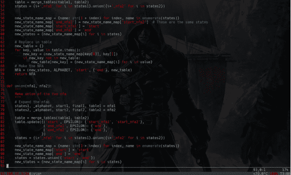

## 引言

正则表达式（简称 RE，或 regex，或正则模式）本质上是一种嵌入在 Python 中的微型、高度专业化的编程语言，通过 `re` 模块提供。使用这种小型语言，你可以指定要匹配的可能字符串集合的规则；这个集合可能包含英语句子、电子邮件地址、TeX 命令或任何你喜欢的内容。然后你可以提出诸如“这个字符串是否匹配该模式？”或“该字符串中是否存在匹配该模式的内容？”等问题。你还可以使用正则表达式以各种方式修改字符串或将其拆分。

正则表达式模式被编译成一系列字节码，然后由用 C 语言编写的匹配引擎执行。对于高级使用，可能需要仔细关注引擎将如何执行给定的正则表达式，并以特定方式编写正则表达式以生成运行更快的字节码。本文档不涵盖优化，因为它要求你对匹配引擎的内部工作原理有深入的理解。

正则表达式语言相对较小且受限，因此并非所有可能的字符串处理任务都可以使用正则表达式完成。有些任务虽然可以用正则表达式完成，但表达式可能变得非常复杂。在这些情况下，你最好编写 Python 代码来处理；虽然 Python 代码会比精心设计的正则表达式慢，但它可能也更容易理解。

## 6.1 正则表达式的搜索与匹配

Python 是一种高级开源脚本语言。Python 内置的 `re` 模块为正则表达式提供了出色的支持，具有现代且完整的正则表达式风格。Python 正则表达式语法中唯一缺失的重要特性是原子分组、占有量词和 Unicode 属性。

首先要做的是使用 `import re` 将正则表达式模块导入到你的脚本中。

调用 `re.search(regex, subject)` 将正则表达式模式应用于目标字符串。如果匹配尝试失败，该函数返回 `None`，否则返回一个 Match 对象。由于 `None` 在布尔上下文中求值为 `False`，你可以轻松地在 `if` 语句中使用 `re.search()`。Match 对象存储了正则表达式模式匹配的字符串部分的详细信息。你可以通过指定一个特殊的**常量**作为 `re.search()` 的第三个参数来设置正则表达式匹配模式。`re.I` 或 `re.IGNORECASE` 以不区分大小写的方式应用模式。`re.S` 或 `re.DOTALL` 使点号匹配换行符。`re.M` 或 `re.MULTILINE` 使脱字符 `^` 和美元符号 `$` 分别匹配目标字符串中行尾和行首。单字母选项和描述性选项之间没有区别，只是你需要输入的字符数量不同。要指定多个选项，使用 `|` 运算符将它们“或”在一起：`re.search("^a", "abc", re.I | re.M)`。

默认情况下，Python 的正则表达式引擎仅将字母 A 到 Z、数字 0 到 9 和下划线视为“单词字符”。指定标志 `re.L` 或 `re.LOCALE` 可使 `\w` 匹配当前区域设置下被视为字母的所有字符。或者，你可以指定 `re.U` 或 `re.UNICODE`，将所有脚本中的所有字母都视为单词字符。此设置也会影响单词边界。

不要混淆 `re.search()` 和 `re.**match()**`。这两个函数的功能完全相同，但重要区别在于 `re.search()` 会在整个字符串中尝试模式，直到找到匹配项。而 `re.match()` 仅在字符串的最开始处尝试模式。基本上，`re.match("regex", subject)` 等同于 `re.search("\Aregex", subject)`。

Python 3.4 添加了一个新的 `re.**fullmatch()**` 函数。此函数仅在正则表达式完全匹配字符串时才返回 Match 对象。否则返回 `None`。`re.fullmatch("regex", subject)` 等同于 `re.search("\Aregex\Z", subject)`。这对于验证用户输入很有用。如果 `subject` 是空字符串，那么对于任何可以找到零长度匹配的正则表达式，`fullmatch()` 都会求值为 `True`。

要从字符串中获取所有匹配项，请调用 `re.**findall**(regex, subject)`。这将返回字符串中所有非重叠的正则表达式匹配项的数组。“非重叠”意味着字符串从左到右被搜索，下一次匹配尝试从上一次匹配之后开始。如果正则表达式包含一个或多个捕获组，`re.findall()` 返回一个元组数组，每个元组包含所有捕获组匹配的文本。整体的正则表达式匹配*不*包含在元组中，除非你将整个正则表达式放在一个捕获组内。

> `re.match()` 不要求正则表达式匹配整个字符串。`re.match("a", "ab")` 将成功。

比 `re.findall()` 更高效的是 `re.**finditer**(regex, subject)`。它返回一个迭代器，使你能够循环遍历目标字符串中的正则表达式匹配项：`for m in re.finditer(regex, subject)`。for 循环变量 `m` 是一个 Match 对象，包含当前匹配的详细信息。

与 `re.search()` 和 `re.match()` 不同，`re.findall()` 和 `re.finditer()` 不支持带有正则表达式匹配标志的可选第三个参数。相反，你可以在正则表达式开头使用全局模式修饰符。例如，`"(?i)regex"` 以不区分大小写的方式匹配 `regex`。

### 6.1.1 match 函数

此函数尝试将正则表达式 *pattern* 与 *string* 进行匹配，可选参数 *flags*。

此函数的语法如下 –
`re.match(pattern, string, flags=0)`
参数描述如下 –

| 序号 | 参数与描述 |
| :--- | :--- |
| 1 | **pattern**<br>这是要匹配的正则表达式。 |
| 2 | **string**<br>这是要搜索的字符串，将在字符串开头匹配模式。 |
| 3 | **flags**<br>你可以使用按位或（`|`）指定不同的标志。这些是修饰符，列于下表。 |

*re.match* 函数成功时返回一个 **match** 对象，失败时返回 **None**。我们使用 **match** 对象的 *group(num)* 或 *groups()* 函数来获取匹配的表达式。

| 序号 | Match 对象方法与描述 |
| :--- | :--- |
| 1 | **group(num=0)**<br>此方法返回整个匹配（或特定子组 num） |
| 2 | **groups()**<br>此方法以元组形式返回所有匹配的子组（如果没有则为空） |

```python
#!/usr/bin/python
import re

line = "Cats are smarter than dogs"

matchObj = re.match( r'(.*) are (.*?) .*', line, re.M|re.I)

if matchObj:
    print "matchObj.group() : ", matchObj.group()
    print "matchObj.group(1) : ", matchObj.group(1)
    print "matchObj.group(2) : ", matchObj.group(2)
else:
    print "No match!!"
```


> 你知道吗？
如果字符串开头的零个或多个字符匹配正则表达式模式，则返回相应的匹配对象。如果字符串不匹配模式，则返回 `None`；请注意，这与零长度匹配不同。

当执行上述代码时，它会产生以下结果 –
matchObj.group() : Cats are smarter than dogs
matchObj.group(1) : Cats
matchObj.group(2) : smarter

### 6.1.2 search 函数

此函数在 *string* 中搜索正则表达式 *pattern* 的首次出现，可选参数 *flags*。
此函数的语法如下 –
`re.search(pattern, string, flags=0)`
参数描述如下 –

| 序号 | 参数与描述 |
| :--- | :--- |
| 1 | **pattern**<br>这是要匹配的正则表达式。 |

## 6.1.3 匹配与搜索

Python 基于正则表达式提供了两种不同的基本操作：**match** 仅检查字符串开头的匹配，而 **search** 则检查**字符串**中任意位置的匹配（这是 Perl 的默认行为）。

*示例*

```python
#!/usr/bin/python
import re

line = "Cats are smarter than dogs";

matchObj = re.match( r'dogs', line, re.M|re.I)
if matchObj:
    print "match --> matchObj.group() : ", matchObj.group()
else:
    print "No match!!"

searchObj = re.search( r'dogs', line, re.M|re.I)
if searchObj:
    print "search --> searchObj.group() : ", searchObj.group()
else:
    print "Nothing found!!"
```

执行上述代码后，将产生以下结果 –
No match!!
search --> searchObj.group() : dogs

## 6.1.4 搜索与替换

使用正则表达式的最重要的 **re** 方法之一是 **sub**。

### 语法

```python
(re.sub(pattern, repl, string, max=0)
```

此方法将 *string* 中所有匹配正则表达式 *pattern* 的部分替换为 *repl*，除非提供了 *max*，否则将替换所有匹配项。此方法返回修改后的字符串。

### 示例

```python
#!/usr/bin/python
import re

phone = "2004-959-559 # This is Phone Number"

# Delete Python-style comments
num = re.sub(r'#.*$', "", phone)
print "Phone Num : ", num

# Remove anything other than digits
num = re.sub(r'\D', "", phone)
print "Phone Num : ", num
```

执行上述代码后，将产生以下结果：

```
Phone Num :  2004-959-559
Phone Num :  2004959559
```

## 6.2 正则表达式修饰符：选项标志

**正则表达式**字面量可以包含一个可选的修饰符来控制匹配的各个方面。修饰符被指定为一个可选标志。你可以使用异或（|）提供多个修饰符，如前所述，并且可以由以下之一表示 –

> 正则表达式起源于1951年，当时数学家斯蒂芬·科尔·克莱尼使用他称为正则集的数学符号描述了正则语言。这些出现在理论计算机科学中，特别是在自动机理论（计算模型）以及形式语言的描述和分类子领域中。

> 正则表达式是定义搜索模式的字符序列。

| 序号 | 修饰符与描述 |
|---|---|
| 1 | **re.I**<br>执行不区分大小写的匹配。 |
| 2 | **re.L**<br>根据当前区域设置解释单词。此解释影响字母组（\w 和 \W）以及单词边界行为（\b 和 \B）。 |
| 3 | **re.M**<br>使 $ 匹配行尾（而不仅仅是字符串末尾），并使 ^ 匹配任何行的开头（而不仅仅是字符串开头）。 |
| 4 | **re.S**<br>使句点（点）匹配任何字符，包括换行符。 |
| 5 | **re.U**<br>根据 Unicode 字符集解释字母。此标志影响 \w、\W、\b、\B 的行为。 |
| 6 | **re.X**<br>允许使用“更简洁”的正则表达式语法。它忽略空白字符（除非在集合 [] 内或由反斜杠转义），并将未转义的 # 视为注释标记。 |

### 6.2.1 正则表达式模式

除了控制字符（+ ? . * ^ $ ( ) [ ] { } | \）外，所有字符都匹配自身。你可以通过在控制字符前加上反斜杠来转义它。
下表列出了 Python 中可用的正则表达式语法 –

| 序号 | 模式与描述 |
|---|---|
| 1 | ^<br>匹配行首。 |
| 2 | $<br>匹配行尾。 |
| 3 | .<br>匹配除换行符外的任何单个字符。使用 m 选项允许其也匹配换行符。 |
| 4 | [...]<br>匹配方括号内的任何单个字符。 |
| 5 | [^...]<br>匹配不在方括号内的任何单个字符。 |
| 6 | re*<br>匹配前面表达式的 0 次或多次出现。 |
| 7 | re+<br>匹配前面表达式的 1 次或多次出现。 |
| 8 | re?<br>匹配前面表达式的 0 次或 1 次出现。 |
| 9 | re{ n}<br>精确匹配前面表达式的 n 次出现。 |
| 10 | re{ n,}<br>匹配前面表达式的 n 次或多次出现。 |
| 11 | re{ n, m}<br>匹配前面表达式至少 n 次且至多 m 次出现。 |
| 12 | a| b<br>匹配 a 或 b。 |
| 13 | (re)<br>对正则表达式进行分组并记住匹配的文本。 |
| 14 | (?imx)<br>在正则表达式内临时启用 i、m 或 x 选项。如果在括号内，则仅影响该区域。 |
| 15 | (?-imx)<br>在正则表达式内临时禁用 i、m 或 x 选项。如果在括号内，则仅影响该区域。 |
| 16 | **(?: re)**<br>对正则表达式进行分组但不记住匹配的文本。 |
| 17 | **(?imx: re)**<br>在括号内临时启用 i、m 或 x 选项。 |
| 18 | **(?-imx: re)**<br>在括号内临时禁用 i、m 或 x 选项。 |
| 19 | **(?#...)**<br>注释。 |
| 20 | **(?= re)**<br>使用模式指定位置。没有范围。 |
| 21 | **(?! re)**<br>使用模式否定指定位置。没有范围。 |
| 22 | **(?> re)**<br>匹配独立模式，不进行回溯。 |
| 23 | **\w**<br>匹配单词字符。 |
| 24 | **\W**<br>匹配非单词字符。 |
| 25 | **\s**<br>匹配空白字符。等同于 [\t\n\r\f]。 |
| 26 | **\S**<br>匹配非空白字符。 |
| 27 | **\d**<br>匹配数字。等同于 [0-9]。 |
| 28 | **\D**<br>匹配非数字字符。 |
| 29 | **\A**<br>匹配字符串开头。 |
| 30 | **\Z**<br>匹配字符串结尾。如果存在换行符，则匹配换行符之前的位置。 |
| 31 | **\z**<br>匹配字符串结尾。 |
| 32 | **\G**<br>匹配上次匹配完成的位置。 |
| 33 | **\b**<br>在方括号外匹配单词边界。在方括号内匹配退格符（0x08）。 |
| 34 | **\B**<br>匹配非单词边界。 |
| 35 | **\n, \t, 等**<br>匹配换行符、回车符、制表符等。 |
| 36 | **\1...\9**<br>匹配第 n 个分组的子表达式。 |
| 37 | **\10**<br>如果第 n 个分组的子表达式已匹配，则匹配它。否则，指**字符代码**的八进制表示。 |

Python 模块 re 提供了对 Python 中类似 Perl 的正则表达式的全面支持。如果在编译或使用正则表达式时发生错误，re 模块会引发 re.error 异常。

### 6.2.2 正则表达式示例

**字面字符**

| 序号 | 示例与描述 |
|---|---|
| 1 | **python**<br>匹配 "python"。 |

**字符类**

| 序号 | 示例与描述 |
|---|---|
| 1 | **[Pp]ython**<br>匹配 "Python" 或 "python" |
| 2 | **rub[ye]**<br>匹配 "ruby" 或 "rube" |
| 3 | **[aeiou]**<br>匹配任意一个小写元音字母 |
| 4 | **[0-9]**<br>匹配任意一个数字；等同于 [0123456789] |
| 5 | **[a-z]**<br>匹配任意一个小写 ASCII 字母 |
| 6 | **[A-Z]**<br>匹配任意一个大写 ASCII 字母 |
| 7 | **[a-zA-Z0-9]**<br>匹配上述任意一个字符 |
| 8 | **[^aeiou]**<br>匹配除小写元音字母外的任意字符 |
| 9 | **[^0-9]**<br>匹配除**数字**外的任意字符 |

> **关键词**
> 数字是数字系统中的单个字符。*例如，0、1、2、3、4、5、6、7、8、9 都是数字。*

**特殊字符类**

| 序号 | 示例与描述 |
|---|---|
| 1 | **.**<br>匹配除换行符外的任意字符 |
| 2 | **\d**<br>匹配一个数字：[0-9] |

## 重复案例

| 序号 | 示例与描述 |
| --- | --- |
| 1 | **ruby?**<br>匹配“rub”或“ruby”：y是可选的 |
| 2 | **ruby***<br>匹配“rub”加上0个或多个y |
| 3 | **ruby+**<br>匹配“rub”加上1个或多个y |
| 4 | **\d{3}**<br>精确匹配3个数字 |
| 5 | **\d{3,}**<br>匹配3个或更多数字 |
| 6 | **\d{3,5}**<br>匹配3、4或5个数字 |

## 非贪婪重复

这匹配最小数量的重复 –

| 序号 | 示例与描述 |
|---|---|
| 1 | <.*><br>贪婪重复：匹配“<python>perl>” |
| 2 | <.*?><br>非贪婪：在“<python>perl>”中匹配“<python>” |

## 使用圆括号分组

| 序号 | 示例与描述 |
|---|---|
| 1 | \D\d+<br>无分组：+重复\d |
| 2 | (\D\d)+<br>分组：+重复\D\d这对 |
| 3 | ([Pp]ython(, )?)+<br>匹配“Python”、“Python, python, python”等 |

## 反向引用

这再次匹配先前匹配过的分组 –

| 序号 | 示例与描述 |
|---|---|
| 1 | ([Pp])ython&\1ails<br>匹配python&pails或Python&Pails |
| 2 | (['"])[^\1]*\1<br>单引号或双引号字符串。\1匹配第一个分组匹配的内容。\2匹配第二个分组匹配的内容，依此类推。 |

## 替代

| 序号 | 示例与描述 |
|---|---|
| 1 | **python\|perl**<br>匹配“python”或“perl” |
| 2 | **rub(y\|le))**<br>匹配“ruby”或“ruble” |
| 3 | **Python(!+\|\?)**<br>“Python”后跟一个或多个!或一个? |

## 锚点

这需要指定匹配位置。

| 序号 | 示例与描述 |
|---|---|
| 1 | **^Python**<br>在字符串或内部行的开头匹配“Python” |
| 2 | **Python$**<br>在字符串或行的末尾匹配“Python” |
| 3 | **\APython**<br>在字符串的开头匹配“Python” |
| 4 | **Python\Z**<br>在字符串的末尾匹配“Python” |
| 5 | **\bPython\b**<br>在单词边界匹配“Python” |
| 6 | **\brub\B**<br>\B是非单词边界：在“rube”和“ruby”中匹配“rub”，但不单独匹配 |
| 7 | **Python(?=!)**<br>如果后面跟着感叹号，则匹配“Python”。 |
| 8 | **Python(?!!)**<br>如果后面不跟着感叹号，则匹配“Python”。 |

## 使用圆括号的特殊语法

| 序号 | 示例与描述 |
|---|---|
| 1 | R(?#comment)<br>匹配“R”。其余部分都是注释 |
| 2 | R(?i)uby<br>匹配“uby”时不区分大小写 |
| 3 | R(?i:uby)<br>同上 |
| 4 | rub(?:y\|le))<br>仅分组，不创建\1反向引用 |

## 案例研究

## PYTHON

Python是一种解释型、动态类型、面向对象的脚本语言，拥有大量内置数据类型。它用C实现，但采用了非常面向对象的方式。其设计是语言实现的良好模型。

Python解释器的工作方式是加载源文件或读取键盘输入的一行，将其解析为抽象语法树，将树编译为字节码，然后执行字节码。我们将主要关注字节码是如何执行的，例如继承和环境是如何实现的。

## 解析

解析过程相当标准。基本思想是首先将输入字符转换为更抽象的表示，例如：名称：x，整数：7，字符串：“hello”，小于等于等。抽象后的字符称为*标记*。（有像lex这样的工具可以自动生成词法分析器，但Python没有使用。）标记化过程在语言参考中有完整描述。

*例如*，语句

```
while(x <= 3):
    f(x)
```

可能被标记化为

- 关键字：while
- 左括号
- 名称：x
- 小于等于
- 整数：3
- 右括号
- 冒号
- 缩进
- 名称：f
- 左括号
- 名称：x
- 右括号

然后将这些标记组装成表达式、语句、函数定义、类定义等。由于函数定义包含语句，语句包含表达式，表达式可能包含嵌套表达式，依此类推，标记最终形成的数据结构是一棵树，称为*解析树*或*抽象语法树*。上面的标记可能被解析成这棵树：

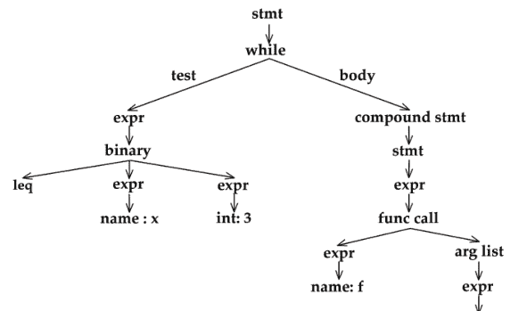

有像yacc这样的标准工具可以帮助生成解析器，但Python没有使用。相反，它使用嵌套的DFA（确定性有限自动机），这是一种递归的词法分析器，自上而下地填充树。类似的技术在《编程语言原理》一书中使用过。你可以在MIT课程6.035或各种书籍如《C语言编译器构建》或《编译原理：技术与工具》中了解更多关于词法分析、解析和编译的知识。

一旦你有了解析树，就可以进行类型检查、类型重构、常量折叠、活跃性分析以及许多其他类型的优化和分析。Python仅将其用于编译。

## 编译

然后通过递归遍历将解析树编译为字节码。例如，一个while语法节点包含一个用于测试的表达式节点和一个用于主体的复合语句节点。一个while节点被编译成：

```
loop:
    (测试代码)
    jump_if_false done
    (主体代码)
    jump loop
done:
```

其中测试和主体节点是递归编译的。几乎所有编译规则都可以描述为这样的重写。编译的结构与解析相反：它展平树，将其转换回字节。

字节码是打包到字节数组中的虚拟机指令。指令基于栈操作。有些指令没有参数，占用一个字节，例如BINARY_ADD（从栈中弹出两个值并压入它们的和），而其他指令有一个额外的两字节整数参数，例如LOAD_NAME i（压入第i个变量名的值）。完整的字节码列表在这里。字节码与符号表和常量池配对，以便名称和字面量可以在指令中通过数字引用。

上述解析树的字节码大致如下：

```
loop:

load-name 1     (x)
load-const 1    (3)
compare-op le

jump_if_false done

load-name 2     (f)
load-name 1     (x)
call-function 1

jump loop
done:
```

Python没有对字节码进行太多优化，除了加速局部变量访问。这与解释器的工作方式有关，将在后面讨论。

这种输入被抽象、处理然后特化的转换模式在许多类型的程序中都很常见，也在《程序开发中的抽象与规范》一书中有所介绍。

## 执行

表面上看，执行算法很简单：获取下一条指令，执行所需的栈操作，或者在跳转的情况下，重新定位指令指针。然而，大部分实际功能隐藏在值对象中。*例如*，只有一条BINARY_ADD指令，但Python在添加整数、浮点数、字符串或用户定义对象时必须做非常不同的事情。

## 值对象

诀窍是将语言中的值类型与解释器核心解耦。这使得Python可以拥有许多内置数据类型而不会导致复杂性爆炸。每个值支持相同的接口，其中一些列在这里：

- add(v)<br>将自身加到*v*上，并将结果作为新对象返回。它对应于x + v。
- cmp(v)<br>将自身与*v*进行比较，并返回-1、0或1（类似于strcmp）。它对应于x == v。
- repr()<br>返回自身的字符串表示。
- getattr(name), getitem(v)<br>通过*name*或任意值*v*对自身进行下标操作。getattr对应于x.name，getitem对应于x[v]。
- call(args, keywords)<br>使用位置参数*args*和关键字参数*keywords*调用自身。它对应于x(1, 2, 3, foo = 4, bar = 5)。

此接口中的每个方法都有一个对应的字节码来调用它，例如BINARY_ADD。栈只是一个值对象数组，每个对象都知道如何将自身相加。数值Python利用这种开放式设计将多维数组（例如矩阵）添加到语言中。

甚至可以从Python内部定义新的值类型。一个名为__cmp__的方法将使用该方法进行比较，而不是使用默认的对象比较方法。值接口中的所有方法都可以通过这种方式被覆盖（包括用于首先查找对象方法的getattr方法）。

内置的值对象有：

- 基本类型
  - 整数/长整数
  - 浮点数
  - 字符串
  - 文件
  - 函数
- 复合类型

## 元组
- 列表
- 字典
- 类
- 类实例
- 模块

请注意，函数本质上是实现了调用方法的值。因此，类及其实例可以将名称与任意值关联起来，即表现得像字典。

## 继承

然而，类和实例与字典略有不同，因为实例继承自类，而类可以继承自其他类。这种继承机制使得对类的更改会立即在其后代和实例中可见，如下例所示：

```
class p:
    x = 3

class c(p):
    y = "hello"

i = c()
i.y    (prints "hello")
i.x    (prints 3)
p.x = 4
c.x    (prints 4)
i.x    (prints 4)
```

因此，类和实例与字典的不同之处在于，如果一次读取无法解析，请求会被传递给父类。由于类可以在运行时更改，这使得继承过程高度动态。这是一种被称为“责任链”的常见模式。上述示例的对象图如下所示：

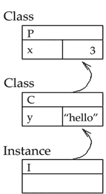

请注意，如果 Python 没有提供继承机制，我们可以通过提供一个 `__getattr__` 方法来实现转发，从而重新创建它。父类将被显式存储在一个变量中。这会产生一个有趣的副作用：继承链接可以通过修改这个变量在运行时进行更改。责任链模式完全支持此类更改。

写入时会发生什么？如果请求像读取一样沿着责任链向上转发，那么将无法覆盖父类中的槽位。在上面的例子中，`c.x = 5` 将等同于 `p.x = 5`。（如果变量最终未绑定，那么被写入的对象将获得一个新的槽位。）如果请求不被转发，那么被写入的对象将总是获得一个新的槽位，从而遮蔽祖先槽位。Python 选择了后者，以便子类可以覆盖父类方法。因此我们得到：

```
c.x = 5
p.x     (prints 4)
i.x     (prints 5)

i.x = i.x
c.x = 6
i.x     (prints 5)
```

请注意，在这种设计选择下，`i.x = i.x` 执行了有用的工作。

Python 需要区分实例和类吗？两者本质上都是字典，并具有相同的读/写和继承机制。也许这是出于效率原因：通常类的数量远少于实例，因此可以对类应用某些优化，但对实例则不行。

## 变量作用域

Python 的变量环境，也称为“栈帧”，具有许多对象的特性。它们是具有相同继承语义的名称字典。也就是说，函数中使用的变量默认引用全局名称，但如果在函数中对变量进行了赋值，它就变成了局部变量。同样的规则也适用于类定义。

也可以想象使用责任链来设计变量作用域。事实上，一些语言就是这样做的，甚至包括那些没有相应继承概念的语言。《计算机程序的构造和解释》一书用它来描述 Scheme 的变量作用域方法。Self 语言实际上将环境视为对象，并使用继承来实现词法作用域！

然而，Python 并没有采用这种方法，可能是出于效率原因。如关于嵌套作用域的 PLE 练习中所述，Python 不允许同时存在两个以上的环境（全局和局部）。这允许某些优化，例如 LOAD_FAST 字节码，但可能会让习惯于词法作用域的程序员感到困惑。以下 C++ 代码片段在 Python 中没有等价物：

```
int x = 1;
if(x > y) {
    int x = 2;
    cout << x;    // prints 2
}
cout << x;    // prints 1
```

Scheme 程序员可能会想：那么 Python 如何实现 lambda 呢？解决方法是放弃 lambda 的词法作用域。lambda 的主体只有全局和局部环境。

# 总结

- 正则表达式（称为 RE、regex 或 regex 模式）本质上是一种嵌入在 Python 中并通过 `re` 模块提供的小型、高度专业化的编程语言。
- 正则表达式模式被编译成一系列字节码，然后由用 C 编写的匹配引擎执行。对于高级使用，可能需要仔细关注引擎将如何执行给定的 RE，并以某种方式编写 RE，以生成运行更快的字节码。
- 正则表达式语言相对较小且受限，因此并非所有可能的字符串处理任务都可以使用正则表达式完成。有些任务虽然可以用正则表达式完成，但表达式会变得非常复杂。
- Python 是一种高级开源脚本语言。Python 内置的“re”模块为正则表达式提供了出色的支持，具有现代且完整的正则表达式风格。
- Python 提供了两种基于正则表达式的原始操作：`match` 仅检查字符串开头的匹配，而 `search` 检查字符串中任何位置的匹配（这是 Perl 默认执行的操作）。
- 除了控制字符（`+ ? . * ^ $ ( ) [ ] { } | \`）外，所有字符都匹配自身。可以通过在控制字符前加上反斜杠来转义它。

# 知识检查

1. 在默认模式下，点号（即 '.'）匹配除 .................... 之外的任何字符。
   - a. 脱字符
   - b. 和号
   - c. 百分号
   - d. 换行符

2. 表达式 `a{5}` 将匹配前一个正则表达式的 .................... 个字符。
   - a. 5 个或更少
   - b. 恰好 5 个
   - c. 5 个或更多
   - d. 恰好 4 个

3. 选择输出可能为：`<_sre.SRE_Match object; span=(4, 8), match='aaaa'>` 的函数。
   - a. `>>> re.search('aaaa', "alohaaaa", 0)`
   - b. `>>> re.match('aaaa', "alohaaaa", 0)`
   - c. `>>> re.match('aaa', "alohaaa", 0)`
   - d. `>>> re.search('aaa', "alohaaa", 0)`

4. 以下哪个函数会清除正则表达式缓存？
   - a. re.sub()
   - b. re.pos()
   - c. re.purge()
   - d. re.subn()

5. 以下哪个函数会导致不区分大小写的匹配？
   - a. re.A
   - b. re.U
   - c. re.I
   - d. re.X

6. 以下哪个会创建一个模式对象？
   - a. re.create(str)
   - b. re.regex(str)
   - c. re.compile(str)
   - d. re.assemble(str)

7. **函数 re.match 的作用是什么？**
   - a. 在字符串开头匹配模式
   - b. 在字符串的任何位置匹配模式
   - c. 不存在这样的函数
   - d. 以上都不是

8. **函数 re.search 的作用是什么？**
   - a. 在字符串开头匹配模式
   - b. 在字符串的任何位置匹配模式
   - c. 不存在这样的函数
   - d. 以上都不是

# 复习题

1. 什么是 match 函数？
2. 什么是 search 函数？
3. 讨论搜索和替换。
4. 讨论正则表达式修饰符：选项标志。
5. 描述正则表达式模式。

# 检查你的结果

1. (d)       2. (b)       3. (a)       4. (c)       5. (d)
6. (c)       7. (a)       8. (b)

## 参考文献

1. A.M. Kuchling (2001-12-21). “PEP 255: Simple Generators”. What’s New in Python 2.2. Python Foundation. Retrieved 2008-09-05.
2. Barry Warsaw (2011-11-09). “PEP 404 -- Python 2.8 Un-release Schedule”. Retrieved 2012-10-07.
3. Guido van Rossum (January 20, 2009). “The History of Python”. Retrieved March 3, 2018.
4. Neal Norwitz; Barry Warsaw (2006-06-29). “PEP 361 -- Python 2.6 and 3.0 Release Schedule”. Retrieved 2012-10-07.
5. Rossum, Guido van van. “Python 3000 FAQ”. artima. com. Retrieved December 27, 2016.

# 第 7 章
## PYTHON 多线程

> "构建 Web 应用程序的主要语言——无论是 Perl、Python、PHP 还是其他语言——都是开源语言。因此，Web 的基础设施是开源的，我们所知的 Web 完全依赖于开源。"
> — Mitch Kapor

## 学习目标

学习本章后，你将能够：

1. 讨论 Python 线程和 Python 多线程
2. 确定 Python 多线程中的有用函数

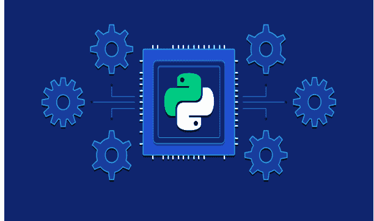

## 简介

多线程是 Python 编程中的一种线程技术，通过 CPU 的帮助（称为上下文切换）。此外，它允许与进程内的主线程共享数据空间，从而更轻松地与其他线程进行信息共享和通信，这比独立进程更方便。多线程旨在同时执行多个任务，从而提高性能、速度并改善应用程序的渲染效果。

以下是在 Python 中创建多线程应用程序的好处：

- 它确保计算机系统资源的有效利用。
- 多线程应用程序响应性更强。
- 它与子线程（子线程）共享资源和状态，这使其更具经济性。
- 由于相似性，它使多处理器架构更加有效。
- 它通过同时执行多个线程来节省时间。
- 系统不需要太多内存来存储多个线程。

这是一种非常有用的技术，可以节省时间并提高应用程序的性能。多线程允许程序员将应用程序任务划分为子任务，并在程序中同时运行它们。它允许线程在同一个处理器上通信和共享资源，如文件、数据和内存。此外，它提高了用户的响应性，即使应用程序的一部分正在运行或被阻塞，程序也能继续运行。

## 7.1 PYTHON 线程 – PYTHON 多线程

Python 的 `threading` 模块用于在 Python 程序中实现多线程。Python 中的线程用于同时运行多个线程（任务、函数调用）。请注意，这并不意味着它们在不同的 CPU 上执行。如果程序已经使用了 100% 的 CPU 时间，Python 线程不会使你的程序更快。在这种情况下，你可能需要研究并行编程。如果你对使用 Python 进行并行编程感兴趣，Python 的 `multiprocessing` 模块是我们之前探讨过的类似模块之一。

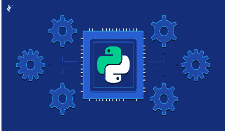

`threading` 模块建立在线程的低级功能之上，使使用线程变得更加容易和 Python 化。使用线程允许程序在同一个进程空间中并发运行多个操作。在计算机科学中，线程被定义为操作系统调度执行的最小工作单元。关于线程，需要考虑以下几点：

- 线程存在于进程内部。
- 单个进程中可以存在多个线程。
- 同一进程中的线程共享父进程的状态和内存。

这只是对线程的快速概述。本文将主要关注 Python 中的 `threading` 模块。

### 7.1.1 Python 多线程入门

运行多个线程类似于并发运行多个不同的程序，但具有以下好处：

- 进程内的多个线程与主线程共享相同的数据空间，因此可以比独立进程更容易地共享信息或相互通信。
- 线程有时被称为轻量级进程，它们不需要太多的内存开销；它们比进程更经济。

一个线程有一个开始、一个执行序列和一个结束。它有一个指令指针，用于跟踪其上下文中的当前运行位置。

- 它可以被抢占（中断）
- 它可以在其他线程运行时暂时挂起（也称为休眠）——这被称为让出。

让我们从创建一个名为 `download.py` 的 Python 模块开始。这个文件将包含获取图像列表和下载它们所需的所有函数。我们将这些功能拆分为三个独立的函数：

- `get_links`
- `download_link`
- `setup_download_dir`

> 你知道吗？
> Python 2.0 于 2000 年 10 月 16 日发布，带来了许多主要的新特性，包括循环检测垃圾回收器和对 Unicode 的支持。随着这个版本的发布，开发过程变得更加透明和社区驱动。

第三个函数 `setup_download_dir` 将用于在下载目标目录不存在时创建它。

Imgur 的 API 要求 **HTTP**（超文本传输协议）请求在 Authorization 头中携带客户端 ID。你可以从你在 Imgur 上注册的应用程序的仪表板中找到这个客户端 ID，响应将是 JSON 编码的。我们可以使用 Python 的标准 JSON 库来解码它。下载图像是一项更简单的任务，因为你只需通过其 URL 获取图像并将其写入文件即可。

### 7.1.2 用于线程实现的 Python 多线程模块

Python 提供了两个模块来在程序中实现线程。

- `<thread>` 模块和
- `<threading>` 模块。

供你参考，`<thread>` 模块在 Python 3 中已弃用，并重命名为 `<_thread>` 模块以保持向后兼容性。但我们将解释这两种方法，因为许多用户仍在使用旧版 Python 版本。

这两个模块的关键区别在于，`<thread>` 模块将线程实现为一个函数。另一方面，`<threading>` 模块提供了一种面向对象的方法来启用线程创建。

> IronPython，一个使用 .NET 框架的 Python 实现，没有 GIL，基于 Java 的实现 Jython 也没有。你可以找到一个可用的 Python 实现列表。

### 7.1.3 多进程与多线程的区别

多进程和多线程都能为系统增加性能。多进程是向系统添加更多的 CPU/处理器，从而提高系统的计算速度。多线程是允许一个进程创建更多的线程，从而提高系统的响应性。


## 比较图表

| 比较基础 | 多进程 | 多线程 |
| :--- | :--- | :--- |
| 基本原理 | 多进程添加 CPU 以增加计算能力。 | 多线程创建单个进程的多个线程以增加计算能力。 |
| 执行方式 | 多个进程并发执行。 | 单个进程的多个线程并发执行。 |
| 创建开销 | 创建进程耗时且资源密集。 | 创建线程在时间和资源上都很经济。 |
| 分类 | 多进程可以是对称的或非对称的。 | 多线程没有进一步分类。 |

## 多进程与多线程的关键区别

- 多进程和多线程的关键区别在于，多进程允许系统添加两个以上的 CPU，而多线程让一个进程生成多个线程以提高系统的计算速度。
- 多进程系统同时执行**多个进程**，而多线程系统同时执行一个进程的多个线程。
- 创建进程可能消耗时间甚至耗尽系统资源。然而，创建线程是经济的，因为属于同一进程的线程共享该进程的资源。
- 多进程可以分为对称多处理和非对称多处理，而多线程没有进一步分类。

在多进程环境中，多线程的好处可以逐渐增加，因为多处理系统上的多线程增加了并行性。

## 7.2 PYTHON 多线程中的函数

Python 的 `threading` 模块帮助我们实现基于线程的并行性。它在底层的 `_thread` 模块之上构建了更高级的线程接口。如果缺少 `_thread`，我们就无法使用 `threading`。对于这种情况，我们有 `dummy_threading`。

> `fork` 函数创建进程的副本，所有内存页面都被复制，打开的文件描述符也被复制等等。所有这些对于 UNIX 程序员来说都是直观的。子进程与父进程之间的一个重要区别是子进程只有一个线程。克隆整个进程及其所有线程会有问题，并且在大多数情况下不是程序员想要的。


我们在 Python 多线程模块中有以下函数：

- a. `active_count()`
  这返回当前存活的 `Thread` 对象的数量。这等于 `enumerate()` 返回的列表的长度。
  ```
  >>> threading.active_count()
  2
  ```
- b. `current_thread()`
  基于调用者的控制线程，这返回当前的 `Thread` 对象。如果这个控制线程不是通过 `threading` 进行的，它将返回一个功能有限的虚拟线程对象。
  ```
  >>> threading.current_thread()
  <_MainThread(MainThread, started 14352)>
  ```
- c. `get_ident()`
  `get_ident()` 返回当前线程的标识符，这是一个非零整数。我们可以用它来索引线程特定数据的字典。除此之外，它没有特殊含义。

## 7.2.1 线程局部数据

其值为线程特定的数据，称为线程局部数据。要管理此类数据，我们可以创建 `local` 类或其子类的实例，然后在其上存储属性。

```
>>> mydata=threading.local()
>>> mydata.x=7
>>>
```

这些实例值对于每个线程都是不同的。我们有以下表示线程局部数据的类：

```
class threading.local
```

一个表示线程局部数据的类。

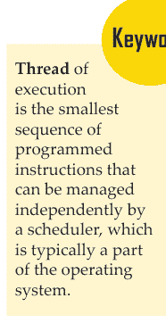

## 7.2.2 线程对象

我们之前在本博客中提到的 `Thread` 类表示在单独控制线程中运行的活动。我们可以通过向构造函数传递可调用对象，或者在子类中重写 `run()` 方法来表示此活动。请确保不要在子类中重写除构造函数以外的其他方法。简而言之，只重写类的 `__init__()` 和 `run()` 方法。

一旦解释器创建了线程对象，我们必须通过调用其 `start()` 方法来启动其活动。这将在单独的控制线程中调用其 `run()` 方法。一旦发生这种情况，我们就认为该线程是“活动的”。当 `run()` 正常终止或引发我们未处理的异常时，它就不再活动。要测试线程是否活动，我们可以使用 `is_alive()` 方法。

一个线程可以调用另一个线程的 `join()` 方法。这将阻塞调用线程，直到另一个线程终止。

线程有名称，我们可以将这些名称传递给构造函数，甚至可以读取或修改它们。

我们可以将线程标记为“守护线程”。这意味着当只剩下守护线程时，整个程序就会退出。此初始值来自创建线程。我们可以通过 `daemon` 属性或通过 **构造函数** 参数 `daemon` 来设置此标志。守护线程在关闭时会突然停止，它们可能无法正确释放所有持有的资源。这些资源可能包括打开的文件、数据库事务等。为了优雅地停止我们的线程，我们必须使它们成为非守护线程。最好使用合适的信号进程，例如 `Event`。

“主线程”对象属于我们程序中的初始控制线程；它不是守护线程。

最后，解释器可能会创建“虚拟线程对象”。这些是“外部线程”（在 `threading` 之外启动的控制线程，例如直接从 C 代码启动）。此类对象功能有限，并且始终是活动的和守护的。我们无法 `join()` 它们。我们也永远无法删除它们，因为无法检测它们何时终止。

> **构造函数** 是一段类似于方法的代码块。当类的实例被创建时调用它。

这是该类：

```
class threading.Thread(group=None, target=None, name=None, args=(), kwargs={}, *, daemon=None)
```

请注意：

- 始终使用关键字参数调用构造函数。它具有以下参数：
- *group* 必须为 `None`。Python 保留此参数以备将来扩展，当我们实现 `ThreadGroup` 类时使用。
- *target* 是 `run()` 将调用的可调用对象。其默认值为 `None`，这意味着它不调用任何内容。
- *name* 是线程的名称。其默认值为 `"Thread-N"`。这里，N 是一个小的十进制数。
- *args* 是一个参数元组。它有助于调用目标。其默认值为 `()`。
- *kwargs* 是一个包含关键字参数的字典。它也有助于调用目标。其默认值为 `{}`。
- *daemon* 决定线程是否为守护线程。当为 `None` 时，它从当前线程继承守护属性。其默认值为 `None`。
- 如果子类重写了构造函数，请确保首先调用基类构造函数（`Thread.__init__()`）。

Thread 具有以下方法：

### a. start()

这会启动线程活动。对于一个线程对象，我们最多只能调用它一次；如果我们再次调用它，它会引发 `RuntimeError`。这使得对象的 `run()` 在单独的控制线程中被调用。

```
>>> threading.Thread.start(threading.current_thread())
Traceback (most recent call last):
  File "<pyshell#135>", line 1, in <module>
    threading.Thread.start(threading.current_thread())
RuntimeError: threads can only be started once
```

### b. run()

此方法描述了线程的活动。如果存在，它会调用我们作为 `target` 参数传递给对象构造函数的可调用对象。这是使用来自 *kwargs* 和 *args* 的关键字和顺序参数。
我们可以在子类中重写 `run()`。

### c. join(timeout=None)

要使 `join()` 工作，我们必须等待线程终止。因为当它发生时，它会阻塞调用线程，直到我们调用 `join()` 的线程正常终止或通过我们未处理的异常终止，或者直到 *timeout* 发生。

当你确实提供了一个 *timeout*（不是 `None`）时，请确保它是一个浮点数。这样你就可以传递以秒或分数为单位的超时时间。

那么，返回值是什么？嗯，`join()` 总是返回 `None`。因此，你需要在调用 `join()` 之后调用 `is_alive()` 来确定是否发生了超时。如果我们发现它确实仍然活动，那么我们推断 `join()` 调用超时了。

然而，如果 *timeout* 是 `None`，或者我们没有传递它，这会阻塞操作直到线程终止。我们可以多次 `join()` 一个线程。

最后，如果我们尝试 `join()` 当前线程，`join()` 将引发 `RuntimeError`，因为这会导致死锁。在启动线程之前 `join()` 它也会导致错误。

```
>>> threading.Thread.join(threading.current_thread())
Traceback (most recent call last):
  File "<pyshell#138>", line 1, in <module>
    threading.Thread.join(threading.current_thread())
RuntimeError: cannot join current thread
```

### d. name

这是一个用于标识的字符串；它没有意义。我们也可以给多个线程赋予相同的含义。构造函数设置初始名称。

```
>>> threading.Thread.name='First'
>>>
```

### e. getName() 和 setName()

这些是用于 *name* 的旧式 getter 和 setter API。我们直接将它们用作属性。

### f. ident

如果我们启动了线程，这会返回其标识符。否则，它返回 `None`。请注意，它是一个非零整数，就像 `get_ident()` 函数一样。当一个线程退出而另一个线程创建时，Python 可能会回收标识符。即使在线程退出后，此类标识符也存在。

### g. is_alive()

这返回线程是否活动。`is_alive()` 从 `run()` 开始之前直到它终止之后都返回 `True`。

```
>>> threading.Thread.is_alive(threading.current_thread())
True
```

### h. daemon

这是一个布尔值，指示线程是否为守护线程。这必须在调用 `start()` 之前设置。其值从创建线程继承。该属性是此值的 getter 和 setter。

### i. settrace(func)

`settrace()` 为我们使用 `threading` 启动的所有线程跟踪一个函数。参数 `func` 在每个线程调用其 `run()` 方法之前传递给 `sys.settrace()`。

```
>>> def sayhi():
    print("Hi")
>>> threading.settrace(sayhi)
>>>
```

### j. setprofile(func)

此方法为我们从 `threading` 启动的所有线程设置一个分析函数。它在每个线程调用其 `run()` 方法之前将 *func* 传递给 `sys.setprofile()`。

```
>>> threading.setprofile(sayhi)
>>>
```

### k. stack_size([size])

`stack_size()` 在创建新线程时返回线程的堆栈大小。*size* 是我们希望用于后续创建的线程的堆栈大小。这必须等于 0 或至少为 32,768（32KiB）的正整数。未指定时，使用 0。如果它不支持更改线程堆栈大小，它会引发 `RuntimeError`。

当我们传递无效的堆栈大小时，它会引发 `ValueError`，并且不会修改它。它目前支持的最小堆栈大小为 32KiB，以确保为解释器本身提供足够的堆栈空间。某些平台可能需要大于 32KiB 的最小堆栈大小。其他平台可能需要按系统内存页面大小的倍数进行分配。

```
>>> threading.stack_size()
0
```

除了函数，`threading` 还定义了一个常量。

### l. TIMEOUT_MAX

这保存了此常量的最大允许值，即阻塞函数（如 `Lock.acquire()`、`Condition.wait()`、`RLock.acquire()` 等）的超时参数。如果我们指定的超时大于此值，它会引发 `OverflowError`。

```
>>> threading.TIMEOUT_MAX
4294967.0
```

在 Java 中，锁和条件变量是每个对象的基本行为。而在 Python 中，它们是独立的对象。这里，`Thread` 类支持 Java 中 `Thread` 类的部分功能。然而，目前，我们没有线程组、优先级，并且我们无法销毁、停止、挂起、恢复或中断线程。当我们实现 Java 的 `Thread` 的静态方法时，它们映射到模块级函数。这样，`threading` 在设计上非常类似于 Java 的线程模型。

daemon 是一个布尔值，用于指示该线程是否为守护线程。如果是，则返回 True。我们必须在调用 start() 之前设置它，否则会引发 RuntimeError。其初始值来自创建它的线程。主线程不是守护线程；因此，主线程中的所有线程的 *daemon* 默认值均为 False。

每当一个函数想要修改一个变量时，它会锁定该变量。当另一个函数想要使用该变量时，它必须等待该变量被解锁。

当只剩下守护线程时，整个程序就会退出。

- i. isDaemon() 和 setDaemon()
这些是 *daemon* 的旧式 getter 和 setter API。你可以直接将它们作为属性使用。

## 7.2.3 锁对象

一种同步原语，原始锁在锁定时不属于任何特定线程。这是我们目前在 Python 中拥有的最低级别的同步原语，我们使用扩展模块 _thread 来实现它。

这样的锁可以处于两种状态之一：‘已锁定’和‘未锁定’。当我们创建一个锁时，它处于‘未锁定’状态。它也有两个方法——acquire() 和 release()。当我们想要锁定它时，acquire() 将其状态更改为‘已锁定’，并立即返回。如果它原本是‘已锁定’的，那么 acquire() 会阻塞，直到另一个线程调用 release()。这会将状态更改为‘未锁定’。最后，acquire() 将其重置为‘已锁定’，然后立即返回。

如果你尝试释放一个已经未锁定的锁，它会引发 RuntimeError。

这些锁也支持 CMP（上下文管理协议）。

当 acquire() 阻塞多个线程时，只有当 release() 将状态重置为‘未锁定’时，一个线程才能继续。你可能会问，是哪一个？嗯，我们无法确定。

此外，所有方法都是原子执行的。

这是该类：
```python
class threading.Lock
```

此调用实现了原始锁对象。一旦一个线程获取了锁，解释器就会阻止进一步的获取尝试。只有在它释放之后，其他线程才有机会获取它。任何线程都可以释放锁。

- a. acquire(blocking=True, timeout=-1)
此方法获取一个阻塞或非阻塞锁。当 *blocking*=True 时，它会阻塞直到锁解锁。然后，它将其状态更改为‘已锁定’，并返回 True。当它为 False 时，它不会阻塞。一个使用 *blocking*=True 的调用如果阻塞，会立即返回 False。否则，它将锁设置为‘已锁定’并返回 True。

*timeout* 是一个浮点数参数。当它为正值时，它最多阻塞 *timeout* 秒；只要锁无法获取。当它为 -1 时，表示无限期等待。

当 *blocking* 为 False 时，我们不能指定 *timeout*。

此外，如果锁成功获取，它返回 True；否则返回 False，例如当 *timeout* 过期时。

- b. release()
此方法释放一个锁。你可以从任何线程调用它。这意味着任何线程都可以释放锁，无论哪个线程获取了它。

当处于‘已锁定’状态时，release() 将其重置为‘未锁定’，然后返回。如果其他线程等待它解锁，一旦解锁，只有一个线程可以继续。

当我们对一个‘未锁定’的锁调用 release() 时，它会引发 RuntimeError。

release() 不返回任何值。

## 7.2.4 RLock 对象

RLock 是学习 Python 多线程时非常重要的主题。RLock 是一个可重入锁。它是一种同步原语，某个线程可以反复获取它。它使用诸如‘拥有线程’和‘递归级别’以及已锁定/未锁定状态等概念来实现这一点。当锁定时，RLock 属于某个线程；但当未锁定时，没有线程拥有它。

那么，这是如何工作的呢？要锁定，一个线程调用 acquire()。既然这个线程拥有了锁，它就返回。要解锁，一个线程调用 release()。也可以嵌套 acquire()/release() 对。最外层的 release() 将锁重置为‘未锁定’状态。它还允许另一个被阻塞的线程继续。

可重入锁也支持 CMP（上下文管理协议）。
这是该类：
```python
class threading.RLock
```

RLock 实现了可重入锁对象。这样的锁只能由持有它的线程释放。一个线程可以再次获取它而不会阻塞。然而，它每次获取时都必须释放一次。

它有两个方法：

- a. acquire(blocking=True, timeout=-1)

acquire() 让我们获取一个阻塞或非阻塞锁。不带参数时，如果线程已经拥有锁，此方法将递归级别加一，然后返回。如果它尚未拥有锁，而另一个线程拥有它，它会阻塞直到锁‘解锁’。一旦解锁，并且如果不属于任何其他线程，acquire() 声明所有权并将递归级别设置为 1，然后返回。如果有多个线程被阻塞等待，一次只有一个会获得所有权。

此方法不返回任何值。最后，当我们设置 *blocking* 为 True 时，它执行我们讨论过的相同操作，然后返回 True。

然而，当 *blocking* 为 False 时，它不会阻塞。当一个不带参数的调用阻塞时，它返回 False。否则，它执行不带参数调用的操作，然后返回 True。当我们使用 *timeout*（一个浮点数，正值）调用 acquire() 时，这会阻塞最多 *timeout* 秒，只要我们无法获取锁。如果一个线程已经获取了它，它返回 True；如果 *timeout* 已过期，它返回 False。

- b. release()

此方法释放锁并递减递归级别。一旦递减为 0，它将锁重置为‘未锁定’状态。这意味着没有线程拥有它。如果其他线程被阻塞，只有其中一个可以继续。如果递减不为零，锁保持在‘已锁定’状态，并属于调用线程。

你应该只在调用线程实际拥有锁时才调用 release()。如果它已经是‘未锁定’的，这会引发 RuntimeError。

release() 不返回任何值。

现在让我们来了解 Python 多线程中的条件对象。

## 7.2.5 条件对象

条件变量总是与一个锁相关联，我们可以传入它，或者它默认创建。当多个这样的条件变量必须共享一个锁时，我们可以传入它。但我们不需要专门跟踪一个锁；它是条件对象的一部分。条件变量遵循 CMP（上下文管理协议），因为它使用 with 语句来获取关联的锁，只要包含的代码块存活。acquire() 和 release() 调用锁的方法。

对于其他方法，我们必须使用线程持有的关联锁来调用它们。一旦 wait() 释放锁，它会阻塞，直到另一个线程用 notify() 或 notify_all() 调用唤醒它。之后，wait() 再次获取锁，然后返回。我们也可以指定一个 *timeout*。

虽然 notify() 唤醒一个等待线程（如果有的话），但 notify_all() 唤醒所有等待条件变量的线程。请注意，这两个方法不会释放锁。因此，被唤醒的线程不会立即从 wait() 返回。它们只有在调用 notify() 或 notify_all() 的线程放弃锁的所有权时才会返回。

这是该类：
```python
class threading.Condition(lock=None)
```

Condition 实现了条件变量对象。条件变量让任意数量的线程等待，直到另一个线程通知它们。

如果 *lock* 不是 None，并且我们确实传入了它，请确保它是一个 Lock 或 RLock 对象。这也应该作为底层锁，否则它会创建一个新的 RLock 对象。

它有以下方法：
- a. acquire(*args)
这获取底层锁。它调用其上的相应方法，并返回该方法返回的内容。
- b. release()
这释放底层锁。它调用其上的相应方法，不返回任何内容。
- c. wait(timeout=None)
此方法等待直到超时发生或直到有人通知它。如果在调用 wait() 时，调用线程不拥有锁，这会引发 RuntimeError。

wait() 释放底层锁，然后阻塞，直到另一个线程中针对同一条件变量的 notify()/notify_all() 调用唤醒它，或者直到 *timeout* 发生。一旦发生这种情况，它会再次获取锁，然后返回。

当我们确实传递了 *timeout*，并且它不是 None 时，请确保它是一个浮点数，表示操作的超时时间（以秒或分数为单位）。

如果底层锁是 RLock，其 release() 方法不会释放它，因为如果它被递归获取多次，这不一定会解锁它。那么，我们该怎么做呢？我们使用 RLock 类的一个内部接口。即使它被递归获取多次，这也会解锁它。然后，我们使用另一个内部接口在线程再次获取锁时恢复 **递归** 级别。

## 7.2.5 条件对象

`wait()` 在 *timeout* 超时后返回 `False`。否则，它返回 `True`。

d. `wait_for(predicate, timeout=None)`
此方法等待直到条件变为 `True`。*predicate* 是一个返回布尔值的可调用对象。我们可以提供一个 *timeout* 来指定最大等待时间。

`wait_for()` 是一个实用方法，它可以重复调用 `wait()`，直到谓词满足或超时发生。它返回谓词的最后一次返回值，如果方法超时则返回 `False`。

使用此方法时，适用与 `wait()` 相同的规则。当我们调用它时，必须持有锁，并在返回时重新获取锁。这会在持有锁的情况下评估谓词。

e. `notify(n=1)`
`notify()` 唤醒一个在此条件上等待的线程（如果有的话）。当我们调用它时，如果调用线程不拥有锁，这将引发 `RuntimeError`。它最多唤醒 `n` 个等待条件变量的线程。如果没有线程等待，则它是一个空操作（NOP）。

如果至少有 `n` 个线程等待，此实现将恰好唤醒 `n` 个线程。但我们不能依赖这种行为。优化的实现有时可能会唤醒超过 `n` 个线程。

f. `notify_all()`
这会唤醒所有在此条件上等待的线程。所以，这类似于 `notify()`，不同之处在于它唤醒所有等待的线程，而不是恰好一个。如果在调用时，调用线程不拥有锁，这将引发 `RuntimeError`。

## 7.2.6 信号量对象

早期的荷兰计算机科学家 Edsger W. Dijkstra 发明了最古老的同步原语之一。他使用 `P()` 和 `V()` 而不是 `acquire()` 和 `release()`。

什么是信号量？它是一个让我们管理内部计数器的原语。每次调用 `acquire()` 会递减计数器，每次调用 `release()` 会递增计数器。但让我们告诉你，计数器永远不会低于零。当它为 0 时，`acquire()` 会阻塞，并等待直到一个线程调用 `release()`。


Python 多线程中的信号量支持 CMP（上下文管理协议）。

这是我们拥有的类：

```python
class threading.Semaphore(value=1)
```

它实现了信号量对象。信号量持有一个原子计数器，表示 `release()` 调用次数减去 `acquire()` 调用次数，再加上一个初始值。`acquire()` 在需要时阻塞，直到它可以返回而不使计数器变为负数。计数器的默认值为 1。

此类实现信号量对象。信号量管理一个原子计数器，表示 `release()` 调用次数减去 `acquire()` 调用次数，再加上一个初始值。`acquire()` 方法在必要时阻塞，直到它可以返回而不使计数器变为负数。如果未给出，`value` 默认为 1。

*value* 可以作为内部计数器的初始值。默认值为 1。如果我们传递一个小于 0 的值，这将引发 `ValueError`。

它具有以下方法：

a. `acquire(blocking=True, timeout=None)`

这会获取一个信号量。当我们传递一个非 `None` 的 *timeout* 值时，它最多阻塞 *timeout* 秒。如果在该时间间隔内，`acquire()` 未成功完成，它返回 `False`。否则，它返回 `True`。

当我们不带参数调用它时，可能出现以下情况：

- 如果进入时内部计数器大于零，它将其递减一，然后返回。
- 如果进入时内部计数器为零，它会阻塞，直到调用 `release()` 唤醒它。现在计数器大于 0，它将其递减 1，然后返回 `True`。每次调用 `release()` 恰好唤醒一个线程。我们无法说出这发生的顺序。
- 当我们以 *blocking* 值为 `False` 调用它时，它不会阻塞。并且如果无参数调用会阻塞，那么它返回 `False`。否则，它执行与无参数调用相同的操作，然后返回 `True`。

b. `release()`

此方法释放信号量，并将内部计数器递增 1。当进入时它为 0，并且另一个线程等待它再次增长时，它会唤醒该线程。

我们还有有界信号量：

```python
class threading.BoundedSemaphore(value=1)
```

此类实现有界信号量对象。此类对象确保其当前值不超过其初始值。如果发生这种情况，这将引发 `ValueError`。通常，信号量保护容量有限的资源，例如数据库服务器。在资源大小固定的地方，使用有界信号量。但如果它释放信号量的次数过多，那么你的代码中可能存在错误。默认值为 1。

让我们举个例子。主线程在生成任何工作线程之前初始化信号量：

```python
>>> maxconnections = 5
>>> pool_sema = threading.BoundedSemaphore(value=maxconnections)
```

现在它已生成，工作线程在必须连接到服务器时调用 `acquire()` 和 `release()`：

```python
>>> with pool_sema:
...     conn = connectdb()
...     try:
...         # 使用连接
...     finally:
...         conn.close()
```

使用有界信号量减少了编程错误的可能性。

## 7.2.7 事件对象

Python 多线程中一个极其简单的通信工具，它让一个线程播放一个事件，而另一个必须等待它。事件对象处理一个内部标志。方法 `set()` 和 `clear()` 允许我们分别将其设置和重置为 `True` 和 `False`。在 *flag* 为 `True` 之前，`wait()` 会阻塞。

这是该类：

```python
class threading.Event
```

此类实现事件对象。事件处理一个标志，我们可以使用方法 `set()` 和 `clear()` 分别将其设置和重置为 `True` 和 `False`。最初，标志为 `False`。`wait()` 会阻塞它，直到它变为 `True`。

它具有以下方法：

a. `is_set()`
如果内部标志为 `True`，它返回 `True`。

b. `set()`
此方法将内部标志设置为 `True`，并唤醒所有等待它变为 `True` 的线程。一旦它为 `True`，等待的线程根本不会阻塞。

c. `clear()`
这会将内部标志重置为 `False`。最终，等待的线程会阻塞，直到有人调用 `set()` 将内部标志再次设置为 `True`。

d. `wait(timeout=None)`
在内部标志为 `True` 之前，此方法会阻塞。进入时，如果它为 `True`，它会立即返回。否则，它会阻塞，直到另一个线程调用 `set()` 将标志设置为 `True`，或者直到 *timeout* 发生。
当 *timeout* 存在且不为 `None` 时，请确保它是一个浮点数，表示操作的 *timeout*（以秒或分数为单位）。
它仅在内部标志为 `True` 时返回 `True` - 无论是在调用 `wait()` 之前还是之后。这样，`wait()` 总是返回 `True`。但是，如果 *timeout* 存在且操作超时，它返回 `False`。

## 7.2.8 定时器对象

定时器表示一个应在给定时间后运行的操作；它是 Python 多线程中的一个定时器。这是 `Thread` 的子类，我们也可以用它来学习如何创建自己的线程。
当我们在线程上调用 `start()` 时，一个定时器会随之启动。如果我们调用 `cancel()`，我们可以在它开始之前停止它。在执行之前，定时器会等待一段时间；这可能与我们指定的时间间隔不同。

```python
>>> def hello():
...     print("Hello")
>>> t = threading.Timer(30.0, hello)
>>> t.start()
```

这是该类：

```python
class threading.Timer(interval, function, args=None, kwargs=None)
```

它创建一个定时器，在 *interval* 秒后运行一个函数（带有参数 `args` 和 `kwargs`）。当 `args` 为 `None` 时，它使用一个空列表。这是默认值。当 `kwargs` 为 `None` 时，它使用一个空字典。这也是默认值。

它有一个方法：

a. `cancel()`

> **关键词**
> **同步**是指两个不同但相关的概念之一：进程同步和数据同步。

这会停止定时器，然后取消其操作。这仅在定时器正在等待时有效。

现在 Python 多线程中的最后一个是屏障对象。

## 7.2.9 屏障对象

屏障是一个简单的**同步**原语，用于必须相互等待的固定数量的线程。每个线程通过调用 `wait` 来尝试通过屏障；它会阻塞，直到所有线程都这样做。然后，线程同时释放。

你可以为相同数量的线程多次重用屏障。

让我们举个例子。同步客户端和服务器线程的一种方式是：

```python
>>> b = threading.Barrier(2, timeout=5)
>>> def server():
...     start_server()
...     b.wait()
...     while True:
...         connection = accept_connection()
...         process_server_connection(connection)
>>> def client():
...     b.wait()
...     while True:
...         connection = make_connection()
...         process_client_connection(connection)
```

这是该类：

```python
class threading.Barrier(parties, action=None, timeout=None)
```

屏障为 *parties* 数量的线程创建一个屏障对象。当我们传递 *action* 时，它是一个可调用对象，线程在释放时会调用它。最后，*timeout* 是如果我们未为 `wait()` 指定相同值时的默认超时值。

它具有以下方法：

a. `wait(timeout=None)`

`wait()` 通过屏障。一旦所有线程方都调用了 `wait()`，它们都会一起释放。如果我们传递了 *timeout* 的值，它会使用这个值，无论我们是否为类构造函数提供了相同的值。

## 7.2.10 在 with 语句中使用锁、条件和信号量

如果本模块中的某个对象具有 `acquire()` 和 `release()` 方法，我们就可以将其用作 `with` 语句的上下文管理器。当进入代码块时，它会调用 `acquire()`；当退出时，它会调用 `release()`。

其语法如下：

```python
with some_lock:
    #do something
```

这等同于：

```python
>>> some_lock.acquire()
>>> try:
    #do something
finally:
    some_lock.release()
```

目前，我们可以将 `Lock`、`RLock`、`Condition`、`Semaphore` 和 `BoundedSemaphore` 对象用作 `with` 语句的上下文管理器。

# 榜样人物

### 埃德斯盖尔·迪克斯特拉：荷兰计算机科学家

埃德斯盖尔·迪克斯特拉，全名埃德斯盖尔·维贝·迪克斯特拉（1930年5月11日生于荷兰鹿特丹，2002年8月6日卒于荷兰纽南），荷兰计算机科学家。他在阿姆斯特丹数学中心工作期间（1952-1962年）获得了阿姆斯特丹大学的博士学位。1963年至1973年，他在埃因霍温理工大学任教，1984年起在德克萨斯大学任教。他因1959年提出的最短路径问题解决方案而广为人知；他的算法至今仍被用于确定两点之间的最快路径，例如在通信网络路由和飞行规划中。他对通信中互斥概念的研究促使他在1968年提出了计算机信号量的概念，该概念几乎应用于所有现代操作系统。他在1968年写的一封信对结构化编程的发展产生了巨大影响。他于1972年获得图灵奖。


# 总结

-   多线程是 Python 编程中的一种线程技术，它通过 CPU 的帮助（称为上下文切换）在线程之间快速切换，从而并发运行多个线程。此外，它允许与进程内的主线程共享其数据空间，这些线程比独立进程更容易共享信息和进行通信。
-   多线程允许程序员将应用程序任务划分为子任务，并在程序中同时运行它们。它允许线程在同一个处理器上通信和共享资源，如文件、数据和内存。
-   Python 的 `threading` 模块用于在 Python 程序中实现多线程。Python 中的线程用于同时运行多个线程（任务、函数调用）。
-   进程内的多个线程与主线程共享相同的数据空间，因此它们可以比独立进程更容易地共享信息或相互通信。
-   多进程和多线程都能提升系统性能。多进程是向系统添加更多的 CPU/处理器，从而提高系统的计算速度。
-   我们之前在本博客中提到的 `Thread` 类表示在单独的控制线程中运行的活动。我们可以通过向构造函数传递一个可调用对象，或者通过在子类中重写 `run()` 方法来表示这个活动。
-   一个同步原语，原始锁在锁定时不属于任何特定线程。这是我们目前在 Python 中拥有的最低级别的同步原语，我们使用扩展模块 `_thread` 来实现它。

# 知识检查

1.  可以通过使用 ..................... 类来创建线程。
    a. MultiThread
    b. Thread
    c. Threading
    d. SuperThread

2.  哪个 Java 特性能够同时处理多个任务？
    a. 类和对象
    b. 平台无关性
    c. 动态对象初始化
    d. 多线程

3.  哪个方法用于调度线程执行？
    a. start()
    b. init()
    c. run()
    d. resume()

4.  在类内部定义的函数被称为什么？
    a. 模块
    b. 类
    c. 另一个函数
    d. 方法

5.  以下哪项是 Python 中 `id()` 函数的用途？
    a. `id` 返回对象的标识
    b. 每个对象没有唯一的 id
    c. 以上所有
    d. 以上都不是

6.  ________ 使得两个或多个活动可以在单个处理器上并行执行。
    a. 多线程
    b. 线程
    c. 单线程
    d. 多线程和单线程

7.  在 ______ 中，`System.Threading` 命名空间中的 `Thread` 类型对象表示并控制一个线程。
    a. .PY
    b. .SAP
    c. .NET
    d. .EXE

8.  一旦调用线程的 ______ 方法，该方法就会被执行。
    a. EventBegin
    b. EventStart
    c. Begin
    d. Start

# 复习题

1.  你对多线程有什么理解？
2.  如何使用 `thread` 模块创建线程。
3.  如何使用 Python 多线程模块实现线程？
4.  区分多进程和多线程。
5.  解释 Python 多线程中的函数。
6.  写出 `Lock` 对象和 `RLock` 对象之间的区别。

# 检查你的结果

1. (b) 2. (d) 3. (d) 4. (d) 5. (a)
6. (a) 7. (c) 8. (d)

## 参考文献

1.  Bini, Ola (2007). Practical JRuby on Rails Web 2.0 Projects: bringing Ruby on Rails to the Java platform. Berkeley: APress. p. 3. ISBN 978-1-59059-881-8.
2.  Holth, Moore (30 March 2014). “PEP 0441 -- Improving Python ZIP Application Support”. Retrieved 12 November 2015.
3.  Rauschmayer, Axel. “Chapter 3: The Nature of JavaScript; Influences”. O’Reilly, Speaking JavaScript. Retrieved 15 May 2015.
4.  Smith, Kevin D.; Jewett, Jim J.; Montanaro, Skip; Baxter, Anthony (2 September 2004). “PEP 318 – Decorators for Functions and Methods”. Python Enhancement Proposals. Python Software Foundation. Retrieved 24 February 2012.

# 第8章 Python 中的操作

> “Python 是一门真正美妙的语言。当有人想出一个好主意时，只需大约1分钟和5行代码就能编写出几乎满足你需求的程序。然后只需一个小时就能将脚本扩展到300行，之后它仍然几乎满足你的需求。”
> 
> –Jack Jansen

## 学习目标

学完本章后，你将能够：

1.  讨论 Python 中的决策制定。
2.  概述 Python 中的循环、数字、字符串和列表。
3.  了解 Python 元组。
4.  定义 Python 中的日期和时间。

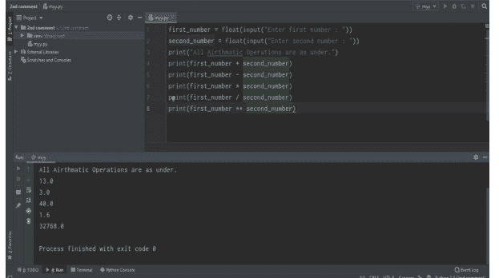

## 简介

Python 是一种功能强大的通用编程语言。它被用于 Web 开发、数据科学、创建软件原型等等。幸运的是，对于Python 是一种解释型、面向对象的编程语言，类似于 PERL，因其清晰的语法和可读性而广受欢迎。Python 据说相对易于学习且具有可移植性，这意味着其语句可以在多种操作系统中解释执行，包括基于 UNIX 的系统、Mac OS、MS-DOS、OS/2 以及各种版本的 Microsoft Windows 98。Python 由荷兰前居民 Guido van Rossum 创建，他当时最喜欢的喜剧团体是 Monty Python's Flying Circus。其源代码可自由获取，并开放供修改和重用。Python 拥有数量庞大的用户群体。

以下是关于 Python 编程语言的一些事实：

- Python 目前是使用最广泛的多用途、高级编程语言。
- Python 允许使用面向对象和过程式编程范式进行编程。
- Python 程序通常比其他编程语言（如 Java）更小。程序员需要输入的代码相对较少，且该语言的缩进要求使其始终具有可读性。
- Python 语言正被几乎所有科技巨头公司使用，例如——Google、Amazon、Facebook、Instagram、Dropbox、Uber... 等等。
- Python 最大的优势在于其庞大的标准库集合，可用于以下方面：
  - 机器学习
  - GUI 应用程序（如 Kivy、Tkinter、PyQt 等）
  - Web 框架，如 Django（被 YouTube、Instagram、Dropbox 使用）
  - 图像处理（如 OpenCV、Pillow）
  - 网页抓取（如 Scrapy、BeautifulSoup、Selenium）
  - 测试框架
  - 多媒体
  - 科学计算
  - 文本处理等等。

## 8.1 PYTHON - 决策制定

程序中的决策用于当程序有条件选择来执行某个代码块时。让我们以交通灯为例，根据道路状况或任何特定规则，在不同情况下会亮起不同颜色的灯。

这是在执行程序时对发生条件的预测，以指定操作。多个表达式会被求值，结果为 TRUE 或 FALSE。这些是逻辑决策，Python 也提供了决策语句，以便根据用户需求在应用程序的程序中做出决策。

在你人生的某个时刻，你需要决定应该采取哪些步骤，并据此决定你的下一步行动。

在编程中，我们经常遇到类似的情况，需要根据条件决定应该执行哪个代码块。

让我们举一个简单的例子。
假设你正在为一个游戏编写程序。那么在每一步，我们都需要做出决策，例如：

- 如果用户按下‘w’键，那么角色将向前移动。
- 如果用户按下‘空格键’，那么角色将跳跃。
- 如果角色撞到障碍物，那么游戏结束，否则我们继续玩。

像这样的决策在编程中无处不在，它们决定了程序执行的流向。

Python 具有以下决策语句：

- if 语句
- if-else 语句
- if-elif 梯形结构
- 嵌套语句

让我们详细讨论 Python 中的这些决策语句。

### 8.1.1 Python if 语句

if 语句是**决策语句**最简单的形式。它接受一个表达式，并检查该表达式是否求值为 True，如果是，则 if 语句中的代码块将被执行。

> **关键词**
决策语句允许你决定程序中特定语句的执行顺序。你可以设置一个条件，并告诉编译器如果满足该条件则采取特定操作。

如果表达式求值为 False，则跳过该代码块。

语法：

```
if ( expression ):
    Statement 1
    Statement 2
    .
    Statement n
```

# Python if 语句

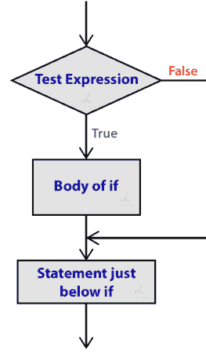

# 示例 1：

```
a = 20 ; b = 20
if ( a == b ):
    print( “a and b are equal”)
    print(“If block ended”)
```

# 输出：

a and b are equal
If block ended

# 示例 2：

```
num = 5

if ( num >= 10):

    print("num is greater than 10")

print("if block ended")
```

# 输出：

If block ended

在示例 1 中，我们看到条件 a==b 求值为 True。因此，if 语句内的代码块被执行。
在示例 2 中，条件求值为 False，因此，print 语句未被执行，唯一被执行的语句是因为它在 if 块之外。
注意：不要忘记在 if 语句后添加冒号(:)，并正确缩进当条件为 True 时执行的语句。

### 8.1.2 Python if-else 语句

从名称本身，我们就能得到线索：if-else 语句检查表达式，并在表达式为 True 时执行 if 块，否则将执行 else 代码块。else 块应紧跟在 if 块之后，并在表达式为 False 时执行。

# 语法：

```
if( expression ):

    Statement

else:

    Statement
```

# Python if-else 语句

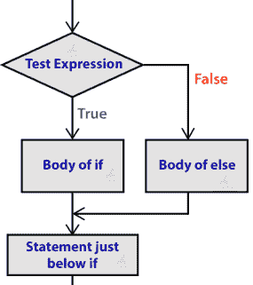

**示例：**

```
python
number1 = 20 ; number2 = 30

if(number1 >= number2 ):
    print(“number 1 is greater than number 2”)
else:
    print(“number 2 is greater than number 1”)
```

**输出：**

number 2 is greater than number 1

注意：一个 if 语句后只能跟一个 else 语句。如果你在 if 语句后使用两个 else 语句，那么你会得到以下错误。

**示例：**

```
python
if (5>10):
    print(5)
else:
    print(10)
else:
    print("End")
```

**输出：**

```
SyntaxError: invalid syntax
```

### 8.1.3 Python if-elif 梯形结构

你可能在其他语言如 C/C++ 或 Java 中听说过 else-if 语句。在 Python 中，我们有一个 elif 关键字来将多个条件一个接一个地链接起来。使用 elif 梯形结构，我们可以做出复杂的决策语句。elif 语句帮助你检查多个表达式，并在其中一个条件求值为 True 时立即执行代码。

**语法：**

```
if( expression1 ):
    statement

elif (expression2 ) :
    statement

elif(expression3 ):
    statement

.
.
else:
    statement
```

# Python if-elif 梯形结构

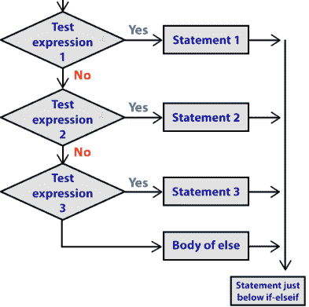

示例：

```
print("Select your ride:")
print("1. Bike")
print("2. Car")
print("3. SUV")
choice = int( input() )
if( choice == 1 ):
    print( "You have selected Bike" )
elif( choice == 2 ):
    print( "You have selected Car" )
elif( choice == 3 ):
    print( "You have selected SUV" )
else:
    print("Wrong choice!")
```

输出：
Select your ride:
1. Bike
2. Car
3. SUV
3
You have selected SUV

**输出：**
Select your ride:
1. Bike
2. Car
3. SUV
10
Wrong choice!

注意：核心 Python 不支持其他**编程语言**中可用的 switch-case 语句，但我们可以使用 elif 梯形结构来代替 switch-case。

### 8.1.4 Python 嵌套 if 语句

用非常简单的话来说，嵌套 if 语句就是另一个 if 语句内部的 if 语句。Python 允许我们在另一个 if 语句的代码块内堆叠任意数量的 if 语句。当我们需要做出一系列决策时，它们非常有用。

**语法：**

```
if (expression):
    if(expression):
        Statement of nested if
    else:
        Statement of nested if else
else:
    Statement of outer if

Statement outside if block
```

# Python 嵌套 if 语句

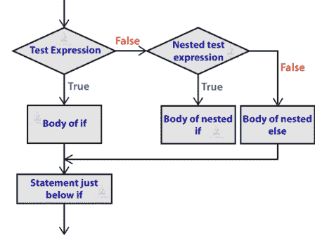

# 示例：

```
num1 = int( input())
num2 = int( input())
if( num1>= num2):
    if(num1 == num2):
        print(f'{num1} and {num2} are equal')
    else:
        print(f'{num1} is greater than {num2}')
else:
    print(f'{num1} is smaller than {num2}')
```

## 8.2 PYTHON - 循环

通常，语句是按顺序执行的：函数中的第一条语句首先执行，接着是第二条，依此类推。有时你可能需要多次执行一段代码块。

编程语言提供了各种控制结构，允许更复杂的执行路径。

循环语句允许我们多次执行一条语句或一组语句。下图说明了一个循环语句——

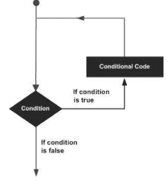

Python 编程语言提供以下类型的循环来处理循环需求。

| 序号 | 循环类型及描述 |
| :--- | :--- |
| 1 | while 循环<br>在给定条件为 TRUE 时，重复执行一条语句或一组语句。它在执行循环体之前测试条件。 |
| 2 | for 循环<br>多次执行一系列语句，并简化管理循环变量的代码。 |
| 3 | 嵌套循环<br>你可以在任何其他 while、for 或 do..while 循环内部使用一个或多个循环。 |

Python 中的 for 循环用于遍历一个序列（列表、元组、字符串）或其他可迭代对象。遍历序列称为遍历。

for 循环的语法

```
for val in sequence:
    loop body
```

这里，`val` 是一个变量，在每次迭代中获取序列中元素的值。

循环持续进行，直到我们到达序列中的最后一个元素。for 循环体通过缩进与代码的其余部分分开。

## for 循环流程图

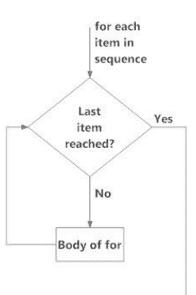

图. Python 中 for 循环的流程图。

## 示例：Python for 循环

```
# 计算列表中所有数字之和的程序

# 数字列表
numbers = [6, 5, 3, 8, 4, 2, 5, 4, 11]

# 用于存储总和的变量
sum = 0

# 遍历列表
for val in numbers:
    sum = sum+val

print("The sum is", sum)
```

> 记住
如果 else 语句与 for 循环一起使用，当循环耗尽列表中的所有项时，else 语句将被执行。

当你运行程序时，输出将是：
The sum is 48

### 8.2.1 range() 函数

我们可以使用 `range()` 函数生成一个数字序列。`range(10)` 将生成从 0 到 9 的数字（10 个数字）。
我们也可以定义起始值、停止值和步长，形式为 `range(start, stop, step_size)`。如果未提供，`step_size` 默认为 1。
`range` 对象在某种意义上是“惰性的”，因为它在创建时不会生成它“包含”的每个数字。然而，它不是一个迭代器，因为它支持 `in`、`len` 和 `__getitem__` 操作。

此函数不会将所有值存储在内存中；那样效率会很低。因此，它记住起始值、停止值和步长，并动态生成下一个数字。要强制此函数输出所有项，我们可以使用 `list()` 函数。以下示例将阐明这一点。

```
print(range(10))

print(list(range(10)))

print(list(range(2, 8)))

print(list(range(2, 20, 3)))
```

输出

```
range(0, 10)
[0, 1, 2, 3, 4, 5, 6, 7, 8, 9]
[2, 3, 4, 5, 6, 7]
[2, 5, 8, 11, 14, 17]
```

我们可以在 for 循环中使用 `range()` 函数来遍历数字序列。它可以与 `len()` 函数结合使用，通过索引来遍历序列。这里有一个例子。

```
# 使用索引遍历列表的程序

genre = ['pop', 'rock', 'jazz']

# 使用索引遍历列表

for i in range(len(genre)):
    print("I like", genre[i])
```

输出

```
I like pop
I like rock
I like jazz
```

### 8.2.2 带 else 的 for 循环

for 循环也可以有一个可选的 else 块。如果 for 循环中使用的序列中的项被耗尽，则执行 else 部分。

`break` 关键字可用于停止 for 循环。在这种情况下，else 部分将被忽略。

因此，如果 for 循环中没有发生 `break`，则 else 部分会运行。
这里有一个例子来说明这一点。

```
digits = [0, 1, 5]

for i in digits:
    print(i)
else:
    print("No items left.")
```

当你运行程序时，输出将是：

```
0
1
5
No items left.
```

这里，for 循环打印列表中的项，直到循环耗尽。当 for 循环耗尽时，它执行 else 中的代码块并打印 "No items left."。
这个 for...else 语句可以与 `break` 关键字一起使用，仅当 `break` 关键字未被执行时才运行 else 块。让我们看一个例子：

```
# 显示学生成绩记录的程序
student_name = 'Soyuj'
marks = {'James': 90, 'Jules': 55, 'Arthur': 77}

for student in marks:
    if student == student_name:
        print(marks[student])
        break
else:
    print('No entry with that name found.')
```

**输出**

No entry with that name found.

### 8.2.3 循环控制语句

循环控制语句改变其正常执行顺序。当执行离开一个作用域时，在该作用域中创建的所有自动对象都将被销毁。

让我们简要地了解一下循环控制语句

| 序号 | 控制语句及描述 |
| :--- | :--- |
| 1 | break 语句<br><br>终止循环语句并将执行转移到紧随循环之后的语句。 |
| 2 | continue 语句<br><br>导致循环跳过其主体的剩余部分，并在重新迭代之前立即重新测试其条件。 |
| 3 | pass 语句<br><br>Python 中的 pass 语句用于语法上需要一条语句，但你不想执行任何命令或代码时。 |

## 8.3 PYTHON - 数字

数字数据类型存储数值。它们是不可变的数据类型，这意味着更改数字数据类型的值会导致新分配一个对象。

当你为数字对象赋值时，它们就被创建了。例如——

var1 = 1
var2 = 10

你也可以使用 **del** 语句删除对数字对象的引用。del 语句的语法是——

del var1[,var2[,var3[....,varN]]]]

你可以使用 **del** 语句删除单个对象或多个对象。例如——

del var

del var_a, var_b

Python 支持四种不同的数字类型——

- **int（有符号整数）** – 通常称为整数或 ints，是正或负的整数，没有小数点。
- **long（长整数）** – 也称为 longs，是大小无限制的整数，写法像整数，后面跟一个大写或小写的 L。
- **float（浮点实数值）** – 也称为 floats，表示实数，用小数点分隔整数部分和小数部分。浮点数也可以用科学计数法表示，其中 E 或 e 表示 10 的幂（2.5e2 = 2.5 x 10² = 250）。
- **complex（复数）** – 形式为 a + bJ，其中 a 和 b 是浮点数，J（或 j）表示 -1 的平方根（这是一个虚数）。数字的实部是 a，虚部是 b。**复数**在 Python 编程中不常用。

示例

以下是一些数字的示例

| int | long | float | complex |
|---|---|---|---|
| 10 | 51924361L | 0.0 | 3.14j |
| 100 | -0x19323L | 15.20 | 45.j |
| -786 | 0122L | -21.9 | 9.322e-36j |
| 080 | 0xDEFABCECBDAECBFBAEL | 32.3+e18 | .876j |
| -0490 | 535633629843L | -90. | -.6545+0J |
| -0x260 | -052318172735L | -32.54e100 | 3e+26J |
| 0x69 | -4721885298529L | 70.2-E12 | 4.53e-7j |

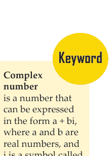

Python 允许你对 long 使用小写 L，但建议你只使用大写 L，以避免与数字 1 混淆。Python 用大写 L 显示长整数。

复数由一个有序的实浮点数对表示，记为 a + bj，其中 a 是复数的实部，b 是虚部。

### 8.3.1 数字类型转换

Python 在包含混合类型的表达式中将数字内部转换为公共类型进行求值。但有时，你需要显式地将数字从一种类型强制转换为另一种类型，以满足运算符或函数参数的要求。

- 类型 **int(x)** 将 x 转换为普通整数。
- 类型 **long(x)** 将 x 转换为长整数。
- 类型 **float(x)** 将 x 转换为浮点数。
- 类型 **complex(x)** 将 x 转换为实部为 x、虚部为零的复数。
- 类型 **complex(x, y)** 将 x 和 y 转换为实部为 x、虚部为 y 的复数。x 和 y 是**数值表达式**。

### 8.3.2 数学函数

Python 包含以下执行数学计算的函数。

| 序号 | 函数及返回值（描述） |
| :--- | :--- |
| 1 | abs(x)<br>x 的绝对值：x 与零之间的（正）距离。 |
| 2 | ceil(x)<br>x 的上取整：不小于 x 的最小整数。 |

数值表达式是数字元素（如数字、变量和函数）和运算符的组合，其计算结果为一个数值。你可以使用数学函数执行额外的数学运算。

## 8.3.3 随机数函数

随机数用于游戏、模拟、测试、安全和隐私应用。Python 包含以下常用函数。

| 序号 | 函数与描述 |
|---|---|
| 1 | choice(seq)<br>从列表、元组或字符串中随机选取一个元素。 |
| 2 | randrange ([start,] stop [,step])<br>从 range(start, stop, step) 中随机选取一个元素。 |
| 3 | random()<br>返回一个随机浮点数 r，满足 0 ≤ r < 1。 |
| 4 | seed([x])<br>设置用于生成随机数的整数起始值。在调用任何其他随机模块函数之前调用此函数。返回 None。 |
| 5 | shuffle(lst)<br>将列表中的元素原地随机打乱。返回 None。 |
| 6 | uniform(x, y)<br>返回一个随机浮点数 r，满足 x ≤ r < y。 |

## 8.3.4 三角函数

Python 包含以下执行三角计算的函数。

| 序号 | 函数与描述 |
|---|---|
| 1 | acos(x)<br>返回 x 的反余弦值，以弧度为单位。 |
| 2 | asin(x)<br>返回 x 的反正弦值，以弧度为单位。 |
| 3 | atan(x)<br>返回 x 的反正切值，以弧度为单位。 |
| 4 | atan2(y, x)<br>返回 atan(y / x)，以弧度为单位。 |
| 5 | cos(x)<br>返回 x 弧度的余弦值。 |
| 6 | hypot(x, y)<br>返回欧几里得范数，即 sqrt(x*x + y*y)。 |
| 7 | sin(x)<br>返回 x 弧度的正弦值。 |
| 8 | tan(x)<br>返回 x 弧度的正切值。 |
| 9 | degrees(x)<br>将角度 x 从弧度转换为度。 |
| 10 | radians(x)<br>将角度 x 从度转换为弧度。 |

## 8.3.5 数学常量

该模块还定义了两个数学常量 –

| 序号 | 常量与描述 |
|---|---|
| 1 | **pi**<br>数学常量 pi。 |
| 2 | **e**<br>数学常量 e。 |

## 8.4 PYTHON - 字符串

字符串是 Python 中最常见的类型之一。我们可以通过将字符括在引号中来简单地创建它们。Python 将单引号与双引号同等对待。创建字符串就像为变量赋值一样简单。例如 –

var1 = ‘Hello World!’
var2 = “Python Programming”

## 8.4.1 访问字符串中的值

Python 不支持字符类型；这些被视为长度为一的字符串，因此也被视为子字符串。

要访问子字符串，请使用方括号进行切片，并使用索引或索引范围来获取子字符串。例如 –

```
#!/usr/bin/python

var1 = 'Hello World!'
var2 = "Python Programming"

print "var1[0]: ", var1[0]
print "var2[1:5]: ", var2[1:5]
```

执行上述代码时，会产生以下结果 –

```
var1[0]:  H
var2[1:5]:  ytho
```

## 8.4.2 更新字符串

你可以通过（重新）将变量赋值给另一个字符串来“更新”现有字符串。新值可以与其先前值相关，也可以是完全不同的字符串。例如 –

```
#!/usr/bin/python

var1 = 'Hello World!'
print "Updated String :- ", var1[:6] + 'Python'
```

执行上述代码时，会产生以下结果 –

```
Updated String :-  Hello Python
```

## 8.4.3 转义字符

下表列出了可以用反斜杠表示法表示的转义或非打印字符。

转义字符会被解释；在单引号和双引号字符串中均有效。

| 反斜杠表示法 | 十六进制字符 | 描述 |
| :--- | :--- | :--- |
| \a | 0x07 | 响铃或警报 |
| \b | 0x08 | 退格 |
| \cx | | Control-x |
| \C-x | | Control-x |
| \e | 0x1b | 转义 |
| \f | 0x0c | 换页 |
| \M-\C-x | | Meta-Control-x |
| \n | 0x0a | 换行 |
| \nnn | | 八进制表示法，其中 n 的范围是 0-7 |
| \r | 0x0d | 回车 |
| \s | 0x20 | 空格 |
| \t | 0x09 | 制表符 |
| \v | 0x0b | 垂直制表符 |
| \x | | 字符 x |
| \xnn | | 十六进制表示法，其中 n 的范围是 0-9、a-f 或 A-F |

## 8.4.4 字符串特殊运算符

假设字符串变量 **a** 保存 ‘Hello’，变量 **b** 保存 ‘Python’，则 –

| 运算符 | 描述 | 示例 |
| :--- | :--- | :--- |
| + | 连接 - 将运算符两侧的值相加 | a + b 将得到 HelloPython |
| * | 重复 - 通过连接同一字符串的多个副本来创建新字符串 | a*2 将得到 -HelloHello |
| [] | 切片 - 给出给定索引处的字符 | a[1] 将得到 e |
| [:] | 范围切片 - 给出给定范围内的字符 | a[1:4] 将得到 ell |
| in | 成员资格 - 如果字符存在于给定字符串中则返回 true | H in a 将得到 1 |
| not in | 成员资格 - 如果字符不存在于给定字符串中则返回 true | M not in a 将得到 1 |
| r/R | 原始字符串 - 抑制转义字符的实际含义。原始字符串的语法与普通字符串完全相同，除了原始字符串运算符字母“r”，它位于引号之前。“r”可以是小写 (r) 或大写 (R)，并且必须紧接在第一个引号之前。 | print r'\n' 打印 \n，而 print R'\n' 打印 \n |
| % | 格式化 - 执行字符串格式化 | 见下一节 |

## 8.4.5 字符串格式化运算符

Python 最酷的特性之一是字符串格式化运算符 %。此运算符是字符串独有的，弥补了缺少 C 语言 printf() 系列函数的不足。以下是一个简单示例 –

```
#!/usr/bin/python

print "My name is %s and weight is %d kg!" % ('Zara', 21)
```

执行上述代码时，会产生以下结果 –

My name is Zara and weight is 21 kg!

以下是可与 % 一起使用的完整符号列表 –

| 格式符号 | 转换 |
|---|---|
| %c | 字符 |
| %s | 通过 str() 进行字符串转换后再格式化 |
| %i | 有符号十进制整数 |
| %d | 有符号十进制整数 |
| %u | 无符号十进制整数 |
| %o | 八进制整数 |
| %x | 十六进制整数（小写字母） |
| %X | 十六进制整数（大写字母） |
| %e | 指数表示法（使用小写‘e’） |
| %E | 指数表示法（使用大写‘E’） |
| %f | 浮点实数 |
| %g | %f 和 %e 中较短的一个 |
| %G | %f 和 %E 中较短的一个 |

其他支持的符号和功能列在下表中 –

| 符号 | 功能 |
|---|---|
| * | 参数指定宽度或精度 |
| - | 左对齐 |
| + | 显示符号 |
| <sp> | 在正数前留一个空格 |
| # | 添加八进制前导零（'0'）或十六进制前导'0x'或'0X'，具体取决于使用的是'x'还是'X'。 |
| 0 | 用零填充（而不是空格） |
| % | '%%' 产生一个字面上的 '%' |
| (var) | 映射变量（字典参数） |
| m.n. | m 是最小总宽度，n 是小数点后要显示的位数（如果适用）。 |

## 8.4.6 三引号

Python 的三引号通过允许字符串跨越多行（包括逐字的换行符、制表符和任何其他特殊字符）来提供帮助。
三引号的语法由三个连续的单引号或双引号组成。

```
#!/usr/bin/python

para_str = """this is a long string that is made up of
several lines and non-printable characters such as
TAB ( \t ) and they will show up that way when displayed.
NEWLINEs within the string, whether explicitly given like
this within the brackets [ \n ], or just a NEWLINE within
the variable assignment will also show up.
"""
print para_str
```

当执行上述代码时，会产生以下结果。请注意每个特殊字符是如何转换为其打印形式的，甚至包括字符串末尾“up.”和结束三引号之间的最后一个换行符（NEWLINE）。还要注意，换行符要么通过行末的显式回车符产生，要么通过其转义代码（`\n`）产生——这是一个由多行和不可打印字符（如制表符（TAB））组成的长字符串，它们在显示时会以这种方式呈现。字符串中的换行符，无论是像这样在方括号`[ ]`中显式给出，还是仅在变量赋值中的换行符，也会显示出来。原始字符串（Raw strings）根本不将反斜杠视为**特殊字符**。放入原始字符串的每个字符都保持你编写时的样子——

```
#!/usr/bin/python

print 'C:\nowhere'
```

当执行上述代码时，会产生以下结果——

```
C:\nowhere
```

现在让我们使用原始字符串。我们将表达式放在**r'expression'**中，如下所示——

```
#!/usr/bin/python

print r'C:\nowhere'
```

当执行上述代码时，会产生以下结果——

```
C:\nowhere
```

**特殊字符**是指不被视为数字或字母的字符。符号、重音符号和标点符号都被视为特殊字符。

## 8.4.7 Unicode 字符串

Python 中的普通字符串在内部存储为 8 位 ASCII，而 Unicode 字符串存储为 16 位 Unicode。这允许使用更多样化的字符集，包括世界上大多数语言的特殊字符。我将把对 Unicode 字符串的讨论限制在以下内容——

```
#!/usr/bin/python

print u'Hello, world!'
```

当执行上述代码时，会产生以下结果——
Hello, world!

如你所见，Unicode 字符串使用前缀 `u`，就像原始字符串使用前缀 `r` 一样。

## 8.4.8 内置字符串方法

Python 包含以下内置方法来操作字符串——

| 序号 | 方法及描述 |
|---|---|
| 1 | capitalize()<br>将字符串的第一个字母大写 |
| 2 | center(width, fillchar)<br>返回一个原字符串居中，并使用空格填充至长度 width 的新字符串。 |
| 3 | count(str, beg= 0,end=len(string))<br>计算 str 在 string 中出现的次数，如果给出了起始索引 beg 和结束索引 end，则计算在子字符串中的出现次数。 |
| 4 | decode(encoding='UTF-8',errors='strict')<br>使用为 encoding 注册的编解码器解码字符串。encoding 默认为默认字符串编码。 |
| 5 | encode(encoding='UTF-8',errors='strict')<br>返回字符串的编码版本；出错时，默认引发 ValueError，除非 errors 被指定为 'ignore' 或 'replace'。 |
| 6 | endswith(suffix, beg=0, end=len(string))<br>判断字符串或字符串的子字符串（如果给出了起始索引 beg 和结束索引 end）是否以 suffix 结尾；如果是则返回 true，否则返回 false。 |
| 7 | expandtabs(tabsize=8)<br>将字符串中的制表符扩展为多个空格；如果未提供 tabsize，则默认为每个制表符 8 个空格。 |
| 8 | find(str, beg=0 end=len(string))<br>判断 str 是否出现在字符串或字符串的子字符串中（如果给出了起始索引 beg 和结束索引 end），如果找到则返回索引，否则返回 -1。 |
| 9 | index(str, beg=0, end=len(string))<br>与 find() 相同，但如果未找到 str 则引发异常。 |
| 10 | isalnum()<br>如果字符串至少有 1 个字符且所有字符都是字母数字，则返回 true，否则返回 false。 |
| 11 | isalpha()<br>如果字符串至少有 1 个字符且所有字符都是字母，则返回 true，否则返回 false。 |
| 12 | isdigit()<br>如果字符串只包含数字，则返回 true，否则返回 false。 |
| 13 | islower()<br>如果字符串至少有 1 个有大小写的字符且所有有大小写的字符都是小写，则返回 true，否则返回 false。 |
| 14 | isnumeric()<br>如果 unicode 字符串只包含数字字符，则返回 true，否则返回 false。 |
| 15 | isspace()<br>如果字符串只包含空白字符，则返回 true，否则返回 false。 |
| 16 | istitle()<br>如果字符串是“标题化”的（即每个单词首字母大写），则返回 true，否则返回 false。 |
| 17 | isupper()<br>如果字符串至少有 1 个有大小写的字符且所有有大小写的字符都是大写，则返回 true，否则返回 false。 |
| 18 | join(seq)<br>将序列 seq 中的元素的字符串表示合并（连接）成一个字符串，使用分隔符字符串。 |
| 19 | len(string)<br>返回字符串的长度 |
| 20 | ljust(width[, fillchar])<br>返回一个原字符串左对齐，并使用空格填充至长度 width 的新字符串。 |
| 21 | lower()<br>将字符串中所有大写字母转换为小写。 |
| 22 | lstrip()<br>删除字符串开头的所有空白字符。 |
| 23 | maketrans()<br>返回一个转换表，供 translate 函数使用。 |
| 24 | max(str)<br>返回字符串 str 中最大的字母字符。 |
| 25 | min(str)<br>返回字符串 str 中最小的字母字符。 |
| 26 | replace(old, new [, max])<br>将字符串中所有出现的 old 替换为 new，如果给出了 max，则最多替换 max 次。 |
| 27 | rfind(str, beg=0,end=len(string))<br>与 find() 相同，但在字符串中反向搜索。 |
| 28 | rindex( str, beg=0, end=len(string))<br>与 index() 相同，但在字符串中反向搜索。 |
| 29 | rjust(width,[, fillchar])<br>返回一个原字符串右对齐，并使用空格填充至长度 width 的新字符串。 |
| 30 | rstrip()<br>删除字符串末尾的所有空白字符。 |
| 31 | split(str="", num=string.count(str))<br>根据分隔符 str（如果未提供则为空格）分割字符串，并返回子字符串列表；如果给出了 num，则最多分割成 num 个子字符串。 |
| 32 | splitlines( num=string.count('\n'))<br>在所有（或 num 个）换行符处分割字符串，并返回一个移除了换行符的每行列表。 |
| 33 | startswith(str, beg=0,end=len(string))<br>判断字符串或字符串的子字符串（如果给出了起始索引 beg 和结束索引 end）是否以子字符串 str 开头；如果是则返回 true，否则返回 false。 |
| 34 | strip([chars])<br>对字符串执行 lstrip() 和 rstrip()。 |
| 35 | swapcase()<br>反转字符串中所有字母的大小写。 |
| 36 | title()<br>返回字符串的“标题化”版本，即所有单词首字母大写，其余字母小写。 |
| 37 | translate(table, deletechars="")<br>根据转换表 str（256 个字符）翻译字符串，删除 del 字符串中的字符。 |
| 38 | upper()<br>将字符串中的小写字母转换为大写。 |
| 39 | zfill (width)<br>返回原字符串左填充零至总宽度为 width 的新字符串；用于数字时，zfill() 保留任何给定的符号（减去一个零）。 |
| 40 | isdecimal()<br>如果 unicode 字符串只包含十进制字符，则返回 true，否则返回 false。 |

## 8.5 PYTHON - 列表

列表用于在单个变量中存储多个项目。列表是 Python 中用于存储数据集合的 4 种内置数据类型之一，另外 3 种是元组（Tuple）、集合（Set）和字典（Dictionary），它们都有不同的特性和用途。

Python 中最基本的数据结构是序列。序列的每个元素都被分配一个数字——它的位置或索引。第一个索引是零，第二个索引是一，依此类推。

所有序列类型都可以进行某些操作。这些操作包括索引、切片、加法、乘法和成员资格检查。此外，Python 还有内置函数用于查找序列的长度以及查找其最大和最小元素。

列表是 Python 中最通用的数据类型，可以写成方括号之间用逗号分隔的值（项目）的列表。关于列表的重要一点是，列表中的项目不必是相同类型。

创建列表就像将不同的逗号分隔的值放在方括号之间一样简单。例如——

```
list1 = ['physics', 'chemistry', 1997, 2000];

list2 = [1, 2, 3, 4, 5 ];

list3 = ["a", "b", "c", "d"]
```

与字符串索引类似，列表索引从 0 开始，列表可以被切片、连接等等。

### 8.5.1 访问列表中的值

要访问列表中的值，请使用方括号进行切片，并使用索引或索引范围来获取该索引处的值。例如——

```
#!/usr/bin/python

list1 = ['physics', 'chemistry', 1997, 2000];

list2 = [1, 2, 3, 4, 5, 6, 7 ];
```

> 记住
数据类型是与数据相关联的属性，它告诉计算机系统如何解释其值。理解数据类型可确保数据以首选格式收集，并且每个属性的值都符合预期。

print "list1[0]: ", list1[0]

print "list2[1:5]: ", list2[1:5]

当执行上述代码时，会产生以下结果 –

list1[0]: physics

list2[1:5]: [2, 3, 4, 5]

## 8.5.2 更新列表

你可以通过在赋值运算符左侧指定切片来更新列表的单个或多个元素，并且可以使用 `append()` 方法向列表中添加元素。例如 –

```
#!/usr/bin/python

list = ['physics', 'chemistry', 1997, 2000];
print "Value available at index 2 : "
print list[2]
list[2] = 2001;
print "New value available at index 2 : "
print list[2]
```

注意 – `append()` 方法将在后续章节中讨论。

当执行上述代码时，会产生以下结果 –

Value available at index 2 :

1997

New value available at index 2 :

2001

## 8.5.3 删除列表元素

要删除列表元素，如果你确切知道要删除哪个元素，可以使用 `del` 语句；如果不知道，可以使用 `remove()` 方法。例如 –

```
#!/usr/bin/python

list1 = ['physics', 'chemistry', 1997, 2000];
print list1
del list1[2];
print "After deleting value at index 2 : "
print list1
```

当执行上述代码时，会产生以下结果 –

```
['physics', 'chemistry', 1997, 2000]
After deleting value at index 2 :
['physics', 'chemistry', 2000]
```

**注意** – `remove()` 方法将在后续章节中讨论。

## 8.5.4 基本列表操作

列表对 `+` 和 `*` 运算符的响应与字符串类似；在这里它们也意味着连接和重复，只是结果是一个新的列表，而不是字符串。
事实上，列表响应我们在上一章中用于字符串的所有通用序列操作。

| Python 表达式 | 结果 | 描述 |
| :--- | :--- | :--- |
| len([1, 2, 3]) | 3 | 长度 |
| [1, 2, 3] + [4, 5, 6] | [1, 2, 3, 4, 5, 6] | 连接 |
| ['Hi!'] * 4 | ['Hi!', 'Hi!', 'Hi!', 'Hi!'] | 重复 |
| 3 in [1, 2, 3] | True | 成员关系 |
| for x in [1, 2, 3]: print x, | 1 2 3 | 迭代 |

## 8.5.5 索引、切片和矩阵

因为列表是序列，所以索引和切片对列表的工作方式与对字符串相同。

假设以下输入 –
L = ['spam', 'Spam', 'SPAM!']

| Python 表达式 | 结果 | 描述 |
| :--- | :--- | :--- |
| L[2] | SPAM! | 偏移量从零开始 |
| L[-2] | Spam | 负数：从右边开始计数 |
| L[1:] | ['Spam', 'SPAM!'] | 切片获取部分 |

## 8.5.6 内置列表函数和方法

Python 包含以下列表函数 –

| 序号 | 函数及描述 |
| :--- | :--- |
| 1 | cmp(list1, list2)<br>比较两个列表的元素。 |
| 2 | len(list)<br>给出列表的总长度。 |
| 3 | max(list)<br>返回列表中具有最大值的项。 |
| 4 | min(list)<br>返回列表中具有最小值的项。 |
| 5 | list(seq)<br>将元组转换为列表。 |

Python 包含以下列表方法

| 序号 | 方法及描述 |
| :--- | :--- |
| 1 | list.append(obj)<br>将对象 obj 追加到列表 |
| 2 | list.count(obj)<br>返回 obj 在列表中出现的次数 |
| 3 | list.extend(seq)<br>将 seq 的内容追加到列表 |
| 4 | list.index(obj)<br>返回 obj 在列表中出现的最低索引 |
| 5 | list.insert(index, obj)<br>将对象 obj 插入到列表的偏移量 index 处 |
| 6 | list.pop(obj=list[-1])<br>移除并返回列表中的最后一个对象或 obj |
| 7 | list.remove(obj)<br>从列表中移除对象 obj |
| 8 | list.reverse()<br>就地反转列表中的对象 |
| 9 | list.sort([func])<br>对列表中的对象排序，如果给定则使用比较函数 |

## 8.6 PYTHON - 元组

元组是对象的有序且不可变的集合。元组是序列，就像列表一样。元组和列表之间的区别在于，元组不能像列表那样被更改，并且元组使用圆括号，而列表使用方括号。

创建元组就像放置不同的逗号分隔值一样简单。你也可以选择将这些逗号分隔的值放在圆括号中。例如 –

```
tup1 = ('physics', 'chemistry', 1997, 2000);

tup2 = (1, 2, 3, 4, 5 );

tup3 = "a", "b", "c", "d";
```

空元组写成两个不包含任何内容的圆括号 –

```
tup1 = ();
```

要编写包含单个值的元组，你必须包含一个逗号，即使只有一个值 –

```
tup1 = (50,);
```

与字符串索引类似，元组索引从 0 开始，并且可以进行切片、连接等操作。

### 8.6.1 访问元组中的值

要访问元组中的值，请使用方括号进行切片，并使用索引或索引范围来获取该索引处的值。例如 –

```
#!/usr/bin/python

tup1 = ('physics', 'chemistry', 1997, 2000);

tup2 = (1, 2, 3, 4, 5, 6, 7 );

print "tup1[0]: ", tup1[0];

print "tup2[1:5]: ", tup2[1:5];
```

当执行上述代码时，会产生以下结果 –

```
tup1[0]: physics

tup2[1:5]: [2, 3, 4, 5]
```

### 8.6.2 更新元组

元组是不可变的，这意味着你不能更新或更改元组元素的值。你可以获取现有元组的部分来创建新元组，如下例所示 –

```
#!/usr/bin/python

tup1 = (12, 34.56);

tup2 = ('abc', 'xyz');

# 以下操作对元组无效
# tup1[0] = 100;
# 所以让我们创建一个新的元组，如下所示
tup3 = tup1 + tup2;
print tup3;
```

当执行上述代码时，会产生以下结果 –

```
(12, 34.56, 'abc', 'xyz')
```

### 8.6.3 删除元组元素

删除单个元组元素是不可能的。当然，将不需要的元素丢弃，然后组合成另一个元组是没问题的。要显式删除整个元组，只需使用 `del` 语句。例如 –

```
#!/usr/bin/python
tup = ('physics', 'chemistry', 1997, 2000);
print tup;
del tup;
print "After deleting tup : ";
print tup;
```

这会产生以下结果。注意引发了一个异常，这是因为执行 `del tup` 后元组不再存在 –

```
('physics', 'chemistry', 1997, 2000)
After deleting tup :
Traceback (most recent call last):
  File "test.py", line 9, in <module>
    print tup;
NameError: name 'tup' is not defined
```

### 8.6.4 基本元组操作

元组对 `+` 和 `*` 运算符的响应与字符串类似；在这里它们也意味着连接和重复，只是结果是一个新的元组，而不是字符串。

事实上，元组响应我们在上一章中用于字符串的所有通用序列操作 –

| Python 表达式 | 结果 | 描述 |
|---|---|---|
| len((1, 2, 3)) | 3 | 长度 |
| (1, 2, 3) + (4, 5, 6) | (1, 2, 3, 4, 5, 6) | 连接 |
| ('Hi!',) * 4 | ('Hi!', 'Hi!', 'Hi!', 'Hi!') | 重复 |
| 3 in (1, 2, 3) | True | 成员关系 |
| for x in (1, 2, 3): print x, | 1 2 3 | 迭代 |

> 记住
元组是 Python 中用于存储数据集合的 4 种内置数据类型之一，另外 3 种是列表、集合和字典，它们都具有不同的质量和用途。

### 8.6.5 索引、切片和矩阵

因为元组是序列，所以索引和切片对元组的工作方式与对字符串相同。假设以下输入 –

```
L = ('spam', 'Spam', 'SPAM!')
```

| Python 表达式 | 结果 | 描述 |
|---|---|---|
| L[2] | 'SPAM!' | 偏移量从零开始 |
| L[-2] | 'Spam' | 负数：从右边开始计数 |
| L[1:] | ['Spam', 'SPAM!'] | 切片获取部分 |

### 8.6.6 无界定符

任何一组多个对象，用逗号分隔，不写识别符号（即列表的方括号、元组的圆括号等），默认为元组，如以下简短示例所示 –

```
#!/usr/bin/python

print 'abc', -4.24e93, 18+6.6j, 'xyz';
x, y = 1, 2;
print "Value of x , y : ", x,y;
```

当执行上述代码时，会产生以下结果 –

```
abc -4.24e+93 (18+6.6j) xyz

Value of x , y : 1 2
```

### 8.6.7 内置元组函数

Python 包含以下元组函数 –

| 序号 | 函数及描述 |
| :--- | :--- |
| 1 | cmp(tuple1, tuple2)<br>比较两个元组的元素。 |
| 2 | len(tuple)<br>给出元组的总长度。 |
| 3 | max(tuple)<br>返回元组中具有最大值的项。 |
| 4 | min(tuple)<br>返回元组中具有最小值的项。 |
| 5 | tuple(seq)<br>将列表转换为元组。 |

## 8.7 PYTHON - 日期和时间

Python 程序可以用多种方式处理日期和时间。在不同日期格式之间转换是计算机的常见任务。Python 的 `time` 和 `calendar` 模块有助于跟踪日期和时间。

## 什么是 Tick？

时间间隔是以秒为单位的浮点数。特定的时间点则表示为自1970年1月1日00:00:00（纪元）以来的秒数。

Python 中有一个流行的 **time** 模块，它提供了处理时间以及在不同表示形式之间进行转换的函数。函数 *time.time()* 返回自1970年1月1日00:00:00（纪元）以来的当前系统时间（以 tick 为单位）。

### 示例

```python
#!/usr/bin/python

import time; # 这是引入 time 模块所必需的。

ticks = time.time()

print "Number of ticks since 12:00am, January 1, 1970:", ticks
```

这将产生如下结果——
Number of ticks since 12:00am, January 1, 1970: 7186862.73399

使用 tick 进行日期运算很容易。但是，纪元之前的日期无法用这种形式表示。遥远未来的日期也无法这样表示——对于 UNIX 和 Windows，截止点大约在2038年。

### 什么是 TimeTuple？

Python 的许多时间函数将时间处理为一个包含9个数字的元组，如下所示——

| 索引 | 字段 | 值 |
| :--- | :--- | :--- |
| 0 | 4位数年份 | 2008 |
| 1 | 月份 | 1 到 12 |
| 2 | 日期 | 1 到 31 |
| 3 | 小时 | 0 到 23 |
| 4 | 分钟 | 0 到 59 |
| 5 | 秒 | 0 到 61（60 或 61 是闰秒） |
| 6 | 星期几 | 0 到 6（0 是星期一） |
| 7 | 一年中的第几天 | 1 到 366（儒略日） |
| 8 | 夏令时标志 | -1, 0, 1, -1 表示由库决定夏令时 |

上述元组等效于 **struct_time** 结构。该结构具有以下属性——

| 索引 | 属性 | 值 |
| :--- | :--- | :--- |
| 0 | tm_year | 2008 |
| 1 | tm_mon | 1 到 12 |
| 2 | tm_mday | 1 到 31 |
| 3 | tm_hour | 0 到 23 |
| 4 | tm_min | 0 到 59 |
| 5 | tm_sec | 0 到 61（60 或 61 是闰秒） |
| 6 | tm_wday | 0 到 6（0 是星期一） |
| 7 | tm_yday | 1 到 366（儒略日） |
| 8 | tm_isdst | -1, 0, 1, -1 表示由库决定夏令时 |

## 8.7.1 获取当前时间

要将一个时间点从 *自纪元以来的秒数* 浮点值转换为时间元组，请将该浮点值传递给一个函数（例如 `localtime`），该函数返回一个包含所有九个有效项目的时间元组。

```python
#!/usr/bin/python

import time;

localtime = time.localtime(time.time())

print "Local current time :", localtime
```

这将产生以下结果，该结果可以格式化为任何其他可呈现的形式——

```
Local current time : time.struct_time(tm_year=2013, tm_mon=7, tm_mday=17, tm_hour=21, tm_min=26, tm_sec=3, tm_wday=2, tm_yday=198, tm_isdst=0)
```

## 8.7.2 获取格式化时间

你可以根据需要格式化任何时间，但获取可读格式时间的简单方法是 `asctime()`——

```python
#!/usr/bin/python
import time;

localtime = time.asctime( time.localtime(time.time()) )
print "Local current time :", localtime
```

这将产生以下结果——

Local current time : Tue Jan 13 10:17:09 2009

## 8.7.3 获取某个月的日历

`calendar` 模块提供了多种方法来处理年度和月度日历。这里，我们打印给定月份（2008年1月）的日历——

```python
#!/usr/bin/python
import calendar

cal = calendar.month(2008, 1)
print "Here is the calendar:"
print cal
```

这将产生以下结果——

Here is the calendar:

January 2008
Mo Tu We Th Fr Sa Su

1 2 3 4 5 6
7 8 9 10 11 12 13
14 15 16 17 18 19 20
21 22 23 24 25 26 27
28 29 30 31

## 8.7.4 time 模块

Python 中有一个流行的 `time` 模块，它提供了处理时间以及在不同表示形式之间进行转换的函数。以下是所有可用方法的列表——

| 序号 | 函数及描述 |
|---|---|
| 1 | time.altzone<br>本地夏令时区的偏移量（以秒为单位，向西为正），如果已定义。如果本地夏令时区在 UTC 以东（如西欧，包括英国），则此值为负。仅在 daylight 非零时使用此值。 |
| 2 | time.asctime([tupletime])<br>接受一个时间元组，并返回一个可读的24字符字符串，例如 ‘Tue Dec 11 18:07:14 2008’。 |
| 3 | time.clock( )<br>返回当前 CPU 时间（以秒为单位的浮点数）。要衡量不同方法的计算成本，`time.clock` 的值比 `time.time()` 的值更有用。 |
| 4 | time.ctime([secs])<br>类似于 `asctime(localtime(secs))`，无参数时类似于 `asctime()`。 |
| 5 | time.gmtime([secs])<br>接受一个以自纪元以来的秒数表示的时间点，并返回一个表示 UTC 时间的时间元组 `t`。注意：`t.tm_isdst` 始终为 0。 |
| 6 | time.localtime([secs])<br>接受一个以自纪元以来的秒数表示的时间点，并返回一个表示本地时间的时间元组 `t`（`t.tm_isdst` 为 0 或 1，取决于本地规则是否对时间点 `secs` 应用夏令时）。 |
| 7 | time.mktime(tupletime)<br>接受一个以本地时间表示的时间元组，并返回一个以自纪元以来的秒数表示的时间点的浮点值。 |
| 8 | time.sleep(secs)<br>将调用线程挂起 `secs` 秒。 |
| 9 | time.strftime(fmt[,tupletime])<br>接受一个以本地时间表示的时间元组，并返回一个表示由字符串 `fmt` 指定的时间点的字符串。 |
| 10 | time.strptime(str,fmt='%a %b %d %H:%M:%S %Y')<br>根据格式字符串 `fmt` 解析 `str`，并返回时间元组格式的时间点。 |
| 11 | time.time()<br>返回当前时间点，一个自纪元以来的秒数浮点数。 |
| 12 | time.tzset()<br>重置库例程使用的时间转换规则。环境变量 `TZ` 指定了如何执行此操作。 |

让我们简要了解一下这些函数——
`time` 模块有以下两个重要属性——

| 序号 | 属性及描述 |
|---|---|
| 1 | **time.timezone**<br>属性 `time.timezone` 是本地时区（不包括夏令时）与 UTC 的偏移量（以秒为单位）（在美洲为 >0；在欧洲、亚洲、非洲大部分地区为 <=0）。 |
| 2 | **time.tzname**<br>属性 `time.tzname` 是一对依赖于区域设置的字符串，分别是本地时区在不应用和应用夏令时的名称。 |

## 8.7.5 calendar 模块

`calendar` 模块提供了与日历相关的函数，包括打印给定月份或年份的文本日历的函数。
默认情况下，`calendar` 将星期一作为一周的第一天，星期日作为最后一天。要更改此设置，请调用 `calendar.setfirstweekday()` 函数。

以下是 *calendar* 模块中可用的函数列表——

| 序号 | 函数及描述 |
| :--- | :--- |
| 1 | **calendar.calendar(year,w=2,l=1,c=6)**<br>返回一个包含年份 `year` 日历的多行字符串，格式化为三列，列之间用 `c` 个空格分隔。`w` 是每个日期的字符宽度；每行长度为 `21*w+18+2*c`。`l` 是每周的行数。 |
| 2 | **calendar.firstweekday( )**<br>返回当前设置的每周起始日。默认情况下，首次导入 `calendar` 时，此值为 0，表示星期一。 |
| 3 | **calendar.isleap(year)**<br>如果 `year` 是闰年则返回 `True`；否则返回 `False`。 |
| 4 | **calendar.leapdays(y1,y2)**<br>返回 `range(y1,y2)` 年份范围内的闰日总数。 |
| 5 | **calendar.month(year,month,w=2,l=1)**<br>返回一个包含年份 `year` 月份 `month` 日历的多行字符串，每周一行，外加两行标题。`w` 是每个日期的字符宽度；每行长度为 `7*w+6`。`l` 是每周的行数。 |
| 6 | **calendar.monthcalendar(year,month)**<br>返回一个整数列表的列表。每个子列表表示一周。年份 `year` 月份 `month` 之外的日期设置为 0；月份内的日期设置为其在该月中的日期，从 1 开始。 |
| 7 | **calendar.monthrange(year,month)**<br>返回两个整数。第一个是年份 `year` 月份 `month` 第一天的星期代码；第二个是该月的天数。星期代码为 0（星期一）到 6（星期日）；月份编号为 1 到 12。 |
| 8 | **calendar.prcal(year,w=2,l=1,c=6)**<br>类似于 `print calendar.calendar(year,w,l,c)`。 |
| 9 | **calendar.prmonth(year,month,w=2,l=1)**<br>类似于 `print calendar.month(year,month,w,l)`。 |
| 10 | **calendar.setfirstweekday(weekday)**<br>将每周的第一天设置为星期代码 `weekday`。星期代码为 0（星期一）到 6（星期日）。 |

# 基础计算机编程：Python

| 11 | **calendar.timegm(tupletime)**<br>time.gmtime的逆操作：接受一个时间元组形式的时间实例，并返回自纪元以来相同实例的浮点秒数。 |
| 12 | **calendar.weekday(year,month,day)**<br>返回给定日期的星期代码。星期代码为0（星期一）至6（星期日）；月份编号为1（一月）至12（十二月）。 |

# 总结

- Python是一种功能强大的通用编程语言。它被用于网页开发、数据科学、创建软件原型等领域。
- Python是一种解释型、面向对象的编程语言，类似于PERL，因其清晰的语法和可读性而广受欢迎。
- 程序中的决策用于当程序需要有条件地选择执行某个代码块时。让我们以交通灯为例，根据道路状况或任何特定规则，在不同情况下点亮不同颜色的灯。
- if语句是最简单的决策语句形式。它接受一个表达式，并检查该表达式是否求值为True，如果是，则执行if语句中的代码块。
- 用非常简单的话来说，嵌套if语句就是在一个if语句内部的另一个if语句。Python允许我们在一个if语句块内堆叠任意数量的if语句。当我们需要做出一系列决策时，它们非常有用。
- 通常，语句是按顺序执行的：函数中的第一条语句首先执行，然后是第二条，依此类推。可能会出现需要多次执行某个代码块的情况。
- 循环控制语句会改变其正常执行顺序。当执行离开一个作用域时，在该作用域中创建的所有自动对象都会被销毁。

# 知识检查

1. 如何在Python中输出字符串“May the odds favor you”？
   a. print(“May the odds favor you”)
   b. echo(“May the odds favor you”)
   c. System.out(“May the odds favor you”)
   d. printf(“May the odds favor you”)
2. Python 3.0版本是在哪一年开发的？
   a. 2005
   b. 2000
   c. 2010
   d. 2008
3. Python中使用哪个字符来添加单行注释？
   a. /
   b. //
   c. #
   d. ?
4. Python通常被描述为：
   a. 电池排除语言
   b. 齿轮包含语言
   c. 电池包含语言
   d. 齿轮排除语言
5. 在Python语言中，我们使用什么来定义一个代码块？
   a. 缩进
   b. 键
   c. 括号
   d. 以上都不是
6. 在Python中可以对字符串执行数学运算吗？判断对错：
   a. 错误
   b. 正确
7. 以下哪项不是Python的预定义数据类型？
   a. 列表
   b. 字典
   c. 元组
   d. 类
8. 以下哪项具有更高的优先级？
   a. +
   b. ()
   c. /
   d. -

# 复习题

1. 讨论Python的if语句。
2. 定义循环控制语句。
3. 你对随机数函数有什么理解？
4. 如何访问字符串中的值？
5. 什么是Unicode字符串？

# 检查你的结果

1. (a) 2. (d) 3. (c) 4. (c)
5. (a) 6. (a) 7. (d) 8. (b)

## 参考文献

1. Christopher Ramsay Holdgraf, Wendy de Heer, Brian N. Pasley, Jochem W. Rieger, Nathan Crone, Jack J. Lin, Robert T. Knight, and Frédéric E. Theunissen. Rapid tuning shifts in human auditory cortex enhance speech intelligibility. Nature Communications, 7(May):13654, 2016. URL: http://www.nature.com/doifinder/10.1038/ncomms13654, doi:10.1038/ncomms13654.
2. Fernando Perez, Brian E Granger, and John D Hunter. Python: an ecosystem for scientific computing. Computing in Science & Engineering, 13(2):13–21, 2011.
3. Hammond, Mark, and Andy Robinson. Python: Programming on Win32. Sebastopol, CA: O'Reilly, 2000.
4. J Gregory Caporaso, Justin Kuczynski, Jesse Stombaugh, Kyle Bittinger, Frederic D Bushman, Elizabeth K Costello, Noah Fierer, Antonio Gonzalez Pena, Julia K Goodrich, Jeffrey I Gordon, and others. Qiime allows analysis of high-throughput community sequencing data. Nature methods, 7(5):335–336, 2010.
5. John Stachurski and Takashi Kamihigashi. Stochastic stability in monotone economies. Theoretical Economics, 2014.

## 第9章
PYTHON数据库编程

> “计算应该作为一门严谨但有趣的学科来教授，涵盖编程、数据库结构和算法等主题。这不必是枯燥的。”

–Geoff Mulgan

## 学习目标

学习本章后，你将能够：

1. 了解Python的DB-API（SQL-API）
2. 讨论MySQL与Python
3. 创建、修改和删除表
4. 在表中插入记录
5. 更新和删除数据库中的记录

## 引言

数据库程序是企业信息系统的核心，提供文件创建、数据输入、更新、查询和报告功能。数据库软件的传统术语是“数据库管理系统”。数据库程序允许用户通过键盘交互式地创建和编辑单个文件。然而，一旦他们希望一个文件中的数据自动更新另一个文件，就必须进行编程。这就是胆怯者离开，技术人员接手的地方。

数据库是组织化信息的集合，可以轻松地使用、管理和更新，并根据其组织方式进行分类。

从建筑公司到证券交易所，每个组织都依赖于大型数据库。这些本质上是表的集合，并通过列相互连接。这些数据库系统支持SQL（结构化查询语言），用于创建、访问和操作数据。SQL用于访问数据，也用于创建和利用存储数据之间的关系。此外，这些数据库支持数据库规范化规则以避免数据冗余。Python编程语言具有强大的数据库编程功能。Python支持多种数据库，如MySQL、Oracle、Sybase、PostgreSQL等。Python还支持数据定义语言（DDL）、数据操作语言（DML）和数据查询语句。对于数据库编程，Python DB API是一个广泛使用的模块，它提供了数据库应用程序编程接口。

使用Python进行数据库应用程序编程有很多充分的理由：

- 与其他语言相比，使用Python编程可以说更高效、更快。
- Python以其可移植性而闻名。
- 它是平台无关的。
- Python支持SQL游标。
- 在许多编程语言中，应用程序开发人员需要处理数据库的打开和关闭连接，以避免进一步的异常和错误。在Python中，这些连接由系统处理。
- Python支持关系数据库系统。
- Python数据库API与各种数据库兼容，因此迁移和移植数据库应用程序接口非常容易。

## 9.1 Python的DB-API（SQL-API）

Python DB-API独立于任何数据库引擎，这使你能够编写Python脚本来访问任何数据库引擎。MySQL的Python DB API实现是MySQLdb。对于PostgreSQL，它支持psycopg、PyGresQL和pyPgSQL模块。Oracle的DB-API实现是dc_oracle2和cx_oracle。Pydb2是DB2的DB-API实现。Python的DB-API包括连接对象、游标对象、标准异常和其他一些模块内容，所有这些我们都将讨论。

### 9.1.1 连接对象

连接对象与数据库创建连接，这些连接进一步用于不同的事务。这些连接对象也用作数据库会话的代表。

连接是按如下方式创建的：

```python
>>>conn = MySQLdb.connect('library', user='suhas', password='python')
```

你可以使用连接对象来调用诸如 `commit()`、`rollback()` 和 `close()` 等方法，如下所示：

```python
>>>cur = conn.cursor()  # 创建用于执行 SQL 语句的新游标对象
>>>conn.commit()  # 提交事务
>>>conn.rollback()  # 回滚事务
>>>conn.close()  # 关闭连接
>>>conn.callproc(proc,param)  # 调用存储过程进行执行
>>>conn.getsource(proc)  # 获取存储过程代码
```

## 9.1.2 游标对象

游标是 SQL 的强大功能之一。这些对象负责向**数据库服务器**提交各种 SQL 语句。MySQLdb 游标中有几种游标类：

- BaseCursor 是游标对象的基类。
- Cursor 是默认的游标类。CursorWarningMixIn、CursorStoreResultMixIn、CursorTupleRowsMixIn 和 BaseCursor 是游标类的一些组成部分。
- CursorStoreResultMixIn 使用 `mysql_store_result()` 函数从执行的查询中检索结果集。这些结果集存储在客户端。
- CursorUseResultMixIn 使用 `mysql_use_result()` 函数从执行的查询中检索结果集。这些结果集存储在服务器端。

**关键词**

数据库服务器是指使用数据库应用程序的服务器，该应用程序根据客户端-服务器模型为其他计算机程序或计算机提供数据库服务。

以下示例说明了如何使用游标对象执行 SQL 命令。你可以使用 `execute` 来执行像 `SELECT` 这样的 SQL 命令。要提交所有 SQL 操作，你需要关闭游标，即 `cursor.close()`。

```python
>>>cursor.execute('SELECT * FROM books')
>>>cursor.execute("""SELECT * FROM books WHERE book_name = 'python' AND book_author = 'Mark Lutz'""")
>>>cursor.close()
```

## 9.1.3 DB-API 中的错误和异常处理

在 Python DB-API 模块中，异常处理非常简单。我们可以在程序中放置警告和错误处理消息。Python DB-API 有多种处理此问题的选项，如 Warning、InterfaceError、DatabaseError、IntegrityError、InternalError、NotSupportedError、OperationalError 和 ProgrammingError。让我们逐一了解它们：

- IntegrityError：让我们详细看看完整性错误。在下面的示例中，我们将尝试在数据库中输入重复的记录。它将显示一个完整性错误 `_mysql_exceptions.IntegrityError`，如下所示：

```python
>>> cursor.execute('insert books values (%s,%s,%s,%s)',('Py9098','Programming With Perl',120,100))
Traceback (most recent call last):
  File "<stdin>", line 1, in ?
  File "/usr/lib/python2.3/site-packages/MySQLdb/cursors.py", line 95, in execute
    return self._execute(query, args)
  File "/usr/lib/python2.3/site-packages/MySQLdb/cursors.py", line 114, in _execute
    self.errorhandler(self, exc, value)
  raise errorclass, errorvalue
_mysql_exceptions.IntegrityError: (1062, "Duplicate entry 'Py9098' for key 1")
```

OperationalError：如果有任何操作错误，例如未选择数据库，Python DB-API 将把此错误作为 OperationalError 处理，如下所示：

```python
>>> cursor.execute('Create database Library')
>>> q='select name from books where cost>=%s order by name'
>>>cursor.execute(q,[50])
Traceback (most recent call last):
  File "<stdin>", line 1, in ?
  File "/usr/lib/python2.3/site-packages/MySQLdb/cursors.py", line 95, in execute
    return self._execute(query, args)
  File "/usr/lib/python2.3/site-packages/MySQLdb/cursors.py", line 114, in _execute
    self.errorhandler(self, exc, value)
  File "/usr/lib/python2.3/site-packages/MySQLdb/connections.py", line 33, in defaulterrorhandler
    raise errorclass, errorvalue
_mysql_exceptions.OperationalError: (1046, 'No Database Selected')
```

ProgrammingError：如果有任何编程错误，例如重复创建数据库，Python DB-API 将把此错误作为 ProgrammingError 处理，如下所示：

```python
>>> cursor.execute('Create database Library')
Traceback (most recent call last):
  File "<stdin>", line 1, in ?
  File "/usr/lib/python2.3/site-packages/MySQLdb/cursors.py", line 95, in execute
    return self._execute(query, args)
  File "/usr/lib/python2.3/site-packages/MySQLdb/cursors.py", line 114, in _execute
    self.errorhandler(self, exc, value)
  File "/usr/lib/python2.3/site-packages/MySQLdb/connections.py", line 33, in defaulterrorhandler
    raise errorclass, errorvalue
_mysql_exceptions.ProgrammingError: (1007, "Can't create database 'Library'. Database exists")
```

## 9.1.4 Python 和 MySQL

Python 和 MySQL 是开发数据库应用程序的良好组合。在 Linux 上启动 MySQL 服务后，你需要获取 MySQLdb，这是一个用于 MySQL 的 Python DB-API，以执行数据库操作。你可以使用以下命令检查 MySQLdb 模块是否已安装在你的系统中：

```python
>>>import MySQLdb
```

如果此命令运行成功，你现在就可以开始为你的数据库编写脚本了。

要在 Python 中编写数据库应用程序，需要遵循五个步骤：

- 使用以下命令导入 SQL 接口：

  ```python
  >>> import MySQLdb
  ```

- 使用以下命令与数据库建立连接：

  ```python
  >>> conn=MySQLdb.connect(host='localhost',user='root',passwd='')
  ```

  ...其中 `host` 是你的主机名，后跟用户名和密码。对于 root 用户，无需提供密码。

- 使用以下命令为连接创建一个游标：

  ```python
  >>>cursor = conn.cursor()
  ```

- 使用此游标执行任何 SQL 查询，如下所示——这里的输出（如 1L 或 2L）表示此查询影响的行数：

  ```python
  >>> cursor.execute('Create database Library')
  1L     # 1L 表示影响了多少行
  >>> cursor.execute('use Library')
  >>>table='create table books(book_accno char(30) primary key, book_name char(50),no_of_copies int(5),price int(5))'
  >>> cursor.execute(table)
  0L
  ```

- 最后，获取结果集并遍历此结果集。在此步骤中，用户可以如下所示获取结果集：

  ```python
  >>> cursor.execute('select * from books')
  2L
  >>> cursor.fetchall()
  (('Py9098', 'Programming With Python', 100L, 50L), ('Py9099', 'Programming With Python', 100L, 50L))
  ```

在此示例中，使用了 `fetchall()` 函数来获取结果集。

## 9.1.5 更多 SQL 操作

我们可以使用 Python DB-API 执行所有 SQL 操作。插入、删除、聚合和更新查询可以如下所示进行说明。

- 插入 SQL 查询

  ```python
  >>>cursor.execute('insert books values (%s,%s,%s,%s)',('Py9098','Programming With Python',100,50))
  1L     # 受影响的行数。
  >>> cursor.execute('insert books values (%s,%s,%s,%s)',('Py9099','Programming With Python',100,50))
  1L     # 受影响的行数。
  ```

如果用户想为一本书的**登录号**插入重复条目，Python DB-API 将显示错误，因为它是主键。以下示例说明了这一点：

```python
>>> cursor.execute('insert books values (%s,%s,%s,%s)',('Py9099','Programming With Python',100,50))
>>>cursor.execute('insert books values (%s,%s,%s,%s)',('Py9098','Programming With Perl',120,100))
Traceback (most recent call last):
  File "<stdin>", line 1, in ?
  File "/usr/lib/python2.3/site-packages/MySQLdb/cursors.py", line 95, in execute
    return self._execute(query, args)
  File "/usr/lib/python2.3/site-packages/MySQLdb/cursors.py", line 114, in _execute
    self.errorhandler(self, exc, value)
  File "/usr/lib/python2.3/site-packages/MySQLdb/connections.py", line 33, in defaulterrorhandler
    raise errorclass, errorvalue
_mysql_exceptions.IntegrityError: (1062, "Duplicate entry 'Py9098' for key 1")
```

更新 SQL 查询可用于更新数据库中的现有记录，如下所示：

```python
>>> cursor.execute('update books set price=%s where no_of_copies<=%s',[60,101])
2L
>>> cursor.execute('select * from books')
2L
>>> cursor.fetchall()
(('Py9098', 'Programming With Python', 100L, 60L),
```

**关键词**

**登录号**是在记录或项目添加到图书馆馆藏或数据库时分配给它的顺序号，它表示其获取的时间顺序。

## 9.1.6 Python MySQL – 创建数据库

Python 数据库 API（应用程序接口）是标准 Python 的数据库接口。大多数 Python 数据库接口都遵循此标准。Python 数据库支持多种数据库服务器，例如 MySQL、GadFly、mSQL、PostgreSQL、Microsoft SQL Server 2000、Informix、Interbase、Oracle、Sybase 等。要从 Python 连接到 MySQL 数据库服务器，我们需要导入 `mysql.connector` 接口。

**语法：**
CREATE DATABASE DATABASE_NAME

**示例：**

```python
# importing required libraries
import mysql.connector

dataBase = mysql.connector.connect(
    host ="localhost",
    user ="user",
    passwd ="gfg"
)

# preparing a cursor object
cursorObject = dataBase.cursor()

# creating database
cursorObject.execute("CREATE DATABASE geeks4geeks")
```

输出：

```
mysql> show databases;
+--------------------+
| Database           |
+--------------------+
| information_schema |
| College            |
| geeks4geeks        |
| mysql              |
| performance_schema |
| sys                |
+--------------------+
6 rows in set (0.01 sec)
```

上述程序演示了如何创建名为 `geeks4geeks` 的 MySQL 数据库，其中主机名为 `localhost`，用户名为 `user`，密码为 `gfg`。

假设我们想在数据库中创建一个表，那么我们需要连接到一个数据库。下面是一个在 `geeks4geeks` 数据库（即上述程序创建的数据库）中创建表的程序。

## 9.2 使用 Python 操作 MySQL

MySQL 是当今市场上最受欢迎的数据库管理系统（DBMS）之一。在今年的 DB-Engines 排名中，它仅次于 Oracle DBMS，排名第二。由于大多数软件应用程序都需要以某种形式与数据交互，因此像 Python 这样的编程语言提供了用于存储和访问这些数据源的工具。

你将能够高效地将 MySQL 数据库与 Python 应用程序集成。你将为一个电影评分系统开发一个小型 MySQL 数据库，并学习如何直接从 Python 代码中查询它。

结构化查询语言（SQL）是一种标准的数据库语言，用于创建、维护和检索关系数据库。以下是关于 SQL 的一些有趣事实。

- SQL 不区分大小写。但建议的做法是将关键字（如 SELECT、UPDATE、CREATE 等）大写，将用户定义的内容（如表名、列名等）小写。
- 我们可以使用行首的“--”（双连字符）在 SQL 中编写注释。
- SQL 是用于关系数据库（如下所述）的编程语言，例如 MySQL、Oracle、Sybase、SQL Server、Postgre 等。其他非关系数据库（也称为 NoSQL）数据库，如 MongoDB、DynamoDB 等，不使用 SQL。
- 尽管 SQL 有 ISO 标准，但大多数实现的语法略有不同。因此，我们可能会遇到在 SQL Server 中有效但在 MySQL 中无效的查询。

> MySQL 是根据 GNU 通用公共许可证条款提供的免费开源软件，也可在各种专有许可下使用。MySQL 由瑞典公司 MySQL AB 拥有和赞助，该公司后来被 Sun Microsystems（现为 Oracle Corporation）收购。

### 9.2.1 将 MySQL 与其他 SQL 数据库进行比较

SQL 代表结构化查询语言，是一种广泛使用的编程语言，用于管理关系数据库。你可能听说过不同风格的基于 SQL 的 DBMS。最受欢迎的包括 MySQL、PostgreSQL、SQLite 和 SQL Server。所有这些数据库都符合 SQL 标准，但符合程度各不相同。

自 1995 年诞生以来，MySQL 一直是开源的，并迅速成为 SQL 解决方案中的市场领导者。MySQL 也是 Oracle 生态系统的一部分。虽然其核心功能完全免费，但也有一些付费附加组件。目前，MySQL 被所有主要科技公司使用，包括 Google、LinkedIn、Uber、Netflix、Twitter 等。

除了庞大的开源社区支持外，MySQL 成功的原因还有很多：

- **易于安装：** MySQL 旨在用户友好。设置 MySQL 数据库相当简单，一些广泛可用的第三方工具（如 phpMyAdmin）进一步简化了设置过程。MySQL 适用于所有主要操作系统，包括 Windows、macOS、Linux 和 Solaris。
- **速度：** MySQL 以其极快的数据库解决方案而闻名。它占用空间相对较小，并且从长远来看具有极高的可扩展性。
- **用户权限和安全性：** MySQL 附带一个脚本，允许你设置密码安全级别、分配管理员密码以及添加和删除用户帐户权限。该脚本简化了网络托管用户管理门户的管理过程。其他 DBMS（如 PostgreSQL）使用的配置文件则更为复杂。

虽然 MySQL 以其速度和易用性而闻名，但你可以通过 PostgreSQL 获得更高级的功能。此外，MySQL 并非完全符合 SQL 标准，并且存在某些功能限制，例如不支持 FULL JOIN 子句。

你可能还会在 MySQL 中遇到并发读写的一些问题。如果你的软件有许多用户同时写入数据，那么 PostgreSQL 可能是更合适的选择。

> **注意：** 要在实际环境中更深入地比较 MySQL 和 PostgreSQL，请查看《为什么 Uber 工程团队从 Postgres 切换到 MySQL》。

SQL Server 也是一个非常流行的 DBMS，以其可靠性、效率和安全性而闻名。它受到经常处理大流量工作负载的公司（尤其是银行领域）的青睐。它是一个商业解决方案，也是与 Windows 服务最兼容的系统之一。

2010 年，当 Oracle 收购 Sun Microsystems 和 MySQL 时，许多人担心 MySQL 的未来。当时，Oracle 是 MySQL 最大的竞争对手。开发者担心这是 Oracle 的一次恶意收购，旨在摧毁 MySQL。

由 MySQL 原始作者 Michael Widenius 领导的几位开发者创建了 MySQL 代码库的一个分支，并奠定了 MariaDB 的基础。其目的是确保对 MySQL 的访问并使其永远免费。

迄今为止，MariaDB 仍然完全采用 GPL 许可，使其完全处于公共领域。而 MySQL 的某些功能仅在付费许可下可用。此外，MariaDB 提供了 MySQL 服务器不支持的几个非常有用的功能，例如分布式 SQL 和列式存储。你可以在 MariaDB 的网站上找到更多 MySQL 和 MariaDB 之间的差异。

MySQL 使用与标准 SQL 非常相似的语法。然而，官方文档中提到了一些显著的差异。

### 9.2.2 安装 MySQL Server 和 MySQL Connector/Python

现在，要开始学习本教程，你需要设置两样东西：一个 MySQL 服务器和一个 MySQL 连接器。MySQL 服务器将提供处理数据库所需的所有服务。一旦服务器启动并运行，你就可以使用 MySQL Connector/Python 将你的 Python 应用程序与之连接。

#### 安装 MySQL Server

官方文档详细说明了下载和安装 MySQL 服务器的推荐方式。你会找到适用于所有流行操作系统的说明，包括 Windows、macOS、Solaris、Linux 等。

对于 Windows，最好的方法是下载 MySQL Installer 并让它处理整个过程。安装管理器还可以帮助你配置 MySQL 服务器的安全设置。在“帐户和角色”页面上，你需要为 **root**（管理员）帐户输入密码，也可以选择添加具有不同权限的其他用户：

虽然你必须在设置期间指定 root 帐户的凭据，但你可以稍后修改这些设置。请记住主机名、用户名和密码，因为稍后建立与 MySQL 服务器的连接时将需要它们。

尽管本教程只需要 MySQL 服务器，但你也可以使用这些安装程序设置其他有用的工具，例如 MySQL Workbench。如果你不想直接在操作系统中安装 MySQL，那么使用 Docker 在 Linux 上部署 MySQL 是一个方便的替代方案。

## 安装 MySQL Connector/Python

数据库驱动是一段允许应用程序连接并与数据库系统交互的软件。像 Python 这样的编程语言在与特定供应商的数据库通信之前，需要一个特殊的驱动程序。

这些驱动程序通常作为第三方模块获取。Python 数据库 API（DB-API）定义了所有 Python 数据库驱动必须遵守的标准接口。这些细节在 PEP 249 中有详细说明。所有 Python 数据库驱动，例如用于 SQLite 的 sqlite3、用于 PostgreSQL 的 psycopg2 以及用于 MySQL 的 MySQL Connector/Python，都遵循这些实现规则。

注意：MySQL 的官方文档使用术语“连接器”而不是“驱动程序”。从技术上讲，连接器仅与连接到数据库相关，而不是与之交互。然而，该术语通常用于指代包含连接器*和*驱动程序的整个数据库访问模块。

为了与文档保持一致，每当提到 MySQL 时，你都会看到术语“连接器”。

许多流行的编程语言都有自己的数据库 API。例如，Java 有 Java 数据库连接（JDBC）API。如果你需要将 Java 应用程序连接到 MySQL 数据库，那么你需要使用遵循 JDBC API 的 MySQL JDBC 连接器。

同样，在 Python 中，你需要安装一个 Python MySQL 连接器来与 MySQL 数据库交互。许多包遵循 DB-API 标准，但其中最流行的是 MySQL Connector/Python。你可以通过 pip 获取它：

- $ pip install mysql-connector-python

pip 会将连接器作为第三方模块安装在当前活动的虚拟环境中。建议你为项目设置一个独立的虚拟环境以及所有依赖项。

要测试安装是否成功，请在你的 Python 终端中输入以下命令：

```
>>>
>>> import mysql.connector
```

如果上述代码执行时没有错误，那么 mysql.connector 已安装并可以使用。如果你遇到任何错误，请确保你处于正确的虚拟环境中，并且使用的是正确的 Python 解释器。

确保你安装的是正确的 mysql-connector-python 包，这是一个纯 Python 实现。注意类似名称但现已弃用的连接器，如 mysql-connector。

## 9.2.3 与 MySQL 服务器建立连接

MySQL 是一个基于服务器的数据库管理系统。一个服务器可能包含多个数据库。要与数据库交互，你必须首先与服务器建立连接。与基于 MySQL 的数据库交互的 Python 程序的一般工作流程如下：

- 连接到 MySQL 服务器。
- 创建一个新数据库。
- 连接到新创建的或现有的数据库。
- 执行 SQL 查询并获取结果。
- 如果对表进行了任何更改，则通知数据库。
- 关闭与 MySQL 服务器的连接。

> 你知道吗？
> Java 数据库连接（JDBC）是编程语言 Java 的一个应用程序编程接口（API），它定义了客户端如何访问数据库。它是一种基于 Java 的数据访问技术，用于 Java 数据库连接。它是 Oracle 公司的 Java 标准版平台的一部分。

这是一个通用的工作流程，可能会因具体应用程序而异。但无论应用程序是什么，第一步都是将你的数据库与你的应用程序连接起来。

## 建立连接

与 MySQL 服务器交互的第一步是建立连接。为此，你需要使用 `mysql.connector` 模块中的 `connect()` 函数。此函数接受诸如 `host`、`user` 和 `password` 等参数，并返回一个 `MySQLConnection` 对象。你可以从用户那里接收这些凭据作为输入，并将它们传递给 `connect()`：

```
from getpass import getpass

from mysql.connector import connect, Error


try:
    with connect(
        host="localhost",
        user=input("Enter username: "),
        password=getpass("Enter password: "),
    ) as connection:
        print(connection)
except Error as e:
    print(e)
```

上面的代码使用输入的登录凭据与你的 MySQL 服务器建立连接。作为回报，你会得到一个 `MySQLConnection` 对象，它存储在 `connection` 变量中。从现在开始，你将使用此变量来访问你的 MySQL 服务器。

在上面的代码中，有几件重要的事情需要注意：

- 你应该始终处理在建立与 MySQL 服务器的连接时可能引发的异常。这就是为什么你使用 `try ... except` 块来捕获并打印你可能遇到的任何异常。
- 你应该始终在访问数据库后关闭连接。留下未使用的打开连接可能导致多个意外错误和性能问题。上面的代码利用了使用 `with` 的上下文管理器，它抽象了连接清理过程。
- 你*永远不应该将你的登录凭据*（即你的用户名和密码）直接硬编码在 Python 脚本中。这对于部署来说是一个不好的做法，并且会带来严重的安全威胁。上面的代码提示用户输入登录凭据。它使用内置的 `getpass` 模块来隐藏密码。虽然这比硬编码好，但还有其他更安全的方法来存储敏感信息，例如使用环境变量。

你现在已经在你的程序和 MySQL 服务器之间建立了连接，但你仍然需要创建一个新数据库或连接到服务器内的现有数据库。

## 创建新数据库

在这里，你已经与 MySQL 服务器建立了连接。要创建一个新数据库，你需要执行一条 SQL 语句：

```
CREATE DATABASE books_db;
```

上面的语句将创建一个名为 `books_db` 的新数据库。
在 MySQL 中，必须在语句末尾放置一个分号（;），它表示查询的终止。但是，MySQL Connector/Python 会自动在你的查询末尾附加一个分号，因此无需在你的 Python 代码中使用它。

要在 Python 中执行 SQL 查询，你需要使用一个游标，它抽象了对数据库记录的访问。MySQL Connector/Python 为你提供了 `MySQLCursor` 类，该类实例化的对象可以在 Python 中执行 MySQL 查询。`MySQLCursor` 类的实例也称为游标。

游标对象利用 `MySQLConnection` 对象与你的 MySQL 服务器交互。要创建游标，请使用你的连接变量的 `.cursor()` 方法：

```
cursor = connection.cursor()
```

上面的代码为你提供了一个 `MySQLCursor` 类的实例。

需要执行的查询以字符串格式发送到 `cursor.execute()`。在这个特定的情况下，你将把 `CREATE DATABASE` 查询发送到 `cursor.execute()`：

```
from getpass import getpass

from mysql.connector import connect, Error


try:
    with connect(
        host="localhost",
        user=input("Enter username: "),
        password=getpass("Enter password: "),
    ) as connection:
        create_db_query = "CREATE DATABASE online_movie_rating"
        with connection.cursor() as cursor:
            cursor.execute(create_db_query)
except Error as e:
    print(e)
```

执行上述代码后，你的 MySQL 服务器中将有一个名为 `online_movie_rating` 的新数据库。

`CREATE DATABASE` 查询作为字符串存储在 `create_db_query` 变量中，然后传递给 `cursor.execute()` 执行。该代码使用**游标对象**的上下文管理器来处理清理过程。

如果服务器中已存在同名数据库，你可能会在此处收到错误。要确认这一点，你可以显示服务器中所有数据库的名称。使用与之前相同的 `MySQLConnection` 对象，执行 `SHOW DATABASES` 语句：

```
>>>
>>> show_db_query = "SHOW DATABASES"
>>> with connection.cursor() as cursor:
...     cursor.execute(show_db_query)
...     for db in cursor:
...         print(db)
...
('information_schema',)
('mysql',)
('online_movie_rating',)
('performance_schema',)
('sys',)
```

上面的代码打印了当前 MySQL 服务器中所有数据库的名称。`SHOW DATABASES` 命令还会输出一些你未在服务器中创建的数据库，例如 `information_schema`、`performance_schema` 等。这些数据库由 MySQL 服务器自动生成，并提供对各种数据库元数据和 MySQL 服务器设置的访问。

在本节中，你通过执行 `CREATE DATABASE` 语句创建了一个新数据库。在下一节中，你将看到如何连接到已存在的数据库。

## 连接到现有数据库

在上一节中，你创建了一个名为 `online_movie_rating` 的新数据库。但是，你仍然没有连接到它。在

> **关键词**
>
> **游标对象**是用于建立连接以执行 SQL 查询的对象。它充当 SQLite 数据库连接和 SQL 查询之间的中间件。

在许多情况下，你可能已经拥有一个希望与Python应用程序连接的MySQL数据库。
你可以使用之前用过的`connect()`函数，通过传递一个名为`database`的额外参数来实现这一点：

```
from getpass import getpass

from mysql.connector import connect, Error


try:
    with connect(
        host="localhost",
        user=input("Enter username: "),
        password=getpass("Enter password: "),
        database="online_movie_rating",
    ) as connection:
        print(connection)
except Error as e:
    print(e)
```

上述代码与你之前使用的连接脚本非常相似。唯一的区别是增加了一个`database`参数，你的数据库名称通过该参数传递给`connect()`。执行此脚本后，你将连接到`online_movie_rating`数据库。

## 9.3 创建、修改和删除表

在本节中，你将学习如何使用Python执行一些基本的DDL查询，如`CREATE`、`DROP`和`ALTER`。你将快速浏览一下本教程其余部分将使用的MySQL数据库。你还将创建数据库所需的所有表，并学习如何在后续对这些表进行修改。

### 9.3.1 定义数据库模式

你可以从为在线电影评分系统创建数据库模式开始。该数据库将包含三个表：

- **movies** 包含电影的一般信息，并具有以下属性：
  - id
  - title
  - release_year
  - genre
  - collection_in_mil
- **reviewers** 包含发布评论或评分的人员信息，并具有以下属性：
  - id
  - first_name
  - last_name
- **ratings** 包含已发布评分的信息，并具有以下属性：
  - movie_id（外键）
  - reviewer_id（外键）
  - rating

一个真实的电影评分系统，如IMDb，需要存储许多其他属性，例如电子邮件、电影演员表等。如果你愿意，可以为此数据库添加更多的表和属性。但这三个表对于本教程的目的来说已经足够了。

下图描绘了数据库模式：

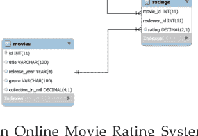

**图1.** 在线电影评分系统的模式图。

此数据库中的表相互关联，`movies`和`reviewers`将具有多对多关系，因为一部电影可以被多个评论者评论，而一个评论者可以评论多部电影。`ratings`表将`movies`表与`reviewers`表连接起来。

### 9.3.2 使用CREATE TABLE语句创建表

现在，要在MySQL中创建一个新表，你需要使用`CREATE TABLE`语句。以下MySQL查询将为你的`online_movie_rating`数据库创建`movies`表：

```
CREATE TABLE movies(
    id INT AUTO_INCREMENT PRIMARY KEY,
    title VARCHAR(100),
    release_year YEAR(4),
    genre VARCHAR(100),
    collection_in_mil INT
);
```

如果你之前看过SQL语句，那么上述查询的大部分内容可能都能理解。但MySQL语法中有一些你应该注意的差异。

> MySQL提供了多种数据类型供你选择，包括`YEAR`、`INT`、`BIGINT`等。此外，当需要在插入新记录时自动递增列值时，MySQL使用`AUTO_INCREMENT`关键字。

要创建一个新表，你需要将此查询传递给`cursor.execute()`，该方法接受一个MySQL查询并在已连接的MySQL数据库上执行该查询：

```
create_movies_table_query = """
CREATE TABLE movies(
    id INT AUTO_INCREMENT PRIMARY KEY,
    title VARCHAR(100),
    release_year YEAR(4),
    genre VARCHAR(100),
    collection_in_mil INT
)
"""

with connection.cursor() as cursor:
    cursor.execute(create_movies_table_query)
    connection.commit()
```

现在你的数据库中有了`movies`表。你将`create_movies_table_query`传递给`cursor.execute()`，它执行了所需的执行操作。

在MySQL中，事务中提到的修改只有在最后使用`COMMIT`命令时才会发生。请始终在每个事务后调用此方法，以在实际表中执行更改。

就像处理`movies`表一样，执行以下脚本来创建`reviewers`表：

```
create_reviewers_table_query = """
CREATE TABLE reviewers (
    id INT AUTO_INCREMENT PRIMARY KEY,
    first_name VARCHAR(100),
    last_name VARCHAR(100)
)
"""

with connection.cursor() as cursor:
    cursor.execute(create_reviewers_table_query)
    connection.commit()
```

> `connection`变量指的是你连接到数据库时返回的MySQL连接对象。另外，请注意代码末尾的`connection.commit()`语句。默认情况下，你的MySQL连接器不会自动提交事务。

# 基础计算机编程：Python

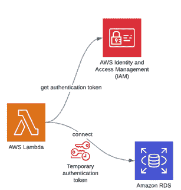

如果需要，你可以添加更多关于评论者的信息，例如他们的电子邮件ID或人口统计信息。但`first_name`和`last_name`目前足以满足你的目的。
最后，你可以使用以下脚本创建`ratings`表：

```
create_ratings_table_query = """
CREATE TABLE ratings (
    movie_id INT,
    reviewer_id INT,
    rating DECIMAL(2,1),
    FOREIGN KEY(movie_id) REFERENCES movies(id),
    FOREIGN KEY(reviewer_id) REFERENCES reviewers(id),
    PRIMARY KEY(movie_id, reviewer_id)
)
"""

with connection.cursor() as cursor:
    cursor.execute(create_ratings_table_query)
    connection.commit()
```

MySQL中对外键关系的实现与标准SQL相比略有不同且有限制。在MySQL中，外键约束中的父表和子表必须使用相同的存储引擎。

存储引擎是数据库管理系统用于执行SQL操作的底层软件组件。在MySQL中，存储引擎有两种不同的类型：

- 事务性存储引擎是事务安全的，允许你使用简单的命令（如`rollback`）来回滚事务。许多流行的MySQL引擎，包括InnoDB和NDB，都属于这一类。
- 非事务性存储引擎依赖于复杂的手动代码来撤销已提交到数据库的语句。MyISAM、MEMORY以及许多其他MySQL引擎都是非事务性的。

InnoDB是默认且最受欢迎的存储引擎。它通过支持外键约束来帮助维护数据完整性。这意味着对外键的任何CRUD操作都会被检查，以确保它不会导致不同表之间的不一致。

另外，请注意`ratings`表使用`movie_id`和`reviewer_id`列（两者都是外键）共同作为主键。此步骤确保评论者不能对同一部电影评分两次。

你可以选择为多次执行重用同一个游标。在这种情况下，所有执行将变成一个原子事务，而不是多个独立的事务。例如，你可以用一个游标执行所有`CREATE TABLE`语句，然后只提交一次事务：

```
with connection.cursor() as cursor:
    cursor.execute(create_movies_table_query)
    cursor.execute(create_reviewers_table_query)
    cursor.execute(create_ratings_table_query)
    connection.commit()
```

上述代码将首先执行所有三个`CREATE`语句。然后它将向MySQL服务器发送一个`COMMIT`命令，提交你的事务。你也可以使用`.rollback()`向MySQL服务器发送`ROLLBACK`命令，并从事务中移除所有数据更改。

### 9.3.3 使用DESCRIBE语句显示表模式

现在，你已经创建了所有三个表，可以使用以下SQL语句查看它们的模式：

```
DESCRIBE <table_name>;
```

要从游标对象获取一些结果，你需要使用`cursor.fetchall()`。此方法从最后执行的语句中获取所有行。假设你已经在`connection`变量中拥有`MySQLConnection`对象，你可以打印出`cursor.fetchall()`获取的所有结果：

```
>>>
>>> show_table_query = "DESCRIBE movies"
>>> with connection.cursor() as cursor:
...     cursor.execute(show_table_query)
...     # 从最后执行的查询中获取行
...     result = cursor.fetchall()
...     for row in result:
...         print(row)
...
('id', 'int(11)', 'NO', 'PRI', None, 'auto_increment')
('title', 'varchar(100)', 'YES', '', None, '')
('release_year', 'year(4)', 'YES', '', None, '')
('genre', 'varchar(100)', 'YES', '', None, '')
('collection_in_mil', 'int(11)', 'YES', '', None, '')
```

一旦你执行上述代码，你应该会收到一个包含`movies`表中所有列信息的表格。对于每一列，你将收到诸如列的数据类型、该列是否为主键等详细信息。

### 9.3.4 使用ALTER语句修改表模式

在`movies`表中，有一个名为`collection_in_mil`的列，它包含电影的票房收入（以百万美元计）。你可以编写以下MySQL语句将`collection_in_mil`属性的数据类型从`INT`修改为`DECIMAL`：

```
ALTER TABLE movies MODIFY COLUMN collection_in_mil DECIMAL(4,1);
```

`DECIMAL(4,1)` 表示一个最多可包含 4 位数字的十进制数，其中 1 位是小数，例如 120.1、3.4、38.0 等。执行 `ALTER TABLE` 语句后，你可以使用 `DESCRIBE` 来显示更新后的表结构：

```python
>>> alter_table_query = """
... ALTER TABLE movies
... MODIFY COLUMN collection_in_mil DECIMAL(4,1)
... """
>>> show_table_query = "DESCRIBE movies"
>>> with connection.cursor() as cursor:
...     cursor.execute(alter_table_query)
...     cursor.execute(show_table_query)
...     # Fetch rows from last executed query
...     result = cursor.fetchall()
...     print("Movie Table Schema after alteration:")
...     for row in result:
...         print(row)
...
```

修改后的电影表结构

```
('id', 'int(11)', 'NO', 'PRI', None, 'auto_increment')
('title', 'varchar(100)', 'YES', '', None, '')
('release_year', 'year(4)', 'YES', '', None, '')
('genre', 'varchar(100)', 'YES', '', None, '')
('collection_in_mil', 'decimal(4,1)', 'YES', '', None, '')
```

如输出所示，`collection_in_mil` 属性现在是 `DECIMAL(4,1)` 类型。同时请注意，在上面的代码中，你调用了两次 `cursor.execute()`。但 `cursor.fetchall()` 只获取最后一次执行的查询（即 `show_table_query`）的结果行。

## 9.3.5 使用 DROP 语句删除表

要删除一个表，你需要在 MySQL 中执行 `DROP TABLE` 语句。删除表是一个*不可逆*的过程。如果你执行下面的代码，那么你需要再次调用 `CREATE TABLE` 查询才能在后续章节中使用 `ratings` 表。

要删除 `ratings` 表，将 `drop_table_query` 发送给 `cursor.execute()`：

```python
drop_table_query = "DROP TABLE ratings"

with connection.cursor() as cursor:
    cursor.execute(drop_table_query)
```

如果你执行上述代码，你将成功删除 `ratings` 表。

## 9.4 在表中插入记录

之前你在数据库中创建了三个表：`movies`、`reviewers` 和 `ratings`。现在你需要用数据填充这些表。本节将介绍在 MySQL Connector for Python 中插入记录的两种不同方法。

第一种方法 `.execute()` 在记录数量较少且记录可以硬编码时效果很好。第二种方法 `.executemany()` 更为流行，更适合实际场景。

### 9.4.1 使用 .execute()

第一种方法使用你至今一直在用的 `cursor.execute()` 方法。你将 `INSERT INTO` 查询写在一个字符串中，并将其传递给 `cursor.execute()`。你可以使用此方法将数据插入到 `movies` 表中。

作为参考，`movies` 表有五个属性：

- id
- title
- release_year
- genre
- collection_in_mil

你不需要为 `id` 添加数据，因为 `AUTO_INCREMENT` 会自动为你计算 `id`。以下脚本将记录插入到 `movies` 表中：

```python
insert_movies_query = """
INSERT INTO movies (title, release_year, genre, collection_in_mil)
VALUES
("Forrest Gump", 1994, "Drama", 330.2),
("3 Idiots", 2009, "Drama", 2.4),
("Eternal Sunshine of the Spotless Mind", 2004, "Drama", 34.5),
("Good Will Hunting", 1997, "Drama", 138.1),
("Skyfall", 2012, "Action", 304.6),
("Gladiator", 2000, "Action", 188.7),
("Black", 2005, "Drama", 3.0),
("Titanic", 1997, "Romance", 659.2),
("The Shawshank Redemption", 1994, "Drama", 28.4),
("Udaan", 2010, "Drama", 1.5),
("Home Alone", 1990, "Comedy", 286.9),
("Casablanca", 1942, "Romance", 1.0),
("Avengers: Endgame", 2019, "Action", 858.8),
("Night of the Living Dead", 1968, "Horror", 2.5),
("The Godfather", 1972, "Crime", 135.6),
("Haider", 2014, "Action", 4.2),
("Inception", 2010, "Adventure", 293.7),
("Evil", 2003, "Horror", 1.3),
("Toy Story 4", 2019, "Animation", 434.9),
("Air Force One", 1997, "Drama", 138.1),
("The Dark Knight", 2008, "Action", 535.4),
("Bhaag Milkha Bhaag", 2013, "Sport", 4.1),
("The Lion King", 1994, "Animation", 423.6),
("Pulp Fiction", 1994, "Crime", 108.8),
("Kai Po Che", 2013, "Sport", 6.0),
("Beasts of No Nation", 2015, "War", 1.4),
("Andadhun", 2018, "Thriller", 2.9),
("The Silence of the Lambs", 1991, "Crime", 68.2),
("Deadpool", 2016, "Action", 363.6),
("Drishyam", 2015, "Mystery", 3.0)
"""

with connection.cursor() as cursor:
    cursor.execute(insert_movies_query)
    connection.commit()
```

`movies` 表现在已加载了三十条记录。代码在最后调用了 `connection.commit()`。在对表执行任何修改后调用 `.commit()` 至关重要。

### 9.4.2 使用 .executemany()

前面的方法在记录数量相当少且你可以将这些记录直接写入代码时更为合适。但这种情况很少见。你通常会将这些数据存储在其他文件中，或者数据将由不同的脚本生成，并且需要添加到 MySQL 数据库中。

这就是 `.executemany()` 派上用场的地方。它接受两个参数：

- 一个包含需要插入记录的占位符的**查询**
- 一个包含你希望插入的所有记录的**列表**

以下示例为 `reviewers` 表插入记录：

```python
insert_reviewers_query = """
INSERT INTO reviewers
(first_name, last_name)
VALUES ( %s, %s )
"""
reviewers_records = [
    ("Chaitanya", "Baweja"),
    ("Mary", "Cooper"),
    ("John", "Wayne"),
    ("Thomas", "Stoneman"),
    ("Penny", "Hofstadter"),
    ("Mitchell", "Marsh"),
    ("Wyatt", "Skaggs"),
    ("Andre", "Veiga"),
    ("Sheldon", "Cooper"),
    ("Kimbra", "Masters"),
    ("Kat", "Dennings"),
    ("Bruce", "Wayne"),
    ("Domingo", "Cortes"),
    ("Rajesh", "Koothrappali"),
    ("Ben", "Glocker"),
    ("Mahinder", "Dhoni"),
    ("Akbar", "Khan"),
    ("Howard", "Wolowitz"),
    ("Pinkie", "Petit"),
    ("Gurkaran", "Singh"),
    ("Amy", "Farah Fowler"),
    ("Marlon", "Crafford"),
]

with connection.cursor() as cursor:
    cursor.executemany(insert_reviewers_query, reviewers_records)
    connection.commit()
```

在上面的脚本中，你将查询和记录列表作为参数传递给 `.executemany()`。这些记录可能是从文件或用户那里获取并存储在 `reviewers_records` 列表中的。

代码使用 `%s` 作为 `insert_reviewers_query` 中需要插入的两个字符串的占位符。占位符充当格式说明符，帮助在字符串中为变量预留一个位置。然后在执行期间将指定的变量添加到此位置。

你可以类似地使用 `.executemany()` 在 `ratings` 表中插入记录：

```python
insert_ratings_query = """
INSERT INTO ratings
(rating, movie_id, reviewer_id)
VALUES ( %s, %s, %s)
"""

ratings_records = [
    (6.4, 17, 5), (5.6, 19, 1), (6.3, 22, 14), (5.1, 21, 17),
    (5.0, 5, 5), (6.5, 21, 5), (8.5, 30, 13), (9.7, 6, 4),
    (8.5, 24, 12), (9.9, 14, 9), (8.7, 26, 14), (9.9, 6, 10),
    (5.1, 30, 6), (5.4, 18, 16), (6.2, 6, 20), (7.3, 21, 19),
    (8.1, 17, 18), (5.0, 7, 2), (9.8, 23, 3), (8.0, 22, 9),
    (8.5, 11, 13), (5.0, 5, 11), (5.7, 8, 2), (7.6, 25, 19),
    (5.2, 18, 15), (9.7, 13, 3), (5.8, 18, 8), (5.8, 30, 15),
    (8.4, 21, 18), (6.2, 23, 16), (7.0, 10, 18), (9.5, 30, 20),
    (8.9, 3, 19), (6.4, 12, 2), (7.8, 12, 22), (9.9, 15, 13),
    (7.5, 20, 17), (9.0, 25, 6), (8.5, 23, 2), (5.3, 30, 17),
    (6.4, 5, 10), (8.1, 5, 21), (5.7, 22, 1), (6.3, 28, 4),
    (9.8, 13, 1)
]

with connection.cursor() as cursor:
    cursor.executemany(insert_ratings_query, ratings_records)
    connection.commit()
```

所有三个表现在都已填充了数据。你现在拥有一个功能齐全的在线电影评分数据库。下一步是了解如何与此数据库进行交互。

### 9.4.3 从数据库中读取记录

到目前为止，你一直在构建你的数据库。现在是时候对它执行一些查询，并从这个数据集中发现一些有趣的属性了。在本节中，你将学习如何使用 `SELECT` 语句从数据库表中读取记录。

#### 使用 SELECT 语句读取记录

要检索记录，你需要将 `SELECT` 查询发送给 `cursor.execute()`。然后你使用 `cursor.fetchall()` 以行或记录列表的形式提取检索到的表。

尝试编写一个 MySQL 查询来从 `movies` 表中选择所有记录，并将其发送给 `.execute()`：

```python
>>> select_movies_query = "SELECT * FROM movies LIMIT 5"
>>> with connection.cursor() as cursor:
...     cursor.execute(select_movies_query)
...     result = cursor.fetchall()
...     for row in result:
...         print(row)
...
```

# 基础计算机编程：Python

(1, '阿甘正传', 1994, '剧情', Decimal('330.2'))
(2, '三傻大闹宝莱坞', 2009, '剧情', Decimal('2.4'))
(3, '暖暖内含光', 2004, '剧情', Decimal('34.5'))
(4, '心灵捕手', 1997, '剧情', Decimal('138.1'))
(5, '007：大破天幕杀机', 2012, '动作', Decimal('304.6'))

`result` 变量保存了使用 `.fetchall()` 返回的记录。它是一个元组列表，代表表中的单条记录。

在上面的查询中，你使用了 `LIMIT` 子句来约束从 `SELECT` 语句中接收的行数。开发人员在处理大量数据时，经常使用 `LIMIT` 来实现**分页**。

在 MySQL 中，`LIMIT` 子句接受一个或两个非负数字参数。当使用一个参数时，你指定要返回的最大行数。由于你的查询包含 `LIMIT 5`，因此只获取了前 5 条记录。当使用两个参数时，你还可以指定要返回的第一行的偏移量：

```sql
SELECT * FROM movies LIMIT 2,5;
```

第一个参数指定偏移量为 2，第二个参数将返回的行数约束为 5。上面的查询将返回第 3 到第 7 行。

你也可以查询指定的列：

```python
>>> select_movies_query = "SELECT title, release_year FROM movies LIMIT 5"
>>> with connection.cursor() as cursor:
...     cursor.execute(select_movies_query)
...     for row in cursor.fetchall():
...         print(row)
```

> **关键词**
> **分页**是将文档分割成离散页面的过程，可以是电子页面或印刷页面。

('阿甘正传', 1994)
('三傻大闹宝莱坞', 2009)
('暖暖内含光', 2004)
('心灵捕手', 1997)
('007：大破天幕杀机', 2012)

现在，代码只输出两个指定列的值：`title` 和 `release_year`。

## 使用 WHERE 子句过滤结果

你可以使用 `WHERE` 子句按特定条件过滤表记录。例如，要检索所有票房收入超过 3 亿美元的电影，你可以运行以下查询：

```sql
SELECT title, collection_in_mil
FROM movies
WHERE collection_in_mil > 300;
```

你也可以在上一个查询中使用 `ORDER BY` 子句，将结果从最高到最低排序：

```python
>>> select_movies_query = """
... SELECT title, collection_in_mil
... FROM movies
... WHERE collection_in_mil > 300
... ORDER BY collection_in_mil DESC
... """
>>> with connection.cursor() as cursor:
...     cursor.execute(select_movies_query)
...     for movie in cursor.fetchall():
...         print(movie)
```

('复仇者联盟4：终局之战', Decimal('858.8'))
('泰坦尼克号', Decimal('659.2'))
('蝙蝠侠：黑暗骑士', Decimal('535.4'))
('玩具总动员4', Decimal('434.9'))
('狮子王', Decimal('423.6'))
('死侍', Decimal('363.6'))
('阿甘正传', Decimal('330.2'))
('007：大破天幕杀机', Decimal('304.6'))

MySQL 提供了丰富的字符串格式化操作，例如用于连接字符串的 `CONCAT`。通常，网站会显示电影标题及其发行年份以避免混淆。要检索票房最高的五部电影的标题，并将其与发行年份连接起来，你可以编写以下查询：

```python
>>> select_movies_query = """
... SELECT CONCAT(title, " (", release_year, ")"),
...     collection_in_mil
... FROM movies
... ORDER BY collection_in_mil DESC
... LIMIT 5
... """
>>> with connection.cursor() as cursor:
...     cursor.execute(select_movies_query)
...     for movie in cursor.fetchall():
...         print(movie)
```

('复仇者联盟4：终局之战 (2019)', Decimal('858.8'))
('泰坦尼克号 (1997)', Decimal('659.2'))
('蝙蝠侠：黑暗骑士 (2008)', Decimal('535.4'))
('玩具总动员4 (2019)', Decimal('434.9'))
('狮子王 (1994)', Decimal('423.6'))

如果你不想使用 `LIMIT` 子句，并且不需要获取所有记录，那么游标对象也有 `.fetchone()` 和 `.fetchmany()` 方法：

- `.fetchone()` 检索结果的下一行（作为元组），如果没有更多行可用，则返回 `None`。
- `.fetchmany()` 从结果中检索下一组行，作为元组列表。它有一个 `size` 参数，默认为 1，你可以用它来指定需要获取的行数。如果没有更多行可用，则该方法返回一个空列表。

尝试再次检索票房最高的五部电影的标题，并将其与发行年份连接起来，但这次使用 `.fetchmany()`：

```python
>>> select_movies_query = """
... SELECT CONCAT(title, " (", release_year, ")"),
...     collection_in_mil
... FROM movies
... ORDER BY collection_in_mil DESC
... """
>>> with connection.cursor() as cursor:
...     cursor.execute(select_movies_query)
...     for movie in cursor.fetchmany(size=5):
...         print(movie)
...     cursor.fetchall()
```

('复仇者联盟4：终局之战 (2019)', Decimal('858.8'))
('泰坦尼克号 (1997)', Decimal('659.2'))
('蝙蝠侠：黑暗骑士 (2008)', Decimal('535.4'))
('玩具总动员4 (2019)', Decimal('434.9'))
('狮子王 (1994)', Decimal('423.6'))

使用 `.fetchmany()` 的输出与使用 `LIMIT` 子句时类似。你可能注意到了末尾额外的 `cursor.fetchall()` 调用。这样做是为了清理所有未被 `.fetchmany()` 读取的剩余结果。

在同一个连接上执行任何其他语句之前，有必要清理所有未读取的结果。否则，将引发 `InternalError: Unread result found` 异常。

## 9.4.4 使用 JOIN 语句处理多个表

如果你觉得上一节的查询相当简单，别担心。你可以使用上一节的相同方法，使你的 `SELECT` 查询变得尽可能复杂。

让我们看一些稍微复杂一点的 `JOIN` 查询。如果你想找出数据库中评分最高的五部电影的名称，那么你可以运行以下查询：

```python
>>> select_movies_query = """
... SELECT title, AVG(rating) as average_rating
... FROM ratings
... INNER JOIN movies
...     ON movies.id = ratings.movie_id
... GROUP BY movie_id
... ORDER BY average_rating DESC
... LIMIT 5
... """
>>> with connection.cursor() as cursor:
...     cursor.execute(select_movies_query)
...     for movie in cursor.fetchall():
...         print(movie)
```

('活死人之夜', Decimal('9.90000'))
('教父', Decimal('9.90000'))
('复仇者联盟4：终局之战', Decimal('9.75000'))
('暖暖内含光', Decimal('8.90000'))
('无境之兽', Decimal('8.70000'))

如上所示，《活死人之夜》和《教父》在你的 `online_movie_rating` 数据库中并列为评分最高的电影。

要找出给出最多评分的评论者姓名，请编写以下查询：

```python
>>> select_movies_query = """
... SELECT CONCAT(first_name, " ", last_name), COUNT(*) as num
... FROM reviewers
... INNER JOIN ratings
...     ON reviewers.id = ratings.reviewer_id
... GROUP BY reviewer_id
... ORDER BY num DESC
... LIMIT 1
... """
>>> with connection.cursor() as cursor:
...     cursor.execute(select_movies_query)
...     for movie in cursor.fetchall():
...         print(movie)
```

('Mary Cooper', 4)

Mary Cooper 是这个数据库中最频繁的评论者。如上所示，无论查询多么复杂，因为它最终是由 MySQL 服务器处理的。你执行查询的过程将始终保持不变：将查询传递给 `cursor.execute()`，并使用 `.fetchall()` 获取结果。

## 9.5 从数据库中更新和删除记录

在本节中，你将从数据库中更新和删除记录。这两种操作都可以对表中的单条记录或多条记录执行。你将使用 `WHERE` 子句来选择需要修改的行。

### 9.5.1 UPDATE 命令

你数据库中的一位评论者，Amy Farah Fowler，现在与 Sheldon Cooper 结婚了。她的姓氏现在改为 Cooper，因此你需要相应地更新你的数据库。对于更新记录，MySQL 使用 `UPDATE` 语句：

```python
update_query = """
UPDATE
    reviewers
SET
    last_name = "Cooper"
WHERE
    first_name = "Amy"
"""
with connection.cursor() as cursor:
```

## 9.5.2 DELETE 命令

删除记录的工作方式与更新记录非常相似。你使用 DELETE 语句来移除选定的记录。

**注意：** 删除是一个*不可逆*的过程。如果你不使用 WHERE 子句，那么指定表中的所有记录都将被删除。你需要再次运行 INSERT INTO 查询才能恢复被删除的记录。

建议你首先运行一个带有相同过滤条件的 SELECT 查询，以确保你正在删除正确的记录。例如，要移除所有由 reviewer_id = 2 给出的评分，你应该首先运行相应的 SELECT 查询：

```python
cursor.execute(update_query)

connection.commit()
```

该代码将更新查询传递给 cursor.execute()，而 .commit() 将所需的更改应用到 reviewers 表。

**注意：** 在 UPDATE 查询中，WHERE 子句有助于指定需要更新的记录。如果你不使用 WHERE，那么所有记录都将被更新！

假设你需要提供一个选项，允许评论者修改评分。评论者将提供三个值：movie_id、reviewer_id 和新的评分。代码将在执行指定的修改后显示该记录。

假设 movie_id = 18，reviewer_id = 15，新的评分 = 5.0，你可以使用以下 MySQL 查询来执行所需的修改：

```sql
UPDATE
    ratings
SET
    rating = 5.0
WHERE
    movie_id = 18 AND reviewer_id = 15;
```

```sql
SELECT *
FROM ratings
WHERE
    movie_id = 18 AND reviewer_id = 15;
```

上述查询首先更新评分，然后显示它。你可以创建一个完整的 **Python 脚本**，该脚本与数据库建立连接并允许评论者修改评分：

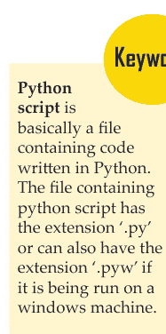

# 基础计算机编程：Python

```python
from getpass import getpass
from mysql.connector import connect, Error

movie_id = input("Enter movie id: ")
reviewer_id = input("Enter reviewer id: ")
new_rating = input("Enter new rating: ")
update_query = """
UPDATE
    ratings
SET
    rating = "%s"
WHERE
    movie_id = "%s" AND reviewer_id = "%s";

SELECT *
FROM ratings
WHERE
    movie_id = "%s" AND reviewer_id = "%s"
""" % (
    new_rating,
    movie_id,
    reviewer_id,
    movie_id,
    reviewer_id,
)

try:
    with connect(
        host="localhost",
        user=input("Enter username: "),
        password=getpass("Enter password: "),
        database="online_movie_rating",
    ) as connection:
        with connection.cursor() as cursor:
            for result in cursor.execute(update_query, multi=True):
                if result.with_rows:
                    print(result.fetchall())
            connection.commit()
except Error as e:
    print(e)
```

将此代码保存到名为 modify_ratings.py 的文件中。上述代码使用 %s 占位符将接收到的输入插入到 update_query 字符串中。在本教程中，这是第一次在单个字符串中包含多个查询。要将多个查询传递给单个 cursor.execute()，你需要将该方法的 multi 参数设置为 True。

如果 multi 为 True，则 cursor.execute() 返回一个迭代器。迭代器中的每个项目对应于一个游标对象，该对象执行在查询中传递的语句。上述代码在此迭代器上运行一个 for 循环，然后在每个游标对象上调用 .fetchall()。

**注意：** 在所有游标对象上运行 .fetchall() 很重要。要在同一连接上执行新的语句，你必须确保没有来自先前执行的未读结果。如果有未读结果，那么你将收到一个异常。

如果在某个操作上没有获取到结果集，那么 .fetchall() 会引发异常。为了避免此错误，在上面的代码中你使用了 cursor.with_rows 属性，该属性指示最近执行的操作是否产生了行。

# 基础计算机编程：Python

虽然这段代码应该能解决你的问题，但 WHERE 子句在其当前状态下是网络黑客的主要攻击目标。它容易受到所谓的 SQL 注入攻击，这可能允许恶意行为者破坏或滥用你的数据库。

**警告：** 不要在你的数据库上尝试以下输入！它们会破坏你的表，你需要重新创建它。

例如，如果用户发送 movie_id=18、reviewer_id=15 和新的评分=5.0 作为输入，那么输出如下所示：

```
$ python modify_ratings.py

Enter movie id: 18

Enter reviewer id: 15

Enter new rating: 5.0

Enter username: <user_name>

Enter password:

[(18, 15, Decimal('5.0'))]
```

movie_id=18 和 reviewer_id=15 的评分已更改为 5.0。但如果你是一个黑客，那么你可能会在输入中发送一个隐藏的命令：

```
$ python modify_ratings.py

Enter movie id: 18

Enter reviewer_id: 15"; UPDATE reviewers SET last_name = "A

Enter new rating: 5.0

Enter username: <user_name>

Enter password:

[(18, 15, Decimal('5.0'))]
```

同样，输出显示指定的评分已更改为 5.0。发生了什么变化？

黑客在输入 reviewer_id 时偷偷插入了一个更新查询。更新查询 `update reviewers set last_name = "A` 将 reviewers 表中所有记录的 last_name 更改为 "A"。如果你打印出 reviewers 表，你可以看到这个变化：

```python
>>> select_query = """
... SELECT first_name, last_name
... FROM reviewers
... """
>>> with connection.cursor() as cursor:
...     cursor.execute(select_query)
...     for reviewer in cursor.fetchall():
...         print(reviewer)
...
('Chaitanya', 'A')
('Mary', 'A')
('John', 'A')
('Thomas', 'A')
('Penny', 'A')
('Mitchell', 'A')
('Wyatt', 'A')
('Andre', 'A')
('Sheldon', 'A')
('Kimbra', 'A')
('Kat', 'A')
('Bruce', 'A')
('Domingo', 'A')
('Rajesh', 'A')
('Ben', 'A')
('Mahinder', 'A')
('Akbar', 'A')
('Howard', 'A')
('Pinkie', 'A')
('Gurkaran', 'A')
('Amy', 'A')
('Marlon', 'A')
```

上述代码显示了 reviewers 表中所有记录的 first_name 和 last_name。SQL 注入攻击通过将所有记录的 last_name 更改为 "A" 来破坏此表。

有一个快速的解决方法可以防止此类攻击。不要将用户提供的查询值直接添加到你的查询字符串中。相反，更新 modify_ratings.py 脚本，将这些查询值作为参数发送给 .execute()：

```python
from getpass import getpass
from mysql.connector import connect, Error

movie_id = input("Enter movie id: ")
reviewer_id = input("Enter reviewer id: ")
new_rating = input("Enter new rating: ")
update_query = """
UPDATE
    ratings
SET
    rating = %s
WHERE
    movie_id = %s AND reviewer_id = %s;
"""

SELECT *
FROM ratings
WHERE
    movie_id = %s AND reviewer_id = %s
"""
val_tuple = (
    new_rating,
    movie_id,
    reviewer_id,
    movie_id,
    reviewer_id,
)

try:
    with connect(
        host="localhost",
        user=input("Enter username: "),
        password=getpass("Enter password: "),
        database="online_movie_rating",
    ) as connection:
        with connection.cursor() as cursor:
            for result in cursor.execute(update_query, val_tuple, multi=True):
                if result.with_rows:
                    print(result.fetchall())
            connection.commit()
except Error as e:
    print(e)
```

注意，%s 占位符不再包含在字符串引号中。传递给占位符的字符串可能包含一些特殊字符。如果需要，底层库可以正确地转义这些字符。

cursor.execute() 确保作为参数接收的元组中的值具有所需的数据类型。如果用户试图偷偷插入一些有问题的字符，那么代码将引发异常：

```
$ python modify_ratings.py

Enter movie id: 18

Enter reviewer_id: 15"; UPDATE reviewers SET last_name = "A

Enter new rating: 5.0

Enter username: <user_name>

Enter password:

1292 (22007): Truncated incorrect DOUBLE value: '15";

UPDATE reviewers SET last_name = "A'
```

如果 cursor.execute() 在用户输入中发现任何不需要的字符，它将引发异常。当你在查询中包含用户输入时，你应该使用这种方法。还有其他方法可以防止 SQL 注入攻击。

## 9.5.3 连接 Python 和 MySQL 的其他方式

在本教程中，你了解了 MySQL Connector/Python，这是官方推荐的从 Python 应用程序与 MySQL 数据库交互的方式。还有另外两种流行的连接器：

- mysqlclient 是一个与官方连接器紧密竞争的库，并且正在积极更新新功能。由于其核心是用 C 语言编写的，因此它比纯 Python 的官方连接器性能更好。一个很大的缺点是它相当难以设置和安装，尤其是在 Windows 上。
- MySQLdb 是一个遗留软件，仍在商业应用中使用。它是用 C 语言编写的，比 MySQL Connector/ Python 更快，但仅适用于 Python 2。

这些连接器充当你的程序和 MySQL 数据库之间的接口，你通过它们发送 SQL 查询。但许多开发者更喜欢使用面向对象的范式而不是 SQL 查询来操作数据。

**对象关系映射（ORM）** 是一种技术，允许你直接使用面向对象的语言查询和操作数据库中的数据。ORM 库封装了操作数据所需的代码，从而消除了使用哪怕一点点 SQL 的需要。

以下是用于基于 SQL 数据库的最流行的 Python ORM：

- SQLAlchemy 是一个 ORM，它促进了 Python 和其他 SQL 数据库之间的通信。你可以为不同的数据库（如 MySQL、PostgreSQL、SQLite 等）创建不同的引擎。SQLAlchemy 通常与 pandas 库一起使用，以提供完整的数据处理功能。
- peewee 是一个轻量级且快速的 ORM，设置起来很快。当你的数据库交互仅限于提取少量记录时，这非常有用。例如，如果你需要将选定的记录从 MySQL 数据库复制到 CSV 文件中，那么 peewee 可能是你的最佳选择。
- Django ORM 是 Django 最强大的功能之一，随 Django Web 框架一起提供。它可以与多种数据库交互，例如 SQLite、PostgreSQL 和 MySQL。许多基于 Django 的应用程序使用 Django ORM 进行数据建模和基本查询，但对于更复杂的需求，通常会切换到 SQLAlchemy。

计算机科学中的对象关系映射是一种编程技术，用于使用面向对象编程语言在不兼容的类型系统之间转换数据。

# 榜样人物


## 大卫·阿克斯马克：MySQL AB 的创始人之一，也是免费数据库服务器 MySQL 的开发者。

# 传记

大卫·阿克斯马克是 MySQL AB 的创始人之一，也是免费数据库服务器 MySQL 的开发者。他从 MySQL 开发之初就与联合创始人迈克尔·维德纽斯一起参与其中。他于 1980 年至 1984 年间在乌普萨拉大学学习。

向下滚动，找到你需要了解的关于大卫·阿克斯马克的一切，最新的关系更新、家庭情况以及他的资历。大卫·阿克斯马克的估计净资产、年龄、传记、职业、社交媒体账户（即 Instagram、Facebook、Twitter）、家庭、维基。此外，了解有关大卫·阿克斯马克当前净资产以及大卫·阿克斯马克的收入、价值、工资、财产和收入的详细信息。

大卫·阿克斯马克，更广为人知的名字是大卫·阿克斯马克，是一位受欢迎的工程师。他于 1962 年 5 月 28 日出生于瑞典。

大卫的估计净资产、月薪和年薪、主要收入来源、汽车、生活方式等信息已在下方更新。

大卫带来了 300 万至 500 万美元的净资产，大卫的大部分收入来自他的 Yeezy 运动鞋。虽然多年来他夸大了自己业务的规模，但他从职业中赚取的钱足以跻身有史以来最大的名人现金支出之列。他的基本收入来源主要来自成为一名成功的工程师。

# 总结

- 数据库程序是企业信息系统的核心，提供文件创建、数据输入、更新、查询和报告功能。
- 数据库是组织化信息的集合，可以轻松使用、管理、更新，并根据其组织方式进行分类。
- Python DB-API 独立于任何数据库引擎，这使你能够编写 Python 脚本来访问任何数据库引擎。
- 连接对象创建与数据库的连接，这些连接进一步用于不同的事务。这些连接对象也用作数据库会话的代表。
- 游标是 SQL 的强大功能之一。这些对象负责向数据库服务器提交各种 SQL 语句。
- 在 Python DB-API 模块中，异常处理非常容易。我们可以在程序中放置警告和错误处理消息。
- Python 和 MySQL 是开发数据库应用程序的良好组合。在 Linux 上启动 MySQL 服务后，你需要获取 MySQLdb，一个用于 MySQL 的 Python DB-API，以执行数据库操作。
- Python 数据库 API（应用程序编程接口）是标准 Python 的数据库接口。大多数 Python 数据库接口都遵循此标准。
- MySQL 是当今市场上最流行的数据库管理系统（DBMS）之一。在今年的 DB-Engines 排名中，它仅次于 Oracle DBMS，排名第二。由于大多数软件应用程序需要以某种形式与数据交互，因此像 Python 这样的编程语言提供了存储和访问这些数据源的工具。
- SQL Server 也是一个非常流行的 DBMS，以其可靠性、效率和安全性而闻名。它受到公司，特别是银行领域的青睐，这些公司经常处理大量流量工作负载。

# 知识检查

1. 这段代码的输出是什么？
   a,b=1,0
   a. a=a^b
   b. b=a^b
   c. a=a^b
   d. print(a)

2. 这个表达式的值是多少？
   2**2**3**1
   a. 12
   b. 64
   c. 128
   d. 256
   e. 此代码将引发异常

3. 以下哪项通常用于执行诸如创建关系结构、删除关系等任务？
   a. DML（数据操作语言）
   b. 查询
   c. 关系模式
   d. DDL（数据定义语言）

4. 以下哪项提供了从数据库查询信息、向数据库插入元组、从数据库删除元组以及修改数据库中元组的能力？
   a. DML（数据操作语言）
   b. DDL（数据定义语言）
   c. 查询
   d. 关系模式

5. 以下给定的语句中，哪一个可能包含错误？
   a. select * from emp where empid = 10003;
   b. select empid from emp where empid = 10006;
   c. select empid from emp;
   d. select empid where empid = 1009 and Lastname = 'GELLER';

6. 一对多关系是什么意思？
    a. 一个班级可能有许多老师
    b. 一个老师可以有多个班级
    c. 多个班级可能有多个老师
    d. 多个老师可能有多个班级

7. 数据库管理系统是 ________ 软件的一种类型。
    a. 它是系统软件的一种类型
    b. 它是应用软件的一种类型
    c. 它是通用软件的一种类型
    d. A 和 C 都是

8. 术语“FAT”代表____
    a. 文件分配树
    b. 文件分配表
    c. 文件分配图
    d. 以上所有

# 复习题

1. 什么是游标对象？
2. 如何在 Python MySQL 中创建数据库？
3. 如何安装 MySQL 服务器和 MySQL connector/python？
4. 访问并建立与 MySQL 服务器的连接。
5. 如何使用 alter 语句修改表结构？

# 检查你的结果

1. (a)          2. (d)          3. (d)          4. (a)
5. (d)          6. (b)          7. (a)          8. (b)

## 参考文献

1.  Abraham Silberschatz, Henry F. Korth and S. Sudarshan, 《数据库系统概念》, 麦格劳-希尔教育（亚洲）出版社, 第五版, 2006.
2.  C. J. Date, A. Kannan and S. Swamynathan, 《数据库系统导论》, 培生教育集团, 第八版, 2009.
3.  Patrick O’Neil and Elizabeth O’Neil, 《数据库原理、编程与性能》, 哈考特亚洲有限公司, 第一版, 2001.
4.  Peter Norton, Alex Samuel, David Aitel, Eric Foster-Johnson, Leonard Richardson, Jason Diamond, Aleatha Parker, Michael Roberts, 《Python入门》, 2005.
5.  Peter Rob and Carlos Coronel, 《数据库系统设计、实现与管理》, 汤姆森学习-课程技术出版社, 第七版, 2007.
6.  Shio Kumar Singh, 《数据库系统概念、设计与应用》, 培生教育集团, 第二版, 2011.

## 索引

A

-   登录号 287
-   别名 74
-   匿名函数 45
-   应用程序编程接口 280, 295
-   原子分组 174

B

-   反向引用 187
-   蓝图 136
-   业务信息系统 279, 332

C

-   C 1, 3, 4, 5, 7, 8, 9, 10, 20, 32
-   字符类 185
-   字符 175, 179, 180, 181, 183, 190, 198
-   时间顺序 287
-   CMP（上下文管理协议） 212, 213, 217
-   计算机科学 203
-   条件对象 215
-   连接对象 281, 332

D

-   数据库引擎 281, 332
-   数据库管理系统 280, 295, 305
-   数据库服务器 282, 289, 331, 332
-   数据定义语言（DDL） 280
-   数据操作语言（DML） 280
-   数据查询语句 280
-   数据结构 66, 67, 83
-   数据类型 16, 20, 22, 34
-   判断语句 231, 235
-   默认参数 41

E

-   封装 151, 154
-   异常处理 283, 332
-   执行 203, 208, 225

F

-   文件对象 64
-   文件 64, 83, 86

G

-   通用公共许可证（GPL） 3
-   图形用户界面（GUI） 9

H

-   高级编程语言 230
-   HTTP（超文本传输协议） 204

I

-   图像处理 230
-   索引 242, 259, 262, 266
-   继承 141, 148
-   实例属性 137, 139, 147
-   实例方法 140
-   交集操作 82

J

-   Java 1, 4, 5, 10, 32

K

-   键 64, 65, 66, 67, 73, 85, 93, 94
-   关键字参数 41, 42

L

-   库参考 51
-   字面字符 184
-   循环耗尽 243
-   循环语句 239, 244

M

-   机器学习 230
-   Mac OS 4, 6
-   映射 63
-   匹配函数 176
-   多媒体 230
-   多进程 204, 205
-   可变数据结构 68
-   MySQL 279, 280, 281, 285, 289, 290, 291, 292, 293, 294, 295, 296, 297, 298, 299, 300, 302, 303, 305, 306, 308, 310, 313, 314, 316, 320, 321, 329, 330, 331, 332, 334

N

-   非贪婪重复 187
-   空操作（NOP） 216
-   规范化 280

O

-   面向对象编程语言 230, 275
-   面向对象风格 2
-   open函数 64, 84
-   操作系统 203
-   可选标志 176, 177

P

-   并行编程 202
-   父类 136, 141, 142, 143, 144, 145, 146, 147, 148, 149
-   括号 136, 138, 162
-   模式 174, 175, 176, 177, 178, 180, 183, 192, 194, 195
-   PERL 2
-   占有量词 174
-   编程语言 83, 86
-   编程范式 135
-   Python 1, 2, 3, 4, 5, 6, 7, 8, 9, 10, 11, 12, 13, 14, 15, 16, 17, 18, 19, 20, 21, 24, 25, 26, 27, 28, 31, 32, 34, 35, 63, 64, 65, 73, 76, 77, 78, 80, 83, 86, 87, 173, 174, 175, 179, 180, 181, 185, 187, 188, 190, 191, 192, 193, 195, 196
-   Python代码 51, 290, 297
-   Python数据库接口 289, 332
-   Python目录 7
-   Python实现 204
-   Python解释器 39, 41, 42, 47, 50, 51
-   Python魔法 139
-   Python模块 203
-   Python编程语言 239
-   Python的模块 54

R

-   评级系统 290, 301
-   递归 213, 214, 216
-   正则表达式 173, 174, 175, 176
-   正则表达式 180
-   return语句 39, 40, 46
-   re.UNICODE 175

S

-   搜索函数 177
-   self变量 137
-   集合 63, 64, 75, 79, 82, 83
-   软件原型 229, 275
-   证券交易所 280
-   字符串 67, 73, 75, 76, 84, 85, 86, 87, 88, 94, 174, 175, 176, 177, 178, 179, 180, 181, 183, 184, 187, 188, 190, 193
-   结构化查询语言 280, 291
-   同步 212, 213, 216, 220, 221
-   语法 64, 68, 71, 83, 86

T

-   线程 204, 206, 207, 208, 209, 210, 211, 219, 225
-   TypeError 146

U

-   Unicode属性 174

V

-   变量 7, 16

级别：初级到高级
主题：计算机与信息科学

# 基础计算机编程：Python

第2版

Python是一种解释型、面向对象、具有动态语义的高级编程语言。其高级内置数据结构，结合动态类型和动态绑定，使其非常适用于快速应用程序开发，也可用作脚本语言或胶水语言将现有组件连接在一起。其高级内置数据结构，结合动态类型和动态绑定；使其非常适用于快速应用程序开发，也可用作脚本语言或胶水语言将现有组件连接在一起。近年来，Python已成为世界上最流行的编程语言之一。它被用于从机器学习到构建网站和软件测试等各个领域。开发者和非开发者都可以使用它。

本版共分为九章。这是一本关于如何开始使用Python、为什么应该学习它以及如何学习它的综合指南。这本实践指南将带你逐步了解这门语言，从基本的编程概念开始，包括函数、递归、数据结构和面向对象设计。

BIBLIOTEX 数字图书馆

www.3ge-learning.com
email: info@3ge-learning.com