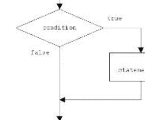
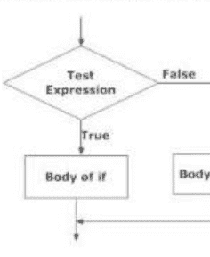
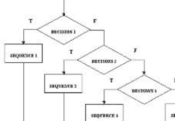
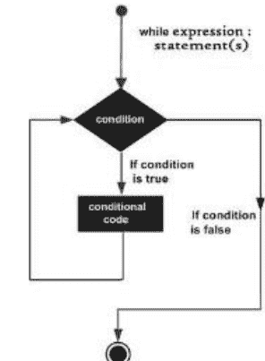

# Sriramkumar R 先生

# Python 编程基础


Reji Thomas 先生
P. Ramkumar 先生

# Python 编程基础

# 10天学会Python

作者：

Sriramkumar R 先生

Reji Thomas 先生

Ramkumar P 先生

版权所有 © 2023 Sriramkumar R 保留所有权利

本书中描绘的人物和事件均为虚构。与任何在世或已故的真实人物的相似之处纯属巧合，并非作者本意。

未经出版商明确书面许可，不得以任何形式或任何方式（电子、机械、影印、录音或其他方式）复制本书任何部分，或将其存储在检索系统中，或进行传播。

# 题记

专注于目标，失败时不要失去希望，战胜你的自卑情结，它会带给你启迪。

# 献词

衷心感谢 R. Indra 女士、R. Ravindran 先生（退休银行职员）、R. Vaishnavi 女士（Robert Bosch）、Arun 先生（助理教授），他们为本电子书的出版奉献了力量并给予了支持。

# 本书献给数百万热爱编程并激励自己的人们

# 引言

Python 是一种高级、通用且易于学习的编程语言，以其简洁性和可读性而闻名。它由 Guido van Rossum 创建，并于 1991 年首次发布。Python 被广泛应用于各种领域，包括 Web 开发、数据分析、科学计算、自动化、人工智能等。

以下是 Python 一些关键方面的简要介绍：

**可读性：** Python 的语法设计清晰易读，使其成为初学者和经验丰富的程序员的绝佳选择。它使用缩进（空白）来定义代码块，这强制执行了整洁一致的格式。

**解释型语言：** Python 是一种解释型语言，这意味着你可以编写并运行代码，而无需单独的编译步骤。这使得开发更快、更灵活。

**动态类型：** Python 使用动态类型，这意味着你不需要显式声明变量的数据类型。类型在运行时确定，使语言更加灵活。

**高级语言：** Python 提供了高级抽象，简化了复杂任务。这可以帮助你更快地编写代码，并减少错误。

**大型标准库：** Python 附带了一个全面的标准库，其中包含用于各种任务的模块，例如处理文件、正则表达式、网络通信等。该库减少了为许多常见任务编写自定义代码的需要。

# 目录

| 序号 | 内容 | 页码 |
|---|---|---|
| 1. | 标题页 | 1 |
| 2. | 版权 | 2 |
| 3. | 题记 | 3 |
| 4. | 献词 | 4 |
| 5. | 引言 | 5 |
| 6. | 第1章 | 6 |
| 7. | 第2章 | 37 |
| 8. | 第3章 | 56 |

# 第一章 - 数据、表达式、语句

Python 解释器和交互模式；值和类型：整数、浮点数、布尔值、字符串和列表；变量、表达式、语句、元组赋值、运算符优先级、注释；模块和函数、函数定义和使用、执行流程、参数和实参；示例程序：交换两个变量的值、循环 n 个变量的值、两点之间的距离。

## 什么是程序？

**程序**是一系列指令，指定了如何执行计算。计算可能是数学方面的，例如求解方程组或寻找多项式的根，但也可能是符号计算，例如在文档中搜索和替换文本，或者是图形处理，例如处理图像或播放视频。

细节在不同语言中看起来不同，但一些基本指令几乎出现在每种语言中：

**输入：** 从键盘、文件、网络或其他设备获取数据。

**输出：** 在屏幕上显示数据、将其保存到文件、通过网络发送等。

**数学：** 执行基本的数学运算，如加法和乘法。

**条件执行：** 检查特定条件并运行相应的代码。

## 运行 Python：

开始使用 Python 的挑战之一是，你可能需要在计算机上安装 Python 和相关软件。如果你熟悉你的操作系统，特别是如果你熟悉命令行界面，安装 Python 将不会有任何问题。Python 有两个版本，称为 Python 2 和 Python 3。

### 主题：1 PYTHON 解释器和交互模式

#### 1.1 Python 解释器：

Python **解释器**是一个读取并执行 Python 代码的程序。根据你的环境，你可以通过单击图标或在命令行中输入 `python` 来启动解释器。启动时，你应该会看到如下输出：

```
Python 3.4.0 (default, Jun 19 2015, 14:20:21)
[GCC 4.8.2] on linux
Type "help", "copyright", "credits" or "license" for more information.
```

前三行包含有关解释器及其运行的操作系统的信息。

最后一行是一个**提示符**，表示解释器已准备好让你输入代码。如果你输入一行代码并按 Enter 键，解释器将显示结果：

```
>>> 1 + 1
2
```

解释器的操作有点像 Unix shell：当调用时标准输入连接到 tty 设备，它会交互式地读取并执行命令；当调用时带有文件名参数或文件作为标准输入，它会从该文件读取并执行*脚本*。

启动解释器的第二种方式是 `python -c command [arg] ...`，它执行 *command* 中的语句，类似于 shell 的 `-c` 选项。由于 Python 语句通常包含空格或对 shell 特殊的其他字符，因此通常建议用单引号将整个 *command* 括起来。

#### 1.2 Python 交互模式：

交互模式是一个命令行 shell，它为每条语句提供即时反馈，同时在活动内存中运行先前输入的语句。当新行输入到解释器时，输入的程序会被部分和整体地评估。

交互模式是尝试和试验语法变化的好方法。

在 macOS 或 Linux 上，打开终端并简单地输入 "python"。在 Windows 上，调出命令提示符并输入 "py"，或者通过从任务栏/应用程序菜单中选择 "Python (command line)"、"IDLE" 或类似程序来启动交互式 Python 会话。IDLE 是一个 GUI，它包含交互模式以及编辑和运行文件的选项。

- `>>>` 是 Python 告诉你处于交互模式的方式。
- 在交互模式下，你输入的内容会立即运行。

交互式会话示例：

```
>>> 5
5
>>> print(5*7)
35
>>> "hello" * 4
'hello hello hello hello'
>>> "hello".__class__
<type 'str'>
```

程序完成后，Python 不会退出，你可以使用 `-i` 标志启动交互式会话。这对于调试和原型设计非常有用。

```
python -i hello.py
```

要启动 Python 的交互式帮助，请在提示符下输入 "help()"。

```
>>> help()
```

你将看到一个问候语和帮助系统的简要介绍。请注意，提示符将从 ">>>"（三个右尖括号）变为 "help>"。你可以通过输入模块、关键字或主题来访问帮助的不同部分。你可以通过添加带引号的字符串来获取给定主题的帮助，例如 `help("object")`。

```
>>> help("string")
```

### 主题 2：值和类型

**值：** 程序操作的数据的基本单位之一，如数字或字符串。

**标识符：** Python 标识符是分配给函数、类、变量、模块或程序中使用的其他对象的名称。（使用大写字母、小写字母、数字）

**关键字：** 是在 Python 语言中具有标准和预定义含义的保留字。这些不能更改，是程序语句的基本构建块。

#### 数据类型

类型表示值的种类，并决定该值可以如何使用。
标准内置数据类型：

-   I. None
-   II. 数值型
-   III. 序列
-   IV. 集合
-   V. 映射

##### I. None

是一个特殊的常量。它是一个空值。它与 `false` 不同。

##### II. 数值型

数值数据类型存储数值。有4种数值类型：

-   1. int（有符号整数）
-   2. long（长整数，也可以用八进制和十六进制表示）
-   3. float（浮点实数）
-   4. complex（复数）

1.  **int**（有符号整数）- 存储任意长度的有符号整数。

```
语法：a=int(input("values"))    #获取整数值
```

**示例：**

```
a=10
print (a)
```

**输出：** 10    #打印整数值为10

2.  **long** - （长整数，也可以用八进制和十六进制表示）

```
语法：    a=long(input("values"))    #获取长整数值
```

**示例：**

```
a= -0x19323L
print(a)
```

**输出：** -0x19323L    #打印长整数值

3.  **float**（浮点实数）- 存储浮点精度数字，精确到小数点后15位。

**语法：** a=float(input("values")) #获取浮点数值

**示例：**

```
a= 3.14
print(a)
```

**输出：** 3.14 #打印浮点数值

4.  **COMPLEX**（存储复数 - 它是虚部和实部的组合）

**语法：**

```
X= 3.14j
```

**示例：**

```
Y=45.j
Print(y)
```

**输出：**

```
45.j #打印复数
```

总体示例：

| int | long | float | complex |
|---|---|---|---|
| 10 | 51924361L | 0.0 | 3.14j |
| 100 | -0x19323L | 15.20 | 45.j |
| -786 | 0122L | -21.9 | 9.322e-36j |
| 080 | 0xDEFABCECBDAECBFBAE1 | 32.3+e18 | .876j |
| -0490 | 535633629843L | -90. | -.6545+0J |
| -0x260 | -052318172735L | -32.54e100 | 3e+26J |
| 0x69 | -4721885298529L | 70.2-E12 | 4.53e-7j |

###### Python 数学函数

math.**ceil**(x)
返回 x 的向上取整值，作为浮点数，即大于或等于 x 的最小整数值。

math.**copysign**(x, y)
返回带有 y 符号的 x。在支持有符号零的平台上，`copysign(1.0, -0.0)` 返回 `-1.0`。

math.**fabs**(x)
返回 x 的绝对值。

math.**factorial**(x)
返回 x 的阶乘。如果 x 不是整数或为负数，则引发 **ValueError**。

math.**floor**(x)
返回 x 的向下取整值，作为浮点数，即小于或等于 x 的最大整数值。

math.**fmod**(x, y)
返回 `fmod(x, y)`，由平台 C 库定义。注意，Python 表达式 `x % y` 可能不会返回相同的结果。

math.**frexp**(x)
返回 x 的尾数和指数，作为元组 `(m, e)`。m 是浮点数，e 是整数，使得 `x == m * 2**e` 精确成立。

math.**fsum**(iterable)
返回可迭代对象中值的精确浮点数总和。

```
>>> sum([.1,.1,.1,.1,.1,.1,.1,.1,.1,.1])
0.9999999999999999
>>> fsum([.1,.1,.1,.1,.1,.1,.1,.1,.1,.1])
1.0
```

math.**isinf**(x)
检查浮点数 x 是否为正无穷或负无穷。

math.**isnan**(x)
检查浮点数 x 是否为 NaN（非数字）。

math.**ldexp**(x, i)
返回 `x * (2**i)`。这本质上是函数 `frexp()` 的逆运算。

math.**modf**(x)
返回 x 的小数部分和整数部分。两个结果都带有 x 的符号，并且都是浮点数。

math.**trunc**(x)
返回 **Real** 值 x 截断为 **Integral**（通常是长整数）。使用 `__trunc__` 方法。

math.**exp**(x)
返回 `e**x`。

math.**expm1**(x)
返回 `e**x - 1`。

##### III. 序列

序列是有序集合或元素组的通用术语。几种序列类型是：

-   1. str
-   2. bytes
-   3. bytearray
-   4. list
-   5. tuple
-   6. range

###### str

字符串是用引号括起来的连续字符集。可以使用单引号或双引号对。（详细学习请参阅 unit_3 笔记）

###### bytes

字节数据类型是像数组一样的字节数字组。字节数字范围从 0 到 255（含）。

示例：
Items=[10,20,30,40,50]
A=bytes(items)

```
Print(A[0])
10
Print(A[3])
40
```

###### Bytearray

类似于 bytes 数据类型，但 bytes 数据类型数组不能修改，而 bytearray 类型可以修改。

###### List

列表是一个容器，它在方括号内保存逗号分隔的值（项或元素），其中项或元素不必都具有相同的类型。

```
>>> my_list1 = [5,12,13,14]
>>> print(my_list1)
[5,12,13,14]

>>> my_list2 = ['red',12,112.24]
>>> print(my_list2)
['red',12,112.24]
```

详细笔记请参阅 Unit-4

###### Tuple

元组是另一种类似于列表的序列数据类型。元组由逗号分隔的多个值组成。然而，与列表不同，元组用圆括号括起来。

列表和元组的主要区别是：列表用方括号 `([])` 括起来，其元素和大小可以更改，而元组用圆括号 `( ( ) )` 括起来，不能更新。元组可以被视为只读列表。

###### Range

Python 中的 range 数据类型对于生成列表形式的数字序列非常有用。范围内的数字不可修改。

示例：`a=range(10)` 生成一个包含 10 个值的列表。

##### IV. 集合

集合是一种集合类型。集合包含一组无序的、唯一的、不可变的对象。

示例：
X=set("Python")
Print(X)
{'o','n','h','t','p','y'}
集合不接受重复元素。

##### V. 映射（字典）- 详细学习请参阅 unit_4 笔记

Python 字典是项目的无序集合。虽然其他复合数据类型只有值作为元素，但字典有一个键：值对。
My_dict={1:'cricket',2:'football'}

### 3. 变量

-   变量不过是用于存储值的保留内存位置。换句话说，程序中的变量为计算机提供要处理的数据。
-   Python 中的每个值都有一个数据类型。Python 中不同的数据类型有数字、列表、元组、字符串、字典等。变量可以用任何名称甚至字母如 a、aa、abc 等来声明。
-   变量即使在声明一次后也可以重新声明
-   在 Python 中，你不能直接将字符串与数字连接，你需要将它们声明为单独的变量，然后才能将数字与字符串连接
-   要删除变量，使用关键字 `del`

#### 3.1. 如何声明和使用变量

我们将声明变量 `a` 并打印它

```
a=100
print a
```

变量的输出应该是 `100`

#### 3.2. 重新声明变量

即使在声明一次后，我们也可以重新声明变量。
这里我们有一个初始化为 `f=0` 的变量。
后来，我们将变量 `f` 重新赋值为值 `python2`

示例：

```
f=0
Print f
f="pyhton2"
Print f
```

**输出将是：**

```
0
python2
```

#### 3.3 连接变量

你可以将不同的数据类型如字符串和数字连接在一起。例如，我们将 `python` 与数字 `99` 连接。一旦整数被声明为字符串，它就可以连接 `python` + **str("99")** = `python99` 在输出中。

```
a="python"
b = 99
print a+str(b)
```

### 4 局部变量和全局变量

#### 4.1 局部变量：

在 Python 中，在特定函数或方法中声明的变量称为局部变量

#### 4.2 全局变量：

在 Python 中，全局声明的变量，如果我们想在程序的其余部分使用相同的变量，则称为全局变量

#### 4.3 局部变量和全局变量的示例：

```
#声明一个全局变量并初始化它
g=101;
Print g
##### 在函数内定义局部变量
Def somefun():
g= "Learning python"
Print g
Somefun()
Print g
```

**输出：**

```
101       # 全局变量的值
Learning python # 局部变量的值
101       # 全局变量的值
```

### 5 非法变量和保留字

如果你给变量一个非法名称，你会得到一个语法错误：

```
>>> 76trombones = 'big parade'
SyntaxError: invalid syntax
```

`76trombones` 是非法的，因为它以数字开头。

```
>>> more@ = 1000000
SyntaxError: invalid syntax
```

`more@` 是非法的，因为它包含非法字符

```
>>> class = 'Advanced Theoretical Zymurgy'
SyntaxError: invalid syntax
```

`class` 是 Python 的**关键字**之一。解释器使用关键字来识别程序结构，它们不能用作变量名。

**保留字：**
Python 拥有以下关键字：

- False
- class
- finally
- is
- return
- None
- continue
- for
- lambda
- try
- True
- def
- from
- nonlocal
- while
- and
- del
- global
- not
- with
- as
- elif
- if
- or
- yield
- assert
- else
- import
- pass
- break
- except
- in
- raise

### 6. 表达式与语句

**6.1** **表达式**是值、变量和运算符的组合。一个单独的值本身就被视为一个表达式，变量也是如此，因此以下都是合法的表达式：

```
>>> 42
42        #打印值
>>> n
17        #获取 n 的值
>>> n + 25    #将两个值相加
42        #上述表达式的结果
```

当你在提示符处输入一个表达式时，解释器会**求值**它，这意味着它会计算出表达式的值。在这个例子中，`n` 的值是 17，`n + 25` 的值是 42。

对表达式求值与打印值并不完全相同。

```
>>> message = 'Hello, World!'
>>> message
'Hello, World!'
>>> print message
Hello, World!
```

当 Python 解释器显示表达式的值时，它使用与你输入值时相同的格式。对于字符串，这意味着它包含引号。但如果你使用 `print` 语句，Python 会显示字符串的内容而不带引号。

**6.2 语句**是具有某种效果的代码单元，例如创建变量或显示值。

```
>>> n = 17
>>> print(n)
```

第一行是一个赋值语句，它给 `n` 赋值。第二行是一个打印语句，它显示 `n` 的值。
当我们输入一个语句时，解释器会**执行**它，这意味着它会执行语句所要求的操作。通常，语句没有值。

#### Python 中的语句类型：

- **简单语句：** 简单语句包含在单个逻辑行中。多个简单语句可以出现在一行中，用分号分隔。

简单语句的语法是：
`Simple_stmt ::= expression_stmt`

- **表达式语句：** 表达式语句用于计算并写入一个值，或调用一个过程（一个不返回有意义结果的函数；在 Python 中，过程返回值 `None`）。表达式语句的其他用法是允许的，并且偶尔有用。

表达式语句的语法是：
`expression_stmt ::= expression_list`

- **赋值语句：** 赋值语句用于（重新）将名称绑定到值，并修改可变对象的属性或元素：

赋值语句的语法是：
`assignment_stmt ::= (target_list "=")+ (expression_list | yield_expression)`

赋值语句对表达式列表求值（请记住，这可以是单个表达式或逗号分隔的列表，后者生成一个元组），并将单个结果对象从左到右分配给每个目标列表。

- **Pass 语句**：`pass` 是一个空操作——当它被执行时，什么也不会发生。当语法上需要一个语句但不需要执行任何代码时，它作为占位符很有用，例如：
  `pass_stmt ::= "pass"`
  `def f(arg): pass  # 一个（暂时）什么都不做的函数`
  `class C: pass  # 一个（暂时）没有方法的类`

- **Del 语句**：删除目标列表会递归地从左到右删除每个目标。删除一个名称会从局部或全局命名空间中移除该名称的绑定，具体取决于该名称是否出现在同一代码块的 `global` 语句中。如果该名称未绑定，将引发 `NameError` 异常。

Del 语句的语法是：
`del_stmt ::= "del" target_list`

### 7. 元组赋值

元组是不可变的 Python 对象的序列。元组是序列，就像列表一样。元组和列表之间的区别在于，元组不能像列表那样被更改，并且元组使用圆括号，而列表使用方括号。创建元组就像放置不同的逗号分隔值一样简单。你也可以选择将这些逗号分隔的值放在圆括号中。例如 –

```
tup1 = ('physics', 'chemistry', 1997, 2000);
tup2 = (1, 2, 3, 4, 5 );
tup3 = "a", "b", "c", "d";
```

#### 7.1 访问元组中的值

要访问元组中的值，请使用方括号进行切片，并使用索引或索引范围来获取该索引处的值。例如 –

```
tup1 = ('physics', 'chemistry', 1997, 2000);
tup2 = (1, 2, 3, 4, 5, 6, 7 );

print "tup1[0]: ", tup1[0]
print "tup2[1:5]: ", tup2[1:5]
```

**输出：** 当执行上述代码时，会产生以下结果

```
tup1[0]: physics
tup2[1:5]: [2, 3, 4, 5]
```

#### 7.2 删除元组元素

无法删除单个元组元素。要显式删除整个元组，只需使用 **del** 语句。

```
tup = ('physics', 'chemistry', 1997, 2000);
print tup
del tup;
print "After deleting tup : "
print tup
```

这会产生以下结果。注意引发了一个异常，这是因为 **del tup** 之后元组不再存在。

#### 7.3 修改元组元素

因为元组是不可变的，所以我们不能修改元素。但你可以用另一个元组替换一个元组。
示例：

```
>>> t = ('a', 'b', 'c', 'd', 'e')
>>> t[0] = 'A'
TypeError: object doesn't support item assignment

>>> t = ('A',) + t[1:]    #将元素 'a' 替换为 'A'
>>> t    # 打印 t
('A', 'b', 'c', 'd', 'e')    # 输出如下，并且第一个元素已被修改
```

#### 7.4 索引、切片和矩阵

因为元组是序列，所以索引和切片对元组的工作方式与对字符串相同。假设输入如下 -

```
L = ('spam', 'Spam', 'SPAM!')
```

| Python 表达式 | 结果 | 描述 |
| :--- | :--- | :--- |
| L[2] | 'SPAM!' | 偏移量从零开始 |
| L[-2] | 'Spam' | 负数：从右边开始计数 |
| L[1:] | ['Spam', 'SPAM!'] | 切片获取部分 |

### 8. 运算符与运算符优先级

Python 运算符：

#### 8.1 定义：

运算符是 Python 中执行算术或逻辑计算的特殊符号。运算符操作的值称为操作数。

示例：

```
>>> 2+3
5
```

这里，`+` 是执行加法的运算符。`2` 和 `3` 是操作数，`5` 是运算的结果。

#### 8.2 运算符类型：

- 算术运算符
- 比较（关系）运算符
- 逻辑（布尔）运算符
- 赋值运算符
- 位运算符
- 成员运算符
- 身份运算符
- 一元运算符
- 布尔运算符

##### 8.2.1 算术运算符

算术运算符用于执行加法、减法、乘法等数学运算。

| 运算符 | 含义 | 示例 |
| :--- | :--- | :--- |
| + | 两个操作数相加或一元加 | x + y = 30 (x=20, y=10) |
| - | 左操作数减去右操作数或一元减 | x - y = 10 |
| * | 两个操作数相乘 | x * y = 200 |
| / | 左操作数除以右操作数（结果总是浮点数） | x / y = 2 |
| % | 取模 - 左操作数除以右操作数的余数 | x % y = 0 (x/y 的余数) |
| // | 地板除 - 结果为整数的除法，在数轴上向左调整 | (x=9, y=2) x//y=4; -11/3=-4 |
| ** | 指数 - 左操作数的右操作数次幂 | x**y (x 的 y 次幂) |

##### 8.2.2 关系运算符 / 比较运算符

比较运算符用于比较值。它根据条件返回 True 或 False。

| 运算符 | 含义 | 示例 |
| :--- | :--- | :--- |
| > | 大于 - 如果左操作数大于右操作数则为 True | x > y, True |
| < | 小于 - 如果左操作数小于右操作数则为 True | x < y, False |
| == | 等于 - 如果两个操作数相等则为 True | x == y, False |
| != | 不等于 - 如果操作数不相等则为 True | x != y, True |
| >= | 大于或等于 - 如果左操作数大于或等于右操作数则为 True | x >= y, False |
| <= | 小于或等于 - 如果左操作数小于或等于右操作数则为 True | x <= y, False |

##### 8.2.3 逻辑（布尔）运算符

逻辑运算符是 `and`、`or`、`not` 运算符。它主要用于检查值是真还是假。

##### 8.2.4 赋值运算符

赋值运算符在 Python 中用于将值赋给变量。`a = 5` 是一个简单的赋值运算符，它将右侧的值 5 赋给左侧的变量 `a`。

Python 中有各种**复合**运算符，例如 `a += 5`，它会先将值加到变量上，然后再将结果赋给该变量。这等同于 `a = a + 5`。

| 运算符 | 示例 | 等同于 |
| :--- | :--- | :--- |
| = | x = 5 | x = 5 |
| += | x += 5 | x = x + 5 |
| -= | x -= 5 | x = x - 5 |
| *= | x *= 5 | x = x * 5 |
| %= | x %= 5 | x = x % 5 |
| **= | x **= 5 | x = x ** 5 |
| //= | y //= x | y = y // x |

##### 8.2.5 位运算符

位运算符将操作数视为二进制数字串进行操作。它逐位运算，因此得名。

例如，`x` 是 `00000010`，`y` 是 `00000111`。

| 运算符 | 描述 | 示例 |
| :---: | :--- | :--- |
| & | 按位与 | x & y = (0000 0010) |
| \| | 按位或 | x \| y = (0000 0111) |
| ~ | 按位非 | ~x = (1111 1101) |
| ^ | 按位异或 | x ^ y = (0000 0010) |
| >> | 按位右移 | x >> 2 = (0100 0000) |
| << | 按位左移 | x << 2 = (10000011) |

##### 特殊运算符

Python 语言提供了一些特殊类型的运算符，如身份运算符或成员运算符。下面将通过示例进行描述。

##### 8.2.6 成员运算符

`in` 和 `not in` 是 Python 中的成员运算符。它们用于测试一个值或变量是否存在于一个序列（字符串、列表、元组、集合和字典）中。

| 运算符 | 含义 | 示例 |
| :--- | :--- | :--- |
| in | 如果值/变量在序列中找到，则为 True | X=[1,2,3,4,5]<br>5 in x<br>True |
| not in | 如果值/变量未在序列中找到，则为 True | 5 not in x<br>False |

##### 8.2.7 身份运算符

`is` 和 `is not` 是 Python 中的身份运算符。它们用于检查两个值（或变量）是否位于内存的同一位置。两个变量相等并不意味着它们是相同的。

| 运算符 | 含义 | 示例 |
| :--- | :--- | :--- |
| is | 如果操作数相同（引用同一个对象），则为 True | x is y True |
| is not | 如果操作数不相同（不引用同一个对象），则为 True | x is not y True |

##### 8.2.8 一元算术运算符

一元 –（减号）运算符产生其数值赋值的相反数。

例如：
A = 5

```
Print(-A)
-5
```

一元 +（加号）运算符保持其数值参数不变。

```
X=30
Print(X)
```

##### 8.2.9 布尔运算符

布尔表达式或逻辑表达式对一个或两个状态进行求值，结果为 True 或 False。

例如：

- A and b -> False（如果 a 和 b 都为真，则结果为真）
- A or b -> True（如果 a 或 b 中有一个为真，则结果为真）
- Not a -> False（如果 a 为真，则结果为假）

### 9. 注释

随着程序变得越来越大和越来越复杂，它们会变得越来越难以阅读。形式语言是密集的，通常很难通过看一段代码来弄清楚它在做什么，或者为什么这样做。因此，在程序中添加注释来用自然语言解释程序在做什么是一个好主意。这些注释被称为**注释**，它们以 # 符号开头：

```
#### 计算已过去的一小时的百分比
percentage = (minute * 100) / 60
```

在这种情况下，注释单独占一行。你也可以将注释放在一行的末尾：

```
percentage = (minute * 100) / 60    # 一小时的百分比
```

从 # 到行尾的所有内容都会被忽略——它对程序的执行没有影响。当注释记录代码中非显而易见的特性时，它们最有用。可以合理地假设读者能够弄清楚代码的作用；解释为什么这样做更有用。

这个注释与代码重复且无用：

```
v = 5       # 将 5 赋值给 v
```

这个注释包含代码中没有的有用信息：

```
v = 5       # 速度，单位为米/秒。
```

好的变量名可以减少对注释的需求，但长名称会使复杂的表达式难以阅读，因此需要权衡。

#### 9.1 注释类型：

- 单行注释
- 多行注释

##### 单行注释：

通常，你只需使用 #（井号）符号来注释掉该行之后的所有内容。示例：

```
print("Not a comment")
#print("Am a comment")
```

##### 多行注释：

多行注释略有不同。只需在要注释的部分前后使用 3 个单引号。
示例：
```
"""
print("We are in a comment")
print ("We are still in a comment")
"""
print("We are out of the comment")
```

### 10. 模块和函数

#### 10.1. 模块

Python 有一种方法可以将定义放在一个文件中，并在脚本或交互式解释器实例中使用它们。这样的文件称为*模块*；模块中的定义可以*导入*到其他模块或*主*模块（在顶层执行的脚本和计算器模式中你可以访问的变量集合）中。

模块是包含 Python 定义和语句的文件。文件名是模块名加上后缀 .py。在模块内部，模块的名称（作为字符串）作为全局变量 `__name__` 的值可用。例如，使用你喜欢的文本编辑器在当前目录中创建一个名为 fibo.py 的文件，内容如下：

```
##### 斐波那契数列模块

def fib(n):    # 写出斐波那契数列直到 n
    a, b = 0, 1
    while b < n:
        print b,
        a, b = b, a+b

def fib2(n):   # 返回斐波那契数列直到 n
    result = []
    a, b = 0, 1
    while b < n:
        result.append(b)
        a, b = b, a+b
    return result
```

现在进入 Python 解释器，并使用以下命令导入此模块：

```
>>> import fibo
```

模块可以包含可执行语句以及函数定义。这些语句旨在初始化模块。它们仅在 import 语句中第一次遇到模块名时执行。

import 语句有一个变体，它将模块中的名称直接导入到导入模块的符号表中。例如：

```
>>> from fibo import fib, fib2
>>> fib(500)
1 1 2 3 5 8 13 21 34 55 89 144 233 377
```

#### 11. 定位模块：

当你导入一个模块时，Python 解释器会按以下顺序搜索该模块

- 当前目录。
- 如果未找到该模块，Python 会搜索 shell 变量 PYTHONPATH 中的每个目录。
- 如果所有其他方法都失败，Python 会检查默认路径。在 UNIX 上，此默认路径通常是 /usr/local/lib/python/。

模块搜索路径存储在系统模块 sys 中，作为 `sys.path` 变量。`sys.path` 变量包含当前目录、PYTHONPATH 和与安装相关的默认路径。

### 12. 函数

函数是一个命名的语句序列，用于执行计算。当你定义一个函数时，你指定了名称和语句序列。

函数是一个有组织的、可重用的代码块，用于执行单个相关的操作。函数为你的应用程序提供了更好的模块化和高度的代码重用。

#### 12.2.1 用户定义函数：

我们自己定义的用于执行某些特定任务的函数称为用户定义函数。在 Python 中定义和调用函数的方式。

##### 用户定义函数的优点

- 用户定义函数有助于将大型程序分解成小段，使程序易于理解、维护和调试。
- 如果程序中出现重复代码。可以使用函数来包含这些代码，并在需要时通过调用该函数来执行。
- 从事大型项目的程序员可以通过创建不同的函数来分配工作量。

###### 示例：

```
def add_numbers(x,y):
    sum = x + y
    return sum
num1 = 5
num2 = 6
print("The sum is", add_numbers(num1, num2))
```

`add_numbers` 是一个用户定义的函数。

#### 12.2.2 Python 内置函数

Python 解释器提供了许多始终可用的函数。这些函数被称为内置函数。例如，`print()` 函数将给定的对象打印到标准输出设备（屏幕）或文本流文件。Python 中有 68 个内置函数。下面列出其中一部分。

| 序号 | 方法 | 描述 |
|---|---|---|
| 1. | Python abs() | 返回数字的绝对值 |
| 2. | Python ascii() | 返回包含可打印表示形式的字符串 |
| 3. | Python bool() | 将值转换为布尔值 |
| 4. | Python input() | 读取并返回一行字符串 |
| 5. | Python print() | 打印给定对象 |
| 6. | Python pow() | 返回 x 的 y 次幂 |
| 7. | Python getattr() | 返回对象的命名属性值 |

###### 示例

```python
###### 随机整数
integer = -20
print('Absolute value of -20 is:', abs(integer))

###### 随机浮点数
floating = -30.33
print('Absolute value of -30.33 is:', abs(floating))
```

##### 输出

Absolute value of -20 is: 20
Absolute value of -30.33 is: 30.33

这里的 `abs` 是一个内置函数，它打印给定数字的绝对值。

#### 12.3 函数定义与使用

你可以定义函数来提供所需的功能。以下是在 Python 中定义函数的简单规则。

- 函数块以关键字 `def` 开头，后跟函数名和括号 `(( ))`。
- 任何输入参数或实参都应放在这些括号内。你也可以在这些括号内定义参数。
- 函数的第一条语句可以是可选的语句——函数的文档字符串或 docstring。
- 每个函数内的代码块以冒号 `(:)` 开头并缩进。
- 语句 `return [expression]` 退出函数，可选择将表达式返回给调用者。没有参数的 `return` 语句等同于 `return None`。

##### 语法

```python
def functionname( parameters ):
    "function_docstring"
    function_suite
    return [expression]
```

#### 12.3.1 添加新函数

函数定义指定了新函数的名称以及调用该函数时运行的语句序列。以下是一个示例：

```python
def print_lyrics():
    print("I'm a lumberjack, and I'm okay.")
    print("I sleep all night and I work all day.")
```

`def` 是一个关键字，表示这是一个函数定义。函数的名称是 `print_lyrics`。函数名的规则与变量名相同：字母、数字和下划线是合法的，但第一个字符不能是数字。你不能使用关键字作为函数名，并且应该避免变量和函数同名。

名称后面的空括号表示此函数不接受任何参数。

函数定义的第一行称为头部；其余部分称为主体。头部必须以冒号结尾，主体必须缩进。按照惯例，缩进始终是四个空格。主体可以包含任意数量的语句。

`print` 语句中的字符串用双引号括起来。单引号和双引号的作用相同；大多数人使用单引号，除非在像这样的情况下，字符串中出现单引号（也是撇号）。

### 12.4 执行流程

- 为了确保函数在首次使用前已定义，你必须知道语句运行的顺序，这称为**执行流程**。
- 执行总是从程序的第一条语句开始。语句从上到下依次运行。
- 函数定义不会改变程序的执行流程，但请记住，函数内的语句在函数被调用之前不会运行。
- 函数调用就像执行流程中的一个绕行。流程不是执行下一条语句，而是跳转到函数的主体，运行那里的语句，然后返回到离开的地方继续执行。
- Python 擅长跟踪其位置，因此每次函数完成时，程序都会从调用它的函数中离开的地方继续执行。当它到达程序末尾时，它会终止。
- 当你阅读程序时，你并不总是想从上到下阅读。有时，遵循执行流程更有意义。

#### 执行流程示例程序

```python
1. def pow(b, p):
2.   y = b ** p
3.   return y
4.
5. def square(x):
6.   a = pow(x, 2)
7.   return a
8.
9. n = 5
10. result = square(n)
11. print(result)
```

**输出：25**

上述程序的执行流程：
执行顺序由第 1、5、9、10、5、6、1、2、3、6、7、10、11 行表示。

### 12.5 参数与实参

函数可以接受参数，这些参数只是你提供给函数的值，以便函数可以利用这些值执行某些操作。这些参数就像变量一样，只是这些变量的值是在我们调用函数时定义的，而不是在函数本身内部赋值的。

参数在函数定义的括号对内指定，用逗号分隔。当我们调用函数时，我们以相同的方式提供值。注意使用的术语——在函数定义中给出的名称称为参数，而在函数调用中提供的值称为实参。

在函数内部，实参被分配给称为参数的变量。以下是一个接受实参的函数定义：

```python
def print_twice(bruce):
    print(bruce)
    print(bruce)
```

此函数将实参分配给名为 `bruce` 的参数。当函数被调用时，它打印参数的值（无论是什么）两次。

此函数适用于任何可以打印的值。

```python
>>> print_twice('Spam')
Spam
Spam
>>> print_twice(42)
42
42
>>> print_twice(math.pi)
3.14159265359
3.14159265359
```

适用于内置函数的组合规则同样适用于程序员定义的函数，因此我们可以使用任何类型的表达式作为 `print_twice` 的实参：

```python
>>> print_twice('Spam '*4)
Spam Spam Spam Spam
Spam Spam Spam Spam
>>> print_twice(math.cos(math.pi))
-1.0
-1.0
```

实参在函数被调用之前求值，因此在示例中，表达式 `'Spam '*4` 和 `math.cos(math.pi)` 只被求值一次。

#### 12.5.1 函数实参

你可以使用以下类型的形参来调用函数：

- 必需实参
- 关键字实参
- 默认实参
- 可变长度实参

##### 必需实参

必需实参是以正确的位置顺序传递给函数的实参。这里，函数调用中的实参数量应与函数定义完全匹配。

要调用函数 `printme()`，你肯定需要传递一个实参，否则它会给出如下语法错误。

###### 示例

```python
#!/usr/bin/python3
#### 函数定义在这里
def printme( str ):
    "This prints a passed string into this function"
    print (str)
    return

####### 现在你可以调用 printme 函数
printme()
```

当执行上述代码时，会产生以下结果：

```
Traceback (most recent call last):
  File "test.py", line 11, in <module>
    printme();
TypeError: printme() takes exactly 1 argument (0 given)
```

##### 关键字实参

关键字实参与函数调用相关。当你在函数调用中使用关键字实参时，调用者通过参数名来标识实参。

这允许你跳过实参或以错误的顺序放置它们，因为 Python 解释器能够使用提供的关键字将值与参数匹配。你也可以通过以下方式对 `printme()` 函数进行关键字调用。

###### 示例

```python
#!/usr/bin/python3

#### 函数定义在这里
def printinfo( name, age ):
    "This prints a passed info into this function"
    print ("Name: ", name)
    print ("Age ", age)
    return

###### 现在你可以调用 printinfo 函数
printinfo( age = 50, name = "miki" )
```

当执行上述代码时，会产生以下结果：

```
Name: miki
Age 50
```

##### 默认实参

默认参数是指在函数调用中，如果未为该参数提供值，则假定其为默认值的参数。以下示例展示了默认参数的概念，如果未传递年龄，则打印默认年龄。

###### 示例：

```python
#!/usr/bin/python3

###### 函数定义在此
def printinfo( name, age = 35 ):
    "此函数打印传入的信息"
    print ("Name: ", name)
    print ("Age ", age)
    return

###### 现在你可以调用 printinfo 函数
printinfo( age = 50, name = "miki" )
printinfo( name = "miki" )
```

执行上述代码后，将产生以下结果：

```
Name: miki
Age 50
Name: miki
Age 35
```

##### 可变长度参数

你可能需要处理比函数定义时指定的参数更多的参数。这些参数被称为可变长度参数，与必需参数和默认参数不同，它们在函数定义中没有命名。带有非关键字可变参数的函数语法如下所示。

在变量名前放置一个星号 (*)，该变量名用于保存所有非关键字可变参数的值。如果在函数调用期间未指定额外参数，则此元组保持为空。以下是一个简单的示例。

```python
#!/usr/bin/python3

###### 函数定义在此
def printinfo( arg1, *vartuple ):
   "此函数打印传入的可变参数"
   print ("Output is: ")
   print (arg1)
   for var in vartuple:
       print (var)
   return

###### 现在你可以调用 printinfo 函数
printinfo( 10 )
printinfo( 70, 60, 50 )
```

执行上述代码后，将产生以下结果：

```
Output is:
10
Output is:
70
60
50
```

### 13. 示例问题

#### 1. 交换两个变量的值

**描述：**

问题很简单。我们需要读取两个变量。使用一个临时变量，我们可以交换这两个变量的值。将第一个变量的值复制到临时变量，然后可以将第二个变量的值复制到第一个变量。现在可以将临时变量的值复制到第二个变量。因此，两个变量的值就交换了。

**算法：**

- 步骤 1：开始
- 步骤 2：读取元素 x, y
- 步骤 3：将 x 的值复制到 temp
- 步骤 4：将 y 的值复制到 x
- 步骤 5：将 Temp 的值复制到 y
- 步骤 6：停止

**示例：**

考虑两个变量 X=10, Y=20

```
1. temp=x  #temp 为 10
2. x=y     #现在，x 为 20
3. y=temp  #y 为 10
```

因此，变量的值被交换了。

**Python 中的过程：**

```python
x=int(input("Enter the Values for X:"))
y=int(input("Enter the values for Y:"))
temp = x
x = y
y = temp
print(' The value of x after swapping:{}'.format(x))
print(' The value of y after swapping:{}'.format(y))
```

**输出：**

```
Enter the Values for X: 7
Enter the values for Y: 10
The value of x after swapping:10
The value of y after swapping:7
```

#### 2. 循环移动 n 个变量的值

**描述：**

我们需要读取 n 个变量。使用一个临时变量，我们可以循环移动这些变量的值。将第一个变量的值复制到临时变量，然后可以将第二个变量的值复制到第一个变量。临时变量的值必须复制到最后一个变量。因此，所有变量的值都循环移动了。

**算法：**

- 步骤 1：开始
- 步骤 2：读取 n 个元素 .... a[0]....a[n-1]
- 步骤 3：将 a[0] 的值复制到 temp
- 步骤 4：对于从 1 到 n-1 的递增变量 i
    - 将 a[i] 的值复制到 a[i-1]
- 步骤 5：将 temp 的值复制到 a[n-1]
- 步骤 6：打印列表值
- 步骤 7：停止

**Python 中的过程：**

```python
list1 = [1,2,3,4,5,6,7]
print('The list element ')
for i in range(len(list1)):
    print(list1[i])
temp = list1[0]
for i in range(1,len(list1)):
    list1[i-1] = list1[i]
list1[i] = temp
for i in range(len(list1)):
    print(list1[i])
```

**输出：**

循环移动 n 个变量值的输出为：
`1234567  2345671`

#### 3. 测试是否为闰年

**描述：**

如果一个年份能被 4 整除但不能被 100 整除，则该年份是闰年。如果一个年份能被 4 和 100 整除，则它不是闰年，除非它也能被 400 整除。

**算法：**

- 步骤 1：开始
- 步骤 2：读取年份
- 步骤 3：如果 year%4==0 且 year%100!=0，或者如果 year%4==0 且 year%400==0
    - 则转到步骤 4
- 否则转到步骤 5
- 步骤 4：打印是闰年
- 步骤 5：打印不是闰年
- 步骤 6：停止

**Python 中的过程：**

```python
Year = int(input('Enter a year:'))
if(year%4==0 and year%100!=0) or (year%400==0):
    print('Leap Year')
else:
    print('Not a Leap Year')
```

**输出：**

```
Enter a year:2000
Leap Year
Enter a year:1990
Not a Leap Year
```

#### 4. 两点之间的距离

**描述：**

创建一个 Python 程序来计算点 (x1,y1) 和 (x2,y2) 之间的距离。

**算法：**

- 步骤 1：开始
- 步骤 2：读取 p1 和 p2 的值
- 步骤 3：计算两点之间的距离
- 步骤 4：distance = math.sqrt( ((p1[0]-p2[0])**2)+((p1[1]-p2[1])**2) )
- 步骤 5：打印两点之间的距离
- 步骤 6：停止

**Python 中的过程：**

```python
import math
p1 = [4, 0]
p2 = [6, 6]
distance = math.sqrt( ((p1[0]-p2[0])**2)+((p1[1]-p2[1])**2) )
print(distance)
```

**输出：**

```
6.324555320336759
```

### 附加程序

#### 1. 使用 Python 创建判断奇数或偶数的程序。

**程序：**

```python
num = int(input("Enter any number: "))
rem = num % 2
if rem > 0:
    print("Odd number.")
else:
    print("Even number.")
```

**输出：**

```
Enter any number: 24
Even number
Enter any number: 25
Odd number
```

#### 2. 创建判断是否为阿姆斯特朗数的程序

**程序：**

```python
print("Enter any number: ")
number = int(input())
temp = int(number)
Sum = 0

while(temp != 0):
    rem = temp % 10
    Sum = Sum + (rem * rem * rem)
    temp = temp / 10

if(number == Sum):
    print ("Armstrong Number")
else:
    print ("Not an Armstrong Number")
```

**输出：**

```
Enter any number: 132
Not an Armstrong number
Enter any number: 153
Armstrong number
```

#### 3. Python 中的回文数程序

**程序：**

```python
num = raw_input("Enter any number: ")
rev_num = reversed(num)
##### 检查字符串是否等于其反转
if list(num) == list(rev_num):
    print("Palindrome number")
else:
    print("Not Palindrome number")
```

**输出：**

```
Enter any number: 131
Palindrome number
```

#### 4. Python 中的数字反转程序

**程序：**

```python
num = int(input("Enter any Number: "))
Reverse = 0
while(num > 0):
    Reminder = num %10
    Reverse = (Reverse *10) + Reminder
    num = num //10

print("\n Reverse of entered number is: %d" %Reverse)
```

**输出：**

```
Enter any number: 231
Reverse of entered number is: 132
```

#### 5. 打印任意数字的乘法表

**程序：**

```python
n = int(input('Enter any number of Table: '))
for i in range(1,11):
    print(n,'x',i,'=',n*i)
```

**输出：**

```
Enter any number of Table: 5
(5, 'x', 1, '=', 5)
(5, 'x', 2, '=', 10)
(5, 'x', 3, '=', 15)
(5, 'x', 4, '=', 20)
(5, 'x', 5, '=', 25)
(5, 'x', 6, '=', 30)
(5, 'x', 7, '=', 35)
(5, 'x', 8, '=', 40)
(5, 'x', 9, '=', 45)
(5, 'x', 10, '=', 50)
```

#### 6. 打印星号三角形图案

**程序：**

```python
for g in range (6,0,-1):
    print(g * ' ' + (6-g) * '*')
```

**输出：**

```
    *
   **
  ***
 ****
*****
```

# 第二章

## 控制流，函数

### 14.1. 条件语句

在编程和脚本语言中，条件语句或条件构造用于根据条件评估为真或假来执行不同的计算或操作。条件通常使用变量进行比较和算术表达式。这些表达式被评估为布尔值 True 或 False。用于决策的语句称为条件语句，或者它们也被称为条件表达式或条件构造。

#### 14.1. 布尔值

布尔值只有两种类型。

- True
- False

布尔表达式是其输出为真或假的表达式。布尔表达式主要包含关系运算符，如 <, <=, >, >=, ==, !=。保存布尔值的变量称为布尔变量。True 和 False 是属于 bool 类型的特殊值；它们不是字符串：

```python
>>> type(True)
<class 'bool'>
>>> type(False)
<class 'bool'>
```

**示例程序：**

```python
X=12
Y=15
print("is X==Y ?=",X==Y)
print("is X!=Y ?=",X!=Y)
print("is X>=Y ?=",X>=Y)
print("is X<=Y ?=",X<=Y)
```

**输出：**

```
is X==Y ?= False
is X!=Y ?= True
is X>=Y ?= False
is X<=Y ?= True
```

### 14.2. 运算符

这些操作（运算符）可应用于所有数值类型：

| 运算符 | 描述 | 示例 |
| :--- | :--- | :--- |
| +, - | 加法，减法 | 10 - 3 |
| *, /, % | 乘法，除法，取模 | 27 % 7 结果：6 |
| // | 截断除法（也称为地板除法或向下取整除法）。此除法的结果是结果的整数部分，即小数部分被截断（如果有的话）。如果被除数和除数都是整数，结果也将是整数。 | >>> 10 // 3 3 >>> 10.0 // 3 3.0 >>> |
| | 如果被除数或除数是浮点数，结果将是截断后的浮点数结果。 | |
| +x, -x | 一元减和一元加（代数符号） | -3 |
| ~x | 按位取反 | ~3 - 4 结果：-8 |
| ** | 幂运算 | 10 ** 3 结果：1000 |
| or, and, not | 布尔或，布尔与，布尔非 | (a or b) and c |
| in | “属于” | 1 in [3, 2, 1] |
| <, <=, >, >=, !=, == | 常用的比较运算符 | 2 <= 3 |
| \|, &, ^ | 按位或，按位与，按位异或 | 6 ^ 3 |
| <<, >> | 移位运算符 | 6 << 3 |

## 条件语句

### 14.3. 简单 IF

一个简单的‘if’语句仅在条件为真时执行语句。它根据逻辑表达式的值有条件地执行一组语句。

**语法：**

```
If expression:
    Statement1
    Statement2
```

当布尔表达式被求值时，它会产生一个真值或假值。如果表达式求值为真，紧随其后的相同缩进量的语句将被执行。这组语句被称为一个代码块。



```
示例程序：检查给定数字是否为奇数
Num = int(input("Enter the number"))
Rem=Num%2
if(Rem==1)
    print("Entered Number is odd")
输出：
Enter the Number 35
Entered Number is odd
```

#### IF ELSE

if语句的第二种形式是“替代执行”，其中存在两种可能性，条件决定运行哪一种。语法如下：

```
if (condition):
    Statement1
else:
    Statement2
```

这些替代方案被称为分支，因为它们是执行流程中的分支。



示例程序：检查给定数字是正数还是负数

```
Num = int(input("Enter the number"))
if(Num>0):
    print("Entered number is positive")
else:
    print("Entered Number is negative")
```

输出：
Enter the Number 40
Entered Number is positive
Enter the Number -50
Entered Number is negative

#### 链式条件

有时存在超过两种可能性，我们需要超过两个分支。表达此类计算的一种方式是链式条件：

语法：

```
If (condition):
    Statement1
elif (condition):
    Statement2
elif (Condition):
    Statement 3
else:
    Statement4
```

Elif 是 “else if” 的缩写。同样，只有一个分支会运行。`elif` 语句的数量没有限制。如果有 `else` 子句，它必须位于最后，但并非必须存在。假设 if 条件需要满足两个或更多条件，那么我们必须使用 ‘and’ 运算符来检查两个表达式的条件。



示例：成绩分配

```
m1,m2,m3=eval(input("Enter mark1,mark2, mark3 separated by comma:"))
total=m1+m2+m3
avg=total/3
print("Total=",total)
print("Average=",avg)
if(avg>=90):
    print("Grade=O")
elif(avg>=80):
    print("Grade=A")
elif(avg>=70):
    print("Grade=B")
elif(avg>=60):
    print("Grade=C")
else:
    print("Fail")
```

输出
Enter mark1, mark2,mark3 separated by comma: 50,60,70
Total=180
Average=60.0
Grade=C

#### 嵌套条件

一个条件也可以嵌套在另一个条件内部。我们可以将上一节的示例改写如下：

```
if x == y:
    print('x and y are equal')
else: if x < y:
    print('x is less than y')
else:
    print('x is greater than y')
```

外部条件包含两个分支。第一个分支包含一个简单语句。第二个分支包含另一个 if 语句，该语句本身又有两个分支。这两个分支都是简单语句，尽管它们也可以是条件语句。虽然语句的缩进使结构显而易见，但嵌套条件很快就会变得难以阅读。

逻辑运算符通常提供了一种简化嵌套条件语句的方法。例如，我们可以使用单个条件重写以下代码：

```
if 0 < x:
    if x < 10:
        print('x is a positive single-digit number.')
```

print 语句仅在我们通过两个条件时才运行，因此我们可以使用 and 运算符获得相同的效果：

```
if 0 < x and x < 10:
    print('x is a positive single-digit number.')
```

### 15. 迭代 / 循环 / 重复语句

许多算法使得编程语言必须具有一种结构，使得能够重复执行一系列语句。循环内的代码，即重复执行的代码，被称为循环体。

Python 提供了两种不同类型的循环：

- while 循环和
- for 循环。

#### 15.1. while

Python 编程语言中的 **while** 循环语句只要给定条件为真，就重复执行目标语句。

Python 编程语言中 **while** 循环的语法是 -

```
while expression:
    statement(s)
```

这里，**statement(s)** 可以是单个语句或一组语句。**condition** 可以是任何表达式，true 是任何非零值。当条件为真时，循环进行迭代。当条件变为假时，程序控制传递到循环之后的下一行。

在 Python 中，编程结构后缩进相同字符空格的所有语句都被视为单个代码块的一部分。Python 使用缩进作为其分组语句的方法。



这里，while 循环的关键点是循环可能根本不会运行。当测试条件且结果为假时，循环体将被跳过，while 循环之后的第一条语句将被执行。

```
示例程序：打印数字的反转

Num=int(input("Enter the number"))

Rev=0

while(Num>0):
    Digit=Num%10
    Rev=Rev*10+Digit
    Num=Num//10

Print("Reverse of digits of integer is",Rev)
```

输出：

Enter the number 123

Reverse of digits of integer is 321

Python 支持将 **else** 语句与循环语句关联。

- 如果 **else** 语句与 **for** 循环一起使用，则当循环耗尽迭代列表时，**else** 语句被执行。
- 如果 **else** 语句与 **while** 循环一起使用，则当条件变为假时，**else** 语句被执行。

```
示例程序：打印小于5的值
count = 0
while count < 5:
    print count, "is less than 5"
    count = count + 1
else:
    print count, "is not less than 5"
输出：
0 is less than 5
1 is less than 5
2 is less than 5
3 is less than 5
4 is less than 5
5 is not less than 5
```

#### 15.2. for 循环

它是入口控制循环。在 Python 中，for 循环用于遍历任何序列的项，包括 Python 列表、字符串、元组。for 循环也用于使用内置函数 `range()` 从容器中访问元素。

语法：

```
for variable_name in sequence:
    Statement1
    Statement2
```

Variable_name – 它表示目标变量，该变量将在循环的每次迭代中设置一个新值。

Sequence – 将被赋值给目标变量 variable_name 的值序列。

Statement – 程序语句块。

使用 for 循环的另一种方式，
语法：

```
for variable_name in range(initial,final,stepvalue):
    statement1
    statement2
```

range 函数的条件：

- 初始值：设置循环的起始值。默认起始值为 0。
- 终止值：设置循环的最后一个值。终止值是必需的。final 的值 = 终止值 - 1。
- 步长值：指示增加或减少值所需的步数。默认步长值为 +1。

使用 range 函数的各种循环技术：

- range(5) → 0,1,2,3,4
- range(1,5) → 1,2,3,4

### 15.3. break

`break`语句可以改变正常循环的执行流程。它主要用于退出`for`或`while`循环。该语句的目的是立即结束循环的执行，程序控制权将转移到循环最后一条语句之后的语句。

语法：break

```
示例程序：在for循环中使用break
Init=1
Last=10
Step=1
for value in range(Init,Last,Step):
    if(value==4):
        print("break")
        break
    print("Current value is",value)
输出
Current value is 1
Current value is 2
Current value is 3
Break
```

### 15.4. continue

`continue`语句用于`while`或`for`循环中，将控制权转移到循环的开头，而不执行循环内的当前迭代。
语法：continue

```
示例程序：在for循环中使用continue
Init=1
Last=8
Step=1
for value in range(Init,Last,Step):
    if(value==5):
        print("Continue to beginning of the loop")
        continue
    print("Current value is",value)
输出
Current value is 1
Current value is 2
Current value is 3
Current value is 4
Continue to beginning of the loop
Current value is 6
Current value is 7
```

### 15.5. pass

在Python编程中，`pass`是一个空语句。Python中注释和`pass`语句的区别在于，解释器会完全忽略注释，但不会忽略`pass`。假设我们有一个尚未实现但计划将来实现的循环或函数。它不能有一个空的函数体，否则解释器会报错。因此，我们使用`pass`语句来构造一个不执行任何操作的函数体。

语法：pass

```
示例程序：在for循环中演示pass语句
for letter in "python":
    if letter=="h":
        pass
    print("this is pass block")
    print("Current letter is",letter)

输出
Current letter is p
Current letter is y
Current letter is t
this is pass block
Current letter is o
Current letter is n
```

### 16.1. 有返回值的函数

有返回值的函数是指在被调用时会返回一个值的函数。我们使用过的大多数内置函数都是有返回值的。例如，`abs`函数返回一个新数字——即其参数的绝对值：

```
>>> abs(-42)
42
```

如果我们希望一个函数向其调用者返回一个结果，我们使用`return`语句。例如，这里我们定义了两个有返回值的函数。第二个函数`circle_area`调用第一个函数`square`来计算半径的平方。

```
示例程序：计算圆的面积
import math
def square(x):
    return x * x
def circle_area(diameter):
    radius = diameter / 2.0
    return math.pi * square(radius)
```

#### 16.1. 返回值

调用函数会产生一个返回值，我们通常将其赋给一个变量或用作表达式的一部分。通常，一个`return`语句由`return`关键字后跟一个表达式组成，该表达式被求值并返回给函数调用者。

```
e = math.exp(1.0)
height = radius * math.sin(radians)
```

上述函数是空函数。它们没有返回值；更准确地说，它们的返回值是`None`。

一旦`return`语句运行，函数就会终止，不再执行任何后续语句。出现在`return`语句之后，或任何执行流程永远无法到达的地方的代码，被称为死代码。

### 16.2. 参数

Python语言中的所有参数（实参）都是通过引用传递的。这意味着如果你在函数内部更改了参数所引用的内容，该更改也会反映在调用函数中。例如 -

```
示例程序：更改列表的内容
def changeme(mylist):
    "This changes a passed list into this function"
    mylist.append([1,2,3,4]);
    print("Values inside the function: ", mylist)
    return
#### 现在你可以调用changeme函数
mylist = [10,20,30];
changeme(mylist);
print("Values outside the function: ", mylist)
```

参数可以分为两类，

- **形式参数** -- 作为函数定义一部分定义的参数，例如，在以下定义中的`x`：
    def cube(x):
        return x*x*x

- **实际参数** -- 发送给函数的实际数据。它出现在函数调用中，例如，在以下调用中的`7`：
    result = cube(7)
    或在以下调用中的`y`：
        y=5
        res = cube(y)

向函数传递参数的方式有两种，

- **按值传递** 参数传递 -- 实际参数的*值*被复制到形式参数中。通过按值传递，实际参数无法更改其值，因为函数获得的是它自己的副本。

在Python中，标量值是按值发送的。列表和其他对象是按引用发送的。

示例程序：跟踪以下代码：

```
def processNumber(x):
    x=72
    return x+3
#### main
y=54
res = processNumber(y)
```

- **按引用传递** 参数传递 -- 实际参数的*引用*被发送给函数。当我们跟踪一个程序，并且发送一个列表时，我们不会将列表复制到实际参数框中，我们从形式参数画一个箭头指向实际参数。

示例程序：跟踪以下代码：

```
def processList(list):
    list[1]=99
#### main
aList = [5,2,9]
processList(aList)
```

#### 函数参数（参考第二单元）

### 16.3. 作用域

程序中的所有变量并非在程序的所有位置都可访问。这取决于你声明变量的位置。

变量的作用域决定了程序中可以访问特定标识符的部分。Python中变量有两个基本作用域 -

- 全局变量 – 在外部定义的变量具有全局作用域。
- 局部变量 - 在函数体内定义的变量具有局部作用域。

这意味着局部变量只能在声明它们的函数内部访问，而全局变量可以在整个程序体中被所有函数访问。当你调用一个函数时，其内部声明的变量就被带入作用域。

```
示例程序：全局变量和局部变量的使用
total = 0; # 这是一个全局变量。

#### 函数定义在这里
def sum(arg1, arg2):
    # 将两个参数相加并返回它们。"
    total = arg1 + arg2; # 这里的total是局部变量。
    print("Inside the function local total : ", total)
    return total;
sum(10, 20);
print("Outside the function global total : ", total)
```

当执行上述代码时，会产生以下结果 -

```
Inside the function local total : 30
Outside the function global total : 0
```

### 16.4. 组合

你可以从一个函数内部调用另一个函数。举个例子，我们将编写一个函数，它接受两个点（圆心和圆周上的一点）并计算圆的面积。假设圆心点存储在变量`xc`和`yc`中，圆周上的点在`xp`和`yp`中。第一步是找到圆的半径，即两点之间的距离。我们刚刚编写了一个函数`distance`来完成这个任务：

```
radius = distance(xc, yc, xp, yp)
```

下一步是找到具有该半径的圆的面积；我们也刚刚编写了这个函数：

```
result = area(radius)
```

将这些步骤封装在一个函数中，我们得到：

```
def circle_area(xc, yc, xp, yp):
    radius = distance(xc, yc, xp, yp)
    result = area(radius)
    return result
```

临时变量`radius`和`result`对于开发和调试很有用，但一旦程序运行正常，我们可以通过组合函数调用使其更简洁：

```
def circle_area(xc, yc, xp, yp):
    return area(distance(xc, yc, xp, yp))
```

### 16.5. 递归

递归是一种编程或编码问题的方式，其中函数在其主体中一次或多次调用自身。通常，它会返回该函数调用的返回值。如果一个函数定义满足递归条件，我们称这个函数为递归函数。

**终止条件：**
递归函数必须终止才能在程序中使用。如果每次递归调用都能使问题的解决方案缩小并朝着基本情况推进，那么递归函数就会终止。基本情况是指无需进一步递归即可解决问题的情况。如果调用中未满足基本情况，递归可能导致无限循环。

示例：
4! = 4 * 3!
3! = 3 * 2!
2! = 2 * 1

替换计算出的值，我们得到以下表达式
4! = 4 * 3 * 2 * 1

```python
def factorial(n):
    print("factorial has been called with n = " + str(n))
    if n == 1:
        return 1
    else:
        res = n * factorial(n-1)
        print("intermediate result for ", n, " * factorial(",n-1, "): ",res)
        return res
print(factorial(5))
```

此 Python 脚本输出以下结果：
factorial has been called with n = 5
factorial has been called with n = 4
factorial has been called with n = 3
factorial has been called with n = 2
factorial has been called with n = 1
intermediate result for 2 * factorial( 1 ): 2
intermediate result for 3 * factorial( 2 ): 6
intermediate result for 4 * factorial( 3 ): 24
intermediate result for 5 * factorial( 4 ): 120
120

### 17. 字符串

字符串是字符的序列。你可以使用方括号运算符一次访问一个字符：

```python
>>> fruit = 'banana'
>>> letter = fruit[1]
>>> letter
a
```

第二条语句从 fruit 中选择字符编号 1 并将其赋值给 letter。
有两种方法可以为字符串变量赋值。

1. 使用 input() 函数，我们可以从用户那里读取字符串值。
   语法：variable_name=input("Enter the Name")

2. 有效的字符串声明是 fruit="banana"

字符串变量的值存储在连续的内存位置。每个字符都可以通过索引运算符访问。

语法：fruit="BANANA"

| 索引 | 0 | 1 | 2 | 3 | 4 | 5 |
|---|---|---|---|---|---|---|
| 值 | B | A | N | A | N | A |
| | Fruit[0] | Fruit[1] | Fruit[2] | Fruit[3] | Fruit[4] | Fruit[5] |

#### 字符串切片

切片操作用于根据用户需求返回/选择/切分特定的子字符串。字符串的一个片段称为切片。

语法：variable_name[start:end:step_value]

示例：
```python
S="Welcome"
print("Slice S[0:4:1]",S[0:4:1])
```
输出：Slice S[0:4:1] Welc

要反转字符串，将使用字符串切片方法。
**语法：string_variable_name[::-1]**

#### 不可变性

在赋值语句的左侧使用 [ ] 运算符，意图更改字符串中的某个字符，这是很诱人的。

```python
>>> greeting = 'Hello, world!'
>>> greeting[0] = 'J'
```

TypeError: 'str' object does not support item assignment
这里的“对象”是字符串，“项”是你尝试赋值的字符。错误的原因是字符串是不可变的，这意味着你不能更改现有的字符串。你能做的最好的事情是创建一个基于原始字符串变体的新字符串：

```python
>>> greeting = 'Hello, world!'
>>> new_greeting = 'J' + greeting[1:]
>>> new_greeting
'Jello, world!'
```

此示例将一个新的首字母连接到 greeting 的一个切片上。它对原始字符串没有影响。

#### 字符串函数和方法

Python 包含各种内置函数和方法来操作字符串。

- **count()** - 返回 Python 字符串 *substr* 在字符串 *str* 中出现的次数。通过使用参数 *start* 和 *end*，你可以指定 *str* 的切片。
  **语法：str.count(substr [, start [, end]])**

```python
str = "Ths is a count example"
sub = "i"
print(str.count(sub, 4, len(str)))
sub = "a"
print(str.count(sub))
```

- **find()** - 用于找出一个字符串是否出现在给定字符串或其子字符串中。
  **语法：Str.find(str, beg=0, end=len(string))**

```python
str ="it is not easy to play another man's game"
print(str)
print("\n")
str1="man"
str2= "woman"
print(str.find(str1))
print(str.find(str1,38))
print(str.find(str2))
```

- **isalnum()** - 用于确定 Python 字符串是否由字母数字字符组成，否则返回 false。
  **语法：str.isalnum()**

- **isalpha()** - 如果 Python 字符串仅包含字母字符，则返回 true，否则返回 false。
  **语法：str.isalpha()**

- **isdigit()** - 如果 Python 字符串仅包含数字，则返回 true，否则返回 false。
  **语法：str.isdigit()**

- **islower()** - 如果 Python 字符串仅包含小写字符，则返回 true，否则返回 false。
  **语法：str.islower()**

- **isspace()** - 如果 Python 字符串仅包含空格，则返回 true。
  **语法：str.isspace()**

- **istitle()** - 如果字符串是标题化的，则返回 true。
  **语法：str.istitle()**

- **isupper()** - 如果字符串仅包含大写字符，则返回 true，否则返回 false。
  **语法：str.isupper()**

- **capitalize()** - 此函数将字符串的首字母大写。

- **lower()** - 返回字符串的副本，其中所有大小写字符都已转换为小写。
  **语法：str.lower()**

- **upper()** - 返回字符串的副本，其中所有大小写字符都已转换为大写。
  **语法：str.upper()**

- **title()** - 返回字符串的副本，其中字符串所有单词的首字符都已大写。
  **语法：str.title()**

- **join()** - 返回一个字符串，该字符串是给定序列和字符串的连接。
  **语法：str.join(seq)**
  seq = 它包含分隔字符串的序列。
  str = 它是用于替换序列分隔符的字符串。

- **split()** - 返回字符串中所有单词的列表，分隔符分隔单词。如果未指定分隔符，则使用空格作为分隔符。
  **语法：str.split("delimiter", num)**

- **max()** - 根据 ASCII 值返回字符串 *str* 中的最大字符。在第一个打印语句中，y 是最大字符，因为 "y" 的 ASCII 码是 121。在第二个打印语句中，"s" 是最大字符，"s" 的 ASCII 码是 115。
  **语法：max(str)**

- **min()** - 根据 ASCII 值返回字符串 *str* 中的最小字符。
  **语法：min(str)**

- **replace()** - 返回一个字符串，其中参数 *old* 指定的字符串出现已被参数 *new* 指定的字符串替换。参数 max 定义了替换了多少次出现。如果未指定 *max*，则所有出现都将被替换。
  **语法：str.replace(old, new[, max])**

#### 字符串模块

String 模块包含许多处理标准 Python 字符串的函数。我们必须先导入模块才能使用它。

```python
>>> import string
```

字符串模块中定义的函数分为 4 类。

1. **常量** – 字符串模块中的常量可用于指定字符类别。
   示例：string.ascii_lowercase, string.ascii_letters

2. **函数** – 字符串模块中使用了两个函数。
   - **capwords()** - 将字符串中的所有单词大写。
   - **Translate()** – 另一个函数创建翻译表，可与 translate() 方法一起使用，将一组字符更改为另一组。

3. **模板** – 字符串模板在 Python 2.4 中作为 PEP 292 的一部分添加，旨在作为内置插值语法的替代方案。

4. **高级模板** – 我们可以通过调整其用于在模板中查找变量名的正则表达式模式来更改其行为。

### 18. 列表作为数组

数组是在一个公共名称下存储的相似数据项的集合。Python 不提供数组数据类型，而是提供列表。数组可以用作一维或多维数组。

在 Python 编程中，列表是通过将所有项放在方括号 [ ] 内并用逗号分隔来创建的。

语法：
List_name = [List_value1, List_value2,...]
示例：num=[1,2,3,4,5]

数组可以在 Python 中实现为一维列表

示例程序：在不使用内置函数的情况下查找列表中的最小值
```python
price_list=[70,90,100,93.5,34.56]
min=price_list[0]
for min_val in price_list:
    if min > min_val:
```

min = min_val
print("列表中的最小值为：", min)

输出：
列表中的最小值为 34.56

数组在Python中可以实现为二维列表

示例程序：打印二维列表
Arr1 = [[1, 2], [3, 4]]
print("二维数组列表")
for i in range(len(Arr1)):
    for j in range(len(Arr1[i])):
        print(Arr1[i][j], end=" ")
    print("\n")

输出：
1 2

3 4

### 19. 示例

#### 19.1.1. 给定数字的平方根

n = int(input("请输入数字"))
guess = n / 2.0
while True:
    accuracy = (guess + n / guess) / 2.0
    if abs(guess - accuracy) < 0.00001:
        print(accuracy)
        break
    guess = accuracy

#### 19.1.2. 两个整数的最大公约数：

输出：
请输入一个数字：54
请输入另一个数字：24
给定数字的最大公约数

n1 = int(input("请输入一个数字："))
n2 = int(input("请输入另一个数字："))
rem = n1 % n2
while rem != 0:
    n1 = n2
    n2 = rem
    rem = n1 % n2
print("给定数字的最大公约数为：", n2)

> 输出：

请输入数字：3
请输入指数：2
幂运算结果为
：9

#### 19.1.3. 幂运算

n = int(input("请输入数字："))
e = int(input("请输入指数："))
r = n
for i in range(1, e):
    r = n * r
print("幂运算结果为：", r)

输出：
25

#### 19.1.4. 数字数组的和

def listsum(list1):
    Sum = 0
    for i in list1:
        Sum = Sum + i
    return Sum
print(listsum([1, 3, 5, 7, 9]))

#### 19.1.5. 线性搜索

def linearsearch(alist, item):
    pos = 0
    found = False
    while pos < len(alist) and not found:
        if alist[pos] == item:
            found = True
            print("在列表中找到元素，位置为：", pos + 1)
        else:
            pos = pos + 1
    return found

a = []
n = int(input("请输入上限："))
for i in range(n):
    a.append(int(input()))
x = int(input("请输入要在列表中搜索的元素："))
linearsearch(a, x)

输出：
请输入上限：3
12
234
56
请输入要在列表中搜索的元素：56
('在列表中找到元素，位置为：', 3)

#### 19.1.6. 二分搜索

def binary_search(item_list, item):
    first = 0
    last = len(item_list) - 1
    found = False
    while (first <= last and not found):
        mid = (first + last) // 2
        if item_list[mid] == item:
            found = True
        else:
            if item < item_list[mid]:
                last = mid - 1
            else:
                first = mid + 1
    return found

print(binary_search([1, 2, 3, 5, 8], 6))

输出：
False

# 第四章 - 列表、元组、字典

列表：列表操作、列表切片、列表方法、列表循环、可变性、别名、列表克隆、列表参数；元组：元组赋值、元组作为返回值；字典：操作和方法；高级列表处理——列表推导式；示例程序：选择排序、插入排序、归并排序、直方图。

## 20. 列表

### 20.1 Python列表

列表是Python**复合数据类型**中最具通用性的一种。列表包含用**逗号**分隔并用**方括号 ([])** 括起来的项目。在某种程度上，列表类似于C语言中的数组。它们之间的一个区别是，属于列表的所有项目可以是不同的数据类型。

存储在列表中的值可以使用**切片运算符 ([ ] 和 [:])** 来访问，索引从列表开头的0开始，一直到末尾的-1。加号 (+) 是列表连接运算符，星号 (*) 是重复运算符。例如 -

list = ['abcd', 786, 2.23, 'john', 70.2]
tinylist = [123, 'john']

print(list)       # 打印完整列表
print(list[0])    # 打印列表的第一个元素
print(list[1:3])  # 打印从第2个到第3个的元素
print(list[2:])   # 打印从第3个元素开始的元素
print(tinylist * 2) # 打印列表两次
print(list + tinylist) # 打印连接后的列表

这将产生以下结果 -

['abcd', 786, 2.23, 'john', 70.200000000000003]
abcd
[786, 2.23]
[2.23, 'john', 70.200000000000003]
[123, 'john', 123, 'john']
['abcd', 786, 2.23, 'john', 70.200000000000003, 123, 'john']

### 20.2 更新列表

你可以通过在赋值运算符左侧指定切片来更新列表的单个或多个元素，并且可以使用 append() 方法向列表添加元素。例如 -

list = ['physics', 'chemistry', 1997, 2000];

print "索引2处的值为："
print list[2]
list[2] = 2001;
print "索引2处的新值为："
print list[2]

**注意：** append() 方法将在后续章节讨论。
当执行上述代码时，它会产生以下结果 -

索引2处的值为：
1997
索引2处的新值为：
2001

### 20.3 删除列表元素

要删除列表元素，如果你确切知道要删除哪个元素，可以使用 del 语句；如果不知道，可以使用 remove() 方法。例如 -

list1 = ['physics', 'chemistry', 1997, 2000];

print list1
del list1[2];
print "删除索引2处的值后："
print list1

当执行上述代码时，它会产生以下结果 -

['physics', 'chemistry', 1997, 2000]
删除索引2处的值后：
['physics', 'chemistry', 2000]

### 20.4 基本列表操作

列表对 + 和 * 运算符的响应与字符串类似；在这里它们也表示连接和重复，只是结果是一个新列表，而不是字符串。

事实上，列表响应我们在上一章中用于字符串的所有通用序列操作。

| Python表达式 | 结果 | 描述 |
|---|---|---|
| len([1, 2, 3]) | 3 | 长度 |
| [1, 2, 3] + [4, 5, 6] | [1, 2, 3, 4, 5, 6] | 连接 |
| ['Hi!'] * 4 | ['Hi!', 'Hi!', 'Hi!', 'Hi!'] | 重复 |
| 3 in [1, 2, 3] | True | 成员关系 |
| for x in [1, 2, 3]: print x, | 1 2 3 | 迭代 |

### 20.5 索引、切片和矩阵

因为列表是序列，所以索引和切片对列表的工作方式与对字符串相同。

假设以下输入 -

L = ['spam', 'Spam', 'SPAM!']

| Python表达式 | 结果 | 描述 |
|---|---|---|
| L[2] | 'SPAM!' | 偏移量从零开始 |
| L[-2] | 'Spam' | 负数：从右边开始计数 |
| L[1:] | ['Spam', 'SPAM!'] | 切片获取部分 |

### 20.6 内置列表函数和方法：

Python包含以下列表函数 -

| 序号 | 函数及描述 |
|---|---|
| 1 | **cmp(list1, list2)**<br>比较两个列表的元素。<br><br>List1=[123,'xyz']<br>List2=[456,'abc']<br>List3=[456,'abc']<br>print cmp(list1,list2)<br>print cmp(list2,list1)<br>print cmp(list3,list1)<br>输出：<br>-1<br>1<br>0 |
| 2 | **len(list)**<br>给出列表的总长度。<br>Nos_List = [1,2,3,4,5,6,7,8,9]<br>len(Nos_List)<br>输出：<br>9 |
| 3 | **max(list)**<br>返回列表中具有最大值的项目。<br>Nos_List = [1,2,3,4,5,6,7,18,9]<br>max(Nos_List)<br>输出：<br>18 |
| 4 | **min(list)**<br>返回列表中具有最小值的项目。<br>Nos_List = [1,-32,3,4,5,6,7,8,9]<br>min(Nos_List)<br>输出：<br>-32 |
| 5 | **list(seq)**<br>将元组转换为列表。<br><br>aTuple = (123,'xyz',3)<br>aList=list(aTuple)<br>print aList<br>输出：<br>[123,'xyz',3] |

Python包含以下列表方法

Nos_List=[1,2,3,4,5,6,7,8,9]

| 序号 | 方法及描述 |
|---|---|
| 1 | **list.append(obj)**<br>将对象obj追加到列表<br><br>Nos_List.append(5) =><br>[1,2,3,4,5,6,7,8,9,5] |
| 2 | **list.count(obj)**<br>返回obj在列表中出现的次数<br><br>Cnt=Nos_List.count(5) => Cnt=4 |
| 3 | **list.extend(seq)**<br>将seq的内容追加到列表<br><br>Nos_List.extend([5,6]) =><br>[1,2,3,4,5,6,7,8,9,5,5,6] |
| 4 | **list.index(obj)**<br>返回obj在列表中出现的最低索引<br><br>Ind=Nos_List.index(5) => Ind = 3 |
| 5 | **list.insert(index, obj)**<br>在偏移量index处将对象obj插入列表<br><br>Nos_List.insert(4,5) =><br>[1,2,3,4,5,5,6,7,8,9,5,5,6] |
| 6 | **list.pop(obj=list[-1])**<br>移除并返回列表中的最后一个对象或obj<br><br>C=Nos_List.pop(6) =><br>[1,2,3,4,5,5,6,8,9,5,5,6]; C=7 |
| 7 | **list.remove(obj)** |

## 20.7 列表循环

列表循环用于访问列表中的每个元素。

### 列表循环示例

```python
#### List looping example
Colors_List = ["red", "Green", "Blue", "Purple"]
Months_List = ["Jan", "Feb", "Mar", "Apr", "May"]

print("Colors in the List")
for i in range(len(Colors_List)):
    print(Colors_List[i])

print("Months in the List")
for month in Months_List:
    print(month)
```

输出：
```
Colors in the List
red
Green
Blue
Purple
Months in the List
Jan
Feb
Mar
Apr
May
```

## 20.8 列表可变性

可变性是指某些类型的数据可以在不完全重新创建的情况下被修改的能力。

### 列表可变性示例

```python
#### List Mutable Example
Colors_List = ["red", "green", "blue", "purple"]
print("Original List:", Colors_List)
Colors_List[0] = "pink"
Colors_List[-2] = "orange"
print(Colors_List)
```

输出：
```
Original List: ['red', 'green', 'blue', 'purple']
['pink', 'green', 'orange', 'purple']
```

## 20.9 别名

两个变量引用同一个对象或列表，这意味着别名。例如，列表 `Nos_List` 被另一个变量 `temp_list` 引用。对 `temp_list` 所做的更改也会反映在 `Nos_List` 中。在使用可变对象时，避免别名更安全。

### 列表别名示例

```python
#### List Aliasing Example
Nos_List = [1, 2, 3, 4]
#### temp_list is Alias
Temp_list = Nos_List
print("temp_list: ", Temp_list)

#### Alias changed will change original too
Temp_list.append(5)
print("Nos_List after change in temp: ", Nos_List)
```

输出：
```
temp_list: [1, 2, 3, 4]
Nos_List after change in temp: [1, 2, 3, 4, 5]
```

## 20.10 克隆列表

克隆会创建一个具有相同值但名称不同的新列表。获取列表的任何切片都会创建一个新列表。

### 列表克隆示例

```python
#### List Cloning Example
Fruits = ["apples", "pear", "grapes", "orange", "mango"]
#### Aliasing list gives it another name
Fruit_List = Fruits
#### Copying a complete slice CLONES and creates a new list
CloneFruit = Fruit_List[:]

#### Does not affect original list
CloneFruit.append("Banana")

#### Affects the original list
Fruit_List[1] = "Lemon"

print("Original list:", Fruits)
print("Alias List:", Fruit_List)
print("Clone List:", CloneFruit)
```

输出：
```
Original list: ['apples', 'Lemon', 'grapes', 'orange', 'mango']
Alias List: ['apples', 'Lemon', 'grapes', 'orange', 'mango']
Clone List: ['apples', 'pear', 'grapes', 'orange', 'mango', 'Banana']
```

## 20.11 列表参数

列表可以作为参数传递给函数。列表参数总是通过引用传递。因此，在函数作用域内对列表所做的更改是永久性的，并且在函数块外部也可见。

### 列表参数示例

```python
#### List parameters in Python
#### function to add element at the end
def push(stack, No, Top):
    stack.append(No)
    Top = Top + 1
    return

#### Function to remove and get element at the end
def pop():
    return Nos_Stack.pop()

Nos_Stack = []
Top = 0

push(Nos_Stack, 10, Top)
push(Nos_Stack, 13, Top)
push(Nos_Stack, 89, Top)
push(Nos_Stack, -9, Top)

print("Nos_Stack after pushes : ", Nos_Stack)
Top = Top - 1

#### Removing recent element
top_item = pop()
print("Nos_Stack after pop: ", Nos_Stack)
```

输出：
```
Nos_Stack after pushes : [10, 13, 89, -9]
Nos_Stack after pop: [10, 13, 89]
```

## 21. Python 元组

### 21.1 Python 元组

元组是另一种类似于列表的序列数据类型。元组由逗号分隔的多个值组成。然而，与列表不同，元组是**用圆括号括起来的**。

**列表和元组的主要区别是：**

列表用方括号（ [ ] ）括起来，其元素和大小可以更改，而元组用圆括号（ ( ) ）括起来，不能更新。

元组可以看作是**只读**列表。例如 -

```python
tuple = ('abcd', 786, 2.23, 'john', 70.2)
tinytuple = (123, 'john')

print(tuple)          # Prints complete tuple
print(tuple[0])       # Prints first element of the tuple
print(tuple[1:3])     # Prints elements starting from 2nd till 3rd
print(tuple[2:])      # Prints elements starting from 3rd element
print(tinytuple * 2)  # Prints tuple two times
print(tuple + tinytuple) # Prints concatenated tuple
```

这将产生以下结果 -

```
('abcd', 786, 2.23, 'john', 70.200000000000003)
abcd
(786, 2.23)
(2.23, 'john', 70.200000000000003)
(123, 'john', 123, 'john')
('abcd', 786, 2.23, 'john', 70.200000000000003, 123, 'john')
```

以下代码对元组无效，因为我们试图更新元组，这是不允许的。类似的情况在列表中是可能的 -

```python
tuple = ('abcd', 786, 2.23, 'john', 70.2)
list = ['abcd', 786, 2.23, 'john', 70.2]
tuple[2] = 1000  # Invalid syntax with tuple
list[2] = 1000   # Valid syntax with list
```

### 21.2 访问元组中的值

要访问元组中的值，请使用方括号进行切片，并使用索引或索引范围来获取该索引处的值。例如 -

```python
tup1 = ('physics', 'chemistry', 1997, 2000)
tup2 = (1, 2, 3, 4, 5, 6, 7)

print("tup1[0]: ", tup1[0])
print("tup2[1:5]: ", tup2[1:5])
```

执行上述代码时，会产生以下结果 -

```
tup1[0]: physics
tup2[1:5]: [2, 3, 4, 5]
```

### 21.3 更新元组

元组是不可变的，这意味着你不能更新或更改元组元素的值。你可以获取现有元组的一部分来创建新元组，如下例所示 -

```python
tup1 = (12, 34.56)
tup2 = ('abc', 'xyz')

#### Following action is not valid for tuples
#### tup1[0] = 100;

#### So let's create a new tuple as follows
tup3 = tup1 + tup2
print(tup3)
```

执行上述代码时，会产生以下结果 -

```
(12, 34.56, 'abc', 'xyz')
```

### 21.4 删除元组元素

无法删除单个元组元素。当然，将不需要的元素排除在外，重新组合另一个元组是没问题的。

要显式删除整个元组，只需使用 **del** 语句。例如：

```python
tup = ('physics', 'chemistry', 1997, 2000)

print(tup)
del tup
print("After deleting tup : ")
print(tup)
```

这将产生以下结果。注意引发了一个异常，这是因为 **del tup** 之后元组不再存在 -

```
('physics', 'chemistry', 1997, 2000)
After deleting tup :
Traceback (most recent call last):
  File "test.py", line 9, in <module>
    print(tup)
NameError: name 'tup' is not defined
```

### 21.5 基本元组操作

元组对 `+` 和 `*` 运算符的响应与字符串类似；它们在这里也表示连接和重复，只是结果是一个新元组，而不是字符串。

事实上，元组响应我们在上一章中用于字符串的所有通用序列操作 -

| Python 表达式 | 结果 | 描述 |
| :--- | :--- | :--- |
| len((1, 2, 3)) | 3 | 长度 |
| (1, 2, 3) + (4, 5, 6) | (1, 2, 3, 4, 5, 6) | 连接 |
| ('Hi!',) * 4 | ('Hi!', 'Hi!', 'Hi!', 'Hi!') | 重复 |
| 3 in (1, 2, 3) | True | 成员关系 |
| for x in (1, 2, 3): print(x) | 1 2 3 | 迭代 |

### 21.6 索引、切片和矩阵

因为元组是序列，所以索引和切片对元组的工作方式与对字符串相同。假设以下输入 -

```python
L = ('spam', 'Spam', 'SPAM!')
```

| Python 表达式 | 结果 | 描述 |
| :--- | :--- | :--- |
| L[2] | 'SPAM!' | 偏移量从零开始 |
| L[-2] | 'Spam' | 负数：从右边开始计数 |
| L[1:] | ['Spam', 'SPAM!'] | 切片获取部分 |

### 21.7 内置元组函数

Python 包含以下元组函数 -

| 序号 | 函数及描述 |
|---|---|
| 1 | **cmp(tuple1, tuple2)**<br>比较两个元组的元素。 |
| 2 | **len(tuple)**<br>给出元组的总长度。 |
| 3 | **max(tuple)**<br>返回元组中值最大的项。 |
| 4 | **min(tuple)**<br>返回元组中值最小的项。 |
| 5 | **tuple(seq)**<br>将列表转换为元组。 |

### 21.8 元组赋值

交换两个变量中的值需要三条语句和一个临时变量，如下所示：

```
Temp = A
A = B
B = Temp
```

元组赋值可用于交换任意数量的值。赋值运算符左右两侧的变量数量必须相等。元组赋值的主要好处在于，可以通过一次赋值并行地为元组的所有元素赋值。

#### 元组赋值示例

```
##### Python中的元组交换
A = 100
B = 345
C = 450
print "A & B", A, "&", B
##### 元组赋值
A, B = B, A
print "元组赋值后 A & B:", A, "&", B
##### 元组赋值可用于任意数量的变量
A, B, C = C, A, B
print "更多值的元组赋值:", A, "&", B, "&", C
```

输出：
A & B : 100 & 345
元组赋值后 A & B : 345 & 100
更多值的元组赋值 : 450 & 345 & 100

### 21.9 元组作为返回值

函数可以返回元组。函数 `swap` 返回一个值的元组，交换后的元组值被赋给变量 A、B 和 C。

#### 返回值示例

```
##### Python中元组作为返回值
def swap(a, b, c):
    return c, b, a

A = 100
B = 345
C = 765

print "A,B,C: ", A, B, C

##### 调用函数 swap
A, B, C = swap(A, B, C)
print "交换后:", A, B, C

输出:
A,B,C : 100,345,765
交换后 : 765, 345, 100
```

## 22. Python 字典

### 22.1 Python 字典

Python的字典是一种哈希表类型。它们的工作方式类似于Perl中的关联数组或哈希，由键值对组成。字典的键可以是几乎任何Python类型，但通常是数字或字符串。另一方面，值可以是任何任意的Python对象。

字典用**花括号 ({ })** 括起来，值可以使用**方括号 ([])** 进行赋值和访问。例如 -

```
dict = {}
dict['one'] = "This is one"
dict[2]    = "This is two"
tinydict = {'name': 'john', 'code': 6734, 'dept': 'sales'}
print (dict['one'])     # 打印键 'one' 的值
print (dict[2])         # 打印键 2 的值
print (tinydict)        # 打印完整的字典
print (tinydict.keys()) # 打印所有的键
print (tinydict.values()) # 打印所有的值
```

这将产生以下结果 -

```
This is one
This is two
{'dept': 'sales', 'code': 6734, 'name': 'john'}
['dept', 'code', 'name']
['sales', 6734, 'john']
```

字典中的元素没有顺序概念。说元素“顺序错乱”是不正确的；它们只是无序的。

### 22.2 更新字典

你可以通过添加新条目或键值对、修改现有条目或删除现有条目来更新字典，如下简单示例所示 -

```
dict = {'Name': 'Zara', 'Age': 7, 'Class': 'First'}

dict['Age'] = 8; # 更新现有条目
dict['School'] = "DPS School"; # 添加新条目

print "dict['Age']: ", dict['Age']
print "dict['School']: ", dict['School']
```

当执行上述代码时，会产生以下结果 -

```
dict['Age']: 8
dict['School']: DPS School
```

### 22.3 删除字典元素

你可以删除单个字典元素或清除字典的全部内容。你也可以在单个操作中删除整个字典。

要显式删除整个字典，只需使用 **del** 语句。以下是一个简单示例 -

```
dict = {'Name': 'Zara', 'Age': 7, 'Class': 'First'}

del dict['Name']; # 删除键为 'Name' 的条目
dict.clear();     # 删除 dict 中的所有条目
del dict ;        # 删除整个字典

print "dict['Age']: ", dict['Age']

print "dict['School']: ", dict['School']
```

这将产生以下结果。请注意，会引发异常，因为在 **del dict** 之后字典不再存在 -

```
dict['Age']:
Traceback (most recent call last):
  File "test.py", line 8, in <module>
    print "dict['Age']: ", dict['Age'];
TypeError: 'type' object is unsubscriptable
```

### 22.4 字典键的属性

字典的值没有限制。它们可以是任何任意的Python对象，无论是标准对象还是用户定义的对象。然而，对于键则不然。

关于字典键，有两点需要记住 -

- (a) 不允许一个键有多个条目。这意味着不允许重复的键。在赋值过程中遇到重复的键时，最后一次赋值生效。例如 -

```
dict = {'Name': 'Zara', 'Age': 7, 'Name': 'Manni'}

print "dict['Name']: ", dict['Name']
```

当执行上述代码时，会产生以下结果 -

```
dict['Name']: Manni
```

- (b) 键必须是不可变的。这意味着你可以使用字符串、数字或元组作为字典键，但像 `['key']` 这样的东西是不允许的。以下是一个简单示例：

```
dict = {['Name']: 'Zara', 'Age': 7}

print "dict['Name']: ", dict['Name']
```

当执行上述代码时，会产生以下结果 -

```
Traceback (most recent call last):
  File "test.py", line 3, in <module>
    dict = {['Name']: 'Zara', 'Age': 7};
TypeError: list objects are unhashable
```

### 22.5 内置字典函数与方法

Python包含以下字典函数 -

| 序号 | 函数及其描述 |
|---|---|
| 1 | **cmp(dict1, dict2)**<br>比较两个字典的元素。 |
| 2 | **len(dict)**<br>返回字典的总长度。<br>这等于字典中项目的数量。 |
| 3 | **str(dict)**<br>生成字典的可打印字符串表示形式 |
| 4 | **type(variable)**<br>返回传递变量的类型。<br>如果传递的变量是字典，则返回字典类型。 |

Python包含以下字典方法 -

| 序号 | 方法及其描述 |
|---|---|
| 1 | **dict.clear()**<br>移除字典 *dict* 的所有元素 |
| 2 | **dict.copy()**<br>返回字典 *dict* 的浅拷贝 |
| 3 | **dict.fromkeys()**<br>创建一个新字典，键来自序列 `seq`，值设置为 `value`。 |
| 4 | **dict.get(key, default=None)**<br>对于键 `key`，返回其值；如果键不在字典中，则返回 `default` |
| 5 | **dict.has_key(key)**<br>如果键在字典 `dict` 中则返回 true，否则返回 false |
| 6 | **dict.items()**<br>返回字典的 (键, 值) 元组对列表 |
| 7 | **dict.keys()**<br>返回字典 `dict` 的键列表 |
| 8 | **dict.setdefault(key, default=None)**<br>类似于 `get()`，但如果键不在 `dict` 中，则会设置 `dict[key]=default` |
| 9 | **dict.update(dict2)**<br>将字典 `dict2` 的键值对添加到 `dict` 中 |
| 10 | **dict.values()**<br>返回字典 *dict* 的值列表 |

## 23. 高级列表处理

### 23.1 列表推导式

一种支持内置函数 `map` 和运算符的语言特性，称为列表推导式。

```
[x**2 for x in range(0,5)]
[0,1,4,9,16,25]
```

“列表推导式”的概念用于以简单自然的方式构建列表。列表推导式使编码更简单高效；执行速度比 FOR 循环快得多。

示例

```
#### 无条件（一个包含0到9的列表）
X = [i for i in range(10)] => [0,1,2,3,4,5,6,7,8,9]
上述等同于
X = []
for i in range(10):
    X.append(i)
Print X
```

```
#### 有条件（一个包含0到10之间偶数的列表）
EvenNos = [n for n in range(10) if n % 2 == 0]
=> [0,2,4,6,8,10]
上述等同于
X = []
for i in range(10):
    if i % 2 == 0:
        X.append(i)
Print X
```

### 列表推导式示例程序

```
#### 列表推导式

#### 无条件
List_Celsius = [30, 29, 43, -3]
List_fahrenheit = [((float(9)/5)*x + 32) for x in List_Celsius]
Print "列表推导式:", List_Fahrenheit
```

```
#### 有条件：长度大于3的单词
List_words = ['the', 'bright', 'a', 'prettiest', 'an', 'three']
List_Len = [word for word in List_words if len(word) > 3]
Print "列表推导式: ", List_Len
```

## 24. 示例程序

## 24.1 选择排序

> **算法：选择排序**

步骤1：假设索引0处的元素为最小值（MIN）
步骤2：将最小值与列表中的所有其他元素进行比较

## 24.1 选择排序

**算法：选择排序**

**步骤 1：** 找到列表中的最小元素，将其放置在索引 0 处。

**步骤 2：** 在剩余列表中找到下一个最小元素，将其放置在索引 1 处。

**步骤 3：** 如果存在小于 MIN 的元素，将其放置在索引 0 处。

**步骤 4：** 现在假设索引 1 处的元素为 MIN；重复步骤 2 和 3。

**步骤 5：** 重复直到列表排序完成。

**程序：**

```python
size = int(input("enter the number of elements:"))
lst = []
print("Enter the elements:")
for i in range(0, size):
    lst.append(int(input()))
print("the elements of the list are:", lst)
for i in range(0, size - 1):
    min = i
    for j in range(i + 1, size):
        if lst[j] < lst[i]:
            min = j
    temp = lst[i]
    lst[i] = lst[min]
    lst[min] = temp
print(lst)
```

**输出：**

```
enter the number of elements:5
Enter the elements:
3
2
1
0
4
('the elements of the list are:', [3, 2, 1, 0, 4])
[0, 1, 2, 3, 4]
```

## 24.2 插入排序

**算法：插入排序**

**步骤 1：** 比较第一个和第二个元素；按顺序排列。

**步骤 2：** 取第三个元素；与前面的元素比较；按顺序排列。

**步骤 3：** 取下一个元素；与所有前面的元素比较；按顺序排列。

**步骤 4：** 重复直到最后一个元素；直到列表排序完成。

**程序：**

```python
size = int(input("enter the number of elements:"))
lst = []
print("Enter the elements:")
for i in range(0, size):
    lst.append(int(input()))
print("Entered list are:", lst)
for i in range(1, len(lst)):
    j = i
    while j > 0 and lst[j - 1] > lst[j]:
        temp = lst[j]
        lst[j] = lst[j - 1]
        lst[j - 1] = temp
        j -= 1
print("sorted List:", lst)
```

**输出：**

```
enter the number of elements:3
Enter the elements:
3
4
1
Entered list are: [3, 4, 1]
sorted List: [1, 3, 4]
```

## 24.3 归并排序

**算法：归并排序**

**步骤 1：** 如果项目数量 >= 1 则返回，否则继续。

**步骤 2：** 将列表分成两个列表：firstList 和 secondList。

**步骤 3：** 通过将每个列表进一步分成两半来对 firstList 和 secondList 进行排序。

**步骤 4：** 合并已排序的列表以获得排序后的列表。

**程序：**

```python
def merge_sort(nst):
    if len(nst) > 1:
        mid = len(nst) // 2
        left = nst[:mid]
        right = nst[mid:]
        merge_sort(left)
        merge_sort(right)
        i = 0
        j = 0
        k = 0
        while i < len(left) and j < len(right):
            if left[i] < right[j]:
                nst[k] = left[i]
                i = i + 1
            else:
                nst[k] = right[j]
                j = j + 1
            k = k + 1
        while i < len(left):
            nst[k] = left[i]
            i = i + 1
            k = k + 1
        while j < len(right):
            nst[k] = right[j]
            j = j + 1
            k = k + 1

size = int(input("enter the number of elements:"))
nst = []
print("enter the elements:")
for i in range(0, size):
    nst.append(int(input()))
print("The unsorted numbers are:", nst)
print("the sorted elements are:", merge_sort(nst))
```

**输出：**

```
enter the number of elements:5
enter the elements:
2
1
5
3
8
The unsorted numbers are: [2, 1, 5, 3, 8]
```

## 24.4 直方图

直方图是一种由矩形组成的图表，其面积与变量的频率成正比，其宽度等于类区间。

```python
import plotly.plotly as py
import plotly.graph_objs as go
import numpy as np
x = np.random.randn(500)
data = [go.Histogram(x=x)]
py.iplot(data, filename='basic histogram')
```

**输出：**

