# 面向生物学家的Python编程基础

一本为绝对初学者编写的编程书

Krishnendu Sinha 博士

**面向生物学家的Python编程基础** © 2021 由 [Krishnendu Sinha 博士](https://example.com) 授权，遵循 [CC BY-NC-SA 4.0](https://creativecommons.org/licenses/by-nc-sa/4.0/) 协议 

**编辑** Nabanita Ghosh 博士

**ISBN:** 978-93-5445-812-5 (电子书)

谨以此书，献给我的家人，以表爱意...

# 目录

- 0. Hello World! ........................................................................................................ 1
  - 0.1. Python .............................................................................................................. 2
  - 0.2. 如何使用本书 .................................................................................................. 2
  - 0.3. 致谢 ............................................................................................................. 3
  - 0.4. 反馈 ........................................................................................................... 4
- 1. 入门 ...................................................................................................... 5
  - 1.1. 安装 Python .................................................................................................. 5
  - 1.2. 访问 Python 解释器 .......................................................................... 5
  - 1.3. 编写你的第一行代码 ...................................................................................... 5
  - 1.4. 编写你的第一个程序 ................................................................................ 6
- 2. 类型、变量与运算符 ................................................................................ 12
  - 2.1. 数据 .................................................................................................................. 12
    - 2.1.1. 值与类型 ............................................................................................ 12
  - 2.2. 语句 .......................................................................................................... 13
  - 2.3. 函数与参数 ...................................................................................... 13
  - 2.4. 注释 ......................................................................................................... 14
  - 2.5. 对象与数据类型 ....................................................................................... 14
    - 2.5.1. 对象 ........................................................................................................ 15
    - 2.5.2. type() 函数 ........................................................................................... 15
    - 2.5.3. 类型转换 .............................................................................................. 17
  - 2.6. 变量 ........................................................................................................... 18
    - 2.6.1. Python 变量命名规则 ........................................................... 21
  - 2.7. 基本运算符 .................................................................................................. 22
  - 2.8. 错误与异常 ....................................................................................... 23
    - 2.8.1. 语法错误 ............................................................................................. 25
    - 2.8.2. 异常 ................................................................................................ 25
- 3. 字符串操作 .............................................................................................. 26
  - 3.1. 创建字符串 ................................................................................................ 26
  - 3.2. 特殊字符 ............................................................................................. 26
  - 3.3. 字符串字符索引 ..................................................................................... 28
  - 3.4. 字符串拼接 ................................................................ 29
  - 3.5. 计算 DNA 长度 ................................................................ 30
  - 3.6. 字符串切片 ............................................................................ 30
  - 3.7. `ATGC` 与 `atgc` 的区别 ........................................................ 30
  - 3.8. `replace()` 方法 .................................................................... 32
  - 3.9. `count()` 方法 ...................................................................... 33
  - 3.10. `find()` 方法 ........................................................................ 33
  - 3.11. 原始字符串 .............................................................................. 34
- 4. 交互式程序 ........................................................................ 35
  - 4.1. 用户输入 ................................................................................ 35
  - 4.2. DNA 长度计算器 .............................................................. 36
  - 4.3. 将 Python 脚本 (.py) 转换为可执行程序 (.exe) ........ 37
    - 4.3.1. pyinstaller ........................................................................ 37
- 5. 列表 ................................................................................................ 41
  - 5.1. 列表索引 ............................................................................ 41
  - 5.2. 列表可变性 .......................................................................... 42
    - 5.2.1. `append()` 和 `insert()` 方法 ........................................ 42
    - 5.2.2. `remove()` 方法和 `del` 关键字 .................................. 43
  - 5.3. 列表切片 .............................................................................. 44
  - 5.4. 反转列表 ............................................................................ 44
  - 5.5. 列表连接 ................................................................................ 45
  - 5.6. 列表排序 .............................................................................. 45
  - 5.7. 列表长度 ................................................................................ 45
  - 5.8. 从字符串创建列表 ........................................................ 46
  - 5.9. 从列表创建字符串：`join()` ............................................ 46
  - 5.10. 使用 `in` 检查元素 ................................................................ 47
  - 5.11. `zip()` 函数 ........................................................................ 47
  - 5.12. 列表推导式 .................................................................. 49
  - 5.13. 枚举列表 ...................................................................... 50
- 6. 元组 ............................................................................................ 51
  - 6.1. `tuple()` 构造函数 ................................................................ 51
  - 6.2. 元组上的函数与运算符 .............................................. 52
- 7. 字典 ........................................................................................................ 53
  - 7.1. dict() 构造函数 ................................................................................................ 54
  - 7.2. 字典键 ................................................................................................... 54
  - 7.3. 在字典上使用 in 关键字和 get() 方法 ........................................ 54
  - 7.4. 提取所有键和值，或两者兼得 ........................................................................ 55
  - 7.5. 获取字典长度 ........................................................................ 56
  - 7.6. 更新与合并字典 ........................................................................... 57
  - 7.7. 字典推导式 ................................................................................... 58
- 8. 集合 ....................................................................................................................... 59
  - 8.1. set() 构造函数 .................................................................................................. 59
  - 8.2. 集合上的函数与运算符 ........................................................................... 59
- 9. 条件语句 ...................................................................................... 61
  - 9.1. 条件 ........................................................................................................... 62
  - 9.2. if 语句 ........................................................................................................ 62
  - 9.3. 循环 .................................................................................................................. 66
    - 9.3.1. while 循环 ................................................................................................... 66
    - 9.3.2. for 循环 ...................................................................................................... 68
    - 9.3.3. continue 和 break ..................................................................................... 68
  - 9.4. enumerate() 函数 ......................................................................................... 70
  - 9.5. range() 函数 .................................................................................................. 72
  - 9.6. 改进 amino_acid_decoder ......................................................................... 73
- 10. 文件处理 ...................................................................................................... 75
  - 10.1. 打开文件 .................................................................................................... 75
  - 10.2. 读取文件 ..................................................................................................... 76
    - 10.2.1. read()、readline() 和 readlines() 方法 ........................................... 77
    - 10.2.2. 使用 for 循环 ........................................................................................... 79
  - 10.3. 写入文件 ...................................................................................................... 80
  - 10.4. close() ............................................................................................................... 80
- 11. 函数 ............................................................................................................ 82
  - 11.1. 定义函数 ............................................................................................ 82
  - 11.2. 位置参数与关键字参数 ................................................................... 84
  - 11.3. 默认参数值 .................................................................................... 87

# 目录

11.4. 文档字符串 88

## 12. 模块 90

12.1. 模块剖析 90

12.2. 创建模块 91

12.3. 使用模块 92

- 12.3.1. 导入模块 92
- 12.3.2. 从模块调用函数 93
- 12.3.3. 从模块导入函数 93
- 12.3.4. 导入时重命名模块 94

12.4. 了解模块的组成部分 94

12.5. sys 模块 95

12.6. Python 的内置模块 97

## 13. 正则表达式 99

13.1. re 模块 99

13.2. 查找限制性酶切位点 100

13.3. 元字符 102

13.4. search () 102

13.5. 匹配对象及其方法 104

13.6. findall () 105

13.7. finditer () 105

13.8. split () 106

13.9. sub () 107

## 14. 微型项目 108

## 15. 这是一个新的开始 111

15.1. 进一步参考 111

- 15.1.1. 开放书籍 111
- 15.1.2. 书籍 112
- 15.1.3. 其他资源 113

## 术语表 114

## 关于作者 125

## 0. Hello World!

欢迎来到*《面向生物学家的Python基础编程》*；这是一本旨在向初学者介绍编程世界的书！

嘿，朋友，你知道吗，学习编程就像学习西班牙语或法语！像*Python*这样的编程语言，就像自然语言一样。我们使用自然语言与他人交流，而使用编程语言我们可以与计算机交流。像任何其他语言一样，它也有被称为*语法*的规则。唯一的区别是它不涉及口头交流，只在书面形式下工作！

在这里，我假设你是编程的绝对初学者，充满好奇心和学习热情！你可能接受过也可能没有接受过正规的生物学训练。这并不重要。重要的是有一点毅力，因为计算机编程是抽象的，有时需要付出额外的努力才能掌握！本书的章节就像拼图的碎片。当你逐步将它们拼接起来时，你就会看到更大的图景，并且会越来越熟悉这门语言。所以，坚持下去，保持信心。这本书将把你的编程知识从“*绝对初学者*”提升到“*准备好进入中级*”！同时请记住，学习编程是一个持续的过程，并且像其他课程一样，很大程度上依赖于实践。我建议每天至少投入一小时，以很好地掌握这门学科。

在此，我欢迎你进入Python的奇妙世界！

第0章：Hello World！

### 0.1. Python

Python是一种*解释型、面向对象、高级*编程语言。它拥有简单、易于学习的*语法*，强调可读性，因此非常适合绝对初学者。荷兰程序员*吉多·范罗苏姆*在荷兰的*数学与计算机科学研究所（CWI）*创建了Python，作为名为*ABC*的语言的后继者。他于1991年初发布了Python代码的第一个版本。吉多·范罗苏姆仍然是Python的主要作者，尽管随着时间的推移，它也包含了其他许多人的贡献。吉多·范罗苏姆本人曾写道：“*我当时心情有点不羁（而且是蒙提·派森的飞行马戏团的超级粉丝），于是选择了Python作为项目的代号*”。这表明，这个名字与蟒蛇Python无关。它来源于著名的BBC喜剧系列《蒙提·派森的飞行马戏团》。

非营利组织*Python软件基金会*（[https://www.python.org/psf/](https://www.python.org/psf/)）成立于2001年，专门用于拥有Python相关的知识产权。Python软件基金会是一个独立的非营利组织，持有Python 2.1及更新版本的版权。PSF的使命是推进与Python编程语言相关的开源技术，并宣传Python的使用。所有Python版本都是*开源*的，这意味着它授予你使用、研究、修改和共享软件（无论修改与否）的所有权利。简而言之，它完全免费使用。

### 0.2. 如何使用本书

我安排章节的方式使得跳过章节是不合逻辑的。每章都有多个名为**CodeEx**的上下文编码示例。这些是理解语法的关键。因此，请特别注意这些内容。

第14章专门介绍**微型项目**。这些项目按复杂度递增的顺序排列。完成每章后，你可以访问第12章，尝试看看是否有任何项目可以用你已获得的知识来解决。解决问题是理解编程概念的关键。在这方面，我强烈建议访问*Rosalind网站*（[http://rosalind.info/problems/list-view/](http://rosalind.info/problems/list-view/)）以面对越来越多的挑战。在*问题*标签页中，你会发现大量不同复杂度的问题。因此，在完成每章后，除了第14章，也访问Rosalind来检验你的概念。

我还请求你在遇到术语时查阅**术语表**。本书有一个广泛的术语表，主要采用并改编自艾伦·B·唐尼教授的《Think Python》，这是一本对初学者极其优秀的书。你可能会发现主题的顺序与其他入门编程书籍不同，因为我是根据生物学初学者在编程世界中蹒跚学步的需求来安排章节的。不要担心，顺其自然就好！

### 0.3. 致谢

非常感谢艾伦·唐尼教授、查尔斯·R·塞弗兰斯博士和马丁·琼斯博士，分别使他们的杰出著作《Think Python》、《Python for Everybody》和《Python for Biologists》在知识共享署名-非商业性使用3.0未本地化版本许可条款下可用。

感谢Rosalind团队 <http://rosalind.info/problems/locations/>，创建了如此有效且美丽的免费平台Rosalind，通过解决问题来帮助学习和教授生物信息学。

## 第0章：Hello World！

感谢Jhargram Raj学院校长Debnarayan Roy博士的持续支持与鼓励。

感谢Singur政府综合学位学院动物学副教授Saikat Sarkar的持续激励。

特别感谢编辑兼我的妻子，Maulana Azad学院动物学助理教授Nabanita Ghosh博士。没有她的专业支持，本书无法面世。她异常强烈的乐观精神在我人生的低谷期激励着我。

最后，致以父母Bijonmay Sinha先生和Sandhya Sinha女士无限的爱。他们无条件的爱与热情让我在人生的起起落落中始终保持热忱。一如既往，他们对这个项目的热忱让我在艰难时期保持动力。

### 0.4. 反馈

我诚挚地请您将关于本书的建议、意见和反馈发送至**krishnendupython@gmail.com**。这将极大地帮助我在未来完善本书。我将很荣幸在后续版本中正式感谢您的宝贵贡献。

祝编程愉快，
**Krishnendu Sinha**
邮箱：krishnendupython@gmail.com
网站：https://sinhakrishnendu.github.io/

## 1. 入门

理论上，你可以在任何地方编写*代码*，甚至在信封背面，为此你必须熟悉Python语法。本书正是关于这个。它将让你熟悉Python语法及其*数据结构*。然而，要*运行*你的代码，你需要在你的电脑上安装Python及其*解释器*。

### 1.1. 安装Python

在你的电脑上安装Python就像安装媒体播放器一样简单！只需访问*www.python.org*，Python的官方网站，在那里你可以找到最新版本的Python（在本书出版时是3.9.5版）。下载并将其安装到你的电脑中，如图1-1所示。

### 1.2. 访问Python解释器

Python的默认实现附带了*集成开发与学习环境（IDLE）*。IDLE有两个重要特性：一个*交互式解释器*（称为**Shell**）和一个*多窗口文本编辑器*。我将在本书中主要使用Shell来编写代码。在适当的情况下，我将使用文本编辑器。图1-2逐步说明了如何访问IDLE。

### 1.3. 编写你的第一行代码

现在，在*shell*中编写你的第一行代码，如代码示例1-1所示，然后按回车键。如果你得到与代码示例1-2相同的输出，那么恭喜你，你已经成功编写了你的第一行代码！

```
>>> print('Hello World!')
```

**代码示例 1-1**

```
1 >>> print('Hello World!')
2 Hello World!
3 >>>
```

**代码示例 1-2**

这里有一点值得一提。首先，当你在IDLE中编写代码时，你会发现Python IDLE的一个非常酷的特性。它会用不同的颜色区分代码的不同功能部分。除了美观之外，它还有助于避免不必要的混淆，并编写错误更少的代码。你将在适当的时候理解差异颜色编码的重要性。

然而，Shell有一个缺点。每次Shell启动都是全新的。虽然它是测试和学习Python命令的便捷工具，但你不能使用Shell来编写一个实际的程序。对于实际编程，IDLE有其*文本编辑器*。图1-3说明了访问它的步骤。

### 1.4. 编写你的第一个程序

现在在*文本编辑器*中编写你的代码。写“`Hello World`”并将其保存为`.py`扩展名。从现在起，我将把带有`.py`扩展名的文件称为*Python脚本*。它是永久的、可编辑的、可共享的！参见图1-4。

按照图1-5所示的过程运行Python脚本。脚本在运行时会在*shell*中输出结果。如果你在shell中得到预期的输出（即`Hello World!`），恭喜你！你已经完成了你的第一个*程序*！

## 第1章：入门

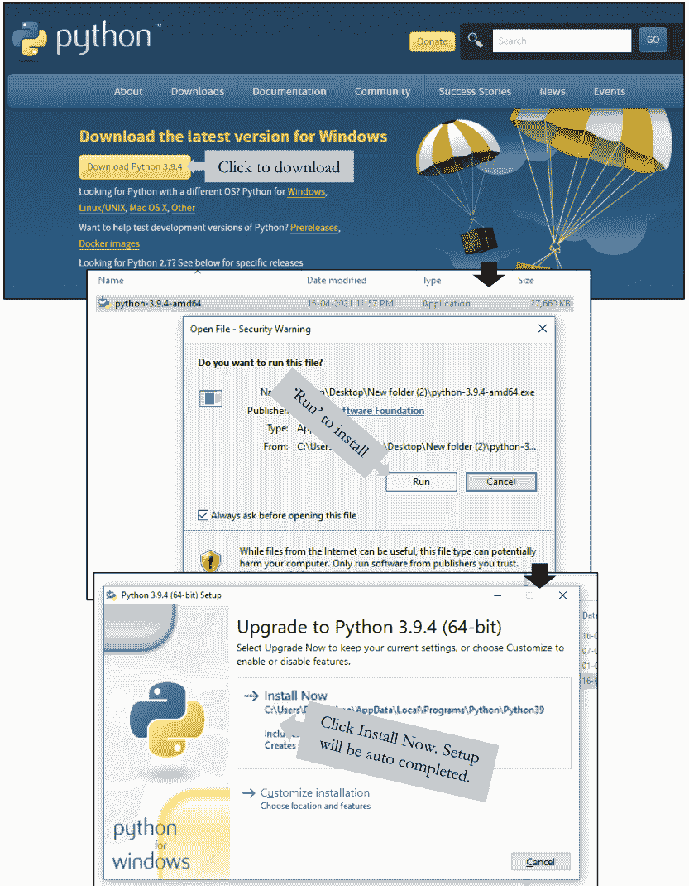

图1-1. Windows系统下Python的逐步安装过程。

## 第1章：入门

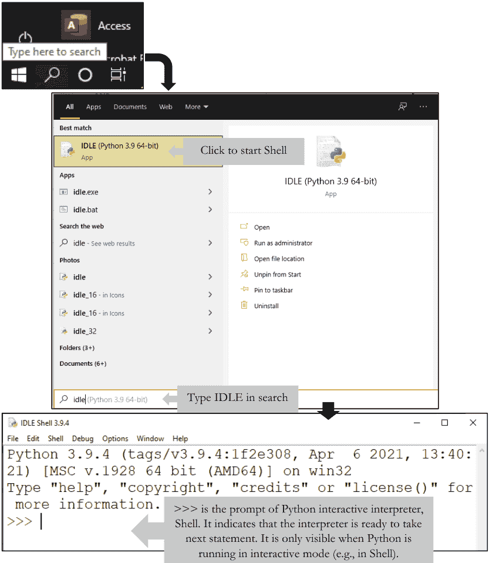

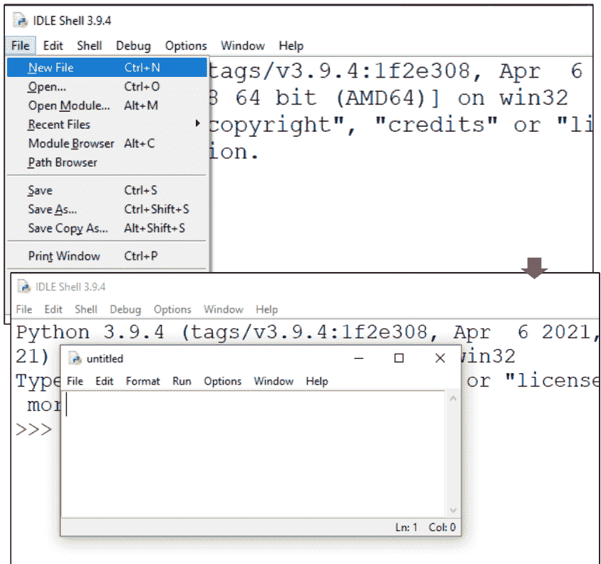

图1-3. 访问IDLE文本编辑器。在IDLE Shell的File菜单中点击New File，会在一个单独的窗口中打开一个新的（未命名的）文本编辑器。

## 第1章：入门

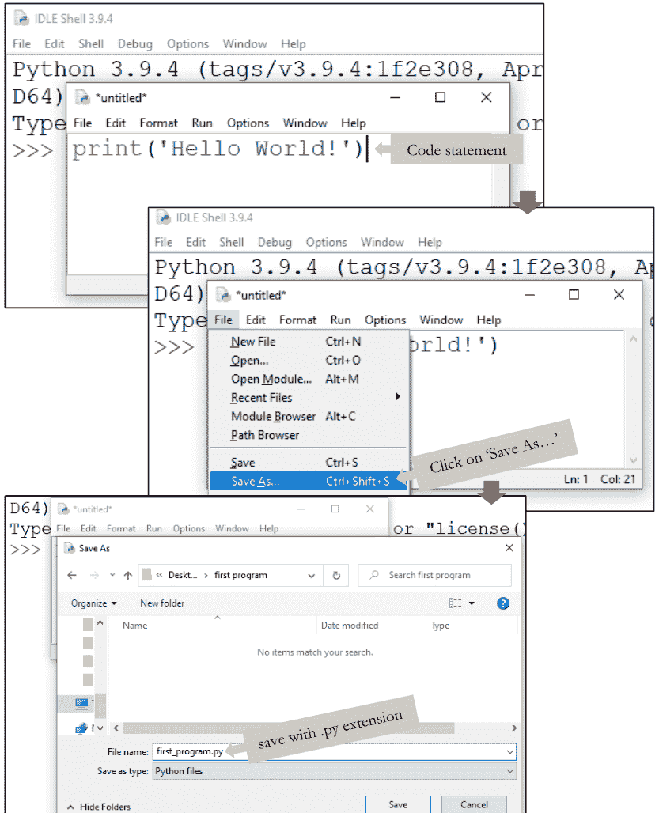

图1-4. 使用IDLE文本编辑器创建Python脚本。

## 第1章：入门

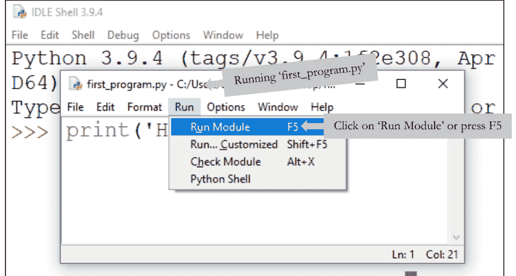

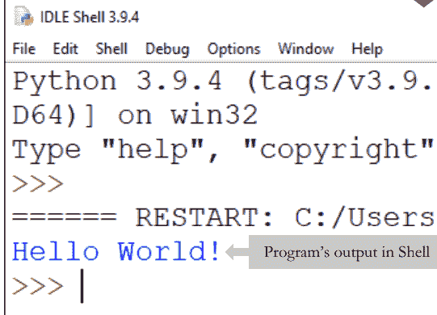

图1-5. 运行新创建的程序`first_program.py`。

## 2. 类型、变量与运算符

在上一章中，我向你介绍了Python解释器。你已经编写了你的第一行代码。你也创建了一个Python脚本。现在是时候理解Python代码的构建块、组件和结构了。但首先，简要讨论一下数据将是有益的。

### 2.1. 数据

简单来说，计算机数据是计算机存储和（或）处理的信息（例如，文本、图像、音频等）。数据可以是任何东西，比如计算机执行操作的数量、字符或符号。在基本层面上，数据只是一系列*比特*。计算的一个见解是，我们可以以任何我们想要的方式解释这些比特——作为各种*值*和*类型*（数字、文本字符）的数据，甚至作为计算机代码本身。我们使用Python来为不同目的定义这些比特块，并让它们与CPU进行交互。

#### 2.1.1. 值与类型

每个数据都有其类型和值。*值*是程序可以操作的基本事物之一，比如一个字母或一个数字。例如，第一个代码中的`'Hello World!'`就是一个值。值属于不同的*数据类型*（简称*类型*）。通常，程序员会互换使用*值*和*对象*、*类型*和*类*这些词。值`'Hello World!'`属于*字符串*类。对象是类的一个实例。假设人类是一个类或类型，那么我们都是该类的实例。将你自己视为属于人类类的一个对象。本章致力于阐明这些及相关概念。

### 2.2. 语句

你遇到的第一个代码是`>>> print("Hello World!")`。在文学中，我们把这种行称为句子，但在编程中，程序员将其称为**语句**。从现在起，我将用这个术语来指代任何*可执行的代码行*。

### 2.3. 函数与参数

在上面的语句中，`print()`是一个**函数**。函数是一个*可重用的代码块*，包含一系列语句，仅在*调用*（即“使用”）时运行，并向调用者`返回`一些数据。Python根据我们不同的需求内置了许多有用的函数。此外，我们可以*定义*（即“创建”）一个自定义函数，我将在“函数”章节中讨论。函数类似于一台机器，比如咖啡机，它以烘焙好的咖啡豆作为起始原料，返回一杯美味的咖啡！同样，函数接受一些*值*作为输入进行处理，并返回一个输出*值*。程序员使用“*传递*”这个词来描述值输入过程，传递给函数的值被称为**参数**（缩写为`arg`）。在第一个代码中，字符串对象`"Hello World!"`是函数`print()`的参数。从语法上讲，函数后面跟着括号，我们在括号内指定参数：`function(arg)`。这里要注意一点，一个函数可以接受多个参数，以逗号分隔的方式传递给函数：`function(arg_1, arg_2, arg_3, ..., arg_n)`。参见代码示例2-1中的例子。

## 第2章：类型、变量与运算符

```
>>> #展示传递给print()函数的参数的例子
>>>
>>> print('ATTGC') #字符串类型参数 'ATTGC'
ATTGC
>>> print('ATTGC',9) #传递两个参数给print()
ATTGC 9
>>>
```

代码示例 2-1

### 2.4. 注释

现在再仔细看看代码示例2-1。你可能注意到我用井号（#）开始了第一行。Python解释器在执行代码时会忽略所有以#开头的内容。在Python中，这种以#开头的行称为**注释**，如代码示例2-2所示。注释不是可执行代码的一部分。程序员使用注释来注解代码，使其对其他程序员更具可读性。注释是给人看的，不是给计算机看的！没有适当的注释，即使是一个优秀的程序也会随着时间的推移变得无用，或者至少在未来修改时非常难以阅读！为了你自己的好处，请始终为你的代码添加注释！

```
>>> #这是一条注释
>>> #这是另一条注释
>>> #任何以#开头的内容都是注释
```

代码示例 2-2

### 2.5. 对象与数据类型

在代码示例2-1中，`ATTGC`属于Python几种基本*数据类型*之一，即**字符串**，而9属于基本数据类型**整数**。在本节中，你将熟悉Python的基本数据类型。透彻理解数据类型对于学习编程很重要。但首先，我想向你介绍*对象*的概念。

#### 2.5.1. 对象

Python 中的一切（例如，数据类型、函数、程序等）都是*对象*。一个**对象**是一个**类**的实例。一个类可以创建许多对象。感到困惑吗？让我用一个例子来解释这个概念。

假设你有一个星形的饼干模具。现在，如果你把这个模具看作一个类，那么用它制作的星形饼干就是该类的实例，因此是属于星形模具类的对象。现在，如果你有一个圣诞树形状的饼干，它属于另一个类，即圣诞树模具类。那么，饼干的配料就是对象的值。在烘焙之前，你可以摆弄配料，可以进行理想的更改，比如添加巧克力或杏仁片。此时，这个饼干被称为*可变对象*。一旦烘焙完成，你就无法再更改其配料，也就是值。然后，这个饼干将被称为*不可变对象*。尽管在现实中，可变性并不是同一个对象的两个阶段。有些对象生来就是可变的，而另一些则是不可变的。有些*类型*创建可变对象，而另一些则创建不可变对象。表 2-1 明确展示了 Python 的重要基本数据类型（即类）。

现在，从存储的角度来看，如果你把饼干存放在罐子里，你可以用一个外部标签来命名这些罐子，比如巧克力饼干或杏仁饼干。这种标记或标签将使将来更容易找到装有特定饼干的罐子。这个“标签”就是分配给对象（饼干）的**变量**，具有特定的值（巧克力片/杏仁）。你将在下一节中了解更多关于变量的内容。

#### 2.5.2. type() 函数

如果对对象的类型有任何疑问，`type()` 函数会有所帮助。`type()` 接受一个对象作为参数，并返回其类或类型<sup>代码示例 2-3</sup>。

## 第 2 章：类型、变量与运算符

表 2-1. Python 基本数据类型

| 名称 | 类型/类 | 可变性 | 示例 |
| :--- | :--- | :--- | :--- |
| **字符串** | str | 不可变 | 'Hello World!'; "5"; 'ATGC' |
| **整数** | int | 不可变 | 5; 55; 546747 |
| **浮点数** | float | 不可变 | 0.45; 5.0; 15.547 |
| **字典** | dict | 可变 | {'W': 'Trp', 'K': 'Lys', 'E': 'Glu'} |
| **列表** | list | 可变 | [1, 2, 3]; ['a', 'b', 'c']; [1.2, 5, 'a'] |
| **元组** | tuple | 不可变 | (1, 2, 3); ('a', 'b', 'c'); (1.2, 5, 'a') |
| **集合** | set | 可变 | {1, 2, 3}; {'a', 'b', 'c'}; {1.2, 5, 'a'} |
| **布尔值** | bool | 不可变 | True; False |

```
>>> #了解对象的类型
>>>
>>> type('ATGC')
<class 'str'>
>>> type(5)
<class 'int'>
>>> type(1.1)
<class 'float'>
>>> type([1, 2, 3])
<class 'list'>
>>> type({'a':'x', 'b':1})
<class 'dict'>
>>> type(('1.0', 1, 'a'))
<class 'tuple'>
>>> type({1, 2, 'a'})
<class 'set'>
>>> type(True)
<class 'bool'>
>>>
```

代码示例 2-3

#### 2.5.3. 类型转换

Python 允许我们将一种*数据类型*转换为另一种（例如，`int` 转 `str` 或 `str` 转 `int` 等）。将一种*类型*转换为另一种称为*类型转换*，Python 有三个内置函数来执行此任务：`str()`、`int()` 和 `float()` 函数。

`int()` 函数接受一个浮点数或一个合适的字符串，并将其转换为整数<sup>代码示例 2-4</sup>。`float()` 函数接受一个整数或一个合适的字符串，并将其更改为浮点数<sup>代码示例 2-5</sup>。类似地，`str()` 函数将合适的*类型*转换为字符串<sup>代码示例 2-6</sup>。

```
>>> #使用 int() 进行类型转换的示例
>>>
>>> #将浮点数转换为整数，它会移除小数点后的数字
>>>
>>> int(4.678) #这里 4.678 属于 float 类型
4
>>>
>>> #将字符串转换为整数
>>>
>>> int('4') #这里 '4' 是一个 str
4
>>>
>>> #但以下转换是禁止的
>>> #int('a string') 和 int('4.678')
>>> #这里注意 4.678(int) 与 '4.678' (str) 不同
>>>
>>> #自己尝试一下。你会得到错误信息。
>>> #尝试熟悉这些错误。
>>> #错误是程序员最好的朋友。
>>>
```

```
>>> # 使用 float() 进行类型转换的示例
>>>
>>> #将整数转换为浮点数
>>>
>>> float(4)
4.0
>>>
>>> #将字符串转换为浮点数
>>>
>>> float('4')
4.0
>>> float('4.678')
4.678
>>>
>>> #但以下转换是禁止的
>>> #int('a string')
>>>
>>> #自己尝试并仔细观察错误信息
>>>
```

代码示例 2-5

### 2.6. 变量

**变量**是引用数据值的名称。

回顾饼干的例子。饼干罐上的标签类似于变量。同样，我们为一个值分配一个变量，以便将该值存储在物理内存中，以便将来可以轻松访问和重用它。在编程中，我们使用短语*‘初始化一个变量’*而不是‘创建一个变量’（例如，*‘初始化一个变量 x 并将其赋值为 y’*）。初始化变量后，计算机会为其分配一定量的内存空间来存储其关联的值。你可以通过引用分配的变量名来访问该值。现在，从这里开始，你必须记住一件事：*‘变量只是名称！’*

```
>>> # 使用 str() 进行类型转换的示例
>>>
>>> #将整数转换为字符串
>>> str(4)
'4'
>>>
>>> #将浮点数转换为字符串
>>> float(4.678)
'4.678'
>>>
>>> #将列表转换为字符串
>>> str([1, 'a', 1.12])
"[1, 'a', 1.12]"
>>>
>>> #在整篇文章中，你将看到类型转换的实际应用
>>> #同时记住这些示例并非详尽无遗
>>>
```

Python 没有声明变量的命令。Python 在你为变量赋值的那一刻初始化该变量。我们将为变量赋值的过程称为*赋值*。Python 的*赋值语句*借助*赋值运算符*完成这项工作<sup>代码示例 2-7</sup>。赋值运算符由等号 (=) 表示。这里要记住，它与数学上的等于运算符没有关系。参见代码示例 2-7 中的一些示例，以及代码示例 2-8 以了解变量的行为。

```
>>> #变量 = 值; 这是一个赋值语句，(=) 是赋值运算符
>>>
>>> #用零值初始化几个变量
>>>
>>> str_variable = '' #用空字符串初始化
>>> list_variable = [] #用空列表初始化
>>> dict_variable = {} #用空字典初始化
>>> int_variable = 0 #用整数 0 初始化
>>>
>>> #用一些值初始化几个变量
>>>
>>> var_1 = 'ATGC'
>>> var_2 = 5
>>> var_3 = [1,2,3]
>>> var_4 = {'A':6, 'T':6, 'G':7, 'C':7}
>>>
```

```
>>> #重新赋值和更新变量
>>>
>>> #x 和 y 是变量
>>> x = 5
>>> y = 9
>>> y = x #将 y 重新赋值为 x; y 用 x 的值更新
>>> print(y)
5
>>> print(x)
5
>>>
```

代码示例 2-8

一个例子可以让你更容易理解变量的必要性。假设你有一个 DNA 序列 AATTCGATTCAGCTACTCAT 需要处理。目前，你知道如何在控制台中打印一个字符串。那么，让我们打印这个 DNA 字符串<sup>代码示例 2-9</sup>。

```
>>> #打印一个 DNA 字符串
>>>
>>> print('AATTCGATTCAGCTACTCAT')
AATTCGATTCAGCTACTCAT
>>>
```

代码示例 2-9

现在，如果你考虑一下，你会发现一个问题。上面的代码是一行简单的代码，并且只使用了一次 DNA 字符串。但在现实世界中，在一个程序中，你可能需要多次使用这个字符串来执行不同的任务。你可以想象，多次从头开始编写这个 20 个核苷酸长的 DNA 字符串是多么令人头疼！更不用说，在真实情况下，我们应该处理巨大规模的 DNA 字符串！Python 可以通过*为这个字符串分配一个变量*（例如 `dna_1`）来轻松解决这个问题<sup>代码示例 2-10</sup>。我将变量命名为 `dna_1`，但它可以是任何其他名称，前提是该名称遵循以下 Python 变量命名规则。

```
>>> #将变量 dna_1 赋值给该字符串
>>>
>>> dna_1 = ('AATTCGATTCAGCTACTCAT')
>>>
>>> #现在，我们可以写 print(dna_1) 而不是 print('AATTCGATTCAGCTACTCAT')
>>>
>>> print(dna_1)
AATTCGATTCAGCTACTCAT
>>>
>>> #因此，dna_1 将持有该字符串值，并且可以在该程序中重用
```

代码示例 2-10

#### 2.6.1. Python 变量命名规则

我们只能用以下字符命名变量：

- 1. 小写字母（'a' 到 'z'），
- 2. 大写字母（'A' 到 'Z'），
- 3. 数字（0 到 9），
- 4. 下划线 (_)。
- 5. 变量名*区分大小写*；`DNA_1`、`Dna_1` 和 `dna_1` 在 Python 中是不同的。
- 6. 变量名必须以*字母*或*下划线*开头，不能以*数字*开头。
- 7. 变量名*不能是* Python 的*关键字*之一。在 shell 中输入 `help('keywords')` 可以获取完整的保留关键字列表。

表 2-2 列出了一些*有效和无效名称*的示例。希望这能帮助你选择*语法正确*的变量名。然而，按照惯例，有两种命名方式

## 第二章：类型、变量与运算符

变量在 Python 程序员中非常流行。他们要么使用*驼峰命名法*，要么使用*下划线*<sup>CodeEx 2-11</sup>。同时，请注意，没有赋值的变量会引发错误<sup>CodeEx 2-11</sup>。

表 2-2. Python 中一些有效和无效变量名的实例

| 有效名称 | 无效名称 |
|---|---|
| dna | 1dna |
| DNA | 1 |
| d_n_a_10 | 10_dna |
| _rna | dna! |
| _1rna | dna-1 |

```
>>> ThisIsAVariable = 0 #CamelCaseNotation for variable naming
>>>
>>> this_is_a_variable = '\' #underscore for variable naming
>>>
>>> #however variable without a value elicits an error
>>>
>>> this_is_a_variable
Traceback (most recent call last):
  File "<pyshell#1>", line 1, in <module>
    this_is_a_variable
NameError: name 'this_is_a_variable' is not defined
>>>
```

CodeEx 2-11

### 2.7. 基本运算符

你也可以使用特殊符号（称为**运算符**）对变量和*字面值*执行常规的*逻辑和数学运算*。表 2-3 列出了一些这样的运算符，CodeEx 2-12 提供了一些示例。

表 2-3. Python 基本运算符列表

| 运算符类型 | 运算符 | 语法 | 含义 |
| :--- | :--- | :--- | :--- |
| 比较 | < | x<y | *严格小于* |
| | <= | x<=y | *小于或等于* |
| | > | x>y | *严格大于* |
| | >= | x>=y | *大于或等于* |
| | == | x==y | *等于* |
| | != | x!=y | *不等于* |
| 身份 | is | x is y | *对象身份* |
| | is not | x is not y | *否定对象身份* |
| 算术 | + | 7+3 | *加法* |
| | - | 7-3 | *减法* |
| | * | 7*3 | *乘法* |
| | / | 7/3 | *浮点数除法* |
| | // | 7//3 | *整数除法* |
| | % | 7%3 | *取模（余数）* |
| | ** | 7**3 | *幂运算* |
| 赋值 | = | x=y | x = y |
| | += | x+=y | x = x + y |

### 2.8. 错误与异常

在这里，我想向你介绍一个关于编程的重要事实。“人非圣贤，孰能无过”；程序员也不例外。这种无意的错误会导致错误。所以，不要害怕。即使是专业级别的程序员也会遇到这个问题。错误并不可怕。它们帮助我们改进代码，并最终使其无误。有两种可区分的错误类型：*语法错误*和*异常*。

```
>>> #assignment operators
>>> x = 3
>>> x += 7
>>> print(x)
10
>>>
>>> #arithmetic operators
>>> 7+3
10
>>> 7-3
4
>>> 7*3
21
>>> 7/3
2.3333333333333335
>>> 7//3
2
>>> 7%3
1
>>> 7**3
343
>>>
```

CodeEx 2-12

```
>>> #syntax error examples
>>>
>>> print('ATGC")
SyntaxError: EOL while scanning string literal
>>>
>>> #error occurred as opening and closing quotes are different
>>>
>>> type('atgc'
SyntaxError: EOL while scanning string literal
>>>
>>> #error occurred as closing bracket missing
>>>
```

CodeEx 2-13

#### 2.8.1. 语法错误

当 Python 的语法被违反时，就会出现这种类型的错误<sup>CodeEx 2-13</sup>。这是学习者遇到的最常见的错误类型。

#### 2.8.2. 异常

即使是一个语法正确的语句或表达式，在尝试执行时也可能导致错误。这些类型的错误统称为*异常*，并在执行期间被检测到<sup>CodeEx 2-14</sup>。

```
>>> #exception examples
>>>
>>> this_is_a_variable
Traceback (most recent call last):
  File "<pyshell#1>", line 1, in <module>
    this_is_a_variable
NameError: name 'this_is_a_variable' is not defined
>>>
>>> 10/0
Traceback (most recent call last):
  File "<pyshell#3>", line 1, in <module>
    10/0
ZeroDivisionError: division by zero
>>>
>>> len(45)
Traceback (most recent call last):
  File "<pyshell#4>", line 1, in <module>
    len(45)
TypeError: object of type 'int' has no len()
>>>
```

## 第三章：字符串操作

到目前为止，你已经接触了理解*语法*和开始 Python 编程所绝对必需的术语和关键概念。*字符串*在 Python 中表示*文本*，在所有数据类型中，它在生物学中至关重要。研究人员将通过现代测序技术产生的大量数据存储为简单的文本格式。Python 将这些数据视为字符串序列！生物学家需要编程从这些数据中提取大量信息，为此，字符串操作的训练是必要的。

### 3.1. 创建字符串

在 Python 中，任何*被引号括起来*的东西都是字符串，反之亦然。用‘单引号’或“双引号”或““三引号””将值括起来就声明了一个字符串。但是，请记住只使用*一种类型的引号*来括起字符串。Python 不允许混合使用引号。这种操作会导致错误（CodeEx 3-1 的第 5-20 行）。此外，Python 将*没有引号*的文本视为变量名。如果你没有给它赋值，它会引发错误（CodeEx 3-1 的第 22-31 行）。你可以使用三引号创建多行字符串<sup>CodeEx 3-2</sup>。此外，通过借助 `str()` 函数进行*类型转换*，你可以通过将合适的*类型*转换为字符串来创建字符串类型。

### 3.2. 特殊字符

要在字符串中插入*语法上‘非法’的字符*，你可以在该非法字符前使用一个*特殊字符*‘反斜杠 (\)’<sup>CodeEx 3-3</sup>。反斜杠是一个‘转义’字符。它有助于摆脱严格的语法规则。

```
1  >>> #strings are ALWAYS quoted
2  >>>
3  >>> #always use identical quotes
4  >>>
5  >>> dna_1 = "ATTCG" #or
6  >>> dna_2 = 'ATTCG' #but not
7  >>> dna_3 = "ATTCG' #as mixing of quotes are prohibited
8  SyntaxError: EOL while scanning string literal
9  >>>
10 >>> #now printing these strings
11 >>>
12 >>> print(dna_1)
13 ATTCG
14 >>> print(dna_2)
15 ATTCG
16 >>> print(dna_3)
17 Traceback (most recent call last):
18   File "<pyshell#12>", line 1, in <module>
19     print(dna_3)
20 NameError: name 'dna_3' is not defined
21 >>>
22 >>> dna_4 = ATTCG
23 Traceback (most recent call last):
24   File "<pyshell#2>", line 1, in <module>
25     dna_4 = ATTCG
26 NameError: name 'ATTCG' is not defined
27 >>>
28 >>> #Python considers dna_4 as a variable by default as it
29 >>> #stays left to assignment operator. But this is not the
30 >>> #case for ATTCG. NameError occurred as Python treated
31 >>> #ATTCG as a variable as it is a text and devoid of quotes
32 >>>
```

CodeEx 3-1

```
>>> #string spanning multiple lines
>>>
>>> dna = '''atgc
atcg
aatc'''
>>> print(dna)
atgc
atcg
aatc
>>>
```

CodeEx 3-2

假设你想在一个也是单引号括起来的字符串中使用一个单引号<sup>CodeEx 3-3 第 3 行</sup>。但根据 Python 的语法，这是非法的<sup>CodeEx 3-3 第 4 行</sup>。你不能在用于指定字符串的相同引号内使用相同的引号。但转义字符允许你这样做<sup>CodeEx 3-3 第 6 到 8 行</sup>。另一个非常常用的特殊字符是换行符 (\n)。使用这个字符，你可以在字符串中创建一个缩进，否则在没有三引号的情况下是不允许的<sup>CodeEx 3-3 第 12 到 16 行</sup>。

```
1   >>> #string with illegal character and indentation
2   >>>
3   >>> dna = 'That's a DNA'
4   SyntaxError: invalid syntax
5   >>>
6   >>> dna = 'That\'s a DNA'
7   >>> print(dna)
8   That's a DNA
9   >>>
10  >>> #creating indentation within string
11  >>>
12  >>> dna_a = 'atcg\naatc\naatc'
13  >>> print(dna_a)
14  atcg
15  aatc
16  aatc
17  >>>
```

CodeEx 3-3

### 3.3. 字符串字符的索引

在 Python 中，字符串字符的索引从 0 开始，*而不是* 1。这意味着字符串的第一个字符的索引是‘0’。图 3-1 显示了 Python 中的索引模式。

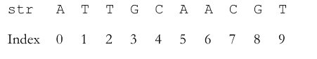

图 3-1：字符串字符的索引

### 3.4. 字符串连接

你可以使用‘+’运算符连接两个字符串。Python 称之为字符串*连接*。例如，假设你有一个包含来自剪接事件的两个外显子序列的数据集。通过使用字符串连接方法，你可以将它们连接起来形成一个 mRNA<sup>CodeEx 3-4</sup>。这里请注意，你只能将字符串类型与*另一个*字符串类型连接。Python 不允许将*字符串与其他类型*（例如整数）连接。为此，你必须首先将 `int` 的*类型*更改为 `str`<sup>CodeEx 3-5</sup>。

```
>>> #string concatenation
>>>
>>> exon_1 = 'augc'
>>> exon_2 = 'cgau'
>>>
>>> #concatenating both exons and storing the resulting
>>> sequence in variables mrna
>>>
>>> mrna = exon_1 + exon_2
>>> print(mrna)
augccgau
>>>
```

```
>>> #str can't be concatenated with other types
>>>
>>> dna = 'atgc'
>>> length = 4
>>> print('seq:'+dna+',length:'+length)
Traceback (most recent call last):
  File "<pyshell#4>", line 1, in <module>
    print('seq:'+dna+',length:'+length)
TypeError: can only concatenate str (not "int") to str
>>>
>>> #casting length (type int) to str and joining it with dna
>>>
>>> print('seq:'+dna+', length:'+str(length))
seq:atgc, length:4
>>>
```

## 第三章：字符串操作

### 3.5. 查找DNA长度

你可以通过Python的另一个内置函数`len()`来计算字符串的长度（即字符串中的字符数）。该函数接受一个字符串作为参数，并返回其整数长度。`len()`函数与`print()`不同，它*不会*在屏幕上*打印*任何内容。相反，它*返回*（注意它不会打印在屏幕上，而是返回一个可存储的）值<sup>代码示例 3-6</sup>。

```
>>> #查找字符串长度：len('任意字符串')
>>>
>>> dna = 'atgc' # 这里len()将接受dna作为参数
>>> dna_len = len(dna) #将返回值赋给dna_len
>>> print(dna_len)
4
>>>
```

代码示例 3-6

### 3.6. 字符串切片

你可以轻松地在特定索引处切分字符串。要从DNA字符串中提取特定片段，可以使用Python的*切片*工具。Python使用*方括号*`[:]`定义切片工具。它接受整数作为*起始*和*结束索引*，作为切割的参考点。如果未明确指定，默认情况下`0`作为起始索引，字符串的长度`len(string)`作为结束点<sup>代码示例 3-7</sup>。这里你应该仔细注意，起始索引是*包含的*，而结束索引是*不包含的*。这意味着如果你想从字符串`abcdef`中切割出*子字符串*`bcd`，应使用语句`abcdef`[1:4]，而不是`abcdef`[1:3]。

```
>>> #字符串切片；[起始(包含) : 结束(不包含)]
>>>
>>> dna = 'atgcttttcgca'
>>>
>>> #从dna中切片子字符串'tttt'；为此
>>> #起始索引 = 4，结束索引 = 8 而不是 7
>>>
>>> dna_slice = dna[4:8]
>>> print(dna_slice)
'tttt'
>>>
>>> # 观察默认的起始和结束索引
>>>
>>> dna_1 = dna[:8] #默认起始是索引 0
'atgctttt'
>>>
>>> dna_2 = dna[4:] #默认结束是字符串的长度
'ttttcgca'
>>>
```

### 3.7. `ATGC` 与 `atgc` 的区别

Python对*大小写*高度敏感。它将大写字母与小写字母区别对待。因此，要格外注意字符串的大小写。不过，你可以通过内置的**方法**`upper()`和`lower()`来更改字符串的大小写。顾名思义，`upper()`将小写字符串转换为大写，反之亦然。

```
>>> #使用upper()和lower()更改大小写
>>>
>>> dna = 'ATTGC'
>>> dna_low = dna.lower() #注意点号(.lower())表示法
>>> print(dna_low)
'attgc'
>>> dna_up = dna_lower.upper() #使用upper()方法
>>> print(dna_up)
'ATTGC'
>>> dna_up == dna #两者相同
True
>>>
```

### 3.8. replace() 方法

replace() 方法将字符串中指定的短语替换为另一个指定的短语。除非另有限制，它会替换所有出现的指定短语。例如，我想将DNA字符串中的腺嘌呤（A）替换为胸腺嘧啶（T）。replace() 方法可以完成这项工作<sup>代码示例 3-9</sup>。它至少接受*两个*由逗号分隔的位置参数。第一个参数显示要替换的内容，第二个参数显示用什么来替换。然而，还有一个可选的第三个位置参数，用于指定计数。这个整数显示要替换多少次指定的短语。默认情况下，它被设置为*所有出现次数*。详见代码示例 3-9。

```
>>> #语法：string.replace(旧值, 新值, 计数)
>>>
>>> #将A替换为T
>>>
>>> dna = 'AAAAATGC'
>>> dna_a2t = dna.replace('A', 'T')
>>> print(dna_a2t)
'TTTTTTGC'
>>>
>>> #带计数的替换
>>>
>>> dna_a2t_1 = dna.replace('A', 'T',1)
'TAAAATGC'
>>> dna_a2t_2 = dna.replace('A', 'T',2)
'TTAAATGC'
>>> dna_a2t_3 = dna.replace('A', 'T',3)
'TTTAATGC'
>>>
>>> #将dna的子字符串TGC替换为AAA
>>>
>>> print(dna.replace('TGC', 'AAA'))
'AAAAAAAA'
>>>
```

代码示例 3-9

### 3.9. count() 方法

count() 方法接受一个字符或子字符串/短语作为参数，并返回它们出现的总次数<sup>代码示例 3-10</sup>。

```
>>> #计算出现次数
>>>
>>> dna = 'attgactgacg'
>>> t_count = dna.count('t') #计算胸腺嘧啶
>>> print(t_count)
3
>>> tga_count = dna.count('tga') #计算'tga'
>>> print(tga_count)
2
>>>
```

### 3.10. find() 方法

在代码示例 3-11中，`tga`可以被视为一个具有重要意义的假想序列模体。你可以用`count()`计算该模体在每个DNA序列中出现的总次数。现在，使用`find()`你还可以精确定位它在DNA中出现的位置详情。`find()`接受子字符串/短语作为参数，并返回其索引<sup>代码示例 3-11</sup>。

```
>>> #查找出现位置
>>>
>>> dna = 'attgactgacg'
>>> tga_index = dna.find('tga') #查找'tga'模体的索引
>>> print(tga_index)
2
>>>
```

这里要注意，当有多个出现时，它只返回第一次出现的索引。字符串`attgactgacg`有两个`tga`模体，分别位于索引2和6。你需要结合`find()`使用多个工具来提取所有出现的索引。我将在后续章节中介绍这些额外的工具。

### 3.11. 原始字符串

在Python中，原始字符串是普通字符串前加上`r`前缀。原始字符串将反斜杠（`\`）等特殊字符视为普通字符。在原始字符串中，Python不会将`\`视为转义字符<sup>代码示例 3-12</sup>。简而言之，在原始字符串中，特殊字符没有特殊性。

```
>>> #原始字符串
>>>
>>> print('atta\ntaat') #包含换行符的字符串
atta
taat
>>> print(r'atta\ntaat') #原始字符串将\n视为普通字符
atta\ntaat
>>> print('atta\ttaat') #包含制表符的字符串
atta  taat
>>> print(r'atta\ttaat') #原始字符串将\t视为普通字符
atta\ttaat
>>> print('\'ATGC\'') #转义字符 \n'ATGC'
>>>
>>> #原始字符串将转义字符\视为普通字符
>>> print(r'\'ATGC\'')
\'ATGC\'
>>>
```

代码示例 3-12

## 第四章：交互式程序

现在你可以运用已经掌握的一些技能来解决许多问题。但还缺少一样东西！我没有描述交互式编程。人们想象程序是一种交互式的机器。以计算器为例。计算器就是一个程序。你输入一些值，并指定要执行的算术运算。相应地，你会得到结果。甚至，如果你犯了错误，比如用0去除一个数，它会提示你！简而言之，计算器接受用户输入，执行用户指定的任务，并给出输出。这是人们所熟悉的，也是编程的魅力所在！

### 4.1. 用户输入

Python有一个内置函数`input()`（代码示例 4-1）。当被调用时，它会提示用户输入。它将用户输入作为参数，并将其作为字符串提供给程序。`input()`还允许包含消息来正确引导用户，以便程序获得无错误的输入。只需在`input()`中放入一个字符串作为参数，`input()`就会将其用作提示消息来引导用户（参见第4行和第5行；代码示例 4-1）。

```
>>> #要求用户输入DNA字符串，并将输入存储在变量user_dna中
>>>
>>> user_dna = input('提供DNA序列：')
提供DNA序列： ATGCGCAT
>>>
```

### 4.2. DNA长度计算器

现在想象一下，作为实验室工作的一部分，你每天需要计算大量的DNA长度。对于小序列，用“目测”法还可以。但对于大序列，这将是一项巨大的工作。这时，DNA长度计算器就派上用场了。让我们来制作一个！从上一章中，你已经知道如何计算字符串的DNA长度。这里我只是添加了代码的交互部分<sup>代码示例 4-2</sup>。

然而，在*交互式解释器*中编写交互式代码并不实用。如前所述，为了将代码作为*脚本*存储以供后续使用，请从IDLE打开文本编辑器，编写代码并将其保存为具有适当名称的Python脚本（.py）。现在，你可以随时运行该脚本来计算DNA序列的长度！运行时，它会在*交互式解释器*中提示输入DNA序列。输入序列数据并按回车键后，程序会在屏幕上打印结果。作为参考，你可以查阅图4-1。

```
>>> #DNA长度计算器
>>>
>>> #第1部分：代码的交互部分
>>>
>>> user_dna = input('提供DNA序列：')
提供DNA序列： attgacatgacttgatc
>>>
>>> #第2部分：代码的核心机制部分
>>>
>>> dna_len = len(user_dna) #user_dna由第1部分提供
>>> print('给定序列的长度为：', dna_len, 'bp')
给定序列的长度为： 17 bp
>>>
```

代码示例 4-2

### 4.3. 将Python脚本（.py）转换为可执行程序（.exe）

你刚刚制作了一个非常有用的计算器。但对你这个Python程序员来说，它才有用。对于那些不熟悉编程的人来说，使用这个计算器会非常困难。用户必须了解运行Python脚本的基础知识，并且系统中必须安装Python。但只需几个步骤，你就可以让程序对所有人可用。只需将Python脚本（.py）转换为可执行程序（.exe）。Windows将运行.exe文件，而无需预先安装Python。用户无需任何编程知识即可运行.exe文件。

#### 4.3.1. pyinstaller

现在，要将.py转换为.exe，你只需要一个Python库包——pyinstaller。首先，在你的Python目录中安装pyinstaller。为此，通过在Windows搜索中搜索`cmd`打开Windows命令提示符。然后输入`pip install pyinstaller`并按回车键。它将在一分钟内安装完成。pyinstaller安装完成后，按照以下步骤使你的脚本可执行。

1.  导航到存储Python脚本（`dnalencal.py`）的文件夹。然后同时按住`Shift`键并右键单击。
2.  从弹出菜单中单击“在此处打开PowerShell窗口”。
3.  将打开一个PowerShell窗口。现在输入`pyinstaller dnalencal.py`并按回车键。pyinstaller将创建可执行文件。要访问它，请打开新创建的`dist`文件夹（该文件夹与.py文件存储在同一位置）。
4.  在该文件夹内，还有另一个名为`dnalencal`的文件夹。打开它，然后在`dnalencal`文件夹内按住`Shift`键并右键单击以打开Windows PowerShell。
5.  在PowerShell中输入创建的文件名（`dnalencal.exe`），然后按键盘上的`Tab`键。按下`Tab`键后会出现一个提示符。在提示符中输入你的数据，然后查看结果！请始终保持`dist`文件夹及其*所有*内容不受干扰。从`dist`中提取`.exe`文件可能会在运行时产生意外错误。

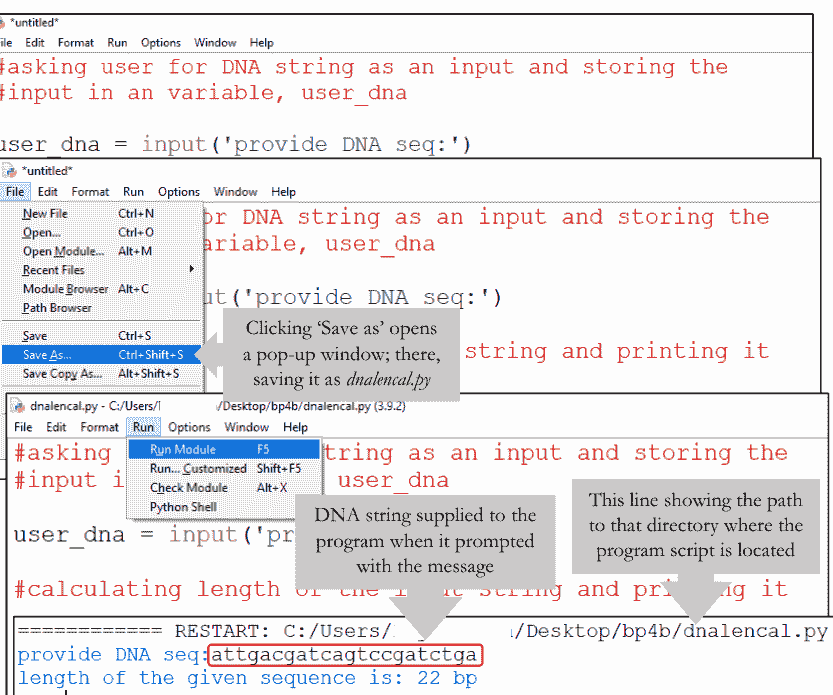

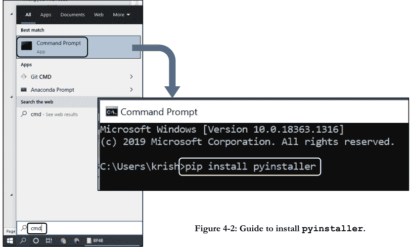

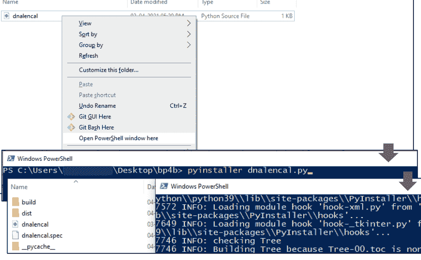

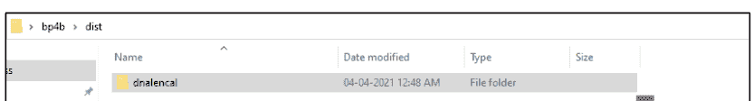

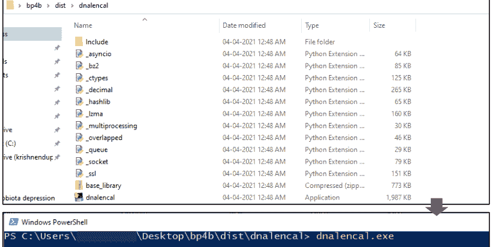


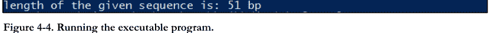

图4-4. 运行可执行程序。

## 5. 列表

如第2章所述，Python中有*四种*核心内置容器数据类型。容器数据类型用于存储多个对象。它们是*列表*、*元组*、*字典*和*集合*。这些是Python最基本的*数据结构*。本章我将专门介绍*列表*。我将在接下来的三章中讨论其他三种数据结构。

列表用于存储通常相关的*有序*值集合。它用于在单个变量中存储多个值。你可以使用*方括号*声明一个列表，其中包含*零个*或多个以*逗号分隔*方式排列的值。

构成列表的值称为该列表的*元素*或*项*。两者可以互换使用。列表元素可以属于任何数据类型。在复杂的数据结构中，甚至一个列表也可以是另一个列表的元素。因此，它被认为是一种*异构*数据类型。你也可以声明一个不包含任何元素的列表。这种列表称为*空列表*。请参阅代码示例5-1以获得更清晰的图景。

### 5.1. 列表索引

列表是一种*有序*数据结构。这意味着列表元素保持插入顺序，具有特定的索引，并且可以通过其索引访问。第一个元素的索引为0，第二个元素的索引为1，依此类推，与字符串索引相同<sup>图5-1</sup>。你也可以从末尾访问这些元素，其中最后一个元素的索引为-1，倒数第二个的索引为-2，依此类推<sup>图5-1</sup>。请参阅代码示例5-2以更好地理解。

```
>>> #[list]
>>>
>>> dna_list = ['ATGC', 'ATTG', 'GTAC']
>>> type(dna_list)
<class 'list'>
>>>
>>> #here single variable dna_list storing multiple values of
>>> # DNA seq in a comma separated manner
>>>
>>> #declaring empty list (i.e., list w/o elements)
>>>
>>> empty_list = []
>>> type(empty_list)
<class 'list'>
>>>
```

代码示例 5-1

```
>>> #accessing list elements
>>>
>>> dna_list = ['ATGC', 'ATTG', 'GTAC']
>>> first_elm = dna_list[0]
>>> second_elm = dna_list[1]
>>> last_elm = dna_list[-1]
>>> print(first_elm, second_elm, last_elm)
ATGC ATTG GTAC
>>>
```

代码示例 5-2

### 5.2. 列表的可变性

列表的可变性允许我们*替换*和/或*移除*列表中的元素。

#### 5.2.1. append() 和 insert() 方法

`append()`方法将一个项添加到列表的末尾，而使用`insert()`方法，你可以在任何所需位置插入一个项。`append()`接受要插入的项作为其参数。`insert()`接受两个参数。第一个位置参数是要插入的新元素的所需索引。第二个位置参数是新元素本身。请注意，这两种方法都是更新现有列表，而不是创建一个包含更新项的新列表。

```
>>> #list mutability
>>>
>>> #append an item
>>>
>>> dna_list = ['ATGC', 'ATTG', 'GTAC']
>>> dna_list.append('AAAA') #appending dna_list with 'AAAA'
>>> print(dna_list)
['ATGC', 'ATTG', 'GTAC', 'AAAA']
>>>
>>> #insert an item
>>>
>>> dna_list.insert(1, 'TTTT')
>>> print(dna_list)
['ATGC', 'TTTT', 'ATTG', 'GTAC', 'AAAA']
>>>
```

#### 5.2.2. `remove()` 方法和 `del` 关键字

`remove()`方法从列表中移除*第一个*其值等于所提供参数的项。`del`关键字从列表中删除项。

```
>>> #list mutability
>>>
>>> dna_list = ['AAA', 'TTT', 'GGG', 'CCC', 'TTT'] #remove an item
>>> dna_list.remove('TTT')
>>> print(dna_list)
['AAA', 'GGG', 'CCC', 'TTT']
>>>
>>> del dna_list[1] #delete item with index 1, i.e., 'GGG'
>>> print(dna_list)
['AAA', 'CCC', 'TTT']
>>>
```

### 5.3. 列表切片

与字符串类似，你可以借助Python的切片工具`[:]`，在特定索引处轻松切片列表，以从中提取特定的一组元素。它接受一个起始索引和一个结束索引作为切片点。这里的起始索引是*包含的*，结束索引是*不包含的*。你可以将切片后的项存储为一个新列表。请参阅代码示例5-5以更好地理解。

```
>>> #list slicing
>>>
>>> dna_list = ['AAA', 'TTT', 'GGG', 'CCC', 'TTT']
>>>
>>> #extracting items with index 1 & 2 and saving it
>>> # as a new list
>>>
>>> new_list = dna_list[1:3]
>>> print(new_list)
['TTT', 'GGG']
>>>
```

### 5.4. 反转列表

`reverse()`方法反转列表元素的顺序。此方法不返回任何内容。它会修改原始列表。请参阅代码示例5-6。

```
>>> #list reversal
>>>
>>> dna_list = ['AAA', 'TTT', 'GGG', 'CCC', 'TTT']
>>> dna_list.reverse()
>>> print(dna_list)
['TTT', 'CCC', 'GGG', 'TTT', 'AAA']
>>>
```

### 5.5. 列表连接

可以使用`+`运算符连接多个列表<sup>代码示例5-7</sup>。语法类似于字符串连接。

```
>>> #joining two lists
>>>
>>> list_1 = ['AAA', 'TTT', 'GGG']
>>> list_2 = [1, 2, 3]
>>> joined_list = list_1 + list_2
>>> print(joined_list)
['AAA', 'TTT', 'GGG', 1, 2, 3]
>>>
```

### 5.6. 列表排序

你可以使用`sort()`方法对列表元素进行排序。排序后，Python将根据新顺序为元素分配新的索引<sup>代码示例5-8</sup>。

```
>>> #sorting strings
>>>
>>> str_list = ['k', 'a', 'f', 'b', 'n']
>>> str_list.sort()
>>> print(str_list)
['a', 'b', 'f', 'k', 'n']
>>>
>>> int_list = [2, 5, 1]
>>> int_list.sort()
>>> print(int_list)
[1, 2, 5]
>>>
```

### 5.7. 列表长度

列表的长度显示其总项数。`len()`函数接受一个列表作为其参数，并返回列表的长度<sup>代码示例5-9</sup>。

| list | [ | 'A' | 'T' | 'G' | 'C' | ] |
| :--- | :--- | :--- | :--- | :--- | :--- | :--- |
| 索引 | | 0 | 1 | 2 | 3 | |
| 索引 | | -4 | -3 | -2 | -1 | |

图5-1：列表元素索引。

## 第五章：列表

```python
>>> #列表长度
>>>
>>> dna_list = ['AAA', 'TTT', 'GGG', 'CCC', 'TTT']
>>> length = len(dna_list)
>>> print(length)
5
>>>
```

代码示例 5-9

### 5.8. 从字符串创建列表

你可以通过类型构造函数 `list()` 将字符串转换为列表，该函数将字符串作为参数。它通过将字符串的字符转换为列表的元素来返回一个列表。

Python 还有另一种方法 `split()`，它根据字符串中已存在的某个*分隔符*（例如，`\n` 可以作为分隔符）将字符串切割成一个列表。`split()` 将分隔符作为参数。请仔细阅读代码示例 5-10。

```python
>>> s = 'string' #字符串转列表
>>> l = list(s) #使用列表构造函数
>>> print(l)
['s', 't', 'r', 'i', 'n', 'g']
>>>
>>> triplet = 'AAA,TTT,GGG,CCC'
>>> triplet_list = triplet.split(',') #使用逗号作为分隔符
>>> print(triplet_list)
['AAA', 'TTT', 'GGG', 'CCC']
>>>
```

代码示例 5-10

### 5.9. 从列表创建字符串：`join()`

`join()` 方法接受一个字符串可迭代序列（例如，元素为字符串的同质列表）的所有项作为参数，并将它们连接成一个字符串。必须指定一个字符串作为分隔符。分隔符可以是空字符串、空格、逗号或你选择的任何内容。因此，`join()` 方法可以将列表元素连接成一个字符串<sup>代码示例 5-11</sup>。

```python
>>> #列表转字符串：'分隔符'.join(可迭代对象)
>>>
>>> triplet = ['AAA','TTT','GGG','CCC']
>>> print(','.join(triplet)) #逗号(',')作为分隔符
AAA, TTT, GGG, CCC
>>> print(''.join(triplet)) #空字符串('')作为分隔符
AAATTTGGGCCC
>>> print('@'.join(triplet)) #@作为分隔符
AAA@TTT@GGG@CCC
>>>
```

### 5.10. 使用 `in` 检查项

`in` 关键字创建一个布尔条件。你可以使用 `in` 关键字检查一个项是否存在于列表中<sup>代码示例 5-12</sup>。

```python
>>> #检查一个值是否在triplet中
>>>
>>> triplet = ['AAA','TTT','GGG','CCC']
>>> 'TTT' in triplet
True
>>> 'ttt' in triplet
False
>>>
```

### 5.11. `zip()` 函数

使用 `zip()` 函数，可以同时遍历多个列表。虽然这个函数不是典型的“初学者”工具，但由于其实用性，值得在此提及。我建议在完成*条件语句*章节的 `for` 循环部分后，再回顾本节和下一小节。

`zip()` 接受可迭代对象作为参数，并返回一个 *zip 对象* 作为输出。希望代码示例 5-13 能帮助你理解这个函数。现在，让我们创建一个氨基酸字典，其中单字母代码作为键，三联体代码作为值。请在完成字典章节后回顾本节，以获得更清晰的理解。`zip()` 在完成迭代时如何持有数据是一个值得讨论的有趣问题。`zip()` 返回的值是一个元组的迭代器，你可以将其转换为列表、元组等。如果我们并行遍历 n 个可迭代对象，`zip()` 将持有对应值到一个元组的迭代器，其中每个元组包含 n 个项，每个传入迭代器的第一个项配对在一起，同样，每个传入迭代器的第二个项配对在一起，依此类推。如果传入的迭代器长度不同，则具有最少元素的迭代器决定了新迭代器的长度。`zip()` 在最短的序列结束时停止。

代码示例 5-14

```python
>>> #通过从两个列表获取输入来创建字典
>>> 
>>> single_letter = ['Q', 'T', 'A', 'P']
>>> three_letter = ['Gln', 'Thr', 'Ala', 'Pro']
>>> z = zip(single_letter, three_letter)
>>> type(z)
<class 'zip'>
>>> 
>>> #解包
>>> 
>>> amino_dict = dict(z) # 使用dict()构造函数解包
>>> print(amino_dict)
{'Q': 'Gln', 'T': 'Thr', 'A': 'Ala', 'P': 'Pro'}
>>>
```

代码示例 5-13

```python
>>> #zip()的工作逻辑
>>>
>>> z = zip('abcd', 'ABCD', 'xyz')
>>> type(z)
<class 'zip'>
>>> tuple(z)
(('a', 'A', 'x'), ('b', 'B', 'y'), ('c', 'C', 'z'))
>>>
>>> #显示迭代顺序的表格
```

| 可迭代对象 | 索引 0 的值 | 索引 1 的值 | 索引 2 的值 | 索引 3 的值 |
| :--- | :--- | :--- | :--- | :--- |
| 1 | 'a' | 'b' | 'c' | 'd' |
| 2 | 'A' | 'B' | 'C' | 'D' |
| 3 | 'x' | 'y' | 'z' | |
| zip(1,2,3) | ('a', 'A', 'x') | ('b', 'B', 'y') | ('c', 'C', 'z') | |

```python
>>>
```

### 5.12. 列表推导式

列表推导式提供了一种简洁的语法，用于基于可迭代对象（例如 `str`、`list` 等）的值构建新列表<sup>代码示例 5-15</sup>。

```python
>>> #列表推导式
>>>
>>> #新列表 = [元素 for 元素 in 可迭代对象 if 条件==True]
>>>
>>> dnt = ['at', 'aa', 'gc', 'ga', 'tt', 'at', 'cg', 'ac']
>>> dnt_a = [ i for i in dnt if 'a' in i]
['at', 'aa', 'ga', 'at', 'cg', 'ac']
>>>
>>> #通过从旧列表dnt中只挑选包含'a'的项
>>> #来创建新列表dnt_a
>>>
```

在代码示例 5-16 中，列表推导式语句获取列表 `codon_lst` 的每个元素，并使用*切片器*对它们进行切片，以形成新的配对值列表 `codon_lst_pv` 的配对值项。对于 `codon_lst` 中的每个项，最后一个字符表示一个氨基酸，而前三个字符表示相应的三联体密码子。

```python
>>> codon_lst = ['ACUT', 'AGAR', 'AGCS']
>>>
>>> #对于codon_lst中的每个项，最后一个字符表示
>>> #一个氨基酸，前三个字符表示
>>> #相应的三联体密码子。现在创建一个配对值列表
>>>
>>> codon_lst_pv = [(i[:3],i[-1]) for i in codon_lst]
>>> print(codon_lst_pv)
[('ACU', 'T'), ('AGA', 'R'), ('AGC', 'S')]
>>>
```

代码示例 5-16

### 5.13. 枚举列表

`enumerate()` 方法为可迭代对象添加一个计数器，并以 *enumerate 对象* 的形式返回它。你可以直接在 `for` 循环中使用这个 enumerate 对象，也可以使用 `list()` 将其转换为元组列表。请记住，`enumerate()` 接受两个参数。第一个位置参数是可迭代对象，第二个是起始计数器，默认设置为零。

代码示例 5-17

```python
>>> #enumerate(可迭代对象, start=0)
>>> list_1 = ['a', 't', 'g', 'a']
>>> en = enumerate(list_1) #en是enumerate对象
>>> type(en)
<class 'enumerate'>
>>> list(en)
[(0, 'a'), (1, 't'), (2, 'g'), (3, 'a')]
>>> for i,j in enumerate(list_1):
        print('索引:',i,'项:',j)

索引: 0 项: a
索引: 1 项: t
索引: 2 项: g
索引: 3 项: a
>>>
```

代码示例 5-17

## 第六章：元组

元组是一种*有序、异构、不可变*的数据类型，允许其项值重复。你可以将元组想象为一个*不可变的列表*。它用于存储有序的数据值集合，其中用户更倾向于数据的不可变性。你可以使用*圆括号*声明元组。元组的值用逗号分隔<sup>代码示例 6-1</sup>。

```python
>>> # (元组)
>>>
>>> #声明空元组
>>>
>>> t = ()
>>> type(t)
<class 'tuple'>
>>>
>>> #多元素元组
>>>
>>> triplet = ('AAA', 'TTT', 'GGG', 'CCC')
>>> type(triplet)
<class 'tuple'>
>>>
```

代码示例 6-1

### 6.1. `tuple()` 构造函数

`tuple()` 构造函数可以创建一个元组或转换其他合适的数据类型为元组<sup>代码示例 6-2</sup>。它的工作方式类似于上一章讨论的*列表构造函数*。

```python
>>> #从字符串创建元组
>>>
>>> aa = 'QTSA'
>>> aa_tuple = tuple(aa)
>>> print(aa_tuple)
('Q', 'T', 'S', 'A')
>>>
>>> #列表转元组
>>>
>>> list2tuple = tuple(['Q', 'T', 'S', 'A'])
>>> print(list2tuple)
('Q', 'T', 'S', 'A')
>>>
```

代码示例 6-2

### 6.2. 元组上的函数和运算符

在代码示例 6-3 中，找到一些可以与元组一起使用的有用函数和运算符。请浏览并自己尝试一下。它不言自明，但并非详尽无遗。

```python
>>> #使用(+)运算符连接元组
>>> t_1 = ('Q','T')
>>> t_2 = ('S','A')
>>> t_3 = t_1 + t_2
>>> print(t_3)
('Q', 'T', 'S', 'A')
>>> len(t_1) #通过len()获取元组长度
2
>>> t_3[1] #通过引用索引访问元组项
'T'
>>> t_3.count('Q') #通过count()方法计算元组项
1
>>>
```

代码示例 6-3

## 7. 字典

假设你需要在程序中使用多个限制性内切酶（REs）的限制位点序列。或者，你需要为项目存储并重用氨基酸及其单字母代码。你会怎么做？

一种选择是，你可以创建一个限制位点序列列表，并记住它们的顺序，以便与各自的限制性内切酶对应。更好的做法是创建两个列表：一个用于限制位点序列，另一个用于限制性内切酶。然后严格保持顺序，这样你就可以核对索引，并借助迭代工具（例如 `zip()` 或 `for` 循环等），准确无误地提取限制位点序列。

但这不是太繁琐且容易出错吗？由于列表是可变的，你任何的错误都可能破坏你的程序或给出错误的输出！比如你需要 EcoRI 的序列，却因为你一个愚蠢的索引错误而得到了 BamH1 的序列！这完全无法接受！

幸运的是，Python 有一个令人惊叹的内置容器，专门用于这些目的，它使得标记一个值并使用该标签检索变得非常容易！它就是 *字典*！字典是值的集合，这些值映射到 *任意的*、*不可变的* 和 *唯一的* 键。它们以 *键-值* 对的形式存储数据值，其中每个值都有一个唯一的键。这些键-值对就是字典的 *项*。

字典是 *可变的*，而键是不可变的（例如 `str`、`int` 等）。它是一个 *有序的* 数据结构（自 Python 3.7 起）。它不允许 *重复的键*。

字典使用 *花括号* 声明，其中包含以逗号分隔的键-值对。更多细节请参见代码示例 7-1。

```
>>> #{dictionary}
>>>
>>> re_dict = {'ecor1': 'GAATTC',
              'bamh1': 'GGATCC',
              'hind3': 'aagcct'}
>>> type(re_dict)
<class 'dict'>
>>> #empty dictionary (i.e., dict w/o elements)
>>> empty = {}
>>> type(empty)
<class 'dict'>
>>>
```

代码示例 7-1

### 7.1. dict() 构造函数

此外，你可以使用 `dict()` 构造函数从键-值序列（*成对的值序列*）构建字典<sup>代码示例 7-2</sup>。

```
>>> #paired value sequences to dict
>>>
>>> #aa is a paired value list
>>>
>>> aa = [('Q', 'Gln'), ('T', 'Thr'), ('A', 'Ala')]
>>> aa_dict = dict(aa)
>>> print(aa_dict)
{'Q': 'Gln', 'T': 'Thr', 'A': 'Ala'}
>>>
```

代码示例 7-2

### 7.2. 字典的键

键帮助我们以多种方式处理字典项，如代码示例 7-3 所示。

### 7.3. 在字典上使用 `in` 关键字和 `get()` 方法

要检查一个 *键* 是否存在于字典中，你可以使用 `in` 关键字，它会返回一个布尔值。输出 `True` 表示该键存在于字典中。

```
>>> aa_dict = {'Q': 'Gln', 'T': 'Thr', 'A': 'Ala'}
>>> #adding new item (with key 'P' and value 'Pro' in aa_dict)
>>> aa_dict['P'] = 'Pro'
>>> aa_dict
{'Q': 'Gln', 'T': 'Thr', 'A': 'Ala', 'P': 'Pro'}
>>> #removing the value ('Thr')
>>> del(aa_dict['T'])
>>> aa_dict
{'Q': 'Gln', 'A': 'Ala', 'P': 'Pro'}
>>> #changing the value ('Ala' to 'Alanine')
>>> aa_dict['A'] = 'Alanine'
>>> aa_dict
{'Q': 'Gln', 'A': 'Alanine', 'P': 'Pro'}
>>>
```

而 `False` 则表示其不存在。此外，你可以使用 `get()` 方法访问与键映射的值<sup>代码示例 7-4</sup>。

```
>>> #finding a key with value
>>> aa_dict = {'Q': 'Gln', 'T': 'Thr', 'A': 'Ala', 'P': 'Pro'}
>>> 'T' in aa_dict #using in keyword
True
>>> 'S' in aa_dict
False
>>> aa_dict.get('T') #using get() method
'Thr'
>>>
```

### 7.4. 提取所有键、值或两者

通过使用字典方法 `keys()`、`values()` 和 `items()`，你可以分别从字典中提取所有的键、值和键-值对。
`keys()` 方法返回一个 *字典视图对象*。视图对象（`<class dict_keys>`）包含作为列表的键。因此，如果你想直接 *打印* 这些输出，最好总是将这些方法的输出通过 `list()` 传递（`list[dictionary.keys()]`）。更多细节请参见代码示例 7-5。

```
>>> #keys(), values() & items()
>>>
>>> aa_dict = {'Q': 'Gln', 'T': 'Thr', 'A': 'Ala', 'P': 'Pro'}
>>>
>>> #getting all keys from aa_dict
>>>
>>> key = aa_dict.keys()
>>> print(key)
dict_keys(['Q', 'T', 'A', 'P'])
>>> type(key)
<class 'dict_keys'>
>>>
>>> #passing the output through list() (though not necessary)
>>>
>>> list(key)
['Q', 'T', 'A', 'P']
>>>
>>> #similarly
>>>
>>> list(aa_dict.values())
['Gln', 'Thr', 'Ala', 'Pro']
>>>
>>> list(aa_dict.items())
[('Q', 'Gln'), ('T', 'Thr'), ('A', 'Ala'), ('P', 'Pro')]
>>>
```

代码示例 7-5

### 7.5. 获取字典的长度

字典的长度显示了字典中项的总数，你可以使用 `len()` 函数获取它。`len()` 接受一个字典作为其参数。

```
>>> #getting dict length
>>>
>>> aa_dict = {'Q': 'Gln', 'T': 'Thr', 'A': 'Ala'}
>>> print(len(aa_dict))
3
>>>
```

代码示例 7-6

### 7.6. 更新和合并字典

Python 3.9 为其内置字典类添加了两个新运算符：*更新*（|=）和 *合并*（|）。更新运算符（|=）用其 *右侧* 对象的内容更新其 *左侧* 的字典，该对象可以是映射对（例如另一个字典）或键/值对的可迭代对象（例如一个元组列表，其中每个元组有两个逗号分隔的项；[ (1,2), (3,4) ]）。而合并运算符（|）创建一个 *新的* 字典，其中包含两个 *操作数* 合并后的键和值。这里，两个操作数都必须是字典<sup>代码示例 7-7</sup>。

```
>>> #merging and updating dictionaries
>>>
>>> aa_dict_1 = {'Q': 'Gln', 'T': 'Thr'}
>>> aa_dict_2 = {'A': 'Ala', 'P': 'Pro'}
>>>
>>> #creating a new aa_dict_3 by merging aa_dict_1 with
>>> #aa_dict_2
>>>
>>> aa_dict_3 = aa_dict_1|aa_dict_2
>>> aa_dict_3
{'Q': 'Gln', 'T': 'Thr', 'A': 'Ala', 'P': 'Pro'}
>>>
>>> #updating aa_dict_1 with aa_dict_2
>>>
>>> aa_dict_1 |= aa_dict_2
>>> aa_dict_1
{'Q': 'Gln', 'T': 'Thr', 'A': 'Ala', 'P': 'Pro'}
>>> aa_dict_2
{'A': 'Ala', 'P': 'Pro'}
>>>
```

代码示例 7-7

### 7.7. 字典推导式

与所有其他推导式一样，Python 中的字典推导式也提供了一种简短而简洁的方法，用于基于可迭代的成对值对象（例如 [ (1,2) , (3,4) ]）的值来构建新字典。在代码示例 7-8 中，我使用了成对值列表 `aa` 来创建一个密码子字典。该字典将密码子作为键，其对应的氨基酸作为值。这是另一个例子，其中字典推导式可以优雅地替代你可能编写的多行代码，以了解任何序列的核苷酸计数<sup>代码示例 7-9</sup>。从这两行代码中，你可以制作一个优雅的可执行程序，用于计算核苷酸频率（即输入序列中每种核苷酸的百分比）。

```
>>> #list comprehension
>>> #from pair value list creating an aa dictionary
>>>
aa = [('Q', 'Gln'), ('T', 'Thr'), ('A', 'Ala')]
aa_dict = {a: aaa for a, aaa in aa}
print(aa_dict)
{'Q': 'Gln', 'T': 'Thr', 'A': 'Ala'}
>>>
```

代码示例 7-8

```
>>> #atgc count
>>> dna = 'aggctgacttgacaccagtcgacatcgacgtac'
>>> atgc_count = {base:dna.count(base) for base in dna}
>>> print(atgc_count)
{'a': 9, 'g': 8, 'c': 10, 't': 6}
>>>
>>> #even better
>>> atgc = {base.upper():dna.count(base) for base in dna}
>>> atgc_count
{'A': 9, 'G': 8, 'C': 10, 'T': 6}
>>>
```

代码示例 7-9

## 8. 集合

集合是一种无序的、异构的数据类型，其项中不允许重复。虽然集合是可变的，但其项必须是不可变的。可以将集合想象成一个只由键组成的字典。你可以像声明字典一样，使用花括号声明集合，其中包含多个逗号分隔的值<sup>代码示例 8-1</sup>。

```
>>> #{set}
>>>
>>> s = {'A', 'B', 1, 5}
>>> type(s)
<class 'set'>
>>> print(s)
{'a', 1, 5, 'b'}
>>>
>>> #print(s) outcome could be different each time you call it
>>> #a fresh. This is because set is inherently unordered.
```

代码示例 8-1

### 8.1. set() 构造函数

set() 构造函数的工作方式与列表或元组构造函数相同。它可以启动一个集合或将其他合适的数据类型转换为集合<sup>代码示例 8-2</sup>。

### 8.2. 集合上的函数和运算符

在代码示例 8-3 中，找到一些你可以与集合一起使用的有用函数和运算符。只需浏览一下并自己尝试这些代码。请记住，这些并非详尽无遗。

## 第八章：集合

```python
>>> #从字符串创建集合
>>>
>>> aa = 'QTSA'
>>> aa_set = set(aa)
>>> print(aa_set)
{'Q', 'T', 'S', 'A'}
>>>
>>> #从列表创建集合
>>>
>>> list2set = set(['Q', 'T', 'S', 'A'])
>>> print(list2set)
{'Q', 'T', 'S', 'A'}
>>>
>>> #等等。
>>>
```

代码示例 8-2

```python
>>> #使用管道字符（|）运算符进行集合并集操作
>>>
>>> s_1 = {'Q','T'}
>>> s_2 = {'S','A'}
>>> s_3 = s_1 | s_2
>>> print(s_3)
{'Q', 'T', 'S', 'A'}
>>>
>>> #使用len()获取集合长度
>>>
>>> len(s_1)
2
>>> len(s_3)
4
>>>
```

代码示例 8-3

## 第九章：条件语句

你刚刚进入了本书一个非常有趣的章节！到目前为止，你接触的都是简单的程序。在现实世界中，你将面临复杂的问题，为此，你需要编写包含多个检查点和决策节点的复杂程序。这些节点和检查点控制着程序的*流程*，相信我，这很重要。完成本章后，你将能够创建能够自主决策的更智能的程序。

例如，想象一个场景，需要GC含量大于50%的DNA片段。你可以创建一个自定义的*GC含量计算器*来满足这个需求。它接收用户输入并以百分比形式返回GC含量。看起来很简单？不。实际上，错误时有发生！用户可能错误地输入整数而不是核苷酸字符串！这种情况将不可避免地触发程序的隐藏缺陷！只有控制程序的流程，你才能克服这种情况。

那么，“流程控制”或“控制流”这个短语是什么意思呢？你已经注意到，*默认情况下*，Python解释器以*自上而下*的方式*顺序执行*程序代码。但大多数时候，这种简单的策略行不通。在日常生活中，我们根据面临的条件调整行动方式。同样，要编写一个有用的程序，我们几乎总是需要检查条件并相应地改变程序行为的能力。*条件在程序内创建逻辑分支*<sup>图9-1</sup>。根据不同的条件，程序可能执行其中一个分支，也可能跳过它去执行另一个分支。它还可能重复执行一段代码，直到某个条件成立，这种现象称为循环。*条件语句*赋予我们这些能力。它控制着程序的默认流程。

条件语句由一个返回`True`或`False`的*布尔表达式*组成。如果返回`True`，则执行一个分支，即一段*代码块*；如果返回`False`，则执行其他代码块或停止执行。不过，不要迷失在文字中。示例将让你理解条件语句的工作原理。

### 9.1. 条件

一个返回`True`或`False`的布尔表达式就是一个*条件*。*比较运算符*、*同一性运算符*以及其他一些运算符和方法被广泛用于构造条件。你也可以使用逻辑运算符将简单条件组合成复杂条件。相关示例请参见代码示例9-1。

### 9.2. if 语句

最简单的条件语句是`if`语句。结构上，`if`语句有一个*头部*（第4行；代码示例9-2），后面跟着一个*缩进的*（第5至7行；代码示例9-2）代码体，称为*代码块*或*套件*。我们称这样的语句为*复合语句*（第4至7行；代码示例9-2）。`if`评估语句是否满足某个条件。如果条件为`True`，那么且仅在那时，`if`才会执行其套件。更好的理解请参见代码示例9-2。

对于更复杂的情况，我们需要不止一个分支。除了`if`，`elif`和`else`用于创建多个*链式条件*，从而产生多个分支。`elif`是“else if”的Python化表达方式。可以有*零个或多个*`elif`部分，以及*零个*或仅一个`else`部分。记住Python会顺序执行*链式条件*，如果某个条件为`False`，则跳过其套件。代码示例9-3中，如果第4行为`True`，则执行第5行；如果*仅*第6行为`True`，则执行第7行；只有当第4行和第6行都为`False`时，才执行第9行。一旦找到第一个`True`条件，执行即停止。

现在观察程序`amino_acid_decoder`的流程图（图9-1）。该程序接收单字母氨基酸代码作为用户输入，并输出相应的氨基酸名称和三字母氨基酸代码<sup>代码示例9-4</sup>。这个程序相对容易出错！例如，如果用户输入的不是单字母氨基酸代码的整数怎么办？程序会崩溃！因此，它需要调试，你将在本章末尾找到解决方案。

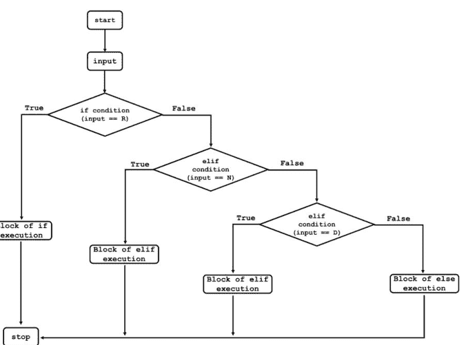

图9-1：**amino_acid_decoder**的算法流程图，展示了其复杂的分支模式，其中每个节点代表嵌入在**if/elif/if-else**语句中的一个条件。

```python
>>> ##构造一些简单条件
>>>
>>> 5>3 #5大于3吗？
True
>>> 3>5 #3大于5吗？
False
>>> # 'atgc'的长度是否大于或等于'atc'的长度？
>>> len('atgc') >= len('atc')
True
>>> # 'atgc'的长度是否小于或等于整数5的长度？
>>> len('atgc') <= 5
True
>>> # 'atgc'的长度是否等于整数4？
>>> len('atgc') == 4
True
>>> # 'atgc'的值是否等于'atGc'的值？
>>> 'atgc' == 'atGc'
False
>>> # 'atgc'的值是否不等于'atGc'的值？
>>> 'atgc' != 'atGc'
True
>>> # 'atgc'是否为大写？
>>> 'atgc'.isupper()
False
>>> # 'atgc'是否为小写？
>>> 'atgc'.islower()
True
>>> # 字符串'atgc'是否以字母'a'开头？
>>> 'atgc'.startswith('a')
True
>>> # 字符串'atgc'是否以字母'c'结尾？
>>> 'atgc'.endswith('c')
True
>>>
>>> ##一些复杂条件
>>>
>>> #两个操作数都为True吗？
>>> 5>3 and 3>5
False
>>> #任一操作数为True吗？
>>> 5>3 or 3>5
True
>>>
```

代码示例 9-1

```python
1  #if语句的结构
2
3  x = input('x = ')
4  if int(x)>0:
5      y = int(x)+1
6      print('x is positive')
7      print('y is greater than 1')
```

```
=============== RESTART: C:/Users/Desktop/codeex9.2.py ===============
x = 4
x is positive
y is greater than 1
>>>
>>> #再次运行脚本并输入0
x = 0
>>> #没有输出，因为第4行的条件变为False
>>>
```

代码示例 9-2

```python
1  # if-elif-else
2
3  x = input('x = ')
4  if int(x)>0:
5      print('x is positive')
6  elif int(x)<0:
7      print('x is negative')
8  else:
9      print('x is Zero')
```

```
=============== RESTART: C:/Users/Desktop/codeex9.3.py ===============
x = 1
x is positive
>>>
>>> #再次运行脚本并输入0
x = 0
x is Zero
>>>
>>> # 再次运行脚本并输入-1
x = -1
x is negative
>>>
```

代码示例 9-3

```python
1  #amino_acid_decoder
2  
3  user_input = input('Enter single-letter amino acid code:')
4  input_aa = user_input.upper()
5  if input_aa == 'R':
6      print(input_aa, 'stands for Arginine(Arg)')
7  elif input_aa == 'N':
8      print(input_aa, 'stands for Asparagine(Asn)')
9  elif input_aa == 'D':
10     print(input_aa, 'stands for Aspartic Acid(Asp)')
11 else:
12     print('Error: Decoder only accept SINGLE-LETTER AA Code')
13 
14 '''NB: After line 10, please insert similar elif statements for
15 rest 17 amino acids. While doing so, watch your indentations!'''
```

```
=============== RESTART: C:/Users/Desktop/codeex9.4.py ==
Enter single-letter amino acid code:n
N stands for Asparagine(Asn)
```

代码示例 9-4

### 9.3. 循环

在编程中，我们经常需要另一种流程控制机制，它让我们能够*重复执行*一段代码。这种条件执行可以通过一类称为*循环*的条件语句来实现。Python中有`while`循环和`for`循环。当程序员不知道确切的迭代次数时，`while`循环是首选。这意味着事先我们不知道循环需要重复多少次。相反，当我们事先确切知道需要的迭代次数时，`for`循环是合适的。

#### 9.3.1. while 循环

`while`循环迭代一系列语句，直到某个条件成立。这就是为什么它也被称为*不定*循环。结构上，`while`循环有一个以冒号（:）结尾的*头部*，后面跟着一个*缩进的代码块*。

循环计数器常与 `while` 循环配合使用。它只是一个根据程序需求初始化的变量（如代码示例 9-5 第 3 行的 `x`）。它在循环语句外部声明，并用于创建循环的条件。然而，循环体必须更新循环计数器的值（第 6 行；代码示例 9-5），以便条件最终变为 `False`，从而终止循环。代码示例 9-5 在每个循环周期中将 `x` 的值减 1，使得条件（即 `x>=0`）最终变为 `False`（即 `x<0`），循环结束。虽然 `while` 循环看起来很简单，但在创建时要小心！如果不注意，你可能会进入一个无限循环，一个将永远重复的循环！仅仅省略更新计数器的语句（代码示例 9-5 的第 6 行），就会让你进入无限循环！

```
>>> #while 循环的结构
>>> #用值 5 初始化循环计数器 x
>>> x = 3
>>> while x >=0:
        print(x)
        x -= 1

3
2
1
0
>>>
>>> #你可以将这个程序称为“倒计时”
>>>
```

代码示例 9-5

```
>>> #仅通过省略代码示例 9-5 的第 6 行
>>> #将倒计时转换为无限循环
>>> #运行下面的代码，看看会发生什么！
>>>
>>> x = 5
>>> while x >=0:
        print(x)
...
```

代码示例 9-6

#### 9.3.2. for 循环

与 `while` 循环相反，`for` 循环遍历一个*可迭代对象*。它运行的迭代次数与该对象中的项目数量一样多。因此，它也被称为*确定循环*。在结构上，`for` 语句类似于 `while` 语句。它有一个*头部*（第 4 行；代码示例 9-7），以冒号（:）结尾，后面跟着一个*缩进的代码块*（第 5 行；代码示例 9-7）。不同之处在于，它的头部中有一个 `in` 关键字，位于可迭代对象之前。参见代码示例 9-7。

```
>>> #for 循环的结构
>>> #使用列表 [0,1,2,3,4] 作为可迭代对象
>>>
>>> for item in [0,1,2,3,4]:
        print("It's ",item)

It's 0
It's 1
It's 2
It's 3
It's 4
>>>
```

代码示例 9-8 演示了如何使用 `for` 循环遍历字符串和列表对象。请仔细阅读。通过遍历可迭代对象，`for` 循环可以提取其组成项目或字符。

#### 9.3.3. continue 和 break

`continue` 和 `break` 语句也是控制语句，用于控制循环内的流程。根据特定条件，`continue` 语句会停止当前迭代并跳转到下一次迭代。而 `break` 语句基于某些条件可以提前终止循环，即使循环条件仍为 `True` 或尚未完成其迭代。请参阅代码示例 9-9。第 4 行为 `break` 语句（即第 5 行）设置了条件。这里，如果 `x` 变为 2，循环会提前结束。同样，当 `x` 变为 4 时（第 7 行和第 8 行），循环在执行完第 8 行后会中止该次迭代，并跳转到下一次迭代。代码示例 9-10 遵循相同的机制。请仔细阅读第 4 到 8 行，并比较 `for` 循环的输出。

现在，我将向你介绍三个非常有趣的函数：`enumerate()`、`range()` 和 `zip()`。虽然这些不是循环专用的函数，但它们与 `for` 循环一起使用非常普遍。

```
>>> #从小肽链中提取氨基酸
>>> 
>>> peptide = 'QHILK'
>>> for aa in peptide:
        print('AA: ',aa)

AA:  Q
AA:  H
AA:  I
AA:  L
AA:  K
>>> 
>>> #使用 for 循环遍历列表
>>> #取一个基因列表
>>> 
>>> gene = ['GAPDH','p53','actin','SOD2']
>>> 
>>> #使用 for 语句从基因列表中提取元素基因
>>> 
>>> for g in gene:
        print('Gene: ',g)

Gene:  GAPDH
Gene:  p53
Gene:  actin
Gene:  SOD2
>>>
```

代码示例 9-8

```
>>> #在 while 循环中使用 continue 和 break
>>> x = 7
>>> while x>=0:
        if x == 2:
            break
        x -= 1
        if x == 4:
            continue
        print(x)
6
5
3
2
>>>
```

代码示例 9-9

```
>>> #在 for 循环中使用 continue 和 break
>>> peptide = 'QHILK'
>>> for aa in peptide:
        if aa == 'H':
            continue
        if aa == 'L':
            break
        print(aa)

Q
I
>>>
```

代码示例 9-10

### 9.4. enumerate() 函数

虽然 `enumerate()` 不是循环专用函数，但在 `for` 循环的上下文中更容易解释。`enumerate()` 函数接受一个可迭代对象作为参数，并为该可迭代对象添加一个计数器。它返回一个可迭代的*枚举对象*（一个 Python 类）。枚举对象存储可迭代对象的项目及其各自的索引，作为成对的值元组。它也可以用作循环可迭代对象，通过对其使用 `list()` 函数可以转换为元组的 `list`。参见代码示例 9-11 和代码示例 9-12。

```
>>> # enumerate() 函数
>>> 
>>> peptide = 'QHILK'
>>> enu_obj = enumerate(peptide) #enu_obj 是一个枚举对象
>>> list(enu_obj) #将枚举对象转换为列表
[(0, 'Q'), (1, 'H'), (2, 'I'), (3, 'L'), (4, 'K')]
>>> 
>>> print(enu_obj) # enu_obj 不能直接打印
<enumerate object at 0x0000020D71ACACC0>
>>> 
>>> type(enu_obj) #检查 enu_obj 的类
<class 'enumerate'>
>>>
```

代码示例 9-11

```
>>> #在 for 循环中使用 enumerate() 函数
>>> 
>>> gene = ['GAPDH', 'p53', 'actin', 'SOD2']
>>> peptide = 'QHILK'
>>> 
>>> #枚举列表
>>> for index, item in enumerate(gene):
...     print('Index: ', index, ', of list item:', item)
... 
Index:  0 , of list item: GAPDH
Index:  1 , of list item: p53
Index:  2 , of list item: actin
Index:  3 , of list item: SOD2
>>> 
>>> #枚举字符串
>>> for i, j in enumerate(peptide):
...     print('Index: ', i, ', of str character:', j)
... 
Index:  0 , of str character: Q
Index:  1 , of str character: H
Index:  2 , of str character: I
Index:  3 , of str character: L
Index:  4 , of str character: K
>>>
```

代码示例 9-12

### 9.5. range() 函数

`range()` 函数返回一个指定范围内的*整数序列*，作为一个称为*range 对象*（另一个 Python 类）的可迭代对象。它主要用于生成 `for` 循环的可迭代对象。`range()` 非常有用，因为它通过提供可迭代对象作为 `for` 循环的计数器来帮助自动化重复性工作。`range()` 接受三个参数，都是整数。第一个参数指定整数序列的起点，*包含*该点，默认值为 0。第二个参数指定终点，*不包含*该点，且*没有*默认值。因此，使用 `range()` 时，至少必须指定终点。最后一个参数指定增量步长，即序列中两个整数之间的差值，默认值为 1<sup>代码示例 9-13</sup>。

```
>>> #range(start,stop,step) 函数
>>>
>>> r = range(5) #r 是 range 对象
>>> list(r) #将 range 对象转换为列表以查看其内容
[0, 1, 2, 3, 4]
>>> print(r) #range 对象不能直接打印
range(0, 5)
>>> type(r) #检查 range 对象的类
<class 'range'>
>>> r1 = range(1,5) #指定起点和终点的范围
>>> list(r1)
[1, 2, 3, 4]
>>> r2 =range(1,10,2) #指定增量步长为 2
>>> list(r2)
[1, 3, 5, 7, 9]
>>>
>>> #使用 for 循环遍历 range()
>>> for i in range(1,10,2):
        print(i)
1
3
5
7
9
>>>
```

代码示例 9-13

现在，假设你需要创建一个 12 个核苷酸长的多聚腺嘌呤字符串。使用 `for` 循环，你可以自动化这项工作<sup>代码示例 9-14</sup>。但是，`for` 循环需要一个可迭代对象来遍历以生成聚合物。你如何提供这个可迭代对象呢？这时 `range()` 就派上用场了。在代码示例 9-14 中，`range(12)` 创建了一个包含 12 个项目（从 0 到 11）的可迭代序列<sup>第 4 行</sup>。然后，在每次迭代中，变量 `polya` 都会更新一个腺嘌呤碱基<sup>第 5 行</sup>。这个循环会一直进行，直到可迭代序列耗尽，即循环运行 12 次并到达整数序列的最后一个项目。此时，`polya` 已经添加了 12 个腺嘌呤碱基，形成了一个 12 个核苷酸的多聚 A 聚合物。

```
>>> #使用 range() 创建多聚 A 聚合物
>>>
>>> polya = '' #用空字符串初始化变量 polya
>>> for i in range(12): #遍历 range(12)
        polya += 'A'

>>> print(polya)
AAAAAAAAAAAA
>>>
```

### 9.6. 改进 amino_acid_decoder

现在是时候重新审视代码示例 9-4 了。`amino_acid_decoder` 要求用户输入单个字母的氨基酸代码。然而，它只执行一次。如果用户需要解码多个氨基酸，她必须多次运行代码。这是一个缺陷。解码器必须在给出输出后提示用户进行另一次输入，并且只有在收到终止指令时才会停止运行。为了实现这个目标，我们的代码必须循环执行代码块，直到满足某个条件（例如，终止指令）。请逐行仔细阅读代码示例 9-15，以理解调试协议。

## 第九章：条件语句

```python
#amino_acid_decoder
#dict containing 20 amino acids with triplet code and MW
aa_dict = {'A':'Alanine(Ala); MW:89.09',
            'R':'Arginine(Arg); MW:174.20',
            'N':'Asparagine(Asn); MW:132.12',
            'D':'Aspartic Acid(Asp);MW:133.10',
            'C':'Cysteine(Cys);MW:121.16',
            'E':'Glutamic Acid(Glu);MW:147.13',
            'Q':'Glutamine(Gln);MW:146.15',
            'G':'Glycine(Gly);MW:75.07',
            'H':'Histidine(His);MW:155.16',
            'I':'Isoleucine(Ile);MW:131.18',
            'L':'Leucine(Leu);MW:131.18',
            'K':'Lysine(Lys);MW:146.19',
            'M':'Methionine(Met);MW:149.21',
            'F':'Phenylalanine(Phe);MW:165.19',
            'P':'Proline(Pro);MW:115.13',
            'S':'Serine(Ser);MW:105.09',
            'T':'Threonine(Thr);MW:119.12',
            'W':'Tryptophan(Trp);MW:204.23',
            'Y':'Tyrosine(Tyr);MW:181.19',
            'V':'Valine(Val);MW:117.15'}

while True:
    user_input = input('Enter single-letter amino acid code:')
    input_aa = user_input.upper()
    if input_aa in aa_dict:
        print(aa_dict[input_aa])
    elif input_aa not in aa_dict and input_aa != 'X':
        print('Sorry,',input_aa,' does not code an AA!')
    elif input_aa == 'X':
        print('Thanks for using amino_acid_decoder')
        break
    else:
        print('InputError: Kindly input SINGLE-LETTER AA Code')

#enter letter X if you want to close the program
```

```
====== RESTART: C:/Users/Desktop/amino_acid_decoder.py ==========
Enter single letter amino acid code:g
Glycine(Gly);MW:75.07
```

代码示例 9-15

74

## 第十章：文件处理

文件在计算生物学中非常重要，原因有很多。在编码示例中，我使用了非常小的DNA序列以保持其易于管理。但如你所知，真实的生物数据是巨大的。即使像*大肠杆菌*这样相对简单的生物体，其基因组大小也达到了4.6 × 10⁶ bp。处理此类数据唯一实用的方法是将其存储在文件中，并直接从该文件访问。在这种情况下，程序必须访问文件数据。此外，程序最好将输出存储在另一个文件中，以便将来可以轻松共享和使用。在本章中，你将仔细研究如何处理文件。在不同的文件格式中，简单的*文本*和*FASTA文件*在生物学中最为常用。

### 10.1. 打开文件

要处理文件，你必须先打开它。Python内置的`open()`函数可以完成这项工作。`open()`接受两个由逗号分隔的字符串作为参数。第一个参数是*文件名或其目录*，最好使用*原始字符串*格式。第二个参数是打开的*模式*。模式类似于关于可以对打开的文件执行什么操作的权限。在所有*模式*中，以下三种是最重要的<sup>代码示例 10-1</sup>：

1.  *读取模式*：由`‘r’`表示。以读取模式打开的文件只允许读取。禁止对内容进行任何修改。读取模式是打开文件的*默认*模式。这意味着如果你跳过`open()`的第二个位置参数，文件将默认以读取模式打开。
2.  *写入模式*：由`‘w’`表示。以写入模式打开的文件允许修改。写入模式允许用户*仅*向文件写入数据。使用写入模式时要小心，因为以写入模式打开文件会*覆盖并清除*任何现有数据。如果指定目录中不存在具有指定名称的文件，它还会创建一个文件。
3.  *追加模式*：由`'a'`表示。以追加模式打开的文件也允许修改。与写入模式的区别在于，它不是覆盖，而是允许在现有数据末尾追加新数据。

```python
>>> #opening file
>>> #file_object = open("filename.txt or file's path", 'mode')
>>>
>>> #assuming new_file.txt located in the same folder as Python
>>> #then just file name is sufficient as argument
>>> f = open('new_file.txt','r') #open in read-mode or
>>> f1 = open('new_file.txt','w') #open in write mode or
>>> f2 = open('new_file.txt','a') #open in append-mode or
>>> f3 = open('new_file.txt') #open in read-mode by default
>>>
>>> #assuming new_file.txt located in different folder: Desktop
>>> #then file path is mandatory (as raw string)
>>> f = open(r'C:\Users\Desktop\new_file.txt','r')
>>> f1 = open(r'C:\Users\Desktop\new_file.txt','w')
>>> f2 = open(r'C:\Users\Desktop\new_file.txt','a')
>>> f3 = open(r'C:\Users\Desktop\new_file.txt')
```

代码示例 10-1

### 10.2. 读取文件

`open()`函数返回一个可迭代的*文件对象*。文件对象属于一个特殊的类`_io.TextIOWrapper`（代码示例 10-2，第8-9行），并拥有自己的方法，如`read()`、`write()`、`append()`等。然而，在代码示例 10-1中，变量f、f1等被赋值为`open()`返回的文件对象。文件对象可以通过多种策略访问。

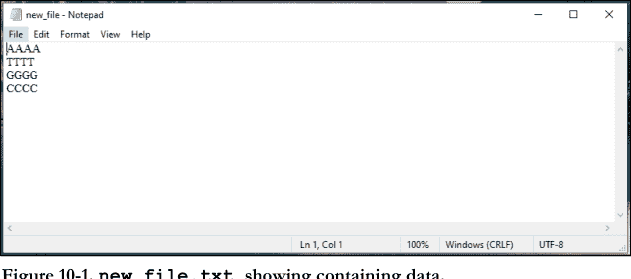

图 10-1. **new_file.txt** 显示包含的数据。

#### 10.2.1. **read()**、**readline()** 和 **readlines()** 方法

*文件对象*有`read()`方法用于读取内容，它将文件内容作为字符串对象返回<sup>代码示例 10-2，第5-7行</sup>。我在*桌面*上创建了`new_file.txt`，它有四行<sup>图 10-1</sup>。现在我将读取该文件。由于Python位于不同的位置，我将使用文本文件的完整路径作为第一个参数。参见代码示例 10-3。

```python
>>> #reading file
>>> #assuming new_file.txt located in the same folder as Python
>>>
>>> f = open('new_file.txt')
>>> content = f.read()
>>> type(content)
<class 'str'>
>>> type(f)
<class '_io.TextIOWrapper'>
>>>
```

**代码示例 10-2**

然而，`readline()`方法不是访问所有行，而是每次返回一行。每次调用`readline()`时，它都会读取一个新行。通过调用`readline()`两次，你可以读取前两行；调用三次，你可以读取前三行，依此类推。而`readlines()`方法返回一个*列表*，其中包含文本文件的所有行作为其元素。参见代码示例 10-4。

```python
>>> #reading and printing the content of new_file.txt
>>>
>>> f = open(r'C:\Users\Desktop\new_file.txt', 'r')
>>> f_data = f.read()
>>> print(f_data)
AAAA
TTTT
GGGG
CCCC
>>> f.close()
>>> #close() method will be discussed later
>>>
```

代码示例 10-3

```python
>>> #reading by lines: readline() & readlines()
>>>
>>> f = open(r'C:\Users\Desktop\new_file.txt')
>>> f_l1 = f.readline()
>>> print(f_l1)
AAAA

>>> f_l2 = f.readline()
>>> print(f_l2)
TTTT

>>> f.close()
>>>
>>> #after closing file must be reopened to read
>>>
>>> f = open(r'C:\Users\Desktop\new_file.txt')
>>> f_list = f.readlines()
>>> print(f_list)
['AAAA\n', 'TTTT\n', 'GGGG\n', 'CCCC']
>>>
```

代码示例 10-4

你可能已经注意到每行之后都插入了换行符（代码示例 10-4中的第7行、第11行和第15行）。这是由于每行末尾（最后一行除外）“隐藏”了一个换行符（\n）。当你在文本文件中看到换行时，这表示末尾插入了一个隐秘的\n。`readline()`和`readlines()`函数揭示了隐藏的\n。此外，在后台，`print()`默认在提供的打印参数末尾添加一个\n。这两个\n相加就产生了一个空白。这就像在写东西时按了两次键盘上的*回车键*。一个\n就像键盘上的物理回车键。然而，有很多方法可以避免这种效果，例如使用字符串方法`rstrip()`<sup>1</sup>，以'\n'作为参数<sup>代码示例 10-5</sup>，或者在调用`print()`时将*关键字参数*`end`的默认'\n'替换为空字符串（代码示例 10-5中的第11行和第12行），等等。

```python
>>> #removing '\n' from each line
>>>
>>> f = open(r'C:\Users\Desktop\new_file.txt')
>>> f_l1 = f.readline().rstrip('\n')
>>> print(f_l1)
AAAA
>>> f_l2 = f.readline().rstrip('\n')
>>> print(f_l2)
TTTT
>>> f_l3 = f.readline()
>>> print(f_l3,end = '')
GGGG
>>> f.close()
>>>
```

**代码示例 10-5**

#### 10.2.2. 使用 **for** 循环

可以通过使用*for循环*遍历可迭代的文件对象来逐行读取文件<sup>代码示例 10-7</sup>。

<sup>1</sup> 它从字符串末尾移除参数指定的字符。默认情况下，它会移除字符串末尾的任何空格。

## 第10章：文件处理

```python
>>> #使用for循环读取文件
>>>
>>> f = open(r'C:\Users\Desktop\new_file.txt')
>>> for i in f:
        print(i,end = '')

AAAA
TTTT
GGGG
CCCC
>>> f.close()
>>>
```

代码示例 10-6

### 10.3. 写入文件

`write()`函数用于向文件写入内容。但要使用它，需要以*写入*或*追加*模式打开文件。如果文件已存在，以写入模式打开会清除旧数据。但如果文件不存在，则会创建一个新文件。参见代码示例10-7。

### 10.4. close()

你已经在代码示例中见过`close()`方法的使用，`>>> fileobject.close()`。在代码示例10-5中，读取并打印前三行后，第13行的`f.close()`显式关闭了文件。要再次使用文件，需要重新打开它。养成在完成文件操作后始终关闭文件的好习惯。这个习惯将避免未来不必要的麻烦。

值得一提的是，使用`with`语句，我们可以省略关闭语句。退出`with`语句后，通过它打开的文件会被隐式关闭。参见代码示例10-8了解`with`语句的语法。

```python
>>> #向文件写入内容
>>>
>>> #在桌面目录创建一个新文件 new_file_1.txt
>>> f = open(r'C:\Users\Desktop\new_file_1.txt', 'w')
>>>
>>> #将序列ATGC写入新创建的文件
>>> f.write('ATGC')
4
>>> f.close()
>>>
>>> #检查新创建文件的内容
>>> f1 = open(r'C:\Users\Desktop\new_file_1.txt')
>>> print(f1.read())
ATGC
>>> f1.close()
>>>
>>> #现在将GGTT序列作为新行追加到 new_file_1.txt 中
>>> f2 = open(r'C:\Users\Desktop\new_file_1.txt', 'a')
>>> f2.write('\nGGTT')
5
>>> f2.close()
>>>
>>> #再次检查更新后的 new_file_1.txt
>>> f3 = open(r'C:\Users\Desktop\new_file_1.txt')
>>> print(f3.read())
ATGC
GGTT
>>> f3.close()
>>>
```

代码示例 10-7

```python
>>> #with open('文件名', '模式') as 文件句柄:
>>>
>>> with open(r'C:\Users\Desktop\new_file.txt') as f:
        print(f.read())

AAAA
TTTT
GGGG
CCCC
>>> #文件现在已关闭。无需显式使用 close()
```

代码示例 10-8

## 第11章：函数

到目前为止，我们编写的都是小型的“一次性”代码。这是一种“用完即弃”的方法。这种方法适合学习。但这些小程序用处不大。几乎在所有情况下，我们都需要编写更大的程序，为此，需要重用一段代码。因此，我们需要**函数**，一个*可重用的代码块*，它*独立于程序中的其他代码*。是的，它和`print()`、`len()`、`type()`等一样。这些是Python中的内置函数。除了这些，Python还允许我们创建自己的函数。

### 11.1. 定义函数

在Python中，创建函数被称为“*定义函数*”。这里有一小段代码，用于计算任何多核苷酸字符串中腺嘌呤核苷酸的数量<sup>代码示例 11-1</sup>。现在假设在一个大型程序中，这个`A_counter`需要被多次使用。那么，只需将这段代码转换成一个函数`a_count`，就能解决这个问题！当我们调用它时，`a_count`将`返回`任何多核苷酸字符串的腺嘌呤计数<sup>代码示例 11-2</sup>。函数的不同部分在图11-1中描述。

```python
>>> #A_counter
>>> seq = 'AATGCAT'
>>> a_count = seq.count('A')
>>> print(a_count)
3
>>>
```

**代码示例 11-1**

尽管如此，在深入之前，你必须记住以下关键概念。这些将指导你未来正确地定义函数。

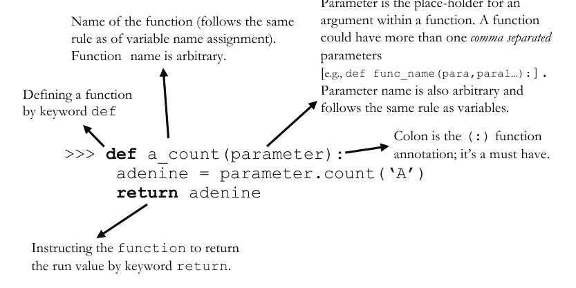

i) 函数名后的圆括号，包含所谓的*参数*。*参数*是*实参*的*占位符*。它就像函数定义内部列出的一个*变量*，而实参是在调用函数时传递给函数的*值*。通过参数，函数接收值，并将其传递给内部的代码块进行处理。

ii) 虽然可以编写一个*没有*参数的函数，但该函数将不接受实参。

iii) 函数*内部*的所有内容对程序来说都是*不可访问的*，因为*函数创建了抽象*，程序*只能*在*调用*函数时访问它。

iv) *变量作用域*：函数体内的变量称为**局部变量**（例如，代码示例11-2第4行的`adenine`），而函数体外的变量称为**全局变量**（例如，代码示例11-2第10行的`var`）。虽然你知道变量名在特定程序中是*唯一的*，但你可以在函数体*外*使用局部变量的名称。如果一个局部变量与一个全局变量同名，函数*内部*的任何代码都将访问局部变量。函数*外部*的任何代码将访问全局变量。

如果你不能完全理解所有概念，不要害怕。这对初学者来说是正常的。在获得函数使用经验后，你最终会理解所有内容。在那之前，请坚持住，并记住*开头的def关键字、第一行末尾的冒号(:)以及之后的缩进部分在定义函数时极其重要！*

```python
1   >>> # '定义' 函数 a_count
2   >>>
3   >>> def a_count(parameter):
4           adenine = parameter.count('A')
5           return adenine
6   >>>
7   >>> # 调用 a_count 并传递 'AAAAA' 作为实参，并将
8   >>> # 返回值存储在变量 var 中
9   >>>
10  >>> var = a_count('AAAAA')
11  >>> print(var)
12  5
13  >>>
14  >>> # 再次调用它，不存储返回值
15  >>>
16  >>> print(a_count('AATGAA'))
17  4
18  >>>
```

**代码示例 11-2**

### 11.2. 位置参数和关键字参数

现在我定义一个函数`A_checker()`，它将检查一个核苷酸序列是否具有特定百分比（%）的腺嘌呤含量<sup>代码示例 11-3</sup>。该函数将接受*两个*实参，一个用于序列，另一个用于用户定义的腺嘌呤百分比阈值。函数将返回*布尔值*作为输出。它将计算输入字符串的腺嘌呤百分比，并与阈值进行比较。如果腺嘌呤百分比超过阈值，它将返回`True`，否则返回`False`。

```python
>>> #定义 A_checker
>>>
>>> def A_checker(seq,cutoff):
        seq_up = seq.upper()
        atgc ={n:seq_up.count(n) for n in seq_up}
        a_per = (atgc['A']/len(seq_up))*100
        if a_per > cutoff:
            return True
        else:
            return False

>>> #调用 A_checker() 并直接打印，使用第一个
>>> #位置参数 'aatgc'（对应第一个参数：seq）和第二个位置参数 20% 阈值
>>> #（对应第二个参数：cutoff）
>>>
>>> print(A_checker('aatgc',20))
True
>>>
>>> #更改第二个位置参数
>>>
>>> print(A_checker('aatgc',50))
False
>>>
>>> #搞乱参数顺序会导致错误
>>>
>>> print(A_checker(50, 'aatgc'))
Traceback (most recent call last):
  File "C:/Users/krish/Desktop/func.py", line 27, in <module>
    print(A_checker(50, 'aatgc'))
  File "C:/Users/krish/Desktop/func.py", line 4, in A_checker
    seq_up = seq.upper()
AttributeError: 'int' object has no attribute 'upper'
>>>
>>> #续见代码示例 11-4
```

Python中两种主要的参数类型是*位置参数*和*关键字参数*。位置参数需要按照其对应参数的*顺序*包含。参见代码示例11-3。函数`A_checker()`将把它的第一个实参视为序列值（对应的参数是`seq`；第3行），第二个实参视为阈值百分比（对应的参数是`cutoff`；第3行）。如果我们搞乱顺序，将导致错误。仔细看第33行；`AttributeError: 'int' object has no attribute 'upper'`。它显示Python在对一个`int`对象应用`upper()`方法时遇到问题，因为`upper()`是一个字符串方法。Python通过`seq`参数传递了第一个实参，该参数应该是`str`类型，但我放了一个`int`！如果你记住实参的*位置值*，这个特性很有帮助且节省时间。然而，如果你的位置感不是那么好，这个特性可能会适得其反。相反，你可以通过对应参数的名称来指定实参，这将被称为`关键字参数`。关键字参数是传递给函数或方法的实参，它*前面*有一个*关键字或标识符*（即*参数名*）和一个*赋值运算符*（`=`）代码示例11-4。这里要注意，一个函数接受的实参数量与定义时指定的（通过使用占位符参数）完全一致。例如，

```python
>>> #关键字参数（续代码示例 11-3）
>>>
>>> #重写代码示例 11-3 的第27行，通过使用
>>> #参数作为关键字，将位置参数转换为关键字参数
>>>
>>> print(A_checker(cutoff = 50, seq = 'aatgc'))
False
>>>
>>> #注意：在给实参标记关键字后，它们的位置值
>>> #变得无关紧要
>>>
```

代码示例 11-4

### 11.3. 默认参数值

Python 允许其函数的参数具有默认值。当程序员在不提供参数的情况下调用函数时，这些默认值就派上了用场。在这种情况下，只要用户没有覆盖默认值，函数被调用时默认值就会自动传递。你可以通过使用*赋值运算符 (=)* 来为参数指定默认值，就像为变量赋值一样<sup>CodeEx 11-6</sup>。从 CodeEx 11-6 中，你可以看到 `at_content()` 会根据你的需要返回不同精度的输出，如果你没有指明精度要求，它将根据默认值将结果四舍五入到 4 位小数。另外，请注意 CodeEx 11-6 中的第 21 行没有引发错误，而 CodeEx 11-5 中的第 16 行在类似情况下却引发了错误。这就是默认参数的妙处。

`dna_concat()` 恰好接受两个参数<sup>CodeEx 11-5</sup>，任何对此的改动都会引发错误。请仔细阅读 CodeEx 11-5 中那些不言自明的错误信息。

```
>>> #dna concatenator
>>> #a function that joins two input DNA strings
>>>
>>> def dna_concat(seq_1,seq_2):
        concat_seq = seq_1 + seq_2
        return concat_seq

>>> print(dna_concat('aaa','ttt'))
aaattt
>>>
>>> #a function exactly takes the number of arguments specified
>>> #at the time of defining (i.e., the number of parameters)
>>> #e.g., dna_concat() takes exactly two args, alteration to
>>> #which elicits an error
>>>
>>> print(dna_concat('aaa'))
Traceback (most recent call last):
  File "C:/Users/krish/Desktop/func.py", line 16, in <module>
    print(dna_concat('aaa'))
TypeError: dna_concat() missing 1 required positional argument:
'seq_2'
>>>
>>> #another example with 3 args
>>>
>>> print(dna_concat('aaa','ttt','ccc'))
Traceback (most recent call last):
  File "C:/Users/krish/Desktop/func.py", line 25, in <module>
    print(dna_concat('aaa', 'ttt', 'ccc'))
TypeError: dna_concat() takes 2 positional arguments but 3 were
given
>>>
```

```
>>> #defining a function to check AT content
>>>
>>> def at_content(input_seq,round_to = 4):
    seq = input_seq.upper()
    atgc = {i:seq.count(i) for i in seq}
    at = ((atgc['A']+atgc['T'])/len(seq))*100
    return round(at,round_to)

>>> #rounding outcome to 2 decimal places
>>> print(at_content('aatgtcgatcgac',2))
53.85
>>>
>>> #rounding outcome to 6 decimal places for better accuracy
>>> print(at_content('aatgtcgatcgac',6))
53.846154
>>>
>>> #but by default, the function rounds to 4 decimal places
>>> print(at_content('aatgtcgatcgac'))
53.8462
>>>
```

CodeEx 11-6

### 11.4. 文档字符串

文档字符串（*documentation string*）是出现在函数定义中作为*第一条语句*的字符串字面量。文档字符串使用*三引号*声明。文档字符串用于向用户提供关于函数功能的合理说明。它就像代码中的注释。你可以使用 `__doc__` 方法或 `help` 函数来访问文档字符串<sup>CodeEx 11-7</sup>。你也可以对内置函数使用文档字符串，例如 `print(len.__doc__)` 或 `print(print.__doc__)`。试试看吧！

```
>>> #docstring
>>>
>>> def at_content(input_seq,round_to = 4):
    '''This function calculates AT content
    It takes two args. First positional arg is the nucleotide
    string (keyword: input_seq) and second one is the desired
    rounding (keyword: round_to) with a default value of 4'''

    seq = input_seq.upper()
    atgc = {i:seq.count(i) for i in seq}
    at = ((atgc['A']+atgc['T'])/len(seq))*100
    return round(at,round_to)

>>> #everything within ''' ''' is a docstring
>>>
>>> #accessing the docstring by help()
>>> help(at_content)
Help on function at_content in module __main__:

at_content(input_seq, round_to=4)
    This function calculates AT content
    It takes two args. First positional arg is the
    nucleotide string (keyword: input_seq)
    and second one is the desired rounding
    (keyword: round_to) with a default value of 4
>>>
>>> #accessing the raw docstring by __doc__ (observe the
>>> #difference in output)
>>> print(at_content.__doc__)
This function calculates AT content
It takes two args. First positional arg is the
nucleotide string (keyword: input_seq)
and second one is the desired rounding
(keyword: round_to) with a default value of 4
>>>
```

## 12. 模块

我想我现在可以放心地假设你知道如何创建“你自己的”函数了，我必须为这一了不起的成就向你表示祝贺。恭喜！有了你的函数，你就可以自动化处理那些枯燥的事情了！编写一次函数，多次使用。但请记住，这种使用仅限于你创建它的脚本。在该脚本之外，你的函数是不可用的！然而，如果你想在其他程序中使用你的函数呢？假设你想在你接下来的程序中使用你创建的函数 `at_content()`，为此，你需要创建一个**模块**。让我们开始吧。

### 12.1. 模块的结构

*模块*不过是一个包含一组函数的 *Python 脚本*。它就像一个函数库；尽管只有一个函数的模块也是完全可行的。除了函数，模块还可以包含任何其他对象，如列表、字符串、字典等。

现在，让我用一个类比来解释模块的结构。想象一个有多个房间的图书馆建筑。每个房间都有多个装满书的书架。现在，如果我把 Python 脚本比作一本书，那么一个书架就是一个*模块*，图书馆的房间就是*包*，而图书馆本身则类似于 Python 的*库*。

Python 在其主框架中有许多非常有用的内置通用函数。所以，当我们需要它们时，我们*调用*它们（例如，`print()`、`len()` 等）。除此之外，Python 还有许多“专用函数”，我们可以随时使用它们来让我们的生活更轻松。为了防止 Python 变得臃肿，创建者将这些函数单独存储在主框架之外。他们将这些函数组织在结构化的目录、模块和包中。要使用这些函数，我们必须首先使用 `import` 关键字来*导入*它们。

### 12.2. 创建模块

从技术上讲，*任何* Python 脚本都可以充当模块，这没什么特别的。所以，创建一个模块很简单。只需创建一个包含所需函数的 Python 脚本，就这样。现在，我在一个新的文本文件中定义了两个*函数*，并将其保存在桌面上，命名为 `atgc_cal.py`<sup>CodeEx 12-1</sup>。从现在开始，我可以将该脚本用作模块。

```
#atgc_cal.py module

#creating a dict
nucleotide = {'A':'Adenine',
              'G':'Guanine',
              'C':'Cytosine',
              'T':'Thymine'}

#func:1
def at_cal(seq_in,round_to):
    '''calculates AT content:
takes two arguments (para:seq=str &
round_to=int; output % of AT'''
    seq = seq_in.lower()
    at = ((seq.count('a')+seq.count('t'))/len(seq))*100
    return round(at,round_to)

#func:2
def gc_cal(seq_in,round_to):
    '''calculates GC content:
takes two arguments (para:seq=str &
round_to=int; output % of GC'''
    seq = seq_in.lower()
    gc = ((seq.count('g')+seq.count('c'))/len(seq))*100
    return round(gc,round_to)
```

### 12.3. 使用模块

#### 12.3.1. 导入模块

如前所述，特定模块的函数并非开箱即用。要使用它们，你必须首先使用 `import` 关键字来`导入`该模块。在 CodeEx 12-2 中，我将 `atgc_cal.py` 导入到一个名为 `module.py` 的 Python 脚本中。我将 `module.py` 保存在桌面上，与我存储模块的目录相同。

```
#importing atgc_cal.py module into the script module.py

import atgc_cal
```

CodeEx 12-2

```
#importing atgc_cal.py module into the script module.py
import atgc_cal

#now calling at_cal()
at_content = atgc_cal.at_cal('aatgcatagatc',2)
print(at_content)

#calling gc_content()
gc_content = gc_cal('aatgcatagatc',2)
print(gc_content)

================ RESTART: C:\Users\Desktop\module.py ================
66.67
Traceback (most recent call last):
  File "C:\Users\Desktop\module.py", line 12, in <module>
    gc= gc_cal('aatgcatagatc',2)
NameError: name 'gc_cal' is not defined
>>>
>>> #NameError occurred because gc_cal() was called without
referring to the module. Hence Python could not recognize it.
>>>
```

CodeEx 12-3

#### 12.3.2. 从模块调用函数

导入模块后，可以使用 `module.function(args)` 的语法来访问其函数。请参考代码示例 12-3 以更好地理解。运行程序会得到预期结果，包括错误信息。在调用函数时只需引用模块名，就能使代码无误<sup>代码示例 12-4</sup>。

```python
#调试 代码示例 12-3

import atgc_cal
at_content = atgc_cal.at_cal('aatgcatagatc',2)
print(at_content)
gc_content = atgc_cal.gc_cal('aatgcatagatc',4)
print(gc_content)

================ RESTART: C:\Users\Desktop\module.py ================
66.67
33.3333
>>>
```

#### 12.3.3. 从模块导入函数

使用 `module.function(args)` 的语法从模块调用函数，可能并非对所有人都有吸引力。每次都要写模块名可能很乏味，但这是可以避免的。你可以不导入整个模块，而是使用 `from` 关键字只导入你选择的函数，以便独立使用它<sup>代码示例 12-5</sup>。

```python
#从模块 atgc_cal.py 导入函数 at_cal()
from atgc_cal import at_cal

#现在可以直接调用 at_cal()，无需模块名
at_content = at_cal('aatgcatagatc',2)
print(at_content)

================ RESTART: C:\Users\Desktop\module.py ================
66.67
>>>
```

#### 12.3.4. 导入时重命名模块

为了方便起见，Python 允许我们在导入模块时更改其名称。通过使用 `as` 关键字，你可以根据自己的需要为模块命名。例如，每次调用函数都写 `atgc_cal` 很繁琐。相反，可以为模块创建一个别名 `a`。现在使用代码示例 12-6 会更方便。创建别名不会对模块本身造成任何永久性更改。此别名仅限于你编码它的脚本内。

```python
#导入模块时创建别名

import atgc_cal as a

#现在只需使用 a 而不是 atgc_cal

at_content = a.at_cal('aatgcatagatc',2)
print(at_content)

================ RESTART: C:\Users\Desktop\module.py ================
66.67
>>>
```

代码示例 12-6

### 12.4. 了解模块的组成部分

创建模块后，很可能会忘记它的某些组成部分。这会在以后使用该模块时造成问题。Python 有一个内置函数 `dir()`，它返回一个包含模块所有组成部分的列表。它以模块名作为参数<sup>代码示例 12-7</sup>。

请注意，`dir()` 返回指定对象的所有属性和方法，包括所有对象默认的内置属性。所以，不要感到困惑。如果你仔细查看代码示例 12-7 的结果，可以清楚地区分出内置属性。

```python
#列出 atgc_cal.py 的组成部分

import atgc_cal
print(dir(atgc_cal))

['__builtins__', '__cached__', '__doc__', '__file__',
'__loader__', '__name__', '__package__', '__spec__', 'at_cal',
'gc_cal', 'nucleotide']
>>>
```

### 12.5. sys 模块

现在来谈谈导入用户自定义模块的实际问题。
坦率地说，要同步所有用户自定义模块与所有脚本的目录是不可能的！你学习 Python 是为了让日常任务更轻松、更自动化，而不是更枯燥、更手动！所以，随心所欲地创建模块，并将它们存放在你电脑上的任何特定文件夹、任何位置。复制文件夹路径，然后就不用管了！Python 有内置的 `sys` 模块来为你完成同步工作。
现在，你可以在电脑上的任何位置启动脚本，只需三行代码就能从任何目录访问特定模块！

```python
#从外部目录将 atgc_cal 导入到 alienmod

import atgc_cal as a
print(dir(a))

=============== RESTART: C:\Users\Desktop\alienmod.py ===============
Traceback (most recent call last):
  File "C:\Users\Desktop\alienmod.py", line 3, in <module>
    import atgc_cal as a
ModuleNotFoundError: No module named 'atgc_cal'
>>>
>>> #Python 找不到这样的模块，因此给出
>>> #ModuleNotFoundError
```

例如，我在目录 `C:\Users\Documents\pyintromodule` 中创建了一个文件夹 `pyintromodule`，并将 `atgc_cal.py` 模块移入其中。现在我想将它导入到目录 `C:\Users\Desktop` 中的脚本 `alienmod` 中。

请看代码示例 12-8。运行后，程序没有找到该模块，因为目录不同。使用 Python 的内置模块 `sys` 可以解决这个问题。调试过程请参见代码示例 12-9。现在让我解释一下代码示例 12-9 中发生了什么。

```python
python
'''使用内置的 sys 模块，将模块 atgc_cal.py 的目录添加到
Python 默认检查的目录检查列表中'''

import sys
if r'C:\Users\Documents\pyintromodule' not in sys.path:
    sys.path.append(r'C:\Users\Documents\pyintromodule')

#现在目录路径已追加到路径列表 path 中
import atgc_cal as a
print(a.at_cal('atgc',2))

================ RESTART: C:\Users\Desktop\alienmod.py ================
50.0
>>>
```

**代码示例 12-9**

名为 `path` 的列表是 `sys` 模块的一个组成部分，它列出了 Python 为查找可用模块而检查的目录。该程序的目标是将新模块的目录添加到列表中，以便下次程序运行时能找到 `atgc_cal.py` 的目录。第 5 行导入 `sys` 模块以使用列表 `path`。第 6 行通过条件语句检查 `atgc_cal` 模块的目录路径是否在 Python 的检查列表中。第 7 行确保如果未找到，则必须将该路径追加到列表 `path` 中。这样，新的目录路径将被临时纳入 Python 的默认搜索列表。程序的其余部分你已经熟悉了。

如果你觉得这个机制太复杂，别担心。像这样复杂的概念会随着时间的推移和经验的积累而逐渐理解。目前，只需记住代码，并尝试代码示例 12-10，仔细观察输出。

```python
python
'''自己尝试这段代码，你就会明白 sys 模块和 path 列表是如何工作的'''

import sys

#打印 path
print('The path list is:',sys.path)

#遍历 path 并逐个打印其元素
for element in sys.path:
    print(element)

#现在添加你电脑上模块的路径
if r'C:\path on your PC' not in sys.path:
    sys.path.append(r'C:\Users\Documents\pyintromodule')
```

**代码示例 12-10**

### 12.6. Python 的内置模块

到目前为止，我主要讨论了如何创建自定义模块以及如何使用它。这将增加你对 Python 模块工作原理的理解。Python 拥有庞大的内置模块和标准库集合，几乎涵盖了你能想象到的所有任务，甚至包括你想不到的！在实际的 Python 应用中，这些工具极其重要。你已经遇到过这样一个模块 `sys`。在下一章中，你将看到另一个这样的模块 `re`，即正则表达式模块。

现在，我想向你介绍另一个与上下文相关的内置模块 `random`。这是一个*伪随机数生成器 (PRNG)*，用于生成随机数或序列。在生物学中，它很有用，尤其是在模拟方面。我在这里向你展示一个它有趣的用途。假设出于某种目的，你需要一个随机的核苷酸或肽序列。让我们用代码示例 12-11 来实现它。我们不再深入探讨，因为这可能不是初学者编程教材的一部分。而且，我不会详细解释它。你几乎已经读完了本书。现在，你的练习是逐步剖析代码来理解它。玩转它，并在每次练习生成随机序列时使用这个模块。每次都有一个全新的序列，你的练习过程会更加愉快！

```python
>>> #生成特定长度的随机 DNA 序列
>>> #使用 choice() 方法，它将从可迭代数据类型中随机选择
>>> #任意字符
>>>
>>> import random as r
>>> rand_dna = ''.join(r.choice('ATGC') for i in range (1000))
>>>
>>> print(len(rand_dna))
>>> print(rand_dna)
>>>
>>> #这也可以写成
>>>
>>> rand_seq = ''
>>> for i in range(1000):
        rand_seq += r.choice('ATGC')

>>> print(rand_seq)
>>>
>>> #choice() 方法从字符串 'ATGC' 的 4 个字符中选择
>>> #如果你用氨基酸代码修改它，它将形成
>>> #随机的肽序列。
>>> #这里 range 决定了输出序列的长度。根据你的需要
>>> #进行更改。
>>>
```

## 13. 正则表达式

恭喜！你已经成功学到了最后一章。你学习了这么多新知识，掌握了这么多新技能！现在你已经足够强大，可以独自开始编程冒险了。在这最后一章，我将讨论另一项“不太初级”的技能——*正则表达式*！它将帮助你查找复杂的生物学模式。

模式在生物学中非常重要。我们在计算生物学和生物信息学中做的大部分工作都是在寻找模式。它可能是DNA序列上的限制性酶切位点，也可能是肽链中的保守基序。它可能是DNA上的复制起点，也可能是RNA的poly-A尾巴。它可能是在健康基因组中寻找疾病模式，也可能是在两个物种之间寻找全基因组模式以推断它们的系统发育关系。编程为我们长期以来在寻找这些模式、对抗严重疾病并预测其发展和命运、在个性化医疗中脱颖而出、了解我们的祖先等方面提供了所需的推动力。随着我们掌握新时代的计算能力，这样的可能性正在不断扩大！

### 13.1. re 模块

*正则表达式*，通常缩写为 **RegEx**，是形成搜索模式的字符序列。正则表达式使模式搜索变得容易得多。虽然它绝不是新手的工具，但对于生物学家来说，它是必须掌握的。RegEx 作为 Python *标准模块* `re` 提供。因此，要使用它，首先必须 `import` 它。让我们通过使用 `re` 来探索复杂的模式搜索。

### 13.2. 查找限制性酶切位点

EcoRI 的限制性酶切位点（RES）很简单：G/AATTC（/ 表示酶切位点）。因此，在 DNA 序列中找到它并不难。然而，许多 RES 是难以捉摸的。如果你需要找到 AasI 限制性酶的 RES，即 GACNNNN/NNGTC（N 可以是四种核苷酸 A/T/G/C 中的任何一种），或者 AccB1I 限制性酶的 RES，即 G/GYRCC（Y 代表 C 或 T，R 代表 A 或 G），该怎么办呢？如果你试图用目前所学的知识来解决这些问题，虽然并非不可能，但会很棘手。试一试吧！

如你所知，找到 EcoRI 的 RES 很容易<sup>CodeEx 13-1</sup>。然而，使用 RegEx，找到 AccB1I（和/或 AasI）的 RES 就像找到 EcoRI 的一样容易。参见 CodeEx 13-2。

```python
#EcoRI RES finder
def ecor1(seq_raw, rs = 'gaattc'):
    seq = seq_raw.lower()
    loc = seq.find(rs)
    if loc != -1:
        return loc
    else:
        return 'not found'

res = ecor1('aaattgaattctggca')
print('EcoR1 RES location:', res)
```

**CodeEx 13-1**

```
EcoR1 RES index: 5
>>>
```

CodeEx 13-2 中有很多内容。让我解释一下。这里，第2行定义了函数 `accbl()`，它接受两个参数。第一个参数是输入序列的占位符。第二个参数有一个*默认值*，即 AccB1I 的限制性序列。这里最重要的是要注意第二个参数的默认值：`r'GG(C|T)(A|G)CC'`。开头的 `r` 使其成为*原始字符串*²。这里，像 `|`、`()` 这样的字符被称为元字符。它们具有特殊功能。RegEx 中的*管道字符*（`|`）等同于“或”。Python 将 `C|T` 和 `(A|G)` 分别解释为*要么 C 要么 T* 和 *要么 A 要么 G*。因此，Python 将这个 RegEx 定义的模式解释为 GGCACC 或 GGCGCC 或 GGCACC 或 GGTGCC，并在输入序列中搜索匹配项。

第11行调用了 `re` 函数 `search()`。`search()` 接受两个位置参数。第一个是“*要搜索的模式*”，第二个是“*要搜索的序列*”。如果找到匹配项，它返回一个*匹配对象*（另一种 Python 类型）。否则，它返回 `None`。第4行通过将搜索结果赋值给 `res` 变量来存储它。注意，这个 `res` 是一个*局部变量*，因为它是在函数体内指定的（比较第12行，其中的 `res` 是一个*全局变量*）。匹配对象保存*匹配的序列*及其位置，即其*索引*。然而，这些信息不能直接获取。为此，你应该在匹配对象上*调用*特定的方法。

第6行使用了这样的方法，在匹配对象 `res` 上调用 `group()` 和 `start()`。`group()` 提取*匹配的内容*，而 `start()` 提取匹配的起始位置。如果没有找到匹配项，那么变量 `res` 将持有 `None`，并在条件测试中被评估为 `False`，然后第8行将被执行。其余的代码很简单，我认为这里不需要任何解释。

```python
#defining AccB1I RES finding function
def accbl(raw_seq, rs=r'GG(C|T)(A|G)CC'):
    seq = raw_seq.upper() #upper() or lower() your choice
    res = re.search(rs, seq)
    if res:
        return 'RES:' + res.group() + ', at loc:' + str(res.start())
    else:
        return 'not found'

#now importing the re module and calling accbl()
import re
res = accbl('aatggcaccggc')
print(res)
```

**CodeEx 13-2**

```
RES:GGCACC, at loc:3
>>>
```

² 由于 RegEx 使用大量特殊字符，当字符串打算在 RegEx 中使用时，将其转换为原始字符串是一个好习惯。这一步消除了给 Python 造成不必要混淆的可能性。

### 13.3. 元字符

通过元字符的不同组合，我们可以生成复杂的搜索模式，这在生物学中确实非常有用。这里我列出一个元字符列表，并附上关于其用法的简要描述和示例（表 13-1）。

### 13.4. `search()`

`re` 模块的基本函数是 `search()`。我在 CodeEx 13-2 中已经讨论过它。它的语法是 `re.search(pattern, str to search in)`。它在字符串中搜索模式以查找*匹配项*，如果在字符串中的任何位置找到匹配项，则返回一个匹配对象。否则，它返回 `None`。然而，`search()` 有一个缺点。如果存在多个匹配项，它只返回第一个匹配项<sup>CodeEx 13-3</sup>。为了克服这个限制，`re` 有 `findall()` 方法。但在讨论 `findall()` 之前，我们应该讨论匹配对象的属性及其可用的方法。

表 13-1. RegEx 元字符

| 元字符 | 搜索模式匹配 | 描述 |
| :--- | :--- | :--- |
| A | T | A 或 T | 要么 A 要么 T |
| GAA | TAA | GAA 或 TAA | 要么 GAA 要么 TAA |
| (AT) | AT | 捕获和分组；将 AT 视为一个组 |
| GA(A | T)AA | GAAAA 或 GATAA | 要么 A 要么 T，因为它们被分组了 |
| [ATGC] | A 或 T 或 G 或 C | 字符集。搜索模式匹配括号内的任何一个字符。 |
| [A-D] | A 或 B 或 C 或 D | 返回 A 到 D 之间字母顺序的任何一个字符的匹配 |
| A[GC]T | AGT 或 ACT | G 或 C |
| A.T | A (1 或 A 或 X 或 @ 等，除了 '\n') T | 点号代表任何单个字符（除了换行符） |
| ^AUG | AUGTAA 但不是 AAUGTAA | 任何以 AUG 开头的字符串 |
| [^ATGC] | NOT (A 或 T 或 G 或 C) | 匹配除 A、T、G、C 之外的任何内容 |
| GC[^AT]GA | GCCGA 或 GCGGA 或 GCXGA 或 GC#GA 或 GA3GA 等 | 匹配 GC 和 GA 之间除 A、T 之外的任何内容 |
| UAA$ | TAAAUAA 但不是 AAUGTAUAA | 任何以 UAA 结尾的字符串 |
| ATC* | AT 或 ATC 或 ATCC 或 ATCCC 或 ATCCCC 等 | AT 之后 C 出现零次或多次 |
| ATC+ | ATC 或 ATCC 或 ATCCC 等，但绝不是 AT | AT 之后 C 至少出现一次或多次 |
| ATC? | AT 或 ATC | C 出现零次或仅一次 |
| ATC{3} | ATCCC | C 恰好出现指定次数（3次） |
| (ATC){2} | ATCATC | ATC（作为分组）恰好出现指定次数（2次） |
| A(TC){2} | ATCTC | TC（作为分组）恰好出现指定次数（2次） |
| ATC{1,3} | ATC 或 ATCC 或 ATCCC | C 出现一次、两次或三次 |
| \ | 表示特殊字符 | \d 返回字符串包含数字（0 到 9）的匹配项 \D 返回字符串不包含任何数字的匹配项 |

## 第13章：正则表达式

```python
# 定义AccB1I限制性酶切位点查找函数
def accb1(raw_seq, rs=r'GG[CT][AG]CC'):
    seq = raw_seq.upper()  # upper() 或 lower() 任选其一
    res = re.search(rs, seq)
    if res:
        return 'RES:' + res.group() + ', at loc:' + str(res.start())
    else:
        return 'not found'

# 现在导入re模块并调用accb1()
import re
res = accb1('aatggcaccggcggcgccta')
print(res)

# RES:GGCACC, at loc:3
# >>>
# >>> # 尽管输入序列在索引8处有第二个匹配（GGCGCC），
# >>> # 但该函数只返回第一个匹配
# >>>
```

代码示例 13-3

### 13.5. 匹配对象及其方法

匹配对象保存了关于匹配模式的*内容*和*位置*的数据。然而，这些数据不能直接作为列表或字符串使用。匹配对象有其自身的方法来提取数据。

**group() :** 这样一个方法`group()`，在匹配对象上调用时，返回字符串中与模式匹配的部分<sup>代码示例 13-4</sup>。

**span() :** 另一个匹配对象方法`span()`返回一个包含匹配的*起始-结束*位置的元组<sup>代码示例 13-4</sup>。

**start() & end() :** 这些方法分别返回匹配部分的*起始索引*和*结束索引*。

```python
# 定义AccB1I限制性酶切位点查找函数
def accb1(raw_seq, rs=r'GG(C|T)[AG]CC'):
    seq = raw_seq.upper()  # upper() 或 lower() 任选其一
    res = re.finditer(rs, seq)
    # 使用字典推导式
    seq_dict = {m.group(): m.span() for m in res}
    return seq_dict

# 现在导入re模块并调用accb1()
import re
res = accb1('aatggcaccggcggcgccta')
print(res)

# {'GGCACC': (3, 9), 'GCGCC': (12, 18)}
# >>>
# >>> # 匹配的序列是键，其位置（包含起始和结束的元组）
# >>> # 是结果字典seq_dict中的值
# >>>
```

### 13.6. findall()

如果存在多个匹配，`findall()`返回一个包含所有非重叠匹配的列表。其语法为`re.findall(pattern, 要搜索的字符串)`。它不返回任何匹配对象。然而，它有一个缺点：它只返回匹配项，而不返回它们的索引。为此，`re`模块有`finditer()`方法。

### 13.7. finditer()

`finditer()`返回一个匹配对象序列，每个对象包含关于每个匹配模式及其位置的数据。因此，要对`finditer()`的返回值进行任何有用的操作，我们必须使用循环遍历它。其语法为`re.finditer(pattern, 要搜索的字符串)`。参见代码示例 13-4。

```python
>>> # 定义findall()
>>> import re
>>> result = re.findall(r'gg[ct][ag]cc', 'aatggcaccggcggcgccta')
>>> print(result)
>>> ['ggcacc', 'ggcgcc']
>>>
```

代码示例 13-5

### 13.8. split()

re模块还有一个非常有用的方法split()，它在每个匹配处拆分字符串，并返回一个列表，其中包含所有生成的子字符串作为列表元素。其语法为`re.split(pattern, 要搜索的字符串)`。

```python
>>> # 演示split()
>>>
>>> import re
>>>
>>> # 假设一个raw_dna序列含有杂质
>>>
>>> raw_dna = 'atgccanaas2ttanaca.gcn'
>>>
>>> # 现在修剪它以丢弃杂质并仅提取真实序列
>>> # 在没有a,t,g,c的点拆分raw_dna
>>>
>>> dna_frag = re.split(r'[^atgc]', raw_dna)
>>>
>>> # 现在拼接拆分产生的dna子字符串
>>>
>>> dna = '\''.join(dna_frag)
>>>
>>> # 打印最终清理后的序列
>>> print(dna.upper())
ATGCCAAATTAACAGC
>>>
```

代码示例 13-6

### 13.9. sub()

re方法`sub()`用我们选择的字符串替换字符串的匹配部分。其语法为`re.sub(pattern, 替换为, 要处理的字符串)`。

```python
>>> # 演示sub()
>>> import re
>>>
>>> # 用大写的UUU替换cgc或ccg
>>>
>>> result = re.sub(r'c[gc]g', 'UUU', 'aatggcaccggcggcgccta')
>>> print(result)
aatggcaUUUgUUUcgccta
>>>
>>> # 虽然它类似于之前讨论的replace()方法
>>> # 但在这里我们可以用感兴趣的字符替换复杂的模式
```

## 第14章：微型项目

1.  使用`type()`函数找出以下对象的类型：`'ATGCGC'`；564.09；3；`'4.9'`；[`'Q'`, `'T'`, `'S'`]；{`'Q'`, `'T'`, `'S'`}；False；`"45"`；(`'Q'`, `'T'`, `'S'`)；{`'a'`:1, `'b'`:2, `'c'`:3} 和 `"a5&gd"`。如果在过程中发现任何错误，请尝试调试它。
2.  请检查以下DNA序列：AtgTTTcGACgATGcACCAgCGGGCGATGAaCCAGTGACCCAcTTAGCgAGTGAcCCATGCCAcGACGTCTGACttCTGACTaCGCaA。现在找出该DNA的长度、GC含量、AT含量、互补DNA序列、对应的mRNA。
3.  创建一个可执行程序，GC含量计算器。
4.  将列表[`'atg'`, `'gtc'`, `'cga'`]和字符串`'atggtccga'`转换为元组。
5.  将密码子表中的数据按列方式复制到一个`.txt`文件中，并将其命名为`codons.txt`。使用该文件的数据创建一个字典，其项为密码子:氨基酸对，其中密码子作为键，氨基酸作为值。
6.  对以下集合执行集合并集操作：`set_1 = {'atg', 'gtc', 'cga'}` 和 `set_2 = {'Q', 'R', 'S'}`。
7.  创建一个程序，蛋白质分子量计算器，该程序接受一条多肽链作为输入，并返回其分子量作为输出。氨基酸的分子量可以在互联网上找到。

密码子表（x表示终止密码子）

| AAA K | AGA R | CAA Q | GAU D | CCG P | CUG L | UAA X | UGA X |
|-------|-------|-------|-------|-------|-------|-------|-------|
| AAC N | AGC S | CAC H | GCA A | CCU P | CUU L | UAC Y | UGC C |
| AAG K | AGG R | CAG Q | GCC A | CGA R | GGG G | UAG X | UGG W |
| AAU N | AGU S | CAU H | GCG A | CGC R | GGU G | UAU Y | UGU C |
| ACA T | AUA I | CCA P | GCU A | CGG R | GUA V | UCA S | UUA L |
| ACC T | AUC I | GAA E | GGA G | CGU R | GUC V | UCC S | UUC F |
| ACG T | AUG M | GAC D | GGC G | CUA L | GUG V | UCG S | UUG L |
| ACU T | AUU I | GAG E | CCC P | CUC L | GUU V | UCU S | UUU F |

8.  使用`write()`方法在桌面创建一个文件，并将你选择的20个核苷酸序列写入其中。现在关闭文件。再次打开文件，以新行形式追加另一个10个核苷酸序列的数据，然后关闭文件。重新打开它，并计算你刚刚创建的序列数据的AT含量。
9.  定义一个函数，将任何给定的mRNA翻译成其对应的多肽链。现在使用你之前开发的函数计算一条多肽链的质量。
10. 定义一个函数，比较两个同源DNA字符串，并指出点突变的位置以及每个位置的核苷酸变化类型。
11. 生成一个10000个核苷酸的随机序列，并将数据存储在桌面上的一个文件中。现在，使用你创建的可执行交互式程序GC含量计算器，使用该文件的数据，计算其GC含量，并将结果存储在另一个文件中。对你创建的GC含量计算器进行必要的修改，使其能够接受文件作为输入。
12. 定义一个函数，将核苷酸字符串转换为其互补字符串。另外，定义另一个函数，将DNA字符串中的胸腺嘧啶（T）碱基转换为尿嘧啶（U）碱基。使用这两个函数组成一个模块`dna2rna.py`。现在使用`random`模块生成一个随机的50个核苷酸长的DNA字符串，并使用`dna2rna.py`模块将该DNA转换为其互补的RNA。
13. AasI的限制性酶切位点是GACNNNN/NNGTC³。根据此信息，定义一个函数，该函数将充当*AasI限制性酶切位点查找器*。
14. 自主复制序列（ARSs）在*酿酒酵母*中作为复制起点发挥作用，并在染色体维持中起着不可或缺的作用。ARSs通常长约100-200个碱基对（bp），并且依赖于一个11个碱基对（bp）的ARS共有序列（ACS）5'-WTTTAYRTTTW-3⁴的精确匹配或非常接近的匹配。ACS中的任何突变都会消除ARS功能。一些ARSs还包含额外的近似匹配的ACS，这些ACS在功能上可以替代。然而，在ACS两侧的3个碱基对中观察到了显著的序列保守性，从而可以识别出一个17个碱基对的扩展ACS（EACS）5'-WWWWTTTAYRTTTWGTT-3'。以下是两个酵母ARS元件的链接（FASTA格式）：[https://www.ncbi.nlm.nih.gov/nuccore/X07893.1?report=fasta](https://www.ncbi.nlm.nih.gov/nuccore/X07893.1?report=fasta) 或 [https://www.ncbi.nlm.nih.gov/nuccore/X07892.1?report=fasta](https://www.ncbi.nlm.nih.gov/nuccore/X07892.1?report=fasta)。创建一个可执行程序来检查任何难以捉摸的ACS和/或EACS序列。你的程序应该找到精确匹配及其在序列中的各自位置。此外，该程序应接受文件作为输入，并将结果作为文件返回⁵。

³ 其中N可以是四种核苷酸A/T/G/C中的任何一种
⁴ 其中W是A或T，Y是T或C，R是A或G
⁵ 首先创建程序，然后使用包含ACS和EACS序列的自定义序列（你需要准备）进行测试，然后再将其应用于真实序列。

## 15. 这是一个新的开始

我衷心祝贺你完成了本书的学习。你做得非常出色！这并非一项简单的任务。现在，请记住要多加练习，并探索更多书籍和资源，以拓展你的编程知识视野。你现在已经具备了独立探索该领域的能力。开始你的旅程，享受编程的乐趣吧。在此，我列出了一些优秀的书籍和在线资源，以助你增长知识。请注意，此列表并非详尽无遗。

### 15.1. 进一步参考资料

#### 15.1.1. 开放书籍

- 1. *《像计算机科学家一样思考Python（第2版）》*，作者：艾伦·唐尼，Green Tea Press（2015年）；ISBN：978-1-491-93936-9。一本优秀的、面向初学者的通用Python编程免费教材。这本书对“非初学者”同样有益！或许是你现在可以开始阅读的最佳书籍之一。
- 2. *《Python编程导论：用Python 3探索数据》*，作者：查尔斯·R·塞弗伦斯博士；ISBN：978-9-352-13627-8（2016年）。这是查克博士基于艾伦·唐尼的《像计算机科学家一样思考Python》一书重新编排的开放书籍，其方法是从最基础开始解决数据分析问题。它也是优秀MOOC课程“Python编程导论（密歇根大学）”的配套教材。
- 3. *《面向生物学家的Python》*，作者：马丁·琼斯博士；ISBN：978-1-492-34613-5（2013年）。这是一本独特的、免费的编程书籍，由琼斯博士为生物学家编写，包含许多以生物学问题为导向的微型项目。我非常喜欢这本书，相信你也会喜欢。

#### 15.1.2. 书籍

- 1. *《生物信息学算法（第3版）》*，作者：菲利普·康波与帕维尔·佩夫佐尔，*主动学习出版社*（2018年）；ISBN：978-0-990-37463-3。这不仅是一本书，更是对生物学感兴趣的程序员的宝库。顾名思义，它并非一本编程书。作者们从算法角度进行了探讨。对于任何希望有效理解和应用生物学编程的人来说，这是一本必备书籍（最好是电子版）。并非为初学者设计。读者应具备任何编程语言的初级知识，才能欣赏本书的精妙之处。完成本书学习后，你便可以阅读它。
- 2. *《面向生物学家的高级Python》*，作者：马丁·琼斯博士；ISBN：978-1-495-24437-7（2014年）。琼斯博士的另一本编程书，面向具备中级编程技能的生物学家。完成本书后，这是最佳的参考书籍之一。
- 3. *《面向生物学家的高效Python开发》*，作者：马丁·琼斯博士；ISBN：978-1-539-10303-5（2016年）。一本面向中级程序员、采用生物学方法的书籍。
- 4. *《一天学会Python》*，作者：杰米·陈（2017年）。一本适合绝对初学者的、易于阅读的通用编程好书。
- 5. *《Python入门（第2版）》*，作者：比尔·卢巴诺维奇，O'Reilly Media（2020年）；ISBN：978-1-492-05136-7。一本介于通用教材和参考书之间的Python编程书籍，适合从初学者到高级程序员。它堪称“那本书”，必须随时放在手边以备查阅。

#### 15.1.3. 其他资源

- 1. *Rosalind*：为了使学习生物信息学变得有趣且简单，Rosalind平台应运而生，这是一个通过解决问题来学习生物信息学的平台。该平台也配套菲利普·康波与帕维尔·佩夫佐尔的*《生物信息学算法》*（2018年）。
    网址：[http://rosalind.info/problems/locations/](http://rosalind.info/problems/locations/)
- 2. *Python编程导论（PY4E）*：该网站由查克博士建立，提供一套免费的材料、讲座、书籍和作业，帮助学生学习如何用Python编程。
    网址：[https://www.py4e.com/](https://www.py4e.com/)
- 3. *生物信息学算法*：由菲利普·康波与帕维尔·佩夫佐尔设计的网站，旨在全面展示“生物信息学算法”的世界。
    网址：[https://www.bioinformaticalgorithms.org/](https://www.bioinformaticalgorithms.org/)
- 4. *Coursera和edX*：两个优秀的MOOC平台，你可以在这里找到许多从初级到高级的Python编程课程。几乎所有课程都提供免费旁听选项。这些平台包含优秀的课程，如*加州大学圣地亚哥分校*提供的“*生物信息学专项课程*”，*密歇根大学*提供的“*Python编程导论专项课程*”等。
    网址：[https://www.coursera.org/](https://www.coursera.org/)
- 5. *W3Schools和GeeksforGeeks*：这些是学习在线编程的优秀教育网站。
    网址：[https://www.w3schools.com/python/default.asp](https://www.w3schools.com/python/default.asp)
    网址：[https://www.geeksforgeeks.org/python-programming-language/?ref=grb](https://www.geeksforgeeks.org/python-programming-language/?ref=grb)

## 术语表

**>>>**：交互式解释器的默认Python提示符。常见于可在解释器中交互执行的代码示例。

**绝对路径**：从文件系统最顶层目录开始的路径。

**算法**：解决一类问题的通用过程。

**参数**：调用函数（或方法）时传递给函数的值。该值被赋给函数中对应的形参。参数有两种类型：位置参数和关键字参数。

**赋值**：将值赋给变量的语句。

**属性**：与对象关联的命名值之一。通过点号表达式按名称引用。例如，如果对象`o`有一个属性`a`，则引用为`o.a`。

**位**：位（二进制数字的合成词）是计算机中最小的数据单位。一个位只有一个二进制值，即0或1。它是存储的最小构建块。8个位组成1个字节。

**代码块或套件**：代码块是作为单元执行的一段Python程序文本。代码块通过缩进来实现。

**函数体**：函数定义内部的语句序列。

**布尔表达式**：其值为`True`或`False`的表达式。

**分支**：条件语句中的一个备选语句序列。

**程序错误**：程序中的错误。

**链式条件**：具有一系列备选分支的条件语句。

**类**：程序员定义的类型。它是创建用户定义对象的模板。类定义通常包含对类实例进行操作的方法定义。

**代码（源代码的简称）**：用于描述编码员/程序员使用特定语言语法编写的文本/指令的术语。

**注释**：程序中供其他程序员（或任何阅读源代码的人）参考的信息，不影响程序的执行。

**编译型语言**：其程序通常在执行前由编译器翻译成机器语言的编程语言（例如，C、Fortran、COBOL等）。

**编译器**：处理用编译型语言编写的语句并将其转换为机器语言的特殊程序。

**复合语句**：由头部和主体组成的语句。头部以冒号（:）结尾。主体相对于头部缩进。

**连接**：将两个操作数首尾相连。

**条件**：条件语句中决定运行哪个分支的布尔表达式。

**条件表达式**：根据条件具有两个值之一的表达式。

**条件语句**：根据某些条件控制执行流程的语句。

**计数器**：用于计数的变量，通常初始化为零，然后递增。

**数据结构**：相关值的集合，通常组织成列表、字典、元组等。每种数据结构提供了一种特定的数据组织方式，以便根据你的用例高效地访问数据。

**数据库**：内容组织得像字典一样的文件，其中键对应值。

**调试**：查找和纠正程序错误的过程。

**递减**：减少变量值的更新操作。

**默认值**：如果未提供参数，则赋予可选参数的值。

## 术语表

**分隔符：** 用于指示字符串应在何处被分割的字符或字符串。

**字典推导式：** 一种紧凑的方式，用于处理可迭代对象中的全部或部分元素，并返回一个包含结果的字典。

**字典视图：** 从 `dict.keys()`、`dict.values()` 和 `dict.items()` 返回的对象称为字典视图。它们提供了字典条目的动态视图，这意味着当字典发生变化时，视图会反映这些变化。

**字典：** 一种关联数组，其中任意键被映射到对应的值。

**目录：** 文件的命名集合，也称为文件夹。

**文档字符串：** 出现在函数定义顶部的字符串，用于记录函数的接口。

**点表示法：** 通过指定模块名称后跟一个点（句号）和函数名称来调用另一个模块中函数的语法。

**元素：** 列表（或其他序列）中的值之一，也称为项。

**空字符串：** 没有字符且长度为 0 的字符串，由两个引号表示。

**等价：** 具有相同的值。

**求值：** 通过执行运算来简化表达式，以产生单个值。

**异常：** 程序运行时检测到的错误（语法错误除外）。

**执行：** 运行一条语句并执行其指定的操作。

**表达式：** 可以被求值为某个值的语法片段。它是变量、运算符和值的组合，代表单个结果。

**文件扩展名：** 文件名后的后缀，通常为 2 到 4 个字符长。它出现在一个点之后。例如：.pdf、.mp3、.mkv、.png、.jpeg、.xls、.doc、.py 等。

**文件对象：** 表示已打开文件的值。也称为类文件对象。

**浮点数：** 表示带小数部分的数字的类型。

**整除：** 一种运算符，用 // 表示，将两个数相除并向下取整（向负无穷方向）为整数。

**执行流程：** 语句运行的顺序。

**形式语言：** 人们为特定目的设计的语言之一，例如表示数学思想或计算机程序；所有编程语言都是形式语言。

**函数调用：** 运行一个函数的语句。它由函数名称后跟括号中的参数列表组成。

**函数定义：** 创建一个新函数的语句，指定其名称、参数和包含的语句。

**函数：** 一系列命名的语句，向调用者返回某个值。函数可以接受参数，也可以不接受；可以产生结果，也可以不产生。

**全局语句：** 声明变量名为全局的语句。

**全局变量：** 在函数外部定义的变量。全局变量可以从任何函数中访问。

**函数头：** 函数定义的第一行。

**高级语言：** 像 Python 这样设计为易于人类读写的编程语言。

**IDLE：** Python 的集成开发环境。IDLE 是一个基本的编辑器和解释器环境，随 Python 标准发行版一起提供。

**不可变：** 序列的项不能被更改的属性。它是一个具有固定值的对象。不可变对象包括数字、字符串和元组。这样的对象不能被更改。如果必须存储不同的值，则必须创建一个新对象。

**导入语句：** 读取模块文件并创建模块对象的语句。

**增量：** 增加变量值的更新（通常增加一）。

**索引：** 用于选择序列中项的整数值，例如字符串中的字符。在 Python 中，索引从 0 开始。

**无限循环：** 终止条件永远无法满足的循环。

**初始化：** 为将要更新的变量赋予初始值的赋值。

**实例：** 属于一个类的对象。

**实例化：** 创建一个新对象。

**整数：** 表示整数的不可变类型。

**交互模式：** 通过在提示符处输入代码来使用 Python 解释器的方式。

**接口：** 描述如何使用函数，包括参数和返回值的名称和描述。

**解释型语言：** Python 是一种解释型语言，与编译型语言相对，尽管由于字节码编译器的存在，这种区别可能有些模糊。这意味着源文件可以直接运行，而无需显式创建可执行文件然后再运行。解释型语言通常比编译型语言具有更短的开发/调试周期，尽管它们的程序通常也运行得更慢。

**解释器：** 读取另一个程序并执行它的程序。

**调用：** 调用方法的语句。

**项：** 序列中的值之一。在字典中，是键值对的另一个名称。另见 *元素*。

**可迭代对象：** 能够一次返回其成员的对象。可迭代对象的例子包括所有序列类型（如 `list`、`str` 和 `tuple`）以及一些非序列类型，如 `dict`、`file` 对象等。

**迭代：** 使用递归函数调用或循环重复执行一组语句。

**迭代器：** 可以遍历序列但不提供列表运算符和方法的对象。

**键：** 作为键值对第一部分出现在字典中的对象。

**键值对：** 从键到值的映射的表示。

**关键字参数：** 包含参数名称作为“关键字”的参数。在函数调用中，它前面是一个带有赋值运算符的标识符。

**关键字：** 用于解析程序的保留字；你不能使用像 `if`、`def` 和 `while` 这样的关键字作为变量名。

**列表推导式：** 一种紧凑的方式，用于处理序列中的全部或部分元素，并返回一个包含结果的列表。方括号中带有 `for` 循环的表达式会生成一个新列表。

**列表：** 值的序列。Python 的内置序列。

**字面值：** 字面值是类型的值，将按原样使用，而不是作为变量。例如，当 `'ATGC'` 或 `456` 被原样使用而不将变量赋给它们时，它们就是字面值。

**局部变量：** 在函数内部定义的变量。局部变量只能在其函数内部使用。

**逻辑运算符：** 组合布尔表达式的运算符之一：`and`、`or` 和 `not`。

**循环：** 程序中可以重复运行的部分。

**低级语言：** 一种设计为易于计算机运行的编程语言；也称为“机器语言”或“汇编语言”。

**映射：** 一种处理模式，遍历序列并对每个元素执行操作。

**映射：** 一种关系，其中一个集合的每个元素对应于另一个集合的元素。

**方法：** 在类体内部定义的函数，与对象关联，并使用点表示法调用（`object.method(argument)`）。

**模块对象：** 由导入语句创建的值，提供对模块中定义的值的访问。

**模块：** 包含相关函数和其他定义集合的文件。它是作为 Python 代码组织单元的对象。

**取模运算符：** 一种运算符，用百分号 (%) 表示，作用于整数并返回一个数除以另一个数的余数。

**自然语言：** 人们自然演化出的任何一种语言。

**嵌套条件：** 出现在另一个条件语句的某个分支中的条件语句。

**嵌套列表：** 作为另一个列表元素的列表。

**None：** 空函数返回的特殊值。

**对象：** 变量可以引用的东西。任何具有状态（属性或值）和定义行为（方法）的数据，即对象必须具有类型和值。

**面向对象语言：** 提供诸如程序员定义的类型和方法等特性，以促进面向对象编程的语言。

**面向对象编程：** 一种编程风格，其中数据和操作它的操作被组织成类和方法。

**操作数：** 运算符操作的值之一。

**运算符：** 表示简单计算（如加法、乘法或字符串连接）的特殊符号。

**可选参数：** 不是必需的函数或方法参数。

**覆盖：** 用参数替换默认值。

**包：** 一个可以包含子模块或递归包含子包的 Python 模块。

**参数：** 函数（或方法）定义中的一个命名实体，用于指定该函数可以接受的参数（在某些情况下是多个参数），即函数内部用来引用作为参数传递的值的名称。

**路径：** 标识文件的字符串。

**PEP：** Python增强提案。PEP是一份设计文档，向Python社区提供信息，或描述Python的新特性、其流程或环境。PEP应提供简洁的技术规范和提出特性的基本原理。PEP旨在成为提出主要新特性、收集社区对某个问题的意见以及记录Python设计决策的主要机制。PEP作者负责在社区内建立共识并记录不同意见。

**pip：** 一个Python包管理工具，随Python 3.4及以上版本捆绑提供。

**多态：** 指一个函数可以处理多种类型。

**可移植性：** 程序可以在多种计算机上运行的属性。

**位置参数：** 不包含参数名的参数，因此不是关键字参数。

**打印语句：** 一条指令，使Python解释器在屏幕上显示一个值。

**程序：** 指定计算的一组指令。

**编程：** 为计算机编写要执行的指令/代码。

**提示符：** 解释器显示的字符，表示它已准备好接受用户输入。

**伪随机：** 指一个看似随机但由确定性程序生成的数字序列。

## 术语表

**Python风格：** 一个紧密遵循Python语言最常见惯用法的想法或代码片段，而不是使用其他语言常见的概念来实现代码。

**重新赋值：** 为已存在的变量分配一个新值。

**引用：** 变量与其值之间的关联。

**关系运算符：** 比较其操作数的运算符之一：==、!=、>、<、>= 和 <=。

**相对路径：** 从当前目录开始的路径。

**返回语句：** 一条语句，使函数立即结束并返回给调用者。

**返回值：** 函数的结果。如果函数调用用作表达式，则返回值是该表达式的值。

**小黄鸭调试法：** 通过向一个无生命的物体（如橡皮鸭）解释你的问题来进行调试。清晰地阐述问题可以帮助你解决它，即使橡皮鸭不懂Python。

**脚本模式：** 使用Python解释器从脚本读取代码并运行它的一种方式。

**脚本：** 存储在文件中的程序。

**搜索：** 一种遍历模式，当找到目标时停止。

**语义错误：** 程序中的一个错误，导致其执行的操作与程序员的意图不同。

**语义：** 程序的含义。

**序列：** 一个有序的值集合，其中每个值由一个整数索引标识。

**形状错误：** 由于值具有错误的形状（即错误的类型或大小）而导致的错误。

## 术语表

**shell：** 一个允许用户输入命令，然后通过启动其他程序来执行它们的程序。

**单元素列表：** 包含单个元素的列表（或其他序列）。

**切片：** 由索引范围指定的字符串的一部分。

**切片：** 一个通常包含序列一部分的对象。切片使用下标表示法 `[ ]` 创建，当给出多个数字时，数字之间用冒号分隔。

**语句：** 表示命令或操作的代码段。

**字符串：** 表示字符序列的不可变类型。

**主体：** 调用方法的对象。

**语法错误：** 程序中的一个错误，使其无法解析（因此无法解释）。

**语法：** 控制程序结构的规则。

**临时变量：** 用于在复杂计算中存储中间值的变量。

**文本文件：** 能够读写字符串对象的文件对象。

**文本文件：** 存储在永久存储介质（如硬盘驱动器）中的字符序列。

**回溯：** 发生异常时打印的正在执行的函数列表。

**遍历：** 迭代序列中的项，对每一项执行类似操作。

**元组赋值：** 右侧是一个序列，左侧是一个变量元组的赋值。右侧被求值，然后其元素被分配给左侧的变量。

**元组：** 元素的不可变序列。

**类型：** Python对象的类型决定了它是什么种类的对象；值的一个类别（例如，整数（类型 `int`）、浮点数（类型 `float`）和字符串（类型 `str`））。

## 术语表

**更新：** 一种赋值，其中变量的新值取决于旧值。

**值：** 程序操作的数据基本单位之一，如数字或字符串；出现在字典中作为键值对第二部分的对象。

**变量：** 引用一个值的名称。

**空函数：** 始终返回 `None` 的函数。

**Python之禅：** 列出了帮助理解和使用Python语言的设计原则和哲学。可以在交互式提示符下输入 `import this` 找到该列表。

**zip对象：** 调用内置函数 `zip` 的结果；一个迭代元组序列的对象。

## 关于作者

Krishnendu在印度加尔各答的总统学院获得了动物学学士学位，在加尔各答大学获得了硕士学位，并在加尔各答的玻色研究所获得了博士学位。目前，他自2015年起在Jhargram Raj College担任动物学助理教授。他对进化和Python编程着迷，目前从事计算分子进化领域的研究。他还积极参与生物信息学和编程的教学。Krishnendu坚信生物信息学和计算生物学应成为本科和研究生课程的重要组成部分。他还觉得生物学学生和研究人员必须熟悉编程，因为对编程的基本理解对于理解现代生物学正变得越来越必要。通过这本书，他希望指导所有爱好者，特别是生物学领域的爱好者，在编程世界中迈出第一步。