# Python编程基础：初学者快速指南

Krishna Kumar Mohbey
Malika Acharya

Bentham Books

# Python编程基础：初学者快速指南

作者

**Krishna Kumar Mohbey**
*计算机科学系*
*拉贾斯坦邦中央大学*
*印度拉贾斯坦邦*

&

**Malika Acharya**
*计算机科学系*
*拉贾斯坦邦中央大学*
*印度拉贾斯坦邦*

# Python编程基础：初学者快速指南

作者：Krishna Kumar Mohbey 和 Malika Acharya

ISBN（在线版）：978-981-5179-63-7

ISBN（印刷版）：978-981-5179-64-4

ISBN（平装版）：978-981-5179-65-1

© 2023，Bentham Books 印记。

由新加坡 Bentham Science Publishers Pte. Ltd. 出版。版权所有。

2023年首次出版。

# BENTHAM SCIENCE PUBLISHERS LTD.

# 最终用户许可协议（适用于非机构、个人使用）

这是您与 Bentham Science Publishers Ltd. 之间的协议。在使用电子书/电子章节/电子期刊（**“作品”**）之前，请仔细阅读本许可协议。您使用本作品即表示您同意本许可协议中规定的条款和条件。如果您不同意这些条款和条件，则不应使用本作品。

Bentham Science Publishers 同意授予您一项非排他性、不可转让的有限许可，以根据以下条款和条件使用本作品。本许可协议仅适用于非图书馆、个人使用。如需获取本作品的图书馆/机构/多用户许可，请联系：permission@benthamscience.net。

# 使用规则：

1.  保留所有权利：本作品受版权保护，Bentham Science Publishers 拥有本作品（及其中的版权）或已获得分发本作品的许可。未经 Bentham Science Publishers 事先书面许可，您不得以任何形式或任何方式，全部或部分地复制、转载、修改、移除、删除、增加、添加、出版、传播、销售、转售、创建衍生作品，或以任何方式利用本作品或使本作品可供他人进行任何上述行为，除非本许可协议另有规定。
2.  您可以将本作品下载一次到一台个人计算机（包括平板电脑、笔记本电脑、台式机或其他类似设备）。您可以制作一份本作品的备份副本以防丢失。
3.  未经授权使用或分发受版权保护或其他专有内容是非法的，并可能使您承担巨额金钱损害赔偿责任。您将对因您误用本作品或违反本许可协议的任何行为（包括您侵犯版权或专有权利）造成的任何损害负责。

# 免责声明：

Bentham Science Publishers 不保证本作品中的信息无误，也不保证其满足您的要求或访问本作品将不间断或无误。本作品按“原样”提供，不附带任何明示或暗示或法定的保证，包括但不限于对适销性和特定用途适用性的暗示保证。本作品的结果和性能的全部风险由您承担。Bentham Science Publishers、其员工、编辑和/或作者对因产品责任、疏忽或其他原因，或因使用或操作本作品中包含的任何方法、产品说明、广告或想法而对人员或财产造成的任何伤害和/或损害不承担任何责任。

# 责任限制：

在任何情况下，Bentham Science Publishers、其员工、编辑和/或作者均不对任何损害负责，包括但不限于因（直接或间接）使用或无法使用本作品而产生的特殊、附带和/或后果性损害和/或数据和/或利润损失。Bentham Science Publishers 的全部责任应限于您为本作品实际支付的金额。

# 一般条款：

1.  因本许可协议或本作品引起的或与之相关的任何争议或索赔（包括非合同性争议或索赔）均受新加坡法律管辖并依其解释。各方同意，新加坡州法院对因本许可协议或本作品引起的或与之相关的任何争议或索赔（包括非合同性争议或索赔）具有专属管辖权。
2.  如果您在任何时候违反本许可协议的任何条款，您在本许可协议下的权利将自动终止，无需通知，也无需法院命令。在任何情况下，Bentham Science Publishers 在执行您遵守本许可协议方面的任何延迟或失败均不构成对其任何权利的放弃。
3.  您确认您已阅读本许可协议，并同意受其条款和条件的约束。如果 Bentham Science Publishers 任何网站上呈现的任何其他条款和条件与本许可协议中规定的条款和条件冲突或不一致，您确认本许可协议中规定的条款和条件应优先适用。

**Bentham Science Publishers Pte. Ltd.**
80 Robinson Road #02-00
Singapore 068898
Singapore
Email: subscriptions@benthamscience.net

# 目录

- 前言
- 序言
- 第1章 Python简介
    - 简介
    - Python的技术优势
        - 可移植性
        - 面向对象
        - 社区支持
        - 高级特性
        - 内存管理
        - 易于使用
        - 安装Python
        - Windows安装程序
        - Ubuntu
        - Linux Mint
        - Python IDLE
        - Anaconda开源发行版
        - 在Windows上安装Anaconda
        - 在Linux上安装Anaconda
        - 第一个Python程序
        - Python关键字
        - 标识符
        - 语句
        - 缩进
        - 注释
        - 编码风格
        - 函数式
        - 命令式
        - 过程式
        - 面向对象
    - 结束语
- 第2章 数据类型、运算符和表达式
    - 简介
    - 数字
        - 序列
    - 字典
    - 布尔值
    - 集合
    - 类型转换
        - 隐式类型转换
        - 显式类型转换
    - 运算符
        - 算术运算符
            - 加法（+）运算符
            - 减法（-）运算符
            - 乘法（*）运算符
            - 除法（/）运算符
            - 取模（%）运算符

## 幂运算（**）运算符
整除（//）运算符
关系运算符
- 大于（>）运算符
- 大于或等于（>=）运算符
- 小于（<）运算符
- 小于或等于（<=）运算符
- 等于（==）运算符
- 不等于（!=）运算符
赋值运算符
- 赋值（=）运算符
- 加法赋值（+=）运算符
- 减法赋值（-=）运算符
- 乘法赋值（*=）运算符
- 除法赋值（/=）运算符
- 取模赋值（%=）运算符
- 幂赋值（**=）运算符
- 整除赋值（//=）运算符
一元运算符
位运算符
- 按位与（&）运算符
- 按位或（|）运算符
- 按位异或（^）运算符
- 按位取反（~）运算符
- 左移（<<）运算符
- 右移（>>）运算符
逻辑运算符
- 逻辑与运算符
- 逻辑或运算符
- 逻辑非运算符
成员运算符
- 运算符（in）
- 运算符（not）
身份运算符
- 运算符（is）
- 运算符（is not）
运算符的优先级与结合性
表达式
- 标识符
- 字面量
- 运算符
字符串操作
- 访问字符串中的值
- 三引号
总结
## 第三章 控制流
引言
顺序语句
决策控制结构
- If 语句
- If-else 语句
- 嵌套 if
- if-elif-else
## 循环语句
- For 循环
- While 循环
- 嵌套循环
- Break 语句
- Continue 语句
- Pass 语句
总结
## 第四章 函数
引言
- 定义
预定义函数
用户自定义函数
- 函数调用
- 函数参数与实参
- 默认参数
- 变量作用域与生命周期
- 变量的作用域
- 局部作用域
- 全局作用域
- 变量的生命周期
- 局部变量与全局变量
- 全局变量
- Global 语句
- Return 语句
- Lambda 函数
- 递归函数
- 函数重定义
总结
## 第五章 序列-字符串与列表
引言
字符串
- 字符串连接
- 使用 + 运算符
- 使用 join() 方法
- 使用 % 运算符
- 使用 Format() 函数
- 追加字符串
- 使用 += 运算符
- 使用 Join()
- 字符串乘法
- 不可变字符串
- 字符串格式化运算符
- 内置字符串函数
- 切片操作
- ord() 函数
- chr() 函数

## 字符串比较
使用关系运算符
使用 is 和 is not
使用用户自定义函数
遍历字符串
split() 函数
re.findall() 函数
字符串模块
字符串模块常量
    string.ascii_letters
    string.ascii_lowercase
    string.ascii_uppercase
    string.digits
    string.hexdigits
    string.punctuation
字符串 capwords() 函数
字符串模块类
Formatter
Template
正则表达式
## 列表
    使用列表索引
    列表操作
    更新列表中的值
    嵌套列表
    别名
    克隆列表
    使用切片克隆列表
    使用 Extend() 克隆列表
    使用 List() 克隆列表
    使用列表推导式克隆列表
    使用 Append() 克隆列表
    使用 Copy() 克隆列表
    内置函数
    列表内置方法
    列表作为数组
    列表中的循环
    列表中的 For 循环
    列表中的 While 循环
    列表推导式
    Enumerate() 方法
    循环中的 Numpy
    函数中的列表
## 总结
## 第六章 元组和字典
    引言
    元组
        元组 () 函数
        访问元组
        元组索引
        元组切片
        更新元组
        从元组中删除元素
        元组操作
        元组基本函数
        元组赋值
        元组与函数
        元组的嵌套
        从字符串和列表创建元组
        zip() 函数
        逆向 zip(*) 函数
        元组排序
## 字典
    字典创建
    访问字典值
    修改字典
    从字典中删除元素
    Clear () 函数
    字典排序
        按值排序字典
        逆序排序字典
    遍历字典
    嵌套字典
    更新嵌套字典
    从嵌套字典中删除元素
    从嵌套字典中删除字典
    遍历嵌套字典
    内置字典函数
    Copy () 方法
    格式化字典
## 总结
## 第七章 文件处理
## 引言
## 文件
    Open() 函数
    Close() 函数
    Write() 函数
    Writelines() 方法
    将数字写入文件
    Read() 方法
    Readline() 方法
    Readlines() 方法()
    使用循环读取内容
    创建新文件
    文件对象属性
    文件位置
    文件重命名
    删除文件
    二进制文件
    目录操作

## 第8章 异常处理

- 简介
- 处理异常
- EXCEPT块
- ELSE和FINALLY关键字
- 抛出异常
  - 内置异常
  - 用户自定义异常

## 总结

## 第9章 模块与包

- 简介
- 模块
  - 导入语句
  - 从...导入语句
  - 重命名模块
  - Dir()内置函数
  - Reload()函数
  - 内置模块
- 包
  - 创建包
  - 子包

## 总结

## 第10章 面向对象编程

- 简介
- 类与对象
- 数据抽象
- 封装
- 继承
- 多态
  - 定义类
  - 创建对象
  - 删除属性或对象
  - 数据抽象示例
- 构造函数
  - 参数化构造函数
  - 默认构造函数
- Python中的继承
- 继承类型
  - 单继承
  - 多级继承
  - 多重继承
  - 层次继承
- issubclass(sub,sup)方法()
- isinstance(obj, class)方法()

## Python中的多态

- 运算符多态
- 函数多态
- 类方法多态
- 方法重写
- 内置类函数
- 内置类属性
- 静态变量

## 总结

## 第11章 用于机器学习的Python

## 简介

## 重要的Python库

- NUMPY
- PANDAS
- SCIKIT-LEARN
- MATPLOTLIB
- TENSORFLOW
- KERAS
- PYTORCH
- NLTK
  - 在Mac/Unix上安装NLTK
  - 在Windows上安装NLTK

## 总结

## 第12章 Python编程

## 简介

## 基础Python程序

- 求解二次方程的程序
- 交换两个数的程序
- 求两个数阶乘的程序
- 使用递归实现斐波那契数列的程序
- 将数组元素按升序排序的程序
- 打印数组元素之和的程序
- 矩阵转置的程序
- 反转字符串的程序
- 连接两个字符串的程序
- 向列表追加元素的程序
- 删除列表元素的程序
- 线性查找程序
- 二分查找程序
- 执行时间序列分析的程序

## 总结

## 参考文献

## 主题索引

## 前言

Python编程被广泛应用于大多数领域，这使其近年来日益普及。从最简单的程序到功能齐全的应用程序，我们可以在任何层级上生成软件。甚至每家公司、机构、组织或研究人员都在工作中使用Python编程，尽管他们可能采用不同的方法。在当今世界，Python使得开发既有效又高效的算法以及管理更大量的数据成为可能。本书涵盖了从基础到更高级技术的各种Python编程主题。本书旨在成为成为程序员的有益指南，将极大地惠及相关社群。

**D. S. Rajput**

信息技术与工程学院
韦洛尔理工学院
印度，韦洛尔

## 序言

能够出版《**Python编程基础：初学者快速指南**》一书，我深感荣幸。Python是当今使用最广泛的编程语言，也是最受欢迎的编程语言。本书的目标读者是那些能够高效使用这种高级编程语言作为问题解决工具的各类课程学生。Python不仅应用于计算机科学领域；相反，它被用于开发所有领域的应用程序。

任何具备基本计算机知识和逻辑推理能力的人都可以快速学习Python编程。正是基于这一理念，我们得以清晰、简洁地撰写本书。阅读本书后，你将对如何进行Python编程有一个基本的理解。我们尝试用非常通俗的语言来阐述Python的复杂性，使得潜在读者无需具备特殊专业知识即可参考本书。本书非常适合初学者，因为概念以简单的语言解释，并辅以适当的示范性示例，以促进理论和实践学习。

我们撰写本书的主要目标是为编程新手或编码经验有限的初学者提供一个易于上手的资源。我们理解学习一门编程语言可能令人生畏，尤其是对于那些从零开始的人来说。通过《Python编程基础：初学者快速指南》，我们有意识地将内容设计得对初学者友好，专注于解释的简洁性和清晰性。我们相信，本书易于理解的风格将使初学者能够快速、自信地掌握Python编程的基本概念。

我们认识到，许多有抱负的程序员正在寻找一种能够让他们快速高效学习Python的资源。虽然市面上有大量深入介绍Python的书籍，但我们的书采取了不同的方法。我们将Python编程的核心概念和基本要素提炼成一本简洁的指南，以便快速吸收。通过专注于基础知识，我们旨在为初学者提供坚实的Python编程基础，而不会用过多的信息压垮他们。

我们坚信，实践应用对于掌握Python编程至关重要。因此，本书强调动手学习，并在各章节中融入了大量实践示例。通过参与编码练习和迷你项目，读者可以积极应用所学概念，巩固他们对Python的理解。我们的方法鼓励学习者在获得理论知识的同时积累实践经验，使他们能够从一开始就构建自己的编码技能。

我们坚信，《Python编程基础：初学者快速指南》为那些希望开启Python编程之旅的个人提供了独特的价值主张。其简洁性、高效性、实践导向、清晰的进阶路径以及补充资源使其与其他书籍区分开来。我们希望这本书是学习Python编程的宝贵工具，并能开启通往激动人心的可能性的大门。

**Krishna Kumar Mohbey**
计算机科学系
拉贾斯坦邦中央大学
印度，拉贾斯坦邦

&

**Malika Acharya**
计算机科学系
拉贾斯坦邦中央大学
印度，拉贾斯坦邦

## 第1章

## Python简介

**摘要：** Python是一种面向对象的编程语言，可以支持广泛的应用，如Web开发、桌面应用程序等。其通用编程特性使得编码即使对初学者来说也变得简单、全面且易于阅读。

**关键词：** 开发环境，面向对象编程，操作系统，洗牌交换网络，虚拟机。

## 引言

Python已发展成为一门主流语言。其简单的语法和易于理解的代码使其成为开发者、工程师以及编程技能有限的业余爱好者中流行的通用编程语言。其开源特性以及丰富的库促进了高效的编程。本书第一章简要介绍了Python，并提供了在Windows和Linux上安装的分步指南。它将使你熟悉Python IDE和编辑器，从而为你的Python编程之旅铺平道路。

Python的终身仁慈独裁者（BDFL）Guido van Rossum在1990年代开发了Python。此后，发布了多个Python版本。随着2.7版本生命周期的结束，目前3.6和3.9版本被广泛使用。Python是一个由Python软件基金会维护的开源项目。我们可以在www.python.org上浏览Python的世界。

Python是一种面向对象的语言，由于其与现有C和Fortran代码的互操作性，它能够满足开发者的需求，提高程序员的生产力，同时减少所消耗的时间。Python已成为各个领域的开发者的首选。例如，Python应用的一些著名领域包括美国宇航局喷气推进实验室、劳伦斯利弗莫尔国家实验室、壳牌研究、波音、工业光魔、索尼娱乐和宝洁公司。Python是一种高级语言；因此，用它编写的程序易于理解和阅读。Python代码在虚拟机上执行；因此，代码和执行平台之间存在一个抽象层。因此，Python是一种解释型语言，生成可跨平台执行的可移植代码。图（1）描绘了一个简单Python程序的执行过程。与Fortran不同，Python是一种动态类型语言，使用解释器在运行时解释代表类型。抽象层将底层优化从代码中抽象出来。Python使用解释器绑定Fortran和C库以执行密集计算。

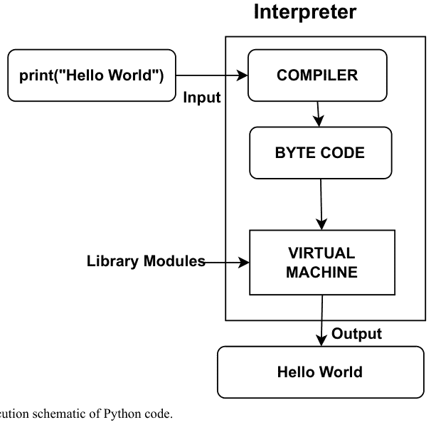

图（1）。Python代码执行示意图。

你之前可能已经了解过各种语言，如C++、Java、Perl、Scheme或BASIC。所有这些语言都是高级语言。然而，计算机硬件只理解称为机器语言的低级语言。因此，高级语言需要转换为机器语言。为此，我们有两种翻译器：*编译器*和*解释器*。编译器是将整个程序翻译成机器语言的程序。高级程序称为源代码，输出是机器代码。解释器也是一个程序，它接受高级语言并逐条指令将其转换为机器代码。编译后的代码可以运行任意次数，无需重复编译或源代码。相比之下，解释型代码每次都需要解释器和源代码。因此，解释型代码使编程环境更加用户友好，并增强了可移植性。每个CPU都有自己的机器代码，但我们可以使用解释器运行高级语言程序。

## PYTHON的技术优势

### 可移植性

如前所述，Python是一种可移植语言，需要在任何平台上执行字节码。可执行字节码将源代码转换为平台无关的代码。Python包含一个Tkinter工具包来支持Tk GUI界面，因此图形用户界面可以在所有支持GUI的平台上运行，无需更改程序。Python最初的、标准的实现是用ANSI C编写的，使其可以在从PDA到超级计算机的所有主要平台上执行。

### 面向对象

Python是一种面向对象的编程语言。该语言是可扩展的，*即*，程序可以扩展到C、C++和Java。它使用类模型来支持多态、运算符重载和其他概念。它是其他面向对象系统语言（如C++、Java和C#）的强大脚本工具。Python的最新版本也支持函数式编程。这包括生成器、推导式、闭包、映射等。

### 社区支持

Python社区支持非常活跃，并对用户的查询响应迅速。该社区由Python创建者Guido van Rossum（终身仁慈独裁者，BDFL）和数千名工作人员组成。Python在变更方面比其他语言更保守，*即*，变更需要得到社区，特别是BDFL的批准。

### 高级功能

Python完全支持脚本语言（如PERL）的功能。该方案促进了在编译语言中容易找到的软件开发工具的使用。它是FLOSS社区的产物，*即*，Python是一种自由、开源软件，有助于知识共享。Python的一些显著特点包括：

## 内存管理

内存分配和回收不再是程序员的烦恼。它采用自动内存管理分配和垃圾回收机制，使内存能够按需增长和收缩。Python将内存视为私有堆。内存管理有两种类型的分配器：原始内存分配器和对象特定分配器：

-   **大型系统开发**：Python凭借其庞大的工具库，能够更快、更轻松地开发大型系统。Python工具可分为两类：通用工具和功能工具。通用工具包括模块、类和异常，它们有助于将大型应用程序分解为小模块、重用自定义代码以及处理错误和异常。
-   **动态类型**：程序员可以轻松编写代码，而无需担心程序的语法和结构。无需事先进行类型和变量声明。
-   **庞大的库和工具**：Python对各种内置对象类型（如列表、字典等）提供全面支持。Python的标准操作（如连接、切片、排序等）允许对这些对象类型进行顺序处理。此外，Python还提供了一些预编码的库工具来支持应用层面的特定任务，如网络、正则表达式等。它还有一个庞大的库来处理线程、图形用户界面等。Python的易于集成允许与其他框架进行定制和通信。例如，与Java和.NET组件的集成允许与COM和Silverlight等框架轻松通信。

## 易用性

由于其交互式用户界面和快速的周转时间，Python已成为开发者的首选。Python以其简单灵活的编程范式，非常易于学习。Python主要强调代码的质量和可理解性，而不是其结构。无需冗长的编译时间和即时执行，这提升了开发速度。

## 安装Python

访问官方网站 www.python.org 获取最新版本的Python。图（2）显示了该网页。如果操作系统是Mac或Linux，Python通常已经预装，尽管可能是较旧的版本。

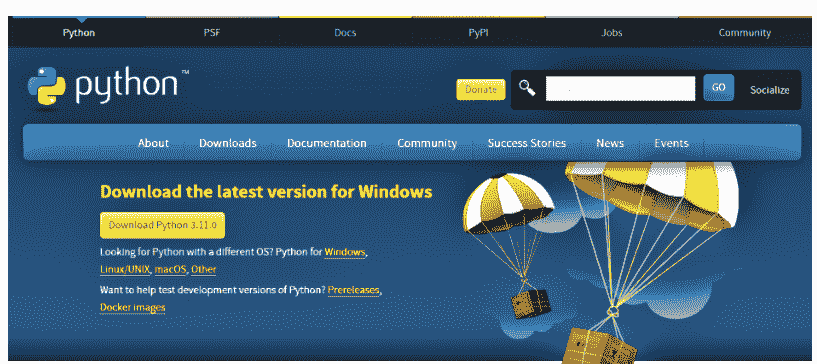

图（2）。为操作系统选择Python。

## Windows安装程序

1.  访问Python官方网站后，它会提示您为相应的操作系统下载最新版本的Python。您可以选择相应的操作系统，它将带您进入该操作系统可用的Python版本列表。
2.  根据您的配置（32位或64位）从选项列表中选择一个Python版本，它将开始自动下载可执行文件。
3.  下载完成后，前往下载位置并运行可执行文件。
4.  将弹出一个窗口，显示默认安装目标，并提供通过浏览来自定义安装目标的选项。此外，它会提示两个复选框：*将Python版本添加到PATH*和使用管理员权限。这将确认解释器已添加到执行路径中。
5.  点击**立即安装**。您将被提示选择*可选功能*。根据需要选择功能。
6.  点击*下一步*。您将被提示进入***高级选项***功能。根据需要选择功能。此外，您还需要在此处选择安装位置。
7.  点击**安装**。您的安装进度条将显示安装进度。安装完成后，将弹出一个窗口提示安装成功。
8.  安装完成后，您可以通过在任务栏中搜索来打开它。

## Ubuntu

对于不同版本的Ubuntu发行版，Python是预装的。您可能需要更新Python版本。在Ubuntu上安装Python的步骤如下：

1.  检查您的Ubuntu系统上安装的Python版本。

```
python -version
```

2.  更新并刷新软件源列表。

```
sudo apt update
```

3.  安装支持软件。

```
sudo apt install software-properties-common
```

4.  添加Deadsnakes PPA（个人软件包存档）。

```
sudo add-apt-repository ppa:deadsnakes/ppa
```

5.  系统将提示您按回车键以继续安装。按回车键。再次刷新软件包列表。

```
sudo apt update
```

6.  使用以下命令安装Python 3。

```
sudo apt install python3.9
```

7.  成功安装后验证Python版本。

## Linux Mint

Mint的安装类似于Ubuntu，Ubuntu的安装说明也可用于Mint。Deadsnakes/PPA在Mint上运行良好。

## Python IDLE

IDLE是交互式开发和学习环境的缩写。这个IDLE有助于运行您的程序。Python有一个适用于Windows的IDLE，为程序开发提供交互式平台。Python的IDLE有两种模式：交互模式和脚本模式。IDLE在shell中启动；您可以输入代码并在同一窗口中查看输出。图（3）描绘了Python shell。您可以在Windows搜索栏中搜索Python shell。

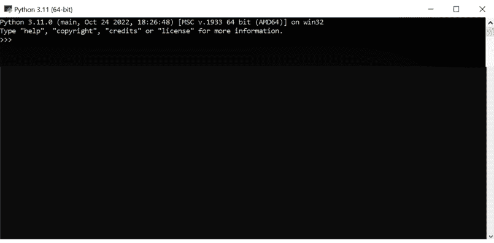

图（3）。Python Shell。

## Anaconda开源发行版

Anaconda是一个Python包管理器，提供适用于大数据处理、科学计算等的应用程序。它适用于Python和R编程语言。它提供各种开发平台，如JupyterLab、Jupyter、Notebook、Spyder、Glue、Orange、RStudio和Visual Studio Code。

## 在Windows上安装Anaconda

1.  访问Anaconda官方网站：https://www.anaconda.com/distribution/#download。图（4）描绘了该网站页面。此链接将提示您选择需要安装Anaconda的操作系统。选择操作系统将导致可执行文件自动下载。
2.  下载可执行文件。在您的计算机上运行安装程序。


图（4）。Windows的Anaconda网站页面。

3.  选择下载Anaconda后，您将被提示同意许可协议。选择*我同意*按钮以继续。
4.  您将被提示选择将路径*添加*到环境变量。此外，它还会提示您选择要安装Anaconda的位置。浏览安装目标并点击*下一步*。
5.  在下一步中，选择安装类型。在此，您可以选择要为其执行安装的用户类型。它提示两个选项：*仅我*或*所有用户*。前者用于当前用户帐户，后者用于系统中的所有用户，但需要用户考虑管理员权限。选择安装类型后，点击*下一步*。
6.  安装开始，进度条显示正在安装的软件包。在此窗口中，有一个*显示详细信息*按钮，您可以从中检查安装进度以及迄今为止已安装的软件包。安装完成后，窗口将显示“*完成*”消息。
7.  安装完成后，Anaconda提供两个复选框，一个用于启动发行版教程，另一个用于启动Anaconda。点击*完成*按钮以启动Anaconda shell。
8.  成功安装后，您可以打开Anaconda Navigator。在该Navigator中，将有多个平台可用于开始编码。在这里，我们将重点关注**Jupyter**和**Spyder**平台。

## 在Linux上安装Anaconda

1.  您也可以使用*curl*和*wget*检索命令下载文件。
2.  使用bash命令运行shell脚本。
3.  在安装过程中，系统将提示您选择目标文件夹和其他设置。对于Linux系统，请保持标准设置。
4.  安装后，创建一个环境来安装软件包。您也可以为每个项目构建一个单独的环境。

## 第一个Python程序

在本节中，我们将使用**Spyder**编写第一个程序。打开Anaconda Navigator并选择Spyder。点击Spyder徽标下方的“启动”按钮。Spyder IDE将打开。Spyder IDE由三个部分组成。左窗格是您编写代码的工作区。右窗格分为两部分。上部分用于变量和对象分析。下窗格是控制台，代码成功编译后输出将在此显示。在IDE中，您可以在左窗格中编写以下代码并执行它，以在控制台上查看结果。

另一个非常常见的用于Python编程的应用程序是**Jupyter**。点击Jupyter图标下方的启动按钮。它将提示进入如图（5）所示的文件夹列表。您可以点击“新建”按钮开始新的Jupyter Notebook。Jupyter Notebook如图（6）所示。您可以在工作区中输入代码并运行每个单元格以获取输出。

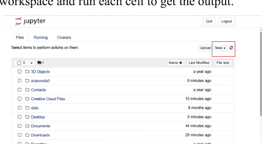

图（5）。Jupyter主页。

#### 示例：

```
# 显示一个名称
print("Hello World")
# 显示名称的函数
```

#### 输出：

```
Hello World
```

## Python 关键字

Python 关键字是保留用于特定目的的词，不能用于其他任何用途。Python 总共有 35 个关键字。关键字列表已经过多次修订。在 Python 2.7 中，*print* 和 *exec* 是关键字，但在 Python 3+ 中它们被移除了，而在 Python 3.7 中，*await* 和 *async* 作为新关键字被添加。以下是 Python 3.9 的关键字列表。你可以使用 help 命令来获取 Python 中的关键字。

| False | Def | if | Try | assert | except | nonlocal |
| Class | True | raise | In | else | lambda | yield |
| from | Pass | and | Elif | is | with | break |
| Or | global | del | As | while | await | for |
| None | continue | import | Return | async | finally | not |

## 标识符

标识符是用于标识变量、函数、类、对象等的名称。一些标识符命名约定的规则是：

1.  不要在标识符名称中使用特殊字符，如 @、!、&、* 等，以及标点符号。
2.  标识符不应以数字开头。
3.  标识符区分大小写。因此，**atoms** 和 **Atoms** 在 Python 中是不同的标识符。
4.  标识符可以以字母 *A 到 Z* 和 *a 到 z* 或下划线 (_) 开头，后面可以跟字母、下划线或数字 (0-9)，也可以不跟。
5.  不要使用关键字作为标识符。
6.  类名必须始终以大写字母开头。
7.  私有标识符以单个下划线开头。强私有标识符以两个下划线开头。此外，特殊名称以两个尾随下划线结尾。

| y, dept, course_in_cs, course1, course_2, _grade, grade_2 | 有效的标识符 |
| 4, dep in college, cs-course, 1 st, 1_exam | 无效的标识符 |

## 语句

在 Python 中，语句可以定义为解释器可以执行的指令或命令。Python 中有几种类型的语句，提供各种目的。我们可以用分号分隔多个语句来组成单行。各种类型的语句是：

1.  表达式语句：它们用于计算、写入值或调用过程。
2.  赋值语句：它们赋值并修改项。
3.  断言语句：它们提供调试断言。
4.  空语句：它们非常类似于空操作；执行时不发生任何操作。
5.  删除语句：顾名思义，它们指定删除目标。
6.  返回语句：它们在函数块之后指定，并在程序离开当前函数块时定义。
7.  生成器语句：它们仅在 *生成器* 函数中使用。
8.  引发语句：它们引发异常。如果不存在新异常，则它们重新引发当前正在处理的异常。
9.  中断语句：它们通常与循环（*for*、*while*）和 try 语句一起使用。它们结束执行序列并将程序移出循环中的当前块。
10. 继续语句：它们停止循环中的当前迭代并开始下一次迭代。
11. 导入语句：它们用于导入易于预处理所需的模块。
12. 全局语句：它们用于定义在整个代码块中有效的标识符。
13. 非局部语句：它们将标识符绑定到最近的块，以便在本地命名空间中搜索标识符非常容易。

## 缩进

在 Python 中，缩进扮演着非常重要的角色。缩进可以定义为一些语句之前的空白。除了增强代码可读性外，缩进还定义了函数的范围，类似于 C 和 C++ 中的花括号 ({ })。图 (7) 描绘了循环的缩进。缩进规则如下：

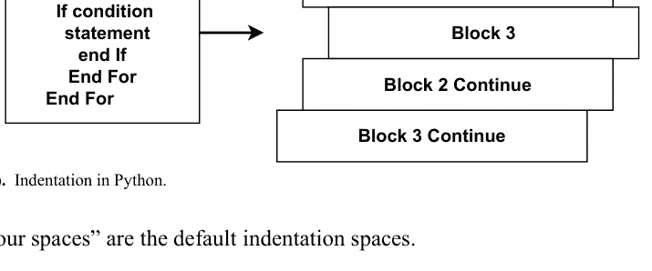

图 (7). Python 中的缩进。

1.  “四个空格”是默认的缩进空格。
2.  代码的第一行不能有缩进。
3.  保持代码的一致性，*即*，空格的数量必须一致。
4.  优先使用空格而不是制表符进行缩进。

## 注释

Python 中的注释是程序员在代码中添加的语句，用于指示代码块的目的。它们增加了代码的可读性。它们在运行时不会被执行。注释的各种目的是：

1.  增强可读性。
2.  包含资源。
3.  重用现有代码。
4.  易于理解代码并方便解释。

注释以 # 符号开头，可以放在行尾。Python 中有两种类型的注释。它们是：

*单行注释* 和 *多行注释*。

### 单行注释

它以 # 符号开头，这意味着你必须在每一行都写 # 符号。

### 多行注释

Python 中的多行注释是由分隔符（"""）在注释开头和结尾包围的文本块。分隔符（"""）中不应有空格。

让我们举一个例子来理解注释。

#### 示例：

```
print("Python Programming") # 单行注释
"""
这是一个注释
写在
多行中
"""
print("计算机科学书籍。")
```

#### 输出：

```
Python Programming
计算机科学书籍。
```

## 编码风格

Python 提供了四种不同的编码风格，如下所述。

### 函数式

在这种风格中，问题被分成不同的函数，每个语句被视为一个数学方程。它广泛用于并行处理任务和 lambda 演算。它是大数据处理工作的首选。

#### 示例：

```
my_list = [2,3,6,7,8,10]
new_list = list(map(lambda x: x + 2, my_list))
print(new_list)
```

#### 输出：

```
[4, 5, 8, 9, 10, 12]
```

### 命令式

这种风格明确用于对数据结构进行各种操作。它需要预先定义操作顺序。

#### 示例：

```
my_list = [2,3,6,7,8,10]
sum = 0
for x in my_list:
    sum += 2*x
print(sum)
```

#### 输出：

```
72
```

### 过程式

这是非程序员最常采用的风格。它主要关注代码。整个代码被分成一系列指令，就像将问题分解成更简单的任务一样。它使用顺序、选择、模块化和迭代来减少代码冗余。

#### 示例：

```
my_list = [2,3,6,9,18,20]
def add(list):
    sum = 0
    for x in the list:
        sum += x
    return sum
print(add(my_list))
```

#### 输出：

```
36
```

### 面向对象

在过程式风格中，重点是给定的代码，但在这种风格中，重点是数据。这种风格的优点是形成类范式并坚持面向对象的原则，如抽象、继承、多态和封装。

#### 示例：

```
class A:
    def test(self,a,b):
        return(a+b)
b=A()
print("res=", b.test(45,77))
```

#### 输出：

```
res=122
```

## 结束语

在本章中，我们对 Python 进行了总体介绍。本章还指导读者在不同操作系统和不同配置上安装 Python 和 Anaconda。我们还让读者熟悉了 Python 编程的一些基本概念。在下一章中，我们将深入探讨 Python 数据类型和运算符。

# 第 2 章

## 数据类型、运算符和表达式

**摘要：** 既然你已经熟悉了 Python 编程的安装和基础知识，是时候更深入地了解可用的不同数据类型，以及使编程更用户友好的运算符和表达式了。在本章中，我们将学习数据类型分类和存在的运算符。在这里，你将学习以下细微差别：

1.  Python 支持的数据类型。
2.  使用变量来存储和访问数据。
3.  运算符执行数学运算和逻辑函数。
4.  各种表达式服务于广泛的应用。

**关键词：** 结合性、字面量、运算符、优先级。

## 引言

在计算机编程中，数据类型是可能保存在变量中的多种信息的分类。由于 Python 是一种动态类型语言，我们在声明变量时不需要指定变量类型。

值以一种解释器不明确指定的方式绑定到其类型——例如，**X=100**。我们没有声明变量 **X** 的类型，但它现在持有整数值 100。在 Python 中，整数默认被视为整数数据类型。要检查变量的类型，我们使用 Python 中可用的 **type()** 函数，它返回传入的变量的类型。以下示例说明了如何为变量指定值并检查它们的类型。

#### 示例：

```
x=100
y="Python Programming"
z= 12.59
print(type(x))
print(type(y))
print(type(z))
```

#### 输出：

```
<class 'int'>
<class 'str'>
<class 'float'>
```

Python 拥有多种标准数据类型，每种类型都可以为其定义独特的存储机制。Python 中定义的数据类型如下所列：

1.  数字
2.  序列
3.  字典
4.  布尔值
5.  集合

## 数字

数字负责存储数值。Python 的数字数据类型负责存储所有整数、浮点数和复数值。要检查变量的数据类型，Python 有一个名为 **type()** 的函数。它还有一个 **isinstance()** 函数，用于检查对象是否属于特定类。当一个数字被赋值给 Python 中的变量时，会自动创建数字对象。数字数据类型可以存储整数、浮点数和复数类型的值。

-   整数值可以是任意长度。Python 中整数的长度没有限制。
-   浮点数用于存储浮点数，其精度可达小数点后 15 位。
-   复数以 **a + ib** 的形式指定，其中 **a** 和 **b** 分别代表数字的实部和虚部。

#### 示例：

```
a = 10
print ("The type of a is", type(a))

b = 10.15
print ("The type of b is", type(b))

c = 2+4j
print ("The type of c is", type(c))
print ("c is a complex number", isinstance(2+4j,complex))
```

#### 输出：

```
The type of a is <class 'int'>

The type of b is <class 'float'>

The type of c is <class 'complex'>

c is a complex number True
```

## 序列

该语言将 Python 的字符串、列表和元组数据类型视为序列类型。用引号括起来的字符序列是字符串的一个例子，可以定义为该序列。在定义字符串时，Python 允许我们使用单引号、双引号或三引号。由于 Python 包含可用于对字符串执行各种操作的预定义函数和运算符，因此在 Python 中管理字符串是一个简单的过程。“Hello World!”是操作“Hello” + “World!”的结果，它使用加号（+）运算符连接两个字符串。同样，要重复字符串，我们可以使用重复运算符（*）。例如，“India” *7 输出 IndiaIndiaIndiaIndiaIndiaIndiaIndia。

#### 示例：

```
S1= "Hello World"
print (S1)
```

#### 输出：

```
Hello World
```

Python 中的列表功能类似于 C 语言中的数组。然而，列表可以包含不同格式的信息。列表的内容用方括号 [] 括起来，并用逗号（,）分隔。我们可以使用切片 [:] 运算符有选择地获取列表的内容。列表可以使用与字符串相同的连接（+）和重复（*）运算符进行操作。

#### 示例：

```
L1 = [10, "Hello", "World!", 20, 30]
L2 = [1, "Hello", 2.0]
#Checking the type of given list
print (type(L1))
print (type(L2))
#Printing the list
print (L1)
print (L1[3:])
print (L2[0:1])

# List Concatenation using + operator
print (L1 + L2)

# List repetition using * operator
print (L2 * 4)
```

#### 输出：

```
<class 'list'>
<class 'list'>
[10, 'Hello', 'World!', 20, 30]
[20, 30]
[1]
[10, 'Hello', 'World!', 20, 30, 1, 'Hello', 2.0]
[1, 'Hello', 2.0, 1, 'Hello', 2.0, 1, 'Hello', 2.0, 1, 'Hello', 2.0]
```

元组在很多方面都非常像列表。元组与列表类似，是各种数据类型项目的集合。我们使用圆括号来指定元组的组成部分，元组的不同元素用逗号（,）分隔。由于元组中包含的元素的大小和值不能更改，因此元组数据结构被称为只读的。

#### 示例：

```
T1 = [10, "Hello", "World!", 20, 30]
T2 = [1, "Hello", 2.0]

# Checking type of tuples
print (type(T1))
print (type(T2))
#Printing the tuple
print (T1)

# Tuple slicing
print (T1[2:])
print (T1[0:1])

# Tuple concatenation using + operator
print (T1 + T2)

# Tuple repetition using * operator
print (T1 * 2)
```

#### 输出：

```
<class 'list'>

<class 'list'>

[10, 'Hello', 'World!', 20, 30]

['World!', 20, 30]

[10]

[10, 'Hello', 'World!', 20, 30, 1, 'Hello', 2.0]

[10, 'Hello', 'World!', 20, 30, 10, 'Hello', 'World!', 20, 30]
```

## 字典

字典是键值对的集合，这些键值对不按任何顺序排列。它的功能类似于关联数组或哈希表，其中每个单独的键都包含一个不同的值。键的值可以是任何任意的 Python 对象，尽管键本身可以存储任何原始数据类型。字典中的条目用逗号（,）分隔，并用花括号 {} 封装。

#### 示例：

```
Dic = {101:'Amit', 102:'Sumit', 103:'Rahul', 104:'James'}
# Printing dictionary
print (Dic)
print("Your first record is : "+Dic[101])
print("Your fourth record is: "+ Dic[104])
# Printing keys and values
print (Dic.keys())
print (Dic.values())
```

#### 输出：

```
{101: 'Amit', 102: 'Sumit', 103: 'Rahul', 104: 'James'}
Your first record is: Amit
Your fourth record is: James
dict_keys([101, 102, 103, 104])
dict_values(['Amit', 'Sumit', 'Rahul', 'James'])
```

## 布尔值

**True** 和 **False** 值是使用布尔数据类型预定义的。将提供的值与这些值进行比较，以检查断言是真还是假。bool 类用于表示它是什么。值 'T' 或任何非零值可以表示真，而值 '0' 或字母 'F' 可以用于表示假。

#### 示例：

```
x = bool(1)
#display x:
print (x)
#display the data type of x:
print (type(x))
```

#### 输出：

```
True
<class 'bool'>
```

## 集合

Python 中称为集合的数据类型是一个无序的集合。它可以在创建后进行编辑，可以重复，并且包含在其他地方找不到的组件。集合中项目的呈现顺序是不确定的，因此返回序列可能是另一种顺序。内置方法 `set()` 用于指定集合数据类型；或者，可以在花括号之间给出一系列项目，并用逗号分隔来创建集合。它可以容纳各种各样的值。

#### 示例：

```
emp_set = set()
set_data = {'Walter', 74, 'Book'}
#Display values of the set
print (set_data)
#Inserting data into the set
set_data.add(1282)
print (set_data)
#Delete a record from the set
set_data.remove(74)
print (set_data)
```

#### 输出：

```
{'Book', 'Walter', 74}
{'Book', 'Walter', 1282, 74}
{'Book', 'Walter', 1282}
```

## 类型转换

它将值从一种数据类型转换为另一种数据类型。数据类型可以是整数、字符串、浮点数等。有两种类型的转换：*隐式类型转换* 和 *显式类型转换*。

## 隐式类型转换

在这种转换中，Python 自动将一种数据类型转换为另一种数据类型。用户不参与这种类型的转换。让我们以隐式类型转换为例。

#### 示例：

```
num_int = 234
num_float = 23.4
num_new= num_int + num_float
print ("datatype of num_int:",type(num_int))
print ("datatype of num_flo:",type(num_float))
print ("Value of num_new:",num_new)
print ("datatype of num_new:",type(num_new))
```

#### 输出：

```
datatype of num_int: <class 'int'>
datatype of num_flo: <class 'float'>
Value of num_new: 257.4
datatype of num_new: <class 'float'>
```

## 显式类型转换

在这种转换中，用户将对象的数据类型转换为所需的数据类型。它使用一些预定义的函数，如 *int()*、*float()*、*str()* 等，来执行显式类型转换。此外，它也被称为类型转换，因为用户转换（更改）了对象的数据类型。对于类型转换，需要指定需要类型转换的变量以及所需的数据类型。显式类型转换的语法如下。

```
<required_datatype>(expression)
```

#### 示例：

```
x = 345
y = "867"
print ("x has the type :",type(x))
print ("y has the type :",type(y))

y = int(y)
print ("After Type Casting y is :",type(y))
sum = x + y
print ("Sum :", sum)
print ("Sum has the data type:",type(sum))
```

#### 输出：

```
x 的类型为：<class 'int'>

y 的类型为：<class 'str'>

类型转换后 y 为：<class 'int'>

求和：1212

求和的数据类型为：<class 'int'>
```

## 运算符

在 Python 中，从计算角度执行任何操作的概念称为运算符。在此上下文中，我们使用两种不同的术语形式：运算符和操作数。操作数是被运算符操作的值，而运算符是在操作数的协助下执行的符号。它是一种特殊的符号，对其操作数执行操作并返回该操作的结果。以语句 **10 + 20** 为例，以帮助你更好地理解这个概念。数字 10 和 20 构成操作数，而加号 (+) 是运算符。因此，此示例的求值将包含一个简单的算术表达式，结果将是两个数字的加法。Python 中可用的各种运算符列举如下：

- 1. 算术运算符
- 2. 关系运算符
- 3. 赋值运算符
- 4. 一元运算符
- 5. 位运算符
- 6. 逻辑运算符
- 7. 成员运算符
- 8. 身份运算符

## 算术运算符

它对数字操作数执行基本的数学运算。算术运算符返回结果，结果取决于你在编程中使用的操作数类型。算术运算符列举如下：

### 加法 (+) 运算符

使用此运算符时使用符号 +。它使用两个操作数并将两个值相加。例如，a=1, b=2，则 a + b 返回 3。

### 减法 (-) 运算符

使用此运算符时使用符号 –（减号）。它使用两个操作数，此运算符减去值并返回结果。例如，a=4, b=2，则 a - b 返回 2。

### 乘法 (*) 运算符

使用此运算符时使用符号 *。它在两个操作数之间操作，此运算符将这些值相乘并返回结果。例如，a=4, b=2，则 a*b 返回 8。

### 除法 (/) 运算符

使用此运算符时使用符号 (/)。它使用两个操作数；此运算符除以值并返回结果。例如，a=4, b=2，则 a / b 返回 2。

### 取模 (%) 运算符

使用此运算符时使用符号 %。它使用两个操作数，此运算符返回余数。例如，a=4, b=2，则 a % b 返回 0。

### 幂 (**) 运算符

使用此运算符时使用符号 **。它在两个操作数之间操作。它对操作数执行指数（幂）计算。

例如，a=4, b=2，则 a ** b 表示 (4)²。结果将是 16。

### 整除 (//) 运算符

整除类似于常规除法，但返回可能的最高整数。此整数小于或等于正常除法的结果。

例如，7//2 = 3 且 7.0//2.0 = 3.0，-11//3 = -4，-11.0//3 = -4.0

#### 示例：

```
1. a=4
2. b=2
3. f=a/b    #除法 (/)
4. print (f)
5. g=a%b    # 取模 (%)
6. print (g)
7. h=a**b   #幂 (**)
8. print (h)
9. i=a//b   #整除 (//)
10. print (i)
```

#### 输出：

```
2.0
0
16
2
```

## 关系运算符

它们用于比较变量并输出关系。也称为比较运算符。这种类型的运算符返回布尔值（True/False）。有各种类型的关系运算符。

### 大于 (>) 运算符

如果左操作数大于右操作数，则返回 true。例如，(a>b)。

### 大于或等于 (>=) 运算符

如果左操作数大于或等于右操作数，则返回 true。例如，(a>=b)。

### 小于 (<) 运算符

如果左操作数小于右操作数，则返回 true。例如，(a<b)。

### 小于或等于 (<=) 运算符

如果左操作数小于或等于右操作数，则返回 true。例如，(a<=b)。

### 等于 (==) 运算符

如果两个操作数相等，则返回 true。例如，(a==b)。

### 不等于 (!=) 运算符

如果操作数不相等，则返回 true。例如，(a != b)。

## 赋值运算符

它为变量赋值。例如，要将值 50 赋给变量，比如 **a**，简单命令是：**a = 50**。与其他运算符结合使用的赋值运算符具有不同的用途，例如 **x += 10**，将 10 加到变量，然后赋值给变量。它等同于 **x = x + 10**。它也称为快捷运算符。有各种类型的赋值和快捷运算符。

### 赋值 (=) 运算符

此运算符将右侧操作数的值赋给左侧操作数。例如，**z = x + y** 将 **x + y** 赋值给 **z**。

### 加并赋值 (+=) 运算符

此运算符将右操作数加到左操作数，并将结果赋给左操作数。例如，**z += x** 等同于 **z = z + x**。

### 减并赋值 (-=) 运算符

此运算符从左操作数中减去右操作数，并将结果赋给左操作数。例如，**z -= x** 等于 **z = z – x**。

### 乘并赋值 (*=) 运算符

此运算符将右操作数与左操作数相乘，并将结果赋给左操作数。例如，**z *= x** 等同于 **z = z * x**。

### 除并赋值 (/=) 运算符

此运算符用左操作数除以右操作数，并将结果赋给左操作数。例如，**z /= x** 等同于 **z = z / x**。

### 取模并赋值 (%=) 运算符

此运算符使用两个操作数取模，并将结果赋给左操作数。例如，**z %= x** 等同于 **z = z % x**。

### 幂并赋值 (**=) 运算符

此运算符对操作数执行指数（幂）计算，并将值赋给左操作数。例如，**z **= x** 等同于 **z = z ** x**。

### 整除并赋值 (//=) 运算符

此运算符对操作数执行整除，并将值赋给左操作数。例如，**z //= x** 等同于 **z = z // x**。

#### 示例：

```
1.  x = 10
2.  y = 20
3.  #值修改
4.  val= x + y
5.  print ( " val : ", z)
6.  val2 += x
7.  print ( " val2 : ", z)
8.  val3 *= x
9.  print ( "val3: ", z)
10. val4/= x
11. print ( "val4 : ", z)
12. num= 2
13. num %= x
14. print ( "num: ", z)
15. num **= x
16. print ( "num: ", z)
17. num //= x
18. print ( "num: ", z)
```

#### 输出：

```
val: 30
val2:40
val3:400
val4:40.0
num:2
num:1024
num:02
```

## 一元运算符

它在 Python 中使用，并对单个操作数执行。两个一元运算符是：**一元 (+)** 和 **一元 (-)**。让我们举一个例子来理解一元运算符。

#### 示例：

```
1.  x = 1
2.  print ("一元正运算符", +x)
3.  print ("一元负运算符", -x)
```

#### 输出：

```
一元正运算符 1
一元负运算符 -1
```

## 位运算符

位运算符逐位操作。假设 **x = 26** 且 **y = 18**；那么 x 和 y 的二进制转换是 11010, 10010。根据它们的结果，让我们理解 **x** 和 **y** 上的各种位运算。

有以下位运算符：

### 二进制与 (&) 运算符

如果位存在于两个操作数中，则此运算符复制结果的位。

### 二进制或 (|) 运算符

如果位存在于任一操作数中，则此运算符复制位。

### 二进制异或 (^) 运算符

如果位在一个操作数中设置但不在两个中都设置，则此运算符复制位。

### 二进制取反 (~) 运算符

它是一元的，具有“翻转”位的效果。

### 二进制左移 (<<) 运算符

在此运算符中，左操作数的值根据右操作数指定的位数向左移动。

### 二进制右移 (>>) 运算符

在此运算符中，左操作数的值根据右操作数指定的位数向右移动。让我们举一个例子来理解所有位运算符。

#### 示例：

```
1.  x = 26
2.  y = 18
3.  z = 0
4.  z = x & y,
5.  print ( "'&' 的结果：", z)
6.  z = x | y,
7.  print ( " '|' 的结果：", z)
8.  z = x ^ y,
9.  print ( " '^' 的结果：", z)
10. z = ~x,
11. print ( " '~' 的结果：", z)
12. z = x << 2,
13. print ( "'<<' 的结果：", z)
14. z = x >> 2,
15. print ( " '>>' 的结果：", z)
```

#### 输出：

```
'&' 的结果： 18

'|' 的结果： 26

'^' 的结果： 8

'~' 的结果： -27

'<<' 的结果： 104

'>>' 的结果： 6
```

## 逻辑运算符

逻辑运算符用于执行算术和逻辑计算。这些是用于完成操作的特殊符号（**and, or, not**）。这些运算符返回 True/False 作为结果。

### 逻辑与运算符

当两个条件都为真时，此运算符返回 true。

### 逻辑或运算符

当两个操作数都非零时，此运算符返回真。

### 逻辑非运算符

此运算符返回相反的结果，*即* 真条件变为假，假条件变为真。

#### 示例：

```
1. x = 70
2. print (x > 30 and x < 100)
3. print (x > 30 or x < 40)
4. print (not(x > 30 and x < 100)) # returns False because not is used to reverse the result
```

#### 输出：

```
True
True
False
```

## 成员运算符

成员运算符用于测试一个序列是否存在于一个对象中。这里的对象可以是字符串、列表或元组。成员运算符有两种类型：**in** 和 **not in**。让我们通过一个例子来了解这些运算符的使用。

## 运算符 (in)

如果所查找的变量存在于序列中，此运算符返回 *True*，否则返回 *False*。

## 运算符 (not in)

如果所查找的变量**不**存在于序列中，此运算符返回 *True*，否则返回 *False*。

#### 示例：

```
1.  x= 10
2.  y = 20
3.  list = [10, 12, 23, 44, 35 ],
4.  
5.  if ( x in list ):
6.      print ( " x is available in the given list")
7.  else:
8.      print ( " x is not available in the given list")
9.  
10. if ( y not in list ):
11.     print ( "y is not available in the given list")
12. else:
13.     print ( " y is available in the given list")
14. 
15. x = 2
16. if ( x in list ):
17.     print ( " x is available in the given list")
18. else:
19.     print ( " x is not available in the given list")
```

#### 输出：

x is available in the given list

y is not available in the given list

x is not available in the given list

## 身份运算符

此运算符用于比较对象，不是比较它们是否相等，而是比较它们是否是同一个对象，即具有完全相同的内存地址。身份运算符有两种类型，即 *is* 和 *is not*。让我们通过一个例子来了解这些运算符的使用。

## 运算符 (is)

如果两个变量是同一个对象，此运算符返回真。

## 运算符 (is not)

如果两个变量不是同一个对象，此运算符返回真。

#### 示例：

```
1. x = ["James", "Sam"]
2. y = ["James", "Sam"]
3. z = x
4. print (x is z) # returns True because z is the same object as x
5. print (x is y) # returns False because x is not the same object as y, even if they have the same content
6. print (x != y) # This comparison returns False because x is equal to y
```

#### 输出：

```
True
False
False
```

## 运算符优先级和结合性

运算符优先级指的是哪个运算符应该先执行。它基于运算符的优先级。如果两个或多个运算符具有相同的优先级，则会检查运算符的结合性。结合性指的是从左到右或从右到左进行运算。假设一个表达式是 2*4+6；首先，2*4 会被执行，因为在 * 和 + 运算符之间，* 具有更高的优先级。

假设一个表达式是 5/2*3，那么运算符的优先级相同，接下来会检查运算符的结合性。这里 / 和 * 的结合性是从左到右，因此 5/2 会先被计算。表 1 列举了各种运算符的优先级及其结合性。

表 1. 运算符描述及其结合性。

| 运算符 | 描述 | 结合性 |
| :--- | :--- | :--- |
| () | 圆括号 | 从左到右 |
| ** | 指数 | 从右到左 |
| * / % | 乘法/除法/取模 | 从左到右 |
| + - | 加法/减法 | 从左到右 |
| << >> | 按位左移，按位右移 | 从左到右 |
| < <= > >= | 关系运算符 | 从左到右 |
| == != | 关系运算符 等于/不等于 | 从左到右 |
| is, is not<br>in, not in | 身份运算符<br>成员运算符 | 从左到右 |
| & | 按位与 | 从左到右 |
| ^ | 按位异或 | 从左到右 |
| \| | 按位或 | 从左到右 |
| not | 逻辑非 | 从右到左 |
| and | 逻辑与 | 从左到右 |
| or | 逻辑或 | 从左到右 |
| =<br>+= -=<br>*= /=<br>%= &=<br>^= \|=<br><<= >>= | 赋值<br>加法/减法赋值<br>乘法/除法赋值<br>取模/按位与赋值<br>按位异或/或赋值<br>按位左移/右移赋值 | 从右到左 |

## 表达式

表达式是值的表示。此外，它组合了值、变量、运算符和函数调用。表达式需要被求值。如果你要求 Python 打印一个表达式，解释器会对其进行求值并显示所需的结果。它与语句非常不同。Python 中的简单语句用于赋值，但不会被求值，而表达式是用于求值的更具逻辑性的内容。Python 表达式只包含三样东西：标识符、字面量和运算符。

## 标识符

它可以是用于定义类、函数、变量、模块或对象的任何名称。

## 字面量

它可以是字符串字面量、字节字面量、整数字面量、浮点数字面量和复数字面量。

## 运算符

基于标记或符号，它可以对操作进行求值。如上所述，有各种运算符，它们对应的标记可用于实现任何表达式。

## 字符串操作

字符串是 Python 中的一个基本概念，因为它可以在编码的许多地方使用。字符串可以用单引号或双引号创建。让我们通过一个例子来了解字符串的创建。

```
S1= ‘Python Programming.’
S2= “Python Programming.”
```

这两种都是创建字符串的方式。

## 访问字符串中的值

赋值比其他编程语言容易得多，因为 Python 不支持字符类型。字符被视为长度为一的字符串。如果我们想获取字符串的一部分，那么我们必须获取一个子字符串。子字符串通过在方括号内指定所需的索引/索引范围来确定。字符串也可以更新并重新赋值给另一个字符串。让我们通过一个例子来了解。

#### 示例：

```
1. wr1= ‘Book for Beginners
2. wr2= ‘Requires”
3. print (“wr1[0]: “, wr1[0])
4. print (“wr2[0:6]: “, wr2[0:6])
5. print (“Updated :- “, str2[:9] + ‘Book’)
```

#### 输出：

```
wr1[0]: B
wr2[0:5]: Requir
Updated :- Requires Book
```

字符串中使用了各种类型的特殊符号：

- **连接 (+)** – 它将运算符两侧的值相加。
- **重复 (*)** - 它创建一个新字符串，连接同一字符串的多个副本。
- **切片 ([])** – 它从给定索引处获取字符。
- **范围切片 ([: ])**- 它从给定范围内获取字符。

各种类型的格式化字符串运算符决定了字符串的格式。Python 中不同的格式说明符通过在所需格式前添加 '%' 运算符符号来指定。% 符号表示在指定格式中插入变量的占位符。

%c 字符，%s 字符串转换，%d 有符号十进制整数，%u 无符号十进制整数，%o 八进制整数，%x 十六进制整数（小写字母），%e 指数表示法（带小写 'e'），%f 浮点实数，%g 是 %f 和 %e 的简写，%G 是 %f 和 %E 的简写。

#### 示例：

```
1. print(“My name is %s and my student ID is %d.” % (Bateron, 025))
```

#### 输出：

My name is Bateron and my student ID is 025.

## 三引号

它用于编写多行字符串。它可以写成三个连续的单引号或双引号。

#### 示例：

```
1. Longstring = """ This is a long string example and that is made up of
2. several lines and non-printable characters such as
3. TAB ( \t ) and they will show up that way when displayed.
4. NEWLINEs within the string, whether explicitly given like
5. this within the brackets [ \n ], or just a NEWLINE within
6. the variable assignment will also show up.
7. """
8. print Longstring
```

## Python编程基础：初学者快速指南 Mohbey 与 Acharya

> 这是一个由多行组成的长字符串示例，其中包含制表符（TAB）等不可打印字符，它们在显示时会保持原样。字符串中的换行符，无论是像这样在方括号[ ]内显式给出，还是仅在变量赋值中出现，也都会显示出来。

多种内置函数可用于操作字符串：

- *capitalize()* - 用于将字符串的首字母转换为大写。
- *center(width, fill char)* - 用于将原始字符串居中填充至指定的总列宽。
- *count(str, beg=0, end=len(string))* - 用于计算特定单词/词组在字符串中出现的次数。此函数需要指定要搜索的字符串的起始和结束索引。
- *decode(encoding='UTF-8', errors='strict')* - 用于返回解码后的字符串。
- *encode(encoding='UTF-8', errors='strict')* - 返回编码后的字符串。默认情况下，它会引发值错误，但我们可以指定 'ignore' 或 'replace'。
- *endswith(suffix, beg=0, end=len(string))* - 用于检查给定的字符串/子字符串是否以指定的后缀结尾。如果条件满足则返回 True，否则返回 False。
- *expandtabs(tabsize=8)*：用于将制表符扩展到指定的制表符大小。默认制表符大小为 8。
- *find(str, beg=0, end=len(string))* - 用于检查字符串/子字符串是否存在于给定字符串的指定起始和结束索引范围内。
- *isalnum()* - 用于检查字符串是否完全由字母数字字符组成。如果字符串包含一个字符和其他字母数字字符，则输出 True，否则返回 False。
- *isalpha()* - 用于确定字符串是否完全由字符和字母组成。
- *isdigit()* – 如果字符串仅包含数字则返回 True，否则返回 False。
- *istitle()* - 如果字符串是正确的“标题大小写”格式则返回 True，否则返回 False。
- *maketrans()* - 返回一个用于 translate 函数的转换表。
- *max(str)* - 返回字符串中最大的字母字符。
- *min(str)* - 返回字符串 str 中最小的字母字符。
- *replace(old, new [, max])* - 用于将旧字符串内容替换为新内容，或最多替换 max 次指定的出现次数。
- *rfind(str, beg=0, end=len(string))* – 用于从后向前搜索字符串。
- *rstrip()* - 去除字符串末尾的空白字符。
- *split(str=",", num=string.count(str))* - 用于根据分隔符分割字符串，并返回最多分割成 *num* 个子字符串的列表。
- *splitlines(num=string.count('\n'))* - 在所有（或 num 个）换行符处分割字符串，并返回一个移除了换行符的每行字符串列表。
- *startswith(str, beg=0, end=len(string))* - 确定字符串或其子字符串（如果给出了起始索引 beg 和结束索引 end）是否以子字符串 str 开头，如果是则返回 true，否则返回 false。
- *strip([chars])* - 用于对字符串同时执行 lstrip() 和 rstrip() 操作。
- *swapcase()* - 转换所有字母的大小写。
- *string.title()* - 返回字符串的“标题大小写”版本，即所有单词首字母大写，其余字母小写。
- *upper()* - 用于将小写字母转换为大写。
- 让我们通过一个例子来理解所有上述内置函数。

#### 示例：

```python
#!/usr/bin/python
text = "This is a long string example and that is made up of several lines and characters"
print ("text.capitalize() : ", text.capitalize())
print ("text.center(40, 'a') : ", text.center(40, 'a'))
sub = "i";
print ("text.count(sub, 4, 40) : ", text.count(sub, 4, 40))
sub = "wow";
print ("text.count(sub) : ", text.count(sub))
text1 = "An operator, is a concept in Python ";
text2 = "Python";
print (text1.find(text2))
print (text1.find(text2, 10))
print (text1.find(text2, 40))
print (text1.index(text2))
text = "this2009"; # No space in this texting
print (text.isalnum())
text = "An operator, is a concept in Python";
print (text.isalnum())
text = "this"; # No space & digit in this texting
print (text.isalpha())
text = "An operator, is a concept in Python";
print (text.isalpha())
text = "123456"; # Only digit in this texting
print (text.isdigit())
text = "An operator, is a concept in Python";
print (text.isdigit())
text = "An operator, is a concept in Python";
print (text.islower())
text = "An operator, is a concept in Python";
print (text.islower())
text = u"this2009";
print (text.isnumeric())
text = u"23443434";
print (text.isnumeric())
text = " ";
print (text.isspace())
text = "An operator, is a concept in Python";
print (text.isspace())
text = "Hello, welcome to the world of Python";
print (text.istitle())
print (text.isupper())
print (text.isupper())
s = "-";
seq = ("a", "b", "c"); # This is sequence of textings.
print (s.join( seq ))
```

#### 输出：

```
text.capitalize() :  This is a long string example and that is made up of several lines and characters

text.center(40, 'a') :  This is a long string example and that is made up of several lines and characters

text.count(sub, 4, 40) : 3

text.count(sub) : 0

29

29

-1

29

True

False

True

False

True

False

False

False

False

True

True

False

False

False

False

a-b-c
```

## 总结

在本章中，我们涵盖了多种不同的数据类型及其操作。此外，我们还讨论了运算符的优先级及其在表达式求值时的结合性——解释了涉及字符串操作、列表和字典生成的许多原则。下一个将要涵盖的主题是控制流语句，它们在 Python 中被使用。这将在下一章中介绍。

## 第三章

## 控制流

**摘要：** 现在是读者熟悉编程中控制流的时候了。到目前为止，用户已经看到了线性的执行路径，即执行从顶部开始，顺序地移动到底部。此外，我们的世界充满了需要循环运行的任务，例如在银行应用程序中，除非用户输入正确的密码，否则系统会提示对话框“请输入正确的密码”。在本章中，我们介绍了控制流的概念，通过它用户可以决定程序的执行路径以及用于迭代任务的循环结构。我们本章的关键要点如下：

1. 理解决策控制语句。
2. 使用 *if-else* 梯形结构及其变体进行编程。
3. 实践 *for* 和 *while* 循环语句。
4. 理解 *break*、*continue* 和 *pass* 等 *跳转* 语句对控制流的改变。

**关键词：** 控制流，条件处理，循环结构。

## 引言

程序的控制流由称为控制流语句的语句来说明。此外，它决定了程序代码执行的顺序。条件语句、循环和函数调用是指导 Python 程序如何执行其指令的主要机制。Python 编程在其众多应用中使用了三种不同类型的控制结构。

1. 顺序语句
2. 决策控制语句
3. 循环语句

## 顺序语句

它使用默认模式，因为控制将在程序中逐行移动。此外，它是一系列按顺序执行的语句。

#### 示例：

```python
# Python 程序用于计算三角形的面积
a = 5
b = 6
c = 7
# 计算半周长
s = (a + b + c) / 2
# 计算面积
area = (s*(s-a)*(s-b)*(s-c)) ** 0.5
print('The area of the triangle is %0.2f' % area)
```

#### 输出：

The area of the triangle is 14.70

## 决策控制结构

决策控制语句还有其他几个名称，包括选择控制语句和分支语句。条件是选择语句的基础。如果满足条件，则执行该语句。除此之外，我们还将其用作检查和测试机制。决策控制语句有多种不同的类型，包括以下几种：

- if
- if-else
- 嵌套 if
- if-elif-else

## If 语句

If 语句在编程中用于确定是否应执行特定的代码段。如果满足条件，操作将成功；否则，将不会成功。

### 语法：

```python
if condition:
    # 当条件为真时执行的语句
```

If 语句的流程图如图（1）所示。

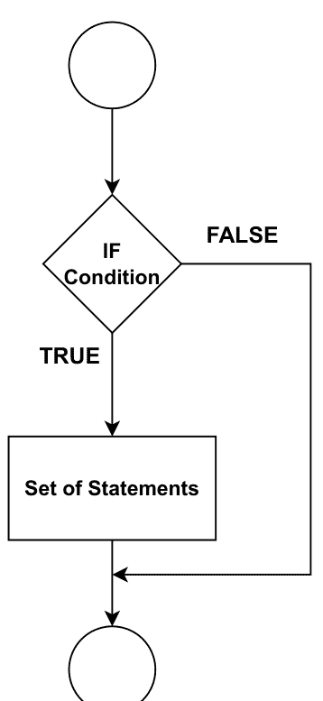

图（1）。If 语句的流程图。

#### 示例：

```python
# 检查数字是正数还是负数的程序
n = 10
if n > 0:
    print(n, "is a positive number.")
n1 = -2
if n1 < 0:
    print(n1, "is a Negative number.")
```

#### 输出：

```
10 is a positive number.
-2 is a Negative number.
```

## If-else 语句

**if-else** 语句用于根据先前语句（称为 if 和 else）的结果执行特定代码。如果满足条件，将执行 if 块中包含的代码。如果不满足条件，将执行 else 块中包含的代码。

### 语法：

```python
if (condition):
    # 如果条件为真，则执行此块
else:
    # 如果条件为假，则执行此块
```

**if-else** 表达式的流程图可在图（2）中找到。

#### 示例：

```python
# 检查数字是正数还是负数的程序
n = 10
if n >= 0:
    print("Positive or Zero")
else:
    print("Negative number")
```

#### 输出：

```
Positive or Zero
```

## 嵌套 if

当一个 if 语句位于另一个 if 语句内部时，就形成了嵌套 if 语句。嵌套 if 语句的流程模式可在图（3）中看到。

### 语法：

```python
if (condition1):
    # 当 condition1 为真时执行
    if (condition2):
        # 当 condition2 为真时执行
    # if 块在此结束
# if 块在此结束
```

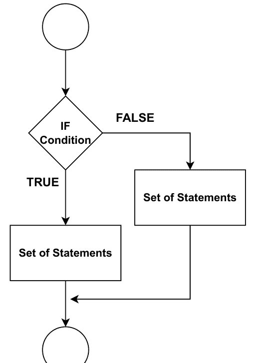

图（2）。*if-else* 语句的流程图。

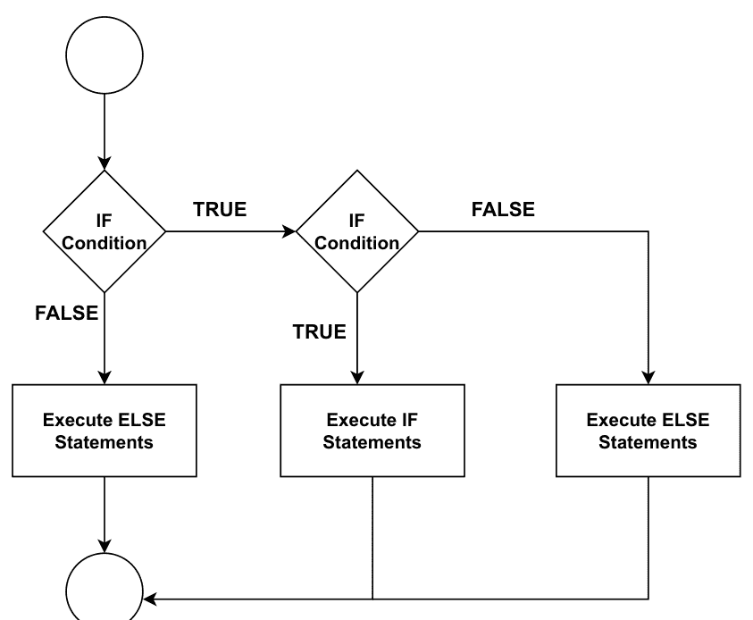

图（3）。嵌套 if 语句的流程图。

#### 示例：

```python
n = 10
if n >= 0:
    if n == 0:
        print("Zero")
    else:
        print("Positive number")
else:
    print("Negative number")
```

#### 输出：

```
Positive number
```

## if-elif-else

if-elif-else 语句用于有条件地执行一条语句或一组语句。图（4）显示了 if-elif-else 语句的流程图。

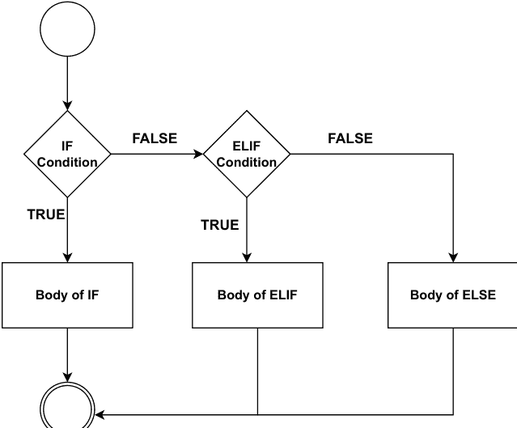

图（4）。If-elif-else 语句的流程图。

### 语法：

```python
if (condition):
    statement
elif (condition):
    statement
.
.
else:
    statement
```

#### 示例：

```python
n = 200
if n > 0:
    print("Positive number")
elif n == 0:
    print("Zero")
else:
    print("Negative number")
```

#### 输出：

```
Positive number
```

## 循环语句

循环，即多次重复相同的代码段，需要使用它。每当需要根据特定条件的存在重复一组指令时，就会使用这种控制结构。Python 为其循环支持两种不同的迭代风格。

- for 循环
- while 循环

## For 循环

借助 for 循环，可以遍历列表、元组、字典或集合等序列。需要记住的是，**in** 关键字是 for 语句语法的一部分，尽管它与用于成员检查的 in 运算符没有实际联系。循环的流程图如图（5）所示。

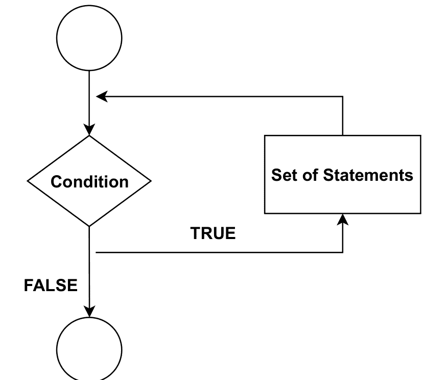

图（5）。For 循环的流程图。

### 语法：

```python
for var in sequence:
    statements(s)
```

## 示例 1：

```python
# Python 程序用于遍历 0 到 n-1 的范围
n = 10
for i in range(0, n):
    print(i)
```

#### 输出：

```
0
1
2
3
4
5
6
7
8
9
```

## 示例 2：

```python
list = [1, 2, 3, 4, 5, 6, 7, 8, 9, 10]
n = 5
for i in list:
    c = n * i
    print(c)
```

#### 输出：

```
5
10
15
20
25
30
35
40
45
50
```

## 示例 3：

```python
for x in range(5):
    print(x)

for x in range(3, 6):
    print(x)

for x in range(3, 8, 2):
    print(x)
```

#### 输出：

```
0
1
2
3
4
3
4
5
3
5
7
```

## While 循环

它重复执行语句，直到满足给定条件。如果条件为真，while 循环将工作；否则，它将不会工作。while 循环的流程图如图（6）所示。

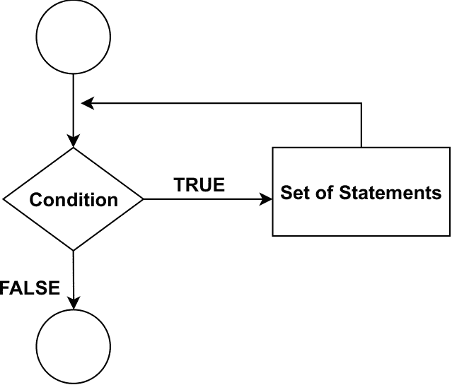

图（6）。While 循环的流程图。

### 语法：

```python
while expression:
    statement(s)
```

#### 示例：

```python
cnt = 0
while (cnt < 10):
    print("The count is:", cnt)
    cnt = cnt + 1
```

#### 输出：

```
The count is: 0
The count is: 1
The count is: 2
The count is: 3
The count is: 4
The count is: 5
The count is: 6
The count is: 7
The count is: 8
The count is: 9
```

## 嵌套循环

嵌套循环是包含在另一个循环内部的循环。我们可以选择将 for 循环嵌套在 while 循环内，将 while 循环嵌套在 for 循环内，将 for 循环嵌套在 for 循环内，或者将 while 循环嵌套在 while 循环内。为了更好地理解嵌套循环，让我们看一个例子。

### 语法：

```python
for var in sequence:
    for var in sequence:
        statements(s)
    statements(s)
```

以下是 Python 编程语言中创建嵌套 while 循环的语句语法示例：

```python
while expression:
    while expression:
        statement(s)
        statement(s)
```

## 示例 1：

```python
# 此程序使用嵌套 for 循环
i = 2
while(i < 20):
    j = 2
    while(j <= (i/j)):
        if not(i%j): break
        j = j + 1
    if (j > i/j):
        print(i, " is prime")
    i = i + 1
```

#### 输出：

```
2 is prime
3 is prime
5 is prime
7 is prime
11 is prime
13 is prime
17 is prime
19 is prime
```

## 示例 2：

```python
# 打印图案的程序
for i in range(1, 5):
    for j in range(i):
        print(j + 1, end=' ')
    print()
```

#### 输出：

```
1
1 2
1 2 3
1 2 3 4
```

## 示例 3：

```python
# 打印图案的程序
for i in range(1, 5):
    for j in range(i):
        print(j + 1, end=' ')
    print()
```

#### 输出：

```
1
1 2
1 2 3
1 2 3 4
```

## Break 语句

使用 break 语句，你可以结束一个循环。当 break 语句运行时，控制权将移出循环。图（7）显示了 break 语句的流程图。如果 break 语句位于嵌套循环内部，它将结束离它最近的循环。

#### 示例：

```python
numbers = (1, 2, 3, 4, 5, 6, 7, 8, 9)  # 声明元组
num_sum = 0
count = 0
for x in numbers:
    num_sum = num_sum + x
    count = count + 1
    if count == 6:
        break
print("Sum of first ", count, "integers is: ", num_sum)
```

#### 输出：

```
Sum of first 6 integers is: 21
```

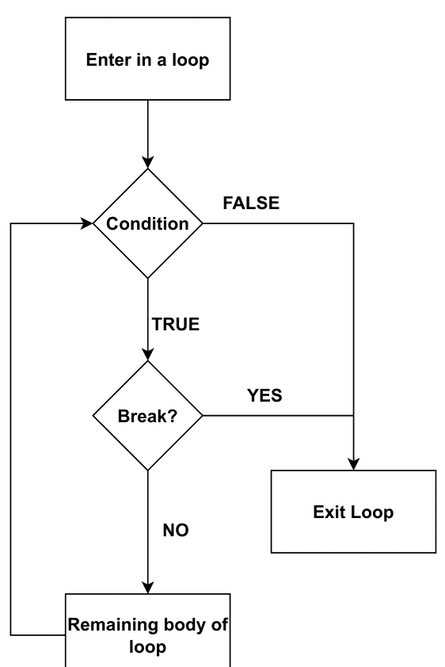

图（7）。Break 语句的流程图。

## Continue 语句

它用于绕过循环中包含的其余代码，仅用于当前迭代。当循环中存在 continue 语句时，循环不会退出，而是继续进行下一次迭代。图（8）描绘了 continue 语句在多次迭代中的流程图。

## 示例 1：

```python
for i in range(10):
    if i == 5:
        continue
    print(i)
```

#### 输出：

```
0
1
2
3
4
6
7
8
9
```

## 示例 2：

```python
for x in range(7):
    if (x == 4 or x == 6):
        continue
    print(x)
```

#### 输出：

```
0
1
2
3
5
```

## Pass 语句

在 Python 中，“空语句”一词指的是 *pass* 语句。注释与 pass 语句之间最显著的区别在于，解释器会忽略前者，而后者则不会被如此对待。此外，当 pass 被执行时，绝对不会发生任何事情。它不会影响操作。为了更好地理解 pass 语句，让我们看一个例子。

## 示例 1：

```python
a = 10
b = 20
if b > a:
    pass
```

#### 输出：

无输出

## 示例 2：

```python
sequence = {'a', 'b', 'c', 'd', 'e', 'f'}
for x in sequence:
    pass
```

#### 输出：

无输出

## 总结

本章涵盖了几个不同类别的控制语句，包括顺序控制结构、选择控制结构和重复控制结构。它对每种控制语句进行了深入分析。我们阐述了循环的工作原理。因此，本章通过适当的示例和图表介绍了每种控制语句。下一个主题将是 Python 中函数的使用，这将在下一章中介绍。

# 第 4 章

# 函数

**摘要：** 函数是每种编程语言中的主要概念之一。它们提供了一种便捷的方式来封装编程逻辑，并根据需要在任何地方多次使用。因此，它们有助于减少代码冗余并提高可复现性。随着代码长度的增加，根据代码的效用将其拆分为不同的函数，从而将代码划分为独立的模块，通常是一个好主意。这是组织冗长代码的一种广受推崇的做法。它们还有助于对代码进行单元测试，因为隔离测试小单元是一项相当容易的任务。因此，这种对函数的刻意使用支持了语言的灵活性和用户友好的界面。本章的相关要点将是：

1.  理解 *函数* 和 *函数调用*。
2.  理解 *局部* 和 *全局* 变量的概念。
3.  使用递归函数进行编程。

**关键词：** 可复现性，冗余，可重用性，递归。

## 引言

函数是一种有用的方法，可以将代码划分为更易于管理的部分，从而使代码更有条理、更易于理解、可重用和可重新利用。此外，函数是一段在函数本身被调用时执行的代码。它可以接收以参数或实参形式传入的数据，然后返回结果。

## 定义

函数是一段包含执行特定操作的语句块的代码区域。在创建函数时，需要遵循一些基本准则：

1.  函数块以 **def** 关键字开头。之后是 **函数名** 和括号 (())。
2.  参数或实参应在括号内传递。
3.  任何函数的代码块都以冒号 (:) 开头并缩进。

### 语法：

```python
def function_name(parameters):
    语句 1
    语句 2
    语句 3
    -
    -
    -
    语句 n
    return [表达式]
```

函数有两种类型，如下所述：

-   预定义函数
-   用户自定义函数

## 预定义函数

它有时被称为内置函数，因为 Python 的功能是在语言中建立的。Python 解释器有几个始终可用的内置函数。内置函数有很多种，以下是一些内置函数的示例（表 1）：

表 1. 预定义函数。

| 函数 | 描述 |
| :--- | :--- |
| abs() | 返回数字的绝对值 |
| bin() | 返回数字的二进制版本 |
| float() | 返回浮点数 |
| hex() | 将数字转换为十六进制值 |
| int() | 返回整数 |
| len() | 返回对象的长度 |
| list() | 返回列表 |
| max() | 返回可迭代对象中的最大项 |
| min() | 返回可迭代对象中的最小项 |
| oct() | 将数字转换为八进制 |
| pow() | 返回 x 的 y 次幂的值 |
| print() | 打印到标准输出设备 |
| range() | 返回一个数字序列，从 0 开始，默认递增 1 |
| round() | 对数字进行四舍五入 |

让我们看一个到目前为止讨论的每个内置函数的示例，以更好地理解它们的使用方法。

#### 示例：

```python
# 返回数字的绝对值
x1 = abs(-5.37)
print(x1)

# 返回 24 的二进制版本
x2 = bin(24)
print(x2)

# 将数字 7 转换为浮点数
x3 = float(7)
print(x3)

# 将 321 转换为十六进制值
x4 = hex(321)
print(x4)

# 将数字 7.2 转换为整数
x5 = int(7.2)
print(x5)

# 返回列表中的项目数量
list1 = ["Malika", "Krishna", "William", "Sam"]
x6 = len(list1)
print(x6)

# 返回最大数字
x8 = max(245, 433)
print(x8)

# 返回最小数字
x9 = min(343, 434)
print(x9)

# 将数字 12 转换为八进制值
x10 = oct(32)
print(x10)

x11 = pow(5, 5)  # 返回 5 的 5 次幂的值（等同于 5 * 5 * 5 * 5）
print(x11)

# 在屏幕上打印一条消息
print("It is a message")

# 创建一个从 0 到 7 的数字序列，并打印序列中的每个项目
x12 = range(8)
for n in x12:
    print(n)

# 将数字四舍五入到仅两位小数
x13 = round(6.66543, 2)
print(x13)
```

#### 输出：

```
5.37
0b11000
7.0
0x141
7
4
433
343
0o40
3125
It is a message
0
1
2
3
4
5
6
7
6.67
```

## 用户自定义函数

当一个函数是为特定任务编写的时，它被称为用户自定义函数。此外，用户是设计或编写该函数的人。让我们看一个用户自定义函数的示例，以便更好地理解这个过程是如何工作的。

## 示例 1：

```python
# 声明一个 show 函数
def show():
    print("Inside function")

# 调用函数
show()
```

#### 输出：

```
Inside function
```

## 示例 2：

```python
# 用于检查偶数和奇数的 Python 函数
def evenOdd(var):
    if (var % 2 == 0):
        print("Number is Even")
    else:
        print("Number is Odd")

# 调用函数
evenOdd(10)
evenOdd(11)
```

#### 输出：

```
Number is Even
Number is Odd
```

## 函数调用

一旦定义了函数，我们就可以调用它来执行任务。要调用函数，我们输入函数名和必要的参数。

### 语法：

```python
function_name(argument_1, argument_2)
```

## 示例 1：

```python
# 函数定义
def my_function():
    print("This function has been created")

my_function()  # 函数调用
```

#### 输出：

```
This function has been created
```

## 示例 2：

```python
# 函数定义
def my_name(name):
    print(name)

my_name('David')  # 带参数的函数调用
```

#### 输出：

```
David
```

## 示例 3：

```python
# 用于三个数字求和的函数
def sum_three_numbers(num1, num2, num3):
    return num1 + num2 + num3

# 带三个参数的函数调用
x = sum_three_numbers(1, 2, 3)
print(x)
```

#### 输出：

```
6
```

## 函数参数和实参

可以根据函数接受的参数和实参将信息传递给函数。传递给函数的精确值被称为 **实参**。我们可以提供多个实参，但每个实参必须用逗号分隔。“参数”和“实参”这两个术语是同义词，可以互换使用。此外，数据通过函数进行处理。函数参数和实参之间存在区别，尽管这种区别很微妙。参数是指在函数描述中括号内列出的变量。另一方面，“实参”是指在调用函数时传递给函数的值。为了帮助你理解函数实参和参数的重要性，让我们看一个示例。

#### 示例：

```
# 参数示例
def Name_function(F_name, L_name): # 函数定义
    print (F_name + " " + L_name)

# 两个参数值 (Krishna, Kumar)
Name_function("Krishna", "Kumar") # 函数调用
```

#### 输出：

Krishna Kumar

## 默认参数

在 Python 中，允许为函数参数设置默认值。可以使用赋值运算符（=）为参数提供默认值。请考虑以下场景。

#### 示例：

```
def my_name(name, msg="how are you?"): # 函数定义
    print ("Hello", name + ', ' + msg)

my_name("John") # 函数调用
my_name("James", "Welcome") # 函数调用
```

#### 输出：

Hello John, how are you?
Hello James, Welcome

让我们看一些与函数相关的其他示例。

#### 示例：

```
#Python 任意参数
def some_name(*names):
    print("Hello", names)

some_name("Jay", "Joy", "Ram", "Amit")

#参数传递
def fun1(food):
    for n in food:
        print(n)

var = ["apple", "banana", "cherry"]
fun1 (fruits)
```

#### 输出：

```
Hello ('Jay', 'Joy', 'Ram', 'Amit')

apple

banana

cherry
```

## 变量作用域与生命周期

变量不能从程序的任何不同部分访问。某些变量甚至可能在整个程序中都不存在。变量的声明决定了变量的存在和可访问性。

## 变量作用域

它是程序中变量可访问的部分。变量作用域有两种类型：

- 局部作用域
- 全局作用域

## 局部作用域

在嵌套函数中创建的变量，其作用域存在于该函数中。假设变量在最内层函数中声明；那么，该变量的作用域仅限于最内层函数。

## 全局作用域

全局变量在软件的主体中生成，属于全局作用域。这类全局变量在任何作用域中都可用。此外，任何函数、方法或代码都能轻松理解全局变量。

## 变量的生命周期

它是变量存在的时间长度。让我们举一个例子来理解变量作用域和生命周期的概念。

#### 示例：

```
## 局部作用域
def show():
    x = 1234  # 局部变量
    print (x)
show()

x = 1234  # 全局变量

def show():
    print (x)
show()

print (x)  # 全局作用域
```

#### 输出：

```
1234
1234
1234
```

## 局部变量与全局变量

局部变量在方法或代码块内部声明。局部变量只能在声明的方法或代码块内访问，不能在该方法或代码块外部访问。

#### 示例：

```
def my_fun():
    x=100    #局部变量
    print (x)

my_fun()
```

#### 输出：

```
100
```

## 全局变量

这种类型的变量在文件的主体中定义。它在整个程序中都可用。所有函数或代码块都能轻松理解和访问全局变量。

#### 示例：

```
x=10  # 全局
def my_fun():
    x=5  # my_fun() 内的局部作用域
    print (x) # 打印局部变量

my_fun()

print (x)  # 打印全局变量
```

#### 输出：

```
5
10
```

## global 语句

声明局部变量的代码块是唯一可以评估其作用域的地方。此外，当程序员在函数内部创建变量时，该变量被视为局部变量。但是，通过在函数内部使用 `global` 关键字，我们可以创建一个可在整个程序中访问的变量。这是唯一可以使用它的地方。为了更好地理解这个概念，让我们看一个使用 `global` 关键字的 `global` 语句示例。

#### 示例：

```
def my_fun():
    global x
    x = 10  # x 是全局的

my_fun()

print (x)  # 打印 x
```

#### 输出：

```
10
```

假设我们有一个与程序中全局变量同名的变量。在这种情况下，会创建一个同名的新局部变量，它与全局变量不同。

#### 示例：

```
x=10
def show():
    x=5
    print ("In Function x is=",x)
show()
print ("Outside function is=",x)
```

#### 输出：

```
In Function x is= 5
Outside function is= 10
```

## return 语句

它用于结束函数调用的执行并返回结果（值或表达式）。关于 **return** 语句，有几个关键点需要记住：

- `return None` 等同于没有参数的 `return` 语句。
- `return` 语句之后的语句会被跳过。
- 如果 `return` 声明中没有表达式，则返回唯一的值 `None`。
- 不能在函数外部使用 `return` 语句。

### 语法：

```
def fun_name():
    函数体
    .
    .
    .
    return [expression]
```

#### 示例：

```
# return 示例
def addition(n1, n2 ):
    total = n1+ n2
    return total.

total = addition(1, 2 );
print ("Addition is =", total)
```

#### 输出：

```
Addition is = 3
```

## Lambda 函数

Lambda 函数用于存在匿名函数或未声明名称的函数的情况。在大多数情况下，函数使用 `def` 关键字定义，而匿名函数使用 **lambda** 关键字定义。Lambda 函数的语法如下所述。

以下是关于 lambda 函数的要点：

1. Lambda 函数的参数数量是无限的，但只有一个表达式。
2. 如果我们需要一个短时间的匿名函数，我们会使用 lambda 函数。
3. Lambda 的含义不包括 "return" 语句；相反，它总是包含一个被返回的表达式。

### 语法：

```
lambda arguments: expression
```

## 示例 1：

```
# 将参数加 50 并返回
res = lambda a : a + 50
print(res(25))
```

#### 输出：

```
75
```

## 示例 2：

```
# 三个数的和
res = lambda n1, n2, n3: n1 + n2 + n3
print(res(1, 2, 3))
```

#### 输出：

```
6
```

## 递归函数

当我们构建一个函数，然后在该函数的定义内部调用该函数时，我们就创建了一个递归代码。递归是函数调用自身的过程的名称。使用递归进行编程是一种非常有效的方法；然而，重要的是要记住递归必须在某个点停止。如果在递归中能找到终止条件，这表明代码运行准确。如果缺少终止条件，则表明递归代码将执行无限次。

### 语法：

```
def func_name(): <-
    |
    | (递归调用)
    |
    func_name() ----
```

以下是递归函数的优点和缺点：

## 优点

- 使用递归，可以将函数分解为更小的子问题。
- 通常，创建序列比嵌套迭代更简单。
- 使用递归函数使代码看起来简单而高效。

## 缺点

- 递归调用使用大量内存和时间，这就是它们代价高昂的原因。
- 调试递归函数很困难。
- 递归背后的逻辑有时可能难以理解。

#### 示例：

```
# 计算斐波那契数列前 k 项的程序
def fib(k):    # 递归函数
    if k <= 1:
        return k
    else:
        return(fib(k-1) + fib(k-2))

term=8
if term <= 0:
    print ("Invalid input ! Please input a positive value")
else:
    print ("Fibonacci series:")
    for i in range(term):
        print (fib(i))
```

#### 输出：

```
0
1
1
2
3
5
8
13
```

#### 示例：

```
# 计算阶乘值的递归程序
def fact(k):  # 递归函数
if k == 1:
    return k
else:
    return k * fact(k-1)

n = 5
# 检查输入是否有效
if n < 0:
    print ("Invalid input ! Please enter a positive number.")
elif n == 0:
    print ("Factorial of number 0 is 1")
else:
    print ("Factorial of number", n, "=", fact(n))
```

#### 输出：

```
Factorial of number 5 = 120
```

## 函数重定义

Python 提供了函数重定义的功能，因为 Python 是动态的。函数重定义意味着重新定义一个已经定义的函数。让我们举一个例子来理解函数重定义的概念。

#### 示例：

```python
# 函数重定义示例
from time import gmtime, strftime

def show(msg):    # 函数定义
    print (msg)
show("Start")

def show(msg):    # 函数重定义
    print (strftime("%H:%M:%S", gmtime()))
    print (msg)
show ("Processing.")
```

#### 输出：

```
Start
11:20:20
Processing.
```

## 总结

在本章中，我们探讨了函数及其对于模块化编程的重要性，重点在于函数本身。我们讨论了如何将参数传递给函数。我们还介绍了局部变量和全局变量、语句以及各自作用域之间的区别。因此，本章涵盖了函数所有可能的变体及其运作过程。在接下来的章节中，我们将继续探讨Python支持的下一个主题：字符串、列表及其相关特性。

## 第5章

## 序列——字符串与列表

**摘要：** 与整数、浮点数和布尔值等原始数据类型不同，字符串是一个有序的字符序列，其中每个字符都可以轻松访问。此外，Python的一个重要内置数据类型是列表。列表和字符串有许多相似之处，例如，列表是值的序列。列表索引的工作方式与字符串索引类似。但与字符串不同，列表是可变的。在本章中，我们将介绍列表和字符串的核心概念，以及几种使这些数据类型编程更便捷的运算符。

**关键词：** 可变，切片，有序集合。

## 引言

当我们需要一组彼此非常相似的字符时，必须使用字符序列。例如，如果你想在计算机内存中保存你的名字记录，你需要一个能够存储你名字的变量。然而，由于名字是字符的集合，因此需要一系列字符。这个字符串不过是一连串的字符。

Python中等效的序列数据类型称为列表。它是最有效的，可以表示为由逗号分隔并括在方括号中的值列表。列表经常用于存储各种数据的序列。列表是可变的，这意味着在列表构建后，其元素可以被更改。本章讨论了可以对列表元素执行的各种操作。

## 字符串

一系列字符被称为字符串。Python严重依赖这个概念来正常工作。关于字符串，有几个关键方面需要考虑。

- 字符串是Python中最流行的类型之一。
- 只需将字符括在引号（单引号、双引号或三引号）中即可创建它们。
- Python将单引号与双引号同等对待。
- 字符串是Unicode字符的序列，而字符只是一个符号。

要生成一个名字列表，必须输入每个用引号括起来的名字，例如“Krishna”。字符串也可以赋值给一个变量，以执行进一步的操作并进一步利用该字符串。让我们从最基本的示例开始，以理解字符串的概念。

#### 示例：

```python
str = "This is a string."
print (str)
```

#### 输出：

```
This is a string
```

Python的标准库中没有字符数据类型。如果我们认为单个字符是一个字符串，那么该字符串的长度将为一。你可以使用方括号（[]）访问字符串的组成部分。

#### 示例：

```python
str = "Python"
print (str[0])
print (str[1])
print (str[2])
print (str[3])
print (str[4])
print (str[5])
```

#### 输出：

```
P
y
t
h
o
n
```

字符串可以用于逐字符循环。

#### 示例：

```python
for i in "Krishna":
    print (i)
```

#### 输出：

```
K
r
i
s
h
n
a
```

关于字符串的其他概念包括用于获取字符串长度的 *len()* 函数，以及用于检查子字符串或字符是否存在于字符串中的关键字 *in* 和 *not in*。

#### 示例：

```python
# 打印字符串的长度
str = "Python"
print (len(str))  # 字符串长度

# 打印字符串中是否包含 "simple"
str1= "Python is so simple"
print ("simple" in str1)

# 仅当字符串中存在 "simple" 时才打印：
str2 = "Python is so simple"
if "simple" in str2:
    print ("Yes, 'simple' is present.")

# 打印字符串中是否不包含 "simple"
str3 = "Python is so simple"
print ("programming" not in str3)
```

#### 输出：

```
6
True
Yes, 'simple' is present.
True
```

## 字符串连接

“字符串连接”指的是将两个字符串组合在一起。如果我们有两个字符串分别放入两个不同的变量 str1 和 str2 中，那么可以使用以下两种方法之一将这两个字符串连接在一起或合并成一个字符串。有四种连接字符串的方法。

1. 使用 + 运算符
2. 使用 join() 方法
3. 使用 % 运算符
4. 使用 format() 函数

## 使用 + 运算符

这是连接两个字符串的简单方法。它可以将多个字符串加在一起。让我们举一个例子来理解这个概念。

#### 示例：

```python
# 定义字符串
S1 = "Python"
S2 = "Programming"

# 使用 + 运算符组合字符串
S = S1 + S2
print (S)
```

#### 输出：

```
PythonProgramming
```

## 使用 join() 方法

join() 方法是一个字符串方法，它返回一个字符串，其中序列元素已使用 str 分隔符连接。

#### 示例：

```python
fname = "My"
lname = "Name"

print ("".join([fname, lname]))

# 使用带空格分隔符（" "）的 join() 方法连接字符串
name = " ".join([fname, lname])
print (name)
```

#### 输出：

```
MyName
MyName
```

## 使用 % 运算符

可以使用字符串格式化运算符（%）来连接字符串。

#### 示例：

```python
fname = "My"
lname = "Name"

# % 运算符
print ("% s % s" % (fname, lname))
```

#### 输出：

```
MyName
```

## 使用 format() 函数

这是格式化字符串的一种方式的示例。可以进行多种替换并以多种方式格式化值。*str.format()* 是连接字符串所必需的。此方法通过使用位置格式化来实现序列内组件的连接。以下代码演示了如何使用 *format()* 函数将当前存储在 fname 和 lname 变量中的字符串组合成一个字符串，然后保存在不同的变量名下。可以使用花括号将字符串按特定顺序放置。第一组花括号跟踪第一个变量，第二组花括号跟踪第二个变量。

#### 示例：

```python
fname = "Malika"
lname = "Acharya"
print ("{} {}".format(fname, lname))

# 结果存储在 name 中
name = "{} {}".format(fname, lname)
print (name)
```

#### 输出：

```
MalikaAcharya
MalikaAcharya
```

## 追加字符串

追加到字符串意味着将一个字符串添加到另一个字符串。假设我们有两个字符串，并且这些字符串已被赋值给两个变量 **S1** 和 **S2**；那么，可以将 **S1** 追加或添加到 **S2**。有两种方法可以将一个字符串追加到另一个字符串。

1. 使用 += 运算符
2. 使用 join()

## 使用 += 运算符

使用专门的函数来完成这一活动是其他语言中使用的传统方法的一个例子，尽管这种方法更简单。为了更好地理解这个概念，让我们看一个具体的例子。

#### 示例：

```python
# 初始化字符串
str1 = "String1"
# 初始化要添加的字符串
str2 = "String2"
# 打印原始字符串
print ("The original string : " + str(str1))
# 打印要添加的原始字符串
print ("The add string : " + str(str2))

# 将一个字符串添加到另一个字符串
str1 += str2    # 使用 += 运算符
# 打印结果
print ("The appended string is : " + str1)
```

#### 输出：

```
The original string: String1
The add string: String2
The appended string is: String1String2
```

## 使用 join()

此方法用于将字符串连接在一起。当我们需要连接两个以上的字符串时，例如当我们有多个字符串需要连接时，前面的方法比此方法更有优势。为了更好地理解这个概念，让我们看一个具体的例子。

#### 示例：

```python
# 初始化字符串
str1 = "Python"

# 初始化要添加的字符串
str2 = "Book"
# 打印原始字符串
print ("The original string : " + str(str1))
# 打印要添加的原始字符串
print ("The add string : " + str(str2))

# 将一个字符串添加到另一个字符串
result = "".join((str1, str2))    # 使用 join()
# 打印结果
print ("The appended string is : " + result)
```

#### 输出：

原始字符串：Python
添加字符串：Book
追加后的字符串是：PythonBook

## 字符串乘法

由于 Python 中的字符串乘法类似于另一种数据类型的行为，因此该过程大大简化。字符串乘法的过程可以通过几种不同的方式完成。为了更好地理解这个概念，让我们看一个具体的例子。

#### 示例：

```
1.      str1= "Python Programming"
2.      str2= 2*str1    # 方法 1
3.      print (str2)
4.  
5.      str3=4*(str1) # 方法 2
6.      print (str3)
7.  
8.      str4= 3*('Python', 'Programming') # 方法 3
9.      print (str4)
```

#### 输出：

```
Python ProgrammingPython Programming
Python ProgrammingPython ProgrammingPython ProgrammingPython Programming
('Python', 'Programming', 'Python', 'Programming', 'Python', 'Programming')
```

## 不可变字符串

当字符串是不可变的，其值无法以任何方式更改。此外，一旦我们分配了字符串值，如果我们尝试执行此操作，将会产生错误，并且它无法重新分配自身。为了更好地理解这个概念，让我们看一个具体的例子。

#### 示例：

```
1. str= "Book"
2. print (str)
3. str[0] = "P"  # 无法重新赋值
```

#### 输出：

```
str[0] = "V"  # 无法重新赋值
TypeError: 'str' object does not support item assignment
```

## 字符串格式化运算符

它使用 `%` 运算符进行字符串格式化操作。可以与 `%` 一起使用各种符号，如表 1 所示。

表 1. 字符串格式化符号及其描述。

| 符号 | 描述 |
|---|---|
| %f | 用于浮点实数 |
| %d | 用于有符号十进制整数 |
| %u | 用于无符号十进制整数 |
| %o | 用于八进制整数 |
| %X | 用于十六进制整数（大写字母） |
| %e | 用于指数表示法（小写 'e'） |
| %E | 用于指数表示法（大写 'E'） |
| %g | 用于 %f 和 %e 中较短的一个 |
| %G | 用于 %f 和 %E 中较短的一个 |
| %c | 用于单个字符 |
| %s | 用于在格式化之前通过 str() 进行字符串转换 |
| %i | 用于有符号十进制整数 |
| %x | 用于十六进制整数（小写字母） |

#### 示例：

```
1.  # 将变量初始化为字符串
2.  var = '27'
3.  string = "Variable as string = %s" %(var)
4.  print (string)
5.  
6.  # 作为原始数据打印
7.  print ("Variable as raw data = %r" %(var))
8.  
9.  # 将变量转换为整数
10. # 并应用其他格式化选项
11. var = int(var)
12. string = "Variable as integer = %d" %(var)
13. print (string)
14. print ("Variable as float = %f" %(var))
15. 
16. print ("Variable as printing with special char = %c Ram" %(var))
17. 
18. print ("Variable as hexadecimal = %x" %(var))
19. print ("Variable as octal = %o" %(var))
```

#### 输出：

```
Variable as string = 27
Variable as raw data = '27'
Variable as integer = 27
Variable as float = 27.000000
Variable as printing with special char = Ram
Variable as hexadecimal = 1b
Variable as octal = 33
```

## 内置字符串函数

有各种类型的内置字符串函数。我们使用这些函数来获得所需的结果。一个关键点是，这些类型的函数返回新的字符串。它无法更改原始字符串。我们展示了一些基本的内置字符串函数，如表 2 所示。

序列-字符串与列表 Python 编程基础：初学者快速指南 87

#### 示例：

```
1.  # 内置字符串函数
2.  txt = "Python is a good prog., Python is easy to learn, Python is easy to understand."
3.  cnt = txt.count("Python")
4.  print (cnt)
5.  
6.  low = txt.islower()  # 检查文本中的所有字符是否均为小写
7.  print (low)
8.  
9.  spl= txt.split()  # 将字符串分割成列表，其中每个单词是一个列表项
10. print (spl)
11. 
12. ew = txt.endswith(".")  # 检查字符串是否以 (.) 结尾
13. print (ew)
14. 
15. cen = txt.center(10)  # 10 个字符的居中空间
16. print (cen)
17. 
18. an = txt.isalnum()  # 检查文本中的所有字符是否均为字母数字
19. print (an)
20. 
21. isn = txt.isnumeric()  # 检查文本中的所有字符是否均为数字
22. print (isn)
23. 
24. tit = txt.title()  # 每个单词的首字母大写
25. print (tit)
```

#### 输出：

```
3

False

['Python', 'is', 'a', 'good', 'prog.,', 'Python', 'is', 'easy', 'to', 'learn,', 'Python', 'is', 'easy', 'to', 'understand.']

True

Python is a good prog., Python is easy to learn, Python is easy to understand.

False

False

Python Is A Good Prog., Python Is Easy To Learn, Python Is Easy To Understand.
```

表 2. 内置字符串函数。

| 函数 | 描述 |
| :--- | :--- |
| *count()* | 返回指定值在字符串中出现的次数 |
| *islower()* | 如果字符串中的所有字符均为小写，则返回 True |
| *split()* | 在指定的分隔符处分割字符串并返回一个列表 |
| *endswith()* | 如果字符串以指定值结尾，则返回 true |
| *center()* | 返回一个居中的字符串 |
| *isalnum()* | 如果字符串中的所有字符均为字母数字，则返回 True |
| *isnumeric()* | 如果字符串中的所有字符均为数字，则返回 True |
| *title()* | 将每个单词的第一个字符转换为大写 |

## 切片操作

slice() 函数返回一个切片对象，可用于切片字符串、列表、元组等。slice() 函数的语法及参数描述如下。

### 语法：

```
slice(stop)
slice(start, stop, step)
```

**start** 参数提供对象切片开始的索引。对象切片停止的索引可以通过 **stop** 参数确定。**step** 参数是一个可选语句，用于确定整个切片过程中每个索引之间的增量。关于 *slice()* 函数，有以下重要点：

- 它返回一个仅包含定义集合中元素的切片对象。
- 如果只传递一个参数，则 start 和 step 被视为无。

#### 示例：

```
1.  # 它从位置 2 开始切片对象，切片到位置 4，并返回结果：
2.  var = ("P", "Y", "T", "H", "O", "N")
3.  sl = slice(2, 4)
4.  print (var[sl])
5.  
6.  # 它使用 step 参数返回每隔一个项目：
7.  var = ("P", "Y", "T", "H", "O", "N")
8.  sl = slice(0, 6, 2)
9.  print (var[sl])
```

#### 输出：

```
('T', 'H')

('P', 'T', 'O')
```

#### 示例：

```
1.  # 字符串切片
2.  str ='Pythonbook'
3.  sl1 = slice(2)
4.  sl2 = slice(1, 4, 3)
5.  print ("String slicing")
6.  print (str[sl1])
7.  print (str[sl2])
8.  
9.  # 列表切片
10. lst = [5, 6, 7, 8, 9]
11. sl1 = slice(2)
12. sl2 = slice(1, 4, 2)
13. print ("\nList slicing")
14. print (lst[sl1])
15. print (lst[sl2])
16. 
17. # 元组切片
18. tpl = (4, 5, 6, 7, 8)
19. sl1 = slice(3)
20. sl2 = slice(1, 5, 2)
21. print ("\nTuple slicing")
22. print (tpl[sl1])
23. print (tpl[sl2])
```

#### 输出：

```
String slicing
Py
List slicing
[5, 6]
[6, 8]
Tuple slicing
(4, 5, 6)
(5, 7)
```

## ord() 函数

这是一个内置功能，返回对应于单个 Unicode 字符的整数值。返回的数字表示 Unicode 码位。当向 **ord()** 函数提供长度为 1 的字符串时，它返回一个表示该字符 Unicode 码位的整数。如果字符串长度大于一，将生成 TypeError。让我们看一个例子，以便更好地理解 ord() 函数的概念。

#### 示例：

```
1. res1 = ord('A')
2. res2 = ord('a')
3. print (res1, res2) # 打印 Unicode 值
```

#### 输出：

```
65 97
```

## chr() 函数

**chr()** 函数将整数转换为字符或字符串并返回结果。该数字的值是该字符的 Unicode 码位。为了更好地理解 **chr()** 函数的概念，让我们看一个例子。

#### 示例：

```
1. res1 = chr(65) #返回Unicode值为65的字符
2. res2 = chr(97) #返回Unicode值为97的字符
3. print (res1, res2) # 打印字符值
```

#### 输出：

A a

## 字符串比较

比较字符串意味着判断两个字符串是否相等。有三种方法可以比较字符串：

- 1. 使用关系运算符
- 2. 使用 `is` 和 `is not`
- 3. 使用用户自定义函数

## 使用关系运算符

关系运算符比较字符串字符的Unicode值。它根据所使用的运算符返回一个布尔值。Python中提供了以下关系运算符（表3）。

表3. 使用关系运算符进行字符串比较。

| 符号 | 描述 |
| :--- | :--- |
| == | 检查两个字符串是否相等。 |
| != | 检查两个字符串是否不相等。 |
| < | 检查左侧字符串是否小于右侧字符串。 |
| <= | 检查左侧字符串是否小于或等于右侧字符串。 |
| > | 检查左侧字符串是否大于右侧字符串。 |
| >= | 检查左侧字符串是否大于或等于右侧字符串。 |

#### 示例：

```
1. print ("Python" == "Python")
2. print ("Python" < "python")
3. print ("Python" > "python")
4. print ("Python" <= "python")
5. print ("Python" >= "python")
6. print ("Python" != "Python")
```

#### 输出：

```
True
True
False
True
False
False
```

## 使用 *is* 和 *is not*

此运算符检查两个操作数是否引用同一个对象。让我们通过一个例子来理解这个概念。

#### 示例：

```
1.  str1 = "Book"
2.  str2 = "Book"
3.  str3 = str1
4.  
5.  print (str1 is not str1)
6.  print (str1 is not str2)
7.  print (str1 is not  str3)
8.  
9.  print (str1 is str1)
10. print (str1 is str2)
11. print (str1 is str3)
```

#### 输出：

```
False
False
False
True
True
True
```

## 使用用户自定义函数

我们可以创建用于字符串比较的用户自定义函数。一个用户自定义函数将根据数字的数量来比较字符串。

#### 示例：

```
1.  def str_cmp(str1, str2):
2.      count1 = 0
3.      count2 = 0
4.      for i in range(len(str1)):
5.          if str1[i] >= "0" and str1[i] <= "9":
6.              count1 += 1
7.  
8.      for i in range(len(str2)):
9.          if str2[i] >= "0" and str2[i] <= "9":
10.             count2 += 1
11.     return count1 == count2
12. 
13. print(str_cmp("1234", "5672"))
14. print(str_cmp("1246", "Python"))
15. print(str_cmp("123Python", "Python123"))
```

#### 输出：

```
True
False
True
```

## 遍历字符串

遍历字符串意味着同时访问其每个字符。在Python中，有多种方法可以遍历字符串的字符。

#### 示例：

```
1.  # 使用简单遍历和range()函数
2.  str1 = "Programming"
3.  
4.  for var in str1:
5.      print(var, end=' ')
6.  print("\n")
7.  
8.  
9.  
10. str2 = "Book"
11. 
12. for i in range(0, len(str2)):  # 遍历索引
13.     print(str2[i])
```

#### 输出：

```
P r o g r a m m i n g
B
o
o
k
```

#### 示例：

```
1. #使用enumerate()函数
2. str3 = "Python"
3. 
4. # 遍历字符串
5. for i, v in enumerate(str3):
6.     print (v)
```

#### 输出：

```
P
y
t
h
o
n
```

在Python中，我们也可以遍历字符串中的单词。给定一个由空格分隔的多个单词组成的字符串。在Python中，存在多种遍历字符串中单词的方法。

## split() 函数

我们可以将字符串分割成单词列表，但这种方法在包含标点符号的字符串中会失败。让我们看一个例子。

#### 示例：

```
1. str1 = "Python is a good prog., Python is easy to use, Python is easy to understand"
2. print ("The original string is: " + str1)
3. 
4. result = str1.split()  # 使用split()从字符串中提取单词
5. 
6. print ("\nThe words of string are")
7. for i in result:
8.     print (i)
```

#### 输出：

```
The original string is: Python is a good prog., Python is easy to use, Python is easy to understand

The words of string are
Python
is
a
good
prog.,
Python
is
easy
to
use,
Python
is
easy
to
understand
```

## re.findall() 函数

这种方法需要使用正则表达式来完成任务。在过滤字符串并提取单词（忽略标点符号）后，*findall()* 函数返回列表。

#### 示例：

```
1.  #findall() 示例
2.  import re
3.  
4.  str1= "Python is a good prog., Python is easy to use, Python is easy to understand."
5.  print ("The original string is: " + str1)
6.  
7.  result = re.findall(r'\w+', str1)
8.  
9.  print ("\nThe words of string are")
10. for i in result:
11.     print (i)
```

#### 输出：

```
The original string is: Python is a good prog., Python is easy to use, Python is easy to understand.
The words of string are
Python
is
a
good
prog
Python
is
easy
to
use
Python
is
easy
to
understand
```

## 字符串模块

字符串模块是一个用于使用类和常量的内置模块。首先，我们必须在使用前导入它。

## 字符串模块常量

此模块中定义了多种类型的字符串常量：

string.ascii_letters

以下常量被连接：ascii_lowercase 和 ascii_uppercase。

string.ascii_lowercase

小写字母 'abcdefghijklmnopqrstuvwxyz'。此值不依赖于区域设置，并且不会改变。

string.ascii_uppercase

大写字母 'ABCDEFGHIJKLMNOPQRSTUVWXYZ'。此值不依赖于区域设置，并且不会改变。

string.digits

字符串 '0123456789'。

string.hexdigits

字符串 '0123456789abcdefABCDEF'。

string.punctuation

在C区域设置中被视为标点字符的ASCII字符字符串：!"#$%&'()*+,-./:;<=>?@[\]^_`{|}~。

#### 示例：

```
1.  # 导入string库函数
2.  import string
3.  
4.  # 将值存储在变量result中
5.  result1 = string.ascii_letters
6.  result2 =string.ascii_lowercase
7.  result3 =string.ascii_uppercase
8.  result4 =string.digits
9.  result5 =string.hexdigits
10. result6 =string.punctuation
11. # 打印值
12. print (result1)
13. print (result2)
14. print (result3)
15. print (result4)
16. print (result5)
17. print (result6)
```

#### 输出：

```
abcdefghijklmnopqrstuvwxyzABCDEFGHIJKLMNOPQRSTUVWXYZ
abcdefghijklmnopqrstuvwxyz
ABCDEFGHIJKLMNOPQRSTUVWXYZ
0123456789
0123456789abcdefABCDEF
!"#$%&'()*+,-./:;<=>?@[\]^_`{|}~
```

## 字符串 capwords() 函数

此函数将指定字符串分割成单词，并将每个单词首字母大写。

#### 示例：

```
1.  # 导入string库函数
2.  import string
3.  str= 'My name is james'
4.  result= string.capwords(str)
5.  print (result)
```

#### 输出：

```
My Name Is James
```

## 字符串模块类

字符串模块类有两种类型：

- 1. Formatter
- 2. Template

## Formatter

如果我们希望对其进行子类化并提供格式字符串语法，此类会变得很有用。它也与 **str.format()** 函数相同。让我们看一个例子，以进一步理解 Formatter 类的概念。

#### 示例：

```
1. from string import Formatter
2. 
3. formatter = Formatter()
4. print (formatter.format('{Faculty}', Faculty='Dr. John William'))
5. print (formatter.format('{} {Faculty}', 'Hello', Faculty='Dr. John William'))
6. 
7. print ('{} {Faculty}'.format('Hello', Faculty='Dr. John William')) # 这与format()相同
```

#### 输出：

```
Dr. John William
Hello Dr. John William
Hello Dr. John William
```

## Template

借助 Template 类，我们可以设计更易于理解的输出规范语法。该格式通过将符号 $ 与允许使用的 Python 标识符（如字母数字字符和下划线）组合来生成占位符名称。让我们一起看一个例子，以便您更好地理解 Template 类背后的概念。

#### 示例：

```
1. # template 示例
2. from string import Template
3. # 创建一个模板
4. temp = Template('P is $P')
5. # 替换值
6. print (temp.substitute({'P' : 1}))
7. # 教师列表存储姓名和他们的ID
8. Faculty = [('James William',11), ('John Smith',22), ('David Sam',33)]
9. temp = Template('Hello $name, $id is your employee id')
10. for var in Faculty:
11.     print (temp.substitute(name = var[0], id = var[1]))
```

#### 输出：

```
P is 1

Hello James William, 11 is your employee id

Hello John Smith, 22 is your employee id

Hello David Sam, 33 is your employee id
```

## 正则表达式

正则表达式是一串独特的字符，它采用特定的语法来帮助您匹配或定位其他字符串或字符串集。这可以通过使用正则表达式来实现。此外，它还建立了一个由与之相关的字符串组组成的模式。您可以使用的函数可以利用表4中列出的**元字符**。

表4. 元字符描述。

| 符号 | 描述 |
| :--- | :--- |
| \ | 用于取消字符的特殊含义。 |
| [] | 表示一个字符类。 |
| ^ | 匹配开头。 |
| $ | 匹配结尾。 |
| . | 匹配除换行符外的任何字符。 |
| ? | 匹配零次或一次出现。 |
| \| | 匹配由它分隔的任何字符。 |
| * | 表示任意次数的出现（包括0次出现） |
| + | 用于一次或多次出现。 |

| 符号 | 描述 |
|---|---|
| {} | 它表示前面的正则表达式需要匹配多次。 |
| () | 它将一组正则表达式括起来。 |

#### 示例：

```
1. import re
2. p = re.compile('[a-m]')
3. print (p.findall("My name is John Willian"))
```

#### 输出：

```
['a', 'm', 'e', 'i', 'h', 'i', 'l', 'l', 'i', 'a']
```

反斜杠（`\`）元字符在表示不同序列方面起着至关重要的作用。元字符（`\`）有以下几种用法，如表5所示。

表5. 带反斜杠（`\`）的元字符。

| 符号 | 描述 |
|---|---|
| \d | 它等同于字符集类 [0-9]，匹配每个十进制数字。 |
| \D | 它可用于匹配任何非数字字符。 |
| \s | 它与每个空白字符兼容。 |
| \S | 它可用于匹配任何非空白字符。 |
| \w | 它等同于字符集类 [a-zA-Z0-9]，匹配每个字母数字字符。 |
| \W | 它可用于匹配任何非字母数字字符。 |

#### 示例：

```
1. import re
2. p1 = re.compile('\d') # \d 等同于 [0-9]
```

#### 输出：

```
['4', '0', '1', '9', '5', '0']
['40', '1950']
['W', 'e', 'l', 'c', 'o', 'm', 'e', 't', 'o', 't', 'h', 'e', 'w', 'o', 'r', 'l', 'd', 'o', 'f', 'p', 'y', 't', 'h', 'o', 'n']
['My', 'age', 'is', '40', 'year', 'and', 'my', 'year', 'of', 'Birth', 'is', '1950']
[' ', ',', ',', ',', ',', ',', ',', ',', '*', '*']
['br', 'br', 'br', 'br', 'br', 'br', 'br', 'b', 'b', 'brrrrrr']
```

#### 示例：

```
1. import re
2. 
3. # 匹配时，'y' 被替换为 '!!'，并且忽略大小写
4. print (re.sub('y', '~-*', 'My age is 36 year and my year of Birth is 1985', flags = re.IGNORECASE))
5. 
6. # 考虑大小写敏感性，"year" 中的 'y' 不会被替换。
7. print (re.sub('y', '!!', 'My age is 36 year and my year of Birth is 1985'))
8. 
9. # 由于 count 被赋值为 1，替换最多发生 1 次
10. print (re.sub('y', '!!', 'My age is 36 year and my year of Birth is 1985', count=1, flags = re.IGNORECASE))
11. 
12. # 模式前的 'r' 表示正则表达式，\s 用于字符串的开始和结束。
13. print (re.sub(r'\sAND\s', ' & ', 'Book and note book', flags=re.IGNORECASE))
```

#### 输出：

```
M~-* age is 36 ~-*ear and m~-* ~-*ear of Birth is 1985
M!! age is 36 !!ear and m!! !!ear of Birth is 1985
M!! age is 36 year and my year of Birth is 1985
Book & note book
```

## 列表

列表是 Python 中一种基本的数据类型，写成用方括号括起来的逗号分隔值。关于列表，有以下重要点：

- 列表项是有序的，除非使用某些列表方法，否则顺序不会改变。
- 列表允许重复值。
- 列表是可变的，这意味着我们可以在列表创建后添加和删除项目。
- 第一个项目的索引为 [0]，索引会递增。

我们可以通过将序列放在方括号 [] 中并用逗号分隔来创建任何列表。它可以包含任意数量的各种类型的项目，例如整数、浮点数、字符串等。让我们看一个基本的例子。

#### 示例：

```
1.  # 空列表
2.  l1 = []
3.  # 整数列表
4.  l2 = [4, 5, 6, 7]
5.  # 包含混合数据类型的列表
6.  l3 = [2, "Python", "Book", 120.8]
7.  print (l1)
8.  print (l2)
9.  print (l3)
```

#### 输出：

```
[]
[4, 5, 6, 7]
[2, 'Python', 'Book', 120.8]
```

列表中的每个值都有索引，可以通过引用索引号来访问。有多种方法可以访问列表元素。

## 使用列表索引

索引运算符 [] 可以访问列表对象。在此系统中，索引从 0 开始。假设列表中有七个项目；那么数字的顺序是从 0 到 6。如果你尝试访问索引中不包含的值，你将收到一个 IndexError。需要记住的最重要的一点是，索引的值必须始终是整数，不允许任何其他类型的值。如果你尝试使用不同的数据类型作为索引值，你将收到一条 TypeError 消息。列表序列也允许负索引。在负索引中，-1 指的是最后一个项目，-2 指的是倒数第二个，-3 指的是倒数第三个，依此类推。

#### 示例：

```
1. # 列表索引
2. ListExample = ['P','Y','T','H','O','N']
3. print (ListExample [0])
4. print (ListExample [1])
5. print (ListExample [2])
6. print (ListExample [3])
7. print (ListExample [4])
8. #负索引
9. print ('--Negative index--')
10. print (ListExample [-1])
11. print (ListExample [-2])
```

#### 输出：

```
P
Y
T
H
O
--Negative index--
N
O
```

## 列表操作

对项目列表执行切片、删除、移除和清空操作。通过使用切片运算符，可以访问列表中包含的项目范围。冒号（:）用于表示它。赋值运算符（=）允许向列表添加新元素和修改现有元素。**delete()** 方法可用于删除特定对象，而 **pop()** 方法可用于从特定索引移除项目。我们可以使用 **clear()** 函数彻底清空列表。让我们看一个例子，以更好地理解上述运算符和方法的工作原理。

#### 示例：

```
1.  ml = ['p','y','t','h','o','n']
2.  print(ml[2:5])  #第3到第5个元素
3.  print(ml[:-6]) #从开始到第5个元素
4.  print(ml[3:])  #第4个元素到末尾
5.  print(ml[:])   #从开始到末尾
6.  del ml[2]      # 删除一个项目
7.  print(ml)
8.  del ml[1:5]    # 删除多个项目
9.  print (ml)
10. mlist = ['P','Y','T','H','O','N']
11. mlist.remove('Y')
12. print (mlist)
13. print (mlist.pop(1))
14. print (mlist)
15. print (mlist.pop())
16. print (mlist)
17. mlist.clear()
18. print (mlist)
19. del ml         # 删除整个列表
20. print (ml)     # 错误：列表未定义
```

#### 输出：

```
['t', 'h', 'o']
[]
['h', 'o', 'n']
['p', 'y', 't', 'h', 'o', 'n']
['p', 'y', 'h', 'o', 'n']
['p']
['P', 'T', 'H', 'O', 'N']
T
['P', 'H', 'O', 'N']
N
['P', 'H', 'O']
[]
Traceback (most recent call last):
  File "<string>", line 25, in <module>
NameError: name 'ml' is not defined
>
```

## 更新列表中的值

我们可以更新单个或多个列表。它可以使用 (=) 赋值运算符来追加和 extend 方法来完成任务。让我们举一个例子来理解上述运算符和方法。

#### 示例：

```
1.  # 添加/更改列表元素
2.  var = [1, 2, 3, 4]
3.  var[0] = 9  # 更改第1个项目
4.  print (var)
5.  
6.  var[1:4] = [22, 33, 44]  # 更改第2到第4个项目
7.  print (var)
8.  
9.  # 在 Python 中使用 append() 追加和扩展列表
10. var = [11, 22, 33]
11. var.append(44)
12. print (var)
13. 
14. var.extend([55, 66, 77])  #使用 extend() 方法添加多个项目
15. print (var)
16. 
17. print (var + [224,353,464])  # 使用 + 运算符合并两个列表。
18.
```

#### 输出：

```
[9, 2, 3, 4]
[9, 22, 33, 44]
[11, 22, 33, 44]
[11, 22, 33, 44, 55, 66, 77]
[11, 22, 33, 44, 55, 66, 77, 224, 353, 464]
```

## 嵌套列表

嵌套列表意味着列表中的列表。此外，一个列表包含一个子元素列表。假设我们有一个名为 **lst** 的列表，它包含一个列表和子列表。嵌套列表由一系列用逗号分隔的子列表组成。

```
lst = ['ab', ['cd', ['efg', 'hij'], 'kl', 'mn'], 'o', 'p']
```

#### 示例：

```
1. lst = ['ab', 'cd', ['efg', 'hij'], 'kl', 'mn'], 'o', 'p']
2.
3. print (L[2]) # 打印 'o'
4.
5. print (L[2][2]) # 打印 'kl'
6.
7. print (L[2][2][0]) # 打印 'k'
```

#### 输出：

```
o
kl
k
```

可以使用 append()、insert()、extend()、pop()、del 和 remove() 方法在嵌套列表中添加和移除项目。也可以使用 len() 查找长度，并使用 for 循环遍历嵌套列表。让我们举一个例子来理解这个概念。

#### 示例：

```
1. lst = ['P', ['ab', 'cd'], 'Y']
2. lst[1][1] = 0
3. print (lst)
4.
5. lst[1].append('X')
6. print (lst)
7.
8. lst[1].insert(0,'PP')
9. print (lst)
10.
11. lst[1].extend([77,88,99])
12. print (lst)
```

#### 输出：

```
['P', ['ab', 0], 'Y']
['P', ['ab', 0, 'X'], 'Y']
['P', ['PP', 'ab', 0, 'X'], 'Y']
['P', ['PP', 'ab', 0, 'X', 77, 88, 99], 'Y']
```

## 别名

当我们把一个变量赋值给另一个变量时，由于变量本身就是对象，所有这些变量都将指向同一个对象。此外，使用两个不同的标识符来引用同一个变量的过程被称为别名。为了更好地理解这个概念，让我们看一个具体的例子。

#### 示例：

```python
1. var1 = [555, 666, 777]
2. var2 = var1  # Aliasing
3. print (var1 is var2)
4. print (var1)
5. print (var2)
```

#### 输出：

```
True
[555, 666, 777]
[555, 666, 777]
```

在上面的例子中，同一个列表有两个不同的名称，var1 和 var2；然而，在执行赋值语句 `var2 = var1` 之后，你可以看到 var1 和 var2 指向同一个列表。

#### 示例：

```python
1. var1 = [555, 666, 777]
2. var2 = [555, 666, 777]
3. print (var1)
4. print (var2)
5. print (var1 == var2)
6. print (var1 is var2)
7.
8. var2 = var1
9. print (var1 == var2)
10. print (var1 is var2)
11.
12. var2[0] = 999
13. print (var1)
14. print (var2)
```

#### 输出：

```
[555, 666, 777]
[555, 666, 777]
True
False
True
True
[999, 666, 777]
[999, 666, 777]
```

## 克隆列表

如果我们想在修改列表的同时保留原始副本，我们必须复制整个列表，而不仅仅是引用。这种方法通常被称为克隆，以避免“克隆”一词的歧义。克隆列表最快、最直接的方法是使用切片操作。

#### 示例：

```python
1. list1 = [777, 888, 999]
2. list2 = list1[:]    # make a clone using slice
3. print (list1 == list2)
4. print (list1 is list2)
5. list2[0] = 555
6. print (list1)
7. print (list2)
```

#### 输出：

```
True
False
[777, 888, 999]
[555, 888, 999]
```

克隆列表有多种方式。

### 使用切片克隆列表

这是克隆列表最直接的方法。当我们想在修改列表的同时保留原始副本时，我们使用这种形式。让我们举一个例子来理解这个概念。

#### 示例：

```python
1. def cloning_List(li1):
2.     lst1 = li1[:]  # Slice Operator
3.     return lst1
4.
5.
6. lvar1 = [55,66,77,88,99]
7. lvar2 = cloning_List(lvar1)
8. print ("Original List:", lvar1)
9. print ("After Cloning:", lvar2)
```

#### 输出：

```
Original List: [55, 66, 77, 88, 99]
After Cloning: [55, 66, 77, 88, 99]
```

### 使用 Extend() 克隆列表

`extend()` 函数可用于将列表复制到新列表中。让我们举一个例子来理解这个概念。

#### 示例：

```python
1. def cloning_List(li1):
2.     lst1 = []
3.     lst1.extend(li1)
4.     return lst1
5.
6. lvar1 = [55,66,77,88,99]
7. lvar2 = cloning_List(lvar1)
8. print ("Original List:", lvar1)
9. print ("After Cloning:", lvar2)
```

#### 输出：

```
Original List: [55, 66, 77, 88, 99]
After Cloning: [55, 66, 77, 88, 99]
```

### 使用 List() 克隆列表

可以使用 `list()` 函数克隆列表。让我们举一个例子来理解这个概念。

#### 示例：

```python
1. def cloning_List(li1):
2.     lst1 = list(li1)
3.     return lst1
4. 
5. lvar1 = [55,66,77,88,99]
6. lvar2 = cloning_List(lvar1)
7. print ("Original List:", lvar1)
8. print ("After Cloning:", lvar2)
```

#### 输出：

```
Original List: [55, 66, 77, 88, 99]
After Cloning: [55, 66, 77, 88, 99]
```

### 使用列表推导式克隆列表

列表推导式方法用于将一个列表的所有元素复制到另一个列表。让我们举一个例子来理解这个概念。

#### 示例：

```python
1. def cloning_List(li1):
2.     lst1 = [i for i in li1]
3.     return lst1
4. 
5. 
6. lvar1 = [55,66,77,88,99]
7. lvar2 = cloning_List(lvar1)
8. print ("Original List:", lvar1)
9. print ("After Cloning:", lvar2)
```

#### 输出：

```
Original List: [55, 66, 77, 88, 99]
After Cloning: [55, 66, 77, 88, 99]
```

### 使用 Append() 克隆列表

**append()** 函数可用于向列表追加或添加元素，或将它们复制到新列表。它用于将元素添加到列表的末尾。让我们举一个例子来理解这个概念。

#### 示例：

```python
1. def cloning_List(li1):
2.     lst1 = []
3.     for i in li1: lst1.append(i)
4.     return lst1
5. 
6. 
7. lvar1 = [55,66,77,88,99]
8. lvar2 = cloning_List(lvar1)
9. print ("Original List:", lvar1)
10. print ("After Cloning:", lvar2)
```

#### 输出：

```
Original List: [55, 66, 77, 88, 99]
After Cloning: [55, 66, 77, 88, 99]
```

### 使用 Copy() 克隆列表

使用此方法将一个列表的所有元素复制到另一个列表。让我们举一个例子来理解这个概念。

#### 示例：

```python
1. def cloning_List(li1):
2.     lst1 = []
3.     lst1 = li1.copy()
4.     return lst1
5. 
6. 
7. lvar1 = [55,66,77,88,99]
8. lvar2 = cloning_List(lvar1)
9. print ("Original List:", lvar1)
10. print ("After Cloning:", lvar2)
```

#### 输出：

```
Original List: [55, 66, 77, 88, 99]
After Cloning: [55, 66, 77, 88, 99]
```

## 内置函数

列表上有多种类型的内置函数。我们可以直接使用这些函数轻松完成任务（表 6）。

表 6. 列表内置函数。

| 函数 | 描述 |
|---|---|
| cmp(list1, list2) | 此函数比较两个列表的元素。 |
| len(list) | 此函数返回列表的长度。 |
| max(list) | 此函数返回列表中具有最大值的元素。 |
| min(list) | 此函数返回列表中具有最小值的元素。 |
| list(seq) | 此函数将元组转换为列表。 |

#### 示例：

```python
1. list1 = ['Amit', 10]
2. list2 = ['David', 'James']
3.
4. def cmp(p, q):
5.     return (p > q) - (p < q)
6.
7. print (cmp(list1, list2)) # List comparison
8.
9. print (len(list1)) # Length of list
10.
11.     list3 = [53535, 68868, 67656]
12.     print ("Maximum value element : ", max(list3)) # Getting Max value from list
13.
14.     print ("Minimum value element : ", min(list3)) # Getting Min value from list
```

#### 输出：

```
-1
2
Maximum value element : 68868
Minimum value element : 53535
```

## 列表内置方法

列表上还执行一些其他内置方法。我们可以直接使用此方法轻松完成任务（表 7）。

表 7. 列表内置方法。

| 方法 | 描述 |
|---|---|
| list.append(obj) | 此方法将对象 obj 追加到列表。 |
| list.count(obj) | 此方法返回 obj 在列表中出现的次数。 |
| list.extend(seq) | 此方法将 seq 的内容追加到列表。 |
| list.index(obj) | 此方法返回 obj 在列表中首次出现的索引。 |
| list.insert(index, obj) | 此方法将对象 obj 插入到列表的偏移量 index 处。 |
| list.pop(obj=list[-1]) | 此方法移除并返回列表中的最后一个对象或 obj。 |
| list.remove(obj) | 此方法从列表中移除对象 obj。 |
| list.reverse() | 此方法就地反转列表中的对象。 |
| list.sort([func]) | 此方法对列表中的对象进行排序。 |

#### 示例：

```python
1. lst1 = ['p', 'y', 't', 'h', 'o', 'n']
2.
3. lst1.append('programming')
4. print (lst1)
5.
6. lst1.extend(['x','y','z'])
7. print (lst1)
8.
9. print ("Count : ", lst1.count('programming'))
10.
11. print ("Index for programming : ", lst1.index( 'programming' ) )
12.
13. lst1.insert( 3, 100)
14. print (lst1)
15.
16. print ("Poped List : ", lst1.pop())
17.
18. lst1.remove('programming')
19. print (lst1)
20.
21. print (lst1.reverse())
22.
23. lst2 = [44,464,686,313,668,242,575,1212,464]
24.
25. lst2.sort()
26. print (lst2)
27.
28. print (lst2.reverse())
29. print (lst2)
```

#### 输出：

```
['p', 'y', 't', 'h', 'o', 'n', 'programming']
['p', 'y', 't', 'h', 'o', 'n', 'programming', 'x', 'y', 'z']
Count : 1
Index for programming : 6
['p', 'y', 't', 100, 'h', 'o', 'n', 'programming', 'x', 'y', 'z']
Poped List : z
['p', 'y', 't', 100, 'h', 'o', 'n', 'x', 'y']
None
[44, 242, 313, 464, 464, 575, 668, 686, 1212]
None
[1212, 686, 668, 575, 464, 464, 313, 242, 44]
```

## 列表作为数组

列表是各种数据类型元素的集合，例如逻辑字符值、数值等。由于数组在许多计算机语言（包括 C、C++、Java 等）中使用，因此它也被广泛认可。数组由一组同质的项目组成。如果数组的项目具有不同的数据类型，则会引发一条消息为“Incompatible data types”的异常。让我们用一个例子来帮助你理解这个概念。

#### 示例：

```python
1. # Simple list
2. list1 = ['John','James', 10, 20, -5, 'David']
3. print (list)
4. # Using array in Python
5. import array
6. A = array.array('i', [30, 50, 80])
7. # accessing elements of array
8. for i in A:
9.     print (i)
```

#### 输出：

```
<class 'list'>
30
50
80
```

Python 中列表和数组之间存在差异：

- 列表可以包含属于不同数据类型的元素，但数组只能包含属于相同数据类型的元素。
- 列表不需要显式导入模块进行声明，但数组需要显式导入模块进行表示。
- 列表不能直接处理算术运算，但数组可以直接管理算术运算。
- 列表可以嵌套以包含不同的元素，但数组必须包含所有大小相同的嵌套元素。
- 对于较短的数据项序列，首选列表，但对于较长的数据项序列，首选数组。
- 与数组相比，列表中的修改更容易。
- 整个列表可以无需显式循环即可打印，但数组需要使用循环来打印或访问组件。

## 列表中的循环

处理列表时，“循环”涉及依次显示列表中的每个项目。此外，Python 操作是遍历列表的过程。Python 提供了多种在程序中遍历列表的选项。

## 列表中的 For 循环

可以借助 for 循环来显示列表中的每个项目。为了更好地理解这个概念，让我们看一个具体的例子。

#### 示例：

```python
list = [11, 22, 33, 44, 55]

for var in list:
    print (var)
```

#### 输出：

```
11
22
33
44
55
```

假设我们希望使用标准的 for 循环，它会遍历元素直到我们提供的范围。为了更好地理解这个概念，让我们看一个具体的例子。

#### 示例：

```python
list = [11, 22, 33, 44, 55]

length = len(list) # 获取列表的长度

for var in range(length):
    print (list[var])
```

#### 输出：

```
11
22
33
44
55
```

## 列表中的 While 循环

虽然它的操作方式类似于 for 循环，但其语法是不同的。为了更好地理解这个概念，让我们看一个具体的例子。

#### 示例：

```python
list = [11, 22, 33, 44, 55]

length = len(list) # 获取列表的长度
x1 = 0
while x1 < length:
    print (list[x1])
    x1 += 1
```

#### 输出：

```
11
22
33
44
55
```

## 列表推导式

在 Python 中，需要使用它来遍历列表。这是一种构建具有特定属性的组件列表的替代方法。为了更好地理解这个概念，让我们看一个具体的例子。

#### 示例：

```python
list = [11, 22, 33, 44, 55]

[print (i) for i in list]  # 使用列表推导式
```

#### 输出：

```
11
22
33
44
55
```

## Enumerate() 方法

此方法可以将列表转换为可迭代的元组列表。让我们举一个例子来理解这个概念。

#### 示例：

```python
list = [11, 22, 33, 44, 55]

for i, val in enumerate(list):  # 使用 enumerate()
    print (i, "=",val)
```

#### 输出：

```
0 = 11
1 = 22
2 = 33
3 = 44
4 = 55
```

## 循环中的 Numpy

处理大型 n 维列表时，通常首选使用外部库，如 NumPy。为了更好地理解这个概念，让我们看一个具体的例子。

#### 示例：

```python
import numpy as np

var = np.arange(4)
var = var.reshape(2, 2)

for var1 in np.nditer(var): # 迭代
    print (var1)
```

#### 输出：

```
0
1
2
3
```

## 函数中的列表

当您将列表提供给函数时，您是将一个列表变量传递给该函数。然后，函数将列表变量的值复制到函数参数中。因此，通过使用函数的参数，可以很容易地显示列表的值。为了更好地理解这个概念，让我们看一个具体的例子。

#### 示例：

```python
def students(f):
    for i in f:
        print (i)
l1 = ["David", "James", "William", "John"]
students(l1)
```

#### 输出：

```
David
James
William
John
```

函数可以返回一个列表。当您说“将列表返回给函数”时，您是在告诉被调用的函数获取列表的值并捕获它。为了打印结果，另一个变量被分配了一个调用函数。为了更好地理解这个概念，让我们看一个具体的例子。

#### 示例：

```python
def students(f):
    for i in f:
        return (i)
l1 = ["David", "James", "William", "John"]
students(l1)

for i in l1:
    students(i)
    print (i)
```

#### 输出：

```
David
James
William
John
```

## 总结

在本章中，我们讨论了字符串和列表及其不同的操作，例如连接、追加、乘法等。本节的重点是字符串格式化运算符及其使用的过程。本节还涵盖了内置字符串方法 slice、ord() 和 chr()，比较和迭代字符串，以及通过一个优秀的例子进一步阐明正则表达式。在下一章中，我们将继续讨论 Python 中使用的下一个主题：元组和字典。

# 第 6 章

## 元组和字典

**摘要：** Python 的另一个重要数据类型是字典。在上一章中，我们向读者介绍了列表和字符串。在本章中，我们将讨论字典和列表。列表是对象的有序集合，但字典是对象的无序集合。字典值通过键值对而不是位置偏移来引用。因此，它们在搜索表、记录和聚合中得到了广泛的应用。本章介绍的另一个概念是元组。它们像字符串一样是不可变的，表示任意项目的稳定集合。

**关键词：** 哈希表，不可变和可变，映射。

## 引言

Python 最重要的数据类型之一称为元组，它将多个组件作为一个对象保存。它也被称为不可变数据类型，这意味着其成员在设置后无法以任何方式更改。字典是另一种可以在 Python 中使用的数据类型，其功能类似于元组和列表。这种结构也被称为关联数组。字典是“键值对”的集合。每个键值对将键与其对应的值连接起来。在本章中，您将了解可用于字典和元组的各种操作和属性。此外，字典和元组的许多特性和操作都通过示例和代码进行了分解和说明。

## 元组

元组是一组按特定方式排列的有序、不可变的项目。元组的结构类似于列表和字符串。在此上下文中，不可变的定义是元组的组件不受更改。一旦生成元组，就无法向元组添加或删除项目。我们甚至无法更改元组成员呈现的顺序。此外，元组的长度不能更改。如果我们希望通过添加或删除某些内容来修改现有元组，则必须生成一个新元组。与列表不同，元组用括号表示且不能编辑。元组是一种序列类型，在结构上等同于字符串。与只能存储字符的字符串不同，元组可以保存任何组件。这意味着元组可以包含学生姓名列表或员工 ID，具体取决于选择哪一个。元组也可用于存储不同的元素，这意味着单个元组可以包含多种数据格式的组件，例如十进制格式、整数和字符。元组还可以存储一系列音乐文件、图像文件和其他数据类型。

要在 Python 中创建元组，所有元素都用 () 括号括起来，并用逗号分隔。元组可以存储异构数据元素。以下是创建元组的示例。

#### 示例：

```python
# 创建一个空元组
Tuple1 = ()
# 包含 5 个元素的元组
Tuple2 = (10,20,30,40,50)
print (Tuple2)
# 字符元素的元组
Tuple3 = ('x', 'y', 'z')
print (Tuple3)
# 字符串元组
Tuple4 = ("Python", "Programming", "Book")
print (Tuple4)
# 异构数据元素的元组
Tuple5 = (100, 20.123, "Python Programming")
print (Tuple5)
# 字符串和列表的元组
Tuple6 = ("Python Book", [10, 20, 25])
print (Tuple6)
```

#### 输出：

```
(10, 20, 30, 40, 50)

('x', 'y', 'z')

('Python', 'Programming', 'Book')

(100, 20.123, 'Python Programming')

('Python Book', [10, 20, 25])
```

要创建一个包含单个元素的元组，其后应跟一个逗号。以下示例创建一个包含单个元素的元组。

## Tup1 = (100,)

在上述情况下，如果我们不在100后面加一个逗号，Python会将**Tup1**视为一个整数，而不是一个元组变量。

#### 示例：

```
1. Tup1 = (100,)
2. type (Tup1)
3. Tup2=(100)
4. type (Tup2)
```

#### 输出：

```
<class 'tuple'>
<class 'int'>
```

## TheTuple ()函数

Python有一个名为**tuple()**的内置函数，可用于创建元组。虽然我们可以不使用这个函数来创建元组，但它提供了另一种方法。下面的示例展示了如何使用**tuple()**函数来构造一个元组。

#### 示例：

```
1. # tuple()函数示例
2. # 创建一个空元组
3. T1 = tuple()
4. print (T1)
5. # 从列表创建元组
6. T2 = tuple([1,2,3,4,5])
7. print (T2)
8. # 从字符串创建元组
9. T3 = tuple("Python Programming")
10. print (T3)
```

#### 输出：

```
()
(1, 2, 3, 4, 5)
('P', 'y', 't', 'h', 'o', 'n', ' ', 'P', 'r', 'o', 'g', 'r', 'a', 'm', 'm', 'i', 'n', 'g')
```

## 访问元组

要访问元组的元素，需要使用索引。元组索引从0开始，与字符串索引类似，并且可以进行切片、连接等操作。以下示例展示了如何访问元组中的值。

#### 示例：

```
1. # 字符元组
2. tup1 = ('A', 'B', 'C', 'D')
3. # 整数元组
4. tup2 = (10, 20, 30, 40, 50, 60, 70 )
5. # 显示元组1的第一个元素
6. print tup1[0]
7. # 显示元组2的第二个到第五个元素
8. print tup2[1:5]
```

#### 输出：

```
A
(20, 30, 40, 50)
```

## 元组索引

Python中的索引可以是正数或负数，与列表和字符串索引类似。负索引从-1开始，而正索引从0开始。负索引用于从元组末尾访问元素，正索引用于从元组开头访问元素。下面的示例演示了负索引的使用。

#### 示例：

```
1. Tuple1 = (10, 20, "Books", 108.92)
2. # 使用负索引访问最后一个元素
3. print (Tuple1[-1])
4. # 访问倒数第三个元素
5. print (Tuple1[-3])
```

#### 输出：

```
108.92
20
```

## 元组切片

切片操作类似于字符串。我们需要指定切片的开始和结束位置。结果是一个包含这两个位置之间所有元素的元组。要对元组进行切片，必须使用[]运算符。当索引元组时，如果使用的整数是正数，则索引从元组左侧的计数开始。如果索引是负数，则索引从元组右侧的计数开始。下面的代码展示了可以对元组执行的切片操作。

#### 示例：

```
1. T1 = (1, 2, 3, 4, 5, 6, 7, 8, 9, 10)
2. # 打印从第3个到第6个元素
3. print (T1[2:6])
4. # 打印从开始到第4个位置的元素
5. print (T1[:4])
6. # 打印从第4个到最后一个元素
7. print (T1[3:])
8. # 打印从第6个到倒数第二个元素
9. print (T1[5:-1])
10. # 打印整个元组
11. print (T1[:])
```

#### 输出：

```
(3, 4, 5, 6)
(1, 2, 3, 4)
(4, 5, 6, 7, 8, 9, 10)
(6, 7, 8, 9)
(1, 2, 3, 4, 5, 6, 7, 8, 9, 10)
```

## 更新元组

元组是不可变的，这意味着元组中包含的元素的值不会以任何方式被更改或修改。但是，如果我们想更新嵌套的元素，它们是可变的。例如，在下面的代码中，我们修改了元组中包含的列表元素。因为列表的元素是可调整的，所以这样做是允许的。

#### 示例：

```
1. T1= (1, [2, 3, 4,5], "Python")
2. print (T1)
3. # 更新对元组无效
4. #T1[0] = 100   # 这会产生错误
5. # 更改列表元素，这是有效的，因为列表是可变的
6. T1[1][2] = 10
7. print (T1)
```

#### 输出：

```
(1, [2, 3, 4, 5], 'Python')
(1, [2, 3, 10, 5], 'Python')
```

我们可以使用现有元组的一部分来创建一个新的元组。下面的代码演示了如何创建一个新元组。

#### 示例：

```
1. T1 = (1, 2, 3, 4.5)
2. T2 = ('ABCD', 'XYZW')
3. # 从现有元组创建新元组
4. T3 = T1 + T2[0:1]
5. print T3
```

#### 输出：

```
(1, 2, 3, 4.5, 'ABCD')
```

## 从元组中删除元素

我们已经展示过元组的元素是不可变的，这意味着它们不能被更改或删除。然而，如果可能的话，最好删除整个元组。要删除整个元组，请使用*del*语句。

#### 示例：

```
1. T2 = (1, 2, 3, 4, 5, 6, 7, 8, 9, 10)
2. # 打印元组
3. print (T2)
4. #del T2[2]    # 这会产生错误
5. # 删除整个元组
6. del T2
7. # 删除元组后打印
8. print (T2)    # 这会产生错误
```

#### 输出：

```
(1, 2, 3, 4, 5, 6, 7, 8, 9, 10)

Traceback (most recent call last):

  File "main.py", line 11, in <module>

    print(T2)    #it generates error

NameError: name 'T2' is not defined
```

## 元组操作

可以对元组执行的许多操作与可以对列表执行的操作非常相似。在大多数涉及元组的情况下，我们只遇到了+运算符。它对元组的工作方式与对列表的工作方式完全相同。元组对+和*运算符的响应类似于字符串；在这个上下文中，它们也意味着连接和重复；然而，结果是一个新的元组，而不是一个字符串。当进行任何通用序列操作时，元组的行为类似于字符串。加法运算符将两个或多个元组的所有元素组合成一个新的元组。如果一个元组乘以任何整数x，将创建另一个元组，其中包含第一个元组的所有元素重复x次。T*5表示元组T的元素将被复制五次。

#### 示例：

```
1. T1 = (1, 2, 3)
2. T2=(4, 5)
3. T3=(10,)
4. # 加法
5. T4=T1+T2+T3
6. print (T4)
7. # 乘法
8. print (T1*5)
9. # 将字符串复制3次
10. print ("Python"*3)
```

#### 输出：

```
(1, 2, 3, 4, 5, 10)
(1, 2, 3, 1, 2, 3, 1, 2, 3, 1, 2, 3, 1, 2, 3)
PythonPythonPython
```

## 元组基本函数

表1列出了一些适用于元组的基本函数和关键字。

表1. 元组基本函数。

| 函数 | 描述 |
| :--- | :--- |
| *len()* | 此函数用于获取元组中元素的数量。 |
| *max()* 和 *min()* | 这些函数用于获取元组中的最大值和最小值。 |
| *sum()* | 此函数用于获取元组所有元素的总和。 |
| *in* | 此关键字用于元组，与字符串和列表相同。它用于检查元组中是否存在任何元素。如果元素存在，则返回True。否则，返回False。 |
| *cmp()* | 为了比较两个元组，会调用*cmp()*函数。它将返回1、0或-1，具体取决于被比较的两个元组是否可比较。此函数处理这两个元组的比较，并将它们作为参数。如果T1和T2是两个不同的元组，那么比较将根据其发现提供以下结果。<br>如果 T1 > T2，则 cmp(T1, T2) 返回 1，<br>如果 T1 = T2，则 cmp(T1, T2) 返回 0<br>如果 T1 < T2，则 cmp(T1, T2) 返回 -1<br>*cmp()* 函数仅在 Python 2.x 中。它在 Python 3.x 中不起作用。 |
| *index()* | 它是一个内置的Python函数，用于在元组中搜索给定元素，并返回元素出现的最低索引。*index()*函数最多可以接受三个参数，并遵循以下语法：<br>tuple.index(element, start, end)<br>这里，**element**是必须在元组中搜索的第一个参数。**Start**和**end**是可选参数，表示搜索元素的起始和结束索引点。 |
| *count()* | *count()*函数返回给定元组中某个元素的出现次数。 |

#### 示例：

```
1.  # 包含六个元素的元组
2.  T = (10, -2, 300, 40, 302, 900)
3.  # 元组的长度
4.  print ("Length:", len(T))
5.  # 元组中的最大值
6.  print ("Max:", max(T))
7.  # 元组中的最小值
8.  print ("Min:", min(T))
9.  # 元组所有元素的总和
10. print ("Sum:", sum(T))
11. # 检查40是否存在于元组中
12. print (40 in T)
13. # 检查500是否存在于元组中
14. print (500 in T)
15.
16. #========================index() 示例
17. # 包含四个元素的元组
18. T1 = (100, 20,30,40)
19. # 字符元组
20. T2=("PYTHON")
21. # 打印元组T1中100的索引
22. print ("Index No.:",T1.index(100))
23. # 打印元组T2中T的索引
24. print ("Index No.:",T2.index('T'))
25. # 搜索20的索引，从1到4开始
26. print ("Index No.:",T1.index(20,1,4))
27. #========================count() 示例
28. # 元组1
29. T1 = (1, 1, 1, 2, 2, 2, 1, 2, 3, 1, 1)
30. # 元组2
31. T2 = ('a', 'a', 'a', 'b', 'b', 'a', 'c', 'b', 'a','b')
32. # 元组3
33. T3 = ['Bat', 'Cat', 'Sat', 'Bat', 'cat', 'Bat']
34. # 统计元组1中1出现的次数
35. print ("Count of 1:", T1.count(1))
36. # 统计元组2中'a'出现的次数
37. print ("Count of a:", T2.count('a'))
38. # 统计元组3中'Bat'出现的次数
39. print ("Count of Bat:", T3.count('Bat'))
```

#### 输出：

```
长度：6
最大值：900
最小值：-2
总和：1550
True
False
索引编号：0
索引编号：2
索引编号：1
1 的计数：6
a 的计数：5
Bat 的计数：3
```

## 元组赋值

元组赋值是 Python 提供的一个非常有用的功能。它之所以得名，是因为它允许将赋值右侧元组中的值赋给左侧的变量元组。将值元组**解包**到变量中是此操作的另一个名称。当我们**打包**时，数据被放入一个新的元组中，而当我们解包时，我们取出这些值并将它们放入单个变量中。借助此功能，可以在左侧显示序列的同时一次赋值多个变量。下图展示了如何使用一个元组 T1 为五个不同的变量赋值。在此任务中，方程左侧列出的变量数量必须与方程右侧列出的元组元素数量匹配。如果此要求未满足，将生成错误。

#### 示例：

```
1. # 包含五个元素的元组/打包
2. T1= ('David', 'India', 1990, 1001)
3. print ("元组元素为：", T1)
4. # 将元组赋值给不同的变量/解包
5. (EmpName, Country, BirthYear, EmpId)=T1
6. # 打印各个变量
7. print ("-----------------------")
8. print ("EmpName:",EmpName)
9. print ("Country:", Country)
10. print ("BirthYear:", BirthYear)
11. print ("EmpId:",EmpId)
```

#### 输出：

```
元组元素为：('David', 'India', 1990, 1001)
-----------------------
EmpName: David
Country: India
BirthYear: 1990
EmpId: 1001
```

在上面的例子中，我们有一个包含五个元素的元组 T1，并在单个语句中为变量 EmpName、Country、BirthYear 和 EmpId 赋予了不同的值。我们也可以将单个元素值赋给变量，例如：

#### 示例：

```
1. # 包含五个元素的元组
2. T1= ('David', 'India', 1990, 1001)
3. print ("元组元素为：", T1)
4. # 一次赋值一个值
5. EmpName=T1[0]
6. Country=T1[1]
7. BirthYear=T1[2]
8. EmpId=T1[3]
9. # 打印各个值
10. print ('-----------------------')
11. print (EmpName)
12. print (Country)
13. print (BirthYear)
14. print (EmpId)
```

#### 输出：

```
元组元素为：('David', 'India', 1990, 1001)
-------------------
David
India
1990
1001
```

## 元组与函数

当使用前缀 * 调用函数时，可以使用一种独特的方法以元组形式获取参数。当函数的参数数量被视为函数时，这是有用的信息。由于在 args 变量上放置了 * 前缀；任何发送给函数的额外参数都将作为元组保存在该变量中。

#### 示例：

```
1.  # 此函数接收一个元组作为参数
2.  def fun1(*args):
3.      print (type(args))  # 打印 args 的类型
4.      print (args)
5.  # 创建一个元组
6.  T1=("Python", "Programming book", 2022)
7.  # 将元组传递给函数
8.  fun1(T1)
```

#### 输出：

```
<class 'tuple'>
(('Python', 'Programming book', 2022),)
```

在 C 或其他编程语言中，从函数返回多个值是不可行的，但在 Python 中，这样做不仅可行，而且相当简单。我们可以通过使用以逗号分隔的简单返回语句在 Python 中返回多个值。以下代码片段演示了如何定义一个名为 *fun_ret_mul()* 的函数，该函数将返回一个字符串和一个数字。

#### 示例：

```
1. # 以元组形式返回多个值
2. # 此函数返回一个元组
3. def fun_ret_mul():
4.     s1 = "Python book"
5.     x = 2022
6.     return (s1, x)
7. # 调用函数
8. T1= fun_ret_mul() # T1 是一个元组
9. print (type(T1))
10. print (T1)
```

#### 输出：

```
<class 'tuple'>
('Python book', 2022)
```

## 元组的嵌套

Python 允许我们在另一个元组内声明一个元组；这种类型的元组被称为嵌套元组。当需要将数据组织成层次结构时，就会使用嵌套元组。如果元组中只包含一个元素，那么我们不能将其称为元组。它应该在其后包含一个逗号作为尾随标记，以向解释器表明它是一个元组。在下面的例子中，我们声明了一个包含在另一个元组内的元组。

#### 示例：

```
1. # 嵌套元组
2. Tuple1 = ("Python", [1,2,3], (5, 6.6, "Programming", "Book"))
3. # 打印元组的所有元素
4. print ("元组值为：", Tuple1)
5. # 打印第一个元素
6. print ("第一个元素：", Tuple1[0])
7. # 打印第二个元素或子元组
8. print ("子元组：", Tuple1[1])
9. # 打印第三个元素或子元组
10. print ("子元组：", Tuple1[2])
```

#### 输出：

```
元组值为：('Python', [1, 2, 3], (5, 6.6, 'Programming', 'Book'))

第一个元素：Python

子元组：[1, 2, 3]

子元组：(5, 6.6, 'Programming', 'Book')
```

## 从字符串和列表创建元组

在 Python 中，元组不仅可以从文本构建，也可以从列表构建。当存在多种类型的数据并且需要创建新类型时，就需要这种转换。你可以使用 **tuple()** 函数将字符串或列表转换为元组。下图进一步阐明了这个概念。

#### 示例：

```
1.  # 创建列表和字符串
2.  L1 = ['Python',1,2,3,4,5,6]
3.  S1 = "Programming Language"
4.  # 打印原始列表和字符串
5.  print ("原始列表：" , L1)
6.  print ("原始字符串：" , S1)
7.  print (type(L1))
8.  print(type(S1))
9.  # 列表转元组
10. result1 = tuple(L1)
11. # 字符串转元组
12. result2=tuple(S1)
13. print ("转换后的列表：" , result1)
14. print (type(result1))
15. print ("转换后的字符串：" , result2)
16. print (type(result2))
```

#### 输出：

```
原始列表： ['Python', 1, 2, 3, 4, 5, 6]
原始字符串： Programming Language
<class 'list'>
<class 'str'>
转换后的列表： ('Python', 1, 2, 3, 4, 5, 6)
<class 'tuple'>
转换后的字符串： ('P', 'r', 'o', 'g', 'r', 'a', 'm', 'm', 'i', 'n', 'g', ' ', 'L', 'a', 'n', 'g', 'u', 'a', 'g', 'e')
<class 'tuple'>
```

## zip() 函数

Python 的 zip() 函数主要用于组合两个容器元素的数据。此函数接受可迭代对象，并根据它们在可迭代对象中的顺序聚合其元素。它接受任意数量的可迭代对象作为输入，并返回一个元组迭代器。可迭代对象可以是列表、字符串、*等等*。下面是根据相同索引对两个不同列表的项目进行分组的示例。

#### 示例：

```
1. # 创建两个列表
2. List1 = ['A', 'B', 'C', 'D']
3. List2 = [10, 20, 30, 40]
4. # 使用 zip 组合
5. Result = tuple(zip(List1, List2))
6. print (Result)
7. print (type(Result))
```

#### 输出：

```
(('A', 10), ('B', 20), ('C', 30), ('D', 40))
<class 'tuple'>
```

如果传递的可迭代对象长度不同，返回的迭代器将采用传递给函数的最短迭代器的长度。在下面的例子中，我们有两个大小分别为四和二的列表。结果元组的长度为二，基于最短的列表 **list2**。

#### 示例：

```
1. # 创建两个列表
2. List1 = ['A', 'B', 'C', 'D']
3. List2 = [100, 200]
4. # 使用 zip 组合
5. Result = tuple(zip(List1, List2))
6. print (Result)
7. print (type(Result))
```

#### 输出：

```
(('A', 100), ('B', 200))
<class 'tuple'>
```

*zip()* 函数也适用于两个以上的可迭代对象，例如：

#### 示例：

```
1. # 创建三个元组
2. T1 = ('Amit', 'Sumit', 'Joy', 'Dev')
3. T2 = (50000, 20000, 25000, 80000)
4. T3=('HR', 'Clerk','IT', 'Manager')
5. # 使用 zip 组合
6. Result = tuple(zip(T1, T2, T3))
7. print (Result)
8. print (type(Result))
```

#### 输出：

```
(('Amit', 50000, 'HR'), ('Sumit', 20000, 'Clerk'), ('Joy', 25000, 'IT'), ('Dev', 80000, 'Manager'))
<class 'tuple'>
```

## 反向 *zip(\*)* 函数

* 运算符可以与 zip() 函数一起使用。它将元组解压缩为独立的列表。换句话说，* 运算符与 zip() 函数一起将序列解包为位置参数。下面的例子展示了解压缩元组的概念。

#### 示例：

```python
# 使用 zip() 和 * 运算符解包序列
# 创建元组
T1 = [('A', 100), ('B', 200), ('C', 300), ('D', 4000)]
# 原始元组
print("原始元组为：", T1)
# 使用 zip() 和 * 运算符执行解压操作
T2, T3 = zip(*T1)
T4 = zip(*T1)
# 打印修改后的元组 1
print("修改后的元组1：", T2)
print(type(T2))
# 打印修改后的元组 2
print("修改后的元组2：", T3)
print(type(T3))
# 打印修改后的元组 3
print("修改后的元组2：", tuple(T4))
```

#### 输出：

```
原始元组为： [('A', 100), ('B', 200), ('C', 300), ('D', 4000)]
修改后的元组1： ('A', 'B', 'C', 'D')
<class 'tuple'>
修改后的元组2： (100, 200, 300, 4000)
<class 'tuple'>
修改后的元组2： (('A', 'B', 'C', 'D'), (100, 200, 300, 4000))
```

## 元组排序

Python 中有一个名为 *sorted()* 的内置函数，用于对元组元素进行排序。该函数接受一个参数作为排序元组的依据。

```python
sorted(arg1)
```

使用 *sorted()* 函数时，元组默认按升序排序。如果我们想按降序排序，必须将参数 reverse 设置为 True。

```python
sorted(arg1, reverse=True)
```

#### 示例：

```python
# 创建一个元组
Tuple1 = (20, 4, 6, -1, 4, 7.8, 2.79, 5.90)
# 按升序排序
TDefault = sorted(Tuple1)
# 按降序排序
TReverse = sorted(Tuple1, reverse=True)
# 打印原始元组
print("原始元组：", Tuple1)
# 打印排序后的元组 - 升序
print("排序后的元组：", TDefault)
# 打印排序后的元组 - 降序
print("降序排序后的元组：", TReverse)
```

#### 输出：

```
原始元组： (20, 4, 6, -1, 4, 7.8, 2.79, 5.9)
排序后的元组： [-1, 2.79, 4, 4, 5.9, 6, 7.8, 20]
降序排序后的元组： [20, 7.8, 6, 5.9, 4, 4, 2.79, -1]
```

## 字典

Python 中另一个重要的内置数据类型被称为字典。数据可以以集合的形式保存在那里。字典的使用不如其他数据结构（如数组和列表）广泛。在 Python 中，字典是一个集合，它存储与特定键集相关联的数据或值。值与键之间的关系被称为映射关系。因此，Python 中的字典条目考虑了项目之间的映射关系。与列表和数组相比，字典的操作方式相当不同。集合项目保存在列表中，可以通过索引位置进行检索。当我们希望检索列表或数组中的特定元素时，这意味着我们必须使用该元素的索引号进行查找。程序员通常对使用索引结构不感兴趣，但许多应用程序要求在从集合中检索信息方面采用更灵活的方法。因此，字典可以提供一个更优的选择。一些具体的例子可能有助于阐明字典概念背后的含义。如果我们想根据员工姓名查找其电话号码，或者想根据提供的邮政编码查找城市名称，我们可以使用它。结果是一种称为字典的有效数据结构，它遵循不同值和键之间的映射。在计算机编程领域，这种特定的组合被称为 *键值* 对。通过这种组合，我们可以检索与特定键（邮政编码）相关联的任何信息或值（城市名称）。字典的基本结构以及一个 *键值对* 的示例如图（1）所示。

在其他计算机语言中，字典是哈希表或关联数组。这个示例演示了如何使用字典来存储城市名称及其相应的邮政编码。

```python
{"Name": "A", "Course": "Python Programming", "Duration": 1, "Grade": 8}
```

```python
dict = {'Name': 'A', 'Course': 'Python Programming', 'Duration': 1, 'Grade': 8}
```

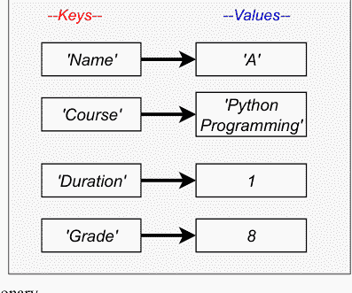

**图（1）。** 字典的简单结构。

在 Python 字典中，所有元素都包含在花括号 { 和 } 中。冒号 (:) 用于连接 *键值* 对。以下是字典的语法。

### 语法：

```python
dictionary = {
    <key1>: <value1>,
    <key2>: <value2>,
    .
    .
    .
    <keyn>: <valuen>
}
```

## 字典创建

Python 允许通过将一系列元素括在花括号 { } 中并用逗号 (,) 分隔来创建字典。字典有多个值，每个值对应一个特定的键。值可以是任何数据类型，并且可以在字典中重复，而键不能被复制且是不可变的。因此，在输入字典键时使用正确的大小写非常重要。字典可以通过多种不同的方式创建。

第一种创建字典的方法是创建一个空字典，然后添加项目。

#### 示例：

```python
# 创建一个空字典
Dict1 = {}
# 向字典添加项目
Dict1["key1"] = [1, 2, 3, 4, 5]
Dict1["key2"] = ["India", "US", "Australia", "Japan", "China"]
print(Dict1)
# 检查 Dict1 的类型
print(type(Dict1))
```

#### 输出：

```
{'key1': [1, 2, 3, 4, 5], 'key2': ['India', 'US', 'Australia', 'Japan', 'China']}
<class 'dict'>
```

另一种创建字典的方法是传递字面量的键值对。

#### 示例：

```python
# 创建一个字典
Dict1 = {
    1: "India",
    2: "US",
    3: "Australia",
    4: "Japan",
}
# 打印字典
print(Dict1)
# 检查 Dict1 的类型
print(type(Dict1))
```

#### 输出：

```
{1: 'India', 2: 'US', 3: 'Australia', 4: 'Japan'}
<class 'dict'>
```

我们可以通过向 dict() 函数传递键值对来创建字典。

#### 示例：

```python
# 创建一个字典
Dict2 = dict(
    Name='David',
    Age=55,
    Address='Canada',
    Salary='$5000')
# 打印字典
print(Dict2)
# 检查 Dict2 的类型
print(type(Dict2))
```

#### 输出：

```
{'Name': 'David', 'Age': 55, 'Address': 'Canada', 'Salary': '$5000'}
<class 'dict'>
```

创建字典的下一种方法是将元组列表传递给 dict() 函数。

#### 示例：

```python
# 传递元组列表
Dict1 = dict(
    [('Name', 'William'),
     ('Age', 40),
     ('Address', 'Japan'),
     ('Salary', '$5000')])
# 打印字典
print(Dict1)
# 检查 Dict1 的类型
print(type(Dict1))
```

#### 输出：

```
{'Name': 'William', 'Age': 40, 'Address': 'Japan', 'Salary': '$5000'}
<class 'dict'>
```

## 访问字典值

访问字典中的任何值是通过使用 *键* 名称来完成的，而访问其他形式数据中的值则是通过索引完成的。要检索与键相关联的值，可以使用方括号 [] 括起来的键名。可以使用下面的详细语法来获取字典中与键相关联的任何值。

### 语法：

```python
Dictionaryname[keyname]
```

#### 示例：

```python
# 创建一个字典
D1 = {
    101: "James",
    102: "William",
    103: "John",
    104: "Sam",
}
# 检索与键关联的值
print('101:', D1[101])
print('103:', D1[103])
print('104:', D1[104])
```

#### 输出：

```
101: James
103: John
104: Sam
```

使用 *get()* 函数并传入键，可以从字典中获取相应的值。这是一种替代方法。以下是此函数的一些可能应用：

#### 示例：

```python
# 创建一个字典
D1 = {
    101: "James",
    102: "William",
    103: "John",
    104: "Sam",
}
# 检索与键关联的值
print('101:', D1.get(101))
print('103:', D1.get(103))
print('104:', D1.get(104))
```

#### 输出：

```
101: James
103: John
104: Sam
```

## 修改字典

作为一种可变数据类型，字典允许在需要时更改元素值。通过将赋值运算符与键结合使用，我们可以添加新项目或更改现有项目的值。如果键已被使用，则该值将被修改以反映新键的添加。如果键在字典中尚不存在，则将添加一个新的 *键值* 对。向字典添加新条目时，应使用上面显示的语法。

### 语法：

```python
Dictionaryname[key] = value
```

#### 示例：

```
# 创建一个字典
D1 = {
    101: "James",
    'age': 40,
    'city': "Delhi",
}
# 打印元素
print(D1)
# 添加一个新元素
D1['Post'] = 'Manager'
# 添加新元素后，打印所有值
print(D1)
# 修改一个已存在的值
D1['age'] = 50
# 修改值后，打印所有值
print(D1)
```

#### 输出：

```
{101: 'James', 'age': 40, 'city': 'Delhi'}

{101: 'James', 'age': 40, 'city': 'Delhi', 'Post': 'Manager'}

{101: 'James', 'age': 50, 'city': 'Delhi', 'Post': 'Manager'}
```

正如我们在上面的例子中所看到的，如果一个键（age）在字典中存在，那么它会用新值（50）修改或替换旧值（40）。

## 从字典中删除元素

你可以通过使用对应元素的键来从字典中移除任何元素。要从当前使用的字典中移除一个组件，你可以使用“del”运算符。使用此运算符的缺点是，如果键不存在，将会抛出一个异常。在使用之前，应该考虑到这一点。下面给出的语法用于从字典中移除一个元素。

### 语法：

```
del Dictionaryname[key]
```

下面的示例从字典 D1 中删除一个元素，例如 age 及其关联的值。

#### 示例：

```
# 创建一个字典
D1 = {
    101: "James",
    'age': 40,
    'city': "Delhi",
}
# 打印元素
print(D1)
# 添加一个新元素
D1['Post'] = 'Manager'
print("可用的元素是:", D1)
# 添加新元素后，打印所有值
print("删除前:", D1)
# 删除一个元素 age
del D1['age']
# 删除元素后的值
print("删除后:", D1)
```

#### 输出：

```
{101: 'James', 'age': 40, 'city': 'Delhi'}

可用的元素是: {101: 'James', 'age': 40, 'city': 'Delhi', 'Post': 'Manager'}

删除前: {101: 'James', 'age': 40, 'city': 'Delhi', 'Post': 'Manager'}

删除后: {101: 'James', 'city': 'Delhi', 'Post': 'Manager'}
```

del 运算符甚至可以完全删除整个字典，例如：

```
del D1
```

删除字典 **D1** 后，如果我们尝试访问 **D1**，将会导致错误，因为 **D1** 不再存在。*pop()* 函数是另一种可用于从字典中移除键及其关联值的方法。使用它而不是 del 运算符的好处是，如果你尝试删除一个不存在的元素，它会输出你想要的值或消息，而不是失败。其次，除了完成基本的删除操作外，它还会返回被移除的键的值。这是在它删除键的基础上的额外功能。

#### 示例：

```
# 初始化一个字典
D1 = {"John": 30, "Sam": 25, "james": 28, "David": 29, "Bob": 30}
# 打印删除元素前的字典
print("执行删除前的字典是 : ", D1)
# 使用 pop() 函数删除一个元素，例如 John
del_value = D1.pop('John')
# 打印删除元素后的字典
print("删除后的字典是 : ", D1)
print("被移除的键的值是 : ", del_value)
# 再次删除一个不存在的元素
# 将 'Not available' 赋值给 del_value
del_value1 = D1.pop('Jai', 'Not available')
# 打印删除元素后的字典
print("移除后的字典是 : ", D1)
print("被移除的键的值是 : ", del_value1)
```

#### 输出：

```
执行删除前的字典是 :  {'John': 30, 'Sam': 25, 'james': 28, 'David': 29, 'Bob': 30}

删除后的字典是 :  {'Sam': 25, 'james': 28, 'David': 29, 'Bob': 30}

被移除的键的值是 :  30

移除后的字典是 :  {'Sam': 25, 'james': 28, 'David': 29, 'Bob': 30}

被移除的键的值是 :  Not available
```

## *clear()* 函数

通过使用 *clear()* 函数，我们可以同时移除字典中的所有条目。下面的示例从名为 D1 的字典中移除所有项目。

#### 示例：

```
# 使用 clear() 函数删除所有元素的示例
# 初始化一个字典
D1 = {"Amit": 20, "Sumit": 25, "John": 28, "David": 29, "Bob": 30}
# 打印删除元素前的字典
print("执行删除前的字典是 : ", D1)
# 删除所有元素
D1.clear()
# 打印删除元素后的字典
print("移除后的字典是 : ", D1)
```

#### 输出：

```
执行删除前的字典是 :  {'Amit': 20, 'Sumit': 25, 'John': 28, 'David': 29, 'Bob': 30}
移除后的字典是 :  {}
```

## 字典排序

字典中的一个元素由一个键及其对应的值组成。对字典中的条目进行排序的过程可以作为参数，使用键或值组件来执行。借助 *sorted()* 方法，字典组件可以按其键或值进行排序。

#### 示例：

```
# 初始化一个字典
D1 = {"James": 50, "William": 30, "John": 25, "David": 60, "Bob": 20}
print(type(D1))
# 打印排序前的字典
print("原始字典是: ", D1)
# 按键排序
D2 = dict(sorted(D1.items(), key=lambda x: x[0]))
print("按键排序后: ", D2)
print(type(D2))
```

#### 输出：

```
<class 'dict'>

原始字典是: {'James': 50, 'William': 30, 'John': 25, 'David': 60, 'Bob': 20}

按键排序后: {'Bob': 20, 'David': 60, 'James': 50, 'John': 25, 'William': 30}

<class 'dict'>
```

在这种情况下，*D1.items()* 方法生成一个元组列表，每个元组包含键及其对应的值。当调用 lambda 函数时，它将返回某个项目元组的键（字典的第0个元素）。在将这些传递给 *sorted()* 方法后，后者将生成一个排序后的序列，然后将其输入到一个字典中。

此方法可用于 Python 3.6 及更高版本，因为它同样考虑了有序序列和字典。在早期版本中，我们可以用下面示例中描述的 *itemgetter()* 替换位于 operator 模块中的 lambda 函数。

#### 示例：

```
from operator import itemgetter
# 初始化一个字典
D1 = {"James": 50, "William": 30, "John": 25, "David": 60, "Bob": 20}
print(type(D1))
# 打印排序前的字典
print("原始字典是: ", D1)
# 按键排序
D2 = dict(sorted(D1.items(), key=itemgetter(0)))
print("按键排序后: ", D2)
print(type(D2))
```

#### 输出：

```
<class 'dict'>

原始字典是: {'James': 50, 'William': 30, 'John': 25, 'David': 60, 'Bob': 20}

按键排序后: {'Bob': 20, 'David': 60, 'James': 50, 'John': 25, 'William': 30}

<class 'dict'>
```

## 按值对字典排序

按其键而不是其值对字典进行排序是一个很好的类比。唯一的区别是，这种类型的对应元素的值组件将作为排序的参数。在下面的示例中，字典按值参数降序排列：

#### 示例：

```
# 初始化一个字典
D1 = {"James": 50, "William": 30, "John": 25, "David": 60, "Sam": 20}
print(type(D1))
# 打印排序前的字典
print("原始字典是: ", D1)
# 按值排序
D2 = dict(sorted(D1.items(), key=lambda x: x[1]))
print("按键排序后: ", D2)
print(type(D2))
```

#### 输出：

```
<class 'dict'>
原始字典是:  {'James': 50, 'William': 30, 'John': 25, 'David': 60, 'Sam': 20}
按键排序后:  {'Sam': 20, 'John': 25, 'William': 30, 'James': 50, 'David': 60}
<class 'dict'>
```

在上面的示例中，字典 D1 根据 lambda 函数返回的值（x 元素的 x[1] 值）进行排序。对于旧版本的 Python，我们使用以下代码。

#### 示例：

```
from operator import itemgetter
# 初始化一个字典
D1 = {"James": 50, "William": 30, "John": 25, "David": 60, "Sam": 20}
print(type(D1))
# 打印排序前的字典
print("原始字典是: ", D1)
# 按值排序
D2 = dict(sorted(D1.items(), key=itemgetter(1)))
print("按键排序后: ", D2)
print(type(D2))
```

## 反向排序字典

*sorted()* 方法还会考虑一个名为 `reverse` 的输入参数。此信息可用作指南，以确定排序应进行的顺序。如果传入 *True*，排序将以相反的方向进行，即降序排列。此外，如果使用默认值 *False*，则排序将以升序进行。

示例：

```
# 初始化一个字典
D1= {"James" : 50, "William" : 30, "John" : 25, "David" : 60, "Sam" :20}
# 打印排序前的字典
print ("The original dictionary is: " , D1)
# 按键反向排序
D2= dict(sorted(D1.items(),reverse=True, key=lambda x: x[0]))
print ("After Reverse order Sorting by key: ", D2)
# 按值反向排序
D3= dict(sorted(D1.items(),reverse=True, key=lambda x: x[1]))
print ("After Reverse order Sorting by value: ", D3)
```

输出：

```
The original dictionary is:  {'James': 50, 'William': 30, 'John': 25, 'David': 60, 'Sam': 20}

After Reverse order Sorting by key:  {'William': 30, 'Sam': 20, 'John': 25, 'James': 50, 'David': 60}

After Reverse order Sorting by value:  {'David': 60, 'James': 50, 'William': 30, 'John': 25, 'Sam': 20}
```

## 遍历字典

虽然字典本身不是可迭代对象，但 *items()*、*keys()* 和 *values()* 方法会产生可迭代的视图对象，可用于遍历字典的条目。我们可以使用 `for` 循环来遍历所有数据的键值对。使用 `items()` 函数将返回一个元组列表，每个元组由一个键和一个值对组成。

示例：

```
# 创建一个字典
Dict1= {0 : 'Zero', 1 : 'One', 2 : 'Two', 3 : 'Three', 4 :'Four', 5: 'Five'}
# 打印字典
print ("The original dictionary is: " , Dict1)
# 使用 for 循环遍历
print ('Iterating with for loop:')
for t in Dict1.items():
    print (t)
```

输出：

```
The original dictionary is:  {0: 'Zero', 1: 'One', 2: 'Two', 3: 'Three', 4: 'Four', 5: 'Five'}

Iterating with for loop:

(0, 'Zero')

(1, 'One')

(2, 'Two')

(3, 'Three')

(4, 'Four')

(5, 'Five')
```

我们也可以通过将每对中的键和值存储在两个单独的变量中来遍历字典。

示例：

```
# 创建一个字典
Dict1= {0 : 'Zero', 1 : 'One', 2 : 'Two', 3 : 'Three', 4 :'Four', 5: 'Five'}
# 打印原始字典
print ("The original dictionary is: " , Dict1)
# 使用 for 循环遍历并分别存储键和值
print ('Iterating with storing separate values:')
for key,value in Dict1.items():
    print (key,value)
```

输出：

```
The original dictionary is: {0: 'Zero', 1: 'One', 2: 'Two', 3: 'Three', 4: 'Four', 5: 'Five'}

Iterating with storing separate values:

0 Zero

1 One

2 Two

3 Three

4 Four

5 Five
```

另一种遍历字典的方法是使用 *keys()* 函数。使用 *keys()* 函数，可以按如下方式获取关联的值。

示例：

```
# 创建一个字典
Dict1= {0 : 'Zero', 1 : 'One', 2 : 'Two', 3 : 'Three', 4 :'Four', 5: 'Five'}
# 打印原始字典
print ("The original dictionary is: " , Dict1)
# 使用 keys() 函数遍历
print ('Iterating using keys() function:')
for k1 in Dict1.keys():
    print (k1, Dict1.get(k1))    # 或者 print(k1, Dict1[k1])
```

输出：

```
The original dictionary is: {0: 'Zero', 1: 'One', 2: 'Two', 3: 'Three', 4: 'Four', 5: 'Five'}

Iterating using keys() function:

0 Zero

1 One

2 Two

3 Three

4 Four

5 Five
```

## 嵌套字典

正如我们在本课前面所见，字典是未按任何特定顺序排列的组件集合。它包含各种形式的 *键值* 对组件，这些组件被括在花括号中。“嵌套字典”一词指的是一个字典被保存在另一个字典内部的情况。它的工作方式与其他编程语言中的嵌套记录和嵌套结构非常相似。换句话说，我们可以认为它是将多个字典组合成一个统一的字典。

语法：

```
Nested_Dict1 = {
    'Dict1': {'key1': 'value1'},
    'Dict2': {'key1': 'value1'},
    'Dict3': {'key1': 'value1'}
}
```

示例：

```
## 嵌套字典
Emp = {'e1' : {'name': 'James', 'age': '50', 'Post': 'Manager'},
    'e2' : {'name': 'william', 'age': '45', 'Post': 'Clerk'},
    'e3' : {'name': 'David', 'age': '35', 'Post': 'HR'}
    }
# 打印完整的嵌套字典
print (Emp)

print ('-----Details of e1 dictionary-------')
print (Emp['e1']['name'])
print (Emp['e1']['age'])
print (Emp['e1']['Post'])

print ('-----Details of e2 dictionary-------')
print (Emp['e2']['name'])
print (Emp['e2']['age'])
print (Emp['e2']['Post'])

print ('-----Details of e3 dictionary-------')
print (Emp['e3']['name'])
print (Emp['e3']['age'])
print (Emp['e3']['Post'])
```

输出：

```
{'e1': {'name': 'James', 'age': '50', 'Post': 'Manager'}, 'e2': {'name': 'william', 'age': '45', 'Post': 'Clerk'}, 'e3': {'name': 'David', 'age': '35', 'Post': 'HR'}}

-----Details of e1 dictionary--------

James

50

Manager

-----Details of e2 dictionary--------

william

45

Clerk

-----Details of e3 dictionary--------

David

35

HR
```

以下代码片段演示了如何用新的子字典扩展嵌套字典。如果我们想创建一个新的字典，我们需要通过其键访问元素并为其提供相应的值。

示例：

```
Emp = {'e1' : {'name': 'James', 'age': '50', 'Post': 'Manager'},
    'e2' : {'name': 'william', 'age': '45', 'Post': 'Clerk'},
    'e3' : {'name': 'David', 'age': '35', 'Post': 'HR'}
    }
# 添加子字典前打印字典元素
print ('Nested Dictionary before adding a sub dictionary:', Emp)
# 添加一个子字典
Emp['e4'] = {'name': 'Bob', 'age': '32', 'Post': 'Manager'}
# 添加子字典后打印字典元素
print ('Nested Dictionary after adding a sub dictionary:', Emp)
```

输出：

```
Nested dictionary before adding a sub dictionary: {'e1': {'name': 'James', 'age': '50', 'Post': 'Manager'}, 'e2': {'name': 'william', 'age': '45', 'Post': 'Clerk'}, 'e3': {'name': 'David', 'age': '35', 'Post': 'HR'}}

Nested dictionary after adding a sub dictionary: {'e1': {'name': 'James', 'age': '50', 'Post': 'Manager'}, 'e2': {'name': 'william', 'age': '45', 'Post': 'Clerk'}, 'e3': {'name': 'David', 'age': '35', 'Post': 'HR'}, 'e4': {'name': 'Bob', 'age': '32', 'Post': 'Manager'}}
```

## 更新嵌套字典

更改字典的嵌套部分很简单。更改对象的值就像通过其键引用它一样容易。如果在字典中找到现有的键，其值将被新值覆盖。以下代码片段展示了如何修改 Emp 字典中的 e1 字典值。

示例：

```
## 嵌套字典
Emp = {'e1' : {'name': 'James', 'age': '50', 'Post': 'Manager'},
    'e2' : {'name': 'william', 'age': '45', 'Post': 'Clerk'},
    'e3' : {'name': 'David', 'age': '35', 'Post': 'HR'}
    }
# 更新前打印字典元素
print ('Nested Dictionary before update:', Emp)
# 更新 D1 的值
Emp['e1'] = {'name': 'Bob', 'age': '32', 'Post':'Director'}

# 更新后打印字典元素
print ('Nested Dictionary after updating values:', Emp)
```

输出：

```
Nested dictionary before update: {'e1': {'name': 'James', 'age': '50', 'Post': 'Manager'}, 'e2': {'name': 'william', 'age': '45', 'Post': 'Clerk'}, 'e3': {'name': 'David', 'age': '35', 'Post': 'HR'}}

Nested dictionary after updating values: {'e1': {'name': 'Bob', 'age': '32', 'Post': 'Director'}, 'e2': {'name': 'william', 'age': '45', 'Post': 'Clerk'}, 'e3': {'name': 'David', 'age': '35', 'Post': 'HR'}}
```

## 从嵌套字典中删除元素

我们可以使用 *del* 运算符从嵌套字典中删除元素。

## 从嵌套字典中删除字典

我们可以使用 *del* 操作符从嵌套字典中删除一个完整的子字典，就像删除元素一样。下面的示例从嵌套字典 Emp 中删除了 D2 子字典。

#### 示例：

```python
# 创建一个嵌套字典
Emp = {'D1' : {'name': 'Amit', 'age': '30', 'Post': 'Manager'},
    'D2' : {'name': 'Joy', 'age': '25', 'Post': 'Clerk'},
    'D3' : {'name': 'David', 'age': '35', 'Post': 'HR'}
    }
# 删除子字典前打印字典元素
print ('删除前的嵌套字典:')
print (Emp)
# 删除 D2
del Emp['D2']
# 删除子字典后打印字典
print ('删除 D2 后的嵌套字典:')
print (Emp)
```

#### 输出：

```
删除前的嵌套字典:
{'D1': {'name': 'Amit', 'age': '30', 'Post': 'Manager'}, 'D2': {'name': 'Joy', 'age': '25', 'Post': 'Clerk'}, 'D3': {'name': 'David', 'age': '35', 'Post': 'HR'}}
删除 D2 后的嵌套字典:
{'D1': {'name': 'Amit', 'age': '30', 'Post': 'Manager'}, 'D3': {'name': 'David', 'age': '35', 'Post': 'HR'}}
```

## 遍历嵌套字典

我们可以使用 *for* 循环遍历嵌套字典中的每个元素，例如。

#### 示例：

```python
# 创建一个嵌套字典
Emp = {'D1' : {'name': 'Amit', 'age': '30', 'Post': 'Manager'},
    'D2' : {'name': 'Joy', 'age': '25', 'Post': 'Clerk'},
    'D3' : {'name': 'David', 'age': '35', 'Post': 'HR'}
    }
# 使用 for 循环遍历字典元素
for Dict_id, value in Emp.items():
    print ("\n 字典 ID:", Dict_id)
    for key in value:
        print (key + ':', value[key])
    print ("-------------------")
```

#### 输出：

```
字典 ID: D1
name: Amit
age: 30
Post: Manager
------------------
字典 ID: D2
name: Joy
age: 25
Post: Clerk
------------------
字典 ID: D3
name: David
age: 35
Post: HR
------------------
```

在上面的示例中，第一个循环返回嵌套字典 **Emp** 中的所有键。它包含每个员工的字典 ID。我们使用这些 ID 来解包每个员工的值。第二个循环遍历每个员工的值。然后，它返回每个员工字典的所有键名、年龄和职位。接着打印员工的键及其关联的值。

## 内置字典函数

Python 为用户提供了多种内置函数和方法，可用于对字典执行各种操作。以下是一些最重要的函数：

| 函数 | 描述 |
| :--- | :--- |
| *len()* | 此函数返回字典元素的总长度。这等于字典中的元素数量。可以按如下方式使用： |
| *str()* | 此函数生成给定字典的可打印字符串表示形式。它具有以下语法。 |
| **type()** | 它返回传递参数的类型。如果传递的参数是字典，则它将返回类型为字典。 |
| **cmp()** | cmp() 负责使用各自的键和值比较两个字典条目。它将返回 1、0 或 -1，具体取决于被比较的两个字典是否相同。为了进行字典比较，此函数需要两个字典作为输入参数。如果 D1 和 D2 是两个不同的字典，比较将直接产生以下结果。此功能在 Python 3.x 中不可用。 |
| **any()** | 此函数检查是否有任何键为 True。它接受一个可迭代参数，例如字典。如果所有键都为 False 或字典为空，则返回 False。如果至少有一个键为 true，则返回 True。 |
| **all()** | 当给定字典中的所有元素都为 True 时，此函数返回 True。否则，将返回 False。换句话说，如果所有键都为 True 或字典为空，则 all() 函数返回 True。否则，像所有其他情况一样，这将返回 False。 |

#### 示例：

```python
## 内置字典函数
# 创建一个字典
D1= {"James" : 30, "William" : 25, "John" : 45, "David" : 40, "Bob" :25}
# 查找字典的长度
print ("字典的长度是：" , len(D1))
# 字典的字符串表示形式
D2=str(D1)
print ("字典的字符串表示形式是：", D2)
print (type(D2))
print ("D1 的类型是：", type(D1))
#-----------------------any()-----------------------
print("----------------any()----------------")
D1 = {0: 'It is False'}
print (any(D1))
# 1 或 True
D2 = {0: 'It is False', 1: 'It is True'}
print (any(D2))
# 两个键都为 false
D3 = {0: 'It is False', False: 'It is False'}
print (any(D3))
# 空字典
D4 = {}
print (any(D4))
# 全部为 True
D5 = {True: 'It is True', 1: 'It is True'}
print (any(D5))
#-----------------------all()-----------------------
print("----------------all()----------------")
D1 = {0: 'It is False'}
print (all(D1))
# 1 或 True
D2 = {0: 'It is False', 1: 'It is True'}
print (all(D2))
# 两个键都为 false
D3 = {0: 'It is False', False: 'It is False'}
print (all(D3))
# 空字典
D4 = {}
print (all(D4))
# 1 或 True
D5 = {True: 'It is True', 1: 'It is True'}
print (all(D5))
```

#### 输出：

```
字典的长度是： 5

字典的字符串表示形式是： {'James': 30, 'William': 25, 'John': 45, 'David': 40, 'Bob': 25}

<class 'str'>

D1 的类型是： <class 'dict'>

------------------any()------------------

False

True

False

False

True

------------------all()------------------

False

False

False

True

True
```

## copy() 方法

copy() 方法返回字典的浅拷贝。原始字典不会改变。以下示例说明了 copy() 方法的使用。

#### 示例：

```python
D1 = {'name': 'Python', 'year': 2023}
print ('D1 的原始值：', D1)
# 创建 D1 的副本
D2 = D1.copy()
print ('副本版本：', D2)
```

#### 输出：

```
D1 的原始值： {'name': 'Python', 'year': 2023}
副本版本： {'name': 'Python', 'year': 2023}
```

## 格式化字典

字典查找允许我们执行一种称为“插值”的操作。由于它们使用的语法，我们需要将键括在括号中，并将其放在 % 运算符和表示转换的字符之间。例如，如果我们想将存储在 'salary' 键中的 int 格式化为 'xxxx.xx'，我们可以在希望显示的位置使用 % (salary).2f。这将给我们想要的结果。

#### 示例：

```python
# 创建一个字典
D1= {'name': 'Sam', 'salary': 30000, 'Post': 'Manager'}
# 打印字典
print (D1)
print ('-------------')
print ('----------格式化字典----------')
# 格式化打印
print ("我的名字是：%(name)s" %D1)
print ("我的工资是：%(salary).2f，职位是：%(Post)s " %D1)
```

#### 输出：

```
{'name': 'Sam', 'salary': 30000, 'Post': 'Manager'}
-------------
----------格式化字典----------
我的名字是：Sam
我的工资是：30000.00，职位是：Manager
```

## 总结

本章介绍了元组和字典，并涵盖了它们的基本概念和特性。我们还讨论了可以对这些序列执行的多种操作。借助多个示例和Python代码，我们对原理进行了逻辑性的解释。你可以通过模仿这些示例来学习编程。下一章将讨论Python的文件处理概念。

## 第7章

## 文件处理

**摘要：** 从前面的章节中，我们预期读者已经掌握了足够的Python及其基本概念的实践知识。在本章中，我们将向用户介绍文件的概念。文件是Python中主要的内置对象类型之一。我们可以使用下面阐述的多个函数来创建、调用、操作和关闭文件。文件的主要任务之一是方法导出和常见的文件处理任务，例如向外部文件进行输入和输出显示、刷新缓冲区等。

**关键词：** 缓冲，操作系统中的目录路径，操作系统中的存储。

## 引言

当信息必须以不可更改的方式存储在文件中时，文件管理就至关重要。文件是磁盘上的一个指定位置，用于存储对文件目的重要的数据。一旦程序关闭，我们就能检索之前存储的信息。文件管理的概念已被改编并应用于各种其他语言中。然而，根据语言的不同，这样做可能很困难或耗时。

然而，与其他Python概念不同，这个概念并不复杂，可以轻松理解。在本章中，你将学习关于文件管理的各种理论和过程。此外，我们通过使用示例和程序来阐述我们的观点，说明了各种文件操作。

## 文件

文件是可用于存储信息的字节集合。这些数据以特定格式组织，根据其复杂性，可以是任何东西，从简单的文本文件到复杂的程序可执行文件。最终，这些字节文件被转换为二进制，由1和0组成，以便计算机可以更快地处理它们。与许多其他编程语言一样，Python可以处理文件，允许用户读取、写入和执行许多其他与文件相关的操作。此功能称为文件处理。必须理解的是，Python根据文件包含的是文本还是二进制数据来以不同方式处理文件。代码的每一行都由一串单独的字符组成，这些字符组合在一起构成一个文本文件。文件中的每一行都由一个特殊字符终止，称为EOL（行尾）字符。EOL字符的示例包括逗号和换行符。它向解释器发出信号，表示正在读取的行已结束，新的一行已开始。在当今大多数文件系统中，文件被分为三个不同的部分：

- *头文件*：关于文件内容的详细信息（文件名、大小、类型等）。
- *数据*：作者或编写者写入的文件内容。
- *文件结尾*：表示文件终止的特殊字符。

在编程中，可能需要多次创建特定的输入数据。有时，仅在控制台上显示数据是不够的。可能会呈现大量数据。控制台只能显示一定量的数据；由于内存是易失性的，经常恢复以编程方式创建的数据很困难。如果我们需要，我们可以将内容存储在易失性且始终可用的本地文件系统中。为此必须使用Python的文件处理功能。借助Python中的文件管理，我们可以使用Python应用程序在本地文件系统上创建、修改、读取和删除文件。访问操作系统上的文件时，需要文件路径。文件路径是一个字符串，表示文件的位置。它有三个主要部分：

- **目录路径**：文件或文件夹在文件系统上的位置，在Linux或Unix中用正斜杠（/）分隔，在Windows中用反斜杠（\）分隔。
- **文件名**：文件的实际名称。
- **扩展名**：它定义了文件类型。

假设你需要打开T1.txt文件，而你现在所在的位置与**位置**相同。你必须首先前往**位置**文件夹，然后前往**Folder1**目录，最后前往**T1.txt**文件才能访问该文件。此文件的路径为“*Location/Folder1/T1.txt*。”

## Open() 函数

要对文件执行读写操作，必须先将其打开。要在Python中打开文件，用户必须首先创建一个与物理文件关联的文件对象。此外，*open()*函数用于在Python中打开文件。Python的open()函数接受两个参数：文件名和访问模式。该函数返回一个文件对象，可用于读取、写入和其他操作。以下语法用于在Python中打开文件。

打开文件是对其执行任何操作（包括读写）的前提条件。要使用Python访问文件的内容，用户必须首先构建一个与文件实际位置对应的文件对象。在Python中，打开文件也是借助*open()*函数完成的。Python的*open()*函数在调用之前需要两个信息：*文件名*和*访问模式*。该方法将返回一个可用于各种任务（如读取、写入等）的文件对象。在Python中，打开文件是通过下面给出的语法完成的：

**语法：**

```
File_object_Name = open(<file_name>, <access_mode>, <buffering>)
```

有多种模式可用于访问文件，例如读取、写入和追加。打开文件的访问模式在表1中定义。

**表1. 文件访问模式。**

| 模式 | 描述 |
| :--- | :--- |
| **R** | 文件以只读模式打开。文件指针位于开头。如果未定义访问模式，则默认以此模式打开文件。 |
| **rb** | 它将二进制文件转换为只读模式。文件指针位于文件开头。 |
| **r+** | 它打开文件以进行读写。文件指针位于文件开头。 |
| **rb+** | 它以二进制格式打开文件以进行读写。文件指针位于文件开头。 |
| **W** | 它只允许你写入文件。如果同名文件已存在，则将其覆盖；否则，创建它。文件指针位于文件开头。 |
| **wb** | 它打开文件以便只能以二进制格式写入。如果文件已存在，则将其覆盖；否则，生成一个新文件。文件指针位于文件开头。 |
| **w+** | 它打开文件以进行写入和读取。它与r+的不同之处在于，如果存在先前的文件，它会覆盖该文件，而r+则保留先前写入的文件不变。如果不存在这样的文件，则创建一个。文件指针位于文件开头。 |
| **wb+** | 它以二进制格式打开文件以进行写入和读取。文件指针位于文件开头。 |
| **A** | 文件以追加模式打开。如果存在文件，则文件指针位于先前写入文件的末尾。如果不存在同名文件，则创建一个新文件。 |
| **ab** | 它以二进制格式以追加模式打开文件。指针位于先前写入文件的末尾。如果不存在同名文件，则生成一个新的二进制文件。 |
| **a+** | 它打开文件以进行追加和读取。如果文件存在，则文件指针保持在其末尾。如果不存在同名文件，则生成一个新文件。 |
| **ab+** | 它打开一个二进制文件以进行追加和读取。文件指针已位于文件末尾。 |

#### 示例：

```python
1. obj = open("Myfile.txt","r") #以读模式打开Myfile.txt
2.
3. if obj:
4.     print("文件打开成功。")
```

#### 输出：

文件打开成功。

## close() 函数

由于Python允许我们对当前打开的文件执行任何操作，因此建议在所有处理完成后关闭文件。在我们以所有可能的方式处理完文件后，我们将通过调用 `close()` 函数来关闭它。当调用文件对象的 `close()` 函数时，任何尚未写入的数据都将被丢弃。

### 语法：

```python
Object_Name.close()
```

#### 示例：

```python
1. obj = open("Myfile.txt","r") #以读模式打开Myfile.txt
2.
3. if obj:
4.     print("文件打开成功。")
5. obj.close()          # 文件将被关闭
```

#### 输出：

文件打开成功。

## write() 函数

使用 `write()` 函数将字符串写入文件。要将文本写入文件，我们必须首先使用 `open` 方法和以下访问模式之一打开它：

- **w**：如果文件已存在，它将被覆盖。文件指针位于文件的开头。
- **a**：文件将被追加到当前文件。文件指针位于文件的末尾。如果不存在这样的文件，它将创建一个。

#### 示例：

```python
1. # 以写模式打开文件
2. file1 = open("file1.txt","w")
3. #将内容写入文件
4. file1.write("Hello \n")
5. file1.write("My Python Programming book \n")
6. file1.write("Python is easy \n")
7. file1.write("Python is developers' choice \n")
8. #关闭文件
9. file1.close()
```

#### 输出：

你可以看到创建的 file1，并可以打开它查看内容。

```
1 Hello
2 My Python Programming book
3 Python is easy
4 Python is developers choice
```

## writelines() 方法

*writelines()* 方法是Python的内置方法，用于将字符串列表或列表项写入文件。

### 语法：

```python
fileobject.writelines(list_of_items)
```

#### 示例：

```python
1. #以写模式打开文件
2. f1 = open("f1.txt","w")
3. #添加要添加的内容列表
4. l1 = ["My first Python book \n","Python is simple \n","File handling is easy\n"]
5. f1.write("Hello \n")
6. f1.writelines(l1)
7. f1.close()
8. #要读取文件内容，请打开它
9. f1 = open("f1.txt","r+")
10. #选择读取它
11. print(f1.read())
12. print()
```

#### 输出：

Hello

My first Python book

Python is simple

File handling is easy

## 将数字写入文件

Python默认将文件读取为字符串，而 *write()* 函数只期望写入字符串。如果我们想将数字写入文件，我们需要使用 *str()* 函数将它们转换为字符串。

#### 示例：

```python
1. a = range(1,30)
2. f2 = "f2.txt"
3. # 打开文件以写入
4. f2= open(f2, 'w')
5. for num in a:
6.     f2.write(str(num) + " ")
7. f2.close() #关闭文件
8. #要读取文件内容，请打开它
9. f2 = open("f2.txt","r+")
10. #选择读取它
11. print(f2.read())
12. print()
```

#### 输出：

1 2 3 4 5 6 7 8 9 10 11 12 13 14 15 16 17 18 19 20 21 22 23 24 25 26 27 28 29

## read() 方法

在Python中，有多种方法可以读取文本文件。*read()* 方法可用于检索包含文件中所有字符的字符串。

### 语法：

```python
File_Object.read()
```

在读取文件之前，必须以 'r'（读取）模式打开它。

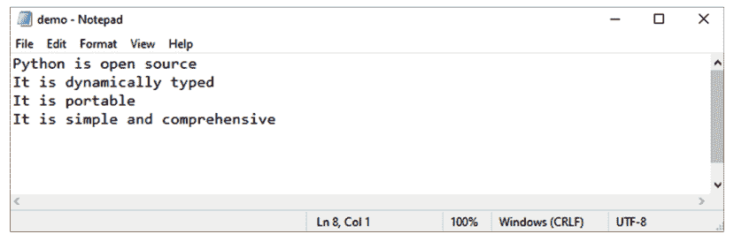

注意：为了演示 `read()`、`readline()` 和 `readlines()` 命令的使用，我们将图 (1) 作为示例。此图显示了使用读取命令检索到的包含 demo.txt 的文件。

#### 示例：

```python
1. #以读模式打开文件
2. f3 = open("demo.txt", "r+")
3. print(f3.read())
4. print()
5. f3.close() # 更改模式
```

#### 输出：

Python is open source
It is dynamically typed
It is portable
It is simple and comprehensive

另一种读取文本的技术是将自己限制在特定数量的字符内。例如，解释器将读取已保存数据的前二十个字符，然后通过使用以下代码将其作为字符串返回：

#### 示例：

```python
1. #以读模式打开文件
2. f4 = open("demo.txt","r+")
3. #选择读取它
4. print(f4.read(16))
5. print()
6. f4.close() # 更改模式
```

#### 输出：

Python is open s

## readline() 方法

Python的 *readline()* 函数使得按顺序从文件中读取文本行变得简单。由于 *readline()* 函数从文件的第一行开始读取行，如果我们调用它三次，我们将获得文件的前三行，并且它将从开头开始。每次调用时，此函数将向调用代码提供一个包含从文件中读取的一行数据的字符串。

#### 示例：

```python
1. #以读模式打开文件
2. f5 = open("demo.txt","r+")
3. #选择读取它
4. print(f5.readline())
5. print()
6. f5.close()# 更改模式
```

#### 输出：

Python is open source

要仅检索指定数量的字符，例如四个，请在 `readline()` 中指定行号。

#### 示例：

```python
1. #以读模式打开文件
2. f6 = open("demo.txt","r+")
3. #选择读取它
4. print(f6.readline(4))
5. print()
6. f6.close() # 更改模式
```

#### 输出：

Pyth

## readlines() 方法()

如果我们想获取文件中每一行并适当分隔。将使用相同的函数，但格式不同。*FileObject.readlines()* 方法用于实现这一点。它返回一个包含直到文件末尾（EOF）的行列表。

#### 示例：

```python
1. #以读模式打开文件
2. f7 = open("demo.txt","r+")
3. #选择读取它
4. print(f7.readlines())
5. print()
6. f7.close() # 更改模式
```

#### 输出：

['Python is open source\n', 'It is dynamically typed\n', 'It is portable\n', 'It is simple and comprehensive']

## 使用循环读取内容

循环遍历方法可用于以比任何其他方法更快、更节省内存的方式读取文件中的所有行。使用此策略的好处之一是相应的代码易于理解。图 (2) 显示了我们将使用循环检索的文件 **demo2.txt** 的内容。

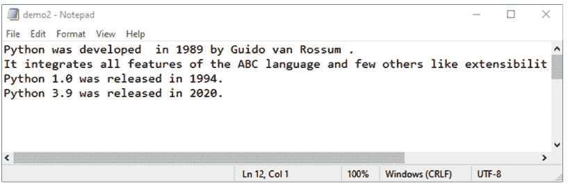

#### 示例：

```python
1. #以读模式打开文件
2. f8 = open("demo2.txt", "r")
3. #选择读取它
4. for x in f8:
5.     print(x)
6. f8.close() # 更改模式
```

#### 输出：

Python was developed in 1989 by Guido van Rossum .

It integrates all features of the ABC language and few others like extensibility and exception handling.

Python 1.0 was released in 1994.

Python 3.9 was released in 2020.

## 创建新文件

借助 **open()** 函数，你可以使用以下访问模式之一创建新文件：

- **x**：它创建一个具有你指定名称的新文件。如果具有相同名称的文件已存在，它将抛出错误。
- **a**：如果不存在这样的文件，它将使用指定的名称创建一个新文件。如果具有给定名称的文件已存在，它将内容追加到该文件。
- **w**：如果不存在这样的文件，它将使用指定的名称创建一个新文件。如果文件存在，它将覆盖它。

#### 示例：

```python
1. #创建一个新的空文件
2. fileobj= open ("file1.txt", "x")
3. #关闭此文件
4. fileobj.close()
```

上述代码将在当前工作目录中创建一个新文件。如果你想让你的文件在磁盘上的绝对路径创建，你也可以给它一个完整的路径。

## 示例：使用现有名称创建新文件

```python
1. #创建一个新文件，但myfile1.txt已存在
2. fileobj= open ("file1.txt", "x")
```

#### 输出：

```
Traceback (most recent call last):

  File "main.py", line 2, in <module>
    fileobj= open("file1.txt", "x")
FileExistsError: [Errno 17] File exists: 'file1.txt'
```

在上面的例子中，我们试图创建一个新文件 file1.txt。但是，此文件已存在于同一目录中。我们得到 FileExistsError。

## 文件对象属性

一旦文件被打开并且你有一个文件对象，你就可以获取不同的文件相关详细信息。以下是所有文件对象属性的列表：

- **closed** – 它是一个布尔值，表示文件对象的当前状态。
- **encoding** - 文件的编码详细信息。
- **mode** – 它返回文件打开的模式。
- **name** – 它返回文件名。

#### 示例：

```
1. import os.path
2. f10 = open("demo2.txt", 'a+')
3. #指定所需属性
4. print("状态:",f10.closed)
5. print("编码样式:",f10.encoding)
6. print("模式:", f10.mode)
7. print("名称:",f10.name)
```

#### 输出：

```
状态: False
编码样式: UTF-8
模式: a+
名称: demo2.txt
```

## 文件位置

当我们使用Python打开一个文件进行读取时，会获得一个包含文件开头引用的文件句柄。当我们从文件中读取时，指针将始终指向读取的末尾，下一次读取的开始位置将位于该处。以下方法分别用于获取当前文件位置和更改当前文件位置：

- **tell()** 方法返回当前文件位置；换句话说，下一次读取或写入将发生在距离文件开头该字节数的位置。
- **seek(offset[, from])** 方法用于调整文件的当前位置。要移动的字节数由offset语句定义。from语句决定了要传输的字节的起始点。

如果在 **seek()** 函数中将from设置为 **0**，则文件的开头将用作参考位置，设置为 **1** 则当前位置将用作参考位置，设置为 **2** 则文件的末尾将用作参考位置。

#### 示例：

```
1. #以写模式打开文件
2. f_1 = open("demo3.txt", "w")
3. f_1.write("Python工具可分为两类：通用工具和功能工具。\n")
4. f_1.writelines("Python对各种内置对象类型都有全面的支持。\n")
5. f_1.writelines("Python将内存视为私有堆。\n")
6. f_1.writelines("Python社区支持相当活跃且响应迅速\n")
7. f_1.close() #更改文件访问模式
8. f_1= open("demo3.txt", "rb")
9. print("指针位置:", f_1.tell())
10. #读取第一行
11. l1= f_1.readline()
12. print(l1)
13. print("指针位置:", f_1.tell())
14. #读取第二行
15. l2= f_1.readline()
16. print(l2)
17. print("指针位置:", f_1.tell())
18. #读取第三行
19. l3= f_1.readline()
20. print(l3)
21. print("指针位置:", f_1.tell())
22. #读取第四行
23. l4= f_1.readline()
24. print(l4)
25. print("指针位置:", f_1.tell())
26. 
27. #更改指针位置
28. #将指针从文件末尾向前移动15个位置
29. print("更改后的指针位置:", f_1.seek(-15,2))
30. f_1.close()
```

#### 输出：

```
指针位置: 0
Python工具可分为两类：通用工具和功能工具。

指针位置: 99
Python对各种内置对象类型都有全面的支持。

指针位置: 180
Python将内存视为私有堆。

指针位置: 226
Python社区支持相当活跃且响应迅速

指针位置: 284
更改后的指针位置: 269
```

## 文件重命名

Python的 **OS** 模块提供了多种执行各种文件处理任务的方法，其中之一就是重命名文件。要使用此模块，必须先导入它，然后使用任何相关函数。文件和文件夹的重命名方式完全相同。每当需要更改文件名时，都会使用 ***os.rename()*** 方法。

### 语法：

```
os.rename(旧文件名, 新文件名)
```

#### 示例：

```
1. import os
2. print ('原始文件',os.listdir(os.getcwd()))
3. old_name = r"/content/f1.txt"
4. new_name = r"/content/demonstration.txt"
5. #重命名文件
6. os.rename(old_name, new_name)
7. print ('重命名后:',os.listdir(os.getcwd()))
```

#### 输出：

```
原始文件 ['.config', 'f1.txt', 'f2.txt', 'demo3.bin', 'myfile.txt', 'demo.txt', 'demo2.txt', 'sample_data']

重命名后: ['.config', 'demonstration.txt', 'f2.txt', 'demo3.bin', 'myfile.txt', 'demo.txt', 'demo2.txt', 'sample_data']
```

## 删除文件

os.remove() 函数用于删除特定文件。

### 语法：

```
os.remove(文件名)
```

#### 示例：

```
1. import os
2. print ('文件列表',os.listdir(os.getcwd()))
3. #指定要删除文件的路径
4. os.remove("/content/f2.txt")
5. print ('更新后的列表:',os.listdir(os.getcwd()))
```

#### 输出：

```
文件列表 ['.config', 'demonstration.txt', 'f1.txt', 'f2.txt', 'demo.txt', 'demo2.txt', 'sample_data']

更新后的列表: ['.config', 'demonstration.txt', 'f1.txt', 'demo.txt', 'demo2.txt', 'sample_data']
```

## 二进制文件

文本文件和二进制文件是Python可以使用的两种文件类型。我们计算机上能找到的大部分文件都是二进制文件类型。

利用Python的特性使得处理二进制文件变得简单直接。二进制文件使用字节形式的字符串。从文件中读取二进制数据意味着你将收到一个byte类型的对象。处理二进制文件时，我们需要使用与之前相同的模式，但在末尾添加字母'b'，以便Python理解我们正在处理二进制文件。写入二进制文件使用'wb'模式。类似地，'rb'和'ab'模式分别用于二进制文件的读取和追加数据。

#### 示例：

```
1. num=[2,4,8,16,32,64,128]
2. arr=bytes(num)
3. print(arr)
4. f=open("demo3.bin","wb")
5. f.write(arr)
6. f.close()
7. #打开二进制文件
8. f = open("demo3.bin", 'rb')
9. content = f.read()
10. content
```

#### 输出：

```
b'\x02\x04\x08\x10 @\x80'
```

## 目录操作

目录是所有相关文件、文件夹和文档的容器。Python中的OS模块提供了与操作系统交互的工具。通过此模块可以访问特定于操作系统的操作，用于控制进程、文件、文件描述符、目录和其他底层操作系统功能。

## 当前工作目录

*getcwd()* 返回当前工作目录的路径。这是操作系统将相对文件名转换为绝对文件名的地方。

### 语法：

```
1. #导入os模块
2. import os
3. #打印当前工作目录
4. print (os.getcwd())
```

#### 输出：

```
/home/user
```

## 目录列表

我们可以从特定位置获取目录列表。你应该使用 **listdir(location)** 函数。如果将位置传递给该函数，它将返回一个包含指定位置目录名称的字符串列表。简单的 **listdir()** 函数将返回当前目录的内容。

#### 示例：

```
1. import os
2. data = os.listdir() #当前目录的内容列表
3. print (data)
4. 
5. print (os.listdir('/usr')) # usr目录的内容列表
```

#### 输出：

```
['main.py']
['games', 'local', 'include', 'share', 'lib', 'bin', 'src', 'sbin']
```

## 创建目录

**os.mkdir()** 方法用于创建目录。让我们创建一个名为“mydir”的新目录。os.listdir() 方法将打印路径上的目录列表。

#### 示例：

```
1. import os
2. #创建目录
3. os.mkdir("dir1")
4. print (os.listdir()) #内容列表
```

180 Python编程基础：初学者快速指南 Mohbey 和 Acharya

#### 输出：

```
['dir1', 'main.py']
```

## 更改目录

要更改目录，我们必须先导入os模块，然后使用 **os.chdir()** 方法更改我们程序的基础路径。

#### 示例：

```
1. import os
2. #更改目录
3. os.chdir('/Users/folder1/')
4. 
5. #打印当前工作目录
6. print (os.getcwd())
```

#### 输出：

```
/Users/folder1
```

## 重命名目录

**os.rename()** 方法允许你将文件夹从一个名称重命名为另一个名称。

#### 示例：

```
1. import os
2. #重命名目录
3. os.mkdir('mydir1')
4. print (os.listdir(os.getcwd()))
5. #重命名
6. os.rename("mydir1","mydir2")
7. print (os.listdir(os.getcwd()))
```

#### 输出：

```
['mydir1', 'main.py']
['mydir2', 'main.py']
```

## 删除目录

**rmdir()** 函数用于删除一个已经为空的目录。该目录

#### 示例：

```python
import os
os.mkdir('mydir1')
print('Before deletion:', os.listdir(os.getcwd()))

# delete directory
os.rmdir("mydir1")
print('After deletion:', os.listdir(os.getcwd()))
```

#### 输出：

```
Before deletion: ['mydir1', 'main.py']

After deletion: ['main.py']
```

## 总结

在本章中，我们探讨了 Python 文件管理涉及的概念。此外，我们还讨论了文件可以以多种不同的模式打开以便进行处理。通过各种示例和 Python 代码，我们演示了文件的处理，包括读取、写入、删除、重命名等操作。你应该能够基于这些示例开发自己的文件处理代码。在下一章中，我们将探讨 Python 中异常管理的概念，并查看几个实例。

## 第 8 章

## 异常处理

**摘要：** 在本章中，我们介绍 Python 中异常处理的概念。它们用于指定程序在事件发生时需要跳转到的备用操作序列。例如，如果我们想从打印机打印几页，而在任务进行到一半时纸张卡在了打印机里。在这种情况下，我们希望跳转到一个函数，该函数中止打印并通过立即关闭打印机来处理这种情况。在这种事件中，异常处理就派上了用场。当程序跳转到异常处理部分时，当前的命令序列被放弃，并执行提供给异常处理程序的命令。异常处理完毕后，程序返回到标记离开的点。

**关键词：** 错误处理，事件通知。

## 引言

错误处理通过使你的代码免受那些可能导致应用程序突然关闭的错误的影响，使其更加健壮。另一方面，Python 异常可以与错误区分开来处理。错误可能是语法错误，尽管在执行过程中可能发生各种异常，但它们并不总是不可用的。错误可能是一个语法错误。一个合理且设计良好的应用程序应该避免由错误指示的关键问题。

相反，一个合适且设计良好的应用程序应该尝试捕获由异常指示的条件。程序员应尽可能避免处理错误，因为它们是一种无法恢复的不受控异常形式。这类错误的一个例子是 **ZeroDivisionError**。想想看，如果你编写的代码后来在生产环境中使用，但最终因为一个错误而终止，会发生什么。因为客户会不满意，所以提前处理异常并消除不确定性是更好的选择。有两种不同类型的错误，第一种是语法错误，第二种是异常。当解析器在你的代码中识别出语法问题时，就会发生语法错误。语法错误也通常被称为解析错误。为了更好地理解它，让我们看一个例子。

#### 示例：

```python
# Syntax error example
x = 1
y = 2
z = x y
```

#### 输出：

```
File "<string>", line 3

z = x y
^
SyntaxError: invalid syntax
```

报告中的箭头表明代码解析器在执行程序时遇到了错误。这个错误可以追溯到箭头前的标记。因为 Python 会输出文件名和发生问题的行号，所以在尝试解决这类错误时，Python 会为你处理大部分的故障排除工作。

在程序执行过程中发生的错误被称为异常。异常是不遵循一般规则的事件，这是非程序员对这个术语的理解。当执行一个语句或表达式时，可能会发生语法错误。Python 的异常是在程序执行过程中可能看到但并非总是灾难性的错误。每当 Python 程序产生运行时错误时，就会创建一个异常对象。如果代码没有明确处理该异常，程序将意外终止且没有警告。在大多数情况下，程序会忽略异常，这将导致如下所示的错误消息：

#### 示例：

```python
# Example of type error
name = 'David'
age = 45
age + name
```

#### 输出：

```
Traceback (most recent call last):
  File "<string>", line 3, in <module>
TypeError: unsupported operand type(s) for +: 'int' and 'str'
```

另一个除以零异常的例子可以在下面的示例中看到。

#### 示例：

```python
# Example of division by zero exception
10 * (15/0)
```

#### 输出：

```
Traceback (most recent call last):
  File "<string>", line 1, in <module>
ZeroDivisionError: division by zero
```

Python 异常可以有多种形式，这直接在它们产生的消息旁边标出。例如，刚刚讨论的异常类型是 **TypeError** 和 **ZeroDivisionError**。两个错误消息都包含异常的种类和遇到的 Python 内置异常的名称。错误行的其余部分包含导致错误的信息；这些信息的具体内容取决于所抛出的异常类型。

## 处理异常

Python 处理异常的方法与 Java 类似。可能导致抛出异常的代码包含在一个 **try 块**中。在 Java 中，异常使用 catch 子句处理，但在 Python 中，异常通过使用 **except** 关键字插入的语句来处理。如果需要，可以容纳个性化的偏差。通过使用 “raise” 命令，可以强制发生异常。你可以通过将任何可能导致异常的潜在恶意代码包装在 try: 块中来保护你的应用程序。这将防止异常被抛出。在 try: 块之后放置一个 except 声明，然后紧接着应该是一个以最优雅的方式解决问题的代码块。以下是 **try...except...else** 块的语法示例：

### 语法：

```python
try:
    # Statement that may generate exception
except Exception_1:
    # If Exception_1 occurs, this block will be executed.
except Exception_2:
    # If Exception_2 occurs, this block will be executed.
except Exception_3:
    # If Exception_3 occurs, this block will be executed.
else:
    # If No exception occurs, this block will be executed.
```

异常处理的主要组成部分如表 1 所示。

## 表 1. 异常处理关键字。

| 关键字 | 描述 |
| :--- | :--- |
| try | 它将执行你期望出现错误的代码块。 |
| except | 它捕获在 try 块中发生的异常。 |
| else | 如果没有异常发生，将执行此代码块。 |
| finally | 无论是否有异常，此代码块都将始终执行。 |

下面是一个 ValueError 异常的示例。

#### 示例：

```python
# Example of ValueError exception
try:
    myvar = input("Enter any Number here: ")
    myvar = int(myvar)
    print(myvar)
except ValueError:
    print("Exception occurs")
else:
    print('No exception occurred')
```

#### 输出：

```
-----------------------------Run program with following input-----------------------------

Enter any Number here: 10

10

No exception occurred

-----------------------------Run program with following input-----------------------------

Enter any Number here: Python

Exception occurs
```

## EXCEPT 块

单个 except 语句可以与 try 块一起使用。此块可以捕获所有类型的异常。在这种类型的异常处理中，程序员无法找到问题的实际原因。

#### 示例：

```python
try:
    x = 15
    y = 0
    ans = x/y
    print(ans)
except:
    print("Error: Division by 0 not possible.")
```

#### 输出：

```
Error: Denominator cannot be 0.
```

一个 **try** 块可以同时附加多个异常块。然而，只有一个豁免条款会被执行。让我们看一个用 Python 编写的例子，它在一个 try 块中使用了多个 except 块。当解释器遇到异常时，它首先检查 try 块关联的 except 块。可以定义这些 except 块将处理的异常类别。当解释器遇到类似的异常时，它将执行 except 块。

#### 示例：

```
try:
    x1 = int(input("First number:"))
    x2 = int(input("Second number:"))
    sum = x1 + x2
    div = x1 / x2
    print(sum)
    print(div)
except ZeroDivisionError:
    print("Division by zero")
except ValueError:
    print("Error: Enter an integer only")
```

#### 输出：

```
First number:45

Second number:f

Error: Enter an integer only
```

我们也可以使用括号将多个异常合并到一个 `except` 块中来处理。如果不这样做，解释器将返回语法错误。

#### 示例：

```
def test(x):
    try:
        x1 = int(x)
        if x1 > 60:
            print("Valid age")
    except TypeError:
        print("x is invalid..")
    except ValueError:
        print("x can only be integer")
    except:
        print("Unexpected error")

----使用以下输出集运行程序----------
x = [3.5,4]
test(x)

-----使用以下输出集运行程序----------
x= 85
test(x)
```

#### 输出：

```
x is invalid...

Valid age
```

## ELSE 和 FINALLY 关键字

Python 的 `try` 和 `except` 块可以与 `else` 和 `finally` 关键字结合使用。如果在程序执行过程中 `try` 块内发生错误，则将执行 `except` 块。但是，如果 `try` 块没有产生任何异常，则将执行 `else` 块中的代码。最后，在异常处理过程中使用另一个语句。无论是否抛出异常，`finally` 块的内容始终会完全执行。因此，没有错误的 `try` 块将直接进入 `finally` 块，而不运行 `except` 子句。然后继续执行剩余的代码。

### 语法：

```
try:
    #语句
except:
    # 语句，如果发生异常
else:
    #语句，如果没有发生异常
finally:
    #此代码将始终运行
```

#### 示例：

```
def test_except():
    try:
        a= int(input("Enter input 1:"))
        b= int(input("Enter input 2:"))
        add= a - b
    except TypeError:
        print("x is invalid..")
    except ValueError:
        print("x can only be integer")
    else:
        print(add)
    finally:
        print("exception tested")
test_except()
```

#### 输出：

```
Enter input 1:4

Enter input 2:5.05

x can only be integer

exception tested
```

## 抛出异常

Python 还有 `raise` 关键字，可用于在各种情况下管理异常。它会导致显式抛出异常。系统内置的错误会自动引发。但是，在执行代码时，你可以强制引发内置或自定义异常。`raise` 语句可以按以下方式使用：其语法如下所示：

### 语法：

```
raise Exception_class (<value>)
```

#### 示例：

```
details = {'Languages':'Python', 'code':'C70458','enrolled': 75}
key= input("Search:")
try:
    print(f'{key} is {details[key]}')
    if key not in details:
        raise KeyError()
except KeyError:
    print("Key used is invalid")
```

#### 输出：

```
Search:name
Key used is invalid
Search:code
code is C70458
```

下面的代码也是抛出异常的一个例子。这里使用了 `ArithmeticError` 类与 `raise` 关键字。

#### 示例：

```
def airth_err(x,y):
    try:
        print(x/y)
    except ZeroDivisionError as e:
        print("work complet e")
    else:
        print("No error")


airth_err(10,5)
airth_err(50,0)
```

#### 输出：

```
2.0
No error
division by zero
```

## 内置异常

当 Python 中发生错误时，会引发多个内置异常。可以使用 `*local()` 内置函数来显示这些内置异常，如下所示：

#### 示例：

```
print(dir(locals()['__builtins__']))
```

#### 输出：

```
['ArithmeticError', 'AssertionError', 'AttributeError', 'BaseException', 'BlockingIOError', 'BrokenPipeError', 'BufferError', 'BytesWarning', 'ChildProcessError', 'ConnectionAbortedError', 'ConnectionError', 'ConnectionRefusedError', 'ConnectionResetError', 'DeprecationWarning', 'EOFError', 'Ellipsis', 'EnvironmentError', 'Exception', 'False', 'FileExistsError', 'FileNotFoundError', 'FloatingPointError', 'FutureWarning', 'GeneratorExit', 'IOError', 'ImportError', 'ImportWarning', 'IndentationError', 'IndexError', 'InterruptedError', 'IsADirectoryError', 'KeyError', 'KeyboardInterrupt', 'LookupError', 'MemoryError', 'ModuleNotFoundError', 'NameError', 'None', 'NotADirectoryError', 'NotImplemented', 'NotImplementedError', 'OSError', 'OverflowError', 'PendingDeprecationWarning', 'PermissionError', 'ProcessLookupError', 'RecursionError', 'ReferenceError', 'ResourceWarning', 'RuntimeError', 'RuntimeWarning', 'StopAsyncIteration', 'StopIteration', 'SyntaxError', 'SyntaxWarning', 'SystemError', 'SystemExit', 'TabError', 'TimeoutError', 'True', 'TypeError', 'UnboundLocalError', 'UnicodeDecodeError', 'UnicodeEncodeError', 'UnicodeError', 'UnicodeTranslateError', 'UnicodeWarning', 'UserWarning', 'ValueError', 'Warning', 'WindowsError', 'ZeroDivisionError', '__IPYTHON__', '__build_class__', '__debug__', '__doc__', '__import__', '__loader__', '__name__', '__package__', '__spec__', 'abs', 'all', 'any', 'ascii', 'bin', 'bool', 'breakpoint', 'bytearray', 'bytes', 'callable', 'chr', 'classmethod', 'compile', 'complex', 'copyright', 'credits', 'delattr', 'dict', 'dir', 'display', 'divmod', 'enumerate', 'eval', 'exec', 'execfile', 'filter', 'float', 'format', 'frozenset', 'get_ipython', 'getattr', 'globals', 'hasattr', 'hash', 'help', 'hex', 'id', 'input', 'int', 'isinstance', 'issubclass', 'iter', 'len', 'license', 'list', 'locals', 'map', 'max', 'memoryview', 'min', 'next', 'object', 'oct', 'open', 'ord', 'pow', 'print', 'property', 'range', 'repr', 'reversed', 'round', 'runfile', 'set', 'setattr', 'slice', 'sorted', 'staticmethod', 'str', 'sum', 'super', 'tuple', 'type', 'vars', 'zip']
```

一些重要的内置异常在下面的表 2 中描述：

192 Python 编程基础：初学者快速指南 Mohbey 和 Acharya

### 表 2. 内置异常。

| 名称 | 条件 |
|---|---|
| AssertionError | 当断言失败时。 |
| AttributeError | 当属性赋值或引用失败时 |
| EOFError | 当 `input()` 函数遇到文件结束符时 |
| FloatingPointError | 当存在浮点错误时 |
| GeneratorExit | 在调用生成器的 `close()` 操作时 |
| ImportError | 当找不到导入的模块时 |
| IndexError | 在索引越界时 |
| IndentationError | 在错误的缩进处引发 |
| KeyError | 当键不在字典中时 |
| KeyboardInterrupt | 在用户中断执行时引发 |
| MemoryError | 当操作内存不足时引发 |
| NameError | 当命名的变量在局部或全局作用域中不存在时引发 |
| NotImplementedError | 由抽象方法引发 |
| OSError | 当发生与操作系统相关的故障时引发 |
| OverflowError | 当操作结果太大而无法表示时引发 |
| ReferenceError | 在使用弱引用代理访问垃圾回收时，会引发此错误 |
| RuntimeError | 当错误超出任何其他类别的范围时 |
| StopIteration | 当迭代器到达末尾且没有更多项目可返回时，`next()` 函数会引发此错误 |
| SyntaxError | 在发生语法错误时引发 |
| SystemError | 在发生内部错误时引发 |
| SystemExit | 由 `sys.exit()` 函数引发。 |
| TabError | 当存在错误的制表符和空格混合时引发。 |
| TypeError | 当函数应用于错误的对象类型时引发。 |
| UnboundLocalError | 当引用了值尚未绑定的局部变量时引发 |
| UnicodeError | 在发生与 Unicode 相关的编码和解码时 |
| UnicodeEncodeError | 当在编码过程中发生与 Unicode 相关的错误时 |
| UnicodeDecodeError | 当在解码过程中发生与 Unicode 相关的错误时 |
| UnicodeTranslateError | 当在翻译过程中发生与 Unicode 相关的错误时 |
| ValueError | 当函数接收到有效类型但错误值的参数时引发 |
| ZeroDivisionError | 在除以零或对零取模时引发 |

## 用户自定义异常

你可以通过从Python内置异常创建类来创建自己的异常。程序员可以通过开发新的异常类来调用它们的异常。异常必须直接或间接地继承自Exception类。下面的代码展示了一个用户自定义异常的示例：

#### 示例：

```python
# 定义Python用户自定义异常
class SeniorCitizenException(Exception):
    "当年龄小于60岁时引发"
    pass
age = 60
try:
    yr_age = int(input("请输入您的年龄："))
    if yr_age >= age:
        print("老年人")
        print("符合条件")
    else:
        raise SeniorCitizenException
except SeniorCitizenException:
    print("发生异常：不符合条件")
```

#### 输出：

```
--------------------------------使用以下输入运行程序--------------------------------

请输入您的年龄：45

发生异常：不符合条件

请输入您的年龄：65

老年人

符合条件
```

在上面的示例中，我们创建了一个自定义异常**SeniorCitizenException**，它定义在一个派生自内置Exception类的类中。当用户年龄小于60岁时，会生成一个异常，并跳过try块中其余的语句。用户自定义异常*SeniorCitizenException*激活了except块，并执行该块内的语句。

## 总结

在本章中，我们讨论了Python中的异常处理。我们还讨论了try、except、else和finally块在管理异常方面的用途。在下一章中，我们将讨论模块和包的概念。

## 第9章

## 模块和包

**摘要：** 有用的代码通常被存储为单独的文件，以提高模块化和可重用性。模块指的是单个代码文件，而包是模块的集合。优秀的程序员会利用这两个方面来增强程序的结构并管理层次结构。在本章中，我们将介绍使用模块和包的基础知识。

**关键词：** 作用域，模块化编程，独立脚本。

## 引言

## 模块

通过模块化编程，一个复杂且难以管理的程序可以被分解成几个易于管理的子程序，每个子程序被称为一个**模块**。每个组件可以单独使用来执行一项活动。在Python中创建模块可以通过使用Python文件来实现，这些文件可以包含各种*和*语句。可以在模块中定义变量、类和函数。模块也可以使用可执行的代码。当代码被划分成模块时，它更容易理解，也更方便使用。此外，它还能逻辑地组织代码。

换句话说，包含我们Python源代码且扩展名为(.py)的文件被视为模块。Python模块可以存储可执行的代码。当我们想在另一个模块中使用某个模块的功能时，必须先导入该特定模块。假设你在计算机上生成了一个名为**module1.py**的文件，其中包含以下代码：

文件名：module1.py

```python
#(module1.py)
def add_value (x, y):
    return (x+y)
def sub_value (x, y):
    return (x-y)
```

要调用名为文件（**module1.py**）的模块中指定的函数*add_value()*和*sub_value()*，我们必须将此模块包含在我们的主模块中。要使用模块的功能，我们必须首先将其加载到我们的Python代码中。Python有***import***和***from..import***语句来包含模块。

### Import语句

我们的Python程序可以通过使用import语句来连接到模块。可以使用一行import语句导入多个模块；然而，无论一个模块被导入到我们的寄存器中多少次，它每次只加载一次。import语句的语法如下：

### 语法：

```python
import module1, module2, module3, ....... module n
```

当找到import语句时，解释器会导入在搜索路径中指定的模块。解释器在导入模块时会探索搜索路径中的每个目录。例如，在程序顶部添加以下行以导入模块**module1.py**。

#### 示例：

```python
# 导入模块 module1.py
import module1
print (add_value (2, 4))
print (sub_value (10, 50))
```

#### 输出：

```
6
60
```

### From...Import语句

Python允许用户仅将模块的指定属性导入到命名空间中，而不是整个模块。为此，可以使用from...import语句。以下语法使用了*from...import*表达式。

### 语法：

```python
from <module_name> import <name_1>, <name_2>...<name_n>
```

考虑以下模块**module 1**，它包含函数*add_value()*和*sub_add()*。

#### 示例：

文件名：module1.py

```python
# module1.py
def add_value(x, y):
    return (x+y)
def sub_value(x, y):
    return (x-y)
```

如果我们只想从此模块导入*add_value()*函数，那么将使用以下代码。

文件名：main.py

```python
# 从 module1.py 导入 add_value()
from module1 import add_value()
print (add_value(100, 200))
```

#### 输出：

```
300
```

我们也可以在程序中导入任何内置模块。下面的示例从*math*模块导入**pi**函数。

#### 示例：

```python
# 从 math 模块导入 pi
from math import pi
print ("pi value=", pi)
```

#### 输出：

```
pi value= 3.141592653589793
```

如果我们预先知道需要从模块导入哪些属性，可以使用**from...import**语句。也可以使用*来导入模块的所有属性，这不会使我们的代码变大。看下面的例子，其中导入了*module1*的所有函数。

#### 示例：

文件名：main.py

```python
# 从 module1.py 导入所有属性
from module1 import *
print (add_value(10, 20))
print (sub_value(100, 50))
```

#### 输出：

```
30
50
```

### 重命名模块

Python允许我们使用特定名称导入模块，然后在源代码中使用这些名称来引用这些模块。要在Python代码中重命名模块，使用**as**关键字。重命名模块的语法如下：

### 语法：

```python
import <module-name> as <new-name>
```

#### 示例：

```python
# 导入 module1.py
import module1 as mm # 将 module1 重命名为 mm
print (mm.sub_value(20, 10))
print (mm.add_value(100, 20))
```

#### 输出：

```
>>> dir(module1)
['__builtins__',
'__cached__',
'__doc__',
'__file__',
'__initializing__',
'__loader__',
'__name__',
'__package__',
'add_value',
'sub_value']
```

### Dir() 内置函数

*dir()*函数可用于查找模块中指定的名称。例如，在模块*module 1*中，我们指定了两个函数：*add_value()*和*sub_value()*。在*module1*模块中，我们可以如下使用*dir()*：

```python
>>> dir(module1)
['__builtins__',
'__cached__',
'__doc__',
'__file__',
'__initializing__',
'__loader__',
'__name__',
'__package__',
'add_value',
'sub_value']
```

在这里，我们可以看到一个已排序的名称列表（包括*add_value*和*sub_value*）。模块的默认Python特性可以通过它们的名称来识别，这些名称以**下划线(_)**字符开头。通过使用*dir()*函数而不向其传递任何参数，可以找到在我们当前命名空间中指定的所有名称。

#### 示例：

```python
> import math

> dir()

['__annotations__', '__builtins__', '__doc__', '__loader__', '__name__', '__package__', '__spec__', 'math']
```

### Reload () 函数

如前所述，无论模块被导入到Python源文件中多少次，它只加载一次。然而，Python为我们提供了*reload()*函数来重新加载已经导入的模块并重新运行顶层代码。以下语法利用了*reload()*方法。

### 语法：

```python
reload(<module-name>)
```

#### 示例：

```python
reload(module1)
```

### 内置模块

除了内置函数外，随Python发行版一起提供的库还提供了许多预定义函数。内置模块描述了在模块中指定的任务。用C开发的内置模块被集成到Python shell中。每个内置模块都包含用于系统特定任务的资源，如操作系统管理、磁盘I/O和其他类似任务。标准库还包含许多具有*.py*扩展名的Python脚本，这些脚本提供了实用的工具。要查看所有可用模块的完整列表，使用以下命令：

```python
help('modules')
```

一些常用的内置模块包括：

## OS 模块
它便于执行与操作系统相关的操作，例如创建文件夹、删除文件夹、获取内容、更改以及识别当前目录。

## Sys 模块
它允许修改 Python 运行时环境的不同部分。

## Math 模块
此模块支持数学函数，如三角函数、角度转换、对数函数等。

## Statistics 模块
它支持对数值数据进行统计操作。

## Collection 模块
它为内置容器数据类型（如列表、元组和字典）提供了替代方案。它支持 `OrderedDict()`、`namedtuple()`、`deque()` 等。

## Random 模块
它用于生成伪随机变量。

#### 示例：

```python
import math
#natural log
print("natural log:", math.log(45))
#standard log
print("standard log:", math.log10(84))
#exponential
print("exponential:", math.exp(9))
#power function
print("power value:",math.pow(3,4))
#ceiling
print("ceiling function:", math.ceil(6.78954))
#floor
print("floor function:",math.floor(1.544847))
```

#### 输出：

```
natural log: 3.8066624897703196
standard log: 1.9242792860618816
exponential: 8103.083927575384
power value: 81.0
ceiling function: 7
floor function: 1
```

存在大量内置模块。下面的示例展示了 `datetime` 内置模块的用法。

#### 示例：

```python
from datetime import date
# date object for current date
today = date.today()
print("Current year:", today.year)
print("Current month:", today.month)
print("Current day:", today.day)

# Datetime from timestamp
date_time = datetime.fromtimestamp(19745274674)
print("Datetime from timestamp:", date_time)
```

#### 输出：

```
Current year: 2023

Current month: 1

Current day: 5

Datetime from timestamp: 2595-09-14 06:31:14
```

## 包

为了使查找和管理大量文件更简单，我们根据预定的标准将它们分类到不同的类别和子文件夹中。然而，Python 中的模块将模块化的理念推向了逻辑的终点。正如你可能已经知道的，一个模块可以包含许多对象，包括类、函数等。在一个包中，可能存在一个或多个相关的模块。包是一个物理上包含一个或多个模块文件的文件夹。类似于磁盘和目录使我们能够在操作系统中存储数据，包帮助我们存储用户可能随时使用的额外子包和模块。

## 创建包

我们在目录中创建一个名为 **\_\_init\_\_.py** 的文件，以告知 Python 这是一个包，然后它就被视为一个包，我们可以在其中创建其他模块和子包。这个 **\_\_init\_\_.py** 文件可以留空，也可以填充包的初始化代码。

我们可以遵循以下三个基本步骤在 Python 中构建一个包：

1.  首先，我们创建一个目录并将其命名为一个包，最好与其功能相关。
2.  之后，我们添加所需的类和函数。
3.  最后，在目录内，我们构建一个 `__init__.py` 文件，以告知 Python 这是一个包。

#### 示例：

1.  创建一个名为 **Details** 的目录。
2.  之后，我们必须构建模块。
    a. 创建一个名为 **program.py** 的文件，并编写以下代码。

文件名：program.py

```python
class program:
    def __init__(self):
        self.data1 = ['BTech', 'MSC', 'IMSc']

    def show(self):
        print("Program details:")

        for s in self.data1:
            print(s)
```

    b. 创建一个名为 **course.py** 的文件，并编写以下代码。

文件名：course.py

```python
class course:
    def __init__(self):
        self.data2 = ['TOC ', 'ADA', 'CN']

    # function
    def show(self):
        print('course details')
        for s in self.data2:
            print(s)
```

    c. 创建一个名为 **duration.py** 的文件，并编写以下代码。

文件名：duration.py

```python
class duration:
    def __init__(self):
        self.data3 = [4, 2, 5]
    #function
    def show(self):
        print('duration')
        for s in self.data3:
            print(s)
```

3.  在 **Details** 目录中创建 **\_\_init\_\_.py** 文件，可以留空或填充初始化代码。

文件名：\_\_init\_\_.py

```python
from program import program
from course import course
from duration import duration
```

4.  在与 **Details** 包相同的目录中创建一个 **Test.py** 文件，并编写以下代码：

文件名：Test.py

```python
#Import classes from the Details Package
from Details import program
from Details import course
from Details import duration

# Create an object of program class
obj1 = program()
obj1.show()

# Create an object of course class
obj2 = course()
obj2.show()

# Create an object of duration class
obj3 =duration()
obj3.show()
```

#### 输出：

```
Program details:
BTech
MSC
IMSc
course details
TOC
ADA
CN
duration
```

图 (1) 描绘了包中模块的层次结构。

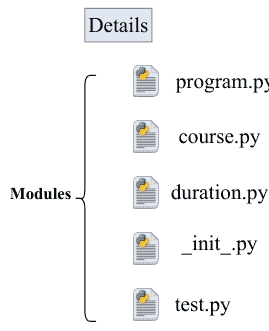

## \_\_init\_\_.py

包的内容存储在一个名为 \_\_init\_\_.py 的特定文件中，该文件位于包文件夹中。它有两个功能：

1.  如果一个文件夹包含 \_\_init\_\_.py 文件，Python 解释器会将其识别为一个包。
2.  \_\_init\_\_.py 使其模块中的资源可用于导入。

当导入此包时，一个空的 \_\_init\_\_.py 文件使所有模块的函数都可访问。值得注意的是，文件夹的 `__init__.py` 文件是 Python 将其识别为包所必需的。

## 子包

上述详细的包层次结构可以在同一包内拥有额外的嵌套包。这种结构层次有助于程序管理，因为可以适当地强调不同的模块。此外，划分为不同的模块减少了程序的长度，使其易于处理。代码修改所需的时间更少，因为只需修改所需的模块，而无需修改整个程序。

图 (2) 是嵌套包的示例。**Details** 包包含另外两个子包，即 **Subpackage1** 和 **Subpackage2**。这些包中的每一个都进一步包含模块文件。如前面的示例所示，有三个模块，即 *program.py*、*course.py*、*duration.py*、*\_init_.py* 和 *test.py*。这些模块中的每一个都被进一步封装在两个子包中，而不是单个主包中。包层次结构不会使导入过程复杂化太多。现在，为了导入目的，你必须同时指定子包的名称和主包的名称，并用点 (.) 分隔，如示例所示。

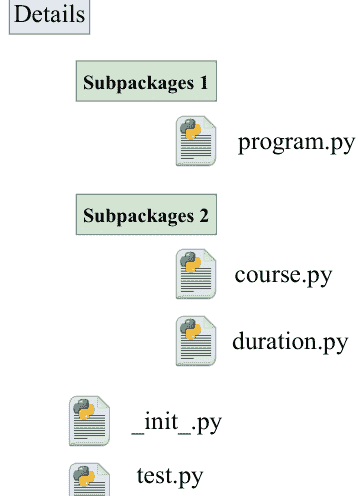

图 (2). 带有子包的 Details 包结构。

#### 示例：

```python
import Details.Subpackage1.program
import Details.Subpackage2.course
import Details.Subpackage2.duration
```

## 总结

我们在本章中介绍了 Python 模块和包。此外，还介绍了模块的实现及其导入方式。并且，使用 Python 代码讨论了包的创建和服务。你可以基于这些示例编写代码。我们将在下一章讨论 Python 的面向对象编程概念。

# 第 10 章

# 面向对象编程

**摘要：** 在本章中，我们探讨编程中的 OOP 概念，它提供了一种使编码更简单、更全面的有效方法。它便于代码重用，并允许自定义现有代码。

**关键词：** 命名空间、超类和子类。

## 引言

面向对象编程，有时称为 OOP，将计算机程序的组件组织成具有相似特征和功能的不同对象。类和对象是面向对象编程的基本构建块。类充当蓝图，而对象本身是能够执行各种操作的、活生生的实体。对象由其数据元素、特性和行为组成，这些可能包括操作或函数。

在过程式编程中，程序的结构类似于食谱，提供多个阶段，包括函数和代码块，这些阶段按顺序流动以实现目标。这种编程范式是最常见的编程范式之一。Python 一直是面向对象的，就像其他为通用编程设计的语言一样。它使我们能够使用面向对象的方法构建程序。Python 使得创建和使用对象和类变得非常简单。面向对象范式指的是利用类和对象来构建软件。该对象与现实世界中的事物相关联，例如计算机、房屋、手机等。OOP 的定义强调创建可重用的代码。将新事物组合在一起用作解决方案是一种常用的策略。面向对象编程范式可以分解为其核心思想，如下所示。

## 类与对象

一个**类**是可以赋予一组对象集合的名称。它是一个具有特定方法和独特属性的逻辑实体。例如，一个学生类应该包含属性和方法，比如他们的姓名、年龄、地址以及所注册的课程。**对象**则作为其独立的实体，拥有状态和一系列行为。它可能是一个笔记本、电脑、铅笔或其他东西。在Python中，一切都是对象，几乎任何东西都可以应用属性和方法。当定义一个类时，必须先创建一个对象，然后才能为其分配内存。

## 数据抽象

抽象实践是一种隐藏系统内部工作信息，仅展示其功能的方法。数据封装和数据抽象是两个经常互换使用的术语。因为数据封装是实现数据抽象的手段，所以这两个词可以互换使用。

## 封装

封装是面向对象编程中的一个关键概念，也是当今最流行的编程范式之一。它解释了将数据和操作数据的方法封装在单个单元中的概念。这限制了直接访问方法和变量，有助于避免意外的数据更改。只有对象的方法才能更改对象的变量；这样做是为了防止意外更改。这些特定的变量属于“私有变量”类别。封装可以通过类如何存储其所有成员函数、变量等信息来说明。信息隐藏的目标是通过调节对其属性的访问，同时将这些属性隐藏在外部世界的视野之外，来确保对象的状态始终有效。

## 继承

继承是面向对象编程最基本的组成部分，模仿了现实生活中发生的遗传过程。继承是一个基本组成部分。它指出父对象的所有特征和行为都通过遗传传递给子对象。通过继承，我们可以构建一个能够承担另一个类所有特征和行为的类。新类被认为是派生类或子类，而基类或父类则被认为是其属性被获取的类。它确保代码可以在不同的应用程序中使用。

## 多态

“多态”一词源于“poly”和“morphs”两个词的组合。前缀poly表示“许多”，而后缀morph指的是“形状”。当我们讨论多态时，指的是以多种方式执行单一活动的能力。它使用单一类别的对象，如方法、运算符或对象，在不同的上下文中代表多种不同类型。例如，我们有一个单一的加法运算符，能够添加各种值类型。

## 定义类

在Python中，使用关键字**class**后跟类名来创建类。以下是创建类的语法。

### 语法：

```
class <Class_Name>
    # 数据成员
    # 成员函数
```

一个类在新的本地命名空间中声明其所有属性。数据成员或函数可以作为属性包含在内。

它还包含以双下划线开头的独特属性。例如，**__doc__**返回类的文档字符串。可以使用以下语句访问它。

```
<class-name>.__doc__.
```

当我们定义一个类时，会生成一个同名的新类对象。我们可以使用这个类对象来访问各种属性并创建该类的新对象。

#### 示例：

```
class Course:
    "The Python Programming course"
    lec= 30
    def fun(self):
        print('Lectures on Python')

print (Course.lec)
# 调用函数
print (Course.fun)
# 显示文档字符串
print (Course.__doc__)
```

#### 输出：

```
30
<function Course.fun at 0x7f8d97db5da0>
The Python Programming course
```

## 创建对象

在另一个类或函数中使用类的属性或方法之前，我们需要实例化该类。简单地通过其名称命名类是初始化它的一种方式。以下是生成类实例（对象）的语法。

### 语法：

```
<object-name> = <class-name>(<arguments>)
```

#### 示例：

```
class Course:
    'The Python Programming course'
    lec= 30
    enroll = 89
    def fun(self):
        print('No.of scheduled lectures', self.lec)
        print('Enrolled students', self.enroll)

detail= Course()
# 访问变量
print (detail.lec)
print(detail.enroll)
# 访问函数
print (detail.fun())
```

#### 输出：

```
30
89
No.of scheduled lectures 30
Enrolled students 89
```

## 删除属性或对象

使用**del**关键字，我们可以删除对象的属性或对象本身。以下示例分别演示了删除某些属性和对象。

#### 示例：

```
class Course:
    'The Python Programming course'
    lec= 30
    enroll = 89
    def fun(self):
        print('No.of scheduled lectures', self.lec)
        print('Enrolled students', self.enroll)

detail= Course()
# 访问变量
print("-----------删除前-----------")
print (detail.lec)
print(detail.enroll)
# 访问函数
print (detail.fun())

del Course.lec
print("------------------删除后--------------------------")
print (detail.fun())
```

#### 输出：

```
-----------删除前-----------

30

89

No.of scheduled lectures 30

Enrolled students 89

------------------删除后--------------------------

Traceback (most recent call last):

File "<string>", line 19, in <module>

File "<string>", line 6, in fun

AttributeError: 'Course' object has no attribute 'lec'
```

以下示例展示了删除已创建对象的过程。

#### 示例：

```
class Course:
    'The Python Programming course'
    lec= 30
    enroll = 89

    def fun(self):
        print('No.of scheduled lectures', self.lec)
        print('Enrolled students', self.enroll)

detail= Course()
# 访问变量
print("-----------删除前-----------")
print (detail.lec)
print(detail.enroll)
# 访问函数
print (detail.fun())

del detail
print("---------------删除后-----------------------")
print (detail.fun())
```

#### 输出：

```
-----------删除前-----------

30

89

No.of scheduled lectures 30

Enrolled students 89

None

---------------删除后-----------------------

Traceback (most recent call last):

  File "<string>", line 19, in <module>

NameError: name 'detail' is not defined
```

## 数据抽象示例

面向对象编程范式非常重视数据的抽象。我们还可以选择通过在要隐藏的属性开头添加一对下划线（__）来隐藏Python数据。此后，该属性将无法通过关联对象在类外部访问。下面的Python代码演示了数据抽象的概念：

#### 示例：

```
class Course:
    'The Python Programming course'
    lec= 30
    enroll = 89
    __year = 2023
    def fun(self):
        print('No.of scheduled lectures', self.lec)
        print('Enrolled students', self.enroll)
        print('Year', self.__year)

detail= Course()
# 访问变量
print (detail.lec)
print(detail.enroll)
print (detail.year)
```

#### 输出：

```
30
89
Traceback (most recent call last):
  File "<string>", line 15, in <module>
AttributeError: 'Course' object has no attribute 'year'
```

## 构造函数

构造函数是一种特殊类型的函数，用于初始化类的实例成员。C++ 或 Java 中的构造函数与类同名，但 Python 对构造函数的处理方式不同。当我们创建一个类的对象时，构造函数就会执行。在 Python 中，构造函数通过 `__init__()` 方法定义。它以 `self` 关键字作为第一个参数，允许访问类的属性和方法。根据 `__init__()` 的定义，我们可以在构造类对象时传递任意数量的参数。它主要用于设置类的属性。如果我们没有定义任何其他构造函数，每个类都必须有一个默认构造函数。

#### 示例：

```python
# 创建一个名为 book 的类
class Course:
    # 定义构造函数
    def __init__(self,l,e,s):
        print('Constructor example')
        self.lec = l
        self.enroll = e
        self.sub= s

    # 创建函数
    def fun(self):
        print('No.of scheduled lectures:', self.lec)
        print('Enrolled students:', self.enroll)
        print('Year:', self.sub)

# 创建对象并将参数传递给构造函数
d_1 = Course(30, 200, "Python")
d_2= Course(45, 150, "C++")
# 通过对象访问类属性和方法
print ('-----Values-------')
d_1.fun()
d_2.fun()
```

#### 输出：

```
Constructor example

Constructor example

-----Values-----

No.of scheduled lectures: 30

Enrolled students: 200

Year: Python

No.of scheduled lectures: 45

Enrolled students: 150

Year: C++
```

当我们不想更新值或不希望 `self` 作为参数时，我们使用无参构造函数。下面的代码展示了无参构造函数的示例。

#### 示例：

```python
class demo:
    def __init__(self):  # 默认构造函数
        self.stat = "Joe sat on the chair."
    # 用于打印的函数
    def show(self):
        print(self.stat)

# 类的对象
d1 = demo()

# 调用实例
d1.show()
```

#### 输出：

```
Joe sat on the chair.
```

## 带参构造函数

带参构造函数除了 `self` 之外还包含多个参数。下面的 Python 代码演示了带参构造函数：

#### 示例：

```python
class demo:
    # 带参构造函数
    def __init__(self, arg1):
        print("This is parametrized constructor")
        self.arg1= arg1
    def show(self, adv):
        print("Joe went", self.arg1, adv)

d1 = demo("school")
d1.show("today")
```

#### 输出：

```
This is parametrized constructor
Joe went school today
```

## 默认构造函数

当类中没有包含或声明任何构造函数时，就会使用默认构造函数。它定义了对象的初始值。下面的示例演示了默认构造函数的概念。

#### 示例：

```python
class test:
    chk= "undone"

    def assign(self):
        print(self.chk)
# 类的对象
v1 = test()
# 调用实例方法
v1.assign()
```

#### 输出：

```
undone
```

## Python 中的继承

继承是我们将要使用的面向对象框架的重要组成部分。继承使我们能够重用程序的代码，因为在创建新类时我们不必从零开始；相反，我们可以利用现有的类作为基础。子类获得对父类中定义的所有数据成员和函数的访问权限，并且它还继承了父类中存在的属性。子类可以有自己的方式来实现父类的函数。Python 允许派生类通过简单地在派生类名称后指定基类并用括号括起来来继承基类。使用下面指定的语法将属性和行为从基类继承到派生类。

语法：

```
class <derived-class_Name> (base-class_Name):
    # 派生类主体
```

派生类可以从多个基类继承属性。可以通过在括号内命名所有基类来实现这种形式的继承。使用以下语法可以从多个类继承属性：

语法：

```
class <derive-class_name> (<base-class 1>, <base-class 2>, ..... <base-class n>):
    # 派生类主体
```

#### 示例：

```python
# 创建基类
class student():
    # 基类内的函数
    def course(self,arg1):
        print ('-----Base class function-------')
        self.arg1=arg1
        print ('Course name:', self.arg1)

# 继承的类
class enroll(student):
    # 派生类内的函数
    def is_enroll(self,arg2):
        print('--------Derived class function----------')
        self.arg2=arg2
        print("enrollment:", self.arg2)
enr = enroll()                    # 派生类的一个对象
print(enr.is_enroll("Lui"))
print(enr.course("python"))
```

#### 输出：

```
--------Derived class function----------

enrollment: Lui

-----Base class function-------

Course name: python
```

## 继承的类型

Python 中有四种类型的继承，具体取决于涉及的子类和父类组的数量。它包括单继承、多继承、多级继承和层次继承。

## 单继承

派生类可以从单个基类继承属性。这为代码重用和向现有代码添加新功能铺平了道路。单继承的原理如图 (1) 所示。

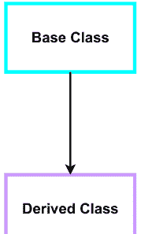

图 (1). 单继承。

#### 示例：

```python
# 创建基类
class student():
    # 基类内的函数
    def grade(self,arg1):
        print ('-----Base class function-------')
        self.arg1=arg1
        print ('grade:', self.arg1)

# 继承的类
class enroll(student):
    # 派生类内的函数
    def is_pass(self,arg2):
        print('--------Derived class function---------')
        self.arg2=arg2
        print("name:", self.arg2)

enr = enroll() # 派生类的一个对象
print(enr.grade(8))
print(enr.is_pass("Lui"))
```

#### 输出：

```
-----Base class function-------
grade: 8
--------Derived class function---------
name: Lui
```

## 多级继承

在多级继承中，基类和派生类的特征被传递给新创建的派生类。在 Python 中，通过多级继承可以达到的级别数没有上限；此功能是无限的。多级继承概念的可视化表示可以在图 (2) 中找到。

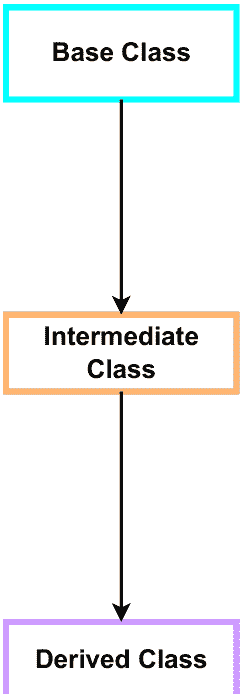

图 (2). 多级继承。

#### 示例：

```python
# 基类
class Electronics:

    def __init__(self):
        print("-----Base constructor-----")

    def cat1(self, category):
        print("-----Base class-----")
        self.category = category
        print('Electronic :', self.category)

# 中间类
class Televisons(Electronics):
    def style_1(self, style):
        self.style = style
        print("-----Intermediate class-----")
        print("Television :", self.style)

# 派生类
class model(Televisons):
    def model_name(self, name):
        print("-----Derived class-----")
        self.name = name
        print("model :", self.name)

s1 = model()
s1.cat1('Portable')
s1.style_1('LCD')
s1.model_name('Samsung')
```

#### 输出：

```
-----Base constructor-----

-----Base class-----

Electronic : Portable

-----Intermediate class-----

Television : LCD

-----Derived class-----

model : Samsung
```

## 多重继承

在多重继承场景中，一个类可以从多个基类派生。当存在多重继承时，派生类会继承所有基类的属性。图（3）展示了多重继承，其中一个派生类继承了两个基类的特性。

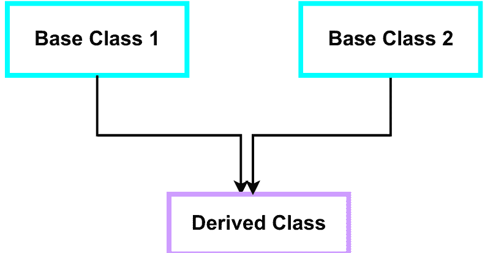

图（3）. 多重继承。

#### 示例：

```python
# First Base class
class Sneakers:
    def cat1(self, category):
        print("-----Base class 1-----")
        self.category = category
        print('Sneakers :', self.category)

# Second base class
class Sports_shoes:
    def style_1(self, style):
        self.style = style
        print("-----Base class 2-----")
        print("Sports_shoes :", self.style)

# Derived class
class shoes(Sneakers, Sports_shoes):
    def model_name(self, name):
        print("-----Derived class-----")
        self.name = name
        print("model :", self.name)

s1 = shoes()
s1.cat1('Spark')
s1.style_1('Bata')
s1.model_name('casuals')
```

#### 输出：

```
-----Base class 1-----

Sneakers : Spark

-----Base class 2-----

Sports_shoes : Bata

-----Derived class-----

model : casuals
```

## 层次继承

通过称为层次继承的过程，多个派生类可以从单个基类继承。在图（4）所示的层次继承示例中，三个派生类源自单个基类。

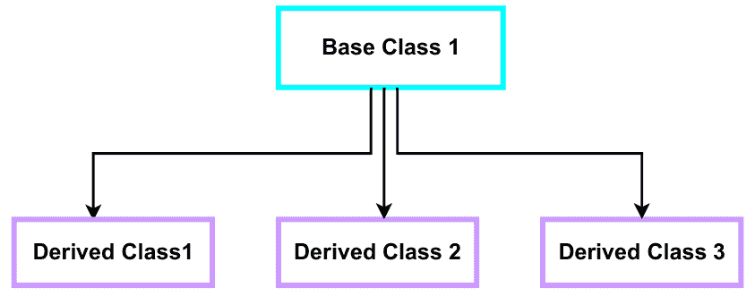

图（4）. 层次继承。

#### 示例：

```python
# Base class
class Televisions:
    def cat1(self, category):
        print("-----Base class-----")
        self.category = category
        print('Electronic :', self.category)

# Derived class 1
class plasma(Televisions):
    def style_1(self, style):
        self.style = style
        print("-----Derived class 1-----")
        print("Tube :", self.style)

# Derived class 2
class LCD(Televisions):
    def model_name(self, name):
        print("-----Derived class 2-----")
        self.name = name
        print("model :", self.name)

s1 = plasma()
s1.cat1('42 inches')
s1.style_1('LG')

s2 = LCD()
s2.cat1('32 inches')
s2.model_name('Samsung')
```

#### 输出：

```
-----Base class-----
Electronic : 42 inches

-----Derived class 1-----
Tube : LG

-----Base class-----
Electronic : 32 inches

-----Derived class 2-----
model : Samsung
```

## issubclass(sub, sup) 方法()

使用 `issubclass(sub, sup)` 方法来确定已定义类之间的关系。如果第一个类是第二个类的子类，则返回 true；否则，返回 false。

#### 示例：

```python
# Base class
class Electronics:
    def cat1(self, category):
        print("-----Base class-----")
        self.category = category
        print('Electronic :', self.category)

# Base class 2
class Televisions():
    def style_1(self, style):
        self.style = style
        print("-----Intermediate class-----")
        print("Television :", self.style)

# Derived class
class model(Electronics, Televisions):
    def model_name(self, name):
        print("-----Derived class-----")
        self.name = name
        print("model :", self.name)

s1 = model()
print(issubclass(model, Televisions))
print(issubclass(model, Electronics))
print(issubclass(Televisions, Electronics))
```

#### 输出：

```
True
True
False
```

## isinstance(obj, class) 方法()

使用 `isinstance()` 方法来确定对象和类之间的关系。如果第一个参数 `obj` 是第二个参数 `class` 的实例，则返回 true。

#### 示例：

```python
# Base class
class Electronics:
    def cat1(self, category):
        print("-----Base class-----")
        self.category = category
        print('Electronic :', self.category)

# Base class 2
class Televisions():
    def style_1(self, style):
        self.style = style
        print("-----Intermediate class-----")
        print("Television :", self.style)

# Derived class
class model():
    def model_name(self, name):
        print("-----Derived class-----")
        self.name = name
        print("model :", self.name)

s1 = model()
print(isinstance(s1, Televisions))
print(isinstance(s1, Electronics))
print(isinstance(s1, model))
```

#### 输出：

```
False
False
True
```

## PYTHON 中的多态

在面向对象编程中，任何事物能够呈现多种形式的概念被称为多态。多态允许使用单一接口来处理各种数据类型和类的输入以及不同的输入。在 Python 中，多态的概念可以通过几种不同的方式来定义。

## 运算符中的多态

我们知道加号（+）运算符在 Python 编程中经常被使用。尽管如此，它并非只能用于单一领域。在处理整数数据类型时，加号（+）运算符必须执行算术加法。同样，字符串数据可以通过使用 + 运算符进行连接。

#### 示例：

```python
a = 85
b = 96
print(a + b)
X = "Joe"
Y = "went"
Z = "schol"
print(X + " " + Y + " " + Z)
```

#### 输出：

```
181
Joe went schol
```

## 函数多态

几个 Python 函数可以用于多种不同类型的数据。这类函数的一个很好的例子是 *len()* 函数。Python 提供了处理多种不同类型数据的能力。*len()* 函数兼容多种数据类型，包括字符串、列表、元组、集合和字典。然而，它确实会针对特定数据类型提供精确的信息。

#### 示例：

```python
print(len("Programming languages"))
print(len([78, 5588, 74988]))
print(len({"grade": 8.02, "status": "pass"}))
print(len('7851'))
```

#### 输出：

```
21
3
2
4
```

## 类方法中的多态

由于 Python 允许多个类拥有同名的方法，我们可以将多态原则应用于开发类方法的过程。在这种特定情况下，我们可能想要创建一个 for 循环来遍历一个项目元组。之后，我们调用这些方法，而不考虑每个对象的具体类类型。我们假设这些方法存在于所有类中。

#### 示例：

```python
# Polymorphism in classes
class A():
    def fun1(self):
        print("python")

    def fun2(self):
        print("programming language")

class B():
    def fun1(self):
        print("Anaconda")

    def fun2(self):
        print("IDE")

obj1 = A()
obj2 = B()

for i in (obj1, obj2):
    i.fun1()
    i.fun2()
```

#### 输出：

```
python
programming language
Anaconda
IDE
```

## 方法重写

Python 的多态特性使程序员能够创建子类，其方法与父类中的方法同名。在继承过程中，子类会接收为父类定义的方法。另一方面，子类可以更改从父类继承的方法。当从父类继承的方法不完全适用于子类时，这尤其有用。在这种情况下，该方法会在子类中从头开始重新创建。在子类中重新实现父类方法的过程被称为方法重写或多态继承。

#### 示例：

```python
# Example of method overriding
class Subjects:
    def func1(self):
        print('It is Base Class')
    def func2(self):
        print(' Subjects Class')

class Core(Subjects):
    def func2(self):
        print('Core subject class')

class Elec(Subjects):
    def func2(self):
        print('Elec subject class')

a1 = Subjects()
a1.func1()
a1.func2()

print('-------------')
b1 = Core()
b1.func1()
b1.func2()

print('-------------')
e1 = Elec()
e1.func1()
e1.func2()
```

#### 输出：

```
这是基类

科目类

------------

这是基类

核心科目类

------------

这是基类

电子科目类
```

## 内置类函数

以下是类的内置函数，如表1所示。

#### 示例：

```
class student:
    def __init__(self, name, ids, sub):
        self.name = name
        self.ids = ids
        self.sub = sub

# student类的对象
s1 = student("Joe", 408, "Java")

# 打印对象s1的name属性
print(getattr(s1, 'name'))

# 更改sub属性的值
setattr(s1, "sub", "Python")

# 显示修改后的sub值
print(getattr(s1, 'sub'))

# 如果学生包含id属性，则打印true
print(hasattr(s1, 'ids'))

print("------删除前------")
print(s1.ids)
# 删除一个属性
delattr(s1, 'ids')
# 由于id属性已被删除，这将显示错误
print("------删除后------")
print(s1.ids)
```

表1. 内置类函数。

| 函数 | 描述 |
| :--- | :--- |
| `getattr(obj,name,default)` | 用于获取对象的属性。 |
| `setattr(obj, name,value)` | 用于为对象的属性赋予特定值。 |
| `delattr(obj, name)` | 删除特定属性。 |
| `hasattr(obj, name)` | 如果对象具有特定属性，则返回true。 |

#### 输出：

```
Joe

Python

True

------删除前------

408

------删除后------

Traceback (most recent call last):

  File "<string>", line 28, in <module>

AttributeError: 'student' object has no attribute 'ids'
```

## 内置类属性

除了其他属性外，Python类还有几个内置类属性，用于提供关于类的信息。内置类属性如表2所示。

表2. 内置类属性。

| 属性 | 描述 |
| :--- | :--- |
| `__dict__` | 提供一个包含类命名空间详细信息的字典。 |
| `__doc__` | 包含类文档字符串。 |
| `__name__` | 用于获取类的名称。 |
| `__module__` | 允许获取定义此类的模块。 |
| `__bases__` | 包含所有基类的元组。 |

#### 示例：

```
class student:
    def __init__(self, name, ids, sub):
        self.name = name
        self.ids = ids
        self.sub = sub

    def display(self):
        print(self.name)
        print(self.sub)

a1 = student("Akarck", 4874, "Python")
print(a1.__doc__)
print(a1.__dict__)
print(a1.__module__)
print(display.__name__)
print(student.__bases__)
```

#### 输出：

```
None
{'name': 'Akarck', 'ids': 4874, 'sub': 'Python'}
__main__
display
(<class 'object'>,)
```

## 静态变量

所有对象共享静态变量。它有时也被称为类变量。非静态变量的值可以根据其关联的对象而改变。实例变量或非静态变量是在方法内分配值的变量。相比之下，类变量是在类声明时赋值的变量。

#### 示例：

```
# 类声明
class Televison:
    cost = 150000          # 类或静态变量
    def __init__(self, company, style):
        self.company = company    # 非静态变量
        self.style = style

## 创建对象
a1 = Televison("LG", 'LCD')
a2 = Televison("Samsung", 'Plasma')

print(a1.cost)  # 打印 150000
print(a2.cost)  # 打印 150000
print(a1.company)   # 打印 LG
print(a2.company)   # 打印 Samsung
print(a1.style)  # 打印 LCD
print(a2.style)  # 打印 Plasma

# 也可以使用类名访问类变量
print(Televison.cost)   # 打印 150000

# 我们只更改s1的费用，它不会为s2更改
a1.cost = 125000
print(a1.cost)   # 打印 125000
print(a2.cost)   # 打印 150000

# 要更改所有对象的费用，我们可以直接从类中更改
Televison.cost = 140000

print(a2.cost)   # 打印 140000
```

#### 输出：

```
150000
150000
LG
Samsung
LCD
Plasma
150000
125000
150000
140000
```

## 总结

在本章中，我们讨论了面向对象编程的概念及其在Python中的实现。我们讨论了构造函数、继承、多态性等。借助示例描述了各种内置类函数和属性。基于这些示例，你可以编写自己的面向对象编程代码。在下一章中，我们将讨论机器学习的概念及其在Python中的实现。

## 第11章

## 用于机器学习的Python

**摘要：** 假设用户对Python的核心要素有良好的了解，我们现在探讨Python的应用方面。在本章中，我们将从机器学习（ML）的角度来看Python。我们将讨论各种库及其在ML中的效用，然后进行编程演示。

**关键词：** 库，机器学习，包，预测和分类。

## 引言

我们假设读者现在有足够的预备知识，可以深入使用Python进行编程。Python一直是开发者的首选，而机器学习是Python的主要应用领域之一。机器学习是计算机科学的一个领域，它使计算机程序能够获得类似于人脑的能力，*即*，从过去的经验中学习并执行未来的任务。在本章中，你将学习使用Python编写机器学习算法。

与传统编程不同，机器学习不需要预定义规则，而是设计用于决策的数学模型，而不是人为干预。图（1和2）显示了两种编程范式之间的差异。在传统编程中，规则和数据被输入计算机，然后评估结果。如果出现错误，则研究和分析问题，并对规则进行更改。但在机器学习范式中，学习依赖于训练数据，并评估结果。然后，在测试数据上测试定义的模型，并产生输出。

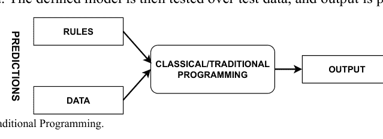

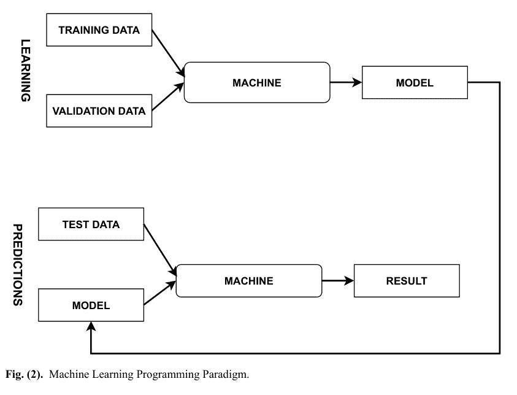

图（2）。机器学习编程范式。

自学是机器学习的关键。基于数据提取、预处理和分析的性能，而无需显式编程，定义了机器学习的目标。它旨在促进机器直接工作，而无需编程。决策是一项重要的任务，它依赖于基于试错和概率推理的模式提取和信息建模。因此，可以说决策不是基于预设规则，而是基于输入数据。为了最小化错误，程序员可以调整称为超参数调优的模型设置。为了学习，程序员将数据分为训练数据和测试数据。训练集有助于学习数据中的模式并验证结果。最后，可以在测试数据上评估开发的模型。如果性能令人满意，则可以将模型部署用于其他应用程序。

根据训练过程，机器学习分为两类。如果机器使用标记的训练数据进行训练，*即*，已分类到不同类别的数据，则该类型称为监督学习。并且，如果对训练数据的学习没有人为干预，*即*，没有定义的类别，则称为无监督学习。区别

监督学习与无监督学习之间的区别见表1。

表1. 监督学习与无监督学习的区别。

| 监督学习 | 无监督学习 |
|---|---|
| 输入数据有标签 | 输入数据无标签 |
| 存在反馈机制 | 不存在反馈机制 |
| 数据被分类 | 为数据分配属性 |
| 适用于预测任务 | 适用于分析任务 |
| 已知类别数量 | 未知类别数量 |
| 由解释变量和响应变量组成 | 仅由解释变量组成 |

监督学习适用于两个主要领域，即分类和回归。分类是根据用于训练的有标签数据将数据划分为不同类别的过程。回归与分类类似，不同之处在于回归也可以应用于连续数据，而分类只能应用于离散值。无监督学习适用于聚类和关联任务。聚类用于发现数据中的分组，而关联用于从大量数据中提取规则。

## 重要的Python库

现在我们来介绍一些在机器学习中使用的重要Python库。

### NUMPY

它是一个数组处理包，适用于处理大型多维数组和矩阵。

示例：

```
import numpy as np
arr = np.array([[4, 13, 17, 6], [2,4,3,8]])
print(arr)
```

输出：

```
[[ 4 13 17  6]
 [ 2  4  3  8]]
```

### PANDAS

它是主要的数据预处理库之一，允许轻松操作和分析数据。它在准备训练数据方面发挥着重要作用。它提供了加载、准备、操作和分析数据的工具。

示例：

```
#Importing pandas as pd
import pandas as pd
data = {"course": ["Python", "Machine Learning", "Deep Learning", "Programming Logic"],
        "code": ["C007","C002", "C005", "C006"]
       }
data_table = pd.DataFrame(data)
print(data_table)
```

输出：

| | course | code |
|---|---|---|
| 0 | Python | C007 |
| 1 | Machine Learning | C002 |
| 2 | Deep Learning | C005 |
| 3 | Programming Logic | C006 |

Pandas提供两种数据结构，即Series和DataFrame。Series被定义为存储各种数据类型的一维数组。它们包含多列，但只有一个参数。Series的行标签称为索引。

示例：

```
import pandas as pd
import numpy as np
info = np.array(['P','a','n','d','a','s'])
ans = pd.Series(info)
print(ans)
```

输出：

```
0  P
1  a
2  n
3  d
4  a
5  s
dtype: object
```

DataFrame处理二维数组。它们是数据存储的标准化方法。它们有两个不同的索引，*即*，行索引和列索引。这里的列可以包含异构数据类型，如bool、int、*等等*。

示例：

```
import pandas as pd
w1= ['Programming', 'Language']

# Calling DataFrame
df = pd.DataFrame(w1)
print(df)
```

输出：

```
0
0 Programming
1 Language
```

### SCIKIT-LEARN

它允许使用各种机器学习算法，如分类、回归、聚类、降维、预处理、*等等*。它可以与NumPy和Pandas等其他库协同使用。它可用于数据分析和数据挖掘。它是帮助构建高级机器学习模型的常用库之一。

示例：

```
# load the iris dataset as an example
from sklearn.datasets import load_iris
iris = load_iris()

# store the feature matrix (X) and response vector (y)
X = iris.data
y = iris.target

# store the feature and target names
feature_names = iris.feature_names
target_names = iris.target_names

# printing features and target names of our dataset
print("Feature names:", feature_names)
print("Target names:", target_names)

# X and y are numpy arrays
print("\nType of X is:", type(X))

# printing first 5 input rows
print("\nFirst 10 rows of X:\n", X[:10])
```

输出：

```
Feature names: ['sepal length (cm)', 'sepal width (cm)', 'petal length (cm)', 'petal width (cm)']
Target names: ['setosa' 'versicolor' 'virginica']

Type of X is: <class 'numpy.ndarray'>

First 5 rows of X:
[[5.1 3.5 1.4 0.2]
 [4.9 3.  1.4 0.2]
 [4.7 3.2 1.3 0.2]
 [4.6 3.1 1.5 0.2]
 [5.  3.6 1.4 0.2]
 [5.4 3.9 1.7 0.4]
 [4.6 3.4 1.4 0.3]
 [5.  3.4 1.5 0.2]
 [4.4 2.9 1.4 0.2]
 [4.9 3.1 1.5 0.1]]
```

### MATPLOTLIB

它是一个帮助在Python中创建2D图表的库，这对于数据可视化至关重要。使用它，你可以轻松生成直方图、条形图、散点图和误差图。Matplotlib的一些基本函数在表2中进行了说明。

表2. Matplotlib的不同元素。

| 方法 | 描述 |
|---|---|
| Plot() | 创建一个图表但不显示它。 |
| Show() | 用于显示图表 |
| xlabel() | 定义x轴的标签 |
| ylabel() | 定义y轴的标签 |
| title() | 定义图表的标题 |
| legend() | 为图表元素提供含义 |

示例：

```
# load the iris dataset as an example
# importing the required module
import matplotlib.pyplot as plt

# x axis values
x = [1,5,7,9,11]
# corresponding y-axis values
y = [4,8,2,5,10]

# plotting the points
plt.plot(x, y)

# naming the x-axis
plt.xlabel('x - axis')
# naming the y axis
plt.ylabel('y - axis')

# giving a title to my graph
plt.title('My first graph!')

# function to show the plot
plt.show()
```

输出：

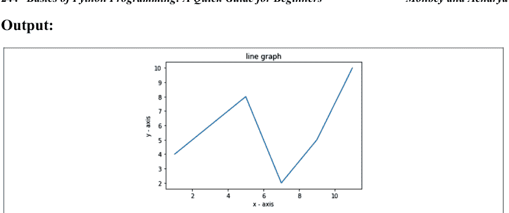

### TENSORFLOW

由Google Brain团队于2015年开发，它在Apache许可证下注册。它可以与不同的工具包一起使用，以提供多种功能。其主要重点是简化深度学习算法的实现。

示例：

```
from __future__ import print_function
import tensorflow as tf
# Define tensor constants.
a = tf.constant(4)
b = tf.constant(6)
c = tf.constant(8)

# Various tensor operations.
# Note: Tensors also support python operators (+, *, ...)
add = tf.add(a, b)
sub = tf.subtract(a, b)
mul = tf.multiply(a, b)
div = tf.divide(a, b)

# Access tensors value.
print("add =", add.numpy())
print("sub =", sub.numpy())
print("mul =", mul.numpy())
print("div =", div.numpy())
```

输出：

```
add = 10
sub = -2
mul = 24
div = 0.6666666666666666
```

### KERAS

它主要专注于深度学习的快速实现。由于其简单灵活，并且拥有强大的API，可以在CNTK、TensorFlow或Theano上实现，因此被广泛使用。

示例：

```
import numpy as np
import pandas as pd
# Import scikit-learn modules
from sklearn import preprocessing
from sklearn.preprocessing import StandardScaler
from sklearn.model_selection import train_test_split
# Import keras modules
import keras
from keras.models import Sequential
from keras.layers import Dense
```

### PYTORCH

PyTorch是由Facebook团队开发的专注于深度学习的开源框架。它对Python和C++有可行的支持。PyTorch中存在三个抽象层次：**张量、变量和模块**。PyTorch的显著特点是：

- **接口：** PyTorch简单易用的执行方式使其非常受欢迎。
- **Python使用：** 它使用基于Python的库，因此可以利用Python环境提供的功能。
- **计算图：** 它提供动态计算图，可以在运行时更改。

> 注意：如果尚未安装PyTorch，请使用 **pip install torch** 进行安装。

示例：

```
import torch
import math
dtype = torch.float
device = torch.device("cpu")
# Create random input and output data
x = torch.linspace(-math.pi, math.pi, 50, device=device, dtype=dtype)
y = torch.sin(x)
print (x)
print (y)
p=torch.linspace(4, 50, steps=5)
print (p)
q=torch.linspace(-5, 20, steps=10)
print (q)
```

输出：

```
tensor([-3.1416, -3.0134, -2.8851, -2.7569, -2.6287, -2.5005, -2.3722, -2.2440, -2.1158, -1.9875,
-1.8593, -1.7311, -1.6029, -1.4746, -1.3464, -1.2182, -1.0899, -0.9617, -0.8335, -0.7053, -0.5770,
-0.4488, -0.3206, -0.1923, -0.0641,  0.0641,  0.1923,  0.3206,  0.4488,  0.5770,  0.7053,
 0.8335, 0.9617,  1.0899,  1.2182,  1.3464,  1.4746,  1.6029,  1.7311,  1.8593,  1.9875,  2.1158,
 2.2440,  2.3722,  2.5005,  2.6287,  2.7569,  2.8851,  3.0134,  3.1416])

tensor([ 8.7423e-08, -1.2788e-01, -2.5365e-01, -3.7527e-01, -4.9072e-01, -5.9811e-01, -6.9568e-
01, -7.8183e-01, -8.5514e-01, -9.1441e-01, -9.5867e-01, -9.8718e-01, -9.9949e-01, -9.9538e-01,
-9.7493e-01, -9.3847e-01, -8.8660e-01, -8.2017e-01, -7.4028e-01, -6.4823e-01,
-5.4553e-01, -4.3388e-01, -3.1511e-01, -1.9116e-01, -6.4070e-02,  6.4070e-02,  1.9116e-01,
 3.1511e-01,  4.3388e-01,  5.4553e-01,  6.4823e-01,  7.4028e-01,  8.2017e-01,  8.8660e-01,
 9.3847e-01,  9.7493e-01,  9.9538e-01,  9.9949e-01,  9.8718e-01,  9.5867e-01,  9.1441e-01,
 8.5514e-01,  7.8183e-01,  6.9568e-01,  5.9811e-01,  4.9072e-01,  3.7527e-01,  2.5365e-01,
 1.2788e-01, -8.7423e-08])

tensor([ 4.0000, 15.5000, 27.0000, 38.5000, 50.0000])
tensor([-5.0000, -2.2222,  0.5556,  3.3333,  6.1111,  8.8889, 11.6667, 14.4444,
 17.2222, 20.0000])
```

### NLTK

NLTK是Natural Language Toolkit的缩写，主要用于NLP（自然语言处理）。它提供了简单有效的接口支持

## 在 Mac/ Unix 上安装 NLTK

1. 安装 NLTK：运行 `pip install –user -U nltk`。
2. 测试安装：运行 `import nltk`。

## 在 Windows 上安装 NLTK

1. 安装最新版本的 Python，最好是高于 3.6 的版本。
2. 使用 `pip install nltk` 安装 NLTK。
3. 测试安装：开始 > Python > 输入 `import nltk`。

如果安装成功，你还必须安装其他依赖项。

4. 安装用于语言处理的词典：使用 `nltk.download()` 命令。

运行此命令时，会弹出一个安装窗口。选择“下载”选项以安装词典、其他语言以及完整 NLTK 功能所需的语法数据框架。NLTK 广泛支持英语，也对西班牙语和法语提供有限支持。图 (3) 展示了 NLTK 下载器窗口。你可以检查集合中项目的状态和下载进度。它便于查看支持的语料库和其他包的清单，如图 (4–5) 所示。

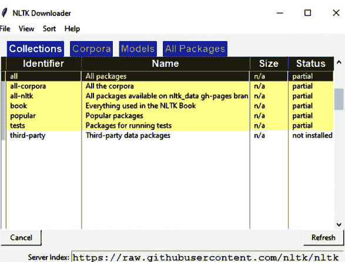

图 (3). 使用 nltk.download() 下载 NLTK 书籍集合。

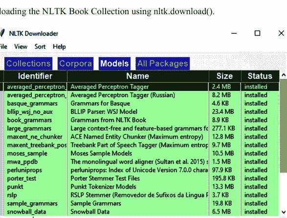

图 (4). NLTK 模型。

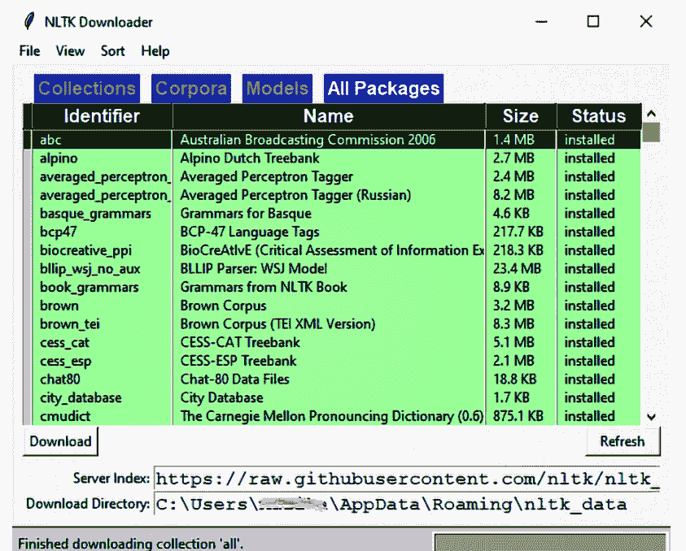

图 (5). NLTK 包清单。

#### 示例：

```
1. import nltk
2. sentence = """Cris went out on the new bicycle ."""
3. tokens = nltk.word_tokenize(sentence)
4. print(tokens)
```

#### 输出：

```
['Cris', ' went ', ' out ', ' on ', ' the ', ' new ', ' bicycle','.']
```

## 示例：加载文本

```
1. from nltk.book import *
```

#### 输出：

```
*** Introductory Examples for the NLTK Book ***
Loading text1, ..., text9 and sent1, ..., sent9
Type the name of the text or sentence to view it.
Type: 'texts()' or 'sents()' to list the materials.
text1: Moby Dick by Herman Melville 1851
text2: Sense and Sensibility by Jane Austen 1811
text3: The Book of Genesis
text4: Inaugural Address Corpus
text5: Chat Corpus
text6: Monty Python and the Holy Grail
text7: Wall Street Journal
text8: Personals Corpus
text9: The Man Who Was Thursday by G . K . Chesterton 1908
```

## 示例：搜索文本

```
1. from nltk.book import *
2. text1.concordance("ball")
```

#### 输出：

```
Displaying 12 of 12 matches:
 " These things are reciprocal ; the ball rebounds , only to bound forward aga
This is my substitute for pistol and ball . With a philosophical flourish Cato
t know Ahab then . " Am I a cannon - ball , Stubb ," said Ahab , " that thou w
well ; belike the whole world ' s a ball , as you scholars have it ; and so '
ically wild and unearthly , that the ball of free will dropped from my hand ,
n again ; but the next night an iron ball , closely netted , partly rolled fro
it to be true ; it happened on this ball ; I trod the ship ; I knew the crew
fle holds the fatal powder , and the ball , and the explosion ; so the gracefu
like malefactors with the chain and ball . But upon flinging the third , in t
broke through the ribs -- and with a ball of Arsacidean twine , wandered , edd
ks something like a white billiard - ball . I was told that there were still s
furrow in the sea as when a cannon - ball , missent , becomes a plough - share
```

## 总结

在本章中，我们概述了各种 Python 库。这些库对于机器学习和数据科学应用不可或缺。Python 库提供的广泛操作简化并加速了任务自动化和预测结果的过程。下一章包含一些使用这些库的实用 Python 程序，以展示它们的重要性。

# 第 12 章

# 使用 Python 编程

**摘要：** 在成功理解了 Python 的不同方面及其在机器学习中的应用之后，现在是时候看看如何通过常见示例将它们结合起来并投入使用了。这无疑会增加读者对 Python 复杂性的理解，并展示该语言在简化编程方面的效率。

**关键词：** 二分查找，阶乘，时间序列。

## 引言

在阅读了前面的章节之后，我们相信你对 Python 的基础知识有了更好的理解。现在让我们开始一些 Python 编程练习。首先，我们提供一些使用函数、列表、字典、数组、*等等*的简单基础 Python 程序。然后我们讨论一些使用 Python 编程的基础机器学习应用。

## 基础 Python 程序

### 求解二次方程的程序

#### 示例：

```
1. # Import complex math module
2. import cmath
3. a = input('Enter your choice: ')
4. b =input('Enter your choice: ')
5. c = input('Enter your choice: ')

6. # Calculate the discriminant
7. d = (b**2) - (4*a*c)

8. # Find two solutions
9. sol1 = (-b-cmath.sqrt(d))/(2*a)
10. sol2 = (-b+cmath.sqrt(d))/(2*a)
11. print('The solution are {0} and {1}'.format(sol1,sol2))
```

#### 输出：

```
Enter a: 1
Enter b: 2
Enter c: -15
The solution are (-5+0j) and (3+0j)
```

### 交换两个数字的程序

#### 示例：

```
1. P = int( input("Please enter value for P: "))
2. Q = int( input("Please enter value for Q: "))
3. # To swap the value of two variables
4. # We will user third variable which is a temporary variable
5. temp_1 = P
6. P = Q
7. Q = temp_1
8. print ("The Value of P after swapping: ", P)
9. print ("The Value of Q after swapping: ", Q)
```

#### 输出：

```
Please enter value for P: 21
Please enter value for Q: 81
The Value of P after swapping: 81
The Value of Q after swapping: 21
```

### 求两个数字阶乘的程序

#### 示例：

```
1. num = int(input("Enter a number: "))
2. factorial = 1
3. if num < 0:
4.     print(" Factorial does not exist for negative numbers")
5. elif num == 0:
6.     print("The factorial of 0 is 1")
7. else:
8.     for i in range(1,num + 1):
9.         factorial = factorial*i
10.     print("The factorial of",num,"is",factorial)
```

#### 输出：

```
Enter a number: 9
The factorial of 9 is 362880
```

### 使用递归实现斐波那契数列的程序

#### 示例：

```
1. def recur_fibo(n):
2.     if n <= 1:
3.         return n
4.     else:
5.         return(recur_fibo(n-1) + recur_fibo(n-2))
6. 
7. nterms = int(input("How many terms? "))
8. # Check if the number of terms is valid
9. if nterms <= 0:
10.     print("Plese enter a positive integer")
11. else:
12.     print("Fibonacci sequence:")
13.     for i in range(nterms):
14.         print(recur_fibo(i))
```

#### 输出：

```
How many terms? 5
Fibonacci sequence:
0
1
1
2
3
```

### 将数组元素按升序排序

#### 示例：

```
1. arr = [2,8,6,41,35,7];
2. temp = 0;
3. print("Elements of original array: ");
4. for i in range(0, len(arr)):
5.     print(arr[i], end=" ");
6. #Sort the array in ascending order
7. for i in range(0, len(arr)):
8.     for j in range(i+1, len(arr)):
9.         if(arr[i] > arr[j]):
10.            temp = arr[i];
11.            arr[i] = arr[j];
12.            arr[j] = temp;
13. print();
14. print("Elements of array sorted in ascending order: ");
15. for i in range(0, len(arr)):
16.     print(arr[i], end=" ");
```

#### 输出：

```
Elements of original array:
2 8 6 41 35 7
Elements of array sorted in ascending order: 2,6,7,8,35,41
```

### 打印数组元素之和的程序

#### 示例：

```
1. arr = [4,6,8,10,15];
2. sum = 0;
3. for i in range(0, len(arr)):
4.     sum = sum + arr[i];
5. print("Sum of all the elements of an array: " + str(sum));
```

#### 输出：

```
Sum of all the elements of an array: 43
```

## 矩阵转置程序

示例：

```python
m = [[11, 42], [39, 75], [63, 12]]
for row in m:
    print(row)
rez = [[m[j][i] for j in range(len(m))] for i in range(len(m[0]))]
print("\n")
print("Transposed Matrix is:")
for row in rez:
    print(row)
```

输出：

```
[11, 42]
[39, 75]
[63, 12]
Transposed Matrix is:
[11, 39, 63]
[42, 75, 12]
```

## 字符串反转程序

示例：

```python
def reverse_string(str):
    str1 = ""   # Declaring empty string
    for i in str:
        str1 = i + str1
    return str1
str = "Python Programming"
print("The original string is: ", str)
print("The reverse string is:", reverse_string(str))
```

输出：

```
The original string is:  Python Programming
The reverse string is: gnimmargorP nohtyP
```

## 字符串连接程序

示例：

```python
# Defining strings
str1 = "Book on "
str2 = "Python"
str3 = str1 + str2
print("The concatenated string:", str3)
```

输出：

```
The concatenated string: Book on Python
```

## 列表元素追加程序

示例：

```python
fruits = ["Mango", "Apple", "Banana", "Tomato"]
Fruits2 = input("Please enter a name:\n")
fruits.append(Fruits2)
print('Updated List is:', fruits)
```

输出：

```
Please enter a name:
berry
Updated List is: ['Mango', 'Apple', 'Banana', 'Tomato', 'berry']
```

## 列表元素删除程序

示例：

```python
list = ['Python', 'Book', 'Computer', 'Science', 'Program']
print(list)
list.remove('Python')
print("After deletion:", list)
```

输出：

```
['Python', 'Book', 'Computer', 'Science', 'Program']
After deletion: ['Book', 'Computer', 'Science', 'Program']
```

## 线性搜索程序

示例：

```python
def linearsearch(list, m):
    for i in range(len(list)):
        if list[i] == m:
            return i
    return -1

list1 = ['p', 'y', 't', 'h', 'o', 'n']
n = 'a'
x = 'o'
print("element is at index " + str(linearsearch(list1, n)))
print("Index of the element: " + str(linearsearch(list1, x)))
```

输出：

```
element is at index -1
Index of the element: 4
```

## 二分搜索程序

示例：

```python
def binary_search(list1, m):
    low = 0
    high = len(list1) - 1
    mid = 0
    while low <= high:
        mid = (high + low) // 2
        if list1[mid] < m:
            low = mid + 1
        elif list1[mid] > m:
            high = mid - 1
        else:
            return mid
    return 0
list = [1, 42, 12, 78, 85]
n = 78
# calling function
result = binary_search(list, n)
if result != -1:
    print("Index of element", str(result))
else:
    print("Not present in array")
```

输出：

```
Element is present at index 3
```

在机器学习中，Python被广泛用于执行各种分析。这里我们介绍基于Python的时间序列分析。如前面章节所述，有多种Python库对机器学习任务非常有用。

## 时间序列分析程序

示例：

```python
import pandas
import numpy
import matplotlib.pyplot as plt
from sklearn.linear_model import LinearRegression
from sklearn.metrics import mean_squared_error
from math import sqrt

df = pandas.DataFrame()
df = pandas.read_csv('/content/Alcohol_Sales.csv', index_col='DATE', parse_dates=True)
df.index.freq = 'MS'
df.tail()
df.columns = ['Sales']
df.plot(figsize=(12, 8))
df['Sale_LastMonth'] = df['Sales'].shift(+1)
df['Sale_2Monthsback'] = df['Sales'].shift(+2)
df['Sale_3Monthsback'] = df['Sales'].shift(+3)
df = df.dropna()
df
lin_model = LinearRegression()
x1, x2, x3, y = df['Sale_LastMonth'], df['Sale_2Monthsback'], df['Sale_3Monthsback'], df['Sales']
x1, x2, x3, y = numpy.array(x1), numpy.array(x2), numpy.array(x3), numpy.array(y)
x1, x2, x3, y = x1.reshape(-1, 1), x2.reshape(-1, 1), x3.reshape(-1, 1), y.reshape(-1, 1)
final_x = numpy.concatenate((x1, x2, x3), axis=1)
print(final_x)
X_train, X_test, y_train, y_test = final_x[:-30], final_x[-30:], y[:-30], y[-30:]
lin_model.fit(X_train, y_train)
lin_pred = lin_model.predict(X_test)
import matplotlib.pyplot as plt
plt.rcParams["figure.figsize"] = (11, 6)
plt.plot(lin_pred, label='Linear_Regression_Predictions')
plt.plot(y_test, label='Actual Sales')
plt.legend(loc="upper left")
plt.show()
rmse_lr = sqrt(mean_squared_error(lin_pred, y_test))
print('Mean Squared Error for Linear Regression Model is:', rmse_lr)
```

输出：

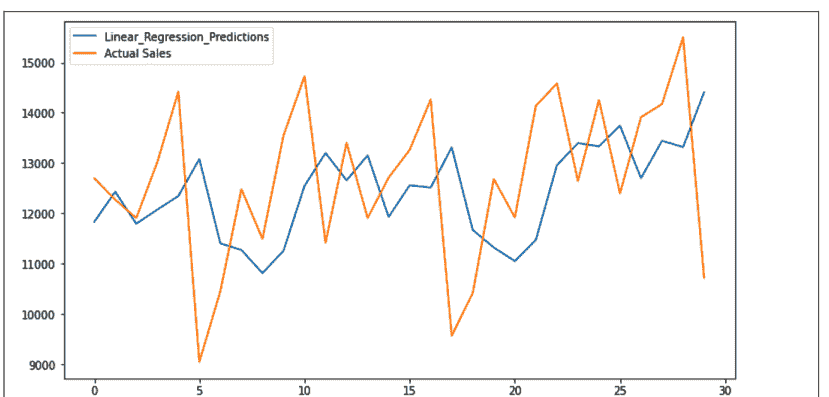

## 总结

在本章中，我们展示了一些重要的Python程序。你也可以借助这些程序编写新的程序。在编写任何程序之前，理解问题的本质至关重要，然后才能据此定义解决方案。

260 Basics of Python Programming: A Quick Guide for Beginners, 2023, 260-260

## 参考文献

- [1] 可访问：www.python.org
- [2] 可访问：https://docs.anaconda.com
- [3] M. Lutz, *Learning Python: Powerful Object-Oriented Programming*. 第5版. O'Reilly Media, Incorporated, 2009.
- [4] D.M. Beazley, *Python Essential Reference*. Addison-Wesley, 2009.
- [5] C.P. Milliken, *Python Projects for Beginners: A ten-week bootcamp approach to python programming*. (第1版) Apress, 2019.
- [6] A. Harris, *Python for Beginners: Learn Computer Programming with Python Now and How to Use It with This Step by Step Guide That Gives You the Basics of Python Coding + Practical Exercises*. Independently Published, 2019.
- [7] F. Romano, and H. Kruger, *Learn Python Programming: An in-depth introduction to the fundamentals of Python 3rd Edition*. (第3版). Packt Publishing, 2021.
- [8] A. Müller, and S. Guido, *Introduction to Machine Learning with Python: A Guide for Data Scientists*. (第1版). O'Reilly Media, 2016.
- [9] 可访问：https://www.nltk.org/ 获取NLTK的完整下载和使用参考。
- [10] D. Paper, *Hands-on scikit-learn for machine learning applications. Data Science Fundamentals with Python*. Apress: Berkeley, CA, 2020. [http://dx.doi.org/10.1007/978-1-4842-5373-1]

Krishna Kumar Mohbey & Malika Acharya
版权所有-© 2023 Bentham Science Publishers

## 主题索引

A

- Anaconda 7, 8
    - 导航器 8
    - 开源发行版 7
- 应用 1, 7, 17, 43, 142, 182, 184, 210, 238, 250, 251
    - 银行 43
    - 基础机器学习 251
    - 数据科学 250
    - 桌面 1
- 参数，位置 136
- 数组 20, 115, 116, 138, 239, 240, 241, 251, 254
    - 大型多维 239
    - 一维 240
    - 二维 241
- 结合性，运算符的 34
- 属性 121, 198, 209, 210, 215, 216, 219, 233, 236
    - 类的 216
    - 模块的 198
    - 特定的 233
- 自动内存管理分配 4

B

- 终身仁慈独裁者（BDFL） 1, 3
- 二进制 30, 31, 165, 177, 178
    - 文件 165, 177, 178
    - 左移 30
    - 右移 31
- 位运算符 25, 30, 31
- 布尔 18, 22, 27, 77, 91
    - 数据类型 22
    - 值 27, 91
- Break语句 12, 56, 57

C

- 字符 36, 37, 38, 39, 77, 78, 79, 88, 90, 91, 93, 100, 101, 122, 164, 169, 170
    - 字母 39
    - 字母数字 38, 101
    - 非字母数字 101
- 类 99, 216, 233, 234
    - 属性 216, 233
    - 声明 234
    - 字符串模块 99
- 代码 2, 3, 12, 13, 15, 184, 185, 198, 208, 219, 220
    - 块 12, 13, 184, 185, 208
    - 恶意 184
    - 平台无关 3
    - 可移植 2
    - 程序的 219
    - 可读性 12
    - 冗余 15
    - 可重用性 220
    - 源 2, 3, 198
- 集合 4, 20, 21, 23, 77, 115, 121, 138, 153, 163, 192, 195, 209, 247
    - 垃圾 4, 192
    - 有序 77, 121
    - 稳定 121
- 命令 9, 10, 11, 28, 169, 182, 184, 247
    - bash 9
    - raise 184
- 计算机 2, 7, 17, 115, 138, 139, 163, 177, 195, 208, 209, 237
    - 硬件 2
    - 语言 115, 139
    - 编程 17
    - 程序的组件 208
- 连接组件 81
- 条件 31, 32, 38, 44, 46, 53, 73, 182, 192
    - 假 32
    - 终止 73
- 条件处理 43
- 构造函数 216, 217, 218, 236

Krishna Kumar Mohbey & Malika Acharya
版权所有-© 2023 Bentham Science Publishers

## 主题索引

Python编程基础：初学者快速指南

默认 216, 218
函数执行 216
无参数 217
控制 43, 56, 60
流程变更 43
结构，顺序 60
控制语句 43, 44, 60
决策 43, 44
转换 23, 24, 30, 134, 161, 201
角度 201
二进制 30

## D

数据 122, 209, 215, 238, 240, 241
抽象 215
分析 241
封装 209
提取 238
格式 122
帧 240
挖掘 241
存储 241
数据元素 122, 208
异构 122
数据类型 121, 201, 241
容器 201
异构 241
不可变 121
调试断言 11
深度学习算法 244
字典，员工的 158
字典 121, 140, 147, 152, 155, 158, 159, 161
比较 159
组件 147
创建 140
元素 158
迭代 152
键 140
查找 161
值 121, 155
数字，十进制 101
目录操作 178
下载 5, 7, 8, 9, 247
anaconda 8
自动 5

## E

元素 116, 122, 124, 128, 135, 237
访问 124
容器 135
核心 237
嵌套 116
搜索 128
多样 122
EMP字典 155
异常 4, 12, 182, 183, 184, 185, 186, 188, 189, 190, 191, 192, 193
块 186
类 193
自定义 189
显式 189
执行 5, 12, 43, 72
函数调用的 72
路径 5, 43
序列 12
豁免条款 186
表达式 25, 42
求值 42
直接算术 25

## F

斐波那契数列 253
文件 122, 164, 165, 167, 174, 176, 177
处理能力 164
音乐 122
路径 164
指针 165, 167
位置 174
处理任务 176
类型，二进制 177
文件名 164, 165, 173, 178
绝对 178
相对 178
文件对象 164, 165, 166, 173
属性 173
文件系统 164, 166
本地 164
第一个Python程序 9
浮点 18, 62, 192
错误 192
数字 18, 62
流程图 47, 49, 57
break语句的 57
if-elif-else语句的 49
if-else语句的 47
格式 20, 80, 81, 99, 122, 161, 163, 165, 171
二进制 165
十进制 122
字符串语法 99
字符串 81
格式化字典 161
函数 38, 61, 62, 65, 66, 73, 76, 90, 113, 119, 123, 128, 132, 135, 158, 159, 164, 166, 176, 192, 200, 201, 229
链接 176
对数 201
数学 201
参数和实参 66
多态 229

层次 220, 226
层级 226
多级 222
过程 209, 231
单一 220, 221
继承属性 219
安装 6, 247
字典 247
NLTK 247
python 6
安装 1, 5, 6, 8, 9, 17, 247
目标，默认 5
说明 6
mint的 6
支持软件的 6
窗口 247
安装 4, 7
Anaconda在Windows上 7
Python 4
安装NLTK 247
在Windows上 247
整数 17, 18, 23, 26, 37, 62, 77, 85, 90, 103, 122, 123, 125, 127
十六进制 37, 85
数字 62
八进制 37, 85
有符号十进制 37, 85
无符号十进制 37, 85

## H

便捷解释 13
哈希表 21, 121
高级语言程序 3
超参数调优 238

## I

如果 46, 47, 49
elif-else语句 49
else语句 46, 47
虚部 18
不可变字符串 84
实现，标准 3
缩进规则 12
索引 36, 38, 39, 88, 103, 104, 114, 124, 125, 128, 135, 138, 192, 241
负 124
号 103
偏移 114
越界 192
位置 138
正 124
行 241
索引 103, 125, 142
负 103
信息 17, 20, 132, 138, 139, 163, 165, 184, 209, 230, 233, 238
建模 238
继承 15, 193, 209, 219, 220, 221, 222, 226, 231, 236

## J

Jupyter 9, 10
主页 9
笔记本 9, 10

## L

Lambda 14, 72, 73, 148, 149
演算 14
函数 72, 73, 148, 149
语言 2, 3, 19, 61, 62, 82, 163, 208, 247, 251
灵活性 61
面向对象 1
面向对象系统 3
可移植 3
处理 247
学习 237, 238, 239, 245
深度 245
监督 238, 239
无监督 238, 239
库，文本处理 247
Linux系统 9
字面量 17, 35, 140
字节 35
浮点 35
虚数 35
本地命名空间 12

单一 30
操作系统 1, 4, 5, 7, 16, 164, 178, 202
操作 11, 14, 30, 77, 78, 104, 116, 120, 121, 127, 130, 161, 164, 166, 178, 181, 192
算术 116
位 30
清除 104
运算符 19, 25, 30, 37, 103
算术 25
格式化字符串 37
索引 103
重复 19
一元 25, 30
有序序列 77, 148

## M

机器 1, 2, 238
语言 2
虚拟 1
机器码 2, 3
指令 2
机器学习 236, 237, 241
算法 241
概念 236
范式 237
内存 4, 77
分配 4
计算机的 77
增长 4
管理 4
修改字典 143
模块 205, 207
层级 205
实现 207

## P

PIN码 139
多态 15, 210, 229, 230, 231, 236
在类方法中 230
概率推理 238
程序 237, 253, 257
用于斐波那契数列 253
用于线性搜索 257
机器学习算法 237
程序的语法 4
程序员分工 238
编程 1, 237
高效 1
传统 237
编程语言 1, 3, 7, 36, 61, 132, 153, 163
面向对象 1, 3
编程范式 208
面向对象 208
Python 1, 2, 3, 4, 5, 6, 7, 16, 21, 35, 43, 54, 139, 148, 149, 163, 181, 182, 183, 194, 195, 196, 239, 245, 247, 250, 258, 259
基于库 245
代码执行 1
字典 139
环境 245
异常处理 182, 194
表达式 35
文件管理 181
安装 6, 16
库 239, 250, 258
模块 195
对象 21

## N

NASA喷气推进实验室 1
自然语言处理 246

## O

面向对象 207, 208, 219, 236
框架 219
方法论 208
编程概念 207, 236
打开 9
Anaconda导航器 9
开源 3, 245
框架 245
软件 3
操作数 25, 26, 28, 30, 32, 92
数值 25

包管理器 7
处理文件 163
程序执行 43
编程语言的语法 54
程序 2, 183, 196, 250, 259
软件基础 1
工具 4
宇宙 1
用法 245
版本 1, 3, 4, 5, 6, 148, 149, 247
Python源 195, 200
代码 195
文件 200
Python的字符串 19
PyTorch 245

模块常量 97
支持 1, 3, 4, 245, 246
有效接口 246
多态 3

## T

时间序列分析 258
工具，软件开发 3
故障排除工作 183
元组 19, 124, 125, 127, 130, 137
数据类型 19
元素 127, 130, 137
索引 124
切片 125
排序 137
元组的开头 124

## R

随机模块 201
递归函数 61, 73, 74

## U

## S

Ubuntu 6
发行版 6
buntu系统 6

切片 88, 120
对象 88
操作 88
字符串方法 120
切片 4, 77, 88, 104, 109, 125
操作 125
运算符 104
过程 88, 109
软件，构建 208
索尼娱乐 1
排序 147, 150, 254
字典 147, 150
数组元素升序 254
Spyder平台 8
语句 11, 12, 13, 14, 35, 43, 44, 45, 46, 47, 48, 49, 50, 57, 193
表达式 11
跳转 43
统计模块 201
字符串 37, 80, 85, 86, 88, 97, 98
capwords 98
常量 97
转换 37, 85
格式化操作 85
函数 86, 88
方法 80

## V

语音识别 247

## W

Windows搜索栏 7

> 在编程资源可能令人应接不暇的领域中，《Python编程基础：初学者快速指南》是一本易于理解、用户友好且高效的学习伴侣。对于任何踏入广阔编程领域的人来说，它都是不可或缺的资源。强烈推荐给渴望开始Python编程之旅的初学者。

**Dharmendra Singh Rajput**
Vellore Institute of Technology
印度


## Krishna Kumar Mohbey

Krishna Kumar Mohbey博士是印度拉贾斯坦邦中央大学计算机科学系的助理教授。他于2006年获得MCRPV Bhopal的计算机应用学士学位，2009年获得Rajiv Gandhi Technological University Bhopal的计算机应用硕士学位，并于2015年获得印度国家理工学院Bhopal数学与计算机应用系的博士学位。他的研究兴趣包括数据挖掘、移动Web服务、大数据分析和用户行为分析。他在各种国际知名期刊和会议上发表了50多篇研究论文。


## Malika Acharya

Malika Acharya女士是印度拉贾斯坦邦中央大学的研究学者。她于2019年获得Amity University Noida的技术学士学位（B.Tech），并于2021年获得Rajasthan Technical University的技术硕士学位（M.Tech）。她目前是拉贾斯坦邦中央大学计算机科学系的研究学者。她的研究领域包括大数据分析、数据挖掘、机器学习、社交网络和推荐系统。她在各种国际知名期刊和会议上发表了研究论文。