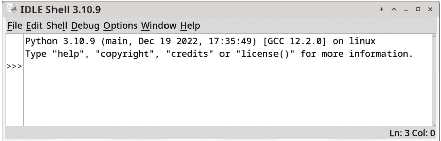

# Beej 的 Python 编程指南

面向初学者

Brian “Beej Jorgensen” Hall

v0.0.9，版权所有 © 2023年2月11日

## 目录

- 1 简介
  - 1.1 目标读者
  - 1.2 平台与工具
  - 1.3 官方主页与书籍销售
  - 1.4 电子邮件政策
  - 1.5 镜像
  - 1.6 致译者的说明
  - 1.7 版权、分发与法律
  - 1.8 献词
  - 1.9 出版信息
- 2 到底什么是编程？
  - 2.1 目标
  - 2.2 比你想象中更多的术语
  - 2.3 这里谈论的解决问题是什么？
  - 2.4 那么如何解决它？
  - 2.5 什么是 Python？
  - 2.6 总结
- 3 我需要什么软件？
  - 3.1 目标
  - 3.2 这些都是什么？
  - 3.3 安装 Python
    - 3.3.1 Windows
    - 3.3.2 Mac
    - 3.3.3 Linux/类 Unix 系统
  - 3.4 运行 IDLE
  - 3.5 你的第一条命令
  - 3.6 总结
- 4 我如何编写一个程序？
  - 4.1 目标
  - 4.2 需要解决的问题
  - 4.3 启动你的 IDE 并打开一个文件
  - 4.4 运行程序！
  - 4.5 练习
  - 4.6 总结
- 5 数据与数据处理
  - 5.1 目标
  - 5.2 数据、变量与数学
  - 5.3 从一个变量赋值给另一个变量
  - 5.4 你对计算的心智模型
  - 5.5 用户输入
  - 5.6 数据类型
  - 5.7 数据类型之间的转换
  - 5.8 输入两个数字并打印它们的和
  - 5.9 总结
  - 5.10 练习

## 目录

9.3 什么是字典？

## 目录

iv

- 13.1 目标

## 目录

## 18 附录 D：数制

### 18.1 如何像高手一样计数

## 第一章

### 简介

*这是一本处于Alpha测试阶段的书。书中难免有错误，确实如此。当你发现错误时，请在GitHub上提交issue或pull request，或者发邮件至 beej@beej.us。当错误数量减少到足够少时，我将提供印刷版本。*

大家好！你是否一直在考虑学习编程？是否也想过如何用易于上手的Python编程语言来实现？

是的？那么这本书就是为你准备的。我们将从最基础的内容开始，逐步构建知识体系，最终成为一名中级开发者和问题解决者！Python是我们将用来实现这一目标的语言。

但到本书结束时，你将掌握*超越*语言本身的编程技巧。在掌握了Python之后，也许可以尝试另一种语言，如JavaScript、Go或Rust。它们都有自己独特的特性和学习价值。

### 1.1 目标读者

初级程序员。如果你经验有限或毫无经验，这本书就是为你量身定做的！

态度前提：保持好奇、求知欲，对谜题和解决问题有敏锐的洞察力，并愿意接受困难的挑战。

技术前提：你是一名计算机用户。你知道什么是文件，如何移动和删除文件，什么是子目录（文件夹），能够安装软件，并且知道如何打字。

你是一位经验丰富的开发者，想从Python开始学习吗？很抱歉，这本书可能不是你想要的。它的进度对你来说可能太慢了。请直接查阅Python官方文档¹。

### 1.2 平台与工具

我在本书中尽力涵盖了Mac、Windows和Unix变体（通过Arch Linux）。

我们将介绍如何安装Python 3和Visual Studio Code编辑器。（两者都是免费的。）如果你已经有偏好的代码编辑器（Vim、Emacs、Sublime、Atom、PyCharm等），请随意使用。本书100%保证编辑器无关性！

### 1.3 官方主页与书籍销售

本文档的官方位置是：

- http://beej.us/guide/bgpython/

你也可以在那里找到示例代码。

### 1.4 邮件政策

我通常可以通过邮件提供帮助，所以请随时来信，但我不能保证回复。我的生活相当忙碌，有时我无法回答你的问题。在这种情况下，我通常会直接删除邮件。这并非针对个人；我只是没有时间给出你所需的详细答案。

一般来说，问题越复杂，我回复的可能性就越小。如果你能在发邮件前缩小问题范围，并确保包含所有相关信息（如平台、编译器、你遇到的错误消息，以及任何你认为可能有助于我排查问题的信息），你得到回复的可能性会大得多。更多提示，请阅读ESR的文档《如何聪明地提问》²。

如果你没有收到回复，请再深入研究一下，尝试找到答案。如果仍然找不到，请再次写信给我，并附上你已找到的信息，希望这些信息足以让我提供帮助。

现在我已经就如何写信和不要写信给你提了一些建议，我只想让你知道，我*完全*感谢多年来本指南收到的所有赞誉。这真是士气的提升，听到它被用于正途，我感到非常高兴！:-) 谢谢！

### 1.5 镜像

我们非常欢迎你镜像本站，无论是公开还是私下。如果你公开镜像本站，并希望我在主页上链接到它，请发邮件至 beej@beej.us。

### 1.6 译者须知

如果你想将本指南翻译成其他语言，请发邮件至 beej@beej.us，我会在主页上链接到你的翻译。请随意在翻译中添加你的姓名和联系信息。

本源Markdown文档使用UTF-8编码。

请注意下方“版权、分发与法律”部分中的许可限制。

如果你想让我托管翻译，请提出请求。如果你想自己托管，我也会链接到它；两种方式都可以。

### 1.7 版权、分发与法律

《Beej的Python编程指南》版权所有 © 2019 Brian “Beej Jorgensen” Hall。

除下文针对源代码和翻译的特定例外情况外，本作品采用知识共享署名-非商业性使用-禁止演绎 3.0 许可协议授权。要查看此许可证的副本，请访问

https://creativecommons.org/licenses/by-nc-nd/3.0/

或写信至 Creative Commons, 171 Second Street, Suite 300, San Francisco, California, 94105, USA。

关于许可证中“禁止演绎”部分的一个具体例外如下：本指南可以自由翻译成任何语言，前提是翻译准确，并且指南完整重印。翻译版适用与原指南相同的许可限制。翻译版也可以包含译者的姓名和联系信息。

本文档中提供的C源代码特此授予公共领域，完全不受任何许可限制。

我们鼓励教育工作者自由地向学生推荐或提供本指南的副本。

²http://www.catb.org/~esr/faqs/smart-questions.html

除非双方另有书面约定，作者以“现状”提供作品，不对作品作任何明示或暗示的陈述或保证，包括但不限于对所有权、适销性、特定用途适用性、不侵权的保证，或对不存在潜在或其他缺陷、准确性、是否存在错误的保证，无论错误是否可发现。

在适用法律要求的范围内，对于因使用作品而产生的任何特殊、附带、后果性、惩罚性或惩罚性损害赔偿，作者在任何法律理论下均不对您负责，即使作者已被告知此类损害的可能性。

更多信息请联系 beej@beej.us。

### 1.8 献词

感谢所有在过去和未来帮助我完成本指南的人。感谢所有制作我用于制作本指南的自由软件和包的人：GNU、Linux、Slackware、vim、Python、Inkscape、pandoc，以及许多其他人。最后，非常感谢成千上万写信提出改进建议和鼓励话语的读者。

我将本指南献给计算机领域中我最敬仰的英雄和灵感来源：Donald Knuth、Bruce Schneier、W. Richard Stevens 和 The Woz，献给我的读者，以及整个自由和开源软件社区。

### 1.9 出版信息

本书使用Markdown编写，编辑器为vim，运行在装有GNU工具的Arch Linux系统上。封面“艺术”和图表使用Inkscape制作。Markdown通过Python、Pandoc和XeLaTeX转换为HTML和LaTex/PDF，使用Liberation字体。整个工具链由100%自由和开源软件组成。

## 第二章

### 到底什么是编程？

### 2.1 目标

- 能够解释程序员的工作
- 能够解释什么是程序
- 能够总结解决问题的四个主要步骤

### 2.2 比你想象中更多的术语

假设你对这些东西完全陌生。你有一台电脑，知道如何使用它，但不知道如何让它完全按照你的意愿行事。

这就是*用户*和*程序员*的区别，对吧？

但*编程*计算机意味着什么？

简而言之，你有一个目标（你想要计算什么），而编程就是你实现目标的方式。

一个*程序*是完成该计算的一系列步骤的描述，等等……

好吧——换个角度想，你做*任何*事情都需要一系列步骤。比如烤饼干。

> **有趣的计算事实：** *每个人都喜欢美味的饼干。*

你通常会将这一系列步骤，即食谱，写在一张纸上。它本身肯定不是饼干。但当你将各种厨房用具、食材和烤箱应用到它上面时，很快你就会得到一些饼干。

当然，在那种情况下，*你*必须亲自动手。而在编程中，计算机为你工作。但你必须写下食谱。

食谱*就是*程序。编程就是写下那个食谱的行为，以便计算机可以执行它。然后烤出那些饼干。

嗯。饼干。

有些程序很简单。“把这12个数字加起来”就是一个例子。计算机做这个轻而易举。

但其他的则更复杂。它们可能长达数百万行，甚至数千万行，由大型团队历时多年编写。想想AAA级电子游戏或Linux操作系统。

当你刚开始时，像那样的大型程序似乎不可能完成。但秘诀在于：每个大型程序都是由更小的、精心设计的构建块组成的。而每个构建块又是由更小的相同构建块组成的。

当你开始学习成为一名程序员时，你从最小的、最基本的构建块开始，然后逐步构建。

## 第二章。编程究竟是什么？

而你不断构建！编写软件是一个终身学习的过程。*总是*有新东西要学，新技术、新语言、新技巧。这是一门需要终身发展和完善的技艺。当然，一开始你的工具箱里不会有那么多工具。但你在软件上花费的每一刻，都会让你积累更多解决问题的经验，掌握更多应对问题的方法。

### 2.3 关于解决问题的讨论是什么意思？

换句话说，我知道我想看到什么……如何用我已知的工具达到那个目标？

电影《阿波罗13号》¹中有一个我很喜欢的精彩场景。指令舱的二氧化碳过滤器耗尽了，团队想用登月舱的过滤器来替换。但前者是圆形的，后者是方形的，装不进去。当然，飞船上的维修资源有限——只有为任务准备的一些杂物。

在地面，团队手头有所有这些物品，他们把它们倒在桌子上。一名工作人员举起一个方形过滤器和一个圆形过滤器，对大家说：“我们必须想办法让*这个*装进*这个*的洞里。”然后他指着桌子补充道：“只能用*那个*。”

编程也是如此，只不过，显然且幸运的是，没有生命危险。（通常情况下。）

你手头有一套有限的编程技术，而你有一个想要实现的目标。如何仅用这些工具达到那个目标？这是一个谜题！

### 2.4 那么如何解决呢？

> *有趣的编程事实：* 大多数开发者在第一次面对问题时都不知道如何解决。他们必须系统地攻克它。

程序员完全打算使用一种经过深思熟虑的方法来解决任意问题。实际上，他们常常兴冲冲地跑开，在完成一些非常重要的初步工作之前就直接投入编码，但由于他们如此热爱编程，似乎并不介意浪费时间。

（而且这也不是浪费时间，因为你编程的每一秒都在学习！）

但许多*老板*确实认为无计划的开发是浪费时间。时间也被称为“金钱”，对于雇佣你的公司来说。而比金钱更珍贵的只有一样东西，那就是更多的金钱。

想象一下，你说：“我想造一架飞机！”然后跑开，买了一堆工具、金属、铆钉和杠杆，立刻开始组装。过了一会儿你可能会发现，哦，你应该在建造机身之前先弄清楚引擎有多大，但是，嘿，没问题，你有时间。你可以重建机身。于是你照做了。但现在座舱盖不合适了。所以你必须再次重建，如此循环。

如果你在开始建造之前真正*计划*好要做什么，本可以节省大量时间。

软件也是一样。

> *有趣的编程谚语：* 几小时的调试可以为你节省几分钟的规划。

市面上有几种问题解决框架。这些是处理编程问题并解决它的蓝图，即使你第一次看到问题时完全不知道如何解决。

我最喜欢的问题解决框架之一是由数学家乔治·波利亚在1945年他的著作《怎样解题》中推广的。它最初是为解决数学问题而写的，但令人惊讶的是，它几乎对解决任何问题都非常有效。四个主要步骤是：

1.  **理解问题。** 弄清楚问题的所有部分。将其分解为子问题，再将这些子问题进一步分解。如果你不理解问题，你提出的任何解决方案都将是解决错误的问题！当你能够向某人完全解释清楚时，你就知道你理解了问题。

2.  **制定计划。** 你打算如何利用手头的工具和已知的技术来攻克这个问题？当你能够轻松地将计划转化为代码时，你就知道计划制定完成了。

    通常在计划过程中，你会意识到对问题的某些方面理解不透彻。只需暂时回到步骤1，直到弄清楚，然后再回来继续计划。

3.  **执行计划。** 将你的计划转化为代码并使其运行。

    通常在这个阶段，你会发现要么有某些东西你没理解，要么计划没有考虑到某些情况。退后一步或两步，直到问题解决，然后再回到这里。

4.  **回顾。** 回顾你成功运行的代码，思考哪些地方做对了，哪些地方做错了。下次你会怎么做？在编写代码的过程中你学到了哪些技巧？有没有什么地方可以更好地组织结构，或者有没有什么地方可以删除冗余代码？

巧妙之处在于，开发者将问题解决的步骤应用于*整个程序*，同时也应用于程序*内部*的较小问题。一个大的计算问题总是由许多子问题组成！问题解决框架被用于问题解决框架之中！

一个现实生活中的问题例子可能是“建造一栋房子”。但它由子问题组成，比如“打地基”、“搭建墙体框架”和“加盖屋顶”。而这些又由子问题组成，比如“平整场地”和“浇筑混凝土”。

在编程中，我们将问题分解为越来越小的子问题，直到我们知道如何用已知的技术解决它们。如果我们不知道解决它的技术，我们就去学习！

成为一名开发者与成为一名问题解决者是一样的。问题并不容易，但这就是为什么它报酬丰厚。

所以你应该预料到，无论何时你在本书中、在编程挑战网站上、在学校或工作中看到一个编程问题，答案都不会是显而易见的。你将不得不努力工作，花费大量时间完成最初的问题解决步骤，然后才能准备好开始编码。

### 2.5 什么是Python？

Python是一种*编程语言*。这意味着它大致上人类可读，而机器则完全可读。（只要你不出最微小的错误！）这是一个很好的组合，因为人类不擅长阅读机器使用的实际1011010100110代码。我们使用这些*高级*语言来帮助我们应付。

在这种情况下，另一个叫做Python*解释器*的软件会获取我们用Python语言编写的代码并运行它，执行我们请求的操作。

所以在我们开始之前，我们需要安装Python解释器。这是整本书中最烦人、最痛苦的部分之一，但幸运的是，它只需要做一次。

好了，伙计们！让我们开始吧……完成它！

……我真的需要改进一下那段励志演讲的结尾。

### 2.6 总结

- 程序员是问题解决者。然后他们编写程序来实现该问题的解决方案。
- 程序是一系列可以由计算机执行以解决问题的指令。
- 主要的问题解决步骤是：理解问题、制定计划、执行计划、回顾。

## 第三章。我需要什么软件？

### 3.1 目标

- 安装Python，并解释它的作用。
- 了解什么是*集成开发环境*（IDE）。

### 3.2 这些都是什么？

Python是一种*编程语言*。它解释你，程序员，给它的指令，并执行它们。可以把它想象成一个你可以提前给它一系列命令的机器人，然后让它自己跑开去执行。

用程序员的术语来说，我们把这些指令集称为*代码*。

除了是一种编程语言，Python本身也是一个程序！它是一个运行其他程序的程序！我们完全不必担心其中的细节，只是因为Python是一个程序，所以我们需要在我们的计算机上安装它。

Python有不同的版本。主要版本是2和3。本书中的所有内容都将使用Python 3。Python 2较旧，在新项目中很少使用。

Python还附带一个*集成开发环境*，或IDE。IDE是一个帮助你编写、运行和调试（消除错误）代码的程序。

它的主要组件是：

- *编辑器*。这就像一个文字处理器，但专门设计用于处理代码。
- *调试器*。这可以帮助你逐行执行代码，并在执行过程中观察数据值的变化。它可以帮助你找到代码不正确的地方。
- *控制台*或*终端*。这是一个窗口，你的程序输出会显示在这里（你也可以在这里向程序输入内容）。

Python内置IDE的名称是*IDLE*。我们稍后会讨论其他IDE。

### 3.3 安装Python

#### 3.3.1 Windows

有两种方法可以做到：

- 从Microsoft Store安装。
- 从官方网站安装。

我看不出从商店安装有什么缺点。只需记住安装Python 3（而不是Python 2）。

#### 3.3.2 Mac

从官方网站²下载并安装适用于 Mac 的 Python。

在 Mac 上安装 Python 的另一个选项是通过 Homebrew。我们稍后会介绍这个方法。

#### 3.3.3 Linux/Unix-like 系统

Linux 社区通常对想要安装软件的人非常支持。在搜索引擎中搜索类似 `ubuntu install python3` 的内容，将 ubuntu 替换为你使用的发行版名称。

### 3.4 运行 IDLE

现在我们首次运行 IDE。首先，我们将了解如何在各种平台上运行它，然后我们将在其中运行一些 Python 代码。

运行 IDLE 取决于平台：

| 平台 | 命令 |
| :--- | :--- |
| Windows | 点击开始菜单并输入 “idle”。它应该会出现在选择列表中，你可以点击打开它。 |
| Mac | 按下 CMD-SPACE 并输入 “idle”。它应该会出现在选择列表中，你可以点击打开它。 |
| Unix-like | 在终端中输入 `idle` 或在桌面下拉菜单中找到它。 |

如果你在命令行中运行 `idle` 并提示找不到命令，请尝试运行 `idle3`。

如果你在命令行中遇到如下错误：

```
** IDLE can't import Tkinter.
Your Python may not be configured for Tk. **
```

你将需要安装 Tk 图形工具包。这可能是一个名为 `tk` 或 `python-tk` 的包。如果你使用的是 Unix-like 系统，请搜索如何在你的系统上安装。在使用 Homebrew 的 Mac 上，你可以运行 `brew install python-tk`。

如果你遇到其他错误，请将该错误复制并粘贴到你常用的搜索引擎中，看看其他人是如何解决的。

一旦 IDLE 启动，你应该会看到一个大致如下的窗口：

### 3.5 你的第一条命令

在 IDLE 窗口中 `>>>` 提示符后，输入：

```
print("Hello, world!")
```

然后按回车键。这会命令 Python 输出 “Hello, world!” 这几个字。

```
>>> print("Hello, world!")
Hello, world!
```



图 3.1：IDLE 窗口

它成功了！
这仅仅是个开始！

### 3.6 总结

- 集成开发环境（IDE）包含编辑器、调试器和终端窗口。
- IDE 中的代码编辑器是你输入程序的地方。
- 程序，也称为 *代码*，是一系列 Python 将执行的指令。
- Python 是一个将运行你的 Python 程序的程序！

## 第 4 章

### 我如何编写一个程序？

### 4.1 目标

- 在 IDLE 编辑器中编辑一些源代码。
- 运行该程序。

### 4.2 需要解决的问题

让我们使用我们的问题解决框架！

1. **理解问题**：我们想编写一个程序，在屏幕上打印一条简洁的小消息。
2. **制定计划**
   1. 运行 IDLE。
   2. 从文件下拉菜单中打开一个新文件。
   3. 编写代码并将其保存到该文件中。
   4. 在 IDE 中运行你的程序。
3. **执行计划**：这就是我们执行计划的地方。我们将在以下部分中完成。
4. **回顾**：我们也会在下面进行。在未来的章节中，我们将省略最后两个编号列表项，直接在后续部分中完成。

让我们开始吧！

### 4.3 启动你的 IDE 并打开文件

按照上一章的讨论运行 IDLE。

进入后，我们将创建一个新文件。

过去，每个使用计算机的人都知道文件是什么。但如今，许多人使用计算机多年却从未接触过这个概念。

所以！*文件* 是一个带有名称的数据集合。文件的例子包括图像、电影、PDF 文档、音乐文件等等。

名称通常表示文件内容的一些信息。通常如此。它实际上可以是任何东西，但那会具有误导性，就像把一盒葡萄干标记为 “巧克力” 一样。

名称通常分为两部分，由一个句点分隔。第一部分是名称，第二部分是 *扩展名*。令人困惑的是，有时人们将名称和扩展名统称为 “名称”，因此你需要根据上下文来判断。

有时，根据系统的不同，扩展名是可选的。

例如，这是一个完整的文件名和扩展名：

第 4 章。我如何编写一个程序？

11

```
{.default} hello.py
```

这里我们有一个名为 hello 的文件和一个扩展名 .py。这是一个常见的扩展名，意思是 “这是一个 Python 源代码文件”。

点击 “文件 → 新建”，这将打开一个空白窗口。

让我们输入一些代码！

在编辑器中输入以下内容¹（下面的行号仅供参考，不应输入）：

```
1 print("Hello, world!")
2 print("My name's Beej and this is (possibly) my first program!")
```

我们（几乎）准备好运行了！

### 4.4 运行程序！

在编辑器窗口中按 F5（在 Mac 上可能需要按 fn-F5）来运行代码。或者，你可以点击 “运行” 菜单并选择 “运行模块”。

如果你还没有保存文件，它会提示你保存文件。（你可以点击 “文件 → 保存”，或者按 COMMAND-S 或 CTRL-S 来预先完成此操作。）

给它一个好名字，比如 hello.py。

然后，在控制台窗口中，你会看到输出出现！[天使合唱！]

```
Hello, world!
My name's Beej and this is (possibly) my first program!
```

你错过了吗？再按一次 F5，你会再次看到它出现。

你刚刚编写了一些指令，计算机就执行了它们！

接下来：编写一个《雷神之锤 III》的克隆！

好吧，也许我可能跳过了一些中间步骤，但是，正如欧比旺·克诺比曾经说过的，“你已经迈出了进入更大世界的第一步。”

### 4.5 练习

记住使用四个问题解决步骤来解决这些问题：理解问题、制定计划、执行计划、回顾以查看哪些地方可以做得更好。

1. 创建另一个名为 dijkstra.py 的程序，打印出你最喜欢的三条艾兹格·迪科斯彻的名言²。

### 4.6 总结

- 使用问题解决框架！
- 在 IDLE 编辑器中编辑一些源代码。
- 在 IDLE 中运行该程序。

## 第 5 章

### 数据与数据处理

### 5.1 目标

- 理解数据是什么以及如何使用它
- 理解变量是什么以及如何使用它们
- 利用变量存储信息
- 在屏幕上打印变量的值
- 进行基本数学运算
- 将键盘输入存储在变量中
- 了解整数与字符串数据类型
- 在数据类型之间进行转换
- 编写一个输入两个值并打印其和的程序

在本章中，我们想编写一个程序，从键盘读取两个数字并打印出这两个数字的和。

### 5.2 数据、变量与数学

问题解决步骤：**理解问题。**

*数据* 是我们用来描述存储在计算机中的信息的通用术语。在编程的情况下，我们感兴趣的是我们将要对其执行操作的值。比如相加。或者变成一个视频游戏。

实际上，数据就是信息。你能从一个符号中提取信息吗？那么它就是数据。有时它是一个像 “8” 这样的符号，或者可能是一串像 “cat” 这样的符号。

作为软件开发人员，你的目标是编写操作数据的程序。你必须以能够实现所需输出的方式操作输入数据。并且你必须解决如何做到这一点的问题。

在程序中，数据通常存储在我们称为 *变量* 的东西中。如果你学过任何代数，你就会熟悉一个代表值的字母，比如直线的 “斜截式” 方程：

$$y = mx + b$$

或者抛物线的：

$$y = x^2$$

但要小心！在编程代码中，变量的行为不像数学方程。相似，但不同。

在你的编辑器中输入以下代码到一个新程序中，保存它，然后运行一下。（这就像你在前面章节中做的程序一样。你可以随意命名这个程序。如果需要

### 5.2 变量

在 Python 中，*变量指的是值*。在上面代码的第 1 行，我们说的是“变量 x 指向值 34”。另一种可能更符合其他语言习惯的理解方式是，x 是一个可以放入值的“桶”。

然后 Python 移动到下一行代码并执行它，将 34 打印到屏幕上。接着在第 3 行，我们在这个“桶”里放入了不同的东西。我们将 90 存储在 x 中。34 就消失了——这种“桶”一次只能容纳一个东西。

因此输出将是：

```
34
90
```

你可以看到变量 x 是如何被使用和重复使用来存储不同的值的。

> *我们使用 x 和 y 作为变量名，但它们可以由任何字母或字母组合、数字组成，也可以包含下划线 (_)。唯一的规则是它们不能以数字开头！*

*以下都是有效的变量名（当然，你可以随意起任何名字！）：*

```
y
a1b2
foo
Bar
F00BAZ12
Goats_Rock
```

你也可以对数字变量进行基本的数学运算。在上面的代码中添加：

```
1 x = 34      # 变量 x 被赋值为 34
2 print(x)
3 x = 90      # 变量 x 被赋值为 90
4 print(x)
5
6 y = x + 40  # y 被赋值为 x + 40，即 90 + 40，或 130
7 print(x)    # 仍然是 90！这里没有变化
8 print(y)    # 打印 "130"
```

在第 6 行，我们引入了一个新变量 y，并将其值设为“x 的值加上 40”。

> *文件中所有这些 # 号是什么？我们称之为井号，在 Python 中，它们意味着该行的其余部分是注释，会被 Python 解释器忽略。*

关于变量，最后一点很重要：当你像上面第 6 行那样进行赋值时：

```
y = x + 40  # y 被赋值为 130
```

当你这样做时，y 就指向值 130，即使 x 后来发生了变化。赋值只发生一次，即在该行代码执行时，使用的是那一刻 x 的值，仅此而已。

让我们进一步扩展这个例子来演示：

```
1 x = 34      # 变量 x 被赋值为 34
2 print(x)
3 x = 90      # 变量 x 被赋值为 90
4 print(x)
5
6 y = x + 40  # y 被赋值为 x + 40，即 90 + 40，或 130
7 print(x)    # 仍然是 90！这里没有变化
8 print(y)    # 打印 "130"
9
10 x = 1000
11 print(y)    # 仍然是 130！
```

尽管我们在代码中较早的位置写了 y = x + 40，但在该代码执行时 x 是 90，因此 y 被设置为 130，直到我们再次给它赋值。将 x 改为 1000 并**不会**神奇地将 y 变为 1040。

*有趣的税务小知识：* 1040 表格几乎是我最不喜欢的税务表格。

为了更多数学乐趣，你可以使用以下运算符（还有更多，但这些足够入门了）：

| 功能 | 运算符 |
| --- | --- |
| 加法 | + |
| 减法 | - |
| 乘法 | * |
| 除法 | / |
| 整数除法 | // |
| 指数 | ** |

你也可以像在代数中一样使用括号来强制表达式的某一部分先进行计算。正常的数学运算顺序规则适用。

```
8 + 4 / 2   # 8 + 4 / 2 == 8 + 2 == 10
(8 + 4) / 2 # (8 + 4) / 2 == 12 / 2 == 6
```

你曾以为所有那些代数都没用……*啧！*

编程中有一个常见的模式，比如你想给一个变量加上 5。无论它现在是什么值，我们都想让它比现在多 5。

我们可以这样做：

```
x = 10

x = x + 5  # x = 10 + 5 = 15
```

这个模式非常常见，以至于我们有一个简写可以使用。

这两行是等价的：

```
x = x + 10
x += 10
```

以下也是等价的：

```
x = x / 5
x /= 10
```

以下是 Python 中可用的一些算术赋值表达式：

| 运算符 | 含义 | 用法 |
| --- | --- | --- |
| += | 加并赋值 | x += y |
| -= | 减并赋值 | x -= y |
| *= | 乘并赋值 | x *= y |
| /= | 除并赋值 | x /= y |
| %= | 取模并赋值 | x %= y |

开发者们经常使用这些。如果你有 x = x + 2，请改用 x += 2！

### 5.3 从一个变量赋值给另一个变量

让我们看看这段代码：

```
x = 1000
y = x
```

这里发生了一些有趣的事情，我希望你记下来。现在它可能不是超级有用，但当我们以后接触到更复杂的数据类型时，它就会派上用场。

当你这样做时，x 和 y 都指向同一个 1000。

这句话听起来有点怪。

但可以这样想。计算机内存中的某个地方存储着值 1000。而 x 和 y 都指向这个单一的值。

如果你这样做：

```
x = 1000
y = 1000
```

现在就有两个 1000 值了。x 指向一个，y 指向另一个。

最后，在原始示例的基础上添加：

```
x = 1000
y = x
y = 1000
```

这里发生的情况是：首先有一个 1000，x 指向它。

然后我们将 x 赋值给 y，现在 x 和 y 都指向同一个 1000。

但接着我们将一个*不同的* 1000 赋值给 y，所以现在有两个 1000，分别由 x 和 y 引用。

（这方面的细节比我这里提到的要微妙得多。如果你足够疯狂，可以看看附录 C。）

要点：变量只是内存中项目的名称。你可以将一个变量赋值给另一个变量，让它们都指向同一个项目。

我们只是提前把这个概念放进你的脑子里，以便以后可以重新激活它。

### 5.4 你的计算思维模型

问题解决步骤：**理解问题**。

这一点很重要，请注意。

当你编程时，保持一个关于程序运行时*应该*发生什么的思维模型是很重要的。

让我们以之前的例子为例。在脑海中一步一步地执行它。在执行过程中跟踪系统的*状态*：

```
1  x = 34      # 变量 x 被赋值为 34
2  print(x)
3  x = 90      # 变量 x 被赋值为 90
4  print(x)
```

在我们开始之前，x 没有值。所以在脑海中将其表示为“x 没有值；它是无效的”。

然后第一行运行。

x 现在是 34。

然后第二行运行。

x 仍然是 34，我们将其打印出来。（所以打印了 34。）

然后第三行运行。

x 不再是 34。它现在是 90。34 消失了。

然后第四行运行。

x 仍然是 90，90 被打印出来。

然后我们没有代码了，程序退出。屏幕上留下了我们打印时的“34”和“90”。

*这就是*保持计算思维模型。

这是能够调试的*关键*。当你的计算思维模型显示的结果与实际程序运行不同时，你的代码某处就有 bug。你必须深入代码，找到你的思维模型与实际程序运行*第一次*出现分歧的地方。那就是你的 bug 所在。

### 5.5 用户输入

问题解决步骤：**理解问题**。

我们想从用户那里获取输入并将其存储在一个变量中，以便我们可以对其进行处理。

记住，我们本章的目标是编写一个程序，从键盘接收用户输入的两个值，并打印它们的和。

Python 有一个内置的*函数*，允许我们获取用户输入。它被称为 `input()`，这并非巧合。

但是等等——什么是函数？

函数是一段代码块，当你*调用*它时（即当你请求它时），它会为你做一些事情。函数接受*参数*，你可以*传入*这些参数来改变函数的行为。此外，函数会*返回*一个值，你可以在函数完成工作后从函数中获取这个值。

所以这里我们有 `input()` 函数，当你调用它时，它会从键盘读取输入。作为一个参数，你可以传入一个*提示*，在用户准备输入时显示给他们。它会返回用户输入的任何内容。

我们如何处理这个返回值？我们可以将其存储在一个变量中！让我们试试！

这是另一个程序，`inputtest.py`：

```
1  # 获取 `input()` 返回的任何内容并将其存储在 `value` 中：
2
3  value = input("Enter a value: ")
4  print("You entered", value)
```

我们可以这样运行它：

`input()` 是我们所说的 Python *内置*函数。它随语言提供，我们可以使用它。稍后我们将学习从头开始编写自己的函数！

https://beej.us/guide/bgpython/source/examples/inputtest.py

### 5.6 数据类型

问题解决步骤：**理解问题。**

我们之前从数字开始。那相当直接。变量被赋值，然后我们就可以对它进行数学运算。

但我们在上一节看到，`input()` 返回的是我们输入的任何内容，包括“Goats rock!”，这肯定不是我听说过的任何数字。

而且，不，它确实不是数字。它是一串字符，我们称之为*字符串*。字符串就像一个单词或一个句子，例如。

等等……除了数字，还有其他类型的数据吗？是的！有很多类型的数据！我们称之为*数据类型*。

Python 为每个变量关联一个*类型*。这意味着它会跟踪变量是存储了一个整数、一个*浮点*数还是一串字符。

以下是一些示例及其关联的类型。当你将其中一个值存储在变量中时，变量会记住存储在其中的数据类型。

| 示例数据 | 英文类型 | Python 中的类型名 |
| :--- | :--- | :--- |
| 2 | 整数 | int |
| 3490 | 整数 | int |
| -45 | 整数 | int |
| 0 | 整数 | int |
| 3.14159 | 浮点数 | float |
| -13.8 | 浮点数 | float |
| 0.0 | 浮点数 | float |
| "Hello!" | 字符串 | str |
| "3490" | 字符串 | str |
| "" | 字符串（空） | str |

在上面的示例中，字符串使用双引号（"）声明，但也可以使用单引号，只要两端的引号匹配即可：

```
"Hello!" # 与 'Hello!' 相同
'Hello!' # 与 "Hello!" 相同
```

好的，这都没问题。但 `input()` 返回的是字符串还是数字？我们试用时看到两种情况都发生了，对吧？

10这是大多数计算机表示带小数点的数字（如 3.14159265358979）的方式。当你看到“浮点数”或“float”时，可以理解为“带小数点的数字”，与“整数”相对。

实际上，结果证明，input() **总是**返回一个字符串。句号。即使那是一串数字。请注意，这些东西**不是**一样的：

```
3490    # int，一个我们可以进行数学运算的数值
"3490"  # string，一串字符
```

当然，它们看起来有点像，但它们不一样*因为它们具有不同的类型*。你可以对 int 进行算术运算，但不能对字符串进行。

好吧，这真是太好了。本章的任务是从键盘获取两个数字并将它们相加，但 input() 函数只返回字符串，而我们不能对字符串进行数值相加！

我们如何解决这个问题？

### 5.7 在数据类型之间转换

问题解决步骤：**理解问题。**

如果我们不能对字符串进行数学运算，我们能否将字符串 "3490" 转换为整数 3490，然后对其进行数学运算？

可以！

事实上，我们可以在各种数据类型之间来回转换！看我们将字符串转换为数字并存储在变量中：

```
a = "3490"    # a 是字符串 "3490"
b = int(a)    # b 是整数 3490！

print(b + 5)  # 3495
```

这是如何工作的？我们调用了内置的 int() 函数并传递给它一个字符串 "3490"。int() 完成了所有艰苦的工作，将该字符串转换为整数并返回它。然后我们将返回的值存储在 y 中。最后，我们打印 b+5 的值，只是为了表明我们可以对其进行数学运算。

完美！

以下是 Python 中可用的一些转换函数：

| 函数 | 效果 |
| --- | --- |
| int() | 将参数转换为整数并返回 |
| float() | 将参数转换为浮点数并返回 |
| str() | 将参数转换为字符串并返回 |

那么……根据我们目前所知的一切，我们如何解决本章的问题：从键盘输入两个数字并打印它们的和？

### 5.8 输入两个数字并打印它们的和

问题解决步骤：**制定计划。**

我们知道：

- 如何从键盘输入字符串
- 如何将字符串转换为数字
- 如何将数字相加
- 如何打印内容

现在——我们如何将所有这些结合起来，编写一个从键盘输入两个数字并打印它们的和的程序？

## 第5章 数据与数据处理

这是问题解决的*制定计划*部分。我们不会编写代码来实现这一点。我们只会用一种叫做*伪代码*的语言（看起来有点像代码的英语）编写程序必须描述的各个步骤的大纲。

然后，当我们确信它会工作时，我们就可以真正地编写代码了。

所以在这里停下来，花点时间考虑一下完成这个任务的步骤可能是什么。

真的，花点时间，因为我马上就要剧透了。思考如何解决问题是软件开发人员获得报酬的 80%，所以你现在就可以练习。

我们知道什么？我们有什么工具可用？有什么资源？我如何将所有这些结合起来解决这个问题，就像解决一个谜题一样？

以下是一些可以完成任务的伪代码，它看起来像这样：

```
从键盘读取字符串到变量 x
将 x 转换为 int 并再次存储回 x
从键盘读取字符串到变量 y
将 y 转换为 int 并再次存储回 y
打印 x + y 的和
```

如果我们确信我们的计划是可靠的，那么是时候进入下一个阶段了。

问题解决步骤：**执行计划。**

现在让我们将每一行转换为真正的 Python。我会将伪代码作为注释添加进去，这样我们就可以看到它们是如何比较的。（源代码链接<sup>11</sup>。）

```
1  # 从键盘读取字符串到变量 x
2  x = input("Enter a number: ")
3
4  # 将 x 转换为 int 并再次存储回 x
5  x = int(x)
6
7  # 从键盘读取字符串到变量 y
8  y = input("Enter another number: ")
9
10 # 将 y 转换为 int 并再次存储回 y
11 y = int(y)
12
13 # 打印 x + y 的和
14 print("The sum of the two numbers is:", x + y)
```

将该文件保存为 twosum.py 并运行它：

```
$ python3 twosum.py
Enter a number: 9
Enter another number: 8
The sum of the two numbers is: 17
```

太简单了！让我们挑战它：

```
$ python3 twosum.py
Enter a number: 235896423496865928659832536289
Enter another number: 94673984675289643982463929238
The sum of the two numbers is: 330570408172155572642296465527
```

甚至都没费什么劲！

很好。现在，我希望你*像反派一样思考*。反派会向我们的程序输入什么会导致它崩溃？

- 负数？
- 零？
- 小数？
- 非数字，比如“goat”？

用你的程序尝试所有这些。当你尝试时会发生什么？哪些有效，哪些无效？

请注意，一个巨大的、喷涌而出的错误消息实际上是这里*最糟糕的情况*。而且它并没有那么痛苦。不要害怕尝试破坏你的代码。计算机可以处理它。只需再次运行它即可。

稍后，我们将学习捕获此类错误的技术，这样程序就不会崩溃，并向用户打印一条友好的消息，要求他们使用有效输入重试，非常感谢。

> 请注意，当程序崩溃时，在所有输出中，隐藏着程序崩溃的行号！非常、非常有用！最后一行准确地告诉你 Python 认为出了什么问题。

关键是，如果你不确定某件事会如何工作，**就试试看**。实验！破坏东西！修复东西！再次强调，计算机绝对可以处理它。它只是一个供你玩耍的大沙箱。

### 5.9 总结

问题解决步骤：**回顾**。

这个听起来很严肃的步骤是我们审视代码并决定是否有更好的方法来解决这个问题的时候。重要的是要记住*编码是一项创造性的工作*。有很多方法可以解决同一个问题。

诚然，现在你的工具箱里没有太多工具，所以你的创造力有限。但最终，在不远的将来，你会知道几种解决问题的方法，你必须权衡每种方法的利弊，并发挥创造力选择一种！

有什么可以改进的？

- 我们之前看到传入浮点数（带小数点）会崩溃。如果程序能将两个浮点数相加就好了。

我们还能做什么？

- 其他数学运算呢？

### 5.10 练习

> “你知道怎么去卡内基音乐厅吗？”
> “练习！”

宙斯说，“**本书假设你完成了所有练习！**”当宙斯说话时，人们真的应该听。

我知道，我知道。你翻到书的练习部分，然后就直接跳过了。我的意思是，我又不是在*给你打分*什么的。

但只有一种方法可以让你成为更好的开发者：练习和重复。不练习就通读这本书，就像通过阅读如何跑步来训练马拉松一样。它本身根本无法让你达到目的。

**在解决之前，抵制查看答案的冲动！** 给自己设定一个时间限制。“如果我在 20 分钟内没有解决这个问题，我可以查看答案。”那 20 分钟没有浪费——它是宝贵的解决问题练习时间。在那段时间里，你在大脑中搭建了一个脚手架，一旦你看到解决方案，它就能*承载*它。

记住使用四个问题解决步骤来解决这些问题：理解问题、制定计划、执行计划、回顾反思。

以下是具体步骤：

1.  制作一个两数求和代码的版本，使其适用于浮点数而非整数。这些数字是否总是能正确相加，还是有时会有一点偏差？教训：*浮点数运算并不总是精确的*。有时会有微小的误差。（解答<sup>12</sup>。）
2.  让程序打印出两个数的和与差。（解答<sup>13</sup>。）
3.  允许用户输入3个数字，并对这些数字进行运算。（解答<sup>14</sup>。）
4.  编写一个程序，允许用户输入 $x$ 的值，然后计算并打印 $x^2$。记住 ** 是Python中的幂运算符。3**2 等于 9。（解答<sup>15</sup>。）
5.  编写一个程序，允许用户输入 a、b 和 c，然后使用二次方程公式<sup>16</sup>求解这些值。

复习一下：对于形如：

$$ax^2 + bx + c = 0$$

的方程，你可以用二次方程公式求解 $x$：

$$x = \frac{-b \pm \sqrt{b^2 - 4ac}}{2a}$$

这一切看起来很吓人！你是否感觉大脑要宕机了？像被车灯照到的鹿一样不知所措？*没关系*。开发者在面对新问题时也会有这种感觉。真的！我们所有人都是如此！但我们知道的是，无论问题最初看起来多么困难，我们都有一个可以用来攻克它的问题解决框架。

记住：理解，计划，然后编码实现。

深呼吸。甩掉恐惧！

你绝对能做到。这并不比到目前为止的任何事情更难！开始吧！

你的程序应该将 a、b 和 c 代入上述公式，并打印出 x 的结果值。

> 确保 $b^2 \ge 4ac$，否则将没有解，并且当你尝试对负数开平方根时会得到“定义域错误”。一些有效的 $a$、$b$ 和 $c$ 测试值：5, 9, 3 或 20, 140, 60。

方程中 $-b$ 后面的 $\pm$ 符号是什么？那是“加或减”。它意味着实际上有两个方程，一个用 $+$，一个用 $-$：

$$x_{plus} = \frac{-b + \sqrt{b^2 - 4ac}}{2a} \quad x_{minus} = \frac{-b - \sqrt{b^2 - 4ac}}{2a}$$

对于给定的 $a$、$b$ 和 $c$，求解这两个方程并打印出两个答案。

那么 $b^2 - 4ac$ 的平方根呢？如何计算它？这里有一个计算2的平方根的演示程序——用它来学习如何使用 math.sqrt() 函数，然后将其应用到这个问题中。

```python
import math       # 你需要这个来访问 sqrt() 函数

x = math.sqrt(2)  # 计算 sqrt(2)
print(x)          # 1.4142135623730951
```

编写代码，嘿！你已经写出了一个求解二次方程的程序！*看招*，作业！（解答<sup>17</sup>。）

6.  前一个问题的后续：计算出 x 后，继续计算

$ax^2 + bx + c$

的值并打印出来。（你可以使用加号解或减号解——没关系，因为它们都是解。）结果应该正好是0。是吗？还是只是非常接近零？教训：*浮点数运算并不总是精确的*。有时会有微小的误差。

有时你可能会得到一个看起来像这样的数字，末尾有一个奇怪的 e-16（或 e-某个数）：

8.881784197001252e-16

这是一个浮点数，但使用了科学计数法<sup>18</sup>。那个 e-16 等同于 $\times 10^{-16}$。所以数学等价形式是：

8.881784197001252 $\times 10^{-16}$

现在，$10^{-16}$ 实际上是一个非常非常小的数字。所以如果你在浮点数末尾看到类似 e-15 或 e-18 的东西，就认为“这是一个非常小的数字，接近于零”。

（解答<sup>19</sup>。）

7.  自己再编两个练习并编写代码实现。

别担心——我们很快就会摆脱数学示例。只是目前，这大概是我们所知道的全部了。更多内容即将到来！

### 5.11 总结

本章我们涵盖了：

- 数据和变量
- 在变量中存储和打印数据
- 进行基本数学运算
- 获取键盘输入
- 数据类型及其转换
    - 字符串
    - 整数
    - 浮点数
- 全程牢记问题解决框架！

这是一个很好的开始，但还有更多内容即将到来！

## 第6章

### 流程控制与循环

### 6.1 目标

- 理解什么是流程控制
- 理解什么是条件语句
- 能够构建布尔（“布林”）表达式
- 使用 if 语句实现做决策的代码
- 使用 while 循环实现循环代码
- 使用 for 循环和 range 迭代器实现循环代码

### 6.2 章节项目规范

本章，我们想编写一个程序，要求用户输入一个5到50之间（包含5和50）的数字。
如果输入的数字超出范围，则打印错误信息并再次要求用户输入有效数字。
一旦获得数字，程序将打印出那么多连续的 # 字符。但第31位及之后的所有字符应打印为 *。（该位置之前的字符仍然是 #。）
例如，输入10将产生：
##########
而输入37将产生：
##############################*******
在我们学习实现它的技术时，请记住这个程序。

### 6.3 什么是流程控制？

问题解决步骤：**理解问题。**
什么是*流程控制*？要理解，让我们看一个简单的程序：

```python
print("Are we not drawn onward")
print("We few")
print("Drawn onward to new era?")
```

当这个程序运行时，Python会跟踪当前的指令，或者如果你愿意的话，是行。
首先，Python运行第一行。
然后它转到下一行。
然后它转到最后一行。

然后它就结束了。

有点单调，对吧？我的意思是，它每次都只是无脑地转到下一条指令。

如果你想将程序流程转移到其他地方，而不是盲目地转到下一条指令呢？

这就是你第一次体验到成为开发者意味着什么的地方。你可以要求计算机根据你指定的标准做出明智的决策。确定要指定哪些标准是程序员的工作，也是大部分困难工作所在。

最终，我们将编写这样的代码：“如果某个条件为真，做一件事”或“如果某个条件为假，做另一件事”。

但在那之前，我们必须认识一个人：乔治·布尔。

### 6.4 布尔代数与表达式

问题解决步骤：**理解问题。**

乔治·布尔¹是一个相当有趣的人物。从19世纪初的卑微出身开始，他后来发展出的数学在许多方面成为了现代计算的基础。非常了不起。

他发展的就是我们今天所说的*布尔代数*。

别担心——它比你想象的代数要简单。事实上，你已经知道它了，只是不正式，也不叫那个名字。

对于布尔，我们关心的是表达式是*真*还是*假*。然后我们可以根据它们是否为真来做出决策。

在进入计算机内容之前，让我们先做一些人类的例子。

难度：简单。这些表达式对你来说是真还是假？

- 我住在北美。
- 现在正在下雨。
- 猫比狗优越。

希望这并不特别具有挑战性。让我们通过引入*与*（AND）的概念来提高难度。对于这些，整个表达式*只有当所有子表达式都为真时*才为真。

例如，陈述“我身高超过190厘米且我年龄在30岁以下”是假的。虽然我身高超过190厘米，但我年龄并非在30岁以下，所以整个表达式是假的。

相比之下，“我喜欢狗且我喜欢摩托车”*是*真的，因为这两个子表达式都是真的。

如果两者都不为真，结果也是假的。

难度：中等。这些表达式对你来说是真还是假？

- 我住在欧洲且我年龄大于25岁。
- 现在正在下雨且现在阳光明媚。
- 猫比狗优越且狗比猫优越。

好的！让我们做一个与“与”（AND）类似的变体，即“或”（OR）。对于“或”，如果*任一或两个*子表达式为真，整个表达式就为真。

例如，我*不*喜欢跑步，但我确实喜欢骑自行车。然而，以下陈述是真的，因为至少有一个子表达式为真：“我喜欢跑步或我喜欢骑自行车”。真。

> 这是对以下问题给出自作聪明答案的基础：

“你想要汤还是沙拉？”

¹https://en.wikipedia.org/wiki/George_Boole

## 第六章 流程控制与循环

> “没错。我要汤或者我要沙拉。”
> “滚出我的餐厅，布尔狂热分子！”

难度：中级。以下表达式对你来说是真还是假？

- 我住在欧洲 OR 我年龄大于25。
- 现在正在下雨 OR 现在是晴天。
- 猫比狗优越 OR 狗比猫优越。

好了！现在还有一件事要记住：除非表达式中有括号另行指定，否则 AND 的优先级高于 OR。也就是说，先执行 AND，再执行 OR。

难度：高级。

假设现在正在下雨，我年龄超过25岁，而且这条鱼很大。我们可以评估这个表达式：

现在是晴天 AND 这条鱼很大 OR 我年龄超过25。

我们先执行 AND。现在不是晴天，但鱼很大。所以这是“false AND true”，结果为“false”。

因此，将这个 AND 表达式替换为“false”。然后我们执行 OR：

false OR 我年龄超过25。

现在我年龄超过25，所以这是“false OR true”，结果为“true”。

因此，整个表达式为真。

你可以用括号来改变优先级：

现在是晴天 AND (这条鱼很大 OR 我年龄超过25)。

先执行括号内的内容。所以我们现在评估 OR，结果为“true OR true”，即“true”。然后我们评估 AND，即“现在是晴天 AND true”，也就是“false AND true”，结果为“false”。

因此，整个表达式为假。

让我们用一些数值条件表达式来举例。这些表达式的结果是真还是假？

- 1 < 5
- 5 > 1
- 1 < 5 AND 5 < 10
- 1 > 5 OR 5 < 10
- 1 < 5 AND 5 > 10 OR 10 > 20
- 1 < 5 AND (5 > 10 OR 10 > 20)

答案：

- True
- True
- True AND True = True
- False OR True = True
- True AND False OR False = False OR False = False
- True AND (False OR False) = True AND False = False

有时开发者（但更常见的是硬件工程师）会用所谓的*真值表*来描述这些操作。真值表展示了在给定输入下，布尔表达式的结果会是什么。

这些表通常用1表示True，用0表示False²。

以下是我们目前见过的一些操作的真值表。

| A | B | A AND B |
|---|---|---|
| 0 | 0 | 0 |
| 0 | 1 | 0 |
| 1 | 0 | 0 |
| 1 | 1 | 1 |

| A | B | A OR B |
|---|---|---|
| 0 | 0 | 0 |
| 0 | 1 | 1 |
| 1 | 0 | 1 |
| 1 | 1 | 1 |

| A | NOT A |
|---|---|
| 0 | 1 |
| 1 | 0 |

²哦！1和0！二进制！就在这一刻，我们得以一窥机器深层运作的奥秘。

现在我们准备就绪。让我们学习如何在Python中实现这些。

### 6.5 Python中的布尔运算

问题解决步骤：**理解问题。**

Python中的比较运算符如下：

| 运算符 | 效果 |
|---|---|
| < | 小于，例如 x < y |
| > | 大于，例如 x > y |
| == | 等于，例如 x == y |
| != | 不等于，例如 x != y |
| <= | 小于或等于，例如 x <= y |
| >= | 大于或等于，例如 x >= y |

因此，我们可以通过将变量与数字或其他变量进行比较，将其转换为真或假的值。

在Python中，什么是真和假？

| 布尔值 | Python关键字 |
|---|---|
| True | True |
| False | False |

很简单。

让我们快速演示一下³：

```
1 print(True)    # True
2 print(False)   # False
3
4 x = 10
5 print(x == 10) # True
6 print(x < 5)    # False
7
8 # 你可以将布尔结果存储在变量中！
9 r = x >= 7
10 print(r)        # True
```

³https://beej.us/guide/bguide/python/source/examples/booltest.py

看！你可以将比较的布尔结果存储在变量中，就像我们上面用 r 做的那样！
需要注意的是，True 和 False 不是字符串。它们代表布尔值。
所以现在，关于数据类型，我们知道了字符串、整数、浮点数和布尔值（有时简称为bools）。将这些加入我们可用的工具集合中。
但是我们的好朋友 AND 和 OR 呢？

| 布尔运算 | Python关键字 |
|---|---|
| AND | and |
| OR | or |
| NOT | not |

很简单，但我加了个 NOT！那是什么？很简单：它只是反转你给它的值。“NOT true”是false。“NOT false”是true。

```
print(not False)  # 输出 True
```

看起来平淡无奇，但我们马上就会好好利用它。

### 6.6 万能的 if 语句

问题解决步骤：**理解问题。**
Python告诉我 1 < 5 是 True 当然很好，但我们如何在程序中实际利用它来做选择呢？
让我们考虑一个小程序，它允许用户输入一个数字，然后告诉用户这个数字是否在50到59之间（包含50和59）。
在编码之前，让我们思考一下如何处理。如果数字存储在 x 中，那么Python中什么样的布尔表达式会在 x 介于50和59之间时为真？
我说的是 and、or、not、< 和 >……不一定全部用到，但需要用到的那些。
你明白了吗？前方剧透！

```
x >= 50 and x <= 59  # 如果 x 在该范围内则为 True！
```

让我们利用这个知识，用 if 将其转化为一个完整的程序⁴，然后我们可以更详细地分析它：

```
1 x = input("Enter a number: ")
2 x = float(x)
3
4 if x >= 50 and x <= 59:
5     print(x, "is between 50 and 59, inclusive")
6     print("Well done!")
7 else:
8     print(x, "is not between 50 and 59, inclusive")
```

所以如果 x >=50 and x <= 59 为 True，那么我们就执行其后缩进的*代码块*。

⁴https://beej.us/guide/bguide/source/examples/ifelse1.py

代码块可以用制表符或空格的任意组合进行缩进，只要块中的每一行都以相同的制表符或空格模式开头即可。官方建议是**使用4个空格进行缩进**。

Python中的缩进代码块是大多数开发者对其爱憎分明的事情之一。就个人而言，我认为无论你对语言的特性有何感受，都应该成为任何语言的好开发者。

那么这个烦人的 else 是什么呢？这是 if 的一个超级方便的功能。如果条件为 False，那么就会执行 else 下的代码块。基本上，我们是在说，“如果条件为真，那么执行这个，否则执行那个。”

在 if-else 家族中，我们还可以使用另一种结构：elif。这是 else if 的缩写，当你需要检查多个条件时使用。

```python
if x < 10:
    print("x is less than 10")
elif x < 20:
    print("x is less than 20")
elif x < 30:
    print("x is less than 30")
else:
    print("x is greater than or equal to 30")
```

在这个例子中，我们首先检查 x 是否小于10。如果为假，则测试下一个条件，依此类推。如果都不匹配，那么我们就执行 else 的情况。

if 语句是我们能够使用布尔逻辑来控制程序流程的核心。这就是计算机如何根据输入做出决策的方式。没有 if，就没有计算——它就是如此重要！

而你作为开发者的任务，就是构思出那些逻辑，那些 if 语句和条件，使你的程序能够为给定的输入产生正确的输出。

### 6.7 接下来：while 循环！

问题解决步骤：**理解问题。**

我们将稍微偏离一下，讨论编程中另一个重要的概念：循环。循环允许我们重复执行同一段代码，而无需重复编写。

这是一个现实生活中的例子。假设你需要给屋顶铺一些瓦片。步骤是放置一块瓦片，将其钉好，然后移动到下一个位置。

铺设四块瓦片的指令可能是：

- 放置一块瓦片
- 将其钉好
- 移动到下一个位置
- 放置一块瓦片
- 将其钉好
- 移动到下一个位置
- 放置一块瓦片
- 将其钉好
- 移动到下一个位置
- 放置一块瓦片
- 将其钉好
- 移动到下一个位置

但这冗长得令人烦恼。这样做会更好：

- 当我们还没有铺完4块瓦片时：
  - 放置一块瓦片
  - 将其钉好
  - 移动到下一个位置

这就是我们*循环*。我们在条件为真时运行同一段代码。至少，这可以为我们节省大量打字时间！

Python有几种循环语句，但在本节中，我们将专注于所谓的*while循环*。它在条件为真时执行某些操作。

这是一个从1200计数到1210的例子⁵：

```
1  x = 1200
2
3  while x <= 1210:
4      print(x)
5      x += 1
6
7  print("All done!")
```

只要条件 x <= 1210 为真，它就会重复循环体（所有缩进的内容）。你会看到在循环体内，我们每次迭代都*递增*（加一）x，使其向1210增加。

如果我们不递增 x 会怎样？那样的话，它将永远循环下去。我们称之为*无限循环*。如果你的程序运行了很长时间没有输出（或重复输出），它可能陷入了无限循环。

如果你的程序陷入了无限循环，如何退出？你可以按 CTRL-C（也称为“break”）。这将使你返回到shell提示符。

记住，我们本章程序的目标之一是要求用户输入一个5到50之间的数字。如果用户输入的数字超出这个范围，我们需要再次询问。也就是说，我们需要在用户没有提供有效输入时进行循环。现在思考一下这个问题，我们稍后会回来解决它。

### 6.8 循环：for 循环

问题解决步骤：**理解问题。**

除了 *while* 循环，我们还有一种叫做 *for* 循环的强大工具。正如我们稍后会发现的，它们非常强大，但现在，我只想谈谈循环特定次数。（与条件为真时循环相对。）

这是一个使用 *for* 循环和名为 *range()* 的函数打印从0到9的数字的例子。（*range()* 返回一个叫做*迭代器*的东西。关于迭代器，我们将在后面的章节中介绍——现在，只需看看它们如何与 *for* 循环一起使用。）

```
for i in range(10):  # 从0循环到9
    print(i)
```

注意几点：

- i 是循环*索引*的经典变量名。
- 如果你有一个*嵌套循环*（循环中的循环——稍后会讲），你可以使用 j，然后是 k，等等。
- 我们循环直到达到 *range()* 参数的前一个值。包含起始值，但不包含结束值。

但是等等，还有更多！*range()* 是多才多艺的！它不仅能从零数到几乎某个数字，你还可以给它另一个起始点：

```
for i in range(5, 10):  # 从5循环到9
    print(i)
```

*现在你愿意付多少钱？它能切片，能切丁！但我们还没完！你还可以告诉 range() 每一步跳多远！*

⁵https://beej.us/guide/bguide/source/examples/while.py

## 第六章 流程控制与循环

让我们只打印出4到18之间的偶数（即从4打印到18，每次步长为2）：

```python
for i in range(4, 20, 2):  # 从4循环到18，每次步长为2
    print(i)
```

问题：假设我想用 `range()` 从10倒数到1。我该怎么做？

```python
for i in range(???, ???, ???):
    print(i)
```

你怎么想？剧透即将揭晓！

你可以给 `range()` 一个负的“步长”，让它反向遍历：

```python
for i in range(10, 0, -1):  # 从10反向步进到1
    print(i)
```

和之前一样，最终值不会包含在结果中。

> Python2 有一个额外的函数叫做 `xrange()`。Python3 没有这个函数。如果你在阅读旧的 Python2 代码时看到 `xrange()`，要知道它在 Python3 中等同于 `range()`。

现在，`for` 循环的功能远不止遍历一个范围，但那是另一个故事了。

### 6.9 何时使用 while，何时使用 for？

问题解决步骤：**理解问题。**

你应该使用哪种循环结构，以及在什么时候使用？

一般来说，选择对问题来说最简单的那个。或者让代码最容易阅读的那个。

好吧，我知道这有点笼统。

如果你想循环一个预先知道的次数，比如10次，或者 `x` 中存储的次数，那么使用带 `range()` 的 `for` 循环。

如果你只想循环直到某个条件为真或假，但你不知道那会是什么时候，那么使用 `while` 循环。

### 6.10 章节项目

让我们开始本章开头的那个项目。如果需要回顾，请重新查看项目规格说明。

问题解决步骤：**制定计划。**

让我们把这个程序分成两部分，然后分别处理。

1. 我们想获取一些在5-50范围内（包含边界）的有效用户输入。
2. 我们想根据输入打印出一些 `#` 和 `*`。

通过*分解问题*，我们让它更容易处理。我们甚至可以把步骤1进一步分解：

```
当用户输入无效时：
    向用户请求输入
    如果输入无效，打印错误信息
```

先别看，但我们的“计划”现在看起来已经像非常棒的伪代码了。

让我们继续编写用户输入部分的代码。打印星号的部分我们稍后再做。

问题解决步骤：**执行计划。**

向用户请求输入，我们已经知道了。

但我们如何反复询问他们，直到他们输入有效内容？我们需要循环！在输入无效时循环怎么样？当然可以！

```python
1  input_valid = False  # 假设初始无效
2
3  while not input_valid:   # 当输入无效时（“while input invalid”）
4      x = input("Enter a number, 5-50 inclusive: ")
5      x = int(x)
6
7      if x >= 5 and x <= 50:
8          input_valid = True   # 我们得到了一个有效的数字！
```

让我们研究一下这个模式，因为它是 `while` 循环的常见用法。
我们从假设成功条件未满足开始。然后我们在循环的每次迭代中，用 `if` 检查它是否满足。我们在成功条件不为真时循环。
现在，如果输入超出范围，我们还应该打印错误信息。怎么做？我们可以用两行代码完成。
如果 `if` 条件为真，那么我们得到了有效的输入。否则我们得到了无效的输入，应该打印一条消息……`if...else`！

（注意：下面的代码是上面程序的延续。注意行号！）

```python
7      if x >= 5 and x <= 50:
8          input_valid = True   # 我们得到了一个有效的数字！
9      else:
10         print("The number must be between 5 and 50, inclusive!")
11
```

如果你还没有，请编写并运行它。不，这不是完整的程序，但它是程序的完整第一步，我们可以在继续之前测试它，以确保这部分工作正常。
运行它并尝试一些数字。如果你输入一个无效的数字，它应该会告诉你并再次询问。如果你输入一个有效的数字，`input_valid` 变为 `True`，`while` 循环退出（因为继续条件是 `not input_valid`）。
一旦你确信它工作正常，让我们回到规格说明，专注于打印星号。

问题解决步骤：**制定计划。**
如果用户输入 `x`，我们想总共打印出 `x` 个字符。其中前30个是 `#`，之后的任何字符都是 `*`。
在我们开始之前，让我们使用一种不同的规划技巧：*简化问题*。
让我们暂时忘记 `*`，只打印 `#` 字符，无论用户指定多少。稍后我们将添加 `*` 的代码。

> 简化问题可以让你更容易地处理它，并引导你看到以后添加缺失功能的方法。

这个简化阶段的计划并不难：
无论用户输入多少个数字：
打印一个 `#`。

问题解决步骤：**执行计划。**
既然我们知道要打印多少个 `#`（用户输入了数字！），这将是使用 `for` 循环的好地方。让我们打印它们：

```python
12 # 打印这一行
13 for i in range(x):
14     print("#")
```

运行它！效果如何？

嗯。看起来它在每一行打印一个井号。`print()` 函数在行尾添加一个*换行符*。我们需要覆盖这个行为，有一个简单的方法可以做到。

```python
# 打印这一行
for i in range(x):
    print("#", end="")  # 将行尾字符设置为空

print()  # 在行尾添加一个换行符
```

我们在这里做了一点魔法。我们向 `print()` 传递了另一个参数，告诉它我们希望在行尾放什么都没有（一个空字符串 `""`），而不是它通常附加的换行符。

你可以疯狂地说 `end="Beej"`，它会在每个井号后放上单词“Beej”。去做吧。疯狂一下。

快完成了！但我们还没完全脱离困境。我们需要让超过30个字符的部分打印 `*` 而不是 `#`。

问题解决步骤：**制定计划。**

这就像之前打印行的计划，但我们简化了它，记得吗？所以我们必须增加一些复杂性以满足规格说明。

```
无论用户输入多少个数字：
    如果我们处于第30个字符或更早：
        打印一个 `#`。
    否则：
        打印一个 `*`。
```

这看起来是 *for* 循环中使用 *if* 的好案例！

问题解决步骤：**执行计划。**

让我们在末尾的 *for* 循环中添加那个 *if* 逻辑：

```python
# 打印这一行
for i in range(x):
    if i < 30:
        print("#", end="")  # 将行尾字符设置为空
    else:
        print("*", end="")

print()  # 在行尾添加一个换行符
```

这里有一些微妙而重要的事情需要注意：

- 如果用户输入40，`i` 的值从0运行到39，因为当 `i` 达到其最大值时，*for* 循环的主体不会执行。
- 但0到39仍然是40次迭代，对吧？就像0,1,2,3总共是4次迭代一样。所以即使计数器从0运行到39，我们仍然得到所有40个字符。
- 然而，由于计数器从0开始，这意味着将是 `#` 的最高字符出现在 `i` 为29时，而不是 `i` 为30时。这就是为什么我们测试 `i < 30` 而不是 `i < 31`。

但我们做到了！

一定要测试*边界情况*。这些是处于程序条件边缘的输入。

例如，我们有条件测试输入是否在5和50之间。所以用4、5、50和51进行测试，覆盖这些条件的两侧。

代码中还有其他边界情况吗？对了：打印时的 *if*。前30个应该是 `#`，之后是 `*`。所以用30测试，确保全是 `#`，然后用31测试，确保有一个 `*`。

*测试边界情况*是一种强大的编程技巧，所有开发者都有效地使用它。

6我们也可以测试 `i <= 29`。

而且，趁你还在，测试一堆其他数字，确保它的行为符合你的预期。

**附加问题：** 你能想到另一种不使用循环内 `if` 来绘制字符行的方法吗？（这个脚注<sup>7</sup>里有一个提示。）*编码是创造性的！* 做这些事情不止一种方法。尝试它们，看看你更喜欢哪一种。

（解决方案<sup>8</sup>。）

### 6.11 练习

**记住：要从这本书中获得价值，你必须做这些练习。** 在一个问题上卡住20分钟后，你可以查看解决方案。

**始终**使用四个问题解决步骤来解决这些问题：理解问题、制定计划、执行计划、回顾以查看本可以做得更好的地方。

1. 打印出从1到（包括）10000的数字之和。（解决方案<sup>9</sup>。）
2. 打印出0到99之间（包括）所有 `x` 的 `x` 和 `x**4` 的值。（解决方案<sup>10</sup>。）
3. 要求用户输入一个数字，或单词 `quit`。如果用户输入一个数字，打印出该数字乘以10的结果。如果用户输入 `quit`，程序应完成。（解决方案<sup>11</sup>。）
4. 提示用户输入两个数字。打印出这两个数字之间（包括）的所有奇数。（解决方案<sup>12</sup>。）
5. 打印出从1到100的数字。但如果数字能被3<sup>13</sup>整除，则打印 `Fizz`。如果数字能被5整除，则打印 `Buzz`。如果数字能被3和5整除，则打印 `FizzBuzz`<sup>14</sup>。解决这个问题有很多方法。（解决方案<sup>15</sup>。）
6. 自己再编两个练习并编写代码。

### 6.12 总结

本章我们涵盖了各种超级重要的内容。

- 流程控制
- 布尔代数、条件表达式、`True`、`False`
- `if-else`
- `while` 循环和 `for` 循环
- 关于测试边界情况的一点内容

猜猜怎么着！你现在知道的 Python 语法足以解决任何计算问题了！我不是在开玩笑<sup>16</sup>！

看，重要的不是知道所有的语法；而是能够弄清楚如何以正确的方式将它们组合在一起。

话虽如此，我们还没有学到足够的 Python 语法，不一定能让解决每个计算问题都变得*容易*。在接下来的章节中，我们将学习更多 Python 提供给你的工具，以扩大你的问题解决工具包。

## 第7章

### 字符串

### 7.1 目标

- 牢固掌握字符串的概念
- 从其他类型转换为字符串
- 连接字符串
- 理解字符串是不可变的
- 通过字符串获取单个字符
- 切片字符串
- 使用 `for` 循环遍历字符串
- 使用基本的字符串操作方法和函数
- 使用格式化输出打印字符串

### 7.2 章节项目规范

计算并打印出乘法表。允许用户输入一个1到19之间（包含1和19）的数字，然后打印出到该数字为止的乘法表。

例如，如果用户输入4，输出应为：

```
1   2   3   4
2   4   6   8
3   6   9  12
4   8  12  16
```

请确保为最大乘积中所需的最大位数留出足够的空间。

### 7.3 什么是字符串？

问题解决步骤：**理解问题。**

Python中的字符串是字符（字母、标点符号、数字、外来字符等）的序列。你可以用单引号（'）或双引号（"）将其括起来，只要两边匹配即可。

以下是一些字符串示例：

```
"Hello!"
"This is test #37"
"3490"              # 数字字符串
" "                 # 空格字符串
""                  # 空字符串，0个字符
"Beej's String"     # 包含撇号的字符串
'Beej says, "hi!"'  # 包含双引号的字符串
```

你也可以在双引号字符串中嵌入双引号（或在单引号字符串中嵌入单引号），只需在它们前面加上反斜杠字符（\）。这称为*转义*字符，意思是“嘿，Python，把这个当作字面引号——只打印一个引号出来”，而不是“嘿，Python，这是字符串的结尾”。

```
'Beej\'s string'       # 等同于上面的例子
"Beej says, \"hi!\""
```

字符串通常在以下情况下使用：

- 在屏幕上打印字符
- 使用 `input()` 从键盘读取
- 从文件读取/写入数据（称为*文件I/O*，即*文件输入/输出*的缩写）。
- 网络I/O

### 7.4 创建字符串

问题解决步骤：**理解问题。**

字符串通常通过以下两种方式之一创建：

- 声明一个*字符串常量*
- 从函数获取一个字符串

前者我们已经见过。以下是另一个字符串常量的例子：

```
x = "This is a constant string!"
```

但我们也已经见过产生字符串的函数：

```
y = input("Enter a string: ")
```

`input()` 返回一个字符串，该字符串被存储在 `y` 中。

但是等等——那里显然也有一个常量字符串！提示符 "Enter a string:" 就是一个字符串！到处都是字符串！

稍后我们将学习文件和网络I/O以及它们如何与字符串和其他数据类型一起使用。但现在，我们将坚持一些基础知识。

### 7.5 将其他类型转换为字符串以及反向转换

问题解决步骤：**理解问题。**

我们在前面的章节中已经提到过这一点，但值得再次复习。

你可以使用 `str()` 函数将许多其他类型转换为字符串。我们稍后将看到如何利用这一点。

示例：

```
x = str(3490)    # "3490"
y = str(3.14159) # "3.14159"
z = str("Hi!")    # "Hi!"（什么也不做，因为 "Hi!" 已经是字符串了！）
```

同样，你可以使用相应的函数将字符串转换为其他类型，如 `int` 和 `float`：

```
x = int("3490")          # 整数 3490
y = float("3.14159")     # 浮点数 3.14159
```

通过这种方式，如果你有一个包含数字的字符串，你可以将其转换为数值，以便对其进行数学运算。

### 7.6 使用 + 连接字符串

问题解决步骤：**理解问题。**

你习惯于使用 + 来加两个数字，但你知道你也可以“加”字符串吗？它不是进行算术运算，而是将字符串粘合在一起，这个过程称为*连接*（cən-CA-tən-ay-shun——中间的“cat”发音像动物）。你可以*连接*两个字符串。

```
x = "Hello, "
y = "world!"
z = x + y       # z 变成 "Hello, world!"
```

这就是你将较小的字符串组合成较大字符串的方式。

你经常会发现赋值-连接运算符用于在字符串末尾添加内容：

```
x = "B"   # 从 "B" 开始
x += "e"  # 在字符串末尾添加 "e"
x += "e"  # 在字符串末尾添加 "e"
x += "j"  # 在字符串末尾添加 "j"
x += "!"  # 在字符串末尾添加 "!"

print(x)    # Beej!
```

### 7.7 期中挑战

使用我们目前所学的知识，将字符串 "Hello" 与数字 3490（一个整数，不是字符串）连接起来。

问题解决步骤：**制定计划。**

好的，让我们使用 + 将数字连接到字符串的末尾。

问题解决步骤：**执行计划。**

```
x = "Hello"
y = 3490
print(x + y)
```

但运行它，我们得到以下输出：

```
Traceback (most recent call last):
  File "foo.py", line 3, in <module>
    print(x + y)
TypeError: can only concatenate str (not "int") to str
```

让我们仔细看看。它告诉我们，在 foo.py 的第3行，我们有 print(x + y)，我们得到了这个错误：

```
TypeError: can only concatenate str (not "int") to str
```

y 是一个 int，但 x 是一个 str。这个错误告诉我们，我们不能将一个 int 连接到一个 str 上。现在该怎么办？

问题解决步骤：**制定计划。**

既然我们不能将一个 int 连接到一个 str 上，我们能把 int 转换成 str 吗？当然可以！新计划：使用 `str()` 函数将 int 转换为 str，然后使用 + 将其连接到第一个字符串上。

问题解决步骤：**执行计划。**

```
x = "Hello"
y = str(3490)
print(x + y)    # Hello3490
```

成功了！

问题解决步骤：**回顾。**

还有其他解决方法吗？我们也可以稍后调用 str()：

```
x = "Hello"
y = 3490
print(x + str(y))    # Hello3490
```

这样同样有效。

同时思考一个相关问题：如果你有一个字符串 "3490"，你想在算术上给它加上 1000，然后得到最终的字符串 "4490"，你需要进行哪些类型的转换和操作？

### 7.8 从字符串中获取单个字符

问题解决步骤：**理解问题。**

如果我们想从字符串中提取单个字符怎么办？

我们可以做到，但我们需要引入新的符号来实现：[ 和 ]，即*方括号*。

让我们只打印字符串中的前两个字符：

```
x = "Beej!"

print(x[0])  # 打印位置0的字符，"B"
print(x[1])  # 打印位置1的字符，"e"
print(x[4])  # 打印位置4的字符，"!"
```

阅读这段代码时，x[1] 会读作“x sub 1”，这是对经典数学符号 $x_1$ 的致敬。这里的 1 称为字符串的*索引*。

**非常重要：** 索引号从0开始！！字符串中的第一个字符有时在口语中被称为*第零个字符*，第二个字符有时被称为*第一个字符*，然后是*第二个*、*第三个*，以此类推，以避免歧义。如果你想确保准确，可以说“索引为3的字符”。

> *有趣的索引事实：* 如今所有严肃使用的编程语言都使用从0开始的索引（即索引从0开始）。这样做有一些有用的数学含义，即使思考起来更棘手。

在这里做一些实验。尝试获取超出字符串末尾的字符？会发生什么？（我们稍后将学习如何缓解这个问题。）

如果你尝试一个负索引会怎样？你认为会发生什么？*实际*发生了什么？

事实证明，如果你在Python中指定一个负索引，它会从字符串的*末尾*开始获取字符！

```
x = "Beej!"

print(x[-1])  # 打印从末尾数第1个字符："!"
print(x[-4])  # 打印从末尾数第4个字符："e"
print(x[-5])  # 打印从末尾数第5个字符："B"
```

我们接下来在讨论切片时会用到这些。

### 7.9 切片

问题解决步骤：**理解问题。**

*切片*是字符串的一部分。你通过指定字符串的*起始索引*和*结束索引*来定义它们，并用冒号 : 分隔。

## 第7章 字符串

```python
x = "Beej!"
print(x[1:4])    # "eej"
```

切片从第一个索引号开始，到第二个索引号*之前*停止。（这让你想起了什么？是的——就像*range()*一样！）

通过这种方式，你可以从字符串中提取出任何*子串*。

### 7.10 中期挑战

问题解决步骤：**理解问题。**

编写一个程序，允许用户输入一个字符串，然后打印出*除了*第一个和最后一个字符之外的整个字符串。你可以假设字符串至少有3个字符长。

所以，如果用户输入Beej!，我们想打印出eej。如果他们输入Python，我们想打印出ytho。

问题解决步骤：**制定计划。**

我们需要：

- 1. 输入一个字符串。
- 2. 获取一个不包括第一个和最后一个字符的字符串切片。
- 3. 打印这个切片。

步骤1和3非常直接。但是步骤2呢？

由于我们不知道字符串会有多长（只知道它至少有三个字符），我们不能简单地从1到，比如说，5获取一个切片。我们必须从索引1获取到倒数第二个字符。

幸运的是，我们知道如何索引到倒数第二个字符：索引-2！但是等等——这里有个陷阱：切片只到第二个索引，但不包括它！所以我们需要在索引-1处结束切片，以使其不包括最后一个字符。

问题解决步骤：**执行计划。**

```python
1  x = input("Enter a string of at least 3 characters: ")
2  y = x[1:-1]   # all but the first and last
3  print(y)
```

非常简单！

问题解决步骤：**回顾。**

我们本可以做得更好吗？

我们不需要中间变量y。我们可以简单地：

```python
1  x = input("Enter a string of at least 3 characters: ")
2  print(x[1:-1])   # all but the first and last
```

此外，我们实际上并没有强制用户输入至少3个字符。我们该如何做到这一点？还记得我们之前如何使用while循环来验证输入吗？我们可以做同样的事情。

但是我们如何判断一个字符串是否至少达到某个长度呢？有几种方法。事实证明，如果字符串的长度小于3，你的切片将是一个空字符串（""），你可以用它来检测。

稍后，我们还将讨论*len()*函数，它将给你传入的任何字符串的长度。

### 7.11 插曲：可变与不可变类型

问题解决步骤：**理解问题。**

到目前为止，我们已经学习了三种数据类型：整数、浮点数和字符串。所有这些都有一个共同特点：它们都是*不可变的*。（也就是说，你不能改变它们。注意，你总是可以改变变量引用的东西——也就是说，你可以将变量赋值为引用其他东西——但你不能改变不可变的东西本身。）

这意味着*任何时候你对这些类型中的任何一种进行操作，你都会得到一个新的实体*。也许旧的实体被保留，或者根据你的代码如何工作而被遗忘。

简而言之，没有办法在字符串末尾添加东西。你可以取一个字符串并在其末尾添加一些东西，从而创建一个全新的字符串，但这是一个新字符串。原始字符串永远不会被修改，因为它是不可变的。

```python
x = "hello"
y = x + " world"

print(x)  # hello
print(y)  # hello world
```

在那个例子中看到x的值没有改变吗？即使我们想改变它，我们也做不到。看看这个：

```python
x = "hello"
print(x[2])  # print character 2, namely "l"

x[2] = "z"  # ERROR! Python won't allow you to change the string!
```

如果你想创建一个字符串，其中第2个字符被替换掉，你必须将其切片并自己构建。

```python
x = "hello"
y = x[:2] + "z" + x[3:]  # Make a new string

print(y)  # hezlo
```

或者你可以使用*正则表达式*¹或其他字符串方法来替换字母……但请记住，这些方法会产生一个新的字符串——它们必须这样做，因为字符串是不可变的！

数字也是如此，尽管这种行为你可能认为是理所当然的，因为它太常见了。

```python
x = 12
y = x + 2  # This creates a new number--it doesn't change 12

print(x)  # 12
print(y)  # 14
```

就像我说的，到目前为止我们学习的所有类型都是不可变的。但稍后，我们将讨论列表、字典和集合，它们是Python中的三种可变类型。

所以请记住：任何时候你认为你正在“改变”一个字符串，你实际上是在创建一个全新的字符串。记住这个模型很重要，因为它将防止我们在学习过程中出现各种错误和误解。

### 7.12 字符串的for循环

问题解决步骤：**理解问题。**

还记得我们之前如何使用for与range()来计数到某个数字吗？事实证明，for的功能远不止于此。它充满了惊喜！

我们可以对字符串使用for循环来逐个处理字符。

```python
s = "Hello!"

for c in s:
    print("character:", c)
```

¹我们稍后会讨论正则表达式，或称regexes。

如果你运行这个，你会看到它依次打印出每个字符：

```
character: H
character: e
character: l
character: l
character: o
character: !
```

如果你需要逐个字符地遍历字符串，可以使用这个。当然，如果你只想遍历字符串的*一部分*，你可以先对其进行切片！

这里还有一个可能有用的小知识点，那就是`enumerate()`函数。它将返回一系列*索引-值对*。也就是说，它同时返回字符串的索引*和*该索引处的字符。

```python
s = "Hello!"

for i, c in enumerate(s):
    print("character at index", i, "is:", c)
```

输出：

```
character at index 0 is: H
character at index 1 is: e
character at index 2 is: l
character at index 3 is: l
character at index 4 is: o
character at index 5 is: !
```

如果你需要知道索引*和*字符，这很有用。稍后会更多地介绍`enumerate()`函数。

### 7.13 字符串函数和方法

问题解决步骤：**理解问题。**

Python有许多内置函数来帮助你操作和使用字符串。

以下是一些：

| 函数 | 示例 | 描述 |
| :--- | :--- | :--- |
| `bool()` | `bool(s)` | 转换为布尔值。唯一转换为`False`的字符串是空字符串`""`。（这意味着空字符串在`if`条件中将被视为`False`。） |
| `float()` | `float(s)` | 转换为浮点值。 |
| `input()` | `input(s)` | 打印提示符`s`，然后返回键盘输入的字符串。 |
| `int()` | `int(s)` | 转换为整数值。 |
| `len()` | `len(s)` | 返回字符串的长度。 |
| `print()` | `print(s)` | 打印一个字符串。 |

注意`len()`函数——我们将用它来告诉我们字符串中有多少个字符。

但现在我想介绍一个新术语和编码风格，你将在未来经常遇到：*方法*。

方法是作用于特定*对象*的函数。我们谈论“方法”和“对象”有点超前了，但现在可以把它们想象成作用于特定字符串的函数。

但这不就像我们刚刚看到的函数吗？

是的，你抓住了我。但我们使用这些的方式不同！耶！这在未来某天会更有意义，但现在请耐心等待。

## 第7章 字符串

让我们看一个使用.upper()方法的例子。（通常读作“点upper”或“upper方法”。）

```python
a = "Beej!"
b = a.upper()
print(b)        # BEEJ!

print(a)        # Beej! -- unchanged since .upper() returns a new string
```

upper方法将字符串转换为大写。

现在，从对话的角度，我说“转换为”，但请记住字符串是*不可变的*，所以它实际上并没有改变a中的字符串。它创建了一个新的大写版本的字符串并返回它，我们通过b引用这个新字符串。

至于方法，字符串上附着了一大堆方法。所以你可以取任何字符串，加一个点（.），然后放上方法名来操作该字符串。它们的工作方式与常规函数相同，只是符号不同。

> *有趣的面向对象编程事实：*所有这些关于方法和对象的讨论都源于一种称为面向对象编程（OOP）的编程范式。编程范式是建模问题以便解决问题的一种方式。到目前为止，我们一直在使用命令式编程范式，这意味着我们将问题视为一系列步骤和条件。但使用OOP，你可以将问题视为你可以对其执行操作的对象的集合。

*Python是“多范式”的，这意味着我们可以根据需要使用OOP或命令式编程。从现在开始，我们将混合使用它们，并且我们将在单独的章节中更详细地介绍OOP。*

以下是一些常见的字符串方法：

| 方法 | 描述 |
| :--- | :--- |
| .split() | 将字符串在给定字符串处拆分为列表²。 |
| .strip() | 去除字符串两端的空白³。 |
| .upper() | 将字符串转换为全大写。 |
| .lower() | 将字符串转换为全小写。 |
| .replace() | 将字符串中所有出现的一个单词替换为另一个。 |
| .find() | 查找子串在字符串中的索引，如果未找到则返回-1。 |
| .count() | 计算子串出现的次数。 |
| .startswith() | 如果字符串以给定字符串开头则返回True。 |
| .endswith() | 如果字符串以给定字符串结尾则返回True。 |
| .capitalize() | 将字符串中每个单词的首字母大写。 |

以下是一些示例：

```python
s = "hello, goats! "

s.split(",") # [ "hello", "goats! " ]
s.strip()    # "hello, goats!"
s.upper()    # "HELLO, GOATS! "
s.lower()    # "hello, goats! "

s.find("goats")          # 8 (index of "goats" in the string)
s.count("goats")         # 1
s.startswith("Goats")    # False
s.endswith("goats! ")     # True
s.capitalize()           # "Hello, goats! "
```

²关于列表将在后续章节中介绍。
³空格、制表符和换行符。

### 7.14 使用 F-字符串进行格式化输出

问题解决步骤：**理解问题**。

到目前为止，我们只是像这样使用 `print()`：

```python
x = 10
print("x is", 10)
```

这虽然可行，但对输出的控制不够灵活。

让我们来看看一种在 Python 3.6 中新增的特性，叫做 *F-字符串*。（“格式化字符串”。）

它为我们提供了一种非常强大的格式化输出方法。其功能之强大，我们在这里只能浅尝辄止。

其核心思想是，我们可以创建一个新字符串，在其中的特定位置注入变量（或表达式）的值。

简单示例：

```python
x = 10
print(f"x is {x}")  # x is 10
```

请注意几点：

1.  引号前有一个 `f`。这表明这是一个 F-字符串，而不是普通字符串。
2.  我们将要计算的表达式放在*花括号* `{` 和 `}` 内。

Python 会自动计算该表达式，并将结果放入 F-字符串的相应位置。

再看一个例子：

```python
x = 10
print(f"x plus 10 is {x + 10}")  # x plus 10 is 20
```

但这还不是全部！

我们还可以在其中指定字段宽度，以控制打印数字的“单元格”大小。

比较一下这个：

```python
print(f"a number: {1000}")
print(f"a number: {50}")
print(f"a number: {250}")
```

输出为：

```
a number: 1000
a number: 50
a number: 250
```

和这个：

```python
print(f"another number: {1000:4}")
print(f"another number: {50:4}")
print(f"another number: {250:4}")
```

输出为：

```
another number: 1000
another number:   50
another number:  250
```

`:4` 表示在一个 4 个空格宽的字段中输出表达式。这为我们提供了一种很好的方法，可以使后续行中的列对齐，就像打印电子表格一样。

它还能做的另一件事是指定打印浮点数的小数位数。

```python
x = 3.1415926
print(f"Pi is {x:.2f}")  # Pi is 3.14
```

这个格式字符串表示“将 `x` 作为浮点数打印，保留 2 位小数”。

F-字符串在控制输出方面*确实*非常强大。我们将在后续学习中进一步探索。

#### 7.14.1 .format() 方法

还有一种与 F-字符串非常相似的打印格式化字符串的方法：使用 `.format()`：

```python
x = 3.1415926
print("Pi is {:.2f}".format(x))  # Pi is 3.14
```

由于 F-字符串的流行，这种形式已不再受青睐。

#### 7.14.2 % printf 运算符

如果你追溯到更早的时期，可能会发现使用 `%` 作为 *printf 运算符* 来格式化输出的例子。例如：

```python
x = 3.1415926
print("Pi is %.2f" % x)  # Pi is 3.14
```

它甚至*更加*不受青睐了。F-字符串才是新潮流。

> **有趣的计算机历史事实：** *printf()* 是 C 编程语言中的一个函数，它被认为非常出色，以至于 Python 的创建者决定用执行相同功能的 `%` 运算符来纪念它。即使现在，F-字符串中用于描述打印数据类型的格式说明符也与 C 语言中的相同。对于一门在 1970 年代发明的语言来说，这还不错，对吧？

请注意，`printf` `%` 运算符与算术取模（求余）运算符 `%` 是相同的。Python 会查看运算符的参数并执行正确的操作。如果左参数是字符串，它就是 `printf`。如果是数字，它就是取模。

### 7.15 章节项目

是时候做那个项目了……就在本章开头！还记得吗？如果不记得，请回到顶部回顾一下。

我们将打印一个乘法表。这将用到本章以及前面章节的知识。使用你所知道的任何方法来解决这个问题。

问题解决步骤：**理解问题**。

让我们再看一下当用户输入 4 时的示例输出：

```
1   2   3   4
2   4   6   8
3   6   9   12
4   8   12  16
```

（如果你对乘法表有点生疏，计算 3 × 4 的方法是：在顶部边缘找到 3，然后在左侧边缘找到 4，然后查看它们交叉处的表格。在那里你会找到答案 12。）

我们该如何着手解决这个问题？让我们看看几个方面。

首先，寻找规律。看到了吗？

我等你观察一下。

里面有几个规律。

- 对角线读数是 1，然后是 2 2，然后是 3 4 3，然后是 4 6 6 4……它是对称的。
- 第一行是 1 2 3 4，第二行是 2 4 6 8，第三行是 3 6 9 12。第一行步长为 1，第二行为 2，第三行为 3。
- 列在数字跳跃方面与行相同。

我们能利用其中任何一个吗？也许可以……！

其次，让我们尝试简化问题。

如果问题只是打印：

```
1   2   3   4
```

仅此而已。你会如何解决？

如果只打印这个：

```
3   6   9   12
```

你会如何解决？

> ***有趣的现实事实：*** *编程实现这个功能的方法有很多。在我写这段文字时，至少有四种方法立刻浮现在脑海中。记住：**编码是创造性的**，几乎总有多种方法可以达到相同的结果。要有创造力！这是你可以随意发挥的沙盒！你不会弄坏计算机的。*

问题只是简单的 for 循环，对吧？我们可以用三个 for 循环来实现：

```
1   2   3   4
2   4   6   8
3   6   9   12
```

像这样（伪代码）：

```
for i in range(1, 5, 1): print(...)
for i in range(2, 10, 2): print(...)
for i in range(3, 15, 3): print(...)
```

但当然，我们不仅仅想打印三行……最终结果的行数将由用户输入决定。我们需要循环来实现这一点。一个循环套循环！*一个嵌套循环！*

问题解决步骤：**制定计划**。

在我们开始之前，我希望你花点时间思考一下。设定一个计时器，花 3 分钟时间研究它。

去做吧。

好的，我回来了。你想到了什么？

我将在这里介绍一种解决方案，但如果你想到了不同的方案，别担心！这里没有错误的答案。只有你个人更喜欢或不喜欢的答案。精通这门艺术的一部分就在于，随着你的进步，你能更好地做出这些判断。

一个可能的计划是使用一个*内层循环*（*嵌套循环*）来打印完整的一行。换句话说，它打印出该行中的所有列。然后在它外面，我们有一个*外层循环*，负责打印多行。

然后在里面，我们必须根据当前所在的行数来计算每行要打印的值。

首先，我们必须获取用户输入。让我们这样做，并验证它是否在 1 到 19 之间，类似于上一个项目。

```
while 输入不在 1 到 19 之间：
    要求用户输入
```

之后，我们将打印表格：

```
外层循环遍历行：
    内层循环遍历列：
        打印列的值
```

当然，打印列的值是棘手的部分。

还记得我们上面用三个硬编码循环做的示例吗？

```
for i in range(1, 5, 1): print(...)
for i in range(2, 10, 2): print(...)
for i in range(3, 15, 3): print(...)
```

看到规律了吗？1 2 3 很容易。但那个 5 10 15 呢？显然，它是 5 的倍数，但“5”从哪里来？

在那个例子中，我们打印的行和列是从 1 到 4。（也就是说，用户输入数字 4。）而 5 比 4 大 1。这是*一个*规律。它是正确的规律吗？让我们试试！

如果我们取范围中的前 3 个数字（即 1 2 3），并乘以 4+1，我们最终得到 5 10 15，正如我们想要的那样。

所以，对于范围中的中间数字，有一个公式。假设用户输入 `x` 作为值，那么任何 `range()` 调用的中间数字将是：

```
row_number * (x + 1)
```

而范围中的第一个和最后一个数字就是行号！

我们需要做的最后一件事是确保乘法表格式正确，以便列对齐。我们将打印的最大数字是 361（19 × 19），所以我们需要在列之间留一个空格，数字需要三个空格。我们可以使用字段宽度为 4 的 F-字符串来实现这一点。

问题解决步骤：**执行计划**。

让我们从输入一个数字开始，确保这能正常工作：

```python
valid_input = False

while not valid_input:
    x = input("Enter a number between 1 and 19: ")
    x = int(x)

    if x >= 1 and x <= 19:
        valid_input = True
```

我们只是循环直到获得有效输入，就像在上一个项目中一样。

现在来看乘法表部分。我们需要从1遍历到输入的数字，所以从1开始，到x+1结束。

然后我们将计算每一行的最大值，就像我们之前计划的那样。然后打印出这个值！

一个需要注意的地方是，我们希望在同一行打印多个内容，而`print()`默认会换行。我们将在`print()`调用中使用我们的朋友`end=""`来保持在同一行，然后在循环结束后添加另一个空的`print()`来换行。

（上面代码的延续！）

```
for row in range(1, x + 1):
    for product in range(row, row * (x + 1), row):
        print(f"{product:4}", end="")
    print()
```

让我们试试看！

```
Enter a number between 1 and 19: 6
   1   2   3   4   5   6
   2   4   6   8  10  12
   3   6   9  12  15  18
   4   8  12  16  20  24
   5  10  15  20  25  30
   6  12  18  24  30  36
```

太棒了！

你有其他可行的解决方案吗？还有很多其他方法！

问题解决步骤：**回顾**。

有哪些边界情况需要测试？（寻找`if`语句，并在这些语句的两侧进行测试。例如0、1、19和20。）

如果你没有想出不同的解决方案，现在就试试吧。如果你使用`while`循环而不是`for`循环呢？

（解决方案⁶。）

### 7.16 练习

**记住：要从本书中获得价值，你必须完成这些练习。** 在一个问题上卡住20分钟后，你可以查看解决方案。

其中很多练习都可以在解决方案中使用`for`循环！运用你所学的任何知识来解决这些问题，而不仅仅是本章学到的内容。

**始终**使用四个问题解决步骤来解决这些问题：理解问题、制定计划、执行计划、回顾以查看哪些地方可以做得更好。

1. 给定以下变量：

```
x = 3490
y = 3.14159
```

编写代码打印出以下内容：

```
x is 3490.00
y is 3.14
x + y = 3493.14
```

（解决方案⁷。）

2. 编写代码来计算字符串中"goat"出现的次数：

```
s = "How many goats could a goat goat goat if a goat could goat"
```

（解决方案⁸。）

3. 使用这个字符串，创建一个副本，其中所有元音字母大写，所有辅音字母小写。

```
s = "The quick brown fox jumps over the lazy dogs."
```

提示：*像人类一样思考*。如果你面前有一套带有字母的实体积木，构建一个具有所需更改的新字符串的过程和步骤是什么？

（解决方案⁹。）

4. 允许用户输入一个字符串和一个数字。打印出字符串中该索引位置的字符。不允许用户输入超出范围的数字。

（解决此问题后，请查看解决方案¹⁰，了解检查有效输入的另一种方法。）

5. 允许用户输入一个字符串和两个数字。打印出字符串中从这些索引位置开始的切片。不允许用户输入超出范围的数字。

（在解决方案¹¹中，有重复的代码用于输入两个数字。稍后，当我们学习*函数*时，我们将学习如何消除这种重复代码。）

6. 自己再编两个练习并编写代码实现。

### 7.17 总结

在本章中，我们用字符串做了*各种各样*的疯狂事情。

- 从其他类型转换
- 如何用`+`连接字符串
- 如何从字符串中获取字符和切片
- `for`循环如何处理字符串
- 学习了一堆字符串方法和函数
- 使用F字符串进行格式化输出

接下来，我们将学习更多可以使用的内置数据类型。之后，我们将讨论函数，然后你就非常接近能够编写*真正的程序*了！

⁸ https://beej.us/guide/bgpysource/examples/ex_goatcount.py
⁹ https://beej.us/guide/bgpysource/examples/ex_uppervowel.py
¹⁰ https://beej.us/guide/bgpysource/examples/ex_charat.py
¹¹ https://beej.us/guide/bgpysource/examples/ex_sliceat.py

## 第8章

### 列表

### 8.1 目标

- 理解列表是什么
- 理解可变类型的赋值如何工作
- 访问列表中的单个元素和切片
- 使用`for`遍历列表
- 使用常见的列表内置函数
- 构造具有重复固定值的新空列表
- 使用列表推导式构造新列表
- 构造和使用列表的列表（二维列表）

### 8.2 章节项目规范

游戏时间！

允许用户通过输入方向（n、s、w或e）来导航迷宫。他们也可以输入q退出。

迷宫应该看起来像这样，其中`.`代表玩家可以移动的空间，`#`代表墙壁。`@`符号表示玩家的当前位置。

每次移动后，都应该显示地图：

```
####################
#...#..............#
#...#..........#...#
#...#..........#...#
#...#..........#...#
#...#..@.......#...#
#..............#...#
#..............#...#
####################

Enter a move (n,s,w,e,q):
```

在阅读本章时，请记住这个项目。

### 8.3 什么是列表？

问题解决步骤：**理解问题**。

还记得普通变量如何保存一个东西吗？嗯，*列表*是可以保存很多东西的变量。

> **有趣的列表事实：** 大多数其他语言对列表有不同的称呼：它们称之为“数组”。是同一回事。

但是等等——如果一个列表可以保存很多东西，我们如何区分？我如何告诉Python我想要列表中的第二个东西？或者第五个东西？

幸运的是，这很容易；我们只需要指定列表中保存我们想要的东西的*索引*。

把它想象成一排邮箱，编号从0开始，然后是1，然后是2，一直排到我们拥有的邮箱数量。每个邮箱可以保存一个东西，你可以通过给出邮箱编号来引用它。

让我们看一个简单的例子：

```
x = [10, 3, 7, 9]
```

这是一个列表。我们知道它是一个列表，因为它周围有方括号。它是一个包含四个整数的列表。

让我们打印出列表中的第零个元素。我们通过在列表变量名后使用方括号并在这些括号内给出索引来实现。这看起来熟悉吗？这与我们用来从字符串中获取单个字符的语法相同！

```
print(x[0])  # 打印 10
```

以及索引为2的元素：

```
print(x[2])  # 打印 7
```

你还记得字符串有一个很酷的技巧，你可以使用负索引来引用字符串末尾的字符吗？我们也可以对列表做同样的事情！

```
print(x[-1])  # 打印 9，列表末尾的元素
```

记住，索引从零开始，再次强调，就像字符串一样。

继续“你也可以对字符串做的事情”这个主题，你也可以像切片字符串一样切片数组。

```
a = [1, 2, 3, 4, 5]

b = a[1:-1]  # 切片，除了第一个和最后一个元素

print(b)  # [2, 3, 4]
```

你还可以*设置*单个元素，而列表的其余部分保持不变：

```
x[1] = 99

print(x[1])  # 现在打印 99
```

这引出了列表和字符串之间的一个显著区别：*列表是可变的*。你可以更改列表中的单个元素，而无需创建新列表！记住字符串，你不能更改它们——你只能创建新的。

这是一个关键区别，我们现在将详细讨论，稍后也会再次讨论。这是新开发者困惑的一个主要来源。

### 8.4 列表赋值

你还记得在变量章节中我谈到变量赋值是如何工作的吗？如果需要，请回顾一下。

你当时想知道那有什么关系吗？

嗯，我们将再次查看它，但这次是在列表的背景下。

我们刚刚提到列表与整数不同，因为列表是可变的。我们可以更改它们。这有一些有趣的影响。

让我们看看字符串与列表。

```
x = "Hello"
y = x
```

在这个例子中，正如我们之前所学的，内存中有一个字符串"Hello"，x和y都指向它。

字符串是不可变的。所以你不能这样做：

```
x = "Hello"
y = x

# 将索引2处的字符更改为'Z'
x[2] = "Z"  # 错误！字符串是不可变的——你不能更改它们
```

但列表是可变的。我们可以更改列表中的内容。让我们做一个类似的例子：

```
x = ["A", "B", "C", "D"]
y = x

# 将索引2处的字符串更改为'Z'
x[2] = "Z"  # 有效

print(x[2])  # "Z"
print(y[2])  # 也是"Z"！！！
```

等等——发生了什么？我们更改了x中第二个索引的值，但它也在y中更改了！这是怎么发生的？

记住：这是因为当我们执行：

```
x = ["A", "B", "C", "D"]
y = x
```

x和y都指向同一个列表。只有一个列表。x和y都引用它。所以如果你更改那个列表，你会看到这个更改反映在x和y中。

（如果你能更改字符串，它的工作方式也是一样的。但你不能，因为它是不可变的。）

可变类型包括以下（其中一些我们还没有讨论过）：

- 列表
- 字典
- 对象¹
- 集合

> 在某些语言中，看起来在赋值时被复制的类型（如字符串和整数）被称为值类型。而可以通过赋值被多个变量引用的类型（如列表）被称为引用类型。Python不区分这些，尽管你可能会在实际使用中听到这种说法。

如果你想要一个列表的副本，而不仅仅是引用的副本呢？你可以通过多种方式强制复制列表，但以下是三种常见的方法：

```
b = a.copy()  # 使用.copy()方法复制
b = list(a)   # 使用list()函数复制
b = a[:]      # 通过切片整个列表复制
```

即使你还没有完全掌握，也不要担心。随着我们的进展，我们会多次讨论这个话题。

### 8.5 for和列表——强大的组合

问题解决步骤：理解问题。

¹ 从技术上讲，列表和字典是对象，所以我们有点冗余。

## 第八章 列表

还记得我们的好朋友 `for` 循环吗？我们曾用它配合 `range` 来循环多次，也用它配合字符串来遍历字符串中的每个字符。

我们还可以用它配合列表²来按顺序处理列表中的每个元素！

这是一个打印列表中所有元素的简单示例：

```
x = [11, 55, 33, 99]

for i in x:
    print(f"element is: {i}")
```

输出结果如下：

```
element is: 11
element is: 55
element is: 33
element is: 99
```

但是等等，还有更多用法！

回想一下，如果你知道元素的索引，就可以从列表中取出该元素，例如 `x[2]`。

让我们用另一种方式将 `for` 和列表结合起来使用。这个示例与上面的示例功能相同，只是方式不同：

```
x = [11, 55, 33, 99]

for i in range(4):
    print(f"element is: {x[i]}")
```

虽然这不是地道的 Python³ 写法（第一个示例更好），但它演示了如何使用变量作为索引。我们在循环内引用 `x[i]`，然后让 `i` 变化以遍历每个元素的索引。

`range()` 中硬编码的 `4` 让我很不爽。它只适用于长度为 4 的列表。让我们看看能否修复它。

先剧透一下：你可以用 `len()` 获取列表中的元素数量。

让 `range()` 的上限变为“列表的长度”而不是 `4`：

```
x = [11, 55, 33, 99]

for i in range(len(x)):          # <---
    print(f"element is: {x[i]}")
```

现在它适用于任何长度的列表了——好多了！

### 8.6 for 和 enumerate()

问题解决步骤：**理解问题**。

在上面的示例中，我们使用了 `for` 遍历列表中的元素本身，也使用了 `range()` 遍历列表中元素的索引。

如果你想同时做这两件事呢？也就是说，你既想要元素，又想要索引？

有一个值得一提的函数是 `enumerate()`。它会遍历列表中的每个元素，返回元素及其索引。你可以同时获取两者！

```
x = [11, 55, 33, 99]

for i, v in enumerate(x):
    print(f"The element at index {i} has value {v}")
```

输出结果：

```
The element at index 0 has value 11
The element at index 1 has value 55
The element at index 2 has value 33
The element at index 3 has value 99
```

### 8.7 期中练习：加倍数值

问题解决步骤：**理解问题**。

让我们编写一些代码，接收一个列表并遍历其中的所有元素。如果一个元素是*偶数*，我们应该将其值乘以 2。如果是奇数，则不做任何处理。

例如，如果输入列表是：

```
[1, 2, 3, 4, 5, 6]
```

处理并加倍所有偶数值后，它将变为：

```
[1, 4, 3, 8, 5, 12]
```

问题解决步骤：**制定计划**。

我们知道需要遍历列表，这听起来像是 `for-loop` 的工作。我们需要测试一个数字是偶数还是奇数，这听起来像是 `if` 语句的工作。

我们如何判断一个数字是奇数？

有一个非常常见的方法：除以 2 并取余数。如果余数是 1，则是奇数；如果是 0，则是偶数。

还记得在 Python 中如何取余数吗？使用*取模*运算符：`%`。

```
x = 12

if x % 2 == 0:
    print("x is even!")
else:
    print("x is odd!")
```

所以我们的计划大致如下：

```
for 列表中的每个元素:
    如果该元素是偶数:
        将数值加倍并存储在列表中的同一位置
```

然后也许在最后打印出来，只是为了好玩。

问题解决步骤：**执行计划**。

以下是计划中每行伪代码转换为 Python⁴ 的代码：

```
1  x = [1, 2, 3, 4, 5, 6]
2  
3  # for each element in the list
4  
5  for i, v in enumerate(x):
6  
7      # if that element is even
8  
9      if v % 2 == 0: # check if v is even
10 
11         # double the value and store it at the same place in the list
12         x[i] = v * 2
13
14 print(x)  # Print it out, just for fun
```

输出结果：
[1, 4, 3, 8, 5, 12]

瞧！它出来了！

问题解决步骤：**回顾**。

有什么可以改进的地方吗？

除了使用 `enumerate()`，你也可以像前面示例中那样使用 `for-range()-len()`。你觉得那样写出来的代码更简洁吗？

（记住：*编程是创造性的*。有很多解决方案。作为开发者，你需要做出明智的决定，选择你更喜欢的方法！）

一个值得注意的有趣点是，在第 14 行，我们直接一次性打印了整个列表。你可以这样做！`print()` 会打印出你传入内容的字符串版本。关于这一点，我们以后会详细讨论。

### 8.8 列表的内置函数

有几个有用的内置函数和方法⁵可以与列表一起使用。有些我们已经见过了。

在下表中，变量 `a` 代表一个列表。

| 函数 | 描述 |
| :--- | :--- |
| len(a) | 返回列表中的元素数量 |
| enumerate(a) | 遍历列表中的索引/值对 |
| a.append(x) | 将变量 `x` 追加到列表末尾 |
| a.clear() | 清除列表中的所有元素 |
| a.copy() | 列表的副本 |
| a.count(v) | 统计 `v` 在列表中出现的次数 |
| a.extend(b) | 将列表 `b` 的元素添加到列表 `a` 的末尾 |
| a.index(v) | 返回 `v` 在列表 `a` 中的第一个索引 |
| a.insert(i,v) | 在列表 `a` 的索引 `i` 之前插入 `v` |
| a.pop() | 移除并返回 `a` 中的最后一个元素 |
| a.pop(i) | 移除并返回 `a` 中索引 `i` 处的元素 |
| a.reverse() | 反转列表中的元素 |
| a.sort() | 对列表进行排序 |

让我们直接打开编辑器，开始摆弄这些函数，看看它们是如何工作的。

这是一个名为 `listops.py`⁶ 的程序，它正是这样做的。你也应该尝试这些函数的各种变体，以熟悉它们：

```
a = [5, 2, 8, 4, 7, 4, 0, 9]

print(len(a))   # 8, the number of elements in the list

a.append(100)

print(a)  # [5, 2, 8, 4, 7, 4, 0, 9, 100]

print(a.count(4))  # 2, the number of 4s in the list

print(a.index(4))  # 3, the index of the first 4 in the list

v = a.pop()  # Remove the 100 from the end of the list

print(v)  # 100
print(a)  # [5, 2, 8, 4, 7, 4, 0, 9]

a.reverse()  # Reverse the list

print(a)  # [9, 0, 4, 7, 4, 8, 2, 5]

a.insert(2, 999)  # insert 999 before index 2

print(a)  # [9, 0, 999, 4, 7, 4, 8, 2, 5]

b = [1, 2, 3]

a.extend(b)  # Add contents of b to end of a

print(a)  # [9, 0, 999, 4, 7, 4, 8, 2, 5, 1, 2, 3]

a.sort()  # Sort all elements

print(a)  # [0, 1, 2, 2, 3, 4, 4, 5, 7, 8, 9, 999]

a.clear()  # Remove all elements

print(a)  # [], an empty list of length 0
```

除了这些函数，`+` 运算符可以将两个列表连接成第三个列表：

```
a = [1, 2, 3]
b = [4, 5, 6]

c = a + b  # c refers to a new list [1, 2, 3, 4, 5, 6]

# lists a and b are unchanged
```

看看我们现在对列表有多大的控制力！你不仅可以读取和写入特定列表索引处的值，还可以在末尾添加、在中间插入、从末尾或列表中的任何位置移除元素。

你*无所不能*！

好吧，也许不是，但至少你可以用列表做一两件事。

### 8.9 它们有什么用？

“所以我可以成为某种列表忍者。这对我有什么好处？”

当涉及到编程中的任何事情时，尝试思考物理的、实际的现实生活中的例子通常很有帮助。你在现实生活中有哪些列表？你可以使用 Python 列表来存储它们。

购物清单、保龄球分数、喜欢的石头、员工姓名、数字等等。

```
shopping_list = [
    "spam",
    "eggs",
    "bacon",
    "sausage",
    "spam",
    "spam"
]
```

有时我们事先知道这些列表，而有时我们是在过程中计算它们。

### 8.10 期中挑战

问题解决步骤：**理解问题**。
更多数学！*[唉！]* 让我们来计算斐波那契数列！*[耶！]*
斐波那契数列是一个著名的数学序列（一个相关数字的递进），它的运行方式如下：
0, 1, 1, 2, 3, 5, 8, 13, 21, 34, 55, 89...
在我揭晓之前，先研究一下——你能看出规律吗？
很多时候，开发者的工作就是从数据中找出规律，这样你就可以编写代码来生成它们。
剧透警告！
每个数字都是前两个数字的和。
0 + 1 = 1, 1 + 1 = 2, 1 + 2 = 3，等等。
但是序列中的前两个数字呢？
它们被给定为 0 和 1，无需质疑。这样你总是至少有两个前一个数字来得到下一个数字。
我们想要做的是编写一个程序，构建并打印一个包含前 100 个斐波那契数的列表。我们不想自己做任何加法——我们希望代码为我们计算它。

问题解决步骤：**制定计划**。
我们需要一个列表来保存所有数字。
我们有前两个数字（0 和 1），所以可以把它们放入列表中。
然后我们需要查看列表末尾的前两个数字，将它们相加，然后将和追加到列表末尾。
我们需要再这样做 98 次才能得到 100 个数字。
做某事 98 次对我来说就像是一个 `for-range()` 循环。
我们可以用 `.append()` 方法进行追加。
我们可以用负列表索引获取列表中的最后一个和倒数第二个元素。

```
用 [0, 1] 初始化列表

循环 98 次:
    计算前两个数字的和
    将和追加到列表

打印列表
```

是时候编写代码了！
问题解决步骤：**执行计划**。

## 第8章 列表

fiblist.py⁷：

```python
# initialize the list with [0, 1]
fib = [0, 1]

# for 98 times
for _ in range(98):

    # compute the sum of the previous two numbers
    s = fib[-1] + fib[-2]

    # append sum to the list
    fib.append(s)

# print the list
print(fib)
```

然后你会得到一些看起来大致像这样的输出（我在这里重新格式化了输出——你的输出可能没这么整齐）：

[0, 1, 1, 2, 3, 5, 8, 13, 21, 34, 55, 89, 144, 233, 377, 610, 987, 1597, 2584, 4181, 6765, 10946, 17711, 28657, 46368, 75025, 121393, 196418, 317811, 514229, 832040, 1346269, 2178309, 3524578, 5702887, 9227465, 14930352, 24157817, 39088169, 63245986, 102334155, 165580141, 267914296, 433494437, 701408733, 1134903170, 1836311903, 2971215073, 4807526976, 7778742049, 12586269025, 20365011074, 32951280099, 53316291173, 86267571272, 139583862445, 225851433717, 365435296162, 591286729879, 956722026041, 1548008755920, 2504730781961, 4052739537881, 6557470319842, 10610209857723, 17167680177565, 27777890035288, 44945570212853, 72723460248141, 117669030460994, 190392490709135, 308061521170129, 498454011879264, 806515533049393, 1304969544928657, 2111485077978050, 3416454622906707, 5527939700884757, 8944394323791464, 14472334024676221, 2341672834847685, 378890062373143906, 61305790721611591, 99194853094755497, 160500643816367088, 25969549691122585, 420196140727489673, 679891637638612258, 1100087778366101931, 1779979416004714189, 2880067194370816120, 4660064610375530909, 7540113804746346429, 12200160415121876738, 19740274219868223167, 31940434634990099905, 51680708854858323072, 83621143489848422977, 135301852344706746049, 218922995834555169026]

问题解决步骤：**回顾。**

注意列表在循环的每一步中是如何变得越来越大的。如果我们为循环的每次迭代都打印出列表，我们会看到类似这样的内容：

```
[0, 1]
[0, 1, 1]
[0, 1, 1, 2]
[0, 1, 1, 2, 3]
[0, 1, 1, 2, 3, 5]
[0, 1, 1, 2, 3, 5, 8]
[0, 1, 1, 2, 3, 5, 8, 13]
```

以此类推。我们是在构建列表的过程中，从之前的元素⁸构建它。

我在for循环中做的另一件事是使用`_`作为循环变量名。这是一个完全合法的变量名⁹。

⁷https://beej.us/guide/bgpython/source/examples/fiblist.py
⁸我们在这里使用了一种通常称为*自底向上动态规划*的技术。但那是另一个故事了。可能又会涉及斐波那契数列。
⁹名称可以由字母、数字和下划线组成，只要它们不以数字开头。

按照惯例，`_`用作当你不打算在其他地方使用它时的名称。
你的for循环中*必须*有一个命名的变量——没有不命名的选项。但使用`_`作为该名称向程序员表明，你只是使用循环来计数，而你实际上并不关心计数是多少。

### 8.11 构建新列表、重复和空列表

问题解决步骤：**理解问题。**
我们已经看到了如何用几个元素初始化一个列表：

```python
a = [11, 55, 33, 99]
```

你可以将一个列表乘以一个常数值，得到一个重复该常数次的新列表。
什么？
更容易演示：

```python
a = [11, 99]
b = a * 3

print(b) # [11, 99, 11, 99, 11, 99]
```

它只是将列表重复那么多次，形成一个新列表。
一个非常常见的用途是创建一个具有特定数量元素的新列表，并初始化为零：

```python
a = [0] * 10
print(a)    # [0, 0, 0, 0, 0, 0, 0, 0, 0, 0]
```

当我们讨论深奥的列表声明时，你可以像这样声明一个没有元素的列表：

```python
a = []
```

大概是为了以后计算值。

### 8.12 列表推导式

问题解决步骤：**理解问题。**
这是Python一个非常简洁的语言特性。它允许你从一个旧列表构建一个新列表，在过程中修改和过滤元素。
在深入语法之前，我们将用我们目前所知的for和if来写一些东西，看看它是什么样子。然后我们会将其与列表推导式版本进行比较。
我将编写一些代码，它接受一个列表并从中生成一个新列表，不包括所有奇数，并将偶数替换为该偶数乘以4。

```python
a = [1, 2, 3, 4, 5, 6]
new_list = []

for v in a:
    if v % 2 == 0:  # if v is even
        new_list.append(v * 4)

print(new_list)    # [8, 16, 24]
```

研究一下，直到你确定你理解了它。
现在，这是同一个程序的列表推导式版本：

```python
a = [1, 2, 3, 4, 5, 6]
new_list = [v * 4 for v in a if v % 2 == 0]
print(new_list)    # [8, 16, 24]
```

嗯，它确实更简洁！

但我猜你也发现，它更难阅读。是的。

当你试图学习一个从未见过的新的奇怪语法时，情况*总是*如此。起初，它都很奇怪，但你研究得越多，你就越习惯它。

我*不*希望你看着它然后想，“它不可读！算了！”

你所要做的就是一步一步来。

那一行里有什么？

```
#          result    loop          filter
#          |----|   |--------|   |----------|
new_list = [v * 4 for v in a if v % 2 == 0]
```

它被分成三部分。

“结果”：这是将包含在输出列表中的值。这里命名的变量是“循环”子句中的那个。

“循环”：将列表中的元素重复赋值给一个变量。

“过滤器”（可选）：只有条件为真的元素才会被包含在输出中。

如果我们只想包含*奇数*乘以4，我们可以这样做：

```
#          result    loop          filter
#          |----|   |--------|   |----------|
new_list = [v * 4 for v in a if v % 2 == 1]
```

或者奇数除以3：

```
#          result    loop          filter
#          |----|   |--------|   |----------|
new_list = [v / 3 for v in a if v % 2 == 1]
```

省略过滤器会使列表无条件地包含所有元素。例如，列表中的所有数字乘以4：

```
#          result    loop
#          |----|   |--------|
new_list = [v * 4 for v in a]
```

我应该什么时候使用它们？

任何时候你从一个现有列表创建一个新列表，并且你想选择性地修改或过滤原始列表中的元素时，列表推导式都是一个很好的工具。

### 8.13 列表的列表

问题解决步骤：**理解问题**。

在Python中，你可以拥有几乎任何东西的列表。数字列表、字符串列表、列表的列表...

没错，各位。包含其他列表的列表。这是怎么工作的？

这里有一个例子，我们将创建一堆列表，然后将它们放入另一个列表中。

```python
x = [1, 2, 3]
y = [4, 5, 6]
z = [x, y]
```

> 需要注意的是，当我们赋值给z时，我们并没有复制列表x和y。我们做的是让列表z中的值引用与x和y相同的列表。

换句话说，内存中只有一个值为[1, 2, 3]的列表。它被x和z[0]引用。两个变量引用同一个列表。

在这个例子中，我们如何访问列表中的列表的元素？

我们将再次使用方括号表示法，但用得更多。

```python
x = [1, 2, 3]
y = [4, 5, 6]
z = [x, y]

print(z[0]) # z[0] refers to x, so this prints [1, 2, 3]
print(z[1]) # z[1] refers to y, so this prints [4, 5, 6]
```

到目前为止还好吗？

需要注意的是：由于z[0]和z[1]是列表，你可以*再次*使用方括号表示法来访问这些列表中的元素。

让我们试着从第二个列表中取出数字6。

```python
print(z[1][2]) # prints 6
```

分解那行代码。那里发生了什么？

首先Python评估它遇到的第一个方括号。它知道z是一个列表，所以它评估z[1]得到列表[4, 5, 6]。然后它获取该列表并使用[2]进行评估，从中得到6。

另一种思考方式是想象使用括号：

```python
(z[1])[2] # first evaluate z[1], then evaluate [2] on the result

z[1][2]   # this is equivalent to the previous line
```

（虽然Python不介意你像这样使用括号，但程序员不会这样做，因为它会使代码看起来很乱。）

但这能给我们带来什么？列表的列表很令人兴奋。（对吧？）它们有什么用？

拥有一个列表的列表实际上为你可以表示的数据增加了一个维度。使用单个列表，你可以表示一行数据。使用列表的列表，你可以表示多行或一个*网格*数据。

在计算中，网格或多行数据在哪些地方使用？

电子表格！还有什么？看看是否还有其他想法。

对于声明列表的列表，通常直接一次性声明它们，而不使用中间变量来表示子列表。

例如，我们上面使用的列表，可以更简单地像这样声明：

```python
z = [
    [1, 2, 3],
    [4, 5, 6]
]
```

或者，如果看起来更好并且你的风格指南允许，你可以把它放在一行：

```python
z = [ [1, 2, 3], [4, 5, 6] ]

print(z[0][1])  # Prints 2
```

现在让我们看看是否能将本章的所有内容整合到项目中！

### 8.14 章节项目实现

这是重头戏。这个项目将综合运用我们目前学到的多个知识点，并将它们整合成一个可工作的解决方案。

## 第八章 列表

这使得本项目比之前的项目更具挑战性。我们将分解问题，并决定我们已知的哪些工具可以用来解决它。

而这正是软件开发的全部意义所在。

我并不指望答案会显而易见。即使作为一名经验丰富的开发者，你也很少会看到一个有明显解决方案的问题。但我们确实有一个问题解决框架，可以将问题分解为可操作的部分。那么，让我们开始吧！

问题解决步骤：**理解问题。**

我们希望用这个项目完成几件事：

- 在屏幕上打印地图
- 获取用户输入
- 使用输入在地图上移动玩家指示器
- 确保玩家不会穿墙移动
- 持续重复直到玩家退出

规范中缺少哪些我们需要知道的信息？

还记得你的罗盘方向吗？

```
N
|
W -+- E
|
S
```

现在是时候澄清问题的答案了。现在做比在你编写了错误代码之后再做要容易得多！

如果用户提供了无效输入怎么办？规范中缺少对此的处理。为此，让我们打印一条错误消息：

```
Unknown command: {x}
```

其中 x 是用户输入的任何内容。

如果玩家试图穿墙移动怎么办？让我们使用这条错误消息：

```
You can't go that way.
```

规范中还有其他缺失的内容吗？

问题解决步骤：**制定计划。**

在制定这个计划时，我们将利用两个重要的技术：*简化问题*和*分解子问题*。

简化问题意味着拿走我们最终的目标，并移除一些需求以使其更容易编码。当然，最终我们必须把这些需求加回来，但简化问题使得初始编码更容易。

关于这个项目，我们可以简化哪些方面？这里有一些想法：

- 不必在地图上玩家所在的位置放置 @
- 允许玩家穿墙移动
- 永远持续循环，忽略 q
- 不验证用户输入

同样，我们最终必须把这些加回来，但暂时移除它们可以更容易地达到初始版本。

另一个技术，分解子问题，是我们一直在做的事情的一个变体。

让我们从高级伪代码开始，然后在需要的地方进行分解。

```
while not quit:
    print map and player indicator
    get input
    make sure input is valid
    make sure we're not moving through walls
```

我们怎么知道分解子问题对这个伪代码有用？第一个线索是其中一些步骤是实质性的，例如“打印地图和玩家指示器”立即让人想到“我们到底该怎么做？”这个问题。

如果任何步骤太复杂或不清楚，这意味着你必须进一步分解它们。让我们为所有不清楚的部分这样做：

```
while not quit:
    print map and player indicator
    for each row of the map:
        for each column of the map:
            if this is where the player is:
                print @
            else:
                print the map character

    get input
    make sure input is valid

    if input invalid:
        print error message

    elif input is "q":
        quit

    else:
        figure out the new row and column of the player

    if the map at the new player position is "#":
        print "You can't go that way."
    else:
        set the current position to the new position
```

这明显好多了。将其转换为 Python 会容易得多。

现在……我们将如何存储这个项目所需的数据？无论如何，我们需要什么数据？

- 地图表示
- 玩家当前位置、行和列

我们将如何存储地图？在规范中，它以文本形式显示，如下所示：

```
#####################
#...#.............#.#
#...#.............#.#
#...#.............#.#
#...#.............#.#
#...#.............#.#
#...#.............#.#
#...#.............#.#
#####################
```

其中 # 是墙壁，. 是空地板（我们可以穿过）。

我们可以将所有这些存储为单个字符串……但这可能会让我们的生活有点困难，因为我们必须在玩家所在的位置放置一个 @。

而且，正因为如此，我们计划一次打印一个字符，以便我们可以决定是绘制 @ 还是地图字符。

存储地图比单个大字符串更合理的方式是什么？

思考一下。

剧透警告！

使用字符串列表怎么样？一个字符串将是地图的一行。然后我们可以一次遍历单行的一个字符，并决定打印什么。（记住我们可以使用数组括号表示法从字符串中获取单个字符！）

看看我们使用的所有技术！

- 变量来存储玩家在地图上的当前行和列
- 字符串列表来存储地图
- 使用 for 遍历列表
- 使用 for 遍历字符串
- 嵌套 for 循环
- if 条件来决定如何处理用户输入
- if 条件来确定我们是否可以向那个方向移动
- 布尔值和 while 循环来运行游戏直到用户退出

天哪！这有很多东西。但这就是我们作为软件开发人员所做的：我们利用我们所知道的一切，并想办法将它们组合成解决方案。

而且这很少是显而易见的。我们都必须努力工作才能想出答案。

问题解决步骤：**执行计划。**

在我们开始这个阶段之前，我希望你注意到我们在理解和计划阶段花了多少时间，而没有编写任何代码。对于初级开发人员来说，很容易想要在没有花足够时间在理解和计划上就直接跳入代码。不幸的是，这种做法会导致不必要的生产力浪费。

在你对问题没有更多疑问之前，你并没有完成理解问题。

在你知道如何将计划的每一步转换为代码之前，你并没有完成制定计划。

如果你花足够的时间来理解和计划，编码几乎会成为事后才考虑的事情。

现在我们在这里。让我们把伪代码转换成 Python。

回到*简化问题*，让我们首先只存储和打印地图。没有玩家，没有输入，没有循环。让我们先让它工作起来。

首先，我们需要存储地图数据，所以让我们这样做：

```
# The map

map_data = [
    "####################",
    "#..#..............#",
    "#..#..............#",
    "#..#..............#",
    "#..#..............#",
    "#..#..............#",
    "#..#..............#",
    "#..#..............#",
    "####################"
]
```

我们将地图列表分成多行，以便于阅读。

现在我们需要打印它。在我们的伪代码中，我们使用了带有 if 条件的嵌套 for 循环。

```
# The map

map_data = [
    "####################",
    "#...#..............#",
    "#...#..............#",
    "#...#..............#",
    "#...#..............#",
    "#...#..............#",
    "#...#..............#",
    "#...#..............#",
    "#...#..............#",
    "####################"
]

# Print map and player indicator

for row in map_data:  # for each row
    for map_character in row:  # for each col
        print(map_character, end="")
    print()
```

这里有几点需要注意，所以请确保消化代码。我们遍历每一行，对于每一行，我们遍历每一列并打印字符。

我们希望对于给定的行，所有字符都打印在同一行上，所以我们使用 end="" 技巧来防止 Python 跳到下一行。

在每一行的末尾，我们有一个空的 print() 来将光标移动到下一行，以便开始打印下一行。

当我们运行它时，地图就被打印出来了！

但我们没有在任何地方存储玩家位置，也没有在屏幕上显示它。让我们接下来添加这个。

```
# The map

map_data = [
    "####################",
    "#...#..............#",
    "#...#..............#",
    "#...#..............#",
    "#...#..............#",
    "#...#..............#",
    "#...#..............#",
    "#...#..............#",
    "#...#..............#",
    "####################"
]

# Player position

player_row = 4          # <-- add player position
player_column = 9

# Print map and player indicator

# Use enumerate() to get the row and column indexes for the if:
for row_index, row in enumerate(map_data):  # for each row
    for col_index, map_character in enumerate(row):  # for each col
        if row_index == player_row and col_index == player_column:
```

## 第8章 列表

```python
26          print("@", end="")  # end="" no newline
27      else:
28          print(map_character, end="")
29  print()
30
```

这样，我们添加了几个变量来存储玩家的位置，然后在地图打印循环中，我们检查这个位置是否是玩家所在的位置。如果是，就打印一个@，否则打印地图字符。

接下来要添加的小功能是，获取用户输入，如果用户输入“q”则退出。否则，我们将循环再次打印地图。

```python
1  # The map
2
3  map_data = [
4      "####################",
5      "#...#..............#",
6      "#...#..............#",
6      "#...#..............#",
6      "#...#..............#",
6      "#...#..............#",
10     "#...#..............#",
11     "#...#..............#",
12     "####################"
13 ]
14
15 # Player position
16
17 player_row = 4
18 player_column = 9
19
20 quit = False
21
22 while not quit:
23
24     # Print map and player indicator
25
26     for row_index, row in enumerate(map_data):  # for each row
27         for col_index, map_character in enumerate(row):  # for each col
28             if row_index == player_row and col_index == player_column:
29                 print("@", end="")  # end="" no newline
30             else:
31                 print(map_character, end="")
32         print()
33
34     # Get input
35
36     command = input("Enter a move (n,s,w,e,q): ")
37
38     if command == "q":
39         quit = True
40         continue  # jump right back to the top of the while
41     else:
42         print(f'Unknown command {command}')
```

进展不错！

注意一个新东西！第40行有一个`continue`语句。这会导致程序执行跳回到`while`循环的顶部，忽略循环体的其余部分。它的意思是，“不要在这个代码块中做其他任何事情——直接短路回到`while`条件。（该条件立即测试为假并退出循环。）

所以现在我们有了玩家位置的打印，也有了用户输入命令。然而，我们仍然需要处理方向命令并实际移动玩家。

我们计划根据当前位置和用户输入来计算玩家的新位置。例如，如果用户向北（在屏幕上向上）移动，玩家的列保持不变，但行号减少1。

```python
# The map

map_data = [
    "####################",
    "#...#..............#",
    "#...#..............#",
    "#...#..............#",
    "#...#..............#",
    "#...#..............#",
    "#...#..............#",
    "#..................#",
    "####################"
]

# Player position

player_row = 4
player_column = 9

quit = False

while not quit:

    # Print map and player indicator

    for row_index, row in enumerate(map_data):  # for each row
        for col_index, map_character in enumerate(row):  # for each col
            if row_index == player_row and col_index == player_column:
                print("@", end="")  # end="" no newline
            else:
                print(map_character, end="")
        print()

    # Get input

    command = input("Enter a move (n,s,w,e,q): ")

    # Figure out the new row and column of the player
    # Make sure input is valid
    if command == "n":
        new_row = player_row - 1
        new_column = player_column
    elif command == "s":
        new_row = player_row + 1
        new_column = player_column
    elif command == "w":
        new_row = player_row
        new_column = player_column - 1
    elif command == "e":
        new_row = player_row
        new_column = player_column + 1
    elif command == "q":
        quit = True
        continue  # jump right back to the top of the while
    else:
        print(f'Unknown command {command}')

    # Set the current position to the new position
    player_row = new_row
    player_column = new_column
```

这运行得很好，但我们仍然可以穿墙而过。让我们改变程序的最后几行，在将玩家移动到新位置之前，验证新位置是否是一个空房间。（注意行号！）

```python
if map_data[new_row][new_column] != ".":
    print("You can't move that way!")
else:
    # Set the current position to the new position
    player_row = new_row
    player_column = new_column
```

哇！你已经编写了你自己的Roguelike<sup>10</sup>游戏！

问题解决步骤：**回顾**。

对于接下来的步骤，考虑添加以下一些内容：

- 宝藏
- 怪物
- 属性
- 武器
- 任何你想要的东西！这是你的游戏！

只需回到“理解问题”并实现其中一些东西。

另外，如果在打印地图前清除屏幕，游戏看起来会更整洁，但不幸的是，目前没有简单的方法可以跨平台实现这一点<sup>11</sup>。但我们可以用一个取巧的方法。

如果你的终端支持ANSI转义码<sup>12</sup>（很可能支持），我们可以向它发送特殊的字符序列来清除屏幕，然后将光标归位（移动到左上角）。

神奇的咒语看起来像这样：

```python
print("\x1b[2J\x1b[H", end="")  # Clear the screen
```

请将它放在开始打印地图的上方，你就会看到效果。如果你的终端不支持ANSI序列，你只会看到一些奇怪的字符。没用<sup>13</sup>。

如果你真的想深入字符图形，有一个你应该尝试的库：curses<sup>14</sup>。它允许你清除屏幕、定位光标、获取输入而不将其回显到屏幕或等待回车键、以彩色输出等等。

虽然我们有足够的知识来添加怪物和宝藏等等，但一旦我们在未来的章节中学习了字典和对象，这样做会更容易。我们有更多可用的工具！

（解答<sup>15</sup>。）

<sup>10</sup>https://en.wikipedia.org/wiki/Roguelike
<sup>11</sup>嗯，至少在我们学习的这个阶段是这样。
<sup>12</sup>https://en.wikipedia.org/wiki/ANSI_escape_code
<sup>13</sup>https://www.youtube.com/watch?v=q3fx6TugN7g
<sup>14</sup>https://docs.python.org/3/howto/curses.html
<sup>15</sup>https://beej.us/guide/bfgpython/source/examples/adv1.py

### 8.15 练习

**记住：要从这本书中获得价值，你必须做这些练习。** 在一个问题上卡住20分钟后，你可以查看解答。

运用你所知道的任何知识来解决这些问题，而不仅仅是你在本章学到的内容。

**始终**使用四个问题解决步骤来解决这些问题：理解问题、制定计划、执行计划、回顾以查看本可以做得更好的地方。

1.  以下代码打印出99：

```python
a = [1, 2, 3]
b = a

b[0] = 99

print(a[0])
```

我们如何只修改第2行，使得`b`是`a`的一个副本，从而让程序打印出1？
（解答<sup>16</sup>。）

2.  编写一个循环，打印出以下列表的总和：

`[14, 31, 44, 46, 54, 59, 45, 55, 21, 11, 8, 34, 66, 41]`

总和是529。
（解答<sup>17</sup>。）

3.  取以下列表：

`[11, 22, 33]`

编写一行Python代码，将列表更改为：

`[11, 22, 33, 99]`

然后编写另一行代码，将*那个*列表更改为：

`[11, 33, 99]`

最后，再编写一行代码，将列表更改为：

`[11, 33, 88, 99]`

这个练习应该操作同一个列表，而不是创建新列表。
（解答<sup>18</sup>。）

4.  在20个字符以内的Python代码中创建以下列表：

`[1, 2, 3, 1, 2, 3, 1, 2, 3, 1, 2, 3, 1, 2, 3, 1, 2, 3]`

（解答<sup>19</sup>。）

5.  使用列表推导式，从以下列表中创建一个新列表，只包含5的倍数：

`[14, 31, 44, 46, 54, 59, 45, 55, 21, 11, 8, 34, 66, 41]`

（解答<sup>20</sup>。）

<sup>16</sup>https://beej.us/guide/bguide/source/examples/ex_refval.py
<sup>17</sup>https://beej.us/guide/bguide/source/examples/ex_listsum.py
<sup>18</sup>https://beej.us/guide/bguide/source/examples/ex_listchange.py
<sup>19</sup>https://beej.us/guide/bguide/source/examples/ex_replist.py
<sup>20</sup>https://beej.us/guide/bguide/source/examples/ex_listcomp5.py

### 8.16 总结

看看我们在本章中涵盖的所有内容！

- 一种全新的数据结构，用于存储信息列表
- 理解可变类型的赋值
- 如何访问和更改列表中的项目
- 如何修改和复制列表
- 如何创建包含重复值的新列表
- 列表推导式！哇！
- 列表的列表！

列表是我们武器库中一个强大的工具。随着我们的程序变得越来越复杂，我们将大量使用它们。

## 第9章

### 字典

### 9.1 目标

- 理解什么是字典
- 初始化一个字典
- 访问字典中的单个元素
- 检查一个键是否存在于字典中
- 使用 `for` 遍历字典
- 使用常见的字典内置函数
- 使用字典推导式构建新字典
- 构建字典的字典
- 理解字典是可变的

### 9.2 章节项目规范

让我们存储一些家谱¹数据！

我们将为每个人关联几条数据记录：

```
Beej Jorgensen:
    Born: 1993 [yes, I'm 29, is my story I'm sticking to]
    Mother: Mom Jorgensen
    Father: Dad Jorgensen
    Siblings: [Brother Jorgensen, Sister Jorgensen, Little Sister Jorgensen]

Mom Jorgensen:
    Born: 1970
    Mother: Grandma Jorgensen
    Father: Grandpa Jorgensen
    Siblings: [Auntie Jorgensen]

Dad Jorgensen:
    Born: 1965
    Mother: Granny Jorgensen
    Father: Grandad Jorgensen
    Siblings: [Uncle Jorgensen]
```

（好吧，我听到你在说，“等等，你爸妈都姓约根森？这很可疑。我是说，我不是在暗示什么，但我就是说说。” 闭嘴！我可以向你保证他们没有血缘关系²。）

> ¹这都是关于家谱的。你知道我和伊丽莎白二世女王有亲戚关系（通过婚姻）吗？我是她母亲的妹妹的丈夫的父亲的父亲的妹妹的女儿的丈夫的妻子的（戏剧性！）妹妹的丈夫的父亲的兄弟的儿子的儿子的女儿的儿子的女儿的儿子。真的！我敢打赌你也和伊丽莎白二世女王有亲戚关系。那我们就是表亲了！
²除了通过伊丽莎白二世女王，就像我们其他人一样。

我们想编写一个应用程序，允许你打印出任何给定人物的父母的生日。

示例：

```
Enter a name (or q to quit): Beej Jorgensen
Parents:
    Mom Jorgensen (1970)
    Dad Jorgensen (1965)
```

所以我们需要某种方式来存储这些数据，以及某种方式来搜索数据以获取被引用的其他人的信息。

是的，我们可以使用人物列表并进行搜索，但有一种不那么笨拙的方法可以做到这一点。

本章将介绍我们如何存储此类数据。

### 9.3 什么是字典？

问题解决步骤：**理解问题。**

还记得我们如何通过索引号来访问列表中的值，以及如何使用相同的索引号将内容存储到那个“槽位”中吗？

这对于存储可以通过数字索引的信息集合来说非常方便，对吧？

但是，如果你想用一个*不是*数字的东西来引用一个槽位呢？如果你想使用，比如说，一个字符串，像这样呢？

```
x = [1, 2, 3]

x["beej"] = 3490  # Not going to work with a list
```

这会让 Python 不高兴，因为 "beej" 不是一个整数。而对于列表，它需要整数。

但是我们可以通过*字典*（或简称 *dict*）来绕过这个限制。

声明一个字典有点不同，但这里有一个简单的例子作为开始：

```
d = {}  # Squirrelly braces, not square brackets!

d["beej"] = 3490

print(d["beej"])  # 3490
```

所以用法非常相似，尽管变量的初始声明与列表不同。

在字典中，方括号中的值称为*键*，存储在那里的值称为*值*。

```
#    key          value
#     |            |
#  --+--        ---+---
d["goats"] = "awesome"
```

你使用键来查找字典中的值，或者设置字典中的值。

键可以是任何不可变类型（例如整数、浮点数、字符串）。值可以是任何类型。

### 9.4 初始化字典

问题解决步骤：**理解问题。**

如上所示，你可以这样初始化一个空字典：

```
d = {}
```

但你也可以用一些键和值来预初始化字典：

```
d = {
    "name": "Beej",
    "age": 29,  # ish
    "favorite OS": "windows",
    "no really, favorite OS": "linux"
}
```

这相当于手动设置它们，尽管不那么冗长：

```
d = {}
d["name"] = "Beej"
d["age"] = 29  # ish
# etc.
```

如果你有 Web 背景，你可能遇到过 JSON³ 格式的数据。Python 字典在格式上非常相似，尽管不完全相同。

### 9.5 速度恶魔

问题解决步骤：**理解问题。**

与列表一样，字典在查找信息方面非常快。事实上，平均而言，从字典中获取一个值所需的时间是相同的，*无论字典中有多少项*⁴。

请记住这个事实。我们将讨论更复杂的问题，这些问题可以利用这一特性来保持程序的快速运行。*嗖嗖！*

### 9.6 这个字典有这个键吗？

问题解决步骤：**理解问题。**

如果你有一个字典，能够检查一个键是否存在是很好的。

这样做的秘诀是 `in` 语句，它将返回一个布尔值，指示一个键是否在字典中。

```
d = {
    "a": 10,
    "b": 20
}

if "a" in d:
    print(f'key a\'s value is: {d["a"]}')

if "x" not in d:
    print('There is no key "x" in "d"')
```

还有一种方法可以使用 `.get()` 方法从字典中获取项目。如果键不存在，此方法返回一个默认值 `None`⁵。

```
val = d.get("x")

if val is None:  # Note: use "is", not "==" with "None"!
    print("Key x does not exist")
else:
    print(f"Value of key x is {d[x]}")
```

³https://en.wikipedia.org/wiki/JSON
⁴时间复杂度爱好者会认出这是 *O(1)*，或*常数*时间。
⁵如果你以前没见过或需要复习，这是一个表示“无值”的值。它是一个占位符（我们称之为*哨兵值*），用于指示无值状态。

你也可以使用 try/catch 来检测不存在的键。但那是另一个故事了。

### 9.7 遍历字典

问题解决步骤：**理解问题。**

还记得你如何使用 `for` 遍历列表中的所有元素吗？嗯，我们可以对字典做同样的事情。只不过在这种情况下，我们将遍历字典中的*键*，而不是值。

让我们试试！

```
d = {
    "c": 10,
    "b": 20,
    "a": 30
}

for k in d:
    print(f"key {k} has value {d[k]}")
```

这给我们输出：

```
key c has value 10
key b has value 20
key a has value 30
```

请注意，在最新版本的 Python 中，键的输出顺序与它们被添加到字典中的顺序相同。

如果你想按其他顺序排列，有选项：

```
d = {
    "c": 10,
    "b": 20,
    "a": 30
}

for k in sorted(d):  # <--- Add the call to sorted()
    print(f"key {k} has value {d[k]}")
```

现在我们有了这个，其中键已按字母顺序排序⁶。

```
key a has value 30
key b has value 20
key c has value 10
```

此外，类似于列表的工作方式，你可以使用 `.items()` 方法在 `for` 循环中同时获取所有键和值，像这样：

```
d = {
    "c": 10,
    "b": 20,
    "a": 30
}

for k, v in d.items():
    print(f"key {k} has value {v}")
```

⁶或者我们称之为*字典序排序*。它就像字母顺序，但更强大，可以处理字母、数字、标点符号等等，所有这些在底层都是数字。

### 9.8 常见内置字典功能

问题解决步骤：**理解问题。**

在 Python 中处理字典时，你的工具箱里有多种工具可用：

| 方法 | 描述 |
|---|---|
| .clear() | 清空字典，移除所有键/值 |
| .copy() | 返回字典的副本 |
| .get(key) | 从字典中获取一个值，如果键不存在则返回默认值 |
| .items() | 返回字典中（键，值）对的类列表对象 |
| .keys() | 返回字典中键的类列表对象 |
| .values() | 返回字典中值的类列表对象 |
| .pop(key) | 返回给定键对应的值，并将其从字典中移除 |
| .popitem() | 弹出并返回最近添加的（键，值）对 |

我们之前已经见过 `.get()` 的用法，但它也可以被修改为在键不存在于字典中时返回一个默认值。

```
d = {
    "c": 10,
    "b": 20,
    "a": 30
}

v = d.get("x", -99)  # 如果键不存在，则返回 -99

print(v)  # 打印 -99，因为键 `x` 不存在
```

我们之前也见过 `.items()` 的用法。如果你只想查看所有的键或值，可以使用 `.keys()` 和 `.values()` 获取一个可迭代对象：

```
d = {
    "c": 10,
    "b": 20,
    "a": 30
}

for k in d.keys():
    print(k)  # 打印 "c", "b", "a"

for v in d.values():
    print(v)  # 打印 10, 20, 30
```

### 9.9 字典推导式

问题解决步骤：**理解问题。**

还记得列表推导式吗？如果忘了，可以快速回顾一下，因为字典推导式与之类似，只是用于字典。

你可以从任何可以在 `for` 循环中遍历的可迭代对象创建字典。如果你的数据已经是另一种可迭代形式（比如列表或某种输入流），这是一种非常强大的创建字典的方式。

让我们遍历一个列表，将列表的值作为键，将列表值乘以 10 作为字典中的值。并且，为了好玩，我们忽略列表中的数字 20。

```
a = [10, 20, 30]
d = { x: x*10 for x in a if x != 20 }

print(d)  # {10: 100, 30: 300}
```

如果你有一个键/值对的列表，也可以很容易地将它们读入字典。

```
a = [["alice", 20], ["beej", 30], ["chris", 40]]
d = { k: v for k, v in a }

print(d) # {'alice': 20, 'beej': 30, 'chris': 40}
```

### 9.10 字典的字典

问题解决步骤：**理解问题。**

情况是这样的：你为给定键存储的值可以是*任何东西*！
嗯，不是像鲸鱼或火星那样的东西，而是任何数据类型。因此，你可以将字符串、整数、浮点数、列表，甚至其他字典作为字典键的值存储！
看看这个*嵌套声明*，看看我们如何逐层深入字典以获取数据：

```
d = {
    "a": {
        "b": "Mars! Ha!"
    }
}

print(d)            # {'a': {'b': 'Mars! Ha!'}}
print(d["a"])       # {'b': 'Mars! Ha!'}
print(d["a"]["b"]) # Mars! Ha!
```

像这样嵌套字典可以是一种非常强大的数据存储方法。

### 9.11 字典是可变的

问题解决步骤：**理解问题。**

当你对字典进行赋值复制时，它复制的是指向同一个字典的*引用*，而不是创建一个新的字典。就像*列表*和其他任何东西一样。
这很重要，因为字典是可变的，就像列表一样。

```
d = { "beej": 3490 }

e = d  # e 和 d 都指向同一个字典！

e["beej"] = 3491  # 修改它

print(d["beej"])  # 3491
```

如果你想复制一个字典，请使用以下方法之一：

```
d = { "beej": 3490 }

e = d.copy()  # 制作副本，这是首选方式
e = dict(d)   # 制作副本
```

第一种方式是首选，因为它更易读，而易读的代码是*快乐代码™*。

### 9.12 章节项目

如果需要，请回到顶部刷新一下规范。让我们分解一下！

问题解决步骤：**理解问题。**

该项目的目标是，对于给定的人，打印出他们父母的名字以及出生年份。

非常直接，但细节决定成败！

问题解决步骤：**制定计划。**

如果我们查看一个示例记录，可以看到字典非常适合存储这些数据，键包括 `born`、`mother`、`siblings` 等。

```
Beej Jorgensen:
    Born: 1990 [yes, I'm 29, is my story I'm sticking to]
    Mother: Mom Jorgensen
    Father: Dad Jorgensen
    Siblings: [Brother Jorgensen, Sister Jorgensen, Little Sister Jorgensen]
```

不仅如此，我们还可以将所有*这些*字典存储在另一个容器字典中，该容器字典使用人的名字作为键！

```
tree = { # 外层字典保存所有人的记录
    "Beej Jorgensen": { # 内层字典保存每个人的详细信息
        "born": 1990,
        "mother": "Mom Jorgensen",
        "father": "Dad Jorgensen",
        "siblings": [
            "Brother Jorgensen",
            "Sister Jorgensen",
            "Little Sister Jorgensen"
        ]
    }
}
```

所以这看起来是存储数据的合理方法。我们只需在最外层将其他人添加到字典中即可。

不仅如此，我们现在还解决了部分问题。如果用户输入“Beej Jorgensen”，我们只需在外层字典中直接查找，然后就可以打印出我父母的名字！

当然，我们仍然缺少打印他们的出生年份，但让我们先解决较小的问题，*然后*再想办法提取缺失的数据。

我们稍后会回到“理解问题”步骤来重新审视这一点。

问题解决步骤：**执行计划**

我们将从一个只有单个人的简单树开始。让我们尽可能保持简单，然后在此基础上扩展。

```
tree = {
    "Beej Jorgensen": {
        "born": 1990,
        "mother": "Mom Jorgensen",
        "father": "Dad Jorgensen",
        "siblings": [
            "Brother Jorgensen",
            "Sister Jorgensen",
            "Little Sister Jorgensen"
        ]
    }
}
```

现在让我们添加一些代码来获取人的名字，或者如果他们输入“q”则退出：

```
done = False

while not done:
    name = input("Enter a name (or q to quit): ")

    if name == "q":
        done = True
        continue  # 跳回循环顶部
```

最后，让我们打印出这个人的名字和他们父母的名字：

```
record = tree[name]  # 在外层字典中查找记录

mother_name = record["mother"]  # 从内层字典中提取父母的名字
father_name = record["father"]

print("Parents:")
print(f'    {mother_name}')
print(f'    {father_name}')
```

运行一下，我们得到了一些不错的输出！

```
$ python3 familytree.py
Enter a name (or q to quit): Beej Jorgensen
Parents:
    Mom Jorgensen
    Dad Jorgensen
Enter a name (or q to quit): q
```

我们仍然缺少父母的出生年份，但正如我所说，我们稍后会处理这个问题。

如果我们用一个未知的名字运行它会发生什么？记住，当你测试代码时，你应该像反派一样思考，输入你能想到的最意想不到的东西。

让我们用一个它不认识的人试试。

```
$ python3 familytree.py
Enter a name (or q to quit): Arch Stanton
Traceback (most recent call last):
  File "familytree.py", line 23, in <module>
    record = tree[name]  # 在外层字典中查找记录
KeyError: 'Arch Stanton'
```

嗯，这很糟糕。打印某种错误信息会好得多。

规范说我们应该怎么做？

……什么也没说！它对这种情况只字未提！这没用！规范缺少信息！

确实如此。

事实证明，这在编程中是一件非常常见的事情。你的老板要求你实现一个东西，但没有完全定义那个东西是什么。并不是你的老板不擅长这个；只是写下确切的规范并且不遗漏任何东西是*困难的*。

我向你保证，如果我要求你写出井字棋⁷的规则，我会发现你遗漏了什么。（“你从没说过我的‘X’只能占一个格子！”）

⁷对你们中的一些人来说，那是圈叉棋。

## 第9章 字典

此时正确的做法是回到规范制定者那里，询问在这种情况下究竟应该发生什么。

问题解决步骤：**理解问题**（再次）

“嘿，规范制定者！如果数据中不存在这个人，我们该怎么办？”

答案：打印如下错误信息：

```
No record for "Arch Stanton"
```

好的！

问题解决步骤：**制定计划**（再次）

我们使用以下代码获取一个人的记录：

```
record = tree[name]  # Look up the record in the outer dict
```

但正如我们所见，如果 `name` 不是字典中的有效键，这会抛出异常。

我们该如何处理？有几种方法。其中一种涉及*捕获*异常，但我们将在后面的章节中详细讨论。

我们之前在本章讨论过的一种方法是使用字典的 `.get()` 方法。这将返回记录，如果键不存在于字典中则返回 `None`。然后我们可以测试这一点并打印一些错误信息。

问题解决步骤：**执行计划**（再次）

```
record = tree.get(name)  # Look up the record in the outer dict

if record is None:  # Use "is" when comparing against "None"
    print(f'No record for "{name}"')
    continue

mother_name = record["mother"]  # Extract parent names from inner dict
father_name = record["father"]

print("Parents:")
print(f'    {mother_name}')
print(f'    {father_name}')
```

现在我们已经非常接近了。但我们仍然缺少一个重要的部分：父母的出生年份。

获取他们的名字很容易：它就在我们正在查找的人的记录中。但他们的出生年份不在那里。

我们如何获取它们？

问题解决步骤：**制定计划**（再次）

我们有父母的名字。仅此而已。

我们如何从名字得到出生年份？

看起来“Beej Jorgensen”的记录中列出了他的出生年份……

我们应该为“Mom Jorgensen”和“Dad Jorgensen”添加记录，这样他们就可以有自己的出生年份。

但问题仍然存在：我们如何从用户输入的“Beej Jorgensen”得到他父母的出生年份？

我们在这里做的是试图将一个数据点（“Beej Jorgensen”）与其他数据点（1965和1970，他父母的出生年份）联系起来。

这在编程中是*超级*常见的。“我如何从x得到y？”我们需要找到路径。

那么让我们看看……我们有Beej Jorgensen在那里，列出了他父母的名字。

这是一个开始。但给定他父母的名字，你如何得到他父母的生日？
是的！你只需取他们的名字并在字典中查找！
只是我们还没有添加他们。我们现在就添加。（注意，下面的程序行号在此处重置。）

```
1  tree = {
2      "Beej Jorgensen": {
3          "born": 1990,
4          "mother": "Mom Jorgensen",
5          "father": "Dad Jorgensen",
6          "siblings": [
7              "Brother Jorgensen",
8              "Sister Jorgensen",
9              "Little Sister Jorgensen"
10         ]
11     },
12     "Mom Jorgensen": {
13         "born": 1970,
14         "mother": "Grandma Jorgensen",
15         "father": "Grandpa Jorgensen",
16         "siblings": ["Auntie Jorgensen"]
17     },
18     "Dad Jorgensen": {
19         "born": 1965,
20         "mother": "Granny Jorgensen",
21         "father": "Grandad Jorgensen",
22         "siblings": ["Uncle Jorgensen"]
23     }
24 }
```

然后是主循环逻辑（与之前相同）：

```
26 done = False
27
28 while not done:
29     name = input("Enter a name (or q to quit): ")
30
31     if name == "q":
32         done = True
33         continue  # Jump back to the top of the loop
34
35     record = tree.get(name)  # Look up the record in the outer dict
36
37     if record is None:  # Use "is" when comparing against "None"
38         print(f'No record for "{name}"')
39         continue
40
41     mother_name = record["mother"]  # Extract parent names from inner dict
42     father_name = record["father"]
```

只是现在，当我们打印父母时，我们必须查找母亲和父亲的记录。

```
44     # Get the parent records
45     mother_record = tree.get(mother_name)
46     father_record = tree.get(father_name)
47
48     # Get the birth year of the mother; note if missing
```

```
if mother_record is not None:
    mother_born_date = mother_record["born"]
else:
    mother_born_date = "missing record"

# Get the birth year of the father; note if missing
if father_record is not None:
    father_born_date = father_record["born"]
else:
    father_born_date = "missing record"

print("Parents:")
print(f'    {mother_name} ({mother_born_date})')
print(f'    {father_name} ({father_born_date})')
```

就是这样！

问题解决步骤：**回顾**

我们能做得更好吗？这个应用有什么缺点？

看看我们用来存储数据的字典结构。怎样才能更好？想想家庭树中存在的所有情况。当然，我们涵盖了常见情况，但被收养的孩子呢？我们如何建模？离婚？再婚？事实证明，对家庭树建模远比你最初预期的要复杂得多。

如果两个人有相同的名字怎么办？在一个真实的家庭树中，完全有可能存在多个Tom Jones⁸。但既然我们使用名字作为字典中的键，而键必须是唯一的，我们就遇到了麻烦。因此，名字不能是键——必须是唯一的东西。

一个选择是使用UUID⁹作为键，并以某种方式将该UUID映射到名字。也许你有*另一个*字典，对于给定的名字，存储一个代表具有该名字的人的UUID列表。然后如果有多个Beej Jorgensen，我们可以问用户：“你是指1971年、1982年、1997年还是2003年出生的Beej Jorgensen？”（你可以通过导入uuid包并运行uuid.uuid4()来创建一个随机UUID。）

这里有很多改进的选项！

（解决方案¹⁰。）

### 9.13 练习

**记住：要从本书中获得价值，你必须做这些练习。** 在一个问题上卡住20分钟后，你可以查看解决方案。

使用你所知道的任何知识来解决这些问题，而不仅仅是你在本章学到的内容。

**始终**使用四个问题解决步骤来解决这些问题：理解问题、制定计划、执行计划、回顾以查看你可以做得更好的地方。

1.  对于以下字典，打印出字典的所有键：

```
d = {
    "key1": "value1",
    "key2": "value1",
    "key3": "value1",
    "key4": "value1",
}
```

（解决方案<sup>11</sup>。）

2.  对于问题1中的字典，打印出所有的键和值。

（解决方案<sup>12</sup>。）

3.  给定一个名字列表，编写代码将该名字列表转换为一个字典，该字典按名字的首字母对名字进行分组。在字典中，键应该是名字的首字母，值应该是以该字母开头的名字列表。

例如，列表：

```
["Chris", "Annie", "Beej", "Aaron", "Charlie"]
```

应该构建为字典（键顺序无关紧要）：

```
{
    "C": ["Chris", "Charlie"],
    "A": ["Annie", "Aaron"],
    "B": ["Beej"]
}
```

我不希望你手动将列表转换为字典；我希望你编写代码为*任何*名字列表完成此操作。

构建字典后，以任何顺序打印出键和值。

（解决方案<sup>13</sup>。）

4.  将步骤5更改为按排序顺序打印键。然后按排序顺序打印列表。

（解决方案<sup>14</sup>。）

### 9.14 总结

这是相当棒的一章，不是吗？

当我们学习列表时，我们了解到你可以按数字索引数据。但现在有了字典，我们可以按任何常量数据类型索引数据，包括数字和字符串。

这给了我们在存储数据和查找数据方面更多的灵活性。

我们学习了如何访问和设置字典中的元素，如何确定键是否在字典中，以及如何使用 `for` 遍历字典。

不仅如此，字典还有一堆内置功能，你可以参考它们来操作和访问存储在其中的数据。

最后，我们看到由于字典值可以是任何类型的数据，你甚至可以拥有字典的字典！唯一的限制是你的想象力。

你还能在字典中存储哪些其他类型的数据？

## 第10章

### 函数

### 10.1 目标

- 理解什么是函数以及它们为何有用
- 能够使用内置函数
- 理解什么是函数参数
- 能够编写自己的函数
- 能够编写良好的函数
- 理解位置参数和关键字参数之间的区别

### 10.2 章节项目规范

允许用户输入三维空间中若干艘星际飞船的位置。

应在提示时以 x,y,z 三元组的形式输入。当用户输入“done”时，停止输入飞船位置。

```
Enter ship location x,y,z (or "done"): 10,20,30
Enter ship location x,y,z (or "done"): -17,16,50
Enter ship location x,y,z (or "done"): 0,13,30
Enter ship location x,y,z (or "done"): 5,20,-40
Enter ship location x,y,z (or "done"): done
```

然后打印出它们之间距离的网格。网格的顶行和左列应指示飞船编号（从0开始）。

列与行的交叉点应给出两艘飞船之间的距离。

距离应打印到小数点后2位，字段宽度为8。

我们将使用勾股定理¹的变体来计算两个三维点之间的距离。

$d = \sqrt{(x_0 - x_1)^2 + (y_0 - y_1)^2 + (z_0 - z_1)^2}$

对于每一对三维点，我们取X坐标差的平方，加上Y坐标差的平方，再加上Z坐标差的平方，然后对整个结果取平方根。这就是两点之间的距离。

示例输出（对应于上面的示例输入）：

| | 0 | 1 | 2 | 3 |
|---|---|---|---|---|
| 0 | 0.00 | 33.84 | 12.21 | 70.18 |
| 1 | 33.84 | 0.00 | 26.42 | 92.74 |
| 2 | 12.21 | 26.42 | 0.00 | 70.53 |
| 3 | 70.18 | 92.74 | 70.53 | 0.00 |

¹https://en.wikipedia.org/wiki/Pythagorean_theorem#Euclidean_distance

因此我们可以看到，飞船#2（沿顶行）与飞船#1（沿左列）的距离是26.42。请注意对角线都是0.00，这是合理的，因为每艘飞船与自身的距离为零。

在学习本章内容时，请记住这个项目。

### 10.3 什么是函数？

你即将通过学习如何做这件事在编程上实现重大飞跃，而且这甚至并不困难。函数是摆脱我们迄今为止一直在做的玩具程序，转而编写*真正*程序的关键。

那么它们是什么？

问题解决步骤：**理解问题。**

函数是自包含的代码片段，你可以*调用*它们来执行特定任务。

这听起来熟悉吗？因为我们一直在使用内置的`print()`函数做这件事。

> 不要与`for`和`if`之类的*语句*混淆。识别函数的方法是，其名称后紧跟括号，你可以使用这些括号向函数传递*参数*²。

`print()`函数具有在屏幕上打印内容的内置功能。谢天谢地（真的，真的），我们不必自己编写那段代码。我们只需说：

```
print(23 + 34)
```

然后让`print()`完成所有繁琐的工作，将答案打印到屏幕上。

我们还使用了`input()`函数来获取从键盘输入的字符串。

```
name = input("Enter your name: ")
```

事实证明，这是简化和组织代码的好方法。你能想象每次想打印东西时，都必须把所有打印代码都写一遍吗？*定义*一次`print()`函数，然后通过调用它反复使用，这样容易得多。

在计算机编程中，我们有一个重要的原则叫做DRY原则³（*不要重复自己*）。如果你能尽可能多地移除重复代码并将其放入函数中，这会使你的代码更易于阅读和维护。DRY代码是快乐的代码。

我们不仅可以使用函数来创建DRY代码，还可以用它们将代码组织成逻辑部分，即使一个函数只被调用一次。

将功能放在离散的部分中按顺序调用，比只有一个巨大的代码块完成所有事情要清晰得多。

### 10.4 使用内置函数

问题解决步骤：**理解问题。**

Python有*很多*内置函数可供使用。没有必要详细记忆它们的用法（你随时可以查阅细节），但快速浏览一下它们的描述是个好主意，这样你就能回忆起它们的存在。

我们已经大量使用了`print()`和`input()`，但还有很多其他函数。可以在线查阅⁴。

以下是一些常见的函数，但这并非详尽列表：

²纯粹主义者会指出例外情况，比如`__add__()`，但我们现在先跳过这个。
³https://en.wikipedia.org/wiki/Don%27t_repeat_yourself
⁴https://docs.python.org/3/library/functions.html

| 内置函数 | 描述 |
|---|---|
| abs() | 返回一个数字的绝对值。 |
| bin() | 返回一个表示数字二进制形式的字符串。 |
| chr() | 返回传入的Unicode（和ASCII）值对应的字符。 |
| dir() | 返回此对象上的方法列表。 |
| enumerate() | 返回一个遍历（索引，值）对列表的迭代器。 |
| filter() | 对列表的项重复运行一个函数，过滤掉一些项。 |
| float() | 将数字或字符串转换为浮点值。 |
| help() | 获取关于数据类型的帮助。 |
| hex() | 返回数字的十六进制表示。 |
| input() | 从键盘获取输入并返回该字符串。 |
| int() | 将浮点数或字符串转换为整数值。 |
| isinstance() | 如果对象是类的实例，则返回true。 |
| len() | 返回可迭代对象（如列表或字符串）的长度。 |
| map() | 对可迭代对象中的每个值运行一个函数，返回结果。 |
| max() | 返回参数或可迭代对象中的最大值。 |
| min() | 返回参数或可迭代对象中的最小值。 |
| ord() | 返回给定字符的Unicode值（码位）。 |
| pow() | 返回一个基数提升到指数的结果。 |
| print() | 打印到控制台。 |
| range() | 返回一个遍历一系列值的迭代器。 |
| reversed() | 返回一个遍历参数反转版本的迭代器。 |
| round() | 将数字四舍五入到最接近的整数。 |
| sorted() | 返回可迭代对象的排序版本。 |
| str() | 将值转换为字符串。 |
| sum() | 返回所有参数和/或可迭代对象的总和。 |
| super() | 获取对象的超类访问权限。 |
| zip() | 将并行列表合并为一个字典。 |

这些函数在你的程序中随时可用。

### 10.5 参数

> “哦，看，这不是一个参数。”
“不，它是。”
“不，它不是。这只是矛盾。”
“不，它不是。”
——摘自蒙提·派森的《辩论诊所》小品

问题解决步骤：**理解问题。**

当你调用一个函数时，放在括号里的东西被称为函数的*参数*。参数之间用逗号分隔。

```
print(2)        # 1个参数
print(2, 3)     # 2个参数
print(2, 3, 4)  # 3个参数
print()         # 0个参数
```

参数是你将数据*传入*函数以让其处理该数据并产生结果的方式。

我们也用数字来指代它们。“将山羊的数量作为函数的第二个参数传入。”

函数通常接受特定数量的参数。但是，正如我们在上面`print()`中看到的，它们也可以接受可变数量的参数。

### 10.6 编写自己的函数

> “你最喜欢黑客什么？”

“权力。”

——*我的一位好友在DEFCON 2上戏弄一位记者*

权力。这就是我们展翅高飞的地方。编写自己的函数。这就是我们能够DRY化代码、更好地组织代码并使其整体更具可读性的地方。

问题解决步骤：**理解问题。**

所有程序员都大量使用自己的函数，并且效果显著。

假设我们想编写一个程序，将一个数字加上13，然后将所得的和除以7。

没问题。我们能搞定。让我们用30来试试。

```
print((30 + 13) / 7)
```

太好了！哦，我们还需要对8、19、21、37、402、516、1024和3490进行同样的操作。

好的。仍然没问题。

```
print((30 + 13) / 7)
print((8 + 13) / 7)
print((19 + 13) / 7)
print((21 + 13) / 7)
print((37 + 13) / 7)
print((402 + 13) / 7)
print((516 + 13) / 7)
print((1024 + 13) / 7)
print((3490 + 13) / 7)
```

太好了！哦，我说的是“除以7”吗？对不起，应该是“乘以7”。

在这里，我们尝到了为什么DRY代码是好代码的滋味。由于规范改变了，我们必须回去修改所有那些代码行以使其正确。

如果我们没有重复自己，我们可能只需要在一个地方修改它。这样也会更好，因为我们不会冒着遗漏某个本应修改代码的地方的风险。

但如何做到呢？

用……*函数*！让我们编写一个函数来执行那个数学运算并返回结果。然后我们可以一遍又一遍地调用它，像这样：

```
print(do_the_math(30))
print(do_the_math(8))
print(do_the_math(19))
```

## 第1行：定义函数

当我们写下 `def do_the_math` 时，我们是在告诉 Python：“嘿，我要从头开始创建一个名为 `do_the_math` 的全新函数。”

括号内的部分是我们称之为*参数*的列表。它描述了可以传递给函数的内容。我们实际传递给函数的值被称为*实参*。

在本例中，我们可以向函数传递一个实参。它将在函数内部由变量 `x` 表示。

当我们在第6行调用函数时，`x` 将被初始化为该实参的值，就像它被赋值了一样。因此，在这个例子中，`x` 将被赋值为30，因为那是我们为该次调用传递给函数的实参。

> 特别地，你作为实参传递的任何内容，也会被参数列表中对应的变量所引用。

记住：*你传入的实参会被赋值给参数*。

参数是一种特殊的*局部变量*，它预先被初始化为我们作为实参传入的值。我们将在第2行深入了解它们的故事。

## 第2行：计算结果

你在第2行可以看到，我们获取参数 `x` 并将其输入到老板交给我们的方程式中。（他们告诉我们要改成乘以7，记得吗？）

然后 Python 执行该数学运算，并将结果存储到变量 `result` 中。

现在变量 `result` 是特殊的。它是我们所说的*局部变量*。因为它在函数内部使用，所以只在函数内部可见。一旦函数返回（下面会详细介绍），局部变量中的值就会永远消失。

你可以随意命名局部变量，即使你在另一个函数中使用了相同的名称！每个局部变量都与外界隔离，只存在于其自身的函数中。

正如我上面提到的，参数也是局部变量。它们只是额外具有自动被赋值为实参值的特性。

## 第4行：返回结果

函数可以选择性地返回一个值。你知道实参是将数据*传入*函数的一种方式吗？返回值是将数据从函数*传出*给调用者的一种方式。

回到调用函数的地方，你可以将函数调用视为*拥有*返回值。然后你可以做一些事情，比如将其赋值给一个变量。

## 第6行：在变量中捕获返回的结果

我们调用函数，并从该函数获取*返回值*，然后将其赋值给变量 `answer`。然后我们可以对它进行操作，比如在第7行打印出来。

问题解决步骤：**回顾**。

在上面编写的函数中，我们使用了许多变量来帮助演示围绕函数的许多概念和想法。

但在现实中，开发者可能会将上述代码简化为：

```
def do_the_math(x):
    return (x + 13) * 7

print(do_the_math(30))
```

比较这两段代码，直到你确信它们是等效的。

### 10.7 多个返回值

问题解决步骤：**理解问题**。

你总是可以从函数返回一个列表、一个字典或任何东西，但你也可以返回两个值并将它们赋值给不同的变量。

```
# 返回参数乘以10，再除以10的函数

def timesdiv10(x):
    return x * 10, x / 10

a, b = timesdiv10(100)

print(a, b)    # 1000 10
```

或者你可以将结果赋值给单个变量。结果将是一个*元组*，这是一个只读列表，你可以使用方括号表示法访问它：

```
a = timesdiv10(100)

print(a[0], a[1])    # 1000 10
```

神奇吧！

### 10.8 什么是好的函数

问题解决步骤：**理解问题**。

最大的规则是“只做一件事，并把它做好”。

这更像是一个指导原则，而不是规则，因为在编程方面你才是老板。

但这是一个很好的指导原则，在可能的情况下应该遵循。

你使用函数的主要目的是：

- 数学方程式
- 任何重复发生的事情
- 将代码分解成更小的、自包含的部分

让我们更详细地讨论最后一项，因为它不太明显。

非常频繁地——几乎总是——你会从一系列需要执行的步骤开始来解决问题，像这样：

```
# 当我们还有数据需要处理时
    # 处理数据
    # 输出数据
```

然后你进去填写处理数据和输出数据的所有代码。

但这可能会导致一个臃肿、难以阅读的 while 循环。最好像这样编写代码：

```
while d in data:
    d = process(d)
    output(d)
```

然后编写函数 `process()` 和 `output()` 来处理传递给它们的数据。

这使得循环的逻辑*非常*容易阅读。而易于阅读是*王道*（或者*女王*，如果你喜欢的话）。

如果你发现你有一些大量的代码嵌套得很深，也许是时候将它们分解成函数了，即使你只从那个单一的地方调用这些函数。

知道*何时*将代码分解成函数更像是一门艺术，而不是科学。如果你开始觉得你的代码有点难以驾驭，考虑一下如果将其分解成不同的函数会是什么样子。如果你更喜欢，那就去做吧！

### 10.9 位置参数与关键字参数

问题解决步骤：**理解问题**。

我们稍后会更详细地讨论这一点，但在 Python 中，函数参数可以分为两大类：*位置*参数和*关键字*参数。

位置参数是必须在函数调用中出现在特定位置的参数。

例如，如果我们想计算 14<sup>12</sup>，我们需要按特定顺序将这两个参数传递给 `math.pow()` 函数，该函数期望底数在前，指数在后：

```
math.pow(14, 12)    # 56693912375296.0
```

如果你把12放在前面，你会得到不同的答案。这些就是位置参数。

但对于某些函数，在位置参数之后，你可以指定额外的关键字参数。这些是通过特定名称标识的参数。

例如，通常 `print()` 会在字符串末尾添加一个换行符。但你可以通过 `end` 关键字参数覆盖此行为，告诉 `print()` 在行尾不放任何内容（一个空字符串）：

```
# 一起在单行上打印 "Beej"

print("Be", end="")
print("ej")
```

注意我们必须通过名称来标识关键字参数。

如果你正在查阅文档，你可能会发现类似这样的内容（`print()` 的文档）：

```
print(*objects, sep=' ', end='\n', file=sys.stdout, flush=False)
```

暂时忽略 `*objects`，看看所有这些关键字参数……在文档中，它们有 `=` 后跟一些值。这表示如果你没有指定，则使用*默认*值。换句话说，它们是可选的关键字参数。

你可以看到 `print()` 以换行符 `\n` 结束每一行，除非我们告诉它用其他字符串结束该行。

目前，知道这些存在以及如何调用它们就足够了。稍后，我们将讨论如何编写我们自己的。

### 10.10 插曲：求值策略

如果你不想阅读本节，可以跳过。但阅读它会更有趣。

不同的语言在向函数传递参数时有不同的行为。

有些语言会复制值。有些语言只是让参数名成为实参名的别名。有些语言通过某些关键字给你选择权。

编程语言如何做到这一点被称为它的*求值策略*<sup>7</sup>。

三种非常常见的策略是：

- **按共享调用**：这是 Python 的做法。当你调用一个函数时，参数成为与其对应实参相同对象的引用。这意味着，如果你在函数内部更改参数引用的内容，你会看到该更改反映在调用者中。但是，如果你将一个新值赋值给参数，你将*不会*看到更改。

```
python
def foo(x):
    # 修改传入的对象。调用者将看到此更改。
    x[1] = 99

    # 将一个新列表赋值给 x。调用者将_不会_看到此更改。
    x = [4, 5, 6]

a = [1, 2, 3]

foo(a)
print(a)   # [1, 99, 3]
```

- **按值调用**：创建实参的*副本*并存储在参数中。C 编程语言<sup>8</sup>等使用这种方式。（有时人们说 Python 使用按值调用，但这在技术上并不准确，因为参数在传入时并没有被复制；只是复制了对实参的引用。你可以通过在调用函数时复制参数来让 Python 模拟按值调用。）

```
python
# 在 Python 中模拟按值调用

def foo(x):
    # 修改传入的对象。调用者通常会看到此
    # 更改，但如果他们用副本调用它，则只有副本会
    # 受到影响。
    x[1] = 99

a = [1, 2, 3]

# 通过制作副本来模拟按值调用
foo(a.copy())

print(a)   # [1, 2, 3]
```

<sup>7</sup>https://en.wikipedia.org/wiki/Evaluation_strategy

<sup>8</sup>https://en.wikipedia.org/wiki/C_(programming_language)

### 10.11 章节项目

**按引用调用**：参数实际上成为传入参数的变量名的别名。你对参数所做的任何操作，实际上都是对参数本身的操作，包括为其赋新值。示例语言有 Fortran<sup>9</sup>、C++<sup>10</sup>（通常是按值传递，但也可以实现为按引用传递）。（有时人们说 Python 使用按引用调用，但这在技术上并不准确，因为你无法为参数赋新值并看到这种变化反映在参数变量上。）

以下是它们之间的快速总结。

注意：在下表中，“可以修改调用者中的项”意味着，如果你在调用者中有一个变量引用某个事物，那么在函数中对该事物的更改将反映在调用者的变量中。

“参数重新赋值影响调用者”意味着，如果你给一个参数变量赋值（即，将参数更改为引用一个完全不同的事物），那么参数变量也会改变。

| | 可以修改调用者中的项 | 参数重新赋值影响调用者 |
|---|---|---|
| **按共享调用** | 是 | 否 |
| **按值调用** | 否 | 否 |
| **按引用调用** | 是 | 是 |

现在，我见过人们在描述 Python 时对这些术语使用得比较随意，所以不要过于拘泥于此。在我看来，从以上三项来看，按共享调用是最准确的。按引用调用是第二准确的。

问题解决步骤：**理解问题**

是时候了！如果你需要复习，请回到顶部查看规范。

所以，我们想做几件事：

1.  读取一个星际飞船位置列表。
2.  打印出每艘飞船之间距离的网格。

位置以 X、Y、Z 坐标输入（直到用户输入“done”）。

距离使用勾股定理的距离公式变体计算。

打印出距离网格。坐标轴上应有飞船编号。

问题解决步骤：**制定计划**

我们已经有一个计划了，不是吗？我们已经列出来了。

1.  读取一个星际飞船位置列表。
2.  打印出每艘飞船之间距离的网格。

先别看，这些可以做成两个很棒的函数。当然，我们*可以*把它们都塞进一个大的主程序里，但如果把它们做成独立的函数，会更合乎逻辑，也更容易阅读。

我们可以有一个函数读取位置列表并返回它。

然后我们可以将返回的列表传递给另一个函数来打印网格。

```
locations = get_ship_locations()
print_grid(locations)
```

我们在这里采用的是*自顶向下*的方法。从大的逻辑块开始，然后在向下进行时逐步实现它们。

事实上，让我们简化一下问题，先这样开始：

```
locations = get_ship_locations()
print(locations)
#print_grid(locations)
```

这样我们就可以一次只做一部分，并确保它能正常工作。

> **有趣的座右铭事实：** 尽快让某些东西运行起来，无论它只是项目的一小部分。

问题解决步骤：**理解问题**

关于获取飞船位置，看起来我们希望用户输入一个 X、Y、Z 坐标。然后我们想将其拆分为一个数字列表。我们需要确保它们是 int 类型——记住 input() 返回的是字符串，所以我们必须将它们转换为 int。

我们重复这个过程，直到用户输入“done”。

问题解决步骤：**制定计划**

循环直到用户输入“done”是一个已解决的问题。我们已经做过好几次了。只需为 while() 条件创建一个变量，然后在用户输入“done”时设置它。

否则，我们必须将字符串拆分为一个包含 3 个数字的列表，按逗号分割。还记得怎么做吗？

是的，没错（或者不，不对，如果你不记得的话），就是 split() 字符串方法。示例：

```
"1,2,3".split(',')  # 产生列表 ["1", "2", "3"]
```

但这还不够。正如我们指出的，我们需要将该列表从字符串列表转换为数字列表。还记得如何将字符串转换为数字吗？是的，使用内置的 int() 函数！

```
int("2") == 2  # True!
```

所以我们可以遍历字符串列表并将它们转换为整数。

然后我们将得到一个包含 3 个整数的列表，代表单艘飞船的 X、Y、Z 坐标。当然，用户会输入任意数量的飞船，我们需要将所有这些坐标列表保存在某个地方……哪里呢？

这几乎就像我们需要一个列表来存放所有这些列表。一个列表的列表！为什么不呢？我们在列表章节中做过一些，对吧？

所以我们将新的 X、Y、Z 列表添加到一个保存所有坐标的主列表的末尾。

然后我们可以返回该主列表，以便在打印网格时使用。

开始编码吧！

等等——你说得对——我们还没有完成整个项目的*完整*计划。确实如此。但这没关系。我们已经完成了足够多的计划制定，可以开始项目的第一部分了。

这就是函数的美妙之处。我们将问题划分得如此之好，以至于我们可以*完全独立地*实现它的不同部分！事实上，如果你有一个编程伙伴，你可以在编写 get_ship_locations() 函数的同时，让他们编写 print_grid() 函数！

问题解决步骤：**执行计划**

开始编码！

```
def get_ship_locations():
    """
    要求用户输入若干个 X、Y、Z 飞船坐标。
    返回所有坐标的列表。
    """

    done = False  # 当用户要求完成时为 True
    locations = []   # 所有飞船位置的主列表

    while not done:
        xyz = input('输入飞船位置 x,y,z (或 "done"): ')

        if xyz == "done":
            done = True
        else:
            # 获取 x,y,z 坐标列表
            xyz_list = xyz.split(',')

            # 转换为整数
            for i, v in enumerate(xyz_list):
                xyz_list[i] = int(v)

            # 构建主列表
            locations.append(xyz_list)

    return locations
```

```
locations = get_ship_locations()
print(locations)
#print_grid(locations)
```

如果我们运行一下，会看到类似这样的输出：

```
输入飞船位置 x,y,z (或 "done"): 1,2,3
输入飞船位置 x,y,z (或 "done"): 4,5,6
输入飞船位置 x,y,z (或 "done"): done
[[1, 2, 3], [4, 5, 6]]
```

这就是我们保存飞船坐标的列表的列表！它已经准备好输入到 `print_grid()` 函数中了。但首先，我们最好先思考一下。

还有一件事：如果你仔细观察，你会看到函数开头的大段多行字符串，描述了函数的功能。这被称为*文档字符串*，它是一个提供函数整体信息的注释。自动文档生成器可以提取这些内容并为你构建文档，就像你可以在 REPL 中使用 `help()` 函数一样。

问题解决步骤：**理解问题**

好的。对于打印飞船之间距离网格的第二部分，我们需要做什么？

这里大致有三个主要部分。

- 我们需要打印出一个网格。
- 我们需要第一行和第一列列出飞船编号，以便交叉引用。
- 我们需要计算距离并打印出来。

问题解决步骤：**制定计划**

让我们先简化一下。与其担心计算距离，不如先专注于网格。我们只需在所有飞船间距离中填入虚假数字 99.99。

> **专业提示：** 在填入虚假数据时，确保它*明显*是虚假的，这样人们显然就知道在产品发布前必须用真实数据替换它。

为了进一步简化，让我们先忘记第一行和第一列中的飞船编号。我们可以稍后再添加。记住：最好确定你能实现的下一个最小独立部分，并测试它是否正常工作。

我们知道有多少艘飞船——它是飞船坐标主列表的长度。

## 第10章 函数

如果我们有 *n* 艘船，就需要一个 *n* 乘 *n* 的网格来显示它们之间的所有距离。但如何实现呢？回想一下循环章节……

你可以使用 *嵌套循环* 来实现。外层循环遍历 *n* 行，内层循环遍历 *n* 列。

要在宽度为8的字段中打印保留两位小数的数字，可以使用带有特殊格式说明符的f-string，例如：

```
distance = 99.99
print(f'{distance:8.2f}')    # 输出 "   99.99"
```

好的！让我们打印一些内容吧！

问题解决步骤：**执行计划**

```
def print_grid(locations):
    """打印船只间距离的网格。"""

    num_ships = len(locations)

    for i in range(num_ships):
        for j in range(num_ships):
            dist = 99.99
            print(f'{dist:8.2f}', end="")
        print()

locations = get_ship_locations()
print_grid(locations)
```

运行后得到：

```
Enter ship location x,y,z (or "done"): 1,2,3
Enter ship location x,y,z (or "done"): 4,5,6
Enter ship location x,y,z (or "done"): 7,8,9
Enter ship location x,y,z (or "done"): done
   99.99    99.99    99.99
   99.99    99.99    99.99
   99.99    99.99    99.99
```

嘿，一个漂亮的3x3网格，对应我们的3艘船！

接下来，让我们在每行左侧添加船只行号。只需修改这里的 *for* 循环：

```
    for i in range(num_ships):
        print(f'{i:8}', end="")    # <-- 添加这行
        for j in range(num_ships):
            dist = 99.99
            print(f'{dist:8.2f}', end="")
        print()
```

我们将其打印在宽度为8的字段中，只是为了与距离数字保持一致。现在的输出是：

```
       0    99.99    99.99    99.99
       1    99.99    99.99    99.99
       2    99.99    99.99    99.99
```

很好！现在我们只需要在顶部添加一行。在所有内容之前再添加一个循环来打印那一行如何？

```
    # 添加这个循环：
    for i in range(num_ships):
        print(f'{i:8}', end="")
    print()

    for i in range(num_ships):
        print(f'{i:8}', end="")
        for j in range(num_ships):
            dist = 99.99
            print(f'{dist:8.2f}', end="")
        print()
```

我们得到：

```
        0       1       2
0   99.99   99.99   99.99
1   99.99   99.99   99.99
2   99.99   99.99   99.99
```

呃，嗯，这*几乎*正确。顶部行向左偏移了一列。我们需要在它前面添加8个空格将其移过来。所以让我们直接做，使用字符串乘法来生成8个空格：

```
print(" " * 8, end="")    # <-- 添加这行

for i in range(num_ships):
    print(f'{i:8}', end="")
print()
```

现在我们得到：

```
                0       1       2
0   99.99   99.99   99.99
1   99.99   99.99   99.99
2   99.99   99.99   99.99
```

看起来*非常正确*。只是所有距离都显示为99.99。让我们把它去掉，用船只之间的真实距离替换它。

问题解决步骤：**制定计划**

距离！我们在顶部看到了距离公式，这里重复一下：

$d = \sqrt{(x_0 - x_1)^2 + (y_0 - y_1)^2 + (z_0 - z_1)^2}$

我们如何将其转化为代码？

我们可以使用 `math.sqrt()` 来获取平方根，使用 `math.pow()` 来对数字进行平方。

另一种选择是计算，比如，X坐标的差值，然后将结果乘以自身来平方（因为 $x \times x = x^2$）。

让我们两种方法都编码，然后使用你最喜欢的那个。

问题解决步骤：**执行计划**

这是使用 `math.pow()` 计算点p0和p1（两者都是X,Y,Z三元组的列表）之间的距离：

```
d = math.sqrt(
    math.pow(p0[0] - p1[0], 2) +  # X的差值
    math.pow(p0[1] - p1[1], 2) +  # Y的差值
    math.pow(p0[2] - p1[2], 2)    # Z的差值
)
```

这是第二种选择：

```
dx = p0[0] - p1[0]   # X的差值
dy = p0[1] - p1[1]   # Y的差值
dz = p0[2] - p1[2]   # Z的差值

d = math.sqrt(dx*dx + dy*dy + dz*dz)
```

你更喜欢哪种？两种方法应该给出等效的答案。

现在，当然，我们可以直接把这个方程放在代码中间，但这实际上很适合做成一个独立的函数！如果我们这样做，以后需要时可以轻松重用它。让我们把它包装起来并添加到我们的文件中：

```
def dist3d(p0, p1):
    """返回两个3D点之间的欧几里得距离。"""

    # 计算X、Y和Z的差值
    dx = p0[0] - p1[0]
    dy = p0[1] - p1[1]
    dz = p0[2] - p1[2]

    # 计算距离。（记住，一个数乘以自身等于该数的平方。）
    return math.sqrt(dx*dx + dy*dy + dz*dz)
```

然后我们可以修改代码中硬编码99.99的地方，让它调用距离公式！我们只需要传入两艘船的位置——一个由列表示，另一个由行表示：

```
for i in range(num_ships):
    print(f'{i:8}', end="")
    for j in range(num_ships):
        dist = dist3d(locations[i], locations[j])  # <-- 在这里修改
        print(f'{dist:8.2f}', end="")
    print()
```

就这样！

(解答<sup>11</sup>.)

### 10.12 练习

**记住：要从本书中获得价值，你必须完成这些练习。** 在一个问题上卡住20分钟后，你可以查看解答。

运用你所学的所有知识来解决这些问题，而不仅仅是本章学到的内容。

**始终**使用四个问题解决步骤来解决这些问题：理解问题、制定计划、执行计划、回顾以查看本可以做得更好的地方。

1. 编写一个程序，重复输入数字，直到用户输入“done”。将所有数字保存在一个列表中。

   使用内置函数打印出用户输入的最大值。

   (解答<sup>12</sup>.)

2. 编写一个函数，接受一个0到9之间的整数作为参数。它应该返回一个对应于该数字英文单词的字符串。例如，如果参数是3，函数应该返回"three"。

   (解答<sup>13</sup>.)

3. 编写一个函数，接受两个行星的质量和它们之间的距离（总共3个参数），并返回它们之间的力。

   使用牛顿万有引力定律计算力 $F$：

   $$F = G\frac{m_1 m_2}{r^2}$$

   在数学符号中，像 $m_1 m_2$ 这样相邻的变量表示乘法。对于 $r^2$，一个简单的等价形式是 $r \times r$。

   所以我们可以将整个方程转换为：

   ```
   F = G * (m1 * m2) / (r * r)
   ```

   其中m1是一个行星的质量，m2是另一个行星的质量，r是它们之间的距离。

   到目前为止一切顺利。

   但G是什么？它是*引力常数*：

   $G = 6.67430 \times 10^{-11}$

   这是用科学计数法写的，但我们可以在Python中做同样的事情：

   ```
   G = 6.67430e-11
   ```

   这应该足够继续了。编写函数并用各种不同的值调用它。这里有一些示例值，以便你可以检查代码是否正常工作：

   | m1 | m2 | r | 结果 |
   |---|---|---|---|
   | 10 | 20 | 30 | 1.48317e-11 |
   | 10 | 40 | 30 | 2.96635e-11 |
   | 100 | 5 | 10 | 3.33714e-10 |

   (解答<sup>14</sup>.)

### 10.13 总结

函数是编程中极其重要的一部分，也是你可以使用的非常有价值的工具。你可以用它们将代码分解成更小、更易于管理的部分。你也可以用它们创建独立的、可重用的代码片段。

Python自带大量内置函数，了解它们是什么是值得的（这样你就不用自己重新发明它们了！）

最后，你还了解到函数参数有两种类型：位置参数和关键字参数。我们稍后会重新讨论这个话题更多内容。

但现在：是时候好好休息一下了！

## 第11章

### 类和对象

### 11.1 目标

- 了解类和对象有什么用
- 理解类和对象之间的关系
- 能够声明一个类
- 能够使用该类来实例化对象
- 理解对象是可变的
- 理解对象和None之间的关系
- 如何测试对象是否具有某个属性

### 11.2 章节项目规范

在学习本章时，请记住这个规范，并思考我们如何使用本章的新思想来实现它。这绝对可以在不使用本章材料的情况下实现，但目标是使用这些信息来实现它。

我们想存储一些剧院以及在这些剧院上映的电影的数据。

每部电影有：

- 标题（字符串）
- 时长（整数，分钟）
- 类型（字符串）

每个剧院有：

- 名称（字符串）
- 正在上映的电影列表（列表）

输出应类似于以下内容，具体取决于你的剧院名称和电影：

```
McMenamin's Old St. Francis Theater is showing:
    Star Wars (scifi, 125 minutes)
    Shaun of the Dead (romzomcom, 100 minutes)
Tin Pan Theater is showing:
    Shaun of the Dead (romzomcom, 100 minutes)
    Citizen Kane (drama, 119 minutes)
Tower Theater is showing:
    Star Wars (scifi, 125 minutes)
    Shaun of the Dead (romzomcom, 100 minutes)
    Citizen Kane (drama, 119 minutes)
```

请注意，多个剧院可能正在放映相同的电影标题。尽可能避免重复电影数据。（记住：不要重复自己！）

扩展目标：同时存储每部电影在该影院的放映时间表。

### 11.3 我们到底要解决什么问题？

问题解决步骤：**理解问题。**
首先让我们了解要解决的问题，然后看看类和对象如何帮助我们解决它。
好吧，我说的是“问题”，但实际上是多个问题。让我们从较简单的那个开始。
好吧，我说的是“较简单”，但实际上它们是一样的。
*别废话了！*
假设你有一个游戏，其中有一艘具有多个属性的星际飞船。例如，它可能有两个属性：三维空间中的XYZ坐标（例如 [10, 20, 30]），以及飞船名称（例如 "USS Enterprise"）。
这两条信息显然是相关的。它们适用于单个星际飞船实例。
如果我们在宇宙中有多艘星际飞船，它们将各自拥有自己的名称和坐标。
到目前为止还好吗？
现在……我们如何用目前所知的方法存储这些数据？
嗯，我们有列表，所以让我们尝试用列表。我们将有三艘具有不同名称和不同位置的星际飞船：

```
ship_location = [
    [10, 20, 30],
    [-10, 20, -30],
    [10, -20, 30]
]

ship_name = [
    "MCRN Tachi",
    "Red Dwarf",
    "USCSS Nostromo"
]
```

然后我们可以这样访问飞船 #1：

```
print(ship_name[1])
print(ship_location[1])
```

所以我们有两个列表，一个用于名称，一个用于位置¹。
这方法可行，但必须以这种方式维护两个（或更多）列表很麻烦。如果我们添加一艘飞船，我们必须确保将所有信息添加到所有列表中，并确保顺序不会出错。很容易犯错导致列表不同步。
理想的情况是，我们能将关于单艘飞船的所有信息捆绑到一个单独的*对象*中，该对象只保存关于那一艘飞船的信息。其他飞船将由其他对象表示。然后我们只需要维护一个对象列表——只需维护一个列表！

### 11.4 什么是类和对象？

问题解决步骤：**理解问题。**

¹这种技术称为*并行数组*，在Python的情况下，称为*并行列表*。它在今天并不流行，已经被我们本章讨论的内容所淘汰。

我们在这里开始深入探讨的是*面向对象编程*的世界。讨论它的*所有*内容肯定会信息过载，所以我们这里只从基础开始，稍后再回顾一些概念。

这里介绍一些术语，延续上面的星际飞船示例。

首先，我们将*构造*新的星际飞船*对象*，这些对象保存关于单艘飞船的所有信息。

当对象被构造时，它是基于一个蓝图完成的。我们称这个蓝图为*类*。

所以我们将在一个类中定义星际飞船的蓝图，然后我们将基于该类构建多个不同的星际飞船。

让我们尽可能简单地开始。这不是常见的做法，但这是一个入门的地方。我们很快会修正它。

首先，我们将定义一个新类。记住，这只是星际飞船的蓝图——它本身不是一艘星际飞船。

类名按照惯例使用驼峰命名法²。让我们定义那个星际飞船类！

```
class StarShip:
    pass
```

……就这样？那个 `pass` 是什么？

好吧，你抓住我了。我确实说过我们要从简单开始（而且不太*正确*），为我辩护一下。我们这里有一个 `StarShip` 类，但它就像一个空白的蓝图。里面什么都没有。

关键字 `pass` 在Python中表示“什么都不做”。它只是用来向Python表明这个类内部没有内容。

> **随机术语事实：** 我们也说一个星际飞船对象是 `StarShip` 类的一个*实例*。

构造一个新的星际飞船对象也称为从类*实例化*对象。

让我们继续从蓝图创建几个对象。

```
class StarShip:
    pass

s0 = StarShip()
s1 = StarShip()
s2 = StarShip()
```

通过在类名后加上括号，我们告诉Python我们正在从 `StarShip` 类创建一个新的星际飞船对象。实际上，我们创建了三个，并将每个的引用保存在 `s0`、`s1` 和 `s2` 中。当然，它们都没有名称或位置，但我们很快会解决这个问题。

如果我们打印一个，会得到类似这样的结果：

```
print(s1)  # <__main__.StarShip object at 0x7fa11828c8e0>
```

不太美观。但我们很快也会让它变得更好。

### 11.5 制作不同的星际飞船

问题解决步骤：**理解问题。**

在前面的例子中，我们所有的星际飞船对象都是相同的，并且不包含任何信息。

我们需要一种在构造星际飞船时传递信息的方法。

我们通过在类*内部*定义一个特殊函数来实现这一点。

> **另一个有趣的术语事实：** 在类内部声明的函数称为*方法*。

这个特殊函数总是命名为 `__init__()`（带双下划线），并被称为*构造函数*。

让我们为 `StarShip` 类添加一个构造函数，允许我们在构造飞船时传入飞船名称：

```
class StarShip:
    def __init__(self, shipname):  # 构造函数
        self.name = shipname

s0 = StarShip("MCRN Tachi")
s1 = StarShip("Red Dwarf")
s2 = StarShip("USCSS Nostromo")
```

哇，现在……有很多难以阅读的标点符号³需要梳理。

还有那个函数的疯狂 `self` 参数，不管它是什么意思！

让我们从 `self`⁴ 开始。这是本章最难理解的概念之一，所以我们会花一些时间来讲解。

还记得类是蓝图，对象是从蓝图创建的吗？

以及在它们被构造后，你会得到一个指向那个新创建对象的引用？（这些就是我们保存在 `s0`、`s1` 和 `s2` 中的引用。）

那么，*现在*在 `__init__()` 方法内部被构造的对象呢？它已经存在但尚未完全初始化。但在构造函数内部，我们有一个指向那个正在构建的对象的引用。而那个引用就在 `self` 中。

`self` 的意思是“这个方法正在操作的对象”。

奇怪的是，当我们实例化星际飞船时，我们只向 `__init__()` 传递了一个参数。

```
s0 = StarShip("MCRN Tachi")
```

而显然 `__init__()` 有两个参数：`self` 和 `name`。怎么回事？

```
def __init__(self, shipname):  # 构造函数
```

参数的数量不需要匹配吗？

需要匹配！但Python在这里背着你做了一些小动作。当一个方法被特定对象调用时，Python会自动用正在操作的对象填充第一个参数。我们不必担心这个。

然后Python会将我们*确实*传递的参数附加在后面。

让我们再看一下那个构造函数：

```
class StarShip:
    def __init__(self, shipname):  # 构造函数
        self.name = shipname

s0 = StarShip("MCRN Tachi")
```

这是一个非常常见的模式，所以让我们确保理解这里发生了什么。特别是，`self` 后面有一个奇怪的点。那是什么意思？但在我们讨论那个之前，让我们看看 `shipname`。

当我们创建新的星际飞船 `s0` 时，我们传入了名称 "MCRN Tachi"。这调用了构造函数 `__init__()`。

Python自动将一个指向现在正在构造的对象的引用放入 `self`。然后它将字符串 "MCRN Tachi" 复制到函数的 `shipname` 参数。所以 `shipname` 是 "MCRN Tachi"。

现在我们到了核心部分。`self.name`？故事还在继续！

³事实上，我认为在 `__init__()` 中使用所有这些下划线是该语言中少数几个糟糕的设计选择之一。
⁴许多其他语言使用变量名 `this` 而不是 `self`。

### 11.6 属性

问题解决步骤：**理解问题。**

对象附带有变量，我们称这些为*属性*<sup>5</sup>。

属性是对象拥有的特质——它*具有*什么。例如，一艘星际飞船会拥有一个名称。换句话说，一艘星际飞船会有一个名称属性。

我们通过使用点运算符 (.) 来引用这些属性。

当我们有这样一行代码时：

```
self.name = shipname
```

我们是在说“将这个星际飞船对象上的名称属性更改为传递给此方法的 `shipname` 参数相同的值”。

这就是我们将作为参数传入的飞船名称附加到新构造对象的方式！我们将名称的引用保存在对象的一个属性中！

注意我故意将 `shipname` 命名得与 `ship` 不同。（我这样做是为了表明它们*可以*不同，但也是为了避免在查看示例时产生混淆。）但更常见的做法是直接将它们命名为相同的名称。这是可以的，因为 `self.name`（`self` 上的属性）与 `name`（参数）是不同的。

像这样：

```
class StarShip:
    def __init__(self, name):  # 构造函数
        self.name = name
```

### 11.7 使用属性

问题解决步骤：**理解问题。**

现在让我们为星际飞船添加另一件事：它们的位置。

我们不将位置传入构造函数，而是直接将其初始化为位置 [0,0,0]。然后我们可以稍后手动设置它。

```
class StarShip:
    def __init__(self, name):  # 构造函数
        self.name = name
        self.location = [0, 0, 0]  # <-- 添加这个
```

所有飞船现在都将从 [0,0,0] 开始，因为蓝图就是这样规定的。

我们可以打印它！我们将通过在 `s0` 上使用点运算符来访问这些属性中的值！

```
s0 = StarShip("MCRN Tachi")

print(s0.name)          # MCRN Tachi
print(s0.location)      # [0, 0, 0]
```

但是等等！还有更多！不止这些！

你还可以*设置*值！

```
print(s0.name)      # MCRN Tachi

s0.name = "Rocinante"

print(s0.name)      # Rocinante
```

<sup>5</sup>严格来说，即使是方法也是属性，但我们改天再讨论这些学究式的细节。

我们也可以用这种方式修改飞船的位置：

```python
s0.location[1] = 99

print(s0.location)  # [0, 99, 0]
```

*这一点很重要！* 即使我们修改了 `s0` 的属性值，其他对象（如 `s1` 和 `s2`）的属性仍然保持不变！（除非我们显式地去修改它们。）

我们已经成功地将关于单艘飞船的所有信息封装到了这个单一对象中。简洁而统一。

### 11.8 关于方法的更多内容

问题解决步骤：**理解问题**。

记住，方法是与对象相关联的函数。就像你可以把属性看作对象*拥有*的东西一样，你也可以把方法看作对象*执行*的操作。

让我们再添加一个方法来设置飞船的位置。

```python
class StarShip:
    def __init__(self, name):  # 构造函数
        self.name = name
        self.location = [0, 0, 0]  # <-- 添加这个

    def set_location(self, x, y, z):
        """将飞船的位置设置为 x,y,z"""

        self.location[0] = x
        self.location[1] = y
        self.location[2] = z

s0 = StarShip("MCRN Tachi")

print(s0.location)  # [0, 0, 0]

s0.set_location(10, 20, 30)

print(s0.location)  # [10, 20, 30]
```

在第 6 行，我们定义了新方法 `set_location()`。重要的是，注意第一个参数是 `self`，它将被初始化为表示我们正在设置位置的对象。（也就是说，当我们调用 `s0.set_location()` 时，`self` 将在 `set_location()` 内部被设置为引用 `s0`。）

> **有趣的调试事实：** 如果你收到关于方法参数数量不正确的错误，请确保你将 `self` 作为第一个参数！

然后在第 17 行，当我们对 `s0` 调用 `set_location()` 时，`self` 被设置为 `s0`，而 `x`、`y` 和 `z` 分别被设置为 10、20 和 30。

接着，我们在方法内部使用 `x`、`y`、`z` 和 `self` 来更改这艘飞船位置的值。

这样，当我们在第 19 行打印它时，就能看到新的值了。

属性！

### 11.9 美化打印

目前，当我们打印一个星舰对象时，Python 会在屏幕上输出类似这样的内容：

```
<__main__.StarShip object at 0x7fa11828c8e0>
```

这没什么用。让我们*重写*这个功能，让它打印出更友好的内容。
请将此方法添加到 StarShip 类中：

```python
def __str__(self):
    """返回此对象的字符串表示形式。"""
    return f'{self.name}: {self.location}'
```

`__str__()` 方法在对象被打印时返回一个字符串。
现在，如果我们创建三艘新飞船并全部打印出来：

```python
s0 = StarShip("Rocinante")
s1 = StarShip("Red Dwarf")
s2 = StarShip("USCSS Nostromo")

s0.set_location(10, 20, 30)
s1.set_location(40, 50, 60)
s2.set_location(70, 80, 90)

print(s0)
print(s1)
print(s2)
```

我们会得到一些漂亮的输出，像这样：

```
Rocinante: [10, 20, 30]
Red Dwarf: [40, 50, 60]
USCSS Nostromo: [70, 80, 90]
```

完美！

### 11.10 对象是可变的

当你将一个对象赋值给另一个变量时，你得到的不是第二个对象，而是第一个对象的另一个引用。就像列表和字典一样。

或者，换种说法，对对象进行赋值操作*不会*产生一个新对象。两个变量都是同一个对象的名称。（详情请查看附录 C。）

```python
class Forest:
    pass

x = Forest()  # 构造一个新对象
y = x

x.antelopes = 4

print(y.antelopes)  # 4，因为 y 和 x 引用的是同一个对象
```

这意味着你可以将对象作为参数传递给函数，并且函数可以更改对象属性中的值。

```python
def set_antelopes_to_10(o):
    o.antelopes = 10

class Forest:
    pass

x = Forest()
x.antelopes = 4

set_antelopes_to_10(x)

print(x.antelopes)  # 10!
```

记住，当你调用一个函数时，它是将参数赋值给参数名，因此它们都引用同一个对象。也就是说，在上面的代码中，`o` 引用的对象与 `x` 引用的对象相同，就像我们执行了 `o = x` 这样的赋值一样。

### 11.11 对象与 None

我们已经看到，变量可以指向值 `None` 来表示“无”。
这在对象中常用于表示“未找到”或错误状态。
例如，让我们有一个对象列表和一个按名称搜索它们的函数。该函数应返回具有与函数 `name` 参数匹配的 `name` 属性的对象。
但一个问题自然会出现！如果列表中没有该名称的对象怎么办？函数应该返回什么？`None` 是一个首选候选值。

```python
class Person:
    def __init__(self, name):
        self.name = name

    def __str__(self):
        return self.name

def get_person_by_name(person_list, name):
    """返回具有此名称的 Person 对象，如果未找到则返回 None"""
    for p in person_list:
        if p.name == name:
            # 如果找到了，返回该对象
            return p

    # 如果执行到这里，说明没有找到该名称的人
    return None

person_list = [
    Person("Annie"),
    Person("Beej"),
    Person("Chris")
]

p = get_person_by_name(person_list, "Chris")

print(p)  # "Chris"

p = get_person_by_name(person_list, "Dave")

if p is None:
    print("Dave's not here.")
```

### 11.12 测试属性

有时在运行时，你想查看一个对象是否具有某个属性。或者你可能有一个表示属性名的字符串，你想获取或设置该对象的属性。
三个内置函数有助于实现这一点：

- `hasattr()` 测试对象上是否存在某个属性。
- `getattr()` 返回属性的值，如果属性不存在，可以选择返回一个默认值。
- `setattr()` 设置属性的值，如果属性不存在则创建它。

这为你编写对象提供了更大的灵活性，因为这样你就可以在对象上拥有*可选*属性。

让我们演示一下！

```python
class Foo:
    pass

f = Foo()
f.bar = 12

print(hasattr(f, "bar"))    # True
print(hasattr(f, "frotz"))  # False

print(getattr(f, "bar"))            # 12
print(getattr(f, "frotz", None))    # None，因为属性 frotz 不存在

setattr(f, "frotz", 99)  # 就像说 "f.frotz = 99"

print(f.frotz)  # 99
```

我不会说这些函数在日常使用中非常频繁，但它们是你工具箱中一个强大的补充。

### 11.13 章节项目

以防你忘记了，请回顾本章开头的章节项目规范。

问题解决步骤：**理解问题**。

看起来我们需要存储关于多个影院的信息，以及关于多部电影的信息。

而且一部电影可能同时在多个影院放映。

问题解决步骤：**制定计划**

存储这些数据的方法有很多。但既然本章是关于类和对象的，我们何不使用它们呢？

看起来我们应该有一个 `Theater` 类来处理每个影院的信息。

以及一个 `Movie` 类来处理每部电影的信息。

一个影院可以放映多部电影，所以我们可以给它一个属性，该属性是一个当前正在放映的电影列表。

我们还将保留所有影院的列表和所有电影的列表。

问题解决步骤：**执行计划**

这是一个影院类。我们向构造函数传递一个名称，但将电影初始化为空列表。我们可以稍后填充它们。

```python
class Theater:
    """保存关于特定影院的所有信息。"""
    def __init__(self, name):
        self.name = name
        self.movies = []
```

以及一个电影类：

```python
class Movie:
    """保存关于特定电影的所有信息。"""
    def __init__(self, name, duration, genre):
        self.name = name
        self.duration = duration
        self.genre = genre
```

到目前为止一切顺利。

现在我们需要实例化一堆电影，以便将它们添加到影院的 `.movies` 列表中。

有几件事我们可以做。

我们可以为每部电影使用一个变量，但这有点笨拙。让我们使用某种集合，比如列表！我们将为所有电影和所有影院各创建一个列表。请添加你最喜欢的电影。

```python
movies = [
    Movie("Star Wars", 125, "scifi"),
    Movie("Shaun of the Dead", 100, "romzomcom"),
    Movie("Citizen Kane", 119, "drama")
]

theaters = [
    Theater("McMenamin's Old St. Francis Theater"),
    Theater("Tin Pan Theater"),
    Theater("Tower Theater")
]
```

看看里面我们做了什么。注意 `movies` 是一个列表，在列表内部，当我们初始化它时，我们正在构造新的 `Movie` 对象。

我们对 `theaters` 也做了同样的事情。它是一个新构造的 `Theater` 对象的列表。

接下来，我们需要将这些电影与放映它们的影院关联起来。

记住，每个 `Theater` 对象在其 `.movies` 属性中都有一个电影列表。所以我们需要将电影追加到该列表中。

下面这段代码有点晦涩，所以请确保理解

```python
# McMenamin's 正在放映 Star Wars 和 Shaun of the Dead
theaters[0].movies.append(movies[0])
theaters[0].movies.append(movies[1])
```

这是什么意思？

嗯，一点一点来看，每行从左到右。

`theaters[0]` 是什么？

如果我们查看 `theaters` 列表，会看到那是 McMenamin's。

然后我们通过 `theaters[0].movies` 获取它的电影列表。

它的电影列表是一个列表，所以我们可以使用列表方法 `.append()` 来添加一部电影。但要追加哪部电影呢？

我们追加 `movies[0]`... 如果我们查看 `movies` 列表，会看到那是 *Star Wars*。

所以 `theater[0]` 是 McMenamin's，而 `movies[0]` 是 *Star Wars*。

这意味着上面的第一行代码是在说：“将‘Star Wars’追加到 McMenamin's 当前放映电影的列表中。”

而下面那行代码的意思是：“将‘僵尸肖恩’添加到麦克米纳明斯当前正在放映的电影列表中。”

让我们再看一些例子。这些代码行分别做了什么？

```
# Tin Pan is showing Shaun of the Dead and Fastest Indian
theaters[1].movies.append(movies[1])
theaters[1].movies.append(movies[2])

# Tower is showing all three
theaters[2].movies.append(movies[0])
theaters[2].movies.append(movies[1])
theaters[2].movies.append(movies[2])
```

我们在这里实际上做的是，将所有电影对象与其对应的影院关联起来。

注意，一部电影可以在多个影院中列出。例如，`movies[0]`（《星球大战》）在`theaters[0]`（麦克米纳明斯）**并且**也在`theaters[2]`（塔楼影院）。

这是否意味着《星球大战》的电影对象有两个副本？因为它在两个影院里？

仔细想想！

不，只有一个！就是我们在第15行创建的那个！因为它是一个对象，通过赋值（或使用`.append()`）创建一个“副本”只是创建了对同一个对象的另一个引用。只有一个对象，但它被两个影院对象引用。同时也被电影列表引用。对同一个对象有这么多引用，可以很好地节省内存。

现在我们想打印出所有影院及其放映时间。我将在这里创建一个辅助函数来打印单个影院的数据。我们将传入一个影院对象的引用，打印它的名称，然后打印其`.movies`列表中所有电影的数据。

```
def print_theater(theater):
    """Print all the information about a theater."""

    print(f'{theater.name} is showing:')

    for m in theater.movies:
        print(f'    {m.name} ({m.genre}, {m.duration} minutes)')
```

最后，我们只需要对`theaters`列表中的所有影院调用`print_theater()`：

```
# Main code
for t in theaters:
    print_theater(t)
```

就是这样！（解决方案⁶。）

问题解决步骤：**回顾**。

看看我们是如何分析问题描述的（基本上是说“影院放映电影，一部电影可能在多个影院放映”），并将其映射为两个类来分别存储每个影院和每部电影的信息。

注意这些类如何将影院或电影的所有信息封装在一个独立的对象中。简洁明了，而且如果另一个函数想使用它，传递对象的引用也很方便。

有什么缺点吗？

我们添加电影到影院的那些代码行相当难以阅读。而且它们引用的是像`movies[0]`这样的东西，而不是通过名称来引用。

⁶https://beej.us/guide/bguide/source/examples/moviesign.py

## 第11章. 类与对象

107

如果有一个辅助函数能按名称查找电影对象，可能会很方便，类似于这样：

```
def find_movie_by_name(movies, name):
    for m in movies:
        if m.name == name:
            return m

    return None    # Didn't find it
```

并用它来稍微清理一下代码。影院方面也可以做类似的事情。（当然，电影越多，查找一个电影所需的时间就越长。在这里使用字典可能是一种更快的数据结构。）

但这种方法无法处理有两个同名电影或影院的情况。因此，必须找到另一种解决方法——也许可以为每个影院和电影设置一个唯一的标识号，我们根据这个标识号来查找？

现在……关于那个扩展目标，为所有这些添加放映时间呢？

问题解决步骤：**理解问题**。

这个问题起初可能看起来不难，但细节会难住你。

你可能会想，没问题，我们只需在`Movie`类中添加时间，对吧？

是的，但是……不同的影院都在放映同一部电影。但时间不同。

仔细想想，电影的放映时间更像是附加在*影院*上的数据，而不是附加在*电影*上的数据。迪士尼说：“今年冬天上映：《星球大战第47集》，晚上8点和10点！”这没有意义。他们不知道影院什么时候会放映这部电影！

好吧，那么，让我们把时间附加到`Theater`类上。

但这又给我们带来了另一个问题。我们如何将一组时间与特定的`Movie`对象关联起来？我们需要在代码中有一种方式来表明它们是关联的，这样我们才能一起打印出来。

问题解决步骤：**制定计划**

我们可以通过一个新的类来实现——称之为`MovieTime`——它包含对电影的*引用*以及该电影的放映时间列表。然后我们可以将这个新类的实例添加到`Theater`对象中。

这样，如果我们有一个`Theater`的引用，我们就可以查找它的`MovieTime`对象列表，然后对于每个`MovieTime`对象，查找其中包含的`Movie`对象引用，并将其与时间一起打印出来。

我们在中间插入了一个新类，它*同时*包含电影和放映时间。这就是我们将它们捆绑在一起的方式。

问题解决步骤：**执行计划**

让我们添加这个新类，它既包含对电影的引用，也包含其放映时间：

```
class MovieTime:
    """Holds a movie and the times it is playing"""
    def __init__(self, movie, times):
        self.movie = movie
        self.times = times
```

然后我们需要修改`Theater`类，使其包含一个`MovieTime`对象列表，而不是`Movie`对象列表。

```
class Theater:
    """Holds all the information about a specific theater."""
    def __init__(self, name):
        self.name = name
        self.movietimes = []    # <-- Now this is MovieTime objects
```

现在，当我们构建影院信息列表时，我们需要向影院的列表中添加新的`MovieTime`对象。`MovieTime`对象包含对正在放映的电影的引用，以及放映时间列表。

```
# McMenamin's is showing Star Wars and Shaun of the Dead
theaters[0].movietimes.append(MovieTime(movies[0], ["7pm", "9pm", "10pm"]))
theaters[0].movietimes.append(MovieTime(movies[1], ["5pm", "8pm"]))

# Tin Pan is showing Shaun of the Dead and Fastest Indian
theaters[1].movietimes.append(MovieTime(movies[1], ["2pm", "5pm"]))
theaters[1].movietimes.append(MovieTime(movies[2], ["6pm", "8pm", "10pm"]))

# Tower is showing all three
theaters[2].movietimes.append(MovieTime(movies[0], ["3pm"]))
theaters[2].movietimes.append(MovieTime(movies[1], ["5pm", "7pm"]))
theaters[2].movietimes.append(MovieTime(movies[2], ["6pm", "7pm", "8pm"]))
```

最后，当我们打印时，我们需要从`MovieTime`对象中提取电影和放映时间，以便打印：

```
def print_theater(theater):
    """Print all the information about a theater."""

    print(f'{theater.name} is showing:')

    for mt in theater.movietimes:
        m = mt.movie
        t = " ".join(mt.times) # Make string of times separated by spaces
        print(f'    {m.name} ({m.genre}, {m.duration} minutes): {t}')
```

就是这样！

现在的输出看起来像这样：

```
McMenamin's Old St. Francis Theater is showing:
    Star Wars (scifi, 125 minutes): 7pm 9pm 10pm
    Shaun of the Dead (romzomcom, 100 minutes): 5pm 8pm
Tin Pan Theater is showing:
    Shaun of the Dead (romzomcom, 100 minutes): 2pm 5pm
    Citizen Kane (drama, 119 minutes): 6pm 8pm 10pm
Tower Theater is showing:
    Star Wars (scifi, 125 minutes): 3pm
    Shaun of the Dead (romzomcom, 100 minutes): 5pm 7pm
    Citizen Kane (drama, 119 minutes): 6pm 7pm 8pm
```

（解决方案<sup>7</sup>。）

问题解决步骤：**回顾**。

除了上次“回顾”中提到的改进之外，我们或许可以在处理时间的方式上再改进一下。

目前，我们将时间存储为字符串，但最好将它们存储为Python标准库<sup>8</sup>中的`datetime`对象。

这将使我们能够对放映时间进行日期计算，例如告诉用户距离下一场放映还有多少分钟。

### 11.14 练习

**记住：要从这本书中获得价值，你必须做这些练习。** 在一个问题上卡住20分钟后，你可以查看解决方案。

运用你所学的所有知识来解决这些问题，而不仅仅是本章学到的内容。

<sup>7</sup>https://beej.us/guide/bgpython/source/examples/moviesign2.py
<sup>8</sup>https://docs.python.org/3/library/datetime.html

## 第11章 类与对象

始终使用这四个问题解决步骤来处理这些问题：理解问题、制定计划、执行计划、回顾反思以找出改进之处。

1.  编写一个描述汽车的类。这个类应该有哪些属性？哪些方法？（这里没有唯一正确的答案——请自由发挥。）

    （潜在解决方案⁹。）

2.  编写一个名为 `SubwayCar` 的类，表示地铁列车中的单节车厢。它应该有哪些属性？哪些方法？

    为该类添加一个 `name` 属性，以便你可以为车厢命名。

    为该类添加一个 `next` 属性，指向列车中的下一节 `SubwayCar`。这应该引用下一个 `SubwayCar` 实例，如果是最后一节车厢，则引用 `None`。

    有一个变量 `head`，指向第一节地铁车厢。

    这样你就可以像下面这样（伪代码）将列车“串联”起来：

    ```
    head = SubwayCar("Engine")
    car1 = SubwayCar("Passenger car 1")
    car2 = SubwayCar("Passenger car 2")
    car3 = SubwayCar("Passenger car 3")

    head.next = car1
    car1.next = car2
    car2.next = car3
    car3.next = None    # 列车的末尾
    ```

    现在有一个变量 `location`，表示你在列车中的当前位置。将其初始指向车头：

    ```
    location = head
    ```

    然后编写一个循环，让 `location` 变量沿着列车“行走”（通过跟随 `next` 指针），在行走过程中打印出每节车厢的名称，直到到达末尾。

    这个著名的数据结构实际上叫做链表。但我把它伪装成了一列地铁，以减少它的威慑力。

    （解决方案¹⁰。）

3.  创建一个 `Room` 类，它有一个 `name` 属性。

    同时给它 `n_to`、`s_to`、`w_to` 和 `e_to` 属性。这些属性将分别指向位于某个特定房间北、南、西、东方向的房间。如果这些属性中的某一个是 `None`，则表示该方向没有出口。

    例如，两个东西方向（或反向）相连的房间可以这样构建：

    ```
    room0 = Room("Cobble Crawl")
    room1 = Room("Debris Room")

    room0.e_to = room1    # 从 Cobble Crawl 向东到 Debris Room
    room1.w_to = room0    # 从 Debris Room 向西到 Cobble Crawl
    ```

    创建5-6个房间，并将它们以不同方向连接起来。

    现在有一个变量 `location`，表示玩家在世界中的当前位置。将其初始指向起始房间，例如：

    ```
    location = room0
    ```

    接下来，获取玩家输入的 `n`、`s`、`w` 或 `e`，并将 `location` 更改为指定方向的房间。

    如果该方向没有房间，则打印字符串 "You can't go that way."。
    如果用户输入 `q`，则退出游戏。
    （解决方案¹¹。）

### 11.15 总结

本章内容丰富多彩！我们初步探索了类与对象的神奇世界，这是学习世界闻名的面向对象编程（OOP）的开端。
我们看到了如何将数据和功能简洁地打包到一个方便的类中，然后以该类为蓝图创建对象。
而且，重要的是，我们了解到多个变量可以引用同一个对象——当你进行赋值时，对象*不会*被复制。
最后，我们触及了 `None` 可用于表示“对象不存在”的概念。
虽然对象和类构成了OOP的基础，但我们实际上还没有触及它的真正含义。但那是另一章的故事了。

## 第12章 导入模块

### 12.1 目标

- 了解什么是模块
- 如何找到要使用的模块
- 如何导入模块

### 12.2 本章项目规范

打开一个 ZIP 压缩包，并打印出其中文件的目录、它们的大小（以字节为单位）以及最后修改的时间。

> 如果你不熟悉 ZIP 格式，它是一种将多个文件压缩成单个文件（称为 *ZIP 压缩包*）的方式。*目录*显示了 ZIP 文件中存在哪些文件。它们可以通过*解压*来恢复，但在这个项目中我们不会这样做。

一个示例 ZIP 文件可以在 examples 目录¹中找到。

输出应如下所示：

| 文件名 | 修改时间 | 大小 |
| --- | --- | --- |
| hello.txt | 2020-02-09 15:12:20 | 6 |
| world.txt | 2020-02-09 15:12:24 | 7 |

（上例中的间距已调整以适应页面边距——你不必完全匹配间距。）

在学习本章材料时，请记住这个项目。

### 12.3 模块是什么以及为什么需要它

问题解决步骤：**理解问题**。

模块是你可以*导入*到代码中并使用的自包含代码片段。把它们想象成预制的构建块，你可以将它们组合到你的项目中以完成任务，而无需自己编写所有细节。

这实际上是一个你可以利用的强大概念。已经有大量的代码被编写好了，你可以直接使用！

你想计算与日期和时间相关的任何东西吗？Python 有一个模块可以做到。

你想在屏幕上绘制图形吗？Python 有一个模块可以做到。

你想从一系列静态图像生成动画 GIF 吗？有一个模块可以做到。

你想从 URL 下载图像并将其保存到磁盘吗？有模块可以做到。

Python 内置了*大量*模块²。快速浏览一下列表，了解有哪些可用，但除非你对某个特定模块特别好奇，否则你不需要深入研究。

还有*海量*的第三方模块³可供使用。

你可以在单个项目中导入任意数量的模块。

### 12.4 使用模块

问题解决步骤：**理解问题**。

你使用 `import` 关键字来声明你要使用一个模块。我们将使用内置的 `sys` 模块⁴进行一个示例，该模块包含关于系统的各种有用信息。

让我们看看 Python 认为我们运行的是什么平台。

但首先，一些语法。

当在模块内部使用函数或变量时，你使用点运算符来获取变量，类似于你从对象获取属性的方式。事实上，非常相似。当你 `import` 一个模块时，Python 会给你一个同名的对象，该对象附带了函数和数据作为属性。

第一步是 `import` 模块。然后你就可以访问该模块的成员。

例如，如果我们：

```
import sys
```

我们将得到一个名为 `sys` 的对象，你可以访问它的属性！

问题解决步骤：**制定计划**

查阅 `sys` 模块的文档，我们发现有一个叫做 `sys.platform` 的东西看起来很有希望。

让我们打印它！

问题解决步骤：**执行计划**

```
import sys    # 让我们能够访问所有 sys 的好东西

print(sys.platform)
```

它为你输出了什么？

对我来说，在 Linux 或 Windows WSL 上，它打印 "linux"。在 Windows 上，它打印 "win32"。

注意，我们自己不需要做任何事情来做出这个判断。（这很好，因为写起来会很麻烦！）幸运的是，`sys` 模块已经提供了我们需要的一切。

### 12.5 命令行参数

问题解决步骤：**理解问题**。

我一直在隐瞒一些事情。

关于你如何从命令行运行 Python 程序。

事实证明，你可以在 Python 程序名*之后*添加内容。

说什么？

假设你有一个名为 `foo.py` 的程序。你当然可以这样运行它：

```
python foo.py
```

你也可以这样运行它：

```
python foo.py something another antelopes
```

程序名后面的那些额外单词被称为*命令行参数*。
但你*为什么*要这样做呢？
这样你就可以从命令行控制程序的行为！当你运行它时，能够以这种方式影响行为是很好的，而不必调用 `input()` 并处理提示等所有事情。
但你*如何*获取那些额外的命令行参数呢？
我们的好朋友 `sys` 模块在这里又能帮上忙了。
变量 `sys.argv` 是一个列表，包含程序名，后面跟着所有的命令行参数。
用各种命令行参数运行这个程序，看看它输出什么：

```
import sys

print(sys.argv)
```

示例输出：

```
$ python foo.py
['foo.py']

$ python foo.py aa bb cc
['foo.py', 'aa', 'bb', 'cc']
```

因此，在运行时，我们可以查看 `sys.argv` 并决定我们想要做什么！
让我们在下一节中使用它。

### 12.6 打印日历

打印任何月份和年份的日历！
问题解决步骤：**理解问题**。
你的第一个想法应该是类似这样的：“天哪，Beej——我该怎么弄清楚所有这些？1955年11月12日是星期五还是星期六？我不知道！”
幸运的是，我们不需要知道！有一个模块 `calendar`，我们可以用它来为我们完成所有繁琐的工作。
如果你查看说明⁵，你会看到一页又一页的材料。它令人望而生畏，难以理解。
阅读文档是你通过练习会变得更好的事情之一。起初，这有点费力，但你会进步的。
首先，开始向下浏览，寻找任何与文本日历相关的内容。如果它似乎与此无关，就继续浏览。
我会等你。去吧。
剧透来了！真的去扫描一下，自己找到它！熟能生巧！
问题解决步骤：**制定计划**
好的——希望你浏览到页面大约一半的位置，找到了 `TextCalendar` 类。它说：
这个类可以用来生成纯文本日历。

¹ https://docs.python.org/3/library/index.html
² https://docs.python.org/3/library/index.html
³ https://pypi.org/
⁴ https://docs.python.org/3/library/sys.html
⁵ https://docs.python.org/3/library/calendar.html

这听起来很有希望。事实上，就在那下面，它提到该类上有一个`prmonth()`方法，你可以用它来打印给定年份和月份的日历。

太棒了！

问题解决步骤：**执行计划**

我们可以这样编写代码：

```python
import calendar

tc = calendar.TextCalendar()   # 创建一个新的TextCalendar对象

tc.prmonth(1970, 1)  # 打印1970年1月
```

这将为我们呈现一个漂亮的文本日历，看起来像这样：

```
    January 1970
Mo Tu We Th Fr Sa Su
          1  2  3  4
 5  6  7  8  9 10 11
12 13 14 15 16 17 18
19 20 21 22 23 24 25
26 27 28 29 30 31
```

问题解决步骤：**回顾**

我们在文档的中间部分找到了我们想要的东西，所以这样就很好了，对吧？

嗯，也许值得快速浏览一下文档的其余部分，看看`calendar`模块还能做什么。

事实上，如果我们继续往下看，文档中写道：

> 对于简单的文本日历，此模块提供了以下函数。

而其中一个函数就是`prmonth()`。我们可以直接调用它，而无需创建一个中间对象！

```python
import calendar

calendar.prmonth(1970, 1)
```

这会得到与之前相同的输出——而且更简单！

问题解决步骤：**理解问题**

让我们来改进一下。目前，它是硬编码来打印1970年1月的日历。让我们改变它，使其可以从命令行运行并传入所需的参数，像这样：

```
python cal.py 1970 1
```

或者

```
python cal.py 1955 11
```

分别打印出1970年1月或1955年11月的日历。

这使其更加灵活——我们无需更改代码就能获得各种新的行为。更加实用。

问题解决步骤：**制定计划**

我们在本节中看到了如何打印日历，在上一节中看到了如何将命令行参数获取到一个列表中。

让我们从`sys.argv`中获取年份和月份，并将它们传递给`calendar.prmonth()`。

问题解决步骤：**执行计划**

让我们就这样做：

```python
import sys
import calendar

year = sys.argv[1]
month = sys.argv[2]

calendar.prmonth(year, month)
```

当我们用以下命令运行它时：

```
python cal.py 1970 1
```

然而，发生了不好的事情：

```
Traceback (most recent call last):
  File "cal.py", line 7, in <module>
    calendar.prmonth(year, month)
  File "/usr/lib/python3.8/calendar.py", line 350, in prmonth
    print(self.formatmonth(theyear, themonth, w, l), end='')
  File "/usr/lib/python3.8/calendar.py", line 358, in formatmonth
    s = self.formatmonthname(theyear, themonth, 7 * (w + 1) - 1)
  File "/usr/lib/python3.8/calendar.py", line 341, in formatmonthname
    s = month_name[themonth]
  File "/usr/lib/python3.8/calendar.py", line 59, in __getitem__
    funcs = self._months[i]
TypeError: list indices must be integers or slices, not str
```

哎呀！

让我们分析一下这个错误，看看能否找出问题所在。它并没有那么直白，对吧？

从顶部开始。它在第一行告诉你错误发生在哪个文件：cal.py的第7行。它向我们展示了下面那行……就是我们调用`calendar.prmonth()`的地方。

但那看起来没问题，对吧？

再往下看，它向我们展示了调用栈，也就是导致错误的函数调用路径。这些都在calendar.py文件中，也就是calendar模块。

我们甚至没有写那段代码！它里面怎么会有错误！

嗯，这不是错误——是模块在以一种迂回的方式告诉我们，我们没有正确使用它。

最后，在底部，我们看到了错误本身：TypeError。以及描述：

```
TypeError: list indices must be integers or slices, not str
```

我们的代码里没有任何列表，它为什么提到列表？嗯，谁知道库里的东西是怎么实现的，但扫描一下错误信息，看看里面是否有任何提示告诉我们该怎么做。

它说“必须是整数或切片，而不是字符串”。嗯。

当我们这样调用时：

```python
calendar.prmonth(1970, 1)
```

它是可以的，但现在不行了？等等——当我们那样调用时，我们传入的是整数……但现在我们传入的是`sys.argv[1]`。那是一个整数吗？

有一个内置函数叫`type()`，我们可以用它。让我们添加这段代码：

```python
import sys
import calendar

year = sys.argv[1]
month = sys.argv[2]

print(type(year))    # <-- 添加这个
print(type(month))   # <-- 添加这个

calendar.prmonth(year, month)
```

再次运行它，我们得到相同的错误，但在那之前，我们看到了一些输出：

```
<class 'str'>
<class 'str'>
```

这告诉我们`sys.argv[1]`和`sys.argv[2]`是字符串！而我们之前传入的是整数。让我们在传入之前将它们转换为整数。错误信息确实说我们需要整数，而不是字符串。

```python
import sys
import calendar

year = int(sys.argv[1])
month = int(sys.argv[2])

calendar.prmonth(year, month)
```

现在当我们运行它时：

```
$ python cal.py 2038 1
    January 2038
Mo Tu We Th Fr Sa Su
             1  2  3
 4  5  6  7  8  9 10
11 12 13 14 15 16 17
18 19 20 21 22 23 24
25 26 27 28 29 30 31
```

太棒了！

问题解决步骤：**回顾**。

还不赖。我们还能改进什么？

是时候像反派一样思考了。作为用户，你能对这个程序做些什么来破坏它？

比如传入一个负数年份？（嘿，那可以！）

那负数月份呢？

那会导致崩溃，并出现一大段难看的堆栈跟踪。

我们可以通过检查月份的值来修复它，确保用户指定的是1-12，否则打印一个错误。像这样：

```python
if month < 1 or month > 12:
    print("Month must be 1-12!")
    sys.exit()  # 调用这个来停止运行程序！
```

如果用户指定了年份，但没有指定月份呢？又会崩溃。

我们可以检查`sys.argv`的长度，确保它是正确的值（即3，因为它包括程序名称以及年份和月份）。如果不是，我们可以打印一条错误消息并退出。

以下是带有错误检查的完整代码：

```python
import sys
import calendar

if len(sys.argv) != 3:
    print("usage: cal.py year month")
    sys.exit()  # 停止运行

year = int(sys.argv[1])
month = int(sys.argv[2])

if month < 1 or month > 12:
    print("Month must be 1-12!")
    sys.exit()  # 停止运行

calendar.prmonth(year, month)
```

发布它！

### 12.7 导入特定属性

`import`有一种替代语法，你可以用它来将模块中的属性直接带入全局命名空间。

我这么说是什么意思？

嗯，关键在于，如果你厌倦了输入模块名后跟一个点来访问特定的函数或数据，你可以直接将其带入以供使用。

让我们举个例子。

`time`模块有一个名为`ctime()`的函数，它以经典格式打印时间。

```python
import time

print(time.ctime())  # "Sun Feb  9 13:37:00 2020"
```

但如果你要反复调用它，到处都是“time.”可能会让代码看起来更糟。

我们可以这样做：

```python
# 显式导入ctime()：

from time import ctime

print(ctime())  # 看，妈妈！没有“time.”！
```

如果一个模块有多个你想导入的东西，你可以用逗号列表将它们导入：

```python
# 导入所有三个！

from time import ctime, localtime, monotonic
```

或者，如果你胆子大，你可以全部导入！

```python
from time import *
```

但我通常不建议这样做。Python需要时间来处理它，而且如果你只需要几个东西，就明确地选择它们。

此外，许多开发者依赖模块名作为视觉提示，表明我们在这里讨论的是模块中的一个函数。如果我们遇到一些代码说：

```python
print(ctime())
```

那是程序员定义的函数，还是我们从某个地方`from`导入的东西？通过将模块名放在前面，有助于减少这种歧义：

```python
print(time.ctime())
```

所以通常，除非这样做确实能让代码更易读，否则我不使用`import from`。
记住：可读的代码就是高价值的代码！

### 12.8 学习所有模块

如果你查看Python附带的模块列表⁶，它看起来相当令人生畏。我的意思是，那里有*很多*东西。

你怎么应对？

这是学习一门新语言最困难的部分之一：学习它附带的*标准库*（捆绑的模块）。每种语言都有自己做事的方式，而这些方式数不胜数。

第一步：现在就放弃。你不可能记住所有这些。

最好的做法是在目录的层面上浏览它。只需试着记住存在一个处理时间的模块。一个处理日历的模块。一个处理网络通信的模块。等等。

不要担心细节。你随时可以稍后查阅它们。但如果你甚至不知道有一个处理CSV⁷文件读写的模块，那么当你需要它时，你就不会知道去查找它。

所有开发者，即使是经验丰富的，都会查阅资料。一直如此。

### 12.9 章节项目

如果需要，请回顾本章顶部的规范。

你可能会想，“这有点大的跳跃，你不觉得吗，Beej？我的意思是，我们甚至还没讨论如何打开文件，而你却想让我以某种方式神奇地窥视ZIP文件内部并提取内容？”

嗯……是的。不过，我说的“神奇”是特指。你可能已经猜到，有一个用于打开ZIP文件⁸的模块。我们可以导入它，让它为我们做繁重的工作！

很简单，对吧？

嗯，别急。如果你点击上面的文档链接，你会发现一页又一页又一页的材料，没有明确的指示从哪里开始。（现在打开那个URL，因为我们即将浏览它。）

模块就在那里供我们使用，这很好，但我们必须筛选所有这些才能使用它吗？

差不多是这样。

有一个捷径可以走。你可以谷歌搜索“python print zip archive example”，你会得到一些结果。这可能非常强大，我们在开发中*一直*做这种事情，但对于这个项目，试着*不要*这样做。

让我们直接查看文档并尝试理解它们，因为这本身就是一项技能，值得练习。

问题解决步骤：**理解问题**。

这个相当直接。我们有一个来自示例的ZIP文件，我们想打印出其中压缩的文件。

事实上，这可以用三行Python代码完成。只是……哪三行？

⁶ https://docs.python.org/3/library/index.html
⁷ https://en.wikipedia.org/wiki/Comma-separated_values
⁸ https://docs.python.org/3/library/zipfile.html

## 第12章 导入模块

我们只需要制定计划。

**问题解决步骤：制定计划**

现在我们开始深入挖掘。开始浏览文档，记下任何听起来与你想做的事情稍有关联的内容。忽略任何你不理解的部分。我们需要获取关于ZIP文件内容的信息。

留意示例代码。

让我们开始浏览！

我希望你列出文档中听起来有希望的函数或数据。正如我们在本章前面学到的，浏览整个文档是值得的，这样你就不会错过任何东西。

开始吧。

我等你。

我现在准备分享我的候选列表了，所以快去整理你的列表，看看对比如何。

剧透警告！

以下是我认为可能获取ZIP文件目录内容的东西。

以下是我找到的前几个。在浏览过程中，我在心里记录着哪个听起来最有希望：

```
ZipInfo            # 包含ZIP文件成员信息的类
ZipFile.getinfo()  # 返回一个文件成员的ZipInfo对象
ZipFile.infolist() # 返回所有文件成员的ZipInfo对象
ZipFile.namelist() # 按名称返回文件成员列表
```

让我们继续看。

```
ZipFile.open()     # 访问归档文件的成员
ZipFile.printdir() # 将目录内容打印到sys.stdout (!!!!)
```

现在*这个*听起来很有希望。

> sys.stdout是一个*文件流*，代表我们所说的*标准输出*。目前，当你听到stdout或*标准输出*时，可以将其替换为“屏幕”。

所以`printdir()`将目录内容打印到屏幕上，这听起来正是我们想要的。

但让我们继续看，以确保万无一失。

```
ZipFile.read()     # 从归档文件的成员中读取字节
ZipFile.filename   # ZIP文件的名称
```

```
ZipInfo.filename   # 归档文件成员的名称
ZipInfo.date_time  # 归档文件成员的修改时间
ZipInfo.file_size  # 归档文件成员的文件大小
```

这就是我浏览的全部内容了。和你的列表对比如何？

现在……最后三个看起来很有趣。如果我们能获取归档文件中每个项目的ZipInfo对象，我们就可以使用这些属性来打印目录列表。

所以我们需要一个代表ZIP文件example.zip的ZipFile对象。

也就是说，我们知道ZIP文件名为example.zip，我们需要从这个字符串得到一个ZipFile对象。一旦我们有了example.zip的ZipFile对象，我们就可以调用printdir()。

好的。那么我们该怎么做呢？是时候回去浏览文档了！我该如何创建一个ZipFile对象？

现在开始浏览！

我们之前看到这是类：

```
zipfile.ZipFile
```

再往下一点，我们有：

```
class zipfile.ZipFile(file, mode='r', compression=ZIP_STORED, allowZip64=True, compresslevel=None, *, strict_timestamps=True)
打开一个ZIP文件，其中file可以是文件路径（字符串）、类文件对象或类路径对象。
```

认出来了吗？这是一个*构造函数*！！这正是我们想要的！我们想从字符串example.zip构造一个ZipFile对象，而这正是它为我们做的。

继续往下看，我没有看到其他有助于我们创建ZipFile对象的内容，所以让我们执行这个计划。

1. 导入ZIP文件功能。
2. 从example.zip创建一个ZipFile对象。
3. 使用该ZipFile对象的printdir()打印目录内容。

开始吧！

**问题解决步骤：执行计划**

```
import zipfile
```

检查通过。

好的——现在我们需要使用那个ZipFile构造函数。回想一下，因为它在zipfile模块中，所以使用时必须引用为zipfile.ZipFile。

但是，天哪，构造函数的文档很厚。那些都是什么？

记住，任何等号后面有内容的关键字参数都是可选的。我们不必为mode、compression或任何其他参数传递参数。

我们*必须*传递的是file，即要读取的文件名。让我们这样做，并将新构造的对象保存在变量zf中：

```
# 重要：确保example.zip与本程序在同一目录中！

zf = zipfile.ZipFile('example.zip')
```

很好！

现在我们有了这个对象，让我们打印它的目录：

```
zf.printdir()
```

这会给我们以下输出：

| 文件名 | 修改时间 | 大小 |
| --- | --- | --- |
| hello.txt | 2020-02-09 15:12:20 | 6 |
| world.txt | 2020-02-09 15:12:24 | 7 |

我们还能做些什么来改进它？
一个简单的方法是使用sys.argv来获取要打印列表的归档文件名。
你可能在文档中注意到的另一件事是，有关于归档文件成员的各种额外信息。除了名称、时间和大小，还有注释、压缩类型、压缩大小、CRC⁹和其他可打印的内容。
通过将所有未压缩大小相加，压缩大小相加，然后用一个除以另一个，你可以得到压缩比——文件放入归档文件后变小了多少。
（解决方案¹⁰，示例zipfile¹¹。）

### 12.10 练习

**记住：要从本书中获得价值，你必须完成这些练习。** 在一个问题上卡住20分钟后，你可以查看解决方案。
运用你所知道的所有知识来解决这些问题，而不仅仅是本章学到的内容。
**始终**使用四个问题解决步骤来解决这些问题：理解问题、制定计划、执行计划、回顾以查看哪些地方可以做得更好。

1. 你系统上运行的每个进程都由一个数字*进程ID*表示。当你运行一个程序时，它会获得一个唯一的进程ID（PID），该ID在进程退出之前一直存在。

   编写一个程序来打印其当前进程ID。查看os模块¹²的文档获取提示。你可能想在该页面上搜索与“当前进程 ID”相关的任何内容…… : )

   别忘了导入模块！

   运行它时，多次运行以查看PID在每次运行时都会变化。

   （解决方案¹³。）

2. 编写一个程序来生成随机UUID。UUID（发音为“YOU-id”）是一个随机的字母和数字字符串，看起来像这样：

   54c3bfab-fd9f-4f4a-96db-8f9fccff88cd

   （嗯，你的会不同，因为非常、非常、*非常*不可能两次生成相同的随机UUID。）

   它是*通用唯一标识符*的缩写。这意味着它在宇宙中是唯一的，永远如此。非常、*非常*可能。

   使用UUID模块¹⁴，生成一个随机UUID。

   实际上，生成几个。让用户在命令行上输入一个数字。生成那么多UUID。

   例如：

   ```
   $ python ex_uuidgen.py 5
   8a8128fb-941a-4a2f-8982-75273d7c0048
   5fd7d64e-8491-4b61-82b0-f9438e7195dc
   4012f3ed-f6d7-40b5-9031-961ee06a30ad
   86c71566-014f-4e36-a55b-b18d677624b2
   2c1e5b3f-f0de-4186-80c5-767628c437b3
   ```

   眼尖的读者可能会注意到第13位数字总是4。这是因为有不同类型的UUID，这个数字表示类型。（在这种情况下是类型4，表示随机。除了那个4。）

   你可能还注意到，除了数字，只有字母“a”到“f”出现。惊喜！UUID，除了连字符，实际上是数字！它们是用一种称为*十六进制*的16进制数制书写的。更多内容将在另一章中介绍。

   任何时候你想创建一个ID，并且确信它没有被任何人、任何地方使用过，UUID都是很好的选择。

   你可能想知道你怎么能确定？我的意思是，有可能其他人会选择那个数字，对吧？

   是的，有可能。概率是：

   1 / 21,267,647,932,558,653,966,460,912,964,485,513,216。

   作为对比，赢得超级百万彩票头奖的概率是：

   1 / 258,900,000。

   所以，除非你担心会赢得彩票头奖82,146,187,456,773,479,978,605,303,068次，否则你不必担心有人会选择重复的UUID。

   而我不会说我*担心*会赢那么多次彩票。更像是*失望*。

   （解决方案<sup>15</sup>。）

3. 你在Python中得到以下字符串——将其粘贴到一个新的源文件中：

   ```
   matrix = """The Matrix is everywhere. It is all around us. Even now, in this very room. You can see it when you look out your window, or when you turn on your television. You can feel it when you go to work, when you go to church, when you pay your taxes."""
   ```

   这是一个很大的多行字符串。

   我希望你打印它，但重新格式化，使其最大宽度为40列：

   ```
   The Matrix is everywhere. It is all
   around us. Even now, in this very room.
   You can see it when you look out your
   window, or when you turn on your
   television. You can feel it when you go
   to work, when you go to church, when you
   pay your taxes.
   ```

   有一个方便的模块叫textwrap<sup>16</sup>，它有一些功能可以让你的生活更轻松。

   （解决方案<sup>17</sup>。）

4. 打印一个0到1000之间（包含0和1000）的随机整数。

   每次运行应该打印不同的数字，例如：

   ```
   $ python ex_rand1000.py
   601
   $ python ex_rand1000.py
   374
   $ python ex_rand1000.py
   824
   ```

---
⁹ https://en.wikipedia.org/wiki/Cyclic_redundancy_check
¹⁰ https://beej.us/guide/bpython/source/examples/zipdir.py
¹¹ https://beej.us/guide/bpython/source/examples/example.zip
¹² https://docs.python.org/3/library/os.html
¹³ https://beej.us/guide/bpython/source/examples/ex_printpid.py
¹⁴ https://docs.python.org/3/library/uuid.html
¹⁵ https://beej.us/guide/bpython/source/examples/ex_uuidgen.py
¹⁶ https://docs.python.org/3/library/textwrap.html
¹⁷ https://beej.us/guide/bpython/source/examples/ex_textwrap.py

### 12.11 总结

模块让世界运转……比你自己编写所有代码要轻松得多。

在本章中，我们学习了什么是模块，以及如何在官方 Python 文档中查找它们。

此外，我们还学习了如何导入整个模块以及模块中的各个组件。

稍后我们将学习编写和导入自己的模块。

## 第 13 章

### 读取文件

### 13.1 目标

- 理解什么是文件
- 能够打开和关闭文件
- 能够从文件中读取和写入数据

### 13.2 项目

编写一个*行编辑器*。

在早期，终端功能还不强大，我们也没有像今天这样好用的编辑器和 IDE，人们使用的是行编辑器。这些是基础的文件编辑器，使用简单的命令来编辑文件。

例如：

```
$ python lineedit.py foo.txt
> l 1
1: This is some text that was already in the file.
> a 1
This is some text that I'm appending to the file.
And some more.
.
> l 1
1: This is some text that was already in the file.
2: This is some text that I'm appending to the file.
3: And some more.
> e 3
And really some more.
> l 1
1: This is some text that was already in the file.
2: This is some text that I'm appending to the file.
3: And really some more.
> d 2
> l 1
1: This is some text that was already in the file.
2: And really some more.
> w
> q
```

在示例中，`>` 提示符之后的所有内容都是行编辑器命令。

按顺序：

1.  从指定行开始列出文件。
2.  在指定行之后追加多行文本（直到用户在单独一行输入 `.`）。
3.  从第 1 行开始列出文件。
4.  编辑第 3 行。
5.  从第 1 行开始列出文件。
6.  删除第 2 行。
7.  从第 1 行开始列出文件。
8.  将文件写入磁盘。
9.  退出。

命令如下：

-   `list`：从用户指定的行开始列出 10 行（如果剩余行数少于 10 行，则列出到最后一行）。如果用户指定的数字小于 1，则假定他们输入的是 1。
-   `append`：在用户指定的行之后追加多行。逐行读取并存储，直到用户在空行上输入单独的句点（`.`）。
-   `delete`：工作方式类似 `list`，但会删除该行。
-   `edit`：编辑单行并替换它。如果行超出范围，应打印错误消息。
-   `write`：将文件保存到磁盘。如果命令行中未指定文件名，用户必须在 `w` 之后指定文件名。
-   `quit`：退出编辑器，不保存文件。

从用户的角度来看，行号从 1 开始编号。
在阅读本章时，请记住这个项目。

### 13.3 到底什么是文件？

问题解决步骤：**理解问题。**
我们其实已经对它们很熟悉了，对吧？我的意思是，你有 MP3 文件、GIF 文件或 MPEG 文件……

> “所以这家伙走到我面前说，‘你是做什么的？’
> “‘嗯，’我说，‘我搞计算机的。’
> “他说，‘哇——如果你搞计算机？你用文件吗？’
> “我说，‘我用文件吗？我用……ARJ 文件、GIF 文件、JPEG 文件、JAR 文件、RAR 文件、PNG 文件、DOC 文件、MPEG 文件、TXT 文件、PUB 文件、PY 文件、LOG 文件……
> “‘我用文件，文件，文件，文件，文件，文件，文件，文件，文件，文件，文件，文件，文件，文件，文件，文件，文件，文件，文件，文件，文件……一直都在用文件！’——干杯！11！”
> ——真诚地向 *Jughead* 和 *The Hockey Song* 致歉。

我们将从高层次审视文件，了解如何对文件进行一些基本操作，目前就先到这里。稍后我们将重新讨论一些更高级的技术。
但文件*到底*是什么？
首先，文件是存储在计算机磁盘或 SSD 上特定顺序的字符集合。
我们已经见过很多例子——我们一直保存的 Python 源文件！它们是以特定顺序存储并保存在磁盘上的字符序列。
现在，文件实际上比这通用得多，但我们先从这里开始。我们总可以稍后进一步深入探索。
在本章中，我们将使用一种通常称为*文本文件*的文件类型。这也只是一个字符序列，就像 Python 源文件一样。但文本文件可以是任何东西。情书、葛底斯堡演说、某支乐队最新热门单曲的歌词、计算到一百万位的圆周率 π，或者任何东西。

从技术上讲，Python 源文件也是文本文件，但它们是一种特定类型。所有 Python 源文件都是文本文件，但并非所有文本文件都是 Python 源文件。

作为人类，你可以通过文件的*扩展名*来识别文件类型。即文件名中最后一个句点之后的部分。

对于 Python，我们一直使用 `.py`（发音为“dot-pie”）作为扩展名，将此文件标识为 Python 源文件。

通用文本文件使用 `.txt`（“dot-text”）作为扩展名。你可以使用编写 Python 代码的同一个编辑器来创建它们。

请打开一个新文件，将其命名为 `wargames.txt`。在其中输入一些文本，如下所示：

他做的太棒了！他设计了他的计算机，使其能够从自己的错误中学习。因此，下次他们玩的时候，系统会更好。这个系统实际上学会了如何学习。它可以自我教导！

现在，问题是，如何运行一个 Python 程序来*读取*这个文件，并将数据存储或操作在内存中？

### 13.4 经典方式读取文件

问题解决步骤：**理解问题。**

在许多编程语言中，读取文件有三个步骤：

1.  打开文件以供读取。
2.  从文件中读取数据。
3.  关闭文件。

这非常非常常见。

“打开”和“关闭”文件意味着什么？

嗯，这类似于你在编辑器中打开文件，然后关闭它。

“打开”是请求*操作系统*¹ (OS) 给你访问文件的权限。你可以打开以供读取、写入或两者兼有。

在本节中，我们将请求操作系统打开文件以供读取。

“关闭”文件与打开相反。我们告诉操作系统我们已经完成文件操作。操作系统会进行必要的清理。你应该始终关闭任何打开的文件。（你打开的所有文件在程序运行结束时都会自动关闭，但你仍然应该显式地关闭它们²。）

而“读取”实际上是将磁盘上的文件数据拉入内存中的字符串。

问题解决步骤：**制定计划**

让我们编写一些代码³ 来读取我们的 `wargames.txt` 文件，并在屏幕上打印出内容。

我们的步骤将是：

1.  打开文件
2.  读取数据
3.  关闭文件
4.  打印数据

问题解决步骤：**执行计划**

```
# Open the file
f = open("wargames.txt")

# Read all data from the file
data = f.read()

# Close the file
f.close()

# Print out the data we read earlier
print(data)
```

需要注意的一些事项：

-   当我们打开文件时，我们没有指定读取或写入。在 Python 中，默认是“读取”。
-   注意我们在打印任何内容之前关闭了文件。我们*不必*这样做，但这演示了我们现在在内存中拥有数据的*副本*。即使我们关闭了文件，我们仍然可以使用它。

由于我们拥有数据的副本，我们可以对其进行各种修改。

如果你将最后两行修改为：

```
# Print out the data we read earlier
print(data.upper())
```

我们将得到大写的输出。（但原始文件仍然是小写的，当然！）这是我们自己的数据副本，可以随心所欲地处理！

### 13.5 使用 with 打开文件

现在有一种更*规范*⁴ 的方法来使用 Python 中的 `with` 语句读取文件。

之前，我们读取文件

```
f = open("wargames.txt")
data = f.read()
f.close()
print(data)
```

使用 `with` 语句的等效写法如下：

```
with open("wargames.txt") as f:
    data = f.read()
    print(data)
```

如果你仔细观察，你会注意到 `f.close()` 缺失了。这是因为当你使用 `with` 打开文件时，它会自动为你处理！不仅如此，即使发生某些错误，文件也会被正确关闭。

虽然 open-read-close 模式在其他语言中非常常见，Python 也支持它，但首选方式是使用出色的 `with` 语句。

### 13.6 逐行读取数据

看看这个：在我们之前的例子中，我们一次将整个文件读入内存。这就是 `.read()` 方法的作用。

对于小文件来说，这没问题。

⁴ 意思是，做某事的唯一正确（或接近正确）的方式。

## 第13章 读取文件

但如果你有一个200GB数据的文件怎么办？你（可能，截至2020年写作时）没有那么多内存。如何处理这样的大文件？

答案是一次读取一点。

对于这样的文本文件，常见的做法是每次读取*一行*。然后处理那一行，再继续下一行。这样你只需要在内存中保留文件的一行，而不是整个200GB的内容。

让我们使用`with`语句打开文件，然后一次读取一行。

```
line_num = 1
with open("wargames.txt") as f:
    for line in f:
        print(f'{line_num}: {line}')
        line_num += 1
```

我们得到以下输出：

```
1: What he did was great! He designed his computer so that it could learn

2: from its own mistakes. So, they'd be better the next time they played.

3: The system actually learned how to learn. It could teach itself!
```

很巧妙，对吧？我们只需对打开的文件使用`for`循环，就能一次读取一行。

但是等等！为什么会有额外的换行符被打印出来？那些行之间的空行是什么？

这是一个常见的初学者错误。原因是文件的每一行末尾已经有一个换行符（因为那是行分隔符所在的位置）。而且，`print()`还会添加自己的换行符！所以我们两者都打印出来了。

最简单的解决方法是使用`print()`的`end`关键字参数来阻止它添加自己的换行符：

```
print(f'{line_num}: {line}', end='')
```

另一个选择是使用字符串的`.rstrip()`来去除末尾的换行符。

```
line = line.rstrip('\r\n')
```

这将去除字符串右侧的回车符或换行符。我们必须同时指定两者，因为有些操作系统使用不同的字符来表示行尾，这有点烦人。

更可移植的写法是首先：

```
import os
```

然后

```
line = line.rstrip(os.linesep)
```

这样无论你在什么系统上运行程序，Python都会自动使用正确的行尾字符。

### 13.7 写入文件

问题解决步骤：**理解问题**。

到目前为止，我们一直在处理从文件中获取数据，但现在让我们谈谈创建新文件并向其中写入数据。

这是程序永久保存它们稍后需要使用的数据的方式。如果你不将数据保存到磁盘，那么一旦程序退出，所有数据都会消失。

这个过程类似于读取，不同之处在于当我们打开文件时，需要指定我们要*写入*。（如果我们不告诉open()，它默认假设我们是打开用于读取的。）

**警告**：如果你以写入模式打开一个现有文件，该文件的内容会立即丢失！

让我们打开一个文件，并使用`write()`方法写入一些数据。

```
with open("newfile.txt", "w") as f:
    f.write("Hello, world!\n")
```

好了！如果你运行这个，然后查看，你会看到一个名为`newfile.txt`的文件，里面包含了这些神奇的词。

现在你有能力将数据保存到磁盘并再次读取它了！

### 13.8 章节项目

如果需要，请回顾本章开头的规范。

这个项目比其他项目要大一些，对吧？我的意思是，编写一个完整的编辑器有点吃力，不是吗？

当然！是的，这确实很多。但我们可以像往常一样使用问题解决框架来完成它。

这里还有一点不同，我不会在代码清单中包含行号。你必须根据我的描述和合理的逻辑来确定放置代码的正确位置。通过练习，你会更清楚如何将各个部分组合起来。

让我们开始吧！

问题解决步骤：**理解问题**。

如果需要，请回顾之前的规范，但这个程序的基本模块是：

- 解析命令行以获取文件名
- 读取文件
- 写入文件
- 读取用户命令作为输入
- 在屏幕上列出文件内容
- 向文件追加行
- 编辑现有行
- 删除行

所以首先，确保我们理解所有这些功能。

然后我们开始着手。

问题解决步骤：**制定计划**

这次我们要做点不同的事情。我们要制定一个总体计划，然后在规划和执行构成这个大计划的子计划之间来回切换。

这更接近软件开发的实际工作方式。你有一个大致的方向，然后在前进的过程中解决细节问题。

> 这有点像一把双刃剑，需要实践和经验才能掌握得当。你不想过度规划，因为你无疑会需要改变一些东西，不想浪费时间。你也不想规划不足，因为那样隐藏的陷阱可能会...在后面等着你。你想规划*恰到好处*。无论那是什么程度。
>
> 实际上，开发者总是规划不足。但他们仍然设法完成了，就像*魔法*一样。
>
> 而我说的“魔法”，指的是大量的汗水、泪水和不雅的语言。

能够做到这一点是一项非常非常重要的技能。这才是软件开发*真正*发生的地方。编码的其余部分只是把东西写下来。

所以让我们根据上面“理解问题”部分的大纲，制定一个粗略的总体计划。

- 首先，我们将从命令行获取文件名。
- 然后，我们将读取文件。
- 然后，我们将循环获取用户想要执行的操作（追加、列出、编辑、写入等）的输入。
- 对于用户输入的任何内容，我们将执行相应的操作。
- 当用户输入q退出时，我们将退出。

这是一个相当宽松的计划。我的意思是，“我们将执行相应的操作”并没有详细展开。但我们知道这些操作是可行的，我们可以一次处理一个命令组件（因为它们之间并没有真正的依赖关系）。

看起来有些部分我们可以立即开始处理。

问题解决步骤：**制定计划**

让我们从简单开始。简化问题总是完成零碎工作的好方法。此外，尽快让一个最小的可工作部分运行起来，可以帮助指导我们的努力并保持动力。先建立一个核心部分，然后不断添加。

这个程序的简单版本是什么？

嗯，我们可以先查看命令行，看看是否有文件名，如果有就存储它。

记住用户可以选择不指定文件名来运行程序（因为他们可能正在创建一个新文件）。

所以我们需要检查sys.argv中的命令行参数。如果用户指定了文件名，我们就存储它。如果没有，我们存储None来表示这种情况。如果他们指定了多个参数，我们将打印一条使用说明。

太好了！让我们开始吧！

问题解决步骤：**执行计划**

```
import sys

# Parse the command line

if len(sys.argv) == 2:
    filename = sys.argv[1]

elif len(sys.argv) == 1:
    # We'll use this as a sentinel value later if we need to prompt for
    # a filename when writing the file.
    filename = None

else:
    print("usage: lineedit.py [filename]", file=sys.stderr)
    sys.exit(1)

# Let's just print it here to make sure it's working
print(filename)
```

最后一行只是暂时的。这让我们可以测试一下。

```
$ python lineedit.py
None

$ python lineedit.py test
test

$ python lineedit.py test something
usage: lineedit.py [filename]
```

完美。下一步是什么？

问题解决步骤：**制定计划**

看起来下一个合理的步骤是将文件读入内存，以便我们稍后可以操作它。

所以有几个问题：

- 我们如何读取文件？
- 我们把它存储在哪里？

关于第一个问题，希望你一直在阅读本章，并知道如何打开文件进行读取以及从中读取单行。

但如何保存所有这些行呢？

想想我们到目前为止讨论过的所有数据结构……列表、字典、对象……文件最像什么？

在我接下来的几句话揭晓之前，先思考一下。

你可能会争辩说每一行都像一个对象。确实如此。有一个表示行的类并没有错。但不知何故，你仍然需要存储一个行列表。

啊，这太明显了！

是的，列表似乎是个好主意。在某种程度上，文本文件就是一个行的列表。

所以让我们一次读取文件的一行，将每一行存储到一个列表中。

这似乎是一段独立的代码，所以我将编写一个函数，它接受一个文件名作为参数，然后返回该文件中所有行的列表。

- 创建一个空列表
- 打开文件
- 对于文件的每一行，将其追加到列表中
- 返回列表

问题解决步骤：**执行计划**

```
def read_file(filename):
    """Read a file from disk"""
    lines = []

    with open(filename) as f:
        for line in f:
            lines.append(line)

    return lines

if filename is not None:
    lines = read_file(filename)
else:
    lines = []

# Print it out just to make sure it works right
print(lines)
```

现在如果我们运行它，并指定一个输入文件名，它应该会打印出一个包含该文件所有行的列表。

当然，我们需要一个示例输入文件。你可以在VS Code中创建一个——只需编辑一个名为lines.txt的新文件，放入你想要的内容。（大约五行用于测试比较好。）如果你不想麻烦，示例目录中有一个lines.txt文件⁵。

运行它，我们得到了我们想要的列表！

⁵https://beej.us/guide/bgpython/source/examples/lines.txt

## 第13章 读取文件

```
$ python lineedit.py lines.txt
['This is line 1\n', 'This is line 2\n', 'This is line 3\n',
'This is line 4\n', 'This is line 5']

$ python lineedit.py
[]
```

花点时间消化一下我们刚才做了什么：我们创建了磁盘上数据的*副本*，并将该副本存储在内存中。

整体计划的下一步是什么？看起来可能是时候实现用户输入循环了。

问题解决步骤：**制定计划**

这就像我们迄今为止做过的许多其他输入循环一样：

- 打印提示符
- 解析输入
- 执行命令
- 当用户要求退出时停止循环

问题解决步骤：**执行计划**

这是你的标准输入循环。它所做的只是让你输入 `q`：

```
# Main loop

done = False

while not done:
    command = input("> ").strip()

    if command[0] == 'q':
        done = True
```

如果你按下回车键，它会立即报错，因为如果字符串为空，`command[0]` 就不存在。

这里常见的做法是，如果用户输入空行，就只打印另一个提示符。我们可以在 `input()` 行之后添加这个来实现：

```
# If the user entered a blank line, just give them another prompt
if command == '':
    continue
```

最后，让我们添加一些输出作为 `else` 分支，告诉用户如果他们输入了我们无法识别的内容：

```
else:
    print("unknown command")
```

好了！现在如果我们运行它，应该能够处理空行、未知命令和退出命令 `q`。

```
$ python lineedit.py lines.txt
> x
unknown command
> 
> 
> q
$
```

到目前为止，这还称不上是一个编辑器，但 Facebook 也不是一天建成的。我们只是在慢慢搭建各个部分。

接下来做什么好呢？有很多选择，因为现在我们已经到了实现各种命令处理程序（除了我们刚刚完成的退出命令）的阶段。

就我个人而言，如果我们有显示数据和修改数据的功能，我倾向于先做显示数据的部分。它们不太可能搞砸事情（因为我们没有修改数据），而且如果你不能正确显示数据，那么正确修改数据的几率确实很低。

所以让我们来实现那个显示文件行的“list”命令。

问题解决步骤：**制定计划**

`list` 命令接受一个参数，表示开始列出的行号。然后它应该列出10行。

既然我们已经将所有行存储在一个列表中，这并不太糟糕。我们只需要：

- 解析用户输入的起始位置。
- 如果他们输入的数字小于1，就假定他们指的是1。
- 从该数字开始循环，打印出10行。
- 如果我们到达最后一行，就停止打印。

由于我们有这么多不同的功能，让我们把它们放在单独的函数中，以保持代码组织良好。

我们将创建一个 `handle_list()` 函数，当用户请求列出文件时调用它。它将接受几个参数：用户在命令后输入的参数，以及我们要操作的行列表。

问题解决步骤：**执行计划**

首先，让我们检查用户是否想列出行，方法是检查命令的第一个字母是否是 `l`。如果是，那么*就开始吧*。

但是 `l` 后面有一个参数，对吧？用户必须指定从哪一行开始列出。我们必须以某种方式将这个参数传递给我们的 `handle_list()` 函数。

所以让我们做两件事。让我们从整个命令中解析出这些参数（如果有的话）。我们将使用 `split()` 按空格分割命令，然后使用切片 `[1:]`（即从第二个元素到末尾）来获取所有参数。

结果将是一个包含命令后所有参数的列表，如果没有参数，则是一个空列表。

然后我们将它传递给我们的处理函数：

```
# Grab the arguments after the command
args = command.split(" ")[1:]

if command[0] == 'q':
    done = True

# List lines
elif command[0] == 'l':
    handle_list(args, lines)
```

让我们编写一个函数存根⁶来处理它，只是为了看看它是否工作：

```
def handle_list(args, lines):
    print(f'Handle list: {args}, {lines}')
```

运行后，我们得到：

```
$ python lineedit.py lines.txt
> l
Handle list: [], ['This is line 1\n', 'This is line 2\n',
'This is line 3\n', 'This is line 4\n', 'This is line 5\n']
> l 99
```

> ⁶函数存根是一个可调用的函数，它接受所有相同的参数，并在必要时返回一个合理的值。但实际上，它并不做任何有用的事情。这是测试整体调用流程是否正常工作的好方法。它还为你提供了一个简单易用的 TODO 位置来填充。

Handle list: ['99'], ['This is line 1\n', 'This is line 2\n', 'This is line 3\n', 'This is line 4\n', 'This is line 5\n']

所以你可以看到行都正确传入了。但更重要的是，我们的*参数*也正确传入了。

在第一次调用中，它打印为空列表 `[]`。

但在第二次调用中，我们看到 `['99']`，这是我们告诉它要列出的数字。

我们只需要以某种方式提取那个数字。

但在我们这样做之前，我们最好测试一下用户是否输入了参数。毕竟，`list` 命令需要这个参数。

然后我们将使用起始行和结束行来打印它们之间的所有内容。

```
def handle_list(args, lines):
    if len(args) == 1:
        # Compute start and end lines
        start = int(args[0])
        end = start + 10  # print 10 lines
    else:
        print("usage: l line_num")
        return

    # Print all the lines
    for i in range(start, end):
        # end="" to suppress newlines (since lines already have them)
        print(f'{i}: {lines[i]}', end="")
```

现在，如果我们运行这个，会看到一个问题：

```
$ python lineedit.py lines.txt
> l 1
1: This is line 2
2: This is line 3
3: This is line 4
4: This is line 5
Traceback (most recent call last):
  File "lineedit.py", line 71, in <module>
    handle_list(args, lines)
  File "lineedit.py", line 43, in handle_list
    print(f'{i}: {lines[i]}', end="")
IndexError: list index out of range
```

所以显然事情出了差错。那个巨大的错误信息占据了事故现场，除了顶部打印的文件行之外，很难注意到其他任何东西。

至少在那个错误之前没有出错，对吧？

...或者*真的*没有吗？

注意到那些首先打印的行有什么奇怪之处吗？当然，数字从1开始，但第一行说的是 "This is line 2"！这引起了一些警觉。（特别是当你在真正的编辑器中打开文件时，你会看到第一行说的是 "This is line 1"。）

问题解决步骤：**理解问题**。

我们有两个问题。

1. 那个列表索引超出范围的错误
2. 我们的*差一错误*<sup>7</sup>，导致我们的行偏移了一行。

是的，差一错误非常有名，以至于有自己的维基百科页面。

顾名思义，我们的计算差了一个。但为什么？怎么差的？

这是人类和计算机之间一个非常常见的分歧。我们人类喜欢列表从索引“1”开始，而计算机喜欢它们从索引“0”开始。这是由来已久的斗争。甚至罗马人也从“I”开始，但这主要是因为罗马数字直到公元725年才有一个表示零的字符——真是后来者！

在这种情况下，我们有一个从“1”开始索引的人类输入数字。我们为人类打印它们时也从索引“1”开始...

但在 Python 中，行存储在一个从索引“0”开始的列表中！

问题解决步骤：**制定计划**

我们需要做一些数学运算。

- 当我们想从人类（基于1的）索引转换到计算机（基于0的）索引时，我们从数字中*减去*一。1变成0。
- 当我们想从计算机（基于0的）索引转换到人类（基于1的）索引时，我们从数字中*加上*一。0变成1。

由于我们使用 `start` 和 `end` 来索引列表，我觉得让它们基于0更好，因为列表是基于0的。

这里有一个通用的经验法则：

- 当用户输入一个基于1的数字时，尽快将其转换为基于0的数字，以便在程序内部使用。
- 当你必须显示一个基于1的数字时，尽可能长时间地保持其基于0，只在输出时的最后一刻进行转换。

将这些转换保持在最小化，并且只在输入和输出时进行，可以为你省去很多麻烦。

**不要**做的事情：不要直接跳进去，到处开始添加 +1 和 -1，然后祈祷一切顺利。那样肯定会走向疯狂。停下来，理解，然后计划。然后再执行。

问题解决步骤：**执行计划**

我将在这里编写一个小的辅助函数，将基于0的索引转换为基于1的索引，因为我认为我们会在很多地方用到它。它还有助于澄清代码；与其到处都有一堆 +1 和 -1，不如有一个对未来读者有意义的函数名。

```
def one_to_zero(n):
    """Convert a number from a 1-based index to a 0-based index."""
    return n - 1
```

现在我们可以利用这个了。让我们将 `start` 设为基于0的索引并试一试。

```
start = one_to_zero(int(args[0]))
```

现在运行它得到：

```
$ python lineedit.py lines.txt
> l 1
0: This is line 1
1: This is line 2
2: This is line 3
3: This is line 4
4: This is line 5
Traceback (most recent call last):
  File "lineedit.py", line 76, in <module>
```

<sup>7</sup>https://en.wikipedia.org/wiki/Off-by-one_error

## 第13章 读取文件

```python
    handle_list(args, lines)
File "lineedit.py", line 48, in handle_list
    print(f'{i}: {lines[i]}', end="")
IndexError: list index out of range
```

还是那个烦人的错误，不过我们先看看之前的代码。好消息是，我们已经能打印出所有行了。坏消息是，左边的行号是计算机从0开始的索引，而我们需要的是人类习惯的从1开始的行号。让我们添加一个辅助函数：

```python
def zero_to_one(n):
    """Convert a number from a 0-based index to a 1-based index."""
    return n + 1
```

然后在打印输出的那一行调用它：

```python
    print(f'{zero_to_one(i)}: {lines[i]}', end="")
```

现在运行一下：

```
$ python lineedit.py lines.txt
> l 1
1: This is line 1
2: This is line 2
3: This is line 3
4: This is line 4
5: This is line 5
Traceback (most recent call last):
  File "lineedit.py", line 80, in <module>
    handle_list(args, lines)
  File "lineedit.py", line 52, in handle_list
    print(f'{zero_to_one(i)}: {lines[i]}', end="")
IndexError: list index out of range
```

搞定！这就是我们想要的效果。所有行都打印出来了，并且行号正确。

那么，那个错误呢？它告诉我们列表索引越界了，这并不奇怪，因为它已经超出了文件的末尾。

在我们的 `for` 循环之前，让我们添加一些代码来确保起始和结束索引是合理的。（记住我们已经决定它们是0-based索引。）

```python
# Make sure start isn't before the beginning of the list
if start < 0:
    start = 0

# Make sure end isn't past the end of the list
if end > len(lines):
    end = len(lines)
```

然后你就可以放心地运行 `for` 循环了！

```
$ python lineedit.py lines.txt
> l 1
1: This is line 1
2: This is line 2
3: This is line 3
4: This is line 4
5: This is line 5
> l 3
3: This is line 3
4: This is line 4
5: This is line 5
>
```

完美！列表功能完成了！

从这里开始，事情只会变得越来越容易。实现的第一部分是最糟糕的，但现在我们只需要在同一个主题上进行变体：

1.  检查输入的命令是否正确
2.  将参数传递给该命令的处理函数
3.  构建处理函数
4.  重复

下一个最简单的功能是什么？比如“删除一行”怎么样？

问题解决步骤：**理解问题**

所以我们想删除单行。这就像从包含所有行的列表中移除一个元素一样简单。

我们只需要知道要移除的元素编号。

当然，用户是在 `d` 命令之后输入它的，所以我们可以从那里获取。

但要记住：用户输入的是1-based的！在我们使用这个数字删除一行之前，必须将其转换为0-based……否则我们会删错行。

问题解决步骤：**制定计划**

所以我们应该能够：

- 在主输入循环中添加一个处理程序
- 在删除处理程序中，获取要删除的行号
- 将其转换为0-based
- 从行列表中删除该行

查阅帮助文档发现，`pop()` 方法可以从列表中移除指定索引的元素：

```
pop(self, index=-1, /)

    Remove and return item at index (default last).
```

问题解决步骤：**执行计划**

在我们的主输入循环中，如果用户请求删除，我们就添加一个对处理程序的调用：

```python
# Delete a line
elif command[0] == 'd':
    handle_delete(args, lines)
```

现在让我们编写删除处理程序。它起初会与行列表处理程序类似：我们必须获取用户输入的行号，并将其转换为0-based。

然后确保它在范围内。

然后使用 `pop()` 方法删除该行。

```python
def handle_delete(args, lines):
    """Delete a line in the file."""

    if len(args) == 1:
        # Get the line number to delete
        line_num = one_to_zero(int(args[0]))

    else:
        print("usage: d line_num]")
        return

    # Make sure we're in range
    if line_num < 0 or line_num >= len(lines):
        print("no such line")
        return

    # Delete the line
    lines.pop(line_num)
```

就这么简单。让我们试试：

```
> l 1
1: This is line 1
2: This is line 2
3: This is line 3
4: This is line 4
5: This is line 5
> d 3
> l 1
1: This is line 1
2: This is line 2
3: This is line 4
4: This is line 5
> d 0
no such line
> d 5
no such line
```

看起来不错！

下一个最简单的功能是什么？可能是“编辑”功能。

问题解决步骤：**理解问题**

当我们编辑单行时，我们希望用从键盘输入的新元素完全替换 `lines` 列表中的元素。

旧行将被丢弃。

为此，用户输入 `e` 表示“编辑”，后跟一个行号。

问题解决步骤：**制定计划**

让我们像处理删除一样做，只是我们不使用 `pop()` 来移除一行，而是使用 `input()` 获取另一行并直接存储在列表中。

问题解决步骤：**执行计划**

首先，让我们在主循环中添加该命令处理程序：

```python
    # Edit a line
    elif command[0] == 'e':
        handle_edit(args, lines)
```

其次，让我们实现编辑处理程序。直到最后一行，代码和原理都相同：

```python
def handle_edit(args, lines):
    """Edit a line in the file."""

    if len(args) == 1:
        # Get the line number to edit
        line_num = one_to_zero(int(args[0]))
    else:
        print("usage: e line_num")
        return

    # Make sure we're in range
    if line_num < 0 or line_num >= len(lines):
        print("no such line")
        return

    # Edit the line
    lines[line_num] = input()
```

注意我们如何用 `input()` 返回的任何行直接替换了列表中的指定行。
让我们试试！

```
> l 1
1: This is line 1
2: This is line 2
3: This is line 3
4: This is line 4
5: This is line 5
> e 2
NEW LINE 2!
> l 1
1: This is line 1
2: NEW LINE 2!3: This is line 3
4: This is line 4
5: This is line 5
>
```

等一下！我编辑之后，第2行和第3行都挤在一起了！这不对。
问题解决步骤：**理解问题**
这都与我们一直保留在列表中行末尾的换行符有关。
记住，我们存储每一行时都附带了换行符。
*但是 `input()` 会去掉换行符！* 这不是我们想要的。
问题解决步骤：**制定计划**
所以我们必须在刚刚输入的新行末尾添加换行符。我们只需用 `+` 字符串连接运算符将其附加在后面。
问题解决步骤：**执行计划**
修改 `handle_edit()` 函数的最后一行以添加换行符：

```python
# Edit the line, adding a newline to the end (since input() strips
# it off).
lines[line_num] = input() + '\n'
```

这个功能完成了！
下一个最容易编码的功能是什么？嗯，看起来只剩下一个编辑命令了：“追加”。
问题解决步骤：**理解问题**
这个有点不同。看起来我们像处理任何其他命令一样读取要追加的行。但然后我们进入一个奇怪的模式，我们反复输入行，直到用户单独输入一个句点。
然后这些行被依次追加。
如果用户说在第0行之后追加，那么这些行应该插入到文件的顶部。
问题解决步骤：**制定计划**
所以让我们像往常一样进行命令行解析，看看我们想在哪一行之后插入。
然后让我们循环，直到用户输入一个句点。
在循环内部，我们将读取一行并将其插入到列表中的正确位置。

查看文档，列表有一个 `append()` 方法，但它只能追加到列表的末尾。

我们希望我们的功能既能做到这一点，也能将这些行放在中间或顶部。

让我们继续查看文档。

有一个 `insert()` 方法可以将对象放在索引*之前*。这对于开头和中间似乎有效，但追加到末尾呢？在这种特殊情况下，我们必须使用 `append()` 方法吗？

文档对此并不完全清楚。让我们打开 REPL 尝试一些测试。

我将创建一个列表，然后尝试在不同位置 `insert()` 值。

首先，让我们尝试在元素0之前插入，这应该插入到开头：

```python
>>> a = [11, 22, 33]
>>> a.insert(0, 99)
>>> a
[99, 11, 22, 33]
```

太好了！99 就像我想要的那样排在了第一位。

让我们在索引2之前插入另一个数字：

```python
>>> a.insert(2, 999)
>>> a
[99, 11, 999, 22, 33]
```

这也成功了。

现在，列表最多只有索引4……但让我们大胆尝试在索引5（不存在）之前插入，看看它是否会追加到末尾：

```python
>>> a.insert(5, 9999)
>>> a
[99, 11, 999, 22, 33, 9999]
```

是的！成功了！我们不需要特殊处理 `append()` 的调用。

这有点奇怪，但如果你为 `insert()` 提供*任何*超过最后一个元素的索引，它就会将值放在列表的末尾。

如果我们创建一个小列表，并尝试在索引99处插入值3490，它只是将其放在末尾：

```python
>>> a = [1, 2, 3]
>>> a.insert(99, 3490)
>>> a
[1, 2, 3, 3490]
```

这种尝试看看什么有效、什么无效的实验非常常见，是探索和学习系统工作原理的好方法。

好的，所以我们：

- 获取要追加在之后的行号。记住我们希望这是0-based的，所以我们将从用户输入的数字中减去1。如果他们输入“2”，那意味着我们想在索引1*之后*插入。
- 但由于 `insert()` 方法是在一行*之前*插入，而不是之后，我们最好将行索引加一，以便我们在该行之后追加。
- 然后我们循环，直到用户输入一个句点，输入一行并将其插入到列表中的正确位置。

现在，你可能想知道为什么我们要减去一，只是为了马上再加一？

你说得对——这毫无意义。我们不必这样做。

## 第13章 读取文件

行之前，而不是之后。这样做的两个不同原因被清晰地阐述出来。如果我们把两者都省略掉，这个信息对下一个阅读代码的开发者来说就不那么明显了。

问题解决步骤：**执行计划**

首先，让我们对命令参数进行标准解析：

```
def handle_append(args, lines):
    """Append a line in the file."""

    if len(args) == 1:
        # Get the line number to append at. +1 because we want to line_num
        # adding lines one _after_ the specified line.
        line_num = one_to_zero(int(args[0]))

    else:
        print("usage: a line_num")
        return
```

然后，继续函数的执行，进行加一操作：

```
# +1 because we want to line_num adding lines one _after_ the
# specified line.
line_num += 1
```

接着，继续往下，我们加入一个循环来读取行，直到用户输入一个句点，并将它们插入到列表中的正确位置。

```
done = False

# We're going to loop until the user enters a single `.` on a line
while not done:

    # Read a line of input
    line = input()

    # Check if we're done
    if line == '.':
        done = True
        continue  # Jump back to the `while`

    # Otherwise, insert the line, adding a newline to the end (since
    # input() strips it off).
    lines.insert(line_num, line + '\n')

    # And now on to the next line
    line_num += 1
```

好了，让我们测试一下。我们在开头插入几行：

```
> l 1
1: This is line 1
2: This is line 2
3: This is line 3
4: This is line 4
5: This is line 5
> a 0
NEW line 1
NEW line 2
.
> l 1
1: NEW line 1
2: NEW line 2
3: This is line 1
4: This is line 2
5: This is line 3
6: This is line 4
7: This is line 5
```

成功了！

我们在中间插入几行：

```
> a 4
NEW line in the middle
.
> l 1
1: NEW line 1
2: NEW line 2
3: This is line 1
4: This is line 2
5: NEW line in the middle
6: This is line 3
7: This is line 4
8: This is line 5
```

成功了！

我们在末尾插入几行：

```
> a 8
NEW end line 1
NEW end line 2
.
> l 1
1: NEW line 1
2: NEW line 2
3: This is line 1
4: This is line 2
5: NEW line in the middle
6: This is line 3
7: This is line 4
8: This is line 5
9: NEW end line 1
10: NEW end line 2
```

也成功了！*太棒了！*

虽然这不是自动化的，但这是很好的*测试覆盖*。我们测试了常见情况（在中间插入），但也测试了*边界情况*（在开头和末尾插入），以确保它们都能正常工作。在测试时，要始终考虑哪些情况*不*常见，并明确地测试它们。

现在只剩下一件事了：使用“w”（写入）命令将文件保存到磁盘。

问题解决步骤：**理解问题**

我们之前已经写过一些代码，用于逐行读取文件并将结果存储在列表中。

这次，我们要做相反的事情。遍历我们的列表，逐行写入文件，直到完成。

问题解决步骤：**制定计划**

与追加命令相比，这很简单。

-   打开文件进行写入
-   遍历所有行
-   将每一行写入文件

另外：

-   在主输入循环中连接“w”命令。

以及：

-   解析“w”命令的参数以获取文件名

由于“将一堆行写入磁盘”是一个很好的独立操作，我计划编写一个只做这件事的函数。我会编写一个不同的函数，在请求写入时被调用，该函数将确保参数正确等等。保持模块化！

问题解决步骤：**执行计划**

首先，让我们添加一个将文件写入磁盘的函数。作为参数，它将接受要写入的行列表和要写入的文件名。

当我们打开文件时，我们将传递“w”参数来表示我们正在写入此文件。

请注意，一旦你打开一个文件进行写入，如果该文件存在，它会被擦除。但这种情况应该没问题，因为我们即将再次写入它。

而且由于每一行末尾都已经有一个换行符，我们在将其写入磁盘时不必再添加一个。

```
def write_file(lines, filename):
    """Write a file to disk"""
    with open(filename, "w") as f:
        for line in lines:
            f.write(line)
```

现在让我们编写该命令的处理程序。这将检查是否指定了参数，如果没有则打印错误。然后写入文件。

```
def handle_write(args, lines):
    """Handle the write command"""

    if len(args) == 1:
        filename = args[0]
    else:
        print("usage: w filename")
        return

    write_file(lines, filename)
```

最后，我们需要在主命令循环中添加一个处理程序，以便当我们输入“w”时，它会保存文件：

```
# Write (save) the file
elif command[0] == 'w':
    handle_write(args, lines, filename)
```

就是这样！

问题解决步骤：**回顾**

我们可以做很多事情来改进这里的代码。

-   为删除命令添加选项，允许指定起始行和结束行，以一次删除一组行。
-   使得如果用户在命令行上指定了文件名，但在写入命令后*没有*指定文件名，则写入命令行上指定的同一个文件。
-   添加一个插入命令，其工作方式类似于追加，但将新材料放在指定行*之前*。如何以最少的代码添加来实现这一点？毕竟，追加和插入*非常*相似。

疯狂的是，你可以用这个来编写Python程序。让我们来一个！

```
$ python lineedit.py
> a 0
print("Hello, world!")
print("I wrote this with my own editor!")
.
> l 1
1: print("Hello, world!")
2: print("I wrote this with my own editor!")
> w my_hello.py
> q
$ python3 my_hello.py
Hello, world!
I wrote this with my own editor!
$
```

嗯，你可能看得出来，这不像使用VS Code（或任何其他编辑器）那么容易。但是，信不信由你，行编辑器曾经是输入程序的*主要*方式。

要感谢我们站在巨人的肩膀上！

(解答<sup>8</sup>。)

### 13.9 练习

**记住：要从本书中获得价值，你必须做这些练习。** 在一个问题上卡住20分钟后，你可以查看解答。

运用你所知道的所有知识来解决这些问题，而不仅仅是本章学到的内容。

**始终**使用四个问题解决步骤来解决这些问题：理解问题、制定计划、执行计划、回顾以查看本可以做得更好的地方。

1.  你在课堂上表现不好，老师罚你写500行。你精明地问是否可以打字，老师同意了<sup>9</sup>。

    程序应接受命令行参数：输出文件名和行数。之后的所有命令行参数都是要重复的惩罚行本身。

    例如：
    
    python writelines.py outfile.txt 500 I will not talk in class.
    
    将生成一个文件outfile.txt，其中包含行
    
    I will not talk in class.
    
    重复500次。

    **警告：** 撇号和引号（以及其他标点符号）通常对shell有特殊含义。避免使用句点以外的任何字符，否则可能会得到奇怪的结果。如果发生奇怪的事情，按CTRL-c退出。

    (解答<sup>10</sup>。)

2.  编写一个程序来读取逗号分隔值（CSV）文件。

    CSV文件包含一堆由逗号分隔的值，每行一条记录。

    这是我们想要读取的文件<sup>11</sup>。浏览它，看看特定记录的所有信息如何在每一行中：

    ```
    Title,Release Year,Studio,Publisher
    Minecraft,2011,Mojang,Microsoft Studios
    M.U.L.E.,1983,Ozark Softscape,Activision
    X-Men The Official Game,2006,Z-AXIS,Activision
    Populous,1989,Bullfrog Productions,Electronic Arts
    DOOM,1993,id Software,id Software
    Lemmings,1991,DMA Design,Psygnosis
    ```

    你的目标是读取文件并将每条记录存储在一个对象中。（创建一个类，定义CSV文件中相同的字段，以便从中实例化对象。）

    然后打印数据，如下所示：

    ```
    M.U.L.E.                1983  Ozark Softscape         Activision
    Populous                1989  Bullfrog Productions    Electronic Arts
    Lemmings                1991  DMA Design              Psygnosis
    DOOM                    1993  id Software             id Software
    X-Men The Official Game 2006  Z-AXIS                  Activision
    Minecraft               2011  Mojang                  Microsoft Studios
    ```

    上面的打印输出是按年份排序的。如果你想挑战，这是一个延伸目标。（提示：查看.sort()方法的key关键字参数。此外，解答代码对此有详细说明。）

    另外，顺便说一句，M.U.L.E.<sup>12</sup>是有史以来最伟大的游戏之一。尽管它已有25年以上的历史，但《PC World》杂志在2009年将其评为有史以来第5伟大的游戏。如果你没玩过，找一个Atari 800模拟器、四个游戏手柄和四个朋友，玩得开心。（或者独自与电脑对战。）

    > 现在，快速提醒一下：这个练习假设你将自己实现解析此文件的逻辑。但在现实生活中，在Python中，你永远不会这样做。Python有内置的CSV文件解析功能，它比我们在这里做的更健壮、更正确。我们在这里只是作为编程练习重新发明轮子。

    注意CSV文件的第一行是*标题*。它描述了各列是什么，但不是实际数据。在读取文件时，你必须跳过这一行。（提示：在开始时对open()返回的文件迭代器调用一次next()函数以获取下一行。）

    (解答<sup>13</sup>。)

3.  修改你在字符串章节中的乘法表生成器，将表格保存到磁盘而不是打印到屏幕。

    程序应在命令行上接受表格的维度和输出文件名，例如：

    ```
    python multtablefile.py 12 table12x12.txt
    ```

    (解答<sup>14</sup>。)

4.  编写一个程序来计算命令行上指定文件中的单词数。应打印出单词数。

    这是Unix wc（单词计数）命令的简化克隆。

    对于这个，我们将单词定义为由空格分隔的内容。（提示：.split()字符串方法<sup>15</sup>。）

### 13.10 总结

多么精彩的一章！这简直就像完成了一个50%的项目，对吧？

但看看我们学到了什么！

我们学习了如何打开、读取和写入文本文件。我们还讨论了如何逐行读写。

我们还编写了一个简单的基于行的文本编辑器！大多数开发者整个职业生涯都不会做这样的事。

下一章将有更多Python的精彩内容——我们下一章见！

## 第14章

### 异常

### 14.1 目标

- 了解处理错误的不同方式
- 理解什么是异常
- 编写捕获异常的程序
- 抛出你自己的异常

### 14.2 项目

编写一个名为`head.py`的程序，返回文件的前几行。例如，如果用户输入：
`python head.py filename.txt 12`
它应该显示`filename.txt`的前12行。
要格外注意对所有输入进行错误检查。捕获任何可能发生的异常。
花些时间思考一下；对于*任何*用户输入，*所有*可能出错的事情是什么？
如果出现某种错误情况，程序应该打印适当的错误消息并退出。

### 14.3 程序中的错误

问题解决步骤：**理解问题**
让我们停下来，从概念的角度思考一下这个问题。
通常，程序会按照你要求的方式产生数据。除非出了问题。在这种情况下，它会产生“坏”数据。
现在，正如你在纪录片《终结者》中看到的，计算机并没有太多的是非观念。那么我们如何区分好数据和坏数据呢？
我们如何知道出了问题？

### 14.4 经典错误处理

问题解决步骤：**理解问题**
到目前为止，我们一直在使用一种方法：函数的返回值。如果它是一个我们正在寻找的特定*哨兵值*，我们可以用它来判断成功或失败。
例如，让我们看看字符串上的`.find()`方法。它返回给定子字符串在字符串中可以找到的索引。例如：

```python
s = 'Bears, beets, Battlestar Galactica'

x = s.find('beets')

print(x)  # 7, 因为那是'beets'在字符串中开始的索引
```

这里的返回值7是“好”数据。我们请求了一个东西，我们得到了它。但如果出了问题呢？

```python
s = 'Bears, beets, Battlestar Galactica'

x = s.find('Dwight')

print(x)  # -1, 因为子字符串未找到
```

这里的-1是我们正在寻找的哨兵值，用来告诉我们是否有错误。
我们可以根据它做出决定。这就是我所说的“经典”错误处理。这是巨石阵建成时人们处理错误的方式。而且，就像巨石阵一样，这种错误处理方法至今仍在使用。如果没坏，就别修它。
好吧，是的，我承认巨石阵坏了。请允许我使用这个比喻！

```python
s = 'Bears, beets, Battlestar Galactica'

x = s.find(substring)

if x == -1:
    print(f"找不到 {substring}")
else:
    print(f"在索引 {x} 处找到 {substring}")
```

看！我们成功地用经典方式处理了一个错误。
但现在让我们学习另一种方式。

### 14.5 使用异常进行错误处理

问题解决步骤：**理解问题**
异常是指示出了问题的另一种方式。
我们已经见过一些了。例如，如果我们运行这样的代码：

```python
int("Hello!")  # 将 Hello! 转换为整数
```

Python会不高兴。“Hello!”不是它认识的数字。当我们运行它时，我们会得到这条消息，然后程序退出：

```
Traceback (most recent call last):
  File "<stdin>", line 1, in <module>
ValueError: invalid literal for int() with base 10: 'Hello!'
```

这就是异常在起作用。我们尝试了一些代码，它*引发了一个异常*来告诉我们我们正在做的事情行不通。
在Python中，各种情况都会引发（有时也说*抛出*）异常。
尝试打开一个不存在的文件进行读取：

```
Traceback (most recent call last):
  File "<stdin>", line 1, in <module>
FileNotFoundError: [Errno 2] No such file or directory: 'keyser_soze.txt'
```

尝试将一个数除以零：

```
Traceback (most recent call last):
  File "<stdin>", line 1, in <module>
ZeroDivisionError: division by zero
```

你在异常最后一行看到的那些开头的简短单词？那就是发生的异常的名称。

```
ValueError
FileNotFoundError
ZeroDivisionError
```

所以，就像使用返回值来指示错误一样，异常也指示发生了错误。
现在——我们如何检测到它并采取行动？

### 14.6 捕获异常

问题解决步骤：**理解问题**
请耐心一点，因为这段代码在执行方式上有点不同。
我们将结合使用两个新语句：`try`和`except`。让我们直接看一个可以剖析的例子：

```python
try:
    x = input("请输入一个数字：")

    x = int(x)    # 转换为整数

    print(x * 1000)

except ValueError:
    print(f'将 "{x}" 转换为整数时出错')
```

那里发生了什么？先看大的代码块。我们有一个`try`块和一个`except`块。
把`try`块想象成你想在用户每次都输入正确信息的闪亮梦想世界中执行的代码。
比如用户输入3490，它顺利转换为整数，然后你打印出3490000。
完美。
但如果用户输入的是“beans”而不是数字呢？`int()`会出问题并引发一个`ValueError`，就像我们之前看到的那样。
*神奇之处在于。* 如果发生这种情况，`try`块的执行将立即停止，Python会将控制权转移到匹配的`except`块（如果存在的话）。
所以，例如，这是一次成功的运行：

```
请输入一个数字：3490
3490000
```

这是一次抛出异常的运行：

```
请输入一个数字：beans
将 "beans" 转换为整数时出错
```

看到它如何将控制权直接转移到`except`块了吗？
这就是我们处理异常的方式！

### 14.7 捕获多个异常

问题解决步骤：**理解问题**

如果你的`try`块抛出多个异常怎么办？

事实证明，你只需有多个`except`子句就可以捕获多个异常。

让我们尝试一个将一个数除以另一个数的程序：

```python
x, y = input('请输入两个用空格分隔的数字：').split()

x = int(x)
y = int(y)

print(f'{x} / {y} == {x / y}')
```

可能抛出哪些异常？

好问题。虽然有一个内置异常列表¹，但并不立即清楚哪个异常会在什么时候被引发。

简单的方法是在REPL中尝试。但尝试什么？

*像反派一样思考。* 可能出错的事情有哪些？你可以向这个程序传递哪些类型的错误输入？

思考一下。我数出了四种可能因用户输入错误而出错的情况。你能看出来吗？

嗯，我们获取输入，通过`.split()`处理，然后将结果赋值给两个变量。所以`split()`最好返回一个长度为2的列表，否则会出问题。

我要把那行代码放到REPL中，看看如果我输入的不是两个用空格分隔的数字，它会说什么。

```
>>> x, y = input("请输入2个数字：").split()
请输入2个数字：1
Traceback (most recent call last):
  File "<stdin>", line 1, in <module>
ValueError: not enough values to unpack (expected 2, got 1)
```

看！我输入了一个数字，它引发了`ValueError`异常（并附带一条消息说值不够）。

让我们试试值太多的情况：

```
>>> x, y = input("请输入2个数字：").split()
请输入2个数字：1 2 3
Traceback (most recent call last):
  File "<stdin>", line 1, in <module>
ValueError: too many values to unpack (expected 2)
```

又是`ValueError`！这意味着我们可以这样做来捕获它：

```python
try:
    x, y = input('请输入两个用空格分隔的数字：').split()

    x = int(x)
    y = int(y)

    print(f'{x} / {y} == {x / y}')

except ValueError:
    print("那不是两个用空格分隔的数字！")
```

¹https://docs.python.org/3/library/exceptions.html

这样就能捕获它了。下面是一次运行示例：

```
Enter two numbers separated by a space: 1 2 3
That's not two numbers separated by a space!
```

哇！

我们还能在哪里搞砸呢？

嗯，我们正在转换为 `int()`……如果我们传入一些糟糕的东西，比如单词 `manfrengensenton`，这个函数会做什么？

再次在 REPL 中：

```
>>> int("manfrengensenton")
Traceback (most recent call last):
  File "<stdin>", line 1, in <module>
ValueError: invalid literal for int() with base 10: 'manfrengensenton'
```

嘿，又是 `ValueError`！方便的是，我们已经用适当的错误消息捕获了它。完全处理好了。

这解决了我看到的四个可能引发异常的情况中的三个。第四个是什么？

*戴上数学帽。* 你看出来了吗？

没错，我们正在那里做除法……而你不能除以零。当我们这样做时会发生什么？

我们之前已经看到，我们会得到一个 `ZeroDivisionError`。所以让我们把它添加到代码的末尾：

```
try:
    x, y = input('Enter two numbers separated by a space: ').split()

    x = int(x)
    y = int(y)

    print(f'{x} / {y} == {x / y}')

except ValueError:
    print("That's not two numbers separated by a space!")

except ZeroDivisionError:
    print("Can't divide by zero!")
```

所以如你所见，你可以在 `try` 之后的 `except` 子句中处理任意多种不同类型的异常。

### 14.8 捕获多个异常 II

如果你想用相同的处理程序代码处理多个异常，可以将它们列成一个列表：

```
except (FileNotFoundError, PermissionError):
    print("File not found or insufficient permissions")
```

这并不常用，因为你通常希望对不同的异常采取不同的行动。

### 14.9 获取更多异常信息

每个异常实际上都是一个类的实例。而类名就是你在 `except` 子句中使用的名称。

因为它是一个实例，所以它附带了一些我们可以获取的额外信息，但首先，我们必须将其绑定（赋值）给一个变量名。我们可以使用 `as` 语句来做到这一点。

```
try:
    1 / 0
except ZeroDivisionError as e:  # e 是对异常的引用
    print(e)
    print(repr(e))  # 打印其表示形式
```

结果：
division by zero
ZeroDivisionError('division by zero')

这对于获取更详细的信息可能很有用。在我们上一章的例子中，我们捕获了 `ValueError`，但我们看到了三种可能导致它的情况。我们可以使用这种技术，如果我们选择的话，可以给用户关于异常性质的更详细信息。

所有异常都有一个名为 `args` 的属性，它是一个列表，包含在创建异常时传递给它的参数。其中第一个通常是人类可读的错误消息。

例如，这段代码：

```
try:
    1 / 0
except Exception as e:
    print(e.args[0])
```

打印出有用的消息：
division by zero

此外，任何基于 `IOError` 的异常都包含字符串属性 `strerror`，其中包含与错误对应的人类可读的错误消息。你可以在异常文档²中找到派生自 `IOError` 的异常列表。

### 14.10 捕获所有异常

一个不指定特定异常的 `catch` 语句将捕获*所有*先前未捕获的异常。

因此，一个空的 `catch` 绝对应该放在最后，在所有其他 `catch` 之后。Python 会在第一个匹配的 `catch` 处停止，即使它是一个“捕获所有”的语句。

当你在任何 `catch` 中时，你可以查看内置函数 `sys.exc_info()` 的结果。这个函数返回一个元组（如果你不熟悉元组，现在可以把它想成“列表”），包含三部分信息：异常的类型、对异常本身的引用和一个回溯³。

让我们修改我们的除法程序以捕获所有异常并打印出异常信息：

```
import sys

try:
    x, y = input('Enter two numbers separated by a space: ').split()

    x = int(x)
    y = int(y)

    print(f'{x} / {y} == {x / y}')

except:
    print(sys.exc_info())
```

²https://docs.python.org/3/library/exceptions.html
³回溯，也称为堆栈跟踪，是到达此点所发生的所有函数调用的列表。这对于调试非常有用。

以下是一些示例运行：

```
Enter two numbers separated by a space: 1
(<class 'ValueError'>, ValueError('not enough values to unpack (expected 2, got 1)'), <traceback object at 0x7f7899794f80>)
```

```
Enter two numbers separated by a space: a b
(<class 'ValueError'>, ValueError("invalid literal for int() with base 10: 'a'"), <traceback object at 0x7f6d0c9732c0>)
```

```
Enter two numbers separated by a space: 1 0 (<class 'ZeroDivisionError'>, ZeroDivisionError('division by zero'), <traceback object at 0x7fe2ea373040>)
```

以这种方式捕获和检查异常并不常见。但它是你工具箱中的另一个工具。
要小心“捕获所有”的语句。它们可能会隐藏你未曾预料到且本应放行的异常。在实践中，它们很少见。

### 14.11 Finally finally

问题解决步骤：**理解问题**
这里有一个更大的结构可以发现。我们已经讨论了 `try` 和 `catch`，但有一种方法可以添加代码，无论是否发生异常，这些代码都会在 `try` 之后运行。
这就是 `finally` 子句，它位于 `except` 子句之后。
同样，无论发生什么，这个代码块都会运行。

```
try:
    print(1/1)
except ZeroDivisionError:
    print("Divide by zero!")
finally:
    print("All done!")
```

上面的代码将打印：

```
1
All done!
```

如果我们把第一行改成 `print(1/0)`，我们会得到一个除以零的异常，输出将是：

```
Divide by zero!
All done!
```

在所有情况下，`finally` 代码块都会运行。
如果需要，你可以使用这个代码块来执行终结或清理代码。
`try-except` 非常常见。`finally` 则不那么常见，但也并非完全不常见。

### 14.12 What Else? else!

问题解决步骤：**理解问题**
就在你以为 `try-except-finally` 就是全部的时候，结果我们可以在其中添加一个 `else`，形成 `try-except-else-finally`。
你可能永远不会看到这个，但我想在这里快速提一下。只需看一眼：

```
try:
    print("This is what we're trying to do")
    print("and where exceptions might occur.")

except:
    print("Caught an exception!")

else:
    print("This only runs if there was no exception.")

finally:
    print("This runs no matter what.")
```

使用 `else` 可以让你在异常发生时对程序的流程有更多控制。

### 14.13 异常对象

问题解决步骤：**理解问题**

至此，我们已经介绍了捕获异常，这是你使用 Python 时 99% 的时间需要知道的全部内容。

但这并不意味着我们应该止步于此。成为一个好的开发者的一部分是拥有一个关于这些事物*如何*工作的良好心智模型，而不仅仅是记住一些要使用的模式。更深入的理解将对你大有裨益。

所以让我们谈谈 Python 中的异常是如何由对象表示的。

我们已经在上面暗示了这一点，当时我们谈论从异常中获取更多信息。

我们发现有一个名为 `ZeroDivisionError` 的类和另一个名为 `ValueError` 的类。实际上，如果我们愿意，我们可以直接创建这些类的新实例：

```
e = ValueError()    # 构造一个新的 ValueError 对象
```

有一整套现成的异常可供使用⁴，但如果这些似乎都不合适，你可以创建一个新的 `Exception` 并传递一些信息给它：

```
e = Exception('Something went horribly awry')
```

最后，如果你愿意，你可以创建自己的新异常类。你不必这样做——你可以使用 `Exception` 或任何其他预先存在的异常。

但如果你确实创建了自己的异常，唯一的注意事项是这些异常**必须** *继承*自 `Exception` 基类。

哇哦，Beej，你到底在说什么？

好吧，你抓住我了。我刚才用了一些面向对象编程的术语。我们将在后面的章节中讨论这一切的含义，但现在，请相信我，你需要声明你的新异常，你必须使用类似这样的语法：

```
class MyAwesomeException(Exception):    # <-- 注意 "(Exception)"
    pass
```

这是在告诉 Python，“我正在创建一个名为 `MyAwesomeException` 的新类，但是，事情是这样的，`MyAwesomeException` *是*一个 `Exception`。”

另外，如果你有一个构造函数，请确保这样做：

```
class MyAwesomeException(Exception):    # <-- 注意 "(Exception)"

    def __init__(self, *args):            # <-- 获取所有位置参数
        print("In my constructor")
```

⁴https://docs.python.org/3/library/exceptions.html

print("Doing whatever it is I have to do here")

# 以下这行确保底层 Exception 对象的构造函数
# 使用指定的参数被调用：

super().__init__(*args)    # <-- 添加这行
```

因为 MyAwesomeException 是一个 Exception，突然之间我们有了两个构造函数：一个用于 Exception，另一个用于 MyAwesomeException。

MyAwesomeException 中的那个*覆盖*了 Exception 中的那个。为了确保两者都被调用，我们在其中添加了那行 super()。

现在先别担心它具体如何工作的细节。我们将在另一章中详细讨论。

最后一点：如果你在代码中捕获 Exception:，请确保该 catch 位于所有更具体的异常（如 ValueError）**之后**。Python 会使用它找到的第一个匹配项，而 Exception 几乎匹配所有内容。

但与此同时，我们可以构造异常。但那又怎样？我们能用它们做什么呢？

### 14.14 抛出异常

**问题解决步骤：理解问题**

假设你编写了一些代码，并希望在发生某些错误条件时使用异常来通知调用者。

这个过程将是：

1. 构造某种类型的新异常。
2. 使用 raise 语句抛出它。

通常这两步发生在同一行。

例如，让我们编写一个函数，从键盘读取一个 0 到 9 之间的数字。如果读取的数字超出范围，让我们抛出一个新的 ValueError，并将消息 "out of range" 作为参数。

```
def getnum():
    n = input("Enter a number 0-9: ")

    n = int(n)   # 转换为整数

    if n < 0 or n > 9:
        # 如果超出范围，抛出 ValueError：
        raise ValueError("out of range")

    return n
```

然后添加一些代码来调用它并捕获任何异常：

```
try:
    n = getnum()
    print(f'{n} * 15 == {n * 15}')

except ValueError as v:
    print(f'Exception: {v}')
```

如果我们用一个有效值运行它：

```
Enter a number 0-9: 4
4 * 15 == 60
```

但如果我们指定一个超出范围的值，我们会得到：

```
Enter a number 0-9: -1
Exception: out of range
```

如果我们输入字母 a 会怎样？那会在调用 `int()` 时崩溃……但它会以一个 `ValueError` 的形式崩溃，就像我们在本章前面看到的那样。

而且，嘿！巧合的是，我们已经在上面的代码中捕获了 `ValueError`。

让我们试试：

```
Enter a number 0-9: a
Exception: invalid literal for int() with base 10: 'a'
```

捕获到了！注意错误消息与 "out of range" 异常不同，因此我们可以区分它们。

所以，嘿！我们现在知道如何：

- 捕获异常
- 创建新异常
- 抛出异常

到目前为止还不错！

### 14.15 重新抛出异常

有时你可能对看到异常发生感兴趣，但不想阻止它。你希望它继续传播，以便调用者也能看到它。

我们可以在 catch 块中使用一个单独的 `raise` 来简单地做到这一点。

以下函数在发生 `ValueError` 时会记录它，但随后重新抛出它，以便它可以被主代码中的 `try` 块捕获：

```
def makeint(x):
    try:
        return int(x)

    except ValueError:
        print("Hey, I saw an exception!")
        print("But I'll let someone else handle it.")

        raise    # 重新抛出异常

try:
    x = makeint("beej")

except ValueError as v:
    print(f'Exception: {v}')
```

这会输出：

```
Hey, I saw an exception!
But I'll let someone else handle it.
Exception: invalid literal for int() with base 10: 'beej'
```

### 14.16 项目实现

如果需要，请回顾本章开头的项目规范。

**问题解决步骤：理解问题**

这里的主要挑战是我们如何对所有用户输入提供完整的错误检查，以确保一切合理？

所有可能出错的事情是什么？

请自己先列一个清单，然后你可以与我下面的清单进行比较。

前方剧透！

以下是我能想到可能发生的情况：

- 用户没有输入正确数量的命令行参数。
- 用户为第二个命令行参数输入了非数字。
- 用户输入了一个不存在的文件名。
- 用户输入了一个非正数。
- 该文件不是常规文件（例如，它是一个目录或其他特殊文件）。
- 用户没有读取该文件的权限。
- 用户输入的数字大于文件中的行数。

其中一些你可以用简单的 if 语句处理。其他的我们将不得不通过异常来捕获。

最后一个，关于当你输入的数字大于文件中的行数时会发生什么，是一个很好的问题。规范没有说明。所以我们应该向规范的创建者寻求澄清。

> “嘿，Beej！规范没有说明如果指定的行数大于文件中的行数该怎么办。那种情况下我们该怎么做？”

我们这样做：我们将停止输出行，直到达到用户指定的行数或文件末尾，以先到者为准。两种情况下都不需要向用户发送消息。

好的，让我们计划一下！

**问题解决步骤：制定计划**

查看规范，该程序可以分解为多个部分。

- 读取用户输入
- 打开文件进行读取
- 读取行数，直到用户指定的数量（或 EOF）

对于每个部分，我们都必须进行输入验证，并在出现任何错误时告知用户。

**问题解决步骤：执行计划**

其中一些内容我们以前见过，所以我们会略过一些。

首先，让我们从命令行获取用户输入，检查是否传递了正确数量的参数，并检查输入以确保其合理。

```
import sys

if len(sys.argv) != 3:
    print("usage: head.py filename count")
    sys.exit(1)

filename = sys.argv[1]
total_count = int(sys.argv[2])

if total_count < 1:
    print("head.py: count must be a positive integer")
    sys.exit(2)
```

这完成了一部分，但我们缺少一个错误情况。你看到了吗？

如果用户为 count 输入 "bananas" 会怎样？如果我们尝试运行它看看会发生什么，果然，我们得到了一个异常。

```
Traceback (most recent call last):
  File "foo.py", line 8, in <module>
    total_count = int(sys.argv[2])
ValueError: invalid literal for int() with base 10: 'bananas'
```

这是我们之前见过的 ValueError 异常。让我们修改代码以捕获该异常并处理它。

```
import sys

if len(sys.argv) != 3:
    print("usage: head.py filename count")
    sys.exit(1)

filename = sys.argv[1]

try:
    total_count = int(sys.argv[2])
except ValueError:
    print("head.py: count must be a positive integer")
    sys.exit(2)

if total_count < 1:
    print("head.py: count must be a positive integer")
    sys.exit(2)
```

好了！这修复了它。这段代码可以工作，但是...
注意到它有什么混乱的地方吗？没错——我们确实重复了很多。让我们重构一下，看看是否能消除那些重复的行。
一种选择是在两种情况下都设置一个标志为 True（如果发生错误），然后打印消息并退出。这可以工作，而且不会是一个糟糕的解决方案。
但我们可以更聪明一点，实际上让异常处理程序通过简单地在 total_count 小于一时抛出 ValueError 异常来为我们完成所有工作。然后我们将在两种情况下都得到一个 ValueError，并且我们可以在一个地方处理它。

```
try:
    total_count = int(sys.argv[2])

    if total_count < 1:
        raise ValueError()

except ValueError:
    print("head.py: count must be a positive integer")
    sys.exit(2)
```

看看这个。如果 int() 抛出异常，我们捕获它。如果我们自己抛出异常，我们也捕获它。此外，所有测试输入值正确性的逻辑都在同一个 try 块中，很好。
好的！我们有了获取正确输入的代码。让我们继续下一步，从文件中打印行。
我们可以从简化问题开始，只打印所有行，现在先不考虑计数。
让我们使用之前打印文件的代码：

```
with open(filename) as f:
    for line in f:
        print(line, end="")
```

## 第14章 异常

如果我们运行程序并传入一个已存在的文件，会看到该文件的所有行都被打印出来。
但如果我们传入一个不存在的文件名会怎样？
让我们试试看！

```
$ python head.py nosuchfile.txt 5
Traceback (most recent call last):
  File "foo.py", line 19, in <module>
    with open(filename) as f:
FileNotFoundError: [Errno 2] No such file or directory: 'nosuchfile.txt'
```

砰！又一个异常！这次是 `FileNotFoundError`。
让我们对一个目录试试：

```
$ python head.py / 5
Traceback (most recent call last):
  File "foo.py", line 19, in <module>
    with open(filename) as f:
IsADirectoryError: [Errno 21] Is a directory: '/'
```

一个 `IsADirectoryError` 异常！
让我们对一个我们没有读取权限的文件试试：

```
$ python head.py noperm.txt 5
Traceback (most recent call last):
  File "foo.py", line 19, in <module>
    with open(filename) as f:
PermissionError: [Errno 13] Permission denied: 'noperm.txt'
```

又一个异常：`PermissionError`。
这里我们有一个选择，就是专门捕获所有这些异常：

```
try:
    with open(filename) as f:
        for line in f:
            print(line, end="")

except (FileNotFoundError, IsADirectoryError, PermissionError):
    print(f'head.py: error reading file {filename}')
```

这确实可行。
但我有一些内部知识可以利用。所有这些异常都派生自 `IOError`。我们可以在内置异常列表[^5]中看到这一点。
你可以看到，有很多异常都是 `IOError`。与其单独捕获它们，不如直接捕获 `IOError` 并打印出适当的错误信息。这样做的好处是能捕获 `file()` 可能引发的*所有*错误。缺点是无法轻易区分它们。那么我们如何为每种情况打印适当的错误信息呢？
幸运的是，`IOError` 有一个方便的属性叫做 `strerror`，它提供了一个易于理解的错误信息，描述了出了什么问题。我们可以打印它。
所以，让我们直接捕获 `IOError` 异常并打印其错误信息。

```
try:
    with open(filename) as f:
        for line in f:
            print(line, end="")
except IOError as e:
    print(f'head.py: {filename} {e.strerror}')
```

[^5] https://docs.python.org/3/library/exceptions.html

当我们运行它时，无论遇到什么错误情况，都会得到一些不错的错误信息：

```
$ python head.py noperm.txt 5
head.py: noperm.txt Permission denied

$ python head.py / 5
head.py: / Is a directory

$ python head.py nofile.txt 5
head.py: nofile.txt No such file or directory
```

相当简洁！

还剩下什么？哦对了——我们实际上需要实现只显示文件前若干行的功能。

有几种方法可以实现。

一种是使用 while 循环，并测试是否到达文件末尾*或*达到所需行数，以先到者为准。

这没问题。但一个更直接的选择可能是，当计数器达到足够高时直接跳出循环。`break` 语句可用于中途退出循环。

```
line_count = 0  # Number of lines we've read so far

try:
    with open(filename) as f:
        for line in f:

            line_count += 1

            if line_count > total_count:
                break

            print(line, end="")

except IOError as e:
    print(f'head.py: {filename} {e.strerror}')
```

如你所见，我们跟踪已读取的行数，如果超过我们的目标数字，就直接跳出循环，任务完成。

而且它确实有效！

```
$ python head.py rocks.txt 3
marble
coal
granite
```

对错误输入和错误具有超强的鲁棒性。这就是我们所说的*防御性编程*，即为最坏情况做准备并处理这些情况而不崩溃。这是一个好策略，因为它不仅使你的程序更能处理错误，还让你停下来思考首先可能发生哪些错误。而且，正如我们所说，几小时的调试可以为你节省几分钟的规划时间。

（解决方案<sup>6</sup>。）

<sup>6</sup>https://beej.us/guide/begpython/source/examples/head.py

### 14.17 练习

1. 当我们运行这段代码时，它打印出“Exception”而不是“Division by Zero”。为什么？在不删除任何代码的情况下，我们能做什么来让它打印“Division by zero”？

```
try:
    x = 3490 / 0
except Exception:
    print("Exception")
except ZeroDivisionError:
    print("Division by Zero")
```

（解决方案⁷。）

2. 编写一个函数，接受一个数字列表和两个作为索引值的整数。该函数应返回列表中两个给定索引处两个数字的和。

捕获如果列表索引超出范围时引发的特定异常。打印适当的错误信息。

提示：要查看如果列表索引超出范围时会引发哪个异常，可以*不带* try-except 块运行代码，看看它崩溃时打印什么。然后为该异常添加 try-except。

（解决方案⁸。）

3. 编写一个函数，接受一个包含三个数字的列表并返回它们的和。如果列表不包含三个数字，则引发一个 `InvalidListSize` 异常。（注意这个异常不存在——你需要自己编写它。）

同时编写一个异常处理程序，如果抛出该异常则捕获它。

（解决方案⁹。）

### 14.18 总结

本章的一个新大概念是异常。这是一种我们以前未使用过的捕获错误的技术，但它是添加到你技能库中的一个强大工具。

我们比较和对比了通过返回值进行错误处理与使用异常进行错误处理，编写了能够捕获异常并处理它们的程序，也编写了生成我们自己的新异常的程序。

此外，我们学习了围绕异常处理的流程控制如何工作，包括 `else` 和 `finally` 子句。

任何时候你学习一种新的基本方法，一开始都很难完全理解。但经过足够的练习，我保证过一段时间它就会成为你的第二天性。

## 第15章

### 附录A：程序员基础数学

我知道你在想什么：*去他的*。
或者你的语言可能更粗俗。
但请稍等片刻。了解一些基本的数学运算真的可以帮助你成为更好的开发者，并帮助你理解遇到的代码。
本节与其说是关于这些函数的应用，不如说是关于它们的定义。如何使用它们将由你自行决定。
这很短——直接啃下去吧。
**有趣的数学事实：** 数学很酷。

### 15.1 算术

加法、减法、乘法和——别在我这里睡着了——除法。小学数学的*四大运算*。
而且，快速总结一下术语：

- 两个数相加产生*和*。
- 两个数相减产生*差*。
- 两个数相乘产生*积*。
- 两个数相除产生*商*（以及可能的*余数*。）

我不打算讨论运算符做什么，并假设你记得多年前学过的内容。
但我确实想讨论哪个先发生，因为你可能已经忘了。
我指的是什么？
看这个表达式：1 + 2 × 3
如果我们先计算 1 + 2，得到 3。然后乘以 3，得到答案 9。
但等等！如果我们先计算 2 × 3 得到 6，然后加 1，得到答案 7！
那么……是哪个？9 还是 7？
我们需要知道的是*运算顺序*或一个运算符相对于另一个的*优先级*。哪个先发生，+ 还是 ×？
对于算术，规则是：在进行任何加法和减法*之前*，先进行所有的乘法和除法。

所以：1 + 2 × 3 = 7
我们将在后续内容中重新讨论运算顺序。
在 Python 中，我们可以直接使用运算符 +、-、* 和 / 分别进行加法、减法、乘法和除法。

### 15.2 Python 中的除法

嘿——我们不是刚讨论过这个吗？
是的，算是吧。有一些*细节*值得关注。
让我们来除法！

```
print(3 / 2)   # 1.5, as expected
```

我们在这里做的是浮点除法。也就是说，它产生一个带小数点的浮点结果。确实，即使这样也做同样的事：

```
print(2 / 1)   # 2.0
```

所以这是“正常”的除法方式，对吧？没什么大惊喜。
但如果我告诉你*没有勺子*¹呢？
好吧，这有点过了。别管那个类比了。
但还有另一种除法，它只产生整数结果。*整数除法*使用 // 运算符（两个斜杠而不是一个）。它在所有情况下都返回整数结果，即使通常会有分数。
它通过像扔烫手山芋一样直接丢弃小数点后的部分来实现这一点。

```
print(9 / 5)   # 1.8
print(9 // 5)  # 1
```

当你想要一个整数商时，这是快速的方法。

### 15.3 取模，又名余数

所以当你进行整数除法时，它只是切掉小数点后的分数部分。它发生了什么？它去了哪里？如果一棵树在森林里倒下而周围没有人听到……？
嗯，它永远消失了，但有一种方法可以看到它*本来会是什么*，以*余数*的形式。
余数告诉我们整数除法发生后还“剩下”多少。
在下面的例子中，我们将使用 ÷ 来表示整数除法。
例如，如果我们取 40 并将其分成 4 份，40 ÷ 4，我们得到结果 10，正好。因为它是精确的，没有剩余。所以余数是零。
但如果我们取 42 并将其分成 4 份……嗯，42 ÷ 4 = 10 仍然成立。但它不是精确的。如果我们做逆运算，10 × 4，我们只得到 40，而不是 42。还剩下 2。余数是 2！
我们使用*取模*运算符，或简称*模*来完成这个。
42 ÷ 4 = 10
42 mod 4 = 2 余数！
在 Python 中，% 运算符是取模运算符。

```
print(42 // 4)  # 10
print(42 % 4)   # 2
```

¹https://www.youtube.com/watch?v=XO0pcWxcROI

取模运算有一个巧妙的特性，即结果会像“里程表”一样循环，因为取模的结果永远不会大于除数。

举个例子：

```
for i in range(10):
    print(i % 4)    # i 对 4 取模
```

输出：

```
0
1
2
3
0
1
2
3
0
1
```

### 15.4 负数

我在这里不会过多讨论负数，但负数就是小于 0 的数，它们通过在数字前加一个负号来表示。−7 意味着“比零少 7”。

我*知道*这是一个疯狂的概念。比如，桌子上怎么可能有 −12 个苹果呢？这似乎并不特别贴近现实。

但一个更贴近生活的例子可能是我说：“我欠你 $-35！”这实际上意味着，*你欠我* $35！

记住一些简单的规则：

如果将一个负数乘以一个负数，结果是正数。
−3 × −7 = 21

如果将一个负数乘以一个正数，结果是负数。
−3 × 7 = −21

如果将一个负数加到一个正数上，就像从正数中减去那个负数：
−7 + 100 = 93

或者，等价地：
100 + (−7) = 100 − 7 = 93

### 15.5 绝对值

可以将其理解为数轴上任何数字距离零的距离。
10 距离零 10 个单位。10 的绝对值是 10。
2.8 距离零 2.8 个单位。2.8 的绝对值是 2.8。
嗯，这似乎有点平淡无奇。为什么要费心呢？
原因如下：
-17 距离零 17 个单位。-17 的绝对值是 17。
规则是：

- 正数的绝对值是它本身。
- 负数的绝对值是它的相反数，即它的正数形式。

总之，如果是负数，绝对值会使其变为正数。

在数学符号中，我们用竖线表示绝对值：

$x = -17$ 如果 $x$ 是 $-17$...

$|x| = 17$ ...那么 $x$ 的绝对值是 17。

$|12| = 12$ 12 的绝对值是 12。

$|-13.8| = 13.8$ $-13.8$ 的绝对值是 13.8。

在 Python 中，我们使用内置函数 abs() 来计算绝对值：

```
print(abs(-17))  # 17
print(abs(28.2)) # 28.2
```

就优先级而言，你可以将绝对值想象成类似括号的东西。先计算绝对值内部的内容，然后对结果取绝对值。

### 15.6 指数的威力

假设你想将数字 7 乘以自身，比如说，8 次。我们可以这样写：

$7 \times 7 \times 7 \times 7 \times 7 \times 7 \times 7 \times 7$

我*猜*这还不算太糟。

那么让我们全力以赴。我想将 7 乘以自身 3490 次。在你计算的时候，我要去趟酒吧。算完了告诉我。

幸运的是，数学家很懒。他们讨厌写不必要的东西，所以他们凭空发明了新的符号来避免额外的工作。就像我不断把厨房垃圾压实，这样我就不用把它拿到外面去一样。

实际上，不，这根本不像那样$^2$。

所以他们发明了另一种表达“3490 个 7 相乘”的方式，而不需要写一长串的 7 和 $\times$。它看起来像这样：

$7^{3490}$（读作“7 的 3490 次方”）

这意味着 3490 个 7 相乘。我们称之为*乘方*或*指数运算*。

或者，换句话说：

$7^8 = 7 \times 7 \times 7 \times 7 \times 7 \times 7 \times 7 \times 7$

我们有各种有趣的事实！准备好了吗？

在例子 $7^8$ 中，数字 7 是我们所说的*底数*，数字 8 是我们所说的*指数*。

如果你想用 Python 编写这段代码，你会这样写：

```
print(7**8)  # 输出 5764801
```

指数必须是非负的，即零或更大。

但是等等——零？你怎么能把一个数乘以自身零次呢？这是一个有效的问题，也是困扰哲学家们很久的问题。但数学家们不会！就像权力欲极强的数字独裁者一样，他们宣称：“这是我们编造的，我们宣布*任何*数的零次方都是 1。到此为止！”

所以就是这样。对于所有 $n$，$n^0 = 1$。

$^2$除了懒惰因素之外。

但他们对权力的无尽渴求并未就此结束。数学家们还决定存在*负指数*这回事。

如果你有一个负指数，你需要在应用指数之前对分数取倒数。以下等式成立：

$$4^{-3} = \left(\frac{1}{4}\right)^3$$

$$\left(\frac{3}{4}\right)^{-8} = \left(\frac{4}{3}\right)^8$$

如果你想知道如何将一个分数进行乘方运算，你只需将指数应用于分子和分母：

$$\left(\frac{4}{3}\right)^8 = \frac{4^8}{3^8} = \frac{65536}{6561}$$

我们对某些指数还有一些简称。

$n^2$ 我们说“$n$ 的平方”。任何数的 2 次方就是该数的*平方*。

$n^3$ 我们说“$n$ 的立方”。任何数的 3 次方就是该数的*立方*。

在非正式写作中，你经常会看到脱字符 ^ 用来表示指数。所以如果有人写 14^4，那就等同于 $14^4$。

最后是优先级。我们知道乘法和除法在加法和减法之前进行，但指数运算呢？

规则是：指数运算在算术运算之前进行。

对于 $2 + 3^4$，我们首先计算 $3^4 = 81$，*然后*加上 2，总共是 83。

### 15.7 括号

那么，如果你*想*改变运算顺序，就像某种数学叛逆者一样呢？

如果你有 $1 + 2^3$，并且你希望 $1 + 2$ 在指数运算之前进行呢？

你可以使用括号来表示该运算应该首先发生，像这样：

$$(1 + 2)^3$$

这样，我们首先计算 $1 + 2 = 3$，然后将其进行 3 次方运算，结果为 27。

你也可以这样做：

$$2^{(3+4)}$$

记住：括号优先！$3 + 4 = 7$，所以我们需要计算 $2^7$，即 128。（优秀的软件开发者会记住所有 2 的幂，直到 $2^{16}$。嗯，至少疯狂的开发者会。）

Python 也使用括号。上面的表达式在 Python 中可以这样写：

```
2 ** (3+4)
```

非常简单。

最后一点：如果指数是一个没有括号的长表达式，结果证明括号是*隐含的*。以下等式成立：

$$2^{(3+4)} = 2^{3+4}$$

### 15.8 平方根

平方根是个有趣的概念。它是*平方*的逆运算，如果你记得前面的章节，平方意味着*乘方到 2 次方*。但是，同样，*平方根*是它的逆运算。

它提出的问题是：“对于一个给定的数字，我必须将哪个数字乘以自身才能得到那个数字？”

让我们举例说明！

但在我们开始之前，那个奇怪的闪电符号是数字平方根的数学符号。

让我们求 9 的平方根：

$\sqrt{9} = ?$

这是在问，什么数字乘以自身等于 9？或者，换句话说，什么数字的 2 次方等于 9？或者，换句话说，什么数字的平方等于 9？

希望到现在你已经确定：

$3 \times 3 = 9$

并且，等价地：

$3^2 = 9$

因此：

$\sqrt{9} = 3$

其他一些呢？

$\sqrt{16} = ? \sqrt{25} = ? \sqrt{36} = ? \sqrt{12180100} = ?$

注意，所有这些都有整数答案。如果一个数的平方根是整数，我们称该数为*完全平方数*。16、25、36……这些都是完全平方数。

但你可以对任何数取平方根。

$\sqrt{17} = 4.123105625617661$ 约等于。

17 *不是*完全平方数，因为它没有整数结果。

现在，你可能在想象如果尝试对负数取平方根会发生什么：

$\sqrt{-100} = ?$

稍加思考，你可能会意识到没有任何数字乘以自身能得到 $-100$，那么……你能做什么呢？

你可能会想，“我们完蛋了”，但数学家们不会！他们简单地定义：

$\sqrt{-1} = i$

并围绕他们所谓的*虚数*³发明了一整个数学体系，这些虚数实际上有一些惊人的应用。但这是你可以自己去查阅的内容。

除了平方根，还有立方根。这是在问：“什么数的立方等于这个数？”这通过在根号上方写一个小 3 来表示：

$\sqrt[3]{27} = x$

这是方程的逆运算：

$x^3 = 27$

你能算出 $x$ 是多少吗？

那么如何在 Python 中做到这一点呢？

### 15.9 阶乘

阶乘是一个有趣的函数。

基本上，如果我要求“5的阶乘”，意思就是我想知道5乘以所有小于5的整数（直到1）的结果。

所以我想知道的是：

$5 \times 4 \times 3 \times 2 \times 1$

答案是120。

但写“阶乘”这个词有点麻烦，所以我们有专门的符号：感叹号：!。“5的阶乘”写作5!。

另一个例子：

$6! = 6 \times 5 \times 4 \times 3 \times 2 \times 1 = 720$

可以想象，阶乘增长得非常快。

$40! = 815915283247897734345611269596115894272000000000$

在Python中，你可以使用`math`模块中的`factorial()`函数来计算阶乘。

```python
import math

print(math.factorial(10))  # prints 3628800
```

对于平方根，推荐的方法是使用你导入的`math`模块中的`sqrt()`函数：

```python
import math

print(math.sqrt(12180100))  # prints 3490.0
```

那么立方根呢？嗯，对于这个，我们要回到指数运算，学习一个小秘密。你可以将数字提升到*分数*次幂。现在，关于这个有很多规则，但简而言之，以下等式成立：

$\sqrt{x} = x^{\frac{1}{2}} \quad \sqrt[3]{x} = x^{\frac{1}{3}} \quad \sqrt[4]{x} = x^{\frac{1}{4}}$

以此类推。将一个数字提升到$\frac{1}{3}$次幂等同于取其立方根！

例如，如果我们想计算4913的立方根，我们可以计算：

$\sqrt[3]{4913} = 4913^{\frac{1}{3}} = 17$

你可以在Python中使用常规的指数运算符**来完成：

```python
print(4913**(1/3))  # prints 16.999999999999996
```

嘿——等一下，那不是17！怎么回事？

嗯，事实证明计算机中的浮点数并不精确。它们很接近，但不精确。这是开发者需要注意的事情，要么接受，要么想办法绕过。

最后，因为平方根、立方根以及所有其他根本质上都是指数，所以它们与指数具有相同的优先级：它们在*算术运算之前*发生。

```python
print(2.7**100)   # 1.3689147905858927e+43
```

末尾的e+43是什么？
这就是我们所说的*科学计数法*。它是书写非常大（或非常小）数字的简写方式。
上面的数字1.3689147905858927e+43，用数学表示就是：
1.3689147905858927 × 10^43
现在，10^43是一个*巨大*的数字。所以将1.3689等乘以它确实会得到一个非常大的数字。
但这还不是全部。我们也可以用它来表示非常小的数字。

```python
print(3.6/5000000000000000000)   # 7.2e-19
```

7.2e-19的意思是：
7.2 × 10^-19
而10^-19是一个非常小的数字（非常接近0——记住10^-19 = 1/10^19），所以将7.2乘以它也会得到一个非常小的数字。
记住这一点：

- 如果你在末尾看到e-something，它是一个非常小的数字（接近0）。
- 如果你在末尾看到e+something，它是一个非常大的数字（远离0）。

### 15.11 对数

坚持住，因为事情要变得有点奇怪了。
嗯，不是*太*奇怪，但相当奇怪。
对数，简称*log*，在某种程度上是指数的逆运算。
但不像平方根那样是简单的逆运算。
这很方便，对吧？
对于对数，我们说“以x为底y的对数”。例如，“以2为底32的对数”，写作：
log₂ 32
这问的是“2的多少次方等于32？”或者用数学表示：
以下两个等式都成立：
x = log₂ 32
2^x = 32
那么答案是什么？通过一些试错，你可能会意识到2^5 = 32，因此：
x = log₂ 32 = 5
虽然底数可以是任何数字，但对数有三个常见的底数：2、10和*e*。
底数2在编程中非常常见。事实上，它如此常见，以至于如果你在计算环境中看到有人写log *n*，你应该假设他们指的是log₂ *n*。
*e*是*自然对数*⁴的底数，在数学中常见，在计算中不常见。
那么它们有什么用呢？
在编程中，你看到对数的一个常见地方是使用大O符号表示计算复杂度⁵。

要在Python中计算一个数的对数，请使用`math`模块中的`log()`函数。你将底数指定为第二个参数。（如果未指定，它计算以*e*为底的自然对数。）

例如，计算log₂ 999：

```python
import math

print(math.log(999, 2))    # Prints 9.96434086779242

# Because 2^9.96434086779242 == 999. Ish.
```

需要记住的重要一点是，随着数字变大，该数字的对数仍然很小。以下是一些例子：

| x | log₂x |
|---|---|
| 1 | 0.0000 |
| 10 | 3.3219 |
| 100 | 6.6439 |
| 1000 | 9.9658 |
| 10000 | 13.2877 |
| 100000 | 16.6096 |
| 1000000 | 19.9316 |
| 10000000 | 23.2535 |

一个大数的以2为底的对数往往是一个小得多的数字。

### 15.12 舍入

当我们对一个数进行舍入时，我们是在寻找具有特定小数位数的*最接近的数*，并舍弃所有更小的小数位。

默认情况下，我们指的是零个小数位，即我们希望舍入到最接近的整数。

所以如果我说，“将2.3舍入到最接近的整数”，你会回答“2”，因为那是最接近2.3的整数。

如果我说，“将2.8舍入到最接近的整数”，你会回答“3”，因为那是最接近2.8的整数。

当我们向更大的数舍入时，我们称之为*向上舍入*。

另一个方向是*向下舍入*。

但如果我说“将2.5舍入到最接近的整数”呢？它正好在2和3之间！在这种情况下，按照惯例，我们很多人学到的是向上舍入。所以答案会是3。

我们也可以通过声明舍入方向来强制一个数向特定方向舍入。

“将*x*除以3，然后向上舍入。”

在Python中，我们有几种舍入选项。

我们可以使用内置的`round()`函数。

但它的行为可能与我们习惯的略有不同。值得注意的是，像1.5、2.5和3.5这样与两个整数等距的数*总是舍入到最接近的偶数*。这通常被称为*四舍六入五成双*或*银行家舍入法*。

```python
round(2.8)   # 3
round(-2.2)  # -2
round(-2.8)  # -3

round(1.5)   # 2
round(2.5)  # 2
round(3.5)  # 4
```

你也可以告诉`round()`你想舍入到多少位小数：

```python
round(3.1415926, 4)  # 3.1416
```

请注意，由于浮点数的精度有限，Python有额外的奇怪舍入行为⁶。

要总是向上或向下舍入，请使用`math`模块中的`ceil()`和`floor()`函数。

`ceil()`返回大于此数的下一个整数，`floor()`返回小于此数的上一个整数。

这对于正数来说非常合理：

```python
import math

math.ceil(2.1)  # 3
math.ceil(2.9)  # 3
math.ceil(3.0)  # 3
math.ceil(3.1)  # 4

math.floor(2.1)  # 2
math.floor(2.9)  # 2
math.floor(3.0)  # 3
math.floor(3.1)  # 3
```

但对于负数，它的行为可能与你预期的不同：

```python
import math

round(2.3)          # 2
math.floor(2.3)     # 2

round(-2.3)         # -2
math.floor(-2.3)    # -3 (!!)

round(2.8)          # 3
math.ceil(2.8)      # 3

round(-2.8)         # -3
math.ceil(-2.8)     # -2 (!!)
```

虽然`round()`趋向于最接近的整数，但`floor()`趋向于下一个更小的整数。对于负数，那就是离零更远的下一个整数。`ceil()`则相反。

如果你想要一个对正数和负数都有效的向上舍入函数，你可以编写一个像这样的辅助函数：

```python
import math

def round_up(x):
    return math.ceil(x) if x >= 0 else math.floor(x)

round_up(2.0)   # 2
round_up(2.1)   # 3
round_up(2.8)   # 3

round_up(-2.0)  # -2
round_up(-2.1)    # -3
round_up(-2.8)    # -3
```

我将`round_down()`留作练习。:)

如果你想总是向上舍入到下一个整数，而不是进行银行家舍入，你可以使用这个技巧：将数字加上0.5，然后将其转换为`int()`。（如果数字是负数，则减去0.5。）

```python
int(0.5 + 0.5)   # 1
int(1.5 + 0.5)   # 2
int(2.5 + 0.5)   # 3

int(2.8 + 0.5)   # 3
int(2.2 + 0.5)   # 2

int(-2.2 - 0.5)  # -2
int(-2.8 - 0.5)  # -3
```

### 15.13 大数

Python处理大整数非常出色。事实上，它拥有我们称之为任意精度整数数学的能力。这意味着我们可以处理内存所能容纳的任意大的数字。

所以如果你让Python计算100000!，它会完成。顺便说一句，结果有465,575位数字。没问题。

但对于浮点数（带小数点的数字）来说，情况并非如此。Python通常使用64位来表示浮点数，这意味着精度有限——你的数字只能有16位有效数字，尽管你可以将这个数字提升到巨大的正幂或负幂，以得到非常大或非常小的数字。

浮点数非常出色，因为它可以表示非常大和非常小的数字，但你可用的数字位数是有限的。

⁴https://en.wikipedia.org/wiki/Natural_logarithm
⁵https://en.wikipedia.org/wiki/Big_O_notation
⁶https://docs.python.org/3/tutorial/floatingpoint.html#tut-fp-issues

## 第16章

### 附录B：REPL

### 16.1 什么是REPL？

REPL，发音为 *REP-əl*，是 *Read-Evaluate-Print Loop*（读取-求值-打印循环）的缩写。

很好。我是说，真的，这太棒了。

但这到底是什么意思？！

看看这个。如果你在命令行（或你操作系统的对应版本）运行python，你会得到一个类似这样的提示符：

```
$ python
Python 3.8.0 (default, Oct 23 2019, 18:51:26)
[GCC 9.2.0] on linux
Type "help", "copyright", "credits" or "license" for more information.
>>>
```

它就停在那里，等着你输入一些东西。

实际上，它正在*读取*。这就是REPL中的*Read*（读取）部分。

所以输入一些东西然后按回车键！

```
>>> print("Hello, world!")
Hello, world!
```

你按下回车键后发生的事情是，Python *Evaluated*（求值）了你的表达式，然后*Printed*（打印）了结果。接着它打印了另一个>>>提示符，因为它正在一个*Loop*（循环）中执行这个过程！这就是REPL！

这是一种你可以用来快速测试Python命令以了解其工作方式的方法。它通常不用于开发，但如果你觉得方便，它就在那里。

每当你看到>>>提示符，它就在等待另一个Python命令。

```
>>> a = 20
>>> b = 30
>>> c = a + b
>>> print(c)
50
```

多行命令怎么办？让我们尝试在循环中打印数字：

```
>>> for i in range(5):
...
```

等等！那个 . . . 提示符是什么？那意味着Python在等待更多输入。上一行以冒号结尾的事实表明后面会有一个代码块。所以Python在等待一个正确缩进的代码块。（在空行上按回车键以退出代码块。如果你卡在 . . . 模式下，只需一直按回车键，直到你回到>>>提示符。）

```
>>> for i in range(5):
...     print(i)
...
0
1
2
3
4
```

### 16.2 计算器

你可以将Python REPL用作一个快速简便的计算器。

```
>>> 50 + 20 * 10
250
>>> import math
>>> math.factorial(10)
3628800
>>> math.sqrt(2)
1.4142135623730951
```

### 16.3 获取帮助

Python有一个强大的内置帮助系统。

你可以对任何表达式请求帮助；帮助信息将返回该表达式的类型。

例如，如果我们对一个字符串类型的变量请求帮助，我们会得到关于如何使用该变量的帮助信息：

```
>>> s = "Hello!"
>>> help(s)
```

这将输出各种内容。

关于内置模块中str类的帮助：

```
class str(object)
 |  str(object='') -> str
 |  str(bytes_or_buffer[, encoding[, errors]]) -> str
 |
 |  Create a new string object from the given object. If encoding or
 |  errors is specified, then the object must expose a data buffer
 |  that will be decoded using the given encoding and error handler.
```

等等。底部的:提示符是分页器的提示符。你可以按回车键转到下一行，或按空格键转到下一页。上下箭头键也有效。输入q退出分页器并返回正常状态。

你首先注意到的可能是一堆带有双下划线的函数，像这样：

```
|  __add__(self, value, /)
|      Return self+value.
```

这些双下划线，也称为dunderscores或简称dunders，表示这是一个内部或特殊函数。作为初学者，你可以忽略它们。随着你变得更高级，你可能想了解如何利用它们。

所以按几次空格键，直到你跳过这些dunders。之后，你开始看到更常见函数的文档，像这个：

```
|	count(...)
|	S.count(sub[, start[, end]]) -> int
|
|	Return the number of non-overlapping occurrences of substring sub in
|	string S[start:end].  Optional arguments start and end are
|	interpreted as in slice notation.
```

我们看到那里有关于该方法功能的描述，以及关于函数每个参数含义的重要描述。但让我们特别看看这一行：

```
|	S.count(sub[, start[, end]]) -> int
```

这不是Python。这是文档，它有自己独特的阅读方式。

通常：
S. 指的是我们正在操作的这个字符串。例如，如果我说：

```
"fee fie foe foo".count("fo")
```

字符串 "fee fie foe foo" 在文档中由S表示。
-> 之后的内容表示返回值的类型。这个函数返回一个整数。

那么，中间带方括号的start和end是什么意思？
在文档中，方括号表示函数的*可选*参数。注意在我的例子中，我没有传递start或end...它们在方括号中，所以是可选的。

更仔细地看，你会发现括号是嵌套的。这意味着你可以用sub和start来调用它...然后*end*就变成可选的了。不可能只用sub和end而没有start来调用它。可选的end只有在可选的start已经被指定的情况下才是可选的。

最后，你可以对特定的函数或方法请求帮助：

```
help("".count)  # 获取专门关于string.count方法的帮助
```

### 16.4 dir()——快速简便的帮助

内置函数dir()类似于help()，但极其简洁。它只返回特定对象上的方法列表。

例如，我们可以通过请求dir({})（或向dir()传递任何字典）来获取附加到字典的方法和数据列表。

```
>>> dir({})
['__class__', '__contains__', '__delattr__', '__delitem__', '__dir__',
'__doc__', '__eq__', '__format__', '__ge__', '__getattribute__',
'__getitem__', '__gt__', '__hash__', '__init__', '__init_subclass__',
'__iter__', '__le__', '__len__', '__lt__', '__ne__', '__new__',
'__reduce__', '__reduce_ex__', '__repr__', '__reversed__',
'__setattr__', '__setitem__', '__sizeof__', '__str__',
'__subclasshook__', 'clear', 'copy', 'fromkeys', 'get', 'items', 'keys',
'pop', 'popitem', 'setdefault', 'update', 'values']
```

不如help()好，但如果你在想，“我该调用什么来从字典中获取值来着？哦，对了。values()！找到了！”它可能会给你快速的答案。

另一个有用的地方是，如果你正在使用一个文档记录不佳的软件¹。对一个对象请求dir()可以让你了解如何使用它。

不过，如果你这样做，要小心程序员会*经常*在不告知他人的情况下更改他们未记录的接口。有一种观点认为，如果某样东西没有文档记录，你根本不应该使用它，以免它在遥远的将来被悄悄更改或删除。这种观点是有道理的。

¹这应该作为一个不太温和的提醒，你应该为你的代码编写文档。

### 16.5 退出REPL

哦，当然，Beej，把这一节放在章节末尾。好吧，我只是想确保你读了中间部分。 :)

由于REPL将键盘作为“文件”来读取，你应该发送一个EOF（文件结束²）字符来表示它应该结束了。

在Mac、Linux、BSD、Ultrix、MINIX、SunOS、IRIX、HP-UX、Solaris、GNU Hurd、贝尔实验室的Plan 9以及任何Unix变体上，EOF在键盘上通过CTRL-d表示。

在Windows、Windows、Windows、Windows以及任何Windows变体和MS-DOS上，EOF在键盘上通过CTRL-z表示。然后按回车键。

此外，在任何系统上，你可以在`>>>`提示符下输入`exit()`，它就会退出。

## 第17章

### 附录C：赋值行为

在本书中，我们讨论了Python变量是如何工作的，但让我们在这里更深入地探讨一下。
当我们有某种类型的数据，比如数字、列表或字符串时，它存储在内存中。我们可以将它赋值给一个变量名，这样我们就有了一种引用它的方式。
那个变量名是对数据的引用。
所以如果一切都是引用，那一定意味着如果我们这样做，只有一个字符串，对吧？只是同一个字符串的两个名字？

```
s = "Beej!"
t = s
```

是的！正是这个意思。s和t都引用内存中的同一个字符串。这意味着如果你改变了字符串，s和t都会显示变化，因为它们都是同一个字符串的两个名字。
*但你不能改变字符串！它是不可变的！*
数字也是一样：

```
x = -3490
y = x
```

x和y都引用内存中的同一个数字。如果你改变了数字，x和y都会显示变化。
*但你不能改变数字！它是不可变的！*
让我们试试列表：

```
c = [1, 2, 3]
d = c
```

就像字符串和数字一样，变量c和d都引用内存中的同一个东西。但区别在于列表*是*可变的！我们*可以*改变它，并且我们会在c和d中看到变化。

```
c = [1, 2, 3]
d = c

c[1] = 99
print(d[1])    # 99
```

当然，你可以随时将一个变量重新赋值以指向任何其他东西。

### 17.1 这与函数的关系

所有这些加起来就是Python的按共享调用求值策略。

## 第17章 附录C：赋值行为

当你调用一个函数时，所有传递给函数的参数都会被赋值给参数列表中的参数。

这种赋值，即使没有使用 `=` 赋值运算符，其行为方式也是一样的。

在下面的例子中，`x` 和 `a` 都指向同一个对象……直到我们在第4行重新赋值 `x`。在那一刻，`x` 指向一个不同的列表，但 `a` 仍然指向原始的列表。

```python
def foo(x):
    x[1] = 99  # x 仍然指向与 a 相同的列表

    x = [4, 5, 6]  # 现在 x 指向一个与 a 不同的列表

a = [1, 2, 3]
foo(a)
```

### 17.2 这些都是真的吗？

是的，相信它！

我们可以在 REPL 中使用内置的 `id()` 函数和 `is` 运算符来验证它。

`id()` 函数会告诉我们一个变量所引用的事物（如字符串或数字）在内存中的存储位置。如果两个变量返回相同的 ID，它们必然指向内存中的同一个对象。

让我们在 REPL 中试试：

```python
>>> s = "Beej!"
>>> t = s
>>> id(s)
140156808252976
>>> id(t)
140156808252976
```

具体的数字并不重要（它会变化），重要的是它们是相同的。`s` 和 `t` 都指向内存中该位置的实体，即字符串 "Beej!"。

你可以比较这些数字来确定两个变量是否指向同一个对象：

```python
>>> id(s) == id(t)
True
```

但使用 `is` 运算符有一个简写方式：

```python
>>> s is t
True
```

请注意，通常只有当你将一个变量赋值给另一个变量时，它们才会指向同一个对象。如果你独立地给它们赋值，它们通常不会指向同一个对象：

```python
>>> s = "Beej!"
>>> t = "Beej!"
>>> s is t
False
```

在上面的例子中，内存中有两个值为 "Beej!" 的字符串。

我承认我在上面多次使用了“通常”这个词，这理应引发一堆“Beej 在含糊其辞”的红色警报。

实际的细节会更复杂一些，但如果你只想了解我们上面所说的内容，那就足够了。

“不，继续深入探索！”

那好吧！

### 17.3 Python 编译器优化

如果你在 REPL 中运行上面的例子：

```python
>>> s = "Beej!"
>>> t = "Beej!"
>>> s is t
False
```

然后把它放到一个 Python 程序中，比如 `test.py`：

```python
s = "Beej!"
t = "Beej!"
print(s is t)
```

并从命令行运行它，你可能会认为你会得到 `False`，就像在 REPL 中一样。错了！

```
$ python test.py
True
```

这是怎么回事？为什么第一种情况是 `False`，而第二种情况是 `True`？嗯，在后一种情况下，Python 解释器变得有点聪明。在运行你的代码之前，它会分析代码。它看到你有两个 "Beej!" 字符串，所以它直接让它们成为同一个对象以节省内存。由于字符串是不可变的，你无法分辨出区别。

### 17.4 字符串驻留

在上面的同一个例子中：

```python
>>> s = "Beej!"
>>> t = "Beej!"
>>> s is t
False
```

如果我们使用一个不同的字符串，比如 "Alice"，会怎样？

```python
>>> s = "Alice"
>>> t = "Alice"
>>> s is t
True
```

True？？这是怎么回事？为什么 Alice 得到了特殊待遇？

或者看看这个：

```python
>>> x = 257
>>> y = 257
>>> x is y
False
```

这很正常——但看看这个，用 256 代替 257：

```python
>>> x = 256
>>> y = 256
>>> x is y
True
```

又是 True？

我们正在深入 Python 的一个深层特性，称为 *字符串驻留*。基本上，Python 确保某些特定的数据值在内存中只有一份副本。

对于这些值，所有变量都将指向内存中的同一个对象。

它们是：

-   -5 到 256 之间的整数（包含 -5 和 256）。
-   只包含字母、数字或下划线的字符串。
-   `None` 对象。

这就是为什么 "Beej!" 没有被驻留（因为它包含标点符号），而 "Alice" *被*驻留了。

你可以使用 `sys.intern()` 来驻留你自己的字符串，以优化字典查找，但这是 99.99999% 的 Python 编程人群永远不会费心去做的事情。

## 第18章 附录D：数制

### 18.1 如何像老板一样计数

你们现在应该都明白我有多喜欢数字了。所以我要继续谈论它们！耶！

在某个时候，你可能听说过计算机是靠一堆 1 和 0 运行的。它们是二进制的。但这是什么意思呢？

作为人类，我们习惯于使用数字。我们一直在使用它们。7个小矮人。限速55。墙上有99瓶[你最喜欢的饮料]。

我们使用数字 0-9。并且我们重复使用它们。

然而，计算机只有两个数字：0 和 1。

这似乎有点局限。如果你想超过 1，比如说，到 2，会发生什么？

幸运的是，有一个解决方法。当计算机想要超过 1 时，它们做与我们人类想要超过 9 时相同的事情：我们都增加另一个*数位*。

作为一个人类在桌子上数苹果，你从 0、1 开始，然后继续……7、8、9……然后你就用完了*个位*的数字，它代表我们目前看到的单个物品（1个物品）的数量。

所以你增加另一个数位，*十位*，它代表我们目前看到的10个物品一组的数量。

如果我们数到 27 个苹果，这个数字由 2 和 7 组成，我们知道我们有 2 组 10 个苹果，和 7 个单个苹果。让这个概念沉淀一下。十位上的每个值都代表 10 个苹果。个位上的每个值都代表 1 个苹果。

因此，对于 27 个苹果，我们有

$2 \times 10 + 7 \times 1 = 27$

个苹果。

让我们用 $100 做同样的事情。这意味着百位上有一个 1，十位上有一个 0，个位上有一个 0。这意味着其值为

$1 \times 100 + 0 \times 10 + 0 \times 1$

或 $100。

当计算机用完数字时，它们会经历相同的过程，只不过它们用完数字要快得多，因为它们只有两个数字。

让我们用二进制数苹果。

0, 1……哦不！我们用完数字了。我们必须增加另一个数位。只不过这次，在二进制中，不是十位……而是二位。

0, 1, 10, 11……又用完数字了！我们必须增加另一个数位。这次是四位：
0, 1, 10, 11, 100。

让我们看看最后一个数字。在二进制中，这意味着我们有 1 个 4，0 个 2，和 0 个 1。总价值为 4。对于 5，我们只需要在个位上放一个 1：101。

事实上，我们可以用这种方式解析任何数字。以人类数字 7 为例。它由一个 4、一个 2 和一个 1 组成。4 + 2 + 1 = 7。所以在二进制中，我们需要在四位、二位和个位上各有一个 1。在二进制中看起来像这样：111。

我们已经用两种“语言”写出了数字 7。在人类语言中，它看起来像 7。在计算机语言中，它看起来像 111。

但是，这很重要：*人类的 7 和计算机的 111 是同一个数字*。它们只是用不同的语言写出来的。

### 18.2 数制

这些“数字语言”实际上为了方便而有了名字。人类数字被称为 Jeff，计算机数字被称为 Alice。

我开玩笑的。这完全是假的——它们不是那样命名的。

人类数字被称为*十进制*数字。

计算机的 1 和 0 数字被称为*二进制*数字。

我们也通过它们的*基数*来指代这些数字。这基本上意味着“这个数字系统有多少个数字”。

在十进制中，我们有 10 个数字：0-9。所以十进制是一个*基数为 10* 的数字系统。

在二进制中，我们有 2 个数字：0 和 1。所以二进制是一个*基数为 2* 的数字系统。

正如我们在上一节所看到的，十进制（基数为 10）中的 7 等同于二进制（基数为 2）中的 111。

我们还看到，当我们在任何数字系统中向上计数时，当我们用完数字时，我们必须增加另一个数位来创建更高值的数字。

还有其他正在使用的数字系统。事实上，对于你能想到的任何数字，你都可以用它作为数字系统的基数。基数为 3。基数为 3490。基数为 27。随你便。当然，一个基数为 3490 的数字系统将有 3490 个不同的数字，所以我不知道你要用什么来表示它们……你将不得不想出很多新的形状来画数字。

基数为 8，又名*八进制*，现在不那么常见了，但过去程序员经常使用。因为它是基数为 8，所以它有数字 0-7 可用。当你用完它们时，你必须增加另一个数位，八位。

注意，当你向上计数增加第二个数位时，该数位的值就是基数！

当你用完十进制（基数为 10）的数字时，你增加十位。

当你用完二进制（基数为 2）的数字时，你增加二位。

当你用完八进制（基数为 8）的数字时，你增加八位。

更一般地说，数位的值是基数的“从数字右边开始数的位数”次幂。

因此，基数也与数字中每个位置所代表的值相关联。这很合理，因为当数字用完时，我们必须添加一个新的位置，而如果我们有数字0-9，那么下一个位置必须代表10的个数，因为那是9之后的数字。

### 18.3 十六进制，基数为16

十六进制，简称*hex*，是程序员中非常常用的一种数制。它很有趣，因为在基数为16时，它比基数为10拥有更多的数字。基数为10时，我们有0-9。但基数为16时，我们有0到……什么？

由于我们需要比通常用于0-9的阿拉伯数字更多的符号来表示十六进制中的数字，我们借用了拉丁字母表的前半部分。我们有10个数字0-9，又额外借用了6个“数字”A-F，总共得到16个数字。

这意味着在十六进制中数桌子上的苹果时，我们这样数：
0, 1, 2, 3, 4, 5, 6, 7, 8, 9, A, B, C, D, E, F, 10, 11, 12 …
（在书写十六进制数字时，大小写无关紧要。）

看看当我们数到F并且数字用完时发生了什么：我们添加了一个新的位置。这个位置的值是多少？
因为这是基数为16，所以它必须是16的位。

### 18.4 在Python中指定数字基数

当你在代码中写下数字时，你必须告诉Python基数是多少，否则它会假设你指的是十进制（基数为10）。
例如，如果我写

```
x = 10101011
```

这是二进制吗？我是说，它看起来像！
但不是！因为我们没有另行说明，Python假设这是十进制数字一千零一十万一千零一十一。
我们有一些选择。

### 书写数字

贯穿始终，重要的是要记住，数字基数只是表示相同数字的其他语言。你可能会在代码中将数字写为

## 第19章

### 超越IDLE，加速前进

### 19.1 目标

- 安装一个真正的IDE
- 了解*命令行*。
- 启动并运行你的终端/外壳，并解释其使用方法

### 19.2 这是什么，现在要干嘛？

我们一直在使用IDLE来编辑代码，这对于入门来说没问题。但当涉及到编程进阶时，它就有点力不从心了。

在本节中，我们将看看一些专业程序员用来完成工作的工具。

### 19.3 终端

在过去，人们通过称为*终端*的专用硬件访问大型机。这些终端看起来像老式电视机，上面连接着键盘。屏幕通常是单色的，白色、绿色或琥珀色，带有像素化的文本。

现在几乎没有人拥有真正的终端了，但人们有称为*终端模拟器*的程序，它们假装是终端。事实上，真正的终端非常罕见，而终端模拟器非常普遍，如果你听到有人说“终端”，他们肯定指的是终端模拟器。

所以，终端模拟器是你运行的一个程序，它给你一个文本窗口来与你的计算机交互。

你知道如何用鼠标指向、点击和拖动来命令计算机做事吗？我们将做同样的事情，只不过我们将通过输入命令来完成它们，而不是用鼠标。

#### 19.3.1 外壳

有时你会听到人们将“外壳”和“终端”互换使用。

但从技术上讲，终端是你启动的程序，然后终端立即启动另一个程序，即*外壳*，你与之交互。

> 终端本身相当笨拙。它所做的只是处理来自键盘的输入和输出到其“屏幕”。它是你和外壳之间的中间人。外壳才是这个组合中真正的大脑。

外壳是一个程序，它接收你输入的命令并执行它们，如果出了问题会告诉你。

在类Unix系统和Mac上，最流行的外壳程序是*Bourne Again Shell* (Bash)¹，尽管*Z-shell* (Zsh)也越来越受欢迎。Bash以$提示符著称（有时前面会加上关于你当前所在目录或其他类似信息的前缀）。Zsh使用%提示符。

外壳有很多种，但我们假设你将使用Bash或Zsh（同时向Windows内置的外壳致敬），它们对于我们的目的来说兼容性足够好。

#### 19.3.2 Windows终端和外壳

对于Windows，有很多选择，其中一些你可能已经安装了。

- **CMD**：经典的外壳，起源于MS-DOS时代。
- **PowerShell**：一个更新、更强大的外壳。
- **通过Git的Bash**：著名的Git²软件包有一个bash外壳，恰如其分地称为“gitbash”。
- **通过WSL的Bash**：如果你安装了WSL（见下文），它也使用bash。

除非你选择其中一个bash选项，否则你应该使用PowerShell，因为它更新、更好，并且仍在维护中。

我们在本指南中使用的几乎所有bash命令在PowerShell和CMD中也适用。

按下Windows键并运行`cmd`将打开CMD提示符。（输入`exit`退出。）

按下Windows键并运行`PowerShell`将打开PowerShell提示符。（输入`exit`退出。）

#### 19.3.3 Windows gitbash

Git³是一个*源代码控制系统*。它很棒。很多人都在使用它。你应该安装它。

当你安装它时，它会安装一个名为gitbash的bash外壳供你使用。

#### 19.3.4 Windows WSL

Windows Subsystem for Linux是一个很棒的工具。它不引人注目地在你的Windows机器上安装了一个小型的Linux系统。然后你就可以使用Linux命令行了。

要安装，请按照WSL设置说明⁴操作。

其中有一个建议，也安装Windows Terminal，一个替代现有终端的终端。这是一个不错的选择。

安装后，更新系统：

```
sudo apt update
sudo apt -y upgrade
```

Python应该已经安装好了；运行以下命令应该能获取版本号：

```
python3 --version
```

你可以用以下命令打开文件资源管理器窗口：

```
iexplore.exe .
```

（是的，末尾有一个空格和一个句点。）

#### 19.3.5 Mac

Mac内置了终端。运行`Terminal`应用，你将看到一个bash外壳提示符。

¹这有点双关，指的是早期的*Bourne Shell*。Bash对其做了一些改进。
²https://git-scm.com/
³https://git-scm.com/downloads
⁴https://learn.microsoft.com/en-us/windows/wsl/install

#### 19.3.6 Linux/类Unix系统

所有类Unix系统都附带各种终端和外壳。请为你的发行版搜索相关信息。

### 19.4 安装IDE

市面上有很多IDE，但一个好的免费选择是VS Code。

访问Visual Studio Code<sup>5</sup>网站下载。

让我们安装它！

#### 19.4.1 Windows VS Code

安装时：

- 确保勾选了“Add Path”
- 勾选“Register Code as an editor for supported file types”
- 推荐：勾选“Add ‘Open with Code’ option”

如果你使用WSL，首先从WSL*外部*运行VS Code，并安装“Remote WSL”扩展。然后你应该能够从WSL内部运行它。

#### 19.4.2 Mac

直接安装即可。没有特殊说明。

#### 19.4.3 Linux和其他类Unix系统

Linux和类Unix用户可以使用他们的包管理器安装VS Code。搜索`ubuntu vscode install`，将`ubuntu`替换为你的发行版名称。

如果你已经有一个喜欢使用的代码编辑器（Vim、Emacs、Sublime、Atom、PyCharm等），请随意使用，没问题！

### 19.5 运行VS Code

在你选择的外壳中，如果一切顺利，你应该能够输入：

```
code
```

并启动VS Code。

启动后，点击VS Code左侧栏的图标来管理扩展。

- 安装Python扩展
- 安装Pylint扩展

### 19.6 使用简易编辑器和终端

并非所有开发环境都是集成的。一些程序员使用独立的编辑器和调试器来完成工作。

一个典型的流程是：

1. 在编辑器中编辑代码
2. 从命令行运行代码
3. 检查输出，准备调试
4. 重复！

#### 19.6.1 从终端开始

我们将采用老派的方式。程序员使用命令行已经超过一万年了，它经久不衰是有原因的。

启动一个终端并打开一个外壳。如果你想，可以使用其他外壳，但这里我将讨论bash/zsh。

在提示符下，逐行输入以下命令：

```
cd
mkdir bgpython
cd bgpython
ls -la
```

这些命令做了四件了不起的事情：

1. `cd`表示*更改目录*。（目录与文件夹相同。）单独一行时，它表示“切换到我的*主目录*”。
2. `mkdir`表示*创建目录*。我们正在创建一个名为bgpython的新文件夹。
3. `cd bgpython`切换到该目录。
4. `ls -la`获取详细的目录列表（即该文件夹中的所有文件）。

此时你应该看到类似这样的内容：

```
$ ls -la
total 0
drwxr-xr-x   2 beej  staff    64 Nov 18 23:14 .
drwxr-xr-x+ 123 beej  staff  3936 Nov 18 23:14 ..
```

这显示了你拥有的所有文件。具体来说，有两个：. 和 .. 它们分别表示“当前目录”和“父目录”。（你知道文件夹可以嵌套在其他文件夹里吗？外层文件夹称为“父”文件夹，这就是父目录的意思。如果你想从这里返回主目录，可以输入`cd ..`）

> 你应该将外壳想象为在任何特定时间都“位于”某个目录中。你可以`cd`进入目录，或`cd ..`返回父目录，或`cd`从任何地方返回主目录。这就像你在GUI中打开并获得焦点的那个文件夹。

（每行上的其余信息告诉你文件的权限、所有者、大小、修改时间等等。我们可以稍后再关心这些。）

除了这些，没有其他文件了。我们很快就会解决这个问题！让我们添加一个Python程序并运行它！

### 19.7 启动你的代码编辑器

通常，启动编辑器来编辑文件很简单，只需在命令行上直接输入编辑器名称后跟文件名。

例如，要启动VS Code编辑文件hello.py：

```
code hello.py
```

但是等等——VS Code不是一个功能齐全的IDE吗？是的，它是。另一个流行的编辑器是Vim：

```
vim hello.py
```

但无论如何，你已经在编辑器中，准备输入代码。

这是你的画布！这是施展魔法的地方！

> 如果你进入Vim后不知道如何退出，按ESC键，然后输入`:q!`并按回车键——这将不保存退出。如果你想保存并退出，按ESC然后输入大写的`ZZ`。

Vim 是一个复杂且难以掌握的编辑器。但一旦学会，我坚信它是地球上最快的编辑器。我现在就用它来输入这句话。

要学习它，我推荐 OpenVim 的交互式 Vim 教程，以及这份从初学者到专家的 Vim 命令参考。

在你的编辑器中输入以下内容⁶（下面的行号仅供参考，无需输入）：

```
print("Hello, world!")
print("My name's Beej and this is (possibly) my first program!")
```

点击“文件” → “保存”来保存文件。

### 19.8 运行程序！

回到你的终端窗口，输入 `ls -la` 来获取目录列表：

```
$ ls -la
total 8
drwxr-xr-x   3 beej  staff    96 Nov 18 23:27 .
drwxr-xr-x+ 123 beej  staff  3936 Nov 18 23:14 ..
-rw-r--r--   1 beej  staff    87 Nov 18 23:27 hello.py
```

它就在那里！`hello.py` 文件大小为 87 字节（大约是字符数）。

让我们运行这个小家伙。记住，程序只是完成某件事的配方——你认为我们的 `hello.py` 程序会做什么？猜猜看！

然后输入以下命令来运行它（如果 `python` 不起作用，请根据你的系统尝试 `python3` 或 `py`）：

```
python hello.py
```

然后按下回车键！*[天使合唱！]*

```
$ python hello.py
Hello, world!
My name's Beej and this is (possibly) my first program!
```

你刚刚编写了一些指令，计算机就执行了它们！

接下来：编写一个《雷神之锤 III》的克隆版！

好吧，也许我跳过了少数几个*中间*步骤，但是，正如欧比旺·克诺比曾经说过的：“你已经迈出了进入更大世界的第一步。”

### 19.9 练习

记住使用解决问题的四个步骤来解决这些问题：理解问题、制定计划、执行计划、回顾反思。

- 1. 创建另一个名为 `dijkstra.py` 的程序，打印出你最喜欢的三句艾兹格·迪科斯彻的名言⁷。

### 19.10 总结

- 使用 shell 在目录层次结构中导航
- 在编辑器中编辑一些源代码
- 从命令行运行该程序

## 索引

- 阿波罗 13 号，5
- 给 Beej 的电子邮件，2
- 镜像，2
- 翻译，2