# Python 初学者速查表

## 变量与字符串

变量用于将标签赋给值。字符串是由单引号或双引号括起来的一系列字符。Python 的 f-字符串允许你在字符串中使用变量来构建动态消息。

Hello world

```
print("Hello world!")
```

使用变量的 Hello world

```
msg = "Hello world!"
print(msg)
```

f-字符串（在字符串中使用变量）

```
first_name = 'albert'
last_name = 'einstein'
full_name = f"{first_name} {last_name}"
print(full_name)
```

## 列表

列表按特定顺序存储一系列项目。你可以使用索引或在循环中访问项目。

创建列表

```
bikes = ['trek', 'redline', 'giant']
```

获取列表中的第一个项目

```
first_bike = bikes[0]
```

获取列表中的最后一个项目

```
last_bike = bikes[-1]
```

遍历列表

```
for bike in bikes:
    print(bike)
```

向列表中添加项目

```
bikes = []
bikes.append('trek')
bikes.append('redline')
bikes.append('giant')
```

创建数字列表

```
squares = []
for x in range(1, 11):
    squares.append(x**2)
```

### 列表（续）

列表推导式

```
squares = [x**2 for x in range(1, 11)]
```

列表切片

```
finishers = ['sam', 'bob', 'ada', 'bea']
first_two = finishers[:2]
```

复制列表

```
copy_of_bikes = bikes[:]
```

# 元组

元组与列表类似，但元组中的项目不能被修改。

创建元组

```
dimensions = (1920, 1080)
resolutions = ('720p', '1080p', '4K')
```

## If 语句

If 语句用于测试特定条件并做出适当响应。

条件测试

```
等于           x == 42
不等于         x != 42
大于           x > 42
或等于         x >= 42
小于           x < 42
或等于         x <= 42
```

使用列表的条件测试

```
'trek' in bikes
'surly' not in bikes
```

赋值布尔值

```
game_active = True
can_edit = False
```

简单的 if 测试

```
if age >= 18:
    print("You can vote!")
```

If-elif-else 语句

```
if age < 4:
    ticket_price = 0
elif age < 18:
    ticket_price = 10
elif age < 65:
    ticket_price = 40
else:
    ticket_price = 15
```

## 字典

字典存储信息片段之间的关联。字典中的每个项目都是一个键值对。

一个简单的字典

```
alien = {'color': 'green', 'points': 5}
```

访问值

```
print(f"The alien's color is {alien['color']}.")
```

添加新的键值对

```
alien['x_position'] = 0
```

遍历所有键值对

```
fav_numbers = {'eric': 7, 'ever': 4, 'erin': 47}

for name, number in fav_numbers.items():
    print(f"{name} loves {number}.")
```

遍历所有键

```
fav_numbers = {'eric': 7, 'ever': 4, 'erin': 47}

for name in fav_numbers.keys():
    print(f"{name} loves a number.")
```

遍历所有值

```
fav_numbers = {'eric': 7, 'ever': 4, 'erin': 47}

for number in fav_numbers.values():
    print(f"{number} is a favorite.")
```

## 用户输入

你的程序可以提示用户输入。所有输入都存储为字符串。

提示输入一个值

```
name = input("What's your name? ")
print(f"Hello, {name}!")
```

提示输入数值

```
age = input("How old are you? ")
age = int(age)

pi = input("What's the value of pi? ")
pi = float(pi)
```

## Python 编程从入门到实践

基于项目的编程入门教程

nostarch.com/pythoncrashcourse2e


## While 循环

While 循环在条件为真时重复执行一段代码。当你无法提前知道循环应运行多少次时，While 循环尤其有用。

### 一个简单的 while 循环

```
current_value = 1
while current_value <= 5:
    print(current_value)
    current_value += 1
```

### 让用户选择何时退出

```
msg = ''
while msg != 'quit':
    msg = input("What's your message? ")
    print(msg)
```

## 函数

函数是命名的代码块，旨在完成一项特定任务。传递给函数的信息称为参数，函数接收的信息也称为参数。

### 一个简单的函数

```
def greet_user():
    """Display a simple greeting."""
    print("Hello!")

greet_user()
```

### 传递参数

```
def greet_user(username):
    """Display a personalized greeting."""
    print(f"Hello, {username}!")

greet_user('jesse')
```

### 参数的默认值

```
def make_pizza(topping='pineapple'):
    """Make a single-topping pizza."""
    print(f"Have a {topping} pizza!")

make_pizza()
make_pizza('mushroom')
```

## 返回值

```
def add_numbers(x, y):
    """Add two numbers and return the sum."""
    return x + y

sum = add_numbers(3, 5)
print(sum)
```

## 类

类定义了对象的行为以及对象可以存储的信息类型。类中的信息存储在属性中，属于类的函数称为方法。子类继承其父类的属性和方法。

### 创建一个 Dog 类

```
class Dog:
    """Represent a dog."""

    def __init__(self, name):
        """Initialize dog object."""
        self.name = name

    def sit(self):
        """Simulate sitting."""
        print(f"{self.name} is sitting.")

my_dog = Dog('Peso')

print(f"{my_dog.name} is a great dog!")
my_dog.sit()
```

### 继承

```
class SARDog(Dog):
    """Represent a search dog."""

    def __init__(self, name):
        """Initialize the sardog."""
        super().__init__(name)

    def search(self):
        """Simulate searching."""
        print(f"{self.name} is searching.")

my_dog = SARDog('Willie')

print(f"{my_dog.name} is a search dog.")
my_dog.sit()
my_dog.search()
```

## 无限技能

如果你拥有无限的编程技能，你会构建什么？
在学习编程的过程中，思考你想创建的真实世界项目是很有帮助的。养成一个“创意”笔记本的习惯是很好的，这样当你想开始一个新项目时就可以参考它。
如果你还没有这样做，请花几分钟时间描述三个你想创建的项目。在学习过程中，你可以编写与这些想法相关的小程序，这样你就可以练习编写与你感兴趣的主题相关的代码。

## 文件处理

你的程序可以从文件中读取数据，也可以向文件中写入数据。文件默认以读取模式打开，但也可以以写入模式和追加模式打开。

### 读取文件并存储其行

```
filename = 'siddhartha.txt'
with open(filename) as file_object:
    lines = file_object.readlines()

for line in lines:
    print(line)
```

## 写入文件

引用文件对象的变量通常简写为 f。

```
filename = 'journal.txt'
with open(filename, 'w') as f:
    f.write("I love programming.")
```

### 追加到文件

```
filename = 'journal.txt'
with open(filename, 'a') as f:
    f.write("\nI love making games.")
```

## 异常

异常帮助你对可能发生的错误做出适当响应。你将可能引发错误的代码放在 try 块中。响应错误而应运行的代码放在 except 块中。仅在 try 块成功时才应运行的代码放在 else 块中。

### 捕获异常

```
prompt = "How many tickets do you need? "
num_tickets = input(prompt)

try:
    num_tickets = int(num_tickets)
except ValueError:
    print("Please try again.")
else:
    print("Your tickets are printing.")
```

## Python 之禅

简单胜于复杂
如果你在简单和复杂的解决方案之间有选择，并且两者都有效，请使用简单的解决方案。你的代码将更容易维护，并且你和其他人以后也更容易在此基础上构建。

更多速查表可在 ehmatthes.github.io/pcc_2e/ 获取

# Python 初学者速查表 - 列表

## 什么是列表？

列表按特定顺序存储一系列项目。列表允许你将一组信息存储在一个地方，无论你只有几个项目还是数百万个项目。列表是 Python 最强大的功能之一，对新程序员来说易于掌握，并且它们将编程中的许多重要概念联系在一起。

## 定义列表

使用方括号定义列表，并使用逗号分隔列表中的各个项目。为列表使用复数名称，以清楚地表明该变量代表多个项目。

### 创建列表

```
users = ['val', 'bob', 'mia', 'ron', 'ned']
```

## 访问元素

列表中的各个元素根据其位置（称为索引）进行访问。第一个元素的索引是 0，第二个元素的索引是 1，依此类推。负索引指的是列表末尾的项目。要获取特定元素，请编写列表的名称，然后在方括号中写入元素的索引。

### 获取第一个元素

```
first_user = users[0]
```

### 获取第二个元素

```
second_user = users[1]
```

### 获取最后一个元素

```
newest_user = users[-1]
```

## 修改单个项目

定义列表后，你可以更改列表中各个元素的值。你可以通过引用要修改的项目的索引来完成此操作。

### 更改元素

```
users[0] = 'valerie'
users[1] = 'robert'
users[-2] = 'ronald'
```

## 添加元素

你可以将元素添加到列表的末尾，也可以将它们插入到列表中的任何位置。这允许你修改现有列表，或者从一个空列表开始，然后在程序开发过程中向其中添加项目。

### 将元素添加到列表末尾

```
users.append('amy')
```

### 从空列表开始

```
users = []
users.append('amy')
users.append('val')
users.append('bob')
users.append('mia')
```

### 在特定位置插入元素

```
users.insert(0, 'joe')
users.insert(3, 'bea')
```

## 删除元素

你可以根据元素在列表中的位置或项目的值来删除元素。如果你根据值删除项目，Python 只会删除第一个具有该值的项目。

### 根据位置删除元素

```
del users[-1]
```

### 根据值删除项目

```
users.remove('mia')
```

### 弹出元素

如果你想处理从列表中移除的元素，你可以“弹出”该项目。如果你将列表视为一叠项目，pop() 会从栈顶取下一个项目。默认情况下，pop() 返回列表中的最后一个元素，但你也可以从列表中的任何位置弹出元素。

### 从列表中弹出最后一个项目

```
most_recent_user = users.pop()
print(most_recent_user)
```

### 弹出列表中的第一个项目

```
first_user = users.pop(0)
print(first_user)
```

## 列表长度

len() 函数返回列表中的项目数。

### 查找列表的长度

```
num_users = len(users)
print(f"We have {num_users} users.")
```

## 列表排序

sort() 方法永久更改列表的顺序。sorted() 函数返回列表的副本，保持原始列表不变。你可以按字母顺序或反向字母顺序对列表中的项目进行排序。你还可以反转列表的原始顺序。请记住，小写字母和大写字母可能会影响排序顺序。

### 永久排序列表

```
users.sort()
```

### 按反向字母顺序永久排序列表

```
users.sort(reverse=True)
```

### 临时排序列表

```
print(sorted(users))
print(sorted(users, reverse=True))
```

### 反转列表的顺序

```
users.reverse()
```

## 遍历列表

列表可以包含数百万个项目，因此 Python 提供了一种高效的方法来遍历列表中的所有项目。当你设置一个循环时，Python 一次从列表中取出一个项目，并将其分配给你命名的临时变量。这个名称应该是列表名称的单数形式。缩进的代码块构成了循环的主体，你可以在其中处理每个单独的项目。任何未缩进的行都在循环完成后运行。

### 打印列表中的所有项目

```
for user in users:
    print(user)
```

### 为每个项目打印一条消息，之后再打印一条单独的消息

```
for user in users:
    print(f"\nWelcome, {user}!")
    print("We're so glad you joined!")

print("\nWelcome, we're glad to see you all!")
```

## Python 编程从入门到实践

基于项目的编程入门教程

nostarch.com/pythoncrashcourse2e

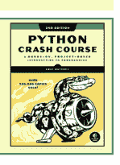

## range() 函数

你可以使用 `range()` 函数来高效地处理一组数字。`range()` 函数默认从 0 开始，到比传入的数字小 1 的位置结束。你可以使用 `list()` 函数来高效地生成一个包含大量数字的列表。

打印数字 0 到 1000

```
for number in range(1001):
    print(number)
```

打印数字 1 到 1000

```
for number in range(1, 1001):
    print(number)
```

创建一个从 1 到一百万的数字列表

```
numbers = list(range(1, 1000001))
```

## 简单统计

你可以对包含数值数据的列表执行一些简单的统计操作。

查找列表中的最小值

```
ages = [93, 99, 66, 17, 85, 1, 35, 82, 2, 77]
youngest = min(ages)
```

查找最大值

```
ages = [93, 99, 66, 17, 85, 1, 35, 82, 2, 77]
oldest = max(ages)
```

计算所有值的总和

```
ages = [93, 99, 66, 17, 85, 1, 35, 82, 2, 77]
total_years = sum(ages)
```

## 列表切片

你可以处理列表中的任意元素子集。列表的一部分被称为切片。要对列表进行切片，首先指定你想要的第一个元素的索引，然后加上一个冒号和你想要的最后一个元素的索引。省略第一个索引表示从列表开头开始，省略第二个索引表示切片到列表末尾。

获取前三个元素

```
finishers = ['kai', 'abe', 'ada', 'gus', 'zoe']
first_three = finishers[:3]
```

获取中间三个元素

```
middle_three = finishers[1:4]
```

获取最后三个元素

```
last_three = finishers[-3:]
```

## 复制列表

要复制一个列表，可以创建一个从第一个元素开始到最后一个元素结束的切片。如果你不使用这种方法来复制列表，那么你对复制列表所做的任何操作也会影响原始列表。

复制列表

```
finishers = ['kai', 'abe', 'ada', 'gus', 'zoe']
copy_of_finishers = finishers[:]
```

## 列表推导式

你可以使用循环基于一个数字范围或另一个列表来生成列表。这是一个常见的操作，因此 Python 提供了一种更高效的方式来完成它。列表推导式起初可能看起来很复杂；如果是这样，在你准备好开始使用推导式之前，可以使用 `for` 循环方法。

要编写一个推导式，首先定义一个表达式来表示你想要存储在列表中的值。然后编写一个 `for` 循环来生成创建列表所需的输入值。

使用循环生成平方数列表

```
squares = []
for x in range(1, 11):
    square = x**2
    squares.append(square)
```

使用推导式生成平方数列表

```
squares = [x**2 for x in range(1, 11)]
```

使用循环将名称列表转换为大写

```
names = ['kai', 'abe', 'ada', 'gus', 'zoe']

upper_names = []
for name in names:
    upper_names.append(name.upper())
```

使用推导式将名称列表转换为大写

```
names = ['kai', 'abe', 'ada', 'gus', 'zoe']

upper_names = [name.upper() for name in names]
```

## 代码风格

可读性很重要

遵循常见的 Python 格式约定：
- 每个缩进级别使用四个空格。
- 每行保持 79 个字符或更少。
- 使用单个空行在视觉上分隔程序的各个部分。

# 元组

元组类似于列表，但是一旦定义，你就不能更改元组中的值。元组非常适合存储在程序生命周期内不应更改的信息。元组通常用圆括号表示。

你可以覆盖整个元组，但不能更改单个元素的值。

定义元组

```
dimensions = (800, 600)
```

遍历元组

```
for dimension in dimensions:
    print(dimension)
```

覆盖元组

```
dimensions = (800, 600)
print(dimensions)

dimensions = (1200, 900)
print(dimensions)
```

## 可视化你的代码

当你刚开始学习列表等数据结构时，可视化 Python 如何处理程序中的信息会很有帮助。Python Tutor 是一个很好的工具，可以查看 Python 如何跟踪列表中的信息。尝试在 pythontutor.com 上运行以下代码，然后运行你自己的代码。

构建一个列表并打印列表中的项目

```
dogs = []
dogs.append('willie')
dogs.append('hootz')
dogs.append('peso')
dogs.append('goblin')

for dog in dogs:
    print(f"Hello {dog}!")
print("I love these dogs!")

print("\nThese were my first two dogs:")
old_dogs = dogs[:2]
for old_dog in old_dogs:
    print(old_dog)

del dogs[0]
dogs.remove('peso')
print(dogs)
```

更多速查表可在 ehmatthes.github.io/pcc_2e/ 获取

## 初学者 Python 速查表 - 字典

## 什么是字典？

Python 的字典允许你连接相关的多条信息。字典中的每条信息都以键值对的形式存储。当你提供一个键时，Python 会返回与该键关联的值。你可以遍历所有的键值对、所有的键或所有的值。

## 定义字典

使用花括号来定义字典。使用冒号连接键和值，并使用逗号分隔各个键值对。

## 创建字典

```
alien_0 = {'color': 'green', 'points': 5}
```

## 访问值

要访问与单个键关联的值，请提供字典的名称，然后将键放在一组方括号中。如果你提供的键不在字典中，将会发生错误。
你也可以使用 `get()` 方法，如果键不存在，它会返回 `None` 而不是错误。你还可以指定一个默认值，以便在键不在字典中时使用。

## 获取与键关联的值

```
alien_0 = {'color': 'green', 'points': 5}

print(alien_0['color'])
print(alien_0['points'])
```

## 使用 get() 获取值

```
alien_0 = {'color': 'green'}

alien_color = alien_0.get('color')
alien_points = alien_0.get('points', 0)
alien_speed = alien_0.get('speed')

print(alien_color)
print(alien_points)
print(alien_speed)
```

## 添加新的键值对

你可以在字典中存储任意数量的键值对，直到计算机内存耗尽。要向现有字典添加新的键值对，请提供字典的名称和新的键（放在方括号中），并将其设置为新的值。
这也允许你从一个空字典开始，并在键值对变得相关时添加它们。

## 添加键值对

```
alien_0 = {'color': 'green', 'points': 5}

alien_0['x'] = 0
alien_0['y'] = 25
alien_0['speed'] = 1.5
```

## 从空字典开始

```
alien_0 = {}
alien_0['color'] = 'green'
alien_0['points'] = 5
```

## 修改值

你可以修改字典中与任何键关联的值。为此，请提供字典的名称和键（放在方括号中），然后提供该键的新值。

## 修改字典中的值

```
alien_0 = {'color': 'green', 'points': 5}
print(alien_0)

# 更改外星人的颜色和点数。
alien_0['color'] = 'yellow'
alien_0['points'] = 10
print(alien_0)
```

## 删除键值对

你可以从字典中删除任何你想要的键值对。为此，请使用 `del` 关键字和字典名称，后跟方括号中的键。这将删除该键及其关联的值。

## 删除键值对

```
alien_0 = {'color': 'green', 'points': 5}
print(alien_0)

del alien_0['points']
print(alien_0)
```

## 可视化字典

尝试在 pythontutor.com 上运行一些这些示例，然后运行一个你自己的使用字典的程序。

## 遍历字典

你可以通过三种方式遍历字典：遍历所有的键值对、所有的键或所有的值。
字典会跟踪键值对添加的顺序。如果你想以不同的顺序处理信息，可以在循环中使用 `sorted()` 函数对键进行排序。

## 遍历所有键值对

```
# 存储人们最喜欢的语言。
fav_languages = {
    'jen': 'python',
    'sarah': 'c',
    'edward': 'ruby',
    'phil': 'python',
    }

# 显示每个人最喜欢的语言。
for name, language in fav_languages.items():
    print(f"{name}: {language}")
```

## 遍历所有键

```
# 显示所有参与调查的人。
for name in fav_languages.keys():
    print(name)
```

## 遍历所有值

```
# 显示所有被选择的语言。
for language in fav_languages.values():
    print(language)
```

## 按相反顺序遍历所有键

```
# 显示每个人最喜欢的语言，
# 按人名的相反顺序排列。
for name in sorted(fav_languages.keys(),
                   reverse=True):
    language = fav_languages[name]
    print(f"{name}: {language}")
```

## 字典长度

你可以使用 `len()` 函数来查找字典中键值对的数量。

## 查找字典的长度

```
num_responses = len(fav_languages)
```

## Python 入门教程

一本基于实践、项目的编程入门指南

nostarch.com/pythoncrashcourse2e

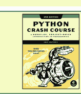

## 嵌套 - 字典列表

有时将多个字典存储在一个列表中很有用；这被称为嵌套。

### 在列表中存储字典

```python
# Start with an empty list.
users = []

# Make a new user, and add them to the list.
new_user = {
    'last': 'fermi',
    'first': 'enrico',
    'username': 'efermi',
    }
users.append(new_user)

# Make another new user, and add them as well.
new_user = {
    'last': 'curie',
    'first': 'marie',
    'username': 'mcurie',
    }
users.append(new_user)

# Show all information about each user.
print("User summary:")
for user_dict in users:
    for k, v in user_dict.items():
        print(f"{k}: {v}")
    print("\n")
```

你也可以直接定义一个字典列表，而无需使用 `append()`：

```python
# Define a list of users, where each user
# is represented by a dictionary.
users = [
    {
        'last': 'fermi',
        'first': 'enrico',
        'username': 'efermi',
    },
    {
        'last': 'curie',
        'first': 'marie',
        'username': 'mcurie',
    },
]

# Show all information about each user.
print("User summary:")
for user_dict in users:
    for k, v in user_dict.items():
        print(f"{k}: {v}")
    print("\n")
```

## 嵌套 - 字典中的列表

在字典中存储列表允许你将多个值与每个键关联起来。

### 在字典中存储列表

```python
# Store multiple languages for each person.
fav_languages = {
    'jen': ['python', 'ruby'],
    'sarah': ['c'],
    'edward': ['ruby', 'go'],
    'phil': ['python', 'haskell'],
}

# Show all responses for each person.
for name, langs in fav_languages.items():
    print(f"{name}: ")
    for lang in langs:
        print(f"- {lang}")
```

## 嵌套 - 字典的字典

你可以将一个字典存储在另一个字典中。在这种情况下，与每个键关联的值本身就是一个字典。

### 在字典中存储字典

```python
users = {
    'aeinstein': {
        'first': 'albert',
        'last': 'einstein',
        'location': 'princeton',
        },
    'mcurie': {
        'first': 'marie',
        'last': 'curie',
        'location': 'paris',
        },
    }

for username, user_dict in users.items():
    full_name = f"{user_dict['first']} "
    full_name += user_dict['last']

    location = user_dict['location']

    print("\nUsername: " + username)
    print(f"\tFull name: {full_name.title()}")
    print(f"\tLocation: {location.title()}")
```

## 嵌套的层级

嵌套在某些情况下非常有用。但是，请注意不要让你的代码过于复杂。如果你嵌套的层级比这里看到的深得多，那么可能有更简单的方法来管理你的数据，例如使用类。

## 字典推导式

推导式是一种生成字典的紧凑方式，类似于列表推导式。要创建字典推导式，请为要生成的键值对定义一个表达式。然后编写一个 `for` 循环来生成将输入到该表达式的值。

`zip()` 函数将一个列表中的每个项目与第二个列表中的每个项目匹配。它可以用来从两个列表创建一个字典。

### 使用循环创建字典

```python
squares = {}
for x in range(5):
    squares[x] = x**2
```

### 使用字典推导式

```python
squares = {x:x**2 for x in range(5)}
```

### 使用 `zip()` 创建字典

```python
group_1 = ['kai', 'abe', 'ada', 'gus', 'zoe']
group_2 = ['jen', 'eva', 'dan', 'isa', 'meg']

pairings = {name:name_2
    for name, name_2 in zip(group_1, group_2)}
```

## 生成一百万个字典

如果所有字典都以相似的数据开始，你可以使用循环高效地生成大量字典。

### 一百万个外星人

```python
aliens = []

# Make a million green aliens, worth 5 points
# each. Have them all start in one row.
for alien_num in range(1_000_000):
    new_alien = {
        'color': 'green',
        'points': 5,
        'x': 20 * alien_num,
        'y': 0
    }
    aliens.append(new_alien)

# Prove the list contains a million aliens.
num_aliens = len(aliens)

print("Number of aliens created:")
print(num_aliens)
```

更多速查表可在 ehmatthes.github.io/pcc_2e/ 获取

## 初学者 Python 速查表 - If 语句和 While 循环

## 什么是 if 语句？什么是 while 循环？

Python 的 `if` 语句允许你检查程序的当前状态并对此状态做出适当的响应。你可以编写一个简单的 `if` 语句来检查一个条件，或者你可以创建一系列复杂的语句来识别你感兴趣的确切条件。

`while` 循环在某些条件保持为真时运行。你可以使用 `while` 循环让程序在用户需要时一直运行。

## 条件测试

条件测试是一个可以被求值为真或假的表达式。Python 使用值 `True` 和 `False` 来决定是否应执行 `if` 语句中的代码。

### 检查相等性

单个等号将值赋给变量。双等号检查两个值是否相等。

如果你的条件测试没有按预期工作，请确保你没有意外地使用单个等号。

```python
>>> car = 'bmw'
>>> car == 'bmw'
True
>>> car = 'audi'
>>> car == 'bmw'
False
```

### 比较时忽略大小写

```python
>>> car = 'Audi'
>>> car.lower() == 'audi'
True
```

### 检查不等性

```python
>>> topping = 'mushrooms'
>>> topping != 'anchovies'
True
```

### 数值比较

测试数值与测试字符串值类似。

### 测试相等性和不等性

```python
>>> age = 18
>>> age == 18
True
>>> age != 18
False
```

### 比较运算符

```python
>>> age = 19
>>> age < 21
True
>>> age <= 21
True
>>> age > 21
False
>>> age >= 21
False
```

### 检查多个条件

你可以同时检查多个条件。`and` 运算符在列出的所有条件都为真时返回 `True`。`or` 运算符在任何条件为真时返回 `True`。

### 使用 `and` 检查多个条件

```python
>>> age_0 = 22
>>> age_1 = 18
>>> age_0 >= 21 and age_1 >= 21
False
>>> age_1 = 23
>>> age_0 >= 21 and age_1 >= 21
True
```

### 使用 `or` 检查多个条件

```python
>>> age_0 = 22
>>> age_1 = 18
>>> age_0 >= 21 or age_1 >= 21
True
>>> age_0 = 18
>>> age_0 >= 21 or age_1 >= 21
False
```

### 布尔值

布尔值要么是 `True`，要么是 `False`。具有布尔值的变量通常用于跟踪程序中的某些条件。

### 简单的布尔值

```python
game_active = True
is_valid = True
can_edit = False
```

## If 语句

存在几种 `if` 语句。选择使用哪种取决于你需要测试的条件数量。你可以根据需要拥有任意多个 `elif` 块，而 `else` 块始终是可选的。

### 简单的 if 语句

```python
age = 19

if age >= 18:
    print("You're old enough to vote!")
```

### If-else 语句

```python
age = 17

if age >= 18:
    print("You're old enough to vote!")
else:
    print("You can't vote yet.")
```

### If-elif-else 链

```python
age = 12

if age < 4:
    price = 0
elif age < 18:
    price = 25
else:
    price = 40

print(f"Your cost is ${price}.")
```

### 使用列表进行条件测试

你可以轻松测试某个值是否在列表中。你也可以在尝试遍历列表之前测试列表是否为空。

### 测试值是否在列表中

```python
>>> players = ['al', 'bea', 'cyn', 'dale']
>>> 'al' in players
True
>>> 'eric' in players
False
```

### 测试两个值是否在列表中

```python
>>> 'al' in players and 'cyn' in players
```


Python Crash Course
A Hands-on, Project-Based Introduction to Programming
nostarch.com/pythoncrashcourse2e

## 使用列表进行条件测试（续）

### 测试值是否不在列表中

```python
banned_users = ['ann', 'chad', 'dee']
user = 'erin'

if user not in banned_users:
    print("You can play!")
```

### 检查列表是否为空

空列表在 `if` 语句中求值为 `False`。

```python
players = []

if players:
    for player in players:
        print(f"Player: {player.title()}")
else:
    print("We have no players yet!")
```

### 接受输入

你可以允许用户使用 `input()` 函数输入内容。所有输入最初都存储为字符串。如果你想接受数值输入，你需要将输入的字符串值转换为数值类型。

### 简单输入

```python
name = input("What's your name? ")
print(f"Hello, {name}.")
```

### 使用 `int()` 接受数值输入

```python
age = input("How old are you? ")
age = int(age)

if age >= 18:
    print("\nYou can vote!")
else:
    print("\nSorry, you can't vote yet.")
```

### 使用 `float()` 接受数值输入

```python
tip = input("How much do you want to tip? ")
tip = float(tip)
print(f"Tipped ${tip}.")
```

## While 循环

`while` 循环在条件为真时重复执行一段代码。

### 数到 5

```python
current_number = 1

while current_number <= 5:
    print(current_number)
    current_number += 1
```

## While 循环（续）

### 让用户选择何时退出

```python
prompt = "\nTell me something, and I'll "
prompt += "repeat it back to you."
prompt += "\nEnter 'quit' to end the program. "

message = ""
while message != 'quit':
    message = input(prompt)

    if message != 'quit':
        print(message)
```

### 使用标志

标志在长时间运行的程序中最有用，因为程序其他部分的代码可能需要结束循环。

```python
prompt = "\nTell me something, and I'll "
prompt += "repeat it back to you."
prompt += "\nEnter 'quit' to end the program. "

active = True
while active:
    message = input(prompt)

    if message == 'quit':
        active = False
    else:
        print(message)
```

### 使用 `break` 退出循环

```python
prompt = "\nWhat cities have you visited?"
prompt += "\nEnter 'quit' when you're done. "

while True:
    city = input(prompt)

    if city == 'quit':
        break
    else:
        print(f"I've been to {city}!")
```

### 在 Sublime Text 中接受输入

Sublime Text 和许多其他文本编辑器无法运行提示用户输入的程序。你可以使用这些编辑器编写提示输入的程序，但你需要从终端运行它们。

## 跳出循环

你可以在 Python 的任何循环中使用 `break` 语句和 `continue` 语句。例如，你可以使用 `break` 来退出正在处理列表或字典的 `for` 循环。你也可以使用 `continue` 在遍历列表或字典时跳过某些项目。

## While 循环（续）

### 在循环中使用 `continue`

```python
banned_users = ['eve', 'fred', 'gary', 'helen']

prompt = "\nAdd a player to your team."
prompt += "\nEnter 'quit' when you're done. "

players = []
while True:
    player = input(prompt)

    if player == 'quit':
        break
    elif player in banned_users:
        print(f"{player} is banned!")
        continue
    else:
        players.append(player)

print("\nYour team:")
for player in players:
    print(player)
```

### 避免无限循环

每个 `while` 循环都需要一种停止运行的方式，这样它才不会永远运行下去。如果条件无法变为假，循环将永远不会停止运行。通常你可以按 `Ctrl-C` 来停止无限循环。

### 一个无限循环

```python
while True:
    name = input("\nWho are you? ")
    print(f"Nice to meet you, {name}!")
```

### 从列表中删除所有特定值的实例

`remove()` 方法从列表中删除一个特定的值，但它只删除你提供的值的第一个实例。你可以使用 `while` 循环来删除特定值的所有实例。

### 从宠物列表中删除所有猫

```python
pets = ['dog', 'cat', 'dog', 'fish', 'cat',
        'rabbit', 'cat']
print(pets)

while 'cat' in pets:
    pets.remove('cat')

print(pets)
```

更多速查表可在 ehmatthes.github.io/pcc_2e/ 获取

## 初学者Python速查表 - 函数

## 什么是函数？

函数是设计用来完成特定任务的命名代码块。函数允许你编写一次代码，然后在需要完成相同任务时随时运行。

函数可以接收所需的信息，并返回生成的信息。有效使用函数使你的程序更易于编写、阅读、测试和修复。

## 定义函数

函数的第一行是其定义，由关键字 `def` 标记。函数名称后跟一对括号和一个冒号。一个用三引号括起来的文档字符串描述了函数的功能。函数体缩进一级。

要调用函数，请给出函数名称，后跟一对括号。

## 创建函数

```python
def greet_user():
    """显示简单的问候语。"""
    print("Hello!")

greet_user()
```

## 向函数传递信息

传递给函数的信息称为**参数**；函数接收的信息称为**形参**。参数包含在函数名称后的括号中，而形参列在函数定义的括号中。

## 传递简单参数

```python
def greet_user(username):
    """显示简单的问候语。"""
    print(f"Hello, {username}!")

greet_user('jesse')
greet_user('diana')
greet_user('brandon')
```

## 位置参数和关键字参数

两种主要的参数类型是位置参数和关键字参数。当你使用位置参数时，Python会将函数调用中的第一个参数与函数定义中的第一个形参匹配，依此类推。

使用关键字参数时，你可以在函数调用中指定每个参数应分配给哪个形参。使用关键字参数时，参数的顺序无关紧要。

## 使用位置参数

```python
def describe_pet(animal, name):
    """显示关于宠物的信息。"""
    print(f"\nI have a {animal}.")
    print(f"Its name is {name}.")

describe_pet('hamster', 'harry')
describe_pet('dog', 'willie')
```

## 使用关键字参数

```python
def describe_pet(animal, name):
    """显示关于宠物的信息。"""
    print(f"\nI have a {animal}.")
    print(f"Its name is {name}.")

describe_pet(animal='hamster', name='harry')
describe_pet(name='willie', animal='dog')
```

## 默认值

你可以为形参提供默认值。当函数调用省略此参数时，将使用默认值。在函数定义中，带有默认值的形参必须列在没有默认值的形参之后，以便位置参数仍然可以正常工作。

## 使用默认值

```python
def describe_pet(name, animal='dog'):
    """显示关于宠物的信息。"""
    print(f"\nI have a {animal}.")
    print(f"Its name is {name}.")

describe_pet('harry', 'hamster')
describe_pet('willie')
```

## 使用None使参数可选

```python
def describe_pet(animal, name=None):
    """显示关于宠物的信息。"""
    print(f"\nI have a {animal}.")
    if name:
        print(f"Its name is {name}.")

describe_pet('hamster', 'harry')
describe_pet('snake')
```

## 返回值

函数可以返回一个值或一组值。当函数返回一个值时，调用行应提供一个变量，以便将返回值赋给该变量。函数在到达 `return` 语句时停止运行。

## 返回单个值

```python
def get_full_name(first, last):
    """返回格式整齐的全名。"""
    full_name = f"{first} {last}"
    return full_name.title()

musician = get_full_name('jimi', 'hendrix')
print(musician)
```

## 返回字典

```python
def build_person(first, last):
    """返回包含个人信息的字典。"""
    person = {'first': first, 'last': last}
    return person

musician = build_person('jimi', 'hendrix')
print(musician)
```

## 返回带有可选值的字典

```python
def build_person(first, last, age=None):
    """返回包含个人信息的字典。"""
    person = {'first': first, 'last': last}
    if age:
        person['age'] = age

    return person

musician = build_person('jimi', 'hendrix', 27)
print(musician)

musician = build_person('janis', 'joplin')
print(musician)
```

## 可视化函数

尝试在 pythontutor.com 上运行一些这些示例，以及一些你自己的使用函数的程序。

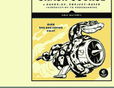

Python Crash Course
A Hands-on, Project-Based Introduction to Programming
nostarch.com/pythoncrashcourse2e

## 将列表传递给函数

你可以将列表作为参数传递给函数，函数可以处理列表中的值。函数对列表所做的任何更改都会影响原始列表。你可以通过传递列表的副本来防止函数修改列表。

## 将列表作为参数传递

```python
def greet_users(names):
    """向每个人打印简单的问候语。"""
    for name in names:
        msg = f"Hello, {name}!"
        print(msg)

usernames = ['hannah', 'ty', 'margot']
greet_users(usernames)
```

## 允许函数修改列表

以下示例将模型列表发送给函数进行打印。第一个列表被清空，第二个列表被填充。

```python
def print_models(unprinted, printed):
    """3D打印一组模型。"""
    while unprinted:
        current_model = unprinted.pop()
        print(f"Printing {current_model}")
        printed.append(current_model)

# 存储一些未打印的设计，
# 并打印每一个。
unprinted = ['phone case', 'pendant', 'ring']
printed = []
print_models(unprinted, printed)

print(f"\nUnprinted: {unprinted}")
print(f"Printed: {printed}")
```

## 防止函数修改列表

以下示例与前一个示例相同，只是调用 `print_models()` 后原始列表保持不变。

```python
def print_models(unprinted, printed):
    """3D打印一组模型。"""
    while unprinted:
        current_model = unprinted.pop()
        print(f"Printing {current_model}")
        printed.append(current_model)

# 存储一些未打印的设计，
# 并打印每一个。
original = ['phone case', 'pendant', 'ring']
printed = []

print_models(original[:], printed)
print(f"\nOriginal: {original}")
print(f"Printed: {printed}")
```

## 传递任意数量的参数

有时你不知道函数需要接受多少个参数。Python允许你使用 `*` 运算符将任意数量的参数收集到一个形参中。接受任意数量参数的形参必须在函数定义中放在最后。这个形参通常命名为 `*args`。

`**` 运算符允许一个形参收集任意数量的关键字参数。这些参数以字典的形式存储，形参名称作为键，参数作为值。这通常命名为 `**kwargs`。

## 收集任意数量的参数

```python
def make_pizza(size, *toppings):
    """制作披萨。"""
    print(f"\nMaking a {size} pizza.")
    print("Toppings:")
    for topping in toppings:
        print(f"- {topping}")

# 制作三个不同配料的披萨。
make_pizza('small', 'pepperoni')
make_pizza('large', 'bacon bits', 'pineapple')
make_pizza('medium', 'mushrooms', 'peppers',
           'onions', 'extra cheese')
```

## 收集任意数量的关键字参数

```python
def build_profile(first, last, **user_info):
    """为用户构建一个字典。"""
    user_info['first'] = first
    user_info['last'] = last
    return user_info

# 创建两个具有不同类型
# 信息的用户。
user_0 = build_profile('albert', 'einstein',
                       location='princeton')
user_1 = build_profile('marie', 'curie',
                       location='paris', field='chemistry')

print(user_0)
print(user_1)
```

## 构建函数的最佳方式是什么？

编写和调用函数的方法有很多。当你刚开始时，目标是让函数简单地工作。随着经验的积累，你会逐渐理解不同结构（如位置参数和关键字参数）以及各种导入函数方法的微妙优势。目前，如果你的函数能完成你需要它们做的事情，你就做得很好。

## 模块

你可以将函数存储在一个单独的文件中，称为模块，然后将需要的函数导入到包含主程序的文件中。这允许更清晰的程序文件。确保你的模块存储在与主程序相同的目录中。

## 将函数存储在模块中

文件：`pizza.py`

```python
def make_pizza(size, *toppings):
    """制作披萨。"""
    print(f"\nMaking a {size} pizza.")
    print("Toppings:")
    for topping in toppings:
        print(f"- {topping}")
```

### 导入整个模块

文件：`making_pizzas.py` 模块中的每个函数在程序文件中都可用。

```python
import pizza

pizza.make_pizza('medium', 'pepperoni')
pizza.make_pizza('small', 'bacon', 'pineapple')
```

## 导入特定函数

只有导入的函数在程序文件中可用。

```python
from pizza import make_pizza

make_pizza('medium', 'pepperoni')
make_pizza('small', 'bacon', 'pineapple')
```

## 为模块指定别名

```python
import pizza as p

p.make_pizza('medium', 'pepperoni')
p.make_pizza('small', 'bacon', 'pineapple')
```

## 为函数指定别名

```python
from pizza import make_pizza as mp

mp('medium', 'pepperoni')
mp('small', 'bacon', 'pineapple')
```

## 从模块导入所有函数

不要这样做，但当你在别人的代码中看到它时要认出来。这可能导致命名冲突，从而引起错误。

```python
from pizza import *

make_pizza('medium', 'pepperoni')
make_pizza('small', 'bacon', 'pineapple')
```

更多速查表可在 ehmatthes.github.io/pcc_2e/ 获取

## 初学者Python速查表 - 类

## 什么是类？

类是面向对象编程的基础。类代表了你想要在程序中建模的真实世界事物，例如狗、汽车和机器人。你使用类来创建对象，这些对象是狗、汽车和机器人的具体实例。类定义了一整类对象可以具有的通用行为，以及可以与这些对象关联的信息。

类可以相互继承——你可以编写一个类来扩展现有类的功能。这使你能够高效地为各种情况编写代码。即使你自己不编写很多类，你也经常会发现自己在使用别人编写的类。

## 创建和使用类

考虑一下我们如何对一辆汽车进行建模。我们会将哪些信息与一辆汽车关联起来，它又会有哪些行为？这些信息被分配给称为属性的变量，而行为则由函数表示。作为类一部分的函数称为方法。

## Car类

```python
class Car:
    """A simple attempt to model a car."""

    def __init__(self, make, model, year):
        """Initialize car attributes."""
        self.make = make
        self.model = model
        self.year = year

        # Fuel capacity and level in gallons.
        self.fuel_capacity = 15
        self.fuel_level = 0

    def fill_tank(self):
        """Fill gas tank to capacity."""
        self.fuel_level = self.fuel_capacity
        print("Fuel tank is full.")

    def drive(self):
        """Simulate driving."""
        print("The car is moving.")
```

## 创建和使用类（续）

## 从类创建实例

```python
my_car = Car('audi', 'a4', 2021)
```

## 访问属性值

```python
print(my_car.make)
print(my_car.model)
print(my_car.year)
```

## 调用方法

```python
my_car.fill_tank()
my_car.drive()
```

## 创建多个实例

```python
my_car = Car('audi', 'a4', 2021)
my_old_car = Car('subaru', 'outback', 2015)
my_truck = Car('toyota', 'tacoma', 2018)
my_old_truck = Car('ford', 'ranger', 1999)
```

## 修改属性

你可以直接修改属性的值，也可以编写方法来更谨慎地管理更新。这类方法可以帮助验证对属性所做的更改类型。

## 直接修改属性

```python
my_new_car = Car('audi', 'a4', 2021)
my_new_car.fuel_level = 5
```

## 编写方法来更新属性值

```python
def update_fuel_level(self, new_level):
    """Update the fuel level."""
    if new_level <= self.fuel_capacity:
        self.fuel_level = new_level
    else:
        print("The tank can't hold that much!")
```

## 编写方法来递增属性值

```python
def add_fuel(self, amount):
    """Add fuel to the tank."""
    if (self.fuel_level + amount
            <= self.fuel_capacity):
        self.fuel_level += amount
        print("Added fuel.")
    else:
        print("The tank won't hold that much.")
```

## 命名约定

在Python中，类名使用驼峰命名法（CamelCase）编写，对象名使用小写字母和下划线编写。包含类的模块应使用小写字母和下划线命名。

## 类继承

如果你正在编写的类是另一个类的专用版本，你可以使用继承。当一个类继承另一个类时，它会自动获取父类的所有属性和方法。子类可以自由地引入新的属性和方法，并覆盖父类的属性和方法。

要继承另一个类，在定义新类时在括号中包含父类的名称。

## 子类的`__init__()`方法

```python
class ElectricCar(Car):
    """A simple model of an electric car."""

    def __init__(self, make, model, year):
        """Initialize an electric car."""
        super().__init__(make, model, year)

        # Attributes specific to electric cars.
        # Battery capacity in kWh.
        self.battery_size = 85

        # Charge level in %.
        self.charge_level = 0
```

## 向子类添加新方法

```python
class ElectricCar(Car):
    --snip--

    def charge(self):
        """Fully charge the vehicle."""
        self.charge_level = 100
        print("The vehicle is fully charged.")
```

## 使用子类方法和父类方法

```python
my_ecar = ElectricCar('tesla', 'model s', 2021)

my_ecar.charge()
my_ecar.drive()
```

## 找到你的工作流程

在代码中建模现实世界的对象和情况有很多种方法，有时这种多样性会让人感到不知所措。选择一种方法并尝试一下——如果你的第一次尝试不成功，就尝试另一种方法。

## Python速成课程

基于实践和项目的编程入门

nostarch.com/pythoncrashcourse2e

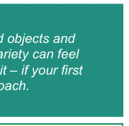

## 类继承（续）

### 覆盖父类方法

```python
class ElectricCar(Car):
    --snip--

    def fill_tank(self):
        """Display an error message."""
        print("This car has no fuel tank!")
```

## 实例作为属性

一个类可以将对象作为属性。这允许类协同工作，以建模更复杂的现实世界事物和概念。

### 一个Battery类

```python
class Battery:
    """A battery for an electric car."""

    def __init__(self, size=85):
        """Initialize battery attributes."""
        # Capacity in kWh, charge level in %.
        self.size = size
        self.charge_level = 0

    def get_range(self):
        """Return the battery's range."""
        if self.size == 85:
            return 390
        elif self.size == 100:
            return 415
```

### 使用实例作为属性

```python
class ElectricCar(Car):
    --snip--

    def __init__(self, make, model, year):
        """Initialize an electric car."""
        super().__init__(make, model, year)

        # Attribute specific to electric cars.
        self.battery = Battery()

    def charge(self):
        """Fully charge the vehicle."""
        self.battery.charge_level = 100
        print("The vehicle is fully charged.")
```

### 使用实例

```python
my_ecar = ElectricCar('tesla', 'model s', 2021)

my_ecar.charge()
print(my_ecar.battery.get_range())
my_ecar.drive()
```

## 导入类

随着你添加详细信息和功能，类文件可能会变得很长。为了帮助保持程序文件整洁，你可以将类存储在模块中，并将需要的类导入到主程序中。

### 将类存储在文件中

```python
# car.py
"""Represent gas and electric cars."""

class Car:
    """A simple attempt to model a car."""
    --snip--

class Battery:
    """A battery for an electric car."""
    --snip--

class ElectricCar(Car):
    """A simple model of an electric car."""
    --snip--
```

### 从模块导入单个类

```python
# my_cars.py
from car import Car, ElectricCar

my_beetle = Car('volkswagen', 'beetle', 2019)
my_beetle.fill_tank()
my_beetle.drive()

my_tesla = ElectricCar('tesla', 'model s', 2021)
my_tesla.charge()
my_tesla.drive()
```

### 导入整个模块

```python
import car

my_beetle = car.Car(
    'volkswagen', 'beetle', 2019)
my_beetle.fill_tank()
my_beetle.drive()

my_tesla = car.ElectricCar(
    'tesla', 'model s', 2021)
my_tesla.charge()
my_tesla.drive()
```

### 从模块导入所有类

（不要这样做，但当你看到时要能识别出来。）

```python
from car import *

my_beetle = Car('volkswagen', 'beetle', 2019)
my_tesla = ElectricCar('tesla', 'model s', 2021)
```

## 将对象存储在列表中

一个列表可以容纳任意多的项目，因此你可以从一个类创建大量对象并将它们存储在列表中。

下面是一个示例，展示如何创建一个租赁车队，并确保所有汽车都准备好可以驾驶。

### 一个租赁车队

```python
from car import Car, ElectricCar

# Make lists to hold a fleet of cars.
gas_fleet = []
electric_fleet = []

# Make 250 gas cars and 500 electric cars.
for _ in range(250):
    car = Car('ford', 'escape', 2021)
    gas_fleet.append(car)
for _ in range(500):
    ecar = ElectricCar('nissan', 'leaf', 2021)
    electric_fleet.append(ecar)

# Fill the gas cars, and charge electric cars.
for car in gas_fleet:
    car.fill_tank()
for ecar in electric_fleet:
    ecar.charge()

print(f"Gas cars: {len(gas_fleet)}")
print(f"Electric cars: {len(electric_fleet)}")
```

## 理解`self`

人们经常问`self`变量代表什么。`self`变量是对从类创建的对象的引用。

`self`变量提供了一种方式，使其他变量和对象在类中的任何地方都可用。`self`变量会自动传递给通过对象调用的每个方法，这就是为什么你在每个方法定义中都看到它列在第一位。任何附加到`self`的变量在类中的任何地方都可用。

## 理解`__init__()`

`__init__()`方法是类的一部分，就像任何其他方法一样。`__init__()`唯一特殊的地方在于，每次从类创建新实例时，它都会自动调用。如果你不小心拼错了`__init__()`，该方法将不会被调用，你的对象可能无法正确创建。

更多速查表可在 ehmatthes.github.io/pcc_2e/ 获取

## 初学者Python速查表 - 文件与异常

## 什么是文件？什么是异常？

你的程序可以从文件中读取信息，也可以将数据写入文件。从文件读取信息使你能够处理各种各样的数据；将数据写入文件则让用户在下次运行程序时能够从上次中断的地方继续。你可以将文本写入文件，也可以将Python数据结构（如列表）存储在数据文件中。

异常是特殊的对象，它们帮助你的程序以适当的方式应对错误。例如，如果你的程序试图打开一个不存在的文件，你可以使用异常来显示一条有信息量的错误消息，而不是让程序崩溃。

## 从文件读取

要从文件读取，你的程序需要先打开文件，然后读取文件内容。你可以一次性读取整个文件内容，也可以逐行读取。这里展示的`with`语句确保程序在完成文件访问后正确关闭文件。

### 一次性读取整个文件

```python
filename = 'siddhartha.txt'

with open(filename) as f_obj:
    contents = f_obj.read()

print(contents)
```

### 逐行读取

从文件读取的每一行末尾都有一个换行符，而`print`函数也会添加自己的换行符。`rstrip()`方法可以去除打印到终端时由此产生的多余空行。

```python
filename = 'siddhartha.txt'

with open(filename) as f_obj:
    for line in f_obj:
        print(line.rstrip())
```

### 将行存储在列表中

```python
filename = 'siddhartha.txt'

with open(filename) as f_obj:
    lines = f_obj.readlines()

for line in lines:
    print(line.rstrip())
```

## 写入文件

向`open()`传递`'w'`参数告诉Python你想要写入文件。请注意：如果文件已存在，这会**擦除**文件内容。传递`'a'`参数则告诉Python你想要向现有文件末尾追加内容。

### 写入空文件

```python
filename = 'programming.txt'

with open(filename, 'w') as f:
    f.write("I love programming!")
```

### 向空文件写入多行

```python
filename = 'programming.txt'

with open(filename, 'w') as f:
    f.write("I love programming!\n")
    f.write("I love creating new games.\n")
```

### 追加到文件

```python
filename = 'programming.txt'

with open(filename, 'a') as f:
    f.write("I also love working with data.\n")
    f.write("I love making apps as well.\n")
```

## 文件路径

当Python运行`open()`函数时，它会在执行该程序的同一目录中查找文件。你可以使用相对路径从子文件夹打开文件。你也可以使用绝对路径来打开系统上的任何文件。

### 从子文件夹打开文件

```python
f_path = "text_files/alice.txt"

with open(f_path) as f:
    lines = f.readlines()

for line in lines:
    print(line.rstrip())
```

### 使用绝对路径打开文件

```python
f_path = "/home/ehmatthes/books/alice.txt"

with open(f_path) as f:
    lines = f.readlines()
```

### 在Windows上打开文件

Windows有时会错误地解释正斜杠。如果遇到这种情况，请在文件路径中使用反斜杠。

```python
f_path = "C:\Users\ehmatthes\books\alice.txt"

with open(f_path) as f:
    lines = f.readlines()
```

## try-except块

当你认为可能发生错误时，可以编写一个`try-except`块来处理可能引发的异常。`try`块告诉Python尝试运行一些代码，而`except`块告诉Python如果代码导致特定类型的错误该怎么办。

### 处理ZeroDivisionError异常

```python
try:
    print(5/0)
except ZeroDivisionError:
    print("You can't divide by zero!")
```

### 处理FileNotFoundError异常

```python
f_name = 'siddhartha.txt'

try:
    with open(f_name) as f:
        lines = f.readlines()
except FileNotFoundError:
    msg = f"Can't find file: {f_name}."
    print(msg)
```

### 知道要处理哪种异常

在编写代码时，可能很难知道要处理哪种异常。尝试在没有`try`块的情况下编写代码，并让它生成一个错误。回溯信息会告诉你程序需要处理哪种异常。浏览一下`docs.python.org/3/library/exceptions.html`上列出的异常是个好主意。

## else块

`try`块应该只包含可能导致错误的代码。任何依赖于`try`块成功运行的代码都应该放在`else`块中。

### 使用else块

```python
print("Enter two numbers. I'll divide them.")

x = input("First number: ")
y = input("Second number: ")

try:
    result = int(x) / int(y)
except ZeroDivisionError:
    print("You can't divide by zero!")
else:
    print(result)
```

### 防止由用户输入引起的崩溃

在下面的例子中，如果没有`except`块，当用户试图除以零时程序会崩溃。按照现在的写法，它将优雅地处理错误并继续运行。

```python
"""A simple calculator for division only."""

print("Enter two numbers. I'll divide them.")
print("Enter 'q' to quit.")

while True:
    x = input("\nFirst number: ")
    if x == 'q':
        break

    y = input("Second number: ")
    if y == 'q':
        break

    try:
        result = int(x) / int(y)
    except ZeroDivisionError:
        print("You can't divide by zero!")
    else:
        print(result)
```

### 决定报告哪些错误

编写良好、经过适当测试的代码不太容易出现内部错误，如语法或逻辑错误。但每次你的程序依赖于外部因素（如用户输入或文件存在）时，都有可能引发异常。

如何向用户传达错误取决于你。有时用户需要知道文件是否缺失；有时最好默默地处理错误。一点经验会帮助你了解该报告多少信息。

### 静默失败

有时你希望程序在遇到错误时只是继续运行，而不向用户报告错误。在`except`块中使用`pass`语句可以让你做到这一点。

### 在else块中使用pass语句

```python
f_names = ['alice.txt', 'siddhartha.txt',
           'moby_dick.txt', 'little_women.txt']

for f_name in f_names:
    # Report the length of each file found.
    try:
        with open(f_name) as f:
            lines = f.readlines()
    except FileNotFoundError:
        # Just move on to the next file.
        pass
    else:
        num_lines = len(lines)
        msg = f"{f_name} has {num_lines}"
        msg += " lines."

        print(msg)
```

### 避免使用裸except块

异常处理代码应该捕获你预期在程序执行期间发生的特定异常。一个裸`except`块会捕获所有异常，包括键盘中断和系统退出，而这些你可能在需要强制关闭程序时用到。

如果你想使用`try`块但不确定要捕获哪种异常，请使用`Exception`。它会捕获大多数异常，但仍然允许你有意地中断程序。

### 不要使用裸except块

```python
try:
    # Do something
except:
    pass
```

### 改用Exception

```python
try:
    # Do something
except Exception:
    pass
```

### 打印异常

```python
try:
    # Do something
except Exception as e:
    print(e, type(e))
```

## 使用json存储数据

`json`模块允许你将简单的Python数据结构转储到文件中，并在程序下次运行时从该文件加载数据。JSON数据格式并非Python特有，因此你也可以与使用其他语言的人共享此类数据。

在处理存储的数据时，了解如何管理异常很重要。通常，你需要在处理数据之前确保要加载的数据存在。

### 使用json.dump()存储数据

```python
"""Store some numbers."""

import json

numbers = [2, 3, 5, 7, 11, 13]

filename = 'numbers.json'
with open(filename, 'w') as f:
    json.dump(numbers, f)
```

### 使用json.load()读取数据

```python
"""Load some previously stored numbers."""

import json

filename = 'numbers.json'
with open(filename) as f:
    numbers = json.load(f)

print(numbers)
```

### 确保存储的数据存在

```python
import json

f_name = 'numbers.json'
try:
    with open(f_name) as f:
        numbers = json.load(f)
except FileNotFoundError:
    msg = f"Can't find file: {f_name}."
    print(msg)
else:
    print(numbers)
```

## 异常练习

找一个你已经写好的、提示用户输入的程序，并向该程序添加一些错误处理代码。用合适和不合适的数据运行你的程序，确保它能正确处理每种情况。

更多速查表可在 ehmatthes.github.io/pcc_2e/ 获取

## 初学者Python速查表 - 测试你的代码

## 为什么要测试你的代码？

当你编写一个函数或一个类时，你也可以为该代码编写测试。测试可以证明你的代码在设计要处理的情况下能按预期工作，也能在人们以意想不到的方式使用你的程序时正常工作。编写测试可以让你确信，随着越来越多的人开始使用你的程序，你的代码将能正确运行。你还可以为你的程序添加新功能，并通过运行测试来了解你是否破坏了现有行为。

单元测试验证你代码的某个特定方面是否按预期工作。测试用例是一组单元测试的集合，用于验证你的代码在各种情况下行为是否正确。

## 测试一个函数：一个通过的测试

Python的`unittest`模块提供了测试代码的工具。为了尝试它，我们将创建一个返回全名的函数。我们将在一个常规程序中使用该函数，然后为该函数构建一个测试用例。

### 一个待测试的函数

将其保存为`full_names.py`

```python
def get_full_name(first, last):
    """Return a full name."""
    full_name = f"{first} {last}"
    return full_name.title()
```

### 使用该函数

将其保存为`names.py`

```python
from full_names import get_full_name

janis = get_full_name('janis', 'joplin')
print(janis)

bob = get_full_name('bob', 'dylan')
print(bob)
```

### 测试一个函数（续）

### 构建一个包含一个单元测试的测试用例

要构建一个测试用例，创建一个继承自`unittest.TestCase`的类，并编写以`test_`开头的方法。将其保存为`test_full_names.py`

```python
import unittest
from full_names import get_full_name

class NamesTestCase(unittest.TestCase):
    """Tests for names.py."""

    def test_first_last(self):
        """Test names like Janis Joplin."""
        full_name = get_full_name('janis', 'joplin')
        self.assertEqual(full_name, 'Janis Joplin')

if __name__ == '__main__':
    unittest.main()
```

### 运行测试

Python会报告测试用例中的每个单元测试。点号代表一个通过的测试。Python通知我们它在不到0.001秒内运行了1个测试，而`OK`让我们知道测试用例中的所有单元测试都通过了。

```
.
----------------------------------------------
Ran 1 test in 0.000s

OK
```

## 测试一个函数：一个失败的测试

失败的测试很重要；它们告诉你代码中的更改影响了现有行为。当测试失败时，你需要修改代码，使现有行为仍然有效。

### 修改函数

我们将修改`get_full_name()`以处理中间名，但我们会以一种破坏现有行为的方式来做。

```python
def get_full_name(first, middle, last):
    """Return a full name."""
    full_name = f"{first} {middle} {last}"
    return full_name.title()
```

### 使用该函数

```python
from full_names import get_full_name

john = get_full_name('john', 'lee', 'hooker')
print(john)

david = get_full_name('david', 'lee', 'roth')
print(david)
```

### 一个失败的测试（续）

### 运行测试

当你更改代码时，运行现有测试非常重要。这将告诉你所做的更改是否影响了现有行为。

```
E
=============================================
ERROR: test_first_last (__main__.NamesTestCase)
Test names like Janis Joplin.
---------------------------------------------
Traceback (most recent call last):
  File "test_full_names.py", line 10, in test_first_last
    'joplin')
TypeError: get_full_name() missing 1 required positional argument: 'last'

---------------------------------------------
Ran 1 test in 0.001s

FAILED (errors=1)
```

### 修复代码

当测试失败时，需要修改代码直到测试再次通过。不要犯重写测试以适应新代码的错误，否则你的代码会为任何以失败测试中相同方式使用它的人而中断。在这里，我们可以使中间名成为可选的。

```python
def get_full_name(first, last, middle=''):
    """Return a full name."""
    if middle:
        full_name = f"{first} {middle} {last}"
    else:
        full_name = f"{first} {last}"
    return full_name.title()
```

### 运行测试

现在测试应该再次通过，这意味着我们原始的功能仍然完好无损。

```
.
----------------------------------------------
Ran 1 test in 0.000s

OK
```

## Python速查表

基于实践和项目的编程入门

nostarch.com/pythoncrashcourse2e

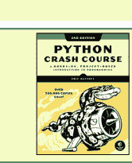

## 添加新测试

你可以根据需要向测试用例添加任意数量的单元测试。要编写新测试，请向测试用例类添加一个新方法。

### 测试中间名

我们已经展示了`get_full_name()`适用于名和姓。让我们测试它是否也适用于中间名。

```python
import unittest
from full_names import get_full_name

class NamesTestCase(unittest.TestCase):
    """Tests for names.py."""

    def test_first_last(self):
        """Test names like Janis Joplin."""
        full_name = get_full_name('janis', 'joplin')
        self.assertEqual(full_name, 'Janis Joplin')

    def test_middle(self):
        """Test names like David Lee Roth."""
        full_name = get_full_name('david', 'roth', 'lee')
        self.assertEqual(full_name, 'David Lee Roth')

if __name__ == '__main__':
    unittest.main()
```

### 运行测试

两个点代表两个通过的测试。

```
..
----------------------------------------------
Ran 2 tests in 0.000s
OK
```

### 多种断言方法

Python提供了多种断言方法，你可以用来测试你的代码。

#### 验证 a==b，或 a != b

```python
assertEqual(a, b)
assertNotEqual(a, b)
```

#### 验证 x 为 True，或 x 为 False

```python
assertTrue(x)
assertFalse(x)
```

#### 验证一个项目在列表中，或不在列表中

```python
assertIn(item, list)
assertNotIn(item, list)
```

## 测试一个类

测试一个类类似于测试一个函数，因为你主要测试的是你的方法。

### 一个待测试的类

保存为`accountant.py`

```python
class Accountant():
    """Manage a bank account."""

    def __init__(self, balance=0):
        self.balance = balance

    def deposit(self, amount):
        self.balance += amount

    def withdraw(self, amount):
        self.balance -= amount
```

### 构建一个测试用例

对于第一个测试，我们将确保我们可以从不同的初始余额开始。将其保存为`test_accountant.py`。

```python
import unittest
from accountant import Accountant

class TestAccountant(unittest.TestCase):
    """Tests for the class Accountant."""

    def test_initial_balance(self):
        # Default balance should be 0.
        acc = Accountant()
        self.assertEqual(acc.balance, 0)

        # Test non-default balance.
        acc = Accountant(100)
        self.assertEqual(acc.balance, 100)

if __name__ == '__main__':
    unittest.main()
```

### 运行测试

```
.
----------------------------------------------
Ran 1 test in 0.000s
OK
```

### 什么时候可以修改测试？

通常，一旦测试编写完成，就不应该修改它。当测试失败时，通常意味着你编写的新代码破坏了现有功能，你需要修改新代码直到所有现有测试通过。

如果你的原始需求发生了变化，修改一些测试可能是合适的。这通常发生在项目的早期阶段，当期望的行为仍在确定中，并且还没有人使用你的代码时。

### setUp() 方法

测试一个类时，你通常需要创建该类的一个实例。`setUp()`方法在每个测试之前运行。你在`setUp()`中创建的任何实例在你编写的每个测试中都可用。

### 使用 setUp() 支持多个测试

实例`self.acc`可以在每个新测试中使用。

```python
import unittest
from accountant import Accountant

class TestAccountant(unittest.TestCase):
    """Tests for the class Accountant."""

    def setUp(self):
        self.acc = Accountant()

    def test_initial_balance(self):
        # Default balance should be 0.
        self.assertEqual(self.acc.balance, 0)

        # Test non-default balance.
        acc = Accountant(100)
        self.assertEqual(acc.balance, 100)

    def test_deposit(self):
        # Test single deposit.
        self.acc.deposit(100)
        self.assertEqual(self.acc.balance, 100)

        # Test multiple deposits.
        self.acc.deposit(100)
        self.acc.deposit(100)
        self.assertEqual(self.acc.balance, 300)

    def test_withdrawal(self):
        # Test single withdrawal.
        self.acc.deposit(1000)
        self.acc.withdraw(100)
        self.assertEqual(self.acc.balance, 900)

if __name__ == '__main__':
    unittest.main()
```

### 运行测试

```
...
----------------------------------------------
Ran 3 tests in 0.001s
OK
```

更多速查表可在 ehmatthes.github.io/pcc_2e/ 获取

## 初学者 Python 速查表 - Pygame

## 什么是 Pygame？

Pygame 是一个使用 Python 制作游戏的框架。制作游戏很有趣，也是扩展编程技能和知识的好方法。Pygame 处理了构建游戏中的许多底层任务，让你能够专注于游戏的趣味性方面。

## 安装 Pygame

Pygame 可在所有系统上运行，你应该能用一行命令安装它。

```
$ python -m pip install --user pygame
```

## 开始一个游戏

以下代码设置了一个空的游戏窗口，并启动了一个事件循环和一个持续刷新屏幕的循环。

### 一个空的游戏窗口

```python
import sys
import pygame

class AlienInvasion:
    def __init__(self):
        pygame.init()
        self.screen = pygame.display.set_mode(
            (1200, 800))
        pygame.display.set_caption(
            "Alien Invasion")

    def run_game(self):
        while True:
            for event in pygame.event.get():
                if event.type == pygame.QUIT:
                    sys.exit()

            pygame.display.flip()

if __name__ == '__main__':
    ai = AlienInvasion()
    ai.run_game()
```

### 设置自定义窗口大小

`display.set_mode()` 函数接受一个定义屏幕大小的元组。

```python
screen_dim = (1500, 1000)
self.screen = pygame.display.set_mode(
    screen_dim)
```

### 设置自定义背景颜色

颜色定义为红、绿、蓝值的元组。每个值的范围是 0-255。`fill()` 方法用你指定的颜色填充屏幕，并且应该在向屏幕添加任何其他元素之前调用。

```python
def __init__(self):
    --snip--
    self.bg_color = (225, 225, 225)

def run_game(self):
    while True:
        for event in pygame.event.get():
            --snip--

        self.screen.fill(self.bg_color)
        pygame.display.flip()
```

## Pygame rect 对象

游戏中的许多对象可以被视为简单的矩形，而不是它们的实际形状。这简化了代码，而不会明显影响游戏玩法。Pygame 有一个 rect 对象，使得处理游戏对象变得容易。

### 获取屏幕 rect 对象

我们已经有了一个屏幕对象；我们可以轻松访问与屏幕关联的 rect 对象。

```python
self.screen_rect = self.screen.get_rect()
```

### 查找屏幕中心

Rect 对象有一个 `center` 属性，用于存储中心点。

```python
screen_center = self.screen_rect.center
```

### 有用的 rect 属性

一旦你有了一个 rect 对象，就有许多属性在定位对象和检测对象相对位置时很有用。（你可以在 Pygame 文档中找到更多属性。为了清晰起见，省略了 `self` 变量。）

```python
# 单个 x 和 y 值：
screen_rect.left, screen_rect.right
screen_rect.top, screen_rect.bottom
screen_rect.centerx, screen_rect.centery
screen_rect.width, screen_rect.height

# 元组
screen_rect.center
screen_rect.size
```

### 创建一个 rect 对象

你可以从头开始创建一个 rect 对象。例如，一个填充的小 rect 对象可以代表游戏中的子弹。`Rect()` 类接受左上角的坐标，以及 rect 的宽度和高度。`draw.rect()` 函数接受一个屏幕对象、一个颜色和一个 rect。此函数用给定的颜色填充给定的 rect。

```python
bullet_rect = pygame.Rect(100, 100, 3, 15)
color = (100, 100, 100)

pygame.draw.rect(screen, color, bullet_rect)
```

## 处理图像

游戏中的许多对象是在屏幕上移动的图像。使用位图（.bmp）图像文件最容易，但你也可以配置你的系统以处理 jpg、png 和 gif 文件。

### 加载图像

```python
ship = pygame.image.load('images/ship.bmp')
```

### 从图像获取 rect 对象

```python
ship_rect = ship.get_rect()
```

### 定位图像

使用 rect，可以轻松地将图像定位在屏幕上的任何位置，或相对于另一个对象的位置。以下代码通过将飞船的 `midbottom` 与屏幕的 `midbottom` 匹配，将飞船定位在屏幕底部中央。

```python
ship_rect.midbottom = screen_rect.midbottom
```

### 将图像绘制到屏幕

一旦图像被加载并定位，你就可以使用 `blit()` 方法将其绘制到屏幕上。`blit()` 方法作用于屏幕对象，并接受图像对象和图像 rect 作为参数。

```python
# 将飞船绘制到屏幕。
screen.blit(ship, ship_rect)
```

### 变换图像

`transform` 模块允许你对图像进行更改，例如旋转和缩放。

```python
rotated_image = pygame.transform.rotate(
    ship.image, 45)
```

### `blitme()` 方法

像飞船这样的游戏对象通常被编写为类。然后通常定义一个 `blitme()` 方法，用于将对象绘制到屏幕上。

```python
def blitme(self):
    """在当前位置绘制飞船。"""
    self.screen.blit(self.image, self.rect)
```

## 响应键盘输入

Pygame 监视按键和鼠标操作等事件。你可以在事件循环中检测任何你关心的事件，并以适合你游戏的任何操作进行响应。

### 响应按键

Pygame 的主事件循环在每次按键时注册一个 `KEYDOWN` 事件。当这种情况发生时，你可以检查特定的按键。

```python
for event in pygame.event.get():
    if event.type == pygame.KEYDOWN:
        if event.key == pygame.K_RIGHT:
            ship_rect.x += 1
        elif event.key == pygame.K_LEFT:
            ship_rect.x -= 1
        elif event.key == pygame.K_SPACE:
            ship.fire_bullet()
        elif event.key == pygame.K_q:
            sys.exit()
```

### 响应释放的按键

当用户释放按键时，会触发一个 `KEYUP` 事件。

```python
for event in pygame.event.get():
    if event.type == pygame.KEYUP:
        if event.key == pygame.K_RIGHT:
            ship.moving_right = False
```

### 游戏是一个对象

在下面显示的整体结构中（在“开始一个游戏”下），整个游戏被编写为一个类。这使得编写自动玩游戏的程序成为可能，也意味着你可以构建一个包含一系列游戏的游戏厅。

### Pygame 文档

Pygame 文档在构建自己的游戏时非常有帮助。Pygame 项目的主页在 pygame.org/，文档的主页在 pygame.org/docs/。
文档中最有用的部分是关于 Pygame 特定部分的页面，例如 `Rect()` 类和 `sprite` 模块。你可以在帮助页面的顶部找到这些元素的列表。

## 响应鼠标事件

Pygame 的事件循环在鼠标移动、按下或释放鼠标按钮时注册事件。

### 响应鼠标按钮

```python
for event in pygame.event.get():
    if event.type == pygame.MOUSEBUTTONDOWN:
        ship.fire_bullet()
```

### 查找鼠标位置

鼠标位置以元组形式返回。

```python
mouse_pos = pygame.mouse.get_pos()
```

### 点击按钮

你可能想知道光标是否在按钮等对象上。`rect.collidepoint()` 方法在点与 rect 对象重叠时返回 `True`。

```python
if button_rect.collidepoint(mouse_pos):
    start_game()
```

### 隐藏鼠标

```python
pygame.mouse.set_visible(False)
```

## Pygame 组

Pygame 有一个 `Group` 类，使得处理一组相似对象更容易。组就像一个列表，具有一些在构建游戏时有用的额外功能。

### 创建并填充组

将被放入组中的对象必须继承自 `Sprite`。

```python
from pygame.sprite import Sprite, Group

class Bullet(Sprite):
    ...
    def draw_bullet(self):
        ...
    def update(self):
        ...

bullets = Group()

new_bullet = Bullet()
bullets.add(new_bullet)
```

### 遍历组中的项目

`sprites()` 方法返回组的所有成员。

```python
for bullet in bullets.sprites():
    bullet.draw_bullet()
```

### 在组上调用 `update()`

在组上调用 `update()` 会自动调用组中每个成员的 `update()`。

```python
bullets.update()
```

### 从组中移除项目

删除游戏中永远不会再次出现的元素很重要，这样你就不会浪费内存和资源。

```python
bullets.remove(bullet)
```

### 检测碰撞

你可以检测单个对象何时与组中的任何成员碰撞。你还可以检测一个组的任何成员何时与另一个组的成员碰撞。

#### 单个对象与组之间的碰撞

`spritecollideany()` 函数接受一个对象和一个组，如果对象与组中的任何成员重叠，则返回 `True`。

```python
if pygame.sprite.spritecollideany(ship, aliens):
    ships_left -= 1
```

#### 两个组之间的碰撞

`sprite.groupcollide()` 函数接受两个组和两个布尔值。该函数返回一个字典，其中包含有关已碰撞成员的信息。布尔值告诉 Pygame 是否删除已碰撞的任一组的成员。

```python
collisions = pygame.sprite.groupcollide(
    bullets, aliens, True, True)

score += len(collisions) * alien_point_value
```

## 渲染文本

你可以在游戏中使用文本实现多种目的。例如，你可以与玩家分享信息，也可以显示分数。

### 显示消息

以下代码定义了一条消息，然后定义了文本颜色和消息的背景颜色。使用默认系统字体定义了一个字体，字体大小为 48。`font.render()` 函数用于创建消息的图像，我们获取与图像关联的 rect 对象。然后我们将图像居中显示在屏幕上。

```python
msg = "Play again?"
msg_color = (100, 100, 100)
bg_color = (230, 230, 230)

f = pygame.font.SysFont(None, 48)
msg_image = f.render(msg, True, msg_color,
    bg_color)
msg_image_rect = msg_image.get_rect()
msg_image_rect.center = screen_rect.center
screen.blit(msg_image, msg_image_rect)
```

更多速查表可在 ehmatthes.github.io/pcc_2e/ 获取

## 初学者Python速查表 - Matplotlib

## 什么是Matplotlib？

数据可视化是通过视觉表示来探索数据的过程。Matplotlib库可以帮助你制作出美观的数据表示图。Matplotlib非常灵活；以下示例将帮助你从几个简单的可视化开始入门。

## 安装Matplotlib

Matplotlib可在所有系统上运行，你应该能通过一行命令完成安装。

```
$ python -m pip install --user matplotlib
```

## 折线图和散点图

## 制作折线图

`fig`对象代表整个图形或图表集合；`ax`代表图形中的单个图表。即使图形中只有一个图表，也使用这种约定。

```python
import matplotlib.pyplot as plt

x_values = [0, 1, 2, 3, 4, 5]
squares = [0, 1, 4, 9, 16, 25]

fig, ax = plt.subplots()
ax.plot(x_values, squares)

plt.show()
```

## 制作散点图

`scatter()`函数接受x值和y值的列表；`s=10`参数控制每个点的大小。

```python
import matplotlib.pyplot as plt

x_values = list(range(1000))
squares = [x**2 for x in x_values]

fig, ax = plt.subplots()
ax.scatter(x_values, squares, s=10)
plt.show()
```

## 自定义图表

图表可以通过多种方式进行自定义。图表的几乎任何元素都可以修改。

### 使用内置样式

Matplotlib提供了多种内置样式，只需额外一行代码即可使用。必须在创建图形之前指定样式。

```python
import matplotlib.pyplot as plt

x_values = list(range(1000))
squares = [x**2 for x in x_values]

plt.style.use('seaborn')
fig, ax = plt.subplots()
ax.scatter(x_values, squares, s=10)

plt.show()
```

### 查看可用样式

你可以查看系统上所有可用的样式。这可以在终端会话中完成。

```python
>>> import matplotlib.pyplot as plt
>>> plt.style.available
['seaborn-dark', 'seaborn-darkgrid', ...
```

### 添加标题和标签，以及缩放坐标轴

```python
import matplotlib.pyplot as plt

x_values = list(range(1000))
squares = [x**2 for x in x_values]

# 设置要使用的整体样式，并绘制数据。
plt.style.use('seaborn')
fig, ax = plt.subplots()
ax.scatter(x_values, squares, s=10)

# 设置图表标题和坐标轴标签。
ax.set_title('Square Numbers', fontsize=24)
ax.set_xlabel('Value', fontsize=14)
ax.set_ylabel('Square of Value', fontsize=14)

# 设置坐标轴的刻度范围，以及刻度标签的大小。
ax.axis([0, 1100, 0, 1_100_000])
ax.tick_params(axis='both', labelsize=14)

plt.show()
```

### 使用颜色映射

颜色映射根据每个点的某个值，将点的颜色从一种色调变化到另一种色调。用于确定每个点颜色的值传递给`c`参数，而`cmap`参数指定使用哪种颜色映射。

```python
ax.scatter(x_values, squares, c=squares,
          cmap=plt.cm.Blues, s=10)
```

### 自定义图表（续）

### 强调点

你可以在一个图表上绘制任意多的数据。这里我们重新绘制第一个和最后一个点，使其更大以强调它们。

```python
import matplotlib.pyplot as plt

x_values = list(range(1000))
squares = [x**2 for x in x_values]

fig, ax = plt.subplots()
ax.scatter(x_values, squares, c=squares,
          cmap=plt.cm.Blues, s=10)

ax.scatter(x_values[0], squares[0], c='green',
          s=100)
ax.scatter(x_values[-1], squares[-1], c='red',
          s=100)

ax.set_title('Square Numbers', fontsize=24)
--snip--
```

### 移除坐标轴

你可以自定义或完全移除坐标轴。以下是访问每个坐标轴并隐藏它的方法。

```python
ax.get_xaxis().set_visible(False)
ax.get_yaxis().set_visible(False)
```

### 设置自定义图形大小

你可以使用`figsize`参数使图表变大或变小。`dpi`参数是可选的；如果你不知道系统的分辨率，可以省略该参数并相应地调整`figsize`参数。

```python
fig, ax = plt.subplots(figsize=(10, 6),
                       dpi=128)
```

### 保存图表

Matplotlib查看器有一个保存按钮，但你也可以通过将`plt.show()`替换为`plt.savefig()`来以编程方式保存可视化图表。`bbox_inches`参数可以减少图形周围的空白区域。

```python
plt.savefig('squares.png', bbox_inches='tight')
```

### 在线资源

matplotlib的图库和文档位于matplotlib.org/。请务必访问示例、图库和pyplot链接。

## Python速查表

基于实践和项目的编程入门

nostarch.com/pythoncrashcourse2e

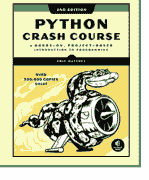

## 多个图表

你可以在一个图形上制作任意多个图表。当你制作多个图表时，可以强调数据之间的关系。例如，你可以填充两组数据之间的空间。

### 绘制两组数据

这里我们使用两次`ax.scatter()`在同一图形上绘制平方数和立方数。

```python
import matplotlib.pyplot as plt

x_values = list(range(11))
squares = [x**2 for x in x_values]
cubes = [x**3 for x in x_values]

plt.style.use('seaborn')
fig, ax = plt.subplots()

ax.scatter(x_values, squares, c='blue', s=10)
ax.scatter(x_values, cubes, c='red', s=10)

plt.show()
```

### 填充数据集之间的空间

`fill_between()`方法填充两个数据集之间的空间。它接受一系列x值和两系列y值。它还接受一个用于填充的`facecolor`，以及一个可选的`alpha`参数来控制颜色的透明度。

```python
ax.fill_between(x_values, cubes, squares,
                facecolor='blue', alpha=0.25)
```

## 处理日期和时间

许多有趣的数据集以日期或时间作为x值。Python的`datetime`模块可以帮助你处理这类数据。

### 生成当前日期

`datetime.now()`函数返回一个表示当前日期和时间的`datetime`对象。

```python
from datetime import datetime as dt

today = dt.now()
date_string = today.strftime('%m/%d/%Y')
print(date_string)
```

### 生成特定日期

你也可以为任何你想要的日期和时间生成一个`datetime`对象。参数的顺序是年、月、日。小时、分钟、秒和微秒参数是可选的。

```python
from datetime import datetime as dt

new_years = dt(2021, 1, 1)
fall_equinox = dt(year=2021, month=9, day=22)
```

### 处理日期和时间（续）

### 日期时间格式化参数

`strptime()`函数从字符串生成`datetime`对象，而`strftime()`方法从`datetime`对象生成格式化的字符串。以下代码可以让你完全按照需要处理日期。

```
%A  星期名称，例如 Monday
%B  月份名称，例如 January
%m  月份，数字形式（01 到 12）
%d  月份中的日期，数字形式（01 到 31）
%Y  四位数年份，例如 2021
%y  两位数年份，例如 21
%H  小时，24小时制（00 到 23）
%I  小时，12小时制（01 到 12）
%p  AM 或 PM
%M  分钟（00 到 59）
%S  秒（00 到 61）
```

### 将字符串转换为datetime对象

```python
new_years = dt.strptime('1/1/2021', '%m/%d/%Y')
```

### 将datetime对象转换为字符串

```python
ny_string = new_years.strftime('%B %d, %Y')
print(ny_string)
```

### 绘制最高温度

以下代码创建一个日期列表和一个对应的最高温度列表。然后绘制最高温度，并以特定格式显示日期标签。

```python
from datetime import datetime as dt

import matplotlib.pyplot as plt
from matplotlib import dates as mdates

dates = [
    dt(2020, 6, 21), dt(2020, 6, 22),
    dt(2020, 6, 23), dt(2020, 6, 24),
    ]
highs = [56, 57, 57, 64]

fig, ax = plt.subplots()
ax.plot(dates, highs, c='red')

ax.set_title("Daily High Temps", fontsize=24)
ax.set_ylabel("Temp (F)", fontsize=16)
x_axis = ax.get_xaxis()
x_axis.set_major_formatter(
    mdates.DateFormatter('%B %d %Y')
    )
fig.autofmt_xdate()

plt.show()
```

## 一个图形中的多个图表

你可以在一个图形中包含任意多个独立的图表。

### 共享x轴

以下代码在两个共享公共x轴的独立图表上绘制一组平方数和一组立方数。`plt.subplots()`函数返回一个图形对象和一个坐标轴元组。每组坐标轴对应图形中的一个独立图表。前两个参数控制图形中生成的行数和列数。

```python
import matplotlib.pyplot as plt

x_values = list(range(11))
squares = [x**2 for x in x_values]
cubes = [x**3 for x in x_values]

fig, axs = plt.subplots(2, 1, sharex=True)

axs[0].scatter(x_values, squares)
axs[0].set_title('Squares')

axs[1].scatter(x_values, cubes, c='red')
axs[1].set_title('Cubes')

plt.show()
```

### 共享y轴

要共享y轴，我们使用`sharey=True`参数。

```python
import matplotlib.pyplot as plt

x_values = list(range(11))
squares = [x**2 for x in x_values]
cubes = [x**3 for x in x_values]

plt.style.use('seaborn')
fig, axs = plt.subplots(1, 2, sharey=True)

axs[0].scatter(x_values, squares)
axs[0].set_title('Squares')

axs[1].scatter(x_values, cubes, c='red')
axs[1].set_title('Cubes')

plt.show()
```

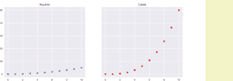

更多速查表可在 ehmatthes.github.io/pcc_2e/ 获取

## 初学者 Python 速查表 - Plotly

## 什么是 Plotly？

数据可视化是通过视觉表示来探索数据的过程。Plotly 帮助你制作出视觉上吸引人的数据表示。Plotly 特别适合用于在线展示的可视化，因为它支持交互元素。

## 安装 Plotly

Plotly 可在所有系统上运行，并且可以通过一行命令安装。

安装 Plotly

```
$ python -m pip install --user plotly
```

## 折线图、散点图和条形图

要使用 Plotly 制作图表，你需要指定数据，然后将其传递给图形对象。数据存储在列表中，因此你可以向任何图表添加任意多的数据。在离线模式下，输出应会自动在浏览器窗口中打开。

## 制作折线图

折线图是将点连接起来的散点图。Plotly 生成 JavaScript 代码来渲染图表文件。如果你好奇想看看代码，可以在运行此程序后，在文本编辑器中打开 squares.html 文件。

```
from plotly.graph_objs import Scatter
from plotly import offline

# 定义数据。
x_values = list(range(11))
squares = [x**2 for x in x_values]

# 将数据传递给图形对象，并将其存储在列表中。
data = [Scatter(x=x_values, y=squares)]

# 将数据和文件名传递给 plot()。
offline.plot(data, filename='squares.html')
```

## 制作散点图

要制作散点图，请使用 `mode='markers'` 参数来告诉 Plotly 只显示标记点。

```
data = [Scatter(x=x_values, y=squares,
                mode='markers')]
```

## 折线图、散点图和条形图（续）

## 制作条形图

要制作条形图，请将你的数据传递给 `Bar()` 图形对象。

```
from plotly.graph_objs import Bar
--snip--

data = [Bar(x=x_values, y=squares)]

# 将数据和文件名传递给 plot()。
offline.plot(data, filename='squares.html')
```

## 添加标题和标签

## 使用布局对象

`Layout` 类允许你为可视化指定标题、标签和其他格式化指令。

```
from plotly.graph_objs import Scatter, Layout
from plotly import offline

x_values = list(range(11))
squares = [x**2 for x in x_values]

data = [Scatter(x=x_values, y=squares)]

# 添加标题和每个轴的标签。
title = 'Square Numbers'
x_axis_config = {'title': 'x'}
y_axis_config = {'title': 'Square of x'}

my_layout = Layout(title=title,
                   xaxis=x_axis_config, yaxis=y_axis_config)

offline.plot(
    {'data': data, 'layout': my_layout},
    filename='squares.html')
```

## 指定复杂数据

## 数据作为字典

Plotly 高度可定制，其大部分灵活性来自于将数据和格式化指令表示为字典。以下是与前面示例相同的数据，定义为字典。
将数据定义为字典还允许你指定关于每个数据系列的更多信息。任何与特定数据系列相关的内容，如标记、线条和点标签，都放在数据字典中。Plotly 有多种指定数据的方式，但内部所有数据都以这种方式表示。

```
data = [{
    'type': 'scatter',
    'x': x_values,
    'y': squares,
    'mode': 'markers',
}]
```

## 多个图表

你可以在一个可视化中包含任意多的数据系列。为此，请为每个数据系列创建一个字典，并将这些字典放入数据列表中。这些字典中的每一个在 Plotly 文档中都被称为一个 trace（轨迹）。

## 绘制平方和立方

这里我们使用 'name' 属性为每个 trace 设置标签。

```
from plotly.graph_objs import Scatter
from plotly import offline

x_values = list(range(11))
squares = [x**2 for x in x_values]
cubes = [x**3 for x in x_values]

data = [
    {
        # Trace 1: 平方
        'type': 'scatter',
        'x': x_values,
        'y': squares,
        'name': 'Squares',
    },
    {
        # Trace 2: 立方
        'type': 'scatter',
        'x': x_values,
        'y': cubes,
        'name': 'Cubes',
    },
]

offline.plot(data,
             filename='squares_cubes.html')
```

### 在线资源

Plotly 文档内容丰富且组织良好。从 plotly.com/python/ 上的概述开始。在这里你可以看到所有基本图表类型的示例，并点击任何示例查看相关教程。
然后查看 Python Figure Reference（Python 图形参考），地址是 plotly.com/python/reference/。也请查看 plotly.com/python/figure-structure/ 上的 Figure Data Structure in Python（Python 中的图形数据结构）页面。

### Python Crash Course

A Hands-on, Project-Based Introduction to Programming

nostarch.com/pythoncrashcourse2e

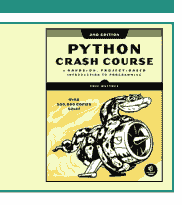

## 指定复杂布局

你也可以将可视化的布局指定为字典，这让你对整体布局有更大的控制权。

## 布局作为字典

这是我们之前使用的相同布局，写成字典形式。像图表标题这样的简单元素只是键值对。更复杂的元素，如坐标轴（它们可以有许多自己的设置），是嵌套字典。

```
my_layout = {
    'title': 'Square Numbers',
    'xaxis': {
        'title': 'x',
    },
    'yaxis': {
        'title': 'Square of x',
    },
}
```

## 更复杂的布局

这是相同数据的布局，在数据和布局字典中有更具体的格式化指令。

```
from plotly.graph_objs import Scatter
from plotly import offline

x_values = list(range(11))
squares = [x**2 for x in x_values]

data = [{
    'type': 'scatter',
    'x': x_values,
    'y': squares,
    'mode': 'markers',
    'marker': {
        'size': 10,
        'color': '#6688dd',
    },
}]

my_layout = {
    'title': 'Square Numbers',
    'xaxis': {
        'title': 'x',
        'titlefont': {'family': 'monospace'},
    },
    'yaxis': {
        'title': 'Square of x',
        'titlefont': {'family': 'monospace'},
    },
}

offline.plot(
    {'data': data, 'layout': my_layout},
    filename='squares.html')
```

## 指定复杂布局（续）

## 使用颜色比例尺

颜色比例尺通常用于显示大型数据集中的变化。在 Plotly 中，颜色比例尺在标记字典中设置，该字典嵌套在数据字典内。

```
data = [{
    'type': 'scatter',
    'x': x_values,
    'y': squares,
    'mode': 'markers',
    'marker': {
        'colorscale': 'Viridis',
        'color': squares,
        'colorbar': {'title': 'Value'},
    },
}]
```

## 使用子图

让多个图表共享相同的坐标轴通常很有用。这可以通过使用 `subplots` 模块来完成。

## 向图形添加子图

要使用 `subplots` 模块，请创建一个图形来容纳所有将要制作的图表。然后使用 `add_trace()` 方法将每个数据系列添加到整体图形中。
如需更多帮助，请参阅 plot.ly/python/subplots/ 上的文档。

```
from plotly.subplots import make_subplots
from plotly.graph_objects import Scatter
from plotly import offline

x_values = list(range(11))
squares = [x**2 for x in x_values]
cubes = [x**3 for x in x_values]

# 创建两个共享 y 轴的子图。
fig = make_subplots(rows=1, cols=2,
                    shared_yaxes=True)

data = {
    'type': 'scatter',
    'x': x_values,
    'y': squares,
}
fig.add_trace(data, row=1, col=1)

data = {
    'type': 'scatter',
    'x': x_values,
    'y': cubes,
}
fig.add_trace(data, row=1, col=2)

offline.plot(fig, filename='subplots.html')
```

## 绘制全球数据集

Plotly 拥有各种地图工具。例如，如果你有一组由经纬度表示的点，你可以创建这些点的散点图并叠加在地图上。

## scattergeo 图表类型

这是一张显示北美三座较高峰位置的地图。如果你将鼠标悬停在每个点上，你会看到它的位置和山峰的名称。

```
from plotly import offline

# 以 (纬度, 经度) 格式表示的点。
peak_coords = [
    (63.069, -151.0063),
    (60.5671, -140.4055),
    (46.8529, -121.7604),
]

# 制作匹配的纬度、经度和标签列表。
lats = [pc[0] for pc in peak_coords]
lons = [pc[1] for pc in peak_coords]
peak_names = ['Denali', 'Mt Logan',
              'Mt Rainier']

data = [{
    'type': 'scattergeo',
    'lon': lons,
    'lat': lats,
    'marker': {
        'size': 20,
        'color': '#227722',
    },
    'text': peak_names,
}]

my_layout = {
    'title': 'Selected High Peaks',
    'geo': {
        'scope': 'north america',
        'showland': True,
        'showocean': True,
        'showlakes': True,
        'showrivers': True,
    },
}

offline.plot(
    {'data': data, 'layout': my_layout},
    filename='peaks.html')
```

更多速查表可在 ehmatthes.github.io/pcc_2e/ 获取

## 初学者 Python 速查表 - Django

## 什么是 Django？

Django 是一个 Web 框架，可帮助你使用 Python 构建交互式网站。通过 Django，你可以定义网站将处理的数据类型，以及用户与这些数据交互的方式。
Django 既适用于小型项目，也同样适用于拥有数百万用户的网站。

## 安装 Django

通常最好将 Django 安装到虚拟环境中，这样你的项目可以与其他 Python 项目隔离。大多数命令都假设你正在一个活动的虚拟环境中工作。

### 创建虚拟环境

```
$ python -m venv ll_env
```

### 激活环境（macOS 和 Linux）

```
$ source ll_env/bin/activate
```

### 激活环境（Windows）

```
> ll_env\Scripts\activate
```

### 将 Django 安装到活动环境中

```
(ll_env)$ pip install Django
```

## 创建项目

首先，我们将创建一个新项目，创建一个数据库，并启动一个开发服务器。

### 创建新项目

请确保在此命令末尾包含点号。

```
$ django-admin startproject learning_log .
```

### 创建数据库

```
$ python manage.py migrate
```

### 查看项目

执行此命令后，你可以在 http://localhost:8000/ 查看项目。

```
$ python manage.py runserver
```

### 创建新应用

一个 Django 项目由一个或多个应用组成。

```
$ python manage.py startapp learning_logs
```

## 使用模型

Django 项目中的数据被组织为一组模型。每个模型由一个类表示。

### 定义模型

要为你的应用定义模型，请修改在应用文件夹中创建的 `models.py` 文件。`__str__()` 方法告诉 Django 如何基于此模型表示数据对象。

```
from django.db import models

class Topic(models.Model):
    """用户正在学习的主题。"""

    text = models.CharField(max_length=200)
    date_added = models.DateTimeField(
        auto_now_add=True)

    def __str__(self):
        return self.text
```

### 激活模型

要使用模型，必须将该应用添加到 `INSTALLED_APPS` 列表中，该列表存储在项目的 `settings.py` 文件中。

```
INSTALLED_APPS = [
    # 我的应用。
    'learning_logs',

    # 默认的 Django 应用。
    'django.contrib.admin',
]
```

### 迁移数据库

需要修改数据库以存储模型所代表的数据类型。每次创建新模型或修改现有模型时，都需要运行这些命令。

```
$ python manage.py makemigrations learning_logs
$ python manage.py migrate
```

### 创建超级用户

超级用户是一个可以访问项目所有方面的用户账户。

```
$ python manage.py createsuperuser
```

### 注册模型

你可以将模型注册到 Django 的管理站点，这使得处理项目中的数据更加容易。为此，请修改应用的 `admin.py` 文件。在 http://localhost:8000/admin/ 查看管理站点。你需要使用超级用户账户登录。

```
from django.contrib import admin

from .models import Topic

admin.site.register(Topic)
```

## 构建简单主页

用户通过网页与项目交互，项目的主页可以从一个没有数据的简单页面开始。一个页面通常需要一个 URL、一个视图和一个模板。

### 映射项目的 URL

项目的主 `urls.py` 文件告诉 Django 在哪里可以找到与项目中每个应用关联的 `urls.py` 文件。

```
from django.contrib import admin
from django.urls import path, include

urlpatterns = [
    path('admin/', admin.site.urls),
    path('', include('learning_logs.urls')),
]
```

### 映射应用的 URL

应用的 `urls.py` 文件告诉 Django 对于应用中的每个 URL 使用哪个视图。你需要自己创建此文件，并将其保存在应用文件夹中。

```
from django.urls import path

from . import views

app_name = 'learning_logs'
urlpatterns = [
    # 主页。
    path('', views.index, name='index'),
]
```

### 编写简单视图

视图从请求中获取信息并将数据发送到浏览器，通常通过模板。视图函数存储在应用的 `views.py` 文件中。这个简单的视图函数不获取任何数据，但它使用模板 `index.html` 来渲染主页。

```
from django.shortcuts import render

def index(request):
    """学习日志的主页。"""
    return render(request,
        'learning_logs/index.html')
```

### 在线资源

Django 的文档可在 docs.djangoproject.com/ 获取。Django 文档全面且用户友好，所以请查看一下！

### Python Crash Course

A Hands-on, Project-Based Introduction to Programming

nostarch.com/pythoncrashcourse2e

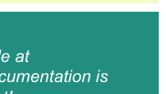

## 构建简单主页（续）

### 编写简单模板

模板为页面设置结构。它是 HTML 和模板代码的混合，模板代码类似于 Python 但功能不那么强大。在项目文件夹内创建一个名为 `templates` 的文件夹。在 `templates` 文件夹内，创建另一个与应用同名的文件夹。模板文件应保存在此处。

主页模板将保存为 `learning_logs/templates/learning_logs/index.html`。

```
<p>学习日志</p>

<p>学习日志帮助你跟踪你正在学习的任何主题的学习情况。</p>
```

### 模板继承

网页的许多元素在网站的每个页面或网站某个部分的每个页面上重复出现。通过为网站编写一个父模板，为每个部分编写一个子模板，你可以轻松修改整个网站的外观和感觉。

### 父模板

父模板定义了一组页面共有的元素，并定义了将由各个页面填充的块。

```
<p>
  <a href="">
    学习日志
  </a>
</p>


```

### 子模板

子模板使用 `` 模板标签来引入父模板的结构。然后它为父模板中定义的任何块定义内容。

```




  <p>
    学习日志帮助你跟踪
    你正在学习的任何主题的学习情况。
  </p>


```

### 模板缩进

Python 代码通常缩进四个空格。在模板中，你通常会看到使用两个空格进行缩进，因为模板中的元素往往嵌套得更深。

### 另一个模型

一个新模型可以使用现有模型。`ForeignKey` 属性在两个相关模型的实例之间建立连接。确保在向应用添加新模型后迁移数据库。

### 定义带有外键的模型

```
class Entry(models.Model):
    """某个主题的学习日志条目。"""
    topic = models.ForeignKey(Topic,
            on_delete=models.CASCADE)
    text = models.TextField()
    date_added = models.DateTimeField(
            auto_now_add=True)

    def __str__(self):
        return f"{self.text[:50]}..."
```

## 构建包含数据的页面

项目中的大多数页面需要呈现特定于当前用户的数据。

### URL 参数

URL 通常需要接受一个参数，告诉它从数据库访问什么数据。此处显示的 URL 模式查找特定主题的 ID 并将其分配给参数 `topic_id`。

```
urlpatterns = [
    --snip--
    # 单个主题的详情页。
    path('topics/<int:topic_id>/', views.topic,
         name='topic'),
]
```

### 在视图中使用数据

视图使用 URL 中的参数从数据库中提取正确的数据。在此示例中，视图向模板发送一个上下文字典，其中包含应在页面上显示的数据。你需要导入你正在使用的任何模型。

```
def topic(request, topic_id):
    """显示一个主题及其所有条目。"""
    topic = Topic.objects.get(id=topic_id)
    entries = topic.entry_set.order_by(
            '-date_added')
    context = {
        'topic': topic,
        'entries': entries,
    }
    return render(request,
            'learning_logs/topic.html', context)
```

### 重启开发服务器

如果你对项目进行了更改，但更改似乎没有任何效果，请尝试重启服务器：

```
$ python manage.py runserver
```

## 构建包含数据的页面（续）

### 在模板中使用数据

视图函数上下文字典中的数据在模板内可用。这些数据使用模板变量访问，模板变量由双花括号表示。

模板变量后的竖线表示过滤器。在这种情况下，一个名为 `date` 的过滤器格式化日期对象，而 `linebreaks` 过滤器在网页上正确渲染段落。

```




  <p>主题：{{ topic }}</p>

  <p>条目：</p>
  <ul>
    
      <li>
        <p>
          {{ entry.date_added|date:'M d, Y H:i' }}
        </p>

        <p>
          {{ entry.text|linebreaks }}
        </p>
      </li>
    
      <li>目前还没有条目。</li>
    
  </ul>


```

### Django shell

你可以从命令行探索项目中的数据。这对于开发查询和测试代码片段很有帮助。

### 启动 shell 会话

```
$ python manage.py shell
```

### 从项目访问数据

```
>>> from learning_logs.models import Topic
>>> Topic.objects.all()
[<Topic: Chess>, <Topic: Rock Climbing>]
>>> topic = Topic.objects.get(id=1)
>>> topic.text
'Chess'
>>> topic.entry_set.all()
<QuerySet [<Entry: In the opening phase...>]>
```

更多速查表可在 ehmatthes.github.io/pcc_2e/ 获取

## 初学者Python速查表 - Django，第2部分

## 用户与表单

大多数Web应用程序需要让用户创建账户。这使用户能够创建和处理自己的数据。其中一些数据可能是私有的，另一些可能是公开的。Django的表单允许用户输入和修改他们的数据。

## 用户账户

用户账户由一个专门的应用程序处理，我们称之为users。用户需要能够注册、登录和登出。Django为你自动化了大部分这项工作。

## 创建users应用

创建应用后，务必将'users'添加到项目的settings.py文件中的INSTALLED_APPS。

```
$ python manage.py startapp users
```

## 包含users应用的URL

在项目的urls.py文件中添加一行，以便将users应用的URL包含在项目中。

```
from django.contrib import admin
from django.urls import path, include

urlpatterns = [
    path('admin/', admin.site.urls),
    path('users/', include('users.urls')),
    path('', include('learning_logs.urls')),
]
```

## 在Django中使用表单

创建表单和处理表单有多种方式。你可以使用Django的默认设置，或者完全自定义你的表单。如果你想让用户基于你的模型输入数据，一个简单的方法是使用ModelForm。这会创建一个表单，允许用户输入数据来填充模型上的字段。

本速查表背面的register视图展示了表单处理的一个简单方法。如果视图没有从表单接收到数据，它会返回一个空白表单。如果它接收到表单的POST数据，它会验证数据，然后将其保存到数据库。

## 用户账户（续）

## 定义URL

用户需要能够登录、登出和注册。在users应用文件夹中创建一个新的urls.py文件。

```
from django.urls import path, include

from . import views

app_name = 'users'
urlpatterns = [
    # 包含默认的认证URL。
    path('', include(
        'django.contrib.auth.urls')),

    # 注册页面。
    path('register/', views.register,
         name='register'),
]
```

## 登录模板

登录视图是默认提供的，但你需要提供自己的登录模板。此处显示的模板展示了一个简单的登录表单，并提供基本的错误消息。在users文件夹中创建一个templates文件夹，然后在templates文件夹中创建一个registration文件夹。将此文件保存为login.html。路径应为users/templates/registration/login.html。

标签有助于防止一种常见的表单攻击。{{ form.as_p }}元素以段落格式显示默认的登录表单。名为next的<input>元素在成功登录后将用户重定向到主页。

```




  
    <p>您的用户名和密码不匹配。
    请重试。</p>
  

  <form method="post"
        action="">
    
    {{ form.as_p }}
    <button name="submit">登录</button>

    <input type="hidden" name="next"
           value=""/>

  </form>


```

## 用户账户（续）

## 显示当前登录状态

你可以修改base.html模板以显示用户当前是否已登录，并提供登录和登出页面的链接。Django使一个用户对象对每个模板都可用，此模板利用了这个对象。

带有user.is_authenticated的标签允许你根据用户是否已登录来提供特定内容。{{ user.username }}属性允许你向已登录的用户问好。未登录的用户会看到注册或登录的链接。

```
<p>
  <a href="">
    学习日志
  </a>

  
    你好，{{ user.username }}。
    <a href="">
      登出
    </a>
  
    <a href="">
      注册
    </a> -
    <a href="">
      登录
    </a>
  

</p>


```

## logged_out模板

默认的登出视图使用模板logged_out.html渲染页面，该模板需要保存在users/templates/registration/文件夹中。

```



  <p>您已登出。感谢您的访问！</p>

```

## Python速成课程

基于实践的、项目导向的编程入门

nostarch.com/pythoncrashcourse2e

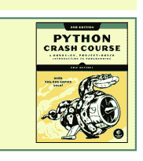

## 用户账户（续）

register视图需要在页面首次请求时显示一个空白的注册表单，然后处理填写完成的注册表单。成功的注册会登录用户并重定向到主页。

```
from django.shortcuts import render, redirect
from django.contrib.auth import login
from django.contrib.auth.forms import \
    UserCreationForm

def register(request):
    """注册新用户。"""

    if request.method != 'POST':
        # 显示空白注册表单。
        form = UserCreationForm()

    else:
        # 处理填写完成的表单。
        form = UserCreationForm(
            data=request.POST)

        if form.is_valid():
            new_user = form.save()

            # 登录，重定向到主页。
            login(request, new_user)
            return redirect(
                'learning_logs:index')

    # 显示空白或无效的表单。
    context = {'form': form}

    return render(request,
        'registration/register.html', context)
```

## 为你的项目设置样式

django-bootstrap4应用允许你使用Bootstrap库使你的项目在视觉上更具吸引力。该应用提供了你可以在模板中使用的标签来设置页面上各个元素的样式。更多信息请访问django-bootstrap4.readthedocs.io/。

## 部署你的项目

Heroku允许你将项目推送到一个在线服务器，使其对任何有互联网连接的人可用。Heroku提供免费的服务级别，让你可以在没有任何承诺的情况下学习部署过程。

你需要安装一组Heroku命令行工具，并使用Git来跟踪项目的状态。请参阅devcenter.heroku.com/，并点击Python链接。

## 用户账户（续）

此处显示的register.html模板以段落格式显示注册表单。

```




  <form method='post'
        action="">

    
    {{ form.as_p }}

    <button name='submit'>注册</button>
    <input type='hidden' name='next'
           value=""/>

  </form>


```

## 将数据连接到用户

用户将拥有属于他们的数据。任何应直接连接到用户的模型都需要一个字段，将模型的实例连接到特定用户。

## 使主题属于用户

只有层次结构中的最高级数据需要直接连接到用户。为此，导入User模型，并将其作为外键添加到数据模型上。

修改模型后，你需要迁移数据库。你需要选择一个用户ID来连接每个现有实例。

```
from django.db import models
from django.contrib.auth.models import User

class Topic(models.Model):
    """用户正在学习的主题。"""
    text = models.CharField(max_length=200)
    date_added = models.DateTimeField(
        auto_now_add=True)

    owner = models.ForeignKey(User,
        on_delete=models.CASCADE)

    def __str__(self):
        return self.text
```

## 查询当前用户的数据

在视图中，request对象有一个user属性。你可以使用此属性来查询用户的数据。然后，filter()方法会提取属于当前用户的数据。

```
topics = Topic.objects.filter(
    owner=request.user)
```

## 将数据连接到用户（续）

## 限制对已登录用户的访问

某些页面仅与注册用户相关。这些页面的视图可以通过@login_required装饰器进行保护。任何带有此装饰器的视图都会自动将未登录的用户重定向到适当的页面。这是一个示例views.py文件。

```
from django.contrib.auth.decorators import \
    login_required
--snip--

@login_required
def topic(request, topic_id):
    """显示一个主题及其所有条目。"""
```

## 设置重定向URL

@login_required装饰器将未授权用户发送到登录页面。在你的项目的settings.py文件中添加以下行，以便Django知道如何找到你的登录页面。

```
LOGIN_URL = 'users:login'
```

## 防止意外访问

某些页面根据URL中的参数提供数据。你可以检查当前用户是否拥有请求的数据，如果没有，则返回404错误。这是一个示例视图。

```
from django.http import Http404
--snip--

@login_required
def topic(request, topic_id):
    """显示一个主题及其所有条目。"""
    topic = Topics.objects.get(id=topic_id)
    if topic.owner != request.user:
        raise Http404
--snip--
```

## 使用表单编辑数据

如果你提供一些初始数据，Django会生成一个包含用户现有数据的表单。然后用户可以修改并保存他们的数据。

## 创建带有初始数据的表单

instance参数允许你为表单指定初始数据。

```
form = EntryForm(instance=entry)
```

## 在保存前修改数据

commit=False参数允许你在将数据写入数据库之前进行更改。

```
new_topic = form.save(commit=False)
new_topic.owner = request.user
new_topic.save()
```

更多速查表可在 ehmatthes.github.io/pcc_2e/ 获取

## 初学者Python速查表 - Git

## 版本控制

版本控制软件允许你在项目处于可工作状态时随时创建快照。如果项目停止工作，你可以回滚到最近的可工作版本。

版本控制很重要，因为它让你可以自由尝试代码的新想法，而不用担心会破坏整个项目。像Git这样的分布式版本控制系统在与其他开发者协作时也非常有用。

## 安装Git

你可以在git-scm.com/找到适合你系统的安装程序。在此之前，请检查系统中是否已安装Git：

```
$ git --version
git version 2.20.1 (Apple Git-117)
```

## 配置Git

你可以配置Git，使其某些功能更易于使用。编辑器设置控制Git在需要你输入文本时将打开哪个编辑器。

查看所有全局设置

```
$ git config --list
```

设置用户名

```
$ git config --global user.name "eric"
```

设置邮箱

```
$ git config --global user.email "eric@example.com"
```

设置编辑器

```
$ git config --global core.editor "nano"
```

## 忽略文件

要忽略文件，请创建一个名为".gitignore"的文件，以点开头且没有扩展名。然后列出你想要忽略的目录和文件。

忽略目录

```
__pycache__/
my_venv/
```

忽略特定文件

```
.DS_Store
secret_key.txt
```

忽略具有特定扩展名的文件

```
*.pyc
```

## 初始化仓库

Git用于管理仓库的所有文件都位于隐藏目录.git中。不要删除该目录，否则你将丢失项目的历史记录。

初始化仓库

```
$ git init
Initialized empty Git repository in my_project/.git/
```

## 检查状态

经常检查项目状态很重要，即使在第一次提交之前也是如此。这将告诉你Git计划跟踪哪些文件。

检查状态

```
$ git status
On branch main
No commits yet
Untracked files:
    .gitignore
    hello.py
    ...
```

## 添加文件

你需要添加你希望Git跟踪的文件。

添加所有不在.gitignore中的文件

```
$ git add .
```

添加单个文件

```
$ git add hello.py
```

## 进行提交

进行提交时，-am标志会提交所有已添加的文件，并记录提交信息。（在每次提交前检查状态是个好主意。）

使用消息进行提交

```
$ git commit -am "Started project, everything works."
2 files changed, 8 insertions(+)
create mode 100644 .gitignore
```

## 查看日志

Git会记录你所做的所有提交。查看日志有助于了解项目的历史。

以默认格式查看日志

```
$ git log
commit 7c0a5d8... (HEAD -> main)
Author: Eric Matthes <eric@example.com>
Date:   Mon Feb 15 08:40:21 2021 -0900
    Greets user.
commit b9aedbb...
...
```

以更简洁的格式查看日志

```
$ git log --oneline
7c0a5d8 (HEAD -> main) Greets user.
b9aedbb Started project, everything works.
```

## 探索历史

你可以通过访问特定的提交哈希或引用项目的HEAD来探索项目的历史。HEAD指的是当前分支的最近一次提交。

访问特定提交

```
$ git checkout b9aedbb
```

返回到main分支的最近提交

```
$ git checkout main
```

访问上一次提交

```
$ git checkout HEAD^
```

访问更早的提交

```
$ git checkout HEAD^^^
```

访问上一次提交

```
$ git checkout HEAD~1
```

访问更早的提交

```
$ git checkout HEAD~3
```

## 学习更多

你可以通过命令`git help`学习更多关于使用Git的知识。你也可以访问Stack Overflow并搜索git，然后按投票数对问题进行排序。

## Python速查表

基于实践和项目的编程入门

nostarch.com/pythoncrashcourse2e

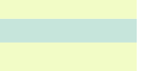

## 分支

当你即将进行的工作涉及多次提交时，你可以创建一个分支来完成这项工作。你所做的更改将与主分支保持分离，直到你选择合并它们。通常在合并回主分支后会删除该分支。分支也可用于维护项目的独立版本。

创建一个新分支并切换到它

```
$ git checkout -b new_branch_name
Switched to a new branch 'new_branch_name'
```

查看所有分支

```
$ git branch
* new_branch_name
  main
```

切换到不同的分支

```
$ git checkout main
Switched to branch 'main'
```

合并更改

```
$ git merge new_branch_name
Updating b9aedbb..5e5130a
Fast-forward
 hello.py | 5 +++++
 1 file changed, 5 insertions(+)
```

删除一个分支

```
$ git branch -D new_branch_name
Deleted branch new_branch_name (was 5e5130a).
```

将最后一次提交移动到新分支

```
$ git branch new_branch_name
$ git reset --hard HEAD~1
$ git checkout new_branch_name
```

## 撤销最近的更改

版本控制的主要目的之一是允许你回到项目的任何可工作状态并从那里重新开始。

丢弃所有未提交的更改

```
$ git checkout .
```

丢弃自特定提交以来的所有更改

```
$ git reset --hard b9aedbb
```

从之前的提交创建新分支

```
$ git checkout -b branch_name b9aedbb
```

## 暂存更改

如果你想保存一些更改而不进行提交，可以暂存你的更改。当你想在不创建新提交的情况下重新访问最近一次提交时，这很有用。你可以根据需要暂存任意多组更改。

暂存自上次提交以来的更改

```
$ git stash
Saved working directory and index state
      WIP on main: f6f39a6...
```

查看暂存的更改

```
$ git stash list
stash@{0}: WIP on main: f6f39a6...
stash@{1}: WIP on main: f6f39a6...
...
```

重新应用最近一次暂存的更改

```
$ git stash pop
```

重新应用特定暂存的更改

```
$ git stash pop --index 1
```

清除所有暂存的更改

```
$ git stash clear
```

## 比较提交

比较项目不同状态之间的更改通常很有帮助。

查看自上次提交以来的所有更改

```
$ git diff
```

查看单个文件自上次提交以来的更改

```
$ git diff hello.py
```

查看自特定提交以来的更改

```
$ git diff HEAD~2
$ git diff HEAD^^
$ git diff fab2cdd
```

查看两个提交之间的更改

```
$ git diff fab2cdd 7c0a5d8
```

查看两个提交之间单个文件的更改

```
$ git diff fab2cdd 7c0a5d8 hello.py
```

## 良好的提交习惯

尽量在项目处于新的可工作状态时进行提交。确保你编写简洁的提交信息，重点说明已实现的更改。如果你开始处理新功能或错误修复，请考虑创建一个新分支。

## Git与GitHub

GitHub是一个共享代码和协作开发代码的平台。你可以克隆GitHub上的任何公共项目。当你拥有账户时，你可以上传自己的项目，并将其设为公共或私有。

将现有仓库克隆到本地系统

```
$ git clone https://github.com/ehmatthes/pcc_2e.git/
Cloning into 'pcc_2e'...
...
Resolving deltas: 100% (816/816), done.
```

将本地项目推送到GitHub仓库

你需要先在GitHub上创建一个空仓库。

```
$ git remote add origin https://github.com/username/hello_repo.git
$ git push -u origin main
Enumerating objects: 10, done.
...
To https://github.com/username/hello_repo.git
 * [new branch]      main -> main
Branch 'main' set up to track remote branch 'main' from 'origin'.
```

将最近的更改推送到你的GitHub仓库

```
$ git push origin branch_name
```

## 使用拉取请求

当你想将一组更改从一个分支拉取到GitHub上项目的主分支时，可以创建一个拉取请求。要在自己的仓库中练习创建拉取请求，请为你的工作创建一个新分支。完成工作后，将分支推送到你的仓库。然后转到GitHub上的"Pull requests"选项卡，并在你希望合并的分支上点击"Compare & pull request"。准备好后，点击"Merge pull request"。然后你可以使用`git pull origin main`将这些更改拉回到你的本地主分支。这是将更改合并到本地主分支，然后将主分支推送到GitHub的替代方法。

## 练习使用Git

Git可以作为独立开发者以简单方式使用，也可以作为大型协作团队的一部分以复杂方式使用。你可以通过创建一个简单的临时项目并尝试所有这些步骤来获得宝贵经验。确保你的项目有多个文件和嵌套文件夹，以清晰了解Git的工作原理。

更多速查表可在ehmatthes.github.io/pcc_2e/获取