# Django 3 入门：构建全栈 Python Web 应用程序

Greg Lim - Daniel Correa

版权所有 © 2021 Greg Lim
保留所有权利。

版权所有 © 2021 Greg Lim

保留所有权利。未经作者书面许可，不得以任何形式或任何电子或机械方式（包括信息存储和检索系统）复制本书的任何部分。唯一例外是评论家，他们可以在评论中引用简短摘录。

第一版：2021年11月

合著者：Daniel Correa

## 目录

- 前言
- 第1章：简介
- 第2章：安装 Python 和 Django
- 第3章：理解项目结构
- 第4章：创建我们的第一个应用
- 第5章：URL
- 第6章：使用模板生成 HTML 页面
- 第7章：为我们的网站添加 Bootstrap
- 第8章：添加搜索表单
- 第9章：模型
- 第10章：Django 管理界面
- 第11章：从管理界面显示对象
- 第12章：重温概念 - 添加新闻应用
- 第13章：理解数据库
- 第14章：在管理界面中显示对象
- 第15章：扩展基础模板
- 第16章：静态文件
- 第17章：电影详情页
- 第18章：创建注册表单
- 第19章：创建用户
- 第20章：显示用户是否已登录
- 第21章：登出
- 第22章：登录
- 第23章：允许用户发布电影评论
- 第24章：创建评论
- 第25章：列出评论
- 第26章：更新评论
- 第27章：删除评论
- 第28章：授权
- 第29章：部署
- 关于作者
- 关于合著者

## 前言

### 关于本书

在本书中，我们将带你踏上一段有趣、实践性强且务实的 Django 全栈开发学习之旅。你将在几分钟内开始构建你的第一个 Django 应用。每一章都以简明扼要、直奔主题的方式编写，因为我们不想在你不需要的内容上浪费你的时间（当然还有我们自己的时间）。最终，你将掌握创建电影评论应用并将其部署到互联网上的技能。

在本书中，我们将涵盖：

- 第1章：简介
- 第2章：安装 Python 和 Django
- 第3章：理解项目结构
- 第4章：创建我们的第一个应用
- 第5章：URL
- 第6章：使用模板生成 HTML 页面
- 第7章：为我们的网站添加 Bootstrap
- 第8章：添加搜索表单
- 第9章：模型
- 第10章：Django 管理界面
- 第11章：从管理界面显示对象
- 第12章：重温概念 - 添加新闻应用
- 第13章：理解数据库
- 第14章：在管理界面中显示对象
- 第15章：扩展基础模板
- 第16章：静态文件
- 第17章：电影详情页
- 第18章：创建注册表单
- 第19章：创建用户
- 第20章：显示用户是否已登录
- 第21章：登出
- 第22章：登录
- 第23章：允许用户发布电影评论
- 第24章：创建评论
- 第25章：列出评论
- 第26章：更新评论
- 第27章：删除评论
- 第28章：授权
- 第29章：部署

本书的目标是以一种易于管理的方式教授你 Django 开发，而不会让你感到不知所措。我们只关注核心内容，并以实践操作的方式涵盖材料，以便你能够跟着一起编码。

### 学习本书

本书特意分解成简短的章节，其中每一章的开发过程将围绕不同的核心主题展开。本书采用实践操作的学习方法。当你跟着书中的示例一起编码时，学习效果最佳。

### 要求

不需要 Django 或 Python 的先验知识，但你应该具备基本的编程知识。我们将在学习过程中解释难以理解的概念。

### 获取书籍更新

要接收本书的更新版本，请通过发送邮件至 [support@i-ducate.com](mailto:support@i-ducate.com) 订阅我们的邮件列表。我尝试更新我的书籍以使用最新版本的软件、库，并将更新本书中的代码/内容。因此，请订阅我的列表以接收更新副本！

### 代码示例

虽然最好你自己手动输入所有代码，但如果你在某个代码示例上遇到困难或遇到奇怪的错误，你可以在 [www.greglim.co/p/django](http://www.greglim.co/p/django) 获取已完成项目的源代码，并与你的代码进行对比。

## 第1章：简介

欢迎来到《Django 3 入门》！本书专注于关键任务和概念，帮助你以更快的速度开始学习和构建 Django 应用程序。它专为那些在学习曲线的这个阶段不需要 Django 所有细节，而专注于真正需要知道的内容的读者设计。

那么 Django 是什么？Django 是一个免费、开源的 Web 框架，用于构建现代 Python Web 应用程序。Django 通过抽象化构建网站时许多重复性的挑战来帮助你快速构建 Web 应用，例如：

- 连接到数据库，
- 处理安全性
- 用户认证
- URL 路由，
- 通过模板和表单在页面上显示内容
- 支持多种数据库后端
- 管理界面等等。

这使得开发人员可以专注于构建 Web 应用程序的功能，而不是为标准的 Web 应用程序功能重新发明轮子。

Django 是目前最受欢迎的框架之一，被 Instagram、Pinterest、Mozilla、National Geographic 等知名公司使用。然而，它也足够简单，可以用于初创公司和个人项目。还有其他流行的框架，如 Python 中的 Flask 和 JavaScript 中的 Express（Greg 写过一本关于 [Express](https://example.com) 的书）。但它们只提供了简单网页所需的最低要求，开发人员必须自己做更多的基础工作，例如为基本网站功能安装和配置第三方包。

### 我们将构建的应用

我们将构建一个电影评论应用，让用户可以查看和搜索电影。他们还可以登录并发布电影评论（图 1.1、1.2、1.3）。


图 1.1 – 带有搜索功能的主页

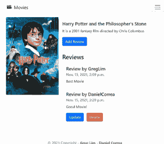

图 1.2 – 列出评论的电影页面

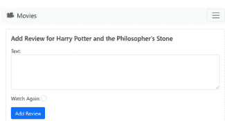

图 1.3 – 创建评论

用户可以在电影页面查看评论列表，如果已登录，可以发布/编辑/删除自己的评论。但他们无法编辑/删除他人的评论。通过这个应用，我们将学习许多概念，如表单、用户授权、权限、外键等等。在本书结束时，你将有信心创建自己的 Django 项目。

我们将在下一章开始安装 Python 和 Django。

## 第2章：安装 Python 和 Django

### 安装 Python

让我们检查一下是否安装了 Python，如果安装了，是什么版本。

如果你使用的是 Mac，请打开终端。如果你使用的是 Windows，请打开命令提示符。为方便起见，在本书中，我将终端和命令提示符统称为“终端”。

我们需要检查是否至少安装了 Python 3.6，以便使用 Django 3。为此，请转到终端并运行：

```
python3 --version
```

（或在 Windows 上使用 *python*）

这将显示你安装的 Python 版本。确保版本至少是 3.6。如果不是，请访问 *python.org* 获取最新版本的 Python。转到“下载”并安装适用于你的操作系统的版本。

安装后，再次运行 `python3 --version`，它应该反映最新的 Python 版本，例如 Python 3.9.7（在撰写本书时）

### 安装 Django

我们将使用 `pip` 来安装 Django。`pip` 是 Python 的标准包管理器，用于安装和管理不属于标准 Python 库的包。

首先检查是否安装了 `pip`，请转到终端并运行：

```
pip3
```

（或在 Windows 上使用 `pip`）

如果你安装了 `pip`，它应该显示 `pip` 命令列表。

要安装 Django，请运行命令：

```
pip3 install django
```

这将检索最新的 Django 代码并在你的机器上安装它。安装完成后，关闭并重新打开终端。

通过运行以下命令确保你已安装 Django：

```
python3 -m django
```

它将显示你可以使用的所有选项（图 2.1）：

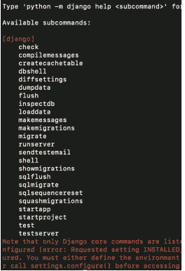

图 2.1

在本书的学习过程中，你将逐步了解其中一些选项。目前，我们将使用 *startproject* 选项来创建一个新项目。

在终端中，导航到你计算机上想要存储 Django 项目的文件夹，例如桌面。在该文件夹中，运行：

```
python3 -m django startproject <project_name>
```

以我们为例，假设我们想将项目命名为 ‘moviereviews’。我们运行：

```
python3 manage.py startapp movie
```

一个 ‘moviereviews’ 文件夹将被创建。我们稍后会讨论其内容。现在，让我们在 Django 本地 Web 服务器上运行我们的第一个网站。

### 运行 Django 本地 Web 服务器

在终端中，*cd* 到已创建的文件夹：

```
cd moviereviews
```

并运行：

```
python3 manage.py runserver
```

当你这样做时，你就在你的机器上启动了本地 Web 服务器（用于本地开发）。将会有一个 URL 链接 http://127.0.0.1:8000/（等同于 http://localhost:8000）。在浏览器中打开该链接，你将看到默认的着陆页（图 2.2）：

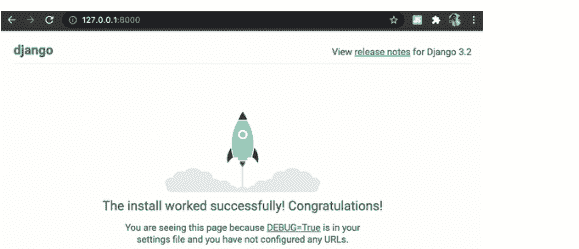

图 2.2

这意味着你的本地 Web 服务器正在运行并提供着陆页！要停止本地服务器，请在终端中输入 Control+c。

在下一章中，我们将查看 Django 为我们创建的项目文件夹内部，并更好地理解它。

## 第三章：理解项目结构

让我们看看为我们创建的项目文件。在代码编辑器中打开项目文件夹 *moviereviews*（我将在本书中使用 VSCode 编辑器 - [https://code.visualstudio.com/](https://code.visualstudio.com/)）。

### *manage.py*

你会看到一个文件 *manage.py*，我们不应该随意修改它（图 3.1）。

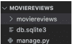

图 3.1

*manage.py* 帮助我们执行管理任务。例如，我们之前运行了：

```
python3 manage.py runserver
```

来启动本地 Web 服务器。我们稍后将展示更多它的管理功能，例如创建一个新应用 – *python3 manage.py startapp*。

### *db.sqlite3*

我们还有一个 *db.sqlite3* 文件，它包含我们的数据库。我们将在 *Models* 章节中更详细地讨论这个文件。

### *moviereviews* 文件夹

你会发现另一个同名的 *moviereviews* 文件夹。为了避免混淆并区分这两个 *moviereviews* 文件夹，我们将保持内部的 *moviereviews* 文件夹不变，并将外部文件夹重命名为 *moviereviewsproject*（图 3.2）。

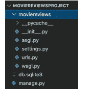

图 3.2

在其中，我们有一个 *__pycache__* 文件夹，用于存储生成项目时编译的字节码。你可以很大程度上忽略这个文件夹。它的目的是通过缓存已编译的代码来使你的项目启动得稍快一些，以便它可以立即执行。

__init__.py 指定了 Django 首次启动时要运行的内容。同样，我们可以忽略这个文件。

asgi.py 允许运行一个可选的异步服务器网关接口。wsgi.py 代表 Web 服务器网关接口，帮助 Django 提供我们的网页。这两个文件在部署我们的应用时都会用到。我们将在部署应用时重新讨论它们。

### urls.py

这个文件告诉 Django 哪些页面应该响应浏览器或 URL 请求进行渲染。例如，当有人输入 url http://localhost:8000/123 时，请求会进入 urls.py，并根据其中指定的路径路由到一个页面。我们稍后将向此文件添加路径，并更好地理解它的工作原理。

### settings.py

*settings.py* 文件是一个重要的文件，控制着我们项目的设置。它包含几个属性：

-   BASE_DIR 确定项目在你机器上的位置
-   SECRET_KEY 在你的网站有数据流入和流出时使用。永远不要与他人分享这个密钥
-   DEBUG – 我们的站点可以在调试模式或非调试模式下运行。在调试模式下，我们会获得关于错误的详细信息。例如，如果我尝试在浏览器中运行 http://localhost:8000/123，我将看到一个 404 页面未找到的错误，并附有错误详情（图 3）。

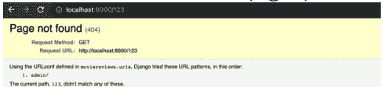

图 3

如果 DEBUG = False，我们将看到一个没有错误详情的通用 404 页面。在开发我们的项目时，我们设置 DEBUG = True 以帮助我们调试。当将我们的应用部署到生产环境时，我们应该将 DEBUG 设置为 False。

-   INSTALLED_APPS 允许我们将不同的代码片段引入我们的项目。我们稍后将看到它的实际应用。
-   MIDDLEWARE 是 Django 的内置函数，用于辅助我们的项目
-   ROOT_URLCONF 指定我们的 URL 位置
-   TEMPLATES 帮助我们返回 HTML 代码
-   AUTH_PASSWORD_VALIDATORS 允许我们指定对密码的验证要求。例如，最小长度

*settings.py* 中还有一些其他属性，如 LANGUAGE_CODE 和 TIME_ZONE，但我们重点关注了更重要的那些。我们稍后将重新讨论这个文件，并看看它在开发我们的站点时有多重要。接下来，让我们创建我们的第一个应用！

## 第四章：创建我们的第一个应用

在第二章中，我们创建了一个 Django 项目。一个 Django 项目可以包含一个或多个 *应用*，它们协同工作以驱动一个 Web 应用程序。Django 使用项目和应用的概念来保持代码的整洁和可读性。

例如，在一个像 *rottentomatoes.com* 这样的电影评论网站（图 4.1）中，我们可以有一个用于列出电影的应用，一个用于列出新闻的应用，一个用于支付的应用，一个用于用户身份验证的应用等等。


Django 中的应用就像网站的组成部分。你可以用一个单一的应用创建整个网站。但将其分解成不同的应用，每个应用代表一个清晰的功能，是很有用的。

我们的电影评论网站将从一个应用开始。随着我们的进展，我们将添加更多应用。要添加一个应用，在终端中，停止服务器（Cmd + c）。导航到 *moviereviewsproject* 文件夹（**不是 *moviereviews***），并在终端中运行：

```
python3 manage.py startapp <name of app>
```

以我们为例，我们将添加一个 *movie* 应用。所以运行：

```
python3 manage.py startapp movie
```

一个新的 *movie* 文件夹将被添加到项目中。随着本书的进展，我们将解释文件夹内的文件。

尽管我们的新应用存在于我们的 Django 项目中，但 Django 并不“知道”它，直到我们明确添加它。为此，我们在 *settings.py* 中指定它。所以转到 */moviereviews/settings.py*，在 INSTALLED_APPS 下，你会看到已经有六个内置应用。添加应用名称（以**粗体**显示）：

```
...
INSTALLED_APPS = [
    'django.contrib.admin',
    'django.contrib.auth',
    'django.contrib.contenttypes',
    'django.contrib.sessions',
    'django.contrib.messages',
    'django.contrib.staticfiles',
    'movie',
]
...
```

回到终端，运行服务器：

```
python3 manage.py runserver
```

服务器应该能正常运行。我们将在本书的学习过程中了解更多关于应用的知识。

目前，你可能会在运行服务器时在终端中注意到一条消息：

> “ *你有 18 个未应用的迁移。在你为应用（admin, auth, contenttypes, sessions）应用迁移之前，你的项目可能无法正常工作。运行 'python manage.py migrate' 来应用它们。* ”

我们稍后将看到如何解决这个问题。但现在，请记住，我们可以在一个项目中拥有一个或多个应用。

## 第五章：URL

目前，我们只有一个由 Django 提供的默认着陆页。我们如何创建自己的自定义页面，并让不同的 URL 路由到它们？

记住，每次有人在我们的网站上输入一个 URL 时，都会引用 /moviereviews/urls.py。例如 localhost:8000/hello。

目前，当我们访问上述 URL 时，会得到一个错误页面。那么，我们如何为它显示一个合适的页面呢？每次用户输入一个 URL，请求都会经过 urls.py，并查看该 URL 是否匹配任何已定义的路径，以便 Django 服务器可以返回适当的响应。

urls.py 目前的代码是：

```
from django.contrib import admin
from django.urls import path

urlpatterns = [
    path('admin/', admin.site.urls),
]
```

当一个请求经过 *urls.py* 时，它会尝试在 *urlpatterns* 中匹配一个 *path* 对象。例如，如果用户在浏览器中输入 [http://localhost:8000/admin](http://localhost:8000/admin)，它将匹配路径 'admin/'。然后服务器将响应 Django 管理站点（图 5.1 - 我们稍后将探讨这个）。

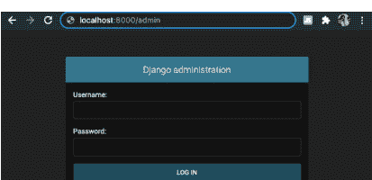

图 5.1

然而，*localhost:8000/hello* 会返回一个 404 未找到页面，因为没有任何匹配的路径。

为了说明如何创建自定义路径，让我们为一个主页创建一个路径。将下面**加粗**的代码添加到 *urls.py* 中：

```python
from django.contrib import admin
from django.urls import path
from movie import views as movieViews

urlpatterns = [
    path('admin/', admin.site.urls),
    path('', movieViews.home),
]
```

### 代码解释

```python
urlpatterns = [
    path('admin/', admin.site.urls),
    path('', movieViews.home),
]
```

我们添加了一个新的 path 对象，其路径为 ''。也就是说，它匹配主页的 url 'localhost:8000/'。如果存在这样的匹配，我们将返回 *movieViews.home*，这是一个返回主页视图的函数。

```python
from movie import views as movieViews
```

我们从哪里获取 *movieViews.home*？我们从 */movie/views.py* 导入它。请注意，它不是 **/moviereviews/views.py**。视图存储在各个应用本身中，即 */movie*。由于我们尚未在 *views.py* 中定义 *home* 函数，让我们继续这样做。

/movie/views.py

在 *views.py* 中，添加以下**加粗**内容：

```python
from django.shortcuts import render
from django.http import HttpResponse

def home(request):
    return HttpResponse('<h1>Welcome to Home Page</h1>')
```

我们创建了一个函数 *home*，它在 *HttpResponse* 中返回 HTML 标记。我们导入了内置的 *HttpResponse* 方法来向用户返回响应对象。保存文件，如果你返回 [http://localhost:8000](http://localhost:8000)，你应该会看到主页显示（图 5.2）：

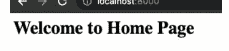

图 5.2

恭喜！我们添加了一个新的主页路径 'localhost:8000/'，它返回一个主页。现在，让我们尝试为用户导航到 *localhost:8000/about* 时创建一个 'About' 页面的另一个路径。

在 /moviereviews/urls.py 中，添加**加粗**的路径：

```python
...
urlpatterns = [
    path('admin/', admin.site.urls),
    path('', movieViews.home),
    path('about/', movieViews.about),
]
```

因此，如果一个 url 匹配 'about/' 路径，它将返回 *about* 函数。让我们在 /movie/views.py 中创建 *about* 函数：

```python
...
def home(request):
    return HttpResponse('<h1>Welcome to Home Page</h1>')

def about(request):
    return HttpResponse('<h1>Welcome to About Page</h1>')
```

保存文件，当你导航到 *localhost:8000/about* 时，它将显示 About 页面。

请注意，当我们对文件进行更改并保存时，Django 会监视文件更改并使用更改重新加载服务器。因此，每次代码更改时，我们不必手动重启服务器。

我们现在知道如何创建自定义路径并返回视图。请注意，*urls.py* 位于项目的主文件夹 *moviereviews* 中。所有对站点的请求都将通过 *urls.py*。但对于视图，例如主页和关于页面视图，它们位于各个应用文件夹中，例如 *movie/views.py*。这允许我们根据视图所属的应用来分离视图。

到目前为止，我们只是返回简单的 HTML 标记。如果我们想返回完整的 HTML 页面怎么办？我们可以像现在这样返回它们。但如果我们能在单独的文件中定义 HTML 页面，那将更理想。让我们看看如何在下一章中这样做。

## 第 6 章：使用模板生成 HTML 页面

每个 Web 框架都需要一种生成完整 HTML 页面的方法。在 Django 中，我们使用 *templates* 来提供单个 HTML 文件。在 *movie* 文件夹中，创建一个名为 *templates* 的文件夹。每个应用都应该有自己的 *templates* 文件夹（图 6.1）。

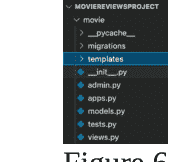

在本书的过程中，你将在 Django 开发中反复看到一个模式：模板、视图和 URL。我们在上一章已经处理过视图和 URL。它们之间的顺序并不重要，但三者都是必需的，并且紧密协作。让我们为 *home* 实现模板和视图。

### 模板

在 /movie/templates/ 中，创建一个新文件 *home.html*。这将是主页的完整 HTML 页面。现在，用以下内容填充它：

```html
<h1>Welcome to Home Page</h1>
<h2>This is the full home page</h2>
```

如你所见，模板只是保存 HTML。

### 视图

回到 /movie/views.py，对 home 函数进行以下更改：

```python
from django.shortcuts import render
from django.http import HttpResponse

def home(request):
    return render(request, 'home.html')
```

注意我们现在使用 *render* 而不是 *HttpResponse*。并且在 *render* 中，我们指定了 *home.html*。因此我们可以继续在 *home.html* 中构建 HTML。

如你所见，视图包含逻辑或“做什么”。目前，我们没有太多逻辑，但随着我们的进展，我们将探索具有更多逻辑的视图。

### URL

我们之前在 /moviereviews/urls.py 中为我们的 *home* 和 *about* 页面创建了 URL：

```python
...
urlpatterns = [
    path('admin/', admin.site.urls),
    path('', movieViews.home),
    path('about/', movieViews.about),
]
```

URL 控制进入页面的路由和入口点，例如 '*about/*'。你将看到每个 Django 网页都有这种模板、视图、URL 的模式。随着我们在本书中多次重复这一点，你将开始内化它。

### 将数据传递到模板

在渲染视图时，我们也可以传入数据。将以下**加粗**内容添加到 `/movie/views.py`：

```python
...
def home(request):
    return render(request, 'home.html', {'name':'Greg Lim'})
...
```

我们传入一个包含键值对 `{'name':'Greg Lim'}` 的字典到 `home.html`。并且在 `home.html` 中，我们使用以下方式检索字典值：

```html
<h1>Welcome to Home Page, {{ name }}</h1>
...
```

{{ name }} 访问字典中的 'name' 键，从而检索值 'Greg Lim'。因此，如果你现在运行站点并转到主页，你应该会看到：

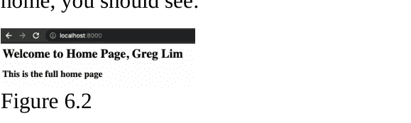

Django 提供模板标签，例如 {{ ... }},  来帮助渲染 HTML。你可以在官方文档中查看内置模板标签的完整列表：(https://docs.djangoproject.com/en/3.2/ref/templates/builtins/)

随着我们的进展，我们将介绍更多的模板标签及其用法。

## 第 7 章：为我们的网站添加 Bootstrap

在我们继续之前，让我们为我们的网站添加 bootstrap。Bootstrap 有助于使我们的网站看起来不错，而无需担心创建漂亮网站所需的必要 HTML/CSS。Bootstrap 是构建响应式和移动友好网站的最流行框架。我们可以选择想要使用的 Bootstrap 组件，例如导航栏、按钮、警报、列表、卡片等，而不是编写自己的 CSS 和 JavaScript，只需将其标记复制并粘贴到我们的模板中。

转到 *getbootstrap.com* 并转到“入门”（图 7.1）。

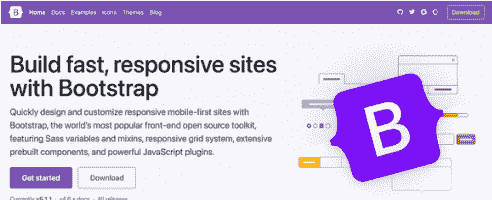

图 7.1

将样式表链接（图 7.2）复制到 *home.html* 的 <head> 中以加载 Bootstrap CSS。

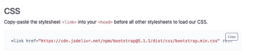

图 7.2

*home.html* 将如下所示：

```html
<head>
  <link
    href="https://cdn.jsdelivr.net/npm/bootstrap@5.1.1/dist/css/bootstrap.min.css"
    rel="stylesheet" crossorigin="anonymous">
</head>
<h1>Welcome to Home Page, {{ name }}</h1>
<h2>This is the full home page</h2>
```

如果你转到 localhost:8000，你可以立即看到应用的样式（图 7.3）：

Welcome to Home Page, Greg Lim
This is the full home page

### 图 7.3

为了改善网站的内边距，让我们将 *home.html* 包装在一个 *div* 容器中：

```html
<head>
...
</head>
<div class="container">
  <h1>Welcome to Home Page, {{ name }}</h1>
  <h2>This is the full home page</h2>
</div>
```

我们还将使用并添加许多其他 Bootstrap 组件到我们的网站。在下一章中，我们将使用 Bootstrap 中的一个表单！

## 第八章：添加搜索表单

我们将在主页添加一个搜索表单，供用户搜索电影。让我们从 *getbootstrap* 获取一个表单组件。在 *getbootstrap.com* 网站上，在“文档”下，进入“表单”、“概览”（图 8.1）。

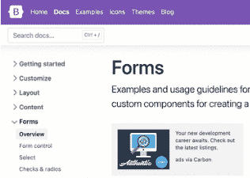

图 8.1

在 *概览* 下，复制标记代码（图 8.2）并将其粘贴到 *home.html* 的 `<div>` 标签内。我们可以移除现有的 `<h1>` 和 `<h2>` 文本消息。

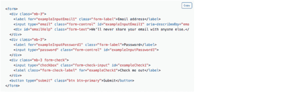

图 8.2

由于我们不需要密码和复选框，请移除它们相关的标记。将“电子邮件地址”更改为“搜索电影”字段，并将“提交”按钮更改为“搜索”。

home.html 现在看起来像这样：

```
<head>
  ...
</head>
<div class="container">
  <form action="">
    <div class="mb-3">
      <label for="searchMovie" class="form-label">
        Search for Movie:
      </label>
      <input type="text" class="form-control"
             name="searchMovie" />
    </div>
    <button type="submit" class="btn btn-primary">Search</button>
  </form>
</div>
```

你应该会有一个简单的搜索表单（图 8.3）：


图 8.3

对于输入框，我们指定 `name="searchMovie"` 来引用该输入并检索其值。我们在 `form` 标签中有 `action=""`。空字符串 `""` 指定点击提交时，我们将表单提交到同一页面，即 home.html。如果我们想将表单提交到另一个页面，例如 `about`，我们将使用：`<form action="">`。我们将在后面的章节中说明这一点。目前，我们提交到同一页面。

现在，我们如何检索提交的值？因为表单提交到 `""`，而 `urls.py` 将其路由到 `views.py` 中的 `def home`，我们可以从 `def home` 中的 `request` 对象检索值：`movie/views.py`

```
python
...
```

```
def home(request):
    searchTerm = request.GET.get('searchMovie')
    return render(request, 'home.html',
    {'searchTerm':searchTerm})
```

默认情况下，如果未指定请求类型，表单提交会发送 GET 请求。因此，我们通过 *request.GET* 访问请求，并指定输入字段的名称 *searchMovie*，即 *request.GET.get('searchMovie')* 来获取输入值。我们将输入值赋给 *searchTerm*。

然后，我们在 *render* 函数中通过 {'searchTerm':searchTerm} 将 *searchTerm* 传递到 *home.html*。

在 *home.html* 中，我们使用以下方式渲染 *searchTerm*：

```
...
<div class="container">
    <form action="">
        ...
    </form>
    Searching for {{ searchTerm }}
</div>
```

当我们运行应用程序时，在搜索表单中输入一个值并点击“搜索”。页面重新加载，搜索词出现在表单之后（图 8.4）。

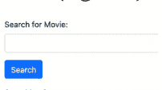

图 8.4

### 将表单发送到另一个页面

目前，我们将表单提交到同一页面。假设我们想将表单提交到另一个页面，我们该怎么做？让我们通过在搜索表单下方添加一个“加入我们的邮件列表”表单来说明。将以下标记添加到 *home.html*：

```
...
<div class="container">
  <form action="">
    ...
  </form>
  Searching for {{ searchTerm }}
  <br />
  <br />
  <h2>Join our mailing list:</h2>
  <form action="">
    <div class="mb-3">
```

```
<label for="email" class="form-label"> Enter your email: </label>
<input type="email" class="form-control" name="email" />
</div>
<button type="submit" class="btn btn-primary">Sign Up</button>
</form>
</div>
```

注册表单与搜索表单类似。我们有一个 *email* 输入框和一个 *Sign Up* 按钮。不同之处在于 `<form>` 标签，`<form action="">`。

*url* 模板标签 `` 接受一个 URL 模式名称作为参数，例如 'signup'，并返回一个 URL 链接。

现在让我们在 `/moviereviews/urls.py` 的 urlpatterns 中添加 'signup' 路由：

```
...
urlpatterns = [
    path('admin/', admin.site.urls),
    path('', movieViews.home),
    path('about/', movieViews.about),
    path('signup/', movieViews.signup, name='signup'),
]
```

这次，我们为 *path* 对象提供了一个可选的 URL 名称 'signup'。这样，我们就可以从 url 模板标签 `` 中引用这个 url `name='signup'`。url 标签使用这些名称自动为我们创建链接。虽然添加命名 URL 是可选的，但这是我们应采用的最佳实践，因为它有助于在 URL 数量增长时保持组织性。

`movie/views.py`

接下来在 *movie/views.py* 中，添加 *signup* 函数（类似于 *home*）：

```
...
def signup(request):
    email = request.GET.get('email')
    return render(request, 'signup.html', {'email':email})
```

我们从 GET 请求中检索电子邮件（ `request.GET.get('email')` ），并通过传递一个键值对字典 `{'email':email}` 将其发送到 *signup.html*。

在 *movie/templates/* 中，创建一个新文件 *signup.html*，包含以下标记：

```
<h2>Added {{ email }} to mailing list</h2>
```

当你运行你的网站时，在注册表单中输入一个有效的电子邮件并点击“Sign Up”（图 8.5）。


图 8.5

你将被带到 *signup.html*，并显示一条响应消息：

**Added greg@greglim.com to mailing list**

注意 signup.html 中的 url。它将是类似这样的：

[http://localhost:8000/signup/?email=greg%40greglim.com](http://localhost:8000/signup/?email=greg%40greglim.com)

这是在 GET 请求中发送的 url。你可以看到通过 url 传递的参数。但如果你有一个传递用户名和密码的登录表单呢？你会希望这些在 url 中隐藏起来。我们稍后将看到如何从表单发送一个隐藏传递值的 POST 请求。

### 创建返回链接

假设我们想从 *signup.html* 创建一个返回 *home.html* 的链接。我们可以使用 <a> 标签来实现。在 *signup.html* 中，添加 **粗体** 行：

```
<h2>Added {{ email }} to mailing list</h2>
<a href="">Home</a>
```

在 /moviereviews/urls.py 中，添加 **粗体** 部分：

```
...
urlpatterns = [
    path('admin/', admin.site.urls),
    path('', movieViews.home, **name='home'**),
    path('about/', movieViews.about, **name='about'**),
    path('signup/', movieViews.signup, name='signup'),
]
```

我们添加了 **name='home'** 来为我们的主页配置 URL 路由 。我们还添加了 **name='about'** 来为我们的关于页面配置 URL 路由。

如果你访问 *signup.html*，将会有一个链接可以导航回主页（图 8.6）。

Added peter@gmail.com to mailing list

Home

图 8.6

### 总结

到现在，你应该更好地理解了当用户在浏览器中输入 url、向我们的站点发送请求、经过 *urls.py* 以及我们的 Django 服务器使用模板用 HTML 响应时发生了什么。我们希望这为进入项目的下一部分奠定了坚实的基础，在那里我们将探讨更高级的主题，如模型，使我们的网站由数据库驱动。

## 第九章：模型

在 Django 中使用数据库涉及使用模型。我们创建一个数据库模型（例如博客文章、电影），Django 会将这些模型转换成数据库表。
在 /movie 中，你有 *models.py* 文件，我们在其中创建模型。用以下内容填充它：

```
from django.db import models

class Movie(models.Model):
    title = models.CharField(max_length=100)
    description = models.CharField(max_length=250)
    image = models.ImageField(upload_to='movie/images/')
    url = models.URLField(blank=True)
```

### 代码解释

```
from django.db import models
```

Django 导入一个 *models* 模块来帮助我们构建数据库模型，这些模型“建模”了数据库中数据的特征。在我们的例子中，我们创建了一个电影模型来存储电影的标题、描述、图像和 url。

```
class Movie(models.Model)
```

*class Movie* 继承自 *Model* 类。*Model* 类允许我们与数据库交互、创建表、检索和修改数据库中的数据。

```
title = models.CharField(max_length=100)
description = models.CharField(max_length=250)
image = models.ImageField(upload_to='movie/images/')
url = models.URLField(blank=True)
```

然后我们有了模型的属性。注意属性具有 *CharField*、*ImageField*、*URLField* 等类型。Django 提供了许多其他模型字段来支持常见类型，如日期、整数、电子邮件等。要获得关于类型种类及其使用方法的完整文档，请参阅 Django 文档中的 *Model* 字段参考（[https://docs.djangoproject.com/en/3.2/ref/models/fields/](https://docs.djangoproject.com/en/3.2/ref/models/fields/)）。例如，CharField 是一个用于中小型字符串的字符串字段，max_length 参数是必需的（图 9.1）。

我们将 *CharField* 同时分配给 *title* 和 *description*。

```
image = models.ImageField(upload_to='movie/images/')
```

*image* 是 *ImageField* 类型，我们通过指定 *upload_to* 选项来设定上传图片的存储子目录（该目录位于 *settings.py* 中定义的 MEDIA_ROOT 下）。

```
url = models.URLField(blank=True)
```

url 是 *URLField* 类型，即用于存储网址的 *CharField*。由于并非所有电影都有网址，我们设置 *blank=True* 表示该字段为可选项。

我们将使用此模型在数据库中创建 Movie 表。

### 安装 Pillow

由于涉及图片处理，我们需要安装 Pillow (https://pypi.org/project/Pillow/)，它为 Python 解释器添加了图像处理能力。

在终端中，停止服务器并运行：

```
pip3 install pillow
```

### 数据迁移

当前运行服务器时，请注意终端中的提示信息：

> “您有 18 个未应用的迁移。在应用以下应用的迁移之前，您的项目可能无法正常运行：admin, auth, contenttypes, sessions。请运行 'python manage.py migrate' 来应用它们。”

根据提示信息，执行：

```
python3 manage.py migrate
```

```
MacBook-Air:moviereviewsproject user$ python3 manage.py migrate
Operations to perform:
  Apply all migrations: admin, auth, contenttypes, sessions
Running migrations:
  Applying contenttypes.0001_initial... OK
  Applying auth.0001_initial... OK
  Applying admin.0001_initial... OK
  Applying admin.0002_logentry_remove_auto_add... OK
  Applying admin.0003_logentry_add_action_flag_choices... OK
  Applying contenttypes.0002_remove_content_type_name... OK
  Applying auth.0002_alter_permission_name_max_length... OK
  Applying auth.0003_alter_user_email_max_length... OK
  Applying auth.0004_alter_user_username_opts... OK
  Applying auth.0005_alter_user_last_login_null... OK
  Applying auth.0006_require_contenttypes_0002... OK
  Applying auth.0007_alter_validators_add_error_messages... OK
  Applying auth.0008_alter_user_username_max_length... OK
  Applying auth.0009_alter_user_last_name_max_length... OK
  Applying auth.0010_alter_group_name_max_length... OK
  Applying auth.0011_update_proxy_permissions... OK
  Applying auth.0012_alter_user_first_name_max_length... OK
  Applying sessions.0001_initial... OK
```

*migrate* 命令会根据 Django 的默认设置创建初始数据库。请注意项目文件夹中存在一个 *db.sqlite3* 文件，该文件代表我们的 SQLite 数据库。它在首次运行 *migrate* 或 *runserver* 时创建。*runserver* 使用 Django 默认配置数据库，而 *migrate* 则将数据库与项目中 INSTALLED_APPS 所列出的所有数据库模型的当前状态进行同步。因此，在更新模型后运行 *migrate* 至关重要。

本质上，每当我们在 *models.py* 中创建新模型或对其进行修改时，都需要通过两个步骤来更新 Django。首先，使用 *makemigrations* 命令创建迁移文件：

```
python3 manage.py makemigrations
```

这将为 INSTALLED_APPS 设置中的预装应用生成 SQL 命令。这些 SQL 命令尚未执行，仅作为模型所有变更的记录。

其次，使用 *migrate* (python3 manage.py migrate) 构建实际数据库，该命令会执行迁移文件中的 SQL 命令。

迁移文件存储在自动生成的 *migrations* 文件夹中（图 9.3）。

总之，每次修改模型文件后，你都必须运行：

```
python3 manage.py makemigrations
python3 manage.py migrate
```

但我们如何访问数据库并查看其内容呢？为此，我们将使用 Django 中一个强大的工具——Admin 管理界面。更多内容将在下一章介绍。

- 你可以在 www.greglim.co/p/django 获取完成项目的源代码。

## 第 10 章：Django Admin 管理界面

要访问数据库，我们必须进入 Django Admin 管理界面。还记得 `/moviereviews/urls.py` 中的 *admin* 路径吗？

```
...
urlpatterns = [
    path('admin/', admin.site.urls),
    path('', movieViews.home, name='home'),
    path('about/', movieViews.about, name='about'),
    path('signup/', movieViews.signup, name='signup'),
]
```

如果你访问 *localhost:8000/admin*，它将带你进入管理站点（图 10.1）。

Django 拥有强大的内置管理界面，提供了一种可视化的方式来管理 Django 项目的各个方面，例如用户管理、修改模型数据等。

我们使用什么用户名和密码登录 Admin？我们需要先在终端中创建一个超级用户。

在终端中运行：

```
python3 manage.py createsuperuser
```

然后系统会要求你指定用户名、电子邮件和密码。请注意，任何人都可以访问你站点上的 admin 路径，因此请确保你的密码足够安全。

如果你希望稍后更改密码，可以运行命令：

```
python3 manage.py changepassword <username>
```

使用你刚刚创建的用户名登录 admin（图 10.2）。

在“用户”下，你将看到刚刚创建的用户（图 10.3）。你可以在此为你的团队添加额外的用户账户。

目前，我们的 Movie 模型并未在 admin 中显示。我们需要明确告诉 Django 在 admin 中显示什么。在将 Movie 模型添加到 admin 之前，让我们先配置图片。

### 图片配置

添加图片时，我们需要配置其存储位置。首先，进入 *moviereviews/settings.py* 并在文件底部添加：

```
...
MEDIA_ROOT = os.path.join(BASE_DIR,'media')
MEDIA_URL = '/media/'
```

并在文件顶部添加：

```
import os
```

### 代码解释

MEDIA_ROOT 是用于存放用户上传文件的目录的绝对文件系统路径。我们将 BASE_DIR 与 'media' 连接。
MEDIA_URL 是处理从 MEDIA_ROOT 提供的媒体文件的 URL。

（参考 [https://docs.djangoproject.com/en/3.2/ref/settings/#media-root](https://docs.djangoproject.com/en/3.2/ref/settings/#media-root) 了解更多关于设置属性的信息）

当你在 admin 中添加电影（稍后解释）时，你会看到图片存储在 /moviereviews/media/ 文件夹内。

### 提供存储的图片

接下来，要使服务器能够提供存储的图片，我们需要在 /moviereviews/urls.py 中添加：

```
...
from django.conf.urls.static import static
from django.conf import settings

urlpatterns = [
    ...
]

urlpatterns += static(settings.MEDIA_URL,
    document_root=settings.MEDIA_ROOT)
```

这样，你就可以从 Django 提供静态媒体文件了。

### 将 Movie 模型添加到 admin

为此，返回 /movie/admin.py，并通过以下方式注册我们的模型：

```
from django.contrib import admin
from .models import Movie

admin.site.register(Movie)
```

保存文件后，返回 Admin。Movie 模型现在将会显示出来（图 10.4）。

尝试点击“+Add”来添加一个电影对象。你将进入添加电影表单（图 10.5）。

请注意，*Url* 不是粗体，因为我们在 *models.py* 中将其标记为可选：`url = models.URLField(blank=True)`。其他必填字段则显示为**粗体**。

尝试添加一部电影并点击“保存”。

你的电影对象将被保存到数据库中，并在 admin 中显示出来（图 10.6），你可以在以下路径看到电影图片：/moviereviews/media/movie/images/<image file>.jpg

现在我们知道了如何通过 admin 将电影对象添加到数据库，下一章让我们看看如何在网站中展示它们。

## 第11章：从管理后台显示对象

在本章中，我们将学习如何显示存储在管理数据库中的电影对象。在 *movie/views.py* 中，添加以下**加粗**部分：

```
...
from .models import Movie

def home(request):
    searchTerm = request.GET.get('searchMovie')
    movies = Movie.objects.all()
    return render(request,
    'home.html', {'searchTerm':searchTerm, 'movies': movies})
...
```

### 代码解释

```
from .models import Movie
```

我们首先导入 *Movie* 模型。

```
movies = Movie.objects.all()
```

上述代码从数据库中获取所有电影对象，并将其赋值给 *movies*。然后我们将 movies 字典传递给 *home.html*。

Django 使得访问数据库中的对象变得非常简单。如果我们需要编写代码连接数据库、编写 SQL 查询语句并转换结果为 Python 对象，那将涉及更多的代码！但 Django 提供了大量数据库功能来为我们处理这些。

/movie/templates/home.html

在 *home.html* 中，我们通过添加以下**加粗**代码来显示对象：

```
...
<div class="container">
  <form action="">
    ...
  </form>
  <p>Searching for: {{ searchTerm }}</p>
  
    <h2>{{ movie.title }}</h2>
    <h3>{{ movie.description }}</h3>
    
    
      <a href="{{ movie.url }}">Movie Link</a>
      
  
  <br />
  <br />
  <h2>Join our mailing list:</h2>
...
```

### 代码解释

```

...

```

使用 Django 模板语言中的 *for* 循环，我们遍历 *movies*，其中 *movie* 作为临时变量来保存当前迭代的元素。请注意，我们将代码包含在  标签中。我们使用 {{ ... }} 来渲染变量，如电影的标题、描述和图片 URL。例如：

```
<h2>{{ movie.title }}</h2>
<h3>{{ movie.description }}</h3>

```

因为电影 URL 是可选的，即它可以为空，所以我们使用  检查它是否有值，如果有，则渲染一个指向电影 URL 的 <a> 链接。

```

<a href="{{ movie.url }}">Movie Link</a>

```

### 运行你的应用

当你运行网站并访问主页时，你会在页面上看到你添加的电影（在管理后台中添加的）（图 11.1）。


图 11.1

如果你在管理后台添加另一部电影，重新加载网站时它就会显示在列表中。

### 使用卡片组件

让我们进一步使用 Bootstrap 的卡片组件来改善网站的外观，以显示每部电影（https://getbootstrap.com/docs/5.1/components）。

每部电影将显示在一个卡片组件中。在 *movie/templates/home.html* 中，替换 *for* 循环标记，并进行以下**加粗**更改：

```
...
<div class="container">
  <form action="">
    ...
  </form>
  <p>Searching for: {{ searchTerm }}</p>
  <div class="row row-cols-1 row-cols-md-3 g-4">
    
    <div v-for="movie in movies" class="col">
      <div class="card">
        
        <div class="card-body">
          <h5 class="card-title fw-bold">{{ movie.title }}</h5>
          <p class="card-text">{{ movie.description }}</p>
          
          <a href="{{ movie.url }}" class="btn btn-primary">
            Movie Link
          </a>
          
        </div>
      </div>
    </div>
  </div>
</div>
...

</div>
<br />
<br />
<h2>Join our mailing list:</h2>
...
```

你的网站应该看起来像这样（图 11.2）：


图 11.2

### 实现搜索

我们目前列出了数据库中的所有电影。让我们只显示符合用户输入搜索词的电影。在 /movie/views.py 中实现 *def home*，代码如下：

```
def home(request):
    searchTerm = request.GET.get('searchMovie')
    if searchTerm:
        movies = Movie.objects.filter(title__icontains=searchTerm)
    else:
        movies = Movie.objects.all()
    return render(request,
'home.html', {'searchTerm':searchTerm, 'movies': movies})
```

### 代码解释

```
searchTerm = request.GET.get('searchMovie')
```

我们从 *searchMovie* 输入框中检索输入的搜索词（如果有的话）。

```
if searchTerm:
    movies = Movie.objects.filter(title__icontains=searchTerm)
```

如果输入了搜索词，我们调用模型的 *filter* 方法，返回标题与搜索词不区分大小写匹配的电影对象。

```
else:
    movies = Movie.objects.all()
```

如果没有输入搜索词，我们简单地返回所有电影。

### 运行你的应用

当你运行应用并输入搜索词时，网站只会显示符合搜索词的电影。

## 第12章：回顾概念 - 添加新闻应用

到目前为止，我们已经涵盖了很多内容。现在，让我们通过向网站添加一个新闻应用来巩固和回顾所学的概念。我们目前在项目中有一个 Movie 应用。让我们添加一个 News 应用。你还记得如何添加应用、添加模型，然后显示管理数据库中的对象吗？尝试自己完成这个挑战。

你尝试过了吗？现在让我们一起来完成它。要添加新闻应用，在终端中运行：

```
python3 manage.py startapp news
```

一个 *news* 文件夹将被添加到项目中。每次添加应用时，我们都必须通过将其添加到 *settings.py* 来告知 Django：

/moviereviews/settings.py

```
...
INSTALLED_APPS = [
    'django.contrib.admin',
    'django.contrib.auth',
    'django.contrib.contenttypes',
    'django.contrib.sessions',
    'django.contrib.messages',
    'django.contrib.staticfiles',
    'movie',
    'news',
]
...
```

接下来，我们必须在 /moviereviews/urls.py 中添加 *news* 的路径。注意，在 *urls.py* 中，我们已经为 movie 应用定义了相当多的路径。

```
...
patterns = [
    path('admin/', admin.site.urls),
    path('', movieViews.home, name='home'),
    path('about/', movieViews.about, name='about'),
    path('signup/', movieViews.signup, name='signup'),
]
...
```

如果我们为新闻添加路径，路径数量将会增加，并且很快就会难以区分哪些路径属于哪个应用（尤其是当项目增长时）。为了更好地将路径隔离到各自的应用中，每个应用都可以有自己的 *urls.py*。

首先，在 /moviereviews/urls.py 中添加：

```
...
from django.contrib import admin
from django.urls import path, include
...

urlpatterns = [
    path('admin/', admin.site.urls),
    path('', movieViews.home, name='home'),
    path('about/', movieViews.about, name='about'),
    path('signup/', movieViews.signup, name='signup'),
    path('news/', include('news.urls')),
]
...
```

*path('news/', include('news.urls'))* 会将任何带有 'news/' 的请求转发到 *新闻应用的 urls.py*。

在 /news 中，创建一个新文件 *urls.py*，内容如下：

```
from django.urls import path
from . import views

urlpatterns = [
    path('', views.news, name='news'),
]
```

上述路径将请求（例如 *localhost:8000/news*）转发到新闻视图。

接下来在 /news/views.py 中，添加 *def news* 函数：

```
from django.shortcuts import render

def news(request):
    return render(request, 'news.html')
```

在 /news 中，我们现在需要创建 *templates* 文件夹，并在其中创建一个新文件 *news.html*。我们稍后将填充此文件以显示来自管理数据库的新闻文章。

让我们先创建新闻模型。

### 新闻模型

在 /news/models.py 中，创建如下模型：

```
from django.db import models

class News(models.Model):
    headline = models.CharField(max_length=200)
    body = models.TextField()
    date = models.DateField()
```

因为我们添加了一个新模型，所以需要进行迁移：

```
python3 manage.py makemigrations
python3 manage.py migrate
```

接下来，通过访问 /news/admin.py 并添加以下内容来注册新闻模型：

```
from django.contrib import admin
from .models import News

admin.site.register(News)
```

当你现在运行服务器并访问管理后台时，它应该会显示新闻模型。

### 显示新闻文章

让我们继续在 news.html 中显示新闻文章。

在 /news/views.py 中，添加以下**加粗**代码：

```
from django.shortcuts import render
from .models import News

def news(request):
    newss = News.objects.all()
    return render(request, 'news.html', {'newss':newss})
```

我们从数据库中检索新闻对象，然后将其传递给 *news.html*。

在 /news/templates/news.html 中，使用以下代码显示新闻对象：

```

<h2>{{ news.headline }}</h2>
<h5>{{ news.date }}</h5>
<p>{{ news.body }}</p>

```

### 运行我们的应用

现在，尝试在管理后台添加一些新闻对象。当你访问 [http://localhost:8000/news/](http://localhost:8000/news/) 时，你应该能看到它们被显示出来（图 12.1）。


图 12.1

显示新闻时，我们应该优先显示最新的新闻。为此，我们可以在 /news/views.py 中通过指定 `order_by` 来对新闻对象进行排序：

```
...
def news(request):
    newss = News.objects.all().order_by('-date')
    return render(request, 'news.html', {'newss':newss})
```

现在，最新的新闻将首先显示（图 12.2）：

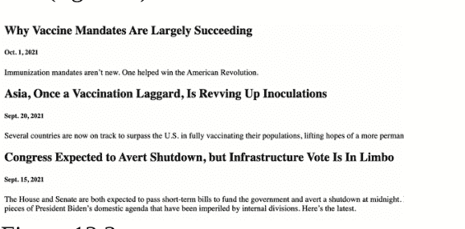

我们还应该使用 Bootstrap 水平卡片组件来改善新闻网站的外观。请注意，你需要在 `<head>` 中包含 bootstrap CSS 链接。将 /news/templates/news.html 的全部代码替换为以下代码：

```
<head>
  <link
href="https://cdn.jsdelivr.net/npm/bootstrap@5.1.1/dist/css/bootstrap.min.css"
rel="stylesheet" crossorigin="anonymous">
</head>
<div class="container">
  
  <div class="card mb-3">
    <div class="row g-0">
      <div>
        <div class="card-body">
          <h5 class="card-title">{{ news.headline }}</h5>
          <p class="card-text">{{ news.body }}</p>
          <p class="card-text"><small class="text-muted">
            {{ news.date }}
          </small></p>
        </div>
      </div>
    </div>
  </div>
  
</div>
```

你应该会得到类似这样的效果（图 12.3）：

我会做的，为什么不呢？：邓斯特谈可能回归《蜘蛛侠》
在山姆·雷米的《蜘蛛侠》中饰演“玛丽·简·沃森”的克斯汀·邓斯特表示，她“永远不会拒绝”回归该系列电影。“我会做的。为什么不呢？那会很有趣，”她说。“我会是老版的 MJ（玛丽·简）……带着小蜘蛛宝宝，”她补充道。邓斯特接下来将出演《犬之力》。
2021年11月14日

2名印多尔医生拒绝为未接种COVID-19疫苗者服务
中央邦印多尔的两名医生宣布，从11月30日起，他们将不为未接种两剂COVID-19疫苗的患者提供服务。Ajay Chaglani医生和Pinki Bhatia医生已致信地区行政长官和印度医学协会（IMA），告知他们这一决定，旨在提高对疫苗的认识。
2021年11月14日

BMC将使用卫星图像识别非法建筑
孟买市政公司（BMC）将借助卫星图像来识别孟买的非法建筑和侵占行为。马哈拉施特拉邦首席部长乌达夫·萨克雷最近曾要求市政机构对非法建筑采取行动。BMC将借助地理信息系统来创建孟买建筑物的数据库。
2021年11月12日

### 图 12.3

我们希望本章能让你清晰地理解如何向项目添加应用、添加模型以及在模板中显示数据库中的模型对象。在下一章，我们将更深入地了解数据库的工作原理。

## 第13章：理解数据库

让我们花些时间来了解数据库的工作原理。对象存储在 *db.sqlite3* 文件中。如果你点击它，它并不是非常易读。但你可以使用 SQLite 查看器来查看此类 *sqlite* 文件。只需在谷歌上搜索“SQLite Viewer”即可找到一系列查看器。一个例子是 [https://inloop.github.io/sqlite-viewer/](https://inloop.github.io/sqlite-viewer/)。

用查看器打开你的 *sqlite3* 文件，你可以看到数据库中的不同表（图 13.1）。

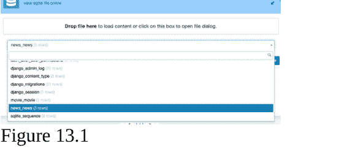

图 13.1

你可以看到我们创建的模型的表，即 *movie* 和 *news*。还有其他表，如 *django_session*，这是因为安装了用于会话和身份验证等不同功能的应用。

选择一个表，例如 *news_news*，你可以看到它的行（图 13.2）。
注意：表名由 <appname>_<modelname> 派生而来。我们可以在一个应用中拥有多个模型。例如 *movie_movie*、*movie_review*。

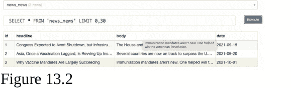

图 13.2

请注意，每一行都有一个 Django 生成的唯一 ID 作为主键。Django 会自动为每个表添加一个主键。

所以，希望这能让你欣赏到 Django 数据库幕后发生的事情。目前，我们使用的是基于 SQL 的数据库。如果我们想切换到其他数据库，例如 NoSQL、PostgreSQL、Oracle、MySQL 呢？Django 为多种类型的数据库后端提供了内置支持。

你应该转到 /moviereviews/settings.py，并修改 **粗体** 部分的行（以切换到另一个数据库引擎）：

```
DATABASES = {
    'default': {
        'ENGINE': 'django.db.backends.sqlite3',
        'NAME': BASE_DIR / 'db.sqlite3',
    }
}
```

你仍然可以像往常一样创建模型，这些更改由 Django 在幕后处理。

在本书中，我们使用 SQLite，因为它是最简单的。Django 默认使用 SQLite，对于小型项目来说是一个很好的选择。它基于单个文件运行，不需要复杂的安装。相比之下，其他选项在正确配置时涉及一些复杂性。在最后一章，我们将介绍切换到 MySQL 作为生产数据库的过程。

## 第14章：在管理后台显示对象

目前，当我们从管理后台查看模型对象时，很难识别单个对象（图 14.1），例如 News object (1), News object (2)。

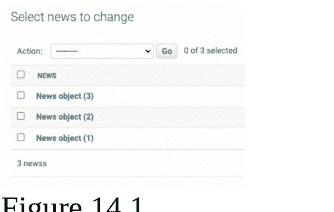

图 14.1

为了在管理后台获得更好的可读性，我们可以自定义显示的内容。例如，如果我们想显示每个新闻对象的标题，可以在 /news/models.py 中添加 **粗体** 部分的函数：

```
from django.db import models

class News(models.Model):
    headline = models.CharField(max_length=200)
    body = models.TextField()
    date = models.DateField()

    def __str__(self):
        return self.headline
```

Python 中的 `__str__` 方法将类对象表示为字符串。当新闻对象在管理后台列出时，将调用 `__str__`。看看可读性是如何提高的（图 14.2）！

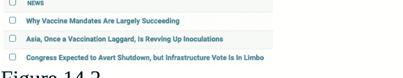

图 14.2

请注意，我们不需要进行任何迁移，因为数据没有更改。我们只是添加了一个返回数据的函数。

## 第15章：扩展基础模板

我们目前有电影页面、邮件列表注册页面和新闻页面。但用户必须手动输入 URL 才能导航到每个页面，这并不理想。让我们添加一个标题栏，允许他们在页面之间导航。我们从 *movie/templates/home.html* 开始。

我们使用 getbootstrap 的 Navbar 组件的标记作为基础（图 15.1）。

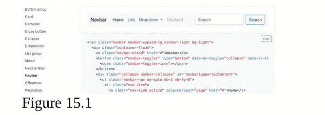

我们还在 `<head>` 标签内包含了 *bootstrap.bundle.min.js* 脚本。此文件提供额外的用户界面元素，例如对话框、工具提示、轮播图和按钮交互。

在 *movie/templates/home.html* 中，进行 **粗体** 部分的以下更改：

```
...
<script
src="https://cdn.jsdelivr.net/npm/bootstrap@5.1.1/dist/js/bootstrap.bundle.min.js"
crossorigin="anonymous">
</script>
</head>

<nav class="navbar navbar-expand-lg navbar-light bg-light mb-3">
  <div class="container">
    <a class="navbar-brand" href="#">Movies</a>
    <button class="navbar-toggler" type="button" data-bs-toggle="collapse" data-bs-target="#navbarNavAltMarkup"
      aria-controls="navbarNavAltMarkup" aria-expanded="false" aria-label="Toggle navigation">
      <span class="navbar-toggler-icon"></span>
    </button>
    <div class="collapse navbar-collapse" id="navbarNavAltMarkup">
      <div class="navbar-nav ms-auto">
        <a class="nav-link" href="#">News</a>
        <a class="nav-link" href="#">Login</a>
        <a class="nav-link" href="#">Sign Up</a>
      </div>
    </div>
  </div>
</nav>
```

我们已经将导航栏添加到了 *home.html*（图 15.2）。我们还包含了两个链接（“登录”和“注册”），它们将在后续使用。

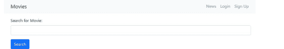

图 15.2

如果你缩小浏览器窗口宽度，你的导航栏会相应地响应（这是我们使用的 Bootstrap 元素自动提供的功能——图 15.3）。

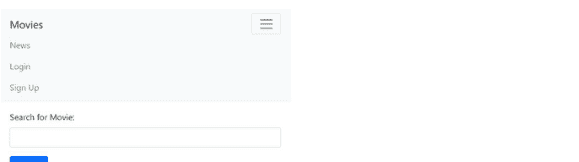

图 15.3

但是，我们是否应该重复相同的过程，将完全相同的代码复制到 *news.html* 和其他未来的页面中呢？

这会重复大量相同的代码。更糟糕的是，这将使代码维护变得非常困难。假设我们想添加一个新链接，我们就必须在多个页面中添加这个链接！

为了解决这个问题，我们将使用基础模板，这样我们就可以将导航栏添加到每一个页面。这使我们能够在一处修改导航栏，并且它将应用于每个页面。

由于这将是一个“全局”模板（将用于所有页面和应用），我们将把它添加到主文件夹（*moviereviews*）中。在 *moviereviews* 文件夹中，创建一个名为 *templates* 的文件夹。在该文件夹中，创建一个文件 *base.html*。将 *home.html* 中的整个 `<header>` 和 `<nav>` 标记移动到 *base.html* 中。（注意，我们可以将 *base.html* 命名为任何名称，但使用 *base.html* 是基础模板的常见约定）。

然后，在文件末尾添加以下内容：

```
<div class="container">


</div>
```

整个 *moviereviews/templates/base.html* 将如下所示：

```
<head>
  <link
    href="https://cdn.jsdelivr.net/npm/bootstrap@5.1.1/dist/css/bootstrap.min.css"
    rel="stylesheet" crossorigin="anonymous" />
  <script
    src="https://cdn.jsdelivr.net/npm/bootstrap@5.1.1/dist/js/bootstrap.bundle.min.js"
    crossorigin="anonymous">
  </script>
</head>
```

```
<nav class="navbar navbar-expand-lg navbar-light bg-light mb-3">
  <div class="container">
    <a class="navbar-brand" href="#">Movies</a>
    <button class="navbar-toggler" type="button" data-bs-toggle="collapse"
      data-bs-target="#navbarNavAltMarkup" aria-controls="navbarNavAltMarkup"
      aria-expanded="false" aria-label="Toggle navigation">
      <span class="navbar-toggler-icon"></span>
    </button>
    <div class="collapse navbar-collapse" id="navbarNavAltMarkup">
      <div class="navbar-nav ms-auto">
        <a class="nav-link" href="#">News</a>
        <a class="nav-link" href="#">Login</a>
        <a class="nav-link" href="#">Sign Up</a>
      </div>
    </div>
  </div>
</nav>
```

```
</div>
</nav>

<div class="container">
    
    
</div>
```

最后，我们需要在应用程序设置中注册 *moviereviews/templates* 文件夹。确保将其添加到 /moviereviews/settings.py 中的 TEMPLATES DIRS：

```
...
TEMPLATES = [
    {
        'BACKEND': 'django.template.backends.django.DjangoTemplates',
        'DIRS': [os.path.join(BASE_DIR, 'moviereviews/templates')],
    },
...
```

### 代码解释

顾名思义，*base.html* 作为所有页面的基础。因此，我们在其中包含了头部导航栏。如果你的网站有页脚，你也可以将其包含在内。

```


```

然后我们分配一个“块”，内容可以从其他子页面（例如 *home.html*、*news.html*）插入其中。随着我们继续，这一点将变得清晰。

### *home.html*

在 *home.html* 中，我们不应该再有头部和导航栏了。为了简化，让我们移除注册邮件列表表单。同时移除 `<div class="container">` 标签，因为它已在 *base.html* 模板中加载。整个 *movie/templates/home.html* 将如下所示：

```


<form action="">
  <div class="mb-3">
    <label for="searchMovie" class="form-label"> Search for Movie: </label>
    <input type="text" class="form-control" name="searchMovie" />
  </div>
  <button type="submit" class="btn btn-primary">Search</button>
</form>
<p>Searching for: {{ searchTerm }}</p>
<div class="row row-cols-1 row-cols-md-3 g-4 mb-3">

<div v-for="movie in movies" class="col">
  <div class="card">
    
    <div class="card-body">
      <h5 class="card-title fw-bold">{{ movie.title }}</h5>
      <p class="card-text">{{ movie.description }}</p>
      
      <a href="{{ movie.url }}" class="btn btn-primary">Movie Link</a>
      
    </div>
  </div>
</div>

</div>

```

### 代码解释

```

```

通过 *extends* 方法，我们从 *base.html* 扩展，将 *home.html* 中 *block content* 标签内的所有标记取出，并放入 *base.html* 中。

### 运行你的应用

当你运行应用并访问主页时，你应该会看到与之前相同的网站，导航栏神奇地包含在内了！

### /news/template/news.html

现在，让我们将上述内容也应用到 *news.html*。在 /news/template/news.html 中，移除 <head> 元素，移除 <div class="container"> 标签，并添加**粗体**部分的代码：

```



<div class="card mb-3">
  <div class="row g-0">
    <div>
      <div class="card-body">
        <h5 class="card-title">{{ news.headline }}</h5>
        <p class="card-text">{{ news.body }}</p>
        <p class="card-text">
          <small class="text-muted">{{ news.date }}</small>
        </p>
      </div>
    </div>
  </div>
</div>


```

当你运行应用时，新闻页面也应该显示导航栏。现在，每当你想对导航栏进行更改时，只需在 *base.html* 中修改一次，它就会应用于所有页面！

### 使链接生效

导航栏中的链接目前不起作用。为此，在 *base.html* 中，添加**粗体**部分的代码：

```
...
<nav class="navbar navbar-expand-lg navbar-light bg-light mb-3">
    <div class="container">
        <a class="navbar-brand" href="">Movies</a>
        <button class="navbar-toggler" type="button" data-bs-toggle="collapse" data-bs-target="#navbarNavAltMarkup" aria-controls="navbarNavAltMarkup" aria-expanded="false" aria-label="Toggle navigation">
            <span class="navbar-toggler-icon"></span>
        </button>
        <div class="collapse navbar-collapse" id="navbarNavAltMarkup">
            <div class="navbar-nav ms-auto">
                <a class="nav-link" href="">News</a>
                <a class="nav-link" href="#">Login</a>
                <a class="nav-link" href="#">Sign Up</a>
            </div>
        </div>
    </div>
</nav>
...
```

当你运行应用时，链接将会生效。这是因为我们之前在 /moviereviews/urls.py 中定义了 ‘home’ 路径：

```
...
urlpatterns = [
    path('admin/', admin.site.urls),
    path('', movieViews.home, name='home'),
]
...
```

以及在 /news/urls.py 中定义了 ‘news’ 路径：

```
...
urlpatterns = [
    ...
    path('news/', include('news.urls')),
]
...
```

现在运行应用，你就可以使用导航栏中的链接在电影和新闻页面之间导航了。

### 添加页脚部分

让我们在 base.html 中添加一个页脚部分。在 moviereviews/templates/base.html 中，我们进行**粗体**部分的更改：

```
...
<div class="container">
    
    
</div>

<footer class="text-center text-lg-start bg-light text-muted mt-4">
    <div class="text-center p-4">
        © 2021 Copyright -
        <a class="text-reset fw-bold text-decoration-none"
           target="_blank"
           href="https://twitter.com/greglim81">
            Greg Lim
        </a> -
        <a class="text-reset fw-bold text-decoration-none"
           target="_blank"
           href="https://twitter.com/danielgarax">
            Daniel Correa
        </a>
    </div>
</footer>
```

页脚部分显示一个灰色的 div，我们在其中放置了书籍作者的名字，并链接到他们各自的 Twitter 账户链接。如果你现在运行应用，它应该会给你类似这样的效果（图 15.4）：

### 电影

新闻 登录 注册

“我会出演，为什么不呢？”：邓斯特谈可能回归《蜘蛛侠》

在山姆·雷米执导的《蜘蛛侠》中饰演“玛丽·简·沃森”的克斯汀·邓斯特表示，她“永远不会拒绝”回归该系列电影。“我会出演。为什么不呢？那会很有趣，”她说。“我会是年长的MJ（玛丽·简），带着小蜘蛛侠宝宝，”她补充道。邓斯特接下来将出演《犬之力》。

2021年11月14日

印多尔两名医生拒绝为未接种新冠疫苗者服务

中央邦印多尔的两名医生宣布，从11月30日起，他们将不为未接种两剂新冠疫苗的患者提供服务。Ajay Chhajlani医生和Pankaj Bhatia医生已致信地区行政长官和印度医学协会（IMA），告知他们为提高疫苗接种意识而做出的这一决定。

2021年11月14日

孟买市政公司将利用卫星图像识别违章建筑

孟买市政公司（BMC）将借助卫星图像来识别孟买的违章建筑和侵占行为。马哈拉施特拉邦首席部长乌达夫·萨克雷最近曾要求市政机构对违章建筑采取行动。BMC将利用地理信息系统（GIS）建立孟买建筑物的数据库。

2021年11月12日

© 2021 版权所有 - Greg Lim - Daniel Correa

### 图 15.4

在下一章中，我们将探讨如何在网站上显示静态图像。

## 第16章：静态文件

假设我们想为网站显示一个图像图标（图16.1）：

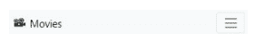

图 16.1

这些是网站上固定图像的例子。这些固定图像是静态文件。它们不同于用户上传到网站的媒体文件，例如电影图片。

在 `/moviereviews/settings.py` 中，我们有一个属性 `STATIC_URL = '/static/'`。该属性上方有一个注释，其中包含一个关于如何使用静态文件的文档链接：

```
# Static files (CSS, JavaScript, Images)
# https://docs.djangoproject.com/en/3.2/howto/static-files/

STATIC_URL = '/static/'
```

但我们将在此处进行说明。在 `/moviereviews` 中，创建一个文件夹 `static`。在其中，创建一个文件夹 *images* 来存放我们网站中使用的固定图像。将你想要在网站中显示的图像文件（例如 *movie.png*）放入 *images* 文件夹。然后在 *base.html* 中，将“电影”链接替换为以下内容：

```
...
<nav class="navbar navbar-expand-lg navbar-light bg-light mb-3">
  <div class="container">
    <a class="navbar-brand" href="">
      
      
      Movies
    </a>
  </div>
</nav>
...
```

### 代码解释

我们向导航栏（[https://getbootstrap.com/docs/5.1/components/navbar/](https://getbootstrap.com/docs/5.1/components/navbar/)）添加了一个图像。

```

```

要将静态文件添加到我们的模板中，我们需要在 *base.html* 的顶部添加上面这行代码。因为其他模板都继承自 *base.html*，所以我们只需添加一次。

```
', views.detail, name='detail'),
]
```

上面的路径是电影的主键，表示为整数 `<int:movie_id>`。请记住，Django 在底层为我们的数据库模型添加了一个自动递增的主键。

有了这个路径，当用户访问一个 URL，例如 `localhost:8000/movie/4` 时，‘4’ 是代表电影 ID 的整数（int）。该 URL 匹配 `path('movie/<int:movie_id>')` 并导航到详情页面。

接下来在 `/movie/views.py` 中，我们添加视图 `def detail`：

```
from django.shortcuts import render
from django.http import HttpResponse
from django.shortcuts import get_object_or_404
...

def detail(request, movie_id):
    movie = get_object_or_404(Movie, pk=movie_id)
    return render(request, 'detail.html', {'movie': movie})
```

我们使用 `get_object_or_404` 来获取我们想要的特定电影对象。我们提供 `movie_id` 作为主键 `pk=movie_id`。如果有匹配项，`get_object_or_404` 如其名所示，会返回对象或 *未找到 (404)* 对象。

然后我们将电影对象传递给 `detail.html`。因此在 `/movie/templates/` 中，创建一个文件 `detail.html`。我们将使用与 `news/templates/news.html` 相同的水平卡片布局，并继承自 `base.html`。`/movie/templates/detail.html` 中的代码将如下所示：

```


<div class="card mb-3">
  <div class="row g-0">
    <div class="col-md-4">
      
    </div>
    <div class="col-md-8">
      <div class="card-body">
        <h5 class="card-title">{{ movie.title }}</h5>
        <p class="card-text">{{ movie.description }}</p>
        <p class="card-text">
          
          <a href="{{ movie.url }}" class="btn btn-primary">
              Movie Link
          </a>
          
        </p>
      </div>
    </div>
  </div>
</div>

```

我们希望你注意到创建新视图、URL 和模板的重复模式。

如果你访问一个电影的详情 URL，例如 *localhost:8000/movie/4*，它将在其自己的页面中渲染电影的详细信息（图17.1）。

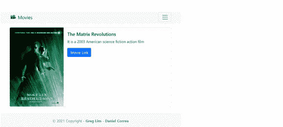

图 17.1

我们稍后将在详情页面添加一个评论部分。

### 实现指向单个电影详情页面的链接

现在我们有了电影的详情页面，接下来我们实现电影链接，以便从 *home.html* 导航到这些详情页面。我们只需将电影标题包裹在 `<a href ...>` 中，如下所示：

```
...
<div class="row row-cols-1 row-cols-md-3 g-4 mb-3">
  
  <div v-for="movie in movies" class="col">
    <div class="card">
      
      <div class="card-body">
        <a href="">
          <h5 class="card-title fw-bold">{{ movie.title }}</h5>
        </a>
        <p class="card-text">{{ movie.description }}</p>
      ...
```

`` 链接回 */movie/urls.py* 中的 *detail* 路径。在 `` 标签内，我们指定了 URL 的目标名称 'detail'，并传递了 *movie.id* 作为参数。当你现在运行你的应用程序时返回首页，标题将显示为指向详情页的链接（图 17.2）。

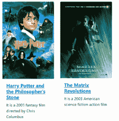

图 17.2

到目前为止，我们已经学到了很多！我们学习了数据库、模型、管理界面、静态文件、媒体文件、扩展基础模板、URL、URL 路由等等。

在接下来的章节中，我们将学习如何允许用户注册、登录，然后为电影发布评论。

## 第 18 章：创建注册表单

我们应用的下一部分将涉及用户认证，即允许用户登录并发布关于电影的评论。实现用户认证是出了名的困难。幸运的是，我们可以使用 Django 强大的内置认证系统，它能处理如果我们从头开始创建自己的用户认证时可能出现的许多安全陷阱。

在我们的网站中，如果用户还没有账户，他们必须先注册一个。那么，让我们看看如何创建一个注册账户表单。

由于注册账户不属于电影或新闻应用，让我们为它创建一个专门的应用，名为 *accounts*。在终端中，运行：

```
python3 manage.py startapp accounts
```

确保将新应用添加到 /moviereviews/settings.py 中的 INSTALLED_APPS：

```
...
INSTALLED_APPS = [
    'django.contrib.admin',
    'django.contrib.auth',
    'django.contrib.contenttypes',
    'django.contrib.sessions',
    'django.contrib.messages',
    'django.contrib.staticfiles',
    'movie',
    'news',
    'accounts',
]
...
```

我们在 /moviereviews/urls.py 中为 *accounts* 路径创建一个项目级 URL：

```
...
patterns = [
    path('admin/', admin.site.urls),
    path('', movieViews.home, name='home'),
    path('about/', movieViews.about, name='about'),
    path('signup/', movieViews.signup, name='signup'),
    path('news/', include('news.urls')),
    path('movie/', include('movie.urls')),
    path('accounts/', include('accounts.urls')),
]
...
```

我们将所有与 *accounts* 应用相关的路径（例如注册、登录、注销）放在它自己的 *urls.py* 中，即 /accounts/urls.py（创建此文件）。

```
from django.urls import path
from . import views

urlpatterns = [
    path('signupaccount/', views.signupaccount,
         name='signupaccount'),
]
```

接下来，在 /accounts/views.py 中创建 *def signupaccount*，代码如下：

```
from django.shortcuts import render
from django.contrib.auth.forms import UserCreationForm

def signupaccount(request):
    return render(request, 'signupaccount.html',
                  {'form':UserCreationForm})
```

我们导入了 Django 提供的 *UserCreationForm*，以便轻松创建注册表单来注册新用户。Django 表单（本身就是一个庞大的主题）我们将看到它们可以多么强大。我们将表单传递给 *signupaccount.html*。

接下来，创建 /accounts/templates/signupaccount.html 并简单地填入：

```
{{ form }}
```

运行你的应用并访问 *localhost:8000/accounts/signupaccount*。

你将看到一个包含三个字段的表单：用户名、密码1和密码2（图 18.1）。

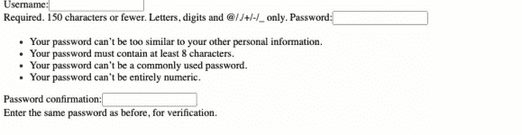

图 18.1

该表单验证密码1和密码2是否匹配。不过，表单的外观还有待改进。

让我们通过让 *signupaccount.html* 继承 *base.html* 来改进样式。我们还将把字段包装在一个表单标签中，并添加一个提交按钮。用以下内容替换 *signupaccount.html*：

```


<div class="card mb-3">
  <div class="row g-0">
    <div>
      <div class="card-body">
        <h5 class="card-title">Sign Up</h5>
        <p class="card-text">
          <form method="POST">
            
            {{ form.as_p }}
            <button type="submit" class="btn btn-primary">
              Sign Up
            </button>
          </form>
        </p>
      </div>
    </div>
  </div>
</div>

```

### 代码解释

该表单没有 *action*，这意味着它提交到同一页面。我们稍后会解释为什么是这样。还要注意表单方法是 'POST'，即当表单提交时，它会发送一个 POST 请求，因为我们正在向服务器发送数据。这与之前的注册邮件列表表单不同，那个表单方法是 'GET'，因为我们从注册表单接收数据。

'POST' 会将提交的信息隐藏在 URL 之外。相比之下，'GET' 会将提交的数据放在 URL 中，例如 http://localhost:8000/signup/?email=greg%40greglim.com。由于用户名和密码是敏感信息，我们希望它们被隐藏。POST 请求不会将信息放在 URL 中。

通常，我们使用 POST 请求进行创建，使用 GET 请求进行检索。还有其他请求类型，如 *update*、*delete* 和 *put*，但这些对于创建 API 更为重要。

有一行 ``。Django 提供此功能以保护我们的表单免受跨站请求伪造（CSRF）攻击。你应该在所有 Django 表单中使用它。

要输出我们的表单数据，我们使用 `{{ form.as_p }}`，它将表单渲染在段落 `<p>` 标签内。

当你运行你的网站时，表单现在看起来会像这样（图 18.2）：

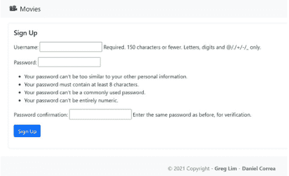

图 18.2

在下一章中，我们将看到当用户提交注册表单时，如何处理请求并在管理后台创建用户。

## 第 19 章：创建用户

当用户提交注册表单时，我们将需要处理请求并在管理后台创建用户。为此，在 /accounts/views.py 中添加以下内容：

```
from django.shortcuts import render
from django.contrib.auth.forms import UserCreationForm
from django.contrib.auth.models import User
from django.contrib.auth import login
from django.shortcuts import redirect

def signupaccount(request):
    if request.method == 'GET':
        return render(request, 'signupaccount.html',
                      {'form':UserCreationForm})
    else:
        if request.POST['password1'] == request.POST['password2']:
            user = User.objects.create_user(request.POST['username'],
                                            password=request.POST['password1'])
            user.save()
            login(request, user)
            return redirect('home')
```

### 代码解释

```
def signupaccount(request):
    if request.method == 'GET':
        return render(request, 'signupaccount.html',
                      {'form':UserCreationForm})
    else:
        ...
```

在 *def signupaccount* 中，我们首先检查收到的请求是 GET 还是 POST 请求。如果是 GET 请求，意味着用户通过 URL *localhost:8000/accounts/signupaccount* 导航到注册表单，在这种情况下，我们只需将他们连同表单一起发送到 *signupaccount.html*。

但如果是 POST 请求，意味着这是一个提交表单以创建新用户的请求。我们进入 *else* 代码块来创建新用户。

```
else:
    if request.POST['password1'] ==
        request.POST['password2']:
```

在 *else* 代码块中，我们确保输入到 *password1* 和 *password2* 的密码相同，然后才继续创建用户。什么是 *password1* 和 *password2*？如果你查看表单的“查看页面源代码”标记，你会看到密码字段的名称是 *password1*，密码确认字段的名称是 *password2*。所以我们首先确保密码和确认密码的值相同，然后再继续。

```
user =
User.objects.create_user(request.POST['username'],
                        password=request.POST['password1'])
```

然后我们检索输入到 *username* 字段（`request.POST['username']`）和 *password* 字段（`password=request.POST['password1']`）的数据。我们将数据传递给 *User.objects.create_user*，它帮助我们创建用户对象。但是 *User* 模型是从哪里来的？我们并没有创建它。*User* 模型是由 Django 的 Auth 应用（*from django.contrib.auth.models import User*）提供的，它在数据库中为我们设置了 *User* 模型。如果你还记得，在管理后台，我们有用户（截图），其中包含我们在运行 *python3 manage.py createsuperuser* 时为我们创建的超级用户账户。

user.save()

`user.save()` 实际上是将新用户插入数据库。新添加的用户将显示在管理后台的“用户”列表中。

```
login(request, user)
return redirect('home')
```

创建用户后，我们随即使用新用户登录。也就是说，当有人注册后，我们会自动将其登录并重定向到主页。

### 运行你的应用

现在运行你的应用，访问 `localhost:8000/accounts/signupaccount`。创建一个用户，你将看到新用户被添加到管理后台。

### 错误处理

但是，如果 `password1` 与 `password2` 不匹配会发生什么？为了处理此类错误，我们添加了下面加粗的 `else` 代码块：

```
...
def signupaccount(request):
    if request.method == 'GET':
        return render(request, 'signupaccount.html',
            {'form':UserCreationForm})
    else:
        if request.POST['password1'] ==
            request.POST['password2']:
            ...
            return redirect('home')
        else:
            return render(request, 'signupaccount.html',
                {'form':UserCreationForm, 'error':'Passwords do not match'})
```

如果密码不匹配，我们将用户重新渲染回 *signupaccount.html*，并传递错误消息“密码不匹配”。

*accounts/templates/signupaccount.html*

然后我们使用以下代码将错误消息渲染到 *signupaccount.html* 中：

```
...


<div class="card mb-3">
    <div class="row g-0">
        <div>
            <div class="card-body">
                <h5 class="card-title">Sign Up</h5>
                
                <div class="alert alert-danger mt-3" role="alert">
                    {{ error }}
                </div>
                
                <p class="card-text">
...
```

### 代码解释

```

```

首先，我们仅在错误消息存在时才显示它。

```
<div class="alert alert-danger mt-3" role="alert">
    {{ error }}
</div>
```

我们使用 Bootstrap 的 *alert* 组件来渲染错误消息，以便用户能更好地注意到错误并采取必要的纠正措施（图 19.1）。

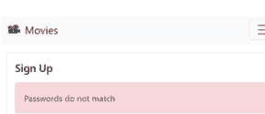

图 19.1

### 如果用户名已存在

我们已经举例说明了如何处理表单填写不正确时产生的错误。你可以实现其他表单数据错误的验证，例如，如果密码长度少于八个字符。

还可能存在其他类型的错误，这些错误只能从数据库中识别出来。例如，如果用户使用数据库中已存在的用户名进行注册。为了捕获数据库抛出的此类错误，我们必须使用 *try* 和 *except*，如下方加粗部分所示：

```
...
from django.shortcuts import redirect
from django.db import IntegrityError

def signupaccount(request):
    if request.method == 'GET':
        return render(request, 'signupaccount.html',
                     {'form':UserCreationForm})
    else:
        if request.POST['password1'] ==
            request.POST['password2']:
            try:
                user =
                User.objects.create_user(request.POST['username'],
                                         password=request.POST['password1'])
                user.save()
                login(request, user)
                return redirect('home')
            except IntegrityError:
                return render(request, 'signupaccount.html',
                    {'form':UserCreateForm,
                     'error':'Username already taken. Choose new username.'})
        else:
            ...
```

我们导入 *IntegrityError*，并使用 *try-except* 在 *IntegrityError* 被抛出时捕获它（在用户名已存在的情况下——图 19.2）。

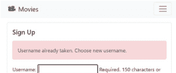

图 19.2

### 自定义 UserCreationForm

*UserCreationForm* 目前显示了很多额外的帮助文本（默认包含），这些文本使我们的表单显得杂乱。我们实际上可以自定义 *UserCreationForm*，这本身就是一个很大的话题。在这里，我们将简单地移除默认的帮助文本。

要自定义表单，我们必须创建一个扩展 *UserCreationForm* 的新类。在 `/accounts/` 目录下，创建一个名为 *forms.py* 的新文件，并填入以下内容：

```
from django.contrib.auth.forms import UserCreationForm

class UserCreateForm(UserCreationForm):
    def __init__(self, *args, **kwargs):
        super(UserCreateForm, self).__init__(*args, **kwargs)

        for fieldname in ['username', 'password1', 'password2']:
            self.fields[fieldname].help_text = None
            self.fields[fieldname].widget.attrs.update(
                {'class': 'form-control'})
```

### 代码解释

```
class UserCreateForm(UserCreationForm):
```

我们创建了一个新表单 *UserCreateForm*，它继承自 *UserCreationForm*。

```
def __init__(self, *args, **kwargs):
    super(UserCreateForm, self).__init__(*args, **kwargs)
```

在表单的构造函数 `def __init__(self, *args, **kwargs):` 中，我们调用了 *super* 方法。

```
for fieldname in ['username', 'password1', 'password2']:
    self.fields[fieldname].help_text = None
    self.fields[fieldname].widget.attrs.update(
        {'class': 'form-control'})
```

我们将表单字段的 *help_text* 设置为 'None' 以移除它们，并为每个表单字段设置一个 class 属性以使用 Bootstrap 类。

### 使用 UserCreateForm

最后，在 `/accounts/views.py` 中，将以下加粗部分更改为使用 *UserCreateForm* 而不是 *UserCreationForm*：

```
from django.shortcuts import render
from django.contrib.auth.forms import UserCreationForm
from .forms import UserCreateForm
from django.contrib.auth.models import User

def signupaccount(request):
    if request.method == 'GET':
        return render(request, 'signupaccount.html',
                      {'form':UserCreateForm})
    else:
        if request.POST['password1'] ==
            request.POST['password2']:
            try:
                user =
                User.objects.create_user(request.POST['username'],
                                         password=request.POST['password1'])
                user.save()
                login(request, user)
                return redirect('home')
            except IntegrityError:
                return render(request, 'signupaccount.html',
                    {'form':UserCreateForm,
                     'error':'Username already taken. Choose new username.'})
        else:
            return render(request, 'signupaccount.html',
                {'form':UserCreateForm, 'error':'Passwords do not match'})
```

当你访问注册账户表单时，帮助文本将不再显示，输入框将具有新的样式（图 19.3）。

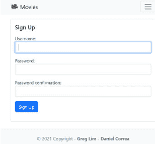

图 19.3

在下一章中，我们将展示如何在导航栏中显示用户是否已登录。

* 你可以在 www.greglim.co/p/django 获取完成项目的源代码。

## 第 20 章：显示用户是否已登录

用户注册并登录后，我们仍然在导航栏中显示“登录”和“注册”按钮（图 20.1）。


图 20.1

对于已登录的用户，我们应该隐藏这些按钮，转而显示“注销”按钮。为此，让我们转到基础模板。记住，我们的基础模板是所有内容的起点，我们将其扩展到不同的视图中。

在 *base.html* 中，添加以下加粗的代码：

```
...
<nav class="navbar navbar-expand-lg navbar-light bg-light mb-3">
    ...
    <div class="collapse navbar-collapse" id="navbarNavAltMarkup">
        <div class="navbar-nav ms-auto">
            <a class="nav-link" href="">News</a>
            
                <a class="nav-link" href="#">Logout ({{ user.username }})</a>
            
                <a class="nav-link" href="#">Login</a>
                <a class="nav-link" href="#">Sign Up</a>
            
        </div>
    </div>
...
```

### 代码解释

```

    <a class="nav-link" href="#">Logout ({{ user.username }})</a>

```

注意，我们有一个 Django 自动提供（通过已安装的 *auth* 应用）并传递给我们的 *user* 对象。User 对象包含 username、password、email、first_name 和 last_name 属性。此外，我们可以使用 `` 来检查用户是否已登录。

如果用户已认证，我们渲染一个注销按钮，并显示相应的用户名 `{{ user.username }}`。否则，意味着用户未

## 第21章：登出

在 `/accounts/urls.py` 中创建登出路径：

```
...
urlpatterns = [
    path('signupaccount/', views.signupaccount,
         name='signupaccount'),
    path('logout/', views.logoutaccount,
         name='logoutaccount'),
]
```

然后在 `/accounts/views.py` 中实现 `logoutaccount` 函数：

```
...
from django.contrib.auth.models import User
from django.contrib.auth import login, logout
...

def logoutaccount(request):
    logout(request)
    return redirect('home')
```

我们只需调用 `logout` 并重定向回主页。

接下来，我们需要让登出按钮中的 `<a href>` 调用登出路径。同时，让注册按钮调用注册路径。因此，在 *base.html* 中，添加**加粗**部分：

```
...
<nav class="navbar navbar-expand-lg navbar-light bg-light mb-3">
    ...
    <div class="collapse navbar-collapse" id="navbarNavAltMarkup">
        <div class="navbar-nav ms-auto">
            <a class="nav-link" href="">News</a>
            
                <a class="nav-link" href="">
                    Logout ({{ user.username }})
                </a>
            
                <a class="nav-link" href="#">Login</a>
                <a class="nav-link" href="">
                    Sign Up
                </a>
            
        </div>
    </div>
...
```

当你登录后，现在可以通过点击登出按钮来登出。

## 第22章：登录

在实现了注册和登出之后，我们现在来实现登录。在 *accounts/urls.py* 中创建登录路径：

```
...
urlpatterns = [
    path('signupaccount/', views.signupaccount,
         name='signupaccount'),
    path('logout/', views.logoutaccount,
         name='logoutaccount'),
    path('login/', views.loginaccount,
         name='loginaccount'),
]
```

然后在 */accounts/views.py* 中，实现 *loginaccount*：

```
...
from django.contrib.auth.models import User
from django.contrib.auth.forms import AuthenticationForm
from django.contrib.auth import login, logout, authenticate
...

def loginaccount(request):
    if request.method == 'GET':
        return render(request, 'loginaccount.html',
                      {'form':AuthenticationForm})
    else:
        user = authenticate(request,
            username=request.POST['username'],
            password=request.POST['password'])
        if user is None:
            return render(request,'loginaccount.html',
                {'form': AuthenticationForm(),
                 'error': 'username and password do not match'})
        else:
            login(request,user)
            return redirect('home')
```

### 代码解释

```
def loginaccount(request):
    if request.method == 'GET':
        return render(request, 'loginaccount.html',
            {'form':AuthenticationForm})
```

*loginaccount* 与 *signupaccount* 类似。我们首先处理请求为 GET 请求的情况，即用户点击导航栏上的 *Login*，然后我们渲染 *loginaccount.html*。接着传入 *AuthenticationForm*。就像注册用的 *UserCreationForm* 一样，Django 提供了 *AuthenticationForm* 来快速搭建登录表单。

```
else:
    user = authenticate(request,
        username=request.POST['username'],
        password=request.POST['password'])
    if user is None:
        return render(request,'loginaccount.html',
            {'form': AuthenticationForm(),
             'error': 'username and password do not match'})
    else:
        login(request,user)
        return redirect('home')
```

如果请求类型不是 GET（用户提交登录表单并发送 POST 请求），我们继续使用用户在用户名和密码字段中输入的值来认证用户。如果 *authenticate* 返回的用户是 *None*，即我们无法找到与提供的用户名/密码匹配的现有用户，我们将用户返回到 *loginaccount.html*，并显示错误信息“用户名和密码不匹配”（图 22.1）。

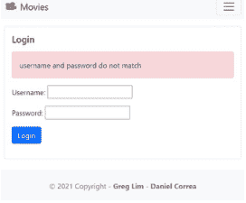

图 22.1

否则，意味着认证成功，我们登录用户并将其重定向到主页。

### /accounts/templates/loginaccount.html

创建新文件 `accounts/templates/loginaccount.html`，并从 `accounts/templates/signupaccount.html` 复制标记，将标签从“Sign Up”改为“Login”：

```


<div class="card mb-3">
  <div class="row g-0">
    <div>
      <div class="card-body">
        <h5 class="card-title">Login</h5>
        
        <div class="alert alert-danger mt-3" role="alert">
          {{ error }}
        </div>
        
        <p class="card-text">
          <form method="POST">
            
            {{ form.as_p }}
            <button type="submit" class="btn btn-primary">Login</button>
          </form>
        </p>
      </div>
    </div>
  </div>
</div>

```

最后，在 *base.html* 中，我们为 *loginaccount* 设置 *href*：

```
...
    
        <a class="nav-link" href="">
            Logout ({{ user.username }})
        </a>
    
        <a class="nav-link" href="">Login</a>
        <a class="nav-link" href="">
            Sign Up
        </a>
    
...
```

我们的导航栏现在完整且功能齐全。对于未登录的用户，导航栏将显示登录和注册链接。当用户登录后，导航栏将只显示登出按钮。在下一章中，我们将实现让登录用户发布电影评论。

## 第23章：允许用户发布电影评论

我们现在将实现让登录用户发布电影评论。我们首先需要创建一个 Review 模型。

在 *movie/models.py* 中，添加以下内容来定义 Review 模型：

```
from django.db import models
from django.contrib.auth.models import User
...

class Review(models.Model):
    text = models.CharField(max_length=100)
    date = models.DateTimeField(auto_now_add=True)
    user = models.ForeignKey(User, on_delete=models.CASCADE)
    movie = models.ForeignKey(Movie, on_delete=models.CASCADE)
    watchAgain = models.BooleanField()

    def __str__(self):
        return self.text
```

### 代码解释

```
text = models.CharField(max_length=100)
```

`text` 字段存储评论文本。

```
date = models.DateTimeField(auto_now_add=True)
```

对于评论日期，我们指定 `auto_now_add=True`。也就是说，当有人创建此对象时，当前日期时间将自动填充。注意，这使得该字段不可编辑。一旦日期时间设置，它就是固定的。

```
user = models.ForeignKey(User, on_delete=models.CASCADE)
movie = models.ForeignKey(Movie, on_delete=models.CASCADE)
```

对于 `user` 和 `movie` 字段，我们使用 `ForeignKey`，它允许多对一关系。这意味着一个用户可以创建多个评论。同样，一部电影也可以有多个评论。对于 `user`，引用的是 Django 提供的用于身份验证的内置 `User` 模型。对于所有多对一关系（如 `ForeignKey`），我们还必须指定 `on_delete` 选项。也就是说，例如，当你删除一个用户或电影时，其关联的评论也将被删除。注意，这不适用于反向情况，即当你删除一个评论时，关联的电影和用户仍然存在。

```
watchAgain = models.BooleanField()
```

最后，我们有一个布尔属性 *watchAgain*，供用户表示他们是否会再次观看这部电影。

### 注册到管理后台

为了让我们的 Review 模型出现在管理后台中，记住我们必须通过在 /movie/admin.py 中添加以下**加粗**部分来注册它：

```
from django.contrib import admin
from .models import Movie, Review

admin.site.register(Movie)
admin.site.register(Review)
```

在终端中，使用以下命令为新模型创建迁移：

```
python3 manage.py makemigrations
```

然后使用以下命令将更改应用到 sqlite3 数据库：

```
python3 manage.py migrate
```

在下一章中，我们将了解如何让用户在网站上发布电影评论。

## 第 24 章：创建评论

我们已经了解了如何从管理后台创建模型对象，例如创建一个 *电影* 对象。但是，我们如何允许用户创建自己的对象，例如让用户从网站发布评论呢？毕竟，并非每个人都应该有权访问管理后台。

让我们为他们创建一个页面来完成此操作。我们首先在 `/movie/urls.py` 中创建一个路径：

```
from django.urls import path
from . import views

urlpatterns = [
    path('<int:movie_id>', views.detail, name='detail'),
    path('<int:movie_id>/create', views.createreview, name='createreview'),
]
```

/movie/views.py

然后在 `/movie/views.py` 中，添加以下 `def createreview`：

```
...
from django.shortcuts import get_object_or_404, redirect
from .models import Movie, Review
from .forms import ReviewForm
...

def createreview(request, movie_id):
    movie = get_object_or_404(Movie,pk=movie_id)
    if request.method == 'GET':
        return render(request, 'createreview.html',
            {'form':ReviewForm(), 'movie': movie})
    else:
        try:
            form = ReviewForm(request.POST)
            newReview = form.save(commit=False)
            newReview.user = request.user
            newReview.movie = movie
            newReview.save()
            return redirect('detail', newReview.movie.id)
        except ValueError:
            return render(request, 'createreview.html',
                {'form':ReviewForm(),'error':'bad data passed in'})
```

### 代码解释

```
movie = get_object_or_404(Movie,pk=movie_id)
```

我们首先从数据库中获取电影对象。

```
if request.method == 'GET':
    return render(request, 'createreview.html',
        {'form':ReviewForm(), 'movie': movie})
```

当我们收到 GET 请求时，意味着用户正在导航到创建评论页面，我们渲染 *createreview.html* 并传入评论表单供用户创建评论。我们稍后将展示如何创建评论表单。

```
else:
    try:
```

当用户提交 *createreview* 表单时，此函数将收到一个 POST 请求，我们进入 *else* 子句。

```
form = ReviewForm(request.POST)
```

我们从请求中检索提交的表单。

```
newReview = form.save(commit=False)
```

我们根据表单的值创建并保存一个新的评论对象，但尚未将其放入数据库（*commit=False*），因为我们想要为评论指定用户和电影的关系。

```
newReview.user = request.user
newReview.movie = movie
newReview.save()
```

```
return redirect('detail', newReview.movie.id)
```

最后，我们为评论指定用户和电影的关系，并将评论保存到数据库中。然后我们将用户重定向回电影的详情页面。

```
except ValueError:
    return render(request, 'createreview.html',
        {'form':ReviewForm(),'error':'bad data passed in'})
```

如果传入的数据有任何错误，我们将再次渲染 *createreview.html* 并传入错误消息。接下来让我们创建 *createreview.html* 页面。

/movie/createreview.html

在 /movie/templates 中，创建一个新文件 *createreview.html*，包含以下代码：

```


<div class="card mb-3">
    <div class="row g-0">
        <div>
            <div class="card-body">
                <h5 class="card-title">Add Review for {{ movie.title }}</h5>
                
                <div class="alert alert-danger mt-3" role="alert">
                    {{ error }}
                </div>
                
                <p class="card-text">
                    <form method="POST">
                        
                        {{ form.as_p }}
                        <button type="submit" class="btn btn-primary">
                            Add Review
                        </button>
                    </form>
                </p>
            </div>
        </div>
    </div>
</div>

```

如你所见，*createreview.html* 与其他页面非常相似。那么让我们继续，看看如何创建评论表单。

### *ReviewForm*

要创建评论表单，我们可以利用 Django 提供的 *ModelForm* 来自动从模型创建表单。在 */movie* 中，创建文件 *forms.py* 并填入以下代码：

```
from django.forms import ModelForm, Textarea
from .models import Review

class ReviewForm(ModelForm):
    def __init__(self, *args, **kwargs):
        super(ModelForm, self).__init__(*args, **kwargs)
        self.fields['text'].widget.attrs.update(
            {'class': 'form-control'})
        self.fields['watchAgain'].widget.attrs.update(
            {'class': 'form-check-input'})

    class Meta:
        model = Review
        fields = ['text','watchAgain']
        labels = {
            'watchAgain': ('Watch Again')
        }
        widgets = {
            'text': Textarea(attrs={'rows': 4}),
        }
```

### 代码解释

```
class ReviewForm(ModelForm):
```

我们需要继承自 ModelForm。

```
def __init__(self, *args, **kwargs):
    super(ModelForm, self).__init__(*args, **kwargs)
    self.fields['text'].widget.attrs.update(
        {'class': 'form-control'})
    self.fields['watchAgain'].widget.attrs.update(
        {'class': 'form-check-input'})
```

类似于我们对 *UserCreationForm* 所做的，我们为表单字段设置一些 Bootstrap 类。

```
class Meta:
    model = Review
    fields = ['text','watchAgain']
```

然后我们指定表单对应的模型以及我们希望在表单中包含的字段。在我们的例子中，评论表单只需要 *text* 和 *watchAgain* 字段。如果你还记得，我们的 Review 模型：

```
class Review(models.Model):
    text = models.CharField(max_length=100)
    date = models.DateTimeField(auto_now_add=True)
    user = models.ForeignKey(User,on_delete=models.CASCADE)
    movie = models.ForeignKey(Movie,on_delete=models.CASCADE)
    watchAgain = models.BooleanField()
```

date 是自动填充的，user 和 movie 已经提供了。因此，我们只需要用户在表单中输入 *text* 和 *watchAgain* 字段。

```
labels = {
    'watchAgain': ('Watch Again')
}
```

我们有一个 labels 对象，可以为每个字段创建自定义标签。例如，我们希望显示 ‘ Watch Again ’ 而不是 *watchAgain*（我们的用户不是程序员！）。

```
widgets = {
    'text': Textarea(attrs={'rows': 4}),
}
```

默认情况下，CharField 显示为输入文本。我们覆盖此默认字段（使用 widgets）为文本字段使用 Textarea。

有关 ModelForms 的更多信息，你可以查看 Django 文档 https://docs.djangoproject.com/en/3.2/topics/forms/modelforms/

/movie/templates/detail.html

最后，我们在电影详情页面中使用以下 **粗体** 代码渲染一个 ‘ Add Review ’ 按钮：

```
...
<div class="card-body">
    <h5 class="card-title">{{ movie.title }}</h5>
    <p class="card-text">{{ movie.description }}</p>
    <p class="card-text">
        
            <a href="{{ movie.url }}" class="btn btn-primary">
                Movie Link
            </a>
        
        
            <a href="" class="btn btn-primary">
                Add Review
            </a>
        
    </p>
</div>
...
```

注意，我们将 ‘Add Review’ 链接包含在一个 **if user.is_authenticated** 块中。这是为了确保我们只允许登录用户添加评论。未登录的用户将不会看到 ‘Add Review’ 链接。

### 运行你的应用

登录，进入一部电影并点击 ‘Add Review’（图 24.1）。

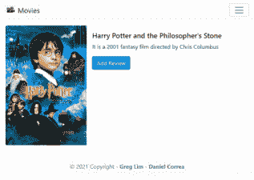

图 24.1

你将看到 Django 为你自动生成的评论表单（图 24.2）！

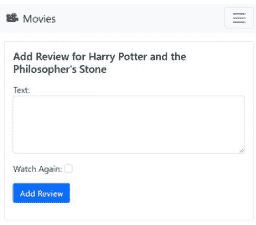

图 24.2

添加评论后，你可以在管理后台查看，它将会反映出来。在下一章中，我们将了解如何在电影详情页面中列出评论。

## 第25章：列出评论

现在，我们想在电影详情页面（图25.1）列出一部电影的评论。

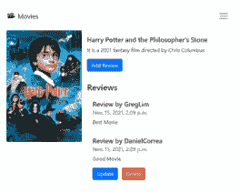

图25.1

为此，在 `/movie/views.py` 的 `*def detail*` 函数中，添加**粗体**部分的代码：

```
def detail(request, movie_id):
    movie = get_object_or_404(Movie, pk=movie_id)
    **reviews = Review.objects.filter(movie=movie)**
    return render(request, 'detail.html',
                 {'movie': movie, '**reviews**': reviews})
```

### 代码解释

```
reviews = Review.objects.filter(movie=movie)
```

使用 `*filter*` 函数，我们仅检索特定电影的评论。

```
return render(request, 'detail.html',
    {'movie': movie, 'reviews': reviews})
```

然后我们将 `*reviews*` 传递给 `detail.html`。

`*/movie/templates/detail.html*`

我们通过添加**粗体**部分的代码，在电影的卡片组件下列出评论：

```
...
<div class="card-body">
    <h5 class="card-title">{{ movie.title }}</h5>
    <p class="card-text">{{ movie.description }}</p>
    <p class="card-text">
        ...
    </p>
    <hr />
    <h3>Reviews</h3>
    <ul class="list-group">
        
        <li class="list-group-item pb-3 pt-3">
            <h5 class="card-title">
                Review by {{ review.user.username }}
            </h5>
            <h6 class="card-subtitle mb-2 text-muted">
                {{ review.date }}
            </h6>
            <p class="card-text">{{ review.text }}</p>
            
                <a class="btn btn-primary me-2">Edit</a>
                <a class="btn btn-danger">Delete</a>
            
        </li>
        
    </ul>
</div>
...
```

### 代码解释

```
<ul class="list-group">
  
  <li class="list-group-item pb-3 pt-3">
    ...
  </li>
  
</ul>
```

使用 `*for 循环*`，我们为每条评论渲染一个 Bootstrap 列表组项组件（[https://getbootstrap.com/docs/5.1/components/list-group/](https://getbootstrap.com/docs/5.1/components/list-group/)）。

```
<h5 class="card-title">
  Review by {{ review.user.username }}
</h5>
<h6 class="card-subtitle mb-2 text-muted">
  {{ review.date }}
</h6>
<p class="card-text">{{ review.text }}</p>
```

我们渲染用户名、评论日期和评论文本。

```

    <a class="btn btn-primary me-2" href="#">Update</a>
    <a class="btn btn-danger" href="#">Delete</a>

```

我们还检查用户是否已登录，以及评论是否属于该用户，如果是，则渲染更新和删除链接，允许她更新/删除评论。否则，我们隐藏更新/删除链接，即用户只能更新/删除自己发布的评论。他们无法对其他人的评论执行此操作。

### 运行你的应用

在电影详情页面，你现在将能够看到一部电影的评论。如果你已登录，你可以看到你发布的评论的更新和删除按钮（图25.2）。


图25.2

当你登出时，你就看不到它们了。在接下来的几章中，我们将继续实现 `*updatereview*` 和 `*deletereview*` 函数。

## 第26章：更新评论

我们在 `/movie/urls.py` 中创建一个用于更新评论的 URL 路径：

```
...

urlpatterns = [
    path('<int:movie_id>', views.detail, name='detail'),
    path('<int:movie_id>/create', views.createreview, name='createreview'),
    path('review/<int:review_id>', views.updatereview, name='updatereview'),
]
```

该路径接收评论 ID（评论的主键）。例如 `localhost:8000/movie/review/2`。

然后在 `/movie/views.py` 中，我们添加 `def updatereview`：

```
...

def updatereview(request, review_id):
    review = get_object_or_404(Review, pk=review_id, user=request.user)
    if request.method == 'GET':
        form = ReviewForm(instance=review)
        return render(request, 'updatereview.html',
            {'review': review, 'form': form})
    else:
        try:
            form = ReviewForm(request.POST, instance=review)
            form.save()
            return redirect('detail', review.movie.id)
        except ValueError:
            return render(request, 'updatereview.html',
                {'review': review, 'form': form, 'error': 'Bad data in form'})
```

### 代码解释

```
review = get_object_or_404(Review, pk=review_id, user=request.user)
```

我们首先使用评论 ID 检索评论对象。我们还提供了登录用户，以确保其他用户无法访问该评论，例如，如果他们手动在浏览器中输入 URL 路径。只有创建此评论的用户才能更新/删除它。

```
if request.method == 'GET':
    form = ReviewForm(instance=review)
    return render(request, 'updatereview.html',
        {'review': review, 'form': form})
```

如果请求类型是 GET，意味着他们是从电影详情页面导航到此页面的。因此，我们渲染之前在创建评论时使用的 `ReviewForm`，但这次，我们将评论对象传递给表单，以便表单的字段将用对象的值填充，供用户编辑。看看 Django 的 `*ModelForm*` 为我们节省了多少工作！

```
else:
    try:
        form = ReviewForm(request.POST, instance=review)
        form.save()
        return redirect('detail', review.movie.id)
```

在 `*else*` 块中，即请求类型是 POST，意味着用户正在尝试提交更新表单。我们从表单中检索值并执行 `*form.save()*` 以更新现有评论。然后我们重定向回电影详情页面。

```
except ValueError:
    return render(request, 'updatereview.html',
        {'review': review, 'form': form, 'error': 'Bad data in form'})
```

如果用户提供的内容有问题，我们使用 `*ValueError*` 异常来捕获它。

### `/movie/templates/updatereview.html`

我们创建一个新文件 `/movie/templates/updatereview.html` 并填入以下内容：

```


<div class="card mb-3">
  <div class="row g-0">
    <div>
      <div class="card-body">
        <h5 class="card-title">
          Update Review for {{ review.movie.title }}
        </h5>
        
        <div class="alert alert-danger mt-3" role="alert">
          {{ error }}
        </div>
        
        <p class="card-text">
          <form method="POST">
            
            {{ form.as_p }}
            <button type="submit" class="btn btn-primary">
              Update Review
            </button>
          </form>
        </p>
      </div>
    </div>
  </div>
</div>

```

同样，上面的标记与其他模板文件类似。看看 Django 如何极大地简化了我们的模板和表单创建！

`/movie/templates/detail.html`

最后，回到 `*detail.html*`，我们将 `‘updatereview’` URL 添加到更新按钮。

```
...

    <a class="btn btn-primary me-2"
       href="">
        Update
    </a>
    <a class="btn btn-danger" href="#">Delete</a>

...
```

### 运行你的应用

当我们运行应用并尝试更新评论时，表单将出现，并且将填充现有评论的值（图26.1）。

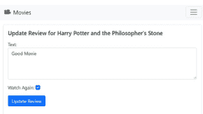

图26.1

用新值更新评论，提交表单后，更新后的评论将反映在电影详情页面中。

## 第27章：删除评论

在实现了评论更新之后，我们现在来实现评论删除。在 `/movie/urls.py` 中创建一个用于删除评论的新路径（你现在应该对此很熟悉了）：

```
urlpatterns = [
    path('<int:movie_id>', views.detail, name='detail'),
    path('<int:movie_id>/create', views.createreview, name='createreview'),
    path('review/<int:review_id>', views.updatereview, name='updatereview'),
    path('review/<int:review_id>/delete', views.deletereview, name='deletereview')
]
```

并在 `/movie/views.py` 中添加 `def deletereview`：

```
def deletereview(request, review_id):
    review = get_object_or_404(Review, pk=review_id, user=request.user)
```

### 运行你的应用

现在运行你的应用，登录并进入特定电影页面，用户将能够删除他们发布的评论。

## 第28章：授权

我们已经实现了身份验证，允许用户注册和登录。但我们还需要授权，即仅授权已登录用户访问特定页面。

目前，如果用户手动输入创建评论的网址，例如 [http://localhost:8000/movie/2/create](http://localhost:8000/movie/2/create)，他们仍然可以访问该表单。我们应该仅授权已登录用户访问创建/更新/删除评论的功能。我们同样授权访问*登出*功能。

为此，我们导入并为需要授权的视图添加 `@login_required` 装饰器，如**粗体**所示：

/movie/views.py

```
...
from .forms import ReviewForm
from django.contrib.auth.decorators import login_required
...

@login_required
def createreview(request, movie_id):
    ...

@login_required
def updatereview(request, review_id):
    ...

@login_required
def deletereview(request, review_id):
    ...
```

/accounts/views.py

```
...
from django.db import IntegrityError
from django.contrib.auth.decorators import login_required
...

@login_required
def logoutaccount(request):
    ...
```

我们还需要在 /moviereviews/settings.py 的末尾添加：

```
...
LOGIN_URL = 'loginaccount'
```

这会在用户（未登录）尝试访问受保护页面时，将其重定向到登录页面。

现在运行你的应用，确保你已登出并访问创建评论页面，例如 [http://localhost:8000/movie/2/create](http://localhost:8000/movie/2/create)，你将被重定向到登录页面。

* 你可以在 www.greglim.co/p/django 获取完成项目的源代码。

## 第29章：部署

我们的项目目前运行在本地机器上。为了让我们的网站在真实的公共互联网上供全世界使用，我们需要将其部署到实际的服务器上。一种流行的方法是将我们的 Django 项目部署到 PythonAnywhere。首先，对于小型网站，它是免费使用的。

要将我们的代码放到 PythonAnywhere 上，我们需要将代码放在像 GitHub 或 Bitbucket 这样的代码共享网站上。在本章中，我们将使用 GitHub。如果你已经熟悉将代码上传到 GitHub，请跳过以下部分。否则，你可以跟着操作。

### GitHub 和 Git

在本节中，我们仅涵盖将代码移动到 GitHub 的必要步骤。我们不会涵盖关于 Git 和 GitHub 的所有细节（已经有整本书专门讲述这些内容！）。

访问 *github.com*，如果你没有账户，请注册一个。要将你的项目放到 GitHub 上，你需要为它创建一个仓库。通过点击右上角的 '+' 并选择 'New repository'（图 29.1）来创建一个新仓库。

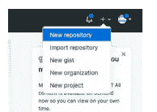

图 29.1

为你的仓库命名，例如 *moviereviews*。选择 'public' 单选框，然后点击 'Create repository'。

我们将开始将代码移动到 GitHub。在你本地机器的终端中，确保你已安装 *git*，方法是运行：*git*

那么，Git 是什么？Git 是一个项目版本控制系统，在开发领域非常流行。它允许我们在代码中设置保存点（Git 称之为 *commits*）。

如果我们在项目的任何时候犯了错误，我们可以回到项目正常工作的先前保存点。Git 还允许多个开发人员一起处理项目，而不用担心一个人覆盖另一个人的代码。

当你在终端中运行 *git* 时，如果你看到 Git 命令列表，说明你已安装 Git。如果没有看到，你需要安装 Git。访问 Git 网站 ([https://git-scm.com/](https://git-scm.com/)) 并按照说明安装 Git。安装 Git 后，你可能需要关闭并重新打开终端，然后在其中输入 *git* 以确保它已安装。

在你的项目文件夹中，输入：

```
git init
```

*git init* 将你的文件夹标记为一个 Git 项目，你可以开始跟踪更改。一个隐藏文件夹 *.git* 被添加到项目文件夹中。*.git* 文件夹存储了 Git 作为你项目历史的一部分所使用和创建的所有对象和引用。

接下来，运行：

```
git add -A
```

这会将你项目中的所有内容添加到暂存环境中，以便在提交到正式历史记录之前准备一个快照。继续运行以下命令进行提交：

```
git commit -m "first message"
```

这会在你的代码中创建一个保存点。你可以通过提供的描述性消息来识别不同的提交。接下来，我们想将我们的 Git 项目保存到 GitHub 上。

在 GitHub 的仓库页面，复制 *git remote add origin <origin path>* 命令并在终端中运行它。例如：

```
git remote add origin https://github.com/greglim81/moviereviews.git
```

这会创建一个到远程仓库的新连接记录。要将代码从你的本地计算机移动到 GitHub，运行：

```
git push -u origin main
```

这会将代码推送到 GitHub。当你重新加载 GitHub 仓库页面时，你的项目代码将反映在那里。

*请注意，Git 和 GitHub 还有更多内容。我们只是涵盖了将代码上传到 GitHub 的必要步骤。至此，我们已经将代码放到了 GitHub 上。接下来，我们将把代码克隆到 PythonAnywhere 上。

### 将代码克隆到 PythonAnywhere

在 PythonAnywhere 上部署现有 Django 项目的步骤可以在 https://help.pythonanywhere.com/pages/DeployingDjango 找到，但我将在这里与你一起过一遍。

既然我们的代码已经在 GitHub 上，我们将让 PythonAnywhere 从那里获取我们的代码。首先，在这里创建一个初学者免费账户：https://www.pythonanywhere.com/registration

在 PythonAnywhere 中，点击 'New console' -> 'Bash' 以访问其 Linux 终端（图 29.2）。

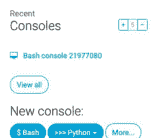

图 29.2

回到你的 GitHub 仓库，点击 'Code' 并复制克隆的 URL（图 29.3）。

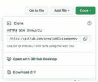

图 29.3

要克隆，回到 PythonAnywhere Bash，运行：*git clone <粘贴 url>*，例如

```
git clone https://github.com/greglim81/djangomoviereviews.git
```

这将从 GitHub 仓库获取你的所有代码，并在 PythonAnywhere 中克隆它。克隆完成后，你可以在 bash 中执行 'ls'，你会看到与你在机器上看到的相同的文件夹。

### 虚拟环境

虚拟环境用于为具有不同需求的不同项目创建独立的开发环境。例如，你可以指定在特定虚拟环境中安装哪个版本的 Python 以及哪些库/模块。

例如，要在 PythonAnywhere bash 中创建一个虚拟环境，我们运行：

```
mkvirtualenv -p python3.8 <environment name>
```

在上面，我们指定了在虚拟环境中使用 Python 3.8。我们安装的任何包都将始终存在，并且独立于其他虚拟环境。

如果我运行：

```
mkvirtualenv -p python3.8 moviereviewsenv
```

我将在 Bash 中看到虚拟环境的名称，这意味着我们处于 VE 中，例如：

```
(moviereviewsenv) 00:08 ~ $
```

回到我们的虚拟环境中，我们需要安装 Django 和 Pillow（就像我们在开发环境中所做的那样）。因此运行：

```
pip install django pillow
```

### 设置你的 Web 应用

此时，你需要准备好 3 条信息：

1.  你的 Django 项目顶层文件夹的路径——即包含 "manage.py" 的文件夹。一个简单的方法是，在 bash 中进入你的项目文件夹，输入 *pwd*。例如：/home/greglim/djangomoviereviews
2.  你的项目名称（包含你的 settings.py 的文件夹名称），例如 *moviereviews*
3.  你的虚拟环境名称，例如 *moviereviewsenv*

### 通过手动配置创建 Web 应用

在你的浏览器中，打开一个新标签页并访问 PythonAnywhere 控制面板。点击 ‘ Web ’ 标签页（图 29.4）。

控制台 文件 **Web** 任务 数据库

### 图 29.4

点击 ‘ Add a new web app ’。在 ‘ Select a Python Web framework ’ 下，选择 ‘ Manual Configuration ’（图 29.5）。

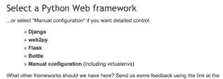

### 图 29.5

注意：确保你选择的是 ‘Manual Configuration’，而不是 ‘Django’ 选项，后者仅适用于新项目。

选择正确的 Python 版本（与你创建虚拟环境时使用的版本相同）。

### 输入你的虚拟环境名称

在 *Virtualenv* 部分输入你的虚拟环境名称（图 29.6）。

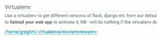

### 图 29.6

你可以直接使用其短名称 "moviereviewsenv"，它会自动补全为 /home/username/.virtualenvs 下的完整路径。

### 输入你的代码路径

接下来，在 *Code* 部分输入你的项目文件夹路径，包括 ‘ Source code ’ 和 ‘ Working directory ’（图 29.7）：

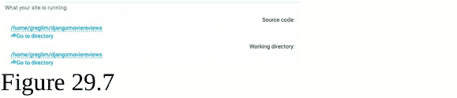

### 图 29.7

### 编辑你的 WSGI 文件

在 ‘ Code ’ 部分内的 *wsgi.py* 文件中（图 29.8 - 不是你本地 Django 项目文件夹中的那个），

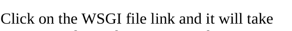

### 图 29.8

点击 WSGI 文件链接，它会带你到一个编辑器，你可以在那里修改它。

删除除 Django 部分以外的所有内容，并取消该部分的注释。你的 WSGI 文件将如下所示：

```
# +++++++++++++ DJANGO +++++++++++++
# To use your own Django app use code like this:
import os
import sys

path = '/home/greglim/djangomoviereviews/'
if path not in sys.path:
    sys.path.append(path)

os.environ['DJANGO_SETTINGS_MODULE'] = 'moviereviews.settings'

# then:
from django.core.wsgi import get_wsgi_application
application = get_wsgi_application()
```

### 代码解释

```
path = '/home/greglim/djangomoviereviews/'
```

请务必替换为你项目的正确路径，即包含 *manage.py* 的文件夹，

```
os.environ['DJANGO_SETTINGS_MODULE'] = 'moviereviews.settings'
```

确保你为 DJANGO_SETTINGS_MODULE 设置了正确的值并保存文件。

### 退出和进入虚拟环境

任何时候你想退出虚拟环境，在 Bash 中运行 ‘ deactivate ’。要重新进入虚拟环境，运行：workon <虚拟环境名称>

如果你忘记了虚拟环境的名称，你可以通过进入 .virtualenvs 文件夹来查看你拥有的虚拟环境列表：

```
cd .virtualenvs
ls
```

然后你就可以看到虚拟环境列表了。

### 允许的主机

接下来，我们需要在 settings.py 中添加允许的主机。转到 ‘ Files ’ 标签页，浏览源代码目录，在 settings.py 中添加：

```
ALLOWED_HOSTS = ['*']
```

保存文件。然后转到 ‘ Web ’ 标签页，点击你的域名对应的 Reload 按钮（图 29.9）。

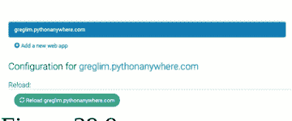

ALLOWED_HOSTS 设置代表我们的 Django 站点可以服务哪些主机/域名。这是一种安全措施，用于防止 HTTP Host 头攻击。我们使用了通配符星号 * 来表示所有域名都是可接受的。在你的生产项目中，你可以明确列出允许的域名。

访问你的项目 URL（它是上一张图片中的蓝色链接），主页现在应该显示了！我们快完成了！但请注意，*static* 和 *media* 图片仍然没有显示。我们将在下一节中解决这个问题。

### 静态文件

让我们解决静态和媒体图片不显示的问题。在 *settings.py* 中，我们需要添加以下**粗体**内容并删除一行：

```
...
STATIC_URL = '/static/'
**STATIC_ROOT = os.path.join(BASE_DIR,'static')**

# Default primary key field type
# https://docs.djangoproject.com/en/3.2/ref/settings/#default-auto-field

DEFAULT_AUTO_FIELD = 'django.db.models.BigAutoField'

MEDIA_ROOT = os.path.join(BASE_DIR,'media')
MEDIA_URL = '/media/'

STATICFILES_DIRS = [
    ~~os.path.join(BASE_DIR, "static"),~~
    'moviereviews/static/',
]
```

STATIC_ROOT 变量定义了一个中心位置，我们将所有静态文件收集到该位置。

保存文件，然后回到 bash 控制台（在虚拟环境中），运行：

```
python manage.py collectstatic
```

此命令会从你的每个应用文件夹（包括管理应用的静态文件）以及你在 *settings.py* 中指定的任何其他文件夹中收集所有静态文件，并将它们复制到 STATIC_ROOT。每次你想发布静态文件的新版本时，都需要重新运行此命令。

### 设置静态文件映射

接下来，设置一个静态文件映射，让我们的 Web 服务器为你提供静态文件服务。

在 PythonAnywhere 控制面板的 *Web* 标签页下，在 ‘ Static Files ’ 部分，在 url 部分输入与 STATIC_URL 相同的 URL（通常是 /static/）

在 path 部分输入 STATIC_ROOT 的路径（图 29.10 - 完整路径，包括 /home/username/etc）

| URL | 目录 |
|---|---|
| /static/ | /home/greglim/djangomovieviews/static |

### 图 29.10

然后点击 Reload，你的静态图片现在应该会出现在你的网站中。

### 设置媒体文件映射

设置一个类似的静态文件映射，从 MEDIA_URL 到 MEDIA_ROOT（图 29.11）。

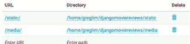

### 图 29.11

点击 Reload，你的媒体图片现在应该会出现在你的网站中（图 29.12）。

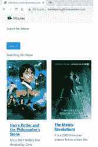

### 图 29.12

### 将 Debug 设置为 False

对于本地开发，我们设置了 DEBUG=True。这会向我们显示详细的错误描述以及它来自哪一行代码。然而，在生产环境中，我们应该隐藏这些信息（我们不想将所有秘密暴露在公开场合），方法是设置 DEBUG=False。

因此，在 PythonAnywhere 控制面板中，转到你的项目的 *settings.py* 并设置 DEBUG = False。

### 创建超级用户

记得在你的生产环境中创建一个超级用户（就像我们在开发环境中所做的那样），并妥善保管密码。

### .gitignore

在上传到 GitHub 时，我们可以忽略一些文件。例如，当 Django 运行 .py 文件时自动创建的 __pycache__ 目录。我们也应该忽略 db.sqlite3 文件，因为它可能会被意外推送到生产环境。如果你使用的是 Mac，我们可以忽略 *.DS_Store*，它存储了关于 MacOS 文件夹设置的信息。

所以最终的 *.gitignore* 将如下所示：

```
__pycache__/
db.sqlite3
.DS_Store
```

### 将 *db.sqlite3* 更改为 MySQL 或 PostgreSQL

我们当前的数据库设置为 SQLite，这对于小型项目来说运行良好。但是当项目或数据规模增长时，我们希望切换到其他数据库，如 MySQL 或 PostgreSQL。

PythonAnywhere 允许免费使用 MySQL。但对于 PostgreSQL，你需要有一个付费账户。

要开始使用 MySQL，你可以参考 PythonAnywhere 简洁而有用的文档 (https://help.pythonanywhere.com/pages/UsingMySQL)。

注意：在你设置好 MySQL 或任何其他数据库之后，因为它是一个全新的数据库，你将需要创建一个新的超级用户 (*python manage.py createsuperuser*) 并运行 makemigrations/migrate 命令：

```
python manage.py makemigrations
python manage.py migrate
```

## 结语

我们已经涵盖了相当多的内容，旨在让你掌握创建 Django 全栈应用的技能。我们介绍了 Django 的主要功能：模板、视图、URL、用户认证、授权、模型和部署。你现在拥有了使用 Django 构建自己网站的知识。我们评论应用中的 CRUD 功能在许多 Web 应用中都很常见。例如，你已经拥有了创建博客、待办事项列表或购物车 Web 应用的所有工具。

希望你喜欢这本书，并愿意从我这里学到更多。我将

我们非常期待您的反馈，了解您喜欢和不喜欢的地方，以便我们改进。

请随时通过[support@iducate.com](mailto:support@iducate.com)给我发送电子邮件，以获取本书的更新版本。

如果您不喜欢这本书，或者觉得我应该涵盖某些额外的主题，请发邮件告诉我们。正是有了像您这样的读者，这本书才能变得更好。

如果您喜欢这本书，如果您能为我们留下评论，我将不胜感激。祝您在Django开发的学习之旅中一切顺利！

## 关于作者

Greg Lim是一位技术专家，也是多本编程书籍的作者。Greg在高等教育机构教授编程多年，特别强调通过实践来学习。

通过[support@i-ducate.com](mailto:support@i-ducate.com)或[http://www.greglim.co/](http://www.greglim.co/)联系Greg。

## 关于合著者

Daniel Correa是一名研究员，从事软件开发工作多年。Daniel拥有计算机科学博士学位；目前他是哥伦比亚EAFIT大学的教授。他对软件架构、框架（如Laravel、Django、Express、Vue、React、Angular等）、Web开发和整洁代码感兴趣。

Daniel在Twitter上非常活跃；他分享关于软件开发的技巧并评论软件工程书籍。在Twitter上通过@danielgarax联系Daniel。

> "Hecho en Medellín"